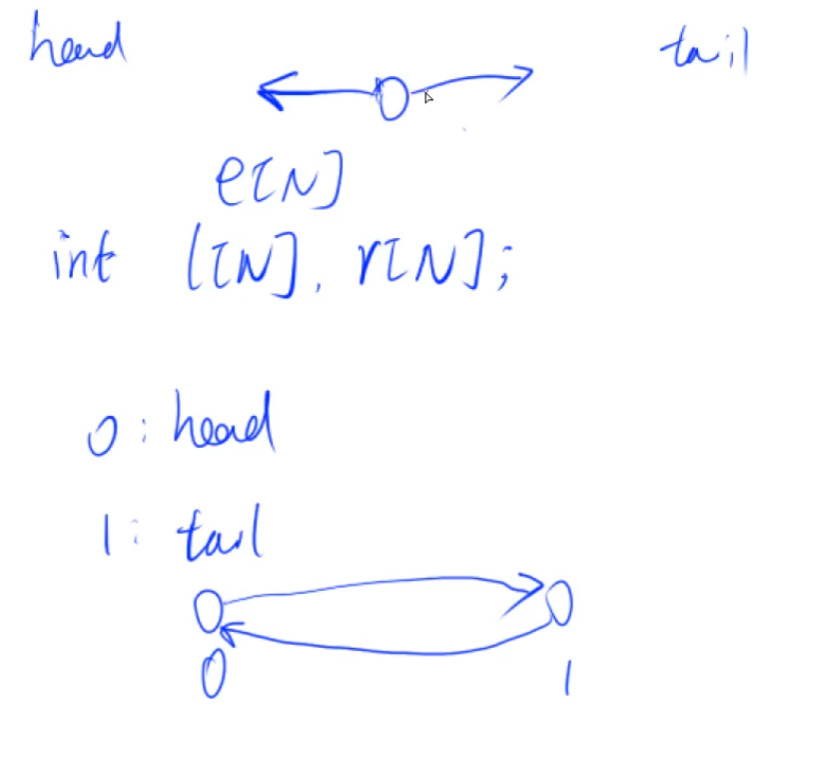

## 离散化

在很多情况下，问题的范围虽然定义在整数集合Z，但是只涉及其中m个有限数值，并且与数值的绝对大小无关（只把这些数值作为代表，或只与它们的相对顺序有关）。此时，我们就可以把整数集合Z中的这m个整数与1～m建立映射关系。

也就是说：有一个数组A，值域很大：$0-10^9$，个数很少：$0-10^4$

通俗来讲，离散化就是把无限空间中有限的个体映射到有限的空间中去，以此提高算法的时空效率。

**算法流程**：

- 排序
- A[]种可能由重复元素  **去重**
- 如何算出x离散化后的值(即在A中的下标是多少)  **二分**

模板：

cpp版本

```java
vector<int> alls; // 存储所有待离散化的值
sort(alls.begin(), alls.end());//将所有值排序
alls.erase(unique(alls.begin(), alls.end()),alls.end());// 去掉重复元素
//unique:c++的库函数

// 二分求出x对应的离散化的值
int find(int x)//找到大于等于x的位置
{
    int l = 0, r = alls.size() - 1;
    while (l < r)
    {
        int mid = l + r >> 1;
        if (alls[mid] >= x) r = mid;
        else l = mid + 1;
    }
    return r + 1;//映射到1……n
}
```

java版本

```java
// 排序
alls.sort(new Comparator<Integer>() {
    @Override
    public int compare(Integer o1, Integer o2) {
        return o1-o2;
    }
});
// java 没有unique函数，需要自己实现一下
public static List<Integer> unique(List<Integer> A){
    List<Integer> res = new ArrayList<>();
    res.add(A.get(0));
    for (int i = 1;i < A.size();i++){
        if (A.get(i) == A.get(i-1)) continue;
        res.add(A.get(i));
    }
    return res;
}
```


**例题**：区间和

假定有一个无限长的数轴，数轴上每个坐标上的数都是 0。

现在，我们首先进行 n 次操作，每次操作将某一位置 x 上的数加 c。

接下来，进行 m 次询问，每个询问包含两个整数 l 和 r，你需要求出在区间 $[l,r]$ 之间的所有数的和。

```java
import java.io.*;
import java.util.*;

public class Main {
    public static List<Integer> unique(List<Integer> A){
        List<Integer> res = new ArrayList<>();
        res.add(A.get(0));
        for (int i = 1;i < A.size();i++){
            if (A.get(i) == A.get(i-1)) continue;
            res.add(A.get(i));
        }
        return res;
    }

    public static int find(int x,List<Integer> uniqueAlls ){
        int l = 0,r = uniqueAlls.size()-1;
        while (l < r){
            int mid = (l + r) >> 1;
            if (uniqueAlls.get(mid) >= x) r = mid;
            else l = mid + 1;
        }
        return r+1;
    }

    public static void main(String[] args) throws IOException {
        int [] a = new int[300005];
        int [] s = new int[300005];
        List<Integer> alls = new ArrayList<>();
        List<int []> query = new ArrayList<>();
        List<int []> adds =new ArrayList<>();

        InputStreamReader in = new InputStreamReader(System.in);
        BufferedReader bf = new BufferedReader(in);
        String [] ins = bf.readLine().split(" ");
        int n = Integer.parseInt(ins[0]);
        int m = Integer.parseInt(ins[1]);
        for (int i = 0;i < n;i++){
            ins = bf.readLine().split(" ");
            int x = Integer.parseInt(ins[0]);
            int c = Integer.parseInt(ins[1]);
            adds.add(new int[]{x,c});
            alls.add(x);
        }
        for (int i = 0;i < m;i++){
            ins = bf.readLine().split(" ");
            int l = Integer.parseInt(ins[0]);
            int r = Integer.parseInt(ins[1]);
            query.add(new int[]{l,r});
            // 查询的下标也要加入！！
            alls.add(l);
            alls.add(r);
        }
        // 排序
        alls.sort(new Comparator<Integer>() {
            @Override
            public int compare(Integer o1, Integer o2) {
                return o1-o2;
            }
        });
        // 去重
        List<Integer> uniqueAlls = unique(alls);
        // 处理插入
        for (int i = 0;i < adds.size();i++){
            int x = find(adds.get(i)[0],uniqueAlls);
            a[x] += adds.get(i)[1];
        }
        // 预处理前缀和
        for (int i = 1; i <= uniqueAlls.size();i++){
            s[i] = s[i-1] + a[i];
        }
        // 处理查询
        for (int i = 0;i < query.size();i++){
            int l = find(query.get(i)[0],uniqueAlls),r = find(query.get(i)[1],uniqueAlls);
            System.out.println(s[r] - s[l-1]);
        }
    }
}
```


**例题**：格子染色（美团面试题）


## 区间合并

快速的把n个有交集的区间合并

**特殊规定**：两个区间仅仅有端点相交也进行合并

**算法步骤**：

1. 将所有区间按照**左端点排序**

2. 扫描所有区间，将有交集的区间合并

   - 当前区间和下一个区间的关系只有三种情况

     

     第一种情况：区间长度不变

     第二种情况：合并，长度边长

     第三种情况：将当前区间放到答案中去

**例题**：

给定 n 个区间 $[l_i,r_i]$，要求合并所有有交集的区间。

注意如果在端点处相交，也算有交集。

输出合并完成后的区间个数。

例如：$[1,3]$ 和 $[2,6]$ 可以合并为一个区间 $[1,6]$。

```java
import java.io.*;
import java.util.*;

public class Main {
    public static List<int []> merge(List<int []> list){
        List<int []> ans = new ArrayList<>();
        // 先按照左边界排序
        list.sort(new Comparator<int[]>() {
            @Override
            public int compare(int[] o1, int[] o2) {
                return o1[0] - o2[0];
            }
        });
        int st = (int)-2e9,ed = (int)-2e9;
        for (int i = 0;i < list.size();i++){
            if (ed < list.get(i)[0]){
                // 遇到了情况3
                if (st != (int)-2e9) ans.add(new int[]{st,ed}); // 特殊判断一下初始值，只要不是最初的区间，加入答案
                // 更新当前区间
                st = list.get(i)[0];
                ed = list.get(i)[1];
            }else{
                // 直接合并了情况1和情况2，两者直接取较大的哪个右边界即可
                ed = Math.max(ed,list.get(i)[1]);
            }
        }
        if (st != (int)-2e9) ans.add(new int[]{st,ed});
        return ans;
    }
    public static void main(String[] args) throws IOException {
        InputStreamReader in = new InputStreamReader(System.in);
        BufferedReader bf = new BufferedReader(in);
        List<int []> list = new ArrayList<>();
        int n = Integer.parseInt(bf.readLine());
        for (int i = 0;i < n;i++){
            String [] ins = bf.readLine().split(" ");
            int l = Integer.parseInt(ins[0]);
            int r = Integer.parseInt(ins[1]);
            list.add(new int[]{l,r});
        }
        List<int[]> ans = merge(list);
        System.out.println(ans.size());
    }
}
```


## 链表

数组模拟单链表（邻接表：一般用于存储树和图）

方法简述：

- 一个数组来存 值
- 一个数组来存 指向下一个结点的下标


```java
class myList{
    int [] e;
    int [] ne;
    int head;
    int idx;
    // 初始化构造
    myList(int N){
        e = new int[N];
        ne = new int[N];
        head = -1;
        idx = 0;
    }
    // 头插法
    public void headInsert(int v){
        this.e[idx] = v;
        this.ne[idx] = head;
        this.head = this.idx++;
    }
    // 一般性插入 将x插入至下标是k结点的后面
    public void insert(int v,int k){
        this.e[idx] = v;
        this.ne[idx] = this.ne[k];
        this.ne[k] = idx++;
    }
    // 删除下标是k的后面的结点
    public void remove(int k ){
        if (k == -1) this.head = this.ne[this.head];
        else this.ne[k] = this.ne[this.ne[k]];
    }
}
```

例题：

实现一个单链表，链表初始为空，支持三种操作：

1. 向链表头插入一个数；
2. 删除第 kk 个插入的数后面的数；
3. 在第 kk 个插入的数后插入一个数。

现在要对该链表进行 MM 次操作，进行完所有操作后，从头到尾输出整个链表。

**注意**:题目中第 kk 个插入的数并不是指当前链表的第 kk 个数。例如操作过程中一共插入了 nn 个数，则按照插入的时间顺序，这 nn 个数依次为：第 11 个插入的数，第 22 个插入的数，…第 nn 个插入的数。

**输入格式**：

第一行包含整数 MM，表示操作次数。

接下来 MM 行，每行包含一个操作命令，操作命令可能为以下几种：

1. `H x`，表示向链表头插入一个数 xx。
2. `D k`，表示删除第 kk 个插入的数后面的数（当 kk 为 00 时，表示删除头结点）。
3. `I k x`，表示在第 kk 个插入的数后面插入一个数 xx（此操作中 kk 均大于 00）。

**输出格式**：

共一行，将整个链表从头到尾输出。

```java
import java.io.*;
import java.util.*;

class myList{
    int [] e;
    int [] ne;
    int head;
    int idx;
    // 初始化构造
    myList(int N){
        e = new int[N];
        ne = new int[N];
        head = -1;
        idx = 0;
    }
    // 头插法
    public void headInsert(int v){
        this.e[idx] = v;
        this.ne[idx] = head;
        this.head = this.idx++;
    }
    // 一般性插入 将x插入至下标是k结点的后面
    public void insert(int v,int k){
        this.e[idx] = v;
        this.ne[idx] = this.ne[k];
        this.ne[k] = idx++;
    }
    // 删除下标是k的后面的结点
    public void remove(int k ){
        if (k == -1) this.head = this.ne[this.head];
        else this.ne[k] = this.ne[this.ne[k]];
    }
}
public class Main {

    public static void main(String[] args) throws IOException {
        InputStreamReader in = new InputStreamReader(System.in);
        BufferedReader bf = new BufferedReader(in);
        myList list = new myList(100005);
        int m = Integer.parseInt(bf.readLine());
        while (m-- > 0){
            String [] ins = bf.readLine().split(" ");
            if (ins[0].equals("H")){
                int val = Integer.parseInt(ins[1]);
                list.headInsert(val);
            }else if (ins[0].equals("D")){
                int k = Integer.parseInt(ins[1]);
                list.remove(k-1);
            }else{
                int k = Integer.parseInt(ins[1]);
                int x = Integer.parseInt(ins[2]);
                list.insert(x,k-1);
            }
        }
        // 打印链表
        for (int i = list.head;i != -1;i = list.ne[i]){
            System.out.print(list.e[i] + " ");
        }
    }
}
```


数组模拟双链表，双链表一般用于来优化某些问题

就是相比单链表多了一个指向前驱结点的数组，则前驱结点和后驱结点的索引分别用`l[]`和`r[]`定位

初始化时为了方便可以让索引为0的结点为头节点、索引为1的结点为尾结点



```java
class Dlist{
    int [] l;
    int [] r;
    int [] e;
    int idx;
    Dlist(int N){
        l = new int[N];
        r = new int[N];
        e = new int[N];
        r[0] = 1;
        l[1] = 0;
        idx = 2;
    }
    // 在第k个点的后面插入一个结点
    public void add(int k,int x){
        e[idx] = x;
        l[idx] = k;
        r[idx] = r[k];
        r[k] = idx;
        l[r[k]] = idx;
        idx ++;
    }

    // 删除第k个点
    public void remove(int k){
        l[r[k]] = l[k];
        r[l[k]] = r[k];
    }
}
```


