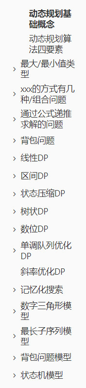
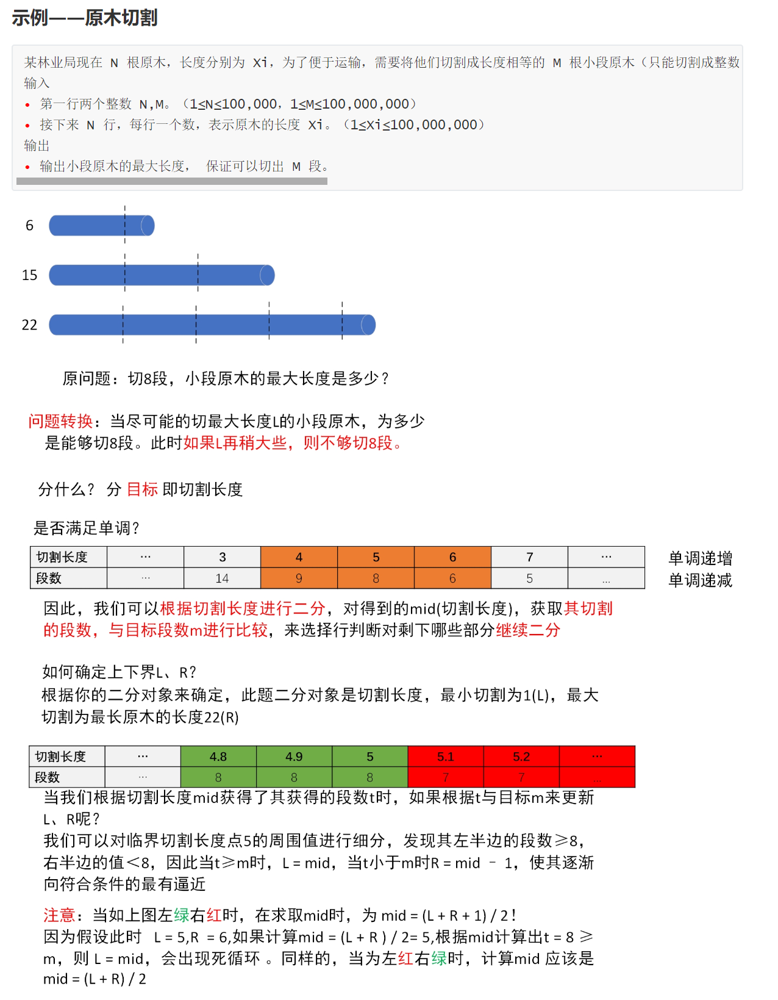

## 🐟的算法📕

这是一个不断更新的算法学习笔记，主要记录了我在学习过程中的一些 笔记 和 心得 [Github地址](https://github.com/mikeyu925/DataStructure-Algorithm)

> 注：如果对你有帮助，给个Star吧~~ 一起学习，一起进步。

每个章节都详细记录了比较重要的内容，以 **动态规划** 章节为例子（这个也是我花费时间最多的一部分），包含了如下几个方面

同样，对于一些比较经典的题目，我也会写上自己的理解和思考过程，以“二分答案”题型为例

> 注：题解内容难免有错误和疏漏，如有问题请指出谢谢~

当然，**目前还不完善，会继续完善的**。

> 注：这些笔记记录了自己的进步和成长，但我也深知自己依旧需要努力。Stay Hungry, Stay Foolish.

## 目录

- ### 数据结构部分

  - [字符串](https://github.com/mikeyu925/DataStructure-Algorithm/blob/master/%E5%AD%97%E7%AC%A6%E4%B8%B2.md)
  - [ 栈 ](https://github.com/mikeyu925/DataStructure-Algorithm/blob/master/%E6%A0%88.md)
  - [链表](https://github.com/mikeyu925/DataStructure-Algorithm/blob/master/%E9%93%BE%E8%A1%A8.md)
  - [队列](https://github.com/mikeyu925/DataStructure-Algorithm/blob/master/%E9%98%9F%E5%88%97.md)
  - [二叉树](https://github.com/mikeyu925/DataStructure-Algorithm/blob/master/%E4%BA%8C%E5%8F%89%E6%A0%91.md)
  - [堆](https://github.com/mikeyu925/DataStructure-Algorithm/blob/master/%E5%A0%86.md)
  - [图](https://github.com/mikeyu925/DataStructure-Algorithm/blob/master/%E5%9B%BE.md)
  - [并查集](https://github.com/mikeyu925/DataStructure-Algorithm/blob/master/%E5%B9%B6%E6%9F%A5%E9%9B%86.md)
  - [树状数组](https://github.com/mikeyu925/DataStructure-Algorithm/blob/master/%E6%A0%91%E7%8A%B6%E6%95%B0%E7%BB%84.md)
  - [ST表](https://github.com/mikeyu925/DataStructure-Algorithm/blob/master/ST%E8%A1%A8.md)
  - [线段树](https://github.com/mikeyu925/DataStructure-Algorithm/blob/master/%E7%BA%BF%E6%AE%B5%E6%A0%91.md)
  - [前缀树](https://github.com/mikeyu925/DataStructure-Algorithm/blob/master/%E5%89%8D%E7%BC%80%E6%A0%91.md)
  - [数据结构应用题](https://github.com/mikeyu925/DataStructure-Algorithm/blob/master/%E6%95%B0%E6%8D%AE%E7%BB%93%E6%9E%84%E5%BA%94%E7%94%A8%E9%A2%98.md)

- ### 算法部分

  - [二分](https://github.com/mikeyu925/DataStructure-Algorithm/blob/master/%E4%BA%8C%E5%88%86%E6%B3%95.md)
  - [搜索](https://github.com/mikeyu925/DataStructure-Algorithm/blob/master/%E6%90%9C%E7%B4%A2.md)
  - [回溯](https://github.com/mikeyu925/DataStructure-Algorithm/blob/master/%E5%9B%9E%E6%BA%AF.md)
  - [递归](https://github.com/mikeyu925/DataStructure-Algorithm/blob/master/%E9%80%92%E5%BD%92.md)
  - [动态规划](https://github.com/mikeyu925/DataStructure-Algorithm/blob/master/%E5%8A%A8%E6%80%81%E8%A7%84%E5%88%92.md)
  - [贪心](https://github.com/mikeyu925/DataStructure-Algorithm/blob/master/%E8%B4%AA%E5%BF%83.md)
  - [双指针](https://github.com/mikeyu925/DataStructure-Algorithm/blob/master/%E5%8F%8C%E6%8C%87%E9%92%88.md)
  - [滑动窗口](https://github.com/mikeyu925/DataStructure-Algorithm/blob/master/%E6%BB%91%E5%8A%A8%E7%AA%97%E5%8F%A3.md)
  - [数学](https://github.com/mikeyu925/DataStructure-Algorithm/blob/master/%E6%95%B0%E5%AD%A6.md)
  - [位运算](https://github.com/mikeyu925/DataStructure-Algorithm/blob/master/%E4%BD%8D%E8%BF%90%E7%AE%97.md)
  - [排序算法详解](https://github.com/mikeyu925/DataStructure-Algorithm/blob/master/%E5%9B%BE%E8%A7%A3%E5%8D%81%E5%A4%A7%E6%8E%92%E5%BA%8F%E7%AE%97%E6%B3%95.md)
  - [前缀和与差分](https://github.com/mikeyu925/DataStructure-Algorithm/blob/master/%E5%89%8D%E7%BC%80%E5%92%8C%E4%B8%8E%E5%B7%AE%E5%88%86.md)

- ### 其他

  - [每日一题](https://github.com/mikeyu925/DataStructure-Algorithm/blob/master/%E5%BF%AB%E4%B9%90%E7%9A%84%E6%AF%8F%E6%97%A5%E4%B8%80%E9%A2%98.md)

    > 主要记录LC等上的每日一题中比较好的题目，不定时更新..

  - [有趣的竞赛](https://github.com/mikeyu925/DataStructure-Algorithm/blob/master/%E6%9C%89%E8%B6%A3%E7%9A%84%E7%AB%9E%E8%B5%9B.md)

    > 主要记录自己参加竞赛过程中遇到的比较好的题目

  - [🗡指Offer系列](https://github.com/mikeyu925/DataStructure-Algorithm/blob/master/%F0%9F%97%A1%E6%8C%87Offer%E7%B3%BB%E5%88%97.md)

