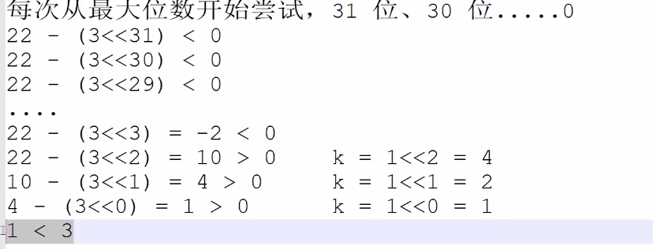
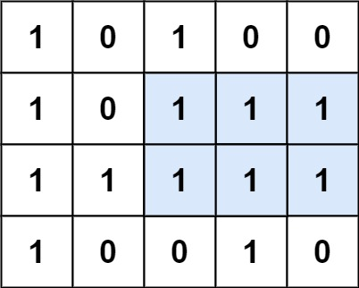

#### 整数除法

给定两个整数 `a` 和 `b` ，求它们的除法的商 `a/b` ，要求不得使用乘号 `'*'`、除号 `'/'` 以及求余符号 `'%'` 。 

**注意：**

- 整数除法的结果应当截去（`truncate`）其小数部分，例如：`truncate(8.345) = 8` 以及 `truncate(-2.7335) = -2`
- 假设我们的环境只能存储 32 位有符号整数，其数值范围是 `[−231, 231−1]`。本题中，如果除法结果溢出，则返回 `231 − 1`

```
输入：a = 7, b = -3
输出：-2
解释：7/-3 = truncate(-2.33333..) = -2
```

位运算：



```go
func divide(a int, b int) int {
    if a == math.MinInt32 && b == -1{
        return math.MaxInt32
    }
    sign := 1
    if a > 0 && b < 0 || a < 0 && b > 0{
        sign = -1
    }

    a = abs(a)
    b = abs(b)
    
    ans := 0
    for i := 31;i >= 0;i--{
        if (a >> i) - b >= 0{
            a -= (b << i)
            ans += (1 << i)
        }
    }
    return ans * sign
}

func abs(a int) int{
    if a < 0{
        return -a
    }
    return a
}
```

#### 二进制加法

给定两个 01 字符串 `a` 和 `b` ，请计算它们的和，并以二进制字符串的形式输出。

输入为 **非空** 字符串且只包含数字 `1` 和 `0`。

**示例 1:**

```
输入: a = "11", b = "10"
输出: "101"
```

题目解析：

- 长串作为a串
- 字符串强转`[]byte`
- 字符串逆序
- 相加 「注意a长b短情况，要继续对a和进位值相加」
- 逆序结果返回

```go
func addBinary(a string, b string) string {
	// a串作为长串
	if len(a) < len(b) {
		a, b = b, a
	}
	// 强转
	ca := []byte(a)
	cb := []byte(b)

	reverse(ca)
	reverse(cb)

	n, m := len(a), len(b)
	add := 0
	i, j := 0, 0
	for i < n && j < m {
		t := (int(ca[i]-'0') + int(cb[j]-'0') + add) / 2
		ca[i] = (byte((int(ca[i]-'0')+int(cb[j]-'0')+add)%2) + '0')
		add = t
		i++
		j++
	}
	for ; i < n; i++ {
		t := (int(ca[i]-'0') + add) / 2
		ca[i] = (byte((int(ca[i]-'0')+add)%2) + '0')
		add = t
	}
	if add == 1 {
		ca = append(ca, byte('1'))
	}
	reverse(ca)
	return string(ca)
}

func reverse(s []byte) {
	n := len(s)
	for i, j := 0, n-1; i < j; {
		s[i], s[j] = s[j], s[i]
		i++
		j--
	}
}
```

#### 前n个数字二进制中1的个数

给定一个非负整数 `n` ，请计算 `0` 到 `n` 之间的每个数字的二进制表示中 1 的个数，并输出一个数组。

**示例 1:**

```
输入: n = 2
输出: [0,1,1]
解释: 
0 --> 0
1 --> 1
2 --> 10
```

动态规划

```go
func countBits(n int) []int {
    dp := make([]int,n+1)
    for i := 1;i <= n;i++{
        dp[i] = dp[i & (i - 1)] + 1 
    }
    return dp
}
```

#### 只出现一次的数字

给你一个整数数组 `nums` ，除某个元素仅出现 **一次** 外，其余每个元素都恰出现 **三次 。**请你找出并返回那个只出现了一次的元素。

**示例 1：**

```
输入：nums = [2,2,3,2]
输出：3
```

位运算：

除了只出现一次的数字，其他数字每位为1的个数一定是3的整数倍

```go
func singleNumber(nums []int) int {
    var ans int32 = 0 // 声明为int32是因为防止仅仅出现一次的数为负数
    for i := 31;i >= 0;i--{
        cnt := 0
        for _,v := range nums{
            cnt += (v >> i) & 1
        }
        cnt = cnt % 3
        if cnt == 1{
            ans = ans | (1 << i)
        }
    }
    return int(ans)
}
```


#### 单词长度的最大乘积

给定一个字符串数组 `words`，请计算当两个字符串 `words[i]` 和 `words[j]` 不包含相同字符时，它们长度的乘积的最大值。假设字符串中只包含英语的小写字母。如果没有不包含相同字符的一对字符串，返回 0。

**示例 1:**

```
输入: words = ["abcw","baz","foo","bar","fxyz","abcdef"]
输出: 16 
解释: 这两个单词为 "abcw", "fxyz"。它们不包含相同字符，且长度的乘积最大。
```

位运算、字符串压缩「由于只包含小写字母」

时间复杂度：O(n ^ 2)   空间复杂度：O(n)

```go
func maxProduct(words []string) int {
    n := len(words)
    masks := make([]int,n)
    for idx,word := range words{
        m := len(word)
        val := 0
        for i := 0;i < m;i++{
            val = val | (1 << int(word[i] - 'a'))
        }
        masks[idx] = val
    }
    ans := 0
    for i,v := range masks{
        for j := i + 1;j < n;j++{
            if v & masks[j] == 0{
                ans = max(ans,len(words[i]) * len(words[j]))
            }
        }
    }
    return ans
}

func max(a,b int )int{
    if a < b{return  b};return a
}
```

#### 排序数组中两个数字之和

给定一个已按照 **升序排列** 的整数数组 `numbers` ，请你从数组中找出两个数满足相加之和等于目标数 `target` 。

函数应该以长度为 `2` 的整数数组的形式返回这两个数的下标值*。*`numbers` 的下标 **从 0 开始计数** ，所以答案数组应当满足 `0 <= answer[0] < answer[1] < numbers.length` 。

假设数组中存在且只存在一对符合条件的数字，同时一个数字不能使用两次。

**示例 1：**

```
输入：numbers = [1,2,4,6,10], target = 8
输出：[1,3]
解释：2 与 6 之和等于目标数 8 。因此 index1 = 1, index2 = 3 。
```

**双指针**

时间复杂度：O(n)  空间复杂度：O(1)

```go
func twoSum(numbers []int, target int) []int {
    n := len(numbers)
    l,r := 0,n-1
    for ;l < r;{
        if numbers[l] + numbers[r] == target{
            break
        }else if numbers[l] + numbers[r] < target{
            l++
        }else{
            r--
        }
    }
    return []int{l,r}
}
```

#### 数组中和为 0 的三个数

给你一个整数数组 `nums` ，判断是否存在三元组 `[nums[i], nums[j], nums[k]]` 满足 `i != j`、`i != k` 且 `j != k` ，同时还满足 `nums[i] + nums[j] + nums[k] == 0` 。请

你返回所有和为 `0` 且不重复的三元组。

**注意：**答案中不可以包含重复的三元组。

**示例 1：**

```
输入：nums = [-1,0,1,2,-1,-4]
输出：[[-1,-1,2],[-1,0,1]]
解释：
nums[0] + nums[1] + nums[2] = (-1) + 0 + 1 = 0 。
nums[1] + nums[2] + nums[4] = 0 + 1 + (-1) = 0 。
nums[0] + nums[3] + nums[4] = (-1) + 2 + (-1) = 0 。
不同的三元组是 [-1,0,1] 和 [-1,-1,2] 。
注意，输出的顺序和三元组的顺序并不重要。
```

题目解析：

先排序 + 双指针

注意考虑边界

时间复杂度： O(n^2)  空间复杂度：O(n)

```go
func threeSum(nums []int) [][]int {
    n := len(nums)
    sort.Slice(nums,func(i,j int) bool {
        return nums[i] < nums[j]
    }) // 升序排序 O(n logn)
  	ans := make([][]int,0) // ans := [][]int{}
    
    for i := 0;i < n;i++{
      // 优化1: 如果 nums[i] > 0 了，后面显然就不可能成立
        if nums[i] > 0{
            break
        }
      // 避免重复 
        if i > 0 && nums[i] == nums[i-1]{
            continue
        }
        l,r := i + 1,n - 1
        for ;l < r;{
          // 避免重复 注意考虑边界
            if l > i + 1  && l < n && nums[l] == nums[l-1]{
                l++
                continue
            }
            if l >= r {
                break
            }
            if nums[l] + nums[r] == -nums[i]{
                ans = append(ans,[]int{nums[i],nums[l],nums[r]})
                l++
            }else if nums[l] + nums[r] < -nums[i]{
                l++
            }else{
                r--
            }
        }
    }
    return ans
}
```

#### 和大于等于 target 的最短子数组

给定一个含有 `n` 个正整数的数组和一个正整数 `target` **。**

找出该数组中满足其和 `≥ target` 的长度最小的 **连续子数组** `[numsl, numsl+1, ..., numsr-1, numsr]` ，并返回其长度**。**如果不存在符合条件的子数组，返回 `0` 。

**示例 1：**

```
输入：target = 7, nums = [2,3,1,2,4,3]
输出：2
解释：子数组 [4,3] 是该条件下的长度最小的子数组。
```

滑动窗口

```go
func minSubArrayLen(target int, nums []int) int {
    n := len(nums)
    l,r := 0,0
    windowVal := 0
    ans := 0x3f3f3f3f
    for r < n{
        windowVal += nums[r]
        for l <= r && windowVal >= target{
            ans = min(ans,r - l + 1)
            windowVal -= nums[l]
            l++
        }
        r++
    }
    if ans == 0x3f3f3f3f{
        return 0
    }
    return ans
}

func min(a,b int) int{
    if a < b{
        return a
    }
    return b
}
```


#### 乘积小于K的子数组

给定一个正整数数组 `nums`和整数 `k` ，请找出该数组内乘积小于 `k` 的连续的子数组的个数。 

**示例 1:**

```
输入: nums = [10,5,2,6], k = 100
输出: 8
解释: 8 个乘积小于 100 的子数组分别为: [10], [5], [2], [6], [10,5], [5,2], [2,6], [5,2,6]。
需要注意的是 [10,5,2] 并不是乘积小于100的子数组。
```

滑动窗口：**「当时没想出来，重点看一下」**

对于`[i,j]`，我们固定 j，如果 对于 i > p ，[i,j]的乘积小于k，并且 对于 i <= p,[i,j]乘积大于等于 k,则对于任意的 r > j，都存在 [i,r]的i不能小于等于p 「相当于枚举了右端点」

时间复杂度：O(n)  空间复杂度:O(1)

```go
func numSubarrayProductLessThanK(nums []int, k int) int {
    n := len(nums)
    if k == 0{
        return 0
    }
    ans := 0
    winVal,l := 1,0
    // 枚举窗口的右边界
    for r := 0;r < n;r++{
        winVal *= nums[r]
        // 缩小窗口至满足条件
        for l <= r && winVal >= k{
            winVal /= nums[l]
            l++
        }
        // 累加 以 nums[r] 结尾且符合条件的子数组
        ans += r - l + 1
    }

    return ans
}
```

#### 和为 k 的子数组

给定一个整数数组和一个整数 `k` **，**请找到该数组中和为 `k` 的连续子数组的个数。

**示例 1：**

```
输入:nums = [1,1,1], k = 2
输出: 2
解释: 此题 [1,1] 与 [1,1] 为两种不同的情况
```

题目解析：

前缀和 + 哈希表

时间：O(n) 空间：O(n)

```go
func subarraySum(nums []int, k int) int {
    n := len(nums)
    cnt := map[int]int{} // 记录有val个前缀和为key
    cnt[0] = 1 // 空数组相当于和为0
    sum := 0
    ans := 0
    for i := 0;i < n;i++{
        sum += nums[i]
        v := sum - k
        if c,ok := cnt[v]; ok{
            ans += c
        }
        cnt[sum] ++
    }
    return ans
}
```


####  0 和 1 个数相同的子数组

给定一个二进制数组 `nums` , 找到含有相同数量的 `0` 和 `1` 的最长连续子数组，并返回该子数组的长度。

**示例 1：**

```
输入: nums = [0,1]
输出: 2
说明: [0, 1] 是具有相同数量 0 和 1 的最长连续子数组。
```

将 0 看成 - 1，然后题目等价于求连续子数组和为0 的最长长度，和上题类似

时间：O(n) 空间：O(n)

```go
//   |----|--|
//     v   0

func findMaxLength(nums []int) int {
    n := len(nums)
    first := map[int]int{} // 第一次出现key的下标val
    first[0] = -1 // 初始化
    sum := 0
    ans := 0
    for i := 0;i < n;i++{
        if nums[i] == 0{
            sum--
        }else{
            sum++
        }
      // 如果之前出现该值，则说明另一段值的和就是0
        if idx,ok := first[sum];ok{
            ans = max(ans,i - idx)            
        }else{
            first[sum] = i
        }
    }
    return ans
}
func max(a,b int)int{
    if a < b{return b};return a
}
```


#### 左右两边子数组的和相等

给你一个整数数组 `nums` ，请计算数组的 **中心下标** 。

数组 **中心下标** 是数组的一个下标，其左侧所有元素相加的和等于右侧所有元素相加的和。

如果中心下标位于数组最左端，那么左侧数之和视为 `0` ，因为在下标的左侧不存在元素。这一点对于中心下标位于数组最右端同样适用。

如果数组有多个中心下标，应该返回 **最靠近左边** 的那一个。如果数组不存在中心下标，返回 `-1` 。

**示例 1：**

```
输入：nums = [1,7,3,6,5,6]
输出：3
解释：
中心下标是 3 。
左侧数之和 sum = nums[0] + nums[1] + nums[2] = 1 + 7 + 3 = 11 ，
右侧数之和 sum = nums[4] + nums[5] = 5 + 6 = 11 ，二者相等。
```

前缀和：

时间复杂度: O(n) 空间：O(1)

```go
func pivotIndex(nums []int) int {
    n := len(nums)
    if n == 1{
        return 1
    }
    sum := 0
    for _,v := range nums{
        sum += v
    }
    nows := 0
    i := 0
    for ;i < n;i++{
        if sum - nums[i] - nows == nows{
            break
        }
        nows += nums[i]
    }
    if i == n{
        return - 1
    }
    return i
}
```

#### 二维子矩阵的和

给定一个二维矩阵 `matrix`，以下类型的多个请求：

- 计算其子矩形范围内元素的总和，该子矩阵的左上角为 `(row1, col1)` ，右下角为 `(row2, col2)` 。

实现 `NumMatrix` 类：

- `NumMatrix(int[][] matrix)` 给定整数矩阵 `matrix` 进行初始化
- `int sumRegion(int row1, int col1, int row2, int col2)` 返回左上角 `(row1, col1)` 、右下角 `(row2, col2)` 的子矩阵的元素总和。

**示例 1：**


```
输入: 
["NumMatrix","sumRegion","sumRegion","sumRegion"]
[[[[3,0,1,4,2],[5,6,3,2,1],[1,2,0,1,5],[4,1,0,1,7],[1,0,3,0,5]]],[2,1,4,3],[1,1,2,2],[1,2,2,4]]
输出: 
[null, 8, 11, 12]

解释:
NumMatrix numMatrix = new NumMatrix([[3,0,1,4,2],[5,6,3,2,1],[1,2,0,1,5],[4,1,0,1,7],[1,0,3,0,5]]]);
numMatrix.sumRegion(2, 1, 4, 3); // return 8 (红色矩形框的元素总和)
numMatrix.sumRegion(1, 1, 2, 2); // return 11 (绿色矩形框的元素总和)
numMatrix.sumRegion(1, 2, 2, 4); // return 12 (蓝色矩形框的元素总和)
```

题目解析：

创建的前缀和矩阵的大小为：(n+1) * (m+1) 比较好

```go
type NumMatrix struct {
    presum [][]int
}

func Constructor(matrix [][]int) NumMatrix {
    n,m := len(matrix),len(matrix[0])
    numMatrix := NumMatrix{}
    numMatrix.presum = make([][]int,n+1)
    for i := 0;i <= n;i++{
        numMatrix.presum[i] = make([]int,m+1)
    }
    for i := 1;i <= n;i++{
        for j := 1;j <= m;j++{
            numMatrix.presum[i][j] = numMatrix.presum[i][j-1] + numMatrix.presum[i-1][j] - numMatrix.presum[i-1][j-1] + matrix[i-1][j-1];
        }
    }
    return numMatrix
}


func (this *NumMatrix) SumRegion(row1 int, col1 int, row2 int, col2 int) int {
    return this.presum[row2+1][col2+1] - this.presum[row2+1][col1] - this.presum[row1][col2+1] + this.presum[row1][col1]
}
```


#### 字符串中的变位词

给定两个字符串 `s1` 和 `s2`，写一个函数来判断 `s2` 是否包含 `s1` 的某个变位词。

换句话说，第一个字符串的排列之一是第二个字符串的 **子串** 。 

**示例 1：**

```
输入: s1 = "ab" s2 = "eidbaooo"
输出: True
解释: s2 包含 s1 的排列之一 ("ba").
```

题目解析：

```go
func checkInclusion(s1 string, s2 string) bool {
    n,m := len(s1),len(s2)
    if n > m{
        return false
    }

    // O(n)
    cnt := make([]int,26)
    for i := 0;i < n;i++{
        cnt[s1[i] - 'a']--
        cnt[s2[i] - 'a']++
    }
    diff := 0
    // O(26)
    for _,v := range cnt{
        if v != 0{
            diff++
        }
    }
    if diff == 0{
        return true
    }
    // O(m - n)
    for i := n;i < m;i++{
        x,y := s2[i] - 'a',s2[i - n] - 'a'
        if x == y{
            continue
        }
        if cnt[x] == 0{
            diff++
        }
        cnt[x]++
        if cnt[x] == 0{
            diff--
        }

        if cnt[y] == 0{
            diff++
        }
        cnt[y]--

        if cnt[y] == 0{
            diff--
        }
        
        if diff == 0{
            return true
        }
        
    }
    return false
    
}
```


#### 字符串中的所有变位词

给定两个字符串 `s` 和 `p`，找到 `s` 中所有 `p` 的 **变位词** 的子串，返回这些子串的起始索引。不考虑答案输出的顺序。

**变位词** 指字母相同，但排列不同的字符串。 

**示例 1：**

```
输入: s = "cbaebabacd", p = "abc"
输出: [0,6]
解释:
起始索引等于 0 的子串是 "cba", 它是 "abc" 的变位词。
起始索引等于 6 的子串是 "bac", 它是 "abc" 的变位词。
```

题目解析：

方法同上一题一样：

```go
func findAnagrams(s string, p string) []int {
    ans := []int{}
    n,m := len(s),len(p)
    if n < m{
        return ans
    }

    cnt := make([]int,26)
    for i := 0;i < m;i++{
        cnt[s[i] - 'a']++
        cnt[p[i] - 'a']--
    }

    diff := 0
    for _, v := range cnt{
        if v != 0{
            diff ++
        }
    }
    
    if diff == 0{
        ans = append(ans,0)
    }

    for i := m;i < n;i++{
        x,y := s[i] - 'a',s[i - m] - 'a'
        if cnt[x] == 0{
            diff++
        }
        cnt[x] ++
        if cnt[x] == 0{
            diff--
        }
        
        if cnt[y] == 0{
            diff++
        }   
        cnt[y] --
        if cnt[y] == 0{
            diff--
        }

        if diff == 0{
            ans = append(ans, i - m + 1)
        }
    }
    return ans
}
```


#### 不含重复字符的最长子字符串

给定一个字符串 `s` ，请你找出其中不含有重复字符的 **最长连续子字符串** 的长度。

**示例 1:**

```
输入: s = "abcabcbb"
输出: 3 
解释: 因为无重复字符的最长子字符串是 "abc"，所以其长度为 3。
```

哈希表 + 滑动窗口

```go
func lengthOfLongestSubstring(s string) int {
    n := len(s)
    l, r := 0,0
    cnt := map[int]int{}
    ans := 0

    for r < n{
        cnt[int(s[r] - 'a')]++
        for cnt[int(s[r] - 'a')] > 1{
            cnt[int(s[l] - 'a')]--
            l++
        }
        ans = max(ans,r - l + 1)
        r++
    }
    return ans
}

func max(a,b int) int{
    if a < b{
        return b
    }
    return a
}
```


#### 含有所有字符的最短字符串

给定两个字符串 `s` 和 `t` 。返回 `s` 中包含 `t` 的所有字符的最短子字符串。如果 `s` 中不存在符合条件的子字符串，则返回空字符串 `""` 。

如果 `s` 中存在多个符合条件的子字符串，返回任意一个。

**注意：** 对于 `t` 中重复字符，我们寻找的子字符串中该字符数量必须不少于 `t` 中该字符数量。

**示例 1：**

```
输入：s = "ADOBECODEBANC", t = "ABC"
输出："BANC" 
解释：最短子字符串 "BANC" 包含了字符串 t 的所有字符 'A'、'B'、'C'
```

滑动窗口

```go
func minWindow(s string, t string) string {
    n := len(s)
    m := len(t)
    if n < m{
        return ""
    }
    cntt := map[byte]int{}
    cnts := map[byte]int{}
    ans := 0x3f3f3f3f
    start := -1
  // 时间复杂度 O(C) C是字符集大小
    check := func() bool{
        for k,v := range cntt{
            if cnts[k] < v{
                return false
            }
        }
        return true
    }

    for i := 0;i < len(t);i++{
        cntt[t[i]]++
    }
    
    l,r := 0,0
  // 时间复杂度 O(n)
    for r < n{
        cnts[s[r]]++
        if check(){
            for check() {
                cnts[s[l]]--
                l++
            }
            len := r - l + 2
            if len < ans{
                ans = len
                start = l - 1
            }
        }
        r++
    }
    if start == -1{
        return ""
    }
    ss := make([]byte,ans)
    for i := start;i < start + ans;i++{
        ss[i - start] = s[i]
    }
    return string(ss)
}
```


#### 有效的回文

给定一个字符串 `s` ，验证 `s` 是否是 **回文串** ，只考虑字母和数字字符，可以忽略字母的大小写。

本题中，将空字符串定义为有效的 **回文串** 。 

**示例 1:**

```
输入: s = "A man, a plan, a canal: Panama"
输出: true
解释："amanaplanacanalpanama" 是回文串
```

```go
func isPalindrome(s string) bool {
    n := len(s)
    l,r := 0,n-1
    s = strings.ToLower(s)
    // fmt.Println(s)
    for l < r{
        for l < r && !((s[l] >= 'a' && s[l] <= 'z') || (s[l] >= '0' && s[l] <= '9')) {
            l++
        }

        for l < r && !((s[r] >= 'a' && s[r] <= 'z') || (s[r] >= '0' && s[r] <= '9')) {
            r--
        }

        if s[l] != s[r]{
            return false
        }
        l++
        r--
    }
    return true
}
```


#### 最多删除一个字符得到回文

给定一个非空字符串 `s`，请判断如果 **最多** 从字符串中删除一个字符能否得到一个回文字符串。

**示例 1:**

```
输入: s = "aba"
输出: true
```

```go
func validPalindrome(s string) bool {
    l,r := 0,len(s) - 1
    for l < r{
        if s[l] != s[r]{
            break
        }
        l++
        r--
    }
    return checkPalindrome(s,l+1,r) || checkPalindrome(s,l,r-1)
}

func checkPalindrome(s string,l,r int) bool{
    for l < r{
        if s[l] != s[r]{
            return false
        }
        l++
        r--
    }
    return true
}
```


#### 回文子字符串的个数

给定一个字符串 `s` ，请计算这个字符串中有多少个回文子字符串。

具有不同开始位置或结束位置的子串，即使是由相同的字符组成，也会被视作不同的子串。

**示例 1：**

```
输入：s = "abc"
输出：3
解释：三个回文子串: "a", "b", "c"
```

```go
func countSubstrings(s string) int {
    n,ans := len(s),0
    for i := 0;i < 2*n - 1;i++{
        l,r := i / 2,i / 2 + i % 2
        for l >= 0 && r < n && s[l] == s[r]{
            l--
            r++
            ans ++   
        }
    }
    return ans
}
```


#### 删除链表倒数第n个结点

给定一个链表，删除链表的倒数第 `n` 个结点，并且返回链表的头结点。

**示例 1：**


```
输入：head = [1,2,3,4,5], n = 2
输出：[1,2,3,5]
```

```go
/**
 * Definition for singly-linked list.
 * type ListNode struct {
 *     Val int
 *     Next *ListNode
 * }
 */
func removeNthFromEnd(head *ListNode, n int) *ListNode {
    first,second := head,head
    var pre * ListNode = nil
    for n > 0 && second != nil{
        second = second.Next
        n--
    }
    for second != nil{
        second = second.Next
        pre = first
        first = first.Next
    }
    if first == head{
        return head.Next
    }
    pre.Next = first.Next
    
    return head
}
```

#### 链表中环的入口节点

给定一个链表，返回链表开始入环的第一个节点。 从链表的头节点开始沿着 `next` 指针进入环的第一个节点为环的入口节点。如果链表无环，则返回 `null`。

为了表示给定链表中的环，我们使用整数 `pos` 来表示链表尾连接到链表中的位置（索引从 0 开始）。 如果 `pos` 是 `-1`，则在该链表中没有环。**注意，`pos` 仅仅是用于标识环的情况，并不会作为参数传递到函数中。**

**说明：**不允许修改给定的链表。 

**示例 1：**


```
输入：head = [3,2,0,-4], pos = 1
输出：返回索引为 1 的链表节点
解释：链表中有一个环，其尾部连接到第二个节点。
```

```go
/**
 * Definition for singly-linked list.
 * type ListNode struct {
 *     Val int
 *     Next *ListNode
 * }
 */
func detectCycle(head *ListNode) *ListNode {
    // 先判断是否有环 快慢指针
    quick,slow := head,head
    for quick != nil && quick.Next != nil{
        quick = quick.Next.Next
        slow = slow.Next
        if quick == slow{
            // 找入环点 此时 quick = slow
            p := head
            for p != slow{
                p = p.Next
                slow = slow.Next
            }
            return p
        }
    }
    return nil
}

// a + n (b + c) + b = 2 (a + b)
// (n-1)(b + c) + c = a
```

#### 两个链表第一个重合结点

给定两个单链表的头节点 `headA` 和 `headB` ，请找出并返回两个单链表相交的起始节点。如果两个链表没有交点，返回 `null` 。

图示两个链表在节点 `c1` 开始相交**：**

[](https://assets.leetcode-cn.com/aliyun-lc-upload/uploads/2018/12/14/160_statement.png)

题目数据 **保证** 整个链式结构中不存在环。

**注意**，函数返回结果后，链表必须 **保持其原始结构** 。

```go
/**
 * Definition for singly-linked list.
 * type ListNode struct {
 *     Val int
 *     Next *ListNode
 * }
 */
func getIntersectionNode(headA, headB *ListNode) *ListNode {
    p1,p2 := headA,headB
    for p1 != p2 {
        if p1 == nil{
            p1 = headB
        }else{
            p1 = p1.Next
        }

        if p2 == nil{
            p2 = headA
        }else{
            p2 = p2.Next
        }
    }

    return p1
}
```

#### 反转链表

给定单链表的头节点 `head` ，请反转链表，并返回反转后的链表的头节点。

**示例 1：**


```
输入：head = [1,2,3,4,5]
输出：[5,4,3,2,1]
```

```go
/**
 * Definition for singly-linked list.
 * type ListNode struct {
 *     Val int
 *     Next *ListNode
 * }
 */
func reverseList(head *ListNode) *ListNode {
    var pre *ListNode = nil
    now := head
    for now != nil{
        nxt := now.Next
        now.Next = pre
        pre = now
        now = nxt
    }
    return pre
}
```


#### 链表中的两数相加

给定两个 **非空链表** `l1`和 `l2` 来代表两个非负整数。数字最高位位于链表开始位置。它们的每个节点只存储一位数字。将这两数相加会返回一个新的链表。

可以假设除了数字 0 之外，这两个数字都不会以零开头。 

**示例1：**


```
输入：l1 = [7,2,4,3], l2 = [5,6,4]
输出：[7,8,0,7]
```

```go
/**
 * Definition for singly-linked list.
 * type ListNode struct {
 *     Val int
 *     Next *ListNode
 * }
 */
func addTwoNumbers(l1 *ListNode, l2 *ListNode) *ListNode {
    l1 = reverse(l1)
    l2 = reverse(l2)

    ha,hb := l1,l2
    add := 0
    ans := &ListNode{-1,nil}
    tail := ans
    for ha != nil && hb != nil{
        t := (ha.Val + hb.Val + add) / 10

        node := &ListNode{(ha.Val + hb.Val + add) % 10,nil}
        tail.Next = node
        tail = node

        add = t
        ha = ha.Next
        hb = hb.Next
    }

    for ha != nil{
        t := (ha.Val + add) / 10

        node := &ListNode{(ha.Val + add) % 10,nil}
        tail.Next = node
        tail = node

        add = t
        ha = ha.Next
    }


    for hb != nil{
        t := (hb.Val + add) / 10

        node := &ListNode{(hb.Val + add) % 10,nil}
        tail.Next = node
        tail = node

        add = t
        hb = hb.Next
    }

    if add > 0{
        node := &ListNode{add,nil}
        tail.Next = node
        tail = node
    }

    return reverse(ans.Next)

}

func reverse(l * ListNode) * ListNode{
    var pre * ListNode = nil
    now :=  l
    for now != nil{
        nxt := now.Next
        now.Next = pre
        pre = now
        now = nxt
    }    
    return pre
}
```


给定一个单链表 `L` 的头节点 `head` ，单链表 `L` 表示为：

` L0 → L1 → … → Ln-1 → Ln `
请将其重新排列后变为：

```
L0 → Ln → L1 → Ln-1 → L2 → Ln-2 → …
```

不能只是单纯的改变节点内部的值，而是需要实际的进行节点交换。

**示例 1:**


```
输入: head = [1,2,3,4]
输出: [1,4,2,3]
```

```go
/**
 * Definition for singly-linked list.
 * type ListNode struct {
 *     Val int
 *     Next *ListNode
 * }
 */
func reorderList(head *ListNode)  {
    if head.Next == nil{
        return 
    }
  // 找中点
    pre, mid := findMidNode(head)

    pre.Next = nil
    
  // 后半段反转
    h2 := reverse(mid)
    
    ans := &ListNode{-1,nil}
    tail := ans
    h1 := head
    
  // 拼接两个链表
    for h1 != nil && h2 != nil{
        tail.Next = h1
        h1 = h1.Next
        tail = tail.Next
        
        tail.Next = h2
        h2 = h2.Next
        tail = tail.Next
    }
 // 如果奇数个数，h2会多一个结点
    if h2 != nil{
        tail.Next = h2
        tail = tail.Next
    }

}

// 快慢指针找中间结点及其前一个结点
func findMidNode(head *ListNode) ( * ListNode, * ListNode) {
    quick,mid := head,head
    var pre *ListNode = nil
    for quick != nil && quick.Next != nil{
        quick = quick.Next.Next
        pre = mid
        mid = mid.Next
    }
    return pre,mid
}
// 反转链表
func reverse(head * ListNode) * ListNode{
    var pre * ListNode = nil
    now := head
    for now != nil{
        nxt := now.Next
        now.Next = pre
        pre = now
        now = nxt
    }
    return pre
}
```


#### 回文链表

给定一个链表的 **头节点** `head` **，**请判断其是否为回文链表。

如果一个链表是回文，那么链表节点序列从前往后看和从后往前看是相同的。 

**示例 1：**

****

```
输入: head = [1,2,3,3,2,1]
输出: true
```

```go
/**
 * Definition for singly-linked list.
 * type ListNode struct {
 *     Val int
 *     Next *ListNode
 * }
 */
func isPalindrome(head *ListNode) bool {
    if head.Next == nil{
        return true
    }
    pre, mid := findMidNode(head)
    pre.Next = nil
    
    hh := reverse(mid)
    h1,h2 := head,hh
    ispal := true
    // h1 个数 <= h2 个数
    for h1 != nil{
        if h1.Val != h2.Val{
            ispal = false
            break
        }
        h1 = h1.Next
        h2 = h2.Next
    }
    
    pre.Next = reverse(hh)
    return ispal
}

func reverse(head *ListNode) * ListNode{
    var pre * ListNode = nil
    now := head
    for now != nil{
        nxt := now.Next
        now.Next = pre
        pre = now 
        now = nxt
    }
    return pre
}

func findMidNode(head * ListNode) (* ListNode,* ListNode){
    quick,mid := head,head
    var pre * ListNode = nil
    for quick != nil && quick.Next != nil{
        quick = quick.Next.Next
        pre = mid
        mid = mid.Next
    }
    return pre,mid
}
```

#### 展平多级双向链表

多级双向链表中，除了指向下一个节点和前一个节点指针之外，它还有一个子链表指针，可能指向单独的双向链表。这些子列表也可能会有一个或多个自己的子项，依此类推，生成多级数据结构，如下面的示例所示。

给定位于列表第一级的头节点，请扁平化列表，即将这样的多级双向链表展平成普通的双向链表，使所有结点出现在单级双链表中。


**示例 1：**

```
输入：head = [1,2,3,4,5,6,null,null,null,7,8,9,10,null,null,11,12]
输出：[1,2,3,7,8,11,12,9,10,4,5,6]
```

递归

```go
/**
 * Definition for a Node.
 * type Node struct {
 *     Val int
 *     Prev *Node
 *     Next *Node
 *     Child *Node
 * }
 */

func flatten(root *Node) *Node {
    if root == nil{
        return nil
    }
    now := root
    for now != nil{
        if now.Child != nil{
            last := dfs(now.Child)
            var nxt * Node = nil
            if now.Next != nil{
                nxt = now.Next
            }
            chi := now.Child
            now.Next = chi
            chi.Prev = now
            
            last.Next = nxt
            if nxt != nil{
                nxt.Prev = last
            }
            now.Child = nil
        }
        now = now.Next
    }
    return root
}

func dfs(root * Node) * Node {
    now := root
    var pre * Node = nil
    for now != nil{
        if now.Child != nil{
            last := dfs(now.Child)
            var nxt * Node = nil
            if now.Next != nil{
                nxt = now.Next
            }
            chi := now.Child
            now.Next = chi
            chi.Prev = now
            
            last.Next = nxt
            if nxt != nil{
                nxt.Prev = last
            }
            now.Child = nil
        }
        pre = now
        now = now.Next
    }
    return pre
}
```

#### 排序的循环链表

给定**循环单调非递减列表**中的一个点，写一个函数向这个列表中插入一个新元素 `insertVal` ，使这个列表仍然是循环升序的。

给定的可以是这个列表中任意一个顶点的指针，并不一定是这个列表中最小元素的指针。

如果有多个满足条件的插入位置，可以选择任意一个位置插入新的值，插入后整个列表仍然保持有序。

如果列表为空（给定的节点是 `null`），需要创建一个循环有序列表并返回这个节点。否则。请返回原先给定的节点。 

**示例 1：**


```go
/**
 * Definition for a Node.
 * type Node struct {
 *     Val int
 *     Next *Node
 * }
 */

func insert(node *Node, x int) *Node {
    add := &Node{x,nil}
    add.Next = add
    if node == nil{
        return add
    }

    max,min := -0x3fffffff,0x3fffffff
    now := node
    max = Max(max,now.Val)
    min = Min(min,now.Val)
    for now.Next != node{
        max = Max(max,now.Next.Val)
        min = Min(min,now.Next.Val)
        now = now.Next
    }
    fmt.Println(max,min)
    if max == min{
        add.Next = node.Next
        node.Next = add
        return node
    }
    now = node
    for !(now.Val == max && now.Next.Val == min) {
        now = now.Next
    }
    t := now
    for now.Next.Val < x{
        now = now.Next
        if now == t{
            break
        }
    }
    add.Next = now.Next
    now.Next = add
    return node
}

func Max(a,b int)int{
    if a < b {return b}; return a
}

func Min(a,b int)int{
    if a < b {return a}; return b
}
```


#### 插入、删除和随机访问都是 O(1) 的容器

设计一个支持在*平均* 时间复杂度 **O(1)** 下，执行以下操作的数据结构：

- `insert(val)`：当元素 `val` 不存在时返回 `true` ，并向集合中插入该项，否则返回 `false` 。
- `remove(val)`：当元素 `val` 存在时返回 `true` ，并从集合中移除该项，否则返回 `false` 。
- `getRandom`：随机返回现有集合中的一项。每个元素应该有 **相同的概率** 被返回。


```go
type RandomizedSet struct {
    nums []int
    m map[int]int
}


/** Initialize your data structure here. */
func Constructor() RandomizedSet {
    rand.Seed(time.Now().UnixNano())
    return RandomizedSet{[]int{},map[int]int{}}
}


/** Inserts a value to the set. Returns true if the set did not already contain the specified element. */
func (this *RandomizedSet) Insert(val int) bool {
    if _, ok := this.m[val]; ok{
        return false
    }
    this.nums = append(this.nums,val)
    this.m[val] = len(this.nums) - 1
    return true
}


/** Removes a value from the set. Returns true if the set contained the specified element. */
func (this *RandomizedSet) Remove(val int) bool {
    if idx,ok := this.m[val]; !ok{
        return false
    }else{
        last := len(this.nums) - 1
        this.nums[idx] = this.nums[last]
        this.m[this.nums[idx]] = idx
        this.nums = this.nums[0:last]
        delete(this.m,val)
        return true
    }
}


/** Get a random element from the set. */
func (this *RandomizedSet) GetRandom() int {
    return this.nums[rand.Int() % len(this.nums)]
}


/**
 * Your RandomizedSet object will be instantiated and called as such:
 * obj := Constructor();
 * param_1 := obj.Insert(val);
 * param_2 := obj.Remove(val);
 * param_3 := obj.GetRandom();
 */
```


#### 最近最少使用缓存

运用所掌握的数据结构，设计和实现一个 [LRU (Least Recently Used，最近最少使用) 缓存机制](https://baike.baidu.com/item/LRU) 。

实现 `LRUCache` 类：

- `LRUCache(int capacity)` 以正整数作为容量 `capacity` 初始化 LRU 缓存
- `int get(int key)` 如果关键字 `key` 存在于缓存中，则返回关键字的值，否则返回 `-1` 。
- `void put(int key, int value)` 如果关键字已经存在，则变更其数据值；如果关键字不存在，则插入该组「关键字-值」。当缓存容量达到上限时，它应该在写入新数据之前删除最久未使用的数据值，从而为新的数据值留出空间。

**示例：**

```
输入
["LRUCache", "put", "put", "get", "put", "get", "put", "get", "get", "get"]
[[2], [1, 1], [2, 2], [1], [3, 3], [2], [4, 4], [1], [3], [4]]
输出
[null, null, null, 1, null, -1, null, -1, 3, 4]

解释
LRUCache lRUCache = new LRUCache(2);
lRUCache.put(1, 1); // 缓存是 {1=1}
lRUCache.put(2, 2); // 缓存是 {1=1, 2=2}
lRUCache.get(1);    // 返回 1
lRUCache.put(3, 3); // 该操作会使得关键字 2 作废，缓存是 {1=1, 3=3}
lRUCache.get(2);    // 返回 -1 (未找到)
lRUCache.put(4, 4); // 该操作会使得关键字 1 作废，缓存是 {4=4, 3=3}
lRUCache.get(1);    // 返回 -1 (未找到)
lRUCache.get(3);    // 返回 3
lRUCache.get(4);    // 返回 4
```

```go
// 双向循环链表的结点
type Node struct {
	key, value int
	pre, next  *Node
}

type LRUCache struct {
	size, cap  int
	m          map[int]*Node
	head, tail *Node
}

func Constructor(capacity int) LRUCache {
	lru := LRUCache{
		size: 0,
		cap:  capacity,
		m:    map[int]*Node{},
		head: &Node{-1, -1, nil, nil},
		tail: &Node{-1,-1,nil,nil},
	}
	lru.tail.pre = lru.head
	lru.head.next = lru.tail
	return lru
}

func (this * LRUCache) removeNode(now * Node)  {
	now.pre.next = now.next
	now.next.pre = now.pre
}

func (this *LRUCache) moveToHead(now *Node) {
	this.removeNode(now)
	this.addToHead(now)
}

func (this * LRUCache) addToHead(now *Node){
	now.next = this.head.next
	now.pre = this.head
	this.head.next.pre = now
	this.head.next = now
}

func (this * LRUCache) removeTail() * Node {
	node := this.tail.pre
	this.removeNode(node)
	return node
}

func (this *LRUCache) Get(key int) int {
	if now, ok := this.m[key]; !ok {
		return -1
	} else {
		this.moveToHead(now)
		return now.value
	}
}

func (this *LRUCache) Put(key int, value int) {
	if now, ok := this.m[key]; !ok { // 之前没有
		add := &Node{key, value, nil, nil}
		this.m[key] = add
		this.addToHead(add)
		this.size++
		if this.size > this.cap {
			del := this.removeTail()
			delete(this.m,del.key)
			this.size--
		}
	} else {
		now.value = value
		this.moveToHead(now)
	}
}
```


#### 有效变位词

给定两个字符串 `s` 和 `t` ，编写一个函数来判断它们是不是一组变位词（字母异位词）。

**注意：**若 `*s*` 和 `*t*` 中每个字符出现的次数都相同且**字符顺序不完全相同**，则称 `*s*` 和 `*t*` 互为变位词（字母异位词）。

**示例 1:**

```
输入: s = "anagram", t = "nagaram"
输出: true
```

```go
func isAnagram(s string, t string) bool {
    cnt := [26]int{}
    n,m := len(s),len(t)
    if strings.Compare(s,t) == 0{
        return false
    }
    if n != m {
        return false
    }
    for i := 0;i < n;i++{
        cnt[s[i] - 'a']++
    }
    for i := 0;i < n;i++{
        cnt[t[i] - 'a']--
        if cnt[t[i] - 'a'] < 0{
            return false
        } 
    }
    return true
}
```


#### 

#### 变位词组

给定一个字符串数组 `strs` ，将 **变位词** 组合在一起。 可以按任意顺序返回结果列表。

**注意：**若两个字符串中每个字符出现的次数都相同，则称它们互为变位词。

**示例 1:**

```
输入: strs = ["eat", "tea", "tan", "ate", "nat", "bat"]
输出: [["bat"],["nat","tan"],["ate","eat","tea"]]
```

```go
func groupAnagrams(strs []string) [][]string {
  // map的key可以为数组类型
    m := map[[26]int][]string {}
    for _,str := range strs{
        cnt := [26]int{}
        for _,c := range str{
            cnt[c - 'a']++
        }
        m[cnt] = append(m[cnt],str)
    }

    ans := make([][]string,0,len(m))
    for _,v := range m{
        ans = append(ans,v)
    }
    return ans
}
```


#### 外星语言是否排序

某种外星语也使用英文小写字母，但可能顺序 `order` 不同。字母表的顺序（`order`）是一些小写字母的排列。

给定一组用外星语书写的单词 `words`，以及其字母表的顺序 `order`，只有当给定的单词在这种外星语中按字典序排列时，返回 `true`；否则，返回 `false`。

**示例 1：**

```
输入：words = ["hello","leetcode"], order = "hlabcdefgijkmnopqrstuvwxyz"
输出：true
解释：在该语言的字母表中，'h' 位于 'l' 之前，所以单词序列是按字典序排列的。
```

哈希表

```go
func isAlienSorted(words []string, order string) bool {
    index := [26]int{}
    for i,c := range order{
        index[c - 'a'] = i
    }
    n := len(words)
    for i := 1;i < n;i++{
        isok := false
        for j := 0;j < len(words[i]) && j < len(words[i-1]);j++{
            pre,cur := index[words[i-1][j] - 'a'],index[words[i][j] - 'a']
            if pre > cur{
                return false
            }
            if pre < cur{
                isok = true
                break
            }
        }
        if !isok && len(words[i-1]) > len(words[i]){
            return false
        }
    }
    return true
}
```


#### 最小时间差

给定一个 24 小时制（小时:分钟 **"HH:MM"**）的时间列表，找出列表中任意两个时间的最小时间差并以分钟数表示。

**示例 1：**

```
输入：timePoints = ["23:59","00:00"]
输出：1
```

排序 + 遍历

```go
func findMinDifference(timePoints []string) int {
    n := len(timePoints)
    sort.Slice(timePoints,func (i,j int) bool {
        return timePoints[i] < timePoints[j]
    })
    ans := 0x3fffffff
    for i := 1;i < n;i++{
        diff := abs(getVal(timePoints[i-1]) - getVal(timePoints[i]))
        ans = min(ans,min(diff,1440 - diff))        
    }
    diff := abs(getVal(timePoints[0]) - getVal(timePoints[n-1]))

    ans = min(ans,min(diff,1440 - diff)) 
    return ans
}

func getVal(s string) int{
    return int((int(s[0] - '0') * 10 + int(s[1] - '0')) * 60 + int(s[3] - '0') * 10 + int(s[4] - '0'))
}

func abs(a int)int{
    if a < 0{
        return -a
    }
    return a
}

func min(a,b int)int{
    if a < b {return a};return b
}
```


#### 逆波兰表达式

根据[ 逆波兰表示法](https://baike.baidu.com/item/逆波兰式/128437)，求该后缀表达式的计算结果。

有效的算符包括 `+`、`-`、`*`、`/` 。每个运算对象可以是整数，也可以是另一个逆波兰表达式。

**说明：**

- 整数除法只保留整数部分。
- 给定逆波兰表达式总是有效的。换句话说，表达式总会得出有效数值且不存在除数为 0 的情况。

```go
func evalRPN(tokens []string) int {
    st := []int{}
    for _, token := range tokens{
        if token == "+" || token == "-" || token == "*" || token == "/"{
            a,b := st[len(st) - 2],st[len(st) - 1]
            st = st[:len(st) - 2]
            switch token{
                case "+":
                    st = append(st,a + b)
                case "-":
                    st = append(st,a - b)
                case "*":
                    st = append(st,a * b)
                case "/":
                    st = append(st,a / b)
            }
        }else{
            v,_ := strconv.Atoi(token)
            st = append(st,v)
        }
    }

    return st[0]   
}
```


#### 小行星碰撞

给定一个整数数组 `asteroids`，表示在同一行的小行星。

对于数组中的每一个元素，其绝对值表示小行星的大小，正负表示小行星的移动方向（正表示向右移动，负表示向左移动）。每一颗小行星以相同的速度移动。

找出碰撞后剩下的所有小行星。碰撞规则：两个行星相互碰撞，较小的行星会爆炸。如果两颗行星大小相同，则两颗行星都会爆炸。两颗移动方向相同的行星，永远不会发生碰撞。

**示例 1：**

```
输入：asteroids = [5,10,-5]
输出：[5,10]
解释：10 和 -5 碰撞后只剩下 10 。 5 和 10 永远不会发生碰撞。
```

```go
func asteroidCollision(asteroids []int) []int {
    st := []int{}
    for _,v := range asteroids{
        if v > 0{ // 当前石头向右飞，直接入栈
            st = append(st,v)
        }else{
            // 获得大小
            v = -v
            // 如果前面还有向右飞的 并且 当前的大小 >= 前面的 ，则前面的被击碎
            for len(st) > 0 && st[len(st) - 1] > 0 &&  st[len(st) - 1] <= v{
                // 前面的 == 当前「一起碎」
                if st[len(st) - 1] == v{
                    v = 0
                    st = st[:len(st) - 1]
                    break
                }
                st = st[:len(st) - 1]
            }
            // 如果前面没有石头或者都是向左飞的，并且当前的没有碎，则入栈
            if (len(st) == 0 || st[len(st) - 1] < 0) && v != 0{
                st = append(st,-v)
            }

        }
    }
    return st
}

func abs(a int) int{
    if a < 0{
        return -a
    }
    return a
}
```


#### 每日温度

请根据每日 `气温` 列表 `temperatures` ，重新生成一个列表，要求其对应位置的输出为：要想观测到更高的气温，至少需要等待的天数。如果气温在这之后都不会升高，请在该位置用 `0` 来代替。 

**示例 1:**

```
输入: temperatures = [73,74,75,71,69,72,76,73]
输出: [1,1,4,2,1,1,0,0]
```

单调栈

```go
func dailyTemperatures(temperatures []int) []int {
	st := []int{}
	ans := make([]int, len(temperatures))
	for i, v := range temperatures {
		for len(st) > 0 && temperatures[st[len(st)-1]] < v {
			ans[st[len(st)-1]] = i - (st[len(st)-1])
			st = st[:len(st)-1]
		}
		st = append(st, i)
	}
	return ans
}
```


#### 直方图最大矩形面积

给定非负整数数组 `heights` ，数组中的数字用来表示柱状图中各个柱子的高度。每个柱子彼此相邻，且宽度为 `1` 。

求在该柱状图中，能够勾勒出来的矩形的最大面积。

**示例 1:**


```
输入：heights = [2,1,5,6,2,3]
输出：10
解释：最大的矩形为图中红色区域，面积为 10
```

```go
func largestRectangleArea(heights []int) int {
    st := []int{}
    n := len(heights)
    ans := 0
    for i,v := range heights{
        for len(st) > 0 && v < heights[st[len(st) - 1]]{
            now := heights[st[len(st) - 1]]
            st = st[:len(st) - 1]
            left := -1
            if len(st) > 0{
                left = st[len(st) - 1]
            }
            ans = max(ans,now * (i - left - 1))
        }
        st = append(st,i)
    }
    for len(st) > 0{
        now := heights[st[len(st) - 1]]
        st = st[:len(st) - 1]
        left := -1
        if len(st) > 0{
            left = st[len(st) - 1]
        }
        ans = max(ans,now * (n - left - 1))
    }

    return ans
}

func max(a,b int)int{
    if a < b {return b};return a
}
```


#### 矩阵中最大的矩形

给定一个由 `0` 和 `1` 组成的矩阵 `matrix` ，找出只包含 `1` 的最大矩形，并返回其面积。

**注意：**此题 `matrix` 输入格式为一维 `01` 字符串数组。 

**示例 1：**



```
输入：matrix = ["10100","10111","11111","10010"]
输出：6
解释：最大矩形如上图所示。
```

单调栈

```go
func maximalRectangle(matrix []string) int {
    if matrix == nil || len(matrix) == 0{
        return 0
    }
    n,m := len(matrix),len(matrix[0])
    heights := make([]int,m)
    ans := 0
    for i := 0;i < n;i++{
        for j,c := range matrix[i]{
            if c == '1'{
                heights[j] = heights[j] + 1
            }else{
                heights[j] = 0
            }
        }
        ans = max(ans,getMaxArea(heights))
    }
    return ans
}

func getMaxArea(heights []int) int{
    n := len(heights)
    st := []int{}
    ans := 0
    for i,h := range heights{
        for len(st) > 0 && h < heights[st[len(st) - 1]]{
            v := heights[st[len(st) - 1]]
            st = st[:len(st) - 1]
            left := -1
            if len(st) > 0{
                left = st[len(st) - 1]
            }
            ans = max(ans, v * (i - left - 1))
        }
        st = append(st,i)
    }
    for len(st) > 0{
        v := heights[st[len(st) - 1]]
        st = st[:len(st) - 1]
        left := -1
        if len(st) > 0{
            left = st[len(st) - 1]
        }
        ans = max(ans, v * (n - left - 1))
    }
    return ans
}

func max(a,b int)int{
    if a < b{return b};return a
}
```


#### 滑动窗口的平均值

给定一个整数数据流和一个窗口大小，根据该滑动窗口的大小，计算滑动窗口里所有数字的平均值。

实现 `MovingAverage` 类：

- `MovingAverage(int size)` 用窗口大小 `size` 初始化对象。
- `double next(int val)` 成员函数 `next` 每次调用的时候都会往滑动窗口增加一个整数，请计算并返回数据流中最后 `size` 个值的移动平均值，即滑动窗口里所有数字的平均值。

**示例：**

```
输入：
inputs = ["MovingAverage", "next", "next", "next", "next"]
inputs = [[3], [1], [10], [3], [5]]
输出：
[null, 1.0, 5.5, 4.66667, 6.0]
```

```go
type MovingAverage struct {
    queue []int
    size int
    sum float64
}


/** Initialize your data structure here. */
func Constructor(size int) MovingAverage {
    return MovingAverage{
        queue : []int{},
        size : size,
        sum :0,
    }
}


func (this *MovingAverage) Next(val int) float64 {
    this.queue = append(this.queue,val)
    this.sum += float64(val)
    if len(this.queue) > this.size{
        v := this.queue[0]
        this.queue = this.queue[1:]
        this.sum -= float64(v)
    }
    return this.sum / float64(len(this.queue))
}
/**
 * Your MovingAverage object will be instantiated and called as such:
 * obj := Constructor(size);
 * param_1 := obj.Next(val);
 */
```


#### 最近的请求次数

写一个 `RecentCounter` 类来计算特定时间范围内最近的请求。

s请实现 `RecentCounter` 类：

- `RecentCounter()` 初始化计数器，请求数为 0 。
- `int ping(int t)` 在时间 `t` 添加一个新请求，其中 `t` 表示以毫秒为单位的某个时间，并返回过去 `3000` 毫秒内发生的所有请求数（包括新请求）。确切地说，返回在 `[t-3000, t]` 内发生的请求数。

**保证** 每次对 `ping` 的调用都使用比之前更大的 `t` 值。

**示例：**

```
输入：
inputs = ["RecentCounter", "ping", "ping", "ping", "ping"]
inputs = [[], [1], [100], [3001], [3002]]
输出：
[null, 1, 2, 3, 3]
```

```go
type RecentCounter struct {
    nums []int
}


func Constructor() RecentCounter {
    return RecentCounter{
        nums : []int{},
    }
}


func (this *RecentCounter) Ping(t int) int {
    i := 0
    for i < len(this.nums){
        if t - this.nums[i] <= 3000{
            break
        }
        i++
    }
    this.nums = this.nums[i:]
    this.nums = append(this.nums,t)
    return len(this.nums)
}


/**
 * Your RecentCounter object will be instantiated and called as such:
 * obj := Constructor();
 * param_1 := obj.Ping(t);
 */
```


#### 往完全二叉树添加结点

完全二叉树是每一层（除最后一层外）都是完全填充（即，节点数达到最大，第 `n` 层有 `2n-1` 个节点）的，并且所有的节点都尽可能地集中在左侧。

设计一个用完全二叉树初始化的数据结构 `CBTInserter`，它支持以下几种操作：

- `CBTInserter(TreeNode root)` 使用根节点为 `root` 的给定树初始化该数据结构；
- `CBTInserter.insert(int v)` 向树中插入一个新节点，节点类型为 `TreeNode`，值为 `v` 。使树保持完全二叉树的状态，**并返回插入的新节点的父节点的值**；
- `CBTInserter.get_root()` 将返回树的根节点。

```go
```

