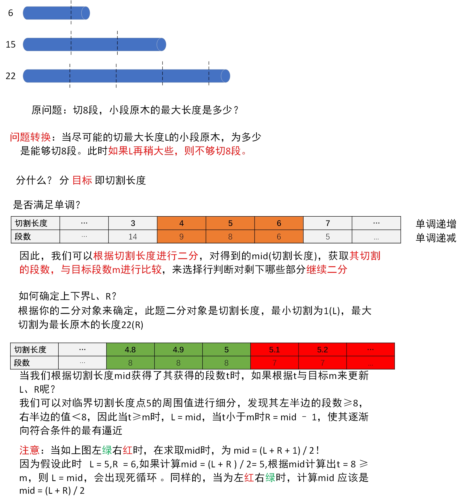
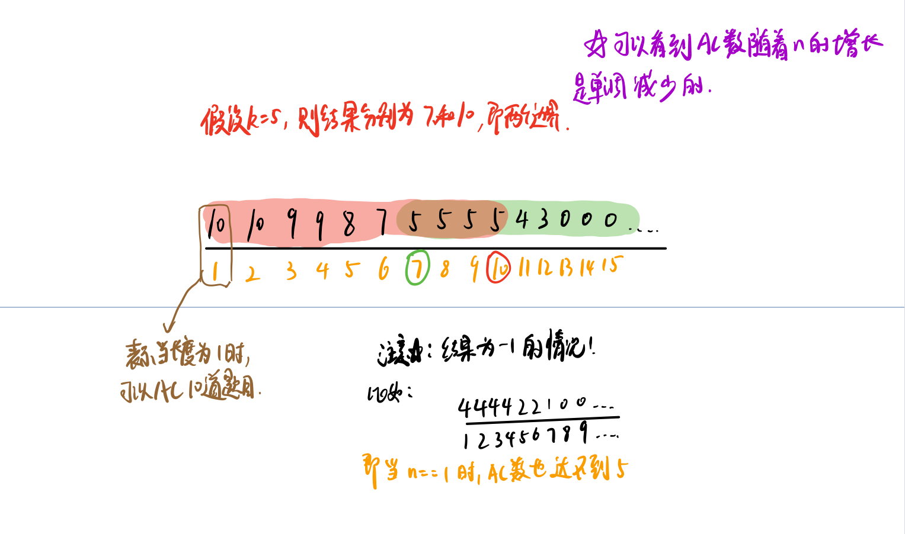
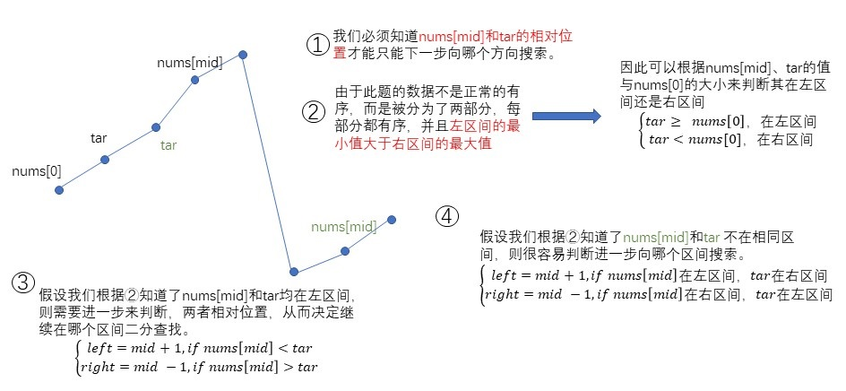
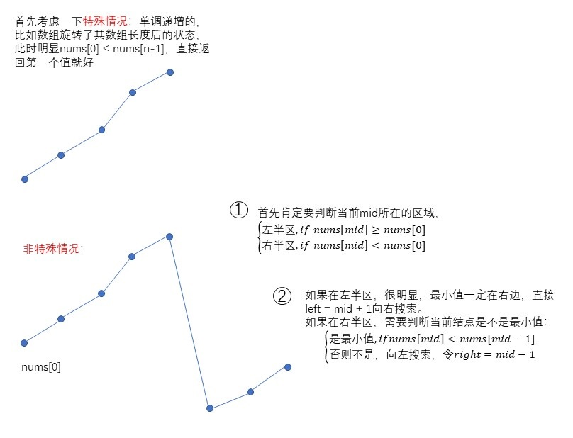
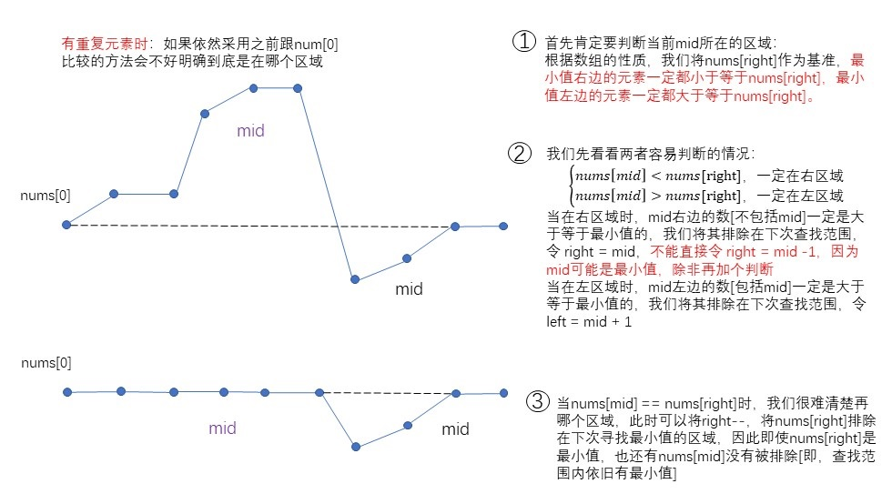
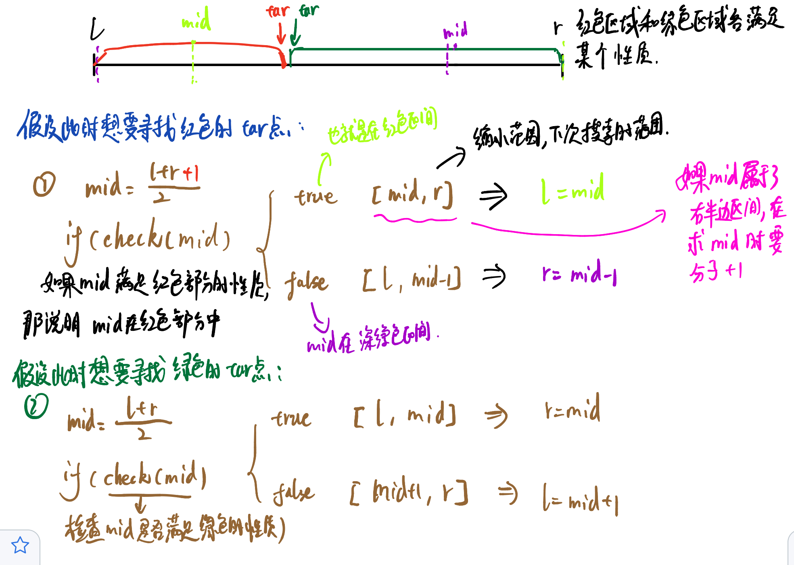
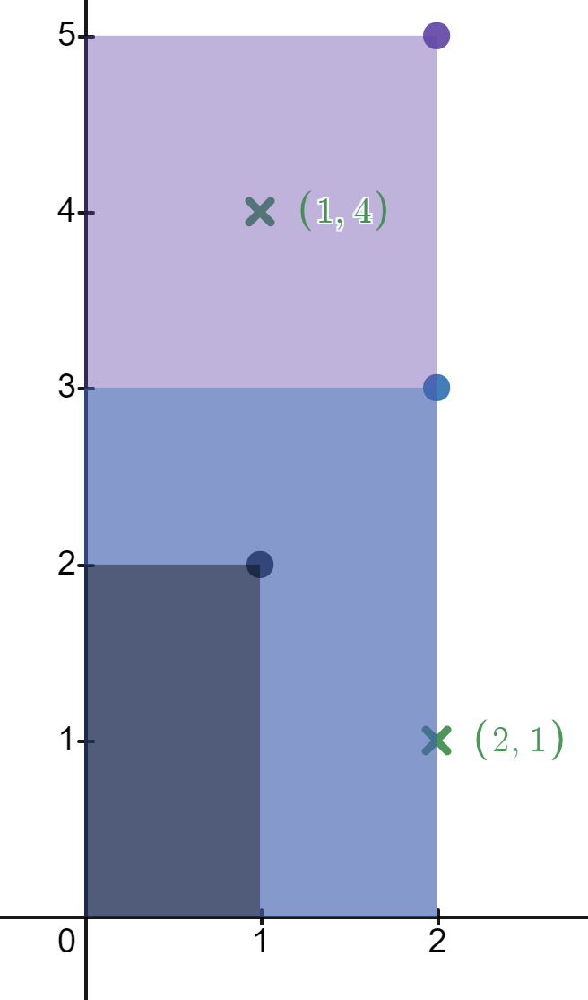
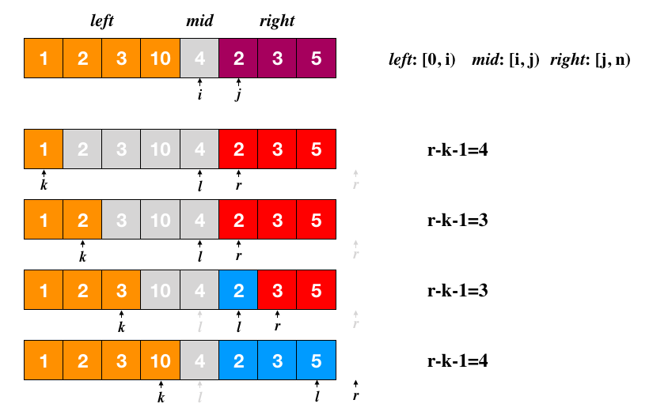
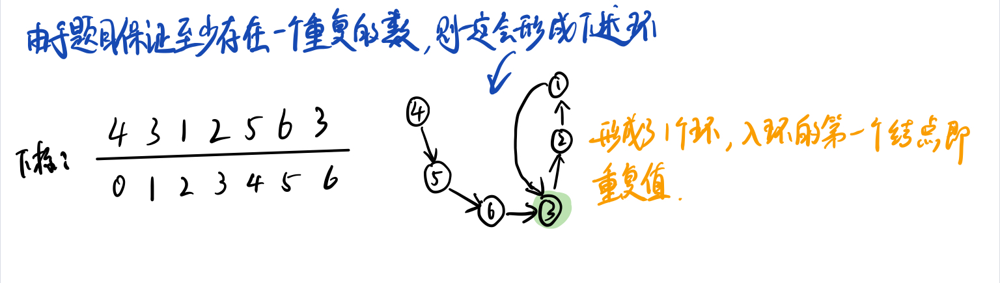
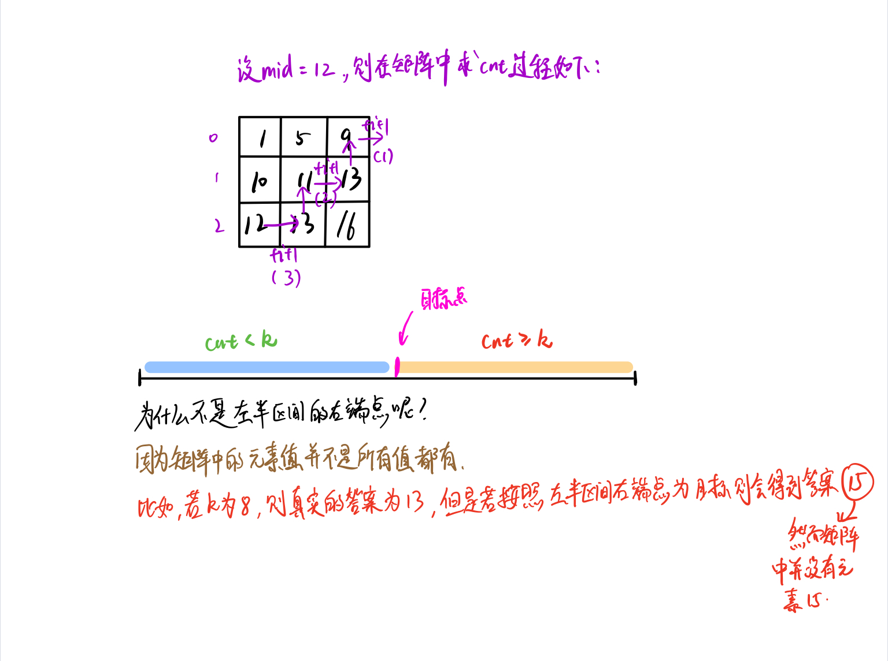

## 二分查找基本框架

> 二分查找算法思想不难！难的是算法细节！

```c
bool  binSearch(int * arr,int n,int tar){
    int left = 0,right = n-1;
    //什么时候是 < 什么时候是 <=要考虑清除
    while(left <= right){
        //求中值mid优化 右移运算代替除法运算，运算更快，相减代替相加防止溢出 int mid = (left + right) / 2;
        int mid = left + ((right - left)>>1);
        //重点
        if(arr[mid] == tar) return true;
        else if(arr[mid] > tar) right = mid - 1;
        else left = mid + 1;
    }
    return false;
}
```

## 二分查找变形

### 查找第一个值等于给定值的元素

其实这只是对基本二分查找的变形：

```cpp
//**查找第一个值等于给定值的元素**
int bsearchFirst(vector<int> & nums,int val){
    int n = nums.size();    
    int left = 0;
    int right = n - 1;
    while (left <= right)
    {
        int mid = left + ((right - left)>>1);
        if (nums[mid] < val){
            left = mid + 1;
        }else if (nums[mid] > val){
            right = mid - 1;
        }else {
            if (mid == 0 || nums[mid - 1] != val)
                return mid;
            else
                right = mid - 1;
        }
    }
    return -1;
}
```

> 如果我们查找的是任意一个值等于给定值的元素，当 `nums[mid]`等于要查找的值时，`nums[mid]`就是我们要找的元素。但是，如果我们求解的是第一个值等于给定值的元素，当 `nums[mid]`等于要查找的值时，我们就需要确认一下这个 `nums[mid]`是不是第一个值等于给定值的元素。

>  我们重点看`if (mid == 0 || nums[mid - 1] != val)`行代码。如果 `mid` 等于 0，那这个元素已经是数组的第一个元素，那它肯定是我们要找的；如果 `mid` 不等于 0，但 `nums[mid]`的前一个元素 `nums[mid-1]`不等于 `value`，那也说明 `nums[mid]`就是我们要找的第一个值等于给定值的元素。

> 如果经过检查之后发现 `nums[mid]`前面的一个元素 `nums[mid-1]`也等于 `value`，那说明此时的 `nums[mid]`肯定不是我们要查找的第一个值等于给定值的元素。那我们就更新 `high=mid-1`，因为要找的元素肯定出现在`[low, mid-1]`之间。

### 查找最后一个值等于给定值的元素

同样的，查找最后一个值等于给定值的元素也和上述思路相同。

```cpp
//**查找最后一个值等于给定值的元素**
int bsearchLast(vector<int> & nums,int val){
    int n = nums.size();
    int left = 0;
    int right = n - 1;
    while (left <= right)
    {
        int mid = left+((right - left) >> 1);
        if (nums[mid] < val){
            left = mid + 1;
        }else if (nums[mid] > val){
            right = mid - 1;
        }else{
            if (mid == n - 1 || nums[mid + 1] != val){
                return mid;
            }else{
                left = mid + 1;
            }
        }
    }
    return -1;
}
```

### 查找第一个大于等于给定值的元素

```cpp
//**查找第一个大于等于给定值的元素**
int bsearchOverFirst(vector<int> &nums,int val){
    int n = nums.size();
    int left = 0;
    int right = n - 1;
    while (left <= right){
        int mid = left + ((right - left)>>1);
        if (nums[mid] >= val){
            if (mid == 0 || (nums[mid - 1] < val)){
                return mid;    
            }
            right = mid - 1;
        }else{
            left = mid + 1;
        }
    }
    return -1;
}
```

### 查找最后一个小于等于给定值的元素

```cpp
//**查找最后一个小于等于给定值的元素**
int bsearchOverLast(vector<int> & nums,int val){
    int n = nums.size();
    int left = 0;
    int right = n - 1;
    while (left <= right){
        int mid = left + ((right - left)>>1);
        if (nums[mid] <= val){
            if (mid == n-1 || nums[mid + 1] > val){
                return mid;
            }
            left = mid + 1;
        }else{
            right = mid - 1;
        }
    }
    return -1;
}
```

## 二分"结果"题型

要点：

- 是否单调？

- 上下界范围？
- “分”什么？

为什么叫二分结果？因为**分的是结果**

#### 示例——**原木切割**

```
某林业局现在 N 根原木，长度分别为 Xi，为了便于运输，需要将他们切割成长度相等的 M 根小段原木（只能切割成整数长度，可以有剩余），小段原木的长度越大越好，现求小段原木的最大长度。例如，有 3 根原木长度分别为 6,15,22，现在需要切成 8 段，那么最大长度为 5。
输入
​ 第一行两个整数 N,M。（1≤N≤100,000，1≤M≤100,000,000）
​ 接下来 N 行，每行一个数，表示原木的长度 Xi。（1≤Xi≤100,000,000）
输出
​ 输出小段原木的最大长度， 保证可以切出 M 段。
```



```cpp
//程序代码——原木切割
#include<iostream>
#include<algorithm>
#include<stdio.h>
using namespace std;
int n,m,num[100005],r,l = 1;
//根据切割距离x求取段数t
int func(int x){
    int t = 0;
    for(int i = 1;i <= n;i++){
        t += num[i] / x;
    }
    return t;
}
//二分查找
int bs(void){
    while(l != r){
        int mid = ((long long)l + r + 1 ) /2;//防止出现死循环
        int t = func(mid);
        if(t >= m){
            l = mid;
        }else{
            r = mid - 1;
        }
    }
    return r; //此时r == l，返回哪个都行
}
int main(){
    scanf("%d %d",&n,&m);
    for(int i = 1;i <= n;i++){
        scanf("%d",&num[i]);
        r = max(r,num[i]); //更新最右边界
    }
    printf("%d\n",bs());
    return 0;
}
```

```
小密招：
左绿右红
	mid = (l + r + 1) / 2;
	l = mid;
	r = mid - 1;
左红右绿
	mid = (l + r) / 2
	r = mid;
	l = mid + 1;
```


#### 示例——**切绳子**

```
 有 N 条绳子，它们的长度分别为 Li。如果从它们中切割出 K 条长度相同的绳子，这 K 条绳子每条最长能有多长？答案保留到小数点后 2 位(直接舍掉 2 位后的小数)。
输入
​ 第一行两个整数 N 和 K，接下来 N 行，描述了每条绳子的长度 Li。
输出
​ 切割后每条绳子的最大长度，保证答案大于零。
```

注意：当数据类型为浮点型时，while判断内容变了！

```cpp
#include<iostream>
#include<algorithm>
using namespace std;
int n,k;
double num[10005],maxr;
//切割长度为m时可以切t条绳子
int func(double m){
    int t = 0;
    for(int i = 0;i < n;i++){
        t += num[i] / m;//浮点型转int整形，直接去掉了小数点后数字
    }
    return t;
}
//二分答案
double bs(void){
    double l = 0,r = maxr;
    while(r - l > 0.0001){
        double mid = (l + r)/2;//虽然为左绿有红，但因为判断改变，不用+1
        int t = func(mid);
        if(t >= k){
            l = mid;//注意 不需要+1
        }else{
            r = mid;//注意 不需要-1
        }
    }
    return r;
}
int main(){
    scanf("%d %d",&n,&k);
    for(int i = 0;i < n;i++){
        scanf("%lf",&num[i]);
        maxr = max(maxr,num[i]);//更新右边界
    }
    printf("%.2f\n",bs() - 0.005f);
    return 0;
}
```

#### 借教室

在大学期间，经常需要租借教室。大到院系举办活动，小到学习小组自习讨论，都需要向学校申请借教室。教室的大小功能不同，借教室人的身份不同，借教室的手续也不一样。

面对海量租借教室的信息，我们自然希望编程解决这个问题。

我们需要处理接下来 $n$ 天的借教室信息，其中第 $i$ 天学校有 $r_i$个教室可供租借。共有 $m$ 份订单，每份订单用三个正整数描述，分别为 $d_j,s_j,t_j$，表示某租借者需要从第 $s_j$ 天到第 $t_j$ 天租借教室（包括第 $s_j$ 天和第 $t_j$ 天），每天需要租借 $d_j$个教室。

我们假定，租借者对教室的大小、地点没有要求。即对于每份订单，我们只需要每天提供 $d_j$个教室，而它们具体是哪些教室，每天是否是相同的教室则不用考虑。

借教室的原则是先到先得，也就是说我们要按照订单的先后顺序依次为每份订单分配教室。如果在分配的过程中遇到一份订单无法完全满足，则需要停止教室的分配，通知当前申请人修改订单。这里的无法满足指从第 $s_j$天到第 $t_j$ 天中有至少一天剩余的教室数量不足 $d_j$个。

现在我们需要知道，是否会有订单无法完全满足。如果有，需要通知哪一个申请人修改订单。

**输入格式**

第一行包含两个正整数 $n,m$，表示天数和订单的数量。

第二行包含 $n$ 个正整数，其中第 $i$ 个数为 $r_i$，表示第 i*i* 天可用于租借的教室数量。

接下来有 $m$ 行，每行包含三个正整数 $d_j,s_j,t_j$，表示租借的数量，租借开始、结束分别在第几天。

每行相邻的两个数之间均用一个空格隔开。天数与订单均用从 1 开始的整数编号。

**输出格式**

如果所有订单均可满足，则输出只有一行，包含一个整数 0。否则（订单无法完全满足）

输出两行，第一行输出一个负整数 $-1$，第二行输出需要修改订单的申请人编号。

```
输入 
4 3 
2 5 4 3 
2 1 3 
3 2 4 
4 2 4
输出 
-1 
2
```

**题目解析**：

考虑到对于能否二分，有一个界定标准：**状态的决策过程或者序列是否满足单调性或者可以局部舍弃性。** 对于此题，如果编号为i的订单可以顺利申请到教室，那么编号小于 i 的订单肯定也能申请到教室，若编号为 j  的订单不能申请到教室，那么编号大于 j  的订单也申请不到教室。

当我们检测第 i  的订单能否被申请，首先初始化一个数组 $need[]$ 表示如果前 i 个订单都能够申请到，那么每天最少有 $need[t]$个教室，接下来就是遍历前 i  个订单，然后针对每个订单将 区间 $[s_t,t_t]$ 增加 $d_t$ ，然后判断每一个 $need[t]$ 是否都小于 $room[t]$，如果小于则表明第 i 个订单可以成功申请到，否则不能申请到教室。

对于每个订单将区间$[s_t,t_t]$ 增加 $d_t$ 的操作，时间复杂度为 $O(t-s) \approx O(n) $，此时我们可以利用差分数组将其优化为 $O(1)$，然后在最后对差分数组进行求前缀和获得 $need[ ]$

```java
public class Main{
    static int n,m;
    static int [] room,d,s,t;
    public static boolean check(int k){
        // 构造差分数组
        int [] diff = new int[n+2];
        for (int i = 1;i <= k;i++){
            diff[s[i]] += d[i];
            diff[t[i]+1] -= d[i];
        }
        int [] need = new int[n+1];
        // 得到从执行1~k个订单每天所需要的房间数
        for (int i = 1;i <= n;i++){
            need[i] = need[i-1] + diff[i];
            if (need[i] > room[i]) return false;
        }
        return true;
    }
    public static void main(String [] args) throws IOException{
        BufferedReader br = new BufferedReader(new InputStreamReader(System.in));
        String [] ins = br.readLine().split(" ");
        n = Integer.parseInt(ins[0]);
        m = Integer.parseInt(ins[1]);
        room = new int[n+1];
        d = new int[m+1];
        s = new int[m+1];
        t = new int[m+1];
        ins = br.readLine().split(" ");
        for (int i = 1;i <= n;i++){
            room[i] = Integer.parseInt(ins[i-1]);
        }
        for (int i = 1;i <= m;i++){
            ins = br.readLine().split(" ");
            d[i] = Integer.parseInt(ins[0]);
            s[i] = Integer.parseInt(ins[1]);
            t[i] = Integer.parseInt(ins[2]);
        }
        // 获取输入结束
        if (check(m)){
            System.out.println("0");
            return ;
        }
        int l = 1,r = m;
        while (l < r){
            int mid = l + ((r - l) >> 1);
            if (check(mid)){
                l = mid + 1;
            }else{
                r = mid;
            }
        }
        System.out.println("-1");
        System.out.println(l);
    }
}
```


#### 自动刷提机

自动刷题机刷题的方式非常简单：首先会瞬间得出题目的正确做法，然后开始写程序。每秒，自动刷题机的代码生成模块会有两种可能的结果：

1.写了 x 行代码
2.心情不好，删掉了之前写的 y 行代码。（如果 y  大于当前代码长度则相当于全部删除。）

对于一个 OJ，存在某个固定的正整数长度 n，一旦自动刷题机在某秒结束时积累了大于等于 n 行的代码，它就会自动提交并 AC 此题，然后新建一个文件（即弃置之前的所有代码）并开始写下一题。SHTSC 在某个 OJ 上跑了一天的自动刷题机，得到了很多条关于写代码的日志信息。他突然发现自己没有记录这个 OJ 的 n 究竟是多少。所幸他通过自己在 OJ 上的 Rank 知道了自动刷题机一共切了 k 道题，希望你计算 n 可能的最小值和最大值。

**输入格式**

第一行两个整数 $l , k$，表示刷题机的日志一共有 l 行，一共了切了 k 题。

接下来 l 行，每行一个整数 $x_i$，依次表示每条日志。若 $x_i \geq 0$，则表示写了 $x_i$ 行代码，若 $x_i \lt 0$，则表示删除了 $-x_i$ 行代码。

**输出格式**

输出一行两个整数，分别表示 n 可能的最小值和最大值。
如果这样的 n  不存在，请输出一行一个整数 -1 。

```
输入
4 2
2
5
-3
9
输出
3 7
```

二分答案，和往常的思路一样：



```java
public class Main{
    public static int check(long n,int [] nums){
        int cnt = 0; // AC题目的数量
        long sum = 0;
        for (int num : nums) {
            sum += num;
            if (sum < 0) sum = 0;
            if (sum >= n) {
                sum = 0;
                cnt += 1;
            }
        }
        return cnt;
    }
    public static void main(String [] args) throws IOException{
        BufferedReader br = new BufferedReader(new InputStreamReader(System.in));
        String [] ins = br.readLine().split(" ");
        int n = Integer.parseInt(ins[0]);
        int k = Integer.parseInt(ins[1]);
        int [] nums = new int[n];
        for (int i = 0;i < n;i++){
            nums[i] = Integer.parseInt(br.readLine());
        }
        // 先求最 小 值, mid 是 行数
        long l = 1,r = Long.MAX_VALUE;
        while (l < r){
            long mid = l + ((r - l) >> 1);
            if (check(mid,nums) <= k){
                r = mid;
            }else{
                l = mid + 1;
            }
        }
        if (check(l,nums) < k){
            System.out.println("-1");
            return ;
        }
        System.out.print(l + " ");
        // 再求最大值
        l = 1;
        r = Long.MAX_VALUE;
        while (l < r){
            long mid = l + (((r - l) + 1) >> 1);
            if (check(mid,nums) >= k){
                l = mid;
            }else{
                r = mid - 1;
            }
        }
        System.out.print(l);
    }
}
```

#### 特殊数组的特征值

给你一个非负整数数组 nums 。如果存在一个数 x ，使得 nums 中恰好有 x 个元素 大于或者等于 x ，那么就称 nums 是一个 特殊数组 ，而 x 是该数组的 特征值 。

注意： x 不必 是 nums 的中的元素。

如果数组 nums 是一个 特殊数组 ，请返回它的特征值 x 。否则，返回 -1 。可以证明的是，如果 nums 是特殊数组，那么其特征值 x 是 唯一的 。

```
输入：nums = [3,5]
输出：2
解释：有 2 个元素（3 和 5）大于或等于 2 。
```

题目解析：

方法一：二分答案

根据题意：如果数组中有 x 个数大于等于 x，那么对于任意大于 x 的数 y， 数组中大于等于 y 的个数必定小于 x；同理对于任意小于 x 的数 y， 数组中大于等于 y 的个数必定大于 x。因此符合单调性，我们可以不断地二分答案找到最终地答案。

```java
// 时间复杂度 O(nlog(1000))
class Solution {
    private boolean check(int v,int [] nums){
        int cnt = 0;
        for(int num : nums){
            if (num >= v) cnt += 1;
        }
        if (cnt <= v){
            return true;
        }
        return false;
    }
    public int specialArray(int[] nums) {
        int l = -1,r = 1000;
        // O(log(1000))
        while (l < r){
            int mid = l + ((r-l) >> 1);
            // O(n)
            if (check(mid,nums)){
                r = mid;
            }else{
                l = mid + 1;
            }
        }
        // 因为有可能不存在，因此再判断一下
        int cnt = 0;
        for(int num : nums){
            if (num >= l) cnt +=1;
        }
        return l == cnt ? l : -1;
    }
}
```

方法二：枚举 + 二分 + 排序

同时，由于数据量不大，我们也完全可以枚举答案x，然后通过二分法判断数组中大于等于x的个数。

```java
class Solution {
	public int specialArray(int[] nums) {
        Arrays.sort(nums);
        int n = nums.length;
        for (int i = 0;i <= 1000;i++){
            // 查找大于等于 i 的最小值
            int l = 0,r = n-1;
            while (l < r){
                int mid = l + ((r - l) >> 1);
                if (nums[mid] >= i){
                    r = mid;
                }else{
                    l = mid + 1;
                }
            }
            int count = n - l; // 大于等 i 的个数
            if (nums[i] >= i && i == count) return i;
        }
        return -1;
    }
} 
```


#### 通关

> 百度笔试题

小A买了两款游戏，第一款游戏中有n个关卡，每关需要花费$a[i]$的时间，第二款游戏中有m个关卡，每关需要花费$b[i]$的时间，两款游戏都不允许跳关，即必须通过了第i关，才能玩第i+1关。小A想知道在T时间内最多通过多少关。

输入：

- n、m、t 分别表示两个游戏的关卡数以及时间
- 接下来两行分别是a[] 和 b[]

输出：

最多完成的关卡数

**题目解析**：

这道题目最开始我直接想到的是利用前缀和，然后两层for循环，分别遍历a可能通关数量，b可能通关数量，然后求满足条件的最大情况。但是发现只能过90%数据，于是开始优化。由于t 与 最大通关数量成正比，因此想到用二分答案的方法。

```java
    // 判断能否在t时间内通过c关
    private boolean check(int c,int [] preA,int []preB,int t){
        for (int i = 0;i <= Math.min(preA.length-1,c);i++){
            if (c - i >= preB.length) continue;
            if (preA[i] + preB[c-i] <= t){
                return true;
            }
        }
        return false;
    }

    /**
     * 获取最大通关数
     * @param A
     * @param B
     * @param t
     * @return
     */
    public int maxPassCount(int []A,int []B,int t){
        int n = A.length, m = B.length;
        int [] SumA = new int[n+1],SumB = new int[m+1];
        for (int i = 1;i <= n;i++){
            SumA[i] = SumA[i-1] + A[i-1];
        }
        for (int i = 1;i <= m;i++){
            SumB[i] = SumB[i-1] + B[i-1];
        }
        int l = 0,r = n + m;
        while (l < r){
            int mid = l + ((r - l + 1) >> 1);
            if (check(mid,SumA,SumB,t)){
                l = mid;
            }else{
                r = mid - 1;
            }
        }
        return l;
    }
```


## 伪有序二分

> 这个==伪有序==二分是我自己起的名字，可能不太形象，但是我们通常会遇到一些题型比如【畸形的有序】，依然可以采用二分方法解决

### 在旋转排序数组中搜索

```
整数数组 nums 按升序排列，数组中的值 互不相同 。

在传递给函数之前，nums 在预先未知的某个下标 k（0 <= k < nums.length）上进行了 旋转，使数组变为 [nums[k], nums[k+1], ..., nums[n-1], nums[0], nums[1], ..., nums[k-1]]（下标 从 0 开始 计数）。
例如， [0,1,2,4,5,6,7] 在下标 3 处经旋转后可能变为 [4,5,6,7,0,1,2] 。

给你 旋转后 的数组 nums 和一个整数 target ，如果 nums 中存在这个目标值 target ，则返回它的下标，否则返回 -1 。
```

```
输入：nums = [4,5,6,7,0,1,2], target = 0
输出：4
```

> 在前面的二分题目中，重点就是找到目标值和当前`num[mid]`的==相对位置==，以此来判断向左还是向右搜索，此题的重点也是这样，只是条件可能复杂些。



```cpp
class Solution {
public:
    int search(vector<int>& nums, int target) {
        int n = nums.size();
        int left = 0,right = n - 1;
        while(left <= right){
            int mid = left + ((right - left) >> 1);
            //找到答案，直接返回
            if(target == nums[mid]) return mid;
            if(nums[mid] >= nums[0]){//nums[mid]在左半区间
                //开始判断target在哪
                if(target < nums[0])//目标值在右半区间
                    left = mid + 1;
                else{//目标值在左半区间，此时要判断和nums[mid]的相对位置
                    if(target < nums[mid]) right = mid - 1;
                    else left = mid + 1;
                }
            }else{//nums[mid]在右半区间
                if(target >= nums[0])//目标值在左半区间
                    right = mid - 1;
                else{//目标值在右半区间，要判断和nums[mid]的相对位置
                    if(target < nums[mid]) right = mid - 1;
                    else left = mid + 1;
                }
            }
        }
        return -1;
    }
};
```

### 寻找旋转排序数组中的最小值

```
已知一个长度为 n 的数组，预先按照升序排列，经由 1 到 n 次 旋转 后，得到输入数组。例如，原数组 nums = [0,1,2,4,5,6,7] 在变化后可能得到：
若旋转 4 次，则可以得到 [4,5,6,7,0,1,2]
若旋转 7 次，则可以得到 [0,1,2,4,5,6,7]
```

> 给你一个元素值 `互不相同` 的数组 `nums` ，它原来是一个升序排列的数组，并按上述情形进行了多次旋转。请你找出并返回数组中的 最小元素 。

```
输入：nums = [3,4,5,1,2]
输出：1
```

> 本题和上一题"在旋转排序数组中搜索"很相似，都是伪有序的搜索，在搜素过程中需要判断当前处于的区域，并要清楚查找结束条件



```cpp
class Solution {
public:
    int findMin(vector<int> &nums){
        int n = nums.size();
        //如果是单调递增的，直接返回第一个值
        if(nums[0] < nums[n-1]) return nums[0];
        int left = 0,right = n-1;
        while(left < right){
            int mid = left + ((right - left) >> 1);
            //mid在左半区域，一定不是最小值
            if(nums[mid] >= nums[0]){
                left = mid + 1;
            }else{//在右半区域
                if(mid > 0 && nums[mid] < nums[mid-1]) return nums[mid];
                right = mid - 1;
            }
        }
        return nums[left];
    }
};
```

### 寻找旋转排序数组中的最小值II

```
已知一个长度为 n 的数组，预先按照升序排列，经由 1 到 n 次 旋转 后，得到输入数组。例如，原数组 nums = [0,1,4,4,5,6,7] 在变化后可能得到：
```

> 给你一个可能存在 `重复` 元素值的数组 `nums` ，它原来是一个升序排列的数组，并按上述情形进行了多次旋转。请你找出并返回数组中的 最小元素 。

> **当存在重复元素后，就不好明确区分是在哪个区间了**，但是我们依旧要缩小查找范围，如何缩小？这便是要解决的重要问题之一



本质就是缩小(排除一些)查找范围！

```cpp
class Solution {
public:
    int findMin(vector<int> &nums){
        int n = nums.size();
        int left = 0,right = n-1;
        while (left < right){
            int mid = left + ((right - left) >> 1);
            //如果在右半部分区域
            if (nums[mid] < nums[right]){
                //注意下面的两种判断方法都可以，但是要清楚为什么要这样
                #if 0    
                    if(mid > 0 && nums[mid] < nums[mid-1]) return nums[mid];
                    right = mid - 1;
                #else
                    right = mid;
                #endif
            }else if (nums[mid] > nums[right])//左半部分区域
            {
                left = mid + 1;
            }else{//将nums[right]排除在下次查找区域
                right--;
            }
        }
        return nums[left];
    }
};
```


一个讲的挺好的二分模板：

https://leetcode.cn/problems/find-first-and-last-position-of-element-in-sorted-array/solution/lan-hong-hua-fen-fa-dan-mo-ban-miao-sha-e7r40/

## 整数二分

算法思路：假设目标值在闭区间[l, r]中， 每次将区间长度缩小一半，当l = r时，我们就找到了目标值。

左半边不满足某种性质，右半边满足某种性质。通过不断地二分，可以最终找到边界点




**版本1**
当我们将区间[l, r]划分成[l, mid - 1]和[mid, r]时，其更新操作是r = mid - 1或者l = mid; **此时为了防止死循环，计算mid时需要加1。**

```cpp
int bsearch_2(int l, int r)
{
    while (l < r)
    {
        int mid = l + r + 1 >> 1;
        if (check(mid)) l = mid;
        else r = mid - 1;
    }
    return l;
}
```


**版本2**
当我们将区间[l, r]划分成[l, mid]和[mid + 1, r]时，其更新操作是r = mid或者l = mid + 1;，计算mid时不需要加1。

```cpp
int bsearch_1(int l, int r)
{
    while (l < r)
    {
        int mid = l + r >> 1;
        if (check(mid)) r = mid;
        else l = mid + 1;
    }
    return l;
}
```


> 方法：先写个check函数，判断返回true和false时如何更新l和r

#### 例题：数的范围

给定一个按照升序排列的长度为 n 的整数数组，以及 q 个查询。

对于每个查询，返回一个元素 k 的起始位置和终止位置（位置从 0 开始计数）。

如果数组中不存在该元素，则返回 `-1 -1`。

**输入格式**

第一行包含整数 n 和 q，表示数组长度和询问个数。

第二行包含 n 个整数（均在 1∼10000 范围内），表示完整数组。

接下来 q 行，每行包含一个整数 kk，表示一个询问元素。

**输出格式**

共 q 行，每行包含两个整数，表示所求元素的起始位置和终止位置。

如果数组中不存在该元素，则返回 `-1 -1`。

```
输入样例：
6 3
1 2 2 3 3 4
3
4
5
输出样例：
3 4
5 5
-1 -1
```

```java
import java.io.*;
import java.util.*;

public class Main {
    public static void main(String[] args) throws IOException {
        InputStreamReader in = new InputStreamReader(System.in);
        BufferedReader bf = new BufferedReader(in);
        String [] t = bf.readLine().split(" ");
        int n = Integer.parseInt(t[0]);
        int q = Integer.parseInt(t[1]);
        int [] nums = new int[n];
        String [] res = bf.readLine().split(" ");
        for (int i = 0;i < res.length;i++){
            nums[i] = Integer.parseInt(res[i]);
        }
        while (q-- > 0){
            int target = Integer.parseInt(bf.readLine());
            // 寻找起始位置
            int l = 0,r = n-1;
            while (l < r){
                int mid = (l + r) >> 1;
                if (nums[mid] >= target) r = mid;
                else l = mid + 1;
            }
            if (nums[l] != target){
                System.out.println("-1 -1");
                continue;
            }
            System.out.print(l + " ");
            l = 0;
            r = n-1;
            // 寻找结束位置
            while (l < r){
                int mid = l + ((r - l + 1) >> 1);
                if (nums[mid] <= target) l = mid;
                else r = mid-1;
            }
            System.out.print(l);
            System.out.println();
        }
        bf.close();
    }
}
```


#### **例题 统计包含每个点的矩形数目**

> Leetcode 6043

给你一个二维整数数组 `rectangles` ，其中 `rectangles[i] = [li, hi]` 表示第 `i` 个矩形长为 `li` 高为 `hi` 。给你一个二维整数数组 `points` ，其中 `points[j] = [xj, yj]` 是坐标为 `(xj, yj)` 的一个点。

第 `i` 个矩形的 **左下角** 在 `(0, 0)` 处，**右上角** 在 `(li, hi)` 。

请你返回一个整数数组 `count` ，长度为 `points.length`，其中 `count[j]`是 **包含** 第 `j` 个点的矩形数目。

如果 `0 <= xj <= li` 且 `0 <= yj <= hi` ，那么我们说第 `i` 个矩形包含第 `j` 个点。如果一个点刚好在矩形的 **边上** ，这个点也被视为被矩形包含。

 

```
输入：rectangles = [[1,2],[2,3],[2,5]], points = [[2,1],[1,4]]
输出：[2,1]
解释：
第一个矩形不包含任何点。
第二个矩形只包含一个点 (2, 1) 。
第三个矩形包含点 (2, 1) 和 (1, 4) 。
包含点 (2, 1) 的矩形数目为 2 。
包含点 (1, 4) 的矩形数目为 1 。
所以，我们返回 [2, 1] 。
```

用例的取值范围：

1 <= l <= 10^9
1 <= h <= 100

注意到高度的范围在[1， 100]，那么可以创建一个哈希表，用来存储矩形的位置信息，key为高度，value为该高度下的宽度列表。

对每个point，对[1,100]范围内所有高度进行遍历，在每个高度所对应的宽度列表中，进行二分搜索，找到所有比point更宽的矩阵个数，加入答案。

```java
class Solution {
    // 找大于等于tar的最小值小标
    private int binarySearch(List<Integer> list,int tar){
        int l = 0, r = list.size()-1;
        while (l < r){
            int mid = l + ((r - l) >> 1);
            if (list.get(mid) >= tar){
                r = mid;
            }else {
                l = mid + 1;
            }
        }
        if (list.get(l) < tar){
            return list.size();
        }
        return l;
    }
    public int[] countRectangles(int[][] rectangles, int[][] points) {
        int n = rectangles.length;
        int m = points.length;
        Map<Integer,List<Integer>> map = new HashMap<>();
        for (int i = 0;i < n;i++){
            List<Integer> l = map.getOrDefault(rectangles[i][1],new ArrayList<>());
            l.add(rectangles[i][0]);
            map.put(rectangles[i][1],l);
        }
        // 排序
        for (int key : map.keySet()){
            Collections.sort(map.get(key));
        }
        int [] ans = new int[m];
        for (int i = 0;i < m;i++){
            int l = points[i][0],h = points[i][1];
            int cnt = 0;
            for (int j = 100;j >= 1;j--){
                if (j < h) break;
                List<Integer> list = map.get(j);
                if (list != null){
                    // 在list中找到大于等于l最小值的下标
                    int idx = binarySearch(list,l);
                    cnt += list.size() - idx;
                }
            }
            ans[i] = cnt;
        }
        return ans;
    }
}
```


#### 例题 在D天内送达包裹的能力 

> Leetcode 1011

> 标签：二分答案

传送带上的包裹必须在 days 天内从一个港口运送到另一个港口。

传送带上的第 i 个包裹的重量为 weights[i]。每一天，我们都会按给出重量（weights）的顺序往传送带上装载包裹。我们装载的重量不会超过船的最大运载重量。

返回能在 days 天内将传送带上的所有包裹送达的船的最低运载能力。

```
输入：weights = [1,2,3,4,5,6,7,8,9,10], days = 5
输出：15
解释：
船舶最低载重 15 就能够在 5 天内送达所有包裹，如下所示：
第 1 天：1, 2, 3, 4, 5
第 2 天：6, 7
第 3 天：8
第 4 天：9
第 5 天：10
请注意，货物必须按照给定的顺序装运，
因此使用载重能力为 14 的船舶并将包装分成 (2, 3, 4, 5), (1, 6, 7), (8), (9), (10) 是不允许的。 
```


```java
class Solution {
    private boolean check(int mid,int[] weights,int days){
        int need = 0,cur = 0;
        for (int i = 0;i < weights.length;i++){
            if(weights[i] > mid) return false;
            if (cur + weights[i] > mid){
                need += 1;
                cur = 0;
            }
            cur += weights[i];
        }
        if (cur > 0) need += 1;
        return days >= need;
    }
    
    public int shipWithinDays(int[] weights, int days) {
        int l = 1,r = Integer.MAX_VALUE;
        while (l < r){
            int mid = l + ((r - l) >> 1);
            if (check(mid,weights,days)){
                r = mid;
            }else{
                l = mid + 1;
            }
        }
        return l;
    }
}
```

#### 例题 数字流的秩 

> Leetcode 面试 10.10

> 标签：二分查找

假设你正在读取一串整数。每隔一段时间，你希望能找出数字 x 的秩(小于或等于 x 的值的个数)。请实现数据结构和算法来支持这些操作，也就是说：

实现 track(int x) 方法，每读入一个数字都会调用该方法；

实现 getRankOfNumber(int x) 方法，返回小于或等于 x 的值的个数。

```java
class StreamRank {
    List<Integer> nums;
    public StreamRank() {
        nums = new ArrayList<>();
    }

    public void track(int x) {
        int idx = getRankOfNumber(x);
        nums.add(idx,x);
    }
    // 返回小于等于x的个数
    public int getRankOfNumber(int x) {
        if (nums.size() == 0){
            return 0;
        }else if(nums.size() == 1){
            return x >= nums.get(0) ? 1 : 0;
        }
        // 查找大于x的最小元素下标
        int l = 0, r = nums.size()-1;
        while (l < r){
            int mid = l + ((r-l) >> 1);
            if (nums.get(mid) > x){
                r = mid;
            }else{
                l = mid + 1;
            }
        }
        if(nums.get(l) <= x){
            return l + 1;
        }
        return l;
    }
}
```

#### 例题 数字流的秩 

> Leetcode 1574

> 标签：二分查找

给你一个整数数组 arr ，请你删除一个子数组（可以为空），使得 arr 中剩下的元素是 非递减 的。

一个子数组指的是原数组中连续的一个子序列。

请你返回满足题目要求的最短子数组的长度.

```
输入：arr = [1,2,3,10,4,2,3,5]
输出：3
解释：我们需要删除的最短子数组是 [10,4,2] ，长度为 3 。剩余元素形成非递减数组 [1,2,3,3,5] 。
另一个正确的解为删除子数组 [3,10,4] 。
```

这道题要求删除一段子区间，我们分下面几种情况：

1.  删除左边一段，右边一段单调有序；
2.  删除中间中间一段，左右两段拼接起来单调有序；
3.  删除右边一段，左边一段单调有序。

如果设长度为 0 也能是一段，归纳为情况 ② 删除中间中间一段，左右两段拼接起来单调有序；

我们设 arr 可以被分为 left、 mid 、right 三段，分割点为 i ，j ：

- 左边段 left 为 $[0,i)$；
- 中间段 mid 为 $[i,j)$；
- 右边段 right 为 $[j,n)$。

首先要满足，左右均为单调非递减，遍历找出分割点为 i ，j；

然后就是搜索区间问题，固定一个端点，二分查找另一个端点。

然后遍历左边段 left 中每个元素 target，去右边段 right 找第一个 $\ge target$ 的元素下



```java
class Solution {
    public int findLengthOfShortestSubarray(int[] nums) {
        int n = nums.length;
        int i = 0,j = n-1;
        while (i < n-1 && nums[i] <= nums[i+1]){
            i ++;
        }
        while (j > 0 && nums[j] >= nums[j-1]){
            j --;
        }
        if (i >= j) return 0; // 已经出于严格递增
    
        int ans = j; // 特殊情况，序列严格递减
        for (int k = 0;k <= i;k++){
            int l = j,r = n-1;
            int target = nums[k];
            while (l < r){
                int mid = l + ((r - l) >> 1);
                if (nums[mid] >= target){
                    r = mid;
                }else{
                    l = mid + 1;
                }
            }
            if (nums[l] < target){
                ans = Math.min(ans,r-k);
            }else{
                ans = Math.min(ans,r-k-1);
            }
        }
        return ans;
    }
}
```


#### 乘法表中第k小的数

几乎每一个人都用 **乘法表**。但是你能在乘法表中快速找到第 k 小的数字吗？

给定高度m 、宽度n 的一张 $m \times  n$的乘法表，以及正整数k，你需要返回表中第k 小的数字。

```
输入: m = 3, n = 3, k = 5
输出: 3
解释: 
乘法表:
1	2	3
2	4	6
3	6	9
第5小的数字是 3 (1, 2, 2, 3, 3).
```


```java
class Solution {
    // 从乘法表中寻找小于等于 mid 的个数
    private int getCnt(int mid,int n,int m){
        int i = n, j = 1;
        int cnt = 0;
        while (i >= 1 && j <= m){
            if (i * j <= mid){
                j += 1;
                cnt += i;
            }else {
                i -= 1;
            }
        }
        return cnt;
    }
    public int findKthNumber(int m, int n, int k) {
        int l = 1, r = m * n;
        while (l < r){
            int mid = l + ((r - l)>>1);
            if (getCnt(mid,n,m) >= k){
                r = mid;
            }else{
                l = mid + 1;
            }
        }
        return l;
    }
}
```


#### 寻找右区间

给你一个区间数组 intervals ，其中 $intervals[i] = [start_i, end_i] $，且每个 starti 都 不同 。

区间 i 的 右侧区间 可以记作区间 j ，并满足 $start_j >= end_i$ ，且 startj 最小化 。

返回一个由每个区间 i 的 右侧区间 的最小起始位置组成的数组。如果某个区间 i 不存在对应的 右侧区间 ，则下标 i 处的值设为 -1 。

```
输入：intervals = [[3,4],[2,3],[1,2]]
输出：[-1,0,1]
解释：对于 [3,4] ，没有满足条件的“右侧”区间。
对于 [2,3] ，区间[3,4]具有最小的“右”起点;
对于 [1,2] ，区间[2,3]具有最小的“右”起点。
```

比较常规的排序+二分方法辣。

```java
class Pair{
    int l,r;
    int id;
    public Pair(int l, int r,int id) {
        this.l = l;
        this.r = r;
        this.id = id;
    }
}


class Solution {
    public int[] findRightInterval(int[][] intervals) {
        int n = intervals.length;
        Pair [] pairs = new Pair[n];
        for (int i = 0;i < intervals.length;i++){
            pairs[i] = new Pair(intervals[i][0],intervals[i][1],i);
        }
        Arrays.sort(pairs, new Comparator<Pair>() {
            @Override
            public int compare(Pair o1, Pair o2) {
                return o1.l - o2.l;
            }
        });
        int [] ans = new int[n];
        for (int i = 0;i < intervals.length;i++){
            int tar = intervals[i][1];
            // 在 pairs中找大于等于tar的最小值
            int l = 0,r = n-1;
            while (l < r){
                int mid = l + ((r - l)>>1);
                if (pairs[mid].l >= tar){
                    r = mid;
                }else{
                    l = mid + 1;
                }
            }
            if (pairs[l].l < tar){
                ans[i] = -1;
            }else{
                ans[i] = pairs[l].id;
            }
        }
        return ans;
    }
}
```

#### 爱吃香蕉的珂珂

珂珂喜欢吃香蕉。这里有 n 堆香蕉，第 i 堆中有 piles[i] 根香蕉。警卫已经离开了，将在 h 小时后回来。

珂珂可以决定她吃香蕉的速度 k （单位：根/小时）。每个小时，她将会选择一堆香蕉，从中吃掉 k 根。如果这堆香蕉少于 k 根，她将吃掉这堆的所有香蕉，然后这一小时内不会再吃更多的香蕉。  

珂珂喜欢慢慢吃，但仍然想在警卫回来前吃掉所有的香蕉。

返回她可以在 h 小时内吃掉所有香蕉的最小速度 k（k 为整数）

```
输入：piles = [3,6,7,11], h = 8
输出：4
```

题目一看明显就是二分答案。我们不断二分吃香蕉的速度，等价于**找满足某个条件的最小值**

```java
class Solution {
    int n;
    public boolean check(int k,int h,int []piles){
        int cnt = 0;
        for (int i = 0;i < n;i++){
            if (piles[i] % k == 0){
                cnt += piles[i] / k;
            }else{
                cnt += (piles[i] / k + 1);
            }
            // 上面的 if else 等价下面的语句
            // cnt += (piles[i] + k - 1) / k;
        }
        return cnt <= h;
    }
    public int minEatingSpeed(int[] piles, int h) {
        n = piles.length;
        int l = 1, r = Integer.MAX_VALUE;
        while (l < r){
            int mid = l + ((r - l) >> 1);
            if (check(mid,h,piles)){
                r = mid;
            }else{
                l = mid + 1;
            }
        }
        return l;
    }
}
```

#### 寻找重复数

给定一个包含 n + 1 个整数的数组 nums ，其数字都在 [1, n] 范围内（包括 1 和 n），可知至少存在一个重复的整数。

假设 nums 只有 一个重复的整数 ，返回 这个重复的数 。

你设计的解决方案必须 **不修改** 数组 nums 且只用常量级 O(1) 的额外空间。

```
输入：nums = [1,3,4,2,2]
输出：2
```

题目解析：

由于有要求不修改数组nums，那么我们就不能对数组进行排序然后二分查找。

**方法一**：时间复杂度 O(nlogn)

定义 $\textit{cnt}[i]$ 表示$\textit{nums}$数组中小于等于 $nums[i]$ 的数有多少个，假设我们重复的数是 $\textit{target}$，那么 $[1,\textit{target}-1]$里的所有数满足 $\textit{cnt}[i]\le i$，$[target,n]$ 里的所有数满足 $\textit{cnt}[i]>i$，具有单调性。

以示例为例子：

| nums | 1    | 2    | 3    | 4    |
| ---- | ---- | ---- | ---- | ---- |
| cnt  | 1    | 3    | 4    | 5    |

可以看到 $[1,1]$中的数满足 $\textit{cnt}[i]\le i$，$[2,4]$中的数满足 $\textit{cnt}[i]>i$ 

因此，只需要找到满足 $nums[i] < cnt[nums[i]]$ 的最小的数，也就是上式的 2 

```java
class Solution {
    public int findDuplicate(int[] nums) {
        int n = nums.length;
        int l = 1, r = n-1;
        while (l < r){
            int mid = l + ((r - l) >> 1);
            int cnt = 0;
            for (int i = 0;i < n;i++){
                if (nums[i] <= mid){
                    cnt += 1;
                }
            }
            if (cnt <= mid){
                l = mid + 1;
            }else{
                r = mid;
            }
        }
        return l;
    }
}
```


**方法二**：快慢指针



```java
class Solution {
    public int findDuplicate(int[] nums) {
        int n = nums.length;
        int slow = nums[0], fast = nums[nums[0]];
        while (slow != fast){
            slow = nums[slow];
            fast = nums[nums[fast]];
        }
        slow = 0;
        while (slow != fast){
            slow = nums[slow];
            fast = nums[fast];
        }
        return slow;
    }
}
```


#### 丢失的数字

给定一个包含 `[0, n]` 中 `n` 个数的数组 `nums` ，找出 `[0, n]` 这个范围内没有出现在数组中的那个数。

```
输入：nums = [9,6,4,2,3,5,7,0,1]
输出：8
解释：n = 9，因为有 9 个数字，所以所有的数字都在范围 [0,9] 内。8 是丢失的数字，因为它没有出现在 nums 中。
```

首先排序，然后会有一个分界点，分界点左边都存在：$ nums[i] ==  i$，分界点右边都存在 $nums[i] \ne i$，因此我们只需要找 第一个 $nums[i] \ne i$ 的 i 即可，可以使用二分查找的方法优化。

```java
class Solution {
    public int missingNumber(int[] nums) {
        Arrays.sort(nums);
        int n = nums.length;
        int l = 0,r = n-1;
        while(l < r){
            int mid = l + ((r -l)>>1);
            if(nums[mid] != mid){
                r = mid;
            }else{
                l = mid + 1;
            }
        }
        if(l == n-1 && nums[l] == l) return n;
        return l;
    }   
}
```

#### 有序矩阵中第 K 小的元素

给你一个 n x n 矩阵 matrix ，其中每行和每列元素均按升序排序，找到矩阵中第 k 小的元素。
请注意，它是 排序后 的第 k 小元素，而不是第 k 个 不同 的元素。

你必须找到一个内存复杂度优于 O(n2) 的解决方案。

```
输入：matrix = [[1,5,9],[10,11,13],[12,13,15]], k = 8
输出：13
解释：矩阵中的元素为 [1,5,9,10,11,12,13,13,15]，第 8 小元素是 13
```

由于是有序的，我们很容易联想到二分答案，答案的初始界限为$(mat[0][0],mat[n-1][n-1])$，每次进行二分得到mid，然后判断矩阵中小于等于 mid 的元素个数 cnt，然后比较cnt和k的大小：

- 如果 $cnt < k$，说明 mid 小于答案, l = mid + 1
- 如果 $cnt \ge k$，说明 mid 大于等于答案, r = mid

同时我们可以利用矩阵的性质在O(n)时间复杂度内求得 小于等于k 的个数。



```java
class Solution {
    private boolean check(int [][] mat,int mid,int k){
        int cnt = 0;
        int i = mat.length-1, j = 0;
        while (i >= 0 && j < mat.length){
            if (mat[i][j] <= mid){
                j++;
                cnt += i + 1;
            }else{
                i--;
            }
        }
        return cnt >= k;
    }
    public int kthSmallest(int[][] matrix, int k) {
        int n = matrix.length;
        int l = matrix[0][0], r = matrix[n-1][n-1];
        while (l < r){
            int mid = l + ((r - l) >> 1);
            if (check(matrix,mid,k)){
                r = mid;
            }else{
                l = mid + 1;
            }
        }
        return l;
    }
}
```

#### 跳石头

一年一度的“跳石头”比赛又要开始了!

这项比赛将在一条笔直的河道中进行，河道中分布着一些巨大岩石。组委会已经选择好了两块岩石作为比赛起点和终点。在起点和终点之间，有 N 块岩石（不含起点和终点的岩石）。在比赛过程中，选手们将从起点出发，每一步跳向相邻的岩石，直至到达终点。

为了提高比赛难度，组委会计划移走一些岩石，使得选手们在比赛过程中的最短跳跃距离尽可能长。由于预算限制，组委会至多从起点和终点之间移走 M 块岩石（不能移走起点和终点的岩石）。

**输入格式**

第一行包含三个整数 $L,N,M$，分别表示起点到终点的距离，起点和终点之间的岩石数，以及组委会至多移走的岩石数。保证 $L \geq 1$ 且 $N \geq M \geq 0$。

接下来 $N$ 行，每行一个整数，第 $i$ 行的整数 $D_i( 0 < D_i < L)$， 表示第 $i$ 块岩石与起点的距离。这些岩石按与起点距离从小到大的顺序给出，且不会有两个岩石出现在同一个位置。

**输出格式**

一个整数，即最短跳跃距离的最大值。

```
输入
25 5 2 
2
11
14
17 
21
输出
4
```

二分答案：二分枚举比赛过程中的**最短跳跃距离** mid，然后通过check函数判断能否在移除少于M块石头跳的最短距离为mid，如果可以，说明 真实答案 >= mid，否则 真实答案 < mid。

```java
public class Main{
    static int L,N,M;
    public static boolean check(int dis,int [] nums){
        int cnt = 0;
        int idx = 0;
        for (int i = 1;i <= N;i++){
            if (nums[i] - nums[idx] < dis){
                cnt++;
            }else{
                idx = i;
            }
        }
        return cnt <= M;
    }
    public static void main(String [] args) throws IOException{
        BufferedReader br = new BufferedReader(new InputStreamReader(System.in));
        String [] ins = br.readLine().split(" ");
        L = Integer.parseInt(ins[0]);
        N = Integer.parseInt(ins[1]);
        M = Integer.parseInt(ins[2]);
        int [] nums = new int[N+2];
        for (int i = 1;i <= N;i++){
            nums[i] = Integer.parseInt(br.readLine().trim());
        }
        nums[N+1] = L;
        int l = 0, r = L;
        while (l < r){
            int mid = l +((r - l + 1) >> 1);
            if (check(mid,nums)){
                l = mid;
            }else{
                r = mid - 1;
            }
        }
        System.out.println(l);
    }
}
```

#### 找到K个最接近的元素

给定一个 排序好 的数组 arr ，两个整数 k 和 x ，从数组中找到最靠近 x（两数之差最小）的 k 个数。返回的结果必须要是按升序排好的。

整数 a 比整数 b 更接近 x 需要满足：

- |a - x| < |b - x| 或者
- |a - x| == |b - x| 且 a < b

```
输入：arr = [1,2,3,4,5], k = 4, x = 3
输出：[1,2,3,4]
```

**解题思路**：

找到距离 x 最近的两个点(二分)，然后向两边扩张(双指针)

```java
class Solution {
    public List<Integer> findClosestElements(int[] nums, int k, int x) {
        int n = nums.length;
        int l = 0, r = n - 1;
        // 二分找临界值（距离x最近的两个点） l : 小于 x 的最大值  r : 大于等于x 的最小值 
        while (l < r){
            int mid = l + ((r - l) >> 1);
            if (nums[mid] >= x){
                r = mid;
            }else{
                l = mid + 1;
            }
        }
        l = r - 1;
        // 开始向两别扩散
        while (r - l - 1 < k){
            // 如果一边已经超出界限，直接移动另一边
            if (l < 0 && r < n) r += 1;
            else if (l >= 0 && r >= n) l -= 1;
            else if (l >= 0 && r < n){
                // 如果均没有超出界限，移动距离更近的一方
                if(Math.abs(nums[l] - x) <= Math.abs(nums[r] - x)){
                    l -= 1;
                }else{
                    r += 1;
                }
            }

        }
        List<Integer> ans = new ArrayList<>();
        for (int i = l+1;i < r;i++){
            ans.add(nums[i]);
        }
        return ans;
    }
}
```


#### 两个数组间的距离值

给你两个整数数组 arr1 ， arr2 和一个整数 d ，请你返回两个数组之间的 距离值 。

「距离值」 定义为符合此距离要求的元素数目：

​	对于元素 arr1[i] ，不存在任何元素 arr2[j] 满足 |arr1[i]-arr2[j]| <= d 。

```
输入：arr1 = [4,5,8], arr2 = [10,9,1,8], d = 2
输出：2
解释：
对于 arr1[0]=4 我们有：
|4-10|=6 > d=2 
|4-9|=5 > d=2 
|4-1|=3 > d=2 
|4-8|=4 > d=2 
所以 arr1[0]=4 符合距离要求

对于 arr1[1]=5 我们有：
|5-10|=5 > d=2 
|5-9|=4 > d=2 
|5-1|=4 > d=2 
|5-8|=3 > d=2
所以 arr1[1]=5 也符合距离要求

对于 arr1[2]=8 我们有：
|8-10|=2 <= d=2
|8-9|=1 <= d=2
|8-1|=7 > d=2
|8-8|=0 <= d=2
存在距离小于等于 2 的情况，不符合距离要求 

故而只有 arr1[0]=4 和 arr1[1]=5 两个符合距离要求，距离值为 2
```

提示：

- 1 <= arr1.length, arr2.length <= 500
- -10^3 <= arr1[i], arr2[j] <= 10^3
- 0 <= d <= 100

**题目解析**：

这道题的数据范围显然采用暴力解法即可AC，但是如果是面试的话采用暴力解法可能就要回家等通知了。

分析题目，如果 arr1 中的$x_i$ 满足 arr2中任意一个 $y_i$，都存在 $abs(x_i - y_i) > d$  等价于  arr1 中的$x_i$ 满足 arr2中最接近$x_i$的两个数都均满足 $abs(x_i - y_i) > d$

那么问题就转化为了求arr2中 最接近 $x_i$ 的两个数，进而转换为 求arr2中 大于等于 和 小于 $x_i$ 的两个数，显然可以采用二分查找解决，那么我们就需要提前对arr2排序。

时间复杂度为：$O((n+m)\log m)$

```java
class Solution {
    /**
     * 二分查找模板
     * @param nums
     * @param x
     * @return
     */
    private int binarySearch(int []nums,int x){
        int l = 0, r = nums.length - 1;
        while (l < r){
            int mid = l + ((r - l) >> 1);
            if (nums[mid] >= x){
                r = mid;
            }else{
                l = mid + 1;
            }
        }
        return l;
    }
    public int findTheDistanceValue(int[] arr1, int[] arr2, int d) {
        int n = arr1.length, m = arr2.length;
        Arrays.sort(arr2);
        int ans = 0;
        for (int i = 0;i < n;i++){
            boolean isOk = true;
            // 二分查找 arr2 中大于等于 arr1[i]的数
            int idx = binarySearch(arr2,arr1[i]);
            isOk = isOk & (Math.abs(arr2[idx]-arr1[i]) > d);
            if (idx > 0){ // 如果idx > 0，那么 arr2[idx-1]就是另外一个最解决arr1[i]的值
                isOk = isOk & (Math.abs(arr2[idx-1]-arr1[i]) > d);
            }
            if (isOk){
                ans += 1;
            }
        }
        return ans;
    }
}
```

#### 优势洗牌

给定两个大小相等的数组 nums1 和 nums2，nums1 相对于 nums 的优势可以用满足 nums1[i] > nums2[i] 的索引 i 的数目来描述。

返回 nums1 的任意排列，使其相对于 nums2 的优势最大化。

```
输入：nums1 = [2,7,11,15], nums2 = [1,10,4,11]
输出：[2,11,7,15]
```

```java
class Solution {
    public int[] advantageCount(int[] nums1, int[] nums2) {
        int n = nums1.length, min_index = 0;// min_index 最小元素索引
        Arrays.sort(nums1); // 对nums1排序
        int [] ans = new int[n];
        boolean [] used = new boolean[n]; // 标记是否被使用了
        for(int i = 0;i < n;i++){
            // 在nums1中找大于nums2[i]的最小元素
            int l = 0,r = n-1;
            while(l < r){
                int mid = l + ((r-l) >> 1);
                int t = mid;
                if(nums1[mid] > nums2[i]){
                    r = mid;
                }else{
                    l = mid + 1;
                }
            }
            // 如果当前元素被使用了 或者 nums1中最大值也小于等于nums2[i]，l++
            while(l < n && (used[l] || nums1[l] <= nums2[i])){
                l++;
            }
            if(l == n){ // 如果nums1中最大值也小于等于nums2[i]
                // 选择未使用的最小元素
                while(min_index < n && used[min_index]){
                    min_index ++;
                }
                ans[i] = nums1[min_index];
                used[min_index] = true;
                min_index ++;
            }else{
                // 选择该元素并标记
                ans[i] = nums1[l];
                used[l] = true;
            }
        }
        return ans;
    }
}
```

#### 小张刷题计划

为了提高自己的代码能力，小张制定了 LeetCode 刷题计划，他选中了 LeetCode 题库中的 n 道题，编号从 0 到 n-1，并计划在 m 天内按照题目编号顺序刷完所有的题目（注意，小张不能用多天完成同一题）。

在小张刷题计划中，小张需要用 time[i] 的时间完成编号 i 的题目。此外，小张还可以使用场外求助功能，通过询问他的好朋友小杨题目的解法，可以省去该题的做题时间。为了防止“小张刷题计划”变成“小杨刷题计划”，小张每天最多使用一次求助。

我们定义 m 天中做题时间最多的一天耗时为 T（小杨完成的题目不计入做题总时间）。请你帮小张求出最小的 T是多少。

```
输入：time = [1,2,3,3], m = 2

输出：3

解释：第一天小张完成前三题，其中第三题找小杨帮忙；第二天完成第四题，并且找小杨帮忙。这样做题时间最多的一天花
```

题目解析：

题意可以转换为：给定一个数组，将其划分成 M 份，使得每份元素之和最大值最小，每份可以任意减去其中一个元素（显然根据贪心的思路，是减去最大值）。所以在二分判定可行性时，维护当前序列的最大值，然后记录删除最大值的结果，也就是说二分的判定是：是否可以让每组删除最大值之后，总和都小于等于 t 。

```java
class Solution {
    // 将time划分为m组，每组去除最大值后和是否超过mid
    private boolean check(int [] time,int mid,int m){
        int needday = 1; // 所需要的天数
        int n = time.length;
        int curmax = time[0]; // 当天的最大耗时任务
        int cursum = 0; // 假设第一个任务是最大值，在开始就选择求助
        for(int i = 1;i < n;i++){
            // 如果去除了当前最大值的和加上当前值小于等于mid，继续添加
            if(cursum + Math.min(time[i],curmax) <= mid){
                cursum += Math.min(time[i],curmax);
                curmax = Math.max(time[i],curmax);
            }else{
                needday ++;
                cursum = 0;
                curmax = time[i];
            }
        }
        return needday <= m;
    }
    public int minTime(int[] time, int m) {
        // System.out.println(Arrays.stream(time).sum());
        int l = 0,r = 1000000007;
        while(l < r){
            int mid = l + ((r - l) >> 1);
            if(check(time,mid,m)){
                r = mid;
            }else{
                l = mid + 1;
            }
        }
        return l;
    }
}
```

#### 早餐组合

小扣在秋日市集选择了一家早餐摊位，一维整型数组 staple 中记录了每种主食的价格，一维整型数组 drinks 中记录了每种饮料的价格。小扣的计划选择一份主食和一款饮料，且花费不超过 x 元。请返回小扣共有多少种购买方案。

注意：答案需要以 (1000000007) 为底取模，如：计算初始结果为：1000000008，请返回 1

```
输入：staple = [10,20,5], drinks = [5,5,2], x = 15

输出：6

解释：小扣有 6 种购买方案，所选主食与所选饮料在数组中对应的下标分别是：
第 1 种方案：staple[0] + drinks[0] = 10 + 5 = 15；
第 2 种方案：staple[0] + drinks[1] = 10 + 5 = 15；
第 3 种方案：staple[0] + drinks[2] = 10 + 2 = 12；
第 4 种方案：staple[2] + drinks[0] = 5 + 5 = 10；
第 5 种方案：staple[2] + drinks[1] = 5 + 5 = 10；
第 6 种方案：staple[2] + drinks[2] = 5 + 2 = 7。
```

```java
// 二分优化
class Solution {
    public int breakfastNumber(int[] staple, int[] drinks, int x) {
        int n = staple.length;
        int m = drinks.length;
        int ans = 0;
        int mod = 1000000007;
        Arrays.sort(staple);
        Arrays.sort(drinks);
        // 先在staple中找到小于x的最大值
        int l = 0,r = n-1;
        while(l < r){
            int mid = l + ((r - l + 1) >> 1);
            if(staple[mid] < x){
                l = mid;
            }else{
                r = mid - 1;
            }
        }
        int limit = l;
        for(int i = 0;i <= limit;i++){
            int diff = x - staple[i]; // 剩余的钱数
            l = 0;
            r = m - 1;
            // 在drinks[]中找小于等于diff的最大值
            while(l < r){
                int mid = l + ((r - l + 1) >> 1);
                if(drinks[mid] <= diff){
                    l = mid;
                }else{
                    r = mid - 1;
                }
            }
            if(drinks[l] <= diff)
                ans = (ans + l + 1) % mod;   
        }
        return ans;
    }
}
```


## 浮点数二分

#### 以求数的三次方根

给定一个浮点数 n，求它的三次方根。

```java
import java.io.*;
import java.math.BigDecimal;
import java.util.*;
public class Main {
    public static void main(String[] args) throws IOException {
        InputStreamReader in = new InputStreamReader(System.in);
        BufferedReader bf = new BufferedReader(in);
        double num = Double.parseDouble(bf.readLine());
        double l = -10000, r = 10000;
        double mid  = 0;
        while (r - l  >= 1e-8){
            mid = (l + r) / 2;
            if (mid * mid * mid >= num) r = mid;
            else l = mid;
        }
        System.out.printf("%.6f",mid);
    }
}
```


#### 二分法求方程的近似解


```c
#define EPS 0.0000001
double f(int p,int q,double x){
    return p * x + q;
}
double bisection(int p,int q,double (*func)(int,int,double)){
    double left = -20,right = 20;
    double mid = (left + right) / 2;
    do{
        if(fabs(func(p,q,mid)) <= EPS){
            return mid;   
        }else if(f(p,q,mid) > EPS){
            if(p > 0) right = mid;
            else if(p < 0) left = mid;
        }
        else{
            if(p > 0) left = mid;
            else if(p < 0) right = mid;
        }
        mid = (left + right) / 2;
    }while(fabs(func(p,q,mid)) > EPS);
    return mid;    
}
```


#### 一元三次方程组求解

有形如：$a x^3 + b x^2 + c x + d = 0$ 这样的一个一元三次方程。给出该方程中各项的系数（a,b,c,d 均为实数），并约定该方程存在三个不同实根（根的范围在 −100 至 100 之间），且根与根之差的绝对值 $\ge 1$。要求由小到大依次在同一行输出这三个实根(根与根之间留有空格)，并精确到小数点后 2 位。

>  提示：记方程 $f(x) = 0$，若存在 2 个数 $x_1$1 和 $x_2$，且 $x_1 < x_2$，$f(x_1) \times f(x_2) < 0$，则在 $(x_1, x_2)$ 之间一定有一个根。

**输入格式**

一行，4 个实数 a, b, c, d

**输出格式**

一行，3 个实根，从小到大输出，并精确到小数点后 2 位。

由于每个长度为1的区间只可能有一个值，因此我们枚举每一个区间$[l,r]$，如果$func(l)\times func(r) < 0$，说明里面有解，然后在该区间进行二分搜索答案。

> 注意：为了防止答案重复，在搜索前，我们需要特判
>
> - 如果左端点就是解，则直接输出并枚举下一个区间。
> - 如果经过二分搜索后发现解是右端点，那么跳过，因为会在下一个区间搜索过程中将其区间左端点作为答案。
> - 按照上述，可能最后一个区间的右端点是答案时会漏掉，因此此时特判一下。

```java
import java.io.*;
import java.util.*;
public class Main{
    static  double a,b,c,d;
    public static double func(double x){
        return a * x * x * x + b * x * x + c * x + d;
    }

    public static void main(String [] args) throws IOException{
        BufferedReader br = new BufferedReader(new InputStreamReader(System.in));
        String [] ins = br.readLine().split(" ");
        double eps = 0.00001;
        a = Double.parseDouble(ins[0]);
        b = Double.parseDouble(ins[1]);
        c = Double.parseDouble(ins[2]);
        d = Double.parseDouble(ins[3]);
        int cnt = 0;
        for (int i = -100;i < 100;i++){
            double l = i,r = i + 1;
            double f_l = func(l), f_r = func(r);
            if (Math.abs(f_l) <= eps){
                System.out.format("%.2f ",l);
                cnt += 1;
                continue;
            }
            if (f_l * f_r < 0){
                while (r - l >= 0.001){
                    double mid = (l + r) / 2;
                    if (func(mid) * func(r) <= 0){
                        l = mid;
                    }else {
                        r = mid;
                    }
                }
                if(Math.abs(i + 1 - r) <= eps) continue;
                System.out.format("%.2f ",r);
                cnt += 1;
            }
            if (cnt == 3) break;
        }
        if (cnt < 3){ // 有可能 100 是解，特判下
            if (Math.abs(func(100.0)) <= eps){
                System.out.format("%.2f ",100.00);
            }
        }
    }
}
```

