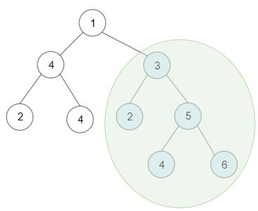

### 二叉树基础知识简单回顾

**一些基本定理**：

性质1：二叉树第i层上的结点数目最多为 $2^{i-1}(i≥1)$ 。

性质2：深度为k的二叉树至多有$2^{k}-1(k≥1)$个结点。

性质3：包含n个结点的二叉树的高度至少为$\log_2(n+1)$。

性质4：任意一棵二叉树，若终端结点的个数为$n_0$，度为2的结点数为$n_2$，则$n_0=n_2+1$。

**满二叉树**：高度为h，并且由$2^{h} –1$个结点的二叉树，被称为满二叉树。

**完全二叉树**：一棵二叉树中，只有最下面两层结点的度可以小于2，并且最下一层的叶结点集中在靠左的若干位置上。

**二叉查找树(BST)**：又被称为二叉搜索树。设x为二叉查找树中的一个结点，x节点包含关键字key，节点x的key值记为key[x]。如果y是x的左子树中的一个结点，则key[y] <= key[x]；如果y是x的右子树的一个结点，则 key[y] >= key[x] 。


### 深度优先搜索

#### 前序遍历


#### 中序遍历


#### 后序遍历

#### 最长同值路径

给定一个二叉树的 root ，返回 最长的路径的长度 ，这个路径中的 每个节点具有相同值 。 这条路径可以经过也可以不经过根节点。

两个节点之间的路径长度 由它们之间的边数表示。

```
输入：root = [5,4,5,1,1,5]
输出：2
```


```java
public class Solution {
    int maxPath = 0;

    // 求以root为根节点的子树的一侧最长路径
    private int dfs(TreeNode root){
        if (root == null) return 0;
        int left = dfs(root.left); // 获取左子树的最长同值路径
        int right = dfs(root.right); // 获取右子树的最长同值路径
        int left1 = 0,right1 = 0;
        // 如果根节点等于左孩子结点值，那么更新左边最长同值路径长度
        if (root.left != null && root.left.val == root.val){
            left1 = left + 1;
        }
        // 如果根节点等于右孩子结点值，那么更新右边最长同值路径长度
        if (root.right != null && root.right.val == root.val){
            right1 = right + 1;
        }
        // 更新以当前结点为根节点的最长同值路径长度
        maxPath = Math.max(maxPath,left1 + right1);
        // 返回当前结点一侧的最长同值路径
        return Math.max(left1,right1);
    }
    public int longestUnivaluePath(TreeNode root) {
        dfs(root);
        return maxPath;
    }
}

```


### 广度优先搜索

#### 层次遍历


#### 二叉树最大宽度

给你一棵二叉树的根节点 root ，返回树的 最大宽度 。

树的 最大宽度 是所有层中最大的 宽度 。

每一层的 宽度 被定义为该层最左和最右的非空节点（即，两个端点）之间的长度。将这个二叉树视作与满二叉树结构相同，两端点间会出现一些延伸到这一层的 null 节点，这些 null 节点也计入长度。

题目数据保证答案将会在  32 位 带符号整数范围内。


```
输入：root = [1,3,2,5,3,null,9]
输出：4
解释：最大宽度出现在树的第 3 层，宽度为 4 (5,3,null,9) 。
```

求每一层的宽度时，因为两端点间的 $\texttt{null}$节点也需要计入宽度，因此可以对节点进行编号。一个编号为 $\textit{index}$的左子节点的编号记为 $2 \times \textit{index}$，右子节点的编号记为 $2 \times \textit{index} + 1$，计算每层宽度时，用每层节点的最大编号减去最小编号再加 1 即为宽度。

```java
class pair{
    TreeNode node;
    Integer index;

    public pair(TreeNode node, Integer index) {
        this.node = node;
        this.index = index;
    }
}
class Solution {
    public int widthOfBinaryTree(TreeNode root) {
        int maxHeight = 1;
        Queue<pair> q = new ArrayDeque<>();
        q.offer(new pair(root,1));
        while (!q.isEmpty()){
            int size = q.size();
            int left = q.peek().index;
            int right = left;
            for (int i = 0;i < size;i++){
                pair top = q.poll();
                right = top.index;
                if (top.node.left != null){
                    q.offer(new pair(top.node.left,top.index * 2));
                }
                if (top.node.right != null){
                    q.offer(new pair(top.node.right,top.index * 2 + 1));
                }
            }
            maxHeight = Math.max(maxHeight,right - left + 1);
        }
        return maxHeight;
    }
}
```


### 巧用性质类题目

有时候遇到二叉树的问题，需要巧用一些性质来解决。

#### 例：二叉树的完全性检验

> 题目来源：Leetcode 958. 

给定一个二叉树，确定它是否是一个完全二叉树。

**题目解析**：

假如我们在深度为 3 的行有 4 个节点，位置为 0，1，2，3；那么就有 8 个深度为 4 的新节点位置在 0，1，2，3，4，5，6，7；所以我们可以找到规律：对于一个节点，它的左孩子为：`(depth, position) -> (depth + 1, position * 2)`，右孩子为 `(depth, position) -> (depth + 1, position * 2 + 1)`。所以，对于深度为 d 的行恰好含有$ 2^{d-1} $ 个节点，所有节点都是靠左边排列的当他们的位置编号是 0, 1, ... 且没有间隙。

> 因此我们可以给每个结点标注一个位置pos，最后判断最后一个结点的位置 是否 等于树的结点个数。

```cpp
class Solution {
public:
    struct node {
        TreeNode * Node;
        unsigned long long pos;
    };
    //记录数结点个数
    unsigned long long treeSize = 0;
    //记录最大位置
    unsigned long long maxPos = 0;
    bool isCompleteTree(TreeNode* root) {
        if(root == nullptr) return true;
        queue<node> q;
        q.push({root,1});
        treeSize++;
        //层次遍历
        while(!q.empty()){
            node tmp = q.front();
            //更新最大位置
            maxPos = max(maxPos,tmp.pos);
            q.pop();
            if(tmp.Node->left){
                q.push({tmp.Node->left,tmp.pos*2});
                treeSize++;
            }
            if(tmp.Node->right){
                q.push({tmp.Node->right,tmp.pos*2+1});
                treeSize++;
            }
        }
        return maxPos == treeSize;
    }
};
```


**二叉树常见遍历方式**：

前序遍历：`根+左子树+右子树`

中序遍历：` 左子树+根+右子树`

后序遍历：` 左子树+右子树+根`

> 当然还有层次遍历[BFS] (后续会讲)、欧拉环游遍历等等，具体就不介绍了，有需要的可以了解下。

二叉树欧拉环游遍历简单介绍：https://blog.csdn.net/qq_42642142/article/details/107292639 

**根据前序遍历和中序遍历 构造二叉树**

只要我们在中序遍历中定位到根节点，那么我们就可以分别知道左子树和右子树中的节点数目。由于同一颗子树的前序遍历和中序遍历的长度显然是相同的，因此我们就可以对应到前序遍历的结果中，对上述形式中的所有左右括号进行定位。

```cpp
class Solution {
public:
    map<int,int> m;//哈希表 存储中序遍历中每个结点的 值-下标
    TreeNode * BuildTree_Recursive(vector<int> & preorder,vector<int>&inorder,int pre_left,int pre_right,int in_left,int in_right){
        if(pre_left > pre_right){
            return nullptr;
        }
        //得到根节点的值
        int pre_root = preorder[pre_left];
        //根据根结点的值获取中序遍历中根节点下标
        int in_root_index = m[pre_root];
        //左子树结点个数
        int left_count = in_root_index - in_left;
        //创建根节点
        TreeNode * root = new TreeNode(pre_root);
        //递归创建左子树
        root->left = BuildTree_Recursive(preorder,inorder,pre_left+1,pre_left+left_count,in_left,in_root_index-1);
        //递归创建右子树
        root->right = BuildTree_Recursive(preorder,inorder,pre_left+left_count+1,pre_right,in_root_index+1,in_right);
        return root;
    }
    TreeNode* buildTree(vector<int>& preorder, vector<int>& inorder) {
        int n = preorder.size();
        //通过哈希表记录中序序列中每个结点的下标
        for(int i = 0;i < n;i++){
            m.insert(make_pair(inorder[i],i));
        }
        return BuildTree_Recursive(preorder,inorder,0,n-1,0,n-1);
    }
};
```

**根据后序遍历和中序遍历 构造二叉树**

> 其实根据后序和中序构造二叉树 基本思想是和 根据前序和中序构造二叉树一样的。

序遍历的数组最后一个元素代表的即为根节点。知道这个性质后，我们可以利用已知的根节点信息在中序遍历的数组中找到根节点所在的下标，然后根据其将中序遍历的数组分成左右两部分，左边部分即左子树，右边部分为右子树，针对每个部分可以用同样的方法继续递归下去构造。

```cpp
class Solution {
public:
    map<int,int> m;
    TreeNode *buildTree_recursive(vector<int> &inorder,vector<int> &postorder,int in_left,int in_right,int post_left,int post_right){
        //左边界大于有边界，说明已经没有了，则返回null
        if(in_left > in_right) return nullptr;
        //通过后序遍历获得根节点的值
        int in_root = postorder[post_right];
        //或许根节点在中序遍历中的索引下标
        int in_root_index = m[in_root];
        //通过中序遍历及根节点的索引下标计算左子树的结点个数
        int left_count =in_root_index - in_left;
        //创建一个根结点
        TreeNode * root = new TreeNode(in_root);
        //递归创建 中序中左子树范围left - root-1，后序中左子树范围 left - left+cnt-1
        root->left = buildTree_recursive(inorder,postorder,in_left,in_root_index-1,post_left,post_left+left_count-1);
        //递归创建 中序中右子树范围root + 1 - right，后序中左子树范围 left+cnt - right
        root->right = buildTree_recursive(inorder,postorder,in_root_index+1,in_right,post_left+left_count,post_right-1);
        return root;
    }
    TreeNode* buildTree(vector<int>& inorder, vector<int>& postorder) {
        int n = inorder.size();
        //初始化哈希表 创建中序遍历中 值与索引的映射
        for(int i = 0;i < n;i++){
            m.insert(make_pair(inorder[i],i));
        }
        return buildTree_recursive(inorder,postorder,0,n-1,0,n-1);
    }
};
```

**根据 前序遍历 和 后序遍历 来构造二叉树**

根据前序遍历和后序遍历的结构可知，假设如果最终的二叉树可以被序列化的表述为 [1, 2, 3, 4, 5, 6, 7]，那么其前序遍历为 [1] + [2, 4, 5] + [3, 6, 7]，而后序遍历为 [4, 5, 2] + [6, 7, 3] + [1].

如果我们知道左分支有多少个结点，我们就可以对这些数组进行分组，并用递归生成树的每个分支。

我们令左分支有 L个节点。我们知道左分支的头节点为 pre[1]，但它也出现在左分支的后序表示的最后。所以 `pre[1] = post[L-1]`（因为结点的值具有唯一性），因此` L = post.indexOf(pre[1]) + 1`。

现在在我们的递归步骤中，左分支由 `pre[1 : L+1] `和 `post[0 : L] `重新分支，而右分支将由 `pre[L+1 : N]` 和 `post[L : N-1]` 重新分支。

```cpp
class Solution {
public:
    TreeNode* constructFromPrePost(vector<int>& preorder, vector<int>& postorder) {
        int n = preorder.size();
        //空 直接返回空指针
        if(n == 0) return nullptr;
        //新建一个结点作为根节点 前序遍历的第一个结点为根结点
        TreeNode * root = new TreeNode(preorder[0]);
        if(n == 1) return root;
        
        int L = 0;
        //遍历 后续序列 找到当前根结点左子树中根节点preorder[1]的下标
        for(int i = 0;i < n;i++){
            if(postorder[i] == preorder[1]){
                L = i + 1;//得到的L就是左子树中结点的个数
                break;
            }
        }
        vector<int> tmppre;
        vector<int> tmppost;
        //划分左子树和右子树，进行递归操作
        //注意 assign 是将[first,last)中的元素拷贝成为一个新的vector
        tmppre.assign(preorder.begin()+1,preorder.begin()+1+L);//前序中左子树的范围
        tmppost.assign(postorder.begin(),postorder.begin()+L);//后序中左子树的范围
        root->left = constructFromPrePost(tmppre,tmppost);//递归创建

        tmppre.assign(preorder.begin()+1+L,preorder.end());//前序中右子树的范围
        tmppost.assign(postorder.begin()+L,postorder.end()-1);//后序中右子树的范围
        root->right = constructFromPrePost(tmppre,tmppost);//递归创建

        return root;
    }
};
```

上述程序可以优化，即将循环搜索提前进行一次遍历，然后将后序遍历的 值-索引 存储起来，如下：

```cpp
class Solution {
public:
    map<int,int> m;//哈希表
    TreeNode * buildTree(vector<int>& preorder, vector<int>& postorder,int pre_left,int pre_right,int post_left,int post_right){
        if(pre_left > pre_right) return nullptr;//没有结点了，返回空指针
        //创建根节点
        TreeNode * root = new TreeNode(preorder[pre_left]);
        //如果 左边界 == 右边界，说明只有一个结点了，直接返回
        if(pre_left == pre_right) return root;
        //计算左子树的结点个数
        int L = m[preorder[pre_left+1]] - post_left + 1;
        //递归创建 方法类似
        root->left = buildTree(preorder,postorder,pre_left+1,pre_left+L,post_left,post_left+L-1);
        root->right = buildTree(preorder,postorder,pre_left+L+1,pre_right,post_left+L,post_right-1);
        return root;
    }
    TreeNode* constructFromPrePost(vector<int>& preorder, vector<int>& postorder) {
        int n = postorder.size();
        //初始化哈希表，存储后序遍历的 值-索引
        for(int i = 0;i < n;i++){
            m.insert(make_pair(postorder[i],i));
        }
        //创建树 递归
        return buildTree(preorder,postorder,0,n-1,0,n-1);
    }
};
```

> 总结：无论通过先序、中序、后序中的哪两个序列创建二叉树，递归创建方法的核心思想就是要找到左子树的个数，这样一来右子树结点的个数也可以通过根节点来确定，然后进行递归创建。

### 二叉树路径问题

二叉数常见的问题是路径问题，对于二叉树路径的问题大致可以分为两类：

- 自顶向下：就是从某一个节点(不一定是根节点)，从上向下寻找路径，到某一个节点(不一定是叶节点)结束
- 非自顶向下：从任意节点到任意节点的路径，不需要自顶向下,也就是说可能是路径中包含`兄弟结点等其他亲戚结点`的路径

### 自顶向下

注意点：

1. 是否要回溯?

   二叉树的问题大部分是不需要回溯的，原因如下：二叉树的递归部分：dfs(root->left),dfs(root->right)已经把可能的路径穷尽了,因此到任意叶节点的路径只可能有一条，绝对不可能出现另外的路径也到这个满足条件的叶节点的;

2. 找到路径后是否要return?
   取决于题目是否要求找到叶节点满足条件的路径,如果必须到叶节点,那么就要return;
   但如果是到任意节点都可以，那么必不能return,因为这条路径下面还可能有更深的路径满足条件，还要在此基础上继续递归

3. 是否要双重递归?(即调用根节点的dfs函数后，继续调用根左右节点的pathsum函数)

   看题目要不要求从根节点开始的，还是从任意节点开始

**模板框架**：

```cpp
//一般路径：
vector<vector<int>>res;
void dfs(TreeNode*root,vector<int>path) //注意此处path没有引用哦，因此每次调用函数，修改的都是path的拷贝
{
    //根节点为空直接返回
    if(!root) return;
    //作出选择 将该结点
    path.push_back(root->val);
    //如果到叶节点 
    if(!root->left && !root->right)  
    {
        //添加路径
        res.push_back(path);
        return;
    }
    //继续递归
    dfs(root->left,path);  
    dfs(root->right,path);
}

// **给定和的路径：**
void dfs(TreeNode*root, int sum, vector<int> path)
{
    //空结点 退出
    if (!root)
        return;
    //记录当前的和
    sum -= root->val;
    //加入该结点
    path.push_back(root->val);
    //符合条件，保存该结果
    if (!root->left && !root->right && sum == 0)
    {
        res.push_back(path);
        return;
    }
    //继续递归
    dfs(root->left, sum, path);
    dfs(root->right, sum, path);
}
```


#### 二叉树中的列表

给你一棵以 root 为根的二叉树和一个 head 为第一个节点的链表。

如果在二叉树中，存在一条一直向下的路径，且每个点的数值恰好一一对应以 head 为首的链表中每个节点的值，那么请你返回 True ，否则返回 False 。

一直向下的路径的意思是：从树中某个节点开始，一直连续向下的路径。


```
输入：head = [4,2,8], root = [1,4,4,null,2,2,null,1,null,6,8,null,null,null,null,1,3]
输出：true
解释：树中蓝色的节点构成了与链表对应的子路径。
```

```java
/**
 * Definition for singly-linked list.
 * public class ListNode {
 *     int val;
 *     ListNode next;
 *     ListNode() {}
 *     ListNode(int val) { this.val = val; }
 *     ListNode(int val, ListNode next) { this.val = val; this.next = next; }
 * }
 */
/**
 * Definition for a binary tree node.
 * public class TreeNode {
 *     int val;
 *     TreeNode left;
 *     TreeNode right;
 *     TreeNode() {}
 *     TreeNode(int val) { this.val = val; }
 *     TreeNode(int val, TreeNode left, TreeNode right) {
 *         this.val = val;
 *         this.left = left;
 *         this.right = right;
 *     }
 * }
 */
class Solution {
    public boolean isSubPath(ListNode head, TreeNode root) {
        return search(head,root);
    }
    private boolean dfs(ListNode head,TreeNode root){
        if (root == null && head == null){
            return true;
        }else if (root == null && head != null){
            return false;
        }else if (root != null && head == null) {
            return true;
        }
        if (root.val == head.val){
            return dfs(head.next, root.left) || dfs(head.next, root.right);
        }else {
            return false;
        }
    }
    private boolean search(ListNode head, TreeNode root){
        if (root == null){
            return false;
        }
        if (root.val == head.val && dfs(head,root)){
            return true;
        }
        return search(head,root.left) || search(head,root.right);
    }
}
```


#### 不同的二叉搜索树

给你一个整数 `n` ，请你生成并返回所有由 `n` 个节点组成且节点值从 `1` 到 `n` 互不相同的不同 **二叉搜索树** 。可以按 **任意顺序** 返回答案。


```
输入：n = 3
输出：[[1,null,2,null,3],[1,null,3,2],[2,1,3],[3,1,null,null,2],[3,2,null,1]]
```

二叉搜索树关键的性质是根节点的值大于左子树所有节点的值，小于右子树所有节点的值，且左子树和右子树也同样为二叉搜索树。因此在生成所有可行的二叉搜索树的时候，假设当前序列长度为 n，如果我们枚举根节点的值为 i，那么根据二叉搜索树的性质我们可以知道左子树的节点值的集合为 $[1 \ldots i-1]$，右子树的节点值的集合为 $[i+1 \ldots n]$。

定义 $generateTrees(start, end) $函数表示当前值的集合为 $[\textit{start},\textit{end}]$，返回序列 $[\textit{start},\textit{end}]$ 生成的所有可行的二叉搜索树。按照上文的思路，我们考虑**枚举 $[\textit{start},\textit{end}]$ 中的值 i 为当前二叉搜索树的根**，那么序列划分为了 $[\textit{start},i-1]$ 和 $[i+1,\textit{end}]$ 两部分。我们递归调用这两部分，即 $generateTrees(start, i - 1) $和 $generateTrees(i + 1, end)$，获得所有可行的左子树和可行的右子树，那么最后一步我们只要从可行左子树集合中选一棵，再从可行右子树集合中选一棵拼接到根节点上，并将生成的二叉搜索树放入答案数组即可。

递归的入口即为 $generateTrees(1, n)$，出口为当 $\textit{start}>\textit{end}$ 的时候，当前二叉搜索树为空，返回空节点即可。

```java
/**
 * Definition for a binary tree node.
 * public class TreeNode {
 *     int val;
 *     TreeNode left;
 *     TreeNode right;
 *     TreeNode() {}
 *     TreeNode(int val) { this.val = val; }
 *     TreeNode(int val, TreeNode left, TreeNode right) {
 *         this.val = val;
 *         this.left = left;
 *         this.right = right;
 *     }
 * }
 */
class Solution {
    private List<TreeNode> generate(int start,int end){
        List<TreeNode> allnodes = new ArrayList<>();
        if (start > end){
            allnodes.add(null);
            return allnodes;
        }
        // 枚举所有根节点
        for (int i = start;i <= end;i++){
            List<TreeNode> lnodes = generate(start,i-1);
            List<TreeNode> rnodes = generate(i+1,end);
			// 从左右子树集合中挑选作为当前结点的左右子树
            for (TreeNode lnode : lnodes){
                for (TreeNode rnode : rnodes){
                    TreeNode node = new TreeNode(i,lnode,rnode);
                    allnodes.add(node);
                }
            }
        }
        return allnodes;
    }
    public List<TreeNode> generateTrees(int n) {
        if (n == 0){
            return new ArrayList<>();
        }
        return generate(1,n);
    }
}
```


### 非自顶向下

这类题目一般解题思路为：
设计一个maxPath函数，调用自身求出以一个节点为根节点的左侧最长路径left和右侧最长路径right，那么经过该节点的最长路径就是left+right接着只需要从根节点开始dfs,不断比较更新全局变量即可。

**模板框架**：

```cpp
int res=0;
int maxPath(TreeNode *root) //以root为路径起始点的最长路径
{
    if (!root)
        return 0;
    //左子树的最长路径
    int left=maxPath(root->left);
    //右子树的最长路径
    int right=maxPath(root->right);
    //更新全局变量 
    res = max(res, left + right + root->val);
    //返回左右路径较长者
    return max(left, right);   
}
```

#### 例：最长同值路径

> Leetcode 687. 

给定一个二叉树，找到最长的路径，这个路径中的每个节点具有相同值。 这条路径可以经过也可以不经过根节点。

**注意**：两个节点之间的路径长度由它们之间的边数表示。

```
输入:
              1
             / \
            4   5
           / \   \
          4   4   5
输出:
2
```

```cpp
//套用非自顶向下的方法模板
class Solution {
public:
    //全局结果
    int ans = 0;
    //递归函数：以root结点为根节点的相同的值结点的路径长度为多少
    int dfs(TreeNode * root){
        //如果空 返回0
        if(root == nullptr) return 0;
        //递归左子树
        int left = dfs(root->left);
        //如果左子树存在且其值等于根结点值，则其左子树路径长度+1
        if(root->left && root->left->val == root->val){
            left++;
        }else{//否则之间为0
            left = 0;
        }
        //递归右子树
        int right = dfs(root->right);
        //如果右子树存在且其值等于根结点值，则其右子树路径长度+1
        if(root->right && root->right->val == root->val){
            right++;
        }else{//否则之间为0
            right =0;
        }
        //更新结果，左右子树长度之和
        ans = max(ans,left+right);
        //返回两者之间大的哪个
        return max(left,right);
    }
    int longestUnivaluePath(TreeNode* root) {
        if(root == nullptr) return 0;
        dfs(root);
        return ans;
    }
};
```


#### 例：二叉树剪枝

> 题目来源：leetcode 814. 

给你二叉树的根结点 root ，此外树的每个结点的值要么是 0 ，要么是 1 。返回移除了所有不包含 1 的子树的原二叉树。

节点 node 的子树为 node 本身加上所有 node 的后代。


```
输入：root = [1,0,1,0,0,0,1]
输出：[1,null,1,null,1]
```

```cpp
class Solution {
public:
    //递归函数：判断以root为根结点的子树是否包含1
    bool hasOne(TreeNode *root){
        //如果为空结点 直接返回false
        if(root == nullptr) return false;
        //递归左右子树
        bool lefthas = hasOne(root->left);
        bool righthas = hasOne(root->right);
        //如果左子树没有1,直接删除
        if(!lefthas){
            root->left = nullptr;
        }
        //如果右子树没有1,直接删除
        if(!righthas){
            root->right = nullptr;
        }
        //如果当前结点为1直接返回true
        if(root->val == 1) return true;
        //左右子树如果都没false，否则true
        return lefthas || righthas;
    }

    TreeNode* pruneTree(TreeNode* root) {
        if(root == nullptr) return nullptr;
        if(root->val == 0 && !root->left && !root->right) return nullptr;
        if(!hasOne(root)) return nullptr;
        return root;
    }
};
```

### 二叉树另类问题

我把二叉树另类问题解释为在进行二叉树遍历的过程中，可能需要记录一些其他的信息，来方便进行解题。常见的就是哈希表、数组等数据结果来存储临时信息。

这类题比较巧，当你想了想采用不了上述的一些二叉树方法解决时，可以考虑是否能牺牲些内存空间来帮助你记录些有用的信息。

#### 例：二叉树中所有距离为 K 的结点

> 来源：leetcode 863. 

给定一个二叉树（具有根结点 root）， 一个目标结点 target ，和一个整数值 K 。

返回到目标结点 target 距离为 K 的所有结点的值的列表。 答案可以以任何顺序返回。

```
输入：root = [3,5,1,6,2,0,8,null,null,7,4], target = 5, K = 2
输出：[7,4,1]
```


```
提示：
1.给定的树是非空的。
2.树上的每个结点都具有唯一的值 0 <= node.val <= 500 。
```

**解题分析**：

如果我们从target结点出发dfs进行递归搜索，只能找到其子树下相距为k的结点，找不到距离为k的祖先结点。===> 因此 我们就可以想**能否通过一个数据结果记录每个结点的父亲结点，这样我们就可以递归找到对应的祖先结点的解**

可以通过哈希表来记录父亲结点信息，其中key为当前结点的值,val为祖先结点的指针。为此，我们从根结点root 出发，使用深度优先搜索遍历整棵树，同时用一个哈希表记录每个结点的父结点。

然后从 target 出发，使用深度优先搜索遍历整棵树，除了搜索左右儿子外，还可以顺着父结点向上搜索。

代码实现时，由于每个结点值都是唯一的，哈希表的键可以用结点值代替。**此外，为避免在深度优先搜索时重复访问结点，递归时额外传入来源结点 from，在递归前比较目标结点是否与来源结点相同，不同的情况下才进行递归**。这句话开始可能不好理解，但是你把递归图画一下就理解了。如果对图的dfs了解比较清楚的同学那么肯定一下就想明白了，因为**此时遍历这颗树就像遍历一个有向图**。

```cpp
class Solution {
public:
    vector<int> ans;
    map<int,TreeNode *> m; //key:node val:father
    void buildMap(TreeNode * root){
        if(root->left != NULL){
            //建立映射
            m.insert({root->left->val,root});
            //继续递归
            buildMap(root->left);
        }
        if(root->right != NULL){
            //建立映射
            m.insert({root->right->val,root});
            //继续递归
            buildMap(root->right);
        }
    }
    void findTarget(TreeNode * node,TreeNode * from,int floor,int k){
        if(node == NULL){
            return ;
        }
        //找到了 存入结果
        if(floor == k){
            ans.push_back(node->val);
            return ;
        }
        //好好理解一下下面的内容，不然可能会进入死循环
        //如果当前结点的左节点是上次递归进来的结点，则跳过
        if(node->left != from){
            findTarget(node->left,node,floor+1,k);    
        }
        //如果当前结点的右节点是上次递归进来的结点，则跳过
        if(node->right != from){
            findTarget(node->right,node,floor+1,k);  
        }
        //如果当前结点的父亲节点是上次递归进来的结点，则跳过
        if(m[node->val] != from){
            findTarget(m[node->val],node,floor+1,k);
        }
        
    }
    vector<int> distanceK(TreeNode* root, TreeNode* target, int k) {
        buildMap(root);
        findTarget(target,NULL,0,k);
        return ans;
    }
};
```

#### **例：具有所有最深节点的最小子树**

> 题目来源：Leetcode 865.

给定一个根为 root 的二叉树，每个节点的深度是 该节点到根的最短距离 。

如果一个节点在 整个树 的任意节点之间具有最大的深度，则该节点是 最深的 。

一个节点的 子树 是该节点加上它的所有后代的集合。

返回能满足 以该节点为根的子树中包含所有最深的节点 这一条件的具有最大深度的节点。

> 提示：每个结点的值都是独一无二的

```
输入：root = [3,5,1,6,2,0,8,null,null,7,4]
输出：[2,7,4]
```


**题目解析**：

首先我们需要知道哪个结点是深度最大的结点，因此需要进行一次`递归遍历`，在递归遍历过程中记录每个结点的`深度信息`及`整棵树的最大深度`，可以将其对应存放在`哈希表`及`一个变量中`，然后我们再进行一次`递归遍历`[深度优先搜索]，返回`拥有所有的最深节点的子树根节点`

定义第二次深度优先搜索方法为 getMaxDepthSubTree(node)，每次递归有以下四种情况需要处理：

- 如果 node 为空，返回 null。
- 如果node为最深结点，返回node
- 如果 node 左右子树的后代中都有最深节点，返回 node。
- 如果只有左子树或右子树中有且拥有所有的最深节点，返回 node 的左/右孩子。
- 否则，当前子树中不存在答案,返回null

```cpp
class Solution {
public:
    int maxDepth = -1;
    TreeNode * ans;
    //记录所有结点深度的哈希表
    map<TreeNode *,int> m;
    //记录最大结点深度的哈希表
    map<TreeNode *,int> maxDepthNode;
    //第一次深度优先搜索，记录结点深度
    void dfs(TreeNode * root,int depth){
        if(root == nullptr) return ;
        //存储信息
        m.insert(make_pair(root,depth));
        //更新最大深度
        maxDepth = max(maxDepth,depth);
        //递归遍历
        dfs(root->left,depth+1);
        dfs(root->right,depth+1);
    }
    TreeNode * getMaxDepthSubTree(TreeNode * root){
        if(root == nullptr) return nullptr;
        //如果当前结点是最深结点，直接返回该结点
        if(maxDepthNode.find(root) != maxDepthNode.end()){
            return root;
        }
        //递归
        TreeNode * left = getMaxDepthSubTree(root->left);
        TreeNode * right = getMaxDepthSubTree(root->right);
        //如果左右子树中都有最深结点，返回当前结点
        if(left && right){
            return root;
        }else if(left && !right){//否则其中之一是，则返回对应的结点
            return left;
        }else if(!left && right){
            return right;
        }else{//否则返回null
            return nullptr;
        }
    }
    TreeNode* subtreeWithAllDeepest(TreeNode* root) {
        if(root == nullptr) return nullptr;
        //获取所有结点深度
        dfs(root,0);
        //找最大深度结点
        for(auto iter = m.begin(); iter != m.end();iter++){
            if(iter->second == maxDepth){
                maxDepthNode.insert(make_pair(iter->first,iter->second));
            }
        }
        //求取拥有所有的最深节点的子树根节点
        return getMaxDepthSubTree(root);
    }
};
```


### 二叉搜索树

#### 删除二叉搜索树中的节点

> 题目来源：Leetcode 450

给定一个二叉搜索树的根节点 root 和一个值 key，删除二叉搜索树中的 key 对应的节点，并保证二叉搜索树的性质不变。返回二叉搜索树（有可能被更新）的根节点的引用。

一般来说，删除节点可分为两个步骤：

- 首先找到需要删除的节点；
- 如果找到了，删除它。

```
输入：root = [5,3,6,2,4,null,7], key = 3
输出：[5,4,6,2,null,null,7]
解释：给定需要删除的节点值是 3，所以我们首先找到 3 这个节点，然后删除它。
一个正确的答案是 [5,4,6,2,null,null,7], 如下图所示。
另一个正确答案是 [5,2,6,null,4,null,7]。
```


题目解析：

- $root$ 为空，代表未搜索到值为 $\textit{key}$ 的节点，返回空。
- $\textit{root.val} > \textit{key}$，表示值为 $\textit{key}$的节点可能存在于 $\textit{root}$的左子树中，需要递归地在 $\textit{root.left}$ 调用 $\textit{deleteNode}$，并返回 $\textit{root}$。
- $\textit{root.val} < \textit{key}$，表示值为 $\textit{key}$的节点可能存在于 $\textit{root}$的右子树中，需要递归地在 $\textit{root.right}$ 调用 $\textit{deleteNode}$，并返回 $\textit{root}$。
- $\textit{root.val} = \textit{key}$，$\textit{root}$即为要删除的节点。此时要做的是删除 $\textit{root}$，并将它的子树合并成一棵子树，保持有序性，并返回根节点。根据 $\textit{root}$的子树情况分成以下情况讨论：
  1. $\textit{root}$为叶子节点，没有子树。此时可以直接将它删除，即返回空。
  2. $\textit{root}$只有左子树，没有右子树。此时可以将它的左子树作为新的子树，返回它的左子节点。
  3. $\textit{root}$只有右子树，没有左子树。此时可以将它的右子树作为新的子树，返回它的右子节点。
  4. $\textit{root}$有左右子树，这时可以将 $\textit{root}$的后继节点（比 $\textit{root}$ 大的最小节点，即它的右子树中的最小节点，记为 $\textit{successor}$）作为新的根节点替代 $\textit{root}$，并将 $\textit{successor}$ 从 $\textit{root}$ 的右子树中删除，使得在保持有序性的情况下合并左右子树。


```java
class Solution {
    public TreeNode deleteNode(TreeNode root, int key) {
        if (root == null) return null;
        // 目标值在右子树中
        if (root.val < key){
            root.right = deleteNode(root.right,key);
            return root;
        }else if (root.val > key){ //目标值在左子树中
            root.left = deleteNode(root.left,key);
            return root;
        }else{ // 找到了key root.val == key
            if (root.left == null && root.right == null){
                return null;
            }else if (root.left == null){
                return root.right;
            }else if (root.right == null){
                return root.left;
            }else{
                TreeNode t = root.right;
                while (t.left != null){
                    t = t.left;
                }
                // 在右子树中删除哪个要替换目标值的结点
                root.right = deleteNode(root.right,t.val);
                // 更新指针
                t.right = root.right;
                t.left = root.left;
                return t;
            }
        }
    }
}
```

#### 修建二叉搜索树

给你二叉搜索树的根节点 root ，同时给定最小边界low 和最大边界 high。通过修剪二叉搜索树，使得所有节点的值在[low, high]中。修剪树 不应该 改变保留在树中的元素的相对结构 (即，如果没有被移除，原有的父代子代关系都应当保留)。 可以证明，存在 唯一的答案 。

所以结果应当返回修剪好的二叉搜索树的新的根节点。注意，根节点可能会根据给定的边界发生改变。


```
输入：root = [1,0,2], low = 1, high = 2
输出：[1,null,2]
```

```java
class Solution {
    public TreeNode trimBST(TreeNode root, int low, int high) {
        if (root == null) return root;
        // 如果当前结点的值小于左边界
        if (root.val < low){
            root.left = null; // 根据BST性质左子树肯定都不符合，全部删除
            return trimBST(root.right,low,high); // 递归右子树
        }else if (root.val > high){// 如果当前结点的值大于右边界
            root.right = null; // 根据BST性质右子树肯定都不符合，全部删除
            return trimBST(root.left,low,high); // 递归左子树
        }else{ // 如果在左右区间，递归左右子树
            root.left = trimBST(root.left,low,high);
            root.right = trimBST(root.right,low,high);
        }
        return root;
    }
} 
```


### 完全二叉树

#### 完全二叉树插入器

完全二叉树 是每一层（除最后一层外）都是完全填充（即，节点数达到最大）的，并且所有的节点都尽可能地集中在左侧。

设计一种算法，将一个新节点插入到一个完整的二叉树中，并在插入后保持其完整。

实现 CBTInserter 类:

- CBTInserter(TreeNode root) 使用头节点为 root 的给定树初始化该数据结构；

- CBTInserter.insert(int v)  向树中插入一个值为 Node.val == val的新节点 TreeNode。使树保持完全二叉树的状态，并返回插入节点 TreeNode 的父节点的值；

- CBTInserter.get_root() 将返回树的头节点。


```java
class CBTInserter {
    TreeNode root;
    Queue<TreeNode> candidate;
    public CBTInserter(TreeNode root) {
        this.root = root;
        candidate = new ArrayDeque<>();

        Queue<TreeNode> q =  new ArrayDeque<>();
        q.offer(root);
        while (!q.isEmpty()){
            TreeNode now = q.poll();
            if (now.left != null){
                q.offer(now.left);
            }
            if (now.right != null){
                q.offer(now.right);
            }

            if (now.left == null || now.right == null){
                candidate.offer(now);
            }
        }
    }

    public int insert(int val) {
        TreeNode add = new TreeNode(val);
        TreeNode top = candidate.peek();
        if (top.left == null){
            top.left = add;
        }else if (top.right == null){
            top.right = add;
            candidate.poll();
        }
        candidate.offer(add);
        return top.val;
    }

    public TreeNode get_root() {
        return this.root;
    }
}
```

#### 反转二叉树的奇数层

给你一棵 完美 二叉树的根节点 root ，请你反转这棵树中每个 奇数 层的节点值。

例如，假设第 3 层的节点值是 [2,1,3,4,7,11,29,18] ，那么反转后它应该变成 [18,29,11,7,4,3,1,2] 。
反转后，返回树的根节点。

完美 二叉树需满足：二叉树的所有父节点都有两个子节点，且所有叶子节点都在同一层。

节点的 层数 等于该节点到根节点之间的边数。


```java
class Solution {
    private void dfs(TreeNode l,TreeNode r,int level){
        if (l == null) return ;
        if (level % 2 == 1){// 奇数层
            int t = l.val;
            l.val = r.val;
            r.val = t;
        }
        dfs(l.left,r.right,level + 1);
        dfs(l.right,r.left,level + 1);
    }
    public TreeNode reverseOddLevels(TreeNode root) {
        if (root == null) return null;
        dfs(root.left,root.right,1);
        return root;
    }
}
```


### 其他经典

#### 最大二叉树

给定一个不重复的整数数组 nums 。 最大二叉树 可以用下面的算法从 nums 递归地构建:

- 创建一个根节点，其值为 nums 中的最大值。
- 递归地在最大值 左边 的 子数组前缀上 构建左子树。
- 递归地在最大值 右边 的 子数组后缀上 构建右子树。

返回 nums 构建的 最大二叉树 。


```
输入：nums = [3,2,1,6,0,5]
输出：[6,3,5,null,2,0,null,null,1]
```

题目解析：

最容易想到的就是递归的解法了，时间复杂度$O(n^2)$

```java
/**
 * Definition for a binary tree node.
 * public class TreeNode {
 *     int val;
 *     TreeNode left;
 *     TreeNode right;
 *     TreeNode() {}
 *     TreeNode(int val) { this.val = val; }
 *     TreeNode(int val, TreeNode left, TreeNode right) {
 *         this.val = val;
 *         this.left = left;
 *         this.right = right;
 *     }
 * }
 */
class Solution {
    int n;
    private TreeNode buildMaxTree(int l,int r,int [] nums){
        if (l > r) return null;
        int maxVal = Integer.MIN_VALUE;
        int maxIdx = -1;
        for (int i = l;i <= r;i++){
            if (nums[i] > maxVal){
                maxVal = nums[i];
                maxIdx = i;
            }
        }
        TreeNode root = new TreeNode(maxVal);
        root.left = buildMaxTree(l,maxIdx-1,nums);
        root.right = buildMaxTree(maxIdx+1,r,nums);
        return root;
    }
    public TreeNode constructMaximumBinaryTree(int[] nums) {
        n = nums.length;
        return buildMaxTree(0,n-1,nums);
    }
}
```

最优**单调栈**解法：

```java
    public TreeNode constructMaximumBinaryTree(int[] nums) {
        int n = nums.length;
        Deque<Integer> stack = new ArrayDeque<>();
        TreeNode [] tree = new TreeNode[n];
        for (int i = 0;i < n;i++){
            tree[i] = new TreeNode(nums[i]);
            while (!stack.isEmpty() && nums[i] > nums[stack.peekLast()]){
                tree[i].left = tree[stack.peekLast()];
                stack.pollLast();
            }
            if (!stack.isEmpty()){
                tree[stack.peekLast()].right = tree[i];
            }
            stack.offerLast(i);
        }
        return tree[stack.peekFirst()];
    }
```


#### 二叉树中最长交错路径

给你一棵以 root 为根的二叉树，二叉树中的交错路径定义如下：

- 选择二叉树中 任意 节点和一个方向（左或者右）。
- 如果前进方向为右，那么移动到当前节点的的右子节点，否则移动到它的左子节点。
- 改变前进方向：左变右或者右变左。
- 重复第二步和第三步，直到你在树中无法继续移动。
  交错路径的长度定义为：访问过的节点数目 - 1（单个节点的路径长度为 0 ）。

请你返回给定树中最长 交错路径 的长度。


```
输入：root = [1,null,1,1,1,null,null,1,1,null,1,null,null,null,1,null,1]
输出：3
解释：蓝色节点为树中最长交错路径（右 -> 左 -> 右）。
```

方法1：**动态规划**

记 f(u)为从根到节点 u 的路径上以 u 结尾并且 u 是它父亲的左儿子的最长交错路径，g(u) 为从根到节点 u 的路径上以 u 结尾并且 u 是它父亲的右儿子的最长交错路径。记 u 的父节点为 ${\rm father}(u)$，我们可以推得这样的转移方程：
$$
\begin{aligned} & f[u] = g[{\rm father}(u)] + 1 &,& \, u \text{是左儿子} \\ & g[u] = f[{\rm father}(u)] + 1 &,& \, u \text{是右儿子} \end{aligned}
$$

```java
//bfs
/**
 * Definition for a binary tree node.
 * public class TreeNode {
 *     int val;
 *     TreeNode left;
 *     TreeNode right;
 *     TreeNode() {}
 *     TreeNode(int val) { this.val = val; }
 *     TreeNode(int val, TreeNode left, TreeNode right) {
 *         this.val = val;
 *         this.left = left;
 *         this.right = right;
 *     }
 * }
 */
class pair{
    TreeNode node;
    TreeNode parent;
    public pair(TreeNode node, TreeNode parent) {
        this.node = node;
        this.parent = parent;
    }
}
class Solution {
    Map<TreeNode,Integer> f = new HashMap<>();
    Map<TreeNode,Integer> g = new HashMap<>();
    Queue<pair> q = new ArrayDeque<>();
    private void bfs(TreeNode root){
        f.put(root,0);
        g.put(root,0);
        q.offer(new pair(root,null));
        while (!q.isEmpty()){
            pair top = q.poll();
            TreeNode u = top.node, p = top.parent;
            f.put(u,0);
            g.put(u,0);
            if (p != null){
                if (p.left == u) {
                    f.put(u, g.get(p) + 1);
                }else{
                    g.put(u, f.get(p) + 1);
                }
            }
            if (u.left != null){
                q.offer(new pair(u.left,u));
            }
            if (u.right != null){
                q.offer(new pair(u.right,u));
            }
        }
    }
    public int longestZigZag(TreeNode root) {
        if (root == null) return 0;
        bfs(root);
        int ans = 0;
        for (TreeNode u : f.keySet()){
            ans = Math.max(ans,Math.max(f.get(u),g.get(u)));
        }
        return ans;
    }

}
```

#### 上下翻转二叉树

给定一个二叉树，其中所有的右节点要么是具有兄弟节点（拥有相同父节点的左节点）的叶节点，要么为空 将此二叉树上下翻转并将它变成一棵树， 原来的右节点将转换成左叶节点。返回新的根。

```
例子:

输入: [1,2,3,4,5]

    1
   / \
  2   3
 / \
4   5

输出: 返回二叉树的根 [4,5,2,#,#,3,1]

   4
  / \
 5   2
    / \
   3   1  
```

```java
    public TreeNode upsideDownBinaryTree(TreeNode root) {
        if (root == null ||  root.left == null) return root;
        TreeNode l = root.left;
        TreeNode r = root.right;
        root.left = null;
        root.right = null;
        TreeNode  p = upsideDownBinaryTree(l);
        l.left = r;
        l.right = root;
        return p;
    }
```


#### 寻找重复子树

给定一棵二叉树 root，返回所有重复的子树。

对于同一类的重复子树，你只需要返回其中任意一棵的根结点即可。

如果两棵树具有相同的结构和相同的结点值，则它们是重复的。


```
输入：root = [1,2,3,4,null,2,4,null,null,4]
输出：[[2,4],[4]]
```

**方法一**：序列化进行唯一表示

一种容易想到的方法是将每一棵子树都「序列化」成一个字符串，并且保证：

- 相同的子树会被序列化成相同的子串；
- 不同的子树会被序列化成不同的子串。

第一种方法是使用层序遍历的方法进行序列化，例如示例 1中的二叉树可以序列化为:$\text{1,2,3,4,null,2,4,null,null,4}$

这也是力扣平台上测试代码时输入一棵二叉树的默认方法。

第二种方法是使用递归的方法进行序列化。我们可以将一棵以 xx 为根节点值的子树序列化为：$\text{x(左子树的序列化结果)(右子树的序列化结果)}$

左右子树分别递归地进行序列化。如果子树为空，那么序列化结果为空串。示例 1中的二叉树可以序列化为：

1(2(4()())())(3(2(4()())())(4()()))

下面的代码使用的是第二种方法。我们需要使用一个哈希映射 $\textit{seen}$存储序列到子树的映射。如果在计算序列时，通过 $\textit{seen}$查找到了已经出现过的序列，那么就可以把对应的子树放到哈希集合 $\textit{repeat}$ 中，这样就可以保证同一类的重复子树只会被存储在答案中一次。

```java
class Solution {
    Map<String, TreeNode> seen = new HashMap<String, TreeNode>();
    Set<TreeNode> repeat = new HashSet<TreeNode>();

    public List<TreeNode> findDuplicateSubtrees(TreeNode root) {
        dfs(root);
        return new ArrayList<TreeNode>(repeat);
    }

    public String dfs(TreeNode node) {
        if (node == null) {
            return "";
        }
        StringBuilder sb = new StringBuilder();
        sb.append(node.val);
        sb.append("(");
        sb.append(dfs(node.left));
        sb.append(")(");
        sb.append(dfs(node.right));
        sb.append(")");
        String serial = sb.toString();
        if (seen.containsKey(serial)) {
            repeat.add(seen.get(serial));
        } else {
            seen.put(serial, node);
        }
        return serial;
    }
}

```

使用三元组进行唯一表示：

我们可以用一个三元组直接表示一棵子树，即 (x, l, r)，它们分别表示：

根节点的值为 x；

左子树的序号为 l；

右子树的序号为 r。

这里的「序号」指的是：每当我们发现一棵新的子树，就给这棵子树一个序号，用来表示其结构。那么两棵树是重复的，当且仅当它们对应的三元组完全相同。

使用「序号」的好处在于同时减少了时间复杂度和空间复杂度。方法一的瓶颈在于生成的序列会变得非常长，而使用序号替换整个左子树和右子树的序列，可以使得每一个节点只使用常数大小的空间。

```java
class Solution {
    Map<String, Pair<TreeNode, Integer>> seen = new HashMap<String, Pair<TreeNode, Integer>>();
    Set<TreeNode> repeat = new HashSet<TreeNode>();
    int idx = 0;

    public List<TreeNode> findDuplicateSubtrees(TreeNode root) {
        dfs(root);
        return new ArrayList<TreeNode>(repeat);
    }

    public int dfs(TreeNode node) {
        if (node == null) {
            return 0;
        }
        int[] tri = {node.val, dfs(node.left), dfs(node.right)};
        String hash = Arrays.toString(tri);
        if (seen.containsKey(hash)) {
            Pair<TreeNode, Integer> pair = seen.get(hash);
            repeat.add(pair.getKey());
            return pair.getValue();
        } else {
            seen.put(hash, new Pair<TreeNode, Integer>(node, ++idx));
            return idx;
        }
    }
}
```


#### 二叉搜索子树的最大键值和

给你一棵以 root 为根的 二叉树 ，请你返回 任意 二叉搜索子树的最大键值和。

二叉搜索树的定义如下：

- 任意节点的左子树中的键值都 小于 此节点的键值。
- 任意节点的右子树中的键值都 大于 此节点的键值。
- 任意节点的左子树和右子树都是二叉搜索树。




```
输入：root = [1,4,3,2,4,2,5,null,null,null,null,null,null,4,6]
输出：20
解释：键值为 3 的子树是和最大的二叉搜索树。
```

**题目解析**：

判断一颗树是否是二叉搜索树的充分条件:

- 根节点值大于左子树最大值，说明比左子树所有元素都大
- 根节点值小于右子树最小值，说明比右子树所有元素都小
- 左子树是二叉搜索树
- 右子树是二叉搜索树

满足上面四个条件，我们就推断出当前树是一颗二叉搜索树。

所以我们可以在每层递归里记录四个值:

- 当前树的最小值
- 当前树的最大值
- 当前树的和
- 当前树是否是二叉搜索树

当前调用层的每个值都可以根据它的左子树和右子树返回的数组，以及它本身的值来更新。

```java
    int ans = 0;
    /**
     * 递归遍历，返回当前子树的[min_val,max_val,sum,isBST]
     * @param root
     * @return
     */
    private int [] dfs(TreeNode root){
        if (root == null){
            return new int[]{Integer.MAX_VALUE,Integer.MIN_VALUE,0,1};
        }
        // 递归-后序遍历
        int [] left_info = dfs(root.left);
        int [] right_info = dfs(root.right);
        // 当前子树的和
        int nowSum = left_info[2] + right_info[2] + root.val;
        boolean isBST = false;
        // 判断当前子树是否是二叉搜索树
        if (root.val > left_info[1] && root.val < right_info[0]) {
            if (left_info[3] == 1 && right_info[3] == 1){
                isBST = true;
            }
        }
        // 如果当前子树是二叉搜索树，更新答案
        if (isBST){
            ans = Math.max(ans,nowSum);
        }
        // 求当前子树的最大值和最小值
        int nowMax = Math.max(root.val,Math.max(left_info[1],right_info[1]));
        int nowMin = Math.min(root.val,Math.min(left_info[0],right_info[0]));
        return new int[]{nowMin,nowMax,nowSum,(isBST ? 1 : 0)};
    }
    public int maxSumBST(TreeNode root) {
        dfs(root);
        return ans;
    }
```


#### 找出克隆二叉树中的相同节点

给你两棵二叉树，原始树 original 和克隆树 cloned，以及一个位于原始树 original 中的目标节点 target。

其中，克隆树 cloned 是原始树 original 的一个 副本 。

请找出在树 cloned 中，与 target 相同 的节点，并返回对该节点的引用（在 C/C++ 等有指针的语言中返回 节点指针，其他语言返回节点本身）。

注意：你 不能 对两棵二叉树，以及 target 节点进行更改。只能 返回对克隆树 cloned 中已有的节点的引用。


```
输入: tree = [7,4,3,null,null,6,19], target = 3
输出: 3
解释: 上图画出了树 original 和 cloned。target 节点在树 original 中，用绿色标记。答案是树 cloned 中的黄颜色的节点（其他示例类似）。
```

**题目解析**：

先来看看如果没有树中没有重复值的做法，很简单，我们直接遍历一次克隆树中的结点，返回结点值与Target相同的结点

```java
class Solution {
    private TreeNode dfs(final TreeNode root,final TreeNode target){
        if (root == null) return null;
        if (root.val == target.val) return root;
        TreeNode l = dfs(root.left,target);
        if (l != null) return l;
        TreeNode r = dfs(root.right,target);
        if (r != null) return r;
        return null;
    }
    public final TreeNode getTargetCopy(final TreeNode original, final TreeNode cloned, final TreeNode target) {
        return dfs(cloned,target);
    }
}
```

可是如果树中存在重复值我们就不能这样做了，转而想到的是能否**给每个结点一个唯一标记**（索引下标等），因此想到了树的数组存储方式，**假设当前结点的索引为 i，则左子结点索引为 2 * i,右子结点索引为 2 * i + 1**。那么我们遍历一次原树，然后得到目标结点的索引，在克隆树中查找与目标结点值相同且索引相同的结点即可。

```java
/**
 * Definition for a binary tree node.
 * public class TreeNode {
 *     int val;
 *     TreeNode left;
 *     TreeNode right;
 *     TreeNode(int x) { val = x; }
 * }
 */

class Solution {
    private int getTargetIdx(TreeNode root,TreeNode target,int nowidx){
        if (root == null) return -1;
        if (root == target){
            return nowidx;
        }
        int lidx = getTargetIdx(root.left,target,nowidx * 2);
        if (lidx != -1) return lidx;
        int ridx = getTargetIdx(root.right,target,nowidx * 2 + 1);
        if (ridx != -1) return ridx;
        return -1;
    }
    private TreeNode findTarget(TreeNode root,TreeNode target,int nowIdx,int tarIdx){
        if (root == null) return null;
        if (root.val == target.val && nowIdx == tarIdx){
            return root;
        }
        TreeNode l = findTarget(root.left,target,nowIdx * 2,tarIdx);
        if (l != null) return l;
        TreeNode r = findTarget(root.right,target,nowIdx * 2 + 1,tarIdx);
        if (r != null) return r;
        return null;
    }
    public final TreeNode getTargetCopy(final TreeNode original, final TreeNode cloned, final TreeNode target) {
        int idx = getTargetIdx(original,target,1);
        return findTarget(cloned,target,1,idx);
    }
}
```


#### 二叉树中的最大路径和

**路径** 被定义为一条从树中任意节点出发，沿父节点-子节点连接，达到任意节点的序列。同一个节点在一条路径序列中 **至多出现一次** 。该路径 **至少包含一个** 节点，且不一定经过根节点。

**路径和** 是路径中各节点值的总和。

给你一个二叉树的根节点 `root` ，返回其 **最大路径和** 。


```
输入：root = [-10,9,20,null,null,15,7]
输出：42
解释：最优路径是 15 -> 20 -> 7 ，路径和为 15 + 20 + 7 = 42
```

**题目解析**：


```cpp
/**
 * Definition for a binary tree node.
 * struct TreeNode {
 *     int val;
 *     TreeNode *left;
 *     TreeNode *right;
 *     TreeNode() : val(0), left(nullptr), right(nullptr) {}
 *     TreeNode(int x) : val(x), left(nullptr), right(nullptr) {}
 *     TreeNode(int x, TreeNode *left, TreeNode *right) : val(x), left(left), right(right) {}
 * };
 */
class Solution {
    int ans = INT_MIN;
public:
    int maxPathSum(TreeNode* root) {
        maxGain(root);
        return ans;
    }
    // 获得当前结点开始的最长一条路径
    int maxGain(TreeNode * root){
        if(root == nullptr){
            return 0;
        }
        int leftGain = maxGain(root->left);
        int rightGain = maxGain(root->right);
        
        // 更新最大值
        int v = leftGain + rightGain + root->val;
        ans = max(ans,v);
        
        // 向上一层返回当前结点的最长的一条路径
        int outv = root->val + max(leftGain,rightGain);

        return max(outv,0);
    }
};
```


