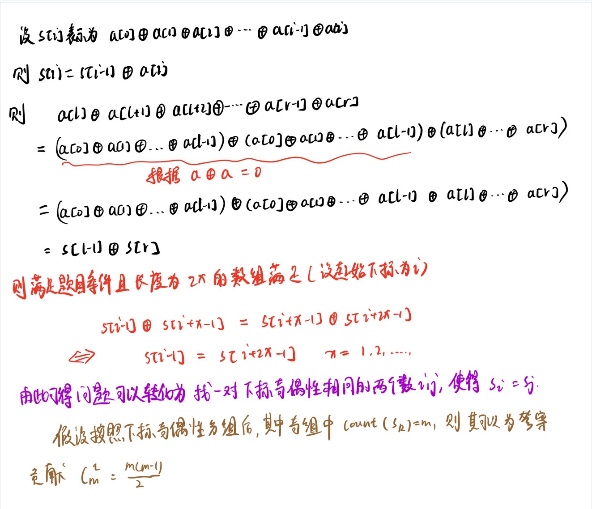

什么时候可以想到位运算？

- 搜索过程的优化

  - 比如只26个小写英文字母的字符串中每个字母可以对应整型变量的一位

    ```
    比较两个字符串中是否有相同字符 ==> 判断两个整型变量&操作是否为0 ==> 非0则有相同字符
    拼接两个字符串 ===> 两个整型变量|操作
    ```

- 运算过程效率的优化

#### 示例.串联字符串的最大长度

> 题目来源：Leetcode 1239

给定一个字符串数组 arr，字符串 s 是将 arr 某一子序列字符串连接所得的字符串，如果 s 中的每一个字符都只出现过一次，那么它就是一个可行解。请返回所有可行解 s 中最长长度。

```
输入：arr = ["un","iq","ue"]
输出：4
解释：所有可能的串联组合是 "","un","iq","ue","uniq" 和 "ique"，最大长度为 4。
```

题解:

由题知，我们需要计算可行解的长度，至于可行解具体是什么，以及可行解中各个字符的顺序我们是不用考虑的。因此构成**可行解的每个字符串均可以视作一个字符集合，且集合不含重复元素**

那么，我们可以用一个二进制数来表示该字符串的字符集合，二进制的第 i 位为 1 表示字符集合中含有第 i 个小写字母。

因此首先遍历 arr 数组，将每个字符串转化为一个整型变量并存储于数组 masks ，然后我们开始递归操作:`void dfs(int idx,int mask)`，idx表示当前要操作的元素下标，mask表示目前的可行解所对应的整型值大小。

**对于第 idx 个数，我们有两种方法：选或者不选**。如果 mask 和 masks[idx] 无公共元素，即$ mask\& masks[idx] == 0$，则可以选这个数，此时我们调用`dfs(idx+1,mask|masks[pos]) `进行递归。如果我们不选这个数，那么我们调用`dfs(idx+1,mask) `进行递归。

记 masks 的长度为 n，当 pos=n 时，计算 mask 中 1 的个数，即为可行解的长度，用其更新可行解的最长长度ans。

```java
class Solution {
    ArrayList<Integer> masks = new ArrayList<Integer>();
    int ans = Integer.MIN_VALUE;
    public void dfs(int idx,int val){
        if(idx == masks.size()){
            ans = Math.max(ans,Integer.bitCount(val));
            return ;
        }
        if((val & masks.get(idx)) == 0){
            dfs(idx+1,val | masks.get(idx));
        }
        dfs(idx+1,val);
    }
    public int maxLength(List<String> arr) {
        for(String s:arr){
            int mask = 0;
            for(int i = 0;i < s.length();i++){
                if(((1 << ((int)s.charAt(i) - 'a')) & mask) != 0){
                    mask = 0;
                    break;
                }
                mask = mask | (1 << ((int)s.charAt(i) - 'a'));
            }
            if(mask == 0) continue;
            masks.add(mask);
        }
        dfs(0,0);
        return ans;
    }
}
```


#### 优质数对的数目

给你一个下标从 **0** 开始的正整数数组 `nums` 和一个正整数 `k` 。

如果满足下述条件，则数对 `(num1, num2)` 是 **优质数对** ：

- `num1` 和 `num2` **都** 在数组 `nums` 中存在。
- `num1 OR num2` 和 `num1 AND num2` 的二进制表示中值为 **1** 的位数之和大于等于 `k` ，其中 `OR` 是按位 **或** 操作，而 `AND` 是按位 **与** 操作。

返回 **不同** 优质数对的数目。

如果 `a != c` 或者 `b != d` ，则认为 `(a, b)` 和 `(c, d)` 是不同的两个数对。例如，`(1, 2)` 和 `(2, 1)` 不同。

**注意：**如果 `num1` 在数组中至少出现 **一次** ，则满足 `num1 == num2` 的数对 `(num1, num2)` 也可以是优质数对。

```
输入：nums = [1,2,3,1], k = 3
输出：5
解释：有如下几个优质数对：
- (3, 3)：(3 AND 3) 和 (3 OR 3) 的二进制表示都等于 (11) 。值为 1 的位数和等于 2 + 2 = 4 ，大于等于 k = 3 。
- (2, 3) 和 (3, 2)： (2 AND 3) 的二进制表示等于 (10) ，(2 OR 3) 的二进制表示等于 (11) 。值为 1 的位数和等于 1 + 2 = 3 。
- (1, 3) 和 (3, 1)： (1 AND 3) 的二进制表示等于 (01) ，(1 OR 3) 的二进制表示等于 (11) 。值为 1 的位数和等于 1 + 2 = 3 。
所以优质数对的数目是 5 。
```

**题目解析**：

由于优质数对的 **判别条件** 是根据**值**来判断的，不是根据**下标**，因此可以先进行去重。

其次就需要观察到性质，对于两个数的某一位：

- 如果都是1，那么分别再 | 操作时贡献了一次个数，也在 & 时贡献了一次个数。 共计 两次
- 如果是1和 0，那么只在 | 时贡献了一次个数。共计 一次
- 如果都是0 不会贡献

> 因此可以看出来其实 Onebit(a | b) + Onebit(a & b) == Onebit(a) + Onebit(b)

那么我们就可以按照1的个数来对去重后的数组进行排序，对于每个数的个数 val[i] ，只要找到 满足 val[i] + val[j] >= k 的最小 j 即可，然后累加答案：ans += m - j

```java
class Solution {
    // 求取num中1的个数
    private int getOneBit(int num){
        int cnt = 0;
        while (num != 0){
            cnt += 1;
            num = num & (num - 1);
        }
        return cnt;
    }
	// 二分找到大于等于 t 的最小下标
    private int binaryCheck(int [] vals,int t){
        int l = 0,r = vals.length - 1;
        while (l < r){
            int mid = l + ((r - l) >> 1);
            if (vals[mid] >= t){
                r = mid;
            }else{
                l = mid + 1;
            }
        }
        if (vals[l] >= t)
            return l;
        return l + 1;
    }


    public long countExcellentPairs(int[] nums, int k) {
        Set<Integer> set = new HashSet<>();
        int n = nums.length;
        for (int i = 0;i < n;i++){
            set.add(nums[i]);
        }
        int m = set.size();
        int [] onebits = new int[m];
        int idx = 0;
        for (int v : set){
            onebits[idx++] = getOneBit(v);
        }
        Arrays.sort(onebits);
        long ans = 0;
        for (int i = 0;i < m;i++){ // 对数中的第一个数
            int t = k - onebits[i]; // 第二个数至少需要有t个1
            int j = binaryCheck(onebits,t);
            ans += m - j;
        }
        return ans;
    }
}
```

#### 子数组异或查询

有一个正整数数组 arr，现给你一个对应的查询数组 queries，其中 queries[i] = [Li, Ri]。

对于每个查询 i，请你计算从 Li 到 Ri 的 XOR 值（即 arr[Li] xor arr[Li+1] xor ... xor arr[Ri]）作为本次查询的结果。

并返回一个包含给定查询 queries 所有结果的数组。

```java
输入：arr = [1,3,4,8], queries = [[0,1],[1,2],[0,3],[3,3]]
输出：[2,7,14,8] 
解释：
数组中元素的二进制表示形式是：
1 = 0001 
3 = 0011 
4 = 0100 
8 = 1000 
查询的 XOR 值为：
[0,1] = 1 xor 3 = 2 
[1,2] = 3 xor 4 = 7 
[0,3] = 1 xor 3 xor 4 xor 8 = 14 
[3,3] = 8
```

利用前缀异或和：

定义$xors[i]$ 为从 $\textit{arr}[0]$到 $\textit{arr}[i-1]$ 的元素的异或运算结果：$xors[i]=arr[0]⊕…⊕arr[i−1]$

对于查询 $[\textit{left},\textit{right}](\textit{left} \le \textit{right})$，用 $Q(\textit{left},\textit{right})$表示该查询的结果。

当 $\textit{left}=0$时，$Q(\textit{left},\textit{right})=\textit{xors}[\textit{right}+1]$。

当 $\textit{left}>0$ 时，$Q(\textit{left},\textit{right})$ 的计算如下：
$$
\begin{aligned} & \quad ~ Q(\textit{left},\textit{right}) \\ &= \textit{arr}[\textit{left}] \oplus \ldots \oplus \textit{arr}[\textit{right}] \\ &= (\textit{arr}[0] \oplus \ldots \oplus \textit{arr}[\textit{left}-1]) \oplus (\textit{arr}[0] \oplus \ldots \oplus \textit{arr}[\textit{left}-1]) \oplus (\textit{arr}[\textit{left}] \oplus \ldots \oplus \textit{arr}[\textit{right}]) \\ &= (\textit{arr}[0] \oplus \ldots \oplus \textit{arr}[\textit{left}-1]) \oplus (\textit{arr}[0] \oplus \ldots \oplus \textit{arr}[\textit{right}]) \\ &= \textit{xors}[\textit{left}] \oplus \textit{xors}[\textit{right}+1] \end{aligned}
$$
上述计算用到了异或运算的结合律，以及异或运算的性质 $x \oplus x=0$。

当 $\textit{left}=0$ 时，$\textit{xors}[\textit{left}]=0$，因此 $Q(\textit{left},\textit{right})=\textit{xors}[\textit{left}] \oplus \textit{xors}[\textit{right}+1]$ 也成立。

```java
class Solution {
    public int[] xorQueries(int[] arr, int[][] queries) {
        int n = arr.length;
        int [] xors = new int[n+1];
        // 计算前缀异或和
        for(int i = 0;i < n;i++){
            xors[i+1] = xors[i] ^ arr[i];
        }
        int [] ans = new int[queries.length];
        int idx = 0;
        for(int [] query : queries){
            // 核心查询 [l,r] 区间的异或和
            ans[idx ++] = xors[query[0]] ^ xors[query[1]+1];
        }
        return ans;
    }
}
```


#### 子数组异或和

给定一个长度为 n 的整数数组 $a_1,a_2,…,a_n$。

请你统计一共有多少个数组 a 的**非空连续子数组**能够同时满足以下所有条件：

- 该连续子数组的长度为偶数。
- 该连续子数组的前一半元素的异或和等于其后一半元素的异或和。

例如，当给定数组为 $[1,2,3,4,5]$ 时，满足条件的连续子数组只有 1 个：$[2,3,4,5]$。

**输入格式**

第一行包含整数 n。

第二行包含 n 个整数 $a_1,a_2,…,a_n$。

**输出格式**

一个整数，表示满足条件的连续子数组的数量。

```
输入样例2：
6
3 2 2 3 7 6
输出样例2：
3
```



```java
import java.io.*;
import java.util.*;
public class Main{
    public static int [] xors;
    public static void main(String [] args) throws IOException{
        BufferedReader br = new BufferedReader(new InputStreamReader(System.in));
        int n = Integer.parseInt(br.readLine());
        xors = new int[n+1];
        String [] ins = br.readLine().split(" ");
        Map<Integer,Integer> oddMap = new HashMap<>();
        Map<Integer,Integer> evenMap = new HashMap<>();
        evenMap.put(xors[0],1);
        long ans = 0;
        for (int i = 0;i < n;i++){
            xors[i+1] = xors[i] ^ Integer.parseInt(ins[i]);
        }
        for (int i = 1;i <= n;i++){
            if ((i & 1) == 1){
                int cnt = oddMap.getOrDefault(xors[i],0);
                ans += cnt;
                oddMap.put(xors[i],cnt + 1);
            }else{
                int cnt = evenMap.getOrDefault(xors[i],0);
                ans += cnt;
                evenMap.put(xors[i],cnt + 1);
            }
        }
        System.out.println(ans);
    }
}
```


## 快速幂

快速幂实际上是二分思想的一种应用。

在Leetcode上看到了一个解释，很到位。


**算法流程**：

1. 当 x=0 时：直接返回 0 （避免后续 x=1/x 操作报错）。
2. 初始化 res=1 ；
3. 当 n<0 时：把问题转化至n≥0 的范围内，即执行x=1/x ，n=−n ；
4. 循环计算：当 n=0 时跳出；
   1. 当 n&1=1 时：将当前 x 乘入 res （即  res∗=x ）；
   2. 执行 x = x^2 ；
   3. 执行 n 右移一位（即 n >>= 1）。
5. 返回 res 。


## 快速乘（俄罗斯农民乘法）

笔算乘法通常是这样计算的：

```undefined
   88
x  99
----------
  792
+792
----------
 8712
```

这个过程可以用公式表达为：

```undefined
88 * 99 = 88 * 9 * 10^0 + 88 * 9 * 10^1
        = 792 + 7920
        = 8712
```

根据这个原理，我们把第二个乘数换成二进制：

```undefined
88 * 0110 0011(2) = 88 * 0 * 2^7 
                  + 88 * 1 * 2^6 
                  + 88 * 1 * 2^5 
                  + 88 * 0 * 2^4 
                  + 88 * 0 * 2^3 
                  + 88 * 0 * 2^2 
                  + 88 * 1 * 2^1
                  + 88 * 1 * 2^0
```

代码实现

```c
int quickMulti(int A, int B) {
    int ans = 0;
    for ( ; B; B >>= 1) {
        if (B & 1) {
            ans += A;
        }
        A <<= 1;
    }
    return ans;
}
```

>通常用在大数相乘取模的情况，可以防止大数相乘溢出。
>当我们使用 int类型做快速乘运算时就相当于模2^32（假设 int类型是 4位）

## 位运算实现两数相加

首先，考虑两个二进制位相加的四种情况如下：

```
0 + 0 = 0
0 + 1 = 1
1 + 0 = 1
1 + 1 = 0 (进位)
```

可以发现，对于整数 a 和 b：

在不考虑进位的情况下，其无进位加法结果为 $\texttt{a} \oplus \texttt{b}$。

而所有需要进位的位为 $\texttt{a & b}$，进位后的进位结果为 $\texttt{(a & b) << 1}$。

于是，我们可以将整数 a 和 b 的和，拆分为 a 和 b 的**无进位加法结果**与**进位结果的和**。因为每一次拆分都可以让需要进位的最低位至少左移一位，又因为 a 和 b 可以取到负数，所以我们最多需要 $\log (max\_int)$ 次拆分即可完成运算。

```java
class Solution {
    public int getSum(int a, int b) {
        while(b != 0){
            int add = (a & b) << 1; // 计算进位结果
            a = a ^ b; // 无进位加法结果
            b = add;
        }
        return a;
    }
}
```


# 常用位运算方法：

- 判断整数奇(1)偶(0)性：

  ```java
  //判断是否为奇数
  boolean IsOdd(int x){
      return x&1;
  }
  ```

- 乘以或除以2的幂:

  ```java
  乘以2: x<<1;
  乘以2的n次方：x<<n;
  除以2：x>>2;
  除以2的n次方：x>>n;
  变式计算2的n次方：2<<(n-1);
  ```

- 比较两个数是否相等

  ```java
  boolean IsEqual(int a,int b)
  {
      return !(a^b);//利用异或比较，相等=>0
  }
  ```

- 计算整数x和y的平均值，可防止溢出

  ```java
  int average(int x, int y) //返回X,Y 的平均值 
  { 
  　　return (x&y)+((x^y)>>1); 
  }
  ```

- 判断第 n 位是否是 1：`x & (1<<n)`

- 将第 n 位设为 1：`y = x | (1<<n)`

- 将第 n 为设为 0：`y = x & ~(1<<n)`

- 将第 n 位的值取反：`y = x ^ (1<<n)`

- 将最右边的 1 设为 0：`y = x & (x-1)`

- 分离最右边的 1：`y = x & (-x)`

- 将最右边的 1 后面都设位 1：`y = x | (x-1)`

- 分离最右边的 0：`y = ~x & (x+1)`

- 将最右边的 0 设为 1：`y = x | (x+1)`

- 返回整数n的二进制表示的第k位

  ```java
      public static int getKbit(int n,int k){
          return (n >> k) & 1;
      }
  ```

- lowbit(x):返回x二进制的最后一位1: 

  ```java
  // x=1010 lowbit(x) = 10
  // x=101000 lowbit(x) = 1000
  public static int lowbit(int n){
      return n & (-n);
  }
  ```

- 使用lowbit()求一个整数n二进制表示种1的个数：

  ```java
  public static int getbitNUm(int n){
      int ans = 0;
      while (n != 0){
          n -= (n & (-n));
          ans += 1;
      }
      return ans;
  }
  ```


