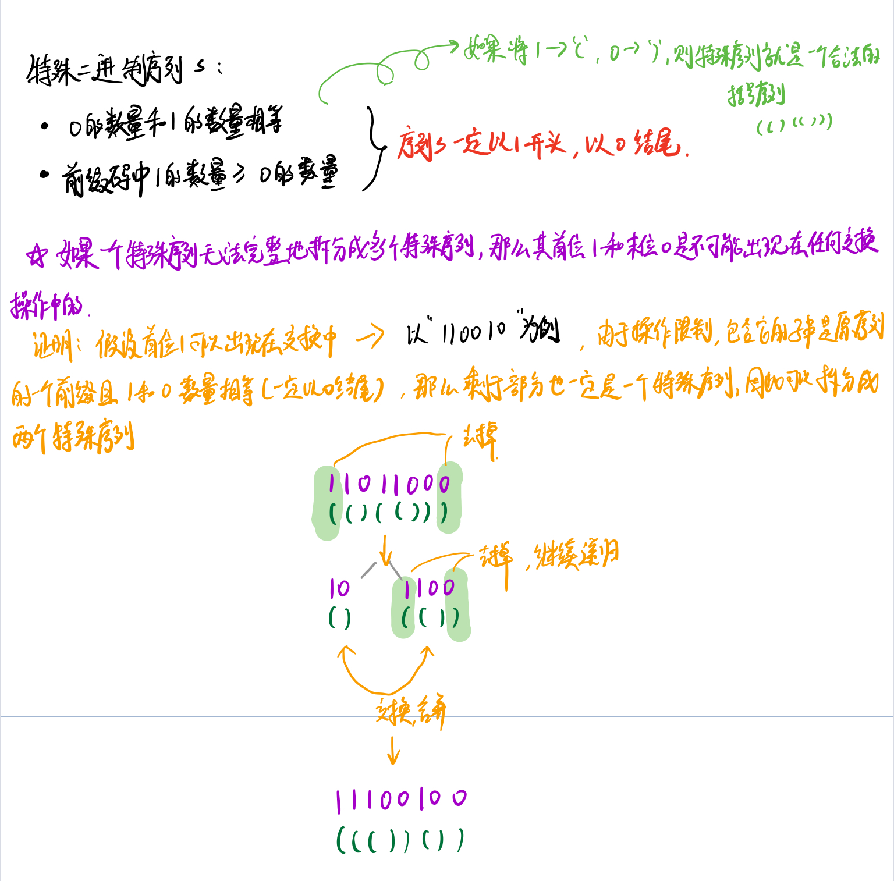

#### 特殊的二进制序列

特殊的二进制序列是具有以下两个性质的二进制序列：

- 0 的数量与 1 的数量相等。
- 二进制序列的每一个前缀码中 1 的数量要大于等于 0 的数量。

给定一个特殊的二进制序列 S，以字符串形式表示。定义一个操作 为首先选择 S 的两个连续且非空的特殊的子串，然后将它们交换。（两个子串为连续的当且仅当第一个子串的最后一个字符恰好为第二个子串的第一个字符的前一个字符。)

在任意次数的操作之后，交换后的字符串按照字典序排列的最大的结果是什么？

```
输入: S = "11011000"
输出: "11100100"
解释:
将子串 "10" （在S[1]出现） 和 "1100" （在S[3]出现）进行交换。
这是在进行若干次操作后按字典序排列最大的结果。
```



```java
class Solution {
    public String makeLargestSpecial(String s) {
        if (s.length() == 0) return "";
        List<String> list = new ArrayList<>();
        int count = 0,last = 0; // last 记录上一个特殊序列的结尾
        for (int i = 0,cur = 0;i < s.length();i++,cur++){
            if (s.charAt(i) == '1') count += 1;
            else count -= 1;
            if (count == 0){
                String str = "1" + makeLargestSpecial(s.substring(last+1,cur)) + "0"; // 分治 递归
                list.add(str);
                last = cur + 1;
            }
        }
        list.sort(Comparator.reverseOrder());
        StringBuilder sb = new StringBuilder();
        for (String str : list){
            sb.append(str);
        }
        return sb.toString();
    }
}
```

