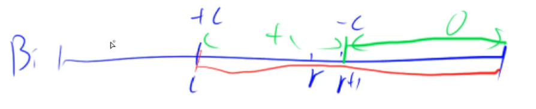
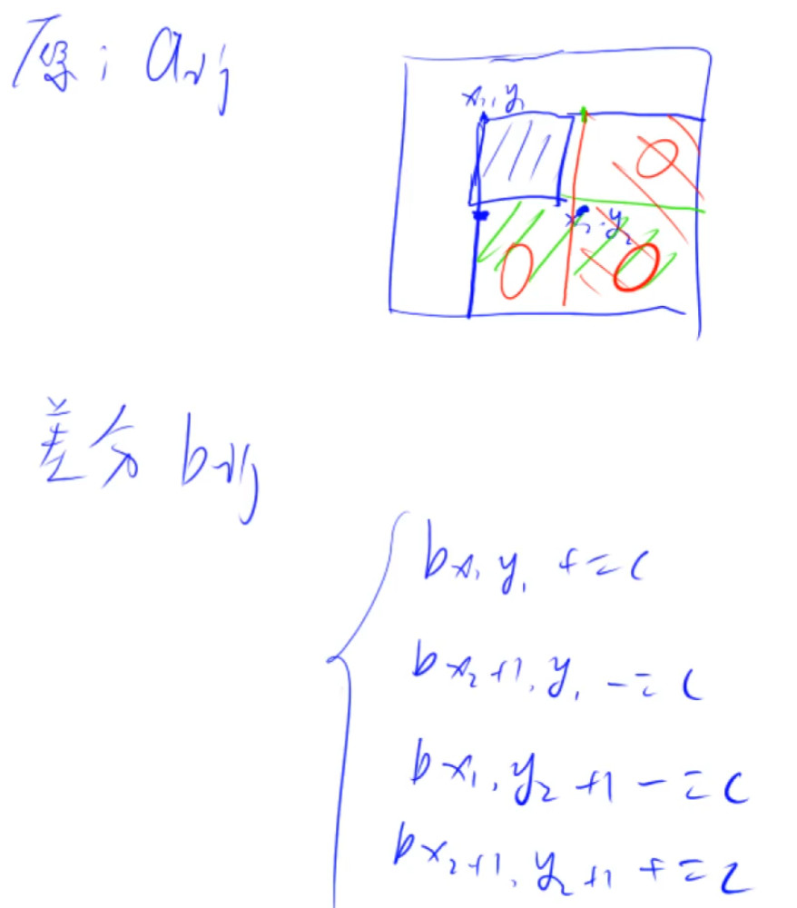

# 前缀和

前缀和快速求取区间和

#### 和为K的子数组

> 题目来源：LeetCode 剑指 Offer II 010
>
> 标签：前缀和、哈希表

给定一个整数数组和一个整数 `k` **，**请找到该数组中和为 `k` 的连续子数组的个数。

题目解析:

本题需要求出子数组之和为k的数组个数，如果限定了只有正数那么可以直接使用滑动窗口来解决，但这里可能存在负数，因此每次加入值不一定会增大和值，减去值不一定会减小和值.

> 窗口滑动的条件是什么，while窗口内元素超过或者不满足条件时移动，但如果数组存在负数，遇到不满足题意的时候，我们应该移动窗口左边界，还是扩大窗口右边界从而寻找到符合条件的情况呢？

**前缀和的解题思想**：

前缀和的题目解题思维比较固定，即当我们循环数组到下标N时，需要用到数组前N-1项的计算的结果（这里不一定非要是和，也可能是积等），此时我们就该考虑是否应该通过计算数组循环过程中的累计值的方式简化解题，如此便有了前缀和的解题思想。

了解了思想，下来就该考虑，这个累计的结果我们该通过什么方式保存起来呢？

- 题目明确要求不允许使用额外空间的，直接原地修改数组
- 不限制空间复杂度时，最好额外开辟空间计算，避免数据污染
- 计算时如果每次**只需要获取前一次的累计结果**，可以通过数组的方式存储每次获取数组末尾元素的值
- 如果每次计算**需要获取前几次或更多次的结果**进行对比时，推荐哈希表的方式，这样可以压缩时间复杂度

具体思路：

具体思路如下：

1. 初始化：初始化一个空的哈希表`存储前缀和为key的个数(val)`和persum=0的前缀和变量，以及记录结果个数的变量ret
2. 循环遍历数组
   - 通过累加presum来计算数组的累加和
   - 将当前累加和减去整数K的结果，在哈希表中查找是否存在
     - 如果存在该key值，证明以数组某一点为起点到当前位置满足题意，ret加等于将该key值对应的val
   - 将当前presum累加和加入哈希表。判断当前的累加和是否在哈希表中，若存在value+1，若不存在value=1
3. 最终返回ret即可

```java
class Solution {
    public int subarraySum(int[] nums, int k) {
        int ans = 0;
        Map<Integer,Integer> m = new HashMap<>();
        m.put(0,1); //首先要添加一个前缀为0的键值对
        int presum = 0;
        for (int num:nums){
            presum += num;
            if (m.get(presum-k) != null){
                ans += m.get(presum-k);
            }
            m.put(presum,m.getOrDefault(presum,0) + 1);
        }
        return ans;
    }
}
```


#### 0 和 1 个数相同的子数组

> 题目来源：LeetCode 剑指 Offer II 011
>
> 标签：前缀和、哈希表

给定一个二进制数组 `nums` , 找到含有相同数量的 `0` 和 `1` 的最长连续子数组，并返回该子数组的长度。

```
输入: nums = [0,1]
输出: 2
说明: [0, 1] 是具有相同数量 0 和 1 的最长连续子数组。
```

**题目解析**：

由于「0 和 1 的数量相同」等价于「1 的数量减去 0 的数量等于 0」，我们可以将数组中的 0 视作 -1，则原问题转换成「求最长的连续子数组，其元素和为 0」。

```java
class Solution {
    public int findMaxLength(int[] nums) {
        int maxlen = Integer.MIN_VALUE;
        int presum = 0;
        Map<Integer,Integer> m = new HashMap<>();
        m.put(0,-1);
        for (int i = 0;i < nums.length;i++){
            presum += nums[i] == 1 ? 1 : -1;
            if (m.get(presum) == null){
                m.put(presum,i);
            }else{
                maxlen = Math.max(maxlen,i-m.get(presum));
            }
        }
        return maxlen == Integer.MIN_VALUE ? 0 : maxlen;
    }
}
```

#### 左右两边子数组的和相等

> 题目来源：LeetCode 剑指 Offer II 012
>
> 标签：前缀和

给你一个整数数组 nums ，请计算数组的 中心下标 。

数组 **中心下标** 是数组的一个下标，其左侧所有元素相加的和等于右侧所有元素相加的和。

如果中心下标位于数组最左端，那么左侧数之和视为 0 ，因为在下标的左侧不存在元素。这一点对于中心下标位于数组最右端同样适用。

如果数组有多个中心下标，应该返回 **最靠近左边** 的那一个。如果数组不存在中心下标，返回 -1 。

解题思路：

**前缀和**:

记数组的全部元素之和为 $\textit{total}$，当遍历到第 i 个元素时，设其左侧元素之和为 $\textit{sum}$，则其右侧元素之和为$ \textit{total}-\textit{nums}_i-\textit{sum}total−nums 
i −sum$。左右侧元素相等即为$ \textit{sum}=\textit{total}-\textit{nums}_i-\textit{sum}sum=total−nums 
i−sum$，即$2\times\textit{sum}+\textit{nums}_i=\textit{total}2×sum+nums_i=total$。

题解1：

```java
public int pivotIndex(int[] nums) {
    int total = Arrays.stream(nums).sum(); //求和
    int sum = 0;
    for (int i = 0;i < nums.length;i++){
        if (2 * sum + nums[i] == total){
            return i;
        }
        sum += nums[i];
    }
    return -1;
}
```

#### 二维子矩阵的和

> 题目来源：LeetCode 剑指 Offer II 013
>
> 标签：前缀和

给定一个二维矩阵 matrix，以下类型的多个请求：

- 计算其子矩形范围内元素的总和，该子矩阵的左上角为 `(row1, col1) `，右下角为 `(row2, col2) `。

实现 NumMatrix 类：

- `NumMatrix(int[][] matrix) `给定整数矩阵 matrix 进行初始化
- `int sumRegion(int row1, int col1, int row2, int col2) `返回左上角` (row1, col1) `、右下角` (row2, col2) `的子矩阵的元素总和。


```
输入: 
["NumMatrix","sumRegion","sumRegion","sumRegion"]
[[[[3,0,1,4,2],[5,6,3,2,1],[1,2,0,1,5],[4,1,0,1,7],[1,0,3,0,5]]],[2,1,4,3],[1,1,2,2],[1,2,2,4]]
输出: 
[null, 8, 11, 12]
```

题目解析：


```java
class NumMatrix {
    private  int[][] presum;
    public NumMatrix(int[][] matrix) {
        presum = new int[matrix.length][matrix[0].length];
        presum[0][0] = matrix[0][0];
        for (int i = 1;i < matrix.length;i++){
            presum[i][0] = presum[i-1][0] + matrix[i][0];
        }
        for (int i = 1;i <matrix[0].length;i++){
            presum[0][i] = presum[0][i-1] + matrix[0][i];
        }
        for (int i = 1;i < matrix.length;i++){
            for (int j = 1;j < matrix[0].length;j++){
                presum[i][j] = presum[i-1][j] + presum[i][j-1] - presum[i-1][j-1] + matrix[i][j];
            }
        }
    }

    public int sumRegion(int row1, int col1, int row2, int col2) {
        int left,up,leftup =0;
        if (row1 == 0 && col1 == 0){
            return presum[row2][col2];
        }else if (row1 == 0 && col1 != 0){
            up = 0;
            left = presum[row2][col1-1];
            leftup = 0;
        }else if (row1 != 0 && col1 == 0){
            up = presum[row1-1][col2];
            left = 0;
            leftup = 0;
        }else{
            up = presum[row1-1][col2];
            left = presum[row2][col1-1];
            leftup = presum[row1-1][col1-1];
        }
        return presum[row2][col2] - left - up + leftup;
    }
}
```


# 差分

差分相当于前缀和的逆运算

#### 一维差分

已知$a_1,a_2,...a_n$，构造$b_1,b_2,...b_n$，使得$a_i = b_1+b_2+...+b_i$，即A数组是B数组的前缀和

那么可得：
$$
b_1 = a_1 \\
b_2 = a_2 - a_1 \\
b_3 = a_3 - a_2 \\
... \\
b_n = a_n - a_{n-1}
$$
我们称 A 是 B 的前缀和，b是a的差分，可以在$O(n)$时间由B => A

差分常见应用：

有一个操作是：给定一个区间范围[l,r]，让该范围内的A数组全部加上c，即$a_l+c，a_{l+1}+c,...,a_r+c$

假设有很多这样的操作，如果每次操作A数组，时间复杂度都是O(r-l)，但是利用差分，可以在O(1)时间复杂度内完成（即让$b_l+c、b_{r+1}-c$），然后最后再利用一次求前缀和由B获得A



**例题**：

输入一个长度为 n 的整数序列。

接下来输入 m 个操作，每个操作包含三个整数 l,r,c，表示将序列中$ [l,r]$ 之间的每个数加上 c。

请你输出进行完所有操作后的序列。

```
样例输入：
6 3
1 2 2 1 2 1
1 3 1
3 5 1
1 6 1
样例输出：
3 4 5 3 4 2
```

```java
import java.io.*;
import java.util.*;

public class Main {

    public static void insert(int l,int r,int val,int [] nums){
        nums[l] += val;
        nums[r+1] -= val;
    }

    public static void main(String[] args) throws IOException {
        InputStreamReader in = new InputStreamReader(System.in);
        BufferedReader bf = new BufferedReader(in);
        String [] ins = bf.readLine().split(" ");
        int n = Integer.parseInt(ins[0]);
        int m = Integer.parseInt(ins[1]);
        ins = bf.readLine().split(" ");
        int [] B = new int[n+2];
        for (int i = 0;i < ins.length;i++){
            insert(i+1,i+1,Integer.parseInt(ins[i]),B); // 初始化构造其实相当于对[l,l]范围内的元素+c
        }
        while (m-- > 0){
            ins = bf.readLine().split(" ");
            int l = Integer.parseInt(ins[0]);
            int r = Integer.parseInt(ins[1]);
            int v = Integer.parseInt(ins[2]);
            insert(l,r,v,B);
        }
        for (int i = 1; i <= n;i++){
            B[i] += B[i-1];
            System.out.print(B[i] + " ");
        }
    }
}
```


#### 二维差分

已知矩阵A是矩阵B的前缀和矩阵，矩阵B为矩阵A的差分矩阵。

当我们需要多次执行如下操作时：

将以$(x_1,y_1)$为左上角，$(x_2,y_2)$为右下角的子矩阵中每个元素加上val，如果是对A矩阵操作的话，则时间发杂度为O(mn)，其中m、n分别为子矩阵的宽高。如果是对差分矩阵进行操作的话，操作如下所示，那么时间复杂度只有O(1)，进行多次操作后再将矩阵B求和得到前缀和矩阵A即可。
$$
B[x_1][y_1] \ += c \\
B[x_2+1][y_1] \ -= c \\
B[x_1][y_2+1] \ -= c \\
B[x_2+1][y_2+1] \ += c \\
$$


**例题**：

输入一个 n 行 m 列的整数矩阵，再输入 q 个操作，每个操作包含五个整数$ x_1,y_1,x_2,y_2,c$其中 $(x_1,y_1)$ 和 $(x_2,y_2)$表示一个子矩阵的左上角坐标和右下角坐标。

每个操作都要将选中的子矩阵中的每个元素的值加上 c。

请你将进行完所有操作后的矩阵输出。

```java
import java.io.*;
import java.util.*;

public class Main {
    public static void insert(int x1,int y1,int x2,int y2,int val,int [][] nums){
        nums[x1][y1] += val;
        nums[x1][y2+1] -= val;
        nums[x2+1][y1] -= val;
        nums[x2+1][y2+1] += val;
    }

    public static void main(String[] args) throws IOException {
        InputStreamReader in = new InputStreamReader(System.in);
        BufferedReader bf = new BufferedReader(in);
        String [] ins = bf.readLine().split(" ");
        int n = Integer.parseInt(ins[0]);
        int m = Integer.parseInt(ins[1]);
        int q = Integer.parseInt(ins[2]);
        int [][] B = new int[n+2][m+2];
        for (int i = 1;i <=n;i++){
            ins = bf.readLine().split(" ");
            for (int j = 0;j < ins.length;j++){
                // 初始化构造相当于对面积为1的子矩阵+c 
                insert(i,j+1,i,j+1,Integer.parseInt(ins[j]),B);
            }
        }
        while (q-- > 0){
            ins = bf.readLine().split(" ");
            int x1 = Integer.parseInt(ins[0]);
            int y1 = Integer.parseInt(ins[1]);
            int x2 = Integer.parseInt(ins[2]);
            int y2 = Integer.parseInt(ins[3]);
            int v = Integer.parseInt(ins[4]);
            insert(x1,y1,x2,y2,v,B);
        }
        for (int i = 1;i <= n;i++){
            for (int j = 1;j <= m;j++){
                B[i][j] = B[i][j-1] + B[i-1][j] + B[i][j] - B[i-1][j-1];
                System.out.print(B[i][j] + " ");
            }
            System.out.println();
        }
    }
}
```


