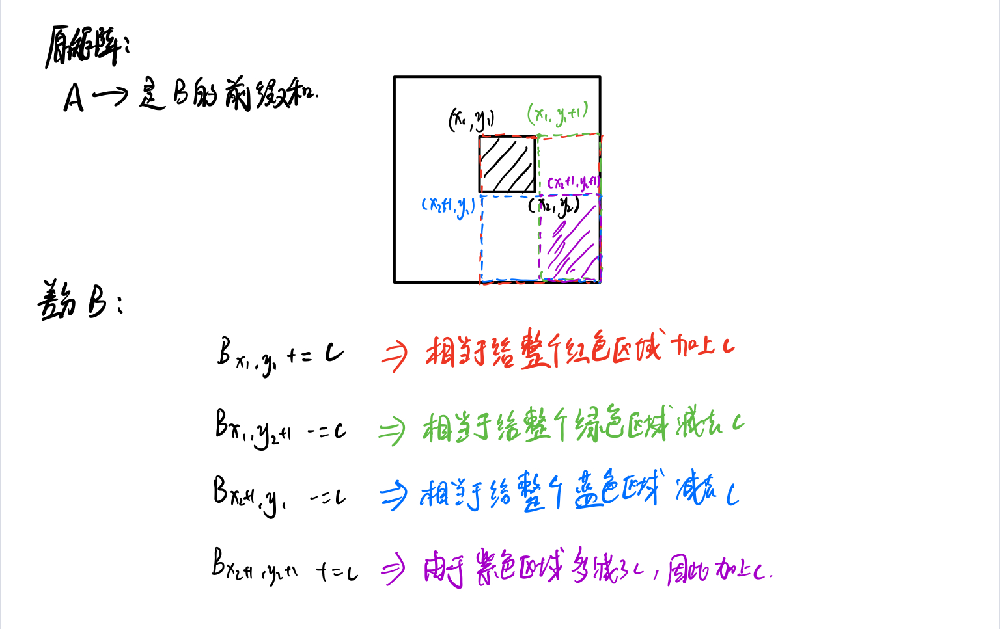

# 前缀和

对于一个给定的数列A，其前缀和为：
$$
S[i] = \sum_{j = 1}^{i}A[j]
$$


则某个区间的和可以表示为：
$$
sum(l,r) = \sum_{i=l}^{r}A[i] = S[r] - S[l-1]
$$
二维前缀和：


#### 和为K的子数组

> 题目来源：LeetCode 剑指 Offer II 010
>
> 标签：前缀和、哈希表

给定一个整数数组和一个整数 `k` **，**请找到该数组中和为 `k` 的连续子数组的个数。

题目解析:

本题需要求出子数组之和为k的数组个数，如果限定了只有正数那么可以直接使用滑动窗口来解决，但这里可能存在负数，因此每次加入值不一定会增大和值，减去值不一定会减小和值.

> 窗口滑动的条件是什么，while窗口内元素超过或者不满足条件时移动，但如果数组存在负数，遇到不满足题意的时候，我们应该移动窗口左边界，还是扩大窗口右边界从而寻找到符合条件的情况呢？

**前缀和的解题思想**：

前缀和的题目解题思维比较固定，即当我们循环数组到下标N时，需要用到数组前N-1项的计算的结果（这里不一定非要是和，也可能是积等），此时我们就该考虑是否应该通过计算数组循环过程中的累计值的方式简化解题，如此便有了前缀和的解题思想。

了解了思想，下来就该考虑，这个累计的结果我们该通过什么方式保存起来呢？

- 题目明确要求不允许使用额外空间的，直接原地修改数组
- 不限制空间复杂度时，最好额外开辟空间计算，避免数据污染
- 计算时如果每次**只需要获取前一次的累计结果**，可以通过数组的方式存储每次获取数组末尾元素的值
- 如果每次计算**需要获取前几次或更多次的结果**进行对比时，推荐哈希表的方式，这样可以压缩时间复杂度

具体思路：

具体思路如下：

1. 初始化：初始化一个空的哈希表`存储前缀和为key的个数(val)`和persum=0的前缀和变量，以及记录结果个数的变量ret
2. 循环遍历数组
   - 通过累加presum来计算数组的累加和
   - 将当前累加和减去整数K的结果，在哈希表中查找是否存在
     - 如果存在该key值，证明以数组某一点为起点到当前位置满足题意，ret加等于将该key值对应的val
   - 将当前presum累加和加入哈希表。判断当前的累加和是否在哈希表中，若存在value+1，若不存在value=1
3. 最终返回ret即可

```java
class Solution {
    public int subarraySum(int[] nums, int k) {
        int ans = 0;
        Map<Integer,Integer> m = new HashMap<>();
        m.put(0,1); //首先要添加一个前缀为0的键值对
        int presum = 0;
        for (int num:nums){
            presum += num;
            if (m.get(presum-k) != null){
                ans += m.get(presum-k);
            }
            m.put(presum,m.getOrDefault(presum,0) + 1);
        }
        return ans;
    }
}
```


#### 0 和 1 个数相同的子数组

> 题目来源：LeetCode 剑指 Offer II 011
>
> 标签：前缀和、哈希表

给定一个二进制数组 `nums` , 找到含有相同数量的 `0` 和 `1` 的最长连续子数组，并返回该子数组的长度。

```
输入: nums = [0,1]
输出: 2
说明: [0, 1] 是具有相同数量 0 和 1 的最长连续子数组。
```

**题目解析**：

由于「0 和 1 的数量相同」等价于「1 的数量减去 0 的数量等于 0」，我们可以将数组中的 0 视作 -1，则原问题转换成「求最长的连续子数组，其元素和为 0」。

```java
class Solution {
    public int findMaxLength(int[] nums) {
        int maxlen = Integer.MIN_VALUE;
        int presum = 0;
        Map<Integer,Integer> m = new HashMap<>();
        m.put(0,-1);
        for (int i = 0;i < nums.length;i++){
            presum += nums[i] == 1 ? 1 : -1;
            if (m.get(presum) == null){
                m.put(presum,i);
            }else{
                maxlen = Math.max(maxlen,i-m.get(presum));
            }
        }
        return maxlen == Integer.MIN_VALUE ? 0 : maxlen;
    }
}
```

#### 左右两边子数组的和相等

> 题目来源：LeetCode 剑指 Offer II 012
>
> 标签：前缀和

给你一个整数数组 nums ，请计算数组的 中心下标 。

数组 **中心下标** 是数组的一个下标，其左侧所有元素相加的和等于右侧所有元素相加的和。

如果中心下标位于数组最左端，那么左侧数之和视为 0 ，因为在下标的左侧不存在元素。这一点对于中心下标位于数组最右端同样适用。

如果数组有多个中心下标，应该返回 **最靠近左边** 的那一个。如果数组不存在中心下标，返回 -1 。

解题思路：

**前缀和**:

记数组的全部元素之和为 $\textit{total}$，当遍历到第 i 个元素时，设其左侧元素之和为 $\textit{sum}$，则其右侧元素之和为$ \textit{total}-\textit{nums}_i-\textit{sum}total−nums 
i −sum$。左右侧元素相等即为$ \textit{sum}=\textit{total}-\textit{nums}_i-\textit{sum}sum=total−nums 
i−sum$，即$2\times\textit{sum}+\textit{nums}_i=\textit{total}2×sum+nums_i=total$。

题解1：

```java
public int pivotIndex(int[] nums) {
    int total = Arrays.stream(nums).sum(); //求和
    int sum = 0;
    for (int i = 0;i < nums.length;i++){
        if (2 * sum + nums[i] == total){
            return i;
        }
        sum += nums[i];
    }
    return -1;
}
```

#### 拆炸弹

你有一个炸弹需要拆除，时间紧迫！你的情报员会给你一个长度为 n 的 循环 数组 code 以及一个密钥 k 。

为了获得正确的密码，你需要替换掉每一个数字。所有数字会 同时 被替换。

如果 k > 0 ，将第 i 个数字用 接下来 k 个数字之和替换。
如果 k < 0 ，将第 i 个数字用 之前 k 个数字之和替换。
如果 k == 0 ，将第 i 个数字用 0 替换。
由于 code 是循环的， code[n-1] 下一个元素是 code[0] ，且 code[0] 前一个元素是 code[n-1] 。

给你 循环 数组 code 和整数密钥 k ，请你返回解密后的结果来拆除炸弹！

```
输入：code = [5,7,1,4], k = 3
输出：[12,10,16,13]
解释：每个数字都被接下来 3 个数字之和替换。解密后的密码为 [7+1+4, 1+4+5, 4+5+7, 5+7+1]。注意到数组是循环连接的。
```

题目解析：

由于数组是循环的，我们可以重新拷贝一份并拼接在原始数组后面，然后由于题目是要记录 当前下标 i 的后 k 位数字之和或 前k位数字之和，是一个区间和问题，由此想到并查集。以示例进行讲解：

拼接后的数组为： [5,7,1,4,5,7,1,4]

求该数组的前缀和(下标1开始)：[0,5,12,13,17,22,29,30,34]

假设此时下标 i 为 2, k =3 则后3位之和为 4 + 5 + 7 = 16，通过前缀和数组来计算即 sum[i + k + 1] - sum[i+1]，这里有个1的下标偏差是因为nums下标从0开始，因此可知 ans[i] = sum[i + k + 1] - sum[i+1]

当 k < 0时，先向后偏移n位，下标变为 i + n = 6，则 ans[i] = sum[i + n] - sum[i+n-k]

当k == 0时，直接返回ans数组（初始化即是全0）

```java
class Solution {
    public int[] decrypt(int[] code, int k) {
        int n = code.length;
        int [] ans = new int[n];
        if(k == 0) return ans;
        int [] sum = new int[n * 2 +1];
        for(int i = 1;i <= 2 * n;i++){
            sum[i] = sum[i-1] + code[(i-1) % n]; 
        }
        for(int i = 1;i <= n;i++){
            if(k > 0) ans[i-1] = sum[i + k] - sum[i];
            else ans[i-1] = sum[i + n - 1] - sum[i + n + k - 1];
        }
        return ans;
    }
}
```


#### 二维子矩阵的和

> 题目来源：LeetCode 剑指 Offer II 013
>
> 标签：前缀和

给定一个二维矩阵 matrix，以下类型的多个请求：

- 计算其子矩形范围内元素的总和，该子矩阵的左上角为 `(row1, col1) `，右下角为 `(row2, col2) `。

实现 NumMatrix 类：

- `NumMatrix(int[][] matrix) `给定整数矩阵 matrix 进行初始化
- `int sumRegion(int row1, int col1, int row2, int col2) `返回左上角` (row1, col1) `、右下角` (row2, col2) `的子矩阵的元素总和。


```
输入: 
["NumMatrix","sumRegion","sumRegion","sumRegion"]
[[[[3,0,1,4,2],[5,6,3,2,1],[1,2,0,1,5],[4,1,0,1,7],[1,0,3,0,5]]],[2,1,4,3],[1,1,2,2],[1,2,2,4]]
输出: 
[null, 8, 11, 12]
```

题目解析：


```java
class NumMatrix {
    private  int[][] presum;
    public NumMatrix(int[][] matrix) {
        presum = new int[matrix.length][matrix[0].length];
        presum[0][0] = matrix[0][0];
        for (int i = 1;i < matrix.length;i++){
            presum[i][0] = presum[i-1][0] + matrix[i][0];
        }
        for (int i = 1;i <matrix[0].length;i++){
            presum[0][i] = presum[0][i-1] + matrix[0][i];
        }
        for (int i = 1;i < matrix.length;i++){
            for (int j = 1;j < matrix[0].length;j++){
                presum[i][j] = presum[i-1][j] + presum[i][j-1] - presum[i-1][j-1] + matrix[i][j];
            }
        }
    }

    public int sumRegion(int row1, int col1, int row2, int col2) {
        int left,up,leftup =0;
        if (row1 == 0 && col1 == 0){
            return presum[row2][col2];
        }else if (row1 == 0 && col1 != 0){
            up = 0;
            left = presum[row2][col1-1];
            leftup = 0;
        }else if (row1 != 0 && col1 == 0){
            up = presum[row1-1][col2];
            left = 0;
            leftup = 0;
        }else{
            up = presum[row1-1][col2];
            left = presum[row2][col1-1];
            leftup = presum[row1-1][col1-1];
        }
        return presum[row2][col2] - left - up + leftup;
    }
}
```


#### 能被7整除的最长区间长度

给你n个数，分别是$a[1],a[2],...,a[n]$。求一个最长的区间[x,y]，使得区间中的数$(a[x],a[x+1],a[x+2],...,a[y-1],a[y])$的和能被7整除。输出最长区间长度。若没有符合要求的区间，输出0。

题目解析：

比较容易想到的是利用前缀和，然后计算每个区间的和，找出最大值，这样时间复杂度是$O(n^2)$，那么还能继续优化吗？

这里用到了 取余的一个性质：两个数a,b相减结$c \bmod d =0$ ，那么这两个数 $ \bmod d$ 的余数一定相同

那么如果两个前缀和区间（比如 pre[4] 和 pre[8]）的 $\bmod 7$的余数相同，那么 $(pre[8] - pre[4]) \bmod 7 == 0$，即区间[5,8]的和 $\bmod 7$ 是0，这样就好办了！

那么，我们可以先提前求出这些前缀和第一次出现 和 最后一次出现 的位置。然后，枚举 0 ~ 6 共 7 个余数各自的最长长度，再在他们 7 个里找最长的！

```java

public class Main{

    public static int check(long n,int [] nums){
        int cnt = 0; // AC题目的数量
        long sum = 0;
        for (int num : nums) {
            sum += num;
            if (sum < 0) sum = 0;
            if (sum >= n) {
                sum = 0;
                cnt += 1;
            }
        }
        return cnt;
    }
    public static void main(String [] args) throws IOException{
        Scanner scanner = new Scanner(System.in);
        int n = scanner.nextInt();
        int [] pre = new int[n+1];
        int [] first = new int[7];
        int [] last = new int[7];
        for (int i = 1;i <= n;i++){
            pre[i] = (pre[i-1] + scanner.nextInt()) % 7;
        }

        for (int i = n;i >= 1;i--){
            first[pre[i]] = i;
        }
        first[0] = 0;
        for (int i = 1;i <= n;i++){
            last[pre[i]] = i;
        }
        int ans = 0;
        for (int i = 0;i <= 6;i++){
            ans = Math.max(ans,last[i] - first[i]);
        }
        System.out.print(ans);
    }
}
```

#### 最大正方形

在一个n*m的只包含0和1的矩阵里找出一个不包含0的最大正方形，输出边长。

**输入格式**

输入文件第一行为两个整数n,m（1<=n,m<=100），接下来n行，每行m个数字，用空格隔开，0或1.

**输出格式**

一个整数，最大正方形的边长

```
输入
4 4
0 1 1 1
1 1 1 0
0 1 1 0
1 1 0 1
输出
2
```

二分 + 前缀和：


> 注：还有更优的方法——动态规划，可以移步去 动态规划.md 查看

```java
public class Main{
    public static void main(String [] args) throws IOException{
        BufferedReader br = new BufferedReader(new InputStreamReader(System.in));
        String [] ins = br.readLine().split(" ");
        int n = Integer.parseInt(ins[0]);
        int m = Integer.parseInt(ins[1]);
        int [][] mat = new int[n][m];
        for (int i = 0;i < n;i++){
            ins = br.readLine().split(" ");
            for (int j = 0;j < m;j++){
                mat[i][j] = Integer.parseInt(ins[j]);
            }
        }
        int [][] sum = new int[n][m];
        sum[0][0] = mat[0][0];
        for (int i = 1;i < m;i++){
            sum[0][i] = sum[0][i-1] + mat[0][i];
        }
        for (int i = 1;i < n;i++){
            sum[i][0] = sum[i-1][0] + mat[i][0];
        }
        for (int i = 1;i < n;i++){
            for (int j = 1;j < m;j++){
                sum[i][j] = sum[i-1][j] + sum[i][j-1] - sum[i-1][j-1] + mat[i][j];
            }
        }
        int ans = 0;
        for (int i = 0;i < n;i++){
            for (int j = 0;j < m;j++){
                int l = ans,r = Math.min(n,m);
                while (l < r){
                    int mid = l + ((r - l + 1) >> 1);
                    if (i + mid >= n || j + mid >= m || sum[i+mid][j+mid] - sum[i][j+mid] - sum[i+mid][j] + sum[i][j] < mid * mid){
                        r = mid - 1;
                    }else{
                        l = mid;
                    }
                }
                ans = Math.max(ans,l);
            }
        }

        System.out.println(ans);
    }
}
```


#### 统计子矩阵

给定一个 N×M 的矩阵 A，请你统计有多少个子矩阵 (最小 1×1，最大 N×MN×M) 满足子矩阵中所有数的和不超过给定的整数 K?

**输入格式**

第一行包含三个整数 N,M 和 K。

之后 N 行每行包含 M 个整数，代表矩阵 A。

**输出格式**

一个整数代表答案。


```java
import java.io.*;
import java.util.*;


public class Main{
    public static int getSum(int x1,int y1,int x2,int y2,int [][] sum){
        return sum[x2][y2] - sum[x2][y1-1] - sum[x1-1][y2] + sum[x1-1][y1-1];
    }
    public static void main(String [] args) throws IOException{
        BufferedReader br = new BufferedReader(new InputStreamReader(System.in));
        String [] ins = br.readLine().split(" ");
        int n = Integer.parseInt(ins[0]);
        int m = Integer.parseInt(ins[1]);
        int k = Integer.parseInt(ins[2]);
        int [][] g = new int[n+1][m+1];
        int [][] sum = new int[n+1][m+1];
        for (int i = 1;i <= n;i++){
            ins = br.readLine().split(" ");
            for (int j = 0;j < m;j++){
                g[i][j+1] = Integer.parseInt(ins[j]);
            }
        }
        // 计算前缀和
        for (int i = 1;i <= n;i++){
            for (int j = 1;j <= m;j++){
                sum[i][j] = sum[i-1][j] + sum[i][j-1] - sum[i-1][j-1] + g[i][j];
            }
        }
        long ans = 0;
        // 统计个数
        for (int l = 1;l <= m;l++){  // 左界限
            for (int r = l;r <= m;r++){ // 右界限
                for (int i = 1,j = 1;i <= n;i++){
                    while (j <= i && getSum(j,l,i,r,sum) > k) j++;
                    if (j <= i) ans += i - j + 1;
                }
            }
        }
        System.out.println(ans);
    }
}
```

> 时间复杂度分析：最好情况 $O(n \times m^2)$  最坏情况 $O(n ^ 2\times m^2)$

#### 商店的最少代价

给你一个顾客访问商店的日志，用一个下标从 **0** 开始且只包含字符 `'N'` 和 `'Y'` 的字符串 `customers` 表示：

- 如果第 `i` 个字符是 `'Y'` ，它表示第 `i` 小时有顾客到达。
- 如果第 `i` 个字符是 `'N'` ，它表示第 `i` 小时没有顾客到达。

如果商店在第 `j` 小时关门（`0 <= j <= n`），代价按如下方式计算：

- 在开门期间，如果某一个小时没有顾客到达，代价增加 `1` 。
- 在关门期间，如果某一个小时有顾客到达，代价增加 `1` 。

请你返回在确保代价 **最小** 的前提下，商店的 **最早** 关门时间。

注意，商店在第 `j` 小时关门表示在第 `j` 小时以及之后商店处于关门状态。

```
输入：customers = "YYNY"
输出：2
解释：
- 第 0 小时关门，总共 1+1+0+1 = 3 代价。
- 第 1 小时关门，总共 0+1+0+1 = 2 代价。
- 第 2 小时关门，总共 0+0+0+1 = 1 代价。
- 第 3 小时关门，总共 0+0+1+1 = 2 代价。
- 第 4 小时关门，总共 0+0+1+0 = 1 代价。
在第 2 或第 4 小时关门代价都最小。由于第 2 小时更早，所以最优关门时间是 2 。
```

**题目解析**：

某天关门的代价不仅涉及关门前的状态，也涉及关门后的状态。

我们定义 sumN[i]：表示第i天关门，那么第i天前总共有几天是N；定义sumY[i]：表示第i天关门，那么第i天包括第i天后有几天是Y，那么某天关门的代价就是: sumN[i] + sumY[i]

```java
func bestClosingTime(customers string) int {
    const INT_MAX = int(^uint(0) >> 1)
    n := len(customers)
    sumN := make([]int,n+1)
    sumY := make([]int,n+1)
    for i := 1;i <= n;i++{
        if customers[i-1] == 'N'{
            sumN[i] = sumN[i-1] + 1
        }else{
            sumN[i] = sumN[i-1]
        }
    }
    for i := n-1;i >= 0;i--{
        if customers[i] == 'Y'{
            sumY[i] = sumY[i+1] + 1
        }else{
            sumY[i] = sumY[i+1]
        }
    }
    minval := INT_MAX
    day := 0
    for i := 0;i <= n;i++{
        v := sumN[i] + sumY[i]
        if v < minval{
            day = i
            minval = v
        }
    }
    return day
}
```

#### 长度为 3 的不同回文子序列

给你一个字符串 `s` ，返回 `s` 中 **长度为 3** 的**不同回文子序列** 的个数。

即便存在多种方法来构建相同的子序列，但相同的子序列只计数一次。

**回文** 是正着读和反着读一样的字符串。

**子序列** 是由原字符串删除其中部分字符（也可以不删除）且不改变剩余字符之间相对顺序形成的一个新字符串。

- 例如，`"ace"` 是 `"abcd"` 的一个子序列。

```
输入：s = "aabca"
输出：3
解释：长度为 3 的 3 个回文子序列分别是：
- "aba" ("aabca" 的子序列)
- "aaa" ("aabca" 的子序列)
- "aca" ("aabca" 的子序列)
```

**题目解析**：

思路就是枚举回文串的中间字符s[i]，然后我们看其前面和后面有多少公共字符种数。

由于字符串仅仅由小写字母组成，因此我们可以用一个整数来定义当前字符前面出现的字符种类的状态。

则，对于字符s[i]，其前面和后面的公共字符种数位：`t = pre[i] & suf[i]`，然后计算t有多少个1即可。

为了避免重复计算，我们需要在遍历的同时使用**按位或**来维护**每种**字符为中间字符的回文子序列种数，也就是`ans[s[i] - 'a'] |= pre[i] & suf[i]`。最终，我们将不同种类字符对应的回文子序列总数求和作为答案返回。

```go
func countPalindromicSubsequence(s string) int {
    n := len(s)
    pre := make([]int,n)
    suf := make([]int,n)
    pre[0] = 0 | (1 << (s[0] - 'a'))
    for i := 1;i < n;i++{
        pre[i] = pre[i-1] | (1 << (s[i] - 'a'))
    }
    suf[n-1] = 0 | (1 << (s[n-1] - 'a'))
    for i := n - 2;i >= 0;i--{
        suf[i] = suf[i+1] | (1 << (s[i] - 'a'))
    }
    ans := make([]int,26)
    count := 0
    for i := 1;i < n - 1;i++{
        ans[s[i] - 'a'] |= (pre[i-1] & suf[i+1])
    }
    for _,c := range ans{
        count += getcount(c)
    }
    return count
}

func getcount(x int)int{
    cnt := 0
    for x != 0{
        cnt ++
        x = x & (x - 1)
    }
    return cnt
}
```


#### 统计长度为5的回文子序列数目

给你数字字符串 `s` ，请你返回 `s` 中长度为 `5` 的 **回文子序列** 数目。由于答案可能很大，请你将答案对 `109 + 7` **取余** 后返回。

**提示：**

- 如果一个字符串从前往后和从后往前读相同，那么它是 **回文字符串** 。
- 子序列是一个字符串中删除若干个字符后，不改变字符顺序，剩余字符构成的字符串。

```
输入：s = "103301"
输出：2
解释：
总共有 6 长度为 5 的子序列："10330" ，"10331" ，"10301" ，"10301" ，"13301" ，"03301" 。
它们中有两个（都是 "10301"）是回文的。
```

**题目解析**：

其实思路和上一题差不多，我们首先逆序遍历字符串，并维护 `suf[10]` 和 `suf2[10][10]`，其中suf[i]记录了从最后到当前出现了多少次i，`suf2[i][j]`记录了从最后到当前可以组合成多少个`i * 10 + j`。然后我们在正序遍历字符串，并维护 `pre[10]` 和 `pre2[10][10]`，其中pre[i]记录了从开始到当前出现了多少次i，`pre2[i][j]`记录了从最后到当前可以组合成多少个`j * 10 + i`，注意，是`j * 10 + i`。

这样，我们再遍历一遍字符串，对于当前s[i]，枚举前面的0～99的个数（比如37），然后找后面的对应的个数（比如73），然后进行乘法运算就得到了所有可以组成37x73的回文序列个数，进行累加即可。

```go
func countPalindromes(s string) int {
    n := len(s)
    const mod int = 1e9 + 7
    suf := [10]int{} // 记录逆序0～9的个数
    suf2 := [10][10]int{} // 记录逆序0~99的个数
    // 从后逆序遍历
    for i := n-1;i >= 0;i--{
        t := s[i] - '0'
        for j := 0;j <= 9;j++{
            suf2[t][j] += suf[j]
        }
        suf[t] += 1 // 注意是要后+1，因为当前数字不能既做十位也做个位
    }
    pre := [10]int{}
    pre2 := [10][10]int{}
    ans := 0
    // 正序遍历
    for i := 0;i < n;i++{
        t := s[i] - '0'
        suf[t] -= 1  // // 注意是要先-1，因为当前数字做后缀
        for j := 0;j < 10;j++{
            suf2[t][j] -= suf[j] // 撤销        
        }
        // 枚举所有字符组合
        for j := 0;j < 10;j++{
            for k := 0;k < 10;k++{
                ans += pre2[j][k] * suf2[j][k]
            }
        }
        for j,_ := range pre{
            pre2[t][j] += pre[j]
        }
        pre[t] += 1
    }
    return ans % mod
}
```


#### 统计中位数为K的子数组

给你一个长度为 `n` 的数组 `nums` ，该数组由从 `1` 到 `n` 的 **不同** 整数组成。另给你一个正整数 `k` 。

统计并返回 `num` 中的 **中位数** 等于 `k` 的非空子数组的数目。

**注意：**

- 数组的中位数是按递增顺序排列后位于中间的那个元素，如果数组长度为偶数，则中位数是位于中间靠左的那个元素。
  - 例如，`[2,3,1,4]` 的中位数是 `2` ，`[8,4,3,5,1]` 的中位数是 `4` 。
- 子数组是数组中的一个连续部分。

```
输入：nums = [3,2,1,4,5], k = 4
输出：3
解释：中位数等于 4 的子数组有：[4]、[4,5] 和 [1,4,5] 。
```


```go
func countSubarrays(nums []int, k int) int {
    // 展开成一个数学式子
    // 中位数 => 奇数长度： 小于k的个数 == 大于k的个数。偶数长度： 小于k的个数 == 大于k的个数-1
    // 奇数： 左侧小于 + 右侧小于 == 左侧大于 + 右侧大于
    //       左侧小于 - 左侧大于 == 右侧大于 - 右侧小于
    // 偶数： 左侧小于 + 右侧小于 + 1 == 左侧大于 + 右侧大于
    //       左侧小于 - 左侧大于 + 1 == 右侧大于 - 右侧小于
    c := 0
    cnt := map[int]int{0:1}
    
    pos := 0
    for nums[pos] != k{
        pos++
    }
    
    // 统计右边值个数
    for _,x := range nums[pos+1:]{
        if x > k {
            c++
        }else{
            c--
        }
        cnt[c]++
    }
    
    ans := cnt[0] + cnt[1]
    for i,c := pos-1,0; i >= 0;i--{
        if nums[i] < k {
            c++
        }else{
            c--
        }
        ans += cnt[c] + cnt[c+1]
    }
    return ans
    
}
```

#### 移动所有球到每个盒子所需的最小操作数

有 `n` 个盒子。给你一个长度为 `n` 的二进制字符串 `boxes` ，其中 `boxes[i]` 的值为 `'0'` 表示第 `i` 个盒子是 **空** 的，而 `boxes[i]` 的值为 `'1'` 表示盒子里有 **一个** 小球。

在一步操作中，你可以将 **一个** 小球从某个盒子移动到一个与之相邻的盒子中。第 `i` 个盒子和第 `j` 个盒子相邻需满足 `abs(i - j) == 1` 。注意，操作执行后，某些盒子中可能会存在不止一个小球。

返回一个长度为 `n` 的数组 `answer` ，其中 `answer[i]` 是将所有小球移动到第 `i` 个盒子所需的 **最小** 操作数。

每个 `answer[i]` 都需要根据盒子的 **初始状态** 进行计算。

```
输入：boxes = "110"
输出：[1,1,3]
解释：每个盒子对应的最小操作数如下：
1) 第 1 个盒子：将一个小球从第 2 个盒子移动到第 1 个盒子，需要 1 步操作。
2) 第 2 个盒子：将一个小球从第 1 个盒子移动到第 2 个盒子，需要 1 步操作。
3) 第 3 个盒子：将一个小球从第 1 个盒子移动到第 3 个盒子，需要 2 步操作。将一个小球从第 2 个盒子移动到第 3 个盒子，需要 1 步操作。共计 3 步操作。
```

题目解析：

定义`rightcnt[i]`表示位置 i 右边有多少个球，`leftcnt[i]`表示位置 i 左边有多少个球。


```java
class Solution {
    public int[] minOperations(String boxes) {
        int n = boxes.length();
        int [] ans = new int[n];      // ans[i]表示所有球移动到当前位置需要多少个操作
        
        int [] rightcnt = new int[n]; // rightcnt[i]表示其右边有多少个球
        for(int i = n-2;i >= 0;i--){
            int t = boxes.charAt(i+1) == '1' ? 1 : 0;
            rightcnt[i] = rightcnt[i+1] + t;
            if(t == 1){
                ans[n-1] += (n - 1 - (i+1));
            }
        }
        ans[n-1] += boxes.charAt(0) == '1' ? n-1:0;
        
        int [] leftcnt = new int[n];  // leftcnt[i]表示其左边有多少个球
        for(int i = 1;i < n;i++){
            int t = boxes.charAt(i-1) == '1' ? 1 : 0;
            leftcnt[i] = leftcnt[i-1] + t;
            if(t == 1){
                ans[0] += i-1;
            }
        }
        ans[0] += boxes.charAt(n-1) == '1' ? n-1:0;

        // 先计算，把右边所有的球移动到当前位置的操作数
        int t = ans[0]; // t表示上一个位置需要的操作次数
        for(int i = 1;i < n;i++){
            ans[i] += t - rightcnt[i-1]; // 当前位置所需操作次数 = 上一次所需操作次数 - 有多少个球
            t -= rightcnt[i-1]; // 更新上一次所需操作次数
        }
        // 计算，把左边所有的球移动到当前位置的操作数
        t = ans[n-1]; // t表示上一个位置需要的操作次数
        for(int i = n-2;i >= 0;i--){
            ans[i] += t - leftcnt[i+1];
            t -= leftcnt[i+1];
        }
        return ans;
    }
}
```

```go
// go
func minOperations(boxes string) []int {
    n := len(boxes)
    right := make([]int,n)
    left := make([]int,n)
    ans := make([]int,n)
    for i := 1; i < n;i++{
        if boxes[i-1] == '1'{
            left[i] = left[i-1] + 1
        }else{
            left[i] = left[i-1]
        }
        if boxes[i] == '1'{
            ans[0] += i;
        }
    }
    
    for i := n-2;i >= 0;i--{
        if boxes[i+1] == '1'{
            right[i] = right[i+1] + 1
        }else{
            right[i] = right[i+1]
        }
        if boxes[i] == '1'{
            ans[n-1] += n - 1- i
        }
    }

    t := ans[0]
    for i := 1;i < n;i++{
        ans[i] += t - right[i-1]
        t -= right[i-1]
    }
    t = ans[n-1]
    for i := n-2;i >= 0;i--{
        ans[i] += t - left[i+1]
        t -= left[i+1]
    }
    return ans
}
```

#### 将x减到0的最小操作数

给你一个整数数组 `nums` 和一个整数 `x` 。每一次操作时，你应当移除数组 `nums` 最左边或最右边的元素，然后从 `x` 中减去该元素的值。请注意，需要 **修改** 数组以供接下来的操作使用。

如果可以将 `x` **恰好** 减到 `0` ，返回 **最小操作数** ；否则，返回 `-1` 。

```
输入：nums = [1,1,4,2,3], x = 5
输出：2
解释：最佳解决方案是移除后两个元素，将 x 减到 0 。
```

**题目解析：**

方法一：前缀后缀和 + 二分查找 

我们首先对nums进行求前缀和presum与后缀和suffsum，那么题目就等价为了能否找到presum[i] + suffsum[j] == x，且 i + j 最小。

对于某个presum[i]，只需要在后缀中找x - presum[i]，由于后缀和是单调递减的，因此可以采用二分查找优化。

其他优化：

- 如果nums如果前后两个元素均大于x，则直接返回-1
- 如果数组和本身就小于x，则直接返回-1
- presum 和 suffsum的查找范围可以缩减为如下图黄色区域，因为大于x的部分没有意义。


```c++
class Solution {
public:
    int minOperations(vector<int>& nums, int x) {
        int n = nums.size();
        if(nums[0] > x && nums[n-1] > x) return -1; //如果前后元素均大于x，则直接返回-1
        vector<int> presum(n+2,0),sufsum(n+2,0);
        int prer = n;
        for(int i = 1;i <= n;i++){ // 求前缀和
            presum[i] = presum[i-1] + nums[i-1];
            if(presum[i] > x){ // 如果当前前缀和已经大于x了，没必要继续求前缀和了
                prer = i-1;
                break;
            }
        }
        if(prer == n && presum[prer] < x) return -1;  // 如果数组和本身就小于x，则直接返回-1
        int suffl = 1;
        for(int i = n;i >= 1;i--){ // 求后缀和
            sufsum[i] = sufsum[i+1] + nums[i-1];
            if(sufsum[i] > x){ // 如果后缀和已经大于x了，没必要继续求后缀和了
                suffl = i + 1;
                break;
            }
        }
        int ans = INT_MAX;
        for(int i = 0;i <= prer;i++){
            int tar = x - presum[i]; // 如果当前前缀是presum[i]，则需要在后缀中找 x - presum[i]
            int idx = binsearch(sufsum,suffl,n+1,tar); // 由于后缀单调递减，具有单调性，可以采用二分查找
            if(idx != -1){ // 如果找到了，计算操作次数，并更新答案
                ans = min(ans,i + n + 1 - idx);
            }
        }
        return ans;
    }


    int binsearch(vector<int> & sufsum,int l,int r,int tar){
        while(l < r){
            int mid = l + ((r - l) >> 1);
            if(sufsum[mid] == tar){
                return mid;
            }else if(sufsum[mid] > tar){
                l = mid + 1;
            }else{
                r = mid - 1;
            }
        }
        if(sufsum[l] == tar) return l;
        return -1;
    }
};
```

**优化**：

由于题目中的 nums[i] 是正整数，因此可以用一个哈希表来存储每个后缀和所在的位置，这样就不需要二分查找了，时间复杂度降低为O(n)


方法二：双指针

题目等价找到一个子数组，使得除了该子数组的前后部分之和为 x 。

我们使用一个left指针来标记左边使用的前缀 presum[left] 和 与 一个指针right标记使用的后缀和 suffsum[right]。显然，由于元素都是正数，因此，随着 left 递增，前后两部分之和越来越大，随着right递增，前后，两部分之和越来越小。

初始时，left = 0，right = 1，表示选择了空前缀以及整个数组作为后缀。

- 如果 presum[left] + suffsum[right] = x，说明我们找到了一组答案，更新答案，对应的操作次数为 (left)+(n−right + 1)
- 如果 presum[left ] + suffsum[right] > x，说明和过大，我们需要将 right 右移一个单位；
- 如果 presum[left ] + suffsum[right] < x，说明和过小，我们需要将 left 右移一个单位。

```cpp
class Solution {
public:
    int minOperations(vector<int>& nums, int x) {
        int n = nums.size();
        if(nums[0] > x && nums[n-1] > x) return -1; //如果前后元素均大于x，则直接返回-1
        vector<int> presum(n+2,0),sufsum(n+2,0);
        for(int i = 1;i <= n;i++){ // 求前缀和
            presum[i] = presum[i-1] + nums[i-1];
        }
        if(presum[n] < x) return -1;  // 如果数组和本身就小于x，则直接返回-1
        
        for(int i = n;i >= 1;i--){ // 求后缀和
            sufsum[i] = sufsum[i+1] + nums[i-1];
        }
        int ans = INT_MAX;
        int left = 0,right = 1;
        while(right <= n + 1){
            if(presum[left] + sufsum[right] == x){
                ans = min(ans,left + n - right + 1);
                right++;
            }else if(presum[left] + sufsum[right] > x){
                right++;
            }else{
                left++;
            }
        }
        return ans;
    }

};
```


# 差分

差分相当于前缀和的逆运算

### 一维差分

已知$a_1,a_2,...a_n$ 是原始数组，构造 $b_1,b_2,...b_n$，使得$a_i = b_1+b_2+...+b_i$，即A数组是B数组的前缀和

那么可得：
$$
b_1 = a_1 \\
b_2 = a_2 - a_1 \\
b_3 = a_3 - a_2 \\
... \\
b_n = a_n - a_{n-1}
$$
我们称 a 是 b 的前缀和，b 是 a 的差分，可以在$O(n)$时间由 B => A

**差分常见应用**：

有一个操作是：给定一个区间范围 $[l,r]$，让该范围内的A数组全部加上c，即$a_l+c，a_{l+1}+c,...,a_r+c$

假设有很多这样的操作，如果每次操作A数组，时间复杂度都是O(r-l)，但是利用差分，可以在O(1)时间复杂度内完成（即让$b_l+c、b_{r+1}-c$），然后最后再利用一次求前缀和由 B 获得 A 。

其中,利用差分的性质，可以知道

- $b_l + c$ : 表示 将 l 点及其以后部分区域全部加上 c 
- $b_{r+1}-c$：表示将 r+1点及其以后区域全部减去 c
- 那么 $[l,r]$区域就被加上了c，而其他部分不受影响


#### **例题**：一维差分模板题

输入一个长度为 n 的整数序列。

接下来输入 m 个操作，每个操作包含三个整数 l,r,c，表示将序列中$ [l,r]$ 之间的每个数加上 c。

请你输出进行完所有操作后的序列。

```
样例输入：
6 3
1 2 2 1 2 1
1 3 1
3 5 1
1 6 1
样例输出：
3 4 5 3 4 2
```

```java
import java.io.*;
import java.util.*;

public class Main {

    public static void insert(int l,int r,int val,int [] nums){
        nums[l] += val;
        nums[r+1] -= val;
    }

    public static void main(String[] args) throws IOException {
        InputStreamReader in = new InputStreamReader(System.in);
        BufferedReader bf = new BufferedReader(in);
        String [] ins = bf.readLine().split(" ");
        int n = Integer.parseInt(ins[0]);
        int m = Integer.parseInt(ins[1]);
        ins = bf.readLine().split(" ");
        int [] B = new int[n+2]; // 注意是 n + 2
        for (int i = 0;i < ins.length;i++){
            insert(i+1,i+1,Integer.parseInt(ins[i]),B); // 初始化构造其实相当于对[l,l]范围内的元素+c
        }
        while (m-- > 0){
            ins = bf.readLine().split(" ");
            int l = Integer.parseInt(ins[0]);
            int r = Integer.parseInt(ins[1]);
            int v = Integer.parseInt(ins[2]);
            insert(l,r,v,B);
        }
        // 进行一次前缀和计算获得对原始数组进行操作后的结果
        for (int i = 1; i <= n;i++){
            B[i] += B[i-1];
            System.out.print(B[i] + " ");
        }
    }
}
```


#### 借教室

> 差分 + 二分 /  线段树

在大学期间，经常需要租借教室。大到院系举办活动，小到学习小组自习讨论，都需要向学校申请借教室。教室的大小功能不同，借教室人的身份不同，借教室的手续也不一样。

面对海量租借教室的信息，我们自然希望编程解决这个问题。

我们需要处理接下来 $n$ 天的借教室信息，其中第 $i$ 天学校有 $r_i$个教室可供租借。共有 $m$ 份订单，每份订单用三个正整数描述，分别为 $d_j,s_j,t_j$，表示某租借者需要从第 $s_j$ 天到第 $t_j$ 天租借教室（包括第 $s_j$ 天和第 $t_j$ 天），每天需要租借 $d_j$个教室。

我们假定，租借者对教室的大小、地点没有要求。即对于每份订单，我们只需要每天提供 $d_j$个教室，而它们具体是哪些教室，每天是否是相同的教室则不用考虑。

借教室的原则是先到先得，也就是说我们要按照订单的先后顺序依次为每份订单分配教室。如果在分配的过程中遇到一份订单无法完全满足，则需要停止教室的分配，通知当前申请人修改订单。这里的无法满足指从第 $s_j$天到第 $t_j$ 天中有至少一天剩余的教室数量不足 $d_j$个。

现在我们需要知道，是否会有订单无法完全满足。如果有，需要通知哪一个申请人修改订单。

**输入格式**

第一行包含两个正整数 $n,m$，表示天数和订单的数量。

第二行包含 $n$ 个正整数，其中第 $i$ 个数为 $r_i$，表示第 i 天可用于租借的教室数量。

接下来有 $m$ 行，每行包含三个正整数 $d_j,s_j,t_j$，表示租借的数量，租借开始、结束分别在第几天。

每行相邻的两个数之间均用一个空格隔开。天数与订单均用从 1 开始的整数编号。

**输出格式**

如果所有订单均可满足，则输出只有一行，包含一个整数 0。否则（订单无法完全满足）

输出两行，第一行输出一个负整数 $-1$，第二行输出需要修改订单的申请人编号。

```
输入 
4 3 
2 5 4 3 
2 1 3 
3 2 4 
4 2 4
输出 
-1 
2
```

**题目解析**：

考虑到对于能否二分，有一个界定标准：**状态的决策过程或者序列是否满足单调性或者可以局部舍弃性。** 对于此题，如果编号为i的订单可以顺利申请到教室，那么编号小于 i 的订单肯定也能申请到教室，若编号为 j  的订单不能申请到教室，那么编号大于 j  的订单也申请不到教室。

当我们检测第 i  的订单能否被申请，首先初始化一个数组 $need[]$ 表示如果前 i 个订单都能够申请到，那么每天最少有 $need[t]$个教室，接下来就是遍历前 i  个订单，然后针对每个订单将 区间 $[s_t,t_t]$ 增加 $d_t$ ，然后判断每一个 $need[t]$ 是否都小于 $room[t]$，如果小于则表明第 i 个订单可以成功申请到，否则不能申请到教室。

对于每个订单将区间$[s_t,t_t]$ 增加 $d_t$ 的操作，时间复杂度为 $O(t-s) \approx O(n) $，此时我们可以利用差分数组将其优化为 $O(1)$，然后在最后对差分数组进行求前缀和获得 $need[ ]$

```java
public class Main{
    static int n,m;
    static int [] room,d,s,t;
    public static boolean check(int k){
        // 构造差分数组
        int [] diff = new int[n+2];
        for (int i = 1;i <= k;i++){
            diff[s[i]] += d[i];
            diff[t[i]+1] -= d[i];
        }
        int [] need = new int[n+1];
        // 得到从执行1~k个订单每天所需要的房间数
        for (int i = 1;i <= n;i++){
            need[i] = need[i-1] + diff[i];
            if (need[i] > room[i]) return false;
        }
        return true;
    }
    public static void main(String [] args) throws IOException{
        BufferedReader br = new BufferedReader(new InputStreamReader(System.in));
        String [] ins = br.readLine().split(" ");
        n = Integer.parseInt(ins[0]);
        m = Integer.parseInt(ins[1]);
        room = new int[n+1];
        d = new int[m+1];
        s = new int[m+1];
        t = new int[m+1];
        ins = br.readLine().split(" ");
        for (int i = 1;i <= n;i++){
            room[i] = Integer.parseInt(ins[i-1]);
        }
        for (int i = 1;i <= m;i++){
            ins = br.readLine().split(" ");
            d[i] = Integer.parseInt(ins[0]);
            s[i] = Integer.parseInt(ins[1]);
            t[i] = Integer.parseInt(ins[2]);
        }
        // 获取输入结束
        if (check(m)){
            System.out.println("0");
            return ;
        }
        int l = 1,r = m;
        while (l < r){
            int mid = l + ((r - l) >> 1);
            if (check(mid)){
                l = mid + 1;
            }else{
                r = mid;
            }
        }
        System.out.println("-1");
        System.out.println(l);
    }
}
```

#### IncDec Sequence

给定一个长度为 n 的数列 ${a_1,a_2,\cdots,a_n} $，每次可以选择一个区间 $[l,r] $，使这个区间内的数都加 1 或者都减 1。

请问至少需要多少次操作才能使数列中的所有数都一样，并求出在保证最少次数的前提下，最终得到的数列有多少种。

**输入格式**

第一行一个正整数 n 
接下来 n 行,每行一个整数,第 i+1 行的整数表示  $a_i $。

**输出格式**

第一行输出最少操作次数

第二行输出最终能得到多少种结果

**题目解析**：

第一问：最少操作次数

首先对输入的数据进行一次差分得到差分数组，接下来，考虑，如果差分序列里有一个正数和一个负数（出现的顺序无所谓），那么我们优先对这个正数和负数进行操作，为什么呢？因为我们有以下两个公式：

- 如果a[l,r]+1，则b[l]+1，b[r+1]-1
- 如果a[l,r]-1，则b[l]-1，b[r+1]+1

正数-1，负数+1，这样相当于一步里作用了两步，比让正数一个个-1和让负数一个个 +1快多了

那么我们可以进行多少种这样的操作呢？ 我们可以令差分序列里正数绝对值的总和为p，负数绝对值总和为q 可以进行这样一步顶两步的操作就是$min(p，q)$，因为这种操作正数负数是一一配对的，当少的那个先用完了，剩下的没有可以配对的了，只能一步步减或一步步加。所以我们总共要进行的操作就为$min(p，q)+abs(p-q)$，也就是$max(p，q)$。


第二问：保证最少次数的前提下，最终得到的数列有多少种？

得到的数列有多少种，其实就是问的b[1]可以有多少种 我们上述所有操作是与b[1]无关的，因为我们的目标是让除了b[1]以外的项变0，所以我们上述的操作没有考虑到b[1]，b[1]怎么变，与我们求出的最小步骤无关。那么，我们怎么知道b[1]有几种呢？很简单，其实就是看看有几种一步步减或一步步加的操作数，因为我们一步步加的时候（假设我们现在的操作对象下标为i），可以这样操作，b[1]-1,b[i]+1

一步步减的时候可以这样操作，b[1]+1,b[i]-1。所以说，有几步一步步的操作就有几种情况+1，为什么+1呢，因为这个b[1]本身就有

一个值啊！就算你不对他进行任何操作，它自己也有一种情况。那么一步步的操作数就为$max(p,q)-min(p,q)=abs(p-q)$

```java
public class Main{
    public static void update(int l,int r,int v,long [] B){
        B[l] += v;
        B[r+1] -= v;
    }
    public static void main(String [] args) throws IOException{
        BufferedReader br = new BufferedReader(new InputStreamReader(System.in));
        int n = Integer.parseInt(br.readLine());
        long [] nums = new long[n+2];
        for(int i = 0;i < n;i++){
            int v = Integer.parseInt(br.readLine());
            update(i+1,i+1,v,nums);
        }
        long p = 0,q = 0;

        for(int i = 2;i <= n;i++){
            if(nums[i] < 0) p += Math.abs(nums[i]);
            else if(nums[i] > 0) q += Math.abs(nums[i]);
        }

        System.out.println(Math.max(p,q));
        System.out.println(Math.abs(p-q)+1);
    }
}
```


### 二维差分

已知矩阵A是矩阵B的前缀和矩阵，矩阵B为矩阵A的差分矩阵。

当我们需要多次执行如下操作时：

将以$(x_1,y_1)$为左上角，$(x_2,y_2)$为右下角的子矩阵中每个元素加上val，如果是对A矩阵操作的话，则时间发杂度为O(mn)，其中m、n分别为子矩阵的宽高。如果是对差分矩阵进行操作的话，操作如下所示，那么时间复杂度只有O(1)，进行多次操作后再将矩阵B求和得到前缀和矩阵A，即可得到原始矩阵。
$$
B[x_1][y_1] \ += c \\
B[x_2+1][y_1] \ -= c \\
B[x_1][y_2+1] \ -= c \\
B[x_2+1][y_2+1] \ += c \\
$$


#### **例题**：二维差分模板题

输入一个 n 行 m 列的整数矩阵，再输入 q 个操作，每个操作包含五个整数$ x_1,y_1,x_2,y_2,c$其中 $(x_1,y_1)$ 和 $(x_2,y_2)$表示一个子矩阵的左上角坐标和右下角坐标。

每个操作都要将选中的子矩阵中的每个元素的值加上 c。

请你将进行完所有操作后的矩阵输出。

> 注意此题的下标从1开始。

```java
import java.io.*;
import java.util.*;

public class Main {
    // 二维差分 插入操作 O(nm) ===> O(1)
    public static void insert(int x1,int y1,int x2,int y2,int val,int [][] nums){
        nums[x1][y1] += val;
        nums[x1][y2+1] -= val;
        nums[x2+1][y1] -= val;
        nums[x2+1][y2+1] += val;
    }

    public static void main(String[] args) throws IOException {
        InputStreamReader in = new InputStreamReader(System.in);
        BufferedReader bf = new BufferedReader(in);
        String [] ins = bf.readLine().split(" ");
        int n = Integer.parseInt(ins[0]);
        int m = Integer.parseInt(ins[1]);
        int q = Integer.parseInt(ins[2]);
        int [][] B = new int[n+2][m+2];
        for (int i = 1;i <=n;i++){
            ins = bf.readLine().split(" ");
            for (int j = 0;j < ins.length;j++){ // j 从 0开始，因此后面应该传入 j + 1
                // 初始化构造相当于对面积为1的子矩阵+c 
                insert(i,j+1,i,j+1,Integer.parseInt(ins[j]),B);
            }
        }
        while (q-- > 0){
            ins = bf.readLine().split(" ");
            int x1 = Integer.parseInt(ins[0]);
            int y1 = Integer.parseInt(ins[1]);
            int x2 = Integer.parseInt(ins[2]);
            int y2 = Integer.parseInt(ins[3]);
            int v = Integer.parseInt(ins[4]);
            insert(x1,y1,x2,y2,v,B);
        }
        // 求前缀和
        for (int i = 1;i <= n;i++){
            for (int j = 1;j <= m;j++){
                B[i][j] = B[i][j-1] + B[i-1][j] + B[i][j] - B[i-1][j-1];
                System.out.print(B[i][j] + " ");
            }
            System.out.println();
        }
    }
}
```


#### 铺地毯

在 $n\times n$ 的格子上有 m 个地毯。

给出这些地毯的信息，问每个点被多少个地毯覆盖。

**输入格式**

第一行，两个正整数 n,m。意义如题所述。

接下来 m 行，每行两个坐标 $(x_1,y_1)$ 和 $(x_2,y_2)$，代表一块地毯，左上角是 $(x_1,y_1)$，右下角是 $(x_2,y_2)$。

**输出格式**

输出 n 行，每行 n 个正整数。

第 i 行第 j 列的正整数表示 (i,j) 这个格子被多少个地毯覆盖。

```
输入 
5 3
2 2 3 3
3 3 5 5
1 2 1 4
输出 
0 1 1 1 0
0 1 1 0 0
0 1 2 1 1
0 0 1 1 1
0 0 1 1 1
```

题目解析：

```java
public class Main{
    public static void update(int x1,int y1,int x2,int y2,int [][]B ){
        B[x1][y1] += 1;
        B[x1][y2+1] -= 1;
        B[x2+1][y1] -= 1;
        B[x2+1][y2+1] += 1;
    }
    public static void main(String [] args) throws IOException{
        BufferedReader br = new BufferedReader(new InputStreamReader(System.in));
        String [] ins = br.readLine().split(" ");
        int n = Integer.parseInt(ins[0]);
        int m = Integer.parseInt(ins[1]);

        int [][] B = new int[n+2][m+2];
        for(int i = 0;i < m;i++){
            ins = br.readLine().split(" ");
            int x1 = Integer.parseInt(ins[0]);
            int y1 = Integer.parseInt(ins[1]);
            int x2 = Integer.parseInt(ins[2]);
            int y2 = Integer.parseInt(ins[3]);
            update(x1,y1,x2,y2,B);
        }

        for(int i = 1;i <= n;i++){
            for(int j = 1;j <= n;j++){
                B[i][j] = B[i][j] + B[i-1][j] + B[i][j-1] - B[i-1][j-1];
                System.out.print(B[i][j] + " ");
            }
            System.out.println();
        }

    }
}s
```


