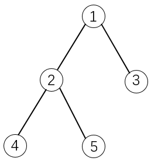
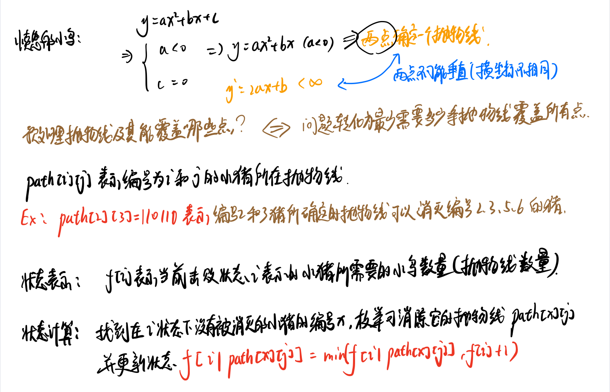

动态规划

有一说一，这个东西是真的难，不过我觉得通过 **思考+刷题** 是可以解决大部分的DP的。加油！打工人!

毕竟某大神说的是吧，咱必须相信啊


> 刷题怎么刷呢？也是从简单=>中等=>困难吗？本人的路线是：先去找一个简单的动态规划类型题(比如去Leetcode刷)=>写完后查看与该题类似的题目=>然后根据这道题的经验看能否应用到类似的DP问题中. 这样循序渐进的同时也让你掌握了一系列问题的解决套路。

> 动态规划是一种将**原始问题分解成多个规模较小的子问题，而各个子问题之间相互联系，最终由子问题的解合并成原始问题**解的算法

动态规划问题的一般形式就是来==求最值==，因此当遇到求最大值/最小值等问题时，可以考虑一手是不是要用动态规划，此时你就要考虑该题符不符合其==四要素==了，不符合的还是另想办法！

> 注：因为本人比较笨，学了比较久的DP，学习了不同的解题方法和风格，因此本文记录的解题方法和风格会有两大类：一种是从状态转移去分析，一种是从集合的角度去分析

**动态规划算法四要素**：判断能否进行动态规划的条件

- 最优子结构

  > 当一个问题的最优解必然包含其子问题的最优解时，称该问题具有最优子结构。

  > 子问题：对于一个问题而言，只有规模比该问题小、其他均与该问题一致的问题才可称为其子问题，同时，子问题不会对规模等大的问题造成影响[**无后效性**]

- 重叠子问题

  > 当求取子问题解的时候，往往会出现许多**重复计算**。而动态规划是先解决小的问题，当后面再次出现该子问题时，可以直接求解

- 状态与状态转移方程

  > 动态规划是一种**自底向上**解决问题的思想，“状态”就是子问题的解，”状态转移方程“就是子问题之间的递推关系[说白了就是递推公式]

- 边界条件

  > 边界条件就是程序的停止条件。

```
递归算法通常是自顶向下构造函数，而动态规划为自底向上构造程序结构的算法思想。简单来说，动态就是先解决小问题，然后大问题的解可以由小问题的解直接转换求得。
```

动态规划最难的部分就是写出`动态转移方程`，这里有几点需要关心：

1. 最小的子问题的情况是什么?
2. 一个问题有哪些状态？
3. 对于每个当前的状态，可以选择什么？
4. 如何通过dp数组来表示你的"状态和选择"


**常见问题类型**：

- xxx的方式有几种/组合问题

- 最大/最小值等问题

  > 上面这两类问题难度一般较高，会仔细讲

- 明显递推方式的问题$,  f(x) 由 f(x-1)得来$

**常见优化**：

- 空间上原来二维数组采用滚动数组变为一维
- 原来的一维采用O(1)的变量代替


### **最大/最小值类型**

#### 例：打家劫舍

你是一个专业的小偷，计划偷窃沿街的房屋。每间房内都藏有一定的现金，影响你偷窃的唯一制约因素就是相邻的房屋装有相互连通的防盗系统，如果两间相邻的房屋在同一晚上被小偷闯入，系统会自动报警。
给定一个代表每个房屋存放金额的非负整数数组，计算你 不触动警报装置的情况下 ，一夜之内能够偷窃到的最高金额。

```
输入：[1,2,3,1]
输出：4
解释：偷窃 1 号房屋 (金额 = 1) ，然后偷窃 3 号房屋 (金额 = 3)。
     	偷窃到的最高金额 = 1 + 3 = 4 。
```

下面给了两种解题方案，体会一下状态转移的重要性。

```cpp
class Solution {
public:
    int rob(vector<int>& nums) {
        int n = nums.size();
        //dp[i][0]:上一个i-1没偷，当前偷之后的最多金额
        //dp[i][1]:上一个i-1没偷，当前也没偷的最多金额
        //dp[i][2]:上一个i-1偷了，当前不偷的最多金额
        vector<vector<int>> dp(n,vector<int> (3,0));
        dp[0][0] = nums[0];
        dp[0][1] = 0;
        dp[0][2] = 0;
        for(int i=1;i<n;i++){
            //上一个没偷：那么上一个状态只可能是dp[i-1][1]或者dp[i-1][2].同时当前偷了，需要加上当前金额，取两者最大值
            dp[i][0] = max(dp[i-1][1],dp[i-1][2]) + nums[i];
            //上一个没偷：那么上一个状态只可能是dp[i-1][1]或者dp[i-1][2]，当前也不偷，取上一个状态两者最大值
            dp[i][1] = max(dp[i-1][1],dp[i-1][2]);
            //上一个偷了，当前状态即为上一次偷之后的状态，上一次只有可能dp[i-1]0]偷了
            dp[i][2] = dp[i-1][0];
        }
        //返回3者可能最大值
        return max(max(dp[n-1][0],dp[n-1][1]),dp[n-1][2]);
    }
};
```

空间优化：

```cpp
//空间优化
class Solution {
public:
    int rob(vector<int>& nums) {
        int n = nums.size();
        //dp[0]:上一个没偷，当前偷之后的最多金额
        //dp[1]:上一个没偷，当前也没偷的最多金额
        //dp[2]:上一个偷了，当前不偷的最多金额
        vector<int> dp(3,0);
        dp[0] = nums[0];
        dp[1] = 0;
        dp[2] = 0;
        for(int i=1;i<n;i++){
            //暂存dp[2];
            int tdp2 = dp[2];
            //上一个偷了，当前状态即为上一次偷之后的状态，上一次只有可能dp[0]偷了
            dp[2] = dp[0];
            //上一个没偷：那么上一个状态只可能是dp[1]或者dp[2].同时当前偷了，需要加上当前金额，取两者最大值
            dp[0] = max(dp[1],tdp2) + nums[i];
            //上一个没偷：那么上一个状态只可能是dp[1]或者dp[2]，当前也不偷，取上一个状态两者最大值
            dp[1] = max(dp[1],tdp2);

        }
        //返回3者可能最大值
        return max(max(dp[0],dp[1]),dp[2]);
    }
};
```

不要急，我们再看一下另外一个代码，这个输入比较常见的动态规划的框架类型。

我们定义dp表的意义为dp[i]]表示对于`nums[0]~nums[i]的房屋所能偷的最大金额`，`那么对于第0~i的房屋所能偷的最大金额取决于0~i-1的房屋偷的金额(此时第i个屋子就不能偷了)和0~i-2的房屋的最大值+第i个房屋的金额这两者的较大值。`

```cpp
class Solution {
public:
    int rob(vector<int>& nums) {
        if (nums.empty()) {
            return 0;
        }
        int size = nums.size();
        //只有一间房则肯定偷
        if (size == 1) {
            return nums[0];
        }
        //创建dp表 dp[i]表示对于nums[0]~nums[i]的房屋所能偷的最大金额
        vector<int> dp = vector<int>(size, 0);
        //dp表的初始情况初始化
        dp[0] = nums[0];
        dp[1] = max(nums[0], nums[1]);
        for (int i = 2; i < size; i++) {
            dp[i] = max(dp[i - 2] + nums[i], dp[i - 1]);
        }
        return dp[size - 1];
    }
};
```

> 我们可以看出，dp表的定义方式不同，我们解题的框架就不太相同，但是总体思想都是通过先前状态来推导当前的最优状态。
>
> 其中，第二种方法为比较常见的dp表定义方式

#### 例：打家劫舍II

你是一个专业的小偷，计划偷窃沿街的房屋，每间房内都藏有一定的现金。这个地方**所有的房屋都 围成一圈** ，这意味着**第一个房屋和最后一个房屋是紧挨着的**。同时，相邻的房屋装有相互连通的防盗系统，如果两间相邻的房屋在同一晚上被小偷闯入，系统会自动报警 。

给定一个代表每个房屋存放金额的非负整数数组，计算你 在不触动警报装置的情况下 ，今晚能够偷窃到的最高金额。

> 题目是对原本的升级版，其实就是将原本的数组修改为了循环数组，解决方案和之前一样，只是我们需要遍历两次。分别求`0~n-2范围内房屋的可以偷到金额最大值`和`0~n-1范围内房屋的可以偷到金额最大值`，两者取较大值即可.

```cpp
class Solution {
public:
    /*此部分将原本的dp表进行了压缩，因为dp[i]只和dp[i-1]和dp[i-2]有关*/
    int getmaxRobval(int start,int end,vector<int> & nums){
        int first = nums[start],second = max(nums[start],nums[start+1]);
        //不太理解的就把first看作dp[i-2],second看作dp[i-1]
        for(int i = start + 2;i <= end;i++){
            int temp = second;//暂存second,因为接下来要修改second
            second = max(nums[i]+first,second);
            first = temp;
        }
        return second;
    }
    
    int rob(vector<int>& nums) {
        int n = nums.size();
        if(n == 1)return nums[0];//如果只有一个房屋直接偷
        if(n == 2)return max(nums[0],nums[1]);//两个房屋偷贵的
        //因为首尾相连，因此需要两次判断，并取较大值。
        return max(getmaxRobval(0,n-2,nums),getmaxRobval(1,n-1,nums));
    }
};
```

#### 例：打家劫舍III

在上次打劫完一条街道之后和一圈房屋后，小偷又发现了一个新的可行窃的地区。这个地区只有一个入口，我们称之为“根”。 除了“根”之外，每栋房子有且只有一个“父“房子与之相连。一番侦察之后，聪明的小偷意识到“这个地方的所有房屋的排列类似于一棵二叉树”。 如果两个直接相连的房子在同一天晚上被打劫，房屋将自动报警。计算在不触动警报的情况下，小偷一晚能够盗取的最高金额。

```
输入: [3,2,3,null,3,null,1]

     3
    / \
   2   3
    \   \ 
     3   1

输出: 7 
解释: 小偷一晚能够盗取的最高金额 = 3 + 3 + 1 = 7.
```

刚看这道题还是比较懵的，但是后来想想就是跟前面的思想一样的，只是此时创建数组形式的dp表不太现实了，因此改为哈希表来作为dp表。

思考，对于结点x，以x为根的树能够被偷的最大金额有两种**状态**：`结点x被偷`和`结点x不被偷`。

对于**选择**，当`结点x被偷`时，那么两个子节点都不能被偷，当`结点x不被偷`时，两个子节点可以被偷，也可以不被偷，取两者较大的值。

**此时，一个思路就慢慢浮现...**

我们可以用 selectMap(x) 表示偷 x 节点的情况下，x 节点的子树上被偷的节点的最大权值和；noselectMap(x) 表示不选择 x 节点的情况下，x 节点的子树上被选择的节点的最大权值和；l 和 r 代表 x 的左右孩子。

- 当 x 被选中时，x 的左右孩子都不能被选中，故 x 被选中情况下子树上被选中点的最大权值和为 l 和 r 不被选中的最大权值和相加，即 $selectMap(x) = noselectMap(l)+noselectMap(r)$。
- 当 x 不被选中时，x 的左右孩子可以被选中，也可以不被选中。对于 x 的某个具体的孩子 x，它对 x 的贡献是 x 被选中和不被选中情况下权值和的较大值。故 $noselectMap(x)=max\{selectMap(l),noselectMap(l)\}+max\{selectMap(r),noselectMap(r)\}$

至此，我们可以用哈希表`map<Treenode *,int>`来存 selectMap和 noselectMap 的函数值，用深度优先搜索的办法后序遍历这棵二叉树，我们就可以得到每一个节点的 selectMap和 noselectMap。

```cpp
class Solution {
public:
    map<TreeNode *,int> selectMap;
    map<TreeNode *,int> noselectMap;
    void dfs(TreeNode *root){
        if(!root) return;
        dfs(root->left);
        dfs(root->right);
        selectMap.insert(make_pair(root,root->val+noselectMap[root->left]+noselectMap[root->right]));
        noselectMap.insert(make_pair(root,max(selectMap[root->left],noselectMap[root->left])+max(selectMap[root->right],noselectMap[root->right])));
        
    }
    int rob(TreeNode* root){
        dfs(root);
        return max(selectMap[root],noselectMap[root]);
    }
};
```


> 问？能否将打家劫舍抽离出一个模型呢？


#### 例：删除并获得点数

给你一个整数数组`nums`，你可以对它进行一些操作。每次操作中，选择任意一个 nums[i] ，删除它并获得 nums[i] 的点数。之后，你必须删除 所有 等于 nums[i] - 1 和 nums[i] + 1 的元素。

开始你拥有 0 个点数。返回你能通过这些操作获得的最大点数。

```
输入：nums = [2,2,3,3,3,4]
输出：9
```

通过理解题目后，我们发现 不如我们挑选了值为 k 的元素，那么 k-1 和 k-2 的元素我就不能挑选了（也就是 相邻大小的值的元素 不能被选择）如果你做过`打家劫舍`那么你会突然意识到，这不就类似打家劫舍问题，偷其中一家，则相邻的就不能偷了。两者的原理是一样的，只不过 打家劫舍 问题是选择索引下标 （即，限制的是下标），而此题限制的是 值。下标是唯一的，但是值可能有很多重复的，因此，我们在进行选择前需要提前统计 值大小为 k 的元素的和 sum 是多少，并进行记录，我们可以用一个数组来进行存储，sums[k] = x 表示 `值大小为 k 的元素的和是 x`，之后我们就可以采用与打家劫舍相似的方法来处理 sums 数组。

```cpp
class Solution {
public:

    int rob(vector<int> &sums){
        int n = sums.size();
        if(n == 1) return sums[0];
        int first = sums[0],second = max(sums[0],sums[1]);
        for(int i = 2;i < n;i += 1){
            int tmp = second;
            second = max(first + sums[i],second);
            first = tmp;
        }
        return max(first,second);
    }
    int deleteAndEarn(vector<int>& nums) {
        int n = nums.size();
        vector<int> sums(10000+5,0);
        for(int i = 0;i < n;i++){
            sums[nums[i]] += nums[i];
        }
        return rob(sums);
    }
};
```

> 由此，我们可以看出，有些问题其实本质是相似的，只是需要再解决问题的时候进行一些逻辑转换，而这，也是比较难的，非常考验解题者的逻辑能力。


#### 例：股票买卖

给定一个数组 prices ，它的第 i 个元素 prices[i] 表示一支给定股票第 i 天的价格。

你只能选择 某一天 买入这只股票，并选择在 未来的某一个不同的日子 卖出该股票。设计一个算法来计算你所能获取的最大利润。

返回你可以从这笔交易中获取的最大利润。如果你不能获取任何利润，返回 0 。

```
输入：[7,1,5,3,6,4]
输出：5
```

我们还是看看**选择**先，对于每一天，可以选择买入、卖出、不买不卖三种选择。但是呢，题目具有一些限制条件，即**只能买卖一次股票**。

接下来就是定义dp表含义，我们定义`dp[i][0]`为在**第i天手上没有股票时的收益**，`dp[i][1]`为在**第i天手上持有股票时的收益**。考虑一下它可以由哪些状态转移过来呢？

显然`dp[i][0]`可以由**前一天没有股票今天也不买**和**前一天手持股票今天卖出**两种方式转移而来，即$dp[i][0] = max(dp[i-1][0],dp[i-1][1]+prices[i])$

对于`dp[i][1]`可以由前一天持有股票今天不卖和前一天没有股票今天买入两种方式转移，即$dp[i][1] = max(dp[i-1][1],-prices[i])$，这里为什么不是`dp[i-1][0]-prices[i]`而是`-prices[i]`呢？因为有一个限制条件：**只能买卖一次股票**。因此买股票时不能从前一天没有股票的状态转移而来，因为可能很早以前已经买过并卖出了。

```python
class Solution:
    def maxProfit(self, prices: List[int]) -> int:
        n = len(prices)
        if n == 0: return 0
        #dp[i][0]：至第i天，手里没有股票时的收益
        #dp[i][1]：至第i天，手里有股票时的收益
        dp = [[0 for i in range(2)] for j in range(n)]
        dp[0][0],dp[0][1] = 0,-prices[0]
        for i in range(1,n):
            dp[i][0] = max(dp[i-1][0],dp[i-1][1] + prices[i])
            dp[i][1] = max(dp[i-1][1],-prices[i])
        return dp[n-1][0]
```

这里贴一个python版的代码，希望大家能够在刷题的时候能多掌握几种语言，因为每种语言都有各自的优势，有的语言可以借助本身提供的数据结构来进行求解，会很方便。这里推荐python+Cpp两种方式刷题，当然java也是不错的选择。

#### 例：股票买卖II

给定一个数组 prices ，其中 prices[i] 是一支给定股票第 i 天的价格。

计算你所能获取的最大利润。你可以尽可能地完成更多的交易（多次买卖一支股票）。

> 注意：你不能同时参与多笔交易（你必须在再次购买前出售掉之前的股票）。

```
输入: prices = [7,1,5,3,6,4]
输出: 7
```

此题相较于上一题多了一个条件就是可以多次买卖股票，不过基本思想还是一样，我们还是按照上题创建dp表，只是在动态转移方程处需要进行修改。原本只能买卖一次，因此$dp[i][1] = max(dp[i-1][1],-prices[i])$，而此时可以多次买卖，因此可以由上一个没有股票时的状态转移而来，因此此时$dp[i][1] = max(dp[i-1][1],dp[i-1][0]-prices[i])$

```cpp
class Solution {
public:
    int maxProfit(vector<int>& prices) {
        int n = prices.size();
        /*
        dp[i][0]:到第i天手上没有股票时所获得最大利润
        dp[i][1]:到第i天手上有股票时所获得最大利润
        */
        vector<vector<int>> dp(n,vector<int> (2,0));
        dp[0][0] = 0;
        dp[0][1] = -prices[0];
        for(int i = 1;i < n;i++){
            dp[i][0] = max(dp[i-1][0],dp[i-1][1] + prices[i]);
            dp[i][1] = max(dp[i-1][1],dp[i-1][0] - prices[i]);
        }
        return dp[n-1][0];
    }
};
```

> 可以看到，其实大体思路是不变的，改变的只是题目的限制条件


#### 例：股票买卖III

给定一个数组，它的第 i 个元素是一支给定的股票在第 i 天的价格。

设计一个算法来计算你所能获取的最大利润。你最多可以完成 两笔 交易。

> 注意：你不能同时参与多笔交易（你必须在再次购买前出售掉之前的股票）。

```
输入：prices = [3,3,5,0,0,3,1,4]
输出：6
```

此题在上一题的基础上更新了限制条件，就是最多只能买卖两次股票。我们还是先考虑**选择**和**状态**，选择还是哪几个选择`保留、卖出、买入`，而状态变了，对于第i天，有5种状态：`一张没买、买了一张、卖了一张此时什么没有股票、买了第二张、卖了第二张股票`，我们还根据前面的两题的想法写出状态转移方程。但是我们要注意，`一张没买`的状态只能从`前一天一张没买的状态`进行转移。因此其值一直为0，我们可以将其省略，对于剩余4种状态，我们分别定义dp表将其对应。

-  dp`[i][0]`:在第i天时，手上持有一张股票时的最大利益
-  dp`[i][1]`:在第i天时，手上没有股票，并已经卖出了一次时的最大利益
-  dp`[i][2]`:在第i天时，手上持有第二次买入的股票时的最大利益
-  dp`[i][3]`:在第i天时，手上没有股票，已经完成两次卖出时的最大利益

则可以分别写出动态转移方程：

$dp[i][0] = max(dp[i-1][0],0 - prices[i])，此处的0 就是前一天一张没买的状态$

$dp[i][1] = max(dp[i-1][1],dp[i-1][0] + prices[i])$

$dp[i][2] = max(dp[i-1][2],dp[i-1][1] - prices[i])$

$dp[i][3] = max(dp[i-1][3],dp[i-1][2] + prices[i])$

最后的结果肯定就是最后一天两张都卖出的状态，即`dp[n-1][3]`

> 当然，因为第i天的状态只和第i-1天有关，因此可以进行状态压缩，减少空间复杂度如:  
>
> ```cpp
> buy1 = max(buy1,-prices[i]);
> sell1 = max(sell1,buy1+prices[i]);
> buy2 = max(buy2,sell1-prices[i]);
> sell2 = max(sell2,buy2+prices[i]);
> ```

```python
class Solution:
    def maxProfit(self, prices: List[int]) -> int:
        n = len(prices)
        dp = [ [0 for i in range(4)] for j in range(n) ]
        '''
        dp[i][0]:在第i天时，手上持有一张股票时的最大利益
        dp[i][1]:在第i天时，手上没有股票，并已经卖出了一次时的最大利益
        dp[i][2]:在第i天时，手上持有第二次买入的股票时的最大利益
        dp[i][3]:在第i天时，手上没有股票，已经完成两次卖出时的最大利益
        '''
        dp[0][0],dp[0][1],dp[0][2],dp[0][3] = -prices[0],0,-prices[0],0
        for i in range(1,n):
            dp[i][0] = max(dp[i-1][0],0 - prices[i])
            dp[i][1] = max(dp[i-1][1],dp[i-1][0] + prices[i])
            dp[i][2] = max(dp[i-1][2],dp[i-1][1] - prices[i])
            dp[i][3] = max(dp[i-1][3],dp[i-1][2] + prices[i])
        return dp[n-1][3]
```

> 记录一下：当我做到这里时，我发现好像如果能够用动态规划首先要了解清除状态和选择，因为这是你构建状态转移方程的源泉之一。

#### 例：股票买卖IV

给定一个整数数组 prices ，它的第 i 个元素 prices[i] 是一支给定的股票在第 i 天的价格。

设计一个算法来计算你所能获取的最大利润。你最多可以完成 k 笔交易。

```
输入：k = 2, prices = [3,2,6,5,0,3]
输出：7
```

题目又得到了升级...，此时由原来的2次变为了k次，此时，如果你是一路认真做过来的，那么你应该会想到不就是把k=2的情况转换为一个k遍历，原理还是一样的。确实，原理还是一样的，只不过有许多细节需要注意。不管什么时候，你都要清除你的dp表的含义是什么？你的动态转移方程应该怎么来求。好的，我们来看一下。

我们定义`buys[i][j]表示第i天已经买卖了j次股票并且当前有股票时的最大收益`，定义`sells[i][j]:表示第i天已经买卖了j次股票并且当前没有股票时的最大收益`。当然你也可以定义成`dp[2][i][j]将buys和sells合并`，这里是为了方便讲解分开定义。

那么我们根据前几道股票买卖问题可以比较容易的推导出状态转移方程：

$sells[i][j] = max(sells[i-1][j],buys[i-1][j-1] + prices[i])$，$buys[i][j] = max(buys[i-1][j],sells[i-1][j] - prices[i])$

这里有个小细节需要注意`sells[i][j]是由buys[i-1][j-1] + prices[i]转移而来而不是buys[i-1][j]`，因为`buys[i-1][j-1]`表示前一天(i-1)交易了 j-1 次并且当前还有股票，将其在第 i 天交易，就得到了`sells[i][j]`，表示在第 i 天交易了 j 次并且没有股票。

另外，还有一些**注意事项**：

- 就是我们在第0天的时候，只有可能 也 最多可能交易0次，因此$sells[0][k]和buys[0][k],k\in[1,n)$都应该是一个无效的值，因此我们将其设置为一个极小值(因为我们是求极大值，因此其不会对结果造成影响)。
- 因为`sells`的转移方程为：$sells[i][j] = max(sells[i-1][j],buys[i-1][j-1] + prices[i])$，状态转移涉及到`buys[i-1][j-1]`，因此j肯定不可能从0开始遍历，**会造成数组访问越界**。但是我们又需要它！因此在每一天的开始时，我们需要对`buys[i][0]`初始化（`buys[0][0]`在最开始初始化了)
- 最后我们返回的是`sells[n-1][i]中的最大值`。

```cpp
class Solution:
    def maxProfit(self, k: int, prices: List[int]) -> int:
        if not prices: return 0
        n = len(prices)
        '''
        buys[i][j]:表示第i天已经买卖了j次股票并且当前有股票时的最大收益
        sells[i][j]:表示第i天已经买卖了j次股票并且当前没有股票时的最大收益
        '''
        buys = [[ 0 for i in range(k+1)] for j in range(n)]
        sells = [[0 for i in range(k+1)] for j in range(n)]
        buys[0][0] = -prices[0] #第0天买卖了0次并且当前有股票时受益为-prices[0]
        sells[0][0] = 0         #第0天买卖了0次并且当前没有股票时受益为0
        #第0天不可能交易任何股票，因此buys[0][i] (0,k] 都设置为一个无穷小数表示无效
        for i in range(1,k+1):
            buys[0][i] = sells[0][i] = float("-inf")
        for i in range(1,n): # 1 ~ n-1
            #因为sells[i][j]的动态转移需要用到buys[i-1][j-1]，而j是从1~k，需要对buys[i][0]进行计算
            buys[i][0] = max(buys[i-1][0],sells[i-1][0]-prices[i])
            for j in range(1,k+1): # 1 ~ k
                sells[i][j] = max(sells[i-1][j],buys[i-1][j-1] + prices[i])
                buys[i][j] = max(buys[i-1][j],sells[i-1][j] - prices[i])
        #print(sells[n-1])
        return max(sells[n-1])
```

这些基本上就是股票问题基本的解决方法了，有的时候题目还有添加什么`交易手续费`等等额外条件，其实就是对`动态转移方程`进行一些条件限制和修改而已。同时，对于`股票买卖IV`，还有一种`基于Wqs二分`的方法：https://leetcode-cn.com/problems/best-time-to-buy-and-sell-stock-iv/solution/yi-chong-ji-yu-wqs-er-fen-de-you-xiu-zuo-x36r/


> 能否将股票买卖抽离为一个模型呢？


#### 例：最大连续子数组的和

给定一个整数数组 `nums` ，找到一个具有最大和的连续子数组（子数组最少包含一个元素），返回其最大和。

```
输入：nums = [-2,1,-3,4,-1,2,1,-5,4]
输出：6
```

由题可知，所求的是连续子数组且其和最大。经过之前的训练，我们可以定义`dp[i]表示以nums[i]结尾的子数组所具有的最大和`。

> 有时候你可能不能一下想出比较好的dp定义方式，这个时候就要尝试定义，切记不要害怕去尝试！

我们为什么会想到这样的dp表定义方式呢？我们首先看题目：要求的是连续子数组。同时呢，又要求是最大和，便想到选择是：`对于一个nums[i]，加入或者不加入目前的最大连续子数组`，同时`又要维护连续的要求`，那么其只能选择`加入以nums[i-1]结尾的子数组的后面`或者`重新另起一个子数组`。这样不就可以想到定义`dp[i]表示以nums[i]结尾的子数组所具有的最大和`

那么状态转移方程也就出来了：$dp[i] = max(dp[i-1]+nums[i],nums[i])$

即，要么选择将nums[i]加入以nums[i-1]结尾的子数组后，要么就是将nums[i]作为一个新的子数组

```python
#python 3
class Solution:
    def maxSubArray(self, nums: List[int]) -> int:
        n = len(nums)
        dp = [0 for i in range(n)]
        dp[0] = nums[0]
        for i in range(1,n):
            dp[i] = max(dp[i-1]+nums[i],nums[i])
        return max(dp)
```


#### 例：乘积最大子数组

给你一个整数数组 `nums` ，请你找出数组中乘积最大的连续子数组（该子数组中至少包含一个数字），并返回该子数组所对应的乘积。

```
输入: [2,3,-2,4]
输出: 6
```

这题乍一看！好像跟上一道`最大连续子数组的和`，然后直接`定义dp[i]表示以nums[i]结尾的子数组所具有的最大乘积`并且一波操作写出状态转移方程$dp[i] = max(dp[i-1]*nums[i],nums[i])$，然后就提示**失败**，哈哈哈哈哈哈~

我们看一下为什么！如果经验老道的童鞋可能一眼就会看出 乘积 问题涉及的负数问题，即 负负得正 这一个坑。举个例子：

假设`nums = [3,-2,2,3,-2]`，显然最大连续子数组乘积是所有元素相乘为 72，但是按照我们上面定义的dp及状态转移方程，我们推导一下：`dp = [3,-2,2,6,-2]`，最后返回的是 6。为什么会这样呢？是因为`当前位置的最优解未必是由前一个位置的最优解转移得到的`。因为对于最后一个-2来说，它的最优子问题的解不是 6，而是 3 * -2 * 2 * 3 = -36，这是因为它本身是个负数，因此**期望有一个最小的数**和它相乘成为一个比较大的正数。===>因此我们在状态转移的时候就要考虑 符号的问题了 我们不仅需要知道`以nums[i]结尾的子数组所具有的最大乘积`还需要知道`以nums[i]结尾的子数组所具有的最小乘积`来进行状态转移。

考虑当前位置如果是**一个负数**的话，那么我们希望以它前一个位置结尾的某个段的积也是个负数，这样就可以负负得正，并且我们希望这个积**尽可能负得更多**，即尽可能小。如果当前位置是**一个正数**的话，我们更希望以它前一个位置结尾的某个段的积也是个正数，并且希望它**尽可能地大**。于是我们定义`dpMax[i]：以nums[i]结尾的子数组所具有的最大乘积`和`dpMin[i]：以nums[i]结尾的子数组所具有的最小乘积`

则状态转移方程：

$dpMax[i] = max(dpMax[i-1]*nums[i],dpMin[i-1]*nums[i],nums[i]);$

$dpMin[i] = min(dpMax[i-1]*nums[i],dpMin[i-1]*nums[i],nums[i]);$

最后返回的结果是`dpMax中的最大值`

```cpp
class Solution {
public:
    int maxProduct(vector<int>& nums) {
        int n = nums.size();
        vector<int> dpMax(n,0),dpMin(n,0);
        dpMax[0] = dpMin[0] = nums[0];
        for(int i = 1;i < n;i++){
            dpMax[i] = max(max(dpMax[i-1]*nums[i],dpMin[i-1]*nums[i]),nums[i]);
            dpMin[i] = min(min(dpMax[i-1]*nums[i],dpMin[i-1]*nums[i]),nums[i]);
        }
        return *max_element(dpMax.begin(), dpMax.end());
    }
};
```


### **xxx的方式有几种**/组合问题

> 这类问题也比较多，一般属于简单和中等难度题目。

#### 例： 不同路径 

> 题目来源：Leetcode 63

一个机器人位于一个 m x n 网格的左上角 （起始点在下图中标记为 “Start” ）。

机器人每次只能向下或者向右移动一步。机器人试图达到网格的右下角（在下图中标记为 “Finish” ）。

问总共有多少条不同的路径？

```
输入：m = 3, n = 7
输出：28
```

题目知道，我们在每个点的**选择**可以有“向下”或者"向右"。对于此题来说，**状态**就是从左上角至`[i][j]`点有多少。因此，对于当前的状态，可以由其左边的和上边的点状态转移过来。我们定义`dp[i][j]`的意义为：从左上角`[0][0]`至`[i][j]`有多少种路径，那么我们可以很容易推出递推公式：
$$
dp[i][j] =
\begin{cases} 
1,  & \text{if } i==0 \text{||}j == 0 \\
dp[i-1][j]+dp[i][j-1, & \text{if }  i \geq 1 \text{&&} j\geq1
\end{cases}
$$

```cpp
class Solution {
public:
    int uniquePaths(int m,int n)
    {
        vector<vector<int>> res(m);
        for (int i = 0; i < m; i++){
            res[i].resize(n);
        }
        //初始化
        res[0][0] = 1;
        for (int i = 1; i < n; i++){
            res[0][i] = 1;
        }
        for (int i = 1; i < m; i++){
            res[i][0] = 1;
        }
        //根据状态转移方程更新dp表
        for (int row = 1; row < m; row++){
            for (int col = 1; col < n; col++){
                res[row][col] = res[row-1][col] + res[row][col-1];
            }
        }
        return res[m-1][n-1];
    }
};
```


#### 例： 不同路径 II

> 题目来源：Leetcode 63

一个机器人位于一个 m x n 网格的左上角 （起始点在下图中标记为“Start” ）。

机器人每次只能向下或者向右移动一步。机器人试图达到网格的右下角（在下图中标记为“Finish”）。

现在考虑网格中有障碍物。那么从左上角到右下角将会有多少条不同的路径？

网格中的障碍物和空位置分别用 `1` 和 `0` 来表示。

```
输入：obstacleGrid = [[0,0,0],[0,1,0],[0,0,0]]
输出：2
```

此题在上一题只是加上了一些限制条件，有的地方加上了石块不能经过，那么我们就按照题目要求意思，如果obstacleGrid`[i][j]`  == 1，那么到达该点的路径有0条。其余考虑点还是和上题一样。

```cpp
class Solution {
public:
    int uniquePathsWithObstacles(vector<vector<int>>& obstacleGrid) {
        int m = obstacleGrid.size();
        int n = obstacleGrid[0].size();
        vector<vector<int>> dp(m,vector<int> (n,0));
        for(int i = 0;i < m;i++){
            if(obstacleGrid[i][0] == 1)
                break;
            dp[i][0] = 1;
        }
        for(int i = 0;i < n;i++){
            if(obstacleGrid[0][i] == 1)
                break;
            dp[0][i] = 1;
        }
        for(int i = 1;i < m;i++){
            for(int j = 1;j < n;j++){
                if(obstacleGrid[i][j] == 1) continue;
                dp[i][j] = dp[i-1][j] + dp[i][j-1];
            }
        }
        return dp[m-1][n-1];
    }
};
```


### **明显递推方式的问题**

这类问题比较明显，通常递归就可以解决，但是递归会消耗大量的栈空间。通过动态规划方法解决也是不错的方法。

比如常见的斐波那契数列等等，这类问题比较简单，就不细讲了。举个简单的例子应付一下哈哈哈哈

#### 例:获取生成数组中的最大值

> 题目来源：Leetcode 1646. 

给你一个整数 n 。按下述规则生成一个长度为 n + 1 的数组 nums ：

- nums[0] = 0
- nums[1] = 1
- 当$ 2 <= 2 * i <= n $时，$nums[2 * i] = nums[i]$
- 当 $2 <= 2 * i + 1 <= n $时，$nums[2 * i + 1] = nums[i] + nums[i + 1]$

要求：返回生成数组 nums 中的 **最大** 值。

```cpp
class Solution {
public:
    int getMaximumGenerated(int n) {
        vector<int> nums(n+1);
        if(n == 0) return 0;
        if(n == 1) return 1;
        int ans = 1;
        nums[0] = 0;
        nums[1] = 1;
        for(int i = 1;i <= n / 2;i++){
            //根据题目给的递推关系进行递推。
            nums[i*2] = nums[i];
            if(i * 2 + 1<= n){
                nums[i*2 + 1] = nums[i] + nums[i+1];
                ans = max(ans,max(nums[i*2],nums[i*2+1]));
            }else{
                ans = max(ans,nums[i*2]);
            }
        }
        return ans;
    }
};
```


### 背包问题

许多动态规划问题其实都是背包问题的模型。

#### 01背包

有 N 件物品和一个容量是 V 的背包。每件物品只能使用一次。

第 ii 件物品的体积是 $v_i$，价值是 $w_i$。

求解将哪些物品装入背包，可使这些物品的总体积不超过背包容量，且总价值最大。
输出最大价值。

**输入格式**

第一行两个整数，N，V，用空格隔开，分别表示物品数量和背包容积。

接下来有 N 行，每行两个整数 $v_i,w_i$，用空格隔开，分别表示第 i 件物品的体积和价值。

**输出格式**

输出一个整数，表示最大价值。


```java
public static void main(String[] args) throws IOException {
    InputStreamReader in = new InputStreamReader(System.in);
    BufferedReader bf = new BufferedReader(in);
    String [] ins = bf.readLine().split(" ");
    int N = Integer.parseInt(ins[0]);
    int V = Integer.parseInt(ins[1]);
    int [] v = new int[N];
    int [] w = new int[N];
    for (int i = 0;i < N;i++){
        ins = bf.readLine().split(" ");
        v[i] = Integer.parseInt(ins[0]);
        w[i] = Integer.parseInt(ins[1]);
    }
    int [][] dp = new int[N+1][V+1];
    for (int i = 1;i <= N;i++){
        for (int j = 0;j <= V;j++){
            dp[i][j] = dp[i-1][j];
            if (j-v[i-1] >= 0){
                dp[i][j] = Math.max(dp[i][j],dp[i-1][j-v[i-1]] + w[i-1]);
            }
        }
    }
    System.out.println(dp[N][V]);
}
```

空间压缩优化：

```java
    public static void main(String[] args) throws IOException {
        InputStreamReader in = new InputStreamReader(System.in);
        BufferedReader bf = new BufferedReader(in);
        String [] ins = bf.readLine().split(" ");
        int N = Integer.parseInt(ins[0]);
        int V = Integer.parseInt(ins[1]);
        int [] v = new int[N];
        int [] w = new int[N];
        for (int i = 0;i < N;i++){
            ins = bf.readLine().split(" ");
            v[i] = Integer.parseInt(ins[0]);
            w[i] = Integer.parseInt(ins[1]);
        }
        int [] dp = new int[V+1];
        for (int i = 1;i <= N;i++){
            for (int j = V;j >= 0;j--){
                // 因为第i行只用到了第i-1行，因此可以进行空间压缩，注意：j层循环可能要从大到小
                if (j-v[i-1] >= 0){
                    dp[j] = Math.max(dp[j],dp[j-v[i-1]] + w[i-1]);
                }
            }
        }
        System.out.println(dp[V]);
    }
```


#### 完全背包

有 N 种物品和一个容量是 V 的背包，每种物品都有无限件可用。

第 i 种物品的体积是 $v_i$，价值是 $w_i$。

求解将哪些物品装入背包，可使这些物品的总体积不超过背包容量，且总价值最大。
输出最大价值。

**输入格式**

第一行两个整数，N，V，用空格隔开，分别表示物品种数和背包容积。

接下来有 N 行，每行两个整数 $v_i,w_i$，用空格隔开，分别表示第 i 种物品的体积和价值。

**输出格式**

输出一个整数，表示最大价值。


```java
import java.io.*;
import java.util.*;

public class Main {

    public static void main(String[] args) throws IOException {
        InputStreamReader in = new InputStreamReader(System.in);
        BufferedReader bf = new BufferedReader(in);
        String [] ins = bf.readLine().split(" ");
        int N = Integer.parseInt(ins[0]);
        int V = Integer.parseInt(ins[1]);
        int [] v = new int[N];
        int [] w = new int[N];
        for (int i = 0;i < N;i++){
            ins = bf.readLine().split(" ");
            v[i] = Integer.parseInt(ins[0]);
            w[i] = Integer.parseInt(ins[1]);
        }
        int [][] dp = new int[N+1][V+1];
        for (int i = 1;i <= N;i++){
            for (int j = 0;j <= V;j++){
                for (int k = 0; k * v[i-1] <= j;k++){
                    dp[i][j] = Math.max(dp[i][j],dp[i-1][j-k*v[i-1]] + k * w[i-1]);
                }
            }
        }
        System.out.println(dp[N][V]);
    }
}
```


优化后：

```java
import java.io.*;
import java.util.*;

public class Main {

    public static void main(String[] args) throws IOException {
        InputStreamReader in = new InputStreamReader(System.in);
        BufferedReader bf = new BufferedReader(in);
        String [] ins = bf.readLine().split(" ");
        int N = Integer.parseInt(ins[0]);
        int V = Integer.parseInt(ins[1]);
        int [] v = new int[N];
        int [] w = new int[N];
        for (int i = 0;i < N;i++){
            ins = bf.readLine().split(" ");
            v[i] = Integer.parseInt(ins[0]);
            w[i] = Integer.parseInt(ins[1]);
        }
        int [][] dp = new int[N+1][V+1];
        for (int i = 1;i <= N;i++){
            for (int j = 0;j <= V;j++){
                dp[i][j] = dp[i-1][j];
                if (j - v[i-1] >= 0)
                    dp[i][j] = Math.max(dp[i][j],dp[i][j-v[i-1]] + w[i-1]);
            }
        }
        System.out.println(dp[N][V]);
    }
}
```

空间压缩后：

```java
import java.io.*;
import java.util.*;

public class Main {

    public static void main(String[] args) throws IOException {
        InputStreamReader in = new InputStreamReader(System.in);
        BufferedReader bf = new BufferedReader(in);
        String [] ins = bf.readLine().split(" ");
        int N = Integer.parseInt(ins[0]);
        int V = Integer.parseInt(ins[1]);
        int [] v = new int[N];
        int [] w = new int[N];
        for (int i = 0;i < N;i++){
            ins = bf.readLine().split(" ");
            v[i] = Integer.parseInt(ins[0]);
            w[i] = Integer.parseInt(ins[1]);
        }
        int [] dp = new int[V+1];
        for (int i = 1;i <= N;i++){
            for (int j = 0;j <= V;j++){
                if (j - v[i-1] >= 0)
                    dp[j] = Math.max(dp[j],dp[j-v[i-1]] + w[i-1]);
            }
        }
        System.out.println(dp[V]);
    }
}
```


#### 多重背包

有 N 种物品和一个容量是 V 的背包。

第 i 种物品最多有 $s_i$ 件，每件体积是 $v_i$，价值是 $w_i$。

求解将哪些物品装入背包，可使物品体积总和不超过背包容量，且价值总和最大。
输出最大价值。

**输入格式**

第一行两个整数，N，V，用空格隔开，分别表示物品种数和背包容积。

接下来有 N 行，每行三个整数 $v_i,w_i,s_i$，用空格隔开，分别表示第 i 种物品的体积、价值和数量。

**输出格式**

输出一个整数，表示最大价值。


优化版本：

```java
import java.io.*;
import java.util.*;

public class Main {

    public static void main(String[] args) throws IOException {
        InputStreamReader in = new InputStreamReader(System.in);
        BufferedReader bf = new BufferedReader(in);
        String [] ins = bf.readLine().split(" ");
        int N = Integer.parseInt(ins[0]);
        int V = Integer.parseInt(ins[1]);
        List<Integer> v = new ArrayList<>();
        List<Integer> w = new ArrayList<>();
        for (int i = 0;i < N;i++) {
            ins = bf.readLine().split(" ");
            int vt = Integer.parseInt(ins[0]);
            int wt = Integer.parseInt(ins[1]);
            int st = Integer.parseInt(ins[2]);
            int k = 1;
            while (k < st) {
                v.add(k * vt);
                w.add(k * wt);
                st -= k;
                k *= 2;
            }
            if (st > 0) {
                v.add(st * vt);
                w.add(st * wt);
            }
        }
        int n = v.size();
        int [] dp = new int[V+1];
        for (int i = 1;i <= n;i++){
            for (int j = V;j >= 0;j--){
                if (j - v.get(i-1) >= 0)
                    dp[j] = Math.max(dp[j],dp[j-v.get(i-1)] + w.get(i-1));
            }
        }
        System.out.println(dp[V]);
    }
}
```


更详细的解释：

题目回顾：一共 n 类物品，背包的容量是 m，每类物品的体积为v, 价值为w，个数为s

我们先来回顾一下传统的dp方程：

```java
dp[i][j] 表示将前 i 种物品放入容量为 j 的背包中所得到的最大价值
dp[i][j] = max(不放入物品 i，放入1个物品 i，放入2个物品 i, ... , 放入k个物品 i)
这里 k 要满足：k <= s, j - k*v >= 0

不放物品  i = dp[i-1][j]
放k个物品 i = dp[i-1][j - k*v] + k*w

dp[i][j] = max(dp[i-1][j], dp[i-1][j-v] + w, dp[i-1][j-2*v] + 2*w,..., dp[i-1][j-k*v] + k*w)
```


实际上我们并不需要二维的dp数组，适当的调整循环条件，我们可以重复利用dp数组来保存上一轮的信息

我们令 dp[j] 表示容量为j的情况下，获得的最大价值
那么，针对每一类物品 i ，我们都更新一下 dp[m] --> dp[0] 的值，最后 dp[m] 就是一个全局最优值

```java
dp[m] = max(dp[m], dp[m-v] + w, dp[m-2*v] + 2*w, dp[m-3*v] + 3*w, ...)

接下来，我们把 dp[0] --> dp[m] 写成下面这种形式
dp[0], dp[v],   dp[2*v],   dp[3*v],   ... , dp[k*v]
dp[1], dp[v+1], dp[2*v+1], dp[3*v+1], ... , dp[k*v+1]
dp[2], dp[v+2], dp[2*v+2], dp[3*v+2], ... , dp[k*v+2]
...
dp[j], dp[v+j], dp[2*v+j], dp[3*v+j], ... , dp[k*v+j]
    
显而易见，m 一定等于 k*v + j，其中  0 <= j < v
所以，我们可以把 dp 数组分成 j 个类，每一类中的值，都是在同类之间转换得到的
也就是说，dp[k*v+j] 只依赖于 { dp[j], dp[v+j], dp[2*v+j], dp[3*v+j], ... , dp[k*v+j] }

因为我们需要的是{ dp[j], dp[v+j], dp[2*v+j], dp[3*v+j], ... , dp[k*v+j] } 中的最大值，
可以通过维护一个单调队列来得到结果。这样的话，问题就变成了 j 个单调队列的问题
所以，我们可以得到
dp[j]    =     dp[j]
dp[j+v]  = max(dp[j] +  w,  dp[j+v])
dp[j+2v] = max(dp[j] + 2w,  dp[j+v] +  w, dp[j+2v])
dp[j+3v] = max(dp[j] + 3w,  dp[j+v] + 2w, dp[j+2v] + w, dp[j+3v])
...
但是，这个队列中前面的数，每次都会增加一个 w ，所以我们需要做一些转换
dp[j]    =     dp[j]
dp[j+v]  = max(dp[j], dp[j+v] - w) + w
dp[j+2v] = max(dp[j], dp[j+v] - w, dp[j+2v] - 2w) + 2w
dp[j+3v] = max(dp[j], dp[j+v] - w, dp[j+2v] - 2w, dp[j+3v] - 3w) + 3w
...
这样，每次入队的值是 dp[j+k*v] - k*w
```

单调队列问题，最重要的两点

- 维护队列元素的个数，如果不能继续入队，弹出队头元素
- 维护队列的单调性，即：$尾值 >= dp[j + k*v] - k*w$

> 本题中，队列中元素的个数应该为 s+1 个，即 0 -- s 个物品 i

单调队列优化版本：

```java
import java.io.*;
import java.util.*;

public class Main {
    public static void main(String[] args) throws IOException {
        InputStreamReader in = new InputStreamReader(System.in);
        BufferedReader bf = new BufferedReader(in);
        String [] ins = bf.readLine().split(" ");
        int N = Integer.parseInt(ins[0]);
        int V = Integer.parseInt(ins[1]);
        int [] v = new int[N+1];
        int [] w = new int[N+1];
        int [] s = new int[N+1];
        // 初始化
        for (int i = 1;i <= N;i++) {
            ins = bf.readLine().split(" ");
            v[i] = Integer.parseInt(ins[0]);
            w[i] = Integer.parseInt(ins[1]);
            s[i] = Integer.parseInt(ins[2]);
        }
        int [][] f = new int[N+1][V+1]; // 创建状态转移表
        int [] q = new int[V+1];
        for (int i = 1;i <= N;i++){
            // v[i] 当前物品的体积
            for (int r = 0;r < v[i];r++){
                int hh = 0,tt = -1;  // 单调队列头下标和尾下标
                // j = k*v[i]+r
                for (int j = r; j <= V;j += v[i]){
                    // 如果队列不空，并且 对头元素已经滑出了窗口了，则hh++出队
                    while (hh <= tt && j - s[i] * v[i] > q[hh] ) hh++;
                    // 如果队列不空，把没有用的元素排出(只要当前元素大于等于队尾元素，则弹出队尾)
                    while (hh <= tt && f[i-1][q[tt]] - (q[tt] - j) / v[i] * w[i] <= f[i-1][j]) tt--;
                    q[++tt] = j;
                    f[i][j] = f[i-1][q[hh]] - (q[hh] - j) / v[i] * w[i];
                }
            }
        }
        System.out.println(f[N][V]);
    }
}
```

> 不要忘记，滑动窗口内部比较最大值的时候，有一个在之前为了方便观察，被我删掉的偏移量 w

> 要记得加上再比较

> 具体就是 当前下标 和该 最大值的下标 之间差了 x 个 v，那么就要加上 x 个 w


#### 分组背包

有 N 组物品和一个容量是 V 的背包。

每组物品有若干个，同一组内的物品最多只能选一个。

每件物品的体积是 $v_{ij}$，价值是 $w_{ij}$，其中 i 是组号，j 是组内编号。

求解将哪些物品装入背包，可使物品总体积不超过背包容量，且总价值最大。

输出最大价值。

**输入格式**

第一行有两个整数 N，V，用空格隔开，分别表示物品组数和背包容量。

接下来有 N 组数据：

- 每组数据第一行有一个整数 $S_i$，表示第 i 个物品组的物品数量；
- 每组数据接下来有 $S_i$ 行，每行有两个整数 $v_{ij},w_{ij}$，用空格隔开，分别表示第 i 个物品组的第 j 个物品的体积和价值；

**输出格式**

输出一个整数，表示最大价值。


```java
import java.io.*;
import java.util.*;

public class Main {
    public static void main(String[] args) throws IOException {
        InputStreamReader in = new InputStreamReader(System.in);
        BufferedReader bf = new BufferedReader(in);
        String [] ins = bf.readLine().split(" ");
        int N = Integer.parseInt(ins[0]);  // 组数
        int V = Integer.parseInt(ins[1]);  // 背包最大容积
        int [] dp = new int[V+1];
        for (int i = 0;i < N;i++) {
            int num = Integer.parseInt(bf.readLine());
            List<Integer> vt = new ArrayList<>();
            List<Integer> wt = new ArrayList<>();
            for (int j = 0;j < num;j++){
                ins = bf.readLine().split(" ");
                vt.add(Integer.parseInt(ins[0]));
                wt.add(Integer.parseInt(ins[1]));
            }
            for (int j = V;j >= 0;j--){
                for (int k = 0; k < num;k++){
                    if ( j - vt.get(k) >= 0 ){
                        dp[j] = Math.max(dp[j],dp[j-vt.get(k)]+wt.get(k));
                    }
                }
            }
        }
        System.out.println(dp[V]);
    }
}
```


#### 混合背包

有 N 种物品和一个容量是 V 的背包。

物品一共有三类：

- 第一类物品只能用1次（01背包）；
- 第二类物品可以用无限次（完全背包）；
- 第三类物品最多只能用 $s_i$ 次（多重背包）；

每种体积是 $v_i$，价值是 $w_i$。

求解将哪些物品装入背包，可使物品体积总和不超过背包容量，且价值总和最大。
输出最大价值。

**输入格式**

第一行两个整数，N，V，用空格隔开，分别表示物品种数和背包容积。

接下来有 N 行，每行三个整数 $v_i,w_i,s_i$，用空格隔开，分别表示第 i 种物品的体积、价值和数量。

- $s_i$=−1 表示第 i 种物品只能用1次；
- $s_i$=0 表示第 i 种物品可以用无限次；
- $s_i$>0 表示第 i 种物品可以使用 $s_i$次；

**输出格式**

输出一个整数，表示最大价值。

```
输入样例
4 5
1 2 -1
2 4 1
3 4 0
4 5 2
输出样例：
8
```


```java

```


#### 有依赖背包

有 N 个物品和一个容量是 V 的背包。

物品之间具有依赖关系，且依赖关系组成一棵树的形状。**如果选择一个物品，则必须选择它的父节点。**

如下图所示：


如果选择物品5，则必须选择物品1和2。这是因为2是5的父节点，1是2的父节点。

每件物品的编号是 i，体积是 $v_i$，价值是 $w_i$，依赖的父节点编号是 $p_i$。物品的下标范围是 1…N。

求解将哪些物品装入背包，可使物品总体积不超过背包容量，且总价值最大。

输出最大价值。

**输入格式**

第一行有两个整数 N，V，用空格隔开，分别表示物品个数和背包容量。

接下来有 N 行数据，每行数据表示一个物品。
第 i 行有三个整数 $v_i,w_i,p_i$，用空格隔开，分别表示物品的体积、价值和依赖的物品编号。
如果 $p_i=−1$，表示根节点。 **数据保证所有物品构成一棵树。**

**输出格式**

输出一个整数，表示最大价值。

```
输入样例
5 7
2 3 -1
2 2 1
3 5 1
4 7 2
3 6 2
输出样例：
11
```

> 整体框架是树形DP


#### 二维费用背包问题

二维费用背包问题通常可以和01背包、多重背包、完全背包结合


```java
import java.io.*;
import java.util.*;

public class Main {

    public static void main(String[] args) throws IOException {
        InputStreamReader in = new InputStreamReader(System.in);
        BufferedReader bf = new BufferedReader(in);
        String [] ins = bf.readLine().split(" ");
        int n = Integer.parseInt(ins[0]);
        int v = Integer.parseInt(ins[1]);
        int m = Integer.parseInt(ins[2]);
        int [][] dp = new int[v+1][m+1];
        for (int i = 0;i < n;i++){
            ins = bf.readLine().split(" ");
            int vi = Integer.parseInt(ins[0]);
            int mi = Integer.parseInt(ins[1]);
            int wi = Integer.parseInt(ins[2]);
            for (int j = v;j >= vi;j--){
                for (int k = m;k >= mi;k--){
                    dp[j][k] = Math.max(dp[j][k],dp[j-vi][k-mi]+wi);
                }
            }
        }
        System.out.println(dp[v][m]);
    }
}
```


#### 背包求最值问题初始化总结

**二维情况**

1. 体积至多j，$f[i,k] = 0，0 \le i \le n, 0 \le k \le m$（只会求价值的最大值）
2. 体积恰好j
   - 当求价值的最小值：$f[0][0] = 0$, 其余是INF
   - 当求价值的最大值：$f[0][0] = 0$, 其余是-INF
3. 体积至少j，$f[0][0] = 0$，其余是 INF（只会求价值的最小值）

**一维情况**

1. 体积至多j，$f[i] = 0, 0 \le i \le m$（只会求价值的最大值）
2. 体积恰好j
   - 当求价值的最小值：$f[0] = 0$, 其余是INF 
   - 当求价值的最大值：$f[0] = 0$, 其余是-INF
3. 体积至少j，$f[0] = 0$，其余是 INF（只会求价值的最小值）

> 注：一般设置 INF为 `0x3f3f3f3f`


#### 背包问题求具体方案

有 N 件物品和一个容量是 V 的背包。每件物品只能使用一次。

第 i 件物品的体积是 $v_i$，价值是 $w_i$。

求解将哪些物品装入背包，可使这些物品的总体积不超过背包容量，且总价值最大。

输出 **字典序最小的方案**。这里的字典序是指：所选物品的编号所构成的序列。物品的编号范围是 1…N。

**输入格式**

第一行两个整数，N，V，用空格隔开，分别表示物品数量和背包容积。

接下来有 N 行，每行两个整数 $v_i,w_i$，用空格隔开，分别表示第 i 件物品的体积和价值。

**输出格式**

输出一行，包含若干个用空格隔开的整数，表示最优解中所选物品的编号序列，且该编号序列的字典序最小。

物品编号范围是 1…N。

输入样例

```
4 5
1 2
2 4
3 4
4 6
```

输出样例：

```
1 4
```

> 求具体方案就是判断每个物品是否被选，对应的其实是**最短路径问题**。
>
> 求具体方案数不能采用**状态压缩**的方法

> 因为要输出 字典序最小的方案，因此可以反着从最后一个物品开始选择做动态规划，然后求路径的时候再反过来就是从字典序最小的1开始了。


#### 背包问题求方案数

有 N 件物品和一个容量是 V 的背包。每件物品只能使用一次。 （01背包）

第 i 件物品的体积是 $v_i$，价值是 $w_i$。

求解将哪些物品装入背包，可使这些物品的总体积不超过背包容量，且总价值最大。

输出 **最优选法的方案数**。注意答案可能很大，请输出答案模 $10^9+7$ 的结果。

**输入格式**

第一行两个整数，N，V，用空格隔开，分别表示物品数量和背包容积。

接下来有 N 行，每行两个整数 $v_i,w_i$，用空格隔开，分别表示第 i 件物品的体积和价值。

**输出格式**

输出一个整数，表示 **方案数** 模 $10^9+7$ 的结果。

```
输入样例
4 5
1 2
2 4
3 4
4 6
输出样例：
2
```

> 输出的是**最优选法**的方案数
>
> 核心点：用`g[i][j]`记录从前i个中选，体积恰好是j的最优选法的方案数 (`dp[i][j]`需要初始化为-∞)
>
> 初始时 `g[0][i] = 1`, $i \in [0,m]$ 
> $$
> g[i][j] = g[i-1][j]  if dp[i-1][j] > dp[i-1][j-vi] + wi \\
> g[i][j] = g[i-1][j-vi]  if dp[i-1][j] < dp[i-1][j-vi] + wi \\
> g[i][j] = g[i-1][j] + g[i-1][j-vi] if dp[i-1][j] == dp[i-1][j-vi] + wi
> $$


```java

```


状态压缩：

```java

```


#### 求方案数状态初始化总结

**二维情况**

1. 体积至多j，$f[0][i] = 1, 0 \le i \le m$，其余是0
2. 体积恰好j，$f[0][0] = 1$, 其余是0
3. 体积至少j，$f[0][0] = 1$，其余是0

**一维情况**

1. 体积至多j，$f[i] =  1 ,0 \le i \le m$，
2. 体积恰好j，$f[0] = 1,$ 其余是0
3. 体积至少j，$f[0] = 1，$其余是0

> 注：一般设置 INF为 `0x3f3f3f3f`


### 线性DP


#### 最长上升子序列

给定一个长度为 N 的数列，求数值严格单调递增的子序列的长度最长是多少。

**输入格式**

第一行包含整数 N。

第二行包含 N 个整数，表示完整序列。

**输出格式**

输出一个整数，表示最大长度。

```
7
3 1 2 1 8 5 6
输出：
4
```

```java
import java.io.*;
import java.util.*;


public class Main {
    public static void main(String[] args) throws IOException {
        InputStreamReader in = new InputStreamReader(System.in);
        BufferedReader bf = new BufferedReader(in);
        int n = Integer.parseInt(bf.readLine());
        int [] nums = new int[n];
        String [] ins = bf.readLine().split(" ");
        for (int i = 0;i < n;i++){
            nums[i] = Integer.parseInt(ins[i]);
        }
        int [] dp = new int[n];
        dp[0] = 1;
        int ans = 1;
        for (int i = 1;i < n;i++){
            dp[i] = 1;
            for (int j = i-1;j >= 0;j--){
                if (nums[i] > nums[j]){
                    dp[i] = Math.max(dp[i],dp[j]+1);
                }
            }
            ans = Math.max(ans,dp[i]);
        }
        System.out.println(ans);
    }
}
```

贪心优化：


```java

```


#### 最长公共子序列

给定两个长度分别为 N 和 M 的字符串 A 和 B，求既是 A 的子序列又是 B 的子序列的字符串长度最长是多少。

**输入格式**

第一行包含两个整数 N 和 M。

第二行包含一个长度为 N 的字符串，表示字符串 A。

第三行包含一个长度为 M 的字符串，表示字符串 B。

字符串均由小写字母构成。

**输出格式**

输出一个整数，表示最大长度。

```
输入样例：
4 5
acbd
abedc
输出样例：
3
```

```java
import java.io.*;
import java.util.*;

public class Main {
    public static void main(String[] args) throws IOException {
        InputStreamReader in = new InputStreamReader(System.in);
        BufferedReader bf = new BufferedReader(in);
        String [] ins = bf.readLine().split(" ");
        int n = Integer.parseInt(ins[0]);
        int m = Integer.parseInt(ins[1]);
        char [] A = bf.readLine().toCharArray();
        char [] B = bf.readLine().toCharArray();
        int [][] dp = new int[n+1][m+1];
        for (int i = 1;i <= n;i++){
            for (int j = 1;j <= m;j++){
                if (A[i-1] == B[j-1]){
                    dp[i][j] = dp[i-1][j-1] + 1;
                }else{
                    dp[i][j] = Math.max(dp[i-1][j],dp[i][j-1]);
                }
            }
        }
        System.out.println(dp[n][m]);
    }
}
```


#### 选元素

给定一个长度为 n 的整数序列 $a_1,a_2,…,a_n$。

请你从中挑选 x 个元素，要求：

1. 原序列中的**每一个**长度为 k 的**连续子序列**都至少包含一个被选中的元素。
2. 满足条件 1 的前提下，所选 x 个元素的相加之和应尽可能大。

输出最大可能和。

```
输入样例1：
5 2 3
5 1 3 10 1
输出样例1：
18
输入样例2：
6 1 5
10 30 30 70 10 10
输出样例2：
-1
输入样例3：
4 3 1
1 100 1 1
输出样例3：
100
```

题解：动态规划


```java
import java.io.*;
import java.util.*;
public class Main {
    public static void main(String[] args) throws IOException {
        int N = 210;
        InputStreamReader in = new InputStreamReader(System.in);
        BufferedReader bf = new BufferedReader(in);
        String [] ins = bf.readLine().split(" ");
        int n = Integer.parseInt(ins[0]);
        int k = Integer.parseInt(ins[1]);
        int x = Integer.parseInt(ins[2]);
        ins = bf.readLine().split(" ");
        // 初始化dp
        long [][] dp = new long[N][N];
        for (int i = 0;i < dp.length;i++){
            Arrays.fill(dp[i],Long.MIN_VALUE);
        }
        dp[0][0] = 0;
        for (int i = 1;i <= n;i++){
            long v = Long.parseLong(ins[i-1]);
            for (int j = 1;j <= x;j++){
                for (int t = Math.max(0,i-k);t < i;t++){
                    dp[i][j] = Math.max(dp[i][j],dp[t][j-1]+v);
                }
            }
        }
        long res = -1;
        for (int i = n-k+1;i <= n;i++){
            res = Math.max(res,dp[i][x]);
        }
        System.out.println(res);
    }
}
```


### 区间DP


#### 合并石子


### 状态压缩DP


棋盘式：

#### 蒙德里安的梦想


#### 小国王

在 n×n 的棋盘上放 k 个国王，国王可攻击相邻的 8 个格子，求使它们无法互相攻击的方案总数。

**输入格式**

共一行，包含两个整数 n 和 k。

**输出格式**

共一行，表示方案总数，若不能够放置则输出0。

```
输入样例：
3 2
输出样例：
16
```


```java
import java.io.*;
import java.util.*;
public class Main {
    static int n;
    static int k;
    // 检查state是否合法
    static boolean check(int state){
        for (int i = 0;i < n;i++){
            if (((state >> i & 1) != 0) && ((state >> (i + 1) & 1) != 0)){
                return false;
            }
        }
        return true;
    }
    // 计算state二进制数表示中1的个数
    static int count(int state){
        int cnt = 0;
        while (state != 0){
            cnt += 1;
            state = state & (state - 1);
        }
        return cnt;
    }
    public static void main(String[] args) throws IOException {
        InputStreamReader in = new InputStreamReader(System.in);
        BufferedReader bf = new BufferedReader(in);
        String [] ins = bf.readLine().split(" ");
        n = Integer.parseInt(ins[0]);  // 棋盘长度
        k = Integer.parseInt(ins[1]);  // 需要摆放国王数
        int M = 1 << 10;  // 最多状态数

        List<Integer> states = new ArrayList<>(); // 存储合法的状态
        List<Integer> [] head = new List[M];  //
        int [] cnt = new int[M];  // 记录合法状态中1的个数

        long [][][] dp = new long[n+10][k+10][M];
        // 枚举所有状态
        for (int i = 0;i < (1<<n);i++){
            // 检查该状态是否合法：即没有两个连续的 1
            if (check(i)){
                states.add(i); // 将该合法状态加入
                cnt[i] = count(i); // 计算状态i二进制表示1的个数
            }
        }
        // 处理不同状态之间能否作为上下层状态(i与i-1)
        for (int i = 0;i < states.size();i++){
            for (int j = 0;j < states.size();j++){
                // a,b对应的是一个具体的状态值 1000110等等
                int a = states.get(i), b = states.get(j);
                // 如果两个状态符合条件
                if ((a & b) == 0 && check(a | b)){
                    // 存储的是状态的下标
                    if (head[i] == null) head[i] = new ArrayList<>();
                    head[i].add(j); // 将b状态添加到a可以转移的状态中
                }
            }
        }
        dp[0][0][0] = 1; //前0行已经摆完了，其实也就是一行也没有摆的情况下
        for (int i = 1;i <= n+1;i++) { // 枚举要摆第i层 1~n+1
            for (int j = 0; j <= k; j++) {  // 摆 0-k个国王
                for (int a = 0; a < states.size(); a++) { // 枚举a的状态的下标
                    List<Integer> bs = head[a];
                    if (bs == null) continue;
                    for (int l = 0; l < bs.size(); l++) {  // 枚举a能转移的状态的下标
                        int b = bs.get(l); // states中可行状态的下标
                        int c = cnt[states.get(a)];
                        if (j >= c) {
                            dp[i][j][a] += dp[i - 1][j - c][b];
                        }
                    }
                }
            }
        }
        System.out.println(dp[n+1][k][0]);
    }
}
```


#### 玉米田

农夫约翰的土地由 M×N 个小方格组成，现在他要在土地里种植玉米。

非常遗憾，**部分土地是不育的，无法种植**。

而且，**相邻的土地不能同时种植玉米，也就是说种植玉米的所有方格之间都不会有公共边缘**。

现在给定土地的大小，请你求出共有多少种**种植方法**。

**土地上什么都不种也算一种方法**。

**输入格式**

第 1 行包含两个整数 M 和 N。

第 2..M+1 行：每行包含 N 个整数 0 或 1，用来描述整个土地的状况，1 表示该块土地肥沃，0 表示该块土地不育。

**输出格式**

输出总种植方法对 $10^8$ 取模后的值。

```
输入样例：
2 3
1 1 1
0 1 0
输出样例：
9
```


```java
import java.io.*;
import java.util.*;
public class Main {
    static int n;
    static int m;
    // 检查state是否合法
    static boolean check(int state){
        return (state & (state << 1)) == 0;  // 很妙！
    }
    public static void main(String[] args) throws IOException {
        InputStreamReader in = new InputStreamReader(System.in);
        BufferedReader bf = new BufferedReader(in);
        String [] ins = bf.readLine().split(" ");
        n = Integer.parseInt(ins[0]); // n行
        m = Integer.parseInt(ins[1]); // m列
        int M = 1 << 12;  // 最多状态数
        int [] bad = new int[n+2];
        for (int i = 1;i <= n;i++){
            ins = bf.readLine().split(" ");
            for (int j = 0;j < m;j++){
                int v = Integer.parseInt(ins[j]);
                if (v == 0){
                    bad[i] |= (1 << j);
                }
            }
        }
        List<Integer> states = new ArrayList<>(); // 存储合法的状态
        List<Integer> [] head = new List[M];  // 存储状态a可以转移的其他状态b

        int [][] dp = new int[n+10][M];
        // 枚举所有状态
        for (int i = 0;i < (1<<m);i++){
            // 检查该状态是否合法：即没有两个连续的 1
            if (check(i)){
                states.add(i); // 将该合法状态加入
            }
        }
        // 处理不同状态之间能否作为上下层状态(i与i-1)
        for (int i = 0;i < states.size();i++){
            for (int j = 0;j < states.size();j++){
                // a,b对应的是一个具体的状态值 1000110等等
                int a = states.get(i), b = states.get(j);
                // 如果两个状态符合条件
                if ((a & b) == 0){
                    if (head[a] == null) head[a] = new ArrayList<>();
                    head[a].add(b); // 将b状态添加到a可以转移的状态中
                }
            }
        }
        dp[0][0] = 1; //前0行已经摆完了，其实也就是一行也没有摆的情况下
        for (int i = 1;i <= n+1;i++) { // 枚举要摆第i层 1~n+1
            for (int j = 0; j < states.size(); j++) { // 枚举a的状态的下标
                int a = states.get(j);  // 状态 a 
                if ((bad[i] & a) != 0) continue; // 如果状态a中有坏的不能种田的，跳过
                List<Integer> bs = head[a]; // 可以转移到状态a的所有状态
                if (bs == null) continue;
                for (int k = 0; k < bs.size(); k++) {  // 枚举a能转移的状态
                    int b = bs.get(k); //可行状态b
                    dp[i][a] =(dp[i][a] + dp[i-1][b]) % 100000000;
                }
            }
        }
        System.out.println(dp[n+1][0]);
    }
}
```

查看状态有没有连续的1

```java
static boolean check(int state){
    return (state & (state << 1)) == 0;  // 很妙！
}
```

#### 炮兵阵地

司令部的将军们打算在 N×M 的网格地图上部署他们的炮兵部队。

一个 N×M 的地图由 N 行 M 列组成，地图的每一格可能是山地（用 `H` 表示），也可能是平原（用 `P` 表示），如下图。

在每一格平原地形上最多可以布置一支炮兵部队（**山地H上不能够部署炮兵部队**）；一支炮兵部队在地图上的攻击范围如图中黑色区域所示：


如果在地图中的灰色所标识的平原上部署一支炮兵部队，则图中的黑色的网格表示它能够攻击到的区域：沿横向左右各两格，沿纵向上下各两格。

图上其它白色网格均攻击不到。

从**图上可见炮兵的攻击范围不受地形的影响**。

现在，将军们规划如何部署炮兵部队，在**防止误伤**的前提下（保证**任何两支炮兵部队之间不能互相攻击**，即任何一支炮兵部队都不在其他支炮兵部队的攻击范围内），在整个地图区域内**最多能够摆放多少我军的炮兵部队**。

**输入格式**

第一行包含两个由空格分割开的正整数，分别表示 N 和 M；

接下来的 N 行，每一行含有连续的 M 个字符(`P` 或者 `H`)，中间没有空格。按顺序表示地图中每一行的数据。

**输出格式**

仅一行，包含一个整数 K，表示最多能摆放的炮兵部队的数量。

```
输入样例：
5 4
PHPP
PPHH
PPPP
PHPP
PHHP
输出样例：
6
```


```java
// 有Bug版本
import java.io.*;
import java.util.*;
public class Main{
    static int n;
    static int m;
    // 检查state是否合法
    static boolean check(int state){
        return ((state & (state << 1)) == 0) && ((state & (state << 2)) == 0);
    }
    static int count(int state){
        int cnt = 0;
        while (state != 0){
            cnt += 1;
            state = state & (state-1);
        }
        return cnt;
    }
    public static void main(String[] args) throws IOException {
        InputStreamReader in = new InputStreamReader(System.in);
        BufferedReader bf = new BufferedReader(in);
        String [] ins = bf.readLine().split(" ");
        n = Integer.parseInt(ins[0]); // n行
        m = Integer.parseInt(ins[1]); // m列
        int M = 1 << m;  // 最多状态数
        int [] bad = new int[n+3];
        for (int i = 1;i <= n;i++){
            String s = bf.readLine();
            for (int j = 0;j < m;j++){
                char v = s.charAt(j);
                if (v == 'H'){
                    bad[i] |= (1 << j);
                }
            }
        }
        List<Integer> states = new ArrayList<>(); // 存储合法的状态
        List<Integer> [] head = new List[M];  // 存储状态a可以转移的其他状态b
        int [] cnt = new int[M];
        // 枚举所有状态
        for (int i = 0;i < (1<<m);i++){
            // 检查该状态是否合法：即没有两个连续的 1
            if (check(i)){
                states.add(i); // 将该合法状态加入
                cnt[i] = count(i);
            }
        }
        // 处理不同状态之间能否作为上下层状态(i与i-1)
        for (int i = 0;i < states.size();i++){
            for (int j = 0;j < states.size();j++){
                // a,b对应的是一个具体的状态值 1000110等等
                int a = states.get(i), b = states.get(j);
                // 如果两个状态符合条件
                if ((a & b) == 0){
                    if (head[a] == null) head[a] = new ArrayList<>();
                    head[a].add(b); // 将b状态添加到a可以转移的状态中
                }
            }
        }
        long [][][] dp = new long[2][M][M];
        for (int i = 1;i <= n+2;i++) { // 枚举要摆第i层 1~n+1
            for (int j = 0; j < states.size(); j++) { // 枚举第i行的状态b的下标
                int b = states.get(j);  // 状态 b
                if ((bad[i] & b) != 0) continue; // 如果当前状态中有山地，跳过
                List<Integer> as = head[b]; // 枚举可以转移到状态b的第i-1行状态a
                if (as == null) continue;  // 如果是空，跳过
                for (int k = 0;k < as.size();k++){
                    int a = as.get(k);  // 第i-1行状态a
                    if ((bad[i-1] & a) != 0) continue; // 如果当前状态中有山地，跳过
                    List<Integer> cs = head[a];  // 枚举可以转移到状态a的第i-2行状态c
                    if (cs == null) continue;  // 如果是空，跳过
                    for (int p = 0;p < cs.size();p++){
                        int c = cs.get(p); // 第i-2行的状态c
                        if ((b & c) != 0) continue; // 如果第i行和第i-2行有能打到对方的炮，跳过
                        dp[i & 1][a][b] = Math.max(dp[i & 1][a][b],dp[(i-1) & 1][c][a] + cnt[b]);
                    }
                }
            }
        }
        System.out.println(dp[(n+2) & 1][0][0]);
    }
}
```


集合：

#### 最短Hamilton路径


#### 愤怒的小鸟

Kiana 最近沉迷于一款神奇的游戏无法自拔。   

简单来说，这款游戏是在一个平面上进行的。 

有一架弹弓位于 (0,0) 处，每次 Kiana 可以用它向第一象限发射一只红色的小鸟， 小鸟们的飞行轨迹均为形如 $y=ax^2+bx$ 的曲线，其中 a,b 是 Kiana 指定的参数，且必须满足 a<0。

当小鸟落回地面（即 x 轴）时，它就会瞬间消失。

在游戏的某个关卡里，平面的第一象限中有 n 只绿色的小猪，其中第 i 只小猪所在的坐标为 $(x_i,y_i)$。 

如果某只小鸟的飞行轨迹经过了 $(x_i, y_i)$，那么第 i 只小猪就会被消灭掉，同时小鸟将会沿着原先的轨迹继续飞行； 

如果一只小鸟的飞行轨迹没有经过 $(x_i, y_i)$，那么这只小鸟飞行的全过程就不会对第 i 只小猪产生任何影响。 

例如，若两只小猪分别位于 (1,3) 和 (3,3)，Kiana 可以选择发射一只飞行轨迹为 $y=−x^2+4x$ 的小鸟，这样两只小猪就会被这只小鸟一起消灭。 

而这个游戏的目的，就是通过发射小鸟消灭所有的小猪。 

这款神奇游戏的每个关卡对 Kiana 来说都很难，所以 Kiana 还输入了一些神秘的指令，使得自己能更轻松地完成这个这个游戏。   

这些指令将在输入格式中详述。 

假设这款游戏一共有 T 个关卡，现在 Kiana 想知道，对于每一个关卡，**至少需要发射多少只小鸟才能消灭所有的小猪**。  

由于她不会算，所以希望由你告诉她。

**注意**:本题除 NOIP 原数据外，还包含加强数据。



```java

import java.io.*;
import java.util.*;
class Pair{
    double x;
    double y;

    public Pair(double x, double y) {
        this.x = x;
        this.y = y;
    }
}

public class Main {
    static int cmp(double x,double y){
        if (Math.abs(x-y) < 0.00000001) return 0;
        if (x < y) return -1;
        return 1;
    }
    public static void main(String[] args) throws IOException {
        InputStreamReader in = new InputStreamReader(System.in);
        BufferedReader bf = new BufferedReader(in);
        int N = 18;
        int M = 1 << 18;
        int t = Integer.parseInt(bf.readLine());
        while (t-- > 0){
            String [] ins = bf.readLine().split(" ");
            int n = Integer.parseInt(ins[0]);
            int m = Integer.parseInt(ins[1]);
            Pair[] pigs = new Pair[N];
            int [][] path = new int[N][N]; // path[i][j]表示编号为i和j的小猪所在的抛物线
            // path[2][3] = 110110表示编号为2和3的小猪所在的抛物线可以消除编号2、3、5、6的猪
            for (int i = 0;i < n;i++){
                ins = bf.readLine().split(" ");
                pigs[i] = new Pair(Double.parseDouble(ins[0]),Double.parseDouble(ins[1])); // 每个猪的位置坐标
            }
            for (int i = 0;i < n;i++){
                path[i][i] = 1 << i;
                for (int j = 0;j < n;j++){
                    double x1 = pigs[i].x,y1 = pigs[i].y;
                    double x2 = pigs[j].x,y2 = pigs[j].y;
                    if (cmp(x1,x2) == 0) continue;
                    double a = (y1 / x1 - y2 / x2) / (x1 - x2);
                    double b = y1 / x1 - a * x1;
                    if (cmp(a,0) >= 0) continue;
                    int state = 0;
                    for (int k = 0;k < n;k++){ // 枚举所有其他猪 是否在编号i和j猪的抛物线上
                        double x = pigs[k].x,y = pigs[k].y;
                        if (cmp(a*x*x+b*x,y) == 0){
                            state += 1 << k;
                        }
                        path[i][j] = state;
                    }
                }
            }
            int [] dp = new int[M];
            Arrays.fill(dp,0x3f3f3f3f); // 因为要求最小值
            dp[0] = 0; // dp[i]表示当前击败状态i表示的小猪所需要的小鸟的最小数量
            for (int i = 0;i + 1 < (1 << n);i++){  // 枚举所有状态
                int x = 0;
                for (int j = 0;j < n;j++){
                    if (((i >> j) & 1) == 0){ // 寻找不在当前状态的其他猪
                        x = j;
                        break;
                    }
                }
                for (int j = 0;j < n;j++){ // 枚举消除可以消除x的抛物线
                    dp[i | path[x][j]] = Math.min(dp[i | path[x][j]],dp[i]+1); // dp[i]+1 当前状态使用的小鸟的数量 + 消除x用的一次抛物线
                }
            }
            System.out.println(dp[(1 << n) -1]);
        }
        
    }
}
```


#### 宝藏

参与考古挖掘的小明得到了一份藏宝图，藏宝图上标出了 n 个深埋在地下的宝藏屋，也给出了这 n 个宝藏屋之间可供开发的 m 条道路和它们的长度。 

小明决心亲自前往挖掘所有宝藏屋中的宝藏。

但是，每个宝藏屋距离地面都很远，也就是说，从地面打通一条到某个宝藏屋的道路是很困难的，而开发宝藏屋之间的道路则相对容易很多。

小明的决心感动了考古挖掘的赞助商，赞助商决定免费赞助他打通一条从地面到某个宝藏屋的通道，通往哪个宝藏屋则由小明来决定。 

在此基础上，小明还需要考虑如何开凿宝藏屋之间的道路。

已经开凿出的道路可以任意通行不消耗代价。

每开凿出一条新道路，小明就会与考古队一起挖掘出由该条道路所能到达的宝藏屋的宝藏。

另外，小明不想开发无用道路，即两个已经被挖掘过的宝藏屋之间的道路无需再开发。

新开发一条道路的代价是：  

这条道路的长度 × 从赞助商帮你打通的宝藏屋到这条道路起点的宝藏屋所经过的宝藏屋的数量（包括赞助商帮你打通的宝藏屋和这条道路起点的宝藏屋）。 

请你编写程序为小明选定由赞助商打通的宝藏屋和之后开凿的道路，使得工程总代价最小，并输出这个最小值。

**输入格式**

第一行两个用空格分离的正整数 n 和 m，代表宝藏屋的个数和道路数。

接下来 m 行，每行三个用空格分离的正整数，分别是由一条道路连接的两个宝藏屋的编号（编号为 1∼n），和这条道路的长度 v。

**输出格式**

输出共一行，一个正整数，表示最小的总代价。


```java
import java.io.*;
import java.util.*;
public class Main {
    public static void main(String[] args) throws IOException {
        InputStreamReader in = new InputStreamReader(System.in);
        BufferedReader bf = new BufferedReader(in);
        int INF = 0x3f3f3f3f;
        int N = 12;
        int M = 1 << 12;
        String [] ins = bf.readLine().split(" ");
        int n = Integer.parseInt(ins[0]); // 点数
        int m = Integer.parseInt(ins[1]); // 边数
        int [][] dis = new int[N][N];
        int [] g = new int[M];
        int [][] dp = new int[M][N];
        // 初始化dis
        for (int i = 0;i < dis.length;i++){
            Arrays.fill(dis[i],INF);
            dis[i][i] = 0;
        }
        for (int i = 0;i < m;i++) {
            ins = bf.readLine().split(" ");
            int a = Integer.parseInt(ins[0]);
            int b = Integer.parseInt(ins[1]);
            int v = Integer.parseInt(ins[2]);
            dis[a-1][b-1] = Math.min(dis[a-1][b-1],v);
            dis[b-1][a-1] = dis[a-1][b-1];
        }
        // 预处理所有状态能够扩展一层后得到的最大的下一层状态
        for (int i = 1;i < (1 << n);i++){ // 枚举所有状态
            for (int j = 0;j < n;j++){ // 枚举所有点
                if (((i >> j) & 1) != 0){ // 如果该点在状态中
                    for (int k = 0;k < n;k++){
                        if (dis[j][k] != INF){
                            g[i] |= (1 << k);  // 更新状态i
                        }
                    }
                }
            }
        }
        // 初始化dp[][]
        for (int i = 0;i < dp.length;i++){
            Arrays.fill(dp[i],INF);
        }
        for (int i =0 ;i < n;i++){
            dp[1 << i][0] = 0;
        }
        for (int i = 1;i < (1 << n);i++){
            for (int j = (i-1);j>0;j = i & (j-1)){
                if ((g[j] & i) == i){
                    int remain = i ^ j;
                    int cost = 0;
                    for (int k = 0;k < n;k++){
                        if (((remain >> k) & 1) != 0){
                            int t = INF;
                            for (int u = 0;u < n;u++){
                                if (((j >> u) & 1) != 0){
                                    t = Math.min(t,dis[k][u]);
                                }
                                cost += t;
                            }
                        }
                    }
                    for (int k = 1;k < n;k++){
                        dp[i][k] = Math.min(dp[i][k],dp[j][k-1]+cost * k);
                    }
                }
            }
        }
        int res = INF;
        for (int i = 0; i < n; i ++ ) res = Math.min(res, dp[(1 << n) - 1][i]);
        System.out.println(res);
    }
}
```


### 树状DP

#### 舞会最大快乐值


### 数位DP


#### 数位统计


### 记忆化搜索


### 数字三角形模型


#### 方格取数

设有 N×N 的方格图，我们在其中的某些方格中填入正整数，而其它的方格中则放入数字0。如下图所示：


某人从图中的左上角 A 出发，可以向下行走，也可以向右行走，直到到达右下角的 B 点。

在走过的路上，他可以取走方格中的数（取走后的方格中将变为数字0）。

此人从 A 点到 B 点共走了两次，试找出两条这样的路径，使得取得的数字和为最大。

**输入格式：**

第一行为一个整数N，表示 N×N 的方格图。

接下来的每行有三个整数，第一个为行号数，第二个为列号数，第三个为在该行、该列上所放的数。

行和列编号从 1 开始。

一行“0 0 0”表示结束。

**输出格式**

输出一个整数，表示两条路径上取得的最大的和。


```java
import java.io.*;
import java.util.*;

public class Main {

    public static void main(String[] args) throws IOException {
        InputStreamReader in = new InputStreamReader(System.in);
        BufferedReader bf = new BufferedReader(in);
        int N = Integer.parseInt(bf.readLine());
        int [][] map = new int[N+1][N+1];
        for (;;){
            String [] ins = bf.readLine().split(" ");
            int x = Integer.parseInt(ins[0]);
            int y = Integer.parseInt(ins[1]);
            int v = Integer.parseInt(ins[2]);
            if (x == 0 && y == 0 && v == 0) break;
            map[x][y] = v;
        }
        int [][][] dp = new int[2*N+1][N+1][N+1];
        for (int k = 2;k <= 2 * N;k++){
            for (int i1 = 1;i1 <= N;i1++){
                for (int i2 = 1;i2 <= N;i2++){
                    int j1 = k - i1,j2 = k - i2;
                    if (j1 >= 1 && j1 <= N && j2 >= 1 && j2 <= N){
                        int t = map[i1][j1];
                        if (i1 != i2){
                            t += map[i2][j2];
                        }
                        dp[k][i1][i2] = Math.max(dp[k][i1][i2],dp[k-1][i1-1][i2-1]+t);
                        dp[k][i1][i2] = Math.max(dp[k][i1][i2],dp[k-1][i1-1][i2]+t);
                        dp[k][i1][i2] = Math.max(dp[k][i1][i2],dp[k-1][i1][i2-1]+t);
                        dp[k][i1][i2] = Math.max(dp[k][i1][i2],dp[k-1][i1][i2]+t);
                    }
                }
            }
        }
        System.out.println(dp[2*N][N][N]);
    }
}
```

#### 相似题目：传纸条

小渊和小轩是好朋友也是同班同学，他们在一起总有谈不完的话题。

一次素质拓展活动中，班上同学安排坐成一个 m 行 n 列的矩阵，而小渊和小轩被安排在矩阵对角线的两端，因此，他们就无法直接交谈了。

幸运的是，他们可以通过传纸条来进行交流。

纸条要经由许多同学传到对方手里，小渊坐在矩阵的左上角，坐标 (1,1)，小轩坐在矩阵的右下角，坐标 (m,n)。

从小渊传到小轩的纸条只可以向下或者向右传递，从小轩传给小渊的纸条只可以向上或者向左传递。 

在活动进行中，小渊希望给小轩传递一张纸条，同时希望小轩给他回复。

班里每个同学都可以帮他们传递，但只会帮他们一次，也就是说如果此人在小渊递给小轩纸条的时候帮忙，那么在小轩递给小渊的时候就不会再帮忙，反之亦然。 

还有一件事情需要注意，全班每个同学愿意帮忙的好感度有高有低（注意：小渊和小轩的好心程度没有定义，输入时用 0 表示），可以用一个 0∼100 的自然数来表示，数越大表示越好心。

小渊和小轩希望尽可能找好心程度高的同学来帮忙传纸条，即找到来回两条传递路径，使得这两条路径上同学的好心程度之和最大。

现在，请你帮助小渊和小轩找到这样的两条路径。

**输入格式**

第一行有 22 个用空格隔开的整数 m 和 n，表示学生矩阵有 m 行 n 列。

接下来的 m 行是一个 m×n 的矩阵，矩阵中第 i 行 j 列的整数表示坐在第 i 行 j 列的学生的好心程度，每行的 n 个整数之间用空格隔开。

**输出格式**

输出一个整数，表示来回两条路上参与传递纸条的学生的好心程度之和的最大值。

```java
import java.io.*;
import java.util.*;


public class Main {
    public static void main(String[] args) throws IOException {
        InputStreamReader in = new InputStreamReader(System.in);
        BufferedReader bf = new BufferedReader(in);
        String [] ins = bf.readLine().split(" ");
        int m = Integer.parseInt(ins[0]);
        int n = Integer.parseInt(ins[1]);
        int [][] map = new int[m+1][n+1];
        for (int i = 1;i <= m;i++){
            ins = bf.readLine().split(" ");
            for (int j = 1;j <= n;j++){
                map[i][j] = Integer.parseInt(ins[j-1]);
            }
        }
        int [][][] dp = new int[m+n+1][m+1][m+1];
        for (int k = 2;k <= m+n;k++){
            for (int i1 = Math.max(1,k-n);i1 <= m && i1 < k;i1++){
                for (int i2 = Math.max(1,k-n);i2 <= m && i2 < k;i2++){
                    int t = map[i1][k-i1];
                    if (i1 != i2){
                        t += map[i2][k-i2];
                    }
                    dp[k][i1][i2] = Math.max(dp[k][i1][i2],dp[k-1][i1-1][i2-1]+t);
                    dp[k][i1][i2] = Math.max(dp[k][i1][i2],dp[k-1][i1-1][i2]+t);
                    dp[k][i1][i2] = Math.max(dp[k][i1][i2],dp[k-1][i1][i2-1]+t);
                    dp[k][i1][i2] = Math.max(dp[k][i1][i2],dp[k-1][i1][i2]+t);
                }
            }
        }
        System.out.println(dp[m+n][m][m]);
    }
}
```


### 最长子序列模型


#### 怪盗基德的滑翔翼

怪盗基德是一个充满传奇色彩的怪盗，专门以珠宝为目标的超级盗窃犯。

而他最为突出的地方，就是他每次都能逃脱中村警部的重重围堵，而这也很大程度上是多亏了他随身携带的便于操作的滑翔翼。

有一天，怪盗基德像往常一样偷走了一颗珍贵的钻石，不料却被柯南小朋友识破了伪装，而他的滑翔翼的动力装置也被柯南踢出的足球破坏了。

不得已，怪盗基德只能操作受损的滑翔翼逃脱。

假设城市中一共有N幢建筑排成一条线，每幢建筑的高度各不相同。

初始时，怪盗基德可以在任何一幢建筑的顶端。

他可以选择一个方向逃跑，但是不能中途改变方向（因为中森警部会在后面追击）。

因为滑翔翼动力装置受损，他只能往下滑行（即：只能从较高的建筑滑翔到较低的建筑）。

他希望尽可能多地经过不同建筑的顶部，这样可以减缓下降时的冲击力，减少受伤的可能性。

请问，他最多可以经过多少幢不同建筑的顶部(包含初始时的建筑)？

**输入格式**

输入数据第一行是一个整数K，代表有K组测试数据。

每组测试数据包含两行：第一行是一个整数N，代表有N幢建筑。第二行包含N个不同的整数，每一个对应一幢建筑的高度h，按照建筑的排列顺序给出。

**输出格式**

对于每一组测试数据，输出一行，包含一个整数，代表怪盗基德最多可以经过的建筑数量。

```
输入样例：
3
8
300 207 155 299 298 170 158 65
8
65 158 170 298 299 155 207 300
10
2 1 3 4 5 6 7 8 9 10
输出样例：
6
6
9
```

```java
import java.io.*;
import java.util.*;


public class Main {

    public static void main(String[] args) throws IOException {
        InputStreamReader in = new InputStreamReader(System.in);
        BufferedReader bf = new BufferedReader(in);
        int k = Integer.parseInt(bf.readLine());
        while (k-- > 0){
            int n = Integer.parseInt(bf.readLine());
            int [] h = new int[n+1];
            String [] ins = bf.readLine().split(" ");
            for (int i = 1;i <= n;i++){
                h[i] = Integer.parseInt(ins[i-1]);
            }
            int [] dp = new int [n+1];
            for (int i = 1;i <= n;i++){
                dp[i] = 1;
                for (int j = i-1;j >= 1;j--){
                    if (h[i] > h[j]){
                        dp[i] = Math.max(dp[i],dp[j]+1);
                    }
                }
            }
            int [] rdp = new int[n+1];
            rdp[n] = 1;
            int ans = Math.max(dp[n],rdp[n]);
            for (int i = n-1;i >= 1;i--){
                rdp[i] = 1;
                for (int j = i + 1;j <= n;j++){
                    if (h[i] > h[j]){
                        rdp[i] = Math.max(rdp[i],rdp[j]+1);
                    }
                }
                ans = Math.max(ans,Math.max(dp[i],rdp[i]));
            }
            System.out.println(ans);
        }
    }
}
```


#### 登山

五一到了，ACM队组织大家去登山观光，队员们发现山上一共有N个景点，并且决定按照顺序来浏览这些景点，即每次所浏览景点的编号都要大于前一个浏览景点的编号。

同时队员们还有另一个登山习惯，就是不连续浏览海拔相同的两个景点，并且一旦开始下山，就不再向上走了。

队员们希望在满足上面条件的同时，尽可能多的浏览景点，你能帮他们找出最多可能浏览的景点数么？

**输入格式**

第一行包含整数N，表示景点数量。

第二行包含N个整数，表示每个景点的海拔。

**输出格式**

输出一个整数，表示最多能浏览的景点数。

```
输入样例：
8
186 186 150 200 160 130 197 220
输出样例：
4
```

```java
import java.io.*;
import java.util.*;

public class Main {
    public static void main(String[] args) throws IOException {
        InputStreamReader in = new InputStreamReader(System.in);
        BufferedReader bf = new BufferedReader(in);
        int k = Integer.parseInt(bf.readLine());
        String [] ins = bf.readLine().split(" ");
        int [] heights = new int[k+1];
        for (int i = 1;i <= k;i++){
            heights[i] = Integer.parseInt(ins[i-1]);
        }
        int [] dp_up = new int[k+1];
        for (int i = 1;i <= k;i++){
            dp_up[i] = 1;
            for (int j = i-1;j >= 1;j--){
                if (heights[i] > heights[j]){
                    dp_up[i] = Math.max(dp_up[i],dp_up[j] + 1);
                }
            }
        }
        int [] dp_down = new int[k+1];
        dp_down[k] = 1;
        for (int i = k-1;i >= 1;i--){
            dp_down[i] = 1;
            for (int j = i+1;j <= k;j++){
                if (heights[i] > heights[j]){
                    dp_down[i] = Math.max(dp_down[i],dp_down[j]+1);
                }
            }
        }
        int ans = 1;
        for (int i = 1;i <= k;i++){
            ans = Math.max(ans,dp_up[i] + dp_down[i] - 1);
        }
        System.out.println(ans);
    }
}
```


#### 友好城市

Palmia国有一条横贯东西的大河，河有笔直的南北两岸，岸上各有位置各不相同的N个城市。

北岸的每个城市有且仅有一个友好城市在南岸，而且不同城市的友好城市不相同。

每对友好城市都向政府申请在河上开辟一条直线航道连接两个城市，但是由于河上雾太大，政府决定避免任意两条航道交叉，以避免事故。

编程帮助政府做出一些批准和拒绝申请的决定，使得在保证任意两条航线不相交的情况下，被批准的申请尽量多。

**输入格式**

第1行，一个整数N，表示城市数。

第2行到第n+1行，每行两个整数，中间用1个空格隔开，分别表示南岸和北岸的一对友好城市的坐标。

**输出格式**

仅一行，输出一个整数，表示政府所能批准的最多申请数。

```
输入样例：
7
22 4
2 6
10 3
15 12
9 8
17 17
4 2
输出样例：
4
```


```java
import java.io.*;
import java.util.*;
class pair{
    int south;
    int north;

    public pair(int south, int north) {
        this.south = south;
        this.north = north;
    }
}

public class Main {
    public static void main(String[] args) throws IOException {
        InputStreamReader in = new InputStreamReader(System.in);
        BufferedReader bf = new BufferedReader(in);
        int N = Integer.parseInt(bf.readLine());
        pair [] arr = new pair[N];
        for (int i = 0;i < N;i++){
            String [] ins = bf.readLine().split(" ");
            int s = Integer.parseInt(ins[0]);
            int n = Integer.parseInt(ins[1]);
            arr[i] = new pair(s,n);
        }
        Arrays.sort(arr, new Comparator<pair>() {
            @Override
            public int compare(pair o1, pair o2) {
                return o1.south - o2.south;
            }
        });
        int [] dp = new int[N];
        dp[0] = 1;
        int ans = 1;
        for (int i = 1;i < N;i++){
            dp[i] = 1;
            for (int j = i-1;j >= 0;j--){
                if (arr[i].north > arr[j].north)
                    dp[i] = Math.max(dp[i],dp[j] + 1);
            }
            ans = Math.max(ans,dp[i]);
        }
        System.out.println(ans);
    }
}
```

#### 最大上升子序列和

一个数的序列 bibi，当 b1<b2<…<bS 的时候，我们称这个序列是上升的。

对于给定的一个序列(a1,a2,…,aN)，我们可以得到一些上升的子序列(ai1,ai2,…,aiKai)，这里1≤i1<i2<…<iK≤N。

比如，对于序列(1,7,3,5,9,4,8)，有它的一些上升子序列，如(1,7),(3,4,8)等等。

这些子序列中和最大为18，为子序列(1,3,5,9)的和。

你的任务，就是对于给定的序列，求出最大上升子序列和。

注意，最长的上升子序列的和不一定是最大的，比如序列(100,1,2,3)的最大上升子序列和为100，而最长上升子序列为(1,2,3)。

**输入格式**

输入的第一行是序列的长度N。

第二行给出序列中的N个整数，这些整数的取值范围都在0到10000(可能重复)。

**输出格式**

输出一个整数，表示最大上升子序列和。

```
输入样例：
7
1 7 3 5 9 4 8
输出样例：
18
```

```java
import java.io.*;
import java.util.*;


public class Main {
    public static void main(String[] args) throws IOException {
        InputStreamReader in = new InputStreamReader(System.in);
        BufferedReader bf = new BufferedReader(in);
        int N = Integer.parseInt(bf.readLine());
        int [] nums = new int[N+1];
        String [] ins = bf.readLine().split(" ");
        for (int i = 0;i < N;i++){
            nums[i+1] = Integer.parseInt(ins[i]);
        }
        int [] dp = new int [N+1];
        int maxSum = 0;
        for (int i = 1;i <= N;i++){
            dp[i] = nums[i];
            for (int j = i-1;j >= 1;j--){
                if (nums[i] > nums[j]){
                    dp[i] = Math.max(dp[i],dp[j] + nums[i]);
                }
            }
            maxSum = Math.max(maxSum,dp[i]);
        }
        System.out.println(maxSum);
    }
}
```


#### 拦截导弹

某国为了防御敌国的导弹袭击，发展出一种导弹拦截系统。

但是这种导弹拦截系统有一个缺陷：虽然它的第一发炮弹能够到达任意的高度，但是以后每一发炮弹都不能高于前一发的高度。

某天，雷达捕捉到敌国的导弹来袭。

由于该系统还在试用阶段，所以只有一套系统，因此有可能不能拦截所有的导弹。

输入导弹依次飞来的高度（雷达给出的高度数据是不大于30000的正整数，导弹数不超过1000），计算这套系统最多能拦截多少导弹，如果要拦截所有导弹最少要配备多少套这种导弹拦截系统。

**输入格式**

共一行，输入导弹依次飞来的高度。

**输出格式**

第一行包含一个整数，表示最多能拦截的导弹数。

第二行包含一个整数，表示要拦截所有导弹最少要配备的系统数。

题目解析：

第一问其实就是求最长下降子序列/ 反向最长上升子序列

第二问可以用贪心来做：

- 如果现有子序列的结尾都小于当前数，则创建一个新的子序列
- 将当前数放至大于等于当前数的最小数的借位

> 可以用一个数组来存储所有现有子序列结尾的数

```java

```


#### 导弹防御系统

为了对抗附近恶意国家的威胁，R 国更新了他们的导弹防御系统。

一套防御系统的导弹拦截高度要么一直 **严格单调** 上升要么一直 **严格单调** 下降。

例如，一套系统先后拦截了高度为 3 和高度为 4 的两发导弹，那么接下来该系统就只能拦截高度大于 4 的导弹。

给定即将袭来的一系列导弹的高度，请你求出至少需要多少套防御系统，就可以将它们全部击落。

**输入格式**

输入包含多组测试用例。

对于每个测试用例，第一行包含整数 n，表示来袭导弹数量。

第二行包含 n 个**不同的**整数，表示每个导弹的高度。

当输入测试用例 n=0 时，表示输入终止，且该用例无需处理。

**输出格式**

对于每个测试用例，输出一个占据一行的整数，表示所需的防御系统数量。

```
输入样例：
5
3 5 2 4 1
0 
输出样例：
2
```


#### 最长公共上升子序列


### 背包问题模型


#### 采药

辰辰是个天资聪颖的孩子，他的梦想是成为世界上最伟大的医师。

为此，他想拜附近最有威望的医师为师。

医师为了判断他的资质，给他出了一个难题。

医师把他带到一个到处都是草药的山洞里对他说：“孩子，这个山洞里有一些不同的草药，采每一株都需要一些时间，每一株也有它自身的价值。我会给你一段时间，在这段时间里，你可以采到一些草药。如果你是一个聪明的孩子，你应该可以让采到的草药的总价值最大。”

如果你是辰辰，你能完成这个任务吗？

**输入格式**

输入文件的第一行有两个整数 T 和 M，用一个空格隔开，T 代表总共能够用来采药的时间，M 代表山洞里的草药的数目。

接下来的 M 行每行包括两个在 1 到 100 之间（包括 1 和 100）的整数，分别表示采摘某株草药的时间和这株草药的价值。

**输出格式**

输出文件包括一行，这一行只包含一个整数，表示在规定的时间内，可以采到的草药的最大总价值。

**题目解析**：

总时间相当于背包容量，药相当于物品。

```java
import java.io.*;
import java.util.*;

public class Main {

    public static void main(String[] args) throws IOException {
        InputStreamReader in = new InputStreamReader(System.in);
        BufferedReader bf = new BufferedReader(in);
        String [] ins = bf.readLine().split(" ");
        int T = Integer.parseInt(ins[0]);
        int M = Integer.parseInt(ins[1]);
        int [] dp = new int[T+1];
        for (int i = 0;i < M;i++){
            ins = bf.readLine().split(" ");
            int t = Integer.parseInt(ins[0]);
            int w = Integer.parseInt(ins[1]);
            for (int j = T;j >= t;j--){
                dp[j] = Math.max(dp[j],dp[j-t] + w);
            }
        }
        System.out.println(dp[T]);
    }
}

```


#### 装箱问题

有一个箱子容量为 V，同时有 n 个物品，每个物品有一个体积（正整数）。

要求 n 个物品中，任取若干个装入箱内，使箱子的剩余空间为最小。

**输入格式**

第一行是一个整数 V，表示箱子容量。

第二行是一个整数 n，表示物品数。

接下来 n 行，每行一个正整数（不超过10000），分别表示这 n 个物品的各自体积。

**输出格式**

一个整数，表示箱子剩余空间。

**题目解析**：

物品的体积也看成价值

```java
import java.io.*;
import java.util.*;

public class Main {
    public static void main(String[] args) throws IOException {
        InputStreamReader in = new InputStreamReader(System.in);
        BufferedReader bf = new BufferedReader(in);
        int V = Integer.parseInt(bf.readLine());
        int n = Integer.parseInt(bf.readLine());
        int [] dp = new int[V+1];
        for (int i = 0;i < n;i++){
            int v = Integer.parseInt(bf.readLine());
            int w = v;
            for (int j = V;j >= v;j--){
                dp[j] = Math.max(dp[j],dp[j-v] + w);
            }
        }
        System.out.println(V - dp[V]);
    }
}
```


#### 宠物小精灵之收服

宠物小精灵是一部讲述小智和他的搭档皮卡丘一起冒险的故事。

一天，小智和皮卡丘来到了小精灵狩猎场，里面有很多珍贵的野生宠物小精灵。

小智也想收服其中的一些小精灵。

然而，野生的小精灵并不那么容易被收服。

**对于每一个野生小精灵而言，小智可能需要使用很多个精灵球才能收服它，而在收服过程中，野生小精灵也会对皮卡丘造成一定的伤害（从而减少皮卡丘的体力）。**

当皮卡丘的体力小于等于0时，小智就必须结束狩猎（因为他需要给皮卡丘疗伤），而使得皮卡丘体力小于等于0的野生小精灵也不会被小智收服。

当小智的精灵球用完时，狩猎也宣告结束。

我们假设小智遇到野生小精灵时有两个选择：收服它，或者离开它。

如果小智选择了收服，那么一定会扔出能够收服该小精灵的精灵球，而皮卡丘也一定会受到相应的伤害；如果选择离开它，那么小智不会损失精灵球，皮卡丘也不会损失体力。

**小智的目标**有两个：**主要目标是收服尽可能多的野生小精灵；如果可以收服的小精灵数量一样，小智希望皮卡丘受到的伤害越小（剩余体力越大），因为他们还要继续冒险。**

现在已知小智的精灵球数量和皮卡丘的初始体力，已知每一个小精灵需要的用于收服的精灵球数目和它在被收服过程中会对皮卡丘造成的伤害数目。

请问，小智该如何选择收服哪些小精灵以达到他的目标呢？

**输入格式**

输入数据的第一行包含三个整数：N，M，K，分别代表小智的精灵球数量、皮卡丘初始的体力值、野生小精灵的数量。

之后的K行，每一行代表一个野生小精灵，包括两个整数：收服该小精灵需要的精灵球的数量，以及收服过程中对皮卡丘造成的伤害。

**输出格式**

输出为一行，包含两个整数：C，R，分别表示最多收服C个小精灵，以及收服C个小精灵时皮卡丘的剩余体力值最多为R。

```
输入样例1：
10 100 5
7 10
2 40
2 50
1 20
4 20
输出样例1：
3 30
```

> 两个限制：精灵球数量、皮卡丘体力值
>
> 物品：野生小精灵 体积：野生小精灵收服时需要的精灵球数量、收服过程中对皮卡丘的伤害  价值：1即数量

```java
import java.io.*;
import java.util.*;

public class Main {
    public static void main(String[] args) throws IOException {
        InputStreamReader in = new InputStreamReader(System.in);
        BufferedReader bf = new BufferedReader(in);
        String [] ins = bf.readLine().split(" ");

        int v = Integer.parseInt(ins[0]); // 精灵球数量
        int m = Integer.parseInt(ins[1]); // 皮卡丘初始体力值
        int n = Integer.parseInt(ins[2]); // 小精灵数量
        int [][] dp = new int[v+1][m+1];
        for (int i = 1;i <= n;i++){
            ins = bf.readLine().split(" ");
            int vi = Integer.parseInt(ins[0]);
            int mi = Integer.parseInt(ins[1]);
            for (int j = v;j >= vi;j--){
                for (int k = m;k >= mi;k--){
                    dp[j][k] = Math.max(dp[j][k],dp[j-vi][k-mi]+1);
                }
            }
        }
        
        int res = -1;
        int t = Integer.MAX_VALUE;
        
        for (int j = 0;j <= v;j++){
            for (int k = 0;k < m;k++){
                if (dp[j][k] > res || (dp[j][k] == res && k < t)){
                    res = dp[j][k];
                    t = k;
                }
            }
        }
        System.out.println(res +" " + (m-t));
    }
}
```


#### 数字组合

给定 N 个正整数 $A_1,A_2,…,A_N$，从中选出若干个数，使它们的和为 M，求有多少**种选择方案**。

**输入格式**

第一行包含两个整数 N 和 M。

第二行包含 N 个整数，表示 $A_1,A_2,…,A_N$。

**输出格式**

包含一个整数，表示可选方案数。

> M看成背包的容量，每个数是物品，对应的值是体积。
>
> 目标：求出总体积恰好是M的方案数

```java
public class Solution {

    public static void main(String[] args) throws IOException {
        InputStreamReader in = new InputStreamReader(System.in);
        BufferedReader bf = new BufferedReader(in);
        String [] ins = bf.readLine().split(" ");
        int n = Integer.parseInt(ins[0]);
        int m = Integer.parseInt(ins[1]);
        int [][] dp = new int[n+1][m+1];
        ins = bf.readLine().split(" ");
        dp[0][0] = 1;  // 一件都不选，并且体积恰好的方案数为 1
        for (int i = 1;i <= n;i++){
            dp[i][0] = 1; // 从前i件物品中选择容积恰好为0的方案是全都不选，方案数为1
            int v = Integer.parseInt(ins[i-1]);
            for (int j = m;j >= 1;j--){
                dp[i][j] = dp[i-1][j];
                if (j >= v)
                    dp[i][j] += dp[i-1][j-v];
            }
        }
        System.out.println(dp[n][m]);
    }
}
```

空间优化：

```java
import java.io.*;
import java.util.*;

public class Main {

    public static void main(String[] args) throws IOException {
        InputStreamReader in = new InputStreamReader(System.in);
        BufferedReader bf = new BufferedReader(in);
        String [] ins = bf.readLine().split(" ");
        int n = Integer.parseInt(ins[0]);
        int m = Integer.parseInt(ins[1]);
        int [] dp = new int[m+1];
        ins = bf.readLine().split(" ");
        dp[0] = 1;
        for (int i = 1;i <= n;i++){
            int v = Integer.parseInt(ins[i-1]);
            for (int j = m;j >= v;j--){
                    dp[j] += dp[j-v];
            }
        }
        System.out.println(dp[m]);
    }
}
```


#### 庆功会

为了庆贺班级在校运动会上取得全校第一名成绩，班主任决定开一场庆功会，为此拨款购买奖品犒劳运动员。

**期望拨款金额能购买最大价值的奖品，**可以补充他们的精力和体力。

**输入格式**

第一行二个数n，m，其中n代表希望购买的奖品的种数，m表示拨款金额。

接下来n行，每行3个数，v、w、s，分别表示第I种奖品的价格、价值（价格与价值是不同的概念）和能购买的最大数量（买0件到s件均可）。

**输出格式**

一行：一个数，表示此次购买能获得的最大的价值（注意！不是价格）。

```
输入样例：
5 1000
80 20 4
40 50 9
30 50 7
40 30 6
20 20 1
输出样例：
1040
```

> 多重背包问题：二进制优化版本

```java
import java.io.*;
import java.util.*;

public class Main {
    public static void main(String[] args) throws IOException {
        InputStreamReader in = new InputStreamReader(System.in);
        BufferedReader bf = new BufferedReader(in);
        String [] ins = bf.readLine().split(" ");
        int n = Integer.parseInt(ins[0]);
        int m = Integer.parseInt(ins[1]);
        int [] vs = new int[4000];
        int [] ws = new int[4000];
        int N = 0;
        for (int i = 0;i < n;i++){
            ins = bf.readLine().split(" ");
            int v = Integer.parseInt(ins[0]);
            int w = Integer.parseInt(ins[1]);
            int t = Integer.parseInt(ins[2]);
            int x = 1;
            while (x <= t){
                vs[N] = v * x;
                ws[N] = w * x;
                t -= x;
                x <<= 1;
                N++;
            }
            if (t > 0){
                vs[N] = v * t;
                ws[N] = w * t;
                N++;
            }
        }
        int [] dp = new int[m+1];
        for (int i = 0;i < N;i++){
            for (int j = m;j >= vs[i];j--){
                dp[j] = Math.max(dp[j],dp[j-vs[i]]+ws[i]);
            }
        }
        System.out.println(dp[m]);
    }
}
```


#### 买书

小明手里有n元钱全部用来买书，书的价格为10元，20元，50元，100元。

问小明有多少种买书方案？（每种书可购买多本）

**输入格式**

一个整数 n，代表总共钱数。

**输出格式**

一个整数，代表选择方案种数。

> 注：小明的钱必须全部花完

> 完全背包求方案数

初始状态：`f[0][0]` = 1

目标状态：`f[4][m]`


```java
import java.io.*;
import java.util.*;


public class Main {
    public static void main(String[] args) throws IOException {
        InputStreamReader in = new InputStreamReader(System.in);
        BufferedReader bf = new BufferedReader(in);
        int m = Integer.parseInt(bf.readLine());
        int [] v = new int[]{0,10,20,50,100};
        int [] dp = new int[m+1];
        dp[0] = 1;
        for (int i = 1;i <= 4;i++){
            for (int j = v[i];j <= m;j++){
                dp[j] += dp[j-v[i]];
            }
        }
        System.out.println(dp[m]);
    }
}
```


#### 潜水员

> 二维费用的背包问题、01背包

潜水员为了潜水要使用特殊的装备。

他有一个带2种气体的气缸：一个为氧气，一个为氮气。

让潜水员下潜的深度需要各种数量的氧和氮。

潜水员有一定数量的气缸。

每个气缸都有重量和气体容量。

潜水员为了完成他的工作需要特定数量的氧和氮。

他完成工作所需气缸的总重的最低限度的是多少？

例如：潜水员有5个气缸。每行三个数字为：氧，氮的（升）量和气缸的重量：

```
3 36 120

10 25 129

5 50 250

1 45 130

4 20 119
```

如果潜水员需要5升的氧和60升的氮则总重最小为249（1，2或者4，5号气缸）。

你的任务就是计算潜水员为了完成他的工作需要的气缸的重量的最低值。

**输入格式**

第一行有2个整数 m，n。它们表示氧，氮各自需要的量。

第二行为整数 k 表示气缸的个数。

此后的 k 行，每行包括 $a_i，b_i，c_i$，3个整数。这些各自是：第 i 个气缸里的氧和氮的容量及气缸重量。

**输出格式**

仅一行包含一个整数，为潜水员完成工作所需的气缸的重量总和的最低值。


> i 和 j 的范围是：[0,m+A]、[0,n+B]，其中A是所有氧气钢瓶中最大的氧气量、B是所有氮气钢瓶中最大的氮气量

> 二维费用的背包问题：与原本不同的是，原本的题目限制是在装入体积**至多**为xxx的情况下的**最大**价值，现在是在**至少**为xxx的情况下的**最小**价值

```java
import java.io.*;
import java.util.*;

public class Main {
    public static void main(String[] args) throws IOException {
        InputStreamReader in = new InputStreamReader(System.in);
        BufferedReader bf = new BufferedReader(in);
        String [] ins = bf.readLine().split(" ");
        int m = Integer.parseInt(ins[0]);
        int v = Integer.parseInt(ins[1]);
        int n = Integer.parseInt(bf.readLine());
        int [][] dp = new int[m+1][v+1];
        for (int i = 0;i <= m;i++){
            Arrays.fill(dp[i],0x3f3f3f3f);  // 如果直接初始化为 Integer.MAX_VALUE,可能在动态转移时+wi溢出为负数
        }
        dp[0][0] = 0;
        for (int i = 1;i <= n;i++){
            ins = bf.readLine().split(" ");
            int mi = Integer.parseInt(ins[0]);
            int vi = Integer.parseInt(ins[1]);
            int wi = Integer.parseInt(ins[2]);
            for (int j = m;j >= 0;j--){
                for (int k = v;k >= 0;k--){
                    dp[j][k] = Math.min(dp[j][k],dp[Math.max(0,j-mi)][Math.max(0,k-vi)] + wi);
                }
            }
        }
        System.out.println(dp[m][v]);
    }
}
```

二维费用的背包问题的状态转移方程代码如下:

```java
for(int j =  V;j >= v;j --)
    for(int k = M;k >= m;k --)
        f[j][k] = max(f[j][k], f[j - v][k - m] + w);
```

而本题的状态转移方程代码如下:

```java
for(int j = V;j >= 0;j --)
    for(int k = M;k >= 0;k --)
        f[j][k] = min(f[j][k], f[max(0, j - v)][max(0, k - m)] + w);
```


为什么上面的代码 j只需要遍历到v，k只能遍历到m。而下面的代码 j还需要遍历到0，k还需要遍历到0 ？同时为什么氧气或者氮气所需的是数量是负数时，可以与数量0的状态等价？

**解答**：对比两题的思路，二维费用的背包问题，求的是不能超过（**至多**）体积V，重量M的情况下，能拿到价值的**最大值**。而本题是**至少需要**体积（氧气）V，重量（氮气）M的情况下，能拿到价值（氧气罐重量）的**最小值**。

就拿体积来说，至少需要多少体积，也就是说有体积比需要的体积大的物品还是能用得到，例如$f[3][5]$，至少需要3个体积，5个重量，求能拿到价值的最小值，现在只有一个物品，体积是4，重量是4，价值w，它说至少需要3个体积，那么体积是4还是可以用到，只是多了1个体积没用占着而已，不影响其价值。因此若用了这个物品，则变成了求$f[0][1] + w$，表示体积已经不再需求了，只需要0个体积即可


#### 机器分配

总公司拥有M台 **相同** 的高效设备，准备分给下属的N个分公司。

各分公司若获得这些设备，可以为国家提供一定的盈利。盈利与分配的设备数量有关。

问：如何分配这M台设备才能使国家得到的盈利最大？

求出最大盈利值。

分配原则：每个公司有权获得任意数目的设备，但总台数不超过设备数M。

**输入格式**

第一行有两个数，第一个数是分公司数N，第二个数是设备台数M；

接下来是一个N*M的矩阵，矩阵中的第 i 行第 j 列的整数表示第 i 个公司分配 j 台机器时的盈利。

**输出格式**

第一行输出最大盈利值；

接下N行，每行有2个数，即分公司编号和该分公司获得设备台数。

> 答案不唯一，输出任意合法方案即可。

```
输入样例：
3 3
30 40 50
20 30 50
20 25 30
输出样例：
70
1 1
2 1
3 1
```

求最大盈利值部分：


**动态规划求状态转移路径**：

我们可以把每个 状态`f[i][j]`看作一个 **点**，**状态的转移** 看作一条 **边**，把 **状态的值** 理解为 **最短路径长**

具体如下图所示：


对于 点 `f[i][j]` 来说，他的 **最短路径长** 是通过所有到他的 边 更新出来的

更新 **最短路** 的 规则 因题而已，本题的 **更新规则** 是 $f(i,j)=maxf(i−1,j−v_i)+w_i$

最终，我们会把从 **初始状态**（起点）到 **目标状态** （终点）的 最短路径长 更新出来

随着这个更新的过程，也就在整个 **图** 中生成了一颗 **最短路径树**

该 **最短路径树** 上 **起点** 到 **终点** 的 路径 就是我们要求的 **动态规划的状态转移路径**

如下图所示：


```java
import java.io.*;
import java.util.*;

public class Main {
    static int [][] dp;
    static int [][] w;
    static int [] path;
    static int idx = 0;
    private static void dfs(int i,int j){
        if (i == 0) return ;
        // 寻找当前状态是从上述哪个转移过来的
        for (int a = 0;a <= j;a++){
            if (dp[i-1][j-a] + w[i][a] == dp[i][j]){
                path[idx++] = a;
                dfs(i-1,j-a);
                return ;
            }
        }
    }
    public static void main(String[] args) throws IOException {
        InputStreamReader in = new InputStreamReader(System.in);
        BufferedReader bf = new BufferedReader(in);
        String [] ins = bf.readLine().split(" ");

        int n = Integer.parseInt(ins[0]);
        int m = Integer.parseInt(ins[1]);
        w = new int[n+1][m+1];
        dp = new int[n+1][m+1]; // dp[i][j]从前i组中选择，分配的总数不超过j所获得的最大利润
        for (int i = 1;i <= n;i++){
            ins = bf.readLine().split(" ");
            for (int j = 1;j <= m;j++){
                w[i][j] = Integer.parseInt(ins[j-1]);
            }
        }
        for (int i = 1;i <= n;i++){
            for (int j = 1;j <= m;j++){
                dp[i][j] = dp[i-1][j];
                for (int k = 1;k <= j;k++){
                    dp[i][j] = Math.max(dp[i][j],dp[i-1][j-k]+w[i][k]);
                }
            }
        }
        System.out.println(dp[n][m]);
        path = new int[n+1];
        dfs(n,m);
        for (int i = idx-1,id = 1;i >= 0;i--,id++){
            System.out.println(id + " " + path[i]);
        }
    }
}
```


#### 开心的金明

金明今天很开心，家里购置的新房就要领钥匙了，新房里有一间他自己专用的很宽敞的房间。

更让他高兴的是，妈妈昨天对他说：“你的房间需要购买哪些物品，怎么布置，你说了算，只要不超过 N 元钱就行”。

今天一早金明就开始做预算，但是他想买的东西太多了，肯定会超过妈妈限定的 N 元。

于是，他把每件物品规定了一个重要度，分为 5 等：用整数 1∼5 表示，第 5 等最重要。

他还从因特网上查到了每件物品的价格（都是整数元）。

他希望在不超过 N 元（可以等于 N 元）的前提下，使每件物品的价格与重要度的乘积的总和最大。 

设第 j 件物品的价格为 $v[j]$，重要度为 $w[j]$，共选中了 k 件物品，编号依次为$ j_1，j_2，…，j_k$，则所求的总和为： $v[j_1]×w[j_1]+v[j_2]×w[j_2]+…+v[j_k]×w[j_k]$

请你帮助金明设计一个满足要求的购物单。

**输入格式**

输入文件的第 1 行，为两个正整数 N 和 m，用一个空格隔开。（其中 N 表示总钱数，m 为希望购买物品的个数） 

从第 2 行到第 m+1 行，第 j 行给出了编号为 j−1 的物品的基本数据，每行有 2 个非负整数 v 和 p。（其中 v 表示该物品的价格，p 表示该物品的重要度）

**输出格式**

输出文件只有一个正整数，为不超过总钱数的物品的价格与重要度乘积的总和的最大值（数据保证结果不超过 $10^8$）。

```
输入样例：
1000 5
800 2
400 5
300 5
400 3
200 2
输出样例：
3900
```

> 就是一个01背包问题：
>
> 背包容量：妈咪给的钱
>
> 物品体积：物品价格
>
> 物品价值：物品重要度 * 物品价格

```java
import java.io.*;
import java.util.*;

public class Main {
    public static void main(String[] args) throws IOException {
        InputStreamReader in = new InputStreamReader(System.in);
        BufferedReader bf = new BufferedReader(in);
        String [] ins = bf.readLine().split(" ");
        int v = Integer.parseInt(ins[0]);
        int n = Integer.parseInt(ins[1]);
        int [] dp = new int[v+1];
        dp[0] = 0;
        for (int i = 1;i <= n;i++){
            ins = bf.readLine().split(" ");
            int vi = Integer.parseInt(ins[0]);
            int wi = Integer.parseInt(ins[1]) * vi;
            for (int j = v;j >= vi;j--){
                dp[j] = Math.max(dp[j],dp[j-vi] + wi);
            }
        }
        System.out.println(dp[v]);
    }
}
```


#### 金明的预算方案

金明今天很开心，家里购置的新房就要领钥匙了，新房里有一间金明自己专用的很宽敞的房间。

更让他高兴的是，妈妈昨天对他说：“你的房间需要购买哪些物品，怎么布置，你说了算，只要不超过N元钱就行”。

今天一早，金明就开始做预算了，他把想买的物品分为两类：主件与附件，附件是从属于某个主件的，下表就是一些主件与附件的例子：


如果要买归类为附件的物品，必须先买该附件所属的主件。

每个主件可以有0个、1个或2个附件。

附件不再有从属于自己的附件。

金明想买的东西很多，肯定会超过妈妈限定的N元。

于是，他把每件物品规定了一个重要度，分为5等：用整数1~5表示，第5等最重要。

他还从因特网上查到了每件物品的价格（都是10元的整数倍）。

他希望在不超过N元（可以等于N元）的前提下，使每件物品的价格与重要度的乘积的总和最大。

设第j件物品的价格为$v[j]$，重要度为$w[j]$，共选中了k件物品，编号依次为 $j_1，j_2，…，j_k$，则所求的总和为：

$v[j_1]∗w[j_1]+v[j_2]∗w[j_2]+…+v[j_k]∗w[j_k]$（其中 * 为乘号）

请你帮助金明设计一个满足要求的购物单。

**输入格式**

输入文件的第1行，为两个正整数，用一个空格隔开：N m，其中N表示总钱数，m为希望购买物品的个数。

从第2行到第 m+1 行，第j行给出了编号为 j-1 的物品的基本数据，每行有3个非负整数 v p q ，其中v表示该物品的价格，p 表示该物品的重要度（1~5），q表示该物品是主件还是附件。

如果 q=0 ，表示该物品为主件，如果 q>0 ，表示该物品为附件，q 是所属主件的编号。

**输出格式**

输出文件只有一个正整数，为不超过总钱数的物品的价格与重要度乘积的总和的最大值（<200000）。

```
输入样例：
1000 5
800 2 0
400 5 1
300 5 1
400 3 0
500 2 0
输出样例：
2200
```


> 注：**每个分组中的选择是互斥的**，最多只能从中选一种，因此可以将每种组合看作一个物品，那么问题就变成了分组背包问题。
>
> 在枚举四种组合时可以使用**二进制的思想**，可以简化代码。

```java
import java.io.*;
import java.util.*;
class Pair{
    int v,w;
    public Pair(int v, int w) {
        this.v = v;
        this.w = w;
    }
}
public class Main {
    static Pair [] master; 
    static List<Pair> [] slave;
    public static void main(String[] args) throws IOException {
        InputStreamReader in = new InputStreamReader(System.in);
        BufferedReader bf = new BufferedReader(in);
        String [] ins = bf.readLine().split(" ");
        int v = Integer.parseInt(ins[0]);
        int n = Integer.parseInt(ins[1]);
        int [] dp = new int[v+1];
        master = new Pair[n+1];
        slave = new List[n+1];
        for (int i = 1;i <= n;i++){
            ins = bf.readLine().split(" ");
            int vi = Integer.parseInt(ins[0]);
            int wi = Integer.parseInt(ins[1]) * vi;
            int q = Integer.parseInt(ins[2]);
            if (q == 0){
                master[i] = new Pair(vi,wi);  //编号i的物品是主件 ==> 可能有些master[i]是null
            }else{
                if (slave[q] == null)   // 编号为i的主件的从件
                    slave[q] = new ArrayList<>();
                slave[q].add(new Pair(vi,wi));
            }
        }
        for (int i = 1;i <= n;i++){
            for (int j = v;j >= 0;j--){
                if (master[i] == null) continue;
                int s_size = slave[i] == null ? 0 : slave[i].size();
                for (int k = 0;k < (1 << s_size);k++){
                    int vt = master[i].v,wt = master[i].w; // 主件的体积和价值
                    for (int l = 0;l < s_size;l++){
                        if (((k >> l) & 1) == 1){
                            vt += slave[i].get(l).v;
                            wt += slave[i].get(l).w;
                        }
                    }
                    if (j >= vt) dp[j] = Math.max(dp[j],dp[j-vt] + wt);
                }
            }
        }
        System.out.println(dp[v]);
    }
}
```

> 代码中的这段代码采用了二进制的方法：
>
> ```java
> int s_size = slave[i] == null ? 0 : slave[i].size();
> for (int k = 0;k < (1 << s_size);k++){
>     int vt = master[i].v,wt = master[i].w;
>     for (int l = 0;l < s_size;l++){
>         if (((k >> l) & 1) == 1){
>             vt += slave[i].get(l).v;
>             wt += slave[i].get(l).w;
>         }
>     }
>     if (j >= vt) dp[j] = Math.max(dp[j],dp[j-vt] + wt);
> }
> ```
>
> 


#### 货币系统

给你一个n种面值的货币系统，求组成面值为m的货币有多少种方案。

**输入格式**

第一行，包含两个整数n和m。

接下来n行，每行包含一个整数，表示一种货币的面值。

**输出格式**

共一行，包含一个整数，表示方案数。

```
输入样例：
3 10
1
2
5
输出样例：
10
```

> 完全背包求方案数

```java
import java.io.*;
import java.util.*;
public class Main {
    public static void main(String[] args) throws IOException {
        InputStreamReader in = new InputStreamReader(System.in);
        BufferedReader bf = new BufferedReader(in);
        String [] ins = bf.readLine().split(" ");
        int n = Integer.parseInt(ins[0]);
        int m = Integer.parseInt(ins[1]);
         int [] v = new int[n+1];
        for (int i = 0;i < n;i++){
            v[i+1] = Integer.parseInt(bf.readLine());
        }
        long [] dp = new long[m+1];
        dp[0] = 1;  // 初始化
        for (int i = 1;i <= n;i++){
            for (int j = v[i];j <= m;j++){
                dp[j] += dp[j-v[i]];
            }
        }
        System.out.println(dp[m]);
    }
}
```


#### 货币系统II

在网友的国度中共有 n 种不同面额的货币，第 i 种货币的面额为 a[i]，你可以假设每一种货币都有无穷多张。

为了方便，我们把货币种数为 n、面额数组为 a[1..n] 的货币系统记作 (n,a)。 

在一个完善的货币系统中，每一个非负整数的金额 x 都应该可以被表示出，即对每一个非负整数 x，都存在 n 个非负整数 t[i] 满足 a[i]×t[i] 的和为 x。

然而，在网友的国度中，货币系统可能是不完善的，即可能存在金额 x 不能被该货币系统表示出。

例如在货币系统 n=3, a=[2,5,9] 中，金额 1,3 就无法被表示出来。 

两个货币系统 (n,a) 和 (m,b) 是等价的，当且仅当对于任意非负整数 x，它要么均可以被两个货币系统表出，要么不能被其中任何一个表出。 

现在网友们打算简化一下货币系统。

他们希望找到一个货币系统 (m,b)，满足 (m,b) 与原来的货币系统 (n,a) 等价，且 m 尽可能的小。

他们希望你来协助完成这个艰巨的任务：找到最小的 m。

**输入格式**

输入文件的第一行包含一个整数 T，表示数据的组数。

接下来按照如下格式分别给出 T 组数据。 

每组数据的第一行包含一个正整数 n。

接下来一行包含 n 个由空格隔开的正整数 a[i]。

**输出格式**

输出文件共有 T 行，对于每组数据，输出一行一个正整数，表示所有与(n,a)等价的货币系统(m,b)中，最小的m。

```
输入样例：
2
4
3 19 10 6
5
11 29 13 19 17
输出样例：
2
5
```

> 性质1：$a_1、a_2、...、a_n$一定都可以被表示出来
>
> 性质2：在最优解中$b_1、b_2、...、b_n$一定都是从$a_1、a_2、...、a_n$中选择的
>
> 性质3：$b_1、b_2、...、b_n$一定不能被其他$b_i$表示出来


#### 国王游戏


#### 能量石

岩石怪物杜达生活在魔法森林中，他在午餐时收集了 N 块能量石准备开吃。

由于他的嘴很小，所以一次只能吃一块能量石。

能量石很硬，吃完需要花不少时间。

吃完第 i 块能量石需要花费的时间为 $S_i$秒。

杜达靠吃能量石来获取能量。

不同的能量石包含的能量可能不同。

此外，能量石会随着时间流逝逐渐失去能量。

第 i 块能量石最初包含 $E_i $单位的能量，并且每秒将失去 $L_i $单位的能量。

当杜达开始吃一块能量石时，他就会**立即获得该能量石所含的全部能量**（无论实际吃完该石头需要多少时间）。

能量石中包含的能量最多降低至 0。

请问杜达通过吃能量石可以获得的最大能量是多少？

**输入格式**

第一行包含整数 T，表示共有 T 组测试数据。

每组数据第一行包含整数 N，表示能量石的数量。

接下来 N 行，每行包含三个整数 $S_i,E_i,L_i$。

#### **输出格式**

每组数据输出一个结果，每个结果占一行。

结果表示为 `Case #x: y`，其中 x 是组别编号（从 1 开始），y 是可以获得的最大能量值。


### 状态机模型

状态机，也就是State Machine ，不是指一台实际机器，而是指一个数学模型。 说白了，一般就是指一张状态转换图。（摘自百度百科）

#### 大盗阿福

阿福是一名经验丰富的大盗。趁着月黑风高，阿福打算今晚洗劫一条街上的店铺。

这条街上一共有 N 家店铺，每家店中都有一些现金。

阿福事先调查得知，只有当他**同时洗劫了两家相邻的店铺时，街上的报警系统才会启动**，然后警察就会蜂拥而至。

作为一向谨慎作案的大盗，阿福不愿意冒着被警察追捕的风险行窃。

他想知道，**在不惊动警察的情况下，他今晚最多可以得到多少现金**？

**输入格式**

输入的第一行是一个整数 T，表示一共有 T 组数据。

接下来的每组数据，第一行是一个整数 N ，表示一共有 N 家店铺。

第二行是 N 个被空格分开的正整数，表示每一家店铺中的现金数量。

每家店铺中的现金数量均不超过1000。

**输出格式**

对于每组数据，输出一行。

该行包含一个整数，表示阿福在不惊动警察的情况下可以得到的现金数量。


> 初始时：`f[0][0] = 0,d[0][1]=-INF`(因为初始状态不会是1，取负无穷是因为目标是取Max)

```java
import java.io.*;
import java.util.*;
public class Main {

    public static void main(String[] args) throws IOException {
        InputStreamReader in = new InputStreamReader(System.in);
        BufferedReader bf = new BufferedReader(in);
        int t = Integer.parseInt(bf.readLine());
        while (t-- > 0){
            int n = Integer.parseInt(bf.readLine());
            String [] ins = bf.readLine().split(" ");
            int [] w = new int[ins.length];
            for (int i = 0;i < w.length;i++){
                w[i] = Integer.parseInt(ins[i]);
            }
            int [][] dp = new int[n+1][2];
            dp[0][0] = 0;
            dp[0][1] = -0x3f3f3f3f;
            for (int i = 1;i <= n;i++){
                dp[i][0] = Math.max(dp[i-1][0],dp[i-1][1]);
                dp[i][1] = dp[i-1][0] + w[i-1];
            }
            System.out.println(Math.max(dp[n][0],dp[n][1]));
        }

    }
}
```


#### 股票买卖IV

给定一个长度为 N 的数组，数组中的第 i 个数字表示一个给定股票在第 i 天的价格。

设计一个算法来计算你所能获取的最大利润，你**最多可以完成 k 笔交易**。

注意：你不能同时参与多笔交易（你必须在再次购买前出售掉之前的股票）。一次买入卖出合为一笔交易。

**输入格式**

第一行包含整数 N 和 k，表示数组的长度以及你可以完成的最大交易数量。

第二行包含 N 个不超过 10000 的正整数，表示完整的数组。

**输出格式**

输出一个整数，表示最大利润。

```
输入样例1：
3 2
2 4 1
输出样例1：
2

输入样例2：
6 2
3 2 6 5 0 3
输出样例2：
7
```


```java
import java.io.*;
import java.util.*;
public class Main {
    public static void main(String[] args) throws IOException {
        InputStreamReader in = new InputStreamReader(System.in);
        BufferedReader bf = new BufferedReader(in);
        String [] ins = bf.readLine().split(" ");
        int n = Integer.parseInt(ins[0]);
        int k = Integer.parseInt(ins[1]);
        ins = bf.readLine().split(" ");
        int [] w = new int[n+1];
        for (int i = 1;i <= n;i++){
            w[i] = Integer.parseInt(ins[i-1]);
        }
        int [][][] dp = new int[n+1][k+1][2];
        for (int i = 0;i <= n;i++){
            for (int j = 0;j <= k;j++){
                Arrays.fill(dp[i][j],-0x3f3f3f3f);
            }
        }
        for (int i = 0;i <= n;i++){
            dp[i][0][0] = 0;
        }
        for (int i = 1;i <= n;i++){
            for (int j = 1;j <= k;j++){
                dp[i][j][0] = Math.max(dp[i-1][j][0],dp[i-1][j][1] + w[i]);
                dp[i][j][1] = Math.max(dp[i-1][j][1],dp[i-1][j-1][0] - w[i]);
            }
        }
        int res = 0;
        for (int i = 0;i <= k;i++){
            res = Math.max(res,dp[n][i][0]);  // 最好的状态一定是身上没有股票
        }
        System.out.println(res);
    }
}

```


#### 股票买卖V

给定一个长度为 N 的数组，数组中的第 i 个数字表示一个给定股票在第 i 天的价格。

设计一个算法计算出最大利润。在满足以下约束条件下，你可以**尽可能地完成更多的交易**（多次买卖一支股票）:

- 你**不能同时参与多笔交易**（你必须在再次购买前出售掉之前的股票）。
- **卖出股票后，你无法在第二天买入股票** (即**冷冻期为 1 天**)。

**输入格式**

第一行包含整数 N，表示数组长度。

第二行包含 N 个不超过 10000 的正整数，表示完整的数组。

**输出格式**

输出一个整数，表示最大利润。

```
输入样例：
5
1 2 3 0 2
输出样例：
3
```


```java
import java.io.*;
import java.util.*;
public class Main {
    public static void main(String[] args) throws IOException {
        InputStreamReader in = new InputStreamReader(System.in);
        BufferedReader bf = new BufferedReader(in);
        int n = Integer.parseInt(bf.readLine());
        int [] w = new int[n+1];
        String [] ins = bf.readLine().split(" ");
        for (int i = 1;i <= n;i++){
            w[i] = Integer.parseInt(ins[i-1]);
        }
        int [][] dp = new int[n+1][3];
        // 0 是手上没股票，非冷冻期
        // 1 是手上没股票，冷冻期
        // 2 是手上有股票
        for (int i = 0;i <=n;i++){
            Arrays.fill(dp[i],-0x3f3f3f3f);
        }
        dp[0][0] = 0;
        for (int i = 1;i <= n;i++){
            dp[i][0] = Math.max(dp[i-1][0],dp[i-1][1]);
            dp[i][1] = dp[i-1][2] + w[i];
            dp[i][2] = Math.max(dp[i-1][2],dp[i-1][0]-w[i]);
        }
        System.out.println(Math.max(dp[n][0],dp[n][1]));
    }
}
```


#### 设计密码

你现在需要设计一个密码 S，**S 需要满足**：

- S 的长度是 N；
- S 只包含小写英文字母；
- S 不包含子串 T；

例如：abc 和 abcde 是 abcde 的子串，abd 不是 abcde 的子串。

请问共有多少种不同的密码满足要求？

由于答案会非常大，请输出答案模 $10^9+7$ 的余数。

**输入格式**

第一行输入整数N，表示密码的长度。

第二行输入字符串T，T中只包含小写字母。

**输出格式**

输出一个**正整数**，表示总方案数模 $10^9+7$ 后的结果。

```
输入样例1：
2
a
输出样例1：
625
```

> 状态机 + kmp


```java
import java.io.*;
import java.util.*;


public class Main {

    public static void main(String[] args) throws IOException {
        int mod = 1000000007;
        InputStreamReader in = new InputStreamReader(System.in);
        BufferedReader bf = new BufferedReader(in);
        int n = Integer.parseInt(bf.readLine());
        String str = bf.readLine();
        int m = str.length();
        char [] T = new char[m + 1];
        for (int i = 0;i < m;i++){
            T[i+1] = str.charAt(i);
        }
        int [] ne = new int[m+1];
        for (int i = 2,j = 0;i <= m;i++){
            while (j != 0 && T[i] != T[j+1]) j = ne[j];
            if (T[i] == T[j+1]) j++;
            ne[i] = j;
        }
        int [][] dp = new int[n+1][m+1];
        dp[0][0] = 1;
        for (int i = 0;i < n;i++){
            for (int j = 0;j < m;j++){
                for (char k = 'a';k <= 'z';k++){
                    int u = j;
                    while (u != 0 && k != T[u+1]) u = ne[u];
                    if (k == T[u+1]) u++;
                    if (u < m) dp[i+1][u] = (dp[i+1][u] + dp[i][j]) % mod;
                }
            }
        }
        int res = 0;
        for (int i = 0;i < m;i++){
            res = (res + dp[n][i]) % mod;
        }
        System.out.println(res);
    }
}
```


#### 修复DNA

生物学家终于发明了修复DNA的技术，能够将包含各种遗传疾病的DNA片段进行修复。

为了简单起见，DNA看作是一个由’A’, ‘G’ , ‘C’ , ‘T’构成的字符串。

修复技术就是通过改变字符串中的一些字符，从而消除字符串中包含的致病片段。

例如，我们可以通过改变两个字符，将DNA片段”AAGCAG”变为”AGGCAC”，从而使得DNA片段中不再包含致病片段”AAG”，”AGC”，”CAG”，以达到修复该DNA片段的目的。

需注意，被修复的DNA片段中，仍然只能包含字符’A’, ‘G’ , ‘C’ , ‘T’。

请你帮助生物学家修复给定的DNA片段，并且修复过程中改变的字符数量要尽可能的少。

**输入格式**

输入包含多组测试数据。

每组数据第一行包含整数N，表示致病DNA片段的数量。

接下来N行，每行包含一个长度不超过20的非空字符串，字符串中仅包含字符’A’, ‘G’ , ‘C’ , ‘T’，用以表示致病DNA片段。

再一行，包含一个长度不超过1000的非空字符串，字符串中仅包含字符’A’, ‘G’ , ‘C’ , ‘T’，用以表示待修复DNA片段。

最后一组测试数据后面跟一行，包含一个0，表示输入结束。

**输出格式**

每组数据输出一个结果，每个结果占一行。

输入形如”Case x: y”，其中x为测试数据编号（从1开始），y为修复过程中所需改变的字符数量的最小值，如果无法修复给定DNA片段，则y为”-1”。


