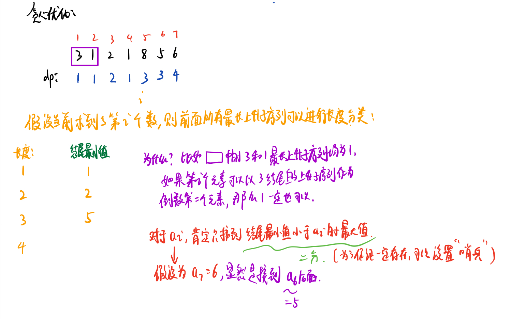
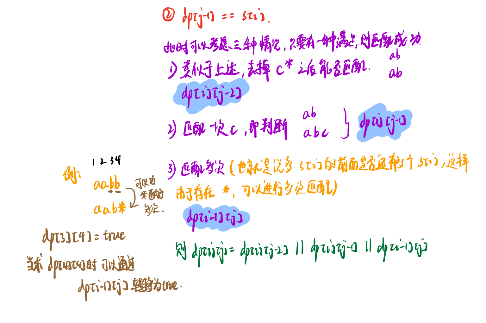
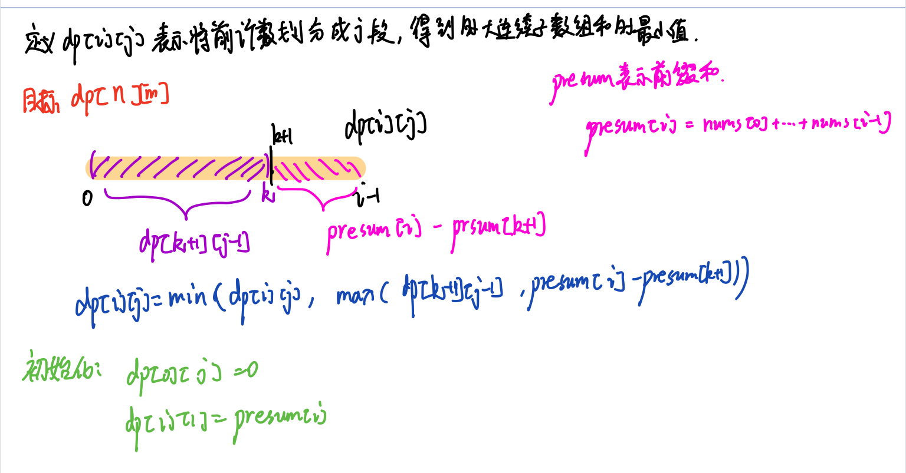
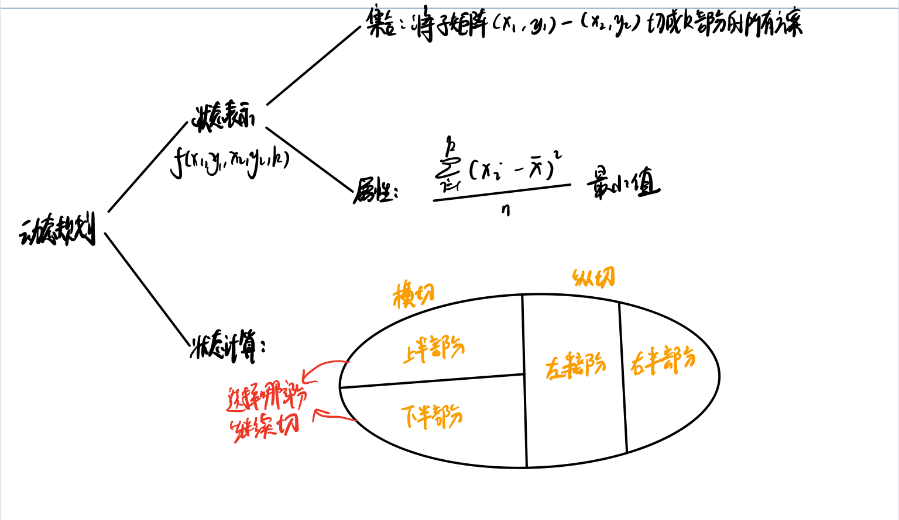
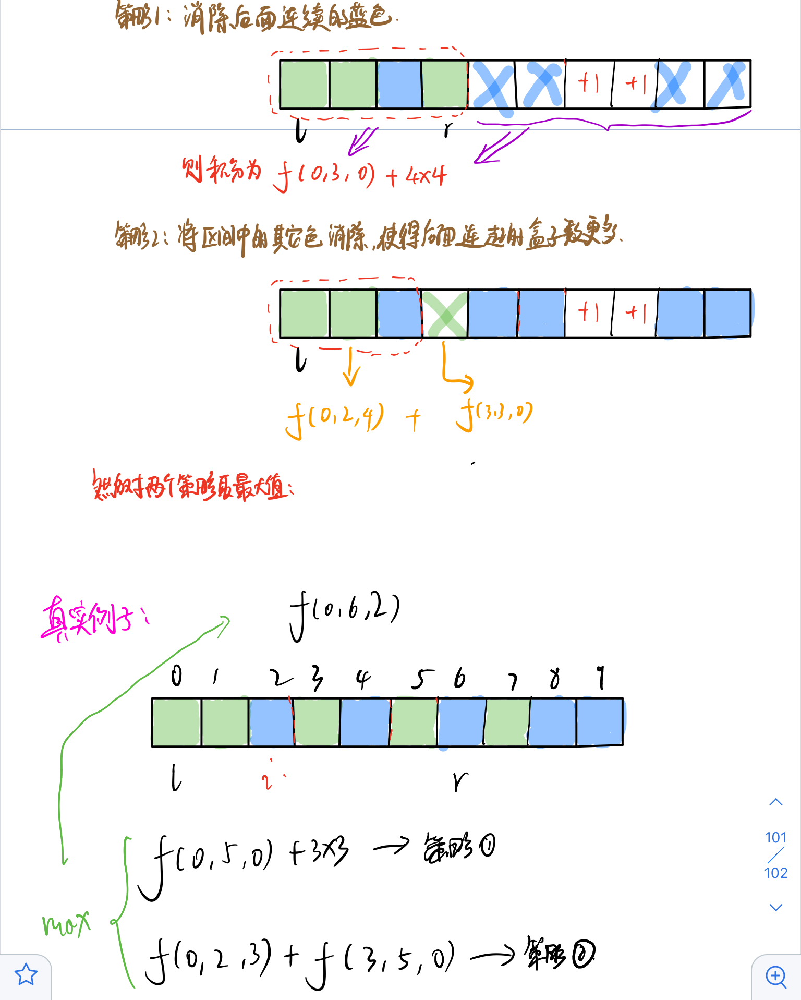
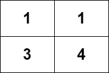

动态规划基础概念

`动态规划` ：有一说一，这个东西是真的难，不过我觉得通过 **思考+刷题** 是可以解决大部分的DP的。

> 刷题怎么刷呢？也是从简单=>中等=>困难吗？本人的路线是：先去找一个简单的动态规划类型题(比如去Leetcode刷)=>写完后查看与该题类似的题目 => 然后根据这道题的经验看能否应用到类似的DP问题中. 这样循序渐进的同时也让你掌握了一系列问题的解决套路。

> 动态规划是一种将**原始问题分解成多个规模较小的子问题，而各个子问题之间相互联系，最终由子问题的解合并成原始问题**解的算法

动态规划问题的一般形式就是来==求最值==，因此当遇到求最大值/最小值等问题时，可以考虑一手是不是要用动态规划，此时你就要考虑该题符不符合其==四要素==了，不符合的还是另想办法！

> 注：因为本人不像哪些大佬一样那么有天赋，学了比较久的DP，学习了不同的解题方法和风格，因此本文记录的解题方法和风格会有两大类：一种是从状态转移去分析，一种是从集合的角度去分析

#### **动态规划算法四要素**

判断能否进行动态规划的条件

- 最优子结构

  > 当一个问题的最优解必然包含其子问题的最优解时，称该问题具有最优子结构。

  > 子问题：对于一个问题而言，只有规模比该问题小、其他均与该问题一致的问题才可称为其子问题，同时，子问题不会对规模等大的问题造成影响[**无后效性**]

- 重叠子问题

  > 当求取子问题解的时候，往往会出现许多**重复计算**。而动态规划是先解决小的问题，当后面再次出现该子问题时，可以直接求解

- 状态与状态转移方程

  > 动态规划是一种**自底向上**解决问题的思想，“状态”就是子问题的解，”状态转移方程“就是子问题之间的递推关系[说白了就是递推公式]

- 边界条件

  > 边界条件就是程序的停止条件。

```
递归算法通常是自顶向下构造函数，而动态规划为自底向上构造程序结构的算法思想。简单来说，动态就是先解决小问题，然后大问题的解可以由小问题的解直接转换求得。
```

动态规划最难的部分就是写出`动态转移方程`，这里有几点需要关心：

1. 最小的子问题的情况是什么?
2. 一个问题有哪些状态？
3. 对于每个当前的状态，可以选择什么？
4. 如何通过dp数组来表示你的"状态和选择"


**常见问题类型**

- xxx的方式有几种/组合问题

- 最大/最小值等问题

  > 上面这两类问题难度一般较高，会仔细讲

- 明显递推方式的问题$,  f(x) 由 f(x-1)得来$

**常见优化**：

- 空间上原来二维数组采用滚动数组变为一维
- 原来的一维采用O(1)的变量代替


### **最大/最小值类型**

#### 例：打家劫舍

你是一个专业的小偷，计划偷窃沿街的房屋。每间房内都藏有一定的现金，影响你偷窃的唯一制约因素就是相邻的房屋装有相互连通的防盗系统，如果两间相邻的房屋在同一晚上被小偷闯入，系统会自动报警。
给定一个代表每个房屋存放金额的非负整数数组，计算你 不触动警报装置的情况下 ，一夜之内能够偷窃到的最高金额。

```
输入：[1,2,3,1]
输出：4
解释：偷窃 1 号房屋 (金额 = 1) ，然后偷窃 3 号房屋 (金额 = 3)。
     	偷窃到的最高金额 = 1 + 3 = 4 。
```

下面给了两种解题方案，体会一下状态转移的重要性。

```cpp
class Solution {
public:
    int rob(vector<int>& nums) {
        int n = nums.size();
        //dp[i][0]:上一个i-1没偷，当前偷之后的最多金额
        //dp[i][1]:上一个i-1没偷，当前也没偷的最多金额
        //dp[i][2]:上一个i-1偷了，当前不偷的最多金额
        vector<vector<int>> dp(n,vector<int> (3,0));
        dp[0][0] = nums[0];
        dp[0][1] = 0;
        dp[0][2] = 0;
        for(int i=1;i<n;i++){
            //上一个没偷：那么上一个状态只可能是dp[i-1][1]或者dp[i-1][2].同时当前偷了，需要加上当前金额，取两者最大值
            dp[i][0] = max(dp[i-1][1],dp[i-1][2]) + nums[i];
            //上一个没偷：那么上一个状态只可能是dp[i-1][1]或者dp[i-1][2]，当前也不偷，取上一个状态两者最大值
            dp[i][1] = max(dp[i-1][1],dp[i-1][2]);
            //上一个偷了，当前状态即为上一次偷之后的状态，上一次只有可能dp[i-1]0]偷了
            dp[i][2] = dp[i-1][0];
        }
        //返回3者可能最大值
        return max(max(dp[n-1][0],dp[n-1][1]),dp[n-1][2]);
    }
};
```

空间优化：

```cpp
//空间优化
class Solution {
public:
    int rob(vector<int>& nums) {
        int n = nums.size();
        //dp[0]:上一个没偷，当前偷之后的最多金额
        //dp[1]:上一个没偷，当前也没偷的最多金额
        //dp[2]:上一个偷了，当前不偷的最多金额
        vector<int> dp(3,0);
        dp[0] = nums[0];
        dp[1] = 0;
        dp[2] = 0;
        for(int i=1;i<n;i++){
            //暂存dp[2];
            int tdp2 = dp[2];
            //上一个偷了，当前状态即为上一次偷之后的状态，上一次只有可能dp[0]偷了
            dp[2] = dp[0];
            //上一个没偷：那么上一个状态只可能是dp[1]或者dp[2].同时当前偷了，需要加上当前金额，取两者最大值
            dp[0] = max(dp[1],tdp2) + nums[i];
            //上一个没偷：那么上一个状态只可能是dp[1]或者dp[2]，当前也不偷，取上一个状态两者最大值
            dp[1] = max(dp[1],tdp2);

        }
        //返回3者可能最大值
        return max(max(dp[0],dp[1]),dp[2]);
    }
};
```

不要急，我们再看一下另外一个代码，这个输入比较常见的动态规划的框架类型。

我们定义dp表的意义为dp[i]]表示对于`nums[0]~nums[i]的房屋所能偷的最大金额`，`那么对于第0~i的房屋所能偷的最大金额取决于0~i-1的房屋偷的金额(此时第i个屋子就不能偷了)和0~i-2的房屋的最大值+第i个房屋的金额这两者的较大值。`

```cpp
class Solution {
public:
    int rob(vector<int>& nums) {
        if (nums.empty()) {
            return 0;
        }
        int size = nums.size();
        //只有一间房则肯定偷
        if (size == 1) {
            return nums[0];
        }
        //创建dp表 dp[i]表示对于nums[0]~nums[i]的房屋所能偷的最大金额
        vector<int> dp = vector<int>(size, 0);
        //dp表的初始情况初始化
        dp[0] = nums[0];
        dp[1] = max(nums[0], nums[1]);
        for (int i = 2; i < size; i++) {
            dp[i] = max(dp[i - 2] + nums[i], dp[i - 1]);
        }
        return dp[size - 1];
    }
};
```

> 我们可以看出，dp表的定义方式不同，我们解题的框架就不太相同，但是总体思想都是通过先前状态来推导当前的最优状态。
>
> 其中，第二种方法为比较常见的dp表定义方式，第一种属于状态机模型的DP了

#### 例：打家劫舍II

你是一个专业的小偷，计划偷窃沿街的房屋，每间房内都藏有一定的现金。这个地方**所有的房屋都 围成一圈** ，这意味着**第一个房屋和最后一个房屋是紧挨着的**。同时，相邻的房屋装有相互连通的防盗系统，如果两间相邻的房屋在同一晚上被小偷闯入，系统会自动报警 。

给定一个代表每个房屋存放金额的非负整数数组，计算你 在不触动警报装置的情况下 ，今晚能够偷窃到的最高金额。

> 题目是对原本的升级版，其实就是将原本的数组修改为了循环数组，解决方案和之前一样，只是我们需要遍历两次。分别求`0~n-2范围内房屋的可以偷到金额最大值`和`0~n-1范围内房屋的可以偷到金额最大值`，两者取较大值即可.

```cpp
class Solution {
public:
    /*此部分将原本的dp表进行了压缩，因为dp[i]只和dp[i-1]和dp[i-2]有关*/
    int getmaxRobval(int start,int end,vector<int> & nums){
        int first = nums[start],second = max(nums[start],nums[start+1]);
        //不太理解的就把first看作dp[i-2],second看作dp[i-1]
        for(int i = start + 2;i <= end;i++){
            int temp = second;//暂存second,因为接下来要修改second
            second = max(nums[i]+first,second);
            first = temp;
        }
        return second;
    }
    
    int rob(vector<int>& nums) {
        int n = nums.size();
        if(n == 1)return nums[0];//如果只有一个房屋直接偷
        if(n == 2)return max(nums[0],nums[1]);//两个房屋偷贵的
        //因为首尾相连，因此需要两次判断，并取较大值。
        return max(getmaxRobval(0,n-2,nums),getmaxRobval(1,n-1,nums));
    }
};
```

#### 例：打家劫舍III

在上次打劫完一条街道之后和一圈房屋后，小偷又发现了一个新的可行窃的地区。这个地区只有一个入口，我们称之为“根”。 除了“根”之外，每栋房子有且只有一个“父“房子与之相连。一番侦察之后，聪明的小偷意识到“这个地方的所有房屋的排列类似于一棵二叉树”。 如果两个直接相连的房子在同一天晚上被打劫，房屋将自动报警。计算在不触动警报的情况下，小偷一晚能够盗取的最高金额。

```
输入: [3,2,3,null,3,null,1]

     3
    / \
   2   3
    \   \ 
     3   1

输出: 7 
解释: 小偷一晚能够盗取的最高金额 = 3 + 3 + 1 = 7.
```

刚看这道题还是比较懵的，但是后来想想就是跟前面的思想一样的，只是此时创建数组形式的dp表不太现实了，因此改为哈希表来作为dp表。

思考，对于结点x，以x为根的树能够被偷的最大金额有两种**状态**：`结点x被偷`和`结点x不被偷`。

对于**选择**，当`结点x被偷`时，那么两个子节点都不能被偷，当`结点x不被偷`时，两个子节点可以被偷，也可以不被偷，取两者较大的值。

**此时，一个思路就慢慢浮现...**

我们可以用 selectMap(x) 表示偷 x 节点的情况下，x 节点的子树上被偷的节点的最大权值和；noselectMap(x) 表示不选择 x 节点的情况下，x 节点的子树上被选择的节点的最大权值和；l 和 r 代表 x 的左右孩子。

- 当 x 被选中时，x 的左右孩子都不能被选中，故 x 被选中情况下子树上被选中点的最大权值和为 l 和 r 不被选中的最大权值和相加，即 $selectMap(x) = noselectMap(l)+noselectMap(r)$。
- 当 x 不被选中时，x 的左右孩子可以被选中，也可以不被选中。对于 x 的某个具体的孩子 x，它对 x 的贡献是 x 被选中和不被选中情况下权值和的较大值。故 $noselectMap(x)=max\{selectMap(l),noselectMap(l)\}+max\{selectMap(r),noselectMap(r)\}$

至此，我们可以用哈希表`map<Treenode *,int>`来存 selectMap和 noselectMap 的函数值，用深度优先搜索的办法后序遍历这棵二叉树，我们就可以得到每一个节点的 selectMap和 noselectMap。

```cpp
class Solution {
public:
    map<TreeNode *,int> selectMap;
    map<TreeNode *,int> noselectMap;
    void dfs(TreeNode *root){
        if(!root) return;
        dfs(root->left);
        dfs(root->right);
        selectMap.insert(make_pair(root,root->val+noselectMap[root->left]+noselectMap[root->right]));
        noselectMap.insert(make_pair(root,max(selectMap[root->left],noselectMap[root->left])+max(selectMap[root->right],noselectMap[root->right])));
        
    }
    int rob(TreeNode* root){
        dfs(root);
        return max(selectMap[root],noselectMap[root]);
    }
};
```


> 问？能否将打家劫舍抽离出一个模型呢？


#### 例：删除并获得点数

给你一个整数数组`nums`，你可以对它进行一些操作。每次操作中，选择任意一个 nums[i] ，删除它并获得 nums[i] 的点数。之后，你必须删除 所有 等于 nums[i] - 1 和 nums[i] + 1 的元素。

开始你拥有 0 个点数。返回你能通过这些操作获得的最大点数。

```
输入：nums = [2,2,3,3,3,4]
输出：9
```

通过理解题目后，我们发现 不如我们挑选了值为 k 的元素，那么 k-1 和 k-2 的元素我就不能挑选了（也就是 相邻大小的值的元素 不能被选择）如果你做过`打家劫舍`那么你会突然意识到，这不就类似打家劫舍问题，偷其中一家，则相邻的就不能偷了。两者的原理是一样的，只不过 打家劫舍 问题是选择索引下标 （即，限制的是下标），而此题限制的是 值。下标是唯一的，但是值可能有很多重复的，因此，我们在进行选择前需要提前统计 值大小为 k 的元素的和 sum 是多少，并进行记录，我们可以用一个数组来进行存储，sums[k] = x 表示 `值大小为 k 的元素的和是 x`，之后我们就可以采用与打家劫舍相似的方法来处理 sums 数组。

```cpp
class Solution {
public:

    int rob(vector<int> &sums){
        int n = sums.size();
        if(n == 1) return sums[0];
        int first = sums[0],second = max(sums[0],sums[1]);
        for(int i = 2;i < n;i += 1){
            int tmp = second;
            second = max(first + sums[i],second);
            first = tmp;
        }
        return max(first,second);
    }
    int deleteAndEarn(vector<int>& nums) {
        int n = nums.size();
        vector<int> sums(10000+5,0);
        for(int i = 0;i < n;i++){
            sums[nums[i]] += nums[i];
        }
        return rob(sums);
    }
};
```

> 由此，我们可以看出，有些问题其实本质是相似的，只是需要再解决问题的时候进行一些逻辑转换，而这，也是比较难的，非常考验解题者的逻辑能力。


#### 例：股票买卖

给定一个数组 prices ，它的第 i 个元素 prices[i] 表示一支给定股票第 i 天的价格。

你只能选择 某一天 买入这只股票，并选择在 未来的某一个不同的日子 卖出该股票。设计一个算法来计算你所能获取的最大利润。

返回你可以从这笔交易中获取的最大利润。如果你不能获取任何利润，返回 0 。

```
输入：[7,1,5,3,6,4]
输出：5
```

我们还是看看**选择**先，对于每一天，可以选择买入、卖出、不买不卖三种选择。但是呢，题目具有一些限制条件，即**只能买卖一次股票**。

接下来就是定义dp表含义，我们定义`dp[i][0]`为在**第i天手上没有股票时的收益**，`dp[i][1]`为在**第i天手上持有股票时的收益**。考虑一下它可以由哪些状态转移过来呢？

显然`dp[i][0]`可以由**前一天没有股票今天也不买**和**前一天手持股票今天卖出**两种方式转移而来，即$dp[i][0] = max(dp[i-1][0],dp[i-1][1]+prices[i])$

对于`dp[i][1]`可以由前一天持有股票今天不卖和前一天没有股票今天买入两种方式转移，即$dp[i][1] = max(dp[i-1][1],-prices[i])$，这里为什么不是`dp[i-1][0]-prices[i]`而是`-prices[i]`呢？因为有一个限制条件：**只能买卖一次股票**。因此买股票时不能从前一天没有股票的状态转移而来，因为可能很早以前已经买过并卖出了。

```python
class Solution:
    def maxProfit(self, prices: List[int]) -> int:
        n = len(prices)
        if n == 0: return 0
        #dp[i][0]：至第i天，手里没有股票时的收益
        #dp[i][1]：至第i天，手里有股票时的收益
        dp = [[0 for i in range(2)] for j in range(n)]
        dp[0][0],dp[0][1] = 0,-prices[0]
        for i in range(1,n):
            dp[i][0] = max(dp[i-1][0],dp[i-1][1] + prices[i])
            dp[i][1] = max(dp[i-1][1],-prices[i])
        return dp[n-1][0]
```

这里贴一个python版的代码，希望大家能够在刷题的时候能多掌握几种语言，因为每种语言都有各自的优势，有的语言可以借助本身提供的数据结构来进行求解，会很方便。这里推荐python+Cpp两种方式刷题，当然java也是不错的选择。

#### 例：股票买卖II

给定一个数组 prices ，其中 prices[i] 是一支给定股票第 i 天的价格。

计算你所能获取的最大利润。你可以尽可能地完成更多的交易（多次买卖一支股票）。

> 注意：你不能同时参与多笔交易（你必须在再次购买前出售掉之前的股票）。

```
输入: prices = [7,1,5,3,6,4]
输出: 7
```

此题相较于上一题多了一个条件就是可以多次买卖股票，不过基本思想还是一样，我们还是按照上题创建dp表，只是在动态转移方程处需要进行修改。原本只能买卖一次，因此$dp[i][1] = max(dp[i-1][1],-prices[i])$，而此时可以多次买卖，因此可以由上一个没有股票时的状态转移而来，因此此时$dp[i][1] = max(dp[i-1][1],dp[i-1][0]-prices[i])$

```cpp
class Solution {
public:
    int maxProfit(vector<int>& prices) {
        int n = prices.size();
        /*
        dp[i][0]:到第i天手上没有股票时所获得最大利润
        dp[i][1]:到第i天手上有股票时所获得最大利润
        */
        vector<vector<int>> dp(n,vector<int> (2,0));
        dp[0][0] = 0;
        dp[0][1] = -prices[0];
        for(int i = 1;i < n;i++){
            dp[i][0] = max(dp[i-1][0],dp[i-1][1] + prices[i]);
            dp[i][1] = max(dp[i-1][1],dp[i-1][0] - prices[i]);
        }
        return dp[n-1][0];
    }
};
```

> 可以看到，其实大体思路是不变的，改变的只是题目的限制条件


#### 例：股票买卖III

给定一个数组，它的第 i 个元素是一支给定的股票在第 i 天的价格。

设计一个算法来计算你所能获取的最大利润。你最多可以完成 两笔 交易。

> 注意：你不能同时参与多笔交易（你必须在再次购买前出售掉之前的股票）。

```
输入：prices = [3,3,5,0,0,3,1,4]
输出：6
```

此题在上一题的基础上更新了限制条件，就是最多只能买卖两次股票。我们还是先考虑**选择**和**状态**，选择还是哪几个选择`保留、卖出、买入`，而状态变了，对于第i天，有5种状态：`一张没买、买了一张、卖了一张此时什么没有股票、买了第二张、卖了第二张股票`，我们还根据前面的两题的想法写出状态转移方程。但是我们要注意，`一张没买`的状态只能从`前一天一张没买的状态`进行转移。因此其值一直为0，我们可以将其省略，对于剩余4种状态，我们分别定义dp表将其对应。

-  dp`[i][0]`:在第i天时，手上持有一张股票时的最大利益
-  dp`[i][1]`:在第i天时，手上没有股票，并已经卖出了一次时的最大利益
-  dp`[i][2]`:在第i天时，手上持有第二次买入的股票时的最大利益
-  dp`[i][3]`:在第i天时，手上没有股票，已经完成两次卖出时的最大利益

则可以分别写出动态转移方程：

$dp[i][0] = max(dp[i-1][0],0 - prices[i])，此处的0 就是前一天一张没买的状态$

$dp[i][1] = max(dp[i-1][1],dp[i-1][0] + prices[i])$

$dp[i][2] = max(dp[i-1][2],dp[i-1][1] - prices[i])$

$dp[i][3] = max(dp[i-1][3],dp[i-1][2] + prices[i])$

最后的结果肯定就是最后一天两张都卖出的状态，即`dp[n-1][3]`

> 当然，因为第i天的状态只和第i-1天有关，因此可以进行状态压缩，减少空间复杂度如:  
>
> ```cpp
> buy1 = max(buy1,-prices[i]);
> sell1 = max(sell1,buy1+prices[i]);
> buy2 = max(buy2,sell1-prices[i]);
> sell2 = max(sell2,buy2+prices[i]);
> ```

```python
class Solution:
    def maxProfit(self, prices: List[int]) -> int:
        n = len(prices)
        dp = [ [0 for i in range(4)] for j in range(n) ]
        '''
        dp[i][0]:在第i天时，手上持有一张股票时的最大利益
        dp[i][1]:在第i天时，手上没有股票，并已经卖出了一次时的最大利益
        dp[i][2]:在第i天时，手上持有第二次买入的股票时的最大利益
        dp[i][3]:在第i天时，手上没有股票，已经完成两次卖出时的最大利益
        '''
        dp[0][0],dp[0][1],dp[0][2],dp[0][3] = -prices[0],0,-prices[0],0
        for i in range(1,n):
            dp[i][0] = max(dp[i-1][0],0 - prices[i])
            dp[i][1] = max(dp[i-1][1],dp[i-1][0] + prices[i])
            dp[i][2] = max(dp[i-1][2],dp[i-1][1] - prices[i])
            dp[i][3] = max(dp[i-1][3],dp[i-1][2] + prices[i])
        return dp[n-1][3]
```

> 记录一下：当我做到这里时，我发现好像如果能够用动态规划首先要了解清除状态和选择，因为这是你构建状态转移方程的源泉之一。

#### 例：股票买卖IV

给定一个整数数组 prices ，它的第 i 个元素 prices[i] 是一支给定的股票在第 i 天的价格。

设计一个算法来计算你所能获取的最大利润。你最多可以完成 k 笔交易。

```
输入：k = 2, prices = [3,2,6,5,0,3]
输出：7
```

题目又得到了升级...，此时由原来的2次变为了k次，此时，如果你是一路认真做过来的，那么你应该会想到不就是把k=2的情况转换为一个k遍历，原理还是一样的。确实，原理还是一样的，只不过有许多细节需要注意。不管什么时候，你都要清除你的dp表的含义是什么？你的动态转移方程应该怎么来求。好的，我们来看一下。

我们定义`buys[i][j]表示第i天已经买卖了j次股票并且当前有股票时的最大收益`，定义`sells[i][j]:表示第i天已经买卖了j次股票并且当前没有股票时的最大收益`。当然你也可以定义成`dp[2][i][j]将buys和sells合并`，这里是为了方便讲解分开定义。

那么我们根据前几道股票买卖问题可以比较容易的推导出状态转移方程：

$sells[i][j] = max(sells[i-1][j],buys[i-1][j-1] + prices[i])$，$buys[i][j] = max(buys[i-1][j],sells[i-1][j] - prices[i])$

这里有个小细节需要注意`sells[i][j]是由buys[i-1][j-1] + prices[i]转移而来而不是buys[i-1][j]`，因为`buys[i-1][j-1]`表示前一天(i-1)交易了 j-1 次并且当前还有股票，将其在第 i 天交易，就得到了`sells[i][j]`，表示在第 i 天交易了 j 次并且没有股票。

另外，还有一些**注意事项**：

- 就是我们在第0天的时候，只有可能 也 最多可能交易0次，因此$sells[0][k]和buys[0][k],k\in[1,n)$都应该是一个无效的值，因此我们将其设置为一个极小值(因为我们是求极大值，因此其不会对结果造成影响)。
- 因为`sells`的转移方程为：$sells[i][j] = max(sells[i-1][j],buys[i-1][j-1] + prices[i])$，状态转移涉及到`buys[i-1][j-1]`，因此j肯定不可能从0开始遍历，**会造成数组访问越界**。但是我们又需要它！因此在每一天的开始时，我们需要对`buys[i][0]`初始化（`buys[0][0]`在最开始初始化了)
- 最后我们返回的是`sells[n-1][i]中的最大值`。

```cpp
class Solution:
    def maxProfit(self, k: int, prices: List[int]) -> int:
        if not prices: return 0
        n = len(prices)
        '''
        buys[i][j]:表示第i天已经买卖了j次股票并且当前有股票时的最大收益
        sells[i][j]:表示第i天已经买卖了j次股票并且当前没有股票时的最大收益
        '''
        buys = [[ 0 for i in range(k+1)] for j in range(n)]
        sells = [[0 for i in range(k+1)] for j in range(n)]
        buys[0][0] = -prices[0] #第0天买卖了0次并且当前有股票时受益为-prices[0]
        sells[0][0] = 0         #第0天买卖了0次并且当前没有股票时受益为0
        #第0天不可能交易任何股票，因此buys[0][i] (0,k] 都设置为一个无穷小数表示无效
        for i in range(1,k+1):
            buys[0][i] = sells[0][i] = float("-inf")
        for i in range(1,n): # 1 ~ n-1
            #因为sells[i][j]的动态转移需要用到buys[i-1][j-1]，而j是从1~k，需要对buys[i][0]进行计算
            buys[i][0] = max(buys[i-1][0],sells[i-1][0]-prices[i])
            for j in range(1,k+1): # 1 ~ k
                sells[i][j] = max(sells[i-1][j],buys[i-1][j-1] + prices[i])
                buys[i][j] = max(buys[i-1][j],sells[i-1][j] - prices[i])
        #print(sells[n-1])
        return max(sells[n-1])
```

这些基本上就是股票问题基本的解决方法了，有的时候题目还有添加什么`交易手续费`等等额外条件，其实就是对`动态转移方程`进行一些条件限制和修改而已。同时，对于`股票买卖IV`，还有一种`基于Wqs二分`的方法：https://leetcode-cn.com/problems/best-time-to-buy-and-sell-stock-iv/solution/yi-chong-ji-yu-wqs-er-fen-de-you-xiu-zuo-x36r/

> 能否将股票买卖抽离为一个模型呢？


#### 例：最大连续子数组的和

给定一个整数数组 `nums` ，找到一个具有最大和的连续子数组（子数组最少包含一个元素），返回其最大和。

```
输入：nums = [-2,1,-3,4,-1,2,1,-5,4]
输出：6
```

由题可知，所求的是连续子数组且其和最大。经过之前的训练，我们可以定义`dp[i]表示以nums[i]结尾的子数组所具有的最大和`。

> 有时候你可能不能一下想出比较好的dp定义方式，这个时候就要尝试定义，切记不要害怕去尝试！

我们为什么会想到这样的dp表定义方式呢？我们首先看题目：要求的是连续子数组。同时呢，又要求是最大和，便想到选择是：`对于一个nums[i]，加入或者不加入目前的最大连续子数组`，同时`又要维护连续的要求`，那么其只能选择`加入以nums[i-1]结尾的子数组的后面`或者`重新另起一个子数组`。这样不就可以想到定义`dp[i]表示以nums[i]结尾的子数组所具有的最大和`

那么状态转移方程也就出来了：$dp[i] = max(dp[i-1]+nums[i],nums[i])$

即，要么选择将nums[i]加入以nums[i-1]结尾的子数组后，要么就是将nums[i]作为一个新的子数组

```python
#python 3
class Solution:
    def maxSubArray(self, nums: List[int]) -> int:
        n = len(nums)
        dp = [0 for i in range(n)]
        dp[0] = nums[0]
        for i in range(1,n):
            dp[i] = max(dp[i-1]+nums[i],nums[i])
        return max(dp)
```


#### 例：乘积最大子数组

给你一个整数数组 `nums` ，请你找出数组中乘积最大的连续子数组（该子数组中至少包含一个数字），并返回该子数组所对应的乘积。

```
输入: [2,3,-2,4]
输出: 6
```

这题乍一看！好像跟上一道`最大连续子数组的和`，然后直接`定义dp[i]表示以nums[i]结尾的子数组所具有的最大乘积`并且一波操作写出状态转移方程$dp[i] = max(dp[i-1]*nums[i],nums[i])$，然后就提示**失败**，哈哈哈哈哈哈~

我们看一下为什么！如果经验老道的童鞋可能一眼就会看出 乘积 问题涉及的负数问题，即 负负得正 这一个坑。举个例子：

假设`nums = [3,-2,2,3,-2]`，显然最大连续子数组乘积是所有元素相乘为 72，但是按照我们上面定义的dp及状态转移方程，我们推导一下：`dp = [3,-2,2,6,-2]`，最后返回的是 6。为什么会这样呢？是因为`当前位置的最优解未必是由前一个位置的最优解转移得到的`。因为对于最后一个-2来说，它的最优子问题的解不是 6，而是 3 * -2 * 2 * 3 = -36，这是因为它本身是个负数，因此**期望有一个最小的数**和它相乘成为一个比较大的正数。===>因此我们在状态转移的时候就要考虑 符号的问题了 我们不仅需要知道`以nums[i]结尾的子数组所具有的最大乘积`还需要知道`以nums[i]结尾的子数组所具有的最小乘积`来进行状态转移。

考虑当前位置如果是**一个负数**的话，那么我们希望以它前一个位置结尾的某个段的积也是个负数，这样就可以负负得正，并且我们希望这个积**尽可能负得更多**，即尽可能小。如果当前位置是**一个正数**的话，我们更希望以它前一个位置结尾的某个段的积也是个正数，并且希望它**尽可能地大**。于是我们定义`dpMax[i]：以nums[i]结尾的子数组所具有的最大乘积`和`dpMin[i]：以nums[i]结尾的子数组所具有的最小乘积`

则状态转移方程：

$dpMax[i] = max(dpMax[i-1]*nums[i],dpMin[i-1]*nums[i],nums[i]);$

$dpMin[i] = min(dpMax[i-1]*nums[i],dpMin[i-1]*nums[i],nums[i]);$

最后返回的结果是`dpMax中的最大值`

```cpp
class Solution {
public:
    int maxProduct(vector<int>& nums) {
        int n = nums.size();
        vector<int> dpMax(n,0),dpMin(n,0);
        dpMax[0] = dpMin[0] = nums[0];
        for(int i = 1;i < n;i++){
            dpMax[i] = max(max(dpMax[i-1]*nums[i],dpMin[i-1]*nums[i]),nums[i]);
            dpMin[i] = min(min(dpMax[i-1]*nums[i],dpMin[i-1]*nums[i]),nums[i]);
        }
        return *max_element(dpMax.begin(), dpMax.end());
    }
};
```


### **xxx的方式有几种**/组合问题

> 这类问题也比较多，一般属于简单和中等难度题目。

#### 例： 不同路径 

> 题目来源：Leetcode 63

一个机器人位于一个 m x n 网格的左上角 （起始点在下图中标记为 “Start” ）。

机器人每次只能向下或者向右移动一步。机器人试图达到网格的右下角（在下图中标记为 “Finish” ）。

问总共有多少条不同的路径？

```
输入：m = 3, n = 7
输出：28
```

题目知道，我们在每个点的**选择**可以有“向下”或者"向右"。对于此题来说，**状态**就是从左上角至`[i][j]`点有多少。因此，对于当前的状态，可以由其左边的和上边的点状态转移过来。我们定义`dp[i][j]`的意义为：从左上角`[0][0]`至`[i][j]`有多少种路径，那么我们可以很容易推出递推公式：
$$
dp[i][j] =
\begin{cases} 
1,  & \text{if } i==0 \text{||}j == 0 \\
dp[i-1][j]+dp[i][j-1, & \text{if }  i \geq 1 \text{&&} j\geq1
\end{cases}
$$

```cpp
class Solution {
public:
    int uniquePaths(int m,int n)
    {
        vector<vector<int>> res(m);
        for (int i = 0; i < m; i++){
            res[i].resize(n);
        }
        //初始化
        res[0][0] = 1;
        for (int i = 1; i < n; i++){
            res[0][i] = 1;
        }
        for (int i = 1; i < m; i++){
            res[i][0] = 1;
        }
        //根据状态转移方程更新dp表
        for (int row = 1; row < m; row++){
            for (int col = 1; col < n; col++){
                res[row][col] = res[row-1][col] + res[row][col-1];
            }
        }
        return res[m-1][n-1];
    }
};
```


#### 例： 不同路径 II

> 题目来源：Leetcode 63

一个机器人位于一个 m x n 网格的左上角 （起始点在下图中标记为“Start” ）。

机器人每次只能向下或者向右移动一步。机器人试图达到网格的右下角（在下图中标记为“Finish”）。

现在考虑网格中有障碍物。那么从左上角到右下角将会有多少条不同的路径？

网格中的障碍物和空位置分别用 `1` 和 `0` 来表示。

```
输入：obstacleGrid = [[0,0,0],[0,1,0],[0,0,0]]
输出：2
```

此题在上一题只是加上了一些限制条件，有的地方加上了石块不能经过，那么我们就按照题目要求意思，如果obstacleGrid`[i][j]`  == 1，那么到达该点的路径有0条。其余考虑点还是和上题一样。

```cpp
class Solution {
public:
    int uniquePathsWithObstacles(vector<vector<int>>& obstacleGrid) {
        int m = obstacleGrid.size();
        int n = obstacleGrid[0].size();
        vector<vector<int>> dp(m,vector<int> (n,0));
        for(int i = 0;i < m;i++){
            if(obstacleGrid[i][0] == 1)
                break;
            dp[i][0] = 1;
        }
        for(int i = 0;i < n;i++){
            if(obstacleGrid[0][i] == 1)
                break;
            dp[0][i] = 1;
        }
        for(int i = 1;i < m;i++){
            for(int j = 1;j < n;j++){
                if(obstacleGrid[i][j] == 1) continue;
                dp[i][j] = dp[i-1][j] + dp[i][j-1];
            }
        }
        return dp[m-1][n-1];
    }
};
```


### **通过公式递推求解的问题**

这类问题比较极端，要么很明显要么就需要深层的递推。通常递归就可以解决，但是递归会消耗大量的栈空间。通过动态规划方法解决也是不错的方法。

比如常见的斐波那契数列等等，这类问题比较简单，就不细讲了。举个简单的例子应付一下哈哈哈哈

#### 获取生成数组中的最大值

> 题目来源：Leetcode 1646. 

给你一个整数 n 。按下述规则生成一个长度为 n + 1 的数组 nums ：

- nums[0] = 0
- nums[1] = 1
- 当$ 2 <= 2 * i <= n $时，$nums[2 * i] = nums[i]$
- 当 $2 <= 2 * i + 1 <= n $时，$nums[2 * i + 1] = nums[i] + nums[i + 1]$

要求：返回生成数组 nums 中的 **最大** 值。

```cpp
class Solution {
public:
    int getMaximumGenerated(int n) {
        vector<int> nums(n+1);
        if(n == 0) return 0;
        if(n == 1) return 1;
        int ans = 1;
        nums[0] = 0;
        nums[1] = 1;
        for(int i = 1;i <= n / 2;i++){
            //根据题目给的递推关系进行递推。
            nums[i*2] = nums[i];
            if(i * 2 + 1<= n){
                nums[i*2 + 1] = nums[i] + nums[i+1];
                ans = max(ans,max(nums[i*2],nums[i*2+1]));
            }else{
                ans = max(ans,nums[i*2]);
            }
        }
        return ans;
    }
};
```


#### 不同的二叉搜索树

给你一个整数 `n` ，求恰由 `n` 个节点组成且节点值从 `1` 到 `n` 互不相同的 **二叉搜索树** 有多少种？返回满足题意的二叉搜索树的种数。


```
输入：n = 3
输出：5
```


```java
class Solution {
    public int numTrees(int n) {
        int [] dp = new int[n+1];
        dp[0] = 1;
        dp[1] = 1;
        for (int j = 2;j <= n;j++){
            for (int i = 1;i <= j;i++){
                dp[j] += dp[i-1] * dp[j-i];
            }
        }
        return dp[n];
    }
}
```


### 背包问题

许多动态规划问题其实都是背包问题的模型。

#### 01背包

有 N 件物品和一个容量是 V 的背包。每件物品只能使用一次。

第 ii 件物品的体积是 $v_i$，价值是 $w_i$。

求解将哪些物品装入背包，可使这些物品的总体积不超过背包容量，且总价值最大。
输出最大价值。

**输入格式**

第一行两个整数，N，V，用空格隔开，分别表示物品数量和背包容积。

接下来有 N 行，每行两个整数 $v_i,w_i$，用空格隔开，分别表示第 i 件物品的体积和价值。

**输出格式**

输出一个整数，表示最大价值。


```java
public static void main(String[] args) throws IOException {
    InputStreamReader in = new InputStreamReader(System.in);
    BufferedReader bf = new BufferedReader(in);
    String [] ins = bf.readLine().split(" ");
    int N = Integer.parseInt(ins[0]);
    int V = Integer.parseInt(ins[1]);
    int [] v = new int[N];
    int [] w = new int[N];
    for (int i = 0;i < N;i++){
        ins = bf.readLine().split(" ");
        v[i] = Integer.parseInt(ins[0]);
        w[i] = Integer.parseInt(ins[1]);
    }
    int [][] dp = new int[N+1][V+1];
    for (int i = 1;i <= N;i++){
        for (int j = 0;j <= V;j++){
            dp[i][j] = dp[i-1][j];
            if (j-v[i-1] >= 0){
                dp[i][j] = Math.max(dp[i][j],dp[i-1][j-v[i-1]] + w[i-1]);
            }
        }
    }
    System.out.println(dp[N][V]);
}
```

空间压缩优化：

```java
    public static void main(String[] args) throws IOException {
        InputStreamReader in = new InputStreamReader(System.in);
        BufferedReader bf = new BufferedReader(in);
        String [] ins = bf.readLine().split(" ");
        int N = Integer.parseInt(ins[0]);
        int V = Integer.parseInt(ins[1]);
        int [] v = new int[N];
        int [] w = new int[N];
        for (int i = 0;i < N;i++){
            ins = bf.readLine().split(" ");
            v[i] = Integer.parseInt(ins[0]);
            w[i] = Integer.parseInt(ins[1]);
        }
        int [] dp = new int[V+1];
        for (int i = 1;i <= N;i++){
            for (int j = V;j >= 0;j--){
                // 因为第i行只用到了第i-1行，因此可以进行空间压缩，注意：j层循环可能要从大到小
                if (j-v[i-1] >= 0){
                    dp[j] = Math.max(dp[j],dp[j-v[i-1]] + w[i-1]);
                }
            }
        }
        System.out.println(dp[V]);
    }
```


#### 完全背包

有 N 种物品和一个容量是 V 的背包，每种物品都有无限件可用。

第 i 种物品的体积是 $v_i$，价值是 $w_i$。

求解将哪些物品装入背包，可使这些物品的总体积不超过背包容量，且总价值最大。
输出最大价值。

**输入格式**

第一行两个整数，N，V，用空格隔开，分别表示物品种数和背包容积。

接下来有 N 行，每行两个整数 $v_i,w_i$，用空格隔开，分别表示第 i 种物品的体积和价值。

**输出格式**

输出一个整数，表示最大价值。


```java
import java.io.*;
import java.util.*;

public class Main {

    public static void main(String[] args) throws IOException {
        InputStreamReader in = new InputStreamReader(System.in);
        BufferedReader bf = new BufferedReader(in);
        String [] ins = bf.readLine().split(" ");
        int N = Integer.parseInt(ins[0]);
        int V = Integer.parseInt(ins[1]);
        int [] v = new int[N];
        int [] w = new int[N];
        for (int i = 0;i < N;i++){
            ins = bf.readLine().split(" ");
            v[i] = Integer.parseInt(ins[0]);
            w[i] = Integer.parseInt(ins[1]);
        }
        int [][] dp = new int[N+1][V+1];
        for (int i = 1;i <= N;i++){
            for (int j = 0;j <= V;j++){
                for (int k = 0; k * v[i-1] <= j;k++){
                    dp[i][j] = Math.max(dp[i][j],dp[i-1][j-k*v[i-1]] + k * w[i-1]);
                }
            }
        }
        System.out.println(dp[N][V]);
    }
}
```


优化后：

```java
import java.io.*;
import java.util.*;

public class Main {

    public static void main(String[] args) throws IOException {
        InputStreamReader in = new InputStreamReader(System.in);
        BufferedReader bf = new BufferedReader(in);
        String [] ins = bf.readLine().split(" ");
        int N = Integer.parseInt(ins[0]);
        int V = Integer.parseInt(ins[1]);
        int [] v = new int[N];
        int [] w = new int[N];
        for (int i = 0;i < N;i++){
            ins = bf.readLine().split(" ");
            v[i] = Integer.parseInt(ins[0]);
            w[i] = Integer.parseInt(ins[1]);
        }
        int [][] dp = new int[N+1][V+1];
        for (int i = 1;i <= N;i++){
            for (int j = 0;j <= V;j++){
                dp[i][j] = dp[i-1][j];
                if (j - v[i-1] >= 0)
                    dp[i][j] = Math.max(dp[i][j],dp[i][j-v[i-1]] + w[i-1]);
            }
        }
        System.out.println(dp[N][V]);
    }
}
```

空间压缩后：

```java
import java.io.*;
import java.util.*;

public class Main {

    public static void main(String[] args) throws IOException {
        InputStreamReader in = new InputStreamReader(System.in);
        BufferedReader bf = new BufferedReader(in);
        String [] ins = bf.readLine().split(" ");
        int N = Integer.parseInt(ins[0]);
        int V = Integer.parseInt(ins[1]);
        int [] v = new int[N];
        int [] w = new int[N];
        for (int i = 0;i < N;i++){
            ins = bf.readLine().split(" ");
            v[i] = Integer.parseInt(ins[0]);
            w[i] = Integer.parseInt(ins[1]);
        }
        int [] dp = new int[V+1];
        for (int i = 1;i <= N;i++){
            for (int j = 0;j <= V;j++){
                if (j - v[i-1] >= 0)
                    dp[j] = Math.max(dp[j],dp[j-v[i-1]] + w[i-1]);
            }
        }
        System.out.println(dp[V]);
    }
}
```


#### 多重背包

有 N 种物品和一个容量是 V 的背包。

第 i 种物品最多有 $s_i$ 件，每件体积是 $v_i$，价值是 $w_i$。

求解将哪些物品装入背包，可使物品体积总和不超过背包容量，且价值总和最大。
输出最大价值。

**输入格式**

第一行两个整数，N，V，用空格隔开，分别表示物品种数和背包容积。

接下来有 N 行，每行三个整数 $v_i,w_i,s_i$，用空格隔开，分别表示第 i 种物品的体积、价值和数量。

**输出格式**

输出一个整数，表示最大价值。


朴素版：没有进行空间压缩和二进制优化等

```java

```


二进制优化版本：

```java
import java.io.*;
import java.util.*;

public class Main {

    public static void main(String[] args) throws IOException {
        InputStreamReader in = new InputStreamReader(System.in);
        BufferedReader bf = new BufferedReader(in);
        String [] ins = bf.readLine().split(" ");
        int N = Integer.parseInt(ins[0]);
        int V = Integer.parseInt(ins[1]);
        List<Integer> v = new ArrayList<>();
        List<Integer> w = new ArrayList<>();
        for (int i = 0;i < N;i++) {
            ins = bf.readLine().split(" ");
            int vt = Integer.parseInt(ins[0]);
            int wt = Integer.parseInt(ins[1]);
            int st = Integer.parseInt(ins[2]);
            int k = 1;
            while (k < st) {
                v.add(k * vt);
                w.add(k * wt);
                st -= k;
                k *= 2;
            }
            if (st > 0) {
                v.add(st * vt);
                w.add(st * wt);
            }
        }
        int n = v.size();
        int [] dp = new int[V+1];
        for (int i = 1;i <= n;i++){
            for (int j = V;j >= 0;j--){
                if (j - v.get(i-1) >= 0)
                    dp[j] = Math.max(dp[j],dp[j-v.get(i-1)] + w.get(i-1));
            }
        }
        System.out.println(dp[V]);
    }
}
```


更详细的解释：

题目回顾：一共 n 类物品，背包的容量是 m，每类物品的体积为v, 价值为w，个数为s

我们先来回顾一下传统的dp方程：

```java
dp[i][j] 表示将前 i 种物品放入容量为 j 的背包中所得到的最大价值
dp[i][j] = max(不放入物品 i，放入1个物品 i，放入2个物品 i, ... , 放入k个物品 i)
这里 k 要满足：k <= s, j - k*v >= 0

不放物品  i = dp[i-1][j]
放k个物品 i = dp[i-1][j - k*v] + k*w

dp[i][j] = max(dp[i-1][j], dp[i-1][j-v] + w, dp[i-1][j-2*v] + 2*w,..., dp[i-1][j-k*v] + k*w)
```


实际上我们并不需要二维的dp数组，适当的调整循环条件，我们可以重复利用dp数组来保存上一轮的信息

我们令 dp[j] 表示容量为j的情况下，获得的最大价值
那么，针对每一类物品 i ，我们都更新一下 dp[m] --> dp[0] 的值，最后 dp[m] 就是一个全局最优值

```java
dp[m] = max(dp[m], dp[m-v] + w, dp[m-2*v] + 2*w, dp[m-3*v] + 3*w, ...)

接下来，我们把 dp[0] --> dp[m] 写成下面这种形式
dp[0], dp[v],   dp[2*v],   dp[3*v],   ... , dp[k*v]
dp[1], dp[v+1], dp[2*v+1], dp[3*v+1], ... , dp[k*v+1]
dp[2], dp[v+2], dp[2*v+2], dp[3*v+2], ... , dp[k*v+2]
...
dp[j], dp[v+j], dp[2*v+j], dp[3*v+j], ... , dp[k*v+j]
    
显而易见，m 一定等于 k*v + j，其中  0 <= j < v
所以，我们可以把 dp 数组分成 j 个类，每一类中的值，都是在同类之间转换得到的
也就是说，dp[k*v+j] 只依赖于 { dp[j], dp[v+j], dp[2*v+j], dp[3*v+j], ... , dp[k*v+j] }

因为我们需要的是{ dp[j], dp[v+j], dp[2*v+j], dp[3*v+j], ... , dp[k*v+j] } 中的最大值，
可以通过维护一个单调队列来得到结果。这样的话，问题就变成了 j 个单调队列的问题
所以，我们可以得到
dp[j]    =     dp[j]
dp[j+v]  = max(dp[j] +  w,  dp[j+v])
dp[j+2v] = max(dp[j] + 2w,  dp[j+v] +  w, dp[j+2v])
dp[j+3v] = max(dp[j] + 3w,  dp[j+v] + 2w, dp[j+2v] + w, dp[j+3v])
...
但是，这个队列中前面的数，每次都会增加一个 w ，所以我们需要做一些转换
dp[j]    =     dp[j]
dp[j+v]  = max(dp[j], dp[j+v] - w) + w
dp[j+2v] = max(dp[j], dp[j+v] - w, dp[j+2v] - 2w) + 2w
dp[j+3v] = max(dp[j], dp[j+v] - w, dp[j+2v] - 2w, dp[j+3v] - 3w) + 3w
...
这样，每次入队的值是 dp[j+k*v] - k*w
```

单调队列问题，最重要的两点

- 维护队列元素的个数，如果不能继续入队，弹出队头元素
- 维护队列的单调性，即：$尾值 >= dp[j + k*v] - k*w$

> 本题中，队列中元素的个数应该为 s+1 个，即 0 -- s 个物品 i

单调队列优化版本：

```java
import java.io.*;
import java.util.*;

public class Main {
    public static void main(String[] args) throws IOException {
        InputStreamReader in = new InputStreamReader(System.in);
        BufferedReader bf = new BufferedReader(in);
        String [] ins = bf.readLine().split(" ");
        int N = Integer.parseInt(ins[0]);
        int V = Integer.parseInt(ins[1]);
        int [] v = new int[N+1];
        int [] w = new int[N+1];
        int [] s = new int[N+1];
        // 初始化
        for (int i = 1;i <= N;i++) {
            ins = bf.readLine().split(" ");
            v[i] = Integer.parseInt(ins[0]);
            w[i] = Integer.parseInt(ins[1]);
            s[i] = Integer.parseInt(ins[2]);
        }
        int [][] f = new int[N+1][V+1]; // 创建状态转移表
        int [] q = new int[V+1];
        for (int i = 1;i <= N;i++){
            // v[i] 当前物品的体积
            for (int r = 0;r < v[i];r++){
                int hh = 0,tt = -1;  // 单调队列头下标和尾下标
                // j = k*v[i]+r
                for (int j = r; j <= V;j += v[i]){
                    // 如果队列不空，并且 对头元素已经滑出了窗口了，则hh++出队
                    while (hh <= tt && j - s[i] * v[i] > q[hh] ) hh++;
                    // 如果队列不空，把没有用的元素排出(只要当前元素大于等于队尾元素，则弹出队尾)
                    while (hh <= tt && f[i-1][q[tt]] - (q[tt] - j) / v[i] * w[i] <= f[i-1][j]) tt--;
                    q[++tt] = j;
                    f[i][j] = f[i-1][q[hh]] - (q[hh] - j) / v[i] * w[i];
                }
            }
        }
        System.out.println(f[N][V]);
    }
}
```

> 不要忘记，滑动窗口内部比较最大值的时候，有一个在之前为了方便观察，被我删掉的偏移量 w

> 要记得加上再比较

> 具体就是 当前下标 和该 最大值的下标 之间差了 x 个 v，那么就要加上 x 个 w


#### 分组背包

有 N 组物品和一个容量是 V 的背包。

每组物品有若干个，同一组内的物品最多只能选一个。

每件物品的体积是 $v_{ij}$，价值是 $w_{ij}$，其中 i 是组号，j 是组内编号。

求解将哪些物品装入背包，可使物品总体积不超过背包容量，且总价值最大。

输出最大价值。

**输入格式**

第一行有两个整数 N，V，用空格隔开，分别表示物品组数和背包容量。

接下来有 N 组数据：

- 每组数据第一行有一个整数 $S_i$，表示第 i 个物品组的物品数量；
- 每组数据接下来有 $S_i$ 行，每行有两个整数 $v_{ij},w_{ij}$，用空格隔开，分别表示第 i 个物品组的第 j 个物品的体积和价值；

**输出格式**

输出一个整数，表示最大价值。

```
输入样例
3 5
2
1 2
2 4
1
3 4
1
4 5
输出样例：
8
```


```java
import java.io.*;
import java.util.*;

public class Main {
    public static void main(String[] args) throws IOException {
        InputStreamReader in = new InputStreamReader(System.in);
        BufferedReader bf = new BufferedReader(in);
        String [] ins = bf.readLine().split(" ");
        int N = Integer.parseInt(ins[0]);  // 组数
        int V = Integer.parseInt(ins[1]);  // 背包最大容积
        int [] dp = new int[V+1];
        for (int i = 0;i < N;i++) {
            int num = Integer.parseInt(bf.readLine());
            List<Integer> vt = new ArrayList<>();
            List<Integer> wt = new ArrayList<>();
            for (int j = 0;j < num;j++){
                ins = bf.readLine().split(" ");
                vt.add(Integer.parseInt(ins[0]));
                wt.add(Integer.parseInt(ins[1]));
            }
            for (int j = V;j >= 0;j--){
                for (int k = 0; k < num;k++){
                    if ( j - vt.get(k) >= 0 ){
                        dp[j] = Math.max(dp[j],dp[j-vt.get(k)]+wt.get(k));
                    }
                }
            }
        }
        System.out.println(dp[V]);
    }
}
```


#### 混合背包

有 N 种物品和一个容量是 V 的背包。

物品一共有三类：

- 第一类物品只能用1次（01背包）；
- 第二类物品可以用无限次（完全背包）；
- 第三类物品最多只能用 $s_i$ 次（多重背包）；

每种体积是 $v_i$，价值是 $w_i$。

求解将哪些物品装入背包，可使物品体积总和不超过背包容量，且价值总和最大。
输出最大价值。

**输入格式**

第一行两个整数，N，V，用空格隔开，分别表示物品种数和背包容积。

接下来有 N 行，每行三个整数 $v_i,w_i,s_i$，用空格隔开，分别表示第 i 种物品的体积、价值和数量。

- $s_i$=−1 表示第 i 种物品只能用1次；
- $s_i$=0 表示第 i 种物品可以用无限次；
- $s_i$>0 表示第 i 种物品可以使用 $s_i$次；

**输出格式**

输出一个整数，表示最大价值。

```
输入样例
4 5
1 2 -1
2 4 1
3 4 0
4 5 2
输出样例：
8
```


> 注：可以把完全背包和多重背包全部通过二进制优化转换位01背包问题，其中完全背包当前物品的个数上限为：$s_i = v / v_i$,$v$是背包容积。

**朴素版本**：

```java
import java.io.*;
import java.util.*;

public class Main {
    public static void main(String[] args) throws IOException {
        InputStreamReader in = new InputStreamReader(System.in);
        BufferedReader bf = new BufferedReader(in);
        String [] ins  = bf.readLine().split(" ");
        int n = Integer.parseInt(ins[0]);
        int v = Integer.parseInt(ins[1]);

        List<Integer> vs = new ArrayList<>();
        List<Integer> ws = new ArrayList<>();
        for (int i = 0;i < n;i++){
            ins = bf.readLine().split(" ");
            int vi = Integer.parseInt(ins[0]);
            int wi = Integer.parseInt(ins[1]);
            int si = Integer.parseInt(ins[2]);
            if(si == -1){
                si = 1;
            }else  if (si == 0){
                si = v / vi;
            }
            int k = 1;
            while (k <= si){
                vs.add(k * vi);
                ws.add(k * wi);
                si -= k;
                k <<= 1;
            }
            if (si > 0){
                vs.add(si * vi);
                ws.add(si * wi);
            }
        }
        int N = vs.size();
        int [][] dp = new int[N+1][v+1];
        for (int i = 1;i <= N;i++){
            for (int j = 0;j <=v ;j++){
                dp[i][j] = dp[i-1][j];
                if (j >= vs.get(i-1)){
                    dp[i][j] = Math.max(dp[i][j],dp[i-1][j-vs.get(i-1)]+ws.get(i-1));
                }
            }
        }
        System.out.println(dp[N][v]);
    }
}
```

**空间压缩（滚动数组）版本**：

```java
import java.io.*;
import java.util.*;

public class Main {
    public static void main(String[] args) throws IOException {
        InputStreamReader in = new InputStreamReader(System.in);
        BufferedReader bf = new BufferedReader(in);
        String [] ins  = bf.readLine().split(" ");
        int n = Integer.parseInt(ins[0]);
        int v = Integer.parseInt(ins[1]);

        List<Integer> vs = new ArrayList<>();
        List<Integer> ws = new ArrayList<>();
        for (int i = 0;i < n;i++){
            ins = bf.readLine().split(" ");
            int vi = Integer.parseInt(ins[0]);
            int wi = Integer.parseInt(ins[1]);
            int si = Integer.parseInt(ins[2]);
            if(si == -1){
                si = 1;
            }else  if (si == 0){
                si = v / vi;
            }
            int k = 1;
            while (k <= si){
                vs.add(k * vi);
                ws.add(k * wi);
                si -= k;
                k <<= 1;
            }
            if (si > 0){
                vs.add(si * vi);
                ws.add(si * wi);
            }
        }
        int N = vs.size();
        int [] dp = new int[v+1];
        for (int i = 1;i <= N;i++){
            for (int j = v;j >= vs.get(i-1);j--){
                dp[j] = Math.max(dp[j],dp[j-vs.get(i-1)]+ws.get(i-1));
            }
        }
        System.out.println(dp[v]);
    }
}
```

#### 有依赖背包

有 N 个物品和一个容量是 V 的背包。

物品之间具有依赖关系，且依赖关系组成一棵树的形状。**如果选择一个物品，则必须选择它的父节点。**

如下图所示：


**如果选择物品5，则必须选择物品1和2**。这是因为2是5的父节点，1是2的父节点。

每件物品的编号是 i，体积是 $v_i$，价值是 $w_i$，依赖的父节点编号是 $p_i$。物品的下标范围是 1…N。

求解将哪些物品装入背包，可使物品总体积不超过背包容量，且总价值最大。

输出最大价值。

**输入格式**

第一行有两个整数 N，V，用空格隔开，分别表示物品个数和背包容量。

接下来有 N 行数据，每行数据表示一个物品。

第 i 行有三个整数 $v_i,w_i,p_i$，用空格隔开，分别表示物品的体积、价值和依赖的物品编号。

如果 $p_i=−1$，表示根节点。 **数据保证所有物品构成一棵树。**

**输出格式**

输出一个整数，表示最大价值。

```
输入样例
5 7
2 3 -1
2 2 1
3 5 1
4 7 2
3 6 2
输出样例：
11
```

> 整体框架是树形DP


```java
import java.io.*;
import java.util.*;

public class Main {
    static  int [][] dp;
    static  int n,v;
    static  int [] vs;
    static  int [] ws;
    static  Map<Integer,List<Integer>> tree = new HashMap<>();

    static public void dfs(int node){
        List<Integer> sons = tree.get(node);
        // 循环物品组
        for (int i = 0;i < sons.size();i++){
            int son = sons.get(i);
            dfs(son); // 先计算子节点的状态
            // 循环体积: 遍历当前组可用的容积，首先根节点一定要选，会占用一定的体积
            for (int j = v-vs[node];j >= 0;j--){ // 是计算在没包含当前node的子树中，可用容积为j时的最大价值
                // 循环决策   枚举孩子结点son在体积j下能使用的所有可能体积数
                for (int k = 0;k <= j;k++){
                    dp[node][j] = Math.max(dp[node][j],dp[node][j-k]+dp[son][k]);
                }
            }
        }
        // 加上刚才默认选择的父节点价值
        for (int i = v;i >= vs[node];i--){
            dp[node][i] = dp[node][i-vs[node]] + ws[node];
        }
        // 因为是从叶子结点开始向上做，如果背包容积小于当前物品体积，哪就不能选择当前节点及其子节点
        for (int i = 0;i < vs[node];i++) {
            dp[node][i] = 0;
        }
    }

    public static void main(String[] args) throws IOException {
        InputStreamReader in = new InputStreamReader(System.in);
        BufferedReader bf = new BufferedReader(in);
        String [] ins  = bf.readLine().split(" ");
        n = Integer.parseInt(ins[0]);
        v = Integer.parseInt(ins[1]);
        int root = -1;
        vs = new int[105];
        ws = new int[105];
        for (int i = 1;i <= n;i++){
            ins = bf.readLine().split(" ");
            int vi = Integer.parseInt(ins[0]);
            int wi = Integer.parseInt(ins[1]);
            int pi = Integer.parseInt(ins[2]);
            if (tree.get(i) == null){
                tree.put(i,new ArrayList<>());
            }
            if (pi == -1){
                root = i;
            }else{
                List<Integer> t = tree.getOrDefault(pi,new ArrayList<>());
                t.add(i);
                tree.put(pi,t);
            }
            vs[i] = vi;
            ws[i] = wi;
        }
        dp = new int[n+1][v+1];
        dfs(root);
        System.out.println(dp[root][v]);
        
    }
    public int [] getRandom(int n,int min,int max){
        int [] nums = new int[n];
        Random random = new Random();
        for (int i = 0;i < n;i++){
            nums[i] = random.nextInt((max-min)+1) + min;
        }
        return nums;
    }
}
```


#### 二维费用背包问题

> 二维费用背包问题通常可以和01背包、多重背包、完全背包结合

有 N 件物品和一个容量是 V 的背包，背包能承受的最大重量是 M。

每件物品只能用一次。体积是 $v_i$，重量是 $m_i$，价值是 $w_i$。

求解将哪些物品装入背包，可使物品总体积不超过背包容量，总重量不超过背包可承受的最大重量，且价值总和最大。
输出最大价值。

**输入格式**

第一行三个整数，N,V,M 用空格隔开，分别表示物品件数、背包容积和背包可承受的最大重量。

接下来有 N 行，每行三个整数 $v_i$,$m_i$,$w_i$，用空格隔开，分别表示第 i 件物品的体积、重量和价值。

**输出格式**

输出一个整数，表示最大价值。

```
输入样例
4 5 6
1 2 3
2 4 4
3 4 5
4 5 6
输出样例：
8
```


```java
import java.io.*;
import java.util.*;
public class Main {
    public static void main(String[] args) throws IOException {
        InputStreamReader in = new InputStreamReader(System.in);
        BufferedReader bf = new BufferedReader(in);
        String [] ins = bf.readLine().split(" ");
        int n = Integer.parseInt(ins[0]);
        int v = Integer.parseInt(ins[1]);
        int m = Integer.parseInt(ins[2]);
        int [][] dp = new int[v+1][m+1];
        for (int i = 0;i < n;i++){
            ins = bf.readLine().split(" ");
            int vi = Integer.parseInt(ins[0]);
            int mi = Integer.parseInt(ins[1]);
            int wi = Integer.parseInt(ins[2]);
            for (int j = v;j >= vi;j--){
                for (int k = m;k >= mi;k--){
                    dp[j][k] = Math.max(dp[j][k],dp[j-vi][k-mi]+wi);
                }
            }
        }
        System.out.println(dp[v][m]);
    }
}
```


#### 背包 求最 值问题初始化总结

**二维情况**

1. 体积至多 j，$f[i,k] = 0，0 \le i \le n, 0 \le k \le m$（**只会求价值的最大值**）

   > 也就是一般不用初始化

2. 体积恰好 j
   - 当求价值的最小值：$f[0][0] = 0$, 其余是  INF
   - 当求价值的最大值：$f[0][0] = 0$, 其余是 -INF

3. 体积至少 j，$f[0][0] = 0$，其余是 INF（**只会求价值的最小值**）

**一维情况**

1. 体积至多j，$f[i] = 0, 0 \le i \le m$（**只会求价值的最大值**）
2. 体积恰好j
   - 当求价值的最小值：$f[0] = 0$, 其余是INF 
   - 当求价值的最大值：$f[0] = 0$, 其余是-INF
3. 体积至少j，$f[0] = 0$，其余是 INF（**只会求价值的最小值**）

> 注：一般设置 INF为 `0x3f3f3f3f`


#### 背包问题求具体方案

有 N 件物品和一个容量是 V 的背包。每件物品只能使用一次。

第 i 件物品的体积是 $v_i$，价值是 $w_i$。

求解将哪些物品装入背包，可使这些物品的总体积不超过背包容量，且总价值最大。

输出 **字典序最小的方案**。这里的字典序是指：所选物品的编号所构成的序列。物品的编号范围是 1…N。

**输入格式**

第一行两个整数，N，V，用空格隔开，分别表示物品数量和背包容积。

接下来有 N 行，每行两个整数 $v_i,w_i$，用空格隔开，分别表示第 i 件物品的体积和价值。

**输出格式**

输出一行，包含若干个用空格隔开的整数，表示最优解中所选物品的编号序列，且该编号序列的字典序最小。

物品编号范围是 1…N。

输入样例

```
4 5
1 2
2 4
3 4
4 6
```

输出样例：

```
1 4
```

> 求具体方案就是判断每个物品是否被选，对应的其实是**最短路径问题**。
>
> 求具体方案数不能采用**状态压缩**的方法

> 因为要输出 字典序最小的方案，因此可以反着从最后一个物品开始选择做动态规划，然后求路径的时候再反过来就是从字典序最小的1开始了。

现在将$f(i,j)$定义为**从第i个元素到最后一个元素总容量为j的最优解。**接下来考虑状态转移：

$$
f(i,j)=max(f(i+1,j),f(i+1,j−v[i])+w[i])
$$
第一种是不选第i个物品，那么最优解等同于从第i+1个物品到最后一个元素总容量为j的最优解；第二种是选了第i个物品，那么最优解等于当前物品的价值w[i]加上从第i+1个物品到最后一个元素总容量为j−v[i]的最优解。

考虑如何的到最小字典序的解：

- 如果$f(1,m)=f(2,m−v[1])+w[1]$，说明取第1个物品可以得到最优解
- 如果$f(1,m)=f(2,m)$，说明不取第1个物品
- 如果$f(1,m)=f(2,m)=f(2,m−v[1])+w[1]$，说明选不选都可以得到最优解，但是为了**考虑字典序最小**，我们也需要选取该物品。

```java
import java.io.*;
import java.util.*;
public class Main {
    public static void main(String[] args) throws IOException {
        InputStreamReader in = new InputStreamReader(System.in);
        BufferedReader bf = new BufferedReader(in);
        String [] ins  = bf.readLine().split(" ");
        int n = Integer.parseInt(ins[0]);
        int v = Integer.parseInt(ins[1]);
        int [] vs = new int[n+1];
        int [] ws = new int[n+1];
        for (int i = 1;i <= n;i++){
            ins= bf.readLine().split(" ");
            vs[i] = Integer.parseInt(ins[0]);
            ws[i] = Integer.parseInt(ins[1]);
        }
        int [][] dp = new int[n+2][v+2];
        for (int i = n;i >= 1;i--){
            for (int j = 0;j <= v;j++){
                dp[i][j] = dp[i+1][j];
                if (j >= vs[i]){
                    dp[i][j] = Math.max(dp[i][j],dp[i+1][j-vs[i]]+ws[i]);
                }
            }
        }
        List<Integer> ans = new ArrayList<>();
        int cur_v = v;
        for (int i = 1;i <= n;i++){
            // 最后一个元素 特判
            if (i == n && cur_v >= vs[i]){
                ans.add(i);
                break;
            }
            if (cur_v < 0) break;
            if (cur_v - vs[i] >= 0 && dp[i][cur_v] == dp[i+1][cur_v-vs[i]]+ws[i]){
                ans.add(i);
                cur_v -= vs[i];
            }
        }
        for (int i = 0;i < ans.size();i++){
            System.out.print(ans.get(i) + " ");
        }
    }
}
```


#### 背包问题求方案数

有 $N$ 件物品和一个容量是 $V$ 的背包。每件物品只能使用一次。 （01背包）

第 i 件物品的体积是 $v_i$，价值是 $w_i$。

求解将哪些物品装入背包，可使这些物品的总体积不超过背包容量，且总价值最大。

输出 **最优选法的方案数**。注意答案可能很大，请输出答案模 $10^9+7$ 的结果。

**输入格式**

第一行两个整数，$N，V$，用空格隔开，分别表示物品数量和背包容积。

接下来有 N 行，每行两个整数 $v_i,w_i$，用空格隔开，分别表示第 i 件物品的体积和价值。

**输出格式**

输出一个整数，表示 **方案数** 模 $10^9+7$ 的结果。

```
输入样例
4 5
1 2
2 4
3 4
4 6
输出样例：
2
```

> 输出的是**最优选法**的方案数
>
> 核心点：用`g[i][j]`记录从前i个中选，体积恰好是j的最优选法的方案数 (`dp[i][j]`需要初始化为-∞)
>
> 初始时 `g[0][i] = 1`, $i \in [0,m]$ 
> $$
> g[i][j] = g[i-1][j]  \ \ \ \  if(dp[i-1][j] > dp[i-1][j-vi] + wi) \\
> g[i][j] = g[i-1][j-vi] \ \ \ \  if(dp[i-1][j] < dp[i-1][j-vi] + wi) \\
> g[i][j] = g[i-1][j] + g[i-1][j-vi] \ \ \ \  if(dp[i-1][j] == dp[i-1][j-vi] + wi)
> $$


状态压缩：

```java
import java.io.*;
import java.util.*;

public class Main {
    public static void main(String[] args) throws IOException {
        InputStreamReader in = new InputStreamReader(System.in);
        BufferedReader bf = new BufferedReader(in);
        String [] ins  = bf.readLine().split(" ");
        int n = Integer.parseInt(ins[0]);
        int v = Integer.parseInt(ins[1]);
        int []  vs = new int[n+1];
        int []  ws = new int[n+1];
        int [] f = new int[v+1];
        int [] g = new int[v+1];
        g[0] = 1;
        for (int i = 1;i <= n;i++){
            ins = bf.readLine().split(" ");
            vs[i] = Integer.parseInt(ins[0]);
            ws[i] = Integer.parseInt(ins[1]);
            for (int j = v;j >= vs[i];j--){
                int max = Math.max(f[j],f[j-vs[i]]+ws[i]);
                int cnt = 0;
                if (max == f[j]) cnt += g[j];
                if (max == f[j-vs[i]]+ws[i]) cnt += g[j-vs[i]];
                g[j] = cnt % 1000000007;
                f[j] = max;
            }
        }
        int res = 0;
        for (int i = 0;i <= v;i++){
            res = Math.max(res,f[i]);
        }
        int cnt = 0;
        for (int i = 0;i <= v;i++){
            if (res == f[i]){
                cnt =(cnt + g[i])  % 1000000007;
            }
        }
        System.out.println(cnt);
    }
}
```


#### 求 方案数 初始化总结

**二维情况**

1. 体积至多j，$f[0][i] = 1, 0 \le i \le m$，其余是0
2. 体积恰好j，$f[0][0] = 1$, 其余是0
3. 体积至少j，$f[0][0] = 1$，其余是0

**一维情况**

1. 体积至多j，$f[i] =  1 ,0 \le i \le m$，
2. 体积恰好j，$f[0] = 1,$ 其余是0
3. 体积至少j，$f[0] = 1，$其余是0

> 注：一般设置 INF为 `0x3f3f3f3f`


### 线性DP（序列DP）

常规的线性DP就是单纯的依赖 dp[i-1]，因此限定dp的时间复杂度是由状态的维度数确定的。而序列dp往往是状态数 + 找前驱的复杂度 共同决定的，因此常常也需要各种利用数据结构的优化。


#### 最长上升子序列

给定一个长度为 N 的数列，求数值严格单调递增的子序列的长度最长是多少。

**输入格式**

第一行包含整数 N。

第二行包含 N 个整数，表示完整序列。

**输出格式**

输出一个整数，表示最大长度。

```
7
3 1 2 1 8 5 6
输出：
4
```


```java
import java.io.*;
import java.util.*;


public class Main {
    public static void main(String[] args) throws IOException {
        InputStreamReader in = new InputStreamReader(System.in);
        BufferedReader bf = new BufferedReader(in);
        int n = Integer.parseInt(bf.readLine());
        int [] nums = new int[n];
        String [] ins = bf.readLine().split(" ");
        for (int i = 0;i < n;i++){
            nums[i] = Integer.parseInt(ins[i]);
        }
        int [] dp = new int[n];
        dp[0] = 1;
        int ans = 1;
        for (int i = 1;i < n;i++){
            dp[i] = 1;
            for (int j = i-1;j >= 0;j--){
                if (nums[i] > nums[j]){
                    dp[i] = Math.max(dp[i],dp[j]+1);
                }
            }
            ans = Math.max(ans,dp[i]);
        }
        System.out.println(ans);
    }
}
```

贪心优化：




```java
import java.io.*;
import java.util.*;

public class Main {
    // 找 nums中大于等于target的最小值
    static public int find(int target,int [] nums,int r){
        int l = 0;
        while (l < r){
            int mid = l + ((r-l)>>1);
            if (nums[mid] >= target){
                r = mid;
            }else {
                l = mid + 1;
            }
        }
        return l;
    }
    public static void main(String[] args) throws IOException {
        InputStreamReader in = new InputStreamReader(System.in);
        BufferedReader bf = new BufferedReader(in);
        int n = Integer.parseInt(bf.readLine());
        int [] nums = new int[n];
        String [] ins = bf.readLine().split(" ");
        for (int i = 0;i < n;i++){
            nums[i] = Integer.parseInt(ins[i]);
        }
        int [] len = new int[n+1];
        len[0] = Integer.MIN_VALUE; // 哨兵
        len[1] = nums[0];
        int idx = 1;
        for (int i = 1;i < n;i++){
            if (nums[i] > len[idx]){
                len[++idx] = nums[i];
            }else{
                int t = find(nums[i],len,idx);
                len[t] = nums[i];
            }
        }
        System.out.println(idx);
    }
}

```


#### 最长公共子序列

给定两个长度分别为 N 和 M 的字符串 A 和 B，求既是 A 的子序列又是 B 的子序列的字符串长度最长是多少。

**输入格式**

第一行包含两个整数 N 和 M。

第二行包含一个长度为 N 的字符串，表示字符串 A。

第三行包含一个长度为 M 的字符串，表示字符串 B。

字符串均由小写字母构成。

**输出格式**

输出一个整数，表示最大长度。

```
输入样例：
4 5
acbd
abedc
输出样例：
3
```


```java
import java.io.*;
import java.util.*;

public class Main {
    public static void main(String[] args) throws IOException {
        InputStreamReader in = new InputStreamReader(System.in);
        BufferedReader bf = new BufferedReader(in);
        String [] ins = bf.readLine().split(" ");
        int n = Integer.parseInt(ins[0]);
        int m = Integer.parseInt(ins[1]);
        char [] A = bf.readLine().toCharArray();
        char [] B = bf.readLine().toCharArray();
        int [][] dp = new int[n+1][m+1];
        for (int i = 1;i <= n;i++){
            for (int j = 1;j <= m;j++){
                if (A[i-1] == B[j-1]){
                    dp[i][j] = dp[i-1][j-1] + 1;
                }else{
                    dp[i][j] = Math.max(dp[i-1][j],dp[i][j-1]);
                }
            }
        }
        System.out.println(dp[n][m]);
    }
}
```


#### 最长回文子序列

给你一个字符串 s ，找出其中最长的回文子序列，并返回该序列的长度。

子序列定义为：不改变剩余字符顺序的情况下，删除某些字符或者不删除任何字符形成的一个序列。

```
输入：s = "bbbab"
输出：4
解释：一个可能的最长回文子序列为 "bbbb" 。
```


```java
class Solution {
    public int longestPalindromeSubseq(String s) {
        char [] chs = s.toCharArray();
        int n = chs.length;
        int [][] dp = new int[n][n];
        for (int i = 0;i < n;i++){
            dp[i][i] = 1;
        }
        for (int i = n-1;i >= 0;i--){
            for (int j = i+1;j < n;j++){
                if (chs[i] == chs[j]){
                    dp[i][j] = Math.max(dp[i][j],dp[i+1][j-1]+2);
                }else{
                    dp[i][j] = Math.max(dp[i+1][j],dp[i][j-1]);
                }
            }
        }
        return dp[0][n-1];
    }
}
```

#### 树上的最长上升子序列

输入 n $(2≤n≤2e5)$ 和长为 n 的数组 a $(1≤a[i]≤1e9)$，表示每个节点的点权。 然后输入一棵树的 n-1 条边（节点编号从 1 开始）。 输出 n 个数，第 i 个数为从节点 1 到节点 i 的路径上点权的 LIS 长度。 

 注：LIS 指最长上升子序列。

```
输入
10
1 2 5 3 4 6 7 3 2 4
1 2
2 3
3 4
4 5
3 6
6 7
1 8
8 9
9 10
输出
1
2
3
3
4
4
5
2
2
3
```

为方便查看， 我们简化为LC核心代码模式：

题目解析：DFS 这棵树，把路径看成序列，用 O(nlogn) 的做法求 LIS。 回溯的时候注意还原现场。

```java

public class Solution {
    int n;
    List<Integer> path = new ArrayList<>();
    Map<Integer,List<Integer>> nexts = new HashMap<>();
    int [] ans;
    int [] vals;
    private void getPathLIS(){
        int m = path.size();
        int [] len = new int[m]; // len[i] 表示长度为i+1的子序列最后一个元素的最小值
        int idx = 0;
        len[idx] = vals[path.get(0)];
        for (int i = 1;i < m;i++){
            if(vals[path.get(i)] > len[idx]) {
                len[++idx] = vals[path.get(i)];
                ans[path.get(i)] = Math.max(ans[path.get(i)],idx + 1);
            }else{
                int x = vals[path.get(i)];
                // 找大于等于x的最小值
                int l = 0, r = idx;
                while(l < r){
                    int mid = l + ((r - l) >> 1);
                    if (len[mid] >= x){
                        r = mid;
                    }else{
                        l = mid + 1;
                    }
                }
                len[l] = x;
                ans[path.get(i)] = Math.max(ans[path.get(i)],l + 1);
            }
        }
    }

    private void dfs(int node){
        List<Integer> next = nexts.get(node);
        path.add(node);
        if (next == null){ // 说明是叶子结点，得到了一条路径，进行nlogn的LIS
            getPathLIS();
            return ;
        }
        // 遍历孩子结点
        for (int n : next) {
            dfs(n);
            path.remove(path.size() - 1);
        }
    }
    public  int[] LISOnTree(int [] nodevals,int [][] edges){
        n = nodevals.length;
        this.vals = nodevals;
        ans = new int[n];
        for (int [] edge : edges){
            List<Integer> n = nexts.getOrDefault(edge[0] - 1,new ArrayList<>());
            n.add(edge[1] - 1);
            nexts.put(edge[0] - 1,n);
        }
        ans[0] = 1;
        dfs(0);
        return ans;
    
    
        // 测试main函数
    public static void main(String [] args){
        Solution solution = new Solution();
        int [] nodeval = new int[]{1,2,5,3,4,6,7,3,2,4};
        int [][] edges = new int[][]{{1,2},
                {2,3},
                {3,4},
                {4,5},
                {3,6},
                {6,7},
                {1,8},
                {8,9},
                {9,10}
        };
        int [] ans = solution.LISOnTree(nodeval,edges);
        for (int v : ans){
            System.out.println(v);
        }
    }
}
```


#### 统计不同的回文子序列

给定一个字符串 s，返回 s 中不同的非空「回文子序列」个数 。

通过从 s 中删除 0 个或多个字符来获得子序列。

如果一个字符序列与它反转后的字符序列一致，那么它是「回文字符序列」。

如果有某个 i , 满足 $a_i != b_i$ ，则两个序列 $a_1, a_2, ...$ 和 $b_1, b_2, ... $不同。

> 注意：结果可能很大，你需要对 $10^9 + 7$ 取模 。

```
输入：s = 'bccb'
输出：6
解释：6 个不同的非空回文子字符序列分别为：'b', 'c', 'bb', 'cc', 'bcb', 'bccb'。
注意：'bcb' 虽然出现两次但仅计数一次。
```


```java
class Solution {
    public int countPalindromicSubsequences(String s) {
        final int MOD = 1000000007;
        char [] chs = s.toCharArray();
        int n = chs.length;
        char [] cs = new char[]{'a','b','c','d'};
        int [][][] dp = new int[4][n][n];
        for (int i = 0;i < n;i++){
            dp[chs[i]-'a'][i][i] = 1; // 状态初始化
        }
        // 目标: sum(dp[k][0][n-1])
        for (int i = n-1;i >= 0;i--){
            for (int j = i + 1;j < n;j++){
                for (int k = 0;k < 4;k++){
                    if (chs[i] == cs[k] && chs[j] == cs[k]){
                        dp[k][i][j] = (2 + (dp[0][i+1][j-1] + dp[1][i+1][j-1]) % MOD + (dp[2][i+1][j-1] + dp[3][i+1][j-1]) % MOD) % MOD;
                    }else if (chs[i] == cs[k] && chs[j] != cs[k]){
                        dp[k][i][j] = dp[k][i][j-1];
                    }else if (chs[i] != cs[k] && chs[j] == cs[k]){
                        dp[k][i][j] = dp[k][i+1][j];
                    }else{
                        dp[k][i][j] = dp[k][i+1][j-1];
                    }
                }
            }
        }
        int ans = 0;
        for (int i = 0;i < 4;i++){
            ans = (ans + dp[i][0][n-1]) % MOD;
        }
        return ans;
    }
}
```


#### 回文子串

给你一个字符串 s ，请你统计并返回这个字符串中 回文子串 的数目。

回文字符串 是正着读和倒过来读一样的字符串。

子字符串 是字符串中的由连续字符组成的一个序列。

具有不同开始位置或结束位置的子串，即使是由相同的字符组成，也会被视作不同的子串。

```
输入：s = "aaa"
输出：6
解释：6个回文子串: "a", "a", "a", "aa", "aa", "aaa"
```

定义`dp[i][j]`：字符串`s[i:j]`是否是回文串，可以比较容易的得到如果
$$
f(n) =
\begin{cases} 
true,   \text{if s[i] == s[j] \&\& (i == j-1  ||  dp[i+1][j-1])} \\
false,  \text{other}
\end{cases}
$$

```java
class Solution {
    public int countSubstrings(String s) {
        char [] chs = s.toCharArray();
        int n = chs.length;
        boolean [][] dp =  new boolean[n][n];
        int cnt = 0;
        for (int i = n-1;i >= 0;i--){
            for (int j = i;j < n;j++){
                if (i == j || (chs[i] == chs[j] && (i == j-1 || dp[i+1][j-1]))){
                    dp[i][j] = true;
                    cnt += 1;
                }
            }
        }
        return cnt;
    }
}
```


#### 环绕字符串中唯一的子字符串

> 题目来源：Leetcode 467

把字符串 s 看作是 “abcdefghijklmnopqrstuvwxyz” 的无限环绕字符串，所以 s 看起来是这样的：

"...zabcdefghijklmnopqrstuvwxyzabcdefghijklmnopqrstuvwxyzabcd...." . 
现在给定另一个字符串 p 。返回 s 中 唯一 的 p 的 非空子串 的数量 。 

```
输入: p = "zab"
输出: 6
解释: 在字符串 s 中有六个子串“z”、“a”、“b”、“za”、“ab”、“zab”。
```


```java
class Solution {
    public int findSubstringInWraproundString(String p) {
        int [] dp = new int[26]; // dp[i]表示以p中位置i的字符结尾并且存在于s的子串的长度
        int n = p.length();
        dp[p.charAt(0)-'a'] = 1;
        int len = 1;
        for (int i = 1;i < n;i++){
            int id = p.charAt(i) - 'a';
            int preid = p.charAt(i-1) - 'a';
            if (((preid + 1) % 26) == id){ // 如果p[i-1]在s中是p[i]在s中的前一个位置
                len += 1;
            }else{
                len = 1;
            }
            dp[id] = Math.max(dp[id],len);
        }
        return Arrays.stream(dp).sum();
    }
}
```

> 注：状态转移过程不能用如下形式2：
>
> ```java
> if (((preid + 1) % 26) == id){
>  dp[id] = Math.max(dp[preid] + 1,dp[id]);
> }else{
>  dp[id] = Math.max(dp[id],1);
> }
> // 因为这样会造成结果过大，应该是用一个变量记录以当前字符结尾的子串长度len
> ```
>
> 用一个示例展示该形式为什么错了：
>
> 


#### 将字符串翻转到单调递增

如果一个二进制字符串，是以一些 0（可能没有 0）后面跟着一些 1（也可能没有 1）的形式组成的，那么该字符串是 单调递增 的。

给你一个二进制字符串 s，你可以将任何 0 翻转为 1 或者将 1 翻转为 0 。

返回使 s 单调递增的最小翻转次数。

```
输入：s = "00011000"
输出：2
解释：翻转得到 00000000。
```


```java
class Solution {
    public int minFlipsMonoIncr(String s) {
        char [] chs = s.toCharArray();
        int n = chs.length;
        int [][] dp = new int[2][n+1];
        for (int i = 1;i <= n;i++){
            if (chs[i-1] == '0'){
                dp[0][i] = dp[0][i-1];
                dp[1][i] = Math.min(dp[0][i-1],dp[1][i-1]) + 1;
            }else{
                dp[0][i] = dp[0][i-1] + 1;
                dp[1][i] = Math.min(dp[0][i-1],dp[1][i-1]);
            }
        }
        return Math.min(dp[0][n],dp[1][n]);
    }
}
```

#### 正则表达式匹配

给你一个字符串 s 和一个字符规律 p，请你来实现一个支持 '.' 和 '*' 的正则表达式匹配。

- '.' 匹配任意单个字符
- '*' 匹配零个或多个前面的那一个元素

所谓匹配，是要涵盖 整个 字符串 s的，而不是部分字符串。

```
输入：s = "aa", p = "a*"
输出：true
解释：因为 '*' 代表可以匹配零个或多个前面的那一个元素, 在这里前面的元素就是 'a'。因此，字符串 "aa" 可被视为 'a' 重复了一次。
```




**题目解析**：

我们定义`dp[i][j]`表示s串前i个字符能否被p串前 j 个字符匹配

- 初始状态

  - `dp[0][0] = true `，即两个都是空串，则肯定不匹配

  - 当 i > 0时，`dp[i][0]= false`，即s串是非空串，p串是空串，则肯定不能够匹配

  - 当 j >0时，`dp[0][j] = dp[0][j-2]`，即p串不是空的，但是s串是空的，此时想要匹配，必须利用p串中的*来匹配前面的字符0次使得当前p串为空串，才可能匹配

    > 比如：p串为`"a*b*c*d*"`

- 目标状态：显而易见最终的答案就是`dp[n][m]`，n和m分别为s串和p串的长度

- 中间状态转移：从右往左遍历「因为这样可以提前考虑匹配符号`.`和`*`」,对于`dp[i][j]`「最后两个字符下标分别是i-1和j-1」

  - 如果`s[i-1] == p[j-1]`，则当前两个字符匹配，如果前面的能够匹配，则`dp[i][j]`能够匹配，即：`dp[i][j] = dp[i-1][j-1]`
  - 如果`s[i-1] != p[j-1]`，我们需要先看下p[i-1]是什么，其只有三种可能：普通字符、`*`,`.`
    - 如果是普通字符，则直接匹配失败`dp[i][j] = false`「因为我们是从右往前考虑，前面的通配符影响不到当前字符」
    - 如果当前字符是`.`，则当前字符可以匹配，则需要看前面的是否能否匹配`dp[i][j] = dp[i-1][j-1]`
    - 如果当前字符是`*`，则要看p串其前面的字符「下标为 j-2 」是什么，看看前面的字符能否与s[i-1]匹配
      - 不匹配，即`s[i-1] != p[j-2] && p[i-2] != '.'`，那么当前`*`的作用肯定是匹配前面的字符「下标j-2」0次，然后看p[0~j-3]能否和s0~[i-1]匹配，即`dp[i][j] = dp[i][j-2]`
      - 匹配，即`s[i-1] == p[j-2] || p[i-2] == '.'`
        - 通过`*`重复p[j-2] 0次，则最终能否匹配取决于s[0~i-1]和p[0~j-3]能否匹配，即`dp[i][j] = dp[i][j-2]`
        - 通过`*`重复p[i-2] 1次，则最终能否匹配取决于 s[0~i-2]和p[0~j-3]能否匹配，即`dp[i][j] = dp[i-1][j-2]`
        - 通过`*`重复p[i-2] 多次「2次及以上」，则最终能否匹配取决于 s[0~i-2]和p[0~j-1]能否匹配「因为是匹配多次，所有我们可以把当前这一次匹配去掉，但是要保留`*`,因为要进行多次匹配」，即`dp[i][j] = dp[i-1][j]`

中间状态转移比较复杂，情况分布图如下所示：


```java
class Solution {
    public boolean isMatch(String s, String p) {
        s = " " + s;
        p = " " + p;
        char [] ss = s.toCharArray();
        char [] ps = p.toCharArray();
        int n = s.length(), m = p.length();
        boolean [][] dp = new boolean[n+1][m+1];
        dp[0][0] = true;
        for(int i = 1;i <= n;i++){
            for(int j = 1;j <= m;j++){
                if(ps[j-1] == ss[i-1] || ps[j-1] == '.'){
                    dp[i][j] = dp[i-1][j-1];
                }else if(ps[j-1] == '*'){
                    if(ps[j-2] != ss[i-1] && ps[j-2] != '.'){
                        dp[i][j] = dp[i][j-2];
                    }else{
                        dp[i][j] = dp[i-1][j] || dp[i][j-1] || dp[i][j-2];
                    }
                }
            }
        }
        return dp[n][m];
    }
}
```

```go
func isMatch(s string, p string) bool {
    n,m := len(s),len(p)
    dp := make([][]bool,n+1)
    for i := 0;i <= n;i++{
        dp[i] = make([]bool,m+1)
    }
    // 初始状态初始化
    dp[0][0] = true
    for j := 2;j <= m;j++{
        if p[j-1] == '*'{
            dp[0][j] = dp[0][j-2]
        }
    }
    // 中间状态转移
    for i := 1;i <= n;i++{
        for j := 1;j <= m;j++{
            if s[i-1] == p[j-1] || p[j-1] == '.'{
                dp[i][j] = dp[i-1][j-1]
            }else{
                if p[j-1] >= 'a' && p[j-1] <= 'z'{
                    dp[i][j] = false
                }else if p[j-1] == '*'{ // 是*
                    if p[j-2] != s[i-1] && p[j-2] != '.'{
                        dp[i][j] = dp[i][j-2]
                    } else{
                        dp[i][j] = dp[i][j-2] || dp[i-1][j-2] || dp[i-1][j]
                    }
                }
            }
        }   
    }
    return dp[n][m]
}
```

#### 通配符匹配

给定一个字符串 (`s`) 和一个字符模式 (`p`) ，实现一个支持 `'?'` 和 `'*'` 的通配符匹配。

```
'?' 可以匹配任何单个字符。
'*' 可以匹配任意字符串（包括空字符串）。
```

两个字符串**完全匹配**才算匹配成功。

**说明:**

- `s` 可能为空，且只包含从 `a-z` 的小写字母。
- `p` 可能为空，且只包含从 `a-z` 的小写字母，以及字符 `?` 和 `*`。

**题目解析**：

因为写了上一道「正则表达式匹配」，就上来想逆向思考的方式，见图如下，字比较潦草。


```go
func isMatch(s string, p string) bool {
    n, m := len(s),len(p)
    dp := make([][]bool, n + 1)
    for i := 0;i <= n;i++{
        dp[i] = make([]bool,m+1)
    }
    dp[0][0] = true
    for i := 1;i <= m;i++{
       if p[i-1] != '*'{
           break
       }
       dp[0][i] = true
    }
    for i := 1;i <= n;i++{
        for j := 1;j <= m;j++{
            if s[i-1] == p[j-1] || p[j-1] == '?'{
                dp[i][j] = dp[i-1][j-1]
            }else if p[j-1] == '*'{
                dp[i][j] = dp[i-1][j] || dp[i][j-1]
            }
        }
    }
    return dp[n][m]
}
```

正向思考，见下图所示：


```go
func isMatch(s string, p string) bool {
    n,m := len(s),len(p)
    dp := make([][]bool,m+1)
    // p串前i个字符能否匹配s串前j个字符
    for i := 0;i <= m;i++{
        dp[i] = make([]bool,n+1)
    }
    dp[0][0] = true
    // 相当于初始化第一列
    for i := 1;i <= m;i++{
        if p[i-1] != '*'{
            break
        }
        dp[i][0] = true
    }
    // 状态转移
    for i := 1;i <= m;i++{
        if p[i-1] >= 'a' && p[i-1] <= 'z'{ // 橙色状态转移
            for j := 1;j <= n;j++{
                if p[i-1] == s[j-1] && dp[i-1][j-1]{
                    dp[i][j] = true 
                }
            }
        }else if p[i-1] == '?'{
            for j := 1;j <= n;j++{
                if dp[i-1][j-1]{
                    dp[i][j] = true 
                }
            }
        }else{
            idx := n+1
            for k := 0;k <= n;k++{
                if dp[i-1][k]{
                    idx = k
                    break
                }
            }
            for j := idx;j <= n;j++{
                dp[i][j] = true
            }
        }
    }
    return dp[m][n]
}
```

#### 编辑距离

给你两个单词 `word1` 和 `word2`， *请返回将 `word1` 转换成 `word2` 所使用的最少操作数* 。

你可以对一个单词进行如下三种操作：

- 插入一个字符
- 删除一个字符
- 替换一个字符

```
输入：word1 = "horse", word2 = "ros"
输出：3
解释：
horse -> rorse (将 'h' 替换为 'r')
rorse -> rose (删除 'r')
rose -> ros (删除 'e')
```

**题目解析**：


```go
func minDistance(s1 string, s2 string) int {
    n,m := len(s1),len(s2)
    
    dp := make([][]int,n+1)
    for i := 0;i <= n;i++{
        dp[i] = make([]int,m+1)
    }
    
    // 先初始化行和列
    for i := 1;i <= n;i++{
        dp[i][0] = dp[i-1][0] + 1
    }
    for i := 1;i <= m;i++{
        dp[0][i] = dp[0][i-1] + 1
    }
    // 状态转移
    for i := 1;i <= n;i++{
        for j := 1;j <= m;j++{
            if s1[i-1] == s2[j-1]{
                dp[i][j] = dp[i-1][j-1]
            }else{
                dp[i][j] = min(dp[i-1][j-1],min(dp[i-1][j],dp[i][j-1])) + 1    
            }
        }
    }
    return dp[n][m]
}

func min(x,y int)int{
    if x <= y{
        return x
    }
    return y
}
```


#### 数组中的最长山脉

把符合下列属性的数组 arr 称为 山脉数组 ：

- arr.length >= 3
- 存在下标 i（$0 < i < arr.length - 1$），满足
  - $arr[0] < arr[1] < ... < arr[i - 1] < arr[i]$
  - $arr[i] > arr[i + 1] > ... > arr[arr.length - 1]$

给出一个整数数组 arr，返回最长山脉子数组的长度。如果不存在山脉子数组，返回 0 。

```
输入：arr = [2,1,4,7,3,2,5]
输出：5
解释：最长的山脉子数组是 [1,4,7,3,2]，长度为 5。
```

思路：

定义$up[i]$：以第 i 个元素结尾的最长递增子数组（从左向右看）

定义$down[i]$：以第 i 个元素结尾的最长递增子数组（从右向左看） <==> 以第 i 个元素开始的最长递减子数组（从左向右看）

那么以第 i 个元素为山脉数组的 **山顶** 的山脉长度为： $up[i] + down[i] - 1$。

> 注意：上式条件为： $up[i] > 1 \ \text{&&} \ donw[i] > 1$，因为以 2 2 2为例子，最长山脉长度为 0 ，然而每个元素的up[i]和down[i] 都为1 ，按照上式子计算的结果为 1

```java
class Solution {
    public int longestMountain(int[] arr) {
        int n = arr.length;
        int [] up = new int[n];
        up[0] = 1;
        for (int i = 1;i < n;i++){
            up[i] = arr[i] > arr[i-1] ? up[i-1] + 1 : 1;
        }
        int [] down = new int[n];
        down[n-1] = 1;
        for (int i = n-2;i >= 0;i--){
            down[i] = arr[i] > arr[i+1] ? down[i+1] + 1 : 1;
        }
        int ans = 0;
        for (int i = 0;i < n;i++){
            if (up[i] > 1 && down[i] > 1)
                ans = Math.max(ans,up[i] + down[i] - 1);
        }
        return ans;
    }
}
```


#### 选元素

给定一个长度为 n 的整数序列 $a_1,a_2,…,a_n$。

请你从中挑选 x 个元素，要求：

1. 原序列中的**每一个**长度为 k 的**连续子序列**都至少包含一个被选中的元素。
2. 满足条件 1 的前提下，所选 x 个元素的相加之和应尽可能大。

输出最大可能和。

```
输入样例1：
5 2 3
5 1 3 10 1
输出样例1：
18
输入样例2：
6 1 5
10 30 30 70 10 10
输出样例2：
-1
输入样例3：
4 3 1
1 100 1 1
输出样例3：
100
```

题解：动态规划


```java
import java.io.*;
import java.util.*;
public class Main {
    public static void main(String[] args) throws IOException {
        int N = 210;
        InputStreamReader in = new InputStreamReader(System.in);
        BufferedReader bf = new BufferedReader(in);
        String [] ins = bf.readLine().split(" ");
        int n = Integer.parseInt(ins[0]);
        int k = Integer.parseInt(ins[1]);
        int x = Integer.parseInt(ins[2]);
        ins = bf.readLine().split(" ");
        // 初始化dp
        long [][] dp = new long[N][N];
        for (int i = 0;i < dp.length;i++){
            Arrays.fill(dp[i],Long.MIN_VALUE);
        }
        dp[0][0] = 0;
        for (int i = 1;i <= n;i++){
            long v = Long.parseLong(ins[i-1]);
            for (int j = 1;j <= x;j++){
                for (int t = Math.max(0,i-k);t < i;t++){
                    dp[i][j] = Math.max(dp[i][j],dp[t][j-1]+v);
                }
            }
        }
        long res = -1;
        for (int i = n-k+1;i <= n;i++){
            res = Math.max(res,dp[i][x]);
        }
        System.out.println(res);
    }
}
```

#### 最长有效括号

给你一个只包含 '(' 和 ')' 的字符串，找出最长有效（格式正确且连续）括号子串的长度。

```
示例 1：
输入：s = "(()"
输出：2
解释：最长有效括号子串是 "()"

示例 2：
输入：s = ")()())"
输出：4
解释：最长有效括号子串是 "()()"

示例 3：
输入：s = ""
输出：0
```

**Leetcode官方题解**：

定义$ \textit{dp}[i]$ 表示以下标 ii 字符结尾的最长有效括号的长度。

显然有效的子串一定以 $\text{‘)’}$ 结尾，因此我们可以知道以 $\text{‘(’}$结尾的子串对应的 $\textit{dp}$ 值必定为 0 ，我们只需要求解$ \text{‘)’}$‘)’ 在 $\textit{dp}$ 数组中对应位置的值。

我们从前往后遍历字符串求解 $\textit{dp}$ 值，我们每两个字符检查一次：

$s[i] = \text{‘)’}$ 且 $s[i - 1] = \text{‘(’}$，也就是字符串形如 $ “……()” $，我们可以推出：
$$
\textit{dp}[i]=\textit{dp}[i-2]+2
$$

> 我们可以进行这样的转移，是因为结束部分的 "()" 是一个有效子字符串，并且将之前有效子字符串的长度增加了 2 。

$s[i] = \text{‘)’}$ 且 $s[i - 1] = \text{‘)’}$，也就是字符串形如$ “……))”$，我们可以推出：
如果 $s[i - \textit{dp}[i - 1] - 1] = \text{‘(’}$，那么
$$
\textit{dp}[i]=\textit{dp}[i-1]+\textit{dp}[i-\textit{dp}[i-1]-2]+2
$$


我们考虑如果倒数第二个 $\text{‘)’}$‘)’ 是一个有效子字符串的一部分（记作 $sub_s$ ），对于最后一个$ \text{‘)’}$ ，如果它是一个更长子字符串的一部分，那么它一定有一个对应的 $\text{‘(’}$ ，且它的位置在倒数第二个$ \text{‘)’}$ 所在的有效子字符串的前面（也就是 $sub_s$的前面）。因此，如果子字符串 $sub_s$的前面恰好是 $\text{‘(’}$ ，那么我们就用 2 加上 $sub_s$的长度（$\textit{dp}[i-1]$）去更新 $\textit{dp}[i]$。同时，我们也会把有效子串 $“(sub_s)”$之前的有效子串的长度也加上，也就是再加上 $\textit{dp}[i-\textit{dp}[i-1]-2]$。


**我的理解**：

首先对于动态规划问题，我们要从最优策略的最后一步开始研究，然后看如何通过子问题进行状态转移，对于此题，我们定义`dp[i]`表示以下标i为结尾的最长有效括号长度是多少。

- 最终结果为：max(dp[i])，因此在状态转移过程中维护一个最大值ans

- 然后我们就根据最后一步的状态来看能否进行状态转移，对于dp[i]

  - 如果s[i] == '('，不可能是有效括号，则dp[i] = 0

  - 如果s[i] == ')'，则我们需要看前面的一个字符的状态

    - 如果s[i-1] == '('，那么可以和当前的')'组成一个()，即有效括号长度，则`dp[i] = dp[i-2] + 2`

      > 注意索引不要越界

    - 如果s[i-1] == ')'，我们不能和前面的字符组成一个有效括号，但是！有可能有这种情况：

      ```
      s:   (())
      idx: 0123
      ```

      当此时i==3时，由于s[i-1] == ')'，我们不能与其组成有效括号，但是如果前面的s[i-1]自己单独形成了一个有效括号对，比如上述例子和s[1]形成了。此时我们需要找到能和s[i]配对的位置，即`i - dp[i-1] - 1`,是上述例子的s[0]

      如果`s[i - dp[i-1] - 1] == '('`，那么当前')'也可以形成一个括号对，则状态转移为：`dp[i] = dp[i-1] + 2`

      注意！此时还不算结束，i - dp[i-1] - 1 和 i 进行了配对，我们仅仅考虑了 i-dp[i-1]-1 ~ i这段的最长有效括号长度，位置i - dp[i-1] - 1前面可能也有匹配的有效括号「比如在上述例子前面再加上一个有效括号`()(())`」

      此时实际的最长有效括号长度应该是：`dp[i] = dp[i-1] + 2 + dp[i - dp[i-1] - 2]`

```java
// 动态规划解法
class Solution {
    public int longestValidParentheses(String s) {
        char [] chs = s.toCharArray();
        int n = chs.length;
        int [] dp = new int[n];
        int ans = 0;
        for (int i = 1;i < n;i++){
            if (chs[i] == ')'){
                if (chs[i-1] == '('){
                    dp[i] = (i-2 >=0 ? dp[i-2] : 0 ) + 2;
                }else if (i - dp[i-1] - 1 >= 0 && chs[i- dp[i-1] - 1] == '('){
                    dp[i] = dp[i-1] + (i-dp[i-1]-2 >=0 ? dp[i-dp[i-1]-2] : 0) + 2; 
                }
            }
            ans = Math.max(ans,dp[i]);
        }
        return ans;
    }
}
```

golang版本：

```go
func longestValidParentheses(s string) int {
    n := len(s)
    dp := make([]int,n)
    ans := 0
    for i := 1;i < n;i++{
        if s[i] == '('{ // ...(
            dp[i] = 0
        }else if s[i-1] == '('{ // ...()
            dp[i] = 2
            if i - 2 >= 0{
                dp[i] += dp[i-2]
            }
        }else if dp[i-1] > 0 { //   ..(..))
            if  i - dp[i-1] - 1 >= 0 && s[i - dp[i-1] - 1] == '('{ // .((..))
                dp[i] = dp[i-1] + 2
                if i - dp[i-1] - 2 >= 0{
                    dp[i] += dp[i - dp[i-1] - 2] // (..)((..))
                }
            }

        }
        ans = max(ans,dp[i])
    }
    return ans
}

func max(x,y int)int{
    if x >= y{
        return x
    }
    return y
}
```

> 注：利用栈也可以解决[栈](https://github.com/mikeyu925/DataStructure-Algorithm/blob/master/%E6%A0%88.md)。同时 你能想到空间复杂度O(1)的[解法!]()吗？


#### 拼接数组的最大分数

给你两个下标从 0 开始的整数数组 nums1 和 nums2 ，长度都是 n 。

你可以选择两个整数 left 和 right ，其中 0 <= left <= right < n ，接着 交换 两个子数组 nums1[left...right] 和 nums2[left...right] 。

- 例如，设 nums1 = [1,2,3,4,5] 和 nums2 = [11,12,13,14,15] ，整数选择 left = 1 和 right = 2，那么 nums1 会变为 [1,12,13,4,5] 而 nums2 会变为 [11,2,3,14,15] 。

你可以选择执行上述操作 一次 或不执行任何操作。

数组的 分数 取 sum(nums1) 和 sum(nums2) 中的最大值，其中 sum(arr) 是数组 arr 中所有元素之和。

返回 可能的最大分数 。

子数组 是数组中连续的一个元素序列。arr[left...right] 表示子数组包含 nums 中下标 left 和 right 之间的元素（含 下标 left 和 right 对应元素）。

```
输入：nums1 = [60,60,60], nums2 = [10,90,10]
输出：210
解释：选择 left = 1 和 right = 1 ，得到 nums1 = [60,90,60] 和 nums2 = [10,60,10] 。
分数为 max(sum(nums1), sum(nums2)) = max(210, 80) = 210 。
```


```java
class Solution {
    private int maxSubArraySum(int [] nums){
        int n = nums.length;
        int max_sum = 0;
        int nowsum = 0;
        for (int i = 0;i < n;i++){
            nowsum = Math.max(nowsum + nums[i],0);
            max_sum = Math.max(max_sum,nowsum);
        }
        return max_sum;
    }
    private int maxSubDiffArray(int [] A,int [] B){
        int n = A.length;
        int sum = Arrays.stream(A).sum();
        int [] diff = new int[n];
        for (int i = 0;i < n;i++){
            diff[i] = B[i] - A[i];
        }
        return sum + maxSubArraySum(diff);
    }
    public int maximumsSplicedArray(int[] nums1, int[] nums2) {
        return Math.max(maxSubDiffArray(nums1,nums2),maxSubDiffArray(nums2,nums1));
    }
}
```


#### 无重叠区间

给定一个区间的集合 intervals ，其中$intervals[i] = [start_i, end_i]$ 。返回 需要移除区间的最小数量，使剩余区间互不重叠 。

```
输入: intervals = [[1,2],[2,3],[3,4],[1,3]]
输出: 1
解释: 移除 [1,3] 后，剩下的区间没有重叠。
```


```java
class Pair{
    int l,r;
    public Pair(int l, int r) {
        this.l = l;
        this.r = r;
    }
}

class Solution {
    public int eraseOverlapIntervals(int[][] intervals) {
        int n = intervals.length;
        List<Pair> list = new ArrayList<>();
        for (int i = 0;i < n;i++){
            list.add(new Pair(intervals[i][0],intervals[i][1]));
        }
        Collections.sort(list, new Comparator<Pair>() {
            @Override
            public int compare(Pair o1, Pair o2) {
                return o1.l - o2.l;
            }
        });
        int [] dp = new int[n];
        Arrays.fill(dp,Integer.MAX_VALUE);
        dp[0] = 0;
        int ans = 0;
        for (int i = 1;i < n;i++){
            for (int j = 0;j < i;j++){
                if (list.get(i).l < list.get(j).r){
                    dp[i] = Math.min(dp[i],dp[j]+1);
                }else{
                    dp[i] = Math.min(dp[i],dp[j]);
                }
            }
            ans = Math.max(ans,dp[i]);
        }
        return ans;
    }
}
```

> 当然也可以直接对`int [ ][ ]`排序
>
> ```java
> Arrays.sort(intervals, new Comparator<int[]>() {
>  @Override
>  public int compare(int[] o1, int[] o2) {
>      return o1[0] - o2[0];
>  }
> });
> ```

> 提示：当然，这道题用 贪心 解决的话也是可以的，时间复杂度也更小为O(n logn)


#### 分割数组的最大值

给定一个非负整数数组 `nums` 和一个整数 `m` ，你需要将这个数组分成 `m` 个非空的连续子数组。

设计一个算法使得这 `m` 个子数组各自和的最大值最小。

```
输入：nums = [7,2,5,10,8], m = 2
输出：18
解释：
一共有四种方法将 nums 分割为 2 个子数组。 
其中最好的方式是将其分为 [7,2,5] 和 [10,8] 。
因为此时这两个子数组各自的和的最大值为18，在所有情况中最小。
```

`将数组分割为 m 段，求……` 是动态规划题目常见的问法

令 `f[i][j]`表示将数组的前 i 个数分割为 j 段所能得到的最大连续子数组和的最小值。在进行状态转移时，我们可以考虑第 j 段的具体范围，即我们可以枚举 k，其中前 k 个数被分割为 j-1 段，而第 k+1 个到第 i 个数为第 j 段。此时，这 j 段子数组中和的最大值，就等于 `f[k][j-1]` 与 $\textit{sub}(k+1, i)$ 中的较大值，其中 $\textit{sub}(i,j)$ 表示数组$\textit{nums}$ 中下标落在区间 `[i,j]` 内的数的和。

由于我们要使得子数组中和的最大值最小，因此可以列出如下的状态转移方程：
$$
f[i][j] = \min_{k=0}^{i-1} \Big\{ \max(f[k][j-1], \textit{sub}(k+1,i)) \Big\}
$$

> 其中`dp[i][j]`中合法的状态为 i >= j 「因为不能分离出空数组」
>
> 由于是求最小值，因此可以初始化为最大值


```java
class Solution {
    public int splitArray(int[] nums, int m) {
        int n = nums.length;
        int [][] dp = new int[n+1][m+1];
        int [] preSum = new int[n+1];
        for (int i = 1;i <= n;i++){
            preSum[i] = preSum[i-1] + nums[i-1];
        }
        for (int i = 0;i <= n;i++){
            Arrays.fill(dp[i],Integer.MAX_VALUE);
        }
        dp[0][0] = 0;
        for (int i = 1;i <= n;i++){ // 前i个数
            for (int j = 1;j <= m;j++){ // 划分j段
                for (int k = 0;k < i;k++){ // 前k个划分前j-1段 
                    dp[i][j] = Math.min(Math.max(dp[k][j-1],preSum[i] - preSum[k]) ,dp[i][j]);
                }
            }
        }
        return dp[n][m];
    }
}
```

**二刷笔记**：

上述官方题解的`dp[0][0] = 0`开始我没理解，为什么要设置为0呢？

> 是因为对于`dp[i][j]`，当 j = 1时，唯一的情况就是前i个数字全部都是一段，此时为了让`dp[k][0]`状态是合法并且不影响答案「因为此时答案就是 `presum[i]-presum[k]`」
>
> 找个例子推一下就知道啦～～

如果觉得不好理解的话，我写了自己的理解方法。



```cpp
class Solution {
public:
    int splitArray(vector<int>& nums, int m) {
        int n = nums.size();
        // 前缀和
        vector<int> presum(n+1);
        for(int i = 1;i <= n;i++){
            presum[i] = presum[i-1] + nums[i-1];
        }
        vector<vector<int>> dp(n+1,vector<int>(m+1,INT_MAX));
        for(int i = 1;i <= n;i++){
            dp[i][1] = presum[i];
        }
        for(int i = 1;i <= n;i++){
            for(int j = 2;j <= m;j++){
                for(int k = 0;k < i-1;k++){
                    dp[i][j] = min(dp[i][j],max(dp[k+1][j-1],presum[i] - presum[k+1]));
                }
            }
        }
        return dp[n][m];
    }
};
```


#### 最大平均值和的分组

给定数组 nums 和一个整数 k 。我们将给定的数组 nums 分成 最多 k 个相邻的非空子数组 。 分数 由每个子数组内的平均值的总和构成。

注意我们必须使用 nums 数组中的每一个数进行分组，并且分数不一定需要是整数。

返回我们所能得到的最大 分数 是多少。答案误差在 $10^{-6}$ 内被视为是正确的。

```
输入: nums = [9,1,2,3,9], k = 3
输出: 20.00000
解释: 
nums 的最优分组是[9], [1, 2, 3], [9]. 得到的分数是 9 + (1 + 2 + 3) / 3 + 9 = 20. 
我们也可以把 nums 分成[9, 1], [2], [3, 9]. 
这样的分组得到的分数为 5 + 2 + 6 = 13, 但不是最大值.
```


```java
class Solution {
    public double largestSumOfAverages(int[] nums, int k) {
        int n = nums.length;
        double [][] dp = new double[n+1][k+1];
        double [] preSum = new double[n+1];
        for (int i = 1;i <= n;i++){
            preSum[i] = preSum[i-1] + nums[i-1];
        }
        double ans = 0;
        for (int i = 1;i <= n;i++){
            dp[i][1] = preSum[i] / i;
            for (int j = 2;j <= k && j <= i;j++){
                for (int p = 1;p < i;p++){
                    dp[i][j] = Math.max(dp[p][j-1] + (preSum[i] - preSum[p]) / (i-p),dp[i][j]);
                }
            }
        }
        for (int i = 1;i <= k;i++){
            ans = Math.max(ans,dp[n][i]);
        }
        return ans;
    }
}
```

#### 不同骰子序列的数目

给你一个整数 n 。你需要掷一个 6 面的骰子 n 次。请你在满足以下要求的前提下，求出 不同 骰子序列的数目：

- 序列中任意 相邻 数字的 最大公约数 为 1 。
- 序列中 相等 的值之间，至少有 2 个其他值的数字。正式地，如果第 i 次掷骰子的值 等于 第 j 次的值，那么 $abs(i - j) > 2$ 。

请你返回不同序列的 总数目 。由于答案可能很大，请你将答案对 $10^9 + 7$ 取余 后返回。

如果两个序列中至少有一个元素不同，那么它们被视为不同的序列。

```
输入：n = 4
输出：184
解释：一些可行的序列为 (1, 2, 3, 4) ，(6, 1, 2, 3) ，(1, 2, 3, 1) 等等。
一些不可行的序列为 (1, 2, 1, 3) ，(1, 2, 3, 6) 。
(1, 2, 1, 3) 是不可行的，因为第一个和第三个骰子值相等且 abs(1 - 3) = 2 （下标从 1 开始表示）。
(1, 2, 3, 6) i是不可行的，因为 3 和 6 的最大公约数是 3 。
总共有 184 个不同的可行序列，所以我们返回 184 。
```

由于第i个数字和第i-1和i-2个数字有限制要求，因此定义$dp[i][j][k]$：表示长度为 i ，最后两个数字分别为 j 和 k 且符合题目要求的序列数量。

对于最后两个数字分别为 j 和 k ，我们枚举倒数第三个数字 u 时，要求 u 和 j 的最大公约数是1并且 u != j、u != k，而如果我们将 u 和 j 作为序列的最后两个数字，并且要求u 和 j 的最大公约数是1 and u != j 限制条件我们可以联系到$dp[i-1][u][j]$。那么可以进行状态转移
$$
dp[i][j][k] += dp[i-1][u][j]
$$


```java
class Solution {
    private int gcd(int a,int b){
        return b != 0 ? gcd(b,a % b) : a;
    }
    public int distinctSequences(int n) {
        final int mod = 1000000007;
        // 特判，当n==1时直接返回答案
        if (n == 1) return 6;
        // dp[i][j][k]：表示长度为i的序列，最后两个数字分别为j和k的数量
        int [][][] dp = new int[n+1][6][6];
        // 初始化序列长度为2的情况
        for (int i= 0 ;i < 6;i++)
            for (int j = 0;j < 6;j++)
                if (gcd(i+1,j+1) == 1 && i != j) dp[2][i][j] = 1;
        //状态转移
        for (int i = 3;i <= n;i++){
            for (int j= 0 ;j < 6;j++){ // 倒数第二个数字
                for (int k = 0;k < 6;k++){ // 倒数第一个数字
                    if (gcd(j+1,k+1) == 1 && j != k){ //后两个数字不相等并且最大公约数为1才继续枚举倒数第三个数字 
                        for (int u = 0;u < 6;u++){ // 倒数第三个数字
                            if (gcd(u+1,j+1) == 1 && u != j && u != k){ // 根据题意进行判断
                                dp[i][j][k] = (dp[i][j][k] + dp[i-1][u][j]) % mod; //符合情况则累加答案
                            }
                        }
                    }
                }
            }
        }
        int ans = 0;
        // 目标：dp[n][j][k] j: 0~6 k:0~6
        for (int j = 0;j < 6;j++){
            for (int k =0;k < 6;k++){
                ans = (ans + dp[n][j][k]) % mod;
            }
        }
        return ans;
    }
}
```

#### 最低加油次数

汽车从起点出发驶向目的地，该目的地位于出发位置东面 target 英里处。

沿途有加油站，每个 $station[i]$ 代表一个加油站，它位于出发位置东面 $station[i][0]$ 英里处，并且有 $station[i][1]$ 升汽油。

假设汽车油箱的容量是无限的，其中最初有 $startFuel$ 升燃料。它每行驶 1 英里就会用掉 1 升汽油。

当汽车到达加油站时，它可能停下来加油，将所有汽油从加油站转移到汽车中。

为了到达目的地，汽车所必要的最低加油次数是多少？如果无法到达目的地，则返回 -1 。

注意：如果汽车到达加油站时剩余燃料为 0，它仍然可以在那里加油。如果汽车到达目的地时剩余燃料为 0，仍然认为它已经到达目的地。

```
输入：target = 100, startFuel = 10, stations = [[10,60],[20,30],[30,30],[60,40]]
输出：2
我们出发时有 10 升燃料。
我们开车来到距起点 10 英里处的加油站，消耗 10 升燃料。将汽油从 0 升加到 60 升。
然后，我们从 10 英里处的加油站开到 60 英里处的加油站（消耗 50 升燃料），
并将汽油从 10 升加到 50 升。然后我们开车抵达目的地。
我们沿途在1两个加油站停靠，所以返回 2 。
```


```java
class Solution {
    public int minRefuelStops(int target, int startFuel, int[][] stations) {
        int n = stations.length;
        long [] dp = new long[n+1]; // dp[i]: 加i次油最远能走的距离
        dp[0] = startFuel; // 一次油也不加能走的距离 == 初始油量
        for(int i = 1;i <=n; i++){ //枚举第i个加油站
            for(int j = i-1;j >= 0;j--){ // 已经加了j次油的车尝试在第i个加油站加油
                if(dp[j] >= stations[i-1][0]){ // 如果能够到达第i个加油站
                    // 更新加 j+1 次油可以走的最远距离
                    dp[j+1] = Math.max(dp[j+1],dp[j] + stations[i-1][1]);
                }
            }
        }
        // 寻找能够到达目的地的最低加油次数
        for(int i = 0;i <= n;i++){
            if(dp[i] >= target) return i;
        }
        return -1; //不能到达目的地
    }
}
```

#### 知道秘密的人数

给你一个整数 `delay` ，表示每个人会在发现秘密后的 `delay` 天之后，**每天** 给一个新的人 **分享** 秘密。同时给你一个整数 `forget` ，表示每个人在发现秘密 `forget` 天之后会 **忘记** 这个秘密。一个人 **不能** 在忘记秘密那一天及之后的日子里分享秘密。

给你一个整数 `n` ，请你返回在第 `n` 天结束时，知道秘密的人数。由于答案可能会很大，请你将结果对 `109 + 7` **取余** 后返回。

```
输入：n = 6, delay = 2, forget = 4
输出：5
解释：
第 1 天：假设第一个人叫 A 。（一个人知道秘密）
第 2 天：A 是唯一一个知道秘密的人。（一个人知道秘密）
第 3 天：A 把秘密分享给 B 。（两个人知道秘密）
第 4 天：A 把秘密分享给一个新的人 C 。（三个人知道秘密）
第 5 天：A 忘记了秘密，B 把秘密分享给一个新的人 D 。（三个人知道秘密）
第 6 天：B 把秘密分享给 E，C 把秘密分享给 F 。（五个人知道秘密）
```


```java
class Solution {
    public int peopleAwareOfSecret(int n, int delay, int forget) {
        int [][] dp = new int[n+1][n+1];
        int mod = 1000000007;
        for (int i = 1;i <= forget;i++) dp[1][i] = 1;
        for (int i = 2;i <= n;i++){
            for (int j = 1;j <= forget;j++){
                if (j == 1) dp[i][j] = (dp[i-1][forget-1] - dp[i-1][delay-1] ) % mod;
                else dp[i][j] = (dp[i-1][j-1] - dp[i-1][j-2]) % mod;
                dp[i][j] = (dp[i][j] + dp[i][j-1]) % mod;
            }
        }
        return (dp[n][forget] + mod) % mod; // 为甚么？
    }
}
```


如果序列 $X_1, X_2, ..., X_n$ 满足下列条件，就说它是 斐波那契式 的：

- $n >= 3$
- 对于所有 $i + 2 <= n$，都有 $X_i + X_{i+1} = X_{i+2}$

给定一个严格递增的正整数数组形成序列 arr ，找到 arr 中最长的斐波那契式的子序列的长度。如果一个不存在，返回  0 。

（回想一下，子序列是从原序列 arr 中派生出来的，它从 arr 中删掉任意数量的元素（也可以不删），而不改变其余元素的顺序。例如， [3, 5, 8] 是 [3, 4, 5, 6, 7, 8] 的一个子序列）

```
输入: arr = [1,2,3,4,5,6,7,8]
输出: 5
解释: 最长的斐波那契式子序列为 [1,2,3,5,8] 。
```


```java
class Solution {
    public int lenLongestFibSubseq(int[] nums) {
        int n = nums.length;
        int [][] dp = new int[n][n];
        Map<Integer,Integer> index = new HashMap<>();
        for (int i = 0;i < n;i++){
            index.put(nums[i],i);
        }
        int ans = Integer.MIN_VALUE;
        for (int j = 0;j < n;j++){
            for (int i = 0;i < j;i++){
                int diff = nums[j] - nums[i];
                if (diff >= nums[i]) continue;
                int idx = index.getOrDefault(diff,-1);
                if (idx != -1){
                    dp[i][j] = Math.max(dp[idx][i] + 1,3); 
                }
                ans = Math.max(ans,dp[i][j]);
            }
        }
        return ans < 3 ? 0 : ans;
    }
}
```

#### 接雨水

给定 `n` 个非负整数表示每个宽度为 `1` 的柱子的高度图，计算按此排列的柱子，下雨之后能接多少雨水。


```
输入：height = [0,1,0,2,1,0,1,3,2,1,2,1]
输出：6
解释：上面是由数组 [0,1,0,2,1,0,1,3,2,1,2,1] 表示的高度图，在这种情况下，可以接 6 个单位的雨水（蓝色部分表示雨水）。
```

**题目解析**：

这道题根据题意就是找左右两边第一个大于当前矩形的下标的「相当于找边界」，很容易想到「单调栈」，但是我们这次讲解「动态规划」的解法。

根据题意：

- 总的蓄水面积 = 每一列可以蓄水的面积之和
- 每一列能够蓄水面积 = min(当前列左边最高高度的柱子, 当前列右边最高高度的柱子) - 当前柱子高度

我们定义：

- maxleft[i]：表示第 i 个位置左边最高的柱子高度
- maxright[i]：表示第 i 个位置右边最高的柱子高度

状态转移方程：
$$
从左向右遍历：maxLeft[i] = max(height[i], maxLeft[i - 1])\\
从右向左遍历：maxRight[i] = max(height[i], maxRight[i + 1])
$$

```go
func trap(height []int) int {
    n := len(height)
    maxleft := make([]int, n)
    maxright := make([]int,n)
    // 从左向右遍历 更新maxleft
    maxleft[0] = height[0]
    for i := 1;i < n;i++{
        maxleft[i] = max(maxleft[i-1],height[i])
    }

    // 从右向左遍历 更新maxright
    maxright[n-1] = height[n-1]
    for i := n-2;i >= 0;i--{
        maxright[i] = max(maxright[i+1],height[i])
    }

    // 求总蓄水面积
    ans := 0
    for i := 0;i < n;i++{
        add := min(maxleft[i],maxright[i]) - height[i]
        if add > 0{
            ans += add
        }
    }
    return ans
}

func max(x,y int)int{
    if x <= y{
        return y
    }
    return x
}

func min(x,y int)int{
    if x <= y{
        return x
    }
    return y
}
```


#### 柱状图中的最大矩形

给定 n 个非负整数，用来表示柱状图中各个柱子的高度。每个柱子彼此相邻，且宽度为 1 。

求在该柱状图中，能够勾勒出来的矩形的最大面积。


```
输入：heights = [2,1,5,6,2,3]
输出：10
解释：最大的矩形为图中红色区域，面积为 10
```

**题目解析**：

这道题根据题意就是找左右两边第一个小于当前矩形的**下标**的「相当于找边界」，很容易想到「单调栈」，但是我们这次讲解「动态规划」的解法。

> 什么意思，也就是说，比如示例中的 高度为5 的柱子，我们想要知道左右两边第一个小于它的下标「也可以理解为其能延伸的长度」，然后就可以求取面积了。我们定义：
>
> - leftidx[i]：表示第 i 个位置左边第一个小于当前柱子的索引下标
> - rightidx[i]：表示第 i 个位置右边第一个小于当前柱子的索引下标
>
> 则当前柱子能够形成的矩形面积为：
> $$
> area = height[i] * (rightidx[i] - leftidx[i] - 1)
> $$

这题和接雨水的区别就是我们不能直接去通过之前的状态「接雨水中是前一个柱子左边的最高高度」来得到当前状态。

首先我们可以证明一个东西，就是如果某个当前柱子 i 左边的一个柱子 j 高于等于当前柱子，则 left[i] 一定小于等于 left[j]。


这样我们就可以优化寻找过程：

设t表示当前柱子i左边的第一个柱子，即 t = i-1

```go
for t >= 0 && height[t] >= height[i]{
  t = leftidx[t]
}
leftidx[i] = t
```

上式就像一个递归寻找的过程，降低了时间复杂度.

总代码如下：

```go
func largestRectangleArea(heights []int) int {
    n := len(heights)
    leftidx := make([]int,n)
    rightidx := make([]int,n)

    leftidx[0] = -1 // 第一个柱子左边没有比它小的了，设置成一个哨兵
    for i := 1;i < n;i++{
        t := i - 1
        for t >= 0 && heights[t] >= heights[i]{
            t = leftidx[t]
        }
        leftidx[i] = t
    }

    rightidx[n-1] = n // 设置哨兵
    for i := n-2;i >= 0;i--{
        t := i + 1
        for t < n && heights[t] >= heights[i]{
            t = rightidx[t]
        }
        rightidx[i] = t
    }
    
    ans := 0
    for i := 0;i < n;i++{
        ans = max(ans,heights[i] * (rightidx[i] - leftidx[i] - 1))
    }
    return ans
}

func max(x,y int)int{
    if x >= y{
        return x
    }
    return y
}
```


#### 最大矩形

给定一个仅包含 `0` 和 `1` 、大小为 `rows x cols` 的二维二进制矩阵，找出只包含 `1` 的最大矩形，并返回其面积。


```
输入：matrix = [["1","0","1","0","0"],["1","0","1","1","1"],["1","1","1","1","1"],["1","0","0","1","0"]]
输出：6
解释：最大矩形如上图所示。
```

**题目解析**：


```go
func maximalRectangle(matrix [][]byte) int {
    n,m := len(matrix),len(matrix[0])
    fmt.Println(n,m)
    // 记录高度数组
    heights := make([]int,m)
    leftidx := make([]int,m)
    rightidx := make([]int,m)
    for i := 0;i < m;i++{
        leftidx[i] = -1
    }

    for i := 0;i < m;i++{
        rightidx[i] = m
    }
    ans := 0
    for i := 0;i < n;i++{ // 更新第i行
        lastzero := -1 // 记录最后出现的0的位置
        for j := 0;j < m;j++{
            if matrix[i][j] == '1'{
                heights[j] += 1
                leftidx[j] = max(leftidx[j],lastzero) // 同时更新leftidx，但是不能同时更新rightidx,因为rightidx是要逆序求
            }else{
                heights[j] = 0
                leftidx[j] = -1
                lastzero = j
            }
        }

        lastzero = m
        for j := m-1;j >= 0;j--{
            if matrix[i][j] == '1'{
                rightidx[j] = min(rightidx[j],lastzero)
            }else{
                rightidx[j] = m
                lastzero = j
            }
        }
        // 求当前最大面积
        for j := 0;j < m;j++{
            ans = max(ans,heights[j] * (rightidx[j] - leftidx[j] - 1))
        }
    }
    return ans
}

func max(x,y int)int{
    if x >= y{
        return x
    }
    return y
}

func min(x,y int)int{
    if x <= y{
        return x
    }
    return y
}
```


#### 最大正方形

在一个n*m的只包含0和1的矩阵里找出一个不包含0的最大正方形，输出边长。

**输入格式**

输入文件第一行为两个整数n,m（1<=n,m<=100），接下来n行，每行m个数字，用空格隔开，0或1.

**输出格式**

一个整数，最大正方形的边长

```
输入
4 4
0 1 1 1
1 1 1 0
0 1 1 0
1 1 0 1
输出
2
```


```java
public class Main{
    public static void main(String [] args) throws IOException{
        BufferedReader br = new BufferedReader(new InputStreamReader(System.in));
        String [] ins = br.readLine().split(" ");
        int n = Integer.parseInt(ins[0]);
        int m = Integer.parseInt(ins[1]);
        int [][] dp = new int[n][m];
        int [][] mat = new int[n][m];
        for (int i = 0;i < n;i++){
            ins = br.readLine().split(" ");
            for (int j = 0;j < m;j++){
                mat[i][j] = Integer.parseInt(ins[j]);
            }
        }
        int ans = 0;
        for (int i = 0;i < m;i++){
            dp[0][i] = mat[0][i] == 1 ? 1 : 0;
            ans = Math.max(ans,dp[0][i]);
        }
        for (int i = 0;i < n;i++){
            dp[i][0] = mat[i][0] == 1 ? 1 : 0;
            ans = Math.max(ans,dp[i][0]);
        }
        for (int i = 1;i < n;i++){
            for (int j = 1;j < m;j++){
                if (mat[i][j] == 1)
                    dp[i][j] = Math.min(Math.min(dp[i-1][j],dp[i][j-1]),dp[i-1][j-1]) + 1;
                ans = Math.max(ans,dp[i][j]);
            }
        }
        System.out.println(ans);
    }
}
```


#### 检查数组是否存在有效划分

给你一个下标从 0 开始的整数数组 nums ，你必须将数组划分为一个或多个 连续 子数组。

如果获得的这些子数组中每个都能满足下述条件 之一 ，则可以称其为数组的一种 有效 划分：

- 子数组 恰 由 2 个相等元素组成，例如，子数组 [2,2] 。
- 子数组 恰 由 3 个相等元素组成，例如，子数组 [4,4,4] 。
- 子数组 恰 由 3 个连续递增元素组成，并且相邻元素之间的差值为 1 。例如，子数组 [3,4,5] ，但是子数组 [1,3,5] 不符合要求。

如果数组 至少 存在一种有效划分，返回 true ，否则，返回 false 。

**题目解析**：

我们定义$dp[i]$表示前 i  个元素是否是一个有效划分,那么可以轻松得到下述状态转移方程。

```java
class Solution {
    public boolean validPartition(int[] nums) {
        int n = nums.length;
        boolean [] dp = new boolean[n+1]; // 定义dp[i]:表示前i个数字是否是一个有效划分
        dp[0] = true;
        for (int i = 1;i < n;i++){
            if((dp[i-1] && nums[i] == nums[i-1]) ||
                    (i >= 2 && dp[i-2] && nums[i] == nums[i-1] && nums[i-1] == nums[i-2]) ||
                    (i >= 2 && dp[i-2] && nums[i] == nums[i-1] + 1 && nums[i-1] == nums[i-2] + 1)) {
                dp[i+1] = true;
            }
        }
        return dp[n];
    }
}
```

#### 最长理想子序列

给你一个由小写字母组成的字符串 s ，和一个整数 k 。如果满足下述条件，则可以将字符串 t 视作是 理想字符串 ：

- t 是字符串 s 的一个子序列。
- t 中每两个 相邻 字母在字母表中位次的绝对差值小于或等于 k 。

返回 最长 理想字符串的长度。

字符串的子序列同样是一个字符串，并且子序列还满足：可以经由其他字符串删除某些字符（也可以不删除）但不改变剩余字符的顺序得到。

注意：字母表顺序不会循环。例如，'a' 和 'z' 在字母表中位次的绝对差值是 25 ，而不是 1 。

```
输入：s = "acfgbd", k = 2
输出：4
解释：最长理想字符串是 "acbd" 。该字符串长度为 4 ，所以返回 4 。
注意 "acfgbd" 不是理想字符串，因为 'c' 和 'f' 的字母表位次差值为 3 。
```

**题目解析**：

定义 $dp[i][j]$表示由前 i + 1 个字符组成的以 字符 j 结尾的最长理想子序列长度。

那么初始时，只有 $dp[0][s[0]- 'a'] = 1$，那么每次转移 $dp[i][s[i]-'a'] = max(dp[i-1][p]+1,dp[i][s[i]-'a'])$，其中 $p \in [max(0,t-k),min(25,t+k)],t == s[i]-'a'$。

最终目标是 $max(dp[n-1][j]),j \in [0,25]$

```java
class Solution {
    public int longestIdealString(String s, int k) {
        char  [] chs = s.toCharArray();
        int n = chs.length;
        int ans = 1;
        int [][] dp = new int[n][26];
        dp[0][chs[0]-'a'] = 1;
        for (int i = 1;i < n;i++){
            for (int j = 0;j < 26;j++){
                dp[i][j] = dp[i-1][j];
            }
            int idx = chs[i] - 'a';
            for (int j = Math.max(0,idx-k);j <= Math.min(25,idx+k);j++){
                dp[i][idx] = Math.max(dp[i-1][j] + 1, dp[i][idx]);
            }
        }
        for (int i = 0;i < 26;i++){
            ans = Math.max(dp[n-1][i],ans);
        }
        return ans;
    }
}
```

#### 零钱兑换

给你一个整数数组 coins ，表示不同面额的硬币；以及一个整数 amount ，表示总金额。

计算并返回可以凑成总金额所需的 最少的硬币个数 。如果没有任何一种硬币组合能组成总金额，返回 -1 。

你可以认为每种硬币的数量是无限的。

```java
输入：coins = [1, 2, 5], amount = 11
输出：3 
解释：11 = 5 + 5 + 1
```


```java
class Solution {
    public int coinChange(int[] coins, int amount) {
        int n = coins.length;
        Arrays.sort(coins);
        int [] dp = new int [amount+1];
        Arrays.fill(dp,0x3f3f3f3f);
        dp[0] = 0;
        for(int i = 1;i <= amount;i++){
            for(int k = 0;k < n;k++){
                if(coins[k] > i) break;
                dp[i] = Math.min(dp[i],dp[i-coins[k]] + 1);
            }
        }
        return dp[amount] == 0x3f3f3f3f ? -1 : dp[amount];
    }
}
```

#### 有效的快递序列数目

给你 n 笔订单，每笔订单都需要快递服务。

请你统计所有有效的 收件/配送 序列的数目，确保第 i 个物品的配送服务 delivery(i) 总是在其收件服务 pickup(i) 之后。

由于答案可能很大，请返回答案对 $10^9$ + 7 取余的结果。

```
输入：n = 2
输出：6
解释：所有可能的序列包括：
(P1,P2,D1,D2)，(P1,P2,D2,D1)，(P1,D1,P2,D2)，(P2,P1,D1,D2)，(P2,P1,D2,D1) 和 (P2,D2,P1,D1)。
(P1,D2,P2,D1) 是一个无效的序列，因为物品 2 的收件服务（P2）不应在物品 2 的配送服务（D2）之后。
```


```java
class Solution {
    public int countOrders(int n) {
        long [] dp = new long[n+1];
        dp[1] = 1;
        for (int i = 2;i <= n;i++){
            dp[i] = ((2 * i - 1) * i * dp[i-1]) % 1000000007;
        }
        return (int)dp[n];
    }
}
// 空间优化
class Solution {
    public int countOrders(int n) {
        long t = 1;
        for (int i = 2;i <= n;i++){
            t = ((2 * i - 1) * i * t) % 1000000007;
        }
        return (int)t;
    }
}
```


#### 对字母可执行的最大删除数

给你一个仅由小写英文字母组成的字符串 s 。在一步操作中，你可以：

删除 整个字符串 s ，或者
对于满足 1 <= i <= s.length / 2 的任意 i ，如果 s 中的 前 i 个字母和接下来的 i 个字母 相等 ，删除 前 i 个字母。
例如，如果 s = "ababc" ，那么在一步操作中，你可以删除 s 的前两个字母得到 "abc" ，因为 s 的前两个字母和接下来的两个字母都等于 "ab" 。

返回删除 s 所需的最大操作数。

```
输入：s = "abcabcdabc"
输出：2
解释：
- 删除前 3 个字母（"abc"），因为它们和接下来 3 个字母相等。现在，s = "abcdabc"。
- 删除全部字母。
一共用了 2 步操作，所以返回 2 。可以证明 2 是所需的最大操作数。
注意，在第二步操作中无法再次删除 "abc" ，因为 "abc" 的下一次出现并不是位于接下来的 3 个字母
```


```java
class Solution {
  // 字符串哈希模版
    long [] p,h;
    long P = 131;

    private long query(int l,int r){
        return h[r] - h[l-1] * p[r-l+1];
    }

    public int deleteString(String s) {
        int n = s.length();
        char [] str = s.toCharArray();
        p = new long[n+1];
        h = new long[n+1];
        p[0] = 1;
        for(int i = 1;i <= n;i++){
            p[i] = p[i-1] * P;
            h[i] = h[i-1] * P + str[i-1];
        }
        
        int [] dp = new int[n+1];
        for(int i = n;i >= 1;i--){
            dp[i] = 1;
            for(int j = 1;j <= (n - i + 1) / 2;j++){
                if(query(i,i+j-1) == query(i+j,i + j * 2 - 1)){
                    dp[i] = Math.max(dp[i],dp[i+j] + 1);
                }
            }
        }
        return dp[1];
    }
}
```


#### 最大子矩阵

给定一个正整数、负整数和 0 组成的 N × M 矩阵，编写代码找出元素总和最大的子矩阵。

返回一个数组 [r1, c1, r2, c2]，其中 r1, c1 分别代表子矩阵左上角的行号和列号，r2, c2 分别代表右下角的行号和列号。若有多个满足条件的子矩阵，返回任意一个均可。

注意：本题相对书上原题稍作改动

```
输入：
[
   [-1,0],
   [0,-1]
]
输出：[0,1,0,1]
解释：输入中标粗的元素即为输出所表示的矩阵
```

方法：动态规划 + 最大子数组和

```java
class Solution {
    public int[] getMaxMatrix(int[][] matrix) {
        int n = matrix.length;
        int m = matrix[0].length;
        int [] ans = new int[4];
        int [] rowsum = new int[m];
        int sx = -1,sy = -1; // 起始点坐标
        int sum = 0; // 相当于dp 状态压缩后
        int max_sum = Integer.MIN_VALUE;
        // 从第几行开始
        for(int start = 0;start < n;start++){
            Arrays.fill(rowsum,0); // rowsum清零
            for(int i = start;i < n;i++){
                sum = 0;
                for(int j = 0;j < m;j++){
                    rowsum[j] += matrix[i][j];
                    if(sum > 0){
                        sum += rowsum[j];
                    }else{
                        sum = rowsum[j];
                        sx = start;
                        sy = j;
                    }
                    if(sum > max_sum){
                        max_sum = sum;
                        ans[0] = sx;
                        ans[1] = sy;
                        ans[2] = i;
                        ans[3] = j;
                    }
                }
            }
        } 
        return ans;
    }
}
```

#### 最小跳跃次数

为了给刷题的同学一些奖励，力扣团队引入了一个弹簧游戏机。游戏机由 N 个特殊弹簧排成一排，编号为 0 到 N-1。初始有一个小球在编号 0 的弹簧处。若小球在编号为 i 的弹簧处，通过按动弹簧，可以选择把小球向右弹射 jump[i] 的距离，或者向左弹射到任意左侧弹簧的位置。也就是说，在编号为 i 弹簧处按动弹簧，小球可以弹向 0 到 i-1 中任意弹簧或者 i+jump[i] 的弹簧（若 i+jump[i]>=N ，则表示小球弹出了机器）。小球位于编号 0 处的弹簧时不能再向左弹。

为了获得奖励，你需要将小球弹出机器。请求出最少需要按动多少次弹簧，可以将小球从编号 0 弹簧弹出整个机器，即向右越过编号 N-1 的弹簧。

```
输入：jump = [2, 5, 1, 1, 1, 1]
输出：3
解释：小 Z 最少需要按动 3 次弹簧，小球依次到达的顺序为 0 -> 2 -> 1 -> 6，最终小球弹出了机器。
```

```java
class Solution {
    public int minJump(int[] jump) {
        int n = jump.length;
        int [] dp = new int[n]; // dp[i]:表示从位置i跳出去最少需要几步
        dp[n-1] = 1;
        for(int i = n-2;i >= 0;i--){
            // 如果能够直接跳出去，直接跳出去，否则先中转一下，再跳出去
            dp[i] = i + jump[i] >= n ? 1 : dp[i + jump[i]] + 1;
            // 更新后面的位置，如果后面的位置通过向左跳再向右跳能够更少次数到达，则更新
            for(int j = i + 1;j < n && dp[j] >= dp[i] + 1;j++){
                dp[j] = dp[i] + 1;
            }
        }
        return dp[0];
    }
}
```

#### 不同的子序列

给定一个字符串 `s` 和一个字符串 `t` ，计算在 `s` 的子序列中 `t` 出现的个数。

字符串的一个 **子序列** 是指，通过删除一些（也可以不删除）字符且不干扰剩余字符相对位置所组成的新字符串。（例如，`"ACE"` 是 `"ABCDE"` 的一个子序列，而 `"AEC"` 不是）

题目数据保证答案符合 32 位带符号整数范围。

```
输入：s = "rabbbit", t = "rabbit"
输出：3
解释：
如下图所示, 有 3 种可以从 s 中得到 "rabbit" 的方案。
ra[bb]bit
rab[bb]it
ra[b]b[b]it
```


```go
func numDistinct(s string, t string) int {
    n,m := len(s),len(t)
    if n < m{
        return 0
    }
    dp := make([][]int,n+1)
    for i := 0;i <= n;i++{
        dp[i] = make([]int,m+1)
    }
    for i := 0;i <= n;i++{
        dp[i][0] = 1
    }
    for i := 1;i <= n;i++{
        for j := 1;j <= i && j <= m;j++{
            if s[i-1] == t[j-1]{
                dp[i][j] = dp[i-1][j-1] + dp[i-1][j]
            }else{
                dp[i][j] = dp[i-1][j]
            }
        }
    }
    return dp[n][m]
}
```


#### 不同的子序列II

给定一个字符串 s，计算 s 的 不同非空子序列 的个数。因为结果可能很大，所以返回答案需要对 10^9 + 7 取余 。

字符串的 子序列 是经由原字符串删除一些（也可能不删除）字符但不改变剩余字符相对位置的一个新字符串。

例如，"ace" 是 "abcde" 的一个子序列，但 "aec" 不是。

```
输入：s = "aba"
输出：6
解释：6 个不同的子序列分别是 "a", "b", "ab", "ba", "aa" 以及 "aba"。
```

题目解析：

定义 dp[i] 表示以第i个字符结尾的子序列个数。


$$
dp[i] = 1 +  \sum_{k\in[0,25],last[k]\ne-1} dp[last[k]] 
$$


```java
 {
        int mod = 1000000007;
        char [] cs = s.toCharArray();
        int n = cs.length;
        int [] dp = new int[n]; // dp[i]表示以第i个字符结尾的子序列个数
        Arrays.fill(dp,1); // 初始化
        int [] last = new int[26];
        Arrays.fill(last,-1); // last[i]表示'a' + i 最后出现的位置，为了防止重复计算
        last[cs[0] - 'a'] = 0;
        /**
            假设字符数组为 [a,b,a,c]
                     dp = [1,2,4,7]
            所有可能为: a, b,ab, aa,ba,aba, c,ac,bc,abc,aac,bac,abac
         */
        for(int i = 1;i < n;i++){
            for(int j = 0;j < 26;j++)
                if(last[j] != -1){
                    dp[i] = (dp[i] + dp[last[j]]) % mod;
                }
            last[cs[i] - 'a'] = i;
        }
        int ans = 0;
        for(int v : last){
            if(v != -1)
                ans = (ans + dp[v]) % mod;
        }
        return ans;
    }
}
```

优化：

```java
    public int distinctSubseqII(String s) {
        int mod = 1000000007;
        char [] cs = s.toCharArray();
        int n = cs.length;
        int [] dp = new int[26];
        for(int i = 0;i < n;i++){
            int total = 1;
            for(int j = 0;j < 26;j++){
                total = (total + dp[j]) % mod;
            }
            dp[cs[i] - 'a'] = total;
        }
        int ans = 0;
        for(int i = 0;i < 26;i++){
            ans = (ans + dp[i]) % mod;
        }
        return ans;
    }
```


#### 规划兼职工作

你打算利用空闲时间来做兼职工作赚些零花钱。

这里有 n 份兼职工作，每份工作预计从 startTime[i] 开始到 endTime[i] 结束，报酬为 profit[i]。

给你一份兼职工作表，包含开始时间 startTime，结束时间 endTime 和预计报酬 profit 三个数组，请你计算并返回可以获得的最大报酬。

注意，时间上出现重叠的 2 份工作不能同时进行。

如果你选择的工作在时间 X 结束，那么你可以立刻进行在时间 X 开始的下一份工作。

```
输入：startTime = [1,2,3,3], endTime = [3,4,5,6], profit = [50,10,40,70]
输出：120
解释：
我们选出第 1 份和第 4 份工作， 
时间范围是 [1-3]+[3-6]，共获得报酬 120 = 50 + 70。
```


**题目解析**：

定义`dp[i]`从前 i 个工作进行规划，可以获得的最大报酬。对于每个工作 i ，显然有两种选择：选择和不选择

- 选择
  - 接在上一个已完成的工作后面 j ，开始当前工作 `dp[i] = dp[j] + profit[i]` 并且 job_endtime[j] <= job_startTime[i]
  - 独立开始当前工作 `dp[i] = profit[i]`
- 不选择
  - 那么就相当于忽略了第 i 个工作， 从前 i-1 个工作中进行规划 `dp[i] = dp[i-1]`

综上可得状态转移方程：
$$
dp[i] = max(dp[i-1],max(profit[i],dp[j]+profit[i])),\ j\in [1,i-1] \text{ and } end[j] <= start[i]
$$
当我们处理到 job[i] 时，为了能够「将所有所能拼接在 job[i] 前面的 job[j] 归结到一边」并且「所能更新 f[i] 的 f[j] 均被计算」，我们可以通过**对所有的 job[i] 进行右端点（结束时间）进行排升序，并按照从小到大的方式处理每个 job[i]** 。

> 此时，由于按照endTime升序排序，对于当前工作 i ，想要在前 i-1 个工作中找endTime小于startTime[i]的最大值工作 j，可以使用二分查找

```java
class Solution {
    public int jobScheduling(int[] startTime, int[] endTime, int[] profit) {
        int n = startTime.length;
        int [][] jobs = new int[n][3];
        for(int i = 0;i < n;i++){
            jobs[i][0] = startTime[i];
            jobs[i][1] = endTime[i];
            jobs[i][2] = profit[i];
        }
        Arrays.sort(jobs,new Comparator<int []>(){
            @Override
            public int compare(int [] a,int [] b){
                return a[1] - b[1];
            };
        });
        int [] dp = new int[n];
        dp[0] = jobs[0][2];
        for(int i = 1;i < n;i++){
            dp[i] = Math.max(dp[i-1],jobs[i][2]);
            int l = 0, r = i-1;
            while(l < r){
                int mid = l + ((r - l + 1) >> 1);
                if(jobs[mid][1] <= jobs[i][0]){
                    l = mid;
                }else{
                    r = mid - 1; 
                }
            }
            if(jobs[l][1] <= jobs[i][0]){
                dp[i] = Math.max(dp[i],dp[l] + jobs[i][2]);
            }
        }
        return dp[n-1];
    }
}
```


#### 喂养动物

有 n 只动物围成一圈，你可以花费 a[i] 喂食动物 i 和 i+1。特别地，你可以花费 a[n] 喂食动物 n 和 1。
输出喂食所有动物需要的最小花费。

```
输入
5
2 5 3 2 5
输出 7

输入
20
29 27 79 27 30 4 93 89 44 88 70 75 96 3 78 39 97 12 53 62
输出 426
```

题目解析：

每一只动物如果被喂养，那么要么是通过花费 `cost[i-1]` 要么是 `cost[i]` 进行喂养。

因此我们定义`dp[i][0/1]`表示喂养前 i 只动物，并且第 i 只是否花费（0 没花费，1 花费了）了的最小开销。

那么可以得到`dp[i][0] = dp[i-1][1]`，`dp[i][1] = min(dp[i-1][0],dp[i-1][1]) + cost[i]`

由于是个环形，我们需要进行两次dp

- 如果动物0进行了花费喂养，那么初始 `dp[0][0] = inf,dp[0][1] = cost[0]`,最终的答案为`dp[n-1][0]`
- 如果动物0开始没有进行花费喂养，那么肯定是由动物n-1进行花费喂养的，初始值`dp[0][0] = cost[n-1]`，`dp[0][1] = cost[n-1]+cost[0]`，答案为`min(dp[n-2][0],dp[n-2][1])`

```java
    public int feedAnimals(int[] cost) {
        int n = cost.length;
        int [][] dp =  new int[n][2];
        int ans = Integer.MAX_VALUE;
        // 动物0进行了花费
        dp[0][0] = 0x3f3f3f3f;
        dp[0][1] = cost[0];
        for(int i = 1;i < n;i++){
            dp[i][0] = dp[i-1][1];
            dp[i][1] = Math.min(dp[i-1][0],dp[i-1][1]) + cost[i];
        }
        ans = Math.min(ans,dp[n-1][0]);
        for (int i = 0;i < n;i++) Arrays.fill(dp[i],0);
        // 动物0没有进行花费，动物n-1花费进行喂养
        dp[0][0] = cost[n-1];
        dp[0][1] = cost[n-1] + cost[0];
        for (int i = 1;i < n-1;i++){
            dp[i][0] = dp[i-1][1];
            dp[i][1] = Math.min(dp[i-1][0],dp[i-1][1]) + cost[i];
        }
        return Math.min(ans,Math.min(dp[n-2][0],dp[n-2][1]));
    }
```

> 由于第i层状态只和第i-1层状态有关，因此可以使用滚动数组进行空间压缩
>
> ```java
>     public int feedAnimals(int[] cost) {
>         int n = cost.length;
>         int [] dp =  new int[2];
>         int ans = Integer.MAX_VALUE;
>         // 动物0进行了花费
>         dp[0] = 0x3f3f3f3f;
>         dp[1] = cost[0];
>         for(int i = 1;i < n;i++){
>             int a = dp[0],b = dp[1];
>             dp[0] = b;
>             dp[1] = Math.min(a,b) + cost[i];
>         }
>         ans = Math.min(ans,dp[0]);
>         Arrays.fill(dp,0);
>         // 动物0没有进行花费，动物n-1花费进行喂养
>         dp[0] = cost[n-1];
>         dp[1] = cost[n-1] + cost[0];
>         for (int i = 1;i < n-1;i++){
>             int a = dp[0],b = dp[1];
>             dp[0] = b;
>             dp[1] = Math.min(a,b) + cost[i];
>         }
>         return Math.min(ans,Math.min(dp[0],dp[1]));
>     }
> ```


####  F-|LIS| = 3

输入 n (3≤n≤1000) 和 m (3≤m≤10)。 

输出有多少个满足如下条件的数组： 

1. 数组**长度**为 n； 
2. 数组**元素范围**在 [1,m\]； 
3. 数组的 **LIS 的长度恰好等于 3**。

 对答案模 998244353。  

注：LIS 指最长严格上升子序列。

```
输入 4 5
输出 135

输入 3 4
输出 4

输入 111 3
输出 144980434
```

定义 `f[i][x][y][z]` 表示长为 i 且 `arr=[x,y,z]` 的符合题目要求的数组个数。 

计算 `f[i][x][y][z] `时，枚举第 i 个数是多少，按照 LIS 的 O(nlogn) 做法转移到对应的 x/y/z 上。  

初始化 `f[0][m+1][m+1`][m+1] = 1，表示 `arr=[inf,inf,inf]` 的初始状态。 答案为 `sum(f[n][x][y][z])，1≤x`

```java
    public int countLIS(int n,int m) {
        int mod = 998244353;
        int [][][][] dp = new int[n+1][m+1][m+1][m+1];
        dp[0][m][m][m] = 1;
        for(int i = 1;i <= n;i++)
            for (int x=0;x <= m;x++)
                for (int y = x;y <= m;y++)
                    for (int z = y;z <= m;z++)
                        for (int j = 0;j < m;j++){ // j 枚举的是第 i 个数的值
                            int v = dp[i-1][x][y][z];
                            if (j <= x)
                                dp[i][j][y][z] = (dp[i][j][y][z] + v) % mod;
                            else if (j <= y)
                                dp[i][x][j][z] = (dp[i][x][j][z] + v) % mod;
                            else if (j <= z)
                                dp[i][x][y][j] = (dp[i][x][y][j] + v) % mod;
                        }
        int ans = 0;
        for (int x = 0;x < m;x++){
            for (int y = x + 1;y < m;y++){
                for (int z = y + 1;z < m;z++){
                    ans = (ans + dp[n][x][y][z]);
                }
            }
        }
        return ans;
    }
```


#### 最大重复子字符串

给你一个字符串 `sequence` ，如果字符串 `word` 连续重复 `k` 次形成的字符串是 `sequence` 的一个子字符串，那么单词 `word` 的 **重复值为 `k`** 。单词 `word` 的 **最****大重复值** 是单词 `word` 在 `sequence` 中最大的重复值。如果 `word` 不是 `sequence` 的子串，那么重复值 `k` 为 `0` 。

给你一个字符串 `sequence` 和 `word` ，请你返回 **最大重复值 `k`** 。

```
输入：sequence = "ababc", word = "ba"
输出：1
解释："ba" 是 "ababc" 的子字符串，但 "baba" 不是 "ababc" 的子字符串。
```

采用KMP进行模式匹配，找到sequence中所有word的位置。

定义dp[i]表示在i作为word中第一个字符起始位置，并且当前是连续子串中的最后一个，可以得到的最大重复值。[说的可能不还清楚] 

>  举个栗子：
>
>  sequence: aaaabaa  word:aa
>
>  则kmp得到的子串起始位置有[0,1,2,5] 
>
>  则起始位置为2的子串，可以通过第0个位置的子串进行转移，即 dp[2] = dp[0] + 1。依次类推，注意，能够转移的条件是 是sequence中的起始位置

- 时间复杂度: 

> 时间复杂度： $O(n)$

- 空间复杂度: 

> 空间复杂度： $O(n+m)$

```java
class Solution {
    // kmp
    private Set<Integer> kmp(char [] s,char [] p){
        int n = s.length - 1;
        int m = p.length - 1;
        int [] next = new int[m+1];
        Set<Integer> list = new  HashSet<>();
        for(int i = 2,j = 0;i <= m;i++){
            while(j != 0 && p[i] != p[j+1]) j = next[j];
            if(p[i] == p[j+1]) j++;
            next[i] = j;
        }
        // 模式匹配
        for(int i = 1,j = 0;i <= n;i++){
            while(j != 0 && s[i] != p[j+1]) j = next[j];
            if(s[i] == p[j+1]) j++;
            if(j == m){
                j = next[j];
                list.add(i - m);
            }
        }
        return list;
    }
    public int maxRepeating(String sequence, String word) {
        int n = sequence.length();
        int m = word.length();
        Set<Integer> set = kmp((" "+sequence).toCharArray(),(" "+word).toCharArray());
        int max = 0;
        int size = set.size();
        if(size <= 1) return size;
        // 动态规划转移
        int [] dp = new int[n];
        for(int i = 0;i <n;i++){
            if(set.contains(i)){
                if(i - m >= 0)
                    dp[i] = Math.max(dp[i-m] + 1,1);
                else
                    dp[i] = 1;
                max = Math.max(max,dp[i]);
            }
            
        }

        return max;
    }
}
```

#### 最大平均值和的分组

给定数组 `nums` 和一个整数 `k` 。我们将给定的数组 `nums` 分成 **最多** `k` 个相邻的非空子数组 。 **分数** 由每个子数组内的平均值的总和构成。

注意我们必须使用 `nums` 数组中的每一个数进行分组，并且分数不一定需要是整数。

返回我们所能得到的最大 **分数** 是多少。答案误差在 `10-6` 内被视为是正确的。

```
输入: nums = [9,1,2,3,9], k = 3
输出: 20.00000
解释: 
nums 的最优分组是[9], [1, 2, 3], [9]. 得到的分数是 9 + (1 + 2 + 3) / 3 + 9 = 20. 
我们也可以把 nums 分成[9, 1], [2], [3, 9]. 
这样的分组得到的分数为 5 + 2 + 6 = 13, 但不是最大值.
```

**题目解析**：

我们定义`dp[i][j]`表示将索引0~i的数划分成 j 组的平均值和的最大值。则可以得到状态转移方程如下：
$$
dp[i][j] = max(dp[k][j-1] + (\sum_{t=k+1}^{i}nums[t]) / (i-k))，其中 k \in [0,i-1]
$$

> 其中求和部分可以利用前缀和优化

**一些注意事项**：

- 显然对于`dp[i][j]`中的 j 是大于0的，初始时:
  $$
  dp[i][1] = \sum_{t=0}^{i}nums[i] / (i+1)
  $$

- 最终的结果为`dp[n-1][k]`，为什么肯定是划分为k组呢？

  > 证明下一定是要划分为k个分组，所有分组平均值之和才会最大。证明见下图：
  >
  > 

```go
func largestSumOfAverages(nums []int, k int) float64 {
    n := len(nums)
    // 求前缀和
    presum := make([]float64,n+1)
    for i,v := range nums{
        presum[i+1] = presum[i] + float64(v)
    }
    // 初始化dp数组
    dp := make([][]float64,n)
    for i,_ := range dp{
        dp[i] = make([]float64,k+1)
    }
    for i := 0;i < n;i++{
        dp[i][1] = presum[i+1] / float64(i+1)
    }
    // 状态转移
    for j := 2;j <= k;j++{ // 枚举划分的组数
        for i := j - 1;i < n;i++{ // 枚举前几个数，因为j最小为2，并且题目要求不能有空数组，因此i最小选两个，即从1开始
            for k := j - 2;k < i;k++{
                dp[i][j] = math.Max(dp[i][j],dp[k][j-1] + (presum[i+1] - presum[k+1]) / float64(i - k))
            }
        }
    }
    return dp[n-1][k]
}
```


### 区间DP

#### 合并石子

设有 N 堆石子排成一排，其编号为 $1，2，3，…，N$。

每堆石子有一定的质量，可以用一个整数来描述，现在要将这 NN 堆石子合并成为一堆。

**每次只能合并相邻的两堆，合并的代价为这两堆石子的质量之和**，合并后与这两堆石子相邻的石子将和新堆相邻，合并时由于选择的顺序不同，合并的总代价也不相同。

例如有 4 堆石子分别为 `1 3 5 2`， 我们可以先合并 1、2堆，代价为 4，得到 `4 5 2`， 又合并 1，2堆，代价为 9，得到 `9 2` ，再合并得到 11，总代价为 4+9+11=24；

如果第二步是先合并 2，3堆，则代价为 7，得到 `4 7`，最后一次合并代价为 11，总代价为 4+7+11=22。

问题是：**找出一种合理的方法，使总的代价最小，输出最小代价。**

**输入格式**

第一行一个数 N 表示石子的堆数 N。

第二行 N 个数，表示每堆石子的质量(均不超过 1000)。

**输出格式**

输出一个整数，表示最小代价。


> 注意：因为要求最小值，初始时，要初始化$dp[i][j] =\text{INF} \ (i \neq j),i\in[1,n],j\in[1,n]$

```java
import java.io.*;
import java.util.*;

public class Main {
    static int [] preSum;
    public static void main(String[] args) throws IOException {
        InputStreamReader in = new InputStreamReader(System.in);
        BufferedReader bf = new BufferedReader(in);
        int n = Integer.parseInt(bf.readLine());
        int [] nums = new int[n+1];
        String [] ins = bf.readLine().split(" ");
        for (int i = 1;i <= n;i++){
            nums[i] = Integer.parseInt(ins[i-1]);
        }
        preSum = new int[n+1];
        // 预处理 求 前缀和
        for (int i = 1;i <= n;i++){
            preSum[i] = preSum[i-1] + nums[i];
        }
        int [][] dp = new int[n+1][n+1];
        // 状态转移表初始化
        for (int i = 0;i <= n;i++){
            Arrays.fill(dp[i],0X3f3f3f3f);
            dp[i][i] = 0; // 单独石子合并的耗费代价为0
        }
        // 注意状态转移的方向： j: 1->n  i: j->1
        for (int j = 1;j <= n;j++){
            for (int i = j;i >= 1;i--){
                for (int k = i;k < j;k++){
                    // 状态转移
                    dp[i][j] = Math.min(dp[i][k]+dp[k+1][j] + preSum[j]-preSum[i-1],dp[i][j]);
                }
            }
        }
        // 目标 dp[1][n]:合并区间[1,n]石子所需要的代价
        System.out.println(dp[1][n]);
    }
}
```


#### 环形石子合并

将 n 堆石子绕圆形操场排放，现要将石子有序地合并成一堆。

规定每次只能选相邻的两堆合并成新的一堆，并将新的一堆的石子数记做该次合并的得分。

请编写一个程序，读入堆数 n 及每堆的石子数，并进行如下计算：

- 选择一种合并石子的方案，使得做 n−1 次合并得分总和最大。
- 选择一种合并石子的方案，使得做 n−1 次合并得分总和最小。

**输入格式**

第一行包含整数 n，表示共有 nn 堆石子。

第二行包含 n 个整数，分别表示每堆石子的数量。

**输出格式**

输出共两行：

第一行为合并得分总和最小值，

第二行为合并得分总和最大值。

```
输入样例：
4
4 5 9 4
输出样例：
43
54
```


```java
import java.io.*;
import java.util.*;

public class Main {
    static int [] preSum;
    public static void main(String[] args) throws IOException {
        InputStreamReader in = new InputStreamReader(System.in);
        BufferedReader bf = new BufferedReader(in);
        int n = Integer.parseInt(bf.readLine());
        int [] nums = new int[2*n + 1];
        String [] ins = bf.readLine().split(" ");
        for (int i = 1;i <= n;i++){
            nums[i] = Integer.parseInt(ins[i-1]);
            nums[i+n] = nums[i];
        }
        preSum = new int[2*n + 1];
        // 预处理 求 前缀和
        for (int i = 1;i <= 2 * n;i++){
            preSum[i] = preSum[i-1] + nums[i];
        }
        //  f:求合并的最小代价
        int [][] f = new int[2*n+1][2*n+1];
        //  g:求合并的最大代价
        int [][] g = new int[2*n+1][2*n+1];
        // 状态转移表初始化
        for (int i = 0;i <= 2*n;i++){
            Arrays.fill(f[i],0X3f3f3f3f);  // 因为要求最小值，初始化为较大值
            Arrays.fill(g[i],-0X3f3f3f3f); // 因为要求最大值，初始化为较小值
            // 单独石子合并的耗费代价为0
            f[i][i] = 0;
            g[i][i] = 0;
        }
        // 注意状态转移的方向： j: 1->n  i: j->1
        for (int j = 1;j <= 2*n;j++){
            for (int i = j;i >= 1;i--){
                for (int k = i;k < j;k++){ // 枚举分开点
                    // 状态转移
                    f[i][j] = Math.min(f[i][k]+f[k+1][j] + preSum[j]-preSum[i-1],f[i][j]);
                    g[i][j] = Math.max(g[i][k]+g[k+1][j] + preSum[j]-preSum[i-1],g[i][j]);
                }
            }
        }
        int minCost = Integer.MAX_VALUE;
        int maxCost = Integer.MIN_VALUE;
        for (int i = 1;i <= n;i++){
            minCost = Math.min(minCost,f[i][i+n-1]);
            maxCost = Math.max(maxCost,g[i][i+n-1]);
        }
        // 目标 f[1][n]:合并区间[1,n]石子所需要的代价
        System.out.println(minCost);
        System.out.println(maxCost);
    }
}

```

**延申拓展**：

- 如果每轮合并的石子 可以是任意 的 两堆 石子，那么用到的就是经典的 Huffman Tree 的二叉堆模型
- 如果每轮合并的石子 可以是任意 的 n 堆 石子，那么用到的就是经典的 Huffman Tree 的 n 叉堆模型

#### 戳气球

有 n 个气球，编号为0 到 n - 1，每个气球上都标有一个数字，这些数字存在数组 nums 中。

现在要求你戳破所有的气球。戳破第 i 个气球，你可以获得$nums[i - 1] \times nums[i] \times nums[i + 1] $枚硬币。 这里的 i - 1 和 i + 1 代表和 i 相邻的两个气球的序号。如果 i - 1或 i + 1 超出了数组的边界，那么就当它是一个数字为 1 的气球。

求所能获得硬币的最大数量。

```
输入：nums = [3,1,5,8]
输出：167
解释：
nums = [3,1,5,8] --> [3,5,8] --> [3,8] --> [8] --> []
coins =  3*1*5    +   3*5*8   +  1*3*8  + 1*8*1 = 167
```

**题目解析**：


```java
class Solution {
    public int maxCoins(int[] nums) {
        int n = nums.length;
        int [] v = new int[n+2];
        for (int i = 1;i <= n;i++){
            v[i] = nums[i-1];
        }
        v[0] = v[n+1] = 1;
        int [][] dp = new int[n+2][n+2];
        for (int i = n-1;i >= 0;i--){
            for (int j = i + 2;j <= n+1;j++){
                for (int k = i+1;k <= j-1;k++){
                    dp[i][j] = Math.max(dp[i][j],dp[i][k] + dp[k][j] + v[i] * v[k] * v[j]);
                }
            }
        }
        return dp[0][n+1];
    }
}
```

#### 猜数字大小II

我们正在玩一个猜数游戏，游戏规则如下：

1. 我从 1 到 n 之间选择一个数字。
2. 你来猜我选了哪个数字。
3. 如果你猜到正确的数字，就会 赢得游戏 。
4. 如果你猜错了，那么我会告诉你，我选的数字比你的 更大或者更小 ，并且你需要继续猜数。
5. 每当你猜了数字 x 并且猜错了的时候，你需要支付金额为 x 的现金。如果你花光了钱，就会 输掉游戏 

给你一个特定的数字 n ，返回能够 确保你获胜 的最小现金数，不管我选择那个数字 。

**题目解析：**


```java
class Solution {
    public int getMoneyAmount(int n) {
        int [][] dp = new int[n+2][n+2];
        for (int i = n-1;i >= 1;i--){
            for (int j = i + 1;j <= n;j++){
                dp[i][j] = Integer.MAX_VALUE;
                for (int k = i;k <= j;k++){
                    dp[i][j] = Math.min(dp[i][j],k + Math.max(dp[i][k-1],dp[k+1][j]));
                }
            }
        }
        return dp[1][n];
    }
}
```

二刷笔记：


```go
func maxCoins(nums []int) int {
    n := len(nums)
    if n == 1{
        return nums[0]
    }else if n == 2{
        return max(nums[1],nums[0]) + nums[0] * nums[1]
    }
    dp := make([][]int,n)
    for i := 0;i < n;i++{
        dp[i] = make([]int,n)
    }
    for i := n-1;i >= 0;i--{
        for j := i;j < n;j++{
            lv,lr := 1,1
            if i > 0{
                lv = nums[i-1]
            }
            if j < n-1{
                lr = nums[j+1]
            }
            for k := i;k <= j;k++{
                if k == 0{
                    dp[i][j] = max(dp[i][j],dp[k+1][j] + nums[k] * lv * lr)
                }else if k == n-1{
                    dp[i][j] = max(dp[i][j],dp[i][k-1] + nums[k] * lv * lr) 
                }else{
                    dp[i][j] = max(dp[i][j],dp[i][k-1] + dp[k+1][j] + nums[k] * lv * lr) 
                }
            }
        }
    }

    return dp[0][n-1]
}

func max(x,y int)int{
    if x >= y{
        return x
    }
    return y
}
```

优化：上面的边界问题太多了


```cpp
class Solution {
public:
    int maxCoins(vector<int>& nums) {
        int n = nums.size();
        // 头尾添加两个分数为1的气球
        vector<int> v(n+2,1);
        for(int i = 1;i <=n;i++){
            v[i] = nums[i-1];
        }
        vector<vector<int>> dp(n+2,vector<int>(n+2,0)); // dp[k][k] 相当于从一个空的区间戳气球，因此也是等于0的
        for(int i = n+1;i >= 0;i--){
            for(int j = i;j <= n+1;j++){
                for(int k = i+1;k <= j-1;k++){
                    dp[i][j] = max(dp[i][j],dp[i][k] + dp[k][j] + v[i] * v[k] * v[j]);
                }
            }
        }
        return dp[0][n+1];
    }
};
```


#### 能量项链

在 Mars 星球上，每个 Mars 人都随身佩带着一串能量项链，在项链上有 **N 颗能量珠**。

能量珠是一颗有头标记与尾标记的珠子，这些标记对应着某个正整数。

并且，对于**相邻的两颗珠子，前一颗珠子的尾标记一定等于后一颗珠子的头标记。**

因为只有这样，通过吸盘（吸盘是 Mars 人吸收能量的一种器官）的作用，这两颗珠子才能聚合成一颗珠子，同时释放出可以被吸盘吸收的能量。

**如果前一颗能量珠的头标记为 m，尾标记为 r，后一颗能量珠的头标记为 r，尾标记为 n，则聚合后释放的能量为 m×r×n（Mars 单位），新产生的珠子的头标记为 m，尾标记为 n**。

需要时，Mars 人就用吸盘夹住相邻的两颗珠子，通过聚合得到能量，直到项链上只剩下一颗珠子为止。

显然，不同的聚合顺序得到的总能量是不同的，请你**设计一个聚合顺序，使一串项链释放出的总能量最大**。

例如：设 N=4，4 颗珠子的头标记与尾标记依次为 (2，3)(3，5)(5，10)(10，2)。

我们用记号 ⊕ 表示两颗珠子的聚合操作，(j⊕k)表示第 j，k 两颗珠子聚合后所释放的能量。则

第 4、1两颗珠子聚合后释放的能量为：(4⊕1)=10×2×3=60。

这一串项链可以得到最优值的一个聚合顺序所释放的总能量为 ((4⊕1)⊕2)⊕3)=10×2×3+10×3×5+10×5×10=710

**输入格式**

输入的第一行是一个正整数 N，表示项链上珠子的个数。

第二行是 N 个用空格隔开的正整数，所有的数均不超过 1000，第 i 个数为第 ii 颗珠子的头标记，当 i<N 时，第 i 颗珠子的尾标记应该等于第 i+1 颗珠子的头标记，第 N 颗珠子的尾标记应该等于第 1 颗珠子的头标记。

至于珠子的顺序，你可以这样确定：将项链放到桌面上，不要出现交叉，随意指定第一颗珠子，然后按顺时针方向确定其他珠子的顺序。

**输出格式**

输出只有一行，是一个正整数 E，为一个最优聚合顺序所释放的总能量。


```java

```


#### 加分二叉树

设一个 n 个节点的二叉树 tree 的中序遍历为（1,2,3,…,n），其中数字 1,2,3,…,n 为节点编号。

每个节点都有一个分数（均为正整数），记第 i 个节点的分数为 $d_i$，tree 及它的每个子树都有一个加分，任一棵子树 subtree（也包含 tree 本身）的加分计算方法如下：     

$subtree的左子树的加分 × subtree的右子树的加分 ＋ subtree的根的分数$

- 若某个子树为空，规定其加分为 1。
- 叶子的加分就是叶节点本身的分数，不考虑它的空子树。
- 试求一棵符合中序遍历为（1,2,3,…,n）且加分最高的二叉树 tree。

要求输出： 

（1）tree的最高加分 

（2）tree的前序遍历

**输入格式**

第 1 行：一个整数 n，为节点个数。 

第 2 行：n个用空格隔开的整数，为每个节点的分数（0<分数<100）。

**输出格式**

第 1 行：一个整数，为最高加分（结果不会超过`int`范围）。     

第 2 行：n 个用空格隔开的整数，为该树的前序遍历。如果存在多种方案，则输出字典序最小的方案。

```
输入样例：
5
5 7 1 2 10
输出样例：
145
3 1 2 4 5
```


```java
import java.io.*;
import java.util.*;

public class Main{
    // 前序遍历
    public static void dfs(int l,int r,int [][] g){
        if(l > r) return ;
        int node = g[l][r];
        System.out.print(node +" ");
        dfs(l,node-1,g);
        dfs(node+1,r,g);
    }
    
    public static void main(String [] args) throws IOException{
        BufferedReader br = new BufferedReader(new InputStreamReader(System.in));
        int n = Integer.parseInt(br.readLine());
        int [] vs = new int [n+1];
        String [] ins = br.readLine().split(" ");
        for(int i = 1;i <= n;i++){
            vs[i] = Integer.parseInt(ins[i-1]);
        }
        int [][] dp = new int[n+1][n+1];
        int [][] g = new int[n+1][n+1];
        for(int len = 1;len <= n;len++){
            for(int l = 1;l + len - 1 <= n;l++){
                int r = l + len - 1;
                if(len == 1){ // 当前结点是叶子结点
                    dp[l][r] = vs[l];
                    g[l][r] = l;
                }else{
                    for(int k = l;k <= r;k++){
                        int sl = k == l ? 1 : dp[l][k-1]; // 如果左边是空树，值为1
                        int sr = k == r ? 1 : dp[k+1][r]; // 如果右边是空树，值为1
                        int s = sl * sr + vs[k];
                        if(dp[l][r] < s){ // 严格小于 可以保证得到的结果是字典序最小方案
                            dp[l][r] = s;
                            g[l][r] = k;
                        }
                    }
                }
            }
        }
        System.out.println(dp[1][n]);
        dfs(1,n,g);
    }
}
```


#### 凸多边形的划分

给定一个具有 N 个顶点的凸多边形，将顶点从 1 至 N 标号，每个顶点的权值都是一个正整数。

将这个凸多边形划分成 N−2 个互不相交的三角形，对于每个三角形，其三个顶点的权值相乘都可得到一个权值乘积，试求所有三角形的顶点权值乘积之和**至少为多少**。  (等价于求最小值)

**输入格式**

第一行包含整数 N，表示顶点数量。

第二行包含 N 个整数，依次为顶点 1 至顶点 N 的权值。

**输出格式**

输出仅一行，为所有三角形的顶点权值乘积之和的最小值。


```java
import java.io.*;
import java.util.*;
import java.math.BigInteger;

public class Main{
    public static void main(String [] args) throws IOException {
        BigInteger base = new BigInteger("-1");
        BufferedReader br = new BufferedReader(new InputStreamReader(System.in));
        int n = Integer.parseInt(br.readLine());
        BigInteger [] vs = new BigInteger[n];
        String [] ins = br.readLine().split(" ");
        for(int i = 0;i < n;i++){
            vs[i] = new BigInteger(ins[i]);
        }
        // 初始化
        BigInteger [][] dp = new BigInteger[n+1][n+1];
        for(int i = 0;i <= n;i++){
            for(int j = 0;j <= n;j++){
                dp[i][j] = new BigInteger("0");
            }
        }
        for(int len = 3; len <= n;len++){ // 枚举长度
            for(int l = 1; l + len - 1 <= n;l++){ //枚举左端点 ==> 从而也确定了右端点
                int r = l + len - 1;
                dp[l][r] = new BigInteger("-1");
                for(int k = l + 1;k < r;k++){ // 枚举三角形的另一个点
                    BigInteger t = dp[l][k].add(dp[k][r]).add(vs[l-1].multiply(vs[k-1]).multiply(vs[r-1]));
                    if(dp[l][r].compareTo(base) == 0 || dp[l][r].compareTo(t) > 0){
                        dp[l][r] = t;
                    }
                }
            }
        }
        System.out.println(dp[1][n].toString());
    }
}
```


#### 棋盘分割

将一个 8×8 的棋盘进行如下分割：将原棋盘割下一块矩形棋盘并使剩下部分也是矩形，再将剩下的部分继续如此分割，这样割了 (n−1) 次后，连同最后剩下的矩形棋盘共有 n 块矩形棋盘。(每次切割都只能沿着棋盘格子的边进行)


原棋盘上每一格有一个分值，一块矩形棋盘的总分为其所含各格分值之和。

现在需要把棋盘按上述规则分割成 n 块矩形棋盘，并使各矩形棋盘总分的均方差最小。

均方差 ，其中平均值 ，xixi 为第 ii 块矩形棋盘的总分。

请编程对给出的棋盘及 nn，求出均方差的最小值。

**输入格式**

第 1 行为一个整数 n。

第 2 行至第 9 行每行为 8 个小于 100 的非负整数，表示棋盘上相应格子的分值。每行相邻两数之间用一个空格分隔。

**输出格式**

输出最小均方差值（四舍五入精确到小数点后三位）。



```java
import java.io.*;
import java.util.*;

public class Main{
    static double x;
    static int N = 16,M = 10;
    static double [][] sumMat = new double [M][M];
    static double [][][][][] dp = new double[M][M][M][M][N];
    static int INF = 1000000007;
    static int n;
    public static double get(int x1,int y1,int x2,int y2){
        double sum = sumMat[x2][y2] - sumMat[x2][y1-1] - sumMat[x1-1][y2] + sumMat[x1-1][y1-1];
        return (sum - x) * (sum - x);
    }

    public static double dfs(int x1,int y1,int x2,int y2,int k){
        double val = dp[x1][y1][x2][y2][k];
        if(val > 0) return val;
        if(k == 1){
            return dp[x1][y1][x2][y2][k] = get(x1,y1,x2,y2);
        }

        double min = INF;

        for(int i = x1;i < x2;i++){
            //上半部分
            min = Math.min(min,dfs(x1,y1,i,y2,k-1) + get(i+1,y1,x2,y2));
            //下半部分
            min = Math.min(min,dfs(i+1,y1,x2,y2,k-1) + get(x1,y1,i,y2));
        }

        for(int j = y1;j < y2;j++){
            //左半部分
            min = Math.min(min,dfs(x1,y1,x2,j,k-1) + get(x1,j+1,x2,y2));
            //下半部分
            min = Math.min(min,dfs(x1,j+1,x2,y2,k-1) + get(x1,y1,x2,j));
        }
        return dp[x1][y1][x2][y2][k] = min;
    }

    public static void main(String [] args) throws IOException{
        BufferedReader br = new BufferedReader(new InputStreamReader(System.in));
        n = Integer.parseInt(br.readLine());
        for(int i = 1; i <= 8;i++){
            String [] ins = br.readLine().split(" ");
            for(int j = 1;j <= 8;j++){
                sumMat[i][j] = sumMat[i-1][j] + sumMat[i][j-1] + Integer.parseInt(ins[j-1]) - sumMat[i-1][j-1];
            }
        }
        x = sumMat[8][8] / n; // 整个部分的均值

        dfs(1,1,8,8,n);
        System.out.println(String.format("%.3f",Math.sqrt(dp[1][1][8][8][n] / n)));

    }
}
```


#### 移除盒子

给出一些不同颜色的盒子 boxes ，盒子的颜色由不同的正数表示。

你将经过若干轮操作去去掉盒子，直到所有的盒子都去掉为止。每一轮你可以移除具有相同颜色的连续 k 个盒子（k >= 1），这样一轮之后你将得到 k * k 个积分。

返回 你能获得的最大积分和 。

```
输入：boxes = [1,3,2,2,2,3,4,3,1]
输出：23
解释：
[1, 3, 2, 2, 2, 3, 4, 3, 1] 
----> [1, 3, 3, 4, 3, 1] (3*3=9 分) 
----> [1, 3, 3, 3, 1] (1*1=1 分) 
----> [1, 1] (3*3=9 分) 
----> [] (2*2=4 分)
```

选取部分Leetcode官方题解：

[Leetcode官方题解]: https://leetcode.cn/problems/remove-boxes/solution/yi-chu-he-zi-by-leetcode-solution/

我们很容易陷入这样一个错误的思路：用 f(l, r) 来表示移除区间 $[l, r]$ 内所有的盒子能得到的最大积分，然后去探索某一种移除盒子的策略来进行状态转移。而实际上，我们并不能直接使用起始节点和结束节点决定最大分数，因为这个分数并不只依赖于子序列，也依赖于之前的移动对当前数组的影响，这可能让最终的子序列不是一个连续的子串。比如 $\{ 3, 4, 2, 4, 4 \}$，如果先把 2 移除，3 个 4 会合并在一起，对答案的贡献是 $3^2 = 9$，如果先移除左右两边的 4 再移除 2 这里 3 个 4 的贡献就是 $1^2 + 2^2 = 5$。




```java
class Solution {
    int [][][] dp;
    private int solve(int[] boxes,int l,int r,int k){
        if (l > r) return 0;
        if (dp[l][r][k] > 0) return dp[l][r][k];
        dp[l][r][k] = solve(boxes,l,r-1,0) + (k+1) * (k+1); // 策略1
        // 策略2
        for (int i = l;i < r;i++){
            // 找到了和最右边相同颜色的格子
            if (boxes[i] == boxes[r]){
                dp[l][r][k] = Math.max(dp[l][r][k],solve(boxes,l,i,k+1) + solve(boxes,i+1,r-1,0));
            }
        }
        return dp[l][r][k];
    }
    public int removeBoxes(int[] boxes) {
        int n = boxes.length;
        dp = new int[n][n][n];
        return solve(boxes,0,n-1,0);
    }
}
```


#### 布尔运算

给定一个布尔表达式和一个期望的布尔结果 result，布尔表达式由 0 (false)、1 (true)、& (AND)、 | (OR) 和 ^ (XOR) 符号组成。实现一个函数，算出有几种可使该表达式得出 result 值的括号方法。

```
输入: s = "1^0|0|1", result = 0

输出: 2
解释: 两种可能的括号方法是
1^(0|(0|1))
1^((0|0)|1)
```

状态定义：`dp[i][j][0/1]`表示第i到j个数字计算结果为 result 的方案数。
状态转移：枚举区间分割点，根据分割点的情况讨论左右区间计算结果，方案数增量为左右方案数相乘。

```java
class Solution {
    public int countEval(String s, int result) {
        int n = s.length();
        int [][][] dp = new int[n][n][2];
        char [] cs = s.toCharArray();
        // 初始化
        for(int i = 0;i < n;i+=2){
            if(cs[i] == '1'){
                dp[i][i][1] = 1;
            }else{
                dp[i][i][0] = 1;
            }
        }
        // 枚举长度
        for(int k = 2;k < n;k += 2){
            // 枚举起点
            for(int i = 0;i + k < n;i += 2){
                // 终点坐标
                int j = i + k;
                // 枚举[i,j]内的符号
                for(int t = i + 1;t < j;t += 2){
                    if(cs[t] == '&'){
                        dp[i][j][0] += dp[i][t - 1][0] * dp[t + 1][j][0] + dp[i][t - 1][0] * dp[t + 1][j][1] + dp[i][t - 1][1] * dp[t + 1][j][0];
                        dp[i][j][1] += dp[i][t - 1][1] * dp[t + 1][j][1];
                    }else if(cs[t] == '|'){
                        dp[i][j][0] += dp[i][t - 1][0] * dp[t + 1][j][0];
                        dp[i][j][1] += dp[i][t - 1][1] * dp[t + 1][j][1]  + dp[i][t - 1][0] * dp[t + 1][j][1] + dp[i][t - 1][1] * dp[t + 1][j][0];
                    }else{
                        dp[i][j][0] += dp[i][t - 1][0] * dp[t + 1][j][0] + dp[i][t - 1][1] * dp[t + 1][j][1];
                        dp[i][j][1] += dp[i][t - 1][0] * dp[t + 1][j][1] + dp[i][t - 1][1] * dp[t + 1][j][0];
                    }
                }
            }
        }
        return dp[0][n-1][result];
    }
}
```

#### 扰乱字符串

使用下面描述的算法可以扰乱字符串 `s` 得到字符串 `t` ：

1. 如果字符串的长度为 1 ，算法停止
2. 如果字符串的长度 > 1 ，执行下述步骤：
   - 在一个随机下标处将字符串分割成两个非空的子字符串。即，如果已知字符串 `s` ，则可以将其分成两个子字符串 `x` 和 `y` ，且满足 `s = x + y` 。
   - **随机** 决定是要「交换两个子字符串」还是要「保持这两个子字符串的顺序不变」。即，在执行这一步骤之后，`s` 可能是 `s = x + y` 或者 `s = y + x` 。
   - 在 `x` 和 `y` 这两个子字符串上继续从步骤 1 开始递归执行此算法。

给你两个 **长度相等** 的字符串 `s1` 和 `s2`，判断 `s2` 是否是 `s1` 的扰乱字符串。如果是，返回 `true` ；否则，返回 `false` 。

```
输入：s1 = "great", s2 = "rgeat"
输出：true
解释：s1 上可能发生的一种情形是：
"great" --> "gr/eat" // 在一个随机下标处分割得到两个子字符串
"gr/eat" --> "gr/eat" // 随机决定：「保持这两个子字符串的顺序不变」
"gr/eat" --> "g/r / e/at" // 在子字符串上递归执行此算法。两个子字符串分别在随机下标处进行一轮分割
"g/r / e/at" --> "r/g / e/at" // 随机决定：第一组「交换两个子字符串」，第二组「保持这两个子字符串的顺序不变」
"r/g / e/at" --> "r/g / e/ a/t" // 继续递归执行此算法，将 "at" 分割得到 "a/t"
"r/g / e/ a/t" --> "r/g / e/ a/t" // 随机决定：「保持这两个子字符串的顺序不变」
算法终止，结果字符串和 s2 相同，都是 "rgeat"
这是一种能够扰乱 s1 得到 s2 的情形，可以认为 s2 是 s1 的扰乱字符串，返回 true
```

**题目解析**：


```go
func isScramble(s string, p string) bool {
    n := len(s)
    dp := make([][][]bool,n)
    for i := 0;i < n;i++{
        dp[i] = make([][]bool,n)
        for j := 0;j < n;j++{
            dp[i][j] = make([]bool,n+1)
        }
    }
    // 初始化长度为1
    for i,c := range s{
        for j,v := range p{
            if c == v{
                dp[i][j][1] = true    
            }
            
        }
    }
    for k := 2;k <=n;k++{ // 枚举长度
        for i := 0;i <= n - k;i++{
            for j := 0;j <= n - k;j++{
                // 状态转移
                for l := 1; l < k;l++{
                    a := dp[i][j][l] && dp[i+l][j+l][k-l]
                    b := dp[i][j+k-l][l] && dp[i+l][j][k-l] 
                    if a || b {
                        dp[i][j][k] = true
                        break
                    }
                }
            }
        }
    }
    return dp[0][0][n]
}
```


### 状态压缩DP

许多问题的状态可以压缩成一个整数，方便进行状态的判断和转化。

**棋盘式**：

#### 蒙德里安的梦想(棋盘分割)


```java
import java.io.*;
import java.util.*;

public class Main {
    static int N = 12;
    static int M = 1 << N;
    public static void main(String[] args) throws IOException {
        InputStreamReader in = new InputStreamReader(System.in);
        BufferedReader bf = new BufferedReader(in);
        while (true){
            String [] ins = bf.readLine().split(" ");
            int n = Integer.parseInt(ins[0]);
            int m = Integer.parseInt(ins[1]);
            if (n == 0 && m == 0) break;
            boolean [] st = new boolean[M];
            // 预处理：对于每种状态，每列不能有奇数个连续的0
            for (int i = 0;i < (1<<n);i++){
                int cnt = 0; // 记录连续0的个数
                boolean isOk = true; // 标记某种状态是否符合没有奇数个连续的0
                for (int j = 0;j < n;j++){
                    if (((i >> j) & 1) == 1){  // 遇到了1，开始查看是否之前遇到了奇数个0
                        if ((cnt & 1) == 1){ // 如果有奇数个连续的0
                            isOk = false;
                            break;
                        }
                        cnt = 0; // 计数清0
                    }else {
                        cnt += 1; // 计数++
                    }
                }
                if ((cnt & 1) == 1) isOk = false;
                st[i] = isOk; // 标记状态i是否符合要求
            }
            List<List<Integer>> state = new ArrayList<>();
            for (int i = 0;i < M;i++){
                state.add(new ArrayList<>());
            }
            // 预处理： 看i-1列伸出的和第i-1列伸出的是否冲突
            for (int j = 0; j < (1<<n);j++){ // 第i列的状态
                for (int k = 0;k < (1<<n);k++){ // 第i-1列的状态
                    if((j & k) == 0 && st[j | k] == true){
                        state.get(j).add(k);
                    }
                }
            }

            // 动态规划开始
            long [][] dp = new long[N][M];
            dp[0][0] = 1; // 前第-1列都摆好，且从-1列到第0列伸出来的状态为0的方案数。
            for (int i = 1;i <= m;i++){ // 遍历每一列
                for (int j = 0;j < (1<<n);j++){
                    List<Integer> t = state.get(j);
                    if (t == null || t.size() == 0) continue;
                    for (int k = 0;k < t.size();k++){
                        dp[i][j] += dp[i-1][t.get(k)];
                    }
                }
            }
            System.out.println(dp[m][0]);
        }
    }
}

```


#### 多米诺和托米诺平铺

有两种形状的瓷砖：一种是 2 x 1 的多米诺形，另一种是形如 "L" 的托米诺形。两种形状都可以旋转。


给定整数 n ，返回可以平铺 2 x n 的面板的方法的数量。返回对 $10^9 + 7$ 取模 的值。

平铺指的是每个正方形都必须有瓷砖覆盖。两个平铺不同，当且仅当面板上有四个方向上的相邻单元中的两个，使得恰好有一个平铺有一个瓷砖占据两个正方形。


```
输入: n = 3
输出: 5
解释: 五种不同的方法如上所示。
```


```java
class Solution {
    public int numTilings(int n) {
        final int MOD = 1000000007;
        int [][] dp = new int[n][4];
        dp[0][0] = 1;
        dp[0][3] = 1;
        for (int i = 1;i < n;i++){
            dp[i][0] = dp[i-1][3];
            dp[i][1] = (dp[i-1][0] + dp[i-1][2]) % MOD;
            dp[i][2] = (dp[i-1][0] + dp[i-1][1]) % MOD;
            dp[i][3] = ((dp[i-1][0] + dp[i-1][1]) % MOD + (dp[i-1][2] + dp[i-1][3]) % MOD) % MOD;
        }
        return dp[n-1][3];
    }
}
```


#### 小国王

在 n×n 的棋盘上放 k 个国王，国王可攻击相邻的 8 个格子，求使它们无法互相攻击的方案总数。

**输入格式**

共一行，包含两个整数 n 和 k。

**输出格式**

共一行，表示方案总数，若不能够放置则输出0。

```
输入样例：
3 2
输出样例：
16
```


```java
import java.io.*;
import java.util.*;
public class Main {
    static int n;
    static int k;
    // 检查state是否合法
    static boolean check(int state){
        for (int i = 0;i < n;i++){
            if (((state >> i & 1) != 0) && ((state >> (i + 1) & 1) != 0)){
                return false;
            }
        }
        return true;
    }
    // 计算state二进制数表示中1的个数
    static int count(int state){
        int cnt = 0;
        while (state != 0){
            cnt += 1;
            state = state & (state - 1);
        }
        return cnt;
    }
    public static void main(String[] args) throws IOException {
        InputStreamReader in = new InputStreamReader(System.in);
        BufferedReader bf = new BufferedReader(in);
        String [] ins = bf.readLine().split(" ");
        n = Integer.parseInt(ins[0]);  // 棋盘长度
        k = Integer.parseInt(ins[1]);  // 需要摆放国王数
        int M = 1 << 10;  // 最多状态数

        List<Integer> states = new ArrayList<>(); // 存储合法的状态
        List<Integer> [] head = new List[M];  //
        int [] cnt = new int[M];  // 记录合法状态中1的个数

        long [][][] dp = new long[n+10][k+10][M];
        // 枚举所有状态
        for (int i = 0;i < (1<<n);i++){
            // 检查该状态是否合法：即没有两个连续的 1
            if (check(i)){
                states.add(i); // 将该合法状态加入
                cnt[i] = count(i); // 计算状态i二进制表示1的个数
            }
        }
        // 处理不同状态之间能否作为上下层状态(i与i-1)
        for (int i = 0;i < states.size();i++){
            for (int j = 0;j < states.size();j++){
                // a,b对应的是一个具体的状态值 1000110等等
                int a = states.get(i), b = states.get(j);
                // 如果两个状态符合条件
                if ((a & b) == 0 && check(a | b)){
                    // 存储的是状态的下标
                    if (head[i] == null) head[i] = new ArrayList<>();
                    head[i].add(j); // 将b状态添加到a可以转移的状态中
                }
            }
        }
        dp[0][0][0] = 1; //前0行已经摆完了，其实也就是一行也没有摆的情况下
        for (int i = 1;i <= n+1;i++) { // 枚举要摆第i层 1~n+1
            for (int j = 0; j <= k; j++) {  // 摆 0-k个国王
                for (int a = 0; a < states.size(); a++) { // 枚举a的状态的下标
                    List<Integer> bs = head[a];
                    if (bs == null) continue;
                    for (int l = 0; l < bs.size(); l++) {  // 枚举a能转移的状态的下标
                        int b = bs.get(l); // states中可行状态的下标
                        int c = cnt[states.get(a)];
                        if (j >= c) {
                            dp[i][j][a] += dp[i - 1][j - c][b];
                        }
                    }
                }
            }
        }
        System.out.println(dp[n+1][k][0]);
    }
}
```


#### 玉米田

农夫约翰的土地由 M×N 个小方格组成，现在他要在土地里种植玉米。

非常遗憾，**部分土地是不育的，无法种植**。

而且，**相邻的土地不能同时种植玉米，也就是说种植玉米的所有方格之间都不会有公共边缘**。

现在给定土地的大小，请你求出共有多少种**种植方法**。

**土地上什么都不种也算一种方法**。

**输入格式**

第 1 行包含两个整数 M 和 N。

第 2..M+1 行：每行包含 N 个整数 0 或 1，用来描述整个土地的状况，1 表示该块土地肥沃，0 表示该块土地不育。

**输出格式**

输出总种植方法对 $10^8$ 取模后的值。

```
输入样例：
2 3
1 1 1
0 1 0
输出样例：
9
```


```java
import java.io.*;
import java.util.*;
public class Main {
    static int n;
    static int m;
    // 检查state是否合法
    static boolean check(int state){
        return (state & (state << 1)) == 0;  // 很妙！
    }
    public static void main(String[] args) throws IOException {
        InputStreamReader in = new InputStreamReader(System.in);
        BufferedReader bf = new BufferedReader(in);
        String [] ins = bf.readLine().split(" ");
        n = Integer.parseInt(ins[0]); // n行
        m = Integer.parseInt(ins[1]); // m列
        int M = 1 << 12;  // 最多状态数
        int [] bad = new int[n+2];
        for (int i = 1;i <= n;i++){
            ins = bf.readLine().split(" ");
            for (int j = 0;j < m;j++){
                int v = Integer.parseInt(ins[j]);
                if (v == 0){
                    bad[i] |= (1 << j);
                }
            }
        }
        List<Integer> states = new ArrayList<>(); // 存储合法的状态
        List<Integer> [] head = new List[M];  // 存储状态a可以转移的其他状态b

        int [][] dp = new int[n+10][M];
        // 枚举所有状态
        for (int i = 0;i < (1<<m);i++){
            // 检查该状态是否合法：即没有两个连续的 1
            if (check(i)){
                states.add(i); // 将该合法状态加入
            }
        }
        // 处理不同状态之间能否作为上下层状态(i与i-1)
        for (int i = 0;i < states.size();i++){
            for (int j = 0;j < states.size();j++){
                // a,b对应的是一个具体的状态值 1000110等等
                int a = states.get(i), b = states.get(j);
                // 如果两个状态符合条件
                if ((a & b) == 0){
                    if (head[a] == null) head[a] = new ArrayList<>();
                    head[a].add(b); // 将b状态添加到a可以转移的状态中
                }
            }
        }
        dp[0][0] = 1; //前0行已经摆完了，其实也就是一行也没有摆的情况下
        for (int i = 1;i <= n+1;i++) { // 枚举要摆第i层 1~n+1
            for (int j = 0; j < states.size(); j++) { // 枚举a的状态的下标
                int a = states.get(j);  // 状态 a 
                if ((bad[i] & a) != 0) continue; // 如果状态a中有坏的不能种田的，跳过
                List<Integer> bs = head[a]; // 可以转移到状态a的所有状态
                if (bs == null) continue;
                for (int k = 0; k < bs.size(); k++) {  // 枚举a能转移的状态
                    int b = bs.get(k); //可行状态b
                    dp[i][a] =(dp[i][a] + dp[i-1][b]) % 100000000;
                }
            }
        }
        System.out.println(dp[n+1][0]);
    }
}
```

查看状态有没有连续的1

```java
static boolean check(int state){
    return (state & (state << 1)) == 0;  // 很妙！
}
```

#### 炮兵阵地

司令部的将军们打算在 N×M 的网格地图上部署他们的炮兵部队。

一个 N×M 的地图由 N 行 M 列组成，地图的每一格可能是山地（用 `H` 表示），也可能是平原（用 `P` 表示），如下图。

在每一格平原地形上最多可以布置一支炮兵部队（**山地H上不能够部署炮兵部队**）；一支炮兵部队在地图上的攻击范围如图中黑色区域所示：


如果在地图中的灰色所标识的平原上部署一支炮兵部队，则图中的黑色的网格表示它能够攻击到的区域：沿横向左右各两格，沿纵向上下各两格。

图上其它白色网格均攻击不到。

从**图上可见炮兵的攻击范围不受地形的影响**。

现在，将军们规划如何部署炮兵部队，在**防止误伤**的前提下（保证**任何两支炮兵部队之间不能互相攻击**，即任何一支炮兵部队都不在其他支炮兵部队的攻击范围内），在整个地图区域内**最多能够摆放多少我军的炮兵部队**。

**输入格式**

第一行包含两个由空格分割开的正整数，分别表示 N 和 M；

接下来的 N 行，每一行含有连续的 M 个字符(`P` 或者 `H`)，中间没有空格。按顺序表示地图中每一行的数据。

**输出格式**

仅一行，包含一个整数 K，表示最多能摆放的炮兵部队的数量。

```
输入样例：
5 4
PHPP
PPHH
PPPP
PHPP
PHHP
输出样例：
6
```


```java
// 有Bug版本
import java.io.*;
import java.util.*;
public class Main{
    static int n;
    static int m;
    // 检查state是否合法
    static boolean check(int state){
        return ((state & (state << 1)) == 0) && ((state & (state << 2)) == 0);
    }
    static int count(int state){
        int cnt = 0;
        while (state != 0){
            cnt += 1;
            state = state & (state-1);
        }
        return cnt;
    }
    public static void main(String[] args) throws IOException {
        InputStreamReader in = new InputStreamReader(System.in);
        BufferedReader bf = new BufferedReader(in);
        String [] ins = bf.readLine().split(" ");
        n = Integer.parseInt(ins[0]); // n行
        m = Integer.parseInt(ins[1]); // m列
        int M = 1 << m;  // 最多状态数
        int [] bad = new int[n+3];
        for (int i = 1;i <= n;i++){
            String s = bf.readLine();
            for (int j = 0;j < m;j++){
                char v = s.charAt(j);
                if (v == 'H'){
                    bad[i] |= (1 << j);
                }
            }
        }
        List<Integer> states = new ArrayList<>(); // 存储合法的状态
        List<Integer> [] head = new List[M];  // 存储状态a可以转移的其他状态b
        int [] cnt = new int[M];
        // 枚举所有状态
        for (int i = 0;i < (1<<m);i++){
            // 检查该状态是否合法：即没有两个连续的 1
            if (check(i)){
                states.add(i); // 将该合法状态加入
                cnt[i] = count(i);
            }
        }
        // 处理不同状态之间能否作为上下层状态(i与i-1)
        for (int i = 0;i < states.size();i++){
            for (int j = 0;j < states.size();j++){
                // a,b对应的是一个具体的状态值 1000110等等
                int a = states.get(i), b = states.get(j);
                // 如果两个状态符合条件
                if ((a & b) == 0){
                    if (head[a] == null) head[a] = new ArrayList<>();
                    head[a].add(b); // 将b状态添加到a可以转移的状态中
                }
            }
        }
        long [][][] dp = new long[2][M][M];
        for (int i = 1;i <= n+2;i++) { // 枚举要摆第i层 1~n+1
            for (int j = 0; j < states.size(); j++) { // 枚举第i行的状态b的下标
                int b = states.get(j);  // 状态 b
                if ((bad[i] & b) != 0) continue; // 如果当前状态中有山地，跳过
                List<Integer> as = head[b]; // 枚举可以转移到状态b的第i-1行状态a
                if (as == null) continue;  // 如果是空，跳过
                for (int k = 0;k < as.size();k++){
                    int a = as.get(k);  // 第i-1行状态a
                    if ((bad[i-1] & a) != 0) continue; // 如果当前状态中有山地，跳过
                    List<Integer> cs = head[a];  // 枚举可以转移到状态a的第i-2行状态c
                    if (cs == null) continue;  // 如果是空，跳过
                    for (int p = 0;p < cs.size();p++){
                        int c = cs.get(p); // 第i-2行的状态c
                        if ((b & c) != 0) continue; // 如果第i行和第i-2行有能打到对方的炮，跳过
                        dp[i & 1][a][b] = Math.max(dp[i & 1][a][b],dp[(i-1) & 1][c][a] + cnt[b]);
                    }
                }
            }
        }
        System.out.println(dp[(n+2) & 1][0][0]);
    }
}
```


**集合式**：

#### 最短Hamilton路径


#### 愤怒的小鸟

Kiana 最近沉迷于一款神奇的游戏无法自拔。   

简单来说，这款游戏是在一个平面上进行的。 

有一架弹弓位于 (0,0) 处，每次 Kiana 可以用它向第一象限发射一只红色的小鸟， 小鸟们的飞行轨迹均为形如 $y=ax^2+bx$ 的曲线，其中 a,b 是 Kiana 指定的参数，且必须满足 a<0。

当小鸟落回地面（即 x 轴）时，它就会瞬间消失。

在游戏的某个关卡里，平面的第一象限中有 n 只绿色的小猪，其中第 i 只小猪所在的坐标为 $(x_i,y_i)$。 

如果某只小鸟的飞行轨迹经过了 $(x_i, y_i)$，那么第 i 只小猪就会被消灭掉，同时小鸟将会沿着原先的轨迹继续飞行； 

如果一只小鸟的飞行轨迹没有经过 $(x_i, y_i)$，那么这只小鸟飞行的全过程就不会对第 i 只小猪产生任何影响。 

例如，若两只小猪分别位于 (1,3) 和 (3,3)，Kiana 可以选择发射一只飞行轨迹为 $y=−x^2+4x$ 的小鸟，这样两只小猪就会被这只小鸟一起消灭。 

而这个游戏的目的，就是通过发射小鸟消灭所有的小猪。 

这款神奇游戏的每个关卡对 Kiana 来说都很难，所以 Kiana 还输入了一些神秘的指令，使得自己能更轻松地完成这个这个游戏。   

这些指令将在输入格式中详述。 

假设这款游戏一共有 T 个关卡，现在 Kiana 想知道，对于每一个关卡，**至少需要发射多少只小鸟才能消灭所有的小猪**。  

由于她不会算，所以希望由你告诉她。

**注意**:本题除 NOIP 原数据外，还包含加强数据。


```java

import java.io.*;
import java.util.*;
class Pair{
    double x;
    double y;

    public Pair(double x, double y) {
        this.x = x;
        this.y = y;
    }
}

public class Main {
    static int cmp(double x,double y){
        if (Math.abs(x-y) < 0.00000001) return 0;
        if (x < y) return -1;
        return 1;
    }
    public static void main(String[] args) throws IOException {
        InputStreamReader in = new InputStreamReader(System.in);
        BufferedReader bf = new BufferedReader(in);
        int N = 18;
        int M = 1 << 18;
        int t = Integer.parseInt(bf.readLine());
        while (t-- > 0){
            String [] ins = bf.readLine().split(" ");
            int n = Integer.parseInt(ins[0]);
            int m = Integer.parseInt(ins[1]);
            Pair[] pigs = new Pair[N];
            int [][] path = new int[N][N]; // path[i][j]表示编号为i和j的小猪所在的抛物线
            // path[2][3] = 110110表示编号为2和3的小猪所在的抛物线可以消除编号2、3、5、6的猪
            for (int i = 0;i < n;i++){
                ins = bf.readLine().split(" ");
                pigs[i] = new Pair(Double.parseDouble(ins[0]),Double.parseDouble(ins[1])); // 每个猪的位置坐标
            }
            for (int i = 0;i < n;i++){
                path[i][i] = 1 << i;
                for (int j = 0;j < n;j++){
                    double x1 = pigs[i].x,y1 = pigs[i].y;
                    double x2 = pigs[j].x,y2 = pigs[j].y;
                    if (cmp(x1,x2) == 0) continue;
                    double a = (y1 / x1 - y2 / x2) / (x1 - x2);
                    double b = y1 / x1 - a * x1;
                    if (cmp(a,0) >= 0) continue;
                    int state = 0;
                    for (int k = 0;k < n;k++){ // 枚举所有其他猪 是否在编号i和j猪的抛物线上
                        double x = pigs[k].x,y = pigs[k].y;
                        if (cmp(a*x*x+b*x,y) == 0){
                            state += 1 << k;
                        }
                        path[i][j] = state;
                    }
                }
            }
            int [] dp = new int[M];
            Arrays.fill(dp,0x3f3f3f3f); // 因为要求最小值
            dp[0] = 0; // dp[i]表示当前击败状态i表示的小猪所需要的小鸟的最小数量
            for (int i = 0;i + 1 < (1 << n);i++){  // 枚举所有状态
                int x = 0;
                for (int j = 0;j < n;j++){
                    if (((i >> j) & 1) == 0){ // 寻找不在当前状态的其他猪
                        x = j;
                        break;
                    }
                }
                for (int j = 0;j < n;j++){ // 枚举消除可以消除x的抛物线
                    dp[i | path[x][j]] = Math.min(dp[i | path[x][j]],dp[i]+1); // dp[i]+1 当前状态使用的小鸟的数量 + 消除x用的一次抛物线
                }
            }
            System.out.println(dp[(1 << n) -1]);
        }
        
    }
}
```


#### 宝藏

参与考古挖掘的小明得到了一份藏宝图，藏宝图上标出了 n 个深埋在地下的宝藏屋，也给出了这 n 个宝藏屋之间可供开发的 m 条道路和它们的长度。 

小明决心亲自前往挖掘所有宝藏屋中的宝藏。

但是，每个宝藏屋距离地面都很远，也就是说，从地面打通一条到某个宝藏屋的道路是很困难的，而开发宝藏屋之间的道路则相对容易很多。

小明的决心感动了考古挖掘的赞助商，赞助商决定免费赞助他打通一条从地面到某个宝藏屋的通道，通往哪个宝藏屋则由小明来决定。 

在此基础上，小明还需要考虑如何开凿宝藏屋之间的道路。

已经开凿出的道路可以任意通行不消耗代价。

每开凿出一条新道路，小明就会与考古队一起挖掘出由该条道路所能到达的宝藏屋的宝藏。

另外，小明不想开发无用道路，即两个已经被挖掘过的宝藏屋之间的道路无需再开发。

新开发一条道路的代价是：  

这条道路的长度 × 从赞助商帮你打通的宝藏屋到这条道路起点的宝藏屋所经过的宝藏屋的数量（包括赞助商帮你打通的宝藏屋和这条道路起点的宝藏屋）。 

请你编写程序为小明选定由赞助商打通的宝藏屋和之后开凿的道路，使得工程总代价最小，并输出这个最小值。

**输入格式**

第一行两个用空格分离的正整数 n 和 m，代表宝藏屋的个数和道路数。

接下来 m 行，每行三个用空格分离的正整数，分别是由一条道路连接的两个宝藏屋的编号（编号为 1∼n），和这条道路的长度 v。

**输出格式**

输出共一行，一个正整数，表示最小的总代价。


```java
import java.io.*;
import java.util.*;
public class Main {
    public static void main(String[] args) throws IOException {
        InputStreamReader in = new InputStreamReader(System.in);
        BufferedReader bf = new BufferedReader(in);
        int INF = 0x3f3f3f3f;
        int N = 12;
        int M = 1 << 12;
        String [] ins = bf.readLine().split(" ");
        int n = Integer.parseInt(ins[0]); // 点数
        int m = Integer.parseInt(ins[1]); // 边数
        int [][] dis = new int[N][N];
        int [] g = new int[M];
        int [][] dp = new int[M][N];
        // 初始化dis
        for (int i = 0;i < dis.length;i++){
            Arrays.fill(dis[i],INF);
            dis[i][i] = 0;
        }
        for (int i = 0;i < m;i++) {
            ins = bf.readLine().split(" ");
            int a = Integer.parseInt(ins[0]);
            int b = Integer.parseInt(ins[1]);
            int v = Integer.parseInt(ins[2]);
            dis[a-1][b-1] = Math.min(dis[a-1][b-1],v);
            dis[b-1][a-1] = dis[a-1][b-1];
        }
        // 预处理所有状态能够扩展一层后得到的最大的下一层状态
        for (int i = 1;i < (1 << n);i++){ // 枚举所有状态
            for (int j = 0;j < n;j++){ // 枚举所有点
                if (((i >> j) & 1) != 0){ // 如果该点在状态中
                    for (int k = 0;k < n;k++){
                        if (dis[j][k] != INF){
                            g[i] |= (1 << k);  // 更新状态i
                        }
                    }
                }
            }
        }
        // 初始化dp[][]
        for (int i = 0;i < dp.length;i++){
            Arrays.fill(dp[i],INF);
        }
        for (int i =0 ;i < n;i++){
            dp[1 << i][0] = 0;
        }
        for (int i = 1;i < (1 << n);i++){
            for (int j = (i-1);j>0;j = i & (j-1)){
                if ((g[j] & i) == i){
                    int remain = i ^ j;
                    int cost = 0;
                    for (int k = 0;k < n;k++){
                        if (((remain >> k) & 1) != 0){
                            int t = INF;
                            for (int u = 0;u < n;u++){
                                if (((j >> u) & 1) != 0){
                                    t = Math.min(t,dis[k][u]);
                                }
                                cost += t;
                            }
                        }
                    }
                    for (int k = 1;k < n;k++){
                        dp[i][k] = Math.min(dp[i][k],dp[j][k-1]+cost * k);
                    }
                }
            }
        }
        int res = INF;
        for (int i = 0; i < n; i ++ ) res = Math.min(res, dp[(1 << n) - 1][i]);
        System.out.println(res);
    }
}
```

#### 贴纸拼词

> 题目来源：Leetcode 691

我们有 n 种不同的贴纸。每个贴纸上都有一个小写的英文单词。

您想要拼写出给定的字符串 target ，方法是从收集的贴纸中切割单个字母并重新排列它们。如果你愿意，你可以多次使用每个贴纸，每个贴纸的数量是无限的。

返回你需要拼出 target 的最小贴纸数量。如果任务不可能，则返回 -1 。

注意：在所有的测试用例中，所有的单词都是从 1000 个最常见的美国英语单词中随机选择的，并且 target 被选择为两个随机单词的连接。

```
输入： stickers = ["with","example","science"], target = "thehat"
输出：3
解释：
我们可以使用 2 个 "with" 贴纸，和 1 个 "example" 贴纸。
把贴纸上的字母剪下来并重新排列后，就可以形成目标 “thehat“ 了。
此外，这是形成目标字符串所需的最小贴纸数量。
```


```java
// 由之前的statu求当前的statu
class Solution {
    public int minStickers(String[] stickers, String target) {
        int m = stickers.length;
        int n = target.length();
        List<int []> cnts = new ArrayList<>();
        for (int i = 0;i < m;i++){
            int [] cnt = new int[26];
            for (int j = 0;j < stickers[i].length();j++){
                cnt[stickers[i].charAt(j) - 'a'] += 1;
            }
            cnts.add(cnt);
        }
        int MAX_STATUS = (1 << n) - 1;
        int [] dp = new int[MAX_STATUS+1];
        Arrays.fill(dp,0x3f3f3f3f);
        dp[0] = 0;
        // 遍历所有状态
        for (int i = 1;i < MAX_STATUS + 1;i++){
            // 遍历所有可选择贴纸
            for (int j = 0;j < m;j++){
                int [] cnt = cnts.get(j).clone();
                int pre_s = i;
                // 选择贴纸 j 可以由更新哪些状态更新至i
                for (int k = 0;k < n;k++){
                    // 寻找1
                    if ((i &(1 << k)) == 0) continue;
                    char ch = target.charAt(k);  // target中对应的字符
                    if (cnt[ch - 'a'] > 0){
                        cnt[ch - 'a'] -= 1;
                        pre_s -= (1 << k);
                    }
                }
                dp[i] = Math.min(dp[i],dp[pre_s]+1);
            }
        }
        return dp[MAX_STATUS] == 0x3f3f3f3f ? -1 : dp[MAX_STATUS];
    }
}
```

先进行一下优化，原本我们是通过pre_statu去更新当前的statu，现在我们换成通过当前的statu去更新选择某个了某个贴纸后可以到达的next_statu。

> 也就是说，我们在对now_statu进行操作时已经更新了其所有未来可能到达的next_statu，如果我们在继续遍历now_statu时，发现now_statu == 0x3f3f3f3f，说明没有一个状态可以到达该状态，我们直接跳过对now_statu进行操作即可。

```java
// 由当前的statu求下一个statu
class Solution {
    public int minStickers(String[] stickers, String target) {
        int m = stickers.length;
        int n = target.length();
        List<int []> cnts = new ArrayList<>(); // 记录每个贴纸的字符数量
        for (int i = 0;i < m;i++){
            int [] cnt = new int[26];
            for (int j = 0;j < stickers[i].length();j++){
                cnt[stickers[i].charAt(j) - 'a'] += 1;
            }
            cnts.add(cnt);
        }
        int MAX_STATUS = (1 << n) - 1;
        int [] dp = new int[MAX_STATUS+1];
        Arrays.fill(dp,0x3f3f3f3f);
        dp[0] = 0;
        // 遍历所有状态
        for (int i = 0;i < MAX_STATUS + 1;i++){
            if(dp[i] == 0x3f3f3f3f) continue;
            // 遍历所有可选择贴纸
            for (int j = 0;j < m;j++){
                int [] cnt = cnts.get(j).clone(); // 注意int[]为引用类型，要clone一下
                int next_s = i;
                // 选择贴纸 j 可以更新哪些状态
                for (int k = 0;k < n;k++){
                    // 寻找0
                    if ((i &(1 << k)) != 0) continue;
                    char ch = target.charAt(k);
                    if (cnt[ch - 'a'] > 0){
                        cnt[ch - 'a'] -= 1;
                        next_s |= (1 << k);
                    }
                }
                dp[next_s] = Math.min(dp[next_s],dp[i]+1);
            }
        }
        return dp[MAX_STATUS] == 0x3f3f3f3f ? -1 : dp[MAX_STATUS];
    }
}
```

**优化2**：时间复杂度$O(2^n·(max(n,k)))$

由于可能在遍历所有可选择贴纸过程中有许多无效、重复的选择（比如选择的某个贴纸可能不能更新当前状态）

我们可以提取预处理一个数组`serialNumber[i][]`来存储包含字符i+'a'的贴纸序号，当我们想要为当前状态now_statu更新上字符i+'a'，只需要从`serialNumber[i][]`中的贴纸需要来更新，而不是遍历所有贴纸.

```java
class Solution {
    public int minStickers(String[] stickers, String target) {
        int m = stickers.length;
        int n = target.length();
        List<int []> cnts = new ArrayList<>();
        List<Integer> [] serialNumber = new List[26];
        for (int i = 0;i < 26;i++){
            serialNumber[i] = new ArrayList<>();
        }
        for (int i = 0;i < m;i++){
            int [] cnt = new int[26];
            for (int j = 0;j < stickers[i].length();j++){
                int id = stickers[i].charAt(j) - 'a';
                cnt[id] += 1;
                if (serialNumber[id].size() == 0 || serialNumber[id].get(serialNumber[id].size()-1) != i){
                    serialNumber[id].add(i);
                }
            }
            cnts.add(cnt);
        }
        int MAX_STATUS = (1 << n) - 1;
        int [] dp = new int[MAX_STATUS+1];
        Arrays.fill(dp,0x3f3f3f3f);
        dp[0] = 0;
        // 遍历所有状态
        for (int i = 0;i < MAX_STATUS;i++){
            if(dp[i] == 0x3f3f3f3f) continue;
            int idx = 0;
            for (int j = 0;j < n;j++){
                if ((i &(1 << j)) == 0){
                    idx = j;
                    break;
                }
            }
            idx = target.charAt(idx) - 'a';
            // 遍历所有包含字母idx+'a'的贴纸序号
            List<Integer> t = serialNumber[idx];
            for (int k = 0;k < t.size();k++){
                int next = i;
                int [] cnt = cnts.get(t.get(k)).clone(); // 获取序号t[k]的贴纸的字符数[]
                for (int j = 0;j < n;j++){
                    if ((next & (1 <<j)) != 0) continue;
                    if (cnt[target.charAt(j) - 'a'] > 0){
                        cnt[target.charAt(j) - 'a'] -= 1;
                        next |= (1 << j);
                    }
                }
                dp[next] = Math.min(dp[next],dp[i]+1);
            }
        }
        return dp[MAX_STATUS] == 0x3f3f3f3f ? -1 : dp[MAX_STATUS];
    }
}
```


#### 我能赢吗

> 来源：Leetcode

在 "100 game" 这个游戏中，两名玩家轮流选择从 1 到 10 的任意整数，累计整数和，先使得累计整数和 达到或超过  100 的玩家，即为胜者。

如果我们将游戏规则改为 “玩家 不能 重复使用整数” 呢？

例如，两个玩家可以轮流从公共整数池中抽取从 1 到 15 的整数（不放回），直到累计整数和 $>= 100$。

给定两个整数 maxChoosableInteger （整数池中可选择的最大数）和 desiredTotal（累计和），若先出手的玩家是否能稳赢则返回 true ，否则返回 false 。假设两位玩家游戏时都表现 最佳 。


```java
class Solution {
    Map<Integer,Boolean> m = new HashMap<>(); // 存储在当前这个状态的胜负结果
    private boolean dfs(int used,int now,int maxChooseableInteger,int desiredTotal){
        if (m.get(used) != null)
            return m.get(used);
        boolean res = false;
        for (int i = 1;i <= maxChooseableInteger;i++){
            if ((used & (1 << i)) != 0){ // 如果数已经被选过了。跳过
                continue;
            }
            if (i + now >= desiredTotal){ // 如果当前回合该人选择某个数后超过了目标值，则胜
                res = true;
                break;
            }
            // 对方输了就代表自己胜了
            if (!dfs(used | (1 << i),now + i,maxChooseableInteger,desiredTotal)){
                res = true;
                break;
            }
        }
        m.put(used,res);
        return res;
    }
    public boolean canIWin(int maxChoosableInteger, int desiredTotal) {
        if (maxChoosableInteger * (maxChoosableInteger + 1) / 2 < desiredTotal){
            return false;
        }
        return dfs(0,0,maxChoosableInteger,desiredTotal);
    }
}
```


#### 火柴拼正方形

> 来源：Leetcode

你将得到一个整数数组 matchsticks ，其中 matchsticks[i] 是第 i 个火柴棒的长度。你要用 所有的火柴棍 拼成一个正方形。你 不能折断 任何一根火柴棒，但你可以把它们连在一起，而且每根火柴棒必须 使用一次 。

如果你能使这个正方形，则返回 true ，否则返回 false 。

```
输入: matchsticks = [1,1,2,2,2]
输出: true
解释: 能拼成一个边长为2的正方形，每边两根火柴。
```


```java
class Solution {
    public boolean makesquare(int[] matchsticks) {
        int sum = Arrays.stream(matchsticks).sum();
        if (sum % 4 != 0) return false; // 如果本身不能被4整除，直接返回 false
        int len = sum / 4, n = matchsticks.length;
        // dp[i] 表示 使用了状态为 i 的火柴后正方形未放满的边的长度
        int [] dp = new int[1 << n];
        Arrays.fill(dp,-1);
        dp[0] = 0; // 初始状态一根火柴也没有放
        for (int i = 1;i < (1 << n);i++){ // 枚举所有状态
            for (int j = 0;j < n;j++){
                if ((i & (1 << j)) == 0) continue;
                // 假设撤掉第 j 根火柴后的状态未 s1
                int s1 = i & (~(1 << j));
                // s1状态存在 并且加上第 j 根火柴也不会超界，那么就更新 dp[i]
                if (dp[s1] >= 0 && dp[s1] + matchsticks[j] <= len){
                    dp[i] = (dp[s1] + matchsticks[j]) % len;
                    break;
                }
            }
        }
        // 如果所有筷子都放上去了并且未放满长度为 0 说明可以拼成正方形
        return dp[(1 << n) - 1] == 0;
    }
}
```

#### 优美的排列

假设有从 1 到 n 的 n 个整数。用这些整数构造一个数组 perm（下标从 1 开始），只要满足下述条件 之一 ，该数组就是一个 优美的排列 ：

- perm[i] 能够被 i 整除
- i 能够被 perm[i] 整除

给你一个整数 n ，返回可以构造的 优美排列 的 数量 。

```
输入：n = 2
输出：2
解释：
第 1 个优美的排列是 [1,2]：
    - perm[1] = 1 能被 i = 1 整除
    - perm[2] = 2 能被 i = 2 整除
第 2 个优美的排列是 [2,1]:
    - perm[1] = 2 能被 i = 1 整除
    - i = 2 能被 perm[2] = 1 整除
```


```java
class Solution {
    public int countArrangement(int n) {
        int mask = 1 << n;
        int [][] dp = new int[n+1][mask];
        dp[0][0] = 1;
        for (int i = 1;i <= n;i++){
            for (int st = 0;st < mask;st++){
                for (int k = 1;k <= n;k++){
                    if (((st >> (k-1)) & 1) == 0) continue;
                    if (k % i != 0 && i % k != 0) continue;
                    dp[i][st] += dp[i-1][st & (~(1 << (k-1)))];
                }
            }
        }
        return dp[n][mask-1];
    }
}
```

优化：转自 **宫水三叶**

通过对朴素的状压 DP 的分析，我们发现，在决策第 i 位的时候，理论上我们应该使用的数字数量也应该为 i*i* 个。

但这一点在朴素状压 DP 中并没有体现，这就导致了我们在决策第 i 位的时候，仍然需要对所有的 state 进行计算检查（即使是那些二进制表示中 1 的出现次数不为 i 个的状态）。

因此我们可以换个思路进行枚举（使用新的状态定义并优化转移方程）。

定义 f[state] 为当前选择数值情况为 state 时的所有方案的数量。

这样仍然有 f[0] = 1 的初始化条件，最终答案为 f[(1 << n) - 1]。

不失一般性考虑 f[state] 如何计算：

从当前状态 state 进行出发，检查 state 中的每一位 1 作为最后一个被选择的数值，这样仍然可以确保方案数「不重不漏」的被统计，同时由于我们「从小到大」对 state 进行枚举，因此计算 f[state] 所依赖的其他状态值必然都已经被计算完成。

同样的，我们仍然需要确保 state 中的那一位作为最后一个的 1 需要与所放的位置成整除关系。

因此我们需要一个计算 state 的 1 的个数的方法，这里使用 lowbit 实现即可。

最终的 f[state] 为当前位置选择的是所有合法值的方案数之和：

$$
f[state] = \sum_{i = 0}^{n}f[state \& ( \lnot (1 << i))]
$$
作者：AC_OIer
链接：https://leetcode.cn/problems/beautiful-arrangement/solution/gong-shui-san-xie-xiang-jie-liang-chong-vgsia/
来源：力扣（LeetCode）

```java
// 优化版 状态压缩DP
class Solution {
    int getCnt(int x) {
        int ans = 0;
        while (x != 0) {
            x -= (x & -x); // lowbit
            ans++;
        }
        return ans;
    }
    public int countArrangement(int n) {
        int mask = 1 << n;
        int[] f = new int[mask];
        f[0] = 1;
        // 枚举所有的状态
        for (int state = 1; state < mask; state++) {
            // 计算 state 有多少个 1（也就是当前排序长度为多少）
            int cnt = getCnt(state);
            // 枚举最后一位数值为多少
            for (int i = 0; i < n; i++) {
                // 数值在 state 中必须是 1
                if (((state >> i) & 1) == 0) continue;
                // 数值（i + 1）和位置（cnt）之间满足任一整除关系
                if ((i + 1) % cnt != 0 && cnt % (i + 1) != 0) continue;
                // state & (~(1 << i)) 代表将 state 中所选数值的位置置零
                f[state] += f[state & (~(1 << i))];
            }
        }
        return f[mask - 1];
    }
}
```


### 树状DP

#### 没有上司的舞会

Ural 大学有 N 名职员，编号为。

他们的关系就像一棵以校长为根的树，**父节点就是子节点的直接上司。**

每个职员有一个快乐指数，用整数 $H_i$ 给出，其中 $1≤i≤N$。

现在要召开一场周年庆宴会，不过，**没有职员愿意和直接上司一起参会。**

在满足这个条件的前提下，主办方希望邀请一部分职员参会，使得所有参会职员的快乐指数总和最大，求这个最大值。

**输入格式**

第一行一个整数 N。

接下来 N 行，第 i 行表示 i 号职员的快乐指数 $H_i$。

接下来 N−1 行，每行输入一对整数 L,K，表示 K 是 L 的直接上司。

**输出格式**

输出最大的快乐指数。


```java
import java.io.*;
import java.util.*;

public class Main {
    static int [][] dp;
    static int [] vals;
    static List<Integer> [] children;
    static public void dfs(int node){
        dp[node][1] = vals[node]; // 如果上司要来，先加上上司的快乐

        List<Integer> chs = children[node];
        for (int i = 0;i < chs.size();i++){
            int child = chs.get(i);
            dfs(child); // 先递归子结点
            dp[node][0] += Math.max(dp[child][0],dp[child][1]);
            dp[node][1] += dp[child][0];
        }
    }
    public static void main(String[] args) throws IOException {
        InputStreamReader in = new InputStreamReader(System.in);
        BufferedReader bf = new BufferedReader(in);
        int n = Integer.parseInt(bf.readLine());
        vals = new int[n+1]; //记录快乐值
        boolean [] hasBoss = new boolean [n+1];  // 记录当前编号是否是boss,没有boss的结点就是根节点
        for (int i = 1;i <= n;i++){
            vals[i] = Integer.parseInt(bf.readLine());
        }
        children = new List[n+1]; // 记录子结点
        for (int i = 1;i <= n;i++){
            children[i] = new ArrayList<>();
        }
        for (int i = 0;i < n-1;i++){
            String [] ins = bf.readLine().split(" ");
            int c = Integer.parseInt(ins[0]);
            int p = Integer.parseInt(ins[1]);
            children[p].add(c);
            hasBoss[c] = true;
        }
        int root = -1;
        for (int i = 1;i <= n;i++){
            if (hasBoss[i]) continue;
            root = i;
            break;
        }
        dp = new int[n+1][2];
        dfs(root);
        System.out.println(Math.max(dp[root][0],dp[root][1]));
    }

}

```

#### 战略游戏

鲍勃喜欢玩电脑游戏，特别是战略游戏，但有时他找不到解决问题的方法，这让他很伤心。

现在他有以下问题。

他必须保护一座中世纪城市，这条城市的道路构成了一棵树。

每个节点上的士兵可以观察到所有和这个点相连的边。

他必须在节点上放置最少数量的士兵，以便他们可以观察到所有的边。

你能帮助他吗？

例如，下面的树：只需要放置 1 名士兵（在节点 1 处），就可观察到所有的边。


**输入格式**

输入包含多组测试数据，每组测试数据用以描述一棵树。

对于每组测试数据，第一行包含整数 N，表示树的节点数目。

接下来 N 行，每行按如下方法描述一个节点。

节点编号：(子节点数目) 子节点 子节点 …

节点编号从 0 到 N−1，每个节点的子节点数量均不超过 10，每个边在输入数据中只出现一次。

**输出格式**

对于每组测试数据，输出一个占据一行的结果，表示最少需要的士兵数。

```
输入样例：
4
0:(1) 1
1:(2) 2 3
2:(0)
3:(0)
5
3:(3) 1 4 2
1:(1) 0
2:(0)
0:(0)
4:(0)
输出样例：
1
2
```


```java
public class Main{
    static int n;
    static Map<Integer,List<Integer>> map = new HashMap<>();
    static int [][] dp;
    static boolean [] st;
    public  static  void dfs(int u){
        dp[u][0] = 0;
        dp[u][1] = 1;
        for (Integer child : map.get(u)){
            dfs(child);

            dp[u][0] += dp[child][1];
            dp[u][1] += Math.min(dp[child][0],dp[child][1]);
        }
    }
    public static void main(String [] args) throws IOException{
        Scanner scanner = new Scanner(System.in);
        while (scanner.hasNext()){
            n = scanner.nextInt();
            dp = new int[n][2];
            st = new boolean[n];
            for (int i = 0;i < n;i++){
                String s = scanner.next();
                int id = Integer.parseInt(s.substring(0,s.indexOf(":")));
                int cnt = Integer.parseInt(s.substring(s.indexOf('(')+1,s.length()-1));
                List<Integer> list = new ArrayList<>();
                while (cnt -- > 0){
                    int b = scanner.nextInt();
                    list.add(b);
                    st[b] = true;
                }
                map.put(id,list);
            }

            int root = 0;
            while (st[root]) root++;
            dfs(root);
            System.out.println(Math.min(dp[root][0],dp[root][1]));
        }
    }
}
```

#### 皇宫看守

太平王世子事件后，陆小凤成了皇上特聘的御前一品侍卫。

皇宫各个宫殿的分布，呈一棵树的形状，宫殿可视为树中结点，两个宫殿之间如果存在道路直接相连，则该道路视为树中的一条边。

已知，在一个宫殿镇守的守卫不仅能够观察到本宫殿的状况，还能观察到与该宫殿直接存在道路相连的其他宫殿的状况。

大内保卫森严，三步一岗，五步一哨，每个宫殿都要有人全天候看守，在不同的宫殿安排看守所需的费用不同。

可是陆小凤手上的经费不足，无论如何也没法在每个宫殿都安置留守侍卫。

帮助陆小凤布置侍卫，在看守全部宫殿的前提下，使得花费的经费最少。

**输入格式**

输入中数据描述一棵树，描述如下：

第一行 n，表示树中结点的数目。

第二行至第 n+1 行，每行描述每个宫殿结点信息，依次为：该宫殿结点标号 i，在该宫殿安置侍卫所需的经费 k，该结点的子结点数 m，接下来 m 个数，分别是这个结点的 m 个子结点的标号 $r_1,r_2,…,r_m$。

对于一个 n 个结点的树，结点标号在 1 到 n 之间，且标号不重复。

**输出格式**

输出一个整数，表示最少的经费。

```
输入样例：
6
1 30 3 2 3 4
2 16 2 5 6
3 5 0
4 4 0
5 11 0
6 5 0
输出样例：
25
```


注意：当求f(i,1) 的时候，由于要求除了 选择的 k 结点以外结点的 min(f(j,1),f(j,2))的和，我们可以先求出所有子节点的min(f(j,1),f(j,2))总和，然后减去min(f(k ,1),f(k ,2))即可，同时，我们发现f(i,0) 即为所有子节点的min(f(j,1),f(j,2))和，因此：

$dp[u][1] = Math.min(dp[u][1],dp[node][2] + dp[u][0] - Math.min(dp[node][1],dp[node][2]));$

注： $f(i,j) == dp[i][j]$

```java
import java.io.*;
import java.util.*;

public class Main{
    static int n;
    static Map<Integer,List<Integer>> map = new HashMap<>();
    static int []vals;
    static int [][] dp;
    static boolean [] st;
    public  static  void dfs(int u){
        dp[u][2] = vals[u];
        // 因为是有向图，不需要考虑往回走
        for (Integer node : map.get(u)){
            dfs(node);
            dp[u][0] += Math.min(dp[node][1],dp[node][2]);
            dp[u][2] += Math.min(dp[node][0],Math.min(dp[node][1],dp[node][2]));
        }
        dp[u][1] = Integer.MAX_VALUE;
        for (Integer node : map.get(u)){
            dp[u][1] = Math.min(dp[u][1],dp[node][2] + dp[u][0] - Math.min(dp[node][1],dp[node][2]));
        }
    }
    public static void main(String [] args) throws IOException{
        BufferedReader br = new BufferedReader(new InputStreamReader(System.in));
        n = Integer.parseInt(br.readLine());
        vals = new int[n+1];
        st = new boolean[n+1];
        dp = new int[n+1][3];
        for (int i = 0;i < n;i++){
            String [] ins = br.readLine().split(" ");
            int id = Integer.parseInt(ins[0]);
            vals[id] = Integer.parseInt(ins[1]);
            int nums = Integer.parseInt(ins[2]);
            List<Integer> list = new ArrayList<>();
            for (int j = 3; j < 3 + nums;j++){
                int ne = Integer.parseInt(ins[j]);
                list.add(ne);
                st[ne] = true;
            }
            map.put(id,list);
        }
        int root = 1;
        while (st[root]) root++;
        dfs(root);

        System.out.println(Math.min(dp[root][1],dp[root][2]));
    }
}
```


#### 树的最长路径

给定一棵树，树中包含 n 个结点（编号1~n）和 n−1 条无向边，每条边都有一个权值。

现在请你找到树中的一条最长路径。

换句话说，要找到一条路径，使得使得路径两端的点的距离最远。

注意：路径中可以只包含一个点。

**输入格式**

第一行包含整数 n。

接下来 n−1 行，每行包含三个整数 $a_i,b_i,c_i$，表示点 $a_i$ 和 $b_i$ 之间存在一条权值为 $c_i$ 的边。

**输出格式**

输出一个整数，表示树的最长路径的长度。

```
输入样例：
6
5 1 6
1 4 5
6 3 9
2 6 8
6 1 7
输出样例：
22
```


```java
import java.io.*;
import java.util.*;

public class Main{
    static int ans = 0; // 保存最大边长
    static int n;
    static Map<Integer,List<Integer>> map = new HashMap<>();
    static Map<Integer,List<Integer>> edges = new HashMap<>();
    public  static  int dfs(int u,int father){
        int dis = 0;
        int d1 = 0,d2 = 0;  // 最长边 和 次长边
        List<Integer> nodes = map.get(u);
        List<Integer> vals = edges.get(u);
        if (nodes != null){
            int n = nodes.size();
            for (int i = 0;i < n;i++){
                int next = nodes.get(i);
                if (next == father) continue;
                int d = dfs(next,u) + vals.get(i); 
                dis = Math.max(dis,d); // 到 u 结点的最长边

                if (d >= d1) {
                    d2 = d1;
                    d1 = d;
                }else if (d > d2){
                    d2 = d;
                }
            }
            ans = Math.max(ans,d1 + d2);
        }
        return dis;
    }
    public static void main(String [] args) throws IOException{
        BufferedReader br = new BufferedReader(new InputStreamReader(System.in));
        n = Integer.parseInt(br.readLine());
        for (int i = 0;i < n-1;i++){
            String [] ins = br.readLine().split(" ");
            int a = Integer.parseInt(ins[0]), b = Integer.parseInt(ins[1]), v = Integer.parseInt(ins[2]);
            List<Integer> nodes = map.getOrDefault(a,new ArrayList<>());
            nodes.add(b);
            map.put(a,nodes);
            nodes = map.getOrDefault(b,new ArrayList<>());
            nodes.add(a);
            map.put(b,nodes);

            List<Integer> e = edges.getOrDefault(a,new ArrayList<>());
            e.add(v);
            edges.put(a,e);
            e = edges.getOrDefault(b,new ArrayList<>());
            e.add(v);
            edges.put(b,e);
        }

        dfs(1,-1);
        System.out.println(ans);
    }
}
```


#### 树的中心

给定一棵树，树中包含 n 个结点（编号1~n）和 n−1 条**无向边**，每条边都有一个权值。

请你在树中找到一个点，使得**该点到树中其他结点的最远距离最近**。

**输入格式**

第一行包含整数 n。

接下来 n−1 行，每行包含三个整数 $a_i,b_i,c_i$，表示点 $a_i$ 和 $b_i$ 之间存在一条权值为 $c_i$ 的边。

**输出格式**

输出一个整数，表示所求点到树中其他结点的最远距离。

```
数据范围
1≤n≤10000,
1≤ai,bi≤n,
1≤ci≤105
```

**题目解析**：

分析题目，其实是要我们把每一个点到其他点的最长距离求出来，再求一个其中最短的就可以了，我们来分析一下每一个点可以再树上怎么走：

1. 从当前节点往下，直到子树中某个节点的最长路径
2. 从当前节点往上走到其父节点，再从其父节点出发且不回到该节点的最长路径

我们用：

- d1[u]：存下u节点向下走的最长路径的长度
- d2[u]：存下u节点向下走的第二长的路径的长度
- p1[u]：存下u节点向下走的最长路径是从哪一个节点下去的
- p2[u]：存下u节点向下走的第二长的路径是从哪一个节点走下去的
- up[u]：存下u节点向上走的最长路径的长度

一个子节点 j 的向上最长路径就是 它的父节点 u 的最长向上路径和最长向下路径取最大值，如果向下最长路径经过了 j 就改为第二长的向下路径

```java
import java.io.*;
import java.util.*;


public class Main{
    static int ans = 0;
    static int n;
    static Map<Integer,List<Integer>> map = new HashMap<>();
    static Map<Integer,List<Integer>> edges = new HashMap<>();
    static int [] d1,d2,up,p1,p2;
    static int INF = 1000000000;

    // 返回 u 向下的最长路径
    public  static  int dfs_down(int u,int father){
        d1[u] = d2[u] = -INF;
        List<Integer> nodes = map.get(u);
        List<Integer> vs = edges.get(u);
        if (nodes != null){
            for (int i = 0;i < nodes.size();i++){
                int child = nodes.get(i);
                if (child == father) continue;
                int dist = dfs_down(child,u) + vs.get(i);
                if (dist > d1[u]){
                    d2[u] = d1[u];
                    d1[u] = dist;

                    p2[u] = p1[u];
                    p1[u] = child;
                }else  if (dist > d2[u]){
                    d2[u] = dist;
                    p2[u] = child;
                }
            }
        }
        if (d1[u] == -INF) d1[u] = d2[u] = 0; // 如果没有改变过该点的距离，说明是叶子节点。
        return d1[u];
    }

    // 用父节点更新子节点向上的最大距离
    private static void dfs_up(int u,int father){
        List<Integer> nodes = map.get(u);
        List<Integer> vs = edges.get(u);
        for (int i = 0;i < nodes.size();i++){
            int child = nodes.get(i);
            if (child == father)continue;
            if (p1[u] == child) up[child] = Math.max(up[u],d2[u]) + vs.get(i);
            else up[child] = Math.max(up[u],d1[u]) + vs.get(i);
            dfs_up(child,u);
        }
    }

    public static void main(String [] args) throws IOException{
        BufferedReader br = new BufferedReader(new InputStreamReader(System.in));
        n = Integer.parseInt(br.readLine());
        d1 = new int[n+1];
        d2 = new int[n+1];
        up = new int[n+1];
        p1 = new int[n+1];
        p2 = new int[n+1];
        for (int i = 0;i < n-1;i++){
            String [] ins = br.readLine().split(" ");
            int a = Integer.parseInt(ins[0]), b = Integer.parseInt(ins[1]), v = Integer.parseInt(ins[2]);
            List<Integer> nodes = map.getOrDefault(a,new ArrayList<>());
            nodes.add(b);
            map.put(a,nodes);
            nodes = map.getOrDefault(b,new ArrayList<>());
            nodes.add(a);
            map.put(b,nodes);

            List<Integer> e = edges.getOrDefault(a,new ArrayList<>());
            e.add(v);
            edges.put(a,e);
            e = edges.getOrDefault(b,new ArrayList<>());
            e.add(v);
            edges.put(b,e);
        }

        dfs_down(1,-1);
        dfs_up(1,-1);
        int res = INF;
        for (int i = 1;i <= n;i++){
            res = Math.min(res,Math.max(d1[i],up[i]));
        }
        System.out.println(res);
    }
}
```

#### 数字转换

如果一个数 x 的约数之和 y（不包括他本身）比他本身小，那么 x 可以变成 y，y 也可以变成 x。

例如，4 可以变为 3，1 可以变为 7。

限定所有数字变换在不超过 nn 的正整数范围内进行，求不断进行数字变换且不出现重复数字的最多变换步数。

**输入格式**

输入一个正整数 n。

**输出格式**

输出不断进行数字变换且不出现重复数字的最多变换步数。

```
输入样例：
7
输出样例：
3
样例解释
一种方案为：4→3→1→7。
```


```java
import java.io.*;
import java.util.*;

public class Main{
    static int ans = 0;
    static int n;
    static int [] sum;
    static boolean [] st;
    static Map<Integer,List<Integer>> map;

    public static int dfs(int u){
        int d1 = 0, d2 = 0; // 初始化为0 直接舍弃由 负权边 产生的伪最长路径
        List<Integer> nodes = map.get(u);
        if (nodes != null){
            for (int i = 0;i < nodes.size();i++){
                int child = nodes.get(i);
                int d = dfs(child) + 1; // 孩子结点的最长路径 + 边权
                // 寻找最长路径 和 此长路径 更新答案
                if (d >= d1) {
                    d2 = d1;
                    d1 = d;
                }
                else if (d > d2){
                    d2 = d;
                }
            }
        }
        // 更新整个树的最长路径答案
        ans = Math.max(ans,d1 + d2);
        return d1; // 当前结点出发到某个叶子结点的最长路径
    }

    public static void main(String [] args) throws IOException{
        BufferedReader br = new BufferedReader(new InputStreamReader(System.in));
        n = Integer.parseInt(br.readLine());
        st = new boolean[n+1];
        sum = new int [n+1];
        map = new HashMap<>();
        for (int i = 1;i <= n;i++){
            for (int j = 2;j <= n / i;j++){
                sum[i * j] += i;
            }
        }
        for (int i = 2;i <= n;i++){
            if (sum[i] < i){
                List<Integer> list = map.getOrDefault(sum[i],new ArrayList<>());
                list.add(i);
                map.put(sum[i], list);
                st[i] = true;
            }
        }

        for (int i = 1;i <= n;i++){
            if (!st[i])
                dfs(i);
        }
        System.out.println(ans);
    }
}
```


#### 二叉苹果树

有一棵二叉苹果树，如果树枝有分叉，一定是分两叉，即没有只有一个儿子的节点。

这棵树共 N 个节点，编号为 1 至 N，树根编号一定为 1。

我们用一根树枝两端连接的节点编号描述一根树枝的位置。

一棵苹果树的树枝太多了，需要剪枝。但是**一些树枝上长有苹果，给定需要保留的树枝数量，求最多能留住多少苹果。**

这里的保留是指最终与1号点连通。

**输入格式**

第一行包含两个整数 N 和 Q，分别表示树的节点数以及要保留的树枝数量。

接下来 N−1 行描述树枝信息，每行三个整数，前两个是它连接的节点的编号，第三个数是这根树枝**上苹果数量**。

**输出格式**

输出仅一行，表示最多能留住的苹果的数量。

```
输入样例：
5 2
1 3 1
1 4 10
2 3 20
3 5 20
输出样例：
21
```


疑惑：为什么状态转移是$f[u][j] = max(f[u][j], f[u][j - k - 1] + f[ne][k] + w[i])$？用$f[u][j - k - 1]$难道不会跟 $f[ne][k]$有选择边相同的情况吗?

```java
// 先看下 分组背包问题的状态转移代码
for (int i = 0;i < N;i++) { // 第 i 组
	/*...省略部分 输入组内物品信息 */
    for (int j = V;j >= 0;j--){ // 枚举体积
        for (int k = 0; k < num;k++){ // 枚举第 i 组选第几个物品
            if ( j - vt.get(k) >= 0 ){
                // 这里进行了空间压缩 实际上是： dp[i][j] = Math.max(dp[i][j],dp[i-1][j-vt.get(k)]+wt.get(k));
                dp[j] = Math.max(dp[j],dp[j-vt.get(k)]+wt.get(k));
            }
        }
    }
}
```

> 那么结果就是 **不会**，可以看成分组背包问题。如下图所示，每一个结点的子树都可以看成一组一组的背包，这样每一层次都可以看成是一个分组背包问题，然后也就不会出现上述问题。
>
> 

```java
import java.io.*;
import java.util.*;

public class Main{
    static int n,m;
    static Map<Integer,List<Integer>> map = new HashMap<>();
    static Map<Integer,List<Integer>> edges = new HashMap<>();
    static int [][] dp;
    public  static  void dfs(int u,int father){

        List<Integer> nodes = map.get(u);
        List<Integer> vals = edges.get(u);
        if (nodes != null){
            int n = nodes.size();
            for (int i = 0;i < n;i++){
                int ne = nodes.get(i);
                if (ne == father) continue;
                dfs(ne,u);
                for (int j = m;j >= 0;j--){
                    for (int k = 0;k <= j - 1;k++){
                        dp[u][j] = Math.max(dp[u][j],dp[ne][k] + dp[u][j-k-1] + vals.get(i));
                    }
                }
            }

        }
    }
    public static void main(String [] args) throws IOException{
        BufferedReader br = new BufferedReader(new InputStreamReader(System.in));
        String [] ins = br.readLine().split(" ");
        n = Integer.parseInt(ins[0]);
        m = Integer.parseInt(ins[1]);
        dp = new int[n+1][m+1];
        for (int i = 0;i < n-1;i++){
            ins = br.readLine().split(" ");
            int a = Integer.parseInt(ins[0]), b = Integer.parseInt(ins[1]), v = Integer.parseInt(ins[2]);
            List<Integer> nodes = map.getOrDefault(a,new ArrayList<>());
            nodes.add(b);
            map.put(a,nodes);
            nodes = map.getOrDefault(b,new ArrayList<>());
            nodes.add(a);
            map.put(b,nodes);

            List<Integer> e = edges.getOrDefault(a,new ArrayList<>());
            e.add(v);
            edges.put(a,e);
            e = edges.getOrDefault(b,new ArrayList<>());
            e.add(v);
            edges.put(b,e);
        }

        dfs(1,-1);
        System.out.println(dp[1][m]);
    }
}
```


### 数位DP

数位DP一般都会问 **某一个区间里面满足某个性质的数的个数**

一些技巧：

1. 把$[x,y]$内的问题可以对应到 $f(y) - f(x-1)$
2. 从树的角度来考虑（按位分类）


#### 从1到n整数中1出现的次数

输入一个整数 n，求从 1 到 n 这 n 个整数的十进制表示中 1 出现的次数。

例如输入 12，从 1 到 12 这些整数中包含 “1” 的数字有 1，10，11 和 12，其中 “1” 一共出现了 5 次。


上述总结如下：

设数字abcde，当前位数是c位：

> c位1的个数:高位个数+低位个数

高位范围：0~ab-1 ,因此有 $ab\times100$个，因为c在百位 对于第i位：$10^{i-1}$

低位：

- c = 0时：有0个
- c = 1时：有 de+1个
- c > 1时：有100个，因为c在百位 实际是$10^{i-1}$

```java
class Solution {
    public int numberOf1Between1AndN_Solution(int num) {
        String str = String.valueOf(num);
        int res = 0;
        int n = str.length();
        for (int i = 0;i < n;i++){
            int v = str.charAt(i) - '0';
            if (i >= 1){
                res += Integer.parseInt(str.substring(0,i)) * Math.pow(10,n-i-1);
            }
            if (v == 1){
                if (i == n-1) res += 1;
                else res += Integer.parseInt(str.substring(i+1))+1;
            }else if (v > 1){
                res += Math.pow(10,n-i-1);
            }
        }
        return res;
    }
}
```


#### 统计特殊整数

如果一个正整数每一个数位都是 **互不相同** 的，我们称它是 **特殊整数** 。

给你一个 **正** 整数 `n` ，请你返回区间 `[1, n]` 之间特殊整数的数目。

```
输入：n = 20
输出：19
解释：1 到 20 之间所有整数除了 11 以外都是特殊整数。所以总共有 19 个特殊整数。
```


> 注意：上述不应该是组合数C 而应该是排列数A

```java
class Solution {
    public int countSpecialNumbers(int n) {
        if (n < 10) return n;
        List<Integer> nums = new ArrayList<>();
        while (n != 0){
            nums.add(n % 10);
            n /= 10;
        }
        int m = nums.size();
        int ans = 0;
        // 先枚举长度小于 m 的所有长度
        for (int i = 1;i < m;i++){//枚举的长度
            int t = 9;
            for (int j = 0,k = 9;j < i-1;j++,k--){// 长度为i的全排列数
                t = t * k;
            }
            ans += t;
        }
        // 21345 ==> [5,4,3,1,2]
        boolean [] st = new boolean[10];
        for (int i = m-1;i >= 0;i--){ // 枚举每一位（注意 这里倒着遍历 但是是正序）
            for (int j = (i == m-1) ? 1 : 0;j < nums.get(i);j++){ // 最高位(m-1)不能包含前导零
                if (st[j]) continue; // 标记是否被使用过了
                int t = 1;
                // 枚举后面有几位
                for (int k = 0,u = 9 - (m-1-i);k < i;k++,u--){
                    t *= u;
                }
                ans += t;
            }
            // 当前位能否取成 nums[i]  特判
            if (st[nums.get(i)]) break;
            st[nums.get(i)] = true;
        }
        // 特判原数n本身是否符合
        Set<Integer> set = new HashSet<>();
        for (Integer v : nums){
            set.add(v);
        }
        if (set.size() == nums.size()) ans+=1;
        return ans;
    }
}
```

可能你不太理解，这跟dp有什么关系呢？看看下面的代码就知道了，说是dp,其实就是对一些组合或者排列数进行了预处理。

```java
class Solution {
    static int [][] dp = new int[10][10];
    static{
        // dp[i][j] = i * (i+1) * ... * (j-1) * j
        for(int i = 1;i < 10;i++){
            for(int j = i;j < 10;j++){
                int now = 1;
                for(int k = i;k <= j;k++){
                    now *= k;
                }    
                dp[i][j] = now;
            }
        }
    }
    // 求[0,x]间没有数位没有重复的数字个数
    private int func(int x){
        if(x == 0) return 1;
        int t = x;
        List<Integer> nums = new ArrayList<>();
        while(t != 0){
            nums.add(t % 10);
            t /= 10;
        }
        int len = nums.size();
        if(len <= 1) return x + 1;
        int ans = 0;
        boolean [] state = new boolean[10];
        // 位数和x相同
        for(int i = len - 1,p = 1;i >= 0;i--,p++){
            int cur = nums.get(i);
            int cnt = 0;
            for(int j = (i == len - 1 ? 1 : 0);j < cur;j++){
                if(state[j]) continue;
                cnt++;
            }
            int a = 10 - p; // 已经消耗了p个数字，剩下 10 - p 个
            int b = a - (len - p) + 1;
            ans += b <= a ? cnt * dp[b][a] : cnt; // 有点没懂
            if(state[cur]) break; // 出现了重复数字
            state[cur] = true;
            if(i == 0) ans += 1;
        }
        // 位数比x少
        ans += 10;
        for(int i = 2,last = 9;i < len;i++){
            int cur = last *(10 - i + 1);
            ans += cur;
            last = cur;
        } 
        return ans;
    }

    public int numDupDigitsAtMostN(int n) {
        return (n+1) - func(n);
    }
}
```

> 遗留问题：
>
> `ans += b <= a ? cnt * dp[b][a] : cnt;` // 有点没懂
> $$
> a - (len - p) + 1 >  a \\
> => len - p < 1 \\
> => len <= p
> $$
> 意义是什么呢？x 的位数为len，当前已经消耗了p,此时只能从cnt中选~

#### 度的数量

求给定区间 $[X,Y]$中满足下列条件的整数个数：这个数恰好等于 K 个互不相等的 B 的整数次幂之和。

例如，设 $X=15,Y=20,K=2,B=2$，则有且仅有下列三个数满足题意：
$$
17=2^4+2^0\\
 18=2^4+2^1\\
 20=2^4+2^2\\
$$
**输入格式**

第一行包含两个整数 X 和 Y，接下来两行包含整数 K 和 B。

**输出格式**

只包含一个整数，表示满足条件的数的个数。


> 注意：$a_{n-1},a_{n-2},...$ 是n的进制表示

```java
import java.io.*;
import java.util.*;

public class Main{
    static int K,B; // 要求：x 的B进制表示有K个1
    static int [][] dp;
    static int N = 35;
    // 求区间[0,n]中满足条件的个数
    public static int f(int n){
        if (n == 0) return 0; 
		// 拿出n中的B进制表示中的每位数字
        List<Integer> num = new ArrayList<>();
        while (n != 0){
            num.add(n % B);
            n /= B;
        }
        int res = 0;
        int last = 0; // 记录之前用了多少个1
        /*以上位数位DP比较通用的模板，last针对不同的问题有着不同的意义*/
        // 从最高位开始遍历
        for (int i = num.size()-1;i >= 0;i--){
            int x = num.get(i);
            // 只有当前位大于0才能讨论左右分支
            if (x > 0){
                res += dp[i][K-last]; // 当前位填0,从剩下的i个位置中选K-last个1进行组合得到的数量
                if (x > 1){ // 当前位填1
                    // 从剩下的i个位置中选K-last-1个1进行组合得到的数量
                    if (K - last - 1 >= 0) {
                        res += dp[i][K-last-1];
                    }
                    break; // 由于题目只能填0 1，因此对于左分支 和 右分支均不能填大于1的数
                }else { // 此时 x == 1
                    // 左分支只能取 0 ~ x-1，此时没有选择了，然后右分支此时位1
                    last += 1;
                    if (last > K) break; // 如果填的个数大于K,不合法
                }
            }
            /**
             * 遍历到最后1位,并且最后1位取0，才算作一种情况res++。因为最后1位不为0的话，已经被上面的ifelse处理了。
             */
            if (i == 0 && last == K){
                res ++;
            }
        }
        return res;
    }
    public static void main(String [] args) throws IOException{
        BufferedReader br = new BufferedReader(new InputStreamReader(System.in));
        String [] ins = br.readLine().split(" ");
        int x = Integer.parseInt(ins[0]);
        int y = Integer.parseInt(ins[1]);
        K = Integer.parseInt(br.readLine());
        B = Integer.parseInt(br.readLine());

        // 初始化组合数 dp[i][j]表示从i个数中选j个数的方案数
        dp = new int[N][N];
        for (int i = 0;i < N;i++){
            for (int j = 0;j <= i;j++){
                if (j == 0) dp[i][j] = 1;
                else dp[i][j] = dp[i-1][j-1] + dp[i-1][j];
            }
        }

        System.out.println(f(y) - f(x-1));
    }
}
```

#### 数字游戏

科协里最近很流行数字游戏。

某人命名了一种不降数，这种数字必须满足**从左到右各位数字呈非下降关系**，如 123，446。

现在大家决定玩一个游戏，指定一个整数闭区间 $[a,b]$，问这个区间内有多少个不降数。

**输入格式**

输入包含多组测试数据。

每组数据占一行，包含两个整数 a 和 b。

**输出格式**

每行给出一组测试数据的答案，即 $[a,b]$之间有多少不降数。


```java
import java.io.*;
import java.util.*;

public class Main{
    static int x,y;
    static int N = 15;
    static int [][] dp;

    public static int f(int n){
        if (n == 0) return 1; // 特判
        List<Integer> nums = new ArrayList<>();
        while (n != 0){
            nums.add(n % 10);
            n /= 10;
        }
        int ans = 0;
        int last = 0;// 记录上一位的大小
        // 从最高位开始
        for (int i = nums.size()-1;i >= 0;i--){
            int x = nums.get(i);
            // 枚举当前为可能的值
            for (int j = last;j < x;j++) ans += dp[j][i];
            if (last > x) break; // 上一位大于当前值 不符合直接退出
            last = x; // 更新上一位值
            if (i == 0) ans ++; // 当前是最后一位 即当前数本身就符合
            
        }
        return ans;
    }

    public static void main(String [] args) throws IOException{
        Scanner scanner = new Scanner(System.in);
        while (scanner.hasNext()){
            x = scanner.nextInt();
            y = scanner.nextInt();
            dp = new int[N][N]; // dp[k][i]:表示 最高位(i+1):为k，后续i位符合题目要求的方案数
            // 初始化及状态转移
            for (int i = 0;i <= 9;i++){
                dp[i][0] = 1;
            }
            for (int i = 1;i < N;i++){
                for (int j = 0;j <= 9;j++){
                    for (int k = j;k <= 9;k++) dp[j][i] += dp[k][i-1];
                }
            }
            System.out.println(f(y) - f(x-1));
        }
    }
}
```

#### Windy数

Windy 定义了一种 Windy 数：**不含前导零且相邻两个数字之差至少为 2 的正整数被称为 Windy 数**。

Windy 想知道，在 [A,B]之间，包括 A 和 B，总共有多少个 Windy 数？

**输入格式**

共一行，包含两个整数 A 和 B。

**输出格式**

输出一个整数，表示答案。

```
输入样例1：
1 10
输出样例1：
9
输入样例2：
25 50
输出样例2：
20
```


```java
import java.io.*;
import java.util.*;

public class Main{
    static int x,y;
    static int N = 15;
    static int [][] dp;

    public static int f(int n){
        if (n == 0) return 0;
        List<Integer> nums = new ArrayList<>();
        while (n != 0){
            nums.add(n % 10);
            n /= 10;
        }
        int res = 0;
        int last = -2; // 上一位数选几
        for (int i = nums.size() - 1;i >= 0;i--){
            int x = nums.get(i);// 当前位是x
            for (int j = (i == nums.size() - 1) ? 1 : 0;j < x;j++){ // 除了最高位其他位都是 0~x-1
                if (Math.abs(j - last) >= 2){ // 当前位和上一位的差值大于等于2则可以累加答案
                    res += dp[i+1][j];
                }
            }
            if (Math.abs(x - last) < 2) break;
            last = x; // 固定当前位为 x，然后枚举后面的
            if (i == 0) res ++;
        }
        // 有前导零特判
        for (int i = 1;i < nums.size();i++){
            for (int j = 1;j <= 9;j++){
                res += dp[i][j];
            }
        }
        return res;
    }

    public static void main(String [] args) throws IOException{
        BufferedReader br = new BufferedReader(new InputStreamReader(System.in));
        String [] ins = br.readLine().split(" ");
        x = Integer.parseInt(ins[0]);
        y = Integer.parseInt(ins[1]);
        dp = new int[N][N];
        // dp[i][j] : 总共有i位，且最高位为j的方案数
        for (int j = 0;j <= 9;j++) dp[1][j] = 1;
		// 状态转移构建dp[][]
        for (int i = 2;i < N;i++)//枚举位数
            for (int j = 0;j <= 9;j++)//枚举当前位值
                for (int k = 0;k <= 9;k++)//枚举此高位
                    if (Math.abs(k - j) >= 2) dp[i][j] += dp[i-1][k];
        System.out.println(f(y) - f(x-1));
    }
}
```

#### 数字游戏II

由于科协里最近真的很流行数字游戏。

某人又命名了一种取模数，这种数字必须满足**各位数字之和 $mod \ N$为  0**。

现在大家又要玩游戏了，指定一个整数闭区间 $[a.b]$，问这个区间内有多少个取模数。

**输入格式**

输入包含多组测试数据，每组数据占一行。

每组数据包含三个整数 $a,b,N$。

**输出格式**

对于每个测试数据输出一行结果，表示区间内各位数字和 $mod \ N $ 为 0 的数的个数。

```
输入样例：
1 19 9
输出样例：
2
```


```java
import java.io.*;
import java.util.*;

public class Main{
    static int x,y,P;
    static int N = 12,M = 110;
    static int [][][] dp ;

    public static int mod(int x,int y){
        return (x % y + y) % y;
    }
    public static int f(int n){
        if (n == 0) return 1;
        List<Integer> nums = new ArrayList<>();
        while (n != 0){
            nums.add(n % 10);
            n /= 10;
        }
        int res = 0;
        int last = 0; // 前面所有位数之和
        for (int i = nums.size() - 1;i >= 0;i--){
            int x = nums.get(i);
            for (int j = 0;j < x;j++){
                res += dp[i+1][j][mod(-last,P)];
            }

            last += x;
            if (i == 0 && (last % P) == 0) res++;
        }
        return res;
    }
    public static void main(String [] args) throws IOException{
        Scanner scanner = new Scanner(System.in);
        while (scanner.hasNext()){
            x = scanner.nextInt();
            y = scanner.nextInt();
            P = scanner.nextInt();
            dp = new int[N][10][M];
            for (int i = 0;i <= 9;i++)
                dp[1][i][i % P] ++;

            for (int i = 2;i < N;i++)
                for (int j = 0;j <= 9;j++)
                    for (int k = 0;k < P;k++){
                        for (int x = 0;x <= 9;x++){
                            dp[i][j][k] += dp[i-1][x][mod(k-j,P)];
                        }
                    }
            System.out.println(f(y) - f(x-1));
        }
    }
}
```

#### 不要62

杭州人称那些傻乎乎粘嗒嗒的人为 62（音：laoer）。

杭州交通管理局经常会扩充一些的士车牌照，新近出来一个好消息，以后上牌照，不再含有不吉利的数字了，这样一来，就可以消除个别的士司机和乘客的心理障碍，更安全地服务大众。

不吉利的数字为所有含有 4 或 62 的号码。例如：62315,73418,88914 都属于不吉利号码。但是，61152 虽然含有 6 和 2，但不是 连号，所以不属于不吉利数字之列。

你的任务是，对于每次给出的一个牌照号区间 $[n,m]$，推断出交管局今后又要实际上给多少辆新的士车上牌照了。

**输入格式**

输入包含多组测试数据，每组数据占一行。

每组数据包含一个整数对 n 和 m。

当输入一行为“0 0”时，表示输入结束。

**输出格式**

对于每个整数对，输出一个不含有不吉利数字的统计个数，该数值占一行位置。

```
输入样例：
1 100
0 0
输出样例：
80
```


```java
import java.io.*;
import java.util.*;

public class Main{
    static int x,y;
    static int N = 12,M = 110;
    static int [][] dp;

    public static int f(int n){
        if (n == 0) return 1;
        List<Integer> nums = new ArrayList<>();
        while (n != 0){
            nums.add(n % 10);
            n /= 10;
        }
        int res = 0;
        int last = 0;
        for (int i = nums.size() - 1;i >= 0;i--){
            int x = nums.get(i);
            for (int j = 0;j < x;j++){
                if (j == 4 || last == 6 && j == 2) continue;
                res += dp[i+1][j];
            }
            if (x == 4 || last == 6 && x == 2) break;
            last = x;
            if (i == 0) res++;
        }
        return res;
    }
    public static void main(String [] args) throws IOException{
        Scanner scanner = new Scanner(System.in);
        while (scanner.hasNext()){
            x = scanner.nextInt();
            y = scanner.nextInt();
            if (x == 0 && y == 0) return ;
            dp = new int[N][N];
            for (int i = 0;i <= 9;i++){
                if (i == 4) continue;
                dp[1][i] = 1;
            }
            for (int i = 2;i < N;i++){
                for (int j = 0;j <= 9;j++){
                    if (j == 4) continue;
                    for (int k = 0;k <= 9;k++){
                        if (k == 4 || j == 6 && k == 2) continue;
                        dp[i][j] += dp[i-1][k];
                    }
                }
            }
            System.out.println(f(y) - f(x-1));
        }
    }
}
```

#### 最大为N的数字组合

给定一个按 非递减顺序 排列的数字数组 digits 。你可以用任意次数 digits[i] 来写的数字。例如，如果 digits = ['1','3','5']，我们可以写数字，如 '13', '551', 和 '1351315'。

返回 可以生成的小于或等于给定整数 n 的正整数的个数 。

```
输入：digits = ["1","3","5","7"], n = 100
输出：20
解释：
可写出的 20 个数字是：
1, 3, 5, 7, 11, 13, 15, 17, 31, 33, 35, 37, 51, 53, 55, 57, 71, 73, 75, 77.
```


```java
class Solution {
    int [] numbers;
    int m;
    private int binSearch(int x){
        int l = 0,r = m - 1;
        while(l < r){
            int mid = l + ((r - l + 1)>>1);
            if(numbers[mid] <= x){
                l = mid;
            }else{
                r = mid - 1;
            }
        }
        return l;
    }

    public int dp(int x){
        if(x == 0) return 0;
        List<Integer> digits = new ArrayList<>();
        while(x != 0){
            digits.add(x % 10);
            x /= 10;
        }
        int len = digits.size();
        int ans = 0; 
        // 统计位数==len的
        for(int i = len - 1;i >= 0;i--){
            // 在numbers中查找小于等于digits[i]的最大下标
            int idx = binSearch(digits.get(i));
            if(numbers[idx] > digits.get(i)){
                break;
            }else if(numbers[idx] == digits.get(i)){
                ans += idx * Math.pow(m,i);
                if(i == 0) ans += 1;
            }else{
                ans += (idx + 1) * Math.pow(m,i);
                break;
            }
        }
        // 统计位数小于len
        for(int i = 1;i < len;i++){ // 枚举位数
            ans += Math.pow(m,i);
        }
        return ans;
    }
    public int atMostNGivenDigitSet(String[] digits, int n) {
        m = digits.length;
        numbers = new int[m];
        for(int i = 0;i < m;i++) numbers[i] = Integer.parseInt(digits[i]);
        return dp(n);
    }
}
```


#### 不含连续1的非负整数

给定一个正整数 `n` ，返回范围在 `[0, n]` 都非负整数中，其二进制表示不包含 **连续的 1** 的个数。

```
输入: n = 5
输出: 5
解释: 
下面是带有相应二进制表示的非负整数<= 5：
0 : 0
1 : 1
2 : 10
3 : 11
4 : 100
5 : 101
其中，只有整数3违反规则（有两个连续的1），其他5个满足规则。
```

定义`dp[i][j]`：总共有i位，且最高位是1并且符合不包含连续1的数量
$$
dp[i][0] = dp[i-1][1] + dp[i-1][0] \\
dp[i][1] = dp[i-1][0]\\
$$
初始化`dp[1][0] = dp[1][1] = 1`

然后枚举每一位，如果当前位为1，则可以尝试将该位填上0，那么后面的位数可以随意填（并且不存在连续1），方案数为`dp[i+1][0]`

同时我们要记录如果前一位是1，当前为也是1，则直接break

```java
class Solution {
    private int func(int x,int [][]dp){
        if(x == 0) return 1;
        int ans = 0;
        List<Integer> nums = new ArrayList<>();
        while(x != 0){
            nums.add(x % 2);
            x /= 2;
        }
        int len = nums.size();
        int pre = 0; // 记录前一位的值
        for(int i = len - 1;i >= 0;i--){
          // 当前位填 0 可以得到的符合条件的结果
            if(nums.get(i) == 1){
                ans += dp[i+1][0];
            }
          // 如果出现连续1，直接break
            if(pre == 1 && nums.get(i) == 1) break;
            pre = nums.get(i); // 更新pre 当前位填1?
            if(i == 0) ans += 1; // 到最后一位，该数本身符合条件
        }
        return ans;
    }
    public int findIntegers(int n) {
        int N = 50;
        int [][] dp = new int [N+1][2];
        dp[1][0] = 1;
        dp[1][1] = 1;
        for(int i = 2;i <= N;i++){
            dp[i][0] = dp[i-1][1] + dp[i-1][0];
            dp[i][1] = dp[i-1][0];
        }
        return func(n,dp);
    }
}
```


### 单调队列优化DP


#### 最大子序和

输入一个长度为 n 的整数序列，从中找出一段长度不超过 m 的连续子序列，使得子序列中所有数的和最大。

**注意：** 子序列的长度至少是 1。

**输入格式**

第一行输入两个整数 n,m。

第二行输入 n 个数，代表长度为 n 的整数序列。

同一行数之间用空格隔开。

**输出格式**

输出一个整数，代表该序列的最大子序和。

```
输入样例：
6 4
1 -3 5 1 -2 3
输出样例：
7
```


```java
import java.io.*;

public class Main{
    public static void main(String [] args) throws IOException{
        BufferedReader br = new BufferedReader(new InputStreamReader(System.in));
        String [] ins = br.readLine().split(" ");
        int n = Integer.parseInt(ins[0]);
        int m = Integer.parseInt(ins[1]);
        int [] pre = new int[n+1];
        ins = br.readLine().split(" ");
        for (int i = 1;i <= n;i++){
            pre[i] = pre[i-1] + Integer.parseInt(ins[i-1]);
        }
        int res = Integer.MIN_VALUE;
        int [] q = new int[n+1]; // 数组模拟队列
        int h = 0, t = 0; // 队列的头下标和尾下标
        for (int i = 1;i <= n;i++){
            if (q[h] < i - m) h++;
            res = Math.max(res,pre[i] - pre[q[h]]);
            while (h <= t && pre[i] <= pre[q[t]]) t--;
            q[++t] = i;
        }
        System.out.println(res);
    }
}
```

#### 旅行问题

John 打算驾驶一辆汽车周游一个环形公路。

公路上总共有 n 个车站，每站都有若干升汽油（有的站可能油量为零），每升油可以让汽车行驶一千米。

John 必须从某个车站出发，一直按顺时针（或逆时针）方向走遍所有的车站，并回到起点。

在一开始的时候，汽车内油量为零，John 每到一个车站就把该站所有的油都带上（起点站亦是如此），行驶过程中不能出现没有油的情况。

任务：判断以每个车站为起点能否按条件成功周游一周。

**输入格式**

第一行是一个整数 n，表示环形公路上的车站数；

接下来 n 行，每行两个整数 $p_i,d_i$，分别表示表示第 i 号车站的存油量和第 i 号车站到 **顺时针方向** 下一站的距离。

**输出格式**

输出共 n 行，如果从第 i 号车站出发，一直按顺时针（或逆时针）方向行驶，能够成功周游一圈，则在第 i 行输出 TAK，否则输出 NIE。


```java
import java.io.*;


public class Main{
    static int N = 100000 * 2 + 10;
    static int [] oil = new int[N];
    static int [] dist = new int[N];
    static long [] s = new long[N];
    static int [] q = new int[N];
    static boolean [] oks = new boolean[N];
    public static void main(String [] args) throws IOException{
        BufferedReader br = new BufferedReader(new InputStreamReader(System.in));
        int n = Integer.parseInt(br.readLine());
        for (int i = 1;i <= n;i++){
            String [] ins = br.readLine().split(" ");
            oil[i] = Integer.parseInt(ins[0]);
            dist[i] = Integer.parseInt(ins[1]);
        }
        // 尝试顺时针行走
        for (int i = 1;i <= n;i++) s[i] = s[i+n] = oil[i] - dist[i];
        for (int i = 1;i <= 2*n;i++) s[i] = s[i] + s[i-1]; // 计算前缀和
        int hh = 0,tt = -1;
        for(int i = 2 * n;i >= 1;i--){ // 顺时针：从后向前遍历
            if (hh <= tt && q[hh] > i + n - 1) hh++; // 如果对头元素已经不在[i,i+n-1],弹出
            while (hh <= tt && s[q[tt]] >= s[i]) tt--; // 保证队列单调递增
            q[++tt] = i;
            if (i <= n && s[q[hh]] - s[i-1] >= 0) // 如果在对应区间范围，并且满足条件，则该点可以顺时针绕圈一周
                oks[i] = true;
        }

        // 尝试逆时针行走
        dist[0] = dist[n];
        for (int i = n;i>= 1;i--) s[i] = s[i+n] = oil[i] - dist[i-1];
        for (int i = n * 2;i >= 1;i--) s[i] = s[i] + s[i+1];
        hh = 0;
        tt = -1;
        for (int i = 1;i <= 2 * n;i++){ // 逆时针：从前向后遍历
            if (hh <= tt && q[hh] < i - n + 1) hh++;
            while (hh <= tt && s[q[tt]] >= s[i]) tt--;
            q[++tt] = i;
            if (i >= n + 1 && s[q[hh]] - s[i+1] >= 0) oks[i-n] =true;
        }

        for (int i = 1;i <= n;i++){
            if (oks[i]) System.out.println("TAK");
            else System.out.println("NIE");
        }
    }
}
```

#### 烽火传递

烽火台是重要的军事防御设施，一般建在交通要道或险要处。

一旦有军情发生，则白天用浓烟，晚上有火光传递军情。

在某两个城市之间有 n 座烽火台，每个烽火台发出信号都有一定的代价。

为了使情报准确传递，在连续 m 个烽火台中至少要有一个发出信号。

现在输入 n,m 和每个烽火台的代价，请计算在两城市之间准确传递情报所需花费的总代价最少为多少。

**输入格式**

第一行是两个整数 n,m，具体含义见题目描述；

第二行 n 个整数表示每个烽火台的代价 $a_i$。

**输出格式**

输出仅一个整数，表示最小代价。


```java
import java.io.*;
import java.util.*;

public class Main{
    static int [] dp = new int[200005];
    static int [] q = new int [200005];
    public static void main(String [] args) throws IOException{
        BufferedReader br = new BufferedReader(new InputStreamReader(System.in));
        String [] ins = br.readLine().split(" ");
        int n = Integer.parseInt(ins[0]);
        int m = Integer.parseInt(ins[1]);
        int [] w = new int[n+1];
        ins = br.readLine().split(" ");
        for (int i = 0;i < n;i++){
            w[i + 1] = Integer.parseInt(ins[i]);
        }
        int hh = 0, tt = 0;
        for (int i = 1;i <= n;i++){
            if (q[hh] < i - m) hh++;
            dp[i] = dp[q[hh]] + w[i]; // 状态转移
            while (hh <= tt && dp[q[tt]] >= dp[i]) tt--; // 更新单调队列元素
            q[++tt] = i;  // 存储的是下标
        }
        int ans = Integer.MAX_VALUE;
        for (int i = n;i >= n - m + 1;i--){
            ans = Math.min(ans,dp[i]);
        }
        System.out.println(ans);
    }
}
```

> 问题抽象：一个长度为 n  的数组，你可以选择一些数，使得这些任意相邻数的间距小于等于 m，问这些数的和最小值是多少?

#### 绿色通道

高二数学《绿色通道》总共有 nn 道题目要抄，编号 1,2,…,n，抄第 i 题要花 $a_i$ 分钟。

小 Y 决定只用不超过 t 分钟抄这个，因此必然有空着的题。

每道题要么不写，要么抄完，不能写一半。

下标连续的一些空题称为一个空题段，它的长度就是所包含的题目数。

这样应付自然会引起马老师的愤怒，最长的空题段越长，马老师越生气。

现在，小 Y 想知道他在这 t 分钟内写哪些题，才能够尽量减轻马老师的怒火。

由于小 Y 很聪明，你只要告诉他最长的空题段至少有多长就可以了，不需输出方案。

**输入格式**

第一行为两个整数 n,t。

第二行为 n 个整数，依次为 $a_1,a_2,…,a_n$。

**输出格式**

输出一个整数，表示最长的空题段至少有多长。

题目解析：

二分答案，不断二分 空题段 以求得满足条件的最短空题段。check函数的任务是判断 空题段不超过 mid 的最少花费时间 是否 小于等于 t

```java
import java.io.*;
import java.util.*;

public class Main{
    static int N = 50010;
    public static int [] q = new int[N];
    public static int [] w = new int[N];
    public static int [] dp = new int[N];
    public static int n,t;
    public static boolean check(int mid){
        int hh = 0,tt = 0;
        for (int i = 1;i <= n;i++){
            if (q[hh] < i - mid - 1) hh++;
            dp[i] = dp[q[hh]] + w[i];
            while (hh <= tt && dp[i] <= dp[q[tt]]) tt--;
            q[++tt] = i;
        }
        for (int i = n - mid;i <= n;i++){
            if (dp[i] <= t){
                return true;
            }
        }
        return false;
    }
    public static void main(String [] args) throws IOException{
        BufferedReader br = new BufferedReader(new InputStreamReader(System.in));
        String [] ins = br.readLine().split(" ");
        n = Integer.parseInt(ins[0]);
        t = Integer.parseInt(ins[1]);

        ins = br.readLine().split(" ");
        for (int i = 0;i < n;i++){
            w[i+1] = Integer.parseInt(ins[i]);
        }
        int l = 0,r = n;
        while (l < r){
            int mid = l + ((r - l) >> 1);
            if (check(mid)){
                r = mid;
            }else{
                l = mid + 1;
            }
        }
        System.out.println(l);
    }
}
```

#### 修剪草坪

在一年前赢得了小镇的最佳草坪比赛后，FJ 变得很懒，再也没有修剪过草坪。

现在，新一轮的最佳草坪比赛又开始了，FJ 希望能够再次夺冠。

然而，FJ 的草坪非常脏乱，因此，FJ 只能够让他的奶牛来完成这项工作。

FJ 有 N 只排成一排的奶牛，编号为 1 到 N。

每只奶牛的效率是不同的，奶牛 i 的效率为 $ E_i $。

编号相邻的奶牛们很熟悉，如果 FJ 安排超过 KK 只编号连续的奶牛，那么这些奶牛就会罢工去开派对。

因此，现在 FJ 需要你的帮助，找到最合理的安排方案并计算 FJ 可以得到的最大效率。

注意，方案需满足不能包含超过 K 只编号连续的奶牛。

**输入格式**

第一行：空格隔开的两个整数 N 和 K；

第二到 N+1 行：第 i+1 行有一个整数 $ E_i $。

**输出格式**

共一行，包含一个数值，表示 FJ 可以得到的最大的效率值。


```java
public class Main{
    public static int N = 100010;
    public static long [] preSum = new long[N];
    public static long [] dp = new long[N];
    public static int [] q = new int[N];
    public static long g(int i){
        if (i == 0) return 0;
        return dp[i-1] - preSum[i];
    }
    public static void main(String [] args) throws IOException{
        BufferedReader br = new BufferedReader(new InputStreamReader(System.in));
        String [] ins = br.readLine().split(" ");
        int n = Integer.parseInt(ins[0]);
        int k = Integer.parseInt(ins[1]);
        for (int i = 1;i <= n;i++){
            preSum[i] = preSum[i-1] + Integer.parseInt(br.readLine());
        }
        int hh = 0,tt = 0;
        for (int i = 1;i <= n;i++){
            if (q[hh] < i - k) hh++;
            dp[i] = Math.max(dp[i-1],g(q[hh]) + preSum[i]);
            while (hh <= tt && g(q[tt]) <= g(i)) tt--;
            q[++tt] = i;
        }
        System.out.println(dp[n]);
    }
}
```

#### 理想的正方形

有一个 a×b 的整数组成的矩阵，现请你从中找出一个 n×n 的正方形区域，使得该区域所有数中的最大值和最小值的差最小。

**输入格式**

第一行为三个整数，分别表示 a,b,n 的值；

第二行至第 a+1 行每行为 b 个非负整数，表示矩阵中相应位置上的数。

**输出格式**

输出仅一个整数，为 a×b 矩阵中所有“n×n 正方形区域中的最大整数和最小整数的差值”的最小值。

```
输入样例：
5 4 2
1 2 5 6
0 17 16 0
16 17 2 1
2 10 2 1
1 2 2 2
输出样例：
1
```

我们可以预处理出每 列 的行中 最值，再对该列求一个 最值，就是该 子矩阵 的 最值

该 降维手段，使得一个 二维滑动窗口问题 变成了 n行+n列 的 一维滑动窗口问题


```java
import java.io.*;

public class Main{
    static int N = 1010;
    static int k;
    static int [][] w = new int[N][N];
    static int [][] minv = new int[N][N];
    static int [][] maxv = new int[N][N];
    static int [] q = new int[N];
    static int [] a = new int[N];
    static int [] b = new int[N];
    static int [] c = new int[N];
    static int [] d = new int[N];
    public static void get_max(int a[],int f[],int m){
        int hh = 0,tt = -1;
        for (int i = 1;i <= m;i++){
            while (hh <= tt && i - q[hh] >= k) hh++;
            while (hh <= tt && a[i] >= a[q[tt]]) tt--;
            q[++ tt] = i;
            f[i] = a[q[hh]];
        }
    }

    // w[i] minv[i] m
    public static void get_min(int a[],int f[],int m){
        int hh = 0,tt = -1;
        for (int i = 1;i <= m;i++){
            while (hh <= tt && i - q[hh] >= k) hh++;
            while (hh <= tt && a[i] <= a[q[tt]]) tt--;
            q[++ tt] = i;
            f[i] = a[q[hh]];
        }
    }


    public static void main(String [] args) throws IOException{
        BufferedReader br = new BufferedReader(new InputStreamReader(System.in));
        String [] ins = br.readLine().split(" ");
        int n = Integer.parseInt(ins[0]);
        int m = Integer.parseInt(ins[1]);
        k = Integer.parseInt(ins[2]);
        for (int i = 1;i <= n;i++){
            ins = br.readLine().split(" ");
            for (int j = 1;j <= m;j++){
                w[i][j] = Integer.parseInt(ins[j-1]);
            }
        }
        int res = Integer.MAX_VALUE;
        // 获取每行的最大值和最小值
        for (int i = 1;i <= n;i++){
            get_min(w[i],minv[i],m);
            get_max(w[i],maxv[i],m);
        }
        for (int i = k;i <= m;i++){
            for (int j = 1;j <= n;j++){
                a[j] = maxv[j][i];
                b[j] = minv[j][i];
            }
            get_max(a,c,n);
            get_min(b,d,n);
            for (int j = k;j <= n;j++) res = Math.min(res,c[j]-d[j]);
        }
        System.out.println(res);
    }
}
```


### 斜率优化DP

#### 任务安排I

有 N 个任务排成一个序列在一台机器上等待执行，它们的顺序不得改变。

机器会把这 N 个任务分成若干批，每一批包含连续的若干个任务。

从时刻 0 开始，任务被分批加工，执行第 i 个任务所需的时间是 $T_i$。

另外，在每批任务开始前，机器需要 S 的启动时间，故执行一批任务所需的时间是启动时间 S 加上每个任务所需时间之和。

一个任务执行后，将在机器中稍作等待，直至该批任务全部执行完毕。

也就是说，同一批任务将在同一时刻完成。

每个任务的费用是它的完成时刻乘以一个费用系数 $C_i$。

请为机器规划一个分组方案，使得总费用最小。

**输入格式**

第一行包含整数 N。

第二行包含整数 S。

接下来 N 行每行有一对整数，分别为 $T_i$ 和 $C_i$，表示第 i 个任务单独完成所需的时间 $T_i$ 及其费用系数 $C_i$。

**输出格式**

输出一个整数，表示最小总费用。

```
输入样例：
5
1
1 3
3 2
4 3
2 3
1 4
输出样例：
153
```


```java
import java.io.*;
import java.util.*;

public class Main{
    static int N = 5010;
    static long [] sumT = new long[N];
    static long [] sumC = new long[N];
    static long [] dp = new long[N];

    public static void main(String [] args) throws IOException{
        BufferedReader br = new BufferedReader(new InputStreamReader(System.in));
        String [] ins;
        int n = Integer.parseInt(br.readLine());
        int s = Integer.parseInt(br.readLine());
        for (int i = 1;i <= n;i++){
            ins = br.readLine().split(" ");
            sumT[i] = sumT[i-1] + Integer.parseInt(ins[0]);
            sumC[i] = sumC[i-1] + Integer.parseInt(ins[1]);
        }
        // 初始化 dp表
        Arrays.fill(dp,Long.MAX_VALUE);
        dp[0] = 0; // 边界初始化
        for (int i = 1;i <= n;i++){
            for (int j = 0;j < i;j++){
                dp[i] = Math.min(dp[i],dp[j] + sumT[i] * (sumC[i] - sumC[j]) + s * (sumC[n] - sumC[j]));
            }
        }
        System.out.println(dp[n]);
    }
}
```

斜率优化：


### 记忆化搜索

#### 矩阵中的最长递增路径

> 来源：Leetcode

给定一个 m x n 整数矩阵 matrix ，找出其中 最长递增路径 的长度。

对于每个单元格，你可以往上，下，左，右四个方向移动。 你 **不能** 在 **对角线** 方向上移动或移动到 边界外（即不允许环绕）。


```
输入：matrix = [[9,9,4],[6,6,8],[2,1,1]]
输出：4 
解释：最长递增路径为 [1, 2, 6, 9]。
```

```java
class Solution {
    int n,m;
    int [][] dp;
    int [][] dirs = new int[][]{{-1,0},{1,0},{0,-1},{0,1}};
    private int dfs(int x,int y,int [][] mat){
        if (dp[x][y] != 0) return dp[x][y]; //记忆化搜索
        int ans = 1;
        for (int i = 0;i < 4;i++){
            int nx = x + dirs[i][0];
            int ny = y + dirs[i][1];
            if (nx < 0 || nx >= n || ny < 0 || ny >= m) continue;
            if (mat[x][y] < mat[nx][ny]){
                ans = Math.max(ans,1 + dfs(nx,ny,mat));
            }
        }
        dp[x][y] = ans;
        return ans;
    }
    public int longestIncreasingPath(int[][] matrix) {
        n = matrix.length;
        m = matrix[0].length;
        dp = new int[n][m];
        int ans = Integer.MIN_VALUE;
        for (int i = 0;i < n;i++){
            for (int j = 0;j < m;j++){
                ans = Math.max(ans,dfs(i,j,matrix));
            }
        }
        return ans;
    }
}
```

二刷笔记：


```cpp
class Solution {
    int dx[4] = {0,1,0,-1};
    int dy[4] = {1,0,-1,0};
    int n,m;
    vector<vector<int>> dp;
    int ans = 1;
public:
    int longestIncreasingPath(vector<vector<int>>& matrix) {
        n = matrix.size();
        m = matrix[0].size();
        dp.resize(n,vector<int>(m,0));
        for(int i = 0;i < n;i++){
            for(int j = 0;j < m;j++){
                ans = max(ans,dfs(i,j,matrix));
            }
        }
        return ans;
    }
    
    int dfs(int x,int y,const vector<vector<int>> & matrix){
        if(dp[x][y] != 0){
            return dp[x][y];
        }
        dp[x][y] = 1;
        for(int i = 0;i < 4;i++){
            int nx = x + dx[i];
            int ny = y + dy[i];
            if(nx < 0 || nx >= n || ny < 0 || ny >= m) continue;
            if(matrix[nx][ny] > matrix[x][y]){
                dp[x][y] = max(dp[x][y], dfs(nx,ny,matrix) + 1);
            }
        }
        return dp[x][y];
    }
};
```


####  滑雪

给定一个 R 行 C 列的矩阵，表示一个矩形网格滑雪场。

矩阵中第 i 行第 j 列的点表示滑雪场的第 i 行第 j 列区域的高度。

一个人从滑雪场中的某个区域内出发，每次可以向上下左右任意一个方向滑动一个单位距离。

当然，**一个人能够滑动到某相邻区域的前提是该区域的高度低于自己目前所在区域的高度**。

下面给出一个矩阵作为例子：

```
 1  2  3  4 5

16 17 18 19 6

15 24 25 20 7

14 23 22 21 8

13 12 11 10 9
```

在给定矩阵中，一条可行的滑行轨迹为 24−17−2−1。

在给定矩阵中，最长的滑行轨迹为 25−24−23−…−3−2−1，沿途共经过 25 个区域。

现在给定你一个二维矩阵表示滑雪场各区域的高度，请你**找出在该滑雪场中能够完成的最长滑雪轨迹，并输出其长度(可经过最大区域数)**。

**输入格式**

第一行包含两个整数 R 和 C。

接下来 R 行，每行包含 C 个整数，表示完整的二维矩阵。

**输出格式**

输出一个整数，表示可完成的最长滑雪长度。


```java
import java.io.*;
import java.util.*;

public class Main {
    static int [][] dirs = new int[][]{{-1,0},{1,0},{0,-1},{0,1}};
    static int [][] grid;
    static int [][] dp;
    static int n,m;
    public static int dfs(int x,int y){
        if (dp[x][y] != 0) return dp[x][y]; // 记忆化搜索，如果已经有了子问题答案，直接返回
        int maxPath = 0;
        for (int i = 0;i < 4;i++){
            int nx = x + dirs[i][0];
            int ny = y + dirs[i][1];
            if (nx < 0 || nx >= n || ny < 0 || ny >= m) continue;
            if (grid[x][y] <= grid[nx][ny]) continue;
            maxPath = Math.max(maxPath,dfs(nx,ny));
        }
        dp[x][y] = maxPath + 1;
        return dp[x][y];
    }
    public static void main(String[] args) throws IOException {
        InputStreamReader in = new InputStreamReader(System.in);
        BufferedReader bf = new BufferedReader(in);
        String [] ins = bf.readLine().split(" ");
        n = Integer.parseInt(ins[0]);
        m = Integer.parseInt(ins[1]);
        grid = new int[n][m];
        dp = new int[n][m];
        for (int i = 0;i < n;i++){
            ins = bf.readLine().split(" ");
            for (int j = 0;j < m;j++){
                grid[i][j] = Integer.parseInt(ins[j]);
            }
        }
        int ans = Integer.MIN_VALUE;
        for (int i = 0;i < n;i++){
            for (int j = 0;j < m;j++){
                ans = Math.max(ans,dfs(i,j));
            }
        }
        System.out.println(ans);
    }
}
```

#### 出界的路径数

给你一个大小为 m x n 的网格和一个球。球的起始坐标为 [startRow, startColumn] 。你可以将球移到在四个方向上相邻的单元格内（可以穿过网格边界到达网格之外）。你 **最多** 可以移动 maxMove 次球。

给你五个整数 m、n、maxMove、startRow 以及 startColumn ，找出并返回可以将球移出边界的路径数量。因为答案可能非常大，返回对 $10^9 + 7$ 取余 后的结果。


```
输入：m = 2, n = 2, maxMove = 2, startRow = 0, startColumn = 0
输出：6
```

**题目解析**：

如果仅仅采用DFS搜索的话，那么时间复杂度会比较大，可能会超时，那么可以采用动态规划的方法记录搜索过的状态。

定义$dp[i][j][k]$：从(i,j)位置走k步恰好出界的方案数。

那么我们就可以得到 状态转移 公式：
$$
dp[i][j][k]=dp[i-1][j][k-1]+dp[i][j-1][k-1]+dp[i+1][j][k-1]+dp[i][j+1][k-1]
$$
我们的最终目标是：$\sum_{i=1}^{k}dp[start][end][i]$


```java
class Solution {
    static int n,m;
    int [][][] dp; // dp[i][j][k]:从(i,j)位置走恰好k步到达出界位置的数量
    int mod = 1000000007;
    int [][] dirs = new int[][] {{-1,0},{1,0},{0,1},{0,-1}};
    private int dfs(int x,int y,int k){
        // 如果此时出界了
        if (x == 0 || x == n + 1 || y == 0 || y == m + 1){
            return k == 0 ? 1 : 0; // 判断是否恰好走到，返回答案
        }
        // 没有多余的步能走了，并且也没到边界
        if (k <= 0){
            return 0;
        }
        // 如果之前已经走过这个状态，直接返回
        if (dp[x][y][k] >= 0)
            return dp[x][y][k];
        int cnts = 0;
        // 遍历四个方向走一下步
        for (int i = 0;i < 4;i++){
            int nx = x + dirs[i][0];
            int ny = y + dirs[i][1];
            cnts = (cnts + dfs(nx,ny,k-1)) % mod;
        }
        // 更新dp表并且返回答案
        return dp[x][y][k] = cnts;
    }
    public int findPaths(int n, int m, int maxMove, int startRow, int startColumn) {
        this.n = n;
        this.m = m;
        dp = new int[n+2][m+2][maxMove+1];
        int ans = 0;
        // 初始化
        for (int i = 0;i <= n+1;i++){
            for (int j = 0;j <= m+1;j++){
                Arrays.fill(dp[i][j],-1);
            }
        }
        // 因为问题求得是maxMove步内的答案，因此需要求和
        for (int k = 1;k <= maxMove;k++){
            ans = (ans + dfs(startRow+1,startColumn+1,k)) % mod;
        }
        return ans;
    }
}
```

#### 网格图中递增路径的数目

给你一个 `m x n` 的整数网格图 `grid` ，你可以从一个格子移动到 `4` 个方向相邻的任意一个格子。

请你返回在网格图中从 **任意** 格子出发，达到 **任意** 格子，且路径中的数字是 **严格递增** 的路径数目。由于答案可能会很大，请将结果对 $10^9 + 7$ **取余** 后返回。

如果两条路径中访问过的格子不是完全相同的，那么它们视为两条不同的路径。



```
输入：grid = [[1,1],[3,4]]
输出：8
解释：严格递增路径包括：
- 长度为 1 的路径：[1]，[1]，[3]，[4] 。
- 长度为 2 的路径：[1 -> 3]，[1 -> 4]，[3 -> 4] 。
- 长度为 3 的路径：[1 -> 3 -> 4] 。
路径数目为 4 + 3 + 1 = 8 。
```

记忆化搜索：

定义$cnt[i][j]$：表示从 (i,j)为起点的递增路径数目

```java
    int [][] dirs = new int[][]{{-1,0},{1,0},{0,1},{0,-1}};
    int mod = 1000000007;
    int [][] cnt;
    int n,m;
    private int dfs(int x,int y,int [][] grid){
        if (cnt[x][y] != -1) return cnt[x][y];  // 如果已经获得了值，则直接返回
        int num = 1;
        for (int i = 0;i < 4;i++){
            int nx = x + dirs[i][0];
            int ny = y + dirs[i][1];
            if (nx < 0 || nx >= n || ny < 0 || ny >= m) continue;
            if (grid[nx][ny] > grid[x][y]){
                num = (num + dfs(nx,ny,grid)) % mod;
            }
        }
        cnt[x][y] = num; // 记录从(x,y)出发的递增路径的数目
        return num;
    }
    public int countPaths(int[][] grid) {
        n = grid.length;
        m = grid[0].length;
        cnt = new int[n][m];
        for (int i = 0;i < n;i++){
            Arrays.fill(cnt[i],-1);  // 初始化
        }
        int ans = 0;
        for (int i = 0;i < n;i++){
            for (int j = 0;j < m;j++){
                ans = (ans + dfs(i,j,grid)) %  mod;
            }
        }
        return ans;
    }
```

#### 将整数按权重排序

我们将整数 x 的 权重 定义为按照下述规则将 x 变成 1 所需要的步数：

- 如果 x 是偶数，那么 x = x / 2
- 如果 x 是奇数，那么 x = 3 * x + 1

比方说，x=3 的权重为 7 。因为 3 需要 7 步变成 1 （3 --> 10 --> 5 --> 16 --> 8 --> 4 --> 2 --> 1）。

给你三个整数 lo， hi 和 k 。你的任务是将区间 [lo, hi] 之间的整数按照它们的权重 **升序排序** ，如果大于等于 2 个整数有 相同 的权重，那么按照数字自身的数值 **升序排序** 。

请你返回区间 [lo, hi] 之间的整数按权重排序后的第 k 个数。

注意，题目保证对于任意整数 x （lo <= x <= hi） ，它变成 1 所需要的步数是一个 32 位有符号整数。

```
输入：lo = 12, hi = 15, k = 2
输出：13
解释：12 的权重为 9（12 --> 6 --> 3 --> 10 --> 5 --> 16 --> 8 --> 4 --> 2 --> 1）
13 的权重为 9
14 的权重为 17
15 的权重为 17
区间内的数按权重排序以后的结果为 [12,13,14,15] 。对于 k = 2 ，答案是第二个整数也就是 13 。
注意，12 和 13 有相同的权重，所以我们按照它们本身升序排序。14 和 15 同理。
```

**题目解析**：

记忆化搜索+自定义排序

```java
class Solution {
    Map<Integer,Integer> weight = new HashMap<>();
    private int getWeight(int x,int cnt){
        int w = weight.getOrDefault(x,-1);
        if (w != -1) return w;  // 记忆化搜索
        if (x == 1) weight.put(x,cnt); // 已经变成 1 了
        else if (x % 2 == 0){ // 如果是偶数
            weight.put(x,getWeight(x / 2,0) + 1);
        }else weight.put(x,getWeight(3 * x + 1,0) + 1);
        return weight.get(x);
    }
    public int getKth(int lo, int hi, int k) {
        List<Integer> list = new ArrayList<>();
        for (int i = lo;i <= hi;i++){
            list.add(i);
        }
        Collections.sort(list, new Comparator<Integer>() {
            @Override
            public int compare(Integer o1, Integer o2) {
                int w1 = getWeight(o1,0);
                int w2 = getWeight(o2,0);
                if ( w1 == w2){
                    return o1 - o2;
                }
                return w1 - w2;
            }
        });
        return list.get(k-1);
    }
}
```


#### 划分为k个相等的子集

给定一个整数数组 `nums` 和一个正整数 `k`，找出是否有可能把这个数组分成 `k` 个非空子集，其总和都相等。

```
输入： nums = [4, 3, 2, 3, 5, 2, 1], k = 4
输出： True
说明： 有可能将其分成 4 个子集（5），（1,4），（2,3），（2,3）等于总和。
```

题目解析：

>  感觉题目和火柴正方形很像

方法1: 状态压缩 + 记忆话搜索

由于 元素个数最多为 16，我们可以用一个整数来表示用了哪些状态 比如说 101 表示我用了nums 中第 0 和第 2 个元素。1 表示使用了 0表示未使用，那么就可以方便的判断当前元素是否被使用了`state & (1 << i) != 0`，也可以很方便的更新状态，比如：使用了某个元素`state | (1 << i)`。

接下来就是搜索，我们先对整个数组求和，如果和不能被k整除，说明不可能被分为k个和相等的集合。并且如果数组中的最大值大于 per (per = sum / k) ，也不符合要求。因此可以在搜索前进行一个判断。

在搜索过程中，针对当前的状态 state ，如果之前已经经历过该状态并且不能成功划分，则直接返回false（记忆话搜索），然后针对所有没有使用的元素，尝试将该元素加入当前集合，判断是否符合要求，并且进一步搜索（递归）。 

```java
class Solution {
    int [] nums;
    int per,n;
    boolean [] dp;
    
    // 初始状态 1111...111
    private boolean dfs(int now,int state){
        if (state == ((1 << n) - 1)){
            return true;
        }
        if (!dp[state]) return false;
        dp[state] = false;
        for (int i = 0;i < n;i++){
            if((state & (1 << i)) != 0) continue;
            if (now + nums[i] > per) break;
            if (dfs((nums[i] + now) % per,state | (1 << i))){
                return true;
            }
        }
        return false;
    }
    public boolean canPartitionKSubsets(int[] arr, int k) {
        n = arr.length;
        this.nums = arr;
        int sum = Arrays.stream(nums).sum();
        if (sum % k != 0) return false;
        per = sum / k; // 每个集合中的和
        Arrays.sort(nums);
        if (nums[n-1] > per) return false;
        dp = new boolean[1 << n];
        Arrays.fill(dp,true);
        return dfs(0,0);
    }
}
```

方法2:搜索+剪枝优化

首先对元素进行排序，然后依次将每个元素尝试放入每个容器，判断是否有某个可行方案。在搜索时，从较大值元素开始搜索可以提高回溯率从而优化搜索性能。

```java
class Solution {
    int [] nums,set;
    int per,n;
    private boolean dfs(int idx,int k){
        // 全都放完了，直接返回true
        if(idx < 0) return true;
        // 尝试将当前元素放入每个元素
        for(int i = 0;i < k;i++){
            if(idx == n - 1 && i > 0) break; // 第一个元素放那个容器都一样，默认放第一个。其实和下面一条语句一样道理
            if(i > 0 && set[i] == set[i-1]) continue; // 排除等效冗余，如果当前容器内元素和==上一个容器元素和，则放当前和放上一个一样。
            if(set[i] + nums[idx] <= per){ // 如果放到当前容器不符合，直接剪枝
                set[i] += nums[idx];
                if(dfs(idx-1,k)) return true; // 找到一个可行方案，直接返回
                set[i] -= nums[idx];
            }
        }
        return false;
    }
    public boolean canPartitionKSubsets(int[] arr, int k) {
        n = arr.length;
        this.nums = arr;
        int sum = Arrays.stream(nums).sum();
        if (sum % k != 0) return false;
        per = sum / k; // 每个集合中的和
        Arrays.sort(nums);
        if (nums[n-1] > per) return false;
        set = new int[k];
        return dfs(n-1,k);
    }
}
```


#### 公平发饼干

给你一个整数数组 cookies ，其中 cookies[i] 表示在第 i 个零食包中的饼干数量。另给你一个整数 k 表示等待分发零食包的孩子数量，所有 零食包都需要分发。在同一个零食包中的所有饼干都必须分发给同一个孩子，不能分开。

分发的 不公平程度 定义为单个孩子在分发过程中能够获得饼干的最大总数。

返回所有分发的最小不公平程度。

```
输入：cookies = [8,15,10,20,8], k = 2
输出：31
解释：一种最优方案是 [8,15,8] 和 [10,20] 。
- 第 1 个孩子分到 [8,15,8] ，总计 8 + 15 + 8 = 31 块饼干。
- 第 2 个孩子分到 [10,20] ，总计 10 + 20 = 30 块饼干。
分发的不公平程度为 max(31,30) = 31 。
可以证明不存在不公平程度小于 31 的分发方案。
```

```java
class Solution {
    int n,ans = Integer.MAX_VALUE;
    int [] nums;
    private void dfs(int [] buckets,int idx){
        if (idx < 0){
            int maxv = Integer.MIN_VALUE;
            for (int v : buckets){
                if (v > maxv){
                    maxv = v;
                }
            }
            ans = Math.min(ans,maxv);
            return ;
        }
        int zeroCnt = 0;
        for (int v : buckets){
            if (v == 0) zeroCnt++;
        }
        if (zeroCnt > idx + 1) return ;
        for (int i = 0;i < buckets.length;i++){
            // 初始时，放所有桶都一样，默认放第一个桶
            if (idx == n-1 && i > 0) return ;
            // 如果再往当前桶放则已经会超过当前最优解 直接跳过当前桶
            if (buckets[i] + nums[idx] > ans) continue;
            // 如果当前桶和前一个桶的数量一样，则放前一个桶和放当前桶意义一样 直接跳过
            if (i > 0 && buckets[i] == buckets[i-1]) continue;
            // 放入当前桶
            buckets[i] += nums[idx];
            dfs(buckets,idx-1);
            // 恢复现场
            buckets[i] -= nums[idx];
        }
    }
    public int distributeCookies(int[] cookies, int k) {
        n = cookies.length;
        this.nums = cookies;
        Arrays.sort(nums);
        int [] buckets = new int[k];
      	// 从大开始分配，可以较多的增大回溯频率
        dfs(buckets,n-1);
        return ans;
    }
}
```

#### 完成所有工作的最短时间

给你一个整数数组 jobs ，其中 jobs[i] 是完成第 i 项工作要花费的时间。

请你将这些工作分配给 k 位工人。所有工作都应该分配给工人，且每项工作只能分配给一位工人。工人的 工作时间 是完成分配给他们的所有工作花费时间的总和。请你设计一套最佳的工作分配方案，使工人的 最大工作时间 得以 最小化 。

返回分配方案中尽可能 最小 的 最大工作时间 。

```
输入：jobs = [1,2,4,7,8], k = 2
输出：11
解释：按下述方式分配工作：
1 号工人：1、2、8（工作时间 = 1 + 2 + 8 = 11）
2 号工人：4、7（工作时间 = 4 + 7 = 11）
最大工作时间是 11 。
```

方法1: 和上题思路一样

```java
class Solution {
    int n,ans = Integer.MAX_VALUE;
    int [] nums;
    private void dfs(int [] times,int idx){
        if (idx < 0){
            int max = Integer.MIN_VALUE;
            for (int v : times){
                if (v > max){
                    max = v;
                }
            }
            ans= Math.min(ans,max);
            return ;
        }
        for (int i = 0;i < times.length;i++){
            if (idx == n-1 && i > 0) return ;
            if (times[i] + nums[idx] > ans) continue;
            if (i > 0 && times[i] == times[i-1]) continue;
            times[i] += nums[idx];
            dfs(times,idx-1);
            times[i] -= nums[idx];
        }
    }
    public int minimumTimeRequired(int[] jobs, int k) {
        n = jobs.length;
        nums = jobs;
        Arrays.sort(jobs);
        int [] times = new int[k];
        dfs(times,n-1);
        return ans;
    }
}
```

方法2:二分优化

```java
class Solution {
    int n;
    int [] nums;
    private boolean dfs(int [] times,int idx,int val){
        if (idx < 0){
            return true;
        }
        for (int i = 0;i < times.length;i++){
            if (times[i] + nums[idx] <= val){
                // 尝试放到当前盒子中
                times[i] += nums[idx];
                if (dfs(times,idx-1,val)){
                    return true;
                }
                times[i] -= nums[idx];
            }
            // 很巧的剪枝策略
            // 如果直接超出了返回false，也就是说 val > max(nums)
            // 如果将改工作分配给 i 并且达到了val的限制工作量的同时，深层递归返回了false，
            // 那么不管再将改工作分配给谁，最终都会超出 val
            if (times[i] == 0 || times[i] + nums[idx] == val){
                break;
            }
        }
        return false;
    }
    /**
     * check 能否通过划分，使得最大工人工作时常为 v
     * @param v
     * @param k
     * @return
     */
    private boolean check(int v,int k){
        int [] times = new int[k];
        return dfs(times,n-1,v);
    }
    public int minimumTimeRequired(int[] jobs, int k) {
        n = jobs.length;
        this.nums = jobs;
        Arrays.sort(nums);
        // 如果每个人一个工作，工人最大工作时间为 max(jobs)
        // 如果一个承担所有工作，则最大工作时间为 sum(jobs)
        int l = nums[n-1] , r = Arrays.stream(nums).sum();
        while (l < r){
            int mid = l + ((r - l) >> 1);
            if (check(mid,k)){
                r = mid;
            }else{
                l = mid + 1;
            }
        }
        return l;
    }
}
```

方法3:状态压缩+动态规划

```java
class Solution {
    public int minimumTimeRequired(int[] jobs, int k) {
        int n = jobs.length;
        int[] sum = new int[1 << n];
        for (int i = 1; i < (1 << n); i++) {
            int x = Integer.numberOfTrailingZeros(i), y = i - (1 << x);
            sum[i] = sum[y] + jobs[x];
        }

        int[][] dp = new int[k][1 << n];
        for (int i = 0; i < (1 << n); i++) {
            dp[0][i] = sum[i];
        }

        for (int i = 1; i < k; i++) {
            for (int j = 0; j < (1 << n); j++) {
                int minn = Integer.MAX_VALUE;
                for (int x = j; x != 0; x = (x - 1) & j) {
                    minn = Math.min(minn, Math.max(dp[i - 1][j - x], sum[x]));
                }
                dp[i][j] = minn;
            }
        }
        return dp[k - 1][(1 << n) - 1];
    }
}
```

 上面三道题：划分为k个相等的子集、公平发饼干、完成所有工作的最短时间可以抽象为以下题型：

> 给n值，然后k给个容器，将这些值分别装入这 k 个容器，使得这些容器的和相等 或 最大值最小

#### 最小移动总距离

X 轴上有一些机器人和工厂。给你一个整数数组 `robot` ，其中 `robot[i]` 是第 `i` 个机器人的位置。再给你一个二维整数数组 `factory` ，其中 `factory[j] = [positionj, limitj]` ，表示第 `j` 个工厂的位置在 `positionj` ，且第 `j` 个工厂最多可以修理 `limitj` 个机器人。

每个机器人所在的位置 **互不相同** 。每个工厂所在的位置也 **互不相同** 。注意一个机器人可能一开始跟一个工厂在 **相同的位置** 。

所有机器人一开始都是坏的，他们会沿着设定的方向一直移动。设定的方向要么是 X 轴的正方向，要么是 X 轴的负方向。当一个机器人经过一个没达到上限的工厂时，这个工厂会维修这个机器人，且机器人停止移动。

**任何时刻**，你都可以设置 **部分** 机器人的移动方向。你的目标是最小化所有机器人总的移动距离。

请你返回所有机器人移动的最小总距离。测试数据保证所有机器人都可以被维修。

**注意：**

- 所有机器人移动速度相同。
- 如果两个机器人移动方向相同，它们永远不会碰撞。
- 如果两个机器人迎面相遇，它们也不会碰撞，它们彼此之间会擦肩而过。
- 如果一个机器人经过了一个已经达到上限的工厂，机器人会当作工厂不存在，继续移动。
- 机器人从位置 `x` 到位置 `y` 的移动距离为 `|y - x|` 。


```
输入：robot = [0,4,6], factory = [[2,2],[6,2]]
输出：4
解释：如上图所示：
- 第一个机器人从位置 0 沿着正方向移动，在第一个工厂处维修。
- 第二个机器人从位置 4 沿着负方向移动，在第一个工厂处维修。
- 第三个机器人在位置 6 被第二个工厂维修，它不需要移动。
第一个工厂的维修上限是 2 ，它维修了 2 个机器人。
第二个工厂的维修上限是 2 ，它维修了 1 个机器人。
总移动距离是 |2 - 0| + |2 - 4| + |6 - 6| = 4 。没有办法得到比 4 更少的总移动距离。
```

用**邻项交换法**可以证明，对机器人和工厂按照位置从小到大排序，那么每个工厂修复的机器人就是连续的一段了。

**记忆化搜索**：

定义 f(i,j) 表示用第 i 个及其右侧的工厂，修理第 j 个及其右侧的机器人，机器人移动的最小总距离。

```java
class Solution {
    int n,m;
    long [][] dp;
    long inf = 0x3f3f3f3f3f3f3f3fl;
    private long f(int i,int j,List<Integer> robot,int [][] factory){
        if(j == m) return 0;
        long sum = 0;
        if(i == n-1){ // 只剩下一个工厂
            // 如果剩下的机器人数量超出了工厂承受的limit
            if(m - j > factory[i][1]) return inf;
            else{  // 如果能够承受，则将剩下的机器全部让当前工厂维修
                for(int k = j;k < m;k++){
                    sum += Math.abs(robot.get(k) - factory[i][0]);
                }
                return sum;
            }
        }
        if(dp[i][j] != -1) return dp[i][j];
        long res = f(i+1,j,robot,factory); // 当前工厂一个机器人也不修
        // 枚举当前工厂修的个数
        for(int k = 1;k <= factory[i][1] && k + j <= m;k++){
            sum += Math.abs(robot.get(j + k - 1) - factory[i][0]);
            res = Math.min(res,sum + f(i+1,j+k,robot,factory));  
        }
        dp[i][j] = res;
        return res;
    }

    public long minimumTotalDistance(List<Integer> robot, int[][] factory) {
        m = robot.size();
        n = factory.length;
        robot.sort((a,b) -> (a-b));
        Arrays.sort(factory,(a,b)->(a[0]-b[0]));
        // dp[i][j]表示 后[i,n-1]的工厂维修[j,m-1]所有机器人的移动距离之和
        dp = new long[n][m];
        for(int i = 0;i < n;i++) Arrays.fill(dp[i],-1);
        return f(0,0,robot,factory);
    }
}
```

迭代动态规划+状态压缩

定义`dp[i][j]`表示 前i个工厂维修前j个机器人所需要移动的总距离和

则可以得到状态转移方程：
$$
dp[i][j] = min(dp[i-1][j-k]+ cost[i,j-k,k],k \in[0,min(factory[i][1],j)] )
$$

> `cost[i,j,k]`表示工厂i维修第 j ~ j + k 个 机器人的移动距离之和

```java
class Solution {
    int n,m;
    long [][] dp;
    long inf = 0x3f3f3f3f3f3f3f3fl;

    public long minimumTotalDistance(List<Integer> robot, int[][] factory) {
        m = robot.size();
        n = factory.length;
        robot.sort((a,b) -> (a-b));
        Arrays.sort(factory,(a,b)->(a[0]-b[0]));
        // dp[i][j]表示前i个工厂维修前j个机器人所需要移动的总距离和
        dp = new long[n+1][m+1];
        Arrays.fill(dp[0],inf);
        dp[0][0] = 0;
        for(int i = 1;i <= n;i++){
            for(int j = 0;j <= m;j++){
                long sum = 0;
                dp[i][j] = dp[i-1][j];
                for(int k = 1;k <= Math.min(factory[i-1][1],j);k++){
                    sum += Math.abs(robot.get(j-k) - factory[i-1][0]);
                    dp[i][j] = Math.min(dp[i][j],dp[i-1][j-k] + sum);
                }
            }
        }
        return dp[n][m];
    }
}
```

进一步进行状态压缩：

```java
class Solution {
    int n,m;
    long [] dp;
    long inf = 0x3f3f3f3f3f3f3f3fl;
    public long minimumTotalDistance(List<Integer> robot, int[][] factory) {
        m = robot.size();
        n = factory.length;
        robot.sort((a,b) -> (a-b));
        Arrays.sort(factory,(a,b)->(a[0]-b[0]));
        // dp[i][j]表示前i个工厂维修前j个机器人所需要移动的总距离和
        dp = new long[m+1];
        Arrays.fill(dp,inf);
        dp[0] = 0;
        for(int i = 1;i <= n;i++){
            for(int j = m;j >= 0;j--){  // 这里为什么要逆着遍历，原因类似01背包状态压缩
                long sum = 0;
                for(int k = 1;k <= Math.min(factory[i-1][1],j);k++){
                    sum += Math.abs(robot.get(j-k) - factory[i-1][0]);
                    dp[j] = Math.min(dp[j],dp[j-k] + sum);
                }
            }
        }
        return dp[m];
    }
}
```

#### 安排邮筒

给你一个房屋数组`houses` 和一个整数 `k` ，其中 `houses[i]` 是第 `i` 栋房子在一条街上的位置，现需要在这条街上安排 `k` 个邮筒。

请你返回每栋房子与离它最近的邮筒之间的距离的 **最小** 总和。

答案保证在 32 位有符号整数范围以内。


```
输入：houses = [1,4,8,10,20], k = 3
输出：5
解释：将邮筒分别安放在位置 3， 9 和 20 处。
每个房子到最近邮筒的距离和为 |3-1| + |4-3| + |9-8| + |10-9| + |20-20| = 5 。
```

题目解析：

首先，对于一段区间`[l,r]`，将邮筒放在该区间内任意一个位置，左右边界处的房屋到达邮筒的距离之和是恒定的并且是最小的。

由此我们可以比较容易地得到一些证明：

- 如果[l,r]区间内有奇数个房屋，那么将邮筒安放在中间房屋则总距离之和最小
- 如果[l,r]区间内有偶数个房屋，那么将邮筒安放在最中间两个房屋之间任意位置则总距离之和最小【我们这里定义选择左边那个房屋作为安排邮筒的位置】
- 合并上述两个结论，如果在数轴上有若干个点组成了集合X，我们需要找出一个目标点 x，使得 X 到 x 的距离和最小。那么我们应当选择 X 的中位数作为目标点，即 x=median(X)。

我们定义其中 cost(l,r) 表示给排好序的 houses[l] 到 houses[r] 的房子安排一个邮筒，可以得到的最小距离之和。当 x=median(X) 时，cost(l,r) 的计算也并不复杂：由于 houses[l..r] 的中位数与 houses[l+1..r−1] 的中位数是相同的，而 houses[l]和 houses[r] 与中位数的距离和恰好等于 houses[r]−houses[l]。因此，我们可以使用递推的方法计算 cost(l,r)，即：

$$
\mathrm{cost}(l, r) = \mathrm{cost}(l+1, r-1) + (\textit{houses}[r] - \textit{houses}[l])
$$

我们可以使用 $O(n^2)$ 的时间预处理出所有的 cost(l,r)，其中 n 是数组 houses 的长度。

对于任意一个邮筒，它负责的房子的集合在数轴上是连续的。因此，我们可以将数组 houses 进行排序，这样就可以方便地给这些房子安排邮筒了。

定义`dp[i][j]`表示，前i个邮筒负责管理前j个房屋的最小距离之和，则状态转移可以表示为：
$$
dp[i][j] = min(dp[i-1][j-k] + cost[j-k,j-1]), k \in [0,j]
$$

```java
class Solution {
    int inf = 0x3f3f3f3f;
    public int minDistance(int[] houses, int k) {
        int n = houses.length;
        Arrays.sort(houses);
        int [][] cost = new int[n][n];
        // 预处理
        for(int i = n-2;i >= 0;i--){
            for(int j = i + 1;j < n;j++){
                cost[i][j] = cost[i+1][j-1] + houses[j] - houses[i];
            }
        }
        // dp[i][j] 前i个邮筒负责前j个屋子
        int [][] dp = new int[k+1][n+1];
        for(int i = 0;i <= k;i++){
            Arrays.fill(dp[i],inf);
        }
        for(int i = 0;i <= k;i++){
            dp[i][0] = 0;
        }
        for(int j = 1;j <= n;j++){
            dp[1][j] = cost[0][j-1];
        }
        for(int i = 1;i <= k;i++){
            for(int j = 1;j <= n;j++){
                dp[i][j] = dp[i-1][j];
                for(int p = 1;p <= j;p++){
                    dp[i][j] = Math.min(dp[i][j],dp[i-1][j-p] + cost[j-p][j-1]);
                }
            }
        }
        return dp[k][n];
    }
}
```


#### 分割回文串

给你一个字符串 `s`，请你将 `s` 分割成一些子串，使每个子串都是 **回文串** 。返回 `s` 所有可能的分割方案。

**回文串** 是正着读和反着读都一样的字符串。

**示例 1：**

```
输入：s = "aab"
输出：[["a","a","b"],["aa","b"]]
```

**题目解析**：

- 动态规划预处理 + 回溯

  假设此时`s[0..i-1]`的字符已经被分割成若干个回文串并放入path数组中，此时我们只需要枚举j，判断s[i..j]是否是回文串，我们可以提前预处理 `dp[i][j]`表示`s[i..j]`是不是回文串。状态转移方程如下：

  
  $$
  f(i, j) = \begin{cases} \texttt{True}, & \quad i \geq j \\ f(i+1,j-1) \&\& (s[i]=s[j]), & \quad \text{otherwise} \end{cases}
  $$
  即 s[i..j] 为回文串，当且仅当其为空串（i>j），其长度为 1（i=j），或者首尾字符相同且 s[i+1..j−1] 为回文串。

  ```cpp
  class Solution {
      vector<vector<string>> ans;
      vector<vector<int>> dp;
      vector<string> path;
  public:
      int n;
      vector<vector<string>> partition(string s) {
          n = s.size();
          // 预处理
          dp.assign(n, vector<int>(n, true));
          for(int i = n-1;i >= 0;i--){ // 为什么要从后往前？ 因为 dp[i][j] = dp[i+1][j-1] && (s[i] == s[j]); 要用到下面一层的数据
              for(int j = i+1;j < n;j++){
                  dp[i][j] = dp[i+1][j-1] && (s[i] == s[j]);
              }
          }
  
          dfs(s,0);
          return ans;
      }
  
      void dfs(const string &s,int idx){
          if(idx == n){
              ans.push_back(path);
              return ;
          }
          for(int i = idx;i < n;i++){
              if(dp[idx][i]){
                  path.push_back(s.substr(idx,i-idx+1));
                  dfs(s,i+1);
                  path.pop_back();
              }
          }
      }
  };
  ```

- 记忆化搜索

  ```cpp
  class Solution {
      vector<vector<string>> ans;
      vector<vector<int>> dp;
      vector<string> path;
  public:
      int n;
      vector<vector<string>> partition(string s) {
          n = s.size();
          // 预处理
          dp.resize(n, vector<int>(n));
  
          dfs(s,0);
  
          return ans;
      }
  
      void dfs(const string &s,int idx){
          if(idx == n){
              ans.push_back(path);
              return ;
          }
          for(int i = idx;i < n;i++){
              if(isPalindrome(s,idx,i) == 1){
                  path.push_back(s.substr(idx,i-idx+1));
                  dfs(s,i+1);
                  path.pop_back();
              }
          }
      }
  
      int isPalindrome(const string & s,int i ,int j){
          if(dp[i][j] != 0){
              return dp[i][j];
          }
          if(i >= j){
              return (dp[i][j] = 1);
          }
          return dp[i][j] = (s[i] == s[j] ? (isPalindrome(s,i+1,j-1) == 1) : -1);
      }
  
  };
  ```


#### 分割回文串II

给你一个字符串 `s`，请你将 `s` 分割成一些子串，使每个子串都是回文。

返回符合要求的 **最少分割次数** 。

```
输入：s = "aab"
输出：1
解释：只需一次分割就可将 s 分割成 ["aa","b"] 这样两个回文子串。
```

**题目解析**：


```cpp
class Solution {
public:
    int minCut(string s) {
        int n = s.size();
        vector<int> dp(n+1,0x3f3f3f3f);
        vector<vector<bool>> f(n,vector<bool>(n,true));
        // 初始化
        for(int i = n-1;i >= 0l;i--){
            for(int j = i + 1;j < n;j++){
                f[i][j] = (s[i] == s[j]) && f[i+1][j-1]; 
            }
        } 

        // 状态转移
        dp[0] = 0;
        dp[1] = 0;
        for (int i = 2;i <= n;i++){
            if(f[0][i-1]) // 如果整体就是一个回文串，则直接不需要分割
                dp[i] = 0;
            else{
                dp[i] = dp[i-1] + 1; // 先默认当前字符串单独为一组
                for(int k = 1;k < i;k++){
                    if(f[k-1][i-1]) // 如果s[k..i]是回文串
                        dp[i] = min(dp[i],dp[k-1] + 1);
                }
            }

        }
        return dp[n];
    }
};
```

#### 青蛙过河

一只青蛙想要过河。 假定河流被等分为若干个单元格，并且在每一个单元格内都有可能放有一块石子（也有可能没有）。 青蛙可以跳上石子，但是不可以跳入水中。

给你石子的位置列表 `stones`（用单元格序号 **升序** 表示）， 请判定青蛙能否成功过河（即能否在最后一步跳至最后一块石子上）。开始时， 青蛙默认已站在第一块石子上，并可以假定它第一步只能跳跃 `1` 个单位（即只能从单元格 1 跳至单元格 2 ）。

如果青蛙上一步跳跃了 `k` 个单位，那么它接下来的跳跃距离只能选择为 `k - 1`、`k` 或 `k + 1` 个单位。 另请注意，青蛙只能向前方（终点的方向）跳跃。

```
输入：stones = [0,1,3,5,6,8,12,17]
输出：true
解释：青蛙可以成功过河，按照如下方案跳跃：跳 1 个单位到第 2 块石子, 然后跳 2 个单位到第 3 块石子, 接着 跳 2 个单位到第 4 块石子, 然后跳 3 个单位到第 6 块石子, 跳 4 个单位到第 7 块石子, 最后，跳 5 个单位到第 8 个石子（即最后一块石子）。
```

**题目解析**：

首先能想到的就是DFS搜索，逐个判断下一个位置能跳到哪里，然后继续递归搜索，但是显然会超时的。


```cpp
// 暴力DFS版本
class Solution {
    unordered_map<int,int> mmap; // 也可以换成二分查找
    int n;
public:
    bool canCross(vector<int>& stones) {
        n = stones.size();
        // 映射值和索引，方便在搜索的时候判断当前位置是否有石头
        for(int i = 0;i < n;i++){
            mmap[stones[i]] = i;
        }

        // 因为第一步是跳一步，判断此处是否有石头
        if(!mmap.count(1)){
            return false;
        }
        
        return dfs(stones,1,1);
    }

    bool dfs(const vector<int> &stones,int idx,int k){
        if(idx == n-1){ // 到达最后的点了
            return true;
        }
        
        for(int i = -1;i <= 1;i++){
            if(k + i == 0) continue; // 原地不动直接跳过
            if(mmap.count(stones[idx] + k + i)){ // 判断下一步跳的位置是否有石头
                if(dfs(stones,mmap[stones[idx] + k + i],k+i) // 找到一个可以的轨迹，直接返回true
                    return true;
            }
        }
        return false;
    }
};
```

记忆化搜索：

```cpp
// 记忆化搜索DFS版本
class Solution {
    unordered_map<int,int> mmap;  //也可以不用，而是利用二分查找判断是否某个位置有石头
    int n;
    unordered_map<int,int> dp;
    const int kkkkk =  1000000;
public:
    bool canCross(vector<int>& stones) {
        n = stones.size();
        // 映射值和索引，方便在搜索的时候判断当前位置是否有石头
        for(int i = 0;i < n;i++){
            mmap[stones[i]] = i;
        }

        // 因为第一步是跳一步，判断此处是否有石头
        if(!mmap.count(1)){
            return false;
        }
        
        return dfs(stones,1,1);
    }

    bool dfs(const vector<int> &stones,int idx,int k){
        if(dp.count(idx * kkkkk + k)){
            return false;
        }
        if(idx == n-1){ // 到达最后的点了
            return true;
        }
        
        for(int i = -1;i <= 1;i++){
            if(k + i == 0) continue; // 原地不动直接跳过
            if(mmap.count(stones[idx] + k + i)){ // 判断下一步跳的位置是否有石头
                if(dfs(stones,mmap[stones[idx] + k + i],k+i)){ // 找到一个可以的轨迹，直接返回true
                    return true;
                }
            }
        }
        dp[idx * kkkkk + k] = false;  // 由于只要找到一条正确的路径，就直接结束了，因此只用存储 走不通的状态。
        return false;
    }
};
```

动态规划：


```cpp
// 动态规划版本
class Solution {
    int n;
public:
    bool canCross(vector<int>& stones) {
        n = stones.size();
        // 映射值和索引，方便在搜索的时候判断当前位置是否有石头
        for(int i = 1;i < n;i++){   
            if(stones[i] - stones[i-1] > i) return false;
        }
        vector<vector<bool>> dp(n,vector<bool>(n,false));
        dp[0][0] = true;  // 状态初始化
        for(int i = 1;i < n;i++){ // dp[i][j]：能否到达索引为i的石头，且上一步跳了j的状态
            for (int j = i-1; j >= 0; j--) { // 枚举前一步可能来自哪个石头
                int k = stones[i] - stones[j]; // 如果来自stones[j]，则跳了k步
                if(k > j + 1){ // 到达第t块石头，最多跳t次
                    break;
                }
                dp[i][k] = dp[j][k-1] || dp[j][k] || dp[j][k+1];
                if(i == n-1 && dp[i][k]){
                    return true;
                }
            }
        }
        return false;
    }

};
```


### 数字三角形模型


#### 数字三角形

给定一个如下图所示的数字三角形，从顶部出发，在每一结点可以选择移动至其左下方的结点或移动至其右下方的结点，一直走到底层，要求找出一条路径，使路径上的数字的和最大。

```
        7
      3   8
    8   1   0
  2   7   4   4
4   5   2   6   5
```

**输入格式**

第一行包含整数 n，表示数字三角形的层数。

接下来 n 行，每行包含若干整数，其中第 i 行表示数字三角形第 i 层包含的整数。

**输出格式**

输出一个整数，表示最大的路径数字和。

```
输入样例：
5
7
3 8
8 1 0 
2 7 4 4
4 5 2 6 5
输出样例：
30
```


```java
import java.io.*;
import java.util.*;


public class Main {

    public static void main(String[] args) throws IOException {
        InputStreamReader in = new InputStreamReader(System.in);
        BufferedReader bf = new BufferedReader(in);
        int n = Integer.parseInt(bf.readLine());
        int [][] nums = new int[n][n];
        for (int i = 0;i < n;i++){
            String [] ins = bf.readLine().split(" ");
            for(int j = 0;j <=i;j++){
                nums[i][j] = Integer.parseInt(ins[j]);
            }
        }
        int [][] dp = new int [n][n];
        dp[0][0] = nums[0][0];
        for (int i = 1;i < n;i++){
            for (int j = 0;j <= i;j++){
                if (j == 0){
                    dp[i][j] = dp[i-1][j];
                }else if (j == i){
                    dp[i][j] = dp[i-1][j-1];
                }else{
                    dp[i][j] = Math.max(dp[i-1][j-1],dp[i-1][j]);
                }
                dp[i][j] += nums[i][j];
            }
        }
        int ans = Integer.MIN_VALUE;
        for (int i = 0;i < n;i++){
            ans = Math.max(ans,dp[n-1][i]);
        }
        System.out.println(ans);
    }
}

```

#### 矩阵中和能被K整除的路径

给你一个下标从 0 开始的 m x n 整数矩阵 grid 和一个整数 k 。你从起点 (0, 0) 出发，每一步只能往 下 或者往 右 ，你想要到达终点 (m - 1, n - 1) 。

请你返回路径和能被 k 整除的路径数目，由于答案可能很大，返回答案对 $10^9 + 7$ 取余 的结果。


```
输入：grid = [[5,2,4],[3,0,5],[0,7,2]], k = 3
输出：2
解释：有两条路径满足路径上元素的和能被 k 整除。
第一条路径为上图中用红色标注的路径，和为 5 + 2 + 4 + 5 + 2 = 18 ，能被 3 整除。
第二条路径为上图中用蓝色标注的路径，和为 5 + 3 + 0 + 5 + 2 = 15 ，能被 3 整除。
```

题目解析：

定义$dp[i][j][p]$表示从起点到(i,j)且和除以k余数为p的路径个数，则套用前面状态转移方程：
$$
dp[i][j][p] = dp[i-1][j][(p + k - grid[i][j] \% k) \% k] + dp[i][j-1][(p + k - grid[i][j] \% k) \% k]
$$

```java
class Solution {
    public int numberOfPaths(int[][] grid, int k) {
        int n = grid.length, m = grid[0].length;
        int mod = 1000000007;
        int [][][] dp = new int[n+1][m+1][k+1];
        for(int i = 1;i <= n;i++){
            for(int j = 1;j <= m;j++){
                if(i == 1 && j == 1) {
                    dp[i][j][grid[0][0] % k] = 1;
                    continue;
                }
                for(int p = 0;p <= k;p++){
                    dp[i][j][p] = (dp[i-1][j][(p + k - grid[i-1][j-1] % k) % k] + dp[i][j-1][(p + k - grid[i-1][j-1] % k) % k] ) % mod;
                }
            }
        }
        return dp[n][m][0];
    }
}
```


#### 方格取数

设有 N×N 的方格图，我们在其中的某些方格中填入正整数，而其它的方格中则放入数字0。如下图所示：


某人从图中的左上角 A 出发，可以向下行走，也可以向右行走，直到到达右下角的 B 点。

在走过的路上，他可以取走方格中的数（取走后的方格中将变为数字0）。

此人从 A 点到 B 点共走了两次，试找出两条这样的路径，使得取得的数字和为最大。

**输入格式：**

第一行为一个整数N，表示 N×N 的方格图。

接下来的每行有三个整数，第一个为行号数，第二个为列号数，第三个为在该行、该列上所放的数。

行和列编号从 1 开始。

一行“0 0 0”表示结束。

**输出格式**

输出一个整数，表示两条路径上取得的最大的和。


```java
import java.io.*;
import java.util.*;

public class Main {

    public static void main(String[] args) throws IOException {
        InputStreamReader in = new InputStreamReader(System.in);
        BufferedReader bf = new BufferedReader(in);
        int N = Integer.parseInt(bf.readLine());
        int [][] map = new int[N+1][N+1];
        for (;;){
            String [] ins = bf.readLine().split(" ");
            int x = Integer.parseInt(ins[0]);
            int y = Integer.parseInt(ins[1]);
            int v = Integer.parseInt(ins[2]);
            if (x == 0 && y == 0 && v == 0) break;
            map[x][y] = v;
        }
        int [][][] dp = new int[2*N+1][N+1][N+1];
        for (int k = 2;k <= 2 * N;k++){
            for (int i1 = 1;i1 <= N;i1++){
                for (int i2 = 1;i2 <= N;i2++){
                    int j1 = k - i1,j2 = k - i2;
                    if (j1 >= 1 && j1 <= N && j2 >= 1 && j2 <= N){
                        int t = map[i1][j1];
                        if (i1 != i2){
                            t += map[i2][j2];
                        }
                        dp[k][i1][i2] = Math.max(dp[k][i1][i2],dp[k-1][i1-1][i2-1]+t);
                        dp[k][i1][i2] = Math.max(dp[k][i1][i2],dp[k-1][i1-1][i2]+t);
                        dp[k][i1][i2] = Math.max(dp[k][i1][i2],dp[k-1][i1][i2-1]+t);
                        dp[k][i1][i2] = Math.max(dp[k][i1][i2],dp[k-1][i1][i2]+t);
                    }
                }
            }
        }
        System.out.println(dp[2*N][N][N]);
    }
}
```

#### 传纸条

小渊和小轩是好朋友也是同班同学，他们在一起总有谈不完的话题。

一次素质拓展活动中，班上同学安排坐成一个 m 行 n 列的矩阵，而小渊和小轩被安排在矩阵对角线的两端，因此，他们就无法直接交谈了。

幸运的是，他们可以通过传纸条来进行交流。

纸条要经由许多同学传到对方手里，小渊坐在矩阵的左上角，坐标 (1,1)，小轩坐在矩阵的右下角，坐标 (m,n)。

从小渊传到小轩的纸条只可以向下或者向右传递，从小轩传给小渊的纸条只可以向上或者向左传递。 

在活动进行中，小渊希望给小轩传递一张纸条，同时希望小轩给他回复。

班里每个同学都可以帮他们传递，但只会帮他们一次，也就是说如果此人在小渊递给小轩纸条的时候帮忙，那么在小轩递给小渊的时候就不会再帮忙，反之亦然。 

还有一件事情需要注意，全班每个同学愿意帮忙的好感度有高有低（注意：小渊和小轩的好心程度没有定义，输入时用 0 表示），可以用一个 0∼100 的自然数来表示，数越大表示越好心。

小渊和小轩希望尽可能找好心程度高的同学来帮忙传纸条，即找到来回两条传递路径，使得这两条路径上同学的好心程度之和最大。

现在，请你帮助小渊和小轩找到这样的两条路径。

**输入格式**

第一行有 22 个用空格隔开的整数 m 和 n，表示学生矩阵有 m 行 n 列。

接下来的 m 行是一个 m×n 的矩阵，矩阵中第 i 行 j 列的整数表示坐在第 i 行 j 列的学生的好心程度，每行的 n 个整数之间用空格隔开。

**输出格式**

输出一个整数，表示来回两条路上参与传递纸条的学生的好心程度之和的最大值。

```java
import java.io.*;
import java.util.*;


public class Main {
    public static void main(String[] args) throws IOException {
        InputStreamReader in = new InputStreamReader(System.in);
        BufferedReader bf = new BufferedReader(in);
        String [] ins = bf.readLine().split(" ");
        int m = Integer.parseInt(ins[0]);
        int n = Integer.parseInt(ins[1]);
        int [][] map = new int[m+1][n+1];
        for (int i = 1;i <= m;i++){
            ins = bf.readLine().split(" ");
            for (int j = 1;j <= n;j++){
                map[i][j] = Integer.parseInt(ins[j-1]);
            }
        }
        int [][][] dp = new int[m+n+1][m+1][m+1];
        for (int k = 2;k <= m+n;k++){
            for (int i1 = Math.max(1,k-n);i1 <= m && i1 < k;i1++){
                for (int i2 = Math.max(1,k-n);i2 <= m && i2 < k;i2++){
                    int t = map[i1][k-i1];
                    if (i1 != i2){
                        t += map[i2][k-i2];
                    }
                    dp[k][i1][i2] = Math.max(dp[k][i1][i2],dp[k-1][i1-1][i2-1]+t);
                    dp[k][i1][i2] = Math.max(dp[k][i1][i2],dp[k-1][i1-1][i2]+t);
                    dp[k][i1][i2] = Math.max(dp[k][i1][i2],dp[k-1][i1][i2-1]+t);
                    dp[k][i1][i2] = Math.max(dp[k][i1][i2],dp[k-1][i1][i2]+t);
                }
            }
        }
        System.out.println(dp[m+n][m][m]);
    }
}
```


#### 摘樱桃

一个N x N的网格(grid) 代表了一块樱桃地，每个格子由以下三种数字的一种来表示：

- 0 表示这个格子是空的，所以你可以穿过它。

- 1 表示这个格子里装着一个樱桃，你可以摘到樱桃然后穿过它。
- -1 表示这个格子里有荆棘，挡着你的路。

你的任务是在遵守下列规则的情况下，尽可能的摘到最多樱桃：

- 从位置 (0, 0) 出发，最后到达 (N-1, N-1) ，只能向下或向右走，并且只能穿越有效的格子（即只可以穿过值为0或者1的格子）；
- 当到达 (N-1, N-1) 后，你要继续走，直到返回到 (0, 0) ，只能向上或向左走，并且只能穿越有效的格子；
- 当你经过一个格子且这个格子包含一个樱桃时，你将摘到樱桃并且这个格子会变成空的（值变为0）；
- 如果在 (0, 0) 和 (N-1, N-1) 之间不存在一条可经过的路径，则没有任何一个樱桃能被摘到。

```
输入: grid =
[[0, 1, -1],
 [1, 0, -1],
 [1, 1,  1]]
输出: 5
```


```java
class Solution {
    public int cherryPickup(int[][] grid) {
        int n = grid.length;
        int [][][] dp = new int[2 * n - 1][n][n];
        // 初始化
        for (int i = 0;i < 2 * n - 1;i++){
            for (int j = 0;j < n;j++){
                Arrays.fill(dp[i][j],Integer.MIN_VALUE);
            }
        }
        dp[0][0][0] = grid[0][0];
        for (int k = 1;k < 2 * n - 1;k++){
            for (int x1 = 0;x1 < n;x1++){
                int y1 = k - x1;  // 当前点的坐标
                if (y1 < 0 || y1 >= n) continue;
                if (grid[x1][y1] == -1) continue; // 当前A位置是荆棘
                for (int x2 = 0;x2 < n;x2++){
                    int y2 = k - x2;
                    if (y2 < 0 || y2 >= n) continue;
                    if (grid[x2][y2] == -1) continue; // 当前B位置是荆棘
                    if (y1 > 0 && y2 > 0)  // 都是向右走转移过来的
                        dp[k][x1][x2] = Math.max(dp[k][x1][x2],dp[k-1][x1][x2]);
                    if (y1 > 0 && x2 > 0) // A向右 B向下
                        dp[k][x1][x2] = Math.max(dp[k][x1][x2],dp[k-1][x1][x2-1]);
                    if (x1 > 0 && y2 > 0) // A向下 B向右
                        dp[k][x1][x2] = Math.max(dp[k][x1][x2],dp[k-1][x1-1][x2]);
                    if (x1 > 0 && x2 > 0) // A向下 B向下
                        dp[k][x1][x2] = Math.max(dp[k][x1][x2],dp[k-1][x1-1][x2-1]);
                    dp[k][x1][x2] += grid[x1][y1];
                    if (x1 != x2){
                        dp[k][x1][x2] += grid[x2][y2];
                    }
                }
            }
        }
        return Math.max(dp[2 * n - 2][n-1][n-1],0); // 防止最后走不同，答案是MIN
    }
}
```

#### 传递信息

小朋友 A 在和 ta 的小伙伴们玩传信息游戏，游戏规则如下：

- 有 n 名玩家，所有玩家编号分别为 0 ～ n-1，其中小朋友 A 的编号为 0
- 每个玩家都有固定的若干个可传信息的其他玩家（也可能没有）。传信息的关系是单向的（比如 A 可以向 B 传信息，但 B 不能向 A 传信息）。
- 每轮信息必须需要传递给另一个人，且信息可重复经过同一个人

给定总玩家数 n，以及按 [玩家编号,对应可传递玩家编号] 关系组成的二维数组 relation。返回信息从小 A (编号 0 ) 经过 k 轮传递到编号为 n-1 的小伙伴处的方案数；若不能到达，返回 0。

```
输入：n = 5, relation = [[0,2],[2,1],[3,4],[2,3],[1,4],[2,0],[0,4]], k = 3

输出：3

解释：信息从小 A 编号 0 处开始，经 3 轮传递，到达编号 4。共有 3 种方案，分别是 0->2->0->4， 0->2->1->4， 0->2->3->4。
```


```java
class Solution {
    public int numWays(int n, int[][] relation, int k) {
        Map<Integer,Set<Integer>> map = new HashMap<>();
        int [][] dp = new int[k+1][n];
        for(int [] r : relation){
            Set<Integer> set = map.getOrDefault(r[1],new HashSet<>());
            set.add(r[0]); // r[0] 可以--> 到 r[1]
            map.put(r[1],set);
        }
        dp[0][0] = 1;
        for(int i = 1;i <= k;i++){
            for(int j = 0;j < n;j++){
                Set<Integer> set = map.get(j);
                if(set == null) continue;
                for(int node : set){
                    dp[i][j] += dp[i-1][node];
                }
            }
        }
        return dp[k][n-1];
    }
}
```


#### 恰好移动 k 步到达某一位置的方法数目

给你两个 **正** 整数 `startPos` 和 `endPos` 。最初，你站在 **无限** 数轴上位置 `startPos` 处。在一步移动中，你可以向左或者向右移动一个位置。

给你一个正整数 `k` ，返回从 `startPos` 出发、**恰好** 移动 `k` 步并到达 `endPos` 的 **不同** 方法数目。由于答案可能会很大，返回对 `109 + 7` **取余** 的结果。

如果所执行移动的顺序不完全相同，则认为两种方法不同。

**注意：**数轴包含负整数**。**

```
输入：startPos = 1, endPos = 2, k = 3
输出：3
解释：存在 3 种从 1 到 2 且恰好移动 3 步的方法：
- 1 -> 2 -> 3 -> 2.
- 1 -> 2 -> 1 -> 2.
- 1 -> 0 -> 1 -> 2.
可以证明不存在其他方法，所以返回 3 。
```

这道题上来一看就是DP题型，状态转移也是很好想的，可能就是对 无限轴 这个点需要处理下。

开始我定义的是 `dp[i][j][k]` 是 从点 i 走 k 步到 j 点的方案数，然后看下数据范围，意识到会超内存，那么就看看能不能降维到二维，想法是 因为问题是求的方案数，既可以从startPos走到endPos，也可以endPos走到startPos，让两者中值较小的作为起点，较大值作为终点，并且将起点映射到原点 0，由于最多走 k 步($k\in [1,1000]$)，那么从原点最多走到 [-1000,1000]。

因此，定义`dp[i][j]`为从起点（原点）走 k 步 到达 (j - 1001)点的方案数，如果不能到达则为 -1.

状态转移方程：$dp[i][j] =  dp[i-1][j-1](\text{if dp[i-1][j-1]} \ne -1) + dp[i-1][j+1](\text{if dp[i-1][j+1]} \ne -1)$，注意考虑 j 的边界

```java
class Solution {
    public int numberOfWays(int startPos, int endPos, int k) {
        int mod = 1000000007;
        int start = Math.min(startPos,endPos);
        int end = Math.max(startPos,endPos);
        end = end - start;
        int [][] dp = new int[1001][2002]; // j : 0 -> -1001  2001 -> 1000  1001 -> 0
        for (int i = 0;i < 1001;i++){
            Arrays.fill(dp[i],-1);
        }
        dp[0][1001] = 1; //
        // dp[i][j] 从第 0 位置移动 i 次到 j-1001 位置的方案数
        for (int i = 1;i <= k;i++){
            for (int j = 0;j < 2002;j++){
                int cnt = 0;
                if (j > 0 && dp[i-1][j-1] != -1){
                    cnt = (dp[i-1][j-1] + cnt) % mod;
                }
                if (j < 2001 && dp[i-1][j+1] != -1){
                    cnt = (dp[i-1][j+1]+ cnt) % mod;
                }
                dp[i][j] = cnt;
            }
        }
        return dp[k][end+1001];
    }
}
```

#### 香槟塔

我们把玻璃杯摆成金字塔的形状，其中 **第一层** 有 `1` 个玻璃杯， **第二层** 有 `2` 个，依次类推到第 100 层，每个玻璃杯 (250ml) 将盛有香槟。

从顶层的第一个玻璃杯开始倾倒一些香槟，当顶层的杯子满了，任何溢出的香槟都会立刻等流量的流向左右两侧的玻璃杯。当左右两边的杯子也满了，就会等流量的流向它们左右两边的杯子，依次类推。（当最底层的玻璃杯满了，香槟会流到地板上）

例如，在倾倒一杯香槟后，最顶层的玻璃杯满了。倾倒了两杯香槟后，第二层的两个玻璃杯各自盛放一半的香槟。在倒三杯香槟后，第二层的香槟满了 - 此时总共有三个满的玻璃杯。在倒第四杯后，第三层中间的玻璃杯盛放了一半的香槟，他两边的玻璃杯各自盛放了四分之一的香槟，如下图所示。


```
输入: poured(倾倒香槟总杯数) = 2, query_glass(杯子的位置数) = 1, query_row(行数) = 1
输出: 0.50000
解释: 我们在顶层（下标是（0，0）倒了两杯香槟后，有一杯量的香槟将从顶层溢出，位于（1，0）的玻璃杯和（1，1）的玻璃杯平分了这一杯香槟，所以每个玻璃杯有一半的香槟。
```

题目解析：

定义`dp[i][j]`：表示第i行第j列的杯子当前存放的水量，如果当前水量则会溢出给`dp[i+1][j]和dp[i+1][j+1]`两个杯子

状态转移方程：
$$
dp[i+1][j] += (dp[i][j] - 1) / 2  \\
dp[i+1][j+1] += (dp[i][j] - 1) / 2
$$

```go
func champagneTower(k,n,m int) float64 {
    dp := make([][]float64,n+10)
    for i,_ := range dp{
        dp[i] = make([]float64,n + 10)
    }
    dp[0][0] = float64(k)
    for i,_ := range dp{
        for j,_ := range dp[i]{
            if dp[i][j] > 1{
                dp[i+1][j] += (dp[i][j] - 1) / 2
                dp[i+1][j+1] += (dp[i][j] - 1) / 2
                dp[i][j] = 1
            }
            if i == n && j== m{
                return dp[i][j]
            }
        }
    }
    return 0
}
```


一些恶魔抓住了公主（**P**）并将她关在了地下城的右下角。地下城是由 M x N 个房间组成的二维网格。我们英勇的骑士（**K**）最初被安置在左上角的房间里，他必须穿过地下城并通过对抗恶魔来拯救公主。

骑士的初始健康点数为一个正整数。如果他的健康点数在某一时刻降至 0 或以下，他会立即死亡。

有些房间由恶魔守卫，因此骑士在进入这些房间时会失去健康点数（若房间里的值为*负整数*，则表示骑士将损失健康点数）；其他房间要么是空的（房间里的值为 *0*），要么包含增加骑士健康点数的魔法球（若房间里的值为*正整数*，则表示骑士将增加健康点数）。

为了尽快到达公主，骑士决定每次只向右或向下移动一步。

**编写一个函数来计算确保骑士能够拯救到公主所需的最低初始健康点数。**

例如，考虑到如下布局的地下城，如果骑士遵循最佳路径 `右 -> 右 -> 下 -> 下`，则骑士的初始健康点数至少为 **7**。


**说明:**

- 骑士的健康点数没有上限。
- 任何房间都可能对骑士的健康点数造成威胁，也可能增加骑士的健康点数，包括骑士进入的左上角房间以及公主被监禁的右下角房间。

**题目解析**：


```go
func calculateMinimumHP(dungeon [][]int) int {
    n,m := len(dungeon),len(dungeon[0])
    
    dp := make([][]int,n)
    for i := 0;i < n;i++{
        dp[i] = make([]int,m)
    }

    // 初始化
    if dungeon[n-1][m-1] >= 0{
        dp[n-1][m-1] = 1
    }else{
        dp[n-1][m-1] = 1 - dungeon[n-1][m-1]
    }

    // 先状态转移最后一行 和 最后一列
    for i := m-2;i >= 0;i--{
        if dungeon[n-1][i] >= 0{
            dp[n-1][i] = max(dp[n-1][i+1] - dungeon[n-1][i] , 1)
        }else{
            dp[n-1][i] = dp[n-1][i+1] - dungeon[n-1][i]
        }
    }
    for i := n-2;i >= 0;i--{
        if dungeon[i][m-1] >= 0{
            dp[i][m-1] = max(dp[i+1][m-1] - dungeon[i][m-1], 1)
        }else{
            dp[i][m-1] = dp[i+1][m-1] - dungeon[i][m-1]
        }
    }

    for i := n-2;i >= 0;i--{
        for j := m-2;j >= 0;j--{
            if dungeon[i][j] < 0{
                dp[i][j] = min(dp[i+1][j],dp[i][j+1]) - dungeon[i][j]
            }else{
                dp[i][j] = max(min(dp[i][j+1],dp[i+1][j]) - dungeon[i][j],1)
            }
        }
    }
    return dp[0][0]
}

func max(a,b int )int {
    if a >= b{
        return a
    }
    return b
}

func min(a,b int)int {
    if a <= b{
        return a
    }
    return b
}
```


### 最长上升子序列模型


#### 最长数对链

给出 n 个数对。 在每一个数对中，第一个数字总是比第二个数字小。

现在，我们定义一种跟随关系，当且仅当 b < c 时，数对(c, d) 才可以跟在 (a, b) 后面。我们用这种形式来构造一个数对链。

给定一个数对集合，找出能够形成的最长数对链的长度。你不需要用到所有的数对，你可以以任何顺序选择其中的一些数对来构造。

```
输入：[[1,2], [2,3], [3,4]]
输出：2
解释：最长的数对链是 [1,2] -> [3,4]
```

```java
class Solution {
    // 动态规划——最长上升子序列
    public int findLongestChain(int[][] pairs) {
        int n = pairs.length;
        // 第一个数字升序排序
        Arrays.sort(pairs,(a,b)->(a[0] - b[0]));
        int [] dp = new int[n];
        dp[0] = 1;
        int ans = 1;
        for (int i = 1;i < n;i++){
            dp[i] = 1;
            for (int j = 0;j < i;j++){
                if (pairs[i][0] > pairs[j][1]){
                    dp[i] = Math.max(dp[i],dp[j]+1);
                }
            }
            ans = Math.max(ans,dp[i]);
        }
        return ans;
    }
}
```

**贪心优化**：

```java
class Solution {
    // 最长上升子序列 的贪心优化
    int idx = -1;
    public int findLongestChain(int[][] pairs) {
        int n = pairs.length;
        Arrays.sort(pairs,(a,b)->(a[0] - b[0]));
        int [] list = new int[n];// list[i] 记录长度为i+1的数对链末尾可以取的最小值
        for (int [] pair : pairs){
            int x = pair[0],y = pair[1];
            if (idx < 0 || x > list[idx]){
                list[++idx] = y;
            }else{
                int i = binarySearch(list,x);
                list[i] = Math.min(y,list[i]);
            }
        }
        return idx+1;
    }

    /**
     * 二分查找 list 中大于等于 x 的最小值下标
     * @param list
     * @param x
     * @return
     */
    private int binarySearch(int [] list,int x){
        int l = 0,r = idx;
        while (l < r){
            int mid = l + ((r - l) >> 1);
            if (list[mid] >= x){
                r = mid;
            }else{
                l = mid + 1;
            }
        }
        return l;
    }
}
```


#### 怪盗基德的滑翔翼

怪盗基德是一个充满传奇色彩的怪盗，专门以珠宝为目标的超级盗窃犯。

而他最为突出的地方，就是他每次都能逃脱中村警部的重重围堵，而这也很大程度上是多亏了他随身携带的便于操作的滑翔翼。

有一天，怪盗基德像往常一样偷走了一颗珍贵的钻石，不料却被柯南小朋友识破了伪装，而他的滑翔翼的动力装置也被柯南踢出的足球破坏了。

不得已，怪盗基德只能操作受损的滑翔翼逃脱。

假设城市中一共有N幢建筑排成一条线，每幢建筑的高度各不相同。

初始时，怪盗基德可以在任何一幢建筑的顶端。

他可以选择一个方向逃跑，但是不能中途改变方向（因为中森警部会在后面追击）。

因为滑翔翼动力装置受损，他只能往下滑行（即：只能从较高的建筑滑翔到较低的建筑）。

他希望尽可能多地经过不同建筑的顶部，这样可以减缓下降时的冲击力，减少受伤的可能性。

请问，他最多可以经过多少幢不同建筑的顶部(包含初始时的建筑)？

**输入格式**

输入数据第一行是一个整数K，代表有K组测试数据。

每组测试数据包含两行：第一行是一个整数N，代表有N幢建筑。第二行包含N个不同的整数，每一个对应一幢建筑的高度h，按照建筑的排列顺序给出。

**输出格式**

对于每一组测试数据，输出一行，包含一个整数，代表怪盗基德最多可以经过的建筑数量。

```
输入样例：
3
8
300 207 155 299 298 170 158 65
8
65 158 170 298 299 155 207 300
10
2 1 3 4 5 6 7 8 9 10
输出样例：
6
6
9
```

```java
import java.io.*;
import java.util.*;


public class Main {

    public static void main(String[] args) throws IOException {
        InputStreamReader in = new InputStreamReader(System.in);
        BufferedReader bf = new BufferedReader(in);
        int k = Integer.parseInt(bf.readLine());
        while (k-- > 0){
            int n = Integer.parseInt(bf.readLine());
            int [] h = new int[n+1];
            String [] ins = bf.readLine().split(" ");
            for (int i = 1;i <= n;i++){
                h[i] = Integer.parseInt(ins[i-1]);
            }
            int [] dp = new int [n+1];
            for (int i = 1;i <= n;i++){
                dp[i] = 1;
                for (int j = i-1;j >= 1;j--){
                    if (h[i] > h[j]){
                        dp[i] = Math.max(dp[i],dp[j]+1);
                    }
                }
            }
            int [] rdp = new int[n+1];
            rdp[n] = 1;
            int ans = Math.max(dp[n],rdp[n]);
            for (int i = n-1;i >= 1;i--){
                rdp[i] = 1;
                for (int j = i + 1;j <= n;j++){
                    if (h[i] > h[j]){
                        rdp[i] = Math.max(rdp[i],rdp[j]+1);
                    }
                }
                ans = Math.max(ans,Math.max(dp[i],rdp[i]));
            }
            System.out.println(ans);
        }
    }
}
```


#### 登山

五一到了，ACM队组织大家去登山观光，队员们发现山上一共有N个景点，并且决定按照顺序来浏览这些景点，即每次所浏览景点的编号都要大于前一个浏览景点的编号。

同时队员们还有另一个登山习惯，就是不连续浏览海拔相同的两个景点，并且一旦开始下山，就不再向上走了。

队员们希望在满足上面条件的同时，尽可能多的浏览景点，你能帮他们找出最多可能浏览的景点数么？

**输入格式**

第一行包含整数N，表示景点数量。

第二行包含N个整数，表示每个景点的海拔。

**输出格式**

输出一个整数，表示最多能浏览的景点数。

```
输入样例：
8
186 186 150 200 160 130 197 220
输出样例：
4
```

```java
import java.io.*;
import java.util.*;

public class Main {
    public static void main(String[] args) throws IOException {
        InputStreamReader in = new InputStreamReader(System.in);
        BufferedReader bf = new BufferedReader(in);
        int k = Integer.parseInt(bf.readLine());
        String [] ins = bf.readLine().split(" ");
        int [] heights = new int[k+1];
        for (int i = 1;i <= k;i++){
            heights[i] = Integer.parseInt(ins[i-1]);
        }
        int [] dp_up = new int[k+1];
        for (int i = 1;i <= k;i++){
            dp_up[i] = 1;
            for (int j = i-1;j >= 1;j--){
                if (heights[i] > heights[j]){
                    dp_up[i] = Math.max(dp_up[i],dp_up[j] + 1);
                }
            }
        }
        int [] dp_down = new int[k+1];
        dp_down[k] = 1;
        for (int i = k-1;i >= 1;i--){
            dp_down[i] = 1;
            for (int j = i+1;j <= k;j++){
                if (heights[i] > heights[j]){
                    dp_down[i] = Math.max(dp_down[i],dp_down[j]+1);
                }
            }
        }
        int ans = 1;
        for (int i = 1;i <= k;i++){
            ans = Math.max(ans,dp_up[i] + dp_down[i] - 1);
        }
        System.out.println(ans);
    }
}
```


#### 友好城市

Palmia国有一条横贯东西的大河，河有笔直的南北两岸，岸上各有位置各不相同的N个城市。

北岸的每个城市有且仅有一个友好城市在南岸，而且不同城市的友好城市不相同。

每对友好城市都向政府申请在河上开辟一条直线航道连接两个城市，但是由于河上雾太大，政府决定避免任意两条航道交叉，以避免事故。

编程帮助政府做出一些批准和拒绝申请的决定，使得在保证任意两条航线不相交的情况下，被批准的申请尽量多。

**输入格式**

第1行，一个整数N，表示城市数。

第2行到第n+1行，每行两个整数，中间用1个空格隔开，分别表示南岸和北岸的一对友好城市的坐标。

**输出格式**

仅一行，输出一个整数，表示政府所能批准的最多申请数。

```
输入样例：
7
22 4
2 6
10 3
15 12
9 8
17 17
4 2
输出样例：
4
```


```java
import java.io.*;
import java.util.*;
class pair{
    int south;
    int north;

    public pair(int south, int north) {
        this.south = south;
        this.north = north;
    }
}

public class Main {
    public static void main(String[] args) throws IOException {
        InputStreamReader in = new InputStreamReader(System.in);
        BufferedReader bf = new BufferedReader(in);
        int N = Integer.parseInt(bf.readLine());
        pair [] arr = new pair[N];
        for (int i = 0;i < N;i++){
            String [] ins = bf.readLine().split(" ");
            int s = Integer.parseInt(ins[0]);
            int n = Integer.parseInt(ins[1]);
            arr[i] = new pair(s,n);
        }
        Arrays.sort(arr, new Comparator<pair>() {
            @Override
            public int compare(pair o1, pair o2) {
                return o1.south - o2.south;
            }
        });
        int [] dp = new int[N];
        dp[0] = 1;
        int ans = 1;
        for (int i = 1;i < N;i++){
            dp[i] = 1;
            for (int j = i-1;j >= 0;j--){
                if (arr[i].north > arr[j].north)
                    dp[i] = Math.max(dp[i],dp[j] + 1);
            }
            ans = Math.max(ans,dp[i]);
        }
        System.out.println(ans);
    }
}
```

#### 最大上升子序列和

一个数的序列 bibi，当 b1<b2<…<bS 的时候，我们称这个序列是上升的。

对于给定的一个序列(a1,a2,…,aN)，我们可以得到一些上升的子序列(ai1,ai2,…,aiKai)，这里1≤i1<i2<…<iK≤N。

比如，对于序列(1,7,3,5,9,4,8)，有它的一些上升子序列，如(1,7),(3,4,8)等等。

这些子序列中和最大为18，为子序列(1,3,5,9)的和。

你的任务，就是对于给定的序列，求出最大上升子序列和。

注意，最长的上升子序列的和不一定是最大的，比如序列(100,1,2,3)的最大上升子序列和为100，而最长上升子序列为(1,2,3)。

**输入格式**

输入的第一行是序列的长度N。

第二行给出序列中的N个整数，这些整数的取值范围都在0到10000(可能重复)。

**输出格式**

输出一个整数，表示最大上升子序列和。

```
输入样例：
7
1 7 3 5 9 4 8
输出样例：
18
```

```java
import java.io.*;
import java.util.*;


public class Main {
    public static void main(String[] args) throws IOException {
        InputStreamReader in = new InputStreamReader(System.in);
        BufferedReader bf = new BufferedReader(in);
        int N = Integer.parseInt(bf.readLine());
        int [] nums = new int[N+1];
        String [] ins = bf.readLine().split(" ");
        for (int i = 0;i < N;i++){
            nums[i+1] = Integer.parseInt(ins[i]);
        }
        int [] dp = new int [N+1];
        int maxSum = 0;
        for (int i = 1;i <= N;i++){
            dp[i] = nums[i];
            for (int j = i-1;j >= 1;j--){
                if (nums[i] > nums[j]){
                    dp[i] = Math.max(dp[i],dp[j] + nums[i]);
                }
            }
            maxSum = Math.max(maxSum,dp[i]);
        }
        System.out.println(maxSum);
    }
}
```


#### 拦截导弹

某国为了防御敌国的导弹袭击，发展出一种导弹拦截系统。

但是这种导弹拦截系统有一个缺陷：虽然它的第一发炮弹能够到达任意的高度，但是以后每一发炮弹都不能高于前一发的高度。

某天，雷达捕捉到敌国的导弹来袭。

由于该系统还在试用阶段，所以只有一套系统，因此有可能不能拦截所有的导弹。

输入导弹依次飞来的高度（雷达给出的高度数据是不大于30000的正整数，导弹数不超过1000），计算这套系统最多能拦截多少导弹，如果要拦截所有导弹最少要配备多少套这种导弹拦截系统。

**输入格式**

共一行，输入导弹依次飞来的高度。

**输出格式**

第一行包含一个整数，表示最多能拦截的导弹数。

第二行包含一个整数，表示要拦截所有导弹最少要配备的系统数。

题目解析：

第一问用动态规划：其实就是求**最长下降子序列**/ 反向最长上升子序列

第二问可以用**贪心**来做：

- 如果现有子序列的结尾都小于当前数，则创建一个新的子序列
- 将当前数放至大于等于当前数的最小数的结尾

> 可以用一个数组来存储所有现有子序列结尾的数,数组是单调递增的，因此查找大于等于当前数的最小值时可以用**二分查找**


```java
import java.io.*;
import java.util.*;

public class Main {
    static int n,m;
    static int [] s;
    public static int binSearch(int target,int r_limit){
        int l = 0,r  = r_limit-1;
        while (l < r){
            int mid =l + ((r - l) >> 1);
            if (s[mid] >= target){
                r = mid;
            }else{
                l = mid + 1;
            }
        }
        return l;
    }
    public static void main(String[] args) throws IOException {
        InputStreamReader in = new InputStreamReader(System.in);
        BufferedReader bf = new BufferedReader(in);
        String [] ins = bf.readLine().split(" ");
        int n = ins.length;
        int [] nums = new int[n];
        for (int i = 0;i < n;i++){
            nums[i] = Integer.parseInt(ins[i]);
        }
        int [] dp = new int[n];
        dp[n-1] = 1;
        int ans = Integer.MIN_VALUE;
        for (int i = n-2;i >= 0;i--){
            dp[i] = 1;
            for (int j = i+1;j < n;j++){
                if (nums[j] <= nums[i]){
                    dp[i] = Math.max(dp[i],dp[j] + 1);
                }
            }
            ans = Math.max(ans,dp[i]);
        }
        System.out.println(ans);

        s = new int[n];
        int idx = 0;
        s[idx++] = nums[0];
        for (int i = 1;i < n;i++){
           int t =  binSearch(nums[i],idx);
           if (s[t] < nums[i]){
               s[idx++] = nums[i];
           }else{
               s[t] = nums[i];
           }
        }
        System.out.println(idx);
    }
}

```


#### 导弹防御系统

为了对抗附近恶意国家的威胁，R 国更新了他们的导弹防御系统。

一套防御系统的导弹拦截高度要么一直 **严格单调** 上升要么一直 **严格单调** 下降。

例如，一套系统先后拦截了高度为 3 和高度为 4 的两发导弹，那么接下来该系统就只能拦截高度大于 4 的导弹。

给定即将袭来的一系列导弹的高度，请你求出至少需要多少套防御系统，就可以将它们全部击落。

**输入格式**

输入包含多组测试用例。

对于每个测试用例，第一行包含整数 n，表示来袭导弹数量。

第二行包含 n 个**不同的**整数，表示每个导弹的高度。

当输入测试用例 n=0 时，表示输入终止，且该用例无需处理。

**输出格式**

对于每个测试用例，输出一个占据一行的整数，表示所需的防御系统数量。

```
输入样例：
5
3 5 2 4 1
0 
输出样例：
2
```

> up[k]表示：第k套上升系统目前所拦截的最后一个导弹的高度
>
> down[k]表示：第k套下降系统目前所拦截的最后一个导弹的高度
>
> 注意：up[] 和 down[]都是单调的
>
> dfs(u,v,t)意味着已有u个上升，v个下降，正在处理第t套系统
>
> DFS搜索顺序：
>
> - 从前往后枚举每颗导弹属于某个上升子序列，还是下降子序列；
>   - 如果属于上升子序列，则枚举属于哪个上升子序列（包括新开一个上升子序列）
>   - 如果属于下降子序列，则枚举属于哪个下降子序列（包括新开一个下降子序列）

DFS求最值的两种方式

1. 记录全局最小值
2. 迭代加深

**记录全局最小值**：

```java
import java.io.*;
import java.util.*;

public class Main {
    static int n;
    static int [] up;
    static int [] down;
    static int [] nums;
    static int ans;
    //u表示上升的系统个数，d表示下降的系统个数,t表示第t个数
    public static void dfs(int u, int d, int t)  //u表示上升的系统个数，d表示下降的系统个数,t表示第t个数
    {
        if(u + d >= ans) return ;  // 剪枝操作，继续的话的结果不会小于当前最佳结果ans 
        if(t ==  n){
            if(u + d < ans)ans = u + d;
            return ;
        }
        int i;
        for(i = 1; i <= u; i++)  //找到第一个末尾数小于a[t]的导弹系统
            if(up[i] < nums[t])break;

        int temp = up[i];
        up[i] = nums[t];//添加到该导弹系统中
        dfs(Math.max(u, i), d, t + 1);
        up[i] = temp;  //恢复现场
        for(i = 1; i <= d; i++)//找到第一个末尾数大于a[t]的导弹系统
            if(down[i] > nums[t])break;
        temp = down[i];
        down[i] = nums[t];//添加到该导弹系统中去
        dfs(u, Math.max(d, i), t + 1);
        down[i] = temp;//恢复现场
    }
    public static void main(String[] args) throws IOException {
        InputStreamReader in = new InputStreamReader(System.in);
        BufferedReader bf = new BufferedReader(in);
        int N = 60;
        while (true){
            n = Integer.parseInt(bf.readLine());
            if (n == 0) break;
            String [] ins = bf.readLine().split(" ");
            nums = new int[N];
            up = new int[N];
            down = new int[N];
            for (int i = 0;i < n;i++){
                nums[i] = Integer.parseInt(ins[i]);
            }
            ans = 100; // n 个导弹，最多n套系统
            dfs(0,0,0);
            System.out.println(ans);
        }
    }
}

```

**迭代加深**：

```java
import java.io.*;
import java.util.*;

public class Main {
    static int n,m;
    static int [] up;
    static int [] down;
    static int [] nums;
    public static boolean dfs(int depth, int u, int su, int sd)
    {
        // 如果上升序列个数 + 下降序列个数 > 总个数是上限，则回溯
        if (su + sd > depth) return false;
        if (u == n) return true;

        // 枚举放到上升子序列中的情况
        boolean flag = false;
        for (int i = 1; i <= su; i ++ )
            if (up[i] < nums[u])
            {
                int t = up[i];
                up[i] = nums[u];
                if (dfs(depth, u + 1, su, sd)) return true;
                up[i] = t;
                flag = true;
                break;  // 注意由上述证明的贪心原理，只要找到第一个可以放的序列，就可以结束循环了
            }
        if (!flag)  // 如果不能放到任意一个序列后面，则单开一个新的序列
        {
            up[su + 1] = nums[u];
            if (dfs(depth, u + 1, su + 1, sd)) return true;
        }

        // 枚举放到下降子序列中的情况
        flag = false;
        for (int i = 1; i <= sd; i ++ )
            if (down[i] > nums[u])
            {
                int t = down[i];
                down[i] = nums[u];
                if (dfs(depth, u + 1, su, sd)) return true;
                down[i] = t;
                flag = true;
                break;  // 注意由上述证明的贪心原理，只要找到第一个可以放的序列，就可以结束循环了
            }
        if (!flag)  // 如果不能放到任意一个序列后面，则单开一个新的序列
        {
            down[sd + 1] = nums[u];
            if (dfs(depth, u + 1, su, sd + 1)) return true;
        }

        return false;
    }
    public static void main(String[] args) throws IOException {
        InputStreamReader in = new InputStreamReader(System.in);
        BufferedReader bf = new BufferedReader(in);
        int N = 60;
        n = -1;
        while (true){
            n = Integer.parseInt(bf.readLine());
            if (n == 0) break;
            String [] ins = bf.readLine().split(" ");
            nums = new int[N];
            up = new int[N];
            down = new int[N];
            for (int i = 0;i < n;i++){
                nums[i] = Integer.parseInt(ins[i]);
            }
            int depth = 0;
            while (!dfs(depth,0,0,0)){
                depth += 1;
            }
            System.out.println(depth);
        }
    }
}

```


#### 无重叠区间

给定一个区间的集合 intervals ，其中 intervals[i] = [starti, endi] 。返回 需要移除区间的最小数量，使剩余区间互不重叠 。

```
输入: intervals = [[1,2],[2,3],[3,4],[1,3]]
输出: 1
解释: 移除 [1,3] 后，剩下的区间没有重叠。
```

**题目解析**：

先将区间**按照左端点排序**，定义$dp[i]$：以第i个区间为最后一个区间，且前面区间不重叠的可以选出区间数量的最大值。

则可以将该问题转化为一个**最长上升子序列模型**，当第 i 个区间的前面某个区间 j 的右端点 小于等于 第 i 区间的左端点时，则可以将当前第 i 个区间放在以第 j 个区间为最后的不重叠区间的后面。因此就得到了状态转移方程：$dp[i] = dp[j] + 1$.

```java
class Solution {
    public int eraseOverlapIntervals(int[][] intervals) {
        int n = intervals.length;
        if (n == 0) return 0;
        Arrays.sort(intervals, new Comparator<int[]>() {
            @Override
            public int compare(int[] o1, int[] o2) {
                return o1[0] - o2[0];
            }
        });
        int [] dp = new int[n];// 表示以dp[i]为最后一个区间，可以选择出来区间的数量
        Arrays.fill(dp,1);
        for (int i = 1;i < n;i++){
            for (int j = 0;j < i;j++){
                if(intervals[j][1] <= intervals[i][0]){
                    dp[i] = Math.max(dp[i],dp[j]+1);
                }
            }
        }
        return n - Arrays.stream(dp).max().getAsInt();
    }
}
```


#### 最长公共上升子序列

熊大妈的奶牛在小沐沐的熏陶下开始研究信息题目。

小沐沐先让奶牛研究了最长上升子序列，再让他们研究了最长公共子序列，现在又让他们研究最长公共上升子序列了。

小沐沐说，对于两个数列 A 和 B，如果它们都包含一段位置不一定连续的数，且数值是严格递增的，那么称这一段数是两个数列的公共上升子序列，而所有的公共上升子序列中最长的就是最长公共上升子序列了。

奶牛半懂不懂，小沐沐要你来告诉奶牛什么是最长公共上升子序列。

不过，只要告诉奶牛它的长度就可以了。

数列 A 和 B 的长度均不超过 3000

**输入格式**

第一行包含一个整数 N，表示数列 A，B 的长度。

第二行包含 N 个整数，表示数列 A。

第三行包含 N 个整数，表示数列 B。

**输出格式**

输出一个整数，表示最长公共上升子序列的长度。


**状态定义**：$f[i][j]$代表所有a[1 ~ i]和b[1 ~ j]中以b[j]结尾的公共上升子序列的集合

首先依据公共子序列中是否包含a[i]，将$f[i][j]$所代表的集合划分成两个不重不漏的子集：

- 不包含a[i]的子集，最大值是$f[i - 1][j]$；
- 包含a[i]的子集，将这个子集继续划分，依据是子序列的倒数第二个元素在b[]中是哪个数：
  - 子序列只包含b[j]一个数，长度是1；
  - 子序列的倒数第二个数是b[1]的集合，最大长度是$f[i - 1][1]$ + 1；
  - …
  - 子序列的倒数第二个数是b[j - 1]的集合，最大长度是$f[i - 1][j - 1]$ + 1；

如果直接按上述思路实现，需要三重循环：

```java
for (int i = 1; i <= n; i ++ )
{
    for (int j = 1; j <= n; j ++ )
    {
        f[i][j] = f[i - 1][j];
        if (a[i] == b[j])
        {
            int maxv = 1;
            for (int k = 1; k < j; k ++ )
                if (a[i] > b[k])
                    maxv = max(maxv, f[i - 1][k] + 1);
            f[i][j] = max(f[i][j], maxv);
        }
    }
}
```

然后我们发现每次循环求得的maxv是满足$a[i] > b[k]$的$f[i - 1][k]$ + 1的前缀最大值。
因此可以直接将 maxv 提到第一层循环外面，减少重复计算，此时只剩下两重循环。

```java

import java.io.*;
import java.util.*;

public class Main {

    public static void main(String[] args) throws IOException {
        InputStreamReader in = new InputStreamReader(System.in);
        BufferedReader bf = new BufferedReader(in);
        int n = Integer.parseInt(bf.readLine());
        int [] A = new int[n+1];
        int [] B = new int[n+1];
        String [] insa = bf.readLine().split(" ");
        String [] insb = bf.readLine().split(" ");
        for (int i = 0;i < n;i++){
            A[i+1] = Integer.parseInt(insa[i]);
            B[i+1] = Integer.parseInt(insb[i]);
        }
        int [][] dp = new int[n+1][n+1];
        for (int i = 1;i <= n;i++){
            int maxv = 1;
            for (int j = 1;j <= n;j++){
                dp[i][j] = dp[i-1][j];
                if (A[i] == B[j]) dp[i][j] = Math.max(dp[i][j],maxv);
                if (A[i] > B[j]) maxv = Math.max(maxv,dp[i-1][j]+1);
            }
        }
        int ans = 0;
        for (int i = 1;i <= n;i++){
            ans = Math.max(ans,dp[n][i]);
        }
        System.out.println(ans);
    }
}

```

#### 俄罗斯套娃信封问题

给你一个二维整数数组 `envelopes` ，其中 `envelopes[i] = [wi, hi]` ，表示第 `i` 个信封的宽度和高度。

当另一个信封的宽度和高度都比这个信封大的时候，这个信封就可以放进另一个信封里，如同俄罗斯套娃一样。

请计算 **最多能有多少个** 信封能组成一组“俄罗斯套娃”信封（即可以把一个信封放到另一个信封里面）。

**注意**：不允许旋转信封。

```
输入：envelopes = [[5,4],[6,4],[6,7],[2,3]]
输出：3
解释：最多信封的个数为 3, 组合为: [2,3] => [5,4] => [6,7]。
```


```cpp
// O(n^2)
class Solution {
public:
    int maxEnvelopes(vector<vector<int>>& envelopes) {
        int n = envelopes.size();
        sort(envelopes.begin(),envelopes.end(),[](const auto & e1,const auto & e2){
            return e1[0] < e2[0] || (e1[0] == e2[0] && e1[1] > e2[1]);
        });
        vector<int> dp(n,1);
        for(int i = 1;i < n;i++){
            for(int j = 0;j < i;j++){
                if(envelopes[i][1] > envelopes[j][1]){
                    dp[i] = max(dp[i],dp[j] + 1);
                }
            }
        }
        return *max_element(dp.begin(),dp.end());
    }
};
```

二分优化：

```cpp
class Solution {
public:
    int maxEnvelopes(vector<vector<int>>& envelopes) {
        int n = envelopes.size();
        sort(envelopes.begin(),envelopes.end(),[](const auto & e1,const auto & e2){
            return e1[0] < e2[0] || (e1[0] == e2[0] && e1[1] > e2[1]);
        });
        vector<int> f(n,0);
        f[0] = envelopes[0][1];
        int len = 0;
        for(int i = 1;i < n;i++){
            if(envelopes[i][1] > f[len]){
                len += 1;
                f[len] = envelopes[i][1];
            }else{
                int l = 0, r = len;
                int v = envelopes[i][1];
                while(l < r){
                    int mid = l + ((r - l) >> 1);
                    if(f[mid] >= v){
                        r = mid;
                    }else{
                        l = mid + 1;
                    }
                }
                f[l] = v;
            }
        }

        return len + 1;
    }
};
```


#### 堆箱子

堆箱子。给你一堆n个箱子，箱子宽 wi、深 di、高 hi。箱子不能翻转，将箱子堆起来时，下面箱子的宽度、高度和深度必须大于上面的箱子。实现一种方法，搭出最高的一堆箱子。箱堆的高度为每个箱子高度的总和。

输入使用数组[wi, di, hi]表示每个箱子。

```
 输入：box = [[1, 1, 1], [2, 2, 2], [3, 3, 3]]
 输出：6
```

```java
class Solution {
    public int pileBox(int[][] box) {
        Arrays.sort(box, new Comparator<int[]>() {
            @Override
            public int compare(int[] o1, int[] o2) {
                return o1[0] - o2[0]; // 长度升序排序
            }
        });
        int n = box.length;
        int [] dp = new int[n]; // dp[i]表示: 以第i个箱子结尾的最高高度
        dp[0] = box[0][2];
        int ans = box[0][2];
        for (int i = 1;i < n;i++){
            dp[i] = box[i][2];
            for (int j = 0;j < i;j++){
                if (box[i][0] > box[j][0] && box[i][1] > box[j][1] && box[i][2] > box[j][2]){
                    dp[i] = Math.max(dp[i],dp[j] + box[i][2]);
                }
            }
            ans = Math.max(ans,dp[i]);
        }
        return ans;
    }
}
```


#### 堆叠长方体的最大高度

给你 `n` 个长方体 `cuboids` ，其中第 `i` 个长方体的长宽高表示为 `cuboids[i] = [widthi, lengthi, heighti]`（**下标从 0 开始**）。请你从 `cuboids` 选出一个 **子集** ，并将它们堆叠起来。

如果 `widthi <= widthj` 且 `lengthi <= lengthj` 且 `heighti <= heightj` ，你就可以将长方体 `i` 堆叠在长方体 `j` 上。你**可以通过旋转把长方体的长宽高重新排列，以将它放在另一个长方体上**。

返回 **堆叠长方体** `cuboids` 可以得到的 **最大高度** 。


```
输入：cuboids = [[50,45,20],[95,37,53],[45,23,12]]
输出：190
解释：
第 1 个长方体放在底部，53x37 的一面朝下，高度为 95 。
第 0 个长方体放在中间，45x20 的一面朝下，高度为 50 。
第 2 个长方体放在上面，23x12 的一面朝下，高度为 45 。
总高度是 95 + 50 + 45 = 190 。
```


> 问：为什么当 AAA 可以堆在 BBB 上时，可以直接把最长的边作为高？
>
> 答：我可以换一个角度来解释。把长方体看成盒子，把 AAA 装进 BBB 中（三条边短对短，中对中，长对长）。由于无论 BBB 怎么旋转，AAA 始终在 BBB 中，那么直接把 BBB 按照最长的边竖着放置，AAA 也会按照最长的边竖着放置。
>
> 上述来自：灵茶山艾府
> 链接：https://leetcode.cn/problems/maximum-height-by-stacking-cuboids/solutions/2014514/tu-jie-suan-fa-you-hua-xiang-xi-zheng-mi-b6fq/

```cpp
class Solution {
public:
    int maxHeight(vector<vector<int>>& cuboids) {
        for(auto & c : cuboids){
            sort(c.begin(),c.end());
        }
        sort(cuboids.begin(),cuboids.end());
        int n = cuboids.size();
        int dp[n];
        dp[0] = cuboids[0][2];
        for(int i = 1;i < n;i++){
            dp[i] = cuboids[i][2];
            for(int j = 0;j < i;j++){
                if(cuboids[i][0] >= cuboids[j][0] && cuboids[i][1] >= cuboids[j][1] && cuboids[i][2] >= cuboids[j][2]){
                    dp[i] = max(dp[i],dp[j] + cuboids[i][2]);
                }
            }
        }
        
        return *max_element(dp,dp+n);
    }
};
```

```go
func maxHeight(cuboids [][]int) int {
    for _,c := range cuboids{
        sort.Ints(c) // 每个长方体内部进行排序
    }
    sort.Slice(cuboids, func(i, j int) bool {
        a, b := cuboids[i], cuboids[j]
        return a[0] < b[0] || a[0] == b[0] && (a[1] < b[1] || a[1] == b[1] && a[2] < b[2])
    })
    
    n := len(cuboids)
    dp := make([]int, n)
    dp[0] = cuboids[0][2]
    ans := dp[0]
    for i := 1;i < n;i++{
        dp[i] = cuboids[i][2]
        for j := 0;j < i;j++{
            if  cuboids[i][1] >= cuboids[j][1] && cuboids[i][2] >= cuboids[j][2]{
                dp[i] = max(dp[i],dp[j] + cuboids[i][2])
            }
        }
        ans = max(ans,dp[i])
    }
    return ans
}

func max(i,j int) int{
    if i >= j{
        return i
    }
    return j
}
```


#### 找到所有好下标

给你一个大小为 `n` 下标从 **0** 开始的整数数组 `nums` 和一个正整数 `k` 。

对于 `k <= i < n - k` 之间的一个下标 `i` ，如果它满足以下条件，我们就称它为一个 **好** 下标：

- 下标 `i` **之前** 的 `k` 个元素是 **非递增的** 。
- 下标 `i` **之后** 的 `k` 个元素是 **非递减的** 。

按 **升序** 返回所有好下标。

```
输入：nums = [2,1,1,1,3,4,1], k = 2
输出：[2,3]
解释：数组中有两个好下标：
- 下标 2 。子数组 [2,1] 是非递增的，子数组 [1,3] 是非递减的。
- 下标 3 。子数组 [1,1] 是非递增的，子数组 [3,4] 是非递减的。
注意，下标 4 不是好下标，因为 [4,1] 不是非递减的。
```

题目解析：

先看下非递增和非递减含义：

- 1，2，3，4：递增排列

- 9，8，5，4：递减排列
- 1，3，4，4，5，6，6：非递减排列
- 9，8，7，7，5，3，3：非递增排列

根据题目要求，我们可以先求以 每个数结尾的最长非递增排列长度 和 每个数开头的非递减排列长度（后者可以转化为 反向的 非递增排列）由此就可以采用最长递增子序列来获取。

定义dp_low[i] ： 表示从左向右看，以nums[i]结尾的最长非递增子数组长度

定义dp_high[i] ： 表示从右向左看，以nums[i]结尾的最长非递增子数组长度

以示例1为例子：

```
nums =  [2,1,1,1,3,4,1]
dp_low= [1,2,3,4,1,1,2]
dp_high=[1,5,4,3,2,1,1]
```

然后遍历$i \in[k,n-k-1]$，如果 `dp_low[i-1] >= k && dp_high[i+1] >= k` 就符合，加入答案。

```java
class Solution {
    public List<Integer> goodIndices(int[] nums, int k) {
        int n = nums.length;
        if (n <= 2 * k) return new ArrayList<>();
        int [] dp_low = new int[n]; // dp[i]表示以 nums[i]结尾的最长递减子数组长度
        dp_low[0] = 1;
        for (int i = 1;i < n;i++){
            if (nums[i] <= nums[i-1]){
                dp_low[i] = dp_low[i-1] + 1;
            }else dp_low[i] = 1;
        }
        int [] dp_high = new int[n];
        dp_high[n-1] = 1;
        for (int i = n-2;i >= 0;i--){
            if (nums[i] <= nums[i+1]){
                dp_high[i] = dp_high[i+1] + 1;
            }else dp_high[i] = 1;
        }
        List<Integer> ans = new ArrayList<>();
        for (int i = k;i < n - k;i++){
            if (dp_low[i-1] >= k && dp_high[i+1] >= k){
                ans.add(i);
            }
        }
        return ans;
    }
}
```

#### 马戏团人塔

有个马戏团正在设计叠罗汉的表演节目，一个人要站在另一人的肩膀上。出于实际和美观的考虑，在上面的人要比下面的人矮一点且轻一点。已知马戏团每个人的身高和体重，请编写代码计算叠罗汉最多能叠几个人。

```
示例：
输入：height = [65,70,56,75,60,68] weight = [100,150,90,190,95,110]
输出：6
解释：从上往下数，叠罗汉最多能叠 6 层：(56,90), (60,95), (65,100), (68,110), (70,150), (75,190)
```

方法：最长上升子序列优化（贪心） + 二分

先按照 height 升序排序，同时 height 相同的人按照 weight 降序排序。

一个升序，一个降序的是与我们的解决方法相关（我们在排序之后，直接查找体重的最长递增子序列就能得到答案），如： height = [3, 2, 2, 3, 1, 6]，weight = [7,3,5,6,2,10]。两个都升序的排序结果是 height = [1, 2, 2, 3, 3, 6]，weight = [2,3,5,6,7,10]，直接查找体重的最长递增子序列结果是 66，可以看到，同一身高内部可能存在体重的递增。因此，会被加入结果。而使用身高升序，体重降序，排序结果为height = [1, 2, 2, 3, 3, 6]，weight = [2,5,3,7,6,10]，可以看到体重的最长递增子序列结果是 4。

```java
class person{
    int height,weight;
    public person(int height,int weight){
        this.height = height;
        this.weight = weight;
    }
}
class Solution {
    private int binsearch(int [] nums,int r,int target){
        int l = 0;
        while(l < r){
            int mid = l + ((r - l) >> 1);
            if(nums[mid] >= target){
                r = mid;
            }else{
                l = mid + 1;
            }
        }
        return l;
    }
    public int bestSeqAtIndex(int[] height, int[] weight) {
        int n = height.length;
        person [] persons = new person[n];
        for(int i = 0;i < n;i++){
            persons[i] = new person(height[i],weight[i]);
        }
        Arrays.sort(persons,(person a,person b)->{
            if(a.height == b.height) return b.weight - a.weight;
            return a.height - b.height;
        });
        int [] dp = new int[n+1];
        dp[0] = Integer.MIN_VALUE;
        int idx = 0;
        for(person p : persons){
            if(p.weight > dp[idx]){
                dp[++idx] = p.weight;
            }else{
                int t = binsearch(dp,idx,p.weight);
                dp[t] = p.weight;
            }
        }
        return idx;
    }
}
```


### 背包问题模型


#### 采药

辰辰是个天资聪颖的孩子，他的梦想是成为世界上最伟大的医师。

为此，他想拜附近最有威望的医师为师。

医师为了判断他的资质，给他出了一个难题。

医师把他带到一个到处都是草药的山洞里对他说：“孩子，这个山洞里有一些不同的草药，采每一株都需要一些时间，每一株也有它自身的价值。我会给你一段时间，在这段时间里，你可以采到一些草药。如果你是一个聪明的孩子，你应该可以让采到的草药的总价值最大。”

如果你是辰辰，你能完成这个任务吗？

**输入格式**

输入文件的第一行有两个整数 T 和 M，用一个空格隔开，T 代表总共能够用来采药的时间，M 代表山洞里的草药的数目。

接下来的 M 行每行包括两个在 1 到 100 之间（包括 1 和 100）的整数，分别表示采摘某株草药的时间和这株草药的价值。

**输出格式**

输出文件包括一行，这一行只包含一个整数，表示在规定的时间内，可以采到的草药的最大总价值。

**题目解析**：

总时间相当于背包容量，药相当于物品。

```java
import java.io.*;
import java.util.*;

public class Main {

    public static void main(String[] args) throws IOException {
        InputStreamReader in = new InputStreamReader(System.in);
        BufferedReader bf = new BufferedReader(in);
        String [] ins = bf.readLine().split(" ");
        int T = Integer.parseInt(ins[0]);
        int M = Integer.parseInt(ins[1]);
        int [] dp = new int[T+1];
        for (int i = 0;i < M;i++){
            ins = bf.readLine().split(" ");
            int t = Integer.parseInt(ins[0]);
            int w = Integer.parseInt(ins[1]);
            for (int j = T;j >= t;j--){
                dp[j] = Math.max(dp[j],dp[j-t] + w);
            }
        }
        System.out.println(dp[T]);
    }
}

```


#### 最后一块石头的重量II

有一堆石头，用整数数组 stones 表示。其中 stones[i] 表示第 i 块石头的重量。

每一回合，从中选出任意两块石头，然后将它们一起粉碎。假设石头的重量分别为 x 和 y，且 x <= y。那么粉碎的可能结果如下：

- 如果 x == y，那么两块石头都会被完全粉碎；
- 如果 x != y，那么重量为 x 的石头将会完全粉碎，而重量为 y 的石头新重量为 y-x。

最后，最多只会剩下一块 石头。返回此石头 最小的可能重量 。如果没有石头剩下，就返回 0。


```java
class Solution {
    public int lastStoneWeightII(int[] stones) {
        int n = stones.length;
        int sum = Arrays.stream(stones).sum();
        int [][] dp = new int[n+1][sum/2 + 1];

        for (int i = 1;i <= n;i++){
            for (int j = 0; j <= sum/2;j++){
                dp[i][j] = dp[i-1][j];
                if (j >= stones[i-1]){
                    dp[i][j] = Math.max(dp[i][j],dp[i-1][j-stones[i-1]]+stones[i-1]);
                }
            }
        }
        return sum - dp[n][sum/2] * 2;
    }
}
```


#### 装箱问题

有一个箱子容量为 V，同时有 n 个物品，每个物品有一个体积（正整数）。

要求 n 个物品中，任取若干个装入箱内，使箱子的剩余空间为最小。

**输入格式**

第一行是一个整数 V，表示箱子容量。

第二行是一个整数 n，表示物品数。

接下来 n 行，每行一个正整数（不超过10000），分别表示这 n 个物品的各自体积。

**输出格式**

一个整数，表示箱子剩余空间。

**题目解析**：

物品的体积也看成价值

```java
import java.io.*;
import java.util.*;

public class Main {
    public static void main(String[] args) throws IOException {
        InputStreamReader in = new InputStreamReader(System.in);
        BufferedReader bf = new BufferedReader(in);
        int V = Integer.parseInt(bf.readLine());
        int n = Integer.parseInt(bf.readLine());
        int [] dp = new int[V+1];
        for (int i = 0;i < n;i++){
            int v = Integer.parseInt(bf.readLine());
            int w = v;
            for (int j = V;j >= v;j--){
                dp[j] = Math.max(dp[j],dp[j-v] + w);
            }
        }
        System.out.println(V - dp[V]);
    }
}
```


#### 宠物小精灵之收服

宠物小精灵是一部讲述小智和他的搭档皮卡丘一起冒险的故事。

一天，小智和皮卡丘来到了小精灵狩猎场，里面有很多珍贵的野生宠物小精灵。

小智也想收服其中的一些小精灵。

然而，野生的小精灵并不那么容易被收服。

**对于每一个野生小精灵而言，小智可能需要使用很多个精灵球才能收服它，而在收服过程中，野生小精灵也会对皮卡丘造成一定的伤害（从而减少皮卡丘的体力）。**

当皮卡丘的体力小于等于0时，小智就必须结束狩猎（因为他需要给皮卡丘疗伤），而使得皮卡丘体力小于等于0的野生小精灵也不会被小智收服。

当小智的精灵球用完时，狩猎也宣告结束。

我们假设小智遇到野生小精灵时有两个选择：收服它，或者离开它。

如果小智选择了收服，那么一定会扔出能够收服该小精灵的精灵球，而皮卡丘也一定会受到相应的伤害；如果选择离开它，那么小智不会损失精灵球，皮卡丘也不会损失体力。

**小智的目标**有两个：**主要目标是收服尽可能多的野生小精灵；如果可以收服的小精灵数量一样，小智希望皮卡丘受到的伤害越小（剩余体力越大），因为他们还要继续冒险。**

现在已知小智的精灵球数量和皮卡丘的初始体力，已知每一个小精灵需要的用于收服的精灵球数目和它在被收服过程中会对皮卡丘造成的伤害数目。

请问，小智该如何选择收服哪些小精灵以达到他的目标呢？

**输入格式**

输入数据的第一行包含三个整数：N，M，K，分别代表小智的精灵球数量、皮卡丘初始的体力值、野生小精灵的数量。

之后的K行，每一行代表一个野生小精灵，包括两个整数：收服该小精灵需要的精灵球的数量，以及收服过程中对皮卡丘造成的伤害。

**输出格式**

输出为一行，包含两个整数：C，R，分别表示最多收服C个小精灵，以及收服C个小精灵时皮卡丘的剩余体力值最多为R。

```
输入样例1：
10 100 5
7 10
2 40
2 50
1 20
4 20
输出样例1：
3 30
```

> 两个限制：精灵球数量、皮卡丘体力值
>
> 物品：野生小精灵 体积：野生小精灵收服时需要的精灵球数量、收服过程中对皮卡丘的伤害  价值：1即数量

```java
import java.io.*;
import java.util.*;

public class Main {
    public static void main(String[] args) throws IOException {
        InputStreamReader in = new InputStreamReader(System.in);
        BufferedReader bf = new BufferedReader(in);
        String [] ins = bf.readLine().split(" ");

        int v = Integer.parseInt(ins[0]); // 精灵球数量
        int m = Integer.parseInt(ins[1]); // 皮卡丘初始体力值
        int n = Integer.parseInt(ins[2]); // 小精灵数量
        int [][] dp = new int[v+1][m+1];
        for (int i = 1;i <= n;i++){
            ins = bf.readLine().split(" ");
            int vi = Integer.parseInt(ins[0]);
            int mi = Integer.parseInt(ins[1]);
            for (int j = v;j >= vi;j--){
                for (int k = m;k >= mi;k--){
                    dp[j][k] = Math.max(dp[j][k],dp[j-vi][k-mi]+1);
                }
            }
        }
        
        int res = -1;
        int t = Integer.MAX_VALUE;
        
        for (int j = 0;j <= v;j++){
            for (int k = 0;k < m;k++){
                if (dp[j][k] > res || (dp[j][k] == res && k < t)){
                    res = dp[j][k];
                    t = k;
                }
            }
        }
        System.out.println(res +" " + (m-t));
    }
}
```


#### 数字组合

给定 N 个正整数 $A_1,A_2,…,A_N$，从中选出若干个数，使它们的和为 M，求有多少**种选择方案**。

**输入格式**

第一行包含两个整数 N 和 M。

第二行包含 N 个整数，表示 $A_1,A_2,…,A_N$。

**输出格式**

包含一个整数，表示可选方案数。

> M看成背包的容量，每个数是物品，对应的值是体积。
>
> 目标：求出总体积恰好是M的方案数

```java
public class Solution {

    public static void main(String[] args) throws IOException {
        InputStreamReader in = new InputStreamReader(System.in);
        BufferedReader bf = new BufferedReader(in);
        String [] ins = bf.readLine().split(" ");
        int n = Integer.parseInt(ins[0]);
        int m = Integer.parseInt(ins[1]);
        int [][] dp = new int[n+1][m+1];
        ins = bf.readLine().split(" ");
        dp[0][0] = 1;  // 一件都不选，并且体积恰好的方案数为 1
        for (int i = 1;i <= n;i++){
            dp[i][0] = 1; // 从前i件物品中选择容积恰好为0的方案是全都不选，方案数为1
            int v = Integer.parseInt(ins[i-1]);
            for (int j = m;j >= 1;j--){
                dp[i][j] = dp[i-1][j];
                if (j >= v)
                    dp[i][j] += dp[i-1][j-v];
            }
        }
        System.out.println(dp[n][m]);
    }
}
```

空间优化：

```java
import java.io.*;
import java.util.*;

public class Main {

    public static void main(String[] args) throws IOException {
        InputStreamReader in = new InputStreamReader(System.in);
        BufferedReader bf = new BufferedReader(in);
        String [] ins = bf.readLine().split(" ");
        int n = Integer.parseInt(ins[0]);
        int m = Integer.parseInt(ins[1]);
        int [] dp = new int[m+1];
        ins = bf.readLine().split(" ");
        dp[0] = 1;
        for (int i = 1;i <= n;i++){
            int v = Integer.parseInt(ins[i-1]);
            for (int j = m;j >= v;j--){
                    dp[j] += dp[j-v];
            }
        }
        System.out.println(dp[m]);
    }
}
```


#### 庆功会

为了庆贺班级在校运动会上取得全校第一名成绩，班主任决定开一场庆功会，为此拨款购买奖品犒劳运动员。

**期望拨款金额能购买最大价值的奖品，**可以补充他们的精力和体力。

**输入格式**

第一行二个数n，m，其中n代表希望购买的奖品的种数，m表示拨款金额。

接下来n行，每行3个数，v、w、s，分别表示第I种奖品的价格、价值（价格与价值是不同的概念）和能购买的最大数量（买0件到s件均可）。

**输出格式**

一行：一个数，表示此次购买能获得的最大的价值（注意！不是价格）。

```
输入样例：
5 1000
80 20 4
40 50 9
30 50 7
40 30 6
20 20 1
输出样例：
1040
```

> 多重背包问题：二进制优化版本

```java
import java.io.*;
import java.util.*;

public class Main {
    public static void main(String[] args) throws IOException {
        InputStreamReader in = new InputStreamReader(System.in);
        BufferedReader bf = new BufferedReader(in);
        String [] ins = bf.readLine().split(" ");
        int n = Integer.parseInt(ins[0]);
        int m = Integer.parseInt(ins[1]);
        int [] vs = new int[4000];
        int [] ws = new int[4000];
        int N = 0;
        for (int i = 0;i < n;i++){
            ins = bf.readLine().split(" ");
            int v = Integer.parseInt(ins[0]);
            int w = Integer.parseInt(ins[1]);
            int t = Integer.parseInt(ins[2]);
            int x = 1;
            while (x <= t){
                vs[N] = v * x;
                ws[N] = w * x;
                t -= x;
                x <<= 1;
                N++;
            }
            if (t > 0){
                vs[N] = v * t;
                ws[N] = w * t;
                N++;
            }
        }
        int [] dp = new int[m+1];
        for (int i = 0;i < N;i++){
            for (int j = m;j >= vs[i];j--){
                dp[j] = Math.max(dp[j],dp[j-vs[i]]+ws[i]);
            }
        }
        System.out.println(dp[m]);
    }
}
```


#### 买书

小明手里有n元钱全部用来买书，书的价格为10元，20元，50元，100元。

问小明有多少种买书方案？（每种书可购买多本）

**输入格式**

一个整数 n，代表总共钱数。

**输出格式**

一个整数，代表选择方案种数。

> 注：小明的钱必须全部花完

> 完全背包求方案数

初始状态：`f[0][0]` = 1

目标状态：`f[4][m]`


```java
import java.io.*;
import java.util.*;


public class Main {
    public static void main(String[] args) throws IOException {
        InputStreamReader in = new InputStreamReader(System.in);
        BufferedReader bf = new BufferedReader(in);
        int m = Integer.parseInt(bf.readLine());
        int [] v = new int[]{0,10,20,50,100};
        int [] dp = new int[m+1];
        dp[0] = 1;
        for (int i = 1;i <= 4;i++){
            for (int j = v[i];j <= m;j++){
                dp[j] += dp[j-v[i]];
            }
        }
        System.out.println(dp[m]);
    }
}
```


#### 零钱兑换II

给你一个整数数组 coins 表示不同面额的硬币，另给一个整数 amount 表示总金额。

请你计算并返回可以凑成总金额的硬币组合数。如果任何硬币组合都无法凑出总金额，返回 0 。

假设每一种面额的硬币有无限个。 

题目数据保证结果符合 32 位带符号整数。

```
输入：amount = 5, coins = [1, 2, 5]
输出：4
解释：有四种方式可以凑成总金额：
5=5
5=2+2+1
5=2+1+1+1
5=1+1+1+1+1
```

这道题可以转换为 **完全背包问题求方案数**


```java
class Solution {
    public int change(int amount, int[] coins) {
        int n = coins.length;
        int [][] dp = new int[n+1][amount+1];
        dp[0][0] = 1;
        for (int i = 1;i <= n;i++){
            for (int j = 0;j <= amount;j++){
                dp[i][j] = dp[i-1][j];
                for (int k = 1; j >= k * coins[i-1];k++){
                    dp[i][j] += dp[i-1][j - k * coins[i-1]];
                }
            }
        }
        return dp[n][amount];
    }
}
```

**优化1**：将完全背包转换为01背包

```java
class Solution {
    public int change(int amount, int[] coins) {
        int n = coins.length;
        int [][] dp = new int[n+1][amount+1];
        dp[0][0] = 1;
        for (int i = 1;i <= n;i++){
            for (int j = 0;j <= amount;j++){
                dp[i][j] = dp[i-1][j];
                if (j - coins[i-1] >= 0){
                    dp[i][j] += dp[i][j-coins[i-1]];
                }
            }
        }
        return dp[n][amount];
    }
}
```

**优化2**：空间压缩

```java
class Solution {
    public int change(int amount, int[] coins) {
        int n = coins.length;
        int [] dp = new int[amount+1];
        dp[0] = 1;
        for (int i = 1;i <= n;i++){
            for (int j = 0;j <= amount;j++){
                if (j - coins[i-1] >= 0){
                    dp[j] += dp[j-coins[i-1]];
                }
            }
        }
        return dp[amount];
    }
}
```


#### 潜水员

> 二维费用的背包问题、01背包

潜水员为了潜水要使用特殊的装备。

他有一个带2种气体的气缸：一个为氧气，一个为氮气。

让潜水员下潜的深度需要各种数量的氧和氮。

潜水员有一定数量的气缸。

每个气缸都有重量和气体容量。

潜水员为了完成他的工作需要特定数量的氧和氮。

他完成工作所需气缸的总重的最低限度的是多少？

例如：潜水员有5个气缸。每行三个数字为：氧，氮的（升）量和气缸的重量：

```
3 36 120

10 25 129

5 50 250

1 45 130

4 20 119
```

如果潜水员需要5升的氧和60升的氮则总重最小为249（1，2或者4，5号气缸）。

你的任务就是计算潜水员为了完成他的工作需要的气缸的重量的最低值。

**输入格式**

第一行有2个整数 m，n。它们表示氧，氮各自需要的量。

第二行为整数 k 表示气缸的个数。

此后的 k 行，每行包括 $a_i，b_i，c_i$，3个整数。这些各自是：第 i 个气缸里的氧和氮的容量及气缸重量。

**输出格式**

仅一行包含一个整数，为潜水员完成工作所需的气缸的重量总和的最低值。


> i 和 j 的范围是：[0,m+A]、[0,n+B]，其中A是所有氧气钢瓶中最大的氧气量、B是所有氮气钢瓶中最大的氮气量

> 二维费用的背包问题：与原本不同的是，原本的题目限制是在装入体积**至多**为xxx的情况下的**最大**价值，现在是在**至少**为xxx的情况下的**最小**价值

```java
import java.io.*;
import java.util.*;

public class Main {
    public static void main(String[] args) throws IOException {
        InputStreamReader in = new InputStreamReader(System.in);
        BufferedReader bf = new BufferedReader(in);
        String [] ins = bf.readLine().split(" ");
        int m = Integer.parseInt(ins[0]);
        int v = Integer.parseInt(ins[1]);
        int n = Integer.parseInt(bf.readLine());
        int [][] dp = new int[m+1][v+1];
        for (int i = 0;i <= m;i++){
            Arrays.fill(dp[i],0x3f3f3f3f);  // 如果直接初始化为 Integer.MAX_VALUE,可能在动态转移时+wi溢出为负数
        }
        dp[0][0] = 0;
        for (int i = 1;i <= n;i++){
            ins = bf.readLine().split(" ");
            int mi = Integer.parseInt(ins[0]);
            int vi = Integer.parseInt(ins[1]);
            int wi = Integer.parseInt(ins[2]);
            for (int j = m;j >= 0;j--){
                for (int k = v;k >= 0;k--){
                    dp[j][k] = Math.min(dp[j][k],dp[Math.max(0,j-mi)][Math.max(0,k-vi)] + wi);
                }
            }
        }
        System.out.println(dp[m][v]);
    }
}
```

二维费用的背包问题的状态转移方程代码如下:

```java
for(int j =  V;j >= v;j --)
    for(int k = M;k >= m;k --)
        f[j][k] = max(f[j][k], f[j - v][k - m] + w);
```

而本题的状态转移方程代码如下:

```java
for(int j = V;j >= 0;j --)
    for(int k = M;k >= 0;k --)
        f[j][k] = min(f[j][k], f[max(0, j - v)][max(0, k - m)] + w);
```


为什么上面的代码 j只需要遍历到v，k只能遍历到m。而下面的代码 j还需要遍历到0，k还需要遍历到0 ？同时为什么氧气或者氮气所需的是数量是负数时，可以与数量0的状态等价？

**解答**：对比两题的思路，二维费用的背包问题，求的是不能超过（**至多**）体积V，重量M的情况下，能拿到价值的**最大值**。而本题是**至少需要**体积（氧气）V，重量（氮气）M的情况下，能拿到价值（氧气罐重量）的**最小值**。

就拿体积来说，至少需要多少体积，也就是说有体积比需要的体积大的物品还是能用得到，例如$f[3][5]$，至少需要3个体积，5个重量，求能拿到价值的最小值，现在只有一个物品，体积是4，重量是4，价值w，它说至少需要3个体积，那么体积是4还是可以用到，只是多了1个体积没用占着而已，不影响其价值。因此若用了这个物品，则变成了求$f[0][1] + w$，表示体积已经不再需求了，只需要0个体积即可


#### 盈利计划

集团里有 n 名员工，他们可以完成各种各样的工作创造利润。

第 i 种工作会产生 profit[i] 的利润，它要求 group[i] 名成员共同参与。如果成员参与了其中一项工作，就不能参与另一项工作。

工作的任何至少产生 minProfit 利润的子集称为 盈利计划 。并且工作的成员总数最多为 n 。

有多少种计划可以选择？因为答案很大，所以 返回结果模 $10^9 + 7$ 的值。

```
输入：n = 5, minProfit = 3, group = [2,2], profit = [2,3]
输出：2
解释：至少产生 3 的利润，该集团可以完成工作 0 和工作 1 ，或仅完成工作 1 。
总的来说，有两种计划。
```

题目解析：

本题可以转化为**二维费用的01背包问题**：

- 某个工作可以看出一个物品
  - 工作的利润 profit[i] 可以看作物品的价值
  - 工作需要员工参与的数量 group[i] 可以看作的体积
- n名员工可以看出背包体积的限制
- 两个限制：体积（员工）和 最小利润minprofit

**属性：求方案数**

定义$f(i,j,k)$表示：从前 i 个工作中选员工数不超过 j ，且工作利润至少为 k 的情况下的盈利计划的总数目


```java
class Solution {
    public int profitableSchemes(int n, int minProfit, int[] group, int[] profit) {
        final int MOD = 1000000007;
        int m = group.length;
        int [][][] dp = new int[m+1][n+1][minProfit+1];
        dp[0][0][0] = 1;
        for (int i = 1;i <= m;i++){
            for (int j = 0;j <= n;j++){
                for (int k = 0;k <= minProfit;k++){
                    dp[i][j][k] = dp[i-1][j][k];
                    if (j >= group[i-1]){
                        dp[i][j][k] = (dp[i][j][k] + dp[i-1][j-group[i-1]][Math.max(0,k-profit[i-1])] ) % MOD;
                    }
                }
            }
        }
        int ans = 0;
        for (int i = 0;i <= n;i++){
            ans =(ans + dp[m][i][minProfit]) % MOD ;
        }
        return ans;
    }
}
```


#### 机器分配

总公司拥有M台 **相同** 的高效设备，准备分给下属的N个分公司。

各分公司若获得这些设备，可以为国家提供一定的盈利。盈利与分配的设备数量有关。

问：如何分配这M台设备才能使国家得到的盈利最大？

求出最大盈利值。

分配原则：每个公司有权获得任意数目的设备，但总台数不超过设备数M。

**输入格式**

第一行有两个数，第一个数是分公司数N，第二个数是设备台数M；

接下来是一个N*M的矩阵，矩阵中的第 i 行第 j 列的整数表示第 i 个公司分配 j 台机器时的盈利。

**输出格式**

第一行输出最大盈利值；

接下N行，每行有2个数，即分公司编号和该分公司获得设备台数。

> 答案不唯一，输出任意合法方案即可。

```
输入样例：
3 3
30 40 50
20 30 50
20 25 30
输出样例：
70
1 1
2 1
3 1
```

求最大盈利值部分：


**动态规划求状态转移路径**：

我们可以把每个 状态`f[i][j]`看作一个 **点**，**状态的转移** 看作一条 **边**，把 **状态的值** 理解为 **最短路径长**

具体如下图所示：


对于 点 `f[i][j]` 来说，他的 **最短路径长** 是通过所有到他的 边 更新出来的

更新 **最短路** 的 规则 因题而已，本题的 **更新规则** 是 $f(i,j)=maxf(i−1,j−v_i)+w_i$

最终，我们会把从 **初始状态**（起点）到 **目标状态** （终点）的 最短路径长 更新出来

随着这个更新的过程，也就在整个 **图** 中生成了一颗 **最短路径树**

该 **最短路径树** 上 **起点** 到 **终点** 的 路径 就是我们要求的 **动态规划的状态转移路径**

如下图所示：


```java
import java.io.*;
import java.util.*;

public class Main {
    static int [][] dp;
    static int [][] w;
    static int [] path;
    static int idx = 0;
    private static void dfs(int i,int j){
        if (i == 0) return ;
        // 寻找当前状态是从上述哪个转移过来的
        for (int a = 0;a <= j;a++){
            if (dp[i-1][j-a] + w[i][a] == dp[i][j]){
                path[idx++] = a;
                dfs(i-1,j-a);
                return ;
            }
        }
    }
    public static void main(String[] args) throws IOException {
        InputStreamReader in = new InputStreamReader(System.in);
        BufferedReader bf = new BufferedReader(in);
        String [] ins = bf.readLine().split(" ");

        int n = Integer.parseInt(ins[0]);
        int m = Integer.parseInt(ins[1]);
        w = new int[n+1][m+1];
        dp = new int[n+1][m+1]; // dp[i][j]从前i组中选择，分配的总数不超过j所获得的最大利润
        for (int i = 1;i <= n;i++){
            ins = bf.readLine().split(" ");
            for (int j = 1;j <= m;j++){
                w[i][j] = Integer.parseInt(ins[j-1]);
            }
        }
        for (int i = 1;i <= n;i++){
            for (int j = 1;j <= m;j++){
                dp[i][j] = dp[i-1][j];
                for (int k = 1;k <= j;k++){
                    dp[i][j] = Math.max(dp[i][j],dp[i-1][j-k]+w[i][k]);
                }
            }
        }
        System.out.println(dp[n][m]);
        path = new int[n+1];
        dfs(n,m);
        for (int i = idx-1,id = 1;i >= 0;i--,id++){
            System.out.println(id + " " + path[i]);
        }
    }
}
```


#### 开心的金明

金明今天很开心，家里购置的新房就要领钥匙了，新房里有一间他自己专用的很宽敞的房间。

更让他高兴的是，妈妈昨天对他说：“你的房间需要购买哪些物品，怎么布置，你说了算，只要不超过 N 元钱就行”。

今天一早金明就开始做预算，但是他想买的东西太多了，肯定会超过妈妈限定的 N 元。

于是，他把每件物品规定了一个重要度，分为 5 等：用整数 1∼5 表示，第 5 等最重要。

他还从因特网上查到了每件物品的价格（都是整数元）。

他希望在不超过 N 元（可以等于 N 元）的前提下，使每件物品的价格与重要度的乘积的总和最大。 

设第 j 件物品的价格为 $v[j]$，重要度为 $w[j]$，共选中了 k 件物品，编号依次为$ j_1，j_2，…，j_k$，则所求的总和为： $v[j_1]×w[j_1]+v[j_2]×w[j_2]+…+v[j_k]×w[j_k]$

请你帮助金明设计一个满足要求的购物单。

**输入格式**

输入文件的第 1 行，为两个正整数 N 和 m，用一个空格隔开。（其中 N 表示总钱数，m 为希望购买物品的个数） 

从第 2 行到第 m+1 行，第 j 行给出了编号为 j−1 的物品的基本数据，每行有 2 个非负整数 v 和 p。（其中 v 表示该物品的价格，p 表示该物品的重要度）

**输出格式**

输出文件只有一个正整数，为不超过总钱数的物品的价格与重要度乘积的总和的最大值（数据保证结果不超过 $10^8$）。

```
输入样例：
1000 5
800 2
400 5
300 5
400 3
200 2
输出样例：
3900
```

> 就是一个01背包问题：
>
> 背包容量：妈咪给的钱
>
> 物品体积：物品价格
>
> 物品价值：物品重要度 * 物品价格

```java
import java.io.*;
import java.util.*;

public class Main {
    public static void main(String[] args) throws IOException {
        InputStreamReader in = new InputStreamReader(System.in);
        BufferedReader bf = new BufferedReader(in);
        String [] ins = bf.readLine().split(" ");
        int v = Integer.parseInt(ins[0]);
        int n = Integer.parseInt(ins[1]);
        int [] dp = new int[v+1];
        dp[0] = 0;
        for (int i = 1;i <= n;i++){
            ins = bf.readLine().split(" ");
            int vi = Integer.parseInt(ins[0]);
            int wi = Integer.parseInt(ins[1]) * vi;
            for (int j = v;j >= vi;j--){
                dp[j] = Math.max(dp[j],dp[j-vi] + wi);
            }
        }
        System.out.println(dp[v]);
    }
}
```


#### 金明的预算方案

金明今天很开心，家里购置的新房就要领钥匙了，新房里有一间金明自己专用的很宽敞的房间。

更让他高兴的是，妈妈昨天对他说：“你的房间需要购买哪些物品，怎么布置，你说了算，只要不超过N元钱就行”。

今天一早，金明就开始做预算了，他把想买的物品分为两类：主件与附件，附件是从属于某个主件的，下表就是一些主件与附件的例子：


如果要买归类为附件的物品，必须先买该附件所属的主件。

每个主件可以有0个、1个或2个附件。

附件不再有从属于自己的附件。

金明想买的东西很多，肯定会超过妈妈限定的N元。

于是，他把每件物品规定了一个重要度，分为5等：用整数1~5表示，第5等最重要。

他还从因特网上查到了每件物品的价格（都是10元的整数倍）。

他希望在不超过N元（可以等于N元）的前提下，使每件物品的价格与重要度的乘积的总和最大。

设第j件物品的价格为$v[j]$，重要度为$w[j]$，共选中了k件物品，编号依次为 $j_1，j_2，…，j_k$，则所求的总和为：

$v[j_1]∗w[j_1]+v[j_2]∗w[j_2]+…+v[j_k]∗w[j_k]$（其中 * 为乘号）

请你帮助金明设计一个满足要求的购物单。

**输入格式**

输入文件的第1行，为两个正整数，用一个空格隔开：N m，其中N表示总钱数，m为希望购买物品的个数。

从第2行到第 m+1 行，第j行给出了编号为 j-1 的物品的基本数据，每行有3个非负整数 v p q ，其中v表示该物品的价格，p 表示该物品的重要度（1~5），q表示该物品是主件还是附件。

如果 q=0 ，表示该物品为主件，如果 q>0 ，表示该物品为附件，q 是所属主件的编号。

**输出格式**

输出文件只有一个正整数，为不超过总钱数的物品的价格与重要度乘积的总和的最大值（<200000）。

```
输入样例：
1000 5
800 2 0
400 5 1
300 5 1
400 3 0
500 2 0
输出样例：
2200
```


> 注：**每个分组中的选择是互斥的**，最多只能从中选一种，因此可以将每种组合看作一个物品，那么问题就变成了分组背包问题。
>
> 在枚举四种组合时可以使用**二进制的思想**，可以简化代码。

```java
import java.io.*;
import java.util.*;
class Pair{
    int v,w;
    public Pair(int v, int w) {
        this.v = v;
        this.w = w;
    }
}
public class Main {
    static Pair [] master; 
    static List<Pair> [] slave;
    public static void main(String[] args) throws IOException {
        InputStreamReader in = new InputStreamReader(System.in);
        BufferedReader bf = new BufferedReader(in);
        String [] ins = bf.readLine().split(" ");
        int v = Integer.parseInt(ins[0]);
        int n = Integer.parseInt(ins[1]);
        int [] dp = new int[v+1];
        master = new Pair[n+1];
        slave = new List[n+1];
        for (int i = 1;i <= n;i++){
            ins = bf.readLine().split(" ");
            int vi = Integer.parseInt(ins[0]);
            int wi = Integer.parseInt(ins[1]) * vi;
            int q = Integer.parseInt(ins[2]);
            if (q == 0){
                master[i] = new Pair(vi,wi);  //编号i的物品是主件 ==> 可能有些master[i]是null
            }else{
                if (slave[q] == null)   // 编号为i的主件的从件
                    slave[q] = new ArrayList<>();
                slave[q].add(new Pair(vi,wi));
            }
        }
        for (int i = 1;i <= n;i++){
            for (int j = v;j >= 0;j--){
                if (master[i] == null) continue;
                int s_size = slave[i] == null ? 0 : slave[i].size();
                for (int k = 0;k < (1 << s_size);k++){
                    int vt = master[i].v,wt = master[i].w; // 主件的体积和价值
                    for (int l = 0;l < s_size;l++){
                        if (((k >> l) & 1) == 1){
                            vt += slave[i].get(l).v;
                            wt += slave[i].get(l).w;
                        }
                    }
                    if (j >= vt) dp[j] = Math.max(dp[j],dp[j-vt] + wt);
                }
            }
        }
        System.out.println(dp[v]);
    }
}
```

> 代码中的这段代码采用了二进制的方法：
>
> ```java
> int s_size = slave[i] == null ? 0 : slave[i].size();
> for (int k = 0;k < (1 << s_size);k++){
>  int vt = master[i].v,wt = master[i].w;
>  for (int l = 0;l < s_size;l++){
>      if (((k >> l) & 1) == 1){
>          vt += slave[i].get(l).v;
>          wt += slave[i].get(l).w;
>      }
>  }
>  if (j >= vt) dp[j] = Math.max(dp[j],dp[j-vt] + wt);
> }
> ```
>
> 


#### 货币系统

给你一个n种面值的货币系统，求组成面值为m的货币有多少种方案。

**输入格式**

第一行，包含两个整数n和m。

接下来n行，每行包含一个整数，表示一种货币的面值。

**输出格式**

共一行，包含一个整数，表示方案数。

```
输入样例：
3 10
1
2
5
输出样例：
10
```

> 完全背包求方案数

```java
import java.io.*;
import java.util.*;
public class Main {
    public static void main(String[] args) throws IOException {
        InputStreamReader in = new InputStreamReader(System.in);
        BufferedReader bf = new BufferedReader(in);
        String [] ins = bf.readLine().split(" ");
        int n = Integer.parseInt(ins[0]);
        int m = Integer.parseInt(ins[1]);
         int [] v = new int[n+1];
        for (int i = 0;i < n;i++){
            v[i+1] = Integer.parseInt(bf.readLine());
        }
        long [] dp = new long[m+1];
        dp[0] = 1;  // 初始化
        for (int i = 1;i <= n;i++){
            for (int j = v[i];j <= m;j++){
                dp[j] += dp[j-v[i]];
            }
        }
        System.out.println(dp[m]);
    }
}
```


#### 货币系统II

在网友的国度中共有 n 种不同面额的货币，第 i 种货币的面额为 a[i]，你可以假设**每一种货币都有无穷多张。**

为了方便，我们**把货币种数为 n、面额数组为 a[1..n] 的货币系统记作$ (n,a)$。** 

在一个完善的货币系统中，每一个非负整数的金额 x 都应该可以被表示出，即对每一个非负整数 x，都存在 n 个非负整数 t[i] 满足 $a[i]×t[i]$ 的和为 x。

然而，在网友的国度中，货币系统可能是不完善的，即可能存在金额 x 不能被该货币系统表示出。

例如在货币系统 $n=3, a=[2,5,9]$ 中，金额 1,3 就无法被表示出来。 

**两个货币系统 (n,a) 和 (m,b) 是等价的，当且仅当对于任意非负整数 x，它要么均可以被两个货币系统表出，要么不能被其中任何一个表出。** 

现在网友们打算简化一下货币系统。

他们希望找到一个货币系统 (m,b)，满足 **(m,b) 与原来的货币系统 (n,a) 等价，且 m 尽可能的小。**

他们希望你来协助完成这个艰巨的任务：找到最小的 m。

**输入格式**

输入文件的第一行包含一个整数 T，表示数据的组数。

接下来按照如下格式分别给出 T 组数据。 

每组数据的第一行包含一个正整数 n。

接下来一行包含 n 个由空格隔开的正整数 a[i]。

**输出格式**

输出文件共有 T 行，对于每组数据，输出一行一个正整数，表示所有与(n,a)等价的货币系统(m,b)中，最小的m。

```
输入样例：
2
4
3 19 10 6
5
11 29 13 19 17
输出样例：
2
5
```

> 对于两个等价的货币系统(n,a)和(m,b)需要满足如下性质：
>
> 性质1：$a_1、a_2、...、a_n$一定都可以被（m,b）表示出来
>
> 性质2：在最优解中$b_1、b_2、...、b_m$一定都是从$a_1、a_2、...、a_n$中选择的
>
> 性质3：$b_1、b_2、...、b_m$一定不能被其他$b_i$表示出来

因此，先对a[]进行升序排序，如果$a_i$可以被$a_1,...,a_{i-1}$的组合表示出来，则$a_i$可以被表示，则抛弃，否则不被抛弃。

将每个$a_i$看成一个物品，数量为无限 上述问题转化为 能否从$a_1,...,a_{i-1}$个数中选择某些数，放入到恰好体积为$a_i$的背包中。因此就转化为了完全背包问题。

```java
import java.io.*;
import java.util.*;

public class Main {

    public static void main(String[] args) throws IOException {
        InputStreamReader in = new InputStreamReader(System.in);
        BufferedReader bf = new BufferedReader(in);
        int N = Integer.parseInt(bf.readLine());
        while (N-- > 0){
            int n = Integer.parseInt(bf.readLine());
            String [] ins = bf.readLine().split(" ");
            int [] nums = new int[n+1];
            for (int i = 1;i <= n;i++){
                nums[i] = Integer.parseInt(ins[i-1]);
            }
            Arrays.sort(nums);  // 升序排序
            int ans = 0;
            int V = nums[n];
            int [] dp = new int[V+1];//空间压缩:二维表示dp[i][j]:从前i个物品中选体积正好为j的方案数
            dp[0] = 1; // 初始状态
            for (int i = 1;i <= n;i++){
                if (dp[nums[i]] == 0) ans++; // 如果当前体积不能由物品组合出来，结果+1，说明该物体被选择
                for (int j = nums[i];j <= V;j++){
                    dp[j] += dp[j-nums[i]]; // 状态转移
                }
            }
            System.out.println(ans);
        }
    }
}
```


#### 国王游戏

恰逢 HH 国国庆，国王邀请 n 位大臣来玩一个有奖游戏。

首先，他让每个大臣在左、右手上面分别写下一个整数，国王自己也在左、右手上各写一个整数。

然后，让这 n 位大臣排成一排，国王站在队伍的最前面。

排好队后，所有的大臣都会获得国王奖赏的若干金币，每位大臣获得的金币数分别是:

**排在该大臣前面的所有人的左手上的数的乘积除以他自己右手上的数，然后向下取整得到的结果**。

国王不希望某一个大臣获得特别多的奖赏，所以他想请你帮他重新安排一下队伍的顺序，使得**获得奖赏最多的大臣，所获奖赏尽可能的少。**

注意，**国王的位置始终在队伍的最前面**。

**输入格式**

第一行包含一个整数 n，表示大臣的人数。

第二行包含两个整数 a 和 b，之间用一个空格隔开，分别表示国王左手和右手上的整数。

接下来 n 行，每行包含两个整数 a 和 b，之间用一个空格隔开，分别表示每个大臣左手和右手上的整数。

**输出格式**

输出只有一行，包含一个整数，表示重新排列后的队伍中获奖赏最多的大臣所获得的金币数。

> 直接将所有大臣按左右手上的数的乘积从小到大排序，得到的序列就是最优排队方案。

> 难点其实在高精度。但是java可以直接使用BigInteger


```java
import java.io.*;
import java.math.BigInteger;
import java.util.*;
class pair{
    int l,r;

    public pair(int l, int r) {
        this.l = l;
        this.r = r;
    }
}

public class Main {
    public static void main(String[] args) throws IOException {
        InputStreamReader in = new InputStreamReader(System.in);
        BufferedReader bf = new BufferedReader(in);
        int n = Integer.parseInt(bf.readLine());
        String [] ins = bf.readLine().split(" ");
        int kingl = Integer.parseInt(ins[0]);
        int kingr = Integer.parseInt(ins[1]);
        pair [] persons = new pair[n];
        for (int i = 0;i < n;i++){
            ins = bf.readLine().split(" ");
            int l = Integer.parseInt(ins[0]);
            int r = Integer.parseInt(ins[1]);
            persons[i] = new pair(l,r);
        }
        Arrays.sort(persons, new Comparator<pair>() {
            @Override
            public int compare(pair o1, pair o2) {
                return o1.l * o1.r - o2.l * o2.r;
            }
        });
        BigInteger res = new BigInteger(String.valueOf(Integer.MIN_VALUE));
        BigInteger product = new BigInteger(String.valueOf(kingl));
        for (int i = 0;i < n;i++){
            BigInteger val_l = new BigInteger(String.valueOf(persons[i].l));
            BigInteger val = product.divide(new BigInteger(String.valueOf(persons[i].r)));
            product = product.multiply(val_l);
            if (val.compareTo(res) > 0){
                res = val;
            }
        }
        System.out.println(res);
    }
}

```


#### 能量石

岩石怪物杜达生活在魔法森林中，他在午餐时收集了 N 块能量石准备开吃。

由于他的嘴很小，所以一次只能吃一块能量石。

能量石很硬，吃完需要花不少时间。

**吃完第 i 块能量石需要花费的时间为 $S_i$秒**。

杜达靠吃能量石来获取能量。

不同的能量石包含的能量可能不同。

此外，能量石会随着时间流逝逐渐失去能量。

**第 i 块能量石最初包含 $E_i $单位的能量，并且每秒将失去 $L_i $单位的能量。**

当杜达开始吃一块能量石时，他就会**立即获得该能量石所含的全部能量**（无论实际吃完该石头需要多少时间）。

能量石中包含的**能量最多降低至 0**。

请问杜达通过吃能量石可以获得的最大能量是多少？

**输入格式**

第一行包含整数 T，表示共有 T 组测试数据。

每组数据第一行包含整数 N，表示能量石的数量。

接下来 N 行，每行包含三个整数 $S_i,E_i,L_i$。

**输出格式**

每组数据输出一个结果，每个结果占一行。

结果表示为 `Case #x: y`，其中 x 是组别编号（从 1 开始），y 是可以获得的最大能量值。


```java

import java.io.*;
import java.util.*;


class block{
    int e,s,l;

    public block(int e, int s, int l) {
        this.e = e;
        this.s = s;
        this.l = l;
    }
}

public class Main {
    public static void main(String[] args) throws IOException {
        InputStreamReader in = new InputStreamReader(System.in);
        BufferedReader bf = new BufferedReader(in);
        int N = Integer.parseInt(bf.readLine());
        int t = 0;
        while (t++ < N){
            int n = Integer.parseInt(bf.readLine());
            block [] blocks = new block[n];
            int m = 0;
            for (int i = 0;i < n;i++){
                String [] ins = bf.readLine().split(" ");
                int s = Integer.parseInt(ins[0]); // 吃掉该能量石需要花费的时间
                int e = Integer.parseInt(ins[1]);
                int l = Integer.parseInt(ins[2]);
                blocks[i] = new block(e,s,l);
                m += s;
            }
            Arrays.sort(blocks, new Comparator<block>() {
                @Override
                public int compare(block o1, block o2) {
                    return o1.s * o2.l - o2.s * o1.l;
                }
            });
            int [] dp = new int[m+1]; // dp[i][j]：从前i个能量石选，用时为j的方案
            Arrays.fill(dp,-0x3f3f3f3f);
            dp[0] = 0;
            for (int i = 0;i < n;i++){
                for (int j = m; j >= blocks[i].s;j--){
                    dp[j] =Math.max(dp[j],dp[j-blocks[i].s]+Math.max(0,blocks[i].e-(j-blocks[i].s)*blocks[i].l));
                }
            }
            int res = 0;
            for (int i = 0;i <= m;i++){
                res = Math.max(res,dp[i]);
            }
            System.out.println("Case #"+t+": "+res);
        }
    }
}

```

#### 最接近目标价格的甜点成本

你打算做甜点，现在需要购买配料。目前共有 `n` 种冰激凌基料和 `m` 种配料可供选购。而制作甜点需要遵循以下几条规则：

- 必须选择 **一种** 冰激凌基料。
- 可以添加 **一种或多种** 配料，也可以不添加任何配料。
- 每种类型的配料 **最多两份** 。

给你以下三个输入：

- `baseCosts` ，一个长度为 `n` 的整数数组，其中每个 `baseCosts[i]` 表示第 `i` 种冰激凌基料的价格。
- `toppingCosts`，一个长度为 `m` 的整数数组，其中每个 `toppingCosts[i]` 表示 **一份** 第 `i` 种冰激凌配料的价格。
- `target` ，一个整数，表示你制作甜点的目标价格。

你希望自己做的甜点总成本尽可能接近目标价格 `target` 。

返回最接近 `target` 的甜点成本。如果有多种方案，返回 **成本相对较低** 的一种。

```
输入：baseCosts = [1,7], toppingCosts = [3,4], target = 10
输出：10
解释：考虑下面的方案组合（所有下标均从 0 开始）：
- 选择 1 号基料：成本 7
- 选择 1 份 0 号配料：成本 1 x 3 = 3
- 选择 0 份 1 号配料：成本 0 x 4 = 0
总成本：7 + 3 + 0 = 10 。
```

- `n == baseCosts.length`
- `m == toppingCosts.length`
- `1 <= n, m <= 10`

**题目解析**：

这道题可以采用「回溯」写，

把问题转化为背包问题，可以将时间复杂度降低到多项式级别。

因为每种辅料最多可以用两次，所以直接把每种辅料变成两个。基料必须且只能选一种，可以首先处理好。之后就按照0-1背包问题的一般做法，依次枚举辅料即可。

```cpp
class Solution {
public:
    int closestCost(vector<int>& baseCosts, vector<int>& toppingCosts, int target) {
        vector<bool> can(20001);
        for (int base : baseCosts)
            can[base] = true;
        toppingCosts.insert(toppingCosts.end(), toppingCosts.begin(), toppingCosts.end());
        for (int topping : toppingCosts) {
            for (int i = 20000; i >= topping; --i)
                can[i] = can[i] || can[i - topping]; // 状态更新
        }
        int min_gap = INT_MAX, ans = 0;
        for (int i = 1; i <= 20000; ++i)
            if (can[i] && abs(i - target) < min_gap) {
                ans = i;
                min_gap = abs(i - target);
            }
        return ans;
    }
};
```


#### 单词拆分

给你一个字符串 `s` 和一个字符串列表 `wordDict` 作为字典。请你判断是否可以利用字典中出现的单词拼接出 `s` 。

**注意：**不要求字典中出现的单词全部都使用，并且字典中的单词可以重复使用。

```
输入: s = "leetcode", wordDict = ["leet", "code"]
输出: true
解释: 返回 true 因为 "leetcode" 可以由 "leet" 和 "code" 拼接成。
```

**题目解析**：


```go
func wordBreak(s string, wordDict []string) bool {
    n := len(s)
    set := make(map[string]bool)
    for _,word := range wordDict{
        set[word] = true
    }
    dp := make([]bool,n+1)
    dp[0] = true
    for i := 1;i <= n;i++{
        for k := 0;k < i;k++{
            suffix := s[k:i]
            if set[suffix] && dp[k]{
                dp[i] = true
                break;
            }
        }
    }
    return dp[n]
}
```


#### 单词拆分II

给定一个字符串 `s` 和一个字符串字典 `wordDict` ，在字符串 `s` 中增加空格来构建一个句子，使得句子中所有的单词都在词典中。**以任意顺序** 返回所有这些可能的句子。

**注意：**词典中的同一个单词可能在分段中被重复使用多次。

```
输入:s = "catsanddog", wordDict = ["cat","cats","and","sand","dog"]
输出:["cats and dog","cat sand dog"]
```

**题目解析**：

此题和上题差不多，但是本题「是求具体的解」，因此需要使用回溯算法完成。


```cpp
class Solution {
    vector<string> ans;
    vector<string> path;
    vector<bool> dp;
    unordered_set<string> wordSet;
    int n;
public:
    vector<string> wordBreak(string s, vector<string>& wordDict) {
        n = s.size();
        wordSet = unordered_set(wordDict.begin(),wordDict.end());

        // 动态规划处理
        dp.resize(n+1,false);
        dp[0] = true;
        for(int i = 1;i <= n;i++){
            for(int j = 0;j < i;j++){
                if(dp[j] && wordSet.count(s.substr(j,i-j))){
                    dp[i] = true;
                    break;
                }
            }
        }

        if(dp[n]){
            dfs(n-1,s);
        }
        return ans;
    }

    void dfs(int idx,const string & s){
        if(idx == -1){
            string t = "";
            int size = path.size();
            for(int i = size - 1;i >= 0;i--){
                t += path[i];
                if(i > 0)
                    t += " ";
            }
            ans.push_back(t);
            return ;
        }

        for(int i = idx;i >= 0;i--){
            string sstr = s.substr(i,idx-i+1);
            if(wordSet.count(sstr) && dp[i]){
                path.push_back(sstr);
                dfs(i-1,s);
                path.pop_back();
            }
        }
    }

};
```


### 状态机模型

状态机，也就是State Machine ，不是指一台实际机器，而是指一个数学模型。 说白了，一般就是指一张状态转换图。（摘自百度百科）

#### 大盗阿福

阿福是一名经验丰富的大盗。趁着月黑风高，阿福打算今晚洗劫一条街上的店铺。

这条街上一共有 N 家店铺，每家店中都有一些现金。

阿福事先调查得知，只有当他**同时洗劫了两家相邻的店铺时，街上的报警系统才会启动**，然后警察就会蜂拥而至。

作为一向谨慎作案的大盗，阿福不愿意冒着被警察追捕的风险行窃。

他想知道，**在不惊动警察的情况下，他今晚最多可以得到多少现金**？

**输入格式**

输入的第一行是一个整数 T，表示一共有 T 组数据。

接下来的每组数据，第一行是一个整数 N ，表示一共有 N 家店铺。

第二行是 N 个被空格分开的正整数，表示每一家店铺中的现金数量。

每家店铺中的现金数量均不超过1000。

**输出格式**

对于每组数据，输出一行。

该行包含一个整数，表示阿福在不惊动警察的情况下可以得到的现金数量。


> 初始时：`f[0][0] = 0,d[0][1]=-INF`(因为初始状态不会是1，取负无穷是因为目标是取Max)

```java
import java.io.*;
import java.util.*;
public class Main {

    public static void main(String[] args) throws IOException {
        InputStreamReader in = new InputStreamReader(System.in);
        BufferedReader bf = new BufferedReader(in);
        int t = Integer.parseInt(bf.readLine());
        while (t-- > 0){
            int n = Integer.parseInt(bf.readLine());
            String [] ins = bf.readLine().split(" ");
            int [] w = new int[ins.length];
            for (int i = 0;i < w.length;i++){
                w[i] = Integer.parseInt(ins[i]);
            }
            int [][] dp = new int[n+1][2];
            dp[0][0] = 0;
            dp[0][1] = -0x3f3f3f3f;
            for (int i = 1;i <= n;i++){
                dp[i][0] = Math.max(dp[i-1][0],dp[i-1][1]);
                dp[i][1] = dp[i-1][0] + w[i-1];
            }
            System.out.println(Math.max(dp[n][0],dp[n][1]));
        }

    }
}
```

> 其实就是打家劫舍，然后对状态进行了进一步简化


#### 买卖股票III

给定一个数组，它的第 `i` 个元素是一支给定的股票在第 `i` 天的价格。

设计一个算法来计算你所能获取的最大利润。你最多可以完成 **两笔** 交易。

**注意：**你不能同时参与多笔交易（你必须在再次购买前出售掉之前的股票）。

```
输入：prices = [3,3,5,0,0,3,1,4]
输出：6
解释：在第 4 天（股票价格 = 0）的时候买入，在第 6 天（股票价格 = 3）的时候卖出，这笔交易所能获得利润 = 3-0 = 3 。
     随后，在第 7 天（股票价格 = 1）的时候买入，在第 8 天 （股票价格 = 4）的时候卖出，这笔交易所能获得利润 = 4-1 = 3 。
```

题目解析：


```go
func maxProfit(prices []int) int {
    n := len(prices)
    dp := make([][]int,n)
    for i := 0;i < n;i++{
        dp[i] = make([]int,5)
    }
    dp[0][1] = -prices[0]
    dp[0][3] = -prices[0] // 可以理解为在第一天买了然后卖了然后又买了
    for i := 1;i < n;i++{
        dp[i][1] = max(dp[i-1][1],0 - prices[i])
        dp[i][2] = max(dp[i-1][2],dp[i-1][1] + prices[i])
        dp[i][3] = max(dp[i-1][3],dp[i-1][2] - prices[i]) 
        dp[i][4] = max(dp[i-1][4],dp[i-1][3] + prices[i])
    }
    return max(dp[n-1][2],dp[n-1][4])
}

func max(a,b int) int{
    if a >= b{
        return a
    }
    return b
}
```


#### 股票买卖IV

给定一个长度为 N 的数组，数组中的第 i 个数字表示一个给定股票在第 i 天的价格。

设计一个算法来计算你所能获取的最大利润，你**最多可以完成 k 笔交易**。

注意：你不能同时参与多笔交易（你必须在再次购买前出售掉之前的股票）。一次买入卖出合为一笔交易。

**输入格式**

第一行包含整数 N 和 k，表示数组的长度以及你可以完成的最大交易数量。

第二行包含 N 个不超过 10000 的正整数，表示完整的数组。

**输出格式**

输出一个整数，表示最大利润。

```
输入样例1：
3 2
2 4 1
输出样例1：
2

输入样例2：
6 2
3 2 6 5 0 3
输出样例2：
7
```


```java
import java.io.*;
import java.util.*;
public class Main {
    public static void main(String[] args) throws IOException {
        InputStreamReader in = new InputStreamReader(System.in);
        BufferedReader bf = new BufferedReader(in);
        String [] ins = bf.readLine().split(" ");
        int n = Integer.parseInt(ins[0]);
        int k = Integer.parseInt(ins[1]);
        ins = bf.readLine().split(" ");
        int [] w = new int[n+1];
        for (int i = 1;i <= n;i++){
            w[i] = Integer.parseInt(ins[i-1]);
        }
        int [][][] dp = new int[n+1][k+1][2];
        for (int i = 0;i <= n;i++){
            for (int j = 0;j <= k;j++){
                Arrays.fill(dp[i][j],-0x3f3f3f3f);
            }
        }
        for (int i = 0;i <= n;i++){
            dp[i][0][0] = 0;
        }
        for (int i = 1;i <= n;i++){
            for (int j = 1;j <= k;j++){
                dp[i][j][0] = Math.max(dp[i-1][j][0],dp[i-1][j][1] + w[i]);
                dp[i][j][1] = Math.max(dp[i-1][j][1],dp[i-1][j-1][0] - w[i]);
            }
        }
        int res = 0;
        for (int i = 0;i <= k;i++){
            res = Math.max(res,dp[n][i][0]);  // 最好的状态一定是身上没有股票
        }
        System.out.println(res);
    }
}

```

当然我们也可以定义`dp[i][j][0/1]`：表示在第i天，且已经完成了j轮交易，当前有0/1张股票的最大利润，只是稍微有了一些不一样

```go
func maxProfit(k int, prices []int) int {
    n := len(prices)
    dp := make([][][]int,n) // dp[i][j][0/1]：表示在第i天，且已经完成了j轮交易，当前有0/1张股票的最大利润
    for i := 0;i < n;i++{
        dp[i] = make([][]int,k+1)
        for j := 0;j <= k;j++{
            dp[i][j] = make([]int,2)
        }
    }
    // 初始化
    for j := 0;j <= k;j++{
        dp[0][j][1] = -prices[0] // 在第0天完成j轮交易，且当前身上有股票的利润
    }
    // 状态转移
    for i := 1;i < n;i++{
        for j := 0;j <= k;j++{
            if j == 0{
                dp[i][j][0] = dp[i-1][j][0]
            }else{
                dp[i][j][0] = max(dp[i-1][j][0],dp[i-1][j-1][1] + prices[i])
            }

            dp[i][j][1] = max(dp[i-1][j][1],dp[i-1][j][0] - prices[i])
        }
    }
    ans := 0
    for i := 0;i <= k;i++{
        ans = max(ans,dp[n-1][i][0])
    }
    return ans
}

func max(a,b int)int {
    if a >= b{
        return a
    }
    return b
}
```


#### 股票买卖V

给定一个长度为 N 的数组，数组中的第 i 个数字表示一个给定股票在第 i 天的价格。

设计一个算法计算出最大利润。在满足以下约束条件下，你可以**尽可能地完成更多的交易**（多次买卖一支股票）:

- 你**不能同时参与多笔交易**（你必须在再次购买前出售掉之前的股票）。
- **卖出股票后，你无法在第二天买入股票** (即**冷冻期为 1 天**)。

**输入格式**

第一行包含整数 N，表示数组长度。

第二行包含 N 个不超过 10000 的正整数，表示完整的数组。

**输出格式**

输出一个整数，表示最大利润。

```
输入样例：
5
1 2 3 0 2
输出样例：
3
```


```java
import java.io.*;
import java.util.*;
public class Main {
    public static void main(String[] args) throws IOException {
        InputStreamReader in = new InputStreamReader(System.in);
        BufferedReader bf = new BufferedReader(in);
        int n = Integer.parseInt(bf.readLine());
        int [] w = new int[n+1];
        String [] ins = bf.readLine().split(" ");
        for (int i = 1;i <= n;i++){
            w[i] = Integer.parseInt(ins[i-1]);
        }
        int [][] dp = new int[n+1][3];
        // 0 是手上没股票，非冷冻期
        // 1 是手上没股票，冷冻期
        // 2 是手上有股票
        for (int i = 0;i <=n;i++){
            Arrays.fill(dp[i],-0x3f3f3f3f);
        }
        dp[0][0] = 0;
        for (int i = 1;i <= n;i++){
            dp[i][0] = Math.max(dp[i-1][0],dp[i-1][1]);
            dp[i][1] = dp[i-1][2] + w[i];
            dp[i][2] = Math.max(dp[i-1][2],dp[i-1][0]-w[i]);
        }
        System.out.println(Math.max(dp[n][0],dp[n][1]));
    }
}
```

#### 粉刷房子

假如有一排房子，共 n 个，每个房子可以被粉刷成红色、蓝色或者绿色这三种颜色中的一种，你需要粉刷所有的房子并且使其相邻的两个房子颜色不能相同。

当然，因为市场上不同颜色油漆的价格不同，所以房子粉刷成不同颜色的花费成本也是不同的。每个房子粉刷成不同颜色的花费是以一个 n x 3 的正整数矩阵 costs 来表示的。

例如，$costs[0][0]$ 表示第 0 号房子粉刷成红色的成本花费；$costs[1][2]$ 表示第 1 号房子粉刷成绿色的花费，以此类推。

请计算出粉刷完所有房子最少的花费成本。

```
输入: costs = [[17,2,17],[16,16,5],[14,3,19]]
输出: 10
解释: 将 0 号房子粉刷成蓝色，1 号房子粉刷成绿色，2 号房子粉刷成蓝色。
     最少花费: 2 + 5 + 3 = 10。
```


```java
class Solution {
    public int minCost(int[][] costs) {
        int n = costs.length;
        int [][] dp = new int[n+1][3];
        for (int i = 1;i <= n;i++){
            dp[i][0] = Math.min(dp[i-1][1],dp[i-1][2]) + costs[i-1][0];
            dp[i][1] = Math.min(dp[i-1][0],dp[i-1][2]) + costs[i-1][1];
            dp[i][2] = Math.min(dp[i-1][1],dp[i-1][0]) + costs[i-1][2];
        }
        return Math.min(Math.min(dp[n][0],dp[n][1]),dp[n][2]);
    }
}
```


#### 设计密码

你现在需要设计一个密码 S，**S 需要满足**：

- S 的长度是 N；
- S 只包含小写英文字母；
- S 不包含子串 T；

例如：abc 和 abcde 是 abcde 的子串，abd 不是 abcde 的子串。

请问共有多少种不同的密码满足要求？

由于答案会非常大，请输出答案模 $10^9+7$ 的余数。

**输入格式**

第一行输入整数N，表示密码的长度。

第二行输入字符串T，T中只包含小写字母。

**输出格式**

输出一个**正整数**，表示总方案数模 $10^9+7$ 后的结果。

```
输入样例1：
2
a
输出样例1：
625
```

> 状态机 + kmp


```java
import java.io.*;
import java.util.*;


public class Main {

    public static void main(String[] args) throws IOException {
        int mod = 1000000007;
        InputStreamReader in = new InputStreamReader(System.in);
        BufferedReader bf = new BufferedReader(in);
        int n = Integer.parseInt(bf.readLine());
        String str = bf.readLine();
        int m = str.length();
        char [] T = new char[m + 1];
        for (int i = 0;i < m;i++){
            T[i+1] = str.charAt(i);
        }
        int [] ne = new int[m+1];
        for (int i = 2,j = 0;i <= m;i++){
            while (j != 0 && T[i] != T[j+1]) j = ne[j];
            if (T[i] == T[j+1]) j++;
            ne[i] = j;
        }
        int [][] dp = new int[n+1][m+1];
        dp[0][0] = 1;
        for (int i = 0;i < n;i++){
            for (int j = 0;j < m;j++){
                for (char k = 'a';k <= 'z';k++){
                    int u = j;
                    while (u != 0 && k != T[u+1]) u = ne[u];
                    if (k == T[u+1]) u++;
                    if (u < m) dp[i+1][u] = (dp[i+1][u] + dp[i][j]) % mod;
                }
            }
        }
        int res = 0;
        for (int i = 0;i < m;i++){
            res = (res + dp[n][i]) % mod;
        }
        System.out.println(res);
    }
}
```

#### 秋叶收藏集

小扣出去秋游，途中收集了一些红叶和黄叶，他利用这些叶子初步整理了一份秋叶收藏集 leaves， 字符串 leaves 仅包含小写字符 r 和 y， 其中字符 r 表示一片红叶，字符 y 表示一片黄叶。
出于美观整齐的考虑，小扣想要将收藏集中树叶的排列调整成「红、黄、红」三部分。每部分树叶数量可以不相等，但均需大于等于 1。每次调整操作，小扣可以将一片红叶替换成黄叶或者将一片黄叶替换成红叶。请问小扣最少需要多少次调整操作才能将秋叶收藏集调整完毕。

```
输入：leaves = "rrryyyrryyyrr"
输出：2
解释：调整两次，将中间的两片红叶替换成黄叶，得到 "rrryyyyyyyyrr"
```

动态规划：

定义`dp[i][j]`表示将第0片叶子到第i片叶子进行操作，使得第i片叶子处于状态j的最小操作次数。

> j : 0 第一部分红叶
>
> j : 1 第一部分黄叶
>
> j : 2 第二部分红叶

则可以得到状态转移方程：
$$
dp[i][0] = dp[i-1][1] + s[i] == \text{'r'} \\
dp[i][1] = min(dp[i-1][0],dp[i-1][1]) + s[i] == \text{'y'} \\
dp[i][2] = min(dp[i-1][1],dp[i-1][2]) + s[i] == \text{'r'}
$$
最终答案为：`dp[n-1][2]`

> 注意事项：由于每一种状态的叶子数量至少为1，因此当i < j 时，`dp[i][j]`无意义，因为在状态转移过程中是求最小值，因此初始化为MAX
>
> 因此初始状态：
>
> `dp[0][0] = cs[0] == 'r' ? 0 : 1;`
>
> `dp[0][1] = dp[0][2] = dp[1][2] = Integer.MAX_VALUE;`

```java
class Solution {
    // 红黄红
    public int minimumOperations(String leaves) {
        int n = leaves.length();
        char [] cs = leaves.toCharArray();
        int [][] dp = new int[n][3];
        dp[0][0] = cs[0] == 'r' ? 0 : 1;
        dp[0][1] = dp[0][2] = dp[1][2] = Integer.MAX_VALUE;
        for(int i = 1;i < n;i++){
            dp[i][0] = dp[i-1][0] + (cs[i]=='r'? 0 : 1);
            dp[i][1] = Math.min(dp[i-1][0],dp[i-1][1]) + (cs[i] == 'r' ?  1 : 0);
            if(i >= 2){
                dp[i][2] = Math.min(dp[i-1][1],dp[i-1][2]) + (cs[i] == 'r' ? 0 : 1);
            }
        }
        return dp[n-1][2];
    }
}
```


#### 修复DNA

生物学家终于发明了修复DNA的技术，能够将包含各种遗传疾病的DNA片段进行修复。

为了简单起见，DNA看作是一个由’A’, ‘G’ , ‘C’ , ‘T’构成的字符串。

修复技术就是通过改变字符串中的一些字符，从而消除字符串中包含的致病片段。

例如，我们可以通过改变两个字符，将DNA片段”AAGCAG”变为”AGGCAC”，从而使得DNA片段中不再包含致病片段”AAG”，”AGC”，”CAG”，以达到修复该DNA片段的目的。

需注意，被修复的DNA片段中，仍然只能包含字符’A’, ‘G’ , ‘C’ , ‘T’。

请你帮助生物学家修复给定的DNA片段，并且修复过程中改变的字符数量要尽可能的少。

**输入格式**

输入包含多组测试数据。

每组数据第一行包含整数N，表示致病DNA片段的数量。

接下来N行，每行包含一个长度不超过20的非空字符串，字符串中仅包含字符’A’, ‘G’ , ‘C’ , ‘T’，用以表示致病DNA片段。

再一行，包含一个长度不超过1000的非空字符串，字符串中仅包含字符’A’, ‘G’ , ‘C’ , ‘T’，用以表示待修复DNA片段。

最后一组测试数据后面跟一行，包含一个0，表示输入结束。

**输出格式**

每组数据输出一个结果，每个结果占一行。

输入形如”Case x: y”，其中x为测试数据编号（从1开始），y为修复过程中所需改变的字符数量的最小值，如果无法修复给定DNA片段，则y为”-1”。
