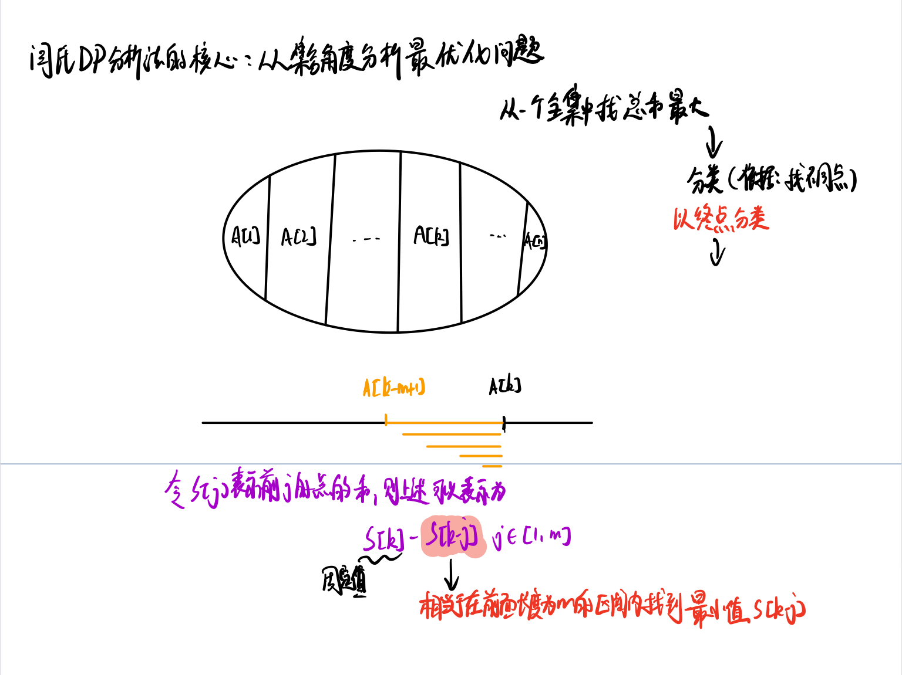

## 单调队列

单调队列常见解题思路：原问题是否能用队列暴力模拟，将队列中没有用的元素删除，看剩下的元素是否有单调性。

**一般存的是下标**，方便判断当前元素是否已经滑出窗口了


#### 队列的最大值

请定义一个队列并实现函数 max_value 得到队列里的最大值，要求函数max_value、push_back 和 pop_front 的均摊时间复杂度都是O(1)。

若队列为空，pop_front 和 max_value 需要返回 -1

```
输入: 
["MaxQueue","push_back","push_back","max_value","pop_front","max_value"]
[[],[1],[2],[],[],[]]
输出: [null,null,null,2,1,2]
```

题目解析：

由题意可以，比如当入队元素为[1,1,1,2]对于求最大值的max_value来说，2前面所有小于其的数都没有意义，因此可以全部弹出，因此想到维护一个单调递减对列，这样能够在O(1)时间复杂度内获得最大值

```java
class MaxQueue {
    Queue<Integer> q;
    Deque<Integer> dq;
    public MaxQueue() {
        q = new ArrayDeque<>();
        dq  = new ArrayDeque<>();
    }
    
    public int max_value() {
        return dq.isEmpty() ? -1 : dq.peekFirst();
    }
    
    public void push_back(int value) {
        while(!dq.isEmpty() && value > dq.peekLast()){
            dq.pollLast();
        }
        dq.offerLast(value);
        q.offer(value);
    }
    
    public int pop_front() {
        if(q.isEmpty()) return -1;
        int top = q.poll();
        if(top == dq.peekFirst()){
            dq.pollFirst();
        }
        return top;
    }
}

/**
 * Your MaxQueue object will be instantiated and called as such:
 * MaxQueue obj = new MaxQueue();
 * int param_1 = obj.max_value();
 * obj.push_back(value);
 * int param_3 = obj.pop_front();
 */
```


#### 滑动窗口中的最大和最小值

> 题目来源：`http://poj.org/problem?id=2823`

描述：

给你一个大小为$n ≤ 10^6$的数组。有一个大小为k的滑动窗口从数组的最左边移动到最右边。您只能在窗口中看到k 个数字。每次滑动窗口向右移动一个位置。

| 窗口位置            | 最小值 | 最大值 |
| ------------------- | ------ | ------ |
| [1 3 -1] -3 5 3 6 7 | -1     | 3      |
| 1 [3 -1 -3] 5 3 6 7 | -3     | 3      |
| 1 3 [-1 -3 5] 3 6 7 | -3     | 5      |
| 1 3 -1 [-3 5 3] 6 7 | -3     | 5      |
| 1 3 -1 -3 [5 3 6] 7 | 3      | 6      |
| 1 3 -1 -3 5 [3 6 7] | 3      | 7      |

输入由两行组成。第一行包含两个整数*n*和*k*，它们分别是数组和滑动窗口的长度。第二行有*n 个*整数。

输出中有两行。第一行分别给出了窗口中每个位置的最小值，从左到右。第二行给出最大值。

**题目解析**：

生成两个单调队列，一个是单调递减栈存储滑动窗口中的最大值，一个是单调递增栈存储滑动窗口中的最小值

```java
public class Solution {
    public int [][] getMinMax(int [] nums,int k){
        int n = nums.length;
        Deque<Integer> minq = new ArrayDeque<>(); // 单调递增栈
        Deque<Integer> maxq = new ArrayDeque<>(); // 单调递减栈
        int [][] ans = new int[2][n-k+1];  // 结果存放二维数组
        for (int i = 0;i < nums.length;i++){
            // 如果当前元素小于 minq 的栈顶（队列尾部）索引元素，说明当前元素较小，弹出栈顶索引
            while (!minq.isEmpty() && nums[i] < nums[minq.peekLast()]){
                minq.pollLast();
            }
            minq.offerLast(i); // 加入队列
            // 如果队列的头部索引在滑动窗口左边界之外，则弹出
            while (!minq.isEmpty() && i - minq.peekFirst() >= k){
                minq.pollFirst();
            }
            
            // 如果当前元素大于 maxq 的栈顶（队列尾部）索引元素，说明当前元素较大，弹出栈顶索引
            while (!maxq.isEmpty() && nums[i] > nums[maxq.peekLast()]){
                maxq.pollLast();
            }
            maxq.offerLast(i);
            // 如果队列的头部索引在滑动窗口左边界之外，则弹出
            while (!maxq.isEmpty() && i - maxq.peekFirst() >= k){
                maxq.pollFirst();
            }
            // 加入答案，此时队列的头部元素即窗口中的最大值/最小值
            if (i >= k-1){
                ans[0][i-k+1] = nums[minq.peekFirst()];
                ans[1][i-k+1] = nums[maxq.peekFirst()];
            }
        }
        return ans;
    }
    public static void main(String [] args){
        int [] nums = new int[]{1,3,-1,-3,5,3,6,7};
        int k = 3;
        Solution solu = new Solution();
        int [][] ans = solu.getMinMax(nums,k);
        for (int i = 0;i < ans.length;i++){
            for (int j = 0;j < ans[i].length;j++){
                System.out.print(ans[i][j] + " ");
            }
            System.out.println();
        }
    }
}
```

```
-1 -3 -3 -3 3 3 
3 3 5 5 6 7 
```


#### 最大子序和

输入一个长度为 n 的整数序列，从中找出一段长度不超过 m 的连续子序列，使得子序列中所有数的和最大。

**注意：** 子序列的长度至少是 1。

**输入格式**

第一行输入两个整数 n,m。

第二行输入 n 个数，代表长度为 n 的整数序列。

同一行数之间用空格隔开。

**输出格式**

输出一个整数，代表该序列的最大子序和。

```
输入样例：
6 4
1 -3 5 1 -2 3
输出样例：
7
```



```java
import java.io.*;

public class Main{
    public static void main(String [] args) throws IOException{
        BufferedReader br = new BufferedReader(new InputStreamReader(System.in));
        String [] ins = br.readLine().split(" ");
        int n = Integer.parseInt(ins[0]);
        int m = Integer.parseInt(ins[1]);
        int [] pre = new int[n+1];
        ins = br.readLine().split(" ");
        for (int i = 1;i <= n;i++){
            pre[i] = pre[i-1] + Integer.parseInt(ins[i-1]);
        }
        int res = Integer.MIN_VALUE;
        int [] q = new int[n+1]; // 数组模拟队列
        int h = 0, t = 0; // 队列的头下标和尾下标
        for (int i = 1;i <= n;i++){
            if (q[h] < i - m) h++;
            res = Math.max(res,pre[i] - pre[q[h]]);
            while (h <= t && pre[i] <= pre[q[t]]) t--;
            q[++t] = i;
        }
        System.out.println(res);
    }
}
```

#### 和至少为k的最短子数组

给你一个整数数组 nums 和一个整数 k ，找出 nums 中和至少为 k 的 最短非空子数组 ，并返回该子数组的长度。如果不存在这样的 子数组 ，返回 -1 。

子数组 是数组中 连续 的一部分。

```
输入：nums = [2,-1,2], k = 3
输出：3
```

题目解析：

首先求前缀和，然后我们可以在任意O（1）时间复杂度求某个区间和，因此可以暴力求解每段区间和，并找到符合要求的最短区间。但是这样时间复杂度是O(n^2)。

可以遍历 s，同时用某个合适的数据结构来维护遍历过的 s[i]，并及时移除无用的 s[i]。

优化1:


优化2:


做完这两个优化后，再把 s[i]*s*[*i*] 加到这个数据结

```java
class Solution {
    public int shortestSubarray(int[] nums, int k) {
        int n = nums.length;
        var  presum = new long[n+1];
        for(int i = 1;i <= n;i++){
            presum[i] = presum[i-1] + nums[i-1];
        }
        int ans = Integer.MAX_VALUE;
        // 为了计算子数组长度，存储的是下标
        Deque<Integer> q = new ArrayDeque<>();
        for(int i = 0;i <= n;i++){
            var x = presum[i];
            while(!q.isEmpty() && x - presum[q.peekFirst()] >= k){
                ans = Math.min(ans, i - q.pollFirst()); 
            }
            while(!q.isEmpty() && x <= presum[q.peekLast()]){
                q.pollLast();
            }
            q.offerLast(i);
        }
        return ans == Integer.MAX_VALUE ? -1 : ans;
    }
}
```


#### 绝对差不超过限制的最长连续子数组

给你一个整数数组 nums ，和一个表示限制的整数 limit，请你返回最长连续子数组的长度，该子数组中的任意两个元素之间的绝对差必须小于或者等于 limit 。

如果不存在满足条件的子数组，则返回 0 。

```
输入：nums = [8,2,4,7], limit = 4
输出：2 
解释：所有子数组如下：
[8] 最大绝对差 |8-8| = 0 <= 4.
[8,2] 最大绝对差 |8-2| = 6 > 4. 
[8,2,4] 最大绝对差 |8-2| = 6 > 4.
[8,2,4,7] 最大绝对差 |8-2| = 6 > 4.
[2] 最大绝对差 |2-2| = 0 <= 4.
[2,4] 最大绝对差 |2-4| = 2 <= 4.
[2,4,7] 最大绝对差 |2-7| = 5 > 4.
[4] 最大绝对差 |4-4| = 0 <= 4.
[4,7] 最大绝对差 |4-7| = 3 <= 4.
[7] 最大绝对差 |7-7| = 0 <= 4. 
因此，满足题意的最长子数组的长度为 2 
```

枚举每一个位置作为右端点，找到其对应的最靠左的左端点，满足区间中最大值与最小值的差不超过 \textit{limit}limit。

注意到随着右端点向右移动，左端点也将向右移动，于是我们可以使用滑动窗口解决本题。

为了方便统计当前窗口内的最大值与最小值,使用两个单调队列解决本题。

在实际代码中，我们使用一个单调递增的队列 queMin 维护最小值，一个单调递减的队列 queMax 维护最大值。这样我们只需要计算两个队列的队首的差值，即可知道当前窗口是否满足条件。

```java
class Solution {
    public int longestSubarray(int[] nums, int limit) {
        int n = nums.length;
        Deque<Integer> minQ = new ArrayDeque<>(); // 单调递增栈
        Deque<Integer> maxQ = new ArrayDeque<>(); // 单调递减栈
        int l = 0,r = 0;
        int ans = 0;
        while(r < n){
            while(!minQ.isEmpty() && nums[r] < nums[minQ.peekLast()]){
                minQ.pollLast();
            }
            while(!maxQ.isEmpty() && nums[r] > nums[maxQ.peekLast()]){
                maxQ.pollLast();
            }
            minQ.offerLast(r);
            maxQ.offerLast(r);
            while(!minQ.isEmpty() && !maxQ.isEmpty() && nums[maxQ.peekFirst()] - nums[minQ.peekFirst()] > limit){
                if(nums[l] == nums[maxQ.peekFirst()]){
                    maxQ.pollFirst();
                }
                if(nums[l] == nums[minQ.peekFirst()]){
                    minQ.pollFirst();
                }
                l++;
            }
            ans = Math.max(ans,r - l + 1);
            r++;
        }
        return ans;
    }
}
```

