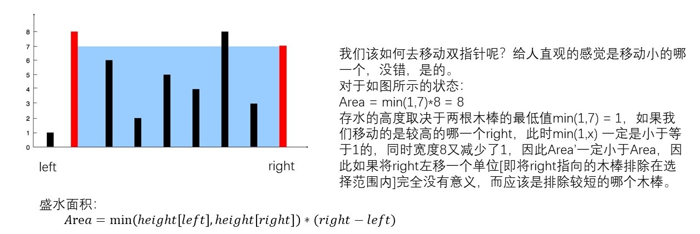
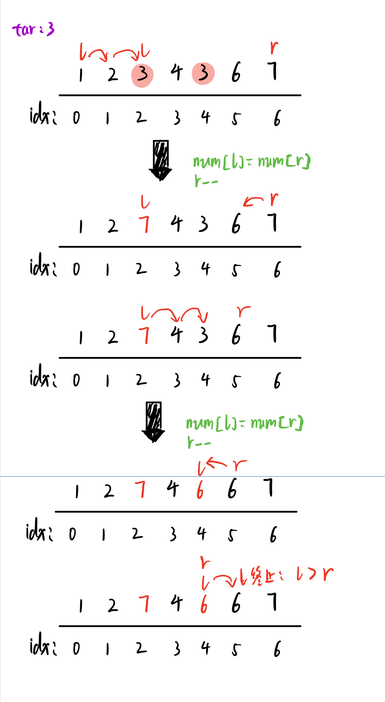
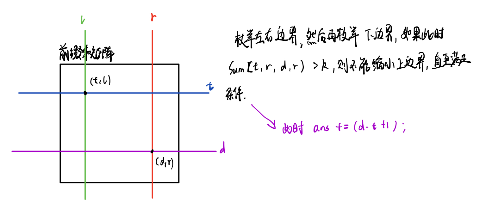

# 双指针

> 双指针类型的题目有三种：
>
> - 对撞指针[左右两指针向中间缩小]
>   - 要处理排序数组（或链接列表）并需要查找满足某些约束的一组元素的问题
> - 滑块指针[类似窗口长度动态变化的滑动窗口算法]  右"吞"左"吐"
>   - 查找最长/最短的子字符串、子数组或所需的值
>   - 解决一些查找满足一定条件的连续区间 或 长度 的问题
> - 快慢指针[常用于链表]
>   - 判断链表是否有环
>   - 删除链表倒数的第几个元素

## 对撞指针

### **独木舟**

（贪心+双指针）

```
题目描述
​ 一群人去旅行，要租用独木舟，每艘独木舟最多乘两人，且所有独木舟有一个统一的载重限度。给出独木舟的载重限度和每个人的体重，现求最少需要租用多少独木舟。
输入
​ 第一行一个整数 w，表示独木舟的载重量。（80≤w≤200）
​ 第二行一个整数 n，表示旅游人数。 （1≤n≤30000）
​ 接下来 n 行，每行一个数表示 ai，即每个人的重量 （5≤ai≤w）
输出
​ 输出一个数表示最少需要的独木舟数量。
```

> 独木舟的载重量是==约束==

重量大的尽可能和能够一起坐船的人里面较轻的去匹配。

```cpp
#include<iostream>
#include<vector>
#include<algorithm>
using namespace std;

int w,n,ans = 0;

int main(){
    cin>>w>>n;
    vector<int> a(n);
    vector<bool> isOn(n,false);
    for(int i = 0;i < n;i++){
        cin>>a[i];
    }
    sort(a.begin(),a.end());
    int l = 0,r = n-1;
    while(l <= r){
        if(a[l] + a[r] <= w){ //如果两者重量和低于载重值，则匹配
            l++;
            r--;
            ans++;
        }else{//如果两者和大于载重值，则重量大的单独匹配
            r--;
            ans++;
        }
    }
    cout<<ans<<endl;
    return 0;
}
```

### 两数之和

```
给定一个已按照 升序排列  的整数数组 numbers ，请你从数组中找出两个数满足相加之和等于目标数 target 。
函数应该以长度为 2 的整数数组的形式返回这两个数的下标值。

numbers 的下标 从 1 开始计数 ，所以答案数组应当满足 1 <= answer[0] < answer[1] <= numbers.length 。
你可以假设每个输入只对应唯一的答案，而且你不可以重复使用相同的元素。
```

> 约束: `a + b = target`

```
输入：numbers = [2,7,11,15], target = 9
输出：[1,2]
解释：2 与 7 之和等于目标数 9 。因此 index1 = 1, index2 = 2 。
```

```cpp
class Solution {
public:
    vector<int> twoSum(vector<int>& numbers, int target) {
        int n = numbers.size();
        int left = 0,right = n-1;
        while(left < right){
            if(target == numbers[left] + numbers[right]){
                return {left+1,right+1};
            }else if(target > numbers[left] + numbers[right]) left++;
            else right--;
        }
        return {};
    }
};
```

### 三数之和

```
给你一个包含 n 个整数的数组 nums，判断 nums 中是否存在三个元素 a，b，c ，使得 a + b + c = 0 ？请你找出所有和为 0 且不重复的三元组。
输入：nums = [-1,0,1,2,-1,-4]
输出：[[-1,-1,2],[-1,0,1]]
```

> 注意：题目要求找出的答案是==不重复的==。比如[-1,0,1,2,-1,-4]
>
> - 重复类型1：顺序改变，但内容一样，即(-1,0,1)和(0,-1,1)是重复的
> - 重复类型2：设下标为0和4的 -1分为为-1和-1'，那么(-1,0,1)和(-1',0,1)也是重复的
>
> 对于重复类型1：我们可以自己==规定自己找到的三元组答案(a,b,c)是非降序的==，即a≤b≤c，也就可以排除重复的元素。因此，我们需要首先进行排序，这样遍历数组得到的答案都是非降序的，也就保证了==答案不重复==。
>
> 对于重复类型2：当我们将数组排序过后，假设得到了[-4,-1,-1',0,1,2]，假设当前得到了结果(-1,0,1)，然后下一次对于a将会到达-1'，此时我们需要跳过。
>
> 为什么会要想到要用==双指针==？
>
> 首先我们肯定是要分别遍历数组，来标定a,b,c的值然后判断其是否符合a+b+c = 0。对于已经排序的数组，当我们获得了一组数(a,b,c)符合a+b+c=0时，对于b下一个值b'一定符合b≤b',为了依旧符合a+b'+c'=0，那么c'一定符合c'≤c，因此对于非降序的数组，b是从左向右遍历[升序]，c是从右向左[降序]，这便联想到了双指针

```cpp
class Solution {
public:
    vector<vector<int>> threeSum(vector<int>& nums) {
        int n = nums.size();
        //对数组进行排序
        sort(nums.begin(),nums.end());
        vector<vector<int>> ans;
        //固定a
        for(int a = 0;a < n;a++){
            //如果a重复，直接跳过
            if(a > 0 && nums[a] == nums[a-1]) continue;
            int target = -nums[a];
            //初始化b和c的边界
            int b = a + 1,c = n-1;
            while(b < c){
                //如果b也重复上一次，那么直接跳过
                if(b > a + 1 && nums[b] == nums[b-1]){
                    b++;
                    continue;
                }
                //如果符合条件，加入结果；不符合则变化双指针
                if(nums[b] + nums[c] ==  target) {
                    ans.push_back({nums[a],nums[b],nums[c]});
                    b++;
                }else if(nums[b] + nums[c] < target){
                    b++;
                }else{
                    c--;
                }
            }            
        }
        return ans;
    }
};
```

### 最接近的三数之和

给你一个长度为 n 的整数数组 nums 和 一个目标值 target。请你从 nums 中选出三个整数，使它们的和与 target 最接近。

返回这三个数的和。

假定每组输入只存在恰好一个解。

```
输入：nums = [-1,2,1,-4], target = 1
输出：2
解释：与 target 最接近的和是 2 (-1 + 2 + 1 = 2) 。
```

题目解析：

如果直接枚举时间复杂度为$O(N^3)$，可能会超时。借鉴之前的两数之和、三数之和，可能需要排序+双指针解决。

因此我们枚举第一个数的位置 $i$，然后在$(i+1,n-1]$范围内找另外两个数使得两数之和尽可能接近 $target-nums[i]$，因为已经有序，所以可以想到用双指针， 当当前的$val(nums[l] + nums[r])$ 大于 target时，r 自减，否则 l 自加。

- 优化1：枚举另外两个数的范围为$(i+1,n-1]$ 是为了防止重复枚举，因为三个数的位置没有要求，属于组合不是排列问题。
- 优化2：双指针优化，其等价于一个“两数之和”问题。
- 优化3：枚举第一个数的时候，如果$nums[i] == nums[i-1](i>0)$，直接跳过，防止重复枚举。

```java
class Solution {
    public int threeSumClosest(int[] nums, int target) {
        int n = nums.length;
        Arrays.sort(nums); // 升序排序
        int mindiff = Integer.MAX_VALUE;
        int ans = 0;
        for (int i = 0;i < n;i++){
            if (i > 0 && nums[i] == nums[i-1]) continue;
            int l = i + 1,r = n-1;
            while (l < r){
                int val = nums[l] + nums[i] + nums[r];
                if (val == target){ // 如果相等，不可能有更小的
                    return target;
                }
                int diff = Math.abs(target-val);
                if (diff < mindiff){
                    ans = val;
                    mindiff = diff;
                }
                
                if (val > target){
                    int t = r - 1;
                    while (t > l && nums[t] == nums[r]){
                        t--;
                    }
                    r = t;
                }else{
                    int t = l + 1;
                    while (t < r && nums[t] == nums[l]){
                        t++;
                    }
                    l = t;
                }
            }
        }
        return ans;
    }
}
```


### 盛水最多的容器

```
给你 n 个非负整数 a1，a2，...，an，每个数代表坐标中的一个点 (i, ai) 。在坐标内画 n 条垂直线，垂直线 i 的两个端点分别为 (i, ai) 和 (i, 0) 。
找出其中的两条线，使得它们与 x 轴共同构成的容器可以容纳最多的水。
```

```
输入：[1,8,6,2,5,4,8,3,7]
输出：49 
```

> Area = min(height[left],height[right]) * (right - left)



```cpp
class Solution {
public:
    int maxArea(vector<int>& height) {
        int n = height.size();
        int left = 0,right = n-1;
        int ans = -1;
        while(left < right
              //获取当前面积
            int area = min(height[left],height[right]) * (right - left);
              //更新最大值
            ans = max(area,ans);
              //选择排除哪一个木棒
            height[left] <= height[right] ? left++ : right--;
        }
        return ans;
    }
};
```


### 移除元素

> Leetcode 27

给你一个数组 nums 和一个值 val，你需要 原地 移除所有数值等于 val 的元素，并返回移除后数组的新长度。

不要使用额外的数组空间，你必须仅使用 O(1) 额外空间并 原地 修改输入数组。

元素的顺序可以改变。你不需要考虑数组中超出新长度后面的元素。

```
输入：nums = [3,2,2,3], val = 3
输出：2, nums = [2,2]
解释：函数应该返回新的长度 2, 并且 nums 中的前两个元素均为 2。你不需要考虑数组中超出新长度后面的元素。例如，函数返回的新长度为 2 ，而 nums = [2,2,3,3] 或 nums = [2,2,0,0]，也会被视作正确答案。
```



```java
class Solution {
    public int removeElement(int[] nums, int val) {
        int n = nums.length;
        int l = 0,r  = n-1;
        for (;l <= r;l++){
            while (l <= r && nums[l] == val){
                nums[l] = nums[r];
                r--;
            }
        }
        return r+1;
    }
}
```


## 滑块指针

> 与滑动窗口的思想差不多一样

#### 数组中的K-diff数对

给定一个整数数组和一个整数 k，你需要在数组里找到 不同的 k-diff 数对，并返回不同的 k-diff 数对 的数目。

这里将 k-diff 数对定义为一个整数对 $(nums[i], nums[j])$，并满足下述全部条件：

- $0 <= i < j < nums.length$
- $|nums[i] - nums[j]| == k$

注意，|val| 表示 val 的绝对值。

```
输入：nums = [3, 1, 4, 1, 5], k = 2
输出：2
解释：数组中有两个 2-diff 数对, (1, 3) 和 (3, 5)。
尽管数组中有两个1，但我们只应返回不同的数对的数量。
```

```java
class Solution {
    public int findPairs(int[] nums, int k) {
        int n = nums.length;
        Arrays.sort(nums);
        int r = 0,ans = 0;
        for (int l = 0;l < n;l++){
            // nums[l] != nums[l-1]负责去重
            if (l == 0 || nums[l] != nums[l-1]){
                while (r < n && (nums[r] < nums[l] + k || r <= l)){
                    r ++;
                }
                if (r < n && nums[r] == nums[l] + k){
                    ans += 1;
                }
            }
        }
        return ans;
    }
}
```


#### 统计子矩阵

给定一个 N×M 的矩阵 A，请你统计有多少个子矩阵 (最小 1×1，最大 N×MN×M) 满足子矩阵中所有数的和不超过给定的整数 K?

**输入格式**

第一行包含三个整数 N,M 和 K。

之后 N 行每行包含 M 个整数，代表矩阵 A。

**输出格式**

一个整数代表答案。



```java
import java.io.*;
import java.util.*;


public class Main{
    public static int getSum(int x1,int y1,int x2,int y2,int [][] sum){
        return sum[x2][y2] - sum[x2][y1-1] - sum[x1-1][y2] + sum[x1-1][y1-1];
    }
    public static void main(String [] args) throws IOException{
        BufferedReader br = new BufferedReader(new InputStreamReader(System.in));
        String [] ins = br.readLine().split(" ");
        int n = Integer.parseInt(ins[0]);
        int m = Integer.parseInt(ins[1]);
        int k = Integer.parseInt(ins[2]);
        int [][] g = new int[n+1][m+1];
        int [][] sum = new int[n+1][m+1];
        for (int i = 1;i <= n;i++){
            ins = br.readLine().split(" ");
            for (int j = 0;j < m;j++){
                g[i][j+1] = Integer.parseInt(ins[j]);
            }
        }
        // 计算前缀和
        for (int i = 1;i <= n;i++){
            for (int j = 1;j <= m;j++){
                sum[i][j] = sum[i-1][j] + sum[i][j-1] - sum[i-1][j-1] + g[i][j];
            }
        }
        long ans = 0;
        // 统计个数
        for (int l = 1;l <= m;l++){  // 左界限
            for (int r = l;r <= m;r++){ // 右界限
                for (int i = 1,j = 1;i <= n;i++){
                    while (j <= i && getSum(j,l,i,r,sum) > k) j++;
                    if (j <= i) ans += i - j + 1;
                }
            }
        }
        System.out.println(ans);
    }
}
```

> 时间复杂度分析：最好情况 $O(n \times m^2)$  最坏情况 $O(n ^ 2\times m^2)$

#### 最长优雅子数组

给你一个由 正 整数组成的数组 nums 。

如果 nums 的子数组中位于 不同 位置的每对元素按位 与（AND）运算的结果等于 0 ，则称该子数组为 优雅 子数组。

返回 **最长** 的优雅子数组的长度。

**子数组** 是数组中的一个 连续 部分。

**注意**：长度为 1 的子数组始终视作优雅子数组。

```
输入：nums = [1,3,8,48,10]
输出：3
解释：最长的优雅子数组是 [3,8,48] 。子数组满足题目条件：
- 3 AND 8 = 0
- 3 AND 48 = 0
- 8 AND 48 = 0
可以证明不存在更长的优雅子数组，所以返回 3 。
```

**题目解析**：

题目 等价于 找 **一个长度最长的子数组，子数组中的元素中每一位上1的个数最多为1**

```java
class Solution {
    public int longestNiceSubarray(int[] nums) {
        int n = nums.length;
        int [] cnt = new int[32];  // 记录每一位上1的个数
        int total = 0; // 记录 总共超出的1的个数
        int ans = 1;
        for (int l = 0,r = 0;r < n;r++){
            // 将nums[r]加入到窗口中
            for (int i = 0;i < 32;i++){
                if (((nums[r] >> i) & 1) == 1)
                {
                    cnt[i] += 1;
                    // 如果当前位1的个数超过1，更新total
                    if (cnt[i] > 1){
                        total += 1;
                    }
                }
            }
            while (total > 0){
                for (int i = 0;i < 32;i++){
                    if (((nums[l] >> i) & 1) == 1){
                        cnt[i] -= 1;
                        // 如果当前位减去的1的个数是超过的，更新total
                        if (cnt[i] >= 1){
                            total -=1;
                        }
                    }
                }
                l++; // 缩小窗口
            }
            ans = Math.max(ans,r - l + 1);
        }
        return ans;
    }
}
```


#### 按位与最大的最长子数组

给你一个长度为 `n` 的整数数组 `nums` 。

考虑 `nums` 中进行 **按位与（bitwise AND）**运算得到的值 **最大** 的 **非空** 子数组。

- 换句话说，令 `k` 是 `nums` **任意** 子数组执行按位与运算所能得到的最大值。那么，只需要考虑那些执行一次按位与运算后等于 `k` 的子数组。

返回满足要求的 **最长** 子数组的长度。

数组的按位与就是对数组中的所有数字进行按位与运算。

**子数组** 是数组中的一个连续元素序列。

```
输入：nums = [1,2,3,3,2,2]
输出：2
解释：
子数组按位与运算的最大值是 3 。
能得到此结果的最长子数组是 [3,3]，所以返回 2 。
```

题目解析：

看到求子数组，可以联想到双指针。我们维护一个动态的窗口，尝试将一个新的值加入窗口：

- 如果新加入值使得窗口值变小了，那么就以新值为一个新的窗口，然后更新答案
- 如果新加入值使得窗口不变或者变大，则将该值加入窗口，然后更新答案

> 由于 按位与 的性质，窗口内的值只会越来越小

```java
class Solution {
    public int longestSubarray(int[] nums) {
        int n = nums.length;
        if (n <= 1) return n; 
        int l = 0,r = 1; // 初始时，窗口里有一个值
        int now = nums[0]; // 记录当前窗口内元素按位与的值
        int maxv = now; // 最大值
        int maxlen = 1; // 最大值时窗口长度
        while (r < n){
            // 如果加入后小于新的值，则新开拓一个窗口
            if ((now & nums[r]) < nums[r]){
                l = r;
                now = nums[r];
            }else{ // 否则就加入窗口
                now = now & nums[r];
            }
            // 更新答案
            if (now > maxv){
                maxv = now;
                maxlen = r - l + 1;
            }else if (now == maxv){
                maxlen = Math.max(maxlen,r - l + 1);
            }
            r ++; 
        }
        return maxlen;
    }
}
```

**再进行思考一下**：对于按位与的性质，有`a and b <= min(a,b)`，所以题目等价于求数组中的最大值最多连续出现的长度。 


## 快慢指针


还有种划分方式是：

1. 两个指针分别指向两个序列
2. 两个指针指向同一个序列