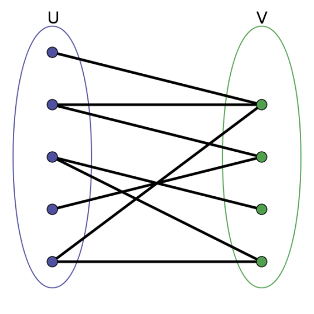

**图 (Graph)** 是一个二元组 $G=(V(G),E(G))$ 。其中$V(G)$是非空集，称为 **点集 (Vertex set)**，对于 $V$ 中的每个元素，我们称其为 **顶点 (Vertex)** 或 **节点 (Node)**，简称 **点**；$E(G)$为$V(G)$各结点之间边的集合，称为 **边集 (Edge set)**。常用 $G=(V,E)$

树是特殊的图（无环、连通的）

**自环**：一个点存在到自己的边

**重边**：一个点到另外一个点可能有多条边


图主要分为两种：

1. 有向图  a --> b
   - 邻接矩阵  适合存储稠密图
   
   - 邻接表  适合存储稀疏图
   
     ```cpp
     // 对于每个点k，开一个单链表，存储k所有可以走到的点。h[k]存储这个单链表的头结点
     int h[N], e[N], ne[N], idx;
     
     // 添加一条边a->b
     void add(int a, int b)
     {
         e[idx] = b, ne[idx] = h[a], h[a] = idx ++ ;
     }
     
     // 初始化
     idx = 0;
     memset(h, -1, sizeof h);
     ```
2. 无向图  a --- b （可以看作特殊的有向图）


#### 图的遍历

- 深度优先搜索

  ```cpp
  int dfs(int u)
  {
      st[u] = true; // st[u] 表示点u已经被遍历过
  
      for (int i = h[u]; i != -1; i = ne[i])
      {
          int j = e[i];
          if (!st[j]) dfs(j);
      }
  }
  ```

- 宽度优先搜索

  ```cpp
  queue<int> q;
  st[1] = true; // 表示1号点已经被遍历过
  q.push(1);
  
  while (q.size())
  {
      int t = q.front();
      q.pop();
  
      for (int i = h[t]; i != -1; i = ne[i])
      {
          int j = e[i];
          if (!st[j])
          {
              st[j] = true; // 表示点j已经被遍历过
              q.push(j);
          }
      }
  }
  ```

#### 拓扑排序——图的BFS经典应用

> 拓扑序列一定是针对有向图的，有环的图不可能有拓扑序列

```cpp
bool topsort()
{
    int hh = 0, tt = -1;

    // d[i] 存储点i的入度
    for (int i = 1; i <= n; i ++ )
        if (!d[i])
            q[ ++ tt] = i;

    while (hh <= tt)
    {
        int t = q[hh ++ ];

        for (int i = h[t]; i != -1; i = ne[i])
        {
            int j = e[i];
            if (-- d[j] == 0)
                q[ ++ tt] = j;
        }
    }

    // 如果所有点都入队了，说明存在拓扑序列；否则不存在拓扑序列。
    return tt == n - 1;
}
```


#### **最短路径问题**

最短路径问题分类

- 单源最短路径
  - 所有边权都是正数
    - 朴素Dijkstra算法  O(n^2)
    - 堆优化版Dijkstra算法 O(m logn)
  - 存在负权边
    - Bellman-Ford O(nm)
    
    - SPFA  一般：O(m) 最坏:O(nm)
    
      > 前提条件：图中没有负环
- 多源汇最短路
  
  - Floyd 算法 O(n^3)

> 其中 n 为点的数量、m 为边的数量

难点在于建图，即如何将一个问题抽象为最短路径问题，然后解决！

**朴素Dijkstra算法**：

```cpp
int g[N][N];  // 存储每条边
int dist[N];  // 存储1号点到每个点的最短距离
bool st[N];   // 存储每个点的最短路是否已经确定

// 求1号点到n号点的最短路，如果不存在则返回-1
int dijkstra()
{
    // 初始化距离
    memset(dist, 0x3f, sizeof dist);
    dist[1] = 0;

    // 循环n次
    for (int i = 0; i < n - 1; i ++ )
    {
        int t = -1;     // 在还未确定最短路的点中，寻找距离最小的点
        for (int j = 1; j <= n; j ++ )
            if (!st[j] && (t == -1 || dist[t] > dist[j]))
                t = j;

        // 用t更新其他点的距离
        for (int j = 1; j <= n; j ++ )
            dist[j] = min(dist[j], dist[t] + g[t][j]);

        st[t] = true; // 标记当前点最短路径已经确定
    }

    if (dist[n] == 0x3f3f3f3f) return -1;
    return dist[n];
}
```


```java
// Java 版本    
/**
     * 求1号点到n号点的最短路径
     * @param g 邻接矩阵
     * @return
     */
public static int dijkstra(int [][] g){
    int n = g.length - 1;
    int [] dist = new int[n+1];
    boolean [] st = new boolean[n+1];
    // 初始化
    for (int i = 1;i <= n;i++){
        dist[i] = 0x3f3f3f3f;  //可以设置为一个比较大的值
    }
    dist[1] = 0;

    // 循环 n 次
    for (int i = 0; i < n-1;i++){
        // 在还未确定的点中，寻找距离最小的点
        int t = -1;
        for (int j = 1;j <= n;j++){
            if (!st[j] && (t == -1 || dist[t] > dist[j])) t = j;
        }
        // 小优化：如果此时最短路径
        if(t == n){
            break;
        }

        // 用t作为中转点更新其他的点
        for (int j = 1;j <= n;j++){
            dist[j] = Math.min(dist[j],dist[t] + g[t][j]);
        }
        // 标记当前点已经找到最短路径
        st[t] = true;
    }
    if (dist[n] == 0x3f3f3f3f) return -1;
    return dist[n];
}
```

> 注：0x3f的好处有什么？


**堆优化版Dijkstra算法**

因为是稀疏图，所以采用邻接表形式存储图

```cpp
typedef pair<int, int> PII;

int n;      // 点的数量
int h[N], w[N], e[N], ne[N], idx;       // 邻接表存储所有边
int dist[N];        // 存储所有点到1号点的距离
bool st[N];     // 存储每个点的最短距离是否已确定

// 求1号点到n号点的最短距离，如果不存在，则返回-1
int dijkstra()
{
    memset(dist, 0x3f, sizeof dist);
    dist[1] = 0;
    priority_queue<PII, vector<PII>, greater<PII>> heap;
    heap.push({0, 1});      // first存储距离，second存储节点编号

    while (heap.size())
    {
        auto t = heap.top();
        heap.pop();
		// 获取结点编号和距离
        int ver = t.second, distance = t.first;

        if (st[ver]) continue;
        st[ver] = true;

        for (int i = h[ver]; i != -1; i = ne[i])
        {
            int j = e[i];
            if (dist[j] > distance + w[i])
            {
                dist[j] = distance + w[i];
                heap.push({dist[j], j});
            }
        }
    }

    if (dist[n] == 0x3f3f3f3f) return -1;
    return dist[n];
}
```

java版本：

```java
class Pair{
    int node;  //结点编号
    int egdeW; //边的权重
    public Pair(int node,int v){
        this.node = node;
        this.egdeW = v;
    }
}

class queueNode{
    int id;
    int dis;

    public queueNode(int id, int dis) {
        this.id = id;
        this.dis = dis;
    }
}

public static int dijkstra(Map<Integer,List<Pair>> map,int n){
    int [] dist = new int[n+1];
    for (int i = 1;i <= n;i++ ){
        dist[i] = 0x3f3f3f3f;
    }
    boolean [] visit = new boolean[n+1];
    dist[1] = 0;
    Queue<queueNode> pq = new PriorityQueue<>(new Comparator<queueNode>() {
        @Override
        public int compare(queueNode o1, queueNode o2) {
            return o1.dis - o2.dis;
        }
    });
    pq.offer(new queueNode(1,0));
    while (!pq.isEmpty()){
        queueNode top = pq.poll();
        int id = top.id,dis = top.dis;
        if (visit[id]) continue;
        visit[id] = true;
        // 更新dist
        List<Pair> edges = map.get(id);
        if (edges == null) continue;
        for (int i = 0;i < edges.size();i++){
            int o = edges.get(i).node;
            int edge = edges.get(i).egdeW;
            if (dist[o] > dis + edge){
                dist[o] = dis + edge;
                pq.offer(new queueNode(o,dist[o]));
            }
        }
    }
    if (dist[n] == 0x3f3f3f3f) return -1;
    return dist[n];
}
```

>  其中输入的Map是邻接表

建图过程：

```java
InputStreamReader in = new InputStreamReader(System.in);
BufferedReader bf = new BufferedReader(in);
String [] ins = bf.readLine().split(" ");
int n = Integer.parseInt(ins[0]);
int m = Integer.parseInt(ins[1]);
Map<Integer,List<Pair>> map = new HashMap<>();
while (m-- > 0){
    ins = bf.readLine().split(" ");
    int s = Integer.parseInt(ins[0]);
    int e = Integer.parseInt(ins[1]);
    int w = Integer.parseInt(ins[2]);
    List<Pair> edges = map.getOrDefault(s,new ArrayList<>());
    edges.add(new Pair(e,w));
    map.put(s,edges);
}
System.out.println(dijkstra(map,n));
```


**Bellman-Ford算法**

> 迭代K次，代表最多经过不超过K条边

```cpp
int n, m;       // n表示点数，m表示边数
int dist[N];        // dist[x]存储1到x的最短路距离
int backip[N];
struct Edge     // 边，a表示出点，b表示入点，w表示边的权重
{
    int a, b, w;
}edges[M];

// 求1到n的最短路距离，如果无法从1走到n，则返回-1。
int bellman_ford()
{
    //初始化
    memset(dist, 0x3f, sizeof dist);
    dist[1] = 0;	
    
    // 如果第n次迭代仍然会松弛三角不等式，就说明存在一条长度是n+1的最短路径，由抽屉原理，路径中至少存在两个相同的点，说明图中存在负权回路。
    for (int i = 0; i < n; i ++ )// 如果想要限制不超过K条边，只需要将n换成K
    {
        //备份
		memcpy(backup,dist,sizeof dist)
        for (int j = 0; j < m; j ++ )
        {
            int a = edges[j].a, b = edges[j].b, w = edges[j].w;
            dist[b] = min(dist[b],backup[a] + w);
        }
    }
	//防止因为负权边的存在，导致原本不能到达的点的dist[i] < 0x3f3f3f3f
    if (dist[n] > 0x3f3f3f3f / 2) return -1;
    return dist[n];
}
```


**SPFA**  

SPFA是针对Bellman-Ford的算法优化，主要优化的点是：`dist[b] = min(dist[b],backup[a] + w);`

我更新过谁，我再拿它跟新别人

```cpp
int n;      // 总点数
int h[N], w[N], e[N], ne[N], idx;       // 邻接表存储所有边
int dist[N];        // 存储每个点到1号点的最短距离
bool st[N];     // 存储每个点是否在队列中

// 求1号点到n号点的最短路距离，如果从1号点无法走到n号点则返回-1
int spfa()
{
    memset(dist, 0x3f, sizeof dist);
    dist[1] = 0;

    queue<int> q;
    q.push(1);
    st[1] = true;

    while (q.size())
    {
        auto t = q.front();
        q.pop();

        st[t] = false;

        for (int i = h[t]; i != -1; i = ne[i])
        {
            int j = e[i];
            if (dist[j] > dist[t] + w[i])
            {
                dist[j] = dist[t] + w[i];
                if (!st[j])     // 如果队列中已存在j，则不需要将j重复插入
                {
                    q.push(j);
                    st[j] = true;
                }
            }
        }
    }

    if (dist[n] == 0x3f3f3f3f) return -1;
    return dist[n];
}
```


**例题：spfa判断负环**

给定一个 nn 个点 mm 条边的有向图，图中可能存在重边和自环， **边权可能为负数**。

请你判断图中是否存在负权回路。

**输入格式**

第一行包含整数 nn 和 mm。

接下来 mm 行每行包含三个整数 x,y,zx,y,z，表示存在一条从点 xx 到点 yy 的有向边，边长为 zz。

**输出格式**

如果图中**存在**负权回路，则输出 `Yes`，否则输出 `No`。

题解：

dist[x]：1~x的最短距离

cnt[x]：当前最短路边的数量

```java
dist[x] = dist[t] + w[i];
cnt[x] = cnt[t] + 1;
```

> 如果cnt[x] >= n 说明有负环！

> 注意：初始时需要把**所有点**全部放入队列中


#### Floyd 算法

求多源汇最短路径,可以处理负权，但是不能处理负环

$d[i][j]$：存储所有的边，要点：三重循环

原理：基于动态规划 

```cpp
初始化：
    for (int i = 1; i <= n; i ++ )
        for (int j = 1; j <= n; j ++ )
            if (i == j) d[i][j] = 0;
            else d[i][j] = INF;

// 算法结束后，d[a][b]表示a到b的最短距离
void floyd()
{
    for (int k = 1; k <= n; k ++ ) // 注意：一定要先循环k
        for (int i = 1; i <= n; i ++ )
            for (int j = 1; j <= n; j ++ )
                d[i][j] = min(d[i][j], d[i][k] + d[k][j]);
}

```


#### **最小生成树**

常见方法：

- Prim 算法
  - 朴素版Prim O(n^2)  稠密图时使用
  - 堆优化版本Prim   O（mlongn) 稀疏图时使用
- Kruskal 算法 O(mlogm)


#### 朴素版Prim

```cpp
int n;      // n表示点数
int g[N][N];        // 邻接矩阵，存储所有边
int dist[N];        // 存储其他点到当前最小生成树的距离
bool st[N];     // 存储每个点是否已经在生成树中


// 如果图不连通，则返回INF(值是0x3f3f3f3f), 否则返回最小生成树的树边权重之和
int prim()
{
    // 初始化所有距离
    memset(dist, 0x3f, sizeof dist);
	// res为生成树中所有边的权重之和
    int res = 0;
    for (int i = 0; i < n; i ++ )
    {
        // 找到集合外距离最近的点 t
        int t = -1; 
        for (int j = 1; j <= n; j ++ )
            if (!st[j] && (t == -1 || dist[t] > dist[j]))
                t = j;
		
        // 如果图不是联通的，则不存在最小生成树
        if (i && dist[t] == INF) return INF;

        // 第1个结点跳过！
        if (i) res += dist[t]; // 先累加 再更新 防止有自环
        st[t] = true;
		
        // 更新其他点到集合的距离
        for (int j = 1; j <= n; j ++ ) dist[j] = min(dist[j], g[t][j]);
    }

    return res;
}
```

> 优化方式很像堆优化Dijsktra


#### Kruskal 算法

```cpp
int n, m;       // n是点数，m是边数
int p[N];       // 并查集的父节点数组

struct Edge     // 存储边
{
    int a, b, w;
    bool operator< (const Edge &W)const
    {
        return w < W.w;
    }
}edges[M];

int find(int x)     // 并查集核心操作
{
    if (p[x] != x) p[x] = find(p[x]);
    return p[x];
}

int kruskal()
{
    // 将所有边按照权重按照从小到达排序 O(mlogn)
    sort(edges, edges + m);

    // 初始化并查集
    for (int i = 1; i <= n; i ++ ) p[i] = i;   

    int res = 0, cnt = 0;
    // 枚举每条边
    for (int i = 0; i < m; i ++ )
    {
        int a = edges[i].a, b = edges[i].b, w = edges[i].w;

        a = find(a), b = find(b);
        if (a != b)     // 如果两个连通块不连通，则将这两个连通块合并
        {
            p[a] = b;
            res += w;
            cnt ++ ;
        }
    }
	// n 个点的最小生成树有 n-1条边，如果少于 则不连通
    if (cnt < n - 1) return INF;
    return res;
}
```


#### **二分图**

设G=(N,E)是一个无向图，如果顶点N可分割为两个互不相交的子集(U,V)，并且图中的每条边（i，j）所关联的两个顶点i和j分别属于这两个不同的顶点集(i in U,j in V)，则称图G为一个二分图。



如果图中存在奇数环，则一定不是二分图，如果是二分图，则一定没有奇数环

**常见方法**：

- 染色法 O(n+m)  判断二分图
- 匈牙利算法 O(mn)


**染色法  判断二分图:**

```cpp
int n;      					// n表示点数
int h[N], e[M], ne[M], idx;     // 邻接表存储图
int color[N];      				// 表示每个点的颜色，-1表示未染色，0表示白色，1表示黑色

// 参数：u表示当前节点，c表示当前点的颜色
bool dfs(int u, int c)
{
    color[u] = c; // 对当前点进行染色
    for (int i = h[u]; i != -1; i = ne[i]) // 遍历当前的所有边，进行dfs
    {
        int j = e[i];
        if (color[j] == -1) // 如果没有染色
        {
            // 递归染色为另外一种颜色
            if (!dfs(j, !c)) return false;
        }
        else if (color[j] == c) return false; //如果颜色相同 说明不是二分图
    }

    return true;
}

bool check(){
    memset(color, -1, sizeof color);  // 初始化
    bool flag = true; // 是否是二分图 标志
    for (int i = 1; i <= n; i ++ )
        if (color[i] == -1)
            if (!dfs(i, 0)){
                flag = false;
                break;
            }
    return flag;
}
```

**匈牙利算法**（舔狗算法）

获得左边和右边匹配的数量

```cpp
int n1, n2;     // n1表示第一个集合中的点数，n2表示第二个集合中的点数
int h[N], e[M], ne[M], idx;     // 邻接表存储所有边，匈牙利算法中只会用到从第一个集合指向第二个集合的边，所以这里只用存一个方向的边
int match[N];       // 存储第二个集合中的每个点当前匹配的第一个集合中的点是哪个
bool st[N];     // 表示第二个集合中的每个点是否已经被遍历过

bool find(int x)
{
    for (int i = h[x]; i != -1; i = ne[i])
    {
        int j = e[i];
        if (!st[j])
        {
            st[j] = true;
            // 重点部分 如果当前点没有被匹配，或者之前左边集合匹配改点的点可以匹配别人，则将当前匹配
            if (match[j] == 0 || find(match[j]))
            {
                match[j] = x;
                return true;
            }
        }
    }

    return false;
}

// 求最大匹配数，依次枚举第一个集合中的每个点能否匹配第二个集合中的点
int res = 0;
for (int i = 1; i <= n1; i ++ )
{
    memset(st, false, sizeof st);
    if (find(i)) res ++ ;
}
```


棋盘覆盖