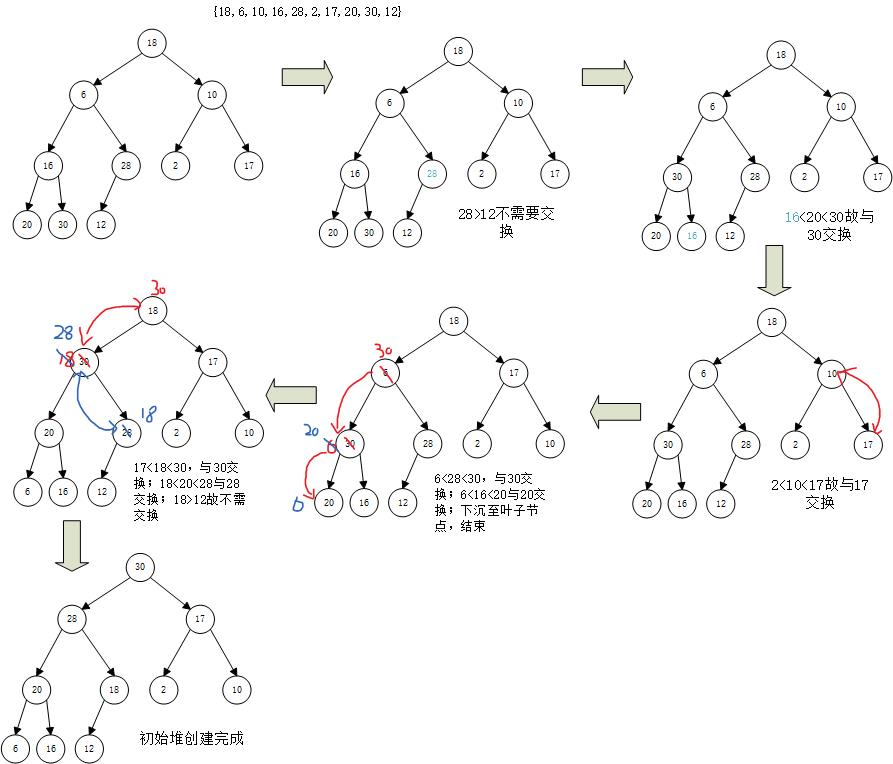

学了数据结构之后，决定好好再回顾一下这几种排序算法，同时加深也加深一下自己的印象！也希望能够帮助到大家理解这些算法和思想。（画图、敲字、敲代码过程不易，如果觉得有用的话可以收藏+赞一下哈）

首先先介绍一下排序算法的分类：


我们接下来介绍的是内部排序中的算法。好的，那么开始了！

### 插入排序

#### 直接插入排序

直接插入排序是最简单的排序方法，每次将一个待排序的记录，插入已经排好的数据序列中，得到一个新的长度增1的有序表，如下所示：


算法步骤：

- 设待排序的记录存储在数组r[1,..n]中，可以把第一个记录r[1]作为一个有序序列
- 依次将r[i]插入已经拍好的有序序列中r[i,...(i-1)]中，并保持有序

图解过程如下：


后续操作如上，最终得出升序排序结果：1、7 、 7* 、 12、 15、 19、 30 、45

程序如下：

注意`elemtype`为自定义数据类型，如`typedef int elemtype;`

```c
void InsertSort(elemtype arr[],int length)
{
    int j;
    for(int i=2;i<=length;i++)
    {
        arr[0] = arr[i];//设置监视哨
        j = i-1;   //从当前元素的前一个判断
        while(arr[0] < arr[j] && j>0)  
        {//如果当前元素大于待插入元素，则后移一位
            arr[j+1] = arr[j];  
            j=j-1;
        }//否则插入到比待插入元素小的后面
        arr[j+1] = arr[0];
    }
}
```

#### 折半插入排序

折半插入排序其实就是针对于直接插入排序中的查找部分进行了二分查找优化

图解过程如下：

*图示表示已经到达对最后一个数据进行排序时的状态！！*


```python
//折半插入排序
void BinSort(elemtype arr[],int len)
{
    int j,x,low,high,mid;
    for(int i=2;i<=len;i++)
    {
        arr[0] = arr[i];  //哨兵记录
        low = 1;
        high = i-1;
        while(low <= high)  //确定插入的位置
        {
            mid = (low + high)/2;
            if(arr[0] < arr[mid])
                high = mid - 1;
            else
                low = mid + 1;
        }
        for(j = i-1;j>=low;j--)  //将该位置之后的元素后移
            arr[j+1]=arr[j];
        arr[low] = arr[0];  //插入
    }
}
```

#### 链表插入排序

链表插入排序原理同直接插入排序相同，区别就是链表的插入操作，不需要像数组一样将其他元素后移，插入过程时间复杂度小。

图解过程：


代码如下：

`insert`指向待插入结点；

`n`指向下一个待插入结点；

```C
typedef struct Node{
    elemtype data;
    struct Node * next;
}Node,*Linklist;
//链表插入排序
void CreatLinklist(Linklist *L)//创建一个链表
{
    elemtype e;
    Node * add;
    (*L) = (Linklist)malloc(sizeof(Node));
    (*L)->next = NULL;
    while(scanf("%d",&e) != EOF)
    {
        add = (Linklist)malloc(sizeof(Node));
        add->data = e;
        add->next = (*L)->next;
        (*L)->next = add;
    }
}
bool LinkInsertSort(Linklist *L)//链表插入排序
{
    Node *insert,*temp,*n;
    if((*L)->next == NULL || (*L)->next->next == NULL)  //链表没有结点或者只有一个则不需要排序
        return false;
    temp = (*L);
    insert = temp->next->next;
    n = insert->next;
    temp->next->next = NULL;
    while(insert)
    {
        while(temp->next != NULL)
        {
            if(insert->data >= temp->next->data)
                temp = temp->next;
            else
            {
                insert->next = temp->next;
                temp->next = insert;
                break;
            }
        }
        if(temp->next == NULL)
        {
            insert->next = NULL;
            temp->next = insert;
        }
        insert = n;
        if(n != NULL)
            n = n->next;
        temp = (*L);
    }
    return true;
}

void PrintLink(Linklist L)//打印链表
{
    Node * temp;
    temp = L->next;
    while(temp)
    {
        printf("%d ",temp->data);
        temp = temp->next;
    }
    printf("\n");
}
```

#### 希尔排序

直接插入排序中，如果待排序的数据少并且基本有序，则排序效率较高。因此我们便需要想办法优化，将其**减少数据个数**并且使其**基本有序**，这便有了**希尔排序**。

希尔排序是将待排序记录按下标的一定增量进行分组（减少其数据个数），并且对每组数据进行直接插入排序算法进行排序（使其基本有序）。随着增量的减少，每组包含的数据越来越多，最终当增量为1时，也就是对整个数组再进行一次直接插入排序，则完成排序任务。

**算法原理**：

1. 设待排序的记录存储存储在数组r[1...n],中增量序列为{d1,d2,d3,...,dt}。
2. 第一趟取增量d1。所有间隔为d1的记录分在一组。对每组记录进行直接插入排序。
3. 第二趟取增量d2。所有间隔为d2的记录分在一组。对每组记录进行直接插入排序。
4. 依次进行下去，直到索取增量dt等于1。所有记录在一组中进行直接插入排序。完成

假设初始序列为`21,23,42,52,13,53,67,45,24,9`，取增量d{5,3,1}


代码：

```c
//希尔排序
void ShellSort(elemtype arr[],int n,int dt[],int t)
{
    for(int k=0;k<t;k++)
    {
        DtSort(arr,n,dt[k]);
    }

}
void DtSort(elemtype arr[],int n,int dt)
{
    int i,j;
    for(i=dt+1;i<=n;i++)
    {
        if(arr[i-dt] > arr[i])
        {
            arr[0] = arr[i];
            for(j=i-dt;j>0 && arr[j]>arr[0];j-=dt)
                arr[j+dt] = arr[j];
            arr[j+dt] = arr[0];
        }
    }
}
```

### 交换排序

#### 冒泡排序

冒泡排序是一种最简单的排序算法，通过两两比较，如果逆序就交换，使数据最大的泡泡先冒出来，因此得名冒泡排序！


代码：

```c
//冒泡排序
void BubleSort(elemtype arr[],int len)
{
    int i,j,temp;
    bool flag;
    i = len;
    flag = true;
    while(i>0 && flag)  //如果flag=false,则表示上一次排序没有进行交换，即已经排好了
    {
        flag = false;  
        for(j=1;j<i;j++)
        {
            if(arr[j+1] < arr[j])
            {
                flag = true;   //如果
                temp = arr[j+1];
                arr[j+1] = arr[j];
                arr[j] = temp;
            }
        }
        i--;
    }
}
```

#### 快速排序

快速排序的基本思想使一种分治的策略，即将一组序列分割成独立的两部分，其中一部分的数据比另一部分的数据小，然后再按照此方法对两部分序列再进行分治，聪明的人都看出来了，这不就是递归调用嘛。

算法思想：

1. 划分：再r[low:high]中选一个元素作为基准元素r[base]，将数组划分为两个数组r[low:base-1]和r[base+1:high],并且r[low:base-1]中的元素均小于r[base]，r[base+1:high]中的元素均大于等于r[base]。
2. 分治：对r[low:base-1]和r[base+1:high]分别再进行递归调用进行快速排序

基准元素的选取有很多钟方式，可以选r[1],r[len],r[mid]等等，我们取第一个元素人[1]作为基准元素base。

算法步骤：

1. 确定分界点
   - 首先取数组的第一个元素r[1]作为基准元素。	也可以取中间的或最后一个或随机的
2. 调整区间
   - 从右向左扫描，找小于等于基准的数，如果找到r[i]和r[j]交换,i++。
   - 从左向右扫描，找大于基准的数，如果找到则r[i]和r[j]交换,j++。
   - 重复上述两步操作，直到i和j重合，返回该该位置，该位置的数正好是基准元素。
3. 递归处理
   - 至此，完成一趟排序。此时以mid为界，将源序列分为两个子序列左侧的元素小于等于基准元素。其中右侧子序列元素大于基准元素，再分别对这两个子序列进行快速排序。

设初始序列为：`21,23,42,52,13,53,67,45,24,9`


代码：

```c
//快速排序
void QuickSort(elemtype arr[],int low,int high)
{
    int mid;
    if(low<high)
    {
        mid = Partition(arr,low,high);
        QuickSort(arr,low,mid-1);
        QuickSort(arr,mid+1,high);
    }
}
int Partition(elemtype arr[],int low,int high)
{
    int left=low,right=high,base = arr[low];
    int temp;
    while(left<right)
    {
        while(left<right && arr[right]>=base)
        {
            right--;
        }
        if(left<right)
        {
            temp = arr[right];
            arr[right] = arr[left];
            arr[left] = temp;
            left ++;
        }
        while(left<right && arr[left]<=base)
        {
            left++;
        }
        if(left<right)
        {
            temp = arr[right];
            arr[right] = arr[left];
            arr[left] = temp;
            right --;
        }
    }
}
```

算法优化：

由上述算法过程可知，在分治的过程中，其实就是不断的将序列分为大、小两部分序列，操作就是不断和base比较交换，因此我们可以优化算法减少交换次数。

**优化前**：right<base的话交换r[left]和r[right]，left>base的话交换r[left]和r[right]

**优化后**：当遇到一组right<base并且left>base时交换r[left]和r[right]

过程详见如下：

1. 去基准数base
2. 右走，找到小于基准数的数r[right]
3. 左走，找到大于基准数的数r[left]
4. 交换r[right]和r[left]，left++,fight--
5. 重复2~4操作直到left==right,如果r[left]>base，交换r[left-1]和r[low]，返回mid=left-1，否则交换r[left]和r[low]，返回mid=left。

**过程图解**：


优化后的`int PartitionPlus(elemtype arr[],int low,int high)`

```c
int PartitionPlus(elemtype arr[],int low,int high)
{
    int left=low,right=high,base = arr[low];
    int temp;
    while(left<right)
    {
        while(left<right && arr[right]>=base)
        {
            right--;
        }
        while(left<right && arr[left]<=base)
        {
            left++;
        }
        if(left<right)
        {
            // 交换
            temp = arr[right];
            arr[right] = arr[left];
            arr[left] = temp;
            // 更新指针
            right --;
            left ++;
        }
    }
    // 将基准放置在应在的位置
    if(arr[left]>base)
    {
        temp = arr[low];
        arr[low] = arr[left-1];
        arr[left-1] = temp;
        return left-1;
    }else
    {
        temp = arr[low];
        arr[low] = arr[left];
        arr[left] = temp;
        return left;
    }
}

//快速排序
void QuickSort(elemtype arr[],int low,int high)
{
    int mid;
    if(low<high)
    {
        mid = Partition(arr,low,high);
        QuickSort(arr,low,mid-1);
        QuickSort(arr,mid+1,high);
    }
}
```

简洁版

```java
    public void quickSort(int [] nums,int l,int r){
        if (l >= r) return;
        int x = nums[l], i = l - 1, j = r + 1;
        while (i < j){
            do i++;while (nums[i] < x);
            do j--;while (nums[j] > x);
            if (i < j){
                int t = nums[i];
                nums[i] = nums[j];
                nums[j] = t;
            }
        }
        quickSort(nums,l,j);
        quickSort(nums,j+1,r);
    }
```

golang版本：

```golang
// 快速排序
func QuickSort(arr []int,l,r int){
    if l >= r{
        return
    }    
    x,i,j := arr[l],l,r
    for i < j{
        for arr[i] < x{
            i++
        }
        for arr[j] > x{
            j--
        }
        if i < j{
            Swap(arr,i,j)
        }
    }
    QuickSort(arr,l,j)
    QuickSort(arr,j+1,r)
}

func Swap(arr []int,i,j int) {
    x := arr[i]
    arr[i] = arr[j]
    arr[j] = x
}
```


### 选择排序

#### 简单选择排序

简单选择排序也是最简单的一种排序方法。即每次选择出最小的一个数放在数组最前面。算法原理大家都懂，就不放图了（其实是懒得做了^_^）。

直接上代码：

```C
void SimpleSelectSort(elemtype arr[],int len)
{
    int i,j,min_tag,temp;
    for(i=1;i<len;i++)
    {
        min_tag = i;
        for(j=i+1;j<=len;j++)
        {
            if(arr[j]<arr[min_tag])
            {
                min_tag = j;
            }
        }
        if(min_tag != i)
        {
            temp = arr[i];
            arr[i] = arr[min_tag];
            arr[min_tag] = temp;
        }
    }
}
```

#### 堆排序

堆排序是一种树形选择排序算法。

堆可以看作一课完全二叉树的顺序存储结构。在这颗完全二叉树中，如果每一个节点的值都大于等于左右孩子的值，称为最大堆（大根堆）。如果每一个节点的值都小于等于左右孩子的值，则称为最小堆（小根堆）。

其中堆排序用了完全二叉树的一个非常重要的性质：

**如果一个节点的下标为i，其左孩子下标为2i，有孩子为2i+1，双亲下表为i/2。**

**算法步骤**：

1. 根据初始序列构建初始堆
2. 堆顶和最后一个元素交换，即r[1]和r[n]交换，并存储r[n]，并将r[1...(n-1)]重新调整为堆
3. 堆顶和最后一个元素交换，即r[1]和r[n-1]交换,并存储r[n-1]，并将r[1...(n-2)]重新调整为堆
4. 循环n-1次，即直到堆中只有一个元素

从上述算法步骤了解到我们需要完成的操作有：

- 创建堆的过程
- 堆顶记录存储
- 调整堆

交换操作之后会导致树不在满足堆的定义：


##### 调整堆

调整堆又叫做下沉操作。

将堆顶与左右孩子比较，如果比孩子大，则已经调整为堆；如果比孩子小，则与较大的孩子交换；然后继续和孩子比较大小，直到比较到叶子节点。


构建初始堆

构建过程：

首先按照完全二叉树的顺序构建一棵完全二叉树，然后**从最后一个分支节点**n/2开始调整堆依次将序号n/2-1，n/2-2,...,1的节点执行下沉操作调整为堆

为什么要从最后一个分枝结点开始呢？因为调整堆的前提是除了堆顶之外，其他结点都满足最大堆的定义，只需要堆顶下沉即可。而叶子结点没有孩子，因此可以视为一个堆，从最后一个分支结点开始调整堆，调整后该结点以下的分支均满足堆定义，其双亲节点调整时，其左右子树均已经满足最大堆的定义。

设初始序列为`{18,6,10,16,28,2,17,20,30,12}`



排序:

接下来就是最后一个操作了...做图做的眼睛疼T  T，加油。

过程就是堆顶与最后节点交换，同时存储，然后堆顶下沉，直到只剩一个节点。


代码：

```c
//堆排序
void HeapSort(elemtype arr[],int n)
{
    int temp;
    CreatHeap(arr,n);//创建初始堆
    while(n>1)//循环n-1次
    {
        //交换
        temp = arr[1];
        arr[1] = arr[n];
        arr[n] = temp;
        n--;
        //下沉
        Sink(arr,1,n);
    }
}

void CreatHeap(elemtype arr[],int n)
{
    for(int i=n/2;i>0;i--)//从最后一个分支节点开始创建堆
    {
        Sink(arr,i,n);
    }
}
void Sink(elemtype arr[],int k,int n)
{
    int temp;
    while(2*k <= n)//左孩子为2*k
    {
        int j=2*k;//j指向左孩子
        if(j+1<=n && arr[j]<arr[j+1])//如果有有孩子并且右孩子比左孩子大
        {
            j++;
        }
        if(arr[k]>arr[j])//双亲大于两个孩子节点，已经为堆
        {
            break;
        }else//否则交换
        {
            temp = arr[k];
            arr[k] = arr[j];
            arr[j] = temp;
        }
        k = j;//继续下沉
    }
}
```

### 合并排序

合并排序也叫归并排序，其采用分治的策略，将大问题分成若干个小问题，先解决小问题，再利用已经解决的小问题取解决大问题。总体思想就是**先分后合**，所谓天下之势，乃是合久必分，分久必合^ _ ^。

时间复杂度：$O(n(\log_2n))$

**算法思路**：

1. 将待排序列分成规模大致相同的两个子序列

   > 即确定分界点，mid = (l+r) / 2

2. 递归分别对两个子序列进行合并排序

   > MergeSort(l,mid) and MergeSort(mid+1,r)

3. 将排好的序列逐个合并，合二为一

   > Merge(l,r)

图解过程


下面我们来讲以下合并过程，我们举最后一次合并操作过程进行图解。


代码:

```c
//归并排序
void MergeSort(elemtype arr[],int low,int high)
{
    if(low <high)
    {
        int mid = (low+high)/2;
        MergeSort(arr,low,mid);
        MergeSort(arr,mid+1,high);
        Merge(arr,low,mid,high);
    }
}
void Merge(elemtype arr[],int low,int mid,int high)
{
    elemtype *save;
    save = (elemtype*)malloc(sizeof(elemtype)*(high-low+1));
    int left=low,right=mid+1,k=0;//
    while(left<=mid && right<=high)
    {
        if(arr[left] <= arr[right])
        {
            save[k++] = arr[left++];
        }else
        {
            save[k++] = arr[right++];
        }
    }
    while(left<=mid)
        save[k++] = arr[left++];
    while(right<=high)
        save[k++] = arr[right++];
    for(int i=low,k=0;i<=high;i++,k++)
    {
        arr[i]=save[k];
    }
    free(save);
}

```


```java
public void mergeSort(int []nums,int l,int  r){
  if (l >= r) return ;
  // 获取中间点
  int mid = l + ((r - l) >> 1);
  // 递归
  mergeSort(nums,l,mid);
  mergeSort(nums,mid+1,r);
  // 合并
  int [] t = new int[r-l+1];
  int idx = 0,i = l,j = mid + 1;
  while (i <= mid && j <= r){
    if (nums[i] <= nums[j]) t[idx++] = nums[i++];
    else t[idx++] = nums[j++];
  }
  while (i <= mid) t[idx++] = nums[i++];
  while (j <= r) t[idx++] = nums[j++];
  for (idx = 0,i = l;i <= r;i++,idx++){
    nums[i] = t[idx];
  }
}
```

golang版本：

```go
// 归并排序
func MergeSort(arr []int,l,r int){
    if l >= r{
        return
    }    
    mid := l + ((r - l) >> 1)
    MergeSort(arr,l,mid)
    MergeSort(arr,mid+1,r)
    
    tmp := make([]int,r - l + 1)
    
    idx,i,j := 0,l,mid + 1
    for i <= mid && j <= r{
        if arr[i] <= arr[j]{
            tmp[idx] = arr[i]
            idx++
            i++
        }else{
            tmp[idx] = arr[j]
            idx++
            j++
        }
    }
    
    for i <= mid{
        tmp[idx] = arr[i]
        idx++
        i++
    }
    for j <= r{
        tmp[idx] = arr[j]
        idx++
        j++
    }

    for idx := 0;idx < (r - l + 1);idx ++{
        arr[idx + l] = tmp[idx]
    }

}
```


### 分配排序

分配排序不需要比较数据，只是根据数据的大小，进行若干躺分配和收集实现排序。

#### 计数排序

计数排序假设n个输入元素中的每一个都是在0到k区间的一个整数，其中k为某个整数.

计数排序的**基本思想**是：对于每一个输入元素x，确定小于x的元素个数。利用这一个信息，就可以直接把x放到它在输出数组中的位置上了。

我们还需要另外两个数组，一个save[1~n]用来存放排序的输数，一个temp[0~k]提供临时存储空间。

```c
//计数排序
void CountSort(elemtype arr[],elemtype save[],int k,int len)
{
    elemtype * temp =(elemtype *)malloc(sizeof(elemtype)*(k+1));
    for(int i=0;i<=k;i++) //初始化temp
        temp[i] = 0;
    for(int i=1;i<=len;i++)//遍历arr[i]，同时temp[]记录对应元素的个数
        temp[arr[i]]++;
    for(int i=1;i<=k;i++)
        temp[i] = temp[i]+temp[i-1]; //计算元素第一次要存储时的下标
    for(int j=len;j>=1;j--)//排序
    {
        save[temp[arr[j]]] = arr[j];
        temp[arr[j]]--;//改变存储下标
    }
}
```

假设如下数组:


通过遍历arr得到temp数组，temp存储的是arr某个元素的个数。


进而通过循环temp[i]=temp[i]+temp[i-1]，可以得到arr某个元素存放在新数组save中的**末尾位置**。


然后经过最后一轮循环，得到排序后的数组：


注：在最后一个for循环中，我们将每一个arr[j]放入save[]后，都要将temp[arr[j]]减一，是因为原temp[arr[j]]存储的是末尾位置，这样当遇到下一个值为arr[j]的输入元素时，该元素可以直接被放到输出数组save[]的前一个位置上。

#### 桶排序

桶排序将待排序列划分成若干个区间，每个区间可形象地看作一个桶如果桶中的记录多于一个则使用较快的排序方法进行排序，然后再把每个桶中的记录收集起来，最终得到有序序列。

假设有10个小学生的身高{151，145，149，167，153，178，164，149*，180，172}，进行桶排序，先划分区间`[145-150]、(150-155]、(155-160]、(160-165]、(165-170]、(170-175]、(175-180]、(180-185]、(185-190]、(190-195]`

分为10个桶，放入桶中：


再分别对每个桶中的数据进行排序（很巧，数据取的不好，好像都是拍好了），然后从左往右收集：

得到{145，149，149*，151，153，164，167，172，178，180}

具体代码就不讲了，因为我们着重讲桶排序的延伸，**基数排序**。

#### 基数排序

基数排序可以看过桶排序的扩展，它是一种多关键字排序算法，如果按照多个关键字排序，则一次按照这些关键字进行排序。例如扑克牌排序，扑克牌由数字面值和花色两跟关键字组成，可以先按照面值排序，再按照花色排序。

例如初始序列为10个学生成绩{68，75，54，70，83，48，80，12，75*，92}

算法步骤

1. 求出待排序序列中最大关键字的位数d，然后从低位到高位进行基数排序。
2. 按个位将关键字依次分配到桶中，然后将每个桶中的数据依次收集起来。
3. 按十位将关键字依次分配到桶中，然后将每个桶中的数据依次收集起来。
4. 依次下去，直到d位处理完毕，得到一个有序序列。

图解算法


代码：

```c
//基数排序
int Maxbit(elemtype arr[],int n)
{
    int max=arr[1],digits=0;
    for(int i=1;i<=n;i++)
    {
        if(arr[i]>max)
            max = arr[i];
    }
    while(max != 0)
    {
        digits ++;
        max /= 10;
    }
    return digits;
}

int Bitnumber(elemtype x,int bit)
{
    int temp=1;
    for(int i=1;i<bit;i++)
        temp*=10;
    return (x/temp)%10;
}

void RadixSort(elemtype arr[],int n)
{
    int i,j,k,bit,maxbit;
    maxbit = Maxbit(arr,n);
    elemtype **save = (elemtype**)malloc(sizeof(elemtype*)* 10);
    for(i=0;i<10;i++)
        save[i] = (elemtype*)malloc(sizeof(elemtype)*(n+1));
    for(i=0;i<10;i++)
    {
        save[i][0]=0;//索引0是记录当前桶中的数据个数
    }
    for(bit=1;bit<=maxbit;bit++)
    {
        for(j=1;j<=n;j++)//分配
        {
            int num = Bitnumber(arr[j],bit);
            int index= ++save[num][0];
            save[num][index] = arr[j];
        }
        for(i=0,j=1;i<10;i++)//收集
        {
            for(k=1;k <= save[i][0];k++)
                arr[j++]=save[i][k];
            save[i][0] = 0;//收集完了清空个数
        }
    }
	for(int i = 0; i < 10; ++i)
		free(save[i]);
	free(save);
}
```

### 时间/空间、稳定性分析：


Over!