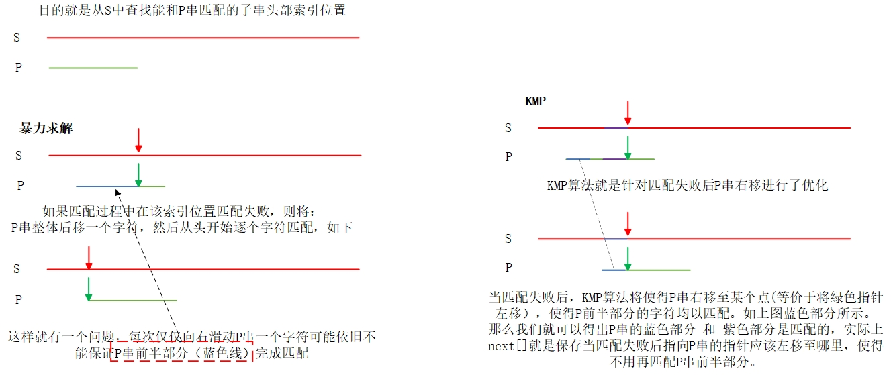
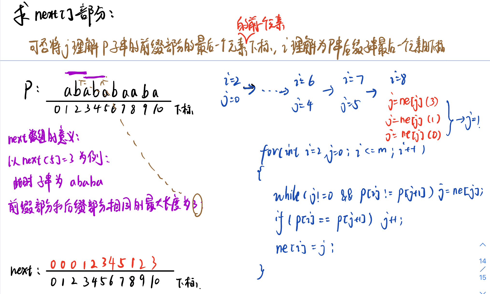
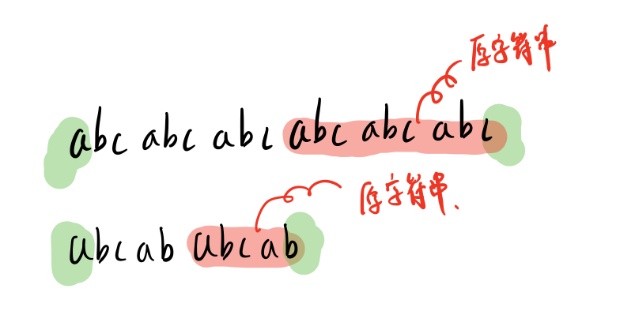

#### KMP 模板

KMP算法主要解决字符串模式匹配问题。

**什么是模式匹配？**

两个字符串，一个模板S（adaaaadaafafgag）和一个P(ad),然后去匹配S与P,获取P在S中相同字符串的首字母检索值。答案有可能不唯一



求next其实就是求P串的最长前缀子串和后缀子串相同的长度，如下图所示：



```java
    /**
     * s串 起始下标从 1 开始，p串起始下标从 1 开始
     * @param s 模式串
     * @param p 匹配串/模板串
     * @return
     */
    public static List<Integer> patternMatching(char [] s,char [] p){
        int n = s.length-1; // n 是 s串的长度，因为s是从1开始的，因此需要-1
        int m = p.length-1; // m 是 p串的长度，因为p是从1开始的，因此需要-1
        int [] ne = new int[m+1];
        List<Integer> ans = new ArrayList<>();
        // 求 next数组 从2开始 因为1显然是0
        for (int i = 2,j = 0;i <= m;i++){
            while (j != 0 && p[i] != p[j+1]) j = ne[j];
            if (p[i] == p[j+1]) j++;
            ne[i] = j;
        }
        // 匹配 从1开始，因为s串的首字符下标为1
        for (int i = 1,j = 0;i <= n;i++){
            while (j != 0 && s[i] != p[j+1]) j = ne[j];
            if (s[i] == p[j+1]) j++;
            if (j == m){
                j = ne[j];
                // 匹配成功后的逻辑
                ans.add(i-m); // 返回的下标是原本真实s从下标0开始的索引
            }
        }
        return ans;
    }
```

给定一个模式串 S，以及一个模板串 P，所有字符串中只包含大小写英文字母以及阿拉伯数字。

模板串 P 在模式串 S 中多次作为子串出现。

求出模板串 P 在模式串 S 中所有出现的位置的起始下标。

**输入格式**

第一行输入整数 N，表示字符串 P 的长度。

第二行输入字符串 P。

第三行输入整数 M，表示字符串 S 的长度。

第四行输入字符串 S。

**输出格式**

共一行，输出所有出现位置的起始下标（下标从 0 开始计数），整数之间用空格隔开。

```java
import java.io.*;
import java.util.*;

public class Main {
    /**
     * s串 起始下标从 1 开始，p串起始下标从 1 开始
     * @param s 模式串
     * @param p 匹配串/模板串
     * @return
     */
    public static List<Integer> patternMatching(char [] s,char [] p){
        int n = s.length-1; // n 是 s串的长度，因为s是从1开始的，因此需要-1
        int m = p.length-1; // m 是 p串的长度，因为p是从1开始的，因此需要-1
        int [] ne = new int[m+1];
        List<Integer> ans = new ArrayList<>();
        // 求 next数组
        for (int i = 2,j = 0;i <= m;i++){
            while (j != 0 && p[i] != p[j+1]) j = ne[j];
            if (p[i] == p[j+1]) j++;
            ne[i] = j;
        }
        // 匹配
        for (int i = 1,j = 0;i <= n;i++){
            while (j != 0 && s[i] != p[j+1]) j = ne[j];
            if (s[i] == p[j+1]) j++;
            if (j == m){
                j = ne[j];
                // 匹配成功后的逻辑
                ans.add(i-m); // 返回的下标是原本真实s从下标0开始的索引
            }
        }
        return ans;
    }
    public static void main(String[] args) throws IOException {
        InputStreamReader in = new InputStreamReader(System.in);
        BufferedReader bf = new BufferedReader(in);
        int lenp = Integer.parseInt(bf.readLine());
        char [] chp = new char[lenp+1];
        String p = bf.readLine();
        for (int i = 1;i <= lenp;i++){
            chp[i] = p.charAt(i-1);
        }
        int lens = Integer.parseInt(bf.readLine());
        String s = bf.readLine();
        char [] chs = new char[lens+1];
        for (int i = 1;i <= lens;i++){
            chs[i] = s.charAt(i-1);
        }
        List<Integer> ans = patternMatching(chs,chp);
        for (int i = 0;i < ans.size();i++){
            System.out.print(ans.get(i) + " ");
        }
    }
}
```


#### 回文子串

给你一个字符串 s ，请你统计并返回这个字符串中 回文子串 的数目。

回文字符串 是正着读和倒过来读一样的字符串。

子字符串 是字符串中的由连续字符组成的一个序列。

具有不同开始位置或结束位置的子串，即使是由相同的字符组成，也会被视作不同的子串。

```
输入：s = "aaa"
输出：6
解释：6个回文子串: "a", "a", "a", "aa", "aa", "aaa"
```

定义$ dp[i][j] $：字符串$ s[i:j] $是否是回文串，可以比较容易的得到如果


$$
f(n) =
\begin{cases} 
true,  & \text{if s[i] == s[j] && (i == j-1  ||  dp[i+1][j-1])} \\
false, & \text{other}
\end{cases}
$$

```java
class Solution {
    public int countSubstrings(String s) {
        char [] chs = s.toCharArray();
        int n = chs.length;
        boolean [][] dp =  new boolean[n][n];
        int cnt = 0;
        for (int i = n-1;i >= 0;i--){
            for (int j = i;j < n;j++){
                if (i == j || (chs[i] == chs[j] && (i == j-1 || dp[i+1][j-1]))){
                    dp[i][j] = true;
                    cnt += 1;
                }
            }
        }
        return cnt;
    }
}
```


#### 重复的子字符串

给定一个非空的字符串 `s` ，检查是否可以通过由它的一个子串重复多次构成。

```
输入: s = "abab"
输出: true
解释: 可由子串 "ab" 重复两次构成。
```

设原字符串 s 可以被写成 s's'...s's'，如果我们移除字符串 s 的前 n' 个字符（即一个完整的 s'），再将这些字符保持顺序添加到剩余字符串的末尾，那么得到的字符串仍然是 s。由于 $ 1 \leq n' < n $，那么如果将两个 s 连在一起，并移除第一个和最后一个字符，那么得到的字符串一定包含 s，即 s 是它的一个子串。



```java
class Solution {
    private boolean kmp(String strs,String strp){
        char [] s = strs.substring(0,strs.length()-1).toCharArray();
        char [] p = (" " + strp).toCharArray();
        int n = s.length - 1;
        int m = p.length - 1;
        int [] ne = new int[m+1];
        for (int i = 2,j = 0;i <= m;i++){
            while (j != 0 && p[i] != p[j+1]) j = ne[j];
            if (p[i] == p[j+1]) j++;
            ne[i] = j;
        }
        for (int i = 1,j = 0;i <= n;i++){
            while (j != 0 && s[i] != p[j+1]) j = ne[j];
            if (s[i] == p[j+1]) j++;
            if (j == m){
                return true;
            }
        }
        return false;
    }
    public boolean repeatedSubstringPattern(String s) {
        return kmp(s+s,s);
    }
}
```


### 其他字符串相关问题

#### 上升下降字符串

给你一个字符串 s ，请你根据下面的算法重新构造字符串：

1. 从 s 中选出 最小 的字符，将它 接在 结果字符串的后面。
2. 从 s 剩余字符中选出 最小 的字符，且该字符比上一个添加的字符大，将它 接在 结果字符串后面。
3. 重复步骤 2 ，直到你没法从 s 中选择字符。
4. 从 s 中选出 最大 的字符，将它 接在 结果字符串的后面。
5. 从 s 剩余字符中选出 最大 的字符，且该字符比上一个添加的字符小，将它 接在 结果字符串后面。
6. 重复步骤 5 ，直到你没法从 s 中选择字符。
7. 重复步骤 1 到 6 ，直到 s 中所有字符都已经被选过。

在任何一步中，如果最小或者最大字符不止一个 ，你可以选择其中任意一个，并将其添加到结果字符串。

请你返回将 s 中字符重新排序后的 结果字符串 。

```
输入：s = "aaaabbbbcccc"
输出："abccbaabccba"
解释：第一轮的步骤 1，2，3 后，结果字符串为 result = "abc"
第一轮的步骤 4，5，6 后，结果字符串为 result = "abccba"
第一轮结束，现在 s = "aabbcc" ，我们再次回到步骤 1
第二轮的步骤 1，2，3 后，结果字符串为 result = "abccbaabc"
第二轮的步骤 4，5，6 后，结果字符串为 result = "abccbaabccba"
```

方法1：回家等通知法——暴力法 时间复杂度$O(n^2)$ 空间复杂度$O(1)$

方法2：桶计数 时间复杂度$O(n)$ 空间复杂度$O(1)$

创建一个大小为 26 的桶，记录每种字符的数量。每次提取最长的上升或下降字符串时，我们直接顺序或逆序遍历这个桶。

```java
class Solution {
    public String sortString(String s) {
        int [] cnt = new int[26];
        int n = s.length();
        for (int i = 0;i < n;i++){
            cnt[s.charAt(i) - 'a'] += 1;
        }
        StringBuilder sb = new StringBuilder();
        while (true){
            for (int i = 0;i < 26;i++){
                if (cnt[i] > 0){
                    sb.append((char)('a' + i));
                    cnt[i] -= 1;
                }
            }
            if (sb.length() == s.length()){
                break;
            }
            for (int i = 25;i >= 0;i--){
                if (cnt[i] > 0){
                    sb.append((char)('a' + i));
                    cnt[i] -= 1;
                }
            }
            if (sb.length() == s.length()){
                break;
            }
        }
        return sb.toString();
    }
}
```


#### 每个元音包含偶数次的最长子字符串

给你一个字符串 `s` ，请你返回满足以下条件的最长子字符串的长度：每个元音字母，即 'a'，'e'，'i'，'o'，'u' ，在子字符串中都恰好出现了偶数次。

```
输入：s = "eleetminicoworoep"
输出：13
解释：最长子字符串是 "leetminicowor" ，它包含 e，i，o 各 2 个，以及 0 个 a，u 。
```

**题目解析**：

**暴力法**：

- 枚举所有子串
  - 遍历字串的所有字符
  - 统计元音字母出现的个数
  - 符合条件，更新答案

**前缀和 + 状态压缩**：

上述统计某个子串中元音字母出现的个数 等价于 统计 某个区间内元音字母出现的个数

> 统计 某个区间内元音字母出现的个数 我们可以用前缀和来优化
>
> 定义 `pre[i][j]`：表示前 i 个字符中 元音字符 j 的个数 时间复杂度O(1)
>
> 由于 奇数 +/- 奇数 = 偶数 偶数 +/- 偶数 = 偶数，因此我们可以用状态来替换次数

状态压缩：由于只考虑每个元音奇偶次数，因此考虑用二进制来记录

- 定义特征，`aeiou` 分别对应二进制 `00001，00010，00100，01000，10000`
- 其中 0 表示对应元音出现了偶数次数，1 表示奇数

> 如果子串 [0, i] 与字串 [0, j] 状态相同，那么字串 [i+1,j] 的状态一定是 0，因此可以记录每个状态第一次出现的位置，此后再出现该状态时相减即可
>

```java
class Solution {
    public int findTheLongestSubstring(String s) {
        int n = s.length();
        int [] pre = new int[1 << 5];
        Arrays.fill(pre,-1);
        pre[0] = 0; // ?
        int status = 0; // 记录此时的状态
        int ans = 0;
        for (int i = 0;i < n;i++){
            char ch = s.charAt(i);
            // 更新状态
            if (ch == 'a'){
                status ^= (1 << 0);
            }else if (ch == 'e'){
                status ^= (1 << 1);
            }else if (ch == 'i'){
                status ^= (1 << 2);
            }else if (ch == 'o'){
                status ^= (1 << 3);
            }else if (ch == 'u'){
                status ^= (1 << 4);
            }
            // 如果之前遇到当前状态了，更新答案
            if (pre[status] >= 0){
                ans = Math.max(ans,i+1 - pre[status]);
            }else{ // 记录第一次出现该状态的位置
                pre[status] = i+1;
            }
        }
        return ans;
    }
}
```


 


**字符串字典序排序**：

c++ 自带`sort()`函数

```cpp
//cpp
bool cmp(string a,string b){
    return a < b;
}

vector<string> strs(n);
sort(strs.begin(),strs.end(),cmp);
```

c语言 `strcmp()`函数

```c
void SortStrs(char ** strs,int n){
    char tmp[100] = {0};
    //对n个数据进行n-1次排序，每次冒泡出当前最大的
    for(int i = 1;i < n;i++){
        for(int j = 0;j < n - i;j++){
            if(strcmp(strs[j],strs[j+1]) > 0){
                strcpy(tmp,strs[j]);
                strcpy(strs[j],strs[j+1]);
                strcpy(strs[j+1],tmp);
            }
        }
    }
}
```


---

**STL string常用方法**：

```cpp
//获取字符串长度
str.size() 和 str.length()
//字符串替换
str.replace(ind,len,data); //将str从ind起始位置的len长度字符替换为data
```

