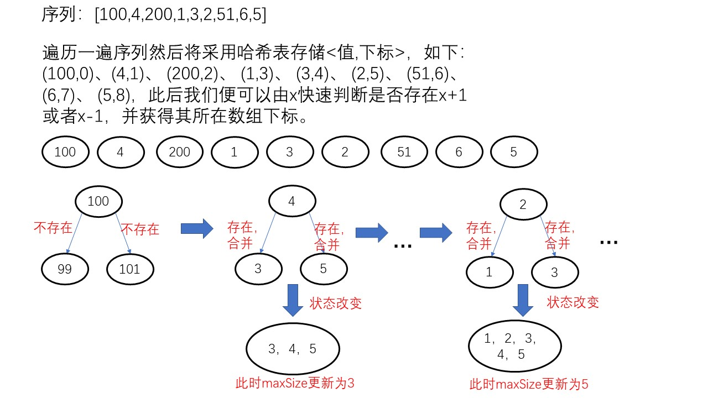

# 并查集

在一些应用问题中，需要将n个不同的元素划分成一些不相交的集合。开始时，每个元素自成一个单元素集合，然后按一定的规律将归于同一组元素的集合合并。在此过程中要反复用到查询某一个元素归属于那个集合的运算。

先简单了解下并查集及其操作：

在使用并查集时常常用到了数组，我们设数组`s[i]`表示元素i所属的集合，开始时每个元素的所属集合都是自己。具体见下图


有时候，对元素进行合并后可能最终成为一个`链表`，比如`1->2->3->4->5`，造成性能退化，可以采用路径压缩的方法


具体实现代码如下：

> 注：已加注释

**基本操作**：

```cpp
//并查集类
class UnionFind
{
private:
    vector<int> parent; //就是图中的s[i]
    vector<int> rank;   //可以理解为每个集合的深度，合并的时候把深度低的合并到深度高的
    int count;//连通分量个数——也就是集合的个数
public:
    UnionFind(int n);
    ~UnionFind();
    //查找x的父亲
    int Find(int x){
    	//查找时进行路径压缩
        return parent[x] == x ? x : parent[x] = Find(parent[x]);
    }
    //将 x和y 合并
    bool Union(int x,int y){
        //查找父亲
        int rx = Find(x);
        int ry = Find(y);
        if (rx == ry)
        {//父亲相同说明同一个集合
            return false;
        }
        //如果深度相同，将rx 加入 ry
        if (rank[rx] == rank[ry])
        {
            parent[rx] = ry;
            rank[ry]++;
        }else if (rank[rx] < rank[ry])
        {//否则哪个深度小，就挂在对方集合中
            parent[rx] = ry;
        }else
        {
            parent[ry] = rx;
        }
		//连通数量减一
        count --;
        return true;
    }
    int getCount(void){
        return count;
    }
};

UnionFind::UnionFind(int n)
{
    parent.resize(n);
    rank.resize(n,1);
    for (int i = 0; i < n; i++)
    {
        //初始化每个元素的集合为其本身
        parent[i] = i;
    }
    count = n;
}

UnionFind::~UnionFind()
{
}
```

#### 示例-最长连续序列

```
给定一个未排序的整数数组 nums ，找出数字连续的最长序列（不要求序列元素在原数组中连续）的长度。
进阶：你可以设计并实现时间复杂度为 O(n) 的解决方案吗？

示例 1：
输入：nums = [100,4,200,1,3,2]
输出：4
解释：最长数字连续序列是 [1, 2, 3, 4]。它的长度为 4。
```



```cpp
class Unionfind {
    private:
    vector<int> parent;
    vector<int> rank;
    int count;//联通数
    int maxSize;//联通集合中的最大数量
    public:
    int Find(int x){
        return parent[x] == x ? x : parent[x] = Find(parent[x]);
    }
    bool Union(int x,int y){
        int rx = Find(x);
        int ry = Find(y);
        if(rx == ry) return false;
        if(rank[rx] <= rank[ry]){
            //加入ry
            parent[rx] = ry;
        }else{
            //加入rx
            parent[ry] = rx;
        }
        //更新集群内部数量
        rank[rx] += rank[ry];
        rank[ry] = rank[rx];
        //更新最大集群数
        maxSize = max(maxSize,rank[ry]);
        return true;
    }
    int Count(void){
        return count;
    }
    int getmaxSize(void){
        return maxSize;
    }
    Unionfind(int n){
        parent.resize(n);
        rank.resize(n,1);
        for(int i = 0;i < n;i++){
            parent[i] = i;
        }
        count = n;
        maxSize = 1;
    }
};

class Solution {
public:
    int longestConsecutive(vector<int>& nums) {
        int len = nums.size();
        if(len <= 1) return len;
        map<int,int> m;//值:下标
        for(int i = 0;i < len;i++){
            if(m.find(nums[i]) == m.end()){
                m.insert(make_pair(nums[i],i));
            }
        }
        Unionfind myUnion(len);
        for(int i = 0;i < len;i++){
            //找nums[i]-1
            if(m.find(nums[i]-1) != m.end()){
                myUnion.Union(m[nums[i]],m[nums[i]-1]);
            }
            //找nums[i]+1
            if(m.find(nums[i]+1) != m.end()){
                myUnion.Union(m[nums[i]],m[nums[i]+1]);
            }
        }
        return myUnion.getmaxSize();
    }
};
```

#### 示例-被围绕的区域

```
给你一个 m x n 的矩阵 board ，由若干字符 'X' 和 'O' ，找到所有被 'X' 围绕的区域，并将这些区域里所有的 'O' 用 'X' 填充。

输入：board = [["X","X","X","X"],["X","O","O","X"],["X","X","O","X"],["X","O","X","X"]]
输出：[["X","X","X","X"],["X","X","X","X"],["X","X","X","X"],["X","O","X","X"]]
解释：被围绕的区间不会存在于边界上，换句话说，任何边界上的 'O' 都不会被填充为 'X'。 任何不在边界上，或不与边界上的 'O' 相连的 'O' 最终都会被填充为 'X'。如果两个元素在水平或垂直方向相邻，则称它们是“相连”的。s
```


> 这道题采用DFS、BFS均可解决，本次采用并查集的方法解决

```cpp
//并查集 类
class Unionfind{
private:
    vector<int> parent;
public:
    //查找父亲
    int Find(int x){
        //查找过程进行路径压缩
        return parent[x] == x ? x : parent[x] = Find(parent[x]);
    }
    //合并
    bool Union(int x,int y){
        int rx = Find(x);
        int ry = Find(y);
        if(rx == ry) return false;
        if(rx == 0){
            parent[ry] = rx;
        }else{
            parent[rx] = ry;
        }
        return true;
    }
    Unionfind(int n){
        parent.resize(n);
        for(int i = 0; i < n;i++){
            parent[i] = i;
        }
    }
};
class Solution {
public:
    int n,m;
    int dirs[4][2] = {-1,0,1,0,0,-1,0,1};
    //得到(i,j)的索引
    int getIndex(int x,int y){
        return x * m + y + 1;//为什么+1 ？ 我们将0结点作为一个虚拟结点，所有与虚拟结点相连的均是没有被X围绕的O
    }
    void solve(vector<vector<char>>& board){
        n = board.size();
        m = board[0].size();
        Unionfind myUnion(n * m + 1);
        //首先遍历board 四周，将四周的O与虚拟结点合并
        for(int i = 0;i < m;i++){
            if(board[0][i] == 'O')
                myUnion.Union(getIndex(0,i),0);
            if(board[n-1][i] == 'O')
                myUnion.Union(getIndex(n-1,i),0);
        }
        for(int i = 1;i < n-1;i++){
            if(board[i][0] == 'O')
                myUnion.Union(getIndex(i,0),0);
            if(board[i][m-1] == 'O')
                myUnion.Union(getIndex(i,m-1),0);
        }
        //遍历内部区域，当遇到O时判断其周围是否有“与虚拟结点相连”的结点，如果有的话，那么该O也是不被围绕的，将其并入
        for(int i = 1;i < n - 1;i++){
            for(int j = 1;j < m - 1;j++){
                if(board[i][j] == 'O'){
                    for(int k = 0;k < 4;k++){
                        int nx = i + dirs[k][0];
                        int ny = j + dirs[k][1];
                        if(board[nx][ny] == 'O'){
                            myUnion.Union(getIndex(i,j),getIndex(nx,ny));
                        }
                    }
                }
            }
        }
        for(int i = 0;i < n;i++){
            for(int j = 0;j < m;j++){
                if(board[i][j] == 'O'){
                    if(myUnion.Find(getIndex(i,j)) != 0){
                        board[i][j] = 'X';
                    } 
                }
                
            }
        }
    }
};
```

