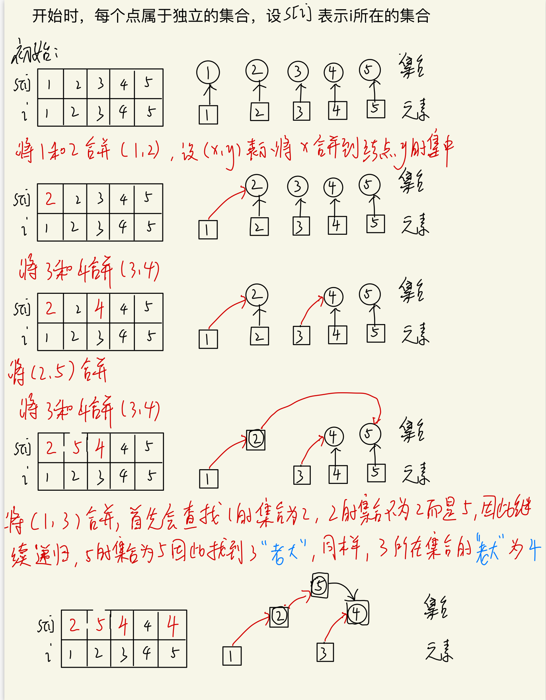
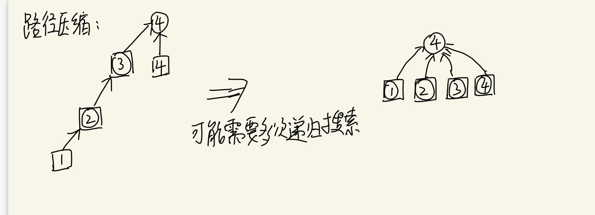
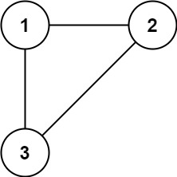

# 并查集

在一些应用问题中，需要将n个不同的元素划分成一些不相交的集合。开始时，每个元素自成一个单元素集合，然后按一定的规律将归于同一组元素的集合合并。在此过程中要反复用到查询某一个元素归属于那个集合的运算。

先简单了解下并查集及其操作：

在使用并查集时常常用到了数组，我们设数组`s[i]`表示元素i所属的集合，开始时每个元素的所属集合都是自己。具体见下图。



有时候，对元素进行合并后可能最终成为一个`链表`，比如`1->2->3->4->5`，造成性能退化，可以采用路径压缩的方法



具体实现代码如下：

> 注：已加注释

**适用场景**：

- 将两个集合合并
- 询问两个元素是否在一个集合当中

**实现方式1**：

```cpp
//并查集类
class UnionFind
{
private:
    vector<int> parent; //就是图中的s[i]
    vector<int> rank;   //可以理解为每个集合的深度，合并的时候把深度低的合并到深度高的
     					// 也可以作为每个集合中结点的个数
    int count;//连通分量个数——也就是集合的个数
public:
    UnionFind(int n);
    ~UnionFind();
    //查找x的父亲
    int Find(int x){
    	//查找时进行路径压缩
        return parent[x] == x ? x : parent[x] = Find(parent[x]);
    }
    //将 x和y 合并
    bool Union(int x,int y){
        //查找父亲
        int rx = Find(x);
        int ry = Find(y);
        if (rx == ry)
        {//父亲相同说明同一个集合
            return false;
        }
        //如果深度相同，将rx 加入 ry
        if (rank[rx] == rank[ry])
        {
            parent[rx] = ry;
            rank[ry]++;
        }else if (rank[rx] < rank[ry])
        {//否则哪个深度小，就挂在对方集合中
            parent[rx] = ry;
        }else
        {
            parent[ry] = rx;
        }
		//连通数量减一
        count --;
        return true;
    }
    int getCount(void){
        return count;
    }
};

UnionFind::UnionFind(int n)
{
    parent.resize(n);
    rank.resize(n,1);
    for (int i = 0; i < n; i++)
    {
        //初始化每个元素的集合为其本身
        parent[i] = i;
    }
    count = n;
}

UnionFind::~UnionFind()
{
}
```

可见，其基本原理就是：每个集合用一棵树来表示。树根的编号就是整个集合的编号。每个结点存储它的父节点，p[x]表示x的父节点

树根的判断：`if(p[x] == x)`

如何求x的集合编号：`while(p[x] != x) x = p[x];`

如何合并两个集合：`p[x] = y;`

**实现方式2**：

```java
class UnionFind{
    int [] p;
    UnionFind(int N){
        p = new int[N];
    }

    /**
     * 返回 x 的祖宗结点
     * @param x
     * @return
     */
    public int find(int x){
        if (p[x] != x) p[x] = find(p[x]); //路径压缩
        return  p[x];
    }

    /**
     * 合并两个集合，并返回该集合的编号
     * @param x
     * @param y
     * @return
     */
    public int union(int x,int y){
        int px = find(x);
        int py = find(y);
        if (px == py){
            return py;
        }
        p[px] = py;
        return py; // 返回集合的标号
    }

    /**
     * 判断两个结点是否属于同一个集合
     * @param x
     * @param y
     * @return
     */
    public boolean isSameUnion(int x,int y){
        return find(x) == find(y);
    }
}
```

> 注：有关并查集的题目常常需要维护一些额外的信息，比如：每个集合的结点数、每个结点距离根节点的距离等等


#### 示例-最长连续序列

```
给定一个未排序的整数数组 nums ，找出数字连续的最长序列（不要求序列元素在原数组中连续）的长度。
进阶：你可以设计并实现时间复杂度为 O(n) 的解决方案吗？

示例 1：
输入：nums = [100,4,200,1,3,2]
输出：4
解释：最长数字连续序列是 [1, 2, 3, 4]。它的长度为 4。
```


```cpp
class Unionfind {
    private:
    vector<int> parent;
    vector<int> rank;
    int count;//联通数
    int maxSize;//联通集合中的最大数量
    public:
    int Find(int x){
        return parent[x] == x ? x : parent[x] = Find(parent[x]);
    }
    bool Union(int x,int y){
        int rx = Find(x);
        int ry = Find(y);
        if(rx == ry) return false;
        if(rank[rx] <= rank[ry]){
            //加入ry
            parent[rx] = ry;
        }else{
            //加入rx
            parent[ry] = rx;
        }
        //更新集群内部数量
        rank[rx] += rank[ry];
        rank[ry] = rank[rx];
        //更新最大集群数
        maxSize = max(maxSize,rank[ry]);
        return true;
    }
    int Count(void){
        return count;
    }
    int getmaxSize(void){
        return maxSize;
    }
    Unionfind(int n){
        parent.resize(n);
        rank.resize(n,1);
        for(int i = 0;i < n;i++){
            parent[i] = i;
        }
        count = n;
        maxSize = 1;
    }
};

class Solution {
public:
    int longestConsecutive(vector<int>& nums) {
        int len = nums.size();
        if(len <= 1) return len;
        map<int,int> m;//值:下标
        for(int i = 0;i < len;i++){
            if(m.find(nums[i]) == m.end()){
                m.insert(make_pair(nums[i],i));
            }
        }
        Unionfind myUnion(len);
        for(int i = 0;i < len;i++){
            //找nums[i]-1
            if(m.find(nums[i]-1) != m.end()){
                myUnion.Union(m[nums[i]],m[nums[i]-1]);
            }
            //找nums[i]+1
            if(m.find(nums[i]+1) != m.end()){
                myUnion.Union(m[nums[i]],m[nums[i]+1]);
            }
        }
        return myUnion.getmaxSize();
    }
};
```

#### 示例-被围绕的区域

```
给你一个 m x n 的矩阵 board ，由若干字符 'X' 和 'O' ，找到所有被 'X' 围绕的区域，并将这些区域里所有的 'O' 用 'X' 填充。

输入：board = [["X","X","X","X"],["X","O","O","X"],["X","X","O","X"],["X","O","X","X"]]
输出：[["X","X","X","X"],["X","X","X","X"],["X","X","X","X"],["X","O","X","X"]]
解释：被围绕的区间不会存在于边界上，换句话说，任何边界上的 'O' 都不会被填充为 'X'。 任何不在边界上，或不与边界上的 'O' 相连的 'O' 最终都会被填充为 'X'。如果两个元素在水平或垂直方向相邻，则称它们是“相连”的。s
```


> 这道题采用DFS、BFS均可解决，本次采用并查集的方法解决

```cpp
//并查集 类 cpp
class Unionfind{
private:
    vector<int> parent;
public:
    //查找父亲
    int Find(int x){
        //查找过程进行路径压缩
        return parent[x] == x ? x : parent[x] = Find(parent[x]);
    }
    //合并
    bool Union(int x,int y){
        int rx = Find(x);
        int ry = Find(y);
        if(rx == ry) return false;
        if(rx == 0){
            parent[ry] = rx;
        }else{
            parent[rx] = ry;
        }
        return true;
    }
    Unionfind(int n){
        parent.resize(n);
        for(int i = 0; i < n;i++){
            parent[i] = i;
        }
    }
};
class Solution {
public:
    int n,m;
    int dirs[4][2] = {-1,0,1,0,0,-1,0,1};
    //得到(i,j)的索引
    int getIndex(int x,int y){
        return x * m + y + 1;//为什么+1 ？ 我们将0结点作为一个虚拟结点，所有与虚拟结点相连的均是没有被X围绕的O
    }
    void solve(vector<vector<char>>& board){
        n = board.size();
        m = board[0].size();
        Unionfind myUnion(n * m + 1);
        //首先遍历board 四周，将四周的O与虚拟结点合并
        for(int i = 0;i < m;i++){
            if(board[0][i] == 'O')
                myUnion.Union(getIndex(0,i),0);
            if(board[n-1][i] == 'O')
                myUnion.Union(getIndex(n-1,i),0);
        }
        for(int i = 1;i < n-1;i++){
            if(board[i][0] == 'O')
                myUnion.Union(getIndex(i,0),0);
            if(board[i][m-1] == 'O')
                myUnion.Union(getIndex(i,m-1),0);
        }
        //遍历内部区域，当遇到O时判断其周围是否有“与虚拟结点相连”的结点，如果有的话，那么该O也是不被围绕的，将其并入
        for(int i = 1;i < n - 1;i++){
            for(int j = 1;j < m - 1;j++){
                if(board[i][j] == 'O'){
                    for(int k = 0;k < 4;k++){
                        int nx = i + dirs[k][0];
                        int ny = j + dirs[k][1];
                        if(board[nx][ny] == 'O'){
                            myUnion.Union(getIndex(i,j),getIndex(nx,ny));
                        }
                    }
                }
            }
        }
        for(int i = 0;i < n;i++){
            for(int j = 0;j < m;j++){
                if(board[i][j] == 'O'){
                    if(myUnion.Find(getIndex(i,j)) != 0){
                        board[i][j] = 'X';
                    } 
                }
                
            }
        }
    }
};
```


#### 示例-冗余连接

树可以看成是一个连通且 **无环** 的 **无向** 图。

给定往一棵 `n` 个节点 (节点值 `1～n`) 的树中添加一条边后的图。添加的边的两个顶点包含在 `1` 到 `n` 中间，且这条附加的边不属于树中已存在的边。图的信息记录于长度为 `n` 的二维数组 `edges` ，`edges[i] = [ai, bi]` 表示图中在 `ai` 和 `bi` 之间存在一条边。

请找出一条可以删去的边，删除后可使得剩余部分是一个有着 `n` 个节点的树。如果有多个答案，则返回数组 `edges` 中最后出现的边。



```
输入: edges = [[1,2], [1,3], [2,3]]
输出: [2,3]
```

在一棵树中，边的数量比节点的数量少 11。如果一棵树有 nn 个节点，则这棵树有 n-1n−1 条边。这道题中的图在树的基础上多了一条附加的边，因此边的数量也是 nn。

树是一个连通且无环的无向图，在树中多了一条附加的边之后就会出现环，因此附加的边即为导致环出现的边。

可以通过并查集寻找附加的边。初始时，每个节点都属于不同的连通分量。遍历每一条边，判断这条边连接的两个顶点是否属于相同的连通分量。

- 如果两个顶点属于不同的连通分量，则说明在遍历到当前的边之前，这两个顶点之间不连通，因此当前的边不会导致环出现，合并这两个顶点的连通分量。
- 如果两个顶点属于相同的连通分量，则说明在遍历到当前的边之前，这两个顶点之间已经连通，因此当前的边导致环出现，为附加的边，将当前的边作为答案返回。

```java
class UnionFind{
    public int [] parent;
    public int [] rank;
    UnionFind(int n){
        parent = new int[n+1];
        rank = new int[n+1];
        for (int i = 0;i <= n;i++){
            parent[i] = i;
            rank[i] = 1;
        }
    }
    public boolean union(int x,int y){
        int px = find(x);
        int py = find(y);
        if (px == py) return false;
        if (rank[px] == rank[py]){
            parent[px] = py;
            rank[py] += 1;
        }else if (rank[px] < rank[py]){
            parent[px] = py;
        }else{
            parent[py] = px;
        }
        return true;
    }
    public int find(int x){
        return parent[x] == x ? x : (parent[x] = find(parent[x]));
    }
}

class Solution {
    public int[] findRedundantConnection(int[][] edges) {
        int n = edges.length;
        UnionFind uf = new UnionFind(n);
        for (int i = 0;i < edges.length;i++){
            int x = edges[i][0];
            int y = edges[i][1];
            if (uf.union(x,y) == false){
                return new int[]{x,y};
            }
        }
        return null;
    }
}
```


#### 示例-最长连续序列

给定一个未排序的整数数组 `nums` ，找出数字连续的最长序列（不要求序列元素在原数组中连续）的长度。

```
输入：nums = [100,4,200,1,3,2]
输出：4
解释：最长数字连续序列是 [1, 2, 3, 4]。它的长度为 4。
```

```java
class UnionFind{
    public Map<Integer,Integer> parent ;
    public Map<Integer,Integer> rank ; //集合中元素的个数
    UnionFind(int n){
        parent = new HashMap<>();
        rank = new HashMap<>();
    }
    public void add(int x){
        if (parent.get(x) != null) return ;
        parent.put(x,x);
        rank.put(x,1);
    }
    public boolean union(int x,int y){
        int px = find(x);
        int py = find(y);
        if (px == py) return false;
        if (rank.get(px) <= rank.get(py)){
            parent.put(px,py);
            rank.put(py,rank.get(px) + rank.get(py));
        }else{
            parent.put(py,px);
            rank.put(px,rank.get(px) + rank.get(py));
        }
        return true;
    }
    public int find(int x){
        int val = 0;
        if (parent.get(x) == x){
            val = x;
        }else{
            val = find(parent.get(x));
        }
        return val;
    }
}

public class Solution {
    public int longestConsecutive(int[] nums) {
        if (nums.length == 0) return 0;
        UnionFind uf = new UnionFind(100005);
        for (int num:nums){
            uf.add(num);
        }
        int ans = Integer.MIN_VALUE;
        for (int i = 0;i < nums.length;i++){
            if (uf.parent.get(nums[i]-1) != null){
                uf.union(nums[i]-1,nums[i]);
            }
            if (uf.parent.get(nums[i]+1) != null){
                uf.union(nums[i]+1,nums[i]);
            }
            ans = Math.max(ans,uf.rank.get(uf.find(nums[i])));
        }
        return ans;
    }
}
```


#### 示例-相似的字符串

如果交换字符串 X 中的两个不同位置的字母，使得它和字符串 Y 相等，那么称 X 和 Y 两个字符串相似。如果这两个字符串本身是相等的，那它们也是相似的。

例如，"tars" 和 "rats" 是相似的 (交换 0 与 2 的位置)； "rats" 和 "arts" 也是相似的，但是 "star" 不与 "tars"，"rats"，或 "arts" 相似。

总之，它们通过相似性形成了两个关联组：{"tars", "rats", "arts"} 和 {"star"}。注意，"tars" 和 "arts" 是在同一组中，即使它们并不相似。形式上，对每个组而言，要确定一个单词在组中，只需要这个词和该组中至少一个单词相似。

给定一个字符串列表 strs。列表中的每个字符串都是 strs 中其它所有字符串的一个 字母异位词 。请问 strs 中有多少个相似字符串组？

字母异位词（anagram），一种把某个字符串的字母的位置（顺序）加以改换所形成的新词。

```java
class UnionFind{
    public int[] parent ;
    public int[] rank ; //集合中元素的个数
    int count; // 集合的数量
    UnionFind(int n){
        parent = new int[n];
        rank = new int[n];
        for (int i = 0;i < n;i++){
            parent[i] = i;
            rank[i] = 1;
        }
        count = n;
    }

    public boolean union(int x,int y){
        int px = find(x);
        int py = find(y);
        if (px == py) return false;
        if (rank[px] == rank[py]){
            parent[px] = py;
            rank[py] += 1;
        }else if(rank[px] < rank[py]){
            parent[px] = py;
        }else{
            parent[py] = px;
        }
        count -= 1;
        return true;
    }
    public int find(int x){
        return parent[x] == x ? x : (parent[x] = find(parent[x]));
    }
}

public class Solution {
    public boolean compare(String s1,String s2){
        int cnt = 0;
        int id1 = -1,id2 = -1;
        for (int i = 0;i < s1.length();i++){
            if (s1.charAt(i) != s2.charAt(i)){
                cnt += 1;
                if (cnt == 1){
                    id1 = i;
                }else if (cnt == 2){
                    id2 = i;
                }
            }
            if (cnt > 2) return false;
        }
        if(cnt == 0) return true;
        if(cnt != 2) return false;
        return s1.charAt(id1) == s2.charAt(id2) && s1.charAt(id2) == s2.charAt(id1);
    }
    public int numSimilarGroups(String[] strs) {
        int n = strs.length;
        UnionFind uf = new UnionFind(n);

        for (int i = 0;i < strs.length;i++){
            for (int j = 0;j < strs.length;j++){
                if (i == j) continue;
                if (compare(strs[i],strs[j])){
                    uf.union(i,j);
                }
            }
        }
        return uf.count;
    }
}
```


#### 示例-食物链