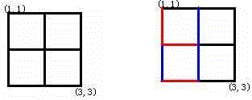
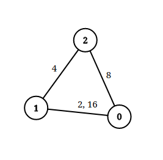

# 并查集

在一些应用问题中，需要将n个不同的元素划分成一些不相交的集合。开始时，每个元素自成一个单元素集合，然后按一定的规律将归于同一组元素的集合合并。在此过程中要反复用到查询某一个元素归属于那个集合的运算。

先简单了解下并查集及其操作：

在使用并查集时常常用到了数组，我们设数组`s[i]`表示元素i所属的集合，开始时每个元素的所属集合都是自己。具体见下图。


有时候，对元素进行合并后可能最终成为一个`链表`，比如`1->2->3->4->5`，造成性能退化，可以采用路径压缩的方法,使得 查询 和合并操作的时间复杂度为 $O(\log n)$


具体实现代码如下：

> 注：已加注释

**适用场景**：

- 将两个集合合并
- 询问两个元素是否在一个集合当中

**实现方式1**：

```cpp
//并查集类
class UnionFind
{
private:
    vector<int> parent; //就是图中的s[i]
    vector<int> rank;   //可以理解为每个集合的深度，合并的时候把深度低的合并到深度高的
     					// 也可以作为每个集合中结点的个数
    int count;//连通分量个数——也就是集合的个数
public:
    UnionFind(int n);
    ~UnionFind();
    //查找x的父亲
    int Find(int x){
    	//查找时进行路径压缩
        return parent[x] == x ? x : parent[x] = Find(parent[x]);
    }
    //将 x和y 合并
    bool Union(int x,int y){
        //查找父亲
        int rx = Find(x);
        int ry = Find(y);
        if (rx == ry)
        {//父亲相同说明同一个集合
            return false;
        }
        //如果深度相同，将rx 加入 ry
        if (rank[rx] == rank[ry])
        {
            parent[rx] = ry;
            rank[ry]++;
        }else if (rank[rx] < rank[ry])
        {//否则哪个深度小，就挂在对方集合中
            parent[rx] = ry;
        }else{
            parent[ry] = rx;
        }
		//连通数量减一
        count --;
        return true;
    }
    int getCount(void){
        return count;
    }
};

UnionFind::UnionFind(int n)
{
    parent.resize(n);
    rank.resize(n,1);
    for (int i = 0; i < n; i++)
    {
        //初始化每个元素的集合为其本身
        parent[i] = i;
    }
    count = n;
}

UnionFind::~UnionFind()
{
}
```

可见，其基本原理就是：每个集合用一棵树来表示。树根的编号就是整个集合的编号。每个结点存储它的父节点，p[x]表示x的父节点

树根的判断：`if(p[x] == x)`

如何求x的集合编号：`while(p[x] != x) x = p[x];`

如何合并两个集合：`p[x] = y;`

**实现方式2**：

```java
class UnionFind{
    int [] p;
    UnionFind(int N){
        p = new int[N];
    }

    /**
     * 返回 x 的祖宗结点
     * @param x
     * @return
     */
    public int find(int x){
        if (p[x] != x) p[x] = find(p[x]); //路径压缩
        return  p[x];
    }

    /**
     * 合并两个集合，并返回该集合的编号
     * @param x
     * @param y
     * @return
     */
    public int union(int x,int y){
        int px = find(x);
        int py = find(y);
        if (px == py){
            return py;
        }
        p[px] = py;
        return py; // 返回集合的标号
    }

    /**
     * 判断两个结点是否属于同一个集合
     * @param x
     * @param y
     * @return
     */
    public boolean isSameUnion(int x,int y){
        return find(x) == find(y);
    }
}
```

> 注：有关并查集的题目常常需要维护一些额外的信息，比如：每个集合的结点数、每个结点距离根节点的距离等等


#### 示例-最长连续序列

```
给定一个未排序的整数数组 nums ，找出数字连续的最长序列（不要求序列元素在原数组中连续）的长度。
进阶：你可以设计并实现时间复杂度为 O(n) 的解决方案吗？

示例 1：
输入：nums = [100,4,200,1,3,2]
输出：4
解释：最长数字连续序列是 [1, 2, 3, 4]。它的长度为 4。
```


```cpp
class Unionfind {
    private:
    vector<int> parent;
    vector<int> rank;
    int count;//联通数
    int maxSize;//联通集合中的最大数量
    public:
    int Find(int x){
        return parent[x] == x ? x : parent[x] = Find(parent[x]);
    }
    bool Union(int x,int y){
        int rx = Find(x);
        int ry = Find(y);
        if(rx == ry) return false;
        if(rank[rx] <= rank[ry]){
            //加入ry
            parent[rx] = ry;
        }else{
            //加入rx
            parent[ry] = rx;
        }
        //更新集群内部数量
        rank[rx] += rank[ry];
        rank[ry] = rank[rx];
        //更新最大集群数
        maxSize = max(maxSize,rank[ry]);
        return true;
    }
    int Count(void){
        return count;
    }
    int getmaxSize(void){
        return maxSize;
    }
    Unionfind(int n){
        parent.resize(n);
        rank.resize(n,1);
        for(int i = 0;i < n;i++){
            parent[i] = i;
        }
        count = n;
        maxSize = 1;
    }
};

class Solution {
public:
    int longestConsecutive(vector<int>& nums) {
        int len = nums.size();
        if(len <= 1) return len;
        map<int,int> m;//值:下标
        for(int i = 0;i < len;i++){
            if(m.find(nums[i]) == m.end()){
                m.insert(make_pair(nums[i],i));
            }
        }
        Unionfind myUnion(len);
        for(int i = 0;i < len;i++){
            //找nums[i]-1
            if(m.find(nums[i]-1) != m.end()){
                myUnion.Union(m[nums[i]],m[nums[i]-1]);
            }
            //找nums[i]+1
            if(m.find(nums[i]+1) != m.end()){
                myUnion.Union(m[nums[i]],m[nums[i]+1]);
            }
        }
        return myUnion.getmaxSize();
    }
};
```

#### 示例-被围绕的区域

```
给你一个 m x n 的矩阵 board ，由若干字符 'X' 和 'O' ，找到所有被 'X' 围绕的区域，并将这些区域里所有的 'O' 用 'X' 填充。

输入：board = [["X","X","X","X"],["X","O","O","X"],["X","X","O","X"],["X","O","X","X"]]
输出：[["X","X","X","X"],["X","X","X","X"],["X","X","X","X"],["X","O","X","X"]]
解释：被围绕的区间不会存在于边界上，换句话说，任何边界上的 'O' 都不会被填充为 'X'。 任何不在边界上，或不与边界上的 'O' 相连的 'O' 最终都会被填充为 'X'。如果两个元素在水平或垂直方向相邻，则称它们是“相连”的。s
```


> 这道题采用DFS、BFS均可解决，本次采用并查集的方法解决

```cpp
//并查集 类 cpp
class Unionfind{
private:
    vector<int> parent;
public:
    //查找父亲
    int Find(int x){
        //查找过程进行路径压缩
        return parent[x] == x ? x : parent[x] = Find(parent[x]);
    }
    //合并
    bool Union(int x,int y){
        int rx = Find(x);
        int ry = Find(y);
        if(rx == ry) return false;
        if(rx == 0){
            parent[ry] = rx;
        }else{
            parent[rx] = ry;
        }
        return true;
    }
    Unionfind(int n){
        parent.resize(n);
        for(int i = 0; i < n;i++){
            parent[i] = i;
        }
    }
};
class Solution {
public:
    int n,m;
    int dirs[4][2] = {-1,0,1,0,0,-1,0,1};
    //得到(i,j)的索引
    int getIndex(int x,int y){
        return x * m + y + 1;//为什么+1 ？ 我们将0结点作为一个虚拟结点，所有与虚拟结点相连的均是没有被X围绕的O
    }
    void solve(vector<vector<char>>& board){
        n = board.size();
        m = board[0].size();
        Unionfind myUnion(n * m + 1);
        //首先遍历board 四周，将四周的O与虚拟结点合并
        for(int i = 0;i < m;i++){
            if(board[0][i] == 'O')
                myUnion.Union(getIndex(0,i),0);
            if(board[n-1][i] == 'O')
                myUnion.Union(getIndex(n-1,i),0);
        }
        for(int i = 1;i < n-1;i++){
            if(board[i][0] == 'O')
                myUnion.Union(getIndex(i,0),0);
            if(board[i][m-1] == 'O')
                myUnion.Union(getIndex(i,m-1),0);
        }
        //遍历内部区域，当遇到O时判断其周围是否有“与虚拟结点相连”的结点，如果有的话，那么该O也是不被围绕的，将其并入
        for(int i = 1;i < n - 1;i++){
            for(int j = 1;j < m - 1;j++){
                if(board[i][j] == 'O'){
                    for(int k = 0;k < 4;k++){
                        int nx = i + dirs[k][0];
                        int ny = j + dirs[k][1];
                        if(board[nx][ny] == 'O'){
                            myUnion.Union(getIndex(i,j),getIndex(nx,ny));
                        }
                    }
                }
            }
        }
        for(int i = 0;i < n;i++){
            for(int j = 0;j < m;j++){
                if(board[i][j] == 'O'){
                    if(myUnion.Find(getIndex(i,j)) != 0){
                        board[i][j] = 'X';
                    } 
                }
                
            }
        }
    }
};
```


#### 示例-冗余连接

树可以看成是一个连通且 **无环** 的 **无向** 图。

给定往一棵 `n` 个节点 (节点值 `1～n`) 的树中添加一条边后的图。添加的边的两个顶点包含在 `1` 到 `n` 中间，且这条附加的边不属于树中已存在的边。图的信息记录于长度为 `n` 的二维数组 `edges` ，`edges[i] = [ai, bi]` 表示图中在 `ai` 和 `bi` 之间存在一条边。

请找出一条可以删去的边，删除后可使得剩余部分是一个有着 `n` 个节点的树。如果有多个答案，则返回数组 `edges` 中最后出现的边。


```
输入: edges = [[1,2], [1,3], [2,3]]
输出: [2,3]
```

在一棵树中，边的数量比节点的数量少 11。如果一棵树有 nn 个节点，则这棵树有 n-1n−1 条边。这道题中的图在树的基础上多了一条附加的边，因此边的数量也是 nn。

树是一个连通且无环的无向图，在树中多了一条附加的边之后就会出现环，因此附加的边即为导致环出现的边。

可以通过并查集寻找附加的边。初始时，每个节点都属于不同的连通分量。遍历每一条边，判断这条边连接的两个顶点是否属于相同的连通分量。

- 如果两个顶点属于不同的连通分量，则说明在遍历到当前的边之前，这两个顶点之间不连通，因此当前的边不会导致环出现，合并这两个顶点的连通分量。
- 如果两个顶点属于相同的连通分量，则说明在遍历到当前的边之前，这两个顶点之间已经连通，因此当前的边导致环出现，为附加的边，将当前的边作为答案返回。

```java
class UnionFind{
    public int [] parent;
    public int [] rank;
    UnionFind(int n){
        parent = new int[n+1];
        rank = new int[n+1];
        for (int i = 0;i <= n;i++){
            parent[i] = i;
            rank[i] = 1;
        }
    }
    public boolean union(int x,int y){
        int px = find(x);
        int py = find(y);
        if (px == py) return false;
        if (rank[px] == rank[py]){
            parent[px] = py;
            rank[py] += 1;
        }else if (rank[px] < rank[py]){
            parent[px] = py;
        }else{
            parent[py] = px;
        }
        return true;
    }
    public int find(int x){
        return parent[x] == x ? x : (parent[x] = find(parent[x]));
    }
}

class Solution {
    public int[] findRedundantConnection(int[][] edges) {
        int n = edges.length;
        UnionFind uf = new UnionFind(n);
        for (int i = 0;i < edges.length;i++){
            int x = edges[i][0];
            int y = edges[i][1];
            if (uf.union(x,y) == false){
                return new int[]{x,y};
            }
        }
        return null;
    }
}
```


#### 示例-最长连续序列

给定一个未排序的整数数组 `nums` ，找出数字连续的最长序列（不要求序列元素在原数组中连续）的长度。

```
输入：nums = [100,4,200,1,3,2]
输出：4
解释：最长数字连续序列是 [1, 2, 3, 4]。它的长度为 4。
```

```java
class UnionFind{
    public Map<Integer,Integer> parent ;
    public Map<Integer,Integer> rank ; //集合中元素的个数
    UnionFind(int n){
        parent = new HashMap<>();
        rank = new HashMap<>();
    }
    public void add(int x){
        if (parent.get(x) != null) return ;
        parent.put(x,x);
        rank.put(x,1);
    }
    public boolean union(int x,int y){
        int px = find(x);
        int py = find(y);
        if (px == py) return false;
        if (rank.get(px) <= rank.get(py)){
            parent.put(px,py);
            rank.put(py,rank.get(px) + rank.get(py));
        }else{
            parent.put(py,px);
            rank.put(px,rank.get(px) + rank.get(py));
        }
        return true;
    }
    public int find(int x){
        int val = 0;
        if (parent.get(x) == x){
            val = x;
        }else{
            val = find(parent.get(x));
        }
        return val;
    }
}

public class Solution {
    public int longestConsecutive(int[] nums) {
        if (nums.length == 0) return 0;
        UnionFind uf = new UnionFind(100005);
        for (int num:nums){
            uf.add(num);
        }
        int ans = Integer.MIN_VALUE;
        for (int i = 0;i < nums.length;i++){
            if (uf.parent.get(nums[i]-1) != null){
                uf.union(nums[i]-1,nums[i]);
            }
            if (uf.parent.get(nums[i]+1) != null){
                uf.union(nums[i]+1,nums[i]);
            }
            ans = Math.max(ans,uf.rank.get(uf.find(nums[i])));
        }
        return ans;
    }
}
```


#### 示例-相似的字符串

如果交换字符串 X 中的两个不同位置的字母，使得它和字符串 Y 相等，那么称 X 和 Y 两个字符串相似。如果这两个字符串本身是相等的，那它们也是相似的。

例如，"tars" 和 "rats" 是相似的 (交换 0 与 2 的位置)； "rats" 和 "arts" 也是相似的，但是 "star" 不与 "tars"，"rats"，或 "arts" 相似。

总之，它们通过相似性形成了两个关联组：{"tars", "rats", "arts"} 和 {"star"}。注意，"tars" 和 "arts" 是在同一组中，即使它们并不相似。形式上，对每个组而言，要确定一个单词在组中，只需要这个词和该组中至少一个单词相似。

给定一个字符串列表 strs。列表中的每个字符串都是 strs 中其它所有字符串的一个 字母异位词 。请问 strs 中有多少个相似字符串组？

字母异位词（anagram），一种把某个字符串的字母的位置（顺序）加以改换所形成的新词。

```java
class UnionFind{
    public int[] parent ;
    public int[] rank ; //集合中元素的个数
    int count; // 集合的数量
    UnionFind(int n){
        parent = new int[n];
        rank = new int[n];
        for (int i = 0;i < n;i++){
            parent[i] = i;
            rank[i] = 1;
        }
        count = n;
    }

    public boolean union(int x,int y){
        int px = find(x);
        int py = find(y);
        if (px == py) return false;
        if (rank[px] == rank[py]){
            parent[px] = py;
            rank[py] += 1;
        }else if(rank[px] < rank[py]){
            parent[px] = py;
        }else{
            parent[py] = px;
        }
        count -= 1;
        return true;
    }
    public int find(int x){
        return parent[x] == x ? x : (parent[x] = find(parent[x]));
    }
}

public class Solution {
    public boolean compare(String s1,String s2){
        int cnt = 0;
        int id1 = -1,id2 = -1;
        for (int i = 0;i < s1.length();i++){
            if (s1.charAt(i) != s2.charAt(i)){
                cnt += 1;
                if (cnt == 1){
                    id1 = i;
                }else if (cnt == 2){
                    id2 = i;
                }
            }
            if (cnt > 2) return false;
        }
        if(cnt == 0) return true;
        if(cnt != 2) return false;
        return s1.charAt(id1) == s2.charAt(id2) && s1.charAt(id2) == s2.charAt(id1);
    }
    public int numSimilarGroups(String[] strs) {
        int n = strs.length;
        UnionFind uf = new UnionFind(n);

        for (int i = 0;i < strs.length;i++){
            for (int j = 0;j < strs.length;j++){
                if (i == j) continue;
                if (compare(strs[i],strs[j])){
                    uf.union(i,j);
                }
            }
        }
        return uf.count;
    }
}
```


#### 示例-按公因数计算最大组件大小

给定一个由不同正整数的组成的非空数组 nums ，考虑下面的图：

- 有 nums.length 个节点，按从 nums[0] 到 nums[nums.length - 1] 标记；

- 只有当 nums[i] 和 nums[j] 共用一个大于 1 的公因数时，nums[i] 和 nums[j]之间才有一条边。

返回 图中最大连通组件的大小 。


```
输入：nums = [4,6,15,35]
输出：4
```

```java
class unionfind{
    int [] parent;
    int [] rank;
    public unionfind(int n){
        parent = new int[n];
        rank = new int[n];
        for (int i = 0;i < n;i++){
            parent[i] = i;
            rank[i] = 0;
        }
    }

    public int find(int x){
        return parent[x] == x ? x : (parent[x]=find(parent[x]));
    }

    public void union(int x,int y){
        int px = find(x);
        int py = find(y);
        if (px != py){
            if (rank[px] < rank[py]){
                parent[px] = py;
            }else if (rank[px] > rank[py]){
                parent[py] = px;
            }else{
                parent[px] = py;
                rank[py]++;
            }
        }
    }
}
class Solution {
    public int largestComponentSize(int[] nums) {
        int n = nums.length;
        int max_v = Arrays.stream(nums).max().getAsInt();
        unionfind uf = new unionfind(max_v+1);
        for (int num : nums){
            for (int i = 2;i <= num / i;i++){
                if (num % i == 0){
                    uf.union(num,i);
                    uf.union(num,num / i);
                }
            }
        }
        int ans = 0;
        int [] counts = new int[max_v + 1];
        for (int num : nums){
            int root = uf.find(num);
            counts[root]++;
            ans = Math.max(ans,counts[root]);
        }
        return ans;
    }
}
```


#### 找出知晓秘密的所有专家

给你一个整数 n ，表示有 n 个专家从 0 到 n - 1 编号。另外给你一个下标从 0 开始的二维整数数组 meetings ，其中 meetings[i] = [xi, yi, timei] 表示专家 xi 和专家 yi 在时间 timei 要开一场会。一个专家可以同时参加 多场会议 。最后，给你一个整数 firstPerson 。

专家 0 有一个 秘密 ，最初，他在时间 0 将这个秘密分享给了专家 firstPerson 。接着，这个秘密会在每次有知晓这个秘密的专家参加会议时进行传播。更正式的表达是，每次会议，如果专家 xi 在时间 timei 时知晓这个秘密，那么他将会与专家 yi 分享这个秘密，反之亦然。

秘密共享是 瞬时发生 的。也就是说，在同一时间，一个专家不光可以接收到秘密，还能在其他会议上与其他专家分享。

在所有会议都结束之后，返回所有知晓这个秘密的专家列表。你可以按 任何顺序 返回答案。

 ```
输入：n = 5, meetings = [[3,4,2],[1,2,1],[2,3,1]], firstPerson = 1
输出：[0,1,2,3,4]
解释：
时间 0 ，专家 0 将秘密与专家 1 共享。
时间 1 ，专家 1 将秘密与专家 2 共享，专家 2 将秘密与专家 3 共享。
注意，专家 2 可以在收到秘密的同一时间分享此秘密。
时间 2 ，专家 3 将秘密与专家 4 共享。
因此，在所有会议结束后，专家 0、1、2、3 和 4 都将知晓这个秘密。
 ```

**题目解析**：

1. 首先，由于会议是按照时间推进的，那么一个人t 时刻时知道了秘密不能将其告诉在 t 时刻之前与他开会的人，因此需要**对会议根据时间进行升序排序**
2. 由于 **分享秘密是瞬时完成**的，因此对于 t 时刻的会议我们要 一并操作（进行两次遍历操作）。 (采用 **并查集**，由于 0 号专家肯定知道秘密，因此可以将知道秘密的人都挂载在 0 号专家身上)
   - 进行一次遍历时，对于每场会议，首先将参加会议的两个人合并（这是因为同一时刻一个人可以参加多场会议并且分享是瞬时的），如果其中有一个人知道秘密，那么另外一个人也将知道秘密（两个人的parent都是0）。
   - 第二次遍历，此时我们分析一下，在第一轮遍历中，可能一个人开始没有知道秘密，但是在同一时刻和另外一个人在会议中得知了秘密，那么我们还需要再遍历一下，将此次参加会议的人也得知秘密（挂载在 0 号）
     - 在第二次遍历时，如果其中一个专家知道了秘密，将两人均挂载在 0 号专家
     - 否则，说明两个专家都不知道秘密，那么将两个专家分离（因为在第一次遍历时将两个专家合并了，**此操作相当于还原现场**）
3. 最终，遍历一次所有专家，如果专家 i 的parent是 0 ，说明知道秘密。

```java
class unionfind{
    public int [] parent;
    public unionfind(int n){
        this.parent = new int[n];
        for (int i = 0;i < n;i++){
            this.parent[i] = i;
        }
    }
    public int find(int x){
        return parent[x] == x ? x : (parent[x] = find(parent[x]));
    }

    public void merge(int x,int y){
        int px = find(x);
        int py = find(y);
        if (px == py) return ;
        // 将 y 挂在 x 上
        parent[py] = px;
    }
}
class Solution {
    public List<Integer> findAllPeople(int n, int[][] meetings, int firstPerson) {
        int m = meetings.length;
        unionfind uf = new unionfind(n);
        uf.merge(0,firstPerson);
        Map<Integer,List<int[]>> map = new TreeMap<>();
        for (int [] meeting : meetings){
            map.putIfAbsent(meeting[2],new ArrayList<>());
            map.get(meeting[2]).add(meeting);
        }
        for (int v : map.keySet()){
            for (int [] meeting : map.get(v)){
                int a = meeting[0], b = meeting[1];
                if (uf.find(a) == 0 || uf.find(b) == 0){
                    uf.merge(0,a);
                    uf.merge(0,b);
                }
                uf.merge(a,b);
            }

            for (int [] meeting : map.get(v)){
                int a = meeting[0], b = meeting[1];
                if (uf.find(a) == 0 || uf.find(b) == 0){
                    uf.merge(0,a);
                    uf.merge(0,b);
                }else{
                    uf.parent[a] = a;
                    uf.parent[b] = b;
                }
            }
        }
        List<Integer> ans = new ArrayList<>();
        for (int i = 0;i < n;i++){
            if (uf.find(i) == 0){
                ans.add(i);
            }
        }
        return ans;
    }
}
```

#### 格子游戏

Alice和Bob玩了一个古老的游戏：首先画一个 n×n 的点阵（下图 n=3 ）。

接着，他们两个轮流在相邻的点之间画上红边和蓝边：



直到围成一个封闭的圈（面积不必为 1）为止，“封圈”的那个人就是赢家。因为棋盘实在是太大了，他们的游戏实在是太长了！

他们甚至在游戏中都不知道谁赢得了游戏。

于是请你写一个程序，帮助他们计算他们是否结束了游戏？

**输入格式**

输入数据第一行为两个整数 n 和 mm。n表示点阵的大小，m 表示一共画了 m 条线。

以后 mm 行，每行首先有两个数字 (x,y)，代表了画线的起点坐标，接着用空格隔开一个字符，假如字符是 D，则是向下连一条边，如果是 R 就是向右连一条边。

输入数据不会有重复的边且保证正确。

**输出格式**

输出一行：在第几步的时候结束。

假如 m 步之后也没有结束，则输出一行“draw”。

```
输入样例：
3 5
1 1 D
1 1 R
1 2 D
2 1 R
2 2 D
输出样例：
4
```

**题目解析**：并查集 + 坐标映射

每画一条边就把两个端点合并，如果两个端点本身就在一个集合中，那么说明形成了一个环，也就是题目中的圈。同时，为了方便并查集操作，我们把二维坐标映射至一维，最简单的方式即(x,y) => t = x * m + y

```java

import java.io.*;
class UnionFind{
    int [] p;
    public UnionFind(int n){
        p = new int[n * n];
        for(int i = 0;i < n * n;i++){
            p[i] = i;
        }
    }
    public boolean union(int x,int y){
        int px = find(x),py = find(y);
        if (px == py) return false;
        p[px] = py; // px 挂在 py 上
        return true;
    }
    public int find(int x){
        return p[x] == x ? p[x] : (p[x] = find(p[x]));
    }
}

public class Main{
    public static void main(String [] args) throws IOException{
        BufferedReader br = new BufferedReader(new InputStreamReader(System.in));
        String [] ins = br.readLine().split(" ");
        int n = Integer.parseInt(ins[0]);
        int m = Integer.parseInt(ins[1]);
        UnionFind uf = new UnionFind(n);
        int isDraw = 0;
        for (int i = 0;i < m;i++){
            ins = br.readLine().split(" ");
            int x1 = Integer.parseInt(ins[0]) - 1;
            int y1 = Integer.parseInt(ins[1]) - 1;
            int idx1 = x1 * n + y1;
            int idx2 = 0;
            if (ins[2].charAt(0) == 'D'){
                idx2 = (x1 + 1) * n + y1;
            }else{
                idx2 = x1 * n + y1 + 1;
            }
            if (uf.union(idx1,idx2) == false){
                isDraw = i+1;
                break;
            }
        }
        if (isDraw == 0) System.out.println("draw");
        else System.out.println(isDraw);
    }
}
```

#### 搭配购买

Joe觉得云朵很美，决定去山上的商店买一些云朵。

商店里有 n 朵云，云朵被编号为 1,2,…,n，并且每朵云都有一个价值。

但是商店老板跟他说，一些云朵要搭配来买才好，所以买一朵云则与这朵云有搭配的云都要买。

但是Joe的钱有限，所以他希望买的价值越多越好。

**输入格式**

第 1 行包含三个整数 n，m，w，表示有 n 朵云，m 个搭配，Joe有 w 的钱。

第 2∼n+1行，每行两个整数 $c_i$，$d_i$ 表示 i 朵云的价钱和价值。

第 n+2∼n+1+m 行，每行两个整数 $u_i，v_i$，表示买 $u_i$ 就必须买 $v_i$，同理，如果买 $v_i$ 就必须买 $u_i$。

**输出格式**

一行，表示可以获得的最大价值。

**题目解析**：并查集 + 01背包

我们将需要搭配起来的运动用并查集合并起来，就获得了 k  组，然后从 k 组里面买，其实就相当于一个01背包问题。

```java
import java.io.*;

class UnionFind{
    public int [] p;
    public int [] v;
    public int [] w;
    public UnionFind(int n){
        p = new int[n];
        v = new int[n];
        w = new int[n];
        for(int i = 0;i < n;i++){
            p[i] = i;
        }
    }
    public boolean union(int x,int y){
        int px = find(x),py = find(y);
        if (px == py) return false;
        // 注意 别搞反了
        v[py] += v[px];
        w[py] += w[px];
        p[px] = py; // px 挂在 py 上，一定要后合并
        return true;
    }
    public int find(int x){
        return p[x] == x ? p[x] : (p[x] = find(p[x]));
    }
}

public class Main{
    static int [] vs,ms;
    public static void main(String [] args) throws IOException{
        BufferedReader br = new BufferedReader(new InputStreamReader(System.in));
        String [] ins = br.readLine().split(" ");
        int n = Integer.parseInt(ins[0]);
        int m = Integer.parseInt(ins[1]);
        int w = Integer.parseInt(ins[2]);
        vs = new int[n+1];
        ms = new int[n+1];
        UnionFind uf = new UnionFind(n+1);
        for (int i = 1;i <= n;i++){
            ins = br.readLine().split(" ");
            uf.v[i] = Integer.parseInt(ins[0]);
            uf.w[i] = Integer.parseInt(ins[1]);
        }
        for (int i = 0;i < m;i++){
            ins = br.readLine().split(" ");
            uf.union(Integer.parseInt(ins[0]),Integer.parseInt(ins[1]));
        }
        int [] dp = new int[w+1];
        for (int i = 1;i <= n;i++){
            if (uf.p[i] == i){
                for (int j = w;j >= uf.v[i];j--){
                    dp[j] = Math.max(dp[j],dp[j-uf.v[i]] + uf.w[i]);
                }
            }
        }
        System.out.println(dp[w]);
    }
}
```

#### 程序自动分析

在实现程序自动分析的过程中，常常需要判定一些约束条件是否能被同时满足。

考虑一个约束满足问题的简化版本：假设 $x_1,x_2,x_3$,… 代表程序中出现的变量，给定 n 个形如 $x_i=x_j$ 或 $x_i≠x_j$ 的变量相等/不等的约束条件，请判定是否可以分别为每一个变量赋予恰当的值，使得上述所有约束条件同时被满足。

例如，一个问题中的约束条件为：$x_1=x_2，x_2=x_3，x_3=x_4，x_1≠x_4$，这些约束条件显然是不可能同时被满足的，因此这个问题应判定为不可被满足。

现在给出一些约束满足问题，请分别对它们进行判定。

**输入格式**

输入文件的第 1 行包含 1 个正整数 t，表示需要判定的问题个数，注意这些问题之间是相互独立的。

对于每个问题，包含若干行：

第 1 行包含 1 个正整数 n，表示该问题中需要被满足的约束条件个数。

接下来 n 行，每行包括 3 个整数 $i,j,e$，描述 1 个相等/不等的约束条件，相邻整数之间用单个空格隔开。若 e=1，则该约束条件为 $x_i=x_j$；若 e=0，则该约束条件为 $x_i≠x_j$。

**输出格式**

输出文件包括 t 行。

输出文件的第 k 行输出一个字符串 `YES` 或者 `NO`，`YES` 表示输入中的第 k 个问题判定为可以被满足，`NO` 表示不可被满足。

**数据范围**

$1≤n≤10^5$
$1≤i,j≤10^9$

**题目解析**：并查集 + 离散化

如果两个相等我们将其合并，如果两个变量不相等的同时，两个变量又在同一个集合中，那么说明不可满足~

由于 i 和 j 的数据范围很大，约束条件个数较少。如果我们直接开 $10^9$ 大小的int类型的并查集，肯定会爆内存ME，因此采用离散化的思想

```java
import java.io.*;
import java.util.*;

class node{
    int x1;
    int x2;
    int v;

    public node(int x1, int x2, int v) {
        this.x1 = x1;
        this.x2 = x2;
        this.v = v;
    }
}

class UnionFind{
    public int [] p;
    public UnionFind(int n){
        p = new int[n];
        for(int i = 0;i < n;i++){
            p[i] = i;
        }
    }
    public boolean union(int x,int y){
        int px = find(x),py = find(y);
        if (px == py) return false;
        p[px] = py; // px 挂在 py 上，一定要后合并
        return true;
    }
    public int find(int x){
        return p[x] == x ? p[x] : (p[x] = find(p[x]));
    }
}

public class Main{
    static List<node> conditions = new ArrayList<>();
    static Map<Integer,Integer> map = new HashMap<>();
    static int cnt = 0;
    public static int get(int x){
        Integer y = map.get(x);
        if (y == null){
            map.put(x,cnt++);
            return cnt - 1;
        }
        return y;
    }

    public static void main(String [] args) throws IOException{
        BufferedReader br = new BufferedReader(new InputStreamReader(System.in));
        int t = Integer.parseInt(br.readLine());
        while (t -- > 0){
            map.clear();
            conditions.clear();
            cnt = 0;
            int n = Integer.parseInt(br.readLine());
            for (int i = 0;i < n;i++){
                String [] ins = br.readLine().split(" ");
                int x1 = get(Integer.parseInt(ins[0]));
                int x2 = get(Integer.parseInt(ins[1]));
                int v = Integer.parseInt(ins[2]);
                conditions.add(new node(x1,x2,v));
            }
            UnionFind uf = new UnionFind(cnt);
            int m = conditions.size();
            for (node Node : conditions) {
                if (Node.v == 0) continue;
                uf.union(Node.x1, Node.x2);
            }
            boolean isOk = true;
            for (node condition : conditions) {
                if (condition.v == 1) continue;
                if (uf.find(condition.x1) == uf.find(condition.x2)) {
                    isOk = false;
                    break;
                }
            }
            if (isOk){
                System.out.println("YES");
            }else{
                System.out.println("NO");
            }
        }
    }
}
```

#### 最大人工岛

给你一个大小为 n x n 二进制矩阵 grid 。最多 只能将一格 0 变成 1 。

返回执行此操作后，grid 中最大的岛屿面积是多少？

岛屿 由一组上、下、左、右四个方向相连的 1 形成。

```
输入: grid = [[1, 1], [1, 0]]
输出: 4
解释: 将一格0变成1，岛屿的面积扩大为 4。
```

```java
class UnionFind {
    public int [] p;
    public int [] size;
    public UnionFind(int n){
        p = new int[n];
        size = new int[n];
        for (int i = 0;i < n;i++){
            p[i] = i;
            size[i] = 1;
        }
    }

    public int find(int x){
        return p[x] == x ? p[x] : (p[x] = find(p[x]));
    }

    public void union(int x,int y){
        int px = find(x),py = find(y);
        if (px != py){
            // px 挂在 py上
            p[px] = py;
            size[py] += size[px];
        }
    }
}

class Solution {
    int [] dx = new int []{1,0,-1,0};
    int [] dy = new int []{0,1,0,-1};
    private int getidx(int i,int j,int n){
        return i * n + j; 
    }
    public int largestIsland(int[][] grid) {
        int ans = 0;
        int n = grid.length;
        UnionFind uf = new UnionFind(n*n);
        // 先把本身就连在一起的岛屿合并
        for (int i = 0;i < n;i++){
            for(int j = 0;j < n;j++){
                if (grid[i][j] == 0) continue;
                for (int k = 0;k < 4;k++){
                    int x = i + dx[k];
                    int y = j + dy[k];
                    if(x < 0 || x >= n || y < 0 || y >= n) continue;
                    if (grid[x][y] == 1){
                        int id1 = getidx(i,j,n);
                        int id2 = getidx(x,y,n);
                        uf.union(id1,id2);
                    }
                }
                int area = uf.size[uf.find(getidx(i,j,n))];
                ans =Math.max(ans,area);
            }
        }
        // 遍历所有为 0 的节点，尝试变为1然后更新答案
        for (int i = 0;i < n;i++){
            for (int j = 0;j < n;j++){
                if (grid[i][j] == 1) continue;
                int count = 1;
                Set<Integer> set = new HashSet<>();
                for (int k = 0;k < 4;k++){
                    int x = i + dx[k];
                    int y = j + dy[k];
                    if(x < 0 || x >= n || y < 0 || y >= n) continue;
                    if (grid[x][y] == 1){
                        int idx = getidx(x,y,n);
                        int root = uf.find(idx);
                        if (!set.contains(root)){
                            count += uf.size[root];
                            set.add(root);
                        }
                    }
                }
                ans = Math.max(ans,count);
            }
        }
        return ans;
    }
}
```


#### 好路径的数目

给你一棵 n 个节点的树（连通无向无环的图），节点编号从 0 到 n - 1 且恰好有 n - 1 条边。

给你一个长度为 n 下标从 0 开始的整数数组 vals ，分别表示每个节点的值。同时给你一个二维整数数组 edges ，其中 edges[i] = [ai, bi] 表示节点 ai 和 bi 之间有一条 无向 边。

一条 好路径 需要满足以下条件：

开始节点和结束节点的值 相同 。
开始节点和结束节点中间的所有节点值都 小于等于 开始节点的值（也就是说开始节点的值应该是路径上所有节点的最大值）。
请你返回不同好路径的数目。

注意，一条路径和它反向的路径算作 同一 路径。比方说， 0 -> 1 与 1 -> 0 视为同一条路径。单个节点也视为一条合法路径。


```
输入：vals = [1,3,2,1,3], edges = [[0,1],[0,2],[2,3],[2,4]]
输出：6
解释：总共有 5 条单个节点的好路径。
还有 1 条好路径：1 -> 0 -> 2 -> 4 。
（反方向的路径 4 -> 2 -> 0 -> 1 视为跟 1 -> 0 -> 2 -> 4 一样的路径）
注意 0 -> 2 -> 3 不是一条好路径，因为 vals[2] > vals[0] 。
```

题目解析：

先将结点按照值进行排序，比如 1，1，1，2，2，2，2，2，3，3，4。假设当前要处理值为2的结点，我们将与结点值为2相连并且值小于等于2的结点合并到一个集合，比如说得到了3个集合，数量分别为 1 3 1，则集合中任意两个点是可以形成一个路径的，因此对于某个集合中有 k 个值为 2 的点，则可以形成的路径数量为：k * (k - 1) / 2 + k，后面加上 k 是因为每个单独的结点也可以形成一个路径，等价于 k * (k + 1) / 2。

```java
class UnionFind {
    public int [] p;
    public int [] size;
    public UnionFind(int n){
        p = new int[n];
        size = new int[n];
        for (int i = 0;i < n;i++){
            p[i] = i;
            size[i] = 1;
        }
    }

    public int find(int x){
        return p[x] == x ? p[x] : (p[x] = find(p[x]));
    }

    public void union(int x,int y){
        int px = find(x),py = find(y);
        if (px != py){
            // px 挂在 py上
            p[px] = py;
            size[py] += size[px];
        }
    }
}

class pair{
    int id,val;

    public pair(int id, int val) {
        this.id = id;
        this.val = val;
    }
}

class Solution {
    public int numberOfGoodPaths(int[] vals, int[][] edges) {
        int n = vals.length;
        if(n == 1) return 1;
        // 建图
        Map<Integer,List<Integer>> map = new HashMap<>();
        for (int [] edge : edges){
            List<Integer> ne = map.getOrDefault(edge[0],new LinkedList<>());
            ne.add(edge[1]);
            map.put(edge[0],ne);

            ne = map.getOrDefault(edge[1],new LinkedList<>());
            ne.add(edge[0]);
            map.put(edge[1],ne);
        }
        // 结点按照值排序
        pair [] nodes = new pair[n];
        for (int i = 0;i < n;i++){
            nodes[i] = new pair(i,vals[i]);
        }
        Arrays.sort(nodes, new Comparator<pair>() {
            @Override
            public int compare(pair o1, pair o2) {
                return o1.val-o2.val;
            }
        });
        // 构造并查集
        UnionFind uf = new UnionFind(n);
        int ans = 0;
        for (int i = 0;i < n;i++){
            int j = i + 1;
            // 找到值相同的结点的区间范围
            while (j < n && nodes[i].val == nodes[j].val) j++;
            // 将这些结点的相连点并且值小于当前点的合并
            for (int k = i;k < j;k++){
                int nodeId = nodes[k].id;
                for (int ne : map.get(nodeId)){
                    if (vals[ne] <= vals[nodeId]){
                        uf.union(ne,nodeId);
                    }
                }
            }
            // 统计每个集合中的元素个数
            Map<Integer,Integer> cnt = new HashMap<>();
            for (int k = i;k < j;k++){
                int root = uf.find(nodes[k].id);
                cnt.put(root,cnt.getOrDefault(root,0) + 1);
            }
            for (int v : cnt.values()){
                ans += (v + 1) * v / 2;
            }
            i = j - 1;
        }
        return ans;
    }
}
```

#### 可能的二分法

给定一组 n 人（编号为 1, 2, ..., n）， 我们想把每个人分进任意大小的两组。每个人都可能不喜欢其他人，那么他们不应该属于同一组。

给定整数 n 和数组 dislikes ，其中 dislikes[i] = [ai, bi] ，表示不允许将编号为 ai 和  bi的人归入同一组。当可以用这种方法将所有人分进两组时，返回 true；否则返回 false。

```
输入：n = 4, dislikes = [[1,2],[1,3],[2,4]]
输出：true
解释：group1 [1,4], group2 [2,3]
```

方法1:搜索 深度优先搜索/广度优先搜索

我们尝试将某个元素染色为1，然后将不能分为一组的其他元素染色为2，当搜索过程中遇到冲突即表示不能完成二分

```java
class Solution {
    int [] color;
    Map<Integer,Set<Integer>> map = new HashMap<>();
    private boolean dfs(int node,int c){
        color[node] = c; // 当前染色
        for(int next : map.getOrDefault(node,new HashSet<>())){
            if(color[next] == c){ // 颜色冲突
                return false;
            }else if(color[next] == 0 && !dfs(next,3 ^ c)){
                return false;
            }
        }
        return true;
    }
    
    public boolean possibleBipartition(int n, int[][] dislikes) {
        color = new int[n+1];
        for(int [] v : dislikes){
            Set<Integer> s = map.getOrDefault(v[0],new HashSet<>());
            s.add(v[1]);
            map.put(v[0],s);  
            s = map.getOrDefault(v[1],new HashSet<>());
            s.add(v[0]);
            map.put(v[1],s); 
        }
      // 为什么要每个元素都嗖一下呢？因为数据可能是分离的
        for(int i = 1;i <= n;i++){
            if(color[i] == 0 && !dfs(i,1)){
                return false;
            }
        }
        return true;
    }
}
```

> 同样，采用广度优先搜索也可以

方法2:并查集

```java
class unionfind{
    public int [] p;
    public unionfind(int n){
        p = new int[n+1];
        for(int i = 0;i <= n;i++){
            p[i] = i;
        }
    }
    public int find(int x){
        return p[x] == x ? x : (p[x] = find(p[x]));
    }
    public void union(int x,int y){
        int px = find(x);
        int py = find(y);
        if(px != py){
            p[px] = py;
        }
    }
}

class Solution {
    Map<Integer,List<Integer>> map = new HashMap<>();
    unionfind uf;
    public boolean possibleBipartition(int n, int[][] dislikes) {
        uf = new unionfind(n);
        for(int [] v : dislikes){
            List<Integer> s = map.getOrDefault(v[0],new ArrayList<>());
            s.add(v[1]);
            map.put(v[0],s);  
            s = map.getOrDefault(v[1],new ArrayList<>());
            s.add(v[0]);
            map.put(v[1],s); 
        }
        for(int i = 1;i <= n;i++){
            List<Integer> ne = map.getOrDefault(i,new ArrayList<>());
            for(int j = 0;j < ne.size();j++){
                uf.union(ne.get(0),ne.get(j));
                if(uf.find(i) == uf.find(ne.get(j))){
                    return false;
                }
            }
        }
        return true;
    }
}
```

#### 两个城市间路径的最小分数

给你一个正整数 `n` ，表示总共有 `n` 个城市，城市从 `1` 到 `n` 编号。给你一个二维数组 `roads` ，其中 `roads[i] = [ai, bi, distancei]` 表示城市 `ai` 和 `bi` 之间有一条 **双向** 道路，道路距离为 `distancei` 。城市构成的图不一定是连通的。

两个城市之间一条路径的 **分数** 定义为这条路径中道路的 **最小** 距离。

城市 `1` 和城市 `n` 之间的所有路径的 **最小** 分数。

**注意：**

- 一条路径指的是两个城市之间的道路序列。
- 一条路径可以 **多次** 包含同一条道路，你也可以沿着路径多次到达城市 `1` 和城市 `n` 。
- 测试数据保证城市 `1` 和城市`n` 之间 **至少** 有一条路径。


```
输入：n = 4, roads = [[1,2,9],[2,3,6],[2,4,5],[1,4,7]]
输出：5
解释：城市 1 到城市 4 的路径中，分数最小的一条为：1 -> 2 -> 4 。这条路径的分数是 min(9,5) = 5 。
不存在分数更小的路径。
```

题目解析：


很显然，上面的操作不就是并查集吗！

我们只需要在并查集中加入一个字段就可以实现上述功能，加入`val[i]表示`所有能够到达结点i的最短距离。

```java
class UnionFind {
    public int [] p;
    public int [] val;
    public UnionFind(int n){
        p = new int[n];
        val = new int[n];  // 记录所有能够到达结点i的最短距离
        for (int i = 0;i < n;i++){
            p[i] = i;
            val[i] = Integer.MAX_VALUE; 
        }
    }

    public int find(int x){
        return p[x] == x ? p[x] : (p[x] = find(p[x]));
    }

  	// 统一一下，将px挂在py上
    public void union(int x,int y){
        int px = find(x),py = find(y);
        if (px != py){
            // px 挂在 py上
            p[px] = py;
        }
    }
}

public class Solution {
    UnionFind uf;
    public int minScore(int n, int[][] roads){
        uf = new UnionFind(n+1);
        // 建图
        for(int [] road : roads){
            int a = road[0], b = road[1],val = road[2];
            int va = uf.val[uf.find(a)];
            int vb = uf.val[uf.find(b)];
            int conv = Math.min(va,Math.min(vb,val));
            uf.union(b,a);
            uf.val[uf.find(a)] = conv;
        }
        return Math.min(uf.val[uf.p[1]],uf.val[uf.p[n]]);
    }
}
```


#### 检查边长度限制的路径是否存在

给你一个 `n` 个点组成的无向图边集 `edgeList` ，其中 `edgeList[i] = [ui, vi, disi]` 表示点 `ui` 和点 `vi` 之间有一条长度为 `disi` 的边。请注意，两个点之间可能有 **超过一条边** 。

给你一个查询数组`queries` ，其中 `queries[j] = [pj, qj, limitj]` ，你的任务是对于每个查询 `queries[j]` ，判断是否存在从 `pj` 到 `qj` 的路径，且这条路径上的每一条边都 **严格小于** `limitj` 。

请你返回一个 **布尔数组** `answer` ，其中 `answer.length == queries.length` ，当 `queries[j]` 的查询结果为 `true` 时， `answer` 第 `j` 个值为 `true` ，否则为 `false` 。



```
输入：n = 3, edgeList = [[0,1,2],[1,2,4],[2,0,8],[1,0,16]], queries = [[0,1,2],[0,2,5]]
输出：[false,true]
解释：上图为给定的输入数据。注意到 0 和 1 之间有两条重边，分别为 2 和 16 。
对于第一个查询，0 和 1 之间没有小于 2 的边，所以我们返回 false 。
对于第二个查询，有一条路径（0 -> 1 -> 2）两条边都小于 5 ，所以这个查询我们返回 true 。
```

**题目解析**：

我们将 queries 按照 limitj「长度限制」  从小到大进行排序，同时，我们将 edgeList 按照 disi 从小到大进行排序。

然后我们可以从第一个查询 queries[0] 开始，然后开始构建并查集，过程是这样的，我们从头遍历 edgeList ，只要当前的边的dis小于当前的queries[i] 的limit，那么就将当前边的两个结点合并，直到某个 edgeList 的dis大于当前的limit，那么我们就判断当前query的两个结点是否在同一个集合中：

- 如果在，说明存在一条路径，路径上的每个边都小于limit
- 否则就说明不存在

```java
class UnionFind {
    public int [] p;
    public UnionFind(int n){
        p = new int[n];
        for (int i = 0;i < n;i++){
            p[i] = i;
        }
    }

    public int find(int x){
        return p[x] == x ? p[x] : (p[x] = find(p[x]));
    }

    public void union(int x,int y){
        int px = find(x),py = find(y);
        if (px != py){
            // px 挂在 py上
            p[px] = py;
        }
    }

}

class Solution {
     public boolean[] distanceLimitedPathsExist(int n, int[][] edgeList, int[][] queries) {
        int m = queries.length;
        int edgenum = edgeList.length;
        var qid=IntStream.range(0,queries.length).boxed().toArray(Integer[]::new);

        boolean [] ans = new boolean[m];
        Arrays.sort(qid, new Comparator<Integer>() {
            @Override
            public int compare(Integer o1, Integer o2) {
                return queries[o1][2] - queries[o2][2];
            }
        });

        Arrays.sort(edgeList, new Comparator<int[]>() {
            @Override
            public int compare(int[] o1, int[] o2) {
                return o1[2] - o2[2];
            }
        });


        UnionFind uf = new UnionFind(n);
        int idx = 0;
        for (var id : qid){
            int [] query = queries[id];
            int limit = query[2];
            while (idx < edgenum &&  edgeList[idx][2] < limit){
                int a = edgeList[idx][0];
                int b = edgeList[idx][1];
                uf.union(a,b);
                 idx ++;
            }
            if (uf.find(query[0]) == uf.find(query[1])){
                ans[id] = true;
            }else{
                ans[id] = false;
            }
        }
        return ans;
    }
}
```


#### 示例-食物链

