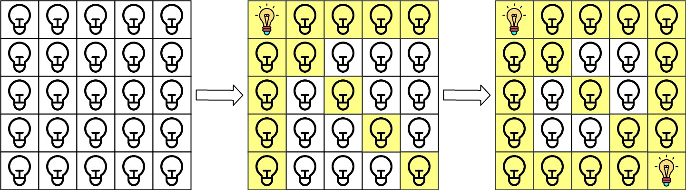
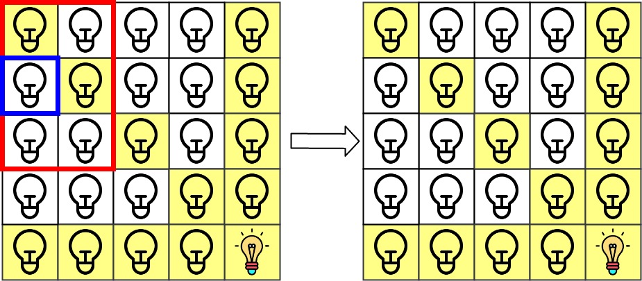
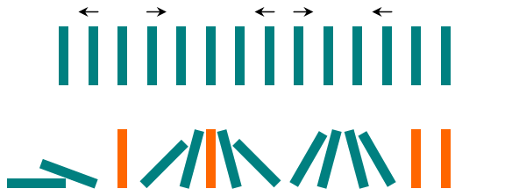
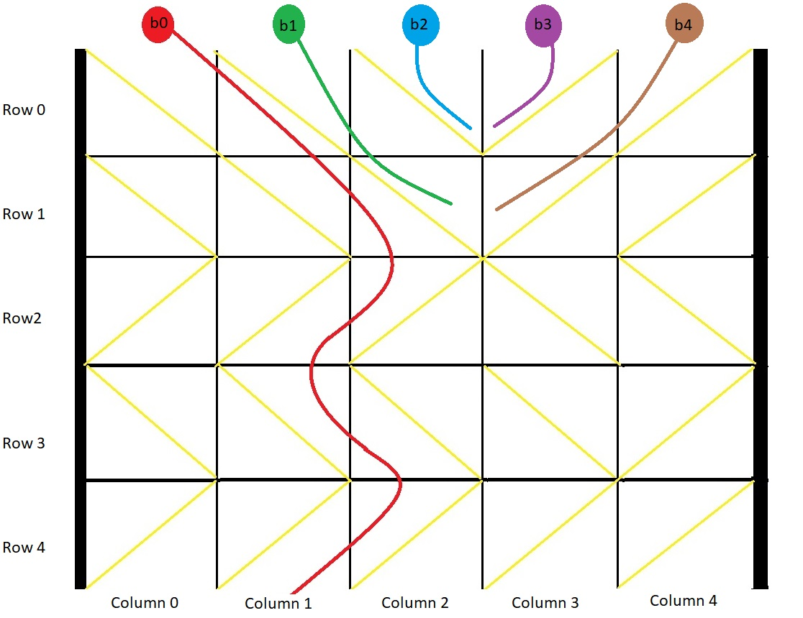

之前的每日一题没有记录！从今天开始`2022.1.1`！新的一年一切顺利！父母健康！学业顺利！

#### 20220101：将一维数组变成二维数组

> 题目来源：LeetCode 剑指 Offer 2022

给你一个下标从 0 开始的一维整数数组 original 和两个整数 m 和  n 。你需要使用 original 中 所有 元素创建一个 m 行 n 列的二维数组。

original 中下标从 0 到 n - 1 （都 包含 ）的元素构成二维数组的第一行，下标从 n 到 2 * n - 1 （都 包含 ）的元素构成二维数组的第二行，依此类推。

请你根据上述过程返回一个 m x n 的二维数组。如果无法构成这样的二维数组，请你返回一个空的二维数组

```java
class Solution {
    public int[][] construct2DArray(int[] original, int m, int n) {
        int cnt = original.length;
        if (cnt != m * n) return new int[0][0];
        int [][] ans = new int[m][n];
        int k = 0;
        for (int i = 0;i < m;i++){
            for (int j = 0;j < n;j++){
                ans[i][j] = original[k++];
            }
        }
        return ans;
    }
}
```

> 2022年第一天哈哈哈LeetCode官方也是用心了！❤

> 希望看到这个文档的人都能够顺顺利利！


#### 20220203：和为 K 的最少斐波那契数字数目

> 题目来源：LeetCode 1414.
>
> 标签： 贪心

给你数字 k ，请你返回和为 k 的斐波那契数字的最少数目，其中，每个斐波那契数字都可以被使用多次。

斐波那契数字定义为：

- F1 = 1
- F2 = 1
- Fn = Fn-1 + Fn-2 ， 其中 n > 2 。

数据保证对于给定的 k ，一定能找到可行解。

**题目解析**：

首先找到所有不超过 k 的斐波那契数字，然后每次贪心地选取不超过 k 的最大斐波那契数字，将 k 减去该斐波那契数字，重复该操作直到 k 变为 0，此时选取的斐波那契数字满足和为 k 且数目最少。

```java
class Solution {
    public int findMinFibonacciNumbers(int k) {
        List<Integer> dp = new ArrayList<>();
        dp.add(1);
        dp.add(1);
        int tmp = 2;
        while (tmp <= k){
            int last = dp.get(dp.size()-1);
            dp.add(tmp);
            tmp += last;
        }
        int ans = 0;
        int n = dp.size()-1;
        while (k != 0){
            if (k < dp.get(n)){
                n -= 1;
                continue;
            }
            k -= dp.get(n);
            ans += 1;
        }
        return ans;
    }
}
```

#### 20220204：可以形成最大正方形的矩形数目

> 题目来源：LeetCode 1725.
>
> 标签： 模拟、数组

给你一个数组 rectangles ，其中$ rectangles[i] = [l_i, w_i]$ 表示第 i 个矩形的长度为$ l_i $、宽度为 $w_i$ 。

如果存在 k 同时满足$ k <= l_i$ 和 $k <= w_i$ ，就可以将第 i 个矩形切成边长为 k 的正方形。例如，矩形 [4,6] 可以切成边长最大为 4 的正方形。

设 maxLen 为可以从矩形数组 rectangles 切分得到的 最大正方形 的边长。

请你统计有多少个矩形能够切出边长为 maxLen 的正方形，并返回矩形 数目 。

```java
class Solution {
    public int countGoodRectangles(int[][] rectangles) {
        int maxLen = 0;
        int cnt = 0;
        for (int i = 0;i < rectangles.length;i++){
            int len = Math.min(rectangles[i][0],rectangles[i][1]);
            if (maxLen == len){
                cnt += 1;
            }else if (maxLen < len){
                maxLen = len;
                cnt = 1;
            }
        }
        return cnt;
    }
}
```


#### 20220205：黄金矿工

> 题目来源：LeetCode 1219
>
> 标签： 深度优先搜索

你要开发一座金矿，地质勘测学家已经探明了这座金矿中的资源分布，并用大小为 `m * n` 的网格 `grid` 进行了标注。每个单元格中的整数就表示这一单元格中的黄金数量；如果该单元格是空的，那么就是 `0`。

为了使收益最大化，矿工需要按以下规则来开采黄金：

- 每当矿工进入一个单元，就会收集该单元格中的所有黄金。
- 矿工每次可以从当前位置向上下左右四个方向走。
- 每个单元格只能被开采（进入）一次。
- **不得开采**（进入）黄金数目为 `0` 的单元格。
- 矿工可以从网格中 **任意一个** 有黄金的单元格出发或者是停止。


```java
class Solution {
    int maxFrofit = 0;
    int dirs[][] = new int[][]{{-1,0},{1,0},{0,1},{0,-1}};
    int n,m;
    public void dfs(int x,int y,int[][] grid,int nowval){
        if(grid[x][y] == 0) return;
        nowval += grid[x][y];
        if(nowval > maxFrofit) maxFrofit = nowval;
        int tmp = grid[x][y];
        grid[x][y] = 0;
        for(int i = 0;i < 4;i++){
            int nx = x + dirs[i][0];
            int ny = y + dirs[i][1];
            if(nx < 0 || nx >= n || ny < 0 || ny >= m) continue;
            dfs(nx,ny,grid,nowval);
        }
        grid[x][y] = tmp;
        
    }
    public int getMaximumGold(int[][] grid) {
        n = grid.length;
        m = grid[0].length;
        for(int i = 0;i < grid.length;i++){
            for(int j = 0;j <grid[i].length;j++){
                dfs(i,j,grid,0);
            }
        }
        return maxFrofit;
    }
}
```


#### 20220206：唯一元素的和

> 题目来源：LeetCode 1748
>
> 标签： 哈希表

给你一个整数数组 `nums` 。数组中唯一元素是那些只出现 **恰好一次** 的元素。

请你返回 `nums` 中唯一元素的 **和** 。

```java
class Solution {
    public int sumOfUnique(int[] nums) {
        Map<Integer,Integer> m = new HashMap<>();
        for (int i = 0;i < nums.length;i++){
            m.put(nums[i],m.getOrDefault(nums[i],0)+1);
        }
        int sum = 0;
        for (int i = 0;i < nums.length;i++){
            if (m.get(nums[i]) == 1){
                sum += nums[i];
            }
        }
        return sum;
    }
}
```


#### 20220207：最长快乐字符串

> 题目来源：LeetCode 1405
>
> 标签： 贪心、优先级队列

如果字符串中不含有任何 `'aaa'`，`'bbb'` 或 `'ccc'` 这样的字符串作为子串，那么该字符串就是一个「快乐字符串」。

给你三个整数 `a`，`b` ，`c`，请你返回 **任意一个** 满足下列全部条件的字符串 `s`：

- `s` 是一个尽可能长的快乐字符串。
- `s` 中 **最多** 有`a` 个字母 `'a'`、`b` 个字母 `'b'`、`c` 个字母 `'c'` 。
- `s `中只含有 `'a'`、`'b'` 、`'c'` 三种字母。

如果不存在这样的字符串 `s` ，请返回一个空字符串 `""`。

**题目解析**：

**回溯**：

一开始想到的是回溯，但是超时了...然后换方法= =!  但是代码也贴上把...

> 逐个添加字母，添加前判断当前字母能否被加入，如果都不能则已经找到最长快乐字符串。

```java
class Solution {
    StringBuilder sb = new StringBuilder();
    int maxlen = Integer.MIN_VALUE;
    String ans = null;
    public void dfs(int a,int b,int c,boolean finsh){
        if ((a == 0 && b == 0 && c ==0) || finsh){
            if (sb.length() > maxlen){
                maxlen = sb.length();
                ans = sb.toString();
            }
            return ;
        }
        int nowlen = sb.length();
        boolean ok = true;
        if (a > 0 && (sb.length() < 2 || (sb.length() >= 2 && !(sb.charAt(nowlen-1) == sb.charAt(nowlen-2) && sb.charAt(nowlen-1) == 'a')))){
            ok = false;
            sb.append('a');
            dfs(a-1,b,c,false);
            sb.deleteCharAt(sb.length()-1);
        }
        if (b > 0 && (sb.length() < 2 || (sb.length() >= 2 && !(sb.charAt(nowlen-1) == sb.charAt(nowlen-2) && sb.charAt(nowlen-1) == 'b')))){
            ok = false;
            sb.append('b');
            dfs(a,b-1,c,false);
            sb.deleteCharAt(sb.length()-1);
        }
        if (c > 0 && (sb.length() < 2 || (sb.length() >= 2 && !(sb.charAt(nowlen-1) == sb.charAt(nowlen-2) && sb.charAt(nowlen-1) == 'c')))){
            ok = false;
            sb.append('c');
            dfs(a,b,c-1,false);
            sb.deleteCharAt(sb.length()-1);
        }
        if (ok){
            dfs(a,b,c,true);
        }
    }
    public String longestDiverseString(int a, int b, int c) {
        dfs(a,b,c,false);
        return ans;
    }
}
```

**贪心策略**：

1. 尽可能优先使用当前数量最多的字母

   > 因为最后同一种字母剩余的越多，越容易出现字母连续相同的情况

2. 从数量最多的字母开始尝试，如果发现加入当前字母会导致`三个连续相同的字母`，则跳过当前字母，选择数量次多的其他字母

3. 如果所有的字母都无法添加，则已经找到了最长的快乐字符串

```java
class Pair{
    int cnt;
    char ch;
    Pair(int cnt,char ch){
        this.cnt = cnt;
        this.ch = ch;
    }
}

public class Solution {
    public String longestDiverseString(int a, int b, int c) {
        StringBuilder sb = new StringBuilder();
        Queue<Pair> pq = new PriorityQueue<>(new Comparator<Pair>() {
            @Override
            public int compare(Pair o1, Pair o2) {
                return o2.cnt - o1.cnt;
            }
        });
        pq.offer(new Pair(a,'a'));
        pq.offer(new Pair(b,'b'));
        pq.offer(new Pair(c,'c'));
        String ans = "";
        while (!pq.isEmpty()){
            Pair head = pq.poll();  // 弹出当前栈顶元素
            if (head.cnt == 0){  //如果栈顶元素的cnt==0说明后面的都是0，直接break
                ans = sb.toString();
                break;
            }
            int n = sb.length();
            if (n >= 2 && sb.charAt(n-1) == sb.charAt(n-2) && sb.charAt(n-1) == head.ch){ //如果当前元素再添加就会连续重复3次，则选择次大的
                if (!pq.isEmpty() && pq.peek().cnt > 0){
                    Pair tmp = pq.poll();
                    sb.append(tmp.ch);
                    tmp.cnt -= 1;
                    pq.offer(tmp);
                    pq.offer(head);
                    continue;
                }else{
                    ans = sb.toString();
                    break;
                }
            }
            sb.append(head.ch);
            head.cnt -= 1;
            pq.offer(head);
        }
        return ans;
    }
}
```


#### 20220208：网格照明

> 题目来源：LeetCode 1001
>
> 标签： 哈希表

在大小为 `n x n` 的网格 `grid` 上，每个单元格都有一盏灯，最初灯都处于 **关闭** 状态。

给你一个由灯的位置组成的二维数组 `lamps` ，其中 `lamps[i] = [rowi, coli]` 表示 **打开** 位于 `grid[rowi][coli]` 的灯。即便同一盏灯可能在 `lamps` 中多次列出，不会影响这盏灯处于 **打开** 状态。

当一盏灯处于打开状态，它将会照亮 **自身所在单元格** 以及同一 **行** 、同一 **列** 和两条 **对角线** 上的 **所有其他单元格** 。

另给你一个二维数组 `queries` ，其中 `queries[j] = [rowj, colj]` 。对于第 `j` 个查询，如果单元格 `[rowj, colj]` 是被照亮的，则查询结果为 `1` ，否则为 `0` 。在第 `j` 次查询之后 [按照查询的顺序] ，**关闭** 位于单元格 `grid[rowj][colj]` 上及相邻 8 个方向上（与单元格 `grid[rowi][coli]` 共享角或边）的任何灯。

返回一个整数数组 `ans` 作为答案， `ans[j]` 应等于第 `j` 次查询 `queries[j]` 的结果，`1` 表示照亮，`0` 表示未照亮。



```
输入：n = 5, lamps = [[0,0],[4,4]], queries = [[1,1],[1,0]]
输出：[1,0]
```




```java
    public int[] gridIllumination(int n, int[][] lamps, int[][] queries) {
        Map<Integer,Integer> rows = new HashMap<>();
        Map<Integer,Integer> cols = new HashMap<>();
        Map<Integer,Integer> diagonal = new HashMap<>();  //斜着的直线可以看成坐标系中的一个直线方程
        Map<Integer,Integer> backdiagonal = new HashMap<>(); 
        Set<Integer> points = new HashSet<>();
        for (int [] lamp : lamps){
            // 计算坐标对应的 val
            int val = lamp[0] * n + lamp[1];
            if (points.contains(val)) continue; //如果之前当前位置的灯已经打开，跳过
            points.add(val);  //加入当前打开的灯
            //设置该点对应的行、列、正负对角线是被照亮的
            rows.put(lamp[0],rows.getOrDefault(lamp[0],0) + 1);
            cols.put(lamp[1],cols.getOrDefault(lamp[1],0) + 1);
            diagonal.put(lamp[0]-lamp[1],diagonal.getOrDefault(lamp[0]-lamp[1],0) + 1);
            backdiagonal.put(lamp[0]+lamp[1],backdiagonal.getOrDefault(lamp[0]+lamp[1],0) + 1);
        }
        int [] ans = new int[queries.length];
        for (int i = 0;i < queries.length;i++){
            int r = queries[i][0],c = queries[i][1];
            //如果 当前点所在位置的 行 、 列 、正负对角线 有一个被照亮，设置对应答案为1
            if (rows.getOrDefault(r,0) > 0){
                ans[i] = 1;
            }else if (cols.getOrDefault(c,0) > 0){
                ans[i] = 1;
            }else if (diagonal.getOrDefault(r-c,0) > 0){
                ans[i] = 1;
            }else if (backdiagonal.getOrDefault(r+c,0) > 0){
                ans[i] = 1;
            }
            //消除相邻中灯泡被打开的灯，并关闭所对应的行列、对角线
            for (int x = r - 1; x <= r+1;x++){
                for (int y = c - 1; y <= c + 1;y++){
                    if (x < 0 || y < 0 || x >= n || y >= n) continue;  //超过范围
                    int val = x * n + y;
                    //是否被打开
                    if (points.contains(val)){
                        //关闭该灯
                        points.remove(val);
                        //关闭行、列、正负对角线 所对应的光路
                        rows.put(x,rows.getOrDefault(x,0) - 1);
                        cols.put(y,cols.getOrDefault(y,0) - 1);
                        diagonal.put(x-y,diagonal.getOrDefault(x-y,0) - 1);
                        backdiagonal.put(x+y,backdiagonal.getOrDefault(x+y,0) - 1);
                    }
                }
            }
        }
        return ans;
    }
```


#### 20220209：差的绝对值为K的数对数目

> 题目来源：LeetCode 2006
>
> 标签： 哈希表

给你一个整数数组 `nums` 和一个整数 `k` ，请你返回数对 `(i, j)` 的数目，满足 `i < j` 且 `|nums[i] - nums[j]| == k` 。

```java
class Solution {
    public int countKDifference(int[] nums, int k) {
        Map<Integer,Integer> m = new HashMap<>();
        for (int num : nums){
            m.put(num,m.getOrDefault(num,0) + 1);
        }
        int ans = 0;
        for (int num : nums){
            ans += m.getOrDefault(num + k,0);
            ans += m.getOrDefault(num - k,0);
        }
        return ans / 2;  //因为有前后重复的
    }
}
```


#### 20220210：最简分数

> 题目来源：LeetCode 1447
>
> 标签： 数学、欧几里得算法

给你一个整数 `n` ，请你返回所有 0 到 1 之间（不包括 0 和 1）满足分母小于等于 `n` 的 **最简** 分数 。分数可以以 **任意** 顺序返回。

```
输入：n = 4
输出：["1/2","1/3","1/4","2/3","3/4"]
解释："2/4" 不是最简分数，因为它可以化简为 "1/2" 。
```

```java
class Solution {
    //判断两个数是否互质
    private boolean check(int n,int m){
        int t = 0;
        while (m > 0){
            t = n % m;
            n = m;
            m = t;
        }
        if (n == 1) return true;
        return false;
    }
    public List<String> simplifiedFractions(int n) {
        List<String> ans = new ArrayList<>();
        for (int i = 2;i <= n;i++){
            for (int j = 1;j < i;j++){
                if (j != 1 && i % j == 0) continue;
                if (check(i,j)){
                    StringBuilder sb = new StringBuilder();
                    sb.append(j);
                    sb.append("/");
                    sb.append(i);
                    ans.add(sb.toString());
                }
            }
        }
        return ans;
    }
}
```


#### 20220211： 学生分数的最小差值

> 题目来源：LeetCode 1984
>
> 标签： 排序、滑动窗口

给你一个 **下标从 0 开始** 的整数数组 `nums` ，其中 `nums[i]` 表示第 `i` 名学生的分数。另给你一个整数 `k` 。

从数组中选出任意 `k` 名学生的分数，使这 `k` 个分数间 **最高分** 和 **最低分** 的 **差值** 达到 **最小化** 。

返回可能的 **最小差值** 。

```java
class Solution {
    public int minimumDifference(int[] nums, int k) {
        int n = nums.length;
        Arrays.sort(nums);
        int left = 0,right = k-1;
        int ans = Integer.MAX_VALUE;
        while (right < n){
            ans = Math.min(ans,nums[right] - nums[left]);
            left += 1;
            right += 1;
        }
        return ans;
    }
}
```

#### 20220212： 飞地的数量

> 题目来源：LeetCode 1020
>
> 标签： 深度优先搜索

给你一个大小为 m x n 的二进制矩阵 grid ，其中 0 表示一个海洋单元格、1 表示一个陆地单元格。

一次 移动 是指从一个陆地单元格走到另一个相邻（上、下、左、右）的陆地单元格或跨过 grid 的边界。

返回网格中 无法 在任意次数的移动中离开网格边界的陆地单元格的数量。

题目解析：

先对 边界 全部进行一遍 深度优先搜索， 将1 => 0，然后再计算grid内部有多少个 1

```java
class Solution {
    int m,n;
    int [][] dirs = new int[][]{{-1,0},{1,0},{0,1},{0,-1}};
    public void dfs(int [][]grid,int x,int y){
        grid[x][y] = 0;
        for (int i = 0;i < 4;i++){
            int nx = x + dirs[i][0];
            int ny = y + dirs[i][1];
            if (nx < 0 || nx >= m || ny < 0 || ny >= n) continue;
            if (grid[nx][ny] == 1){
                dfs(grid,nx,ny);
            }
        }
    }
    public int numEnclaves(int[][] grid) {
        m = grid.length;
        n = grid[0].length;
        for (int i = 0;i < m;i++){
            if (grid[i][0] == 1){
                dfs(grid,i,0);
            }
            if (grid[i][n-1] == 1){
                dfs(grid,i,n-1);
            }
        }
        for (int i = 0;i < n;i++){
            if (grid[0][i] == 1){
                dfs(grid,0,i);
            }
            if (grid[m-1][i] == 1){
                dfs(grid,m-1,i);
            }
        }
        int res = 0;
        for (int i = 1;i < m-1;i++){
            for (int j = 1;j < n-1;j++){
                if (grid[i][j] == 1){
                    res += 1;
                }
            }
        }
        return res;
    }
}
```


#### 20220213： “气球” 的最大数量

> 题目来源：LeetCode 1189
>
> 标签： 哈希表、数组、计数

给你一个字符串 `text`，你需要使用 `text` 中的字母来拼凑尽可能多的单词 **"balloon"（气球）**。

字符串 `text` 中的每个字母最多只能被使用一次。请你返回最多可以拼凑出多少个单词 **"balloon"**。

```java
class Solution {
     public int maxNumberOfBalloons(String text) {
        char [] target = new String("balloon").toCharArray();
        int [] cnt = new int[26];
        for (int i = 0;i < text.length();i++){
            cnt[text.charAt(i) - 'a'] ++;
        }
        int ans = 0;
        while (true){
            boolean ok = true;
            for (char ch : target){
                if (cnt[ch-'a'] <= 0){
                    ok = false;
                    break;
                }
                cnt[ch-'a'] -= 1;
            }
            if (ok)
                ans += 1;
            else
                break;
        }
        return ans;
    }
}
```


#### 20220214：有序数组中的单一元素

> 题目来源：LeetCode 540
>
> 标签： 二分、排序

给你一个仅由整数组成的有序数组，其中每个元素都会出现两次，唯有一个数只会出现一次。

请你找出并返回只出现一次的那个数。

你设计的解决方案必须满足 `O(log n)` 时间复杂度和 `O(1)` 空间复杂度。

```java
class Solution {
    public int singleNonDuplicate(int[] nums) {
        int low = 0, high = nums.length - 1;
        while (low < high) {
            int mid = (high - low) / 2 + low;
            mid -= mid & 1;
            if (nums[mid] == nums[mid + 1]) {
                low = mid + 2;
            } else {
                high = mid;
            }
        }
        return nums[low];
    }
}
```


#### 20220215：矩阵中的幸运数

> 题目来源：LeetCode 1380
>
> 标签： 数组、哈希

给你一个 `m * n` 的矩阵，矩阵中的数字 **各不相同** 。请你按 **任意** 顺序返回矩阵中的所有幸运数。

幸运数是指矩阵中满足同时下列两个条件的元素：

- 在同一行的所有元素中最小
- 在同一列的所有元素中最大

```java
public class Solution {
    public List<Integer> luckyNumbers (int[][] matrix) {
        List<Integer> ans = new ArrayList<>();
        int m = matrix.length;
        int n = matrix[0].length;
        int [] row_min = new int[m];
        Arrays.fill(row_min,Integer.MAX_VALUE);
        int [] col_max = new int[n];
        Arrays.fill(col_max,Integer.MIN_VALUE);
        for (int i = 0;i < m;i++){
            for (int j = 0;j < n;j++){
                int val = matrix[i][j];
                row_min[i] = Math.min(val,row_min[i]);
                col_max[j] = Math.max(val,col_max[j]);
            }
        }
        for (int i = 0;i < m;i++){
            for (int j = 0;j < n;j++){
                if (row_min[i] == col_max[j]) ans.add(row_min[i]);
            }
        }
        return ans;
    }
}
```


#### 20220217：骑士在轮盘上的概率

> 题目来源：LeetCode 688
>
> 标签： 动态规划

在一个 n x n 的国际象棋棋盘上，一个骑士从单元格 (row, column) 开始，并尝试进行 k 次移动。行和列是 从 0 开始 的，所以左上单元格是 (0,0) ，右下单元格是 (n - 1, n - 1) 。

象棋骑士有8种可能的走法，如下图所示。每次移动在基本方向上是两个单元格，然后在正交方向上是一个单元格。


每次骑士要移动时，它都会随机从8种可能的移动中选择一种(即使棋子会离开棋盘)，然后移动到那里。

骑士继续移动，直到它走了 k 步或离开了棋盘。

返回 骑士在棋盘停止移动后仍留在棋盘上的概率 。

**题目解析：(官方)**

一个骑士有 8种可能的走法，骑士会从中以等概率随机选择一种。部分走法可能会让骑士离开棋盘，另外的走法则会让骑士移动到棋盘的其他位置，并且剩余的移动次数会减少 1。

定义$\textit{dp}[\textit{step}][i][j]$ 表示骑士从棋盘上的点 (i, j)(i,j) 出发，走了 $\textit{step}$ 步时仍然留在棋盘上的概率。

- 特别地，当点 $(i, j)$ 不在棋盘上时，$\textit{dp}[\textit{step}][i][j] = 0$；当点 $(i, j)$ 在棋盘上且 $\textit{step} = 0$时，$\textit{dp}[\textit{step}][i][j] = 1$。

- 对于其他情况，$\textit{dp}[\textit{step}][i][j] = \dfrac{1}{8} \times \sum\limits_{\textit{di}, \textit{dj}} \textit{dp}[\textit{step}-1][i+\textit{di}][j+\textit{dj}]$。

  > 其中$ (\textit{di}, \textit{dj})$ 表示走法对坐标的偏移量，具体为$ (-2, -1),(-2,1),(2,-1),(2,1),(-1,-2),(-1,2),(1,-2),(1,2)$ 共 8种。

```java
class Solution {
    int [][] dirs = new int[][]{{-2, -1}, {-2, 1}, {2, -1}, {2, 1}, {-1, -2}, {-1, 2}, {1, -2}, {1, 2}};
    public double knightProbability(int n, int k, int row, int column){
        double [][][] dp = new double[k+1][n][n];
        for (int step = 0;step <= k;step += 1){
            for (int i = 0;i < n;i++){
                for (int j = 0;j < n;j++){
                    if (step == 0){
                        dp[step][i][j] = 1;
                    }else{
                        for (int [] dir : dirs){
                            int ni = i + dir[0];
                            int nj = j + dir[1];
                            if (ni >= 0 && ni < n && nj >= 0 && nj < n){
                                dp[step][i][j] += dp[step-1][ni][nj] / 8;
                            }
                        }
                    }
                }
            }
        }
        return dp[k][row][column];
    }
}
```


#### 20220218：找出星型图的中心节点

> 题目来源：LeetCode 1791
>
> 标签： 动态规划

有一个无向的 **星型** 图，由 `n` 个编号从 `1` 到 `n` 的节点组成。星型图有一个 **中心** 节点，并且恰有 `n - 1` 条边将中心节点与其他每个节点连接起来。

给你一个二维整数数组 `edges` ，其中 `edges[i] = [ui, vi]` 表示在节点 `ui` 和 `vi` 之间存在一条边。请你找出并返回 `edges` 所表示星型图的中心节点。


```java
class Solution {
    public int findCenter(int[][] edges) {
        Map<Integer,Integer> m = new HashMap<>();
        int n =  edges.length;
        for (int [] edge : edges){
            m.put(edge[0],m.getOrDefault(edge[0],0) + 1);
            m.put(edge[1],m.getOrDefault(edge[1],0) + 1);
        }
        Iterator<Map.Entry<Integer,Integer>>  entry = m.entrySet().iterator();
        while (entry.hasNext()){
            Map.Entry<Integer,Integer> t = entry.next();
            if (t.getValue() == n){
                return t.getKey();
            }
        }
        return -1;
    }
}
```

```python
class Solution:
    def findCenter(self, edges) -> int:
        n = len(edges)
        m = {}
        for i in range(n):
            c1 = m.get(edges[i][0],0)
            if c1 == n - 1:
                return edges[i][0]
            m[edges[i][0]] = c1 + 1
            c2 = m.get(edges[i][1],0)
            if c2 == n - 1:
                return edges[i][1]
            m[edges[i][1]] = c2 + 1
        return -1
```

很秀的一个题解：

```java
class Solution {
    public int findCenter(int[][] edges) {
        return edges[0][0] == edges[1][0] || edges[0][0] == edges[1][1] ? edges[0][0] : edges[0][1];
    }
}
```


#### 20220219：煎饼排序

> 题目来源：LeetCode 969
>
> 标签： 排序、数组

给你一个整数数组 `arr` ，请使用 **煎饼翻转** 完成对数组的排序。

一次煎饼翻转的执行过程如下：

- 选择一个整数 `k` ，`1 <= k <= arr.length`
- 反转子数组 `arr[0...k-1]`（**下标从 0 开始**）

例如，`arr = [3,2,1,4]` ，选择 `k = 3` 进行一次煎饼翻转，反转子数组 `[3,2,1]` ，得到 `arr = [1,2,3,4]` 。

以数组形式返回能使 `arr` 有序的煎饼翻转操作所对应的 `k` 值序列。任何将数组排序且翻转次数在 `10 * arr.length` 范围内的有效答案都将被判断为正确。

题目解析：

**类似于冒泡排序**（逐个将最大的放到尾部）

设一个元素的下标是 $\textit{index}$，我们可以通过两次煎饼排序**将它放到尾部**：

- 第一步选择 $k = \textit{index} + 1$，然后反转子数组$ \textit{arr}[0 ... k - 1]$，此时该元素已经被放到首部。
- 第二步选择 $k = \textit{n}$，其中 $\textit{n}$ 是数组$ \textit{arr}$ 的长度，然后反转整个数组，此时该元素已经被放到尾部。

通过以上两步操作，我们可以将当前数组的最大值放到尾部，然后将去掉尾部元素的数组作为新的处理对象，重复以上操作，直到处理对象的长度等于一，此时原数组已经完成排序，且需要的总操作数是 $2 \times (n - 1)$，符合题目要求。如果最大值已经在尾部，我们可以省略对应的操作。

```java
    private void reverse(int []arr,int l,int r){
        for (int i = l,j = r;i < j;i++,j--){
            int tmp = arr[i];
            arr[i] = arr[j];
            arr[j] = tmp;
        }
    }
    public List<Integer> pancakeSort(int[] arr) {
        List<Integer> ans = new ArrayList<>();
        for (int n = arr.length;n > 1;n--){// 截至条件是 2 ，因为1个元素没必要翻转，n是代表每回合第二次翻转的长度
            int index = 0;
            for (int i = 1;i < n;i++){
                if (arr[i] >= arr[index]){ //找到元素值最大的下标索引
                    index = i;
                }
            }
            if (index == n-1){ //如果最大值已经在最后，则跳过翻转
                continue;
            }
            reverse(arr,0,index); //翻转0~index
            reverse(arr,0,n-1); //翻转0~n-1
            ans.add(index+1); //加入翻转的长度
            ans.add(n);  //加入翻转的长度
        }
        return ans;
    }
```

```python
class Solution:
    def pancakeSort(self, arr: List[int]) -> List[int]:
        ans = []
        for n in range(len(arr),1,-1): # n ~ 2
            idx = 0
            for i in range(n):
                if arr[i] > arr[idx]:
                    idx = i
            if idx == n - 1:
                continue
            arr[0:idx+1] = list(reversed(arr[0:idx+1]))
            arr[0:n] = list(reversed(arr[0:n]))
            ans.append(idx+1)
            ans.append(n)
        return ans
```


#### 20220220：1比特与2比特字符

> 题目来源：LeetCode 717
>
> 标签： 数组

有两种特殊字符：

- 第一种字符可以用一个比特 0 来表示
- 第二种字符可以用两个比特(10 或 11)来表示、

给定一个以 0 结尾的二进制数组 bits ，如果最后一个字符必须是一位字符，则返回 true 

```
输入: bits = [1, 0, 0]
输出: true
解释: 唯一的编码方式是一个两比特字符和一个一比特字符。
所以最后一个字符是一比特字符。
输入: bits = [1, 1, 1, 0]
输出: false
解释: 唯一的编码方式是两比特字符和两比特字符。
所以最后一个字符不是一比特字符。
```

```java
class Solution {
    public boolean isOneBitCharacter(int[] bits) {
        int n = bits.length;
        if (n == 1){
            return bits[0] == 0 ? true : false;
        }
        int i  = 0;
        while (i < n-1){
            if (bits[i] == 0) i += 1;
            else i += 2;
        }
        if (i == n-1) return true;
        return false;
    }
}
```


#### 20220221：推多米诺

> 题目来源：LeetCode 838
>
> 标签： 字符串、模拟、广度优先搜索

> 开学啦！努力努力！争取早日把论文发出来！

`n` 张多米诺骨牌排成一行，将每张多米诺骨牌垂直竖立。在开始时，同时把一些多米诺骨牌向左或向右推。

每过一秒，倒向左边的多米诺骨牌会推动其左侧相邻的多米诺骨牌。同样地，倒向右边的多米诺骨牌也会推动竖立在其右侧的相邻多米诺骨牌。

如果一张垂直竖立的多米诺骨牌的两侧同时有多米诺骨牌倒下时，由于受力平衡， 该骨牌仍然保持不变。

就这个问题而言，我们会认为一张正在倒下的多米诺骨牌不会对其它正在倒下或已经倒下的多米诺骨牌施加额外的力。

给你一个字符串 `dominoes` 表示这一行多米诺骨牌的初始状态，其中：

- `dominoes[i] = 'L'`，表示第 `i` 张多米诺骨牌被推向左侧，
- `dominoes[i] = 'R'`，表示第 `i` 张多米诺骨牌被推向右侧，
- `dominoes[i] = '.'`，表示没有推动第 `i` 张多米诺骨牌。

返回表示最终状态的字符串。



```
输入：dominoes = ".L.R...LR..L.."
输出："LL.RR.LLRRLL.."
```

**题目解析**：

当时间为 0 时，部分骨牌会受到一个初始的向左或向右的力而翻倒。过了 1 秒后，这些翻倒的骨牌会对其周围的骨牌施加一个力。具体表现为：

- 向左翻倒的骨牌，如果它有直立的左边紧邻的骨牌，则会对该直立的骨牌施加一个向左的力。
- 向右翻倒的骨牌，如果它有直立的右边紧邻的骨牌，则会对该直立的骨牌施加一个向右的力。

接下去需要分析这些 1 秒时受力的骨牌的状态。如果仅受到单侧的力，它们会倒向单侧；如果受到两个力，则会保持平衡。再过 1 秒后，这些新翻倒的骨牌又会对其他直立的骨牌施加力，而不会对正在翻倒或已经翻倒的骨牌施加力。

这样的思路类似于广度优先搜索。我们用一个队列 q 模拟搜索的顺序；数组 $\textit{time}$ 记录骨牌翻倒或者确定不翻倒的时间，翻倒的骨牌不会对正在翻倒或者已经翻倒的骨牌施加力；数组 $\textit{force}$记录骨牌受到的力，骨牌仅在受到单侧的力时会翻倒。

```java
public String pushDominoes(String dominoes) {
    int n = dominoes.length();
    Deque<Integer> q = new ArrayDeque<>();
    int [] time = new int[n];
    Arrays.fill(time,-1);
    List<Character>[] force = new List[n];
    for (int i = 0;i < n;i++){
        force[i] = new ArrayList<>();
    }
    for (int i = 0;i < n;i++){
        char ch = dominoes.charAt(i);
        if (ch != '.'){
            q.offerLast(i);  // 初始状态受力的牌
            time[i] = 0;  // 确定翻倒的时间
            force[i].add(ch);  // 受力方向
        }
    }
    char [] ans = new char[n];
    Arrays.fill(ans,'.');
    while (!q.isEmpty()){
        int i = q.pollFirst();
        if (force[i].size() == 1){ //如果只受一个方向上的力
            char f = force[i].get(0); //获取力的方向
            ans[i] = f;
            int ni = f == 'L' ? i-1 : i+1; //下一个可能受力的
            if (ni >= 0 && ni < n){
                int t = time[i]; //当前时间
                if (time[ni] == -1){ // 如果下一个牌还没有受力过
                    q.offerLast(ni); // 加入到队列中，进行状态修改准备工作
                    time[ni] = t + 1; // 受力时间
                    force[ni].add(f); // 加入当前受的力
                }else if (time[ni] == t + 1){
                    force[ni].add(f);
                }
            }
        }
    }
    return new String(ans);
}
```


#### 20220223：仅仅反转字母

> 题目来源：LeetCode 917
>
> 标签： 双指针、字符串、数组

给你一个字符串 `s` ，根据下述规则反转字符串：

- 所有非英文字母保留在原有位置。
- 所有英文字母（小写或大写）位置反转。

返回反转后的 `s` *。*

```java
class Solution {
    public boolean isalphabet(char s){
        return s >= 'a' && s <= 'z' || s >= 'A' && s <= 'Z';
    }
    public String reverseOnlyLetters(String s) {
        char [] sb = s.toCharArray();
        int left = 0,right = s.length() - 1;
        while (left < right){
            while (left < right && !isalphabet(sb[left])){
                left += 1;
            }
            while (left < right && !isalphabet(sb[right])){
                right -= 1;
            }
            if (left < right){
                char tmp = sb[left];
                sb[left] = sb[right];
                sb[right] = tmp;
                left += 1;
                right -= 1;
            }
        }
        return new String(sb);
    }
}
```

#### 20220224：球会落何处

> 题目来源：LeetCode 1706
>
> 标签： 深度优先搜索、数组

用一个大小为 m x n 的二维网格 grid 表示一个箱子。你有 n 颗球。箱子的顶部和底部都是开着的。

箱子中的每个单元格都有一个对角线挡板，跨过单元格的两个角，可以将球导向左侧或者右侧。

- 将球导向右侧的挡板跨过左上角和右下角，在网格中用 1 表示。
- 将球导向左侧的挡板跨过右上角和左下角，在网格中用 -1 表示。

在箱子每一列的顶端各放一颗球。每颗球都可能卡在箱子里或从底部掉出来。如果球恰好卡在两块挡板之间的 "V" 形图案，或者被一块挡导向到箱子的任意一侧边上，就会卡住。

返回一个大小为 n 的数组 answer ，其中 answer[i] 是球放在顶部的第 i 列后从底部掉出来的那一列对应的下标，如果球卡在盒子里，则返回 -1



```
输入：grid = [[1,1,1,-1,-1],[1,1,1,-1,-1],[-1,-1,-1,1,1],[1,1,1,1,-1],[-1,-1,-1,-1,-1]]
输出：[1,-1,-1,-1,-1]
```

```java
//java深度优先搜索
class Solution {
    int [] ans;
    public void dfs(int [][] grid,int x,int y,int idx){
        if (x == grid.length){
            ans[idx] = y;
            return ;
        }
        if (grid[x][y] == 1){
            if (y + 1 >= grid[0].length){
                ans[idx] = -1;
                return ;
            }
            if (grid[x][y+1] == -1){
                ans[idx] = -1;
                return ;
            }else{
                dfs(grid,x+1,y+1,idx);
            }
        }else{//grid[x][y] == -1
            if (y-1 < 0){
                ans[idx] = -1;
                return ;
            }
            if (grid[x][y-1] == 1){
                ans[idx] = -1;
                return ;
            }else{
                dfs(grid,x+1,y-1,idx);
            }
        }
    }
    public int[] findBall(int[][] grid) {
        ans = new int[grid[0].length];
        for (int i = 0;i < grid[0].length;i++){
            dfs(grid,0,i,i);
        }
        return ans;
    }

}
```

```python
# python 模拟
class Solution:
    def findBall(self, grid: List[List[int]]) -> List[int]:
        m = len(grid)
        n = len(grid[0])
        ans = [-1 for _ in range(n)]
        for i in range(n):
            col = i
            flag = True
            for row in range(m):
                if grid[row][col] == 1:
                    if col + 1 >= n :
                        flag = False
                        break
                    if grid[row][col+1] == -1:
                        flag = False
                        break
                    col += 1
                if grid[row][col] == -1:
                    if col - 1 < 0 :
                        flag = False
                        break
                    if grid[row][col-1] == 1:
                        flag = False
                        break
                    col -= 1
            if flag:
                ans[i] = col
        return ans
```


#### 20220225：复数乘法

> 题目来源：LeetCode 537
>
> 标签： 模拟、字符串

[复数]可以用字符串表示，遵循 `"实部+虚部i"` 的形式，并满足下述条件：

- `实部` 是一个整数，取值范围是 `[-100, 100]`
- `虚部` 也是一个整数，取值范围是 `[-100, 100]`
- `i2 == -1`

给你两个字符串表示的复数 `num1` 和 `num2` ，请你遵循复数表示形式，返回表示它们乘积的字符串。

```
输入：num1 = "1+-1i", num2 = "1+-1i"
输出："0+-2i"
解释：(1 - i) * (1 - i) = 1 + i2 - 2 * i = -2i ，你需要将它转换为 0+-2i 的形式。 
```

```java
class Solution {
    public String complexNumberMultiply(String num1, String num2) {
        String[] complex1 = num1.split("\\+|i");
        String[] complex2 = num2.split("\\+|i");
        int real1 = Integer.parseInt(complex1[0]);
        int imag1 = Integer.parseInt(complex1[1]);
        int real2 = Integer.parseInt(complex2[0]);
        int imag2 = Integer.parseInt(complex2[1]);
        return String.format("%d+%di", real1 * real2 - imag1 * imag2, real1 * imag2 + imag1 * real2);
    }
}
```


#### 20220226：增量元素之间的最大差值

> 题目来源：LeetCode 2016
>
> 标签： 数组、前缀最小值

给你一个下标从 **0** 开始的整数数组 `nums` ，该数组的大小为 `n` ，请你计算 `nums[j] - nums[i]` 能求得的 **最大差值** ，其中 `0 <= i < j < n` 且 `nums[i] < nums[j]` 。

返回 **最大差值** 。如果不存在满足要求的 `i` 和 `j` ，返回 `-1` 。

```
输入：nums = [7,1,5,4]
输出：4
解释：
最大差值出现在 i = 1 且 j = 2 时，nums[j] - nums[i] = 5 - 1 = 4 。
注意，尽管 i = 1 且 j = 0 时 ，nums[j] - nums[i] = 7 - 1 = 6 > 4 ，但 i > j 不满足题面要求，所以 6 不是有效的答案。
```

题目解析：

当我们固定 j 时，选择的下标 i 一定是满足 $0 \leq i < j$并且 $\textit{nums}[i]$最小的那个 i。因此我们可以使用循环对 j 进行遍历，同时维护 $\textit{nums}[0..j-1]$ 的前缀最小值，记为 $\textit{premin}$。这样一来：

- 如果$ \textit{nums}[i] > \textit{premin}$，那么就用$ \textit{nums}[i] - \textit{premin}$ 对答案进行更新；
- 否则，用 $\textit{nums}[i]$ 来更新前缀最小值 $\textit{premin}$。

```java
class Solution {
    public int maximumDifference(int[] nums) {
        int n = nums.length;
        int ans = - 1,premin = nums[0];
        for (int i = 1;i < n;i++){
            if (nums[i] > premin){
                ans = Math.max(ans,nums[i] - premin);
            }else{
                premin = nums[i];
            }
        }
        return ans;
    }
}
```

#### 20220227：最优除法

> 题目来源：LeetCode 553
>
> 标签： 数学

给定一组**正整数，**相邻的整数之间将会进行浮点除法操作。例如， [2,3,4] -> 2 / 3 / 4 。

但是，你可以在任意位置添加任意数目的括号，来改变算数的优先级。你需要找出怎么添加括号，才能得到**最大的**结果，并且返回相应的字符串格式的表达式。**你的表达式不应该含有冗余的括号。**

**示例：**

```
输入: [1000,100,10,2]
输出: "1000/(100/10/2)"
解释:
1000/(100/10/2) = 1000/((100/10)/2) = 200
但是，以下加粗的括号 "1000/((100/10)/2)" 是冗余的，
因为他们并不影响操作的优先级，所以你需要返回 "1000/(100/10/2)"。
```

题目解析：

考虑到除法运算用分数$ \dfrac{x}{y}$ 来表示，其中分子 x 为被除数，分母 y 为除数，为了最大化 $\dfrac{x}{y}$ ，应该使分子 x 尽可能的大，分母 y 尽可能的小。

```java
class Solution {
    public String optimalDivision(int[] nums) {
        int n = nums.length;
        if (n == 1){
            return String.valueOf(nums[0]);
        }else if (n == 2){
            return String.valueOf(nums[0]) + "/" + String.valueOf(nums[1]);
        }
        StringBuilder sb =  new StringBuilder();
        sb.append(String.valueOf(nums[0]));
        sb.append("/(");
        for (int i = 1;i < nums.length;i++){
            sb.append(String.valueOf(nums[i]));
            if (i != nums.length-1)
                sb.append("/");
        }
        sb.append(String.valueOf(")"));
        return sb.toString();
    }
}
```


#### 20220228：最多可达成的换楼请求数目

> 题目来源：LeetCode 1601
>
> 标签： 回溯

我们有 n 栋楼，编号从 0 到 n - 1 。每栋楼有若干员工。由于现在是换楼的季节，部分员工想要换一栋楼居住。

给你一个数组 requests ，其中 requests[i] = [fromi, toi] ，表示一个员工请求从编号为 fromi 的楼搬到编号为 toi 的楼。

一开始 所有楼都是满的，所以从请求列表中选出的若干个请求是可行的需要满足 每栋楼员工净变化为 0 。意思是每栋楼 离开 的员工数目 等于 该楼 搬入 的员工数数目。比方说 n = 3 且两个员工要离开楼 0 ，一个员工要离开楼 1 ，一个员工要离开楼 2 ，如果该请求列表可行，应该要有两个员工搬入楼 0 ，一个员工搬入楼 1 ，一个员工搬入楼 2 。

请你从原请求列表中选出若干个请求，使得它们是一个可行的请求列表，并返回所有可行列表中最大请求数目。


```
输入：n = 5, requests = [[0,1],[1,0],[0,1],[1,2],[2,0],[3,4]]
输出：5
解释：请求列表如下：
从楼 0 离开的员工为 x 和 y ，且他们都想要搬到楼 1 。
从楼 1 离开的员工为 a 和 b ，且他们分别想要搬到楼 2 和 0 。
从楼 2 离开的员工为 z ，且他想要搬到楼 0 。
从楼 3 离开的员工为 c ，且他想要搬到楼 4 。
没有员工从楼 4 离开。
我们可以让 x 和 b 交换他们的楼，以满足他们的请求。
我们可以让 y，a 和 z 三人在三栋楼间交换位置，满足他们的要求。
所以最多可以满足 5 个请求。
```

**题目解析**：

我们可以通过回溯的方式枚举每一个请求是否被选择。

定义函数 $\text{dfs}(\textit{pos})$表示我们正在枚举第 $\textit{pos}$个请求。同时，我们使用数组$ \textit{delta}$ 记录每一栋楼的员工变化量，以及变量 $\textit{cnt}$ 记录被选择的请求数量。

对于第 $\textit{pos}$个请求$ [x,y]$，如果选择该请求，那么就需要将 $\textit{delta}[x]$ 的值减 1，$\textit{delta}[y]$ 的值加 1，$\textit{cnt}$cnt 的值加 1；如果不选择该请求，则不需要进行任何操作。在这之后，我们调用$ \text{dfs}(\textit{pos}+1)$枚举下一个请求。

如果我们枚举完了全部请求，则需要判断是否满足要求，也就是判断 $\textit{delta}$ 中的所有值是否均为 0。若满足要求，则更新答案的最大值。

代码实现时，可以在修改 $\textit{delta}$ 的同时维护 $\textit{delta}$ 中的 0 的个数，记作 $\textit{zero}$，初始值为 n。如果 $\textit{delta}[x]$增加或减少前为 0，则将 $\textit{zero}$ 减 1；如果 $\textit{delta}$[x]增加或减少后为 0，则将 $\textit{zero}$加 1。

```java
class Solution {
    int [] delta;
    int zeros;
    int ans = 0;
    int cnt = 0;
    int n;
    public void dfs(int [][] requests,int idx){
        if (idx == requests.length){
            if (zeros == this.n){
                ans = Math.max(ans,cnt);
            }
            return ;
        }
        // 不选择当前请求
        dfs(requests,idx+1);
        // 选择当前请求
        int nowzeros = zeros;
        cnt += 1;
        int from = requests[idx][0],to = requests[idx][1];
        if (delta[from] == 0){ //如果开始当前楼栋是均衡的，则出去一个会打破一个平衡
            zeros -= 1;
        }
        delta[from] -= 1;
        if (delta[from] == 0){ //如果出去一个还原了平衡
            zeros += 1;
        }
        if (delta[to] == 0){ //如果进来一个之前是平衡的，进来一个则打破了之前的平衡
            zeros -= 1;
        }
        delta[to] += 1;
        if (delta[to] == 0){ // 如果进来一个之后平衡了
            zeros += 1;
        }
        dfs(requests,idx+1);
        //撤销请求，还原
        delta[from] += 1;
        delta[to] -= 1;
        cnt -= 1;
        zeros = nowzeros;
    }
    public int maximumRequests(int n, int[][] requests) {
        delta = new int[n];
        zeros = n;
        this.n = n;
        dfs(requests,0);
        return ans;
    }
}
```


哈哈！2月勋章Get!


#### 20220301：Z 字形变换

> 标签： 模拟

将一个给定字符串 s 根据给定的行数 numRows ，以从上往下、从左到右进行 Z 字形排列。

比如输入字符串为 "PAYPALISHIRING" 行数为 3 时，排列如下：

P   A   H   N
A P L S I I G
Y   I   R
之后，你的输出需要从左往右逐行读取，产生出一个新的字符串，比如："PAHNAPLSIIGYIR"。

请你实现这个将字符串进行指定行数变换的函数：

string convert(string s, int numRows);

```java
class Solution {
    public String convert(String s, int numRows) {
        if (numRows == 1) return s;
        int n = s.length() / (numRows * 2 - 2);
        if (s.length() % (numRows * 2 - 2) != 0){
            n += 1;
        }
        n = n * (numRows - 1);
        char [][] m = new char [numRows][n];
        int x = 0,y = 0;
        boolean dir = true; // true : down / false : up
        for (int i = 0;i < s.length();i++){
            char ch = s.charAt(i);
            m[x][y] = ch;
            if (x == 0){
                x += 1;
                dir = true;
            }else if (x == numRows-1){
                dir = false;
                x -= 1;
                y += 1;
            }else{
                if (dir){
                    x += 1;
                }else{
                    x -= 1;
                    y += 1;
                }
            }
        }
        StringBuilder sb = new StringBuilder();
        for (int i = 0;i < numRows;i++){
            for (int j = 0;j < n;j++){
                if (m[i][j] >= 'a' && m[i][j] <='z' || m[i][j] >= 'A' && m[i][j] <='Z' || m[i][j] == ',' || m[i][j] == '.'){
                    sb.append(m[i][j]);
                }
            }
        }
        return sb.toString();
    }
}
```

#### 20220303：各位相加

> 题目来源：LeetCode 258
>
> 标签： 模拟

给定一个非负整数 `num`，反复将各个位上的数字相加，直到结果为一位数。返回这个结果。

**示例 1:**

```
输入: num = 38
输出: 2 
解释: 各位相加的过程为：
38 --> 3 + 8 --> 11
11 --> 1 + 1 --> 2
由于 2 是一位数，所以返回 2。
```


```java
class Solution {
    public int addDigits(int num) {
        while (num >= 10){
            int tmp = num;
            int sum = 0;
            while (tmp != 0){
                sum += tmp % 10;
                tmp /= 10;
            }
            num = sum;
        }
        return num;
    }
}
```


#### 20220304：子数组范围和

> 题目来源：LeetCode 2104
>
> 标签： 单调栈、模拟

给你一个整数数组 `nums` 。`nums` 中，子数组的 **范围** 是子数组中最大元素和最小元素的差值。

返回 `nums` 中 **所有** 子数组范围的 **和** *。*

子数组是数组中一个连续 **非空** 的元素序列。

题目解析：

为了使子数组的最小值或最大值唯一，我们定义如果 $\textit{nums}[i] = \textit{nums}[j]$，那么$ \textit{nums}[i]$ 与 $\textit{nums}[j]$ 的逻辑大小由下标 i 与下标 j 的逻辑大小决定，即如果 i<j，那么 $\textit{nums}[i]$ 逻辑上小于 $\textit{nums}[j]$。

根据范围和的定义，可以推出范围和 $\textit{sum}$等于所有子数组的最大值之和 $\textit{sumMax}$减去所有子数组的最小值之和 $\textit{sumMin}$。

假设$ \textit{nums}[i]$ 左侧最近的比它小的数为 $\textit{nums}[j]$，右侧最近的比它小的数为$ \textit{nums}[k]$，那么所有以 $\textit{nums}[i]$ 为最小值的子数组数目为 $(k - i) \times (i - j)$。为了能获得 $\textit{nums}[i]$ 左侧和右侧最近的比它小的数的下标，我们可以使用单调递增栈分别预处理出数组 $\textit{minLeft}$minLeft 和 $\textit{minRight}$，其中 $\textit{minLeft}[i]$ 表示 $\textit{nums}[i]$ 左侧最近的比它小的数的下标，$\textit{minRight}[i]$ 表示$ \textit{nums}[i]$ 右侧最近的比它小的数的下标。

以求解 $\textit{minLeft}$ 为例，我们从左到右遍历整个数组 $\textit{nums}$。处理到 $\textit{nums}[i]$ 时，我们执行出栈操作直到栈为空或者 $\textit{nums}$ 中以栈顶元素为下标的数逻辑上小于 $\textit{nums}[i]$。如果栈为空，那么 $\textit{minLeft}[i] = -1$，否则 $\textit{minLeft}[i]$ 等于栈顶元素，然后将下标 i入栈。

那么所有子数组的最小值之和 $\textit{sumMin} = \sum_{i=0}^{n-1} (\textit{minRight}[i] - i) \times (i - \textit{minLeft}[i]) \times \textit{nums}[i]$。同理我们也可以求得所有子数组的最大值之和 $\textit{sumMax}$。

```java
class Solution {
    public long subArrayRanges(int [] nums){
        int n = nums.length;
        int [] minLeft = new int[n];  // 记录 nums[i] 左边比其小的最近的元素的下标
        int [] minRight = new int[n]; // 记录 nums[i] 右边比其小的最近的元素的下标
        int [] maxLeft = new int[n]; // 记录 nums[i] 左边比其大的最近的元素的下标
        int [] maxRight = new int[n]; // 记录 nums[i] 右边比其大的最近的元素的下标
        Deque<Integer> minStack = new ArrayDeque<>(); // 单调递增栈
        Deque<Integer> maxStack = new ArrayDeque<>(); // 单调递减栈
        for (int i = 0;i < n;i++){
            // 如果栈不空，并且栈顶索引的元素 > nums[i]，则弹出，因为是为了找左边小于nums[i]的最近的元素
            while (!minStack.isEmpty() && nums[minStack.peekLast()] > nums[i]){
                minStack.pollLast();
            }
            minLeft[i] = minStack.isEmpty() ? -1 : minStack.peekLast();
            minStack.offerLast(i); //压入当前元素

            // 如果栈不空，并且栈顶索的元素 <= nums[i]，则弹出，因为是为了找左边大于nums[i]的最近的元素（我们定义如果两个元素想等，偏左边的元素元素小于右边的元素
            while (!maxStack.isEmpty() && nums[maxStack.peekLast()] <= nums[i]){
                maxStack.pollLast();
            }
            maxLeft[i] = maxStack.isEmpty() ? -1 : maxStack.peekLast();
            maxStack.offerLast(i);
        }
        minStack.clear();
        maxStack.clear();

        for (int i = n-1;i >= 0;i--){
            // 如果栈不空，并且栈顶索引的元素 >= nums[i]，则弹出，因为为了找右边小于nums[i]的最近的元素
            while (!minStack.isEmpty() && nums[minStack.peekLast()] >= nums[i]){
                minStack.pollLast();
            }
            minRight[i] = minStack.isEmpty() ? n : minStack.peekLast();
            minStack.offerLast(i);
            // 如果栈不空，并且栈顶索引的元素 <  nums[i]，则弹出，因为为了找到右边大于nums[i]的最近
            while (!maxStack.isEmpty() && nums[maxStack.peekLast()] < nums[i]){
                maxStack.pollLast();
            }
            maxRight[i] = maxStack.isEmpty() ? n : maxStack.peekLast();
            maxStack.offerLast(i);
        }
        long sumMAX = 0,sumMIN = 0;
        for (int i = 0;i < n;i++){
            sumMAX += (long) (i - maxLeft[i]) * (maxRight[i] - i) * nums[i];
            sumMIN += (long) (i - minLeft[i]) * (minRight[i] - i) * nums[i];
        }
        return sumMAX - sumMIN;
    }
}
```

