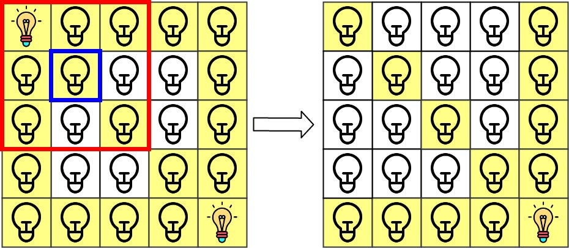

之前的每日一题没有记录！从今天开始`2022.1.1`！新的一年一切顺利！父母健康！学业顺利！

#### 20220101：将一维数组变成二维数组

> 题目来源：LeetCode 剑指 Offer 2022

给你一个下标从 0 开始的一维整数数组 original 和两个整数 m 和  n 。你需要使用 original 中 所有 元素创建一个 m 行 n 列的二维数组。

original 中下标从 0 到 n - 1 （都 包含 ）的元素构成二维数组的第一行，下标从 n 到 2 * n - 1 （都 包含 ）的元素构成二维数组的第二行，依此类推。

请你根据上述过程返回一个 m x n 的二维数组。如果无法构成这样的二维数组，请你返回一个空的二维数组

```java
class Solution {
    public int[][] construct2DArray(int[] original, int m, int n) {
        int cnt = original.length;
        if (cnt != m * n) return new int[0][0];
        int [][] ans = new int[m][n];
        int k = 0;
        for (int i = 0;i < m;i++){
            for (int j = 0;j < n;j++){
                ans[i][j] = original[k++];
            }
        }
        return ans;
    }
}
```

> 2022年第一天哈哈哈LeetCode官方也是用心了！❤

> 希望看到这个文档的人都能够顺顺利利！


#### 20220203：和为 K 的最少斐波那契数字数目

> 题目来源：LeetCode 1414.
>
> 标签： 贪心

给你数字 k ，请你返回和为 k 的斐波那契数字的最少数目，其中，每个斐波那契数字都可以被使用多次。

斐波那契数字定义为：

- F1 = 1
- F2 = 1
- Fn = Fn-1 + Fn-2 ， 其中 n > 2 。

数据保证对于给定的 k ，一定能找到可行解。

**题目解析**：

首先找到所有不超过 k 的斐波那契数字，然后每次贪心地选取不超过 k 的最大斐波那契数字，将 k 减去该斐波那契数字，重复该操作直到 k 变为 0，此时选取的斐波那契数字满足和为 k 且数目最少。

```java
class Solution {
    public int findMinFibonacciNumbers(int k) {
        List<Integer> dp = new ArrayList<>();
        dp.add(1);
        dp.add(1);
        int tmp = 2;
        while (tmp <= k){
            int last = dp.get(dp.size()-1);
            dp.add(tmp);
            tmp += last;
        }
        int ans = 0;
        int n = dp.size()-1;
        while (k != 0){
            if (k < dp.get(n)){
                n -= 1;
                continue;
            }
            k -= dp.get(n);
            ans += 1;
        }
        return ans;
    }
}
```

#### 20220204：可以形成最大正方形的矩形数目

> 题目来源：LeetCode 1725.
>
> 标签： 模拟、数组

给你一个数组 rectangles ，其中$ rectangles[i] = [l_i, w_i]$ 表示第 i 个矩形的长度为$ l_i $、宽度为 $w_i$ 。

如果存在 k 同时满足$ k <= l_i$ 和 $k <= w_i$ ，就可以将第 i 个矩形切成边长为 k 的正方形。例如，矩形 [4,6] 可以切成边长最大为 4 的正方形。

设 maxLen 为可以从矩形数组 rectangles 切分得到的 最大正方形 的边长。

请你统计有多少个矩形能够切出边长为 maxLen 的正方形，并返回矩形 数目 。

```java
class Solution {
    public int countGoodRectangles(int[][] rectangles) {
        int maxLen = 0;
        int cnt = 0;
        for (int i = 0;i < rectangles.length;i++){
            int len = Math.min(rectangles[i][0],rectangles[i][1]);
            if (maxLen == len){
                cnt += 1;
            }else if (maxLen < len){
                maxLen = len;
                cnt = 1;
            }
        }
        return cnt;
    }
}
```


#### 20220205：黄金矿工

> 题目来源：LeetCode 1219
>
> 标签： 深度优先搜索

你要开发一座金矿，地质勘测学家已经探明了这座金矿中的资源分布，并用大小为 `m * n` 的网格 `grid` 进行了标注。每个单元格中的整数就表示这一单元格中的黄金数量；如果该单元格是空的，那么就是 `0`。

为了使收益最大化，矿工需要按以下规则来开采黄金：

- 每当矿工进入一个单元，就会收集该单元格中的所有黄金。
- 矿工每次可以从当前位置向上下左右四个方向走。
- 每个单元格只能被开采（进入）一次。
- **不得开采**（进入）黄金数目为 `0` 的单元格。
- 矿工可以从网格中 **任意一个** 有黄金的单元格出发或者是停止。


```java
class Solution {
    int maxFrofit = 0;
    int dirs[][] = new int[][]{{-1,0},{1,0},{0,1},{0,-1}};
    int n,m;
    public void dfs(int x,int y,int[][] grid,int nowval){
        if(grid[x][y] == 0) return;
        nowval += grid[x][y];
        if(nowval > maxFrofit) maxFrofit = nowval;
        int tmp = grid[x][y];
        grid[x][y] = 0;
        for(int i = 0;i < 4;i++){
            int nx = x + dirs[i][0];
            int ny = y + dirs[i][1];
            if(nx < 0 || nx >= n || ny < 0 || ny >= m) continue;
            dfs(nx,ny,grid,nowval);
        }
        grid[x][y] = tmp;
        
    }
    public int getMaximumGold(int[][] grid) {
        n = grid.length;
        m = grid[0].length;
        for(int i = 0;i < grid.length;i++){
            for(int j = 0;j <grid[i].length;j++){
                dfs(i,j,grid,0);
            }
        }
        return maxFrofit;
    }
}
```


#### 20220206：唯一元素的和

> 题目来源：LeetCode 1748
>
> 标签： 哈希表

给你一个整数数组 `nums` 。数组中唯一元素是那些只出现 **恰好一次** 的元素。

请你返回 `nums` 中唯一元素的 **和** 。

```java
class Solution {
    public int sumOfUnique(int[] nums) {
        Map<Integer,Integer> m = new HashMap<>();
        for (int i = 0;i < nums.length;i++){
            m.put(nums[i],m.getOrDefault(nums[i],0)+1);
        }
        int sum = 0;
        for (int i = 0;i < nums.length;i++){
            if (m.get(nums[i]) == 1){
                sum += nums[i];
            }
        }
        return sum;
    }
}
```


#### 20220207：最长快乐字符串

> 题目来源：LeetCode 1405
>
> 标签： 贪心、优先级队列

如果字符串中不含有任何 `'aaa'`，`'bbb'` 或 `'ccc'` 这样的字符串作为子串，那么该字符串就是一个「快乐字符串」。

给你三个整数 `a`，`b` ，`c`，请你返回 **任意一个** 满足下列全部条件的字符串 `s`：

- `s` 是一个尽可能长的快乐字符串。
- `s` 中 **最多** 有`a` 个字母 `'a'`、`b` 个字母 `'b'`、`c` 个字母 `'c'` 。
- `s `中只含有 `'a'`、`'b'` 、`'c'` 三种字母。

如果不存在这样的字符串 `s` ，请返回一个空字符串 `""`。

**题目解析**：

**回溯**：

一开始想到的是回溯，但是超时了...然后换方法= =!  但是代码也贴上把...

> 逐个添加字母，添加前判断当前字母能否被加入，如果都不能则已经找到最长快乐字符串。

```java
class Solution {
    StringBuilder sb = new StringBuilder();
    int maxlen = Integer.MIN_VALUE;
    String ans = null;
    public void dfs(int a,int b,int c,boolean finsh){
        if ((a == 0 && b == 0 && c ==0) || finsh){
            if (sb.length() > maxlen){
                maxlen = sb.length();
                ans = sb.toString();
            }
            return ;
        }
        int nowlen = sb.length();
        boolean ok = true;
        if (a > 0 && (sb.length() < 2 || (sb.length() >= 2 && !(sb.charAt(nowlen-1) == sb.charAt(nowlen-2) && sb.charAt(nowlen-1) == 'a')))){
            ok = false;
            sb.append('a');
            dfs(a-1,b,c,false);
            sb.deleteCharAt(sb.length()-1);
        }
        if (b > 0 && (sb.length() < 2 || (sb.length() >= 2 && !(sb.charAt(nowlen-1) == sb.charAt(nowlen-2) && sb.charAt(nowlen-1) == 'b')))){
            ok = false;
            sb.append('b');
            dfs(a,b-1,c,false);
            sb.deleteCharAt(sb.length()-1);
        }
        if (c > 0 && (sb.length() < 2 || (sb.length() >= 2 && !(sb.charAt(nowlen-1) == sb.charAt(nowlen-2) && sb.charAt(nowlen-1) == 'c')))){
            ok = false;
            sb.append('c');
            dfs(a,b,c-1,false);
            sb.deleteCharAt(sb.length()-1);
        }
        if (ok){
            dfs(a,b,c,true);
        }
    }
    public String longestDiverseString(int a, int b, int c) {
        dfs(a,b,c,false);
        return ans;
    }
}
```

**贪心策略**：

1. 尽可能优先使用当前数量最多的字母

   > 因为最后同一种字母剩余的越多，越容易出现字母连续相同的情况

2. 从数量最多的字母开始尝试，如果发现加入当前字母会导致`三个连续相同的字母`，则跳过当前字母，选择数量次多的其他字母

3. 如果所有的字母都无法添加，则已经找到了最长的快乐字符串

```java
class Pair{
    int cnt;
    char ch;
    Pair(int cnt,char ch){
        this.cnt = cnt;
        this.ch = ch;
    }
}

public class Solution {
    public String longestDiverseString(int a, int b, int c) {
        StringBuilder sb = new StringBuilder();
        Queue<Pair> pq = new PriorityQueue<>(new Comparator<Pair>() {
            @Override
            public int compare(Pair o1, Pair o2) {
                return o2.cnt - o1.cnt;
            }
        });
        pq.offer(new Pair(a,'a'));
        pq.offer(new Pair(b,'b'));
        pq.offer(new Pair(c,'c'));
        String ans = "";
        while (!pq.isEmpty()){
            Pair head = pq.poll();  // 弹出当前栈顶元素
            if (head.cnt == 0){  //如果栈顶元素的cnt==0说明后面的都是0，直接break
                ans = sb.toString();
                break;
            }
            int n = sb.length();
            if (n >= 2 && sb.charAt(n-1) == sb.charAt(n-2) && sb.charAt(n-1) == head.ch){ //如果当前元素再添加就会连续重复3次，则选择次大的
                if (!pq.isEmpty() && pq.peek().cnt > 0){
                    Pair tmp = pq.poll();
                    sb.append(tmp.ch);
                    tmp.cnt -= 1;
                    pq.offer(tmp);
                    pq.offer(head);
                    continue;
                }else{
                    ans = sb.toString();
                    break;
                }
            }
            sb.append(head.ch);
            head.cnt -= 1;
            pq.offer(head);
        }
        return ans;
    }
}
```


#### 20220208：网格照明

> 题目来源：LeetCode 1001
>
> 标签： 哈希表

在大小为 `n x n` 的网格 `grid` 上，每个单元格都有一盏灯，最初灯都处于 **关闭** 状态。

给你一个由灯的位置组成的二维数组 `lamps` ，其中 `lamps[i] = [rowi, coli]` 表示 **打开** 位于 `grid[rowi][coli]` 的灯。即便同一盏灯可能在 `lamps` 中多次列出，不会影响这盏灯处于 **打开** 状态。

当一盏灯处于打开状态，它将会照亮 **自身所在单元格** 以及同一 **行** 、同一 **列** 和两条 **对角线** 上的 **所有其他单元格** 。

另给你一个二维数组 `queries` ，其中 `queries[j] = [rowj, colj]` 。对于第 `j` 个查询，如果单元格 `[rowj, colj]` 是被照亮的，则查询结果为 `1` ，否则为 `0` 。在第 `j` 次查询之后 [按照查询的顺序] ，**关闭** 位于单元格 `grid[rowj][colj]` 上及相邻 8 个方向上（与单元格 `grid[rowi][coli]` 共享角或边）的任何灯。

返回一个整数数组 `ans` 作为答案， `ans[j]` 应等于第 `j` 次查询 `queries[j]` 的结果，`1` 表示照亮，`0` 表示未照亮。


```
输入：n = 5, lamps = [[0,0],[4,4]], queries = [[1,1],[1,0]]
输出：[1,0]
```




```java
    public int[] gridIllumination(int n, int[][] lamps, int[][] queries) {
        Map<Integer,Integer> rows = new HashMap<>();
        Map<Integer,Integer> cols = new HashMap<>();
        Map<Integer,Integer> diagonal = new HashMap<>();  //斜着的直线可以看成坐标系中的一个直线方程
        Map<Integer,Integer> backdiagonal = new HashMap<>(); 
        Set<Integer> points = new HashSet<>();
        for (int [] lamp : lamps){
            // 计算坐标对应的 val
            int val = lamp[0] * n + lamp[1];
            if (points.contains(val)) continue; //如果之前当前位置的灯已经打开，跳过
            points.add(val);  //加入当前打开的灯
            //设置该点对应的行、列、正负对角线是被照亮的
            rows.put(lamp[0],rows.getOrDefault(lamp[0],0) + 1);
            cols.put(lamp[1],cols.getOrDefault(lamp[1],0) + 1);
            diagonal.put(lamp[0]-lamp[1],diagonal.getOrDefault(lamp[0]-lamp[1],0) + 1);
            backdiagonal.put(lamp[0]+lamp[1],backdiagonal.getOrDefault(lamp[0]+lamp[1],0) + 1);
        }
        int [] ans = new int[queries.length];
        for (int i = 0;i < queries.length;i++){
            int r = queries[i][0],c = queries[i][1];
            //如果 当前点所在位置的 行 、 列 、正负对角线 有一个被照亮，设置对应答案为1
            if (rows.getOrDefault(r,0) > 0){
                ans[i] = 1;
            }else if (cols.getOrDefault(c,0) > 0){
                ans[i] = 1;
            }else if (diagonal.getOrDefault(r-c,0) > 0){
                ans[i] = 1;
            }else if (backdiagonal.getOrDefault(r+c,0) > 0){
                ans[i] = 1;
            }
            //消除相邻中灯泡被打开的灯，并关闭所对应的行列、对角线
            for (int x = r - 1; x <= r+1;x++){
                for (int y = c - 1; y <= c + 1;y++){
                    if (x < 0 || y < 0 || x >= n || y >= n) continue;  //超过范围
                    int val = x * n + y;
                    //是否被打开
                    if (points.contains(val)){
                        //关闭该灯
                        points.remove(val);
                        //关闭行、列、正负对角线 所对应的光路
                        rows.put(x,rows.getOrDefault(x,0) - 1);
                        cols.put(y,cols.getOrDefault(y,0) - 1);
                        diagonal.put(x-y,diagonal.getOrDefault(x-y,0) - 1);
                        backdiagonal.put(x+y,backdiagonal.getOrDefault(x+y,0) - 1);
                    }
                }
            }
        }
        return ans;
    }
```


#### 20220209：差的绝对值为K的数对数目

> 题目来源：LeetCode 2006
>
> 标签： 哈希表

给你一个整数数组 `nums` 和一个整数 `k` ，请你返回数对 `(i, j)` 的数目，满足 `i < j` 且 `|nums[i] - nums[j]| == k` 。

```java
class Solution {
    public int countKDifference(int[] nums, int k) {
        Map<Integer,Integer> m = new HashMap<>();
        for (int num : nums){
            m.put(num,m.getOrDefault(num,0) + 1);
        }
        int ans = 0;
        for (int num : nums){
            ans += m.getOrDefault(num + k,0);
            ans += m.getOrDefault(num - k,0);
        }
        return ans / 2;  //因为有前后重复的
    }
}
```


#### 20220210：最简分数

> 题目来源：LeetCode 1447
>
> 标签： 数学、欧几里得算法

给你一个整数 `n` ，请你返回所有 0 到 1 之间（不包括 0 和 1）满足分母小于等于 `n` 的 **最简** 分数 。分数可以以 **任意** 顺序返回。

```
输入：n = 4
输出：["1/2","1/3","1/4","2/3","3/4"]
解释："2/4" 不是最简分数，因为它可以化简为 "1/2" 。
```

```java
class Solution {
    //判断两个数是否互质
    private boolean check(int n,int m){
        int t = 0;
        while (m > 0){
            t = n % m;
            n = m;
            m = t;
        }
        if (n == 1) return true;
        return false;
    }
    public List<String> simplifiedFractions(int n) {
        List<String> ans = new ArrayList<>();
        for (int i = 2;i <= n;i++){
            for (int j = 1;j < i;j++){
                if (j != 1 && i % j == 0) continue;
                if (check(i,j)){
                    StringBuilder sb = new StringBuilder();
                    sb.append(j);
                    sb.append("/");
                    sb.append(i);
                    ans.add(sb.toString());
                }
            }
        }
        return ans;
    }
}
```


#### 20220211： 学生分数的最小差值

> 题目来源：LeetCode 1984
>
> 标签： 排序、滑动窗口

给你一个 **下标从 0 开始** 的整数数组 `nums` ，其中 `nums[i]` 表示第 `i` 名学生的分数。另给你一个整数 `k` 。

从数组中选出任意 `k` 名学生的分数，使这 `k` 个分数间 **最高分** 和 **最低分** 的 **差值** 达到 **最小化** 。

返回可能的 **最小差值** 。

```java
class Solution {
    public int minimumDifference(int[] nums, int k) {
        int n = nums.length;
        Arrays.sort(nums);
        int left = 0,right = k-1;
        int ans = Integer.MAX_VALUE;
        while (right < n){
            ans = Math.min(ans,nums[right] - nums[left]);
            left += 1;
            right += 1;
        }
        return ans;
    }
}
```

#### 20220212： 飞地的数量

> 题目来源：LeetCode 1020
>
> 标签： 深度优先搜索

给你一个大小为 m x n 的二进制矩阵 grid ，其中 0 表示一个海洋单元格、1 表示一个陆地单元格。

一次 移动 是指从一个陆地单元格走到另一个相邻（上、下、左、右）的陆地单元格或跨过 grid 的边界。

返回网格中 无法 在任意次数的移动中离开网格边界的陆地单元格的数量。

题目解析：

先对 边界 全部进行一遍 深度优先搜索， 将1 => 0，然后再计算grid内部有多少个 1

```java
class Solution {
    int m,n;
    int [][] dirs = new int[][]{{-1,0},{1,0},{0,1},{0,-1}};
    public void dfs(int [][]grid,int x,int y){
        grid[x][y] = 0;
        for (int i = 0;i < 4;i++){
            int nx = x + dirs[i][0];
            int ny = y + dirs[i][1];
            if (nx < 0 || nx >= m || ny < 0 || ny >= n) continue;
            if (grid[nx][ny] == 1){
                dfs(grid,nx,ny);
            }
        }
    }
    public int numEnclaves(int[][] grid) {
        m = grid.length;
        n = grid[0].length;
        for (int i = 0;i < m;i++){
            if (grid[i][0] == 1){
                dfs(grid,i,0);
            }
            if (grid[i][n-1] == 1){
                dfs(grid,i,n-1);
            }
        }
        for (int i = 0;i < n;i++){
            if (grid[0][i] == 1){
                dfs(grid,0,i);
            }
            if (grid[m-1][i] == 1){
                dfs(grid,m-1,i);
            }
        }
        int res = 0;
        for (int i = 1;i < m-1;i++){
            for (int j = 1;j < n-1;j++){
                if (grid[i][j] == 1){
                    res += 1;
                }
            }
        }
        return res;
    }
}
```


#### 20220213： “气球” 的最大数量

> 题目来源：LeetCode 1189
>
> 标签： 哈希表、数组、计数

给你一个字符串 `text`，你需要使用 `text` 中的字母来拼凑尽可能多的单词 **"balloon"（气球）**。

字符串 `text` 中的每个字母最多只能被使用一次。请你返回最多可以拼凑出多少个单词 **"balloon"**。

```java
class Solution {
     public int maxNumberOfBalloons(String text) {
        char [] target = new String("balloon").toCharArray();
        int [] cnt = new int[26];
        for (int i = 0;i < text.length();i++){
            cnt[text.charAt(i) - 'a'] ++;
        }
        int ans = 0;
        while (true){
            boolean ok = true;
            for (char ch : target){
                if (cnt[ch-'a'] <= 0){
                    ok = false;
                    break;
                }
                cnt[ch-'a'] -= 1;
            }
            if (ok)
                ans += 1;
            else
                break;
        }
        return ans;
    }
}
```


#### 20220214：有序数组中的单一元素

> 题目来源：LeetCode 540
>
> 标签： 二分、排序

给你一个仅由整数组成的有序数组，其中每个元素都会出现两次，唯有一个数只会出现一次。

请你找出并返回只出现一次的那个数。

你设计的解决方案必须满足 `O(log n)` 时间复杂度和 `O(1)` 空间复杂度。

```java
class Solution {
    public int singleNonDuplicate(int[] nums) {
        int low = 0, high = nums.length - 1;
        while (low < high) {
            int mid = (high - low) / 2 + low;
            mid -= mid & 1;
            if (nums[mid] == nums[mid + 1]) {
                low = mid + 2;
            } else {
                high = mid;
            }
        }
        return nums[low];
    }
}
```


#### 20220215：矩阵中的幸运数

> 题目来源：LeetCode 1380
>
> 标签： 数组、哈希

给你一个 `m * n` 的矩阵，矩阵中的数字 **各不相同** 。请你按 **任意** 顺序返回矩阵中的所有幸运数。

幸运数是指矩阵中满足同时下列两个条件的元素：

- 在同一行的所有元素中最小
- 在同一列的所有元素中最大

```java
public class Solution {
    public List<Integer> luckyNumbers (int[][] matrix) {
        List<Integer> ans = new ArrayList<>();
        int m = matrix.length;
        int n = matrix[0].length;
        int [] row_min = new int[m];
        Arrays.fill(row_min,Integer.MAX_VALUE);
        int [] col_max = new int[n];
        Arrays.fill(col_max,Integer.MIN_VALUE);
        for (int i = 0;i < m;i++){
            for (int j = 0;j < n;j++){
                int val = matrix[i][j];
                row_min[i] = Math.min(val,row_min[i]);
                col_max[j] = Math.max(val,col_max[j]);
            }
        }
        for (int i = 0;i < m;i++){
            for (int j = 0;j < n;j++){
                if (row_min[i] == col_max[j]) ans.add(row_min[i]);
            }
        }
        return ans;
    }
}
```


#### 20220217：骑士在轮盘上的概率

> 题目来源：LeetCode 688
>
> 标签： 动态规划

在一个 n x n 的国际象棋棋盘上，一个骑士从单元格 (row, column) 开始，并尝试进行 k 次移动。行和列是 从 0 开始 的，所以左上单元格是 (0,0) ，右下单元格是 (n - 1, n - 1) 。

象棋骑士有8种可能的走法，如下图所示。每次移动在基本方向上是两个单元格，然后在正交方向上是一个单元格。


每次骑士要移动时，它都会随机从8种可能的移动中选择一种(即使棋子会离开棋盘)，然后移动到那里。

骑士继续移动，直到它走了 k 步或离开了棋盘。

返回 骑士在棋盘停止移动后仍留在棋盘上的概率 。

**题目解析：(官方)**

一个骑士有 8种可能的走法，骑士会从中以等概率随机选择一种。部分走法可能会让骑士离开棋盘，另外的走法则会让骑士移动到棋盘的其他位置，并且剩余的移动次数会减少 1。

定义$\textit{dp}[\textit{step}][i][j]$ 表示骑士从棋盘上的点 (i, j)(i,j) 出发，走了 $\textit{step}$ 步时仍然留在棋盘上的概率。

- 特别地，当点 $(i, j)$ 不在棋盘上时，$\textit{dp}[\textit{step}][i][j] = 0$；当点 $(i, j)$ 在棋盘上且 $\textit{step} = 0$时，$\textit{dp}[\textit{step}][i][j] = 1$。

- 对于其他情况，$\textit{dp}[\textit{step}][i][j] = \dfrac{1}{8} \times \sum\limits_{\textit{di}, \textit{dj}} \textit{dp}[\textit{step}-1][i+\textit{di}][j+\textit{dj}]$。

  > 其中$ (\textit{di}, \textit{dj})$ 表示走法对坐标的偏移量，具体为$ (-2, -1),(-2,1),(2,-1),(2,1),(-1,-2),(-1,2),(1,-2),(1,2)$ 共 8种。

```java
class Solution {
    int [][] dirs = new int[][]{{-2, -1}, {-2, 1}, {2, -1}, {2, 1}, {-1, -2}, {-1, 2}, {1, -2}, {1, 2}};
    public double knightProbability(int n, int k, int row, int column){
        double [][][] dp = new double[k+1][n][n];
        for (int step = 0;step <= k;step += 1){
            for (int i = 0;i < n;i++){
                for (int j = 0;j < n;j++){
                    if (step == 0){
                        dp[step][i][j] = 1;
                    }else{
                        for (int [] dir : dirs){
                            int ni = i + dir[0];
                            int nj = j + dir[1];
                            if (ni >= 0 && ni < n && nj >= 0 && nj < n){
                                dp[step][i][j] += dp[step-1][ni][nj] / 8;
                            }
                        }
                    }
                }
            }
        }
        return dp[k][row][column];
    }
}
```


#### 20220218：找出星型图的中心节点

> 题目来源：LeetCode 1791
>
> 标签： 动态规划

有一个无向的 **星型** 图，由 `n` 个编号从 `1` 到 `n` 的节点组成。星型图有一个 **中心** 节点，并且恰有 `n - 1` 条边将中心节点与其他每个节点连接起来。

给你一个二维整数数组 `edges` ，其中 `edges[i] = [ui, vi]` 表示在节点 `ui` 和 `vi` 之间存在一条边。请你找出并返回 `edges` 所表示星型图的中心节点。


```java
class Solution {
    public int findCenter(int[][] edges) {
        Map<Integer,Integer> m = new HashMap<>();
        int n =  edges.length;
        for (int [] edge : edges){
            m.put(edge[0],m.getOrDefault(edge[0],0) + 1);
            m.put(edge[1],m.getOrDefault(edge[1],0) + 1);
        }
        Iterator<Map.Entry<Integer,Integer>>  entry = m.entrySet().iterator();
        while (entry.hasNext()){
            Map.Entry<Integer,Integer> t = entry.next();
            if (t.getValue() == n){
                return t.getKey();
            }
        }
        return -1;
    }
}
```

```python
class Solution:
    def findCenter(self, edges) -> int:
        n = len(edges)
        m = {}
        for i in range(n):
            c1 = m.get(edges[i][0],0)
            if c1 == n - 1:
                return edges[i][0]
            m[edges[i][0]] = c1 + 1
            c2 = m.get(edges[i][1],0)
            if c2 == n - 1:
                return edges[i][1]
            m[edges[i][1]] = c2 + 1
        return -1
```

很秀的一个题解：

```java
class Solution {
    public int findCenter(int[][] edges) {
        return edges[0][0] == edges[1][0] || edges[0][0] == edges[1][1] ? edges[0][0] : edges[0][1];
    }
}
```


#### 20220219：煎饼排序

> 题目来源：LeetCode 969
>
> 标签： 排序、数组

给你一个整数数组 `arr` ，请使用 **煎饼翻转** 完成对数组的排序。

一次煎饼翻转的执行过程如下：

- 选择一个整数 `k` ，`1 <= k <= arr.length`
- 反转子数组 `arr[0...k-1]`（**下标从 0 开始**）

例如，`arr = [3,2,1,4]` ，选择 `k = 3` 进行一次煎饼翻转，反转子数组 `[3,2,1]` ，得到 `arr = [1,2,3,4]` 。

以数组形式返回能使 `arr` 有序的煎饼翻转操作所对应的 `k` 值序列。任何将数组排序且翻转次数在 `10 * arr.length` 范围内的有效答案都将被判断为正确。

题目解析：

**类似于冒泡排序**（逐个将最大的放到尾部）

设一个元素的下标是 $\textit{index}$，我们可以通过两次煎饼排序**将它放到尾部**：

- 第一步选择 $k = \textit{index} + 1$，然后反转子数组$ \textit{arr}[0 ... k - 1]$，此时该元素已经被放到首部。
- 第二步选择 $k = \textit{n}$，其中 $\textit{n}$ 是数组$ \textit{arr}$ 的长度，然后反转整个数组，此时该元素已经被放到尾部。

通过以上两步操作，我们可以将当前数组的最大值放到尾部，然后将去掉尾部元素的数组作为新的处理对象，重复以上操作，直到处理对象的长度等于一，此时原数组已经完成排序，且需要的总操作数是 $2 \times (n - 1)$，符合题目要求。如果最大值已经在尾部，我们可以省略对应的操作。

```java
    private void reverse(int []arr,int l,int r){
        for (int i = l,j = r;i < j;i++,j--){
            int tmp = arr[i];
            arr[i] = arr[j];
            arr[j] = tmp;
        }
    }
    public List<Integer> pancakeSort(int[] arr) {
        List<Integer> ans = new ArrayList<>();
        for (int n = arr.length;n > 1;n--){// 截至条件是 2 ，因为1个元素没必要翻转，n是代表每回合第二次翻转的长度
            int index = 0;
            for (int i = 1;i < n;i++){
                if (arr[i] >= arr[index]){ //找到元素值最大的下标索引
                    index = i;
                }
            }
            if (index == n-1){ //如果最大值已经在最后，则跳过翻转
                continue;
            }
            reverse(arr,0,index); //翻转0~index
            reverse(arr,0,n-1); //翻转0~n-1
            ans.add(index+1); //加入翻转的长度
            ans.add(n);  //加入翻转的长度
        }
        return ans;
    }
```

```python
class Solution:
    def pancakeSort(self, arr: List[int]) -> List[int]:
        ans = []
        for n in range(len(arr),1,-1): # n ~ 2
            idx = 0
            for i in range(n):
                if arr[i] > arr[idx]:
                    idx = i
            if idx == n - 1:
                continue
            arr[0:idx+1] = list(reversed(arr[0:idx+1]))
            arr[0:n] = list(reversed(arr[0:n]))
            ans.append(idx+1)
            ans.append(n)
        return ans
```


#### 20220220：1比特与2比特字符

> 题目来源：LeetCode 717
>
> 标签： 数组

有两种特殊字符：

- 第一种字符可以用一个比特 0 来表示
- 第二种字符可以用两个比特(10 或 11)来表示、

给定一个以 0 结尾的二进制数组 bits ，如果最后一个字符必须是一位字符，则返回 true 

```
输入: bits = [1, 0, 0]
输出: true
解释: 唯一的编码方式是一个两比特字符和一个一比特字符。
所以最后一个字符是一比特字符。
输入: bits = [1, 1, 1, 0]
输出: false
解释: 唯一的编码方式是两比特字符和两比特字符。
所以最后一个字符不是一比特字符。
```

```java
class Solution {
    public boolean isOneBitCharacter(int[] bits) {
        int n = bits.length;
        if (n == 1){
            return bits[0] == 0 ? true : false;
        }
        int i  = 0;
        while (i < n-1){
            if (bits[i] == 0) i += 1;
            else i += 2;
        }
        if (i == n-1) return true;
        return false;
    }
}
```


