# 搜索

## DFS

> 能走就一直走，走不了就“退”回    不撞南墙不回头

> 深度优先搜索特别适用于那些探索所有的可能性的这些问题，问题解决的可能性是非常多的，所以需要去探索所有的可能性

> 假设已经有邻接矩阵matrix [N+1] [N+1]，标记数组mark[N+1]

**解决相关问题**：

连通性问题[走地图]、有关 树 的遍历，路径等问题

**DFS剪枝优化**：

- 优化搜索顺序：优先选择策略数量不是很多的结点
- 排除等效冗余：在不考虑顺序的情况下，尽量采用组合的方式进行搜索（即 尽量不搜索重复的状态）
- 可行性剪枝：在搜索过程中遇到不合法状态，直接结束
- 最优性剪枝：当在搜索过程中发现继续搜也不会比当前最优结果好，直接结束
- 记忆化搜索DP

**其他优化**：

- 位运算优化

### DFS在图的应用

**要点**：

- 需要一个数组mark[]来标记结点是否被遍历过，防止重复遍历
- 利用 递归/栈FILO
- 要结合回溯来进行使用

```cpp
//递归的方法
void func(int x){
	cout<<x<<" ";//进行相关操作，这里进行输出
	for(int i = 1;i <= N;i++){//对结点x的邻接结点进行遍历
		if(matrix[x][i] == 1 && mark[i] == 0){
			mark[i] = 1;//标记
			func(i);
		}
	}
}

for(int i = 1;i <= N;i++){
	if(mark[i] == 0){
		mark[i] = 1;//标记
		func(i); //递归函数
	}
}
```

#### 示例-连续相同的数字

```
题目描述
返回所有长度为 n 且满足其每两个连续位上的数字之间的差的绝对值为 k 的 非负整数 。
请注意，除了 数字 0 本身之外，答案中的每个数字都 不能 有前导零。例如，01 有一个前导零，所以是无效的；但 0 是有效的。
你可以按 任何顺序 返回答案。
示例 1：
输入：n = 3, k = 7
输出：[181,292,707,818,929]
解释：注意，070 不是一个有效的数字，因为它有前导零。

示例 2：
输入：n = 2, k = 1
输出：[10,12,21,23,32,34,43,45,54,56,65,67,76,78,87,89,98]

示例 3：
输入：n = 2, k = 0
输出：[11,22,33,44,55,66,77,88,99]
```

这道题目通过分析就是从以1~9开头的数字开始搜索，搜索长度为n

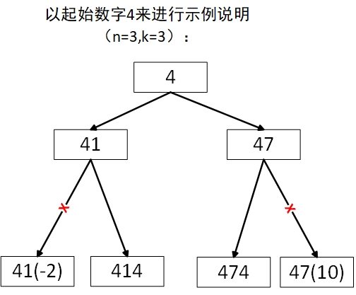

```cpp
class Solution {
public:
    vector<int> ans;
    void func(int x,int n,int k){
        //剩余位数为0，则压入结果容器中
        if(n == 0){
            ans.push_back(x);
            return ;
        }
        //左判断
        int t1 = x % 10 - k;
        int t2 = x % 10 + k;
        //右判断
        if(t1 >= 0)
            //递归判断下一位
            func(x*10+t1,n-1,k);
        //需要特殊判断下k=0时的情况，不然会出现重复元素
        if(k != 0 && t2 <= 9)
            func(x*10+t2,n-1,k);
    }
    vector<int> numsSameConsecDiff(int n, int k) {
        for(int i = 1;i < 10;i++){
            func(i,n-1,k);
        }
        return ans;
    }
};
```

#### 示例-最大黑色区域

````
题目描述
​ 现在给出一个 n∗m 的二维矩阵，矩阵上的每个点只可能是 0 （代表白色）或 1 （代表黑色）。现规定某一点的颜色与它的上下左右某点的颜色相同，则它们为同一区域，现求最大黑色区域的大小。
输入
​ 第一行两个正整数 n,m。（1≤n,m≤100）
​ 接下来输入一个二维字符矩阵，每个字符为 0 或 1。
输出
​ 输出一个整数，表示可以最大黑色区域面积。

样例输入
5 6
011001
110101
010010
000111
101110
样例输出
7
````

根据题目描述：明显是一个连通性问题，即求`最大连通区域的面积`

```cpp
#include<iostream>
#include<vector>
using namespace std;

int n,m,cnt,ans = 0;
//方向数组
int dirs[4][2] = {-1,0,1,0,0,1,0,-1};

void func(vector<vector<char>> &map,int x,int y){
    //对四个方向进行遍历
    for(int i = 0;i < 4;i++){
        int nx = x + dirs[i][0];
        int ny = y + dirs[i][1];
        //是否是黑色区域
        if(map[nx][ny] == '1'){
            //是黑色则增加连通域面积
            cnt++;
            //标记该点
            map[nx][ny] = '0';
            //递归遍历
            func(map,nx,ny);
        }
    }
}

int main(){
    cin>>n>>m;
    vector<vector<char>> map(n+2,vector<char> (m+2,'0'));
    //初始化地图
    for(int i = 1;i <= n;i++){
        //从map[i][1]开始输入一行，遇到回车结束
        cin>>&map[i][1];
    }
    //遍历每个结点，求其连通域面积
    for(int i = 1;i <= n;i++){
        for(int j = 1;j <= m;j++){
            //如果是黑色区域，则开始求取面积
            if(map[i][j] == '1'){
                cnt = 1;
                //标记已经走过
                map[i][j] = '0';
                //递归搜索
                func(map,i,j);
                //更新最大面积
                ans = ans > cnt ? ans : cnt;
            }
        }
    }
    cout<<ans<<endl;
    return 0;
}
```

#### 示例-01迷宫

```
题目描述
​ 有一个仅由数字 0 与 1 组成的 n×m 格迷宫。若你位于一格 0 上，那么你可以移动到相邻 4 格中的某一格 1 上，同样若你位于一格 1 上，那么你可以移动到相邻 4 格中的某一格 0 上。
​ 你的任务是：对于给定的迷宫，询问 k 次从某一格开始能移动到多少个格子（包含自身）。

输入
​ 第 1 行为两个正整数 n,m,k。
​ 下面 n 行，每行 m 个字符，字符只可能是 0 或者 1，字符之间没有空格。
​ 接下来 k 行每行给出一个点的在坐标。
输出
​ 对于每个坐标输出一行一个整数表示该点能移动到的格子数（包括自身）。

样例输入
2 3 4
011
100
1 1
2 2
1 3
2 3
样例输出
4
4
2
2
数据保证 1≤n,m≤3000，1≤k≤30000
```

因为本题的数据量k太大，如果一个一个求，则会超时。我们可以提前将整个图的每个点的结果求出，然后当获得坐标后直接输出。

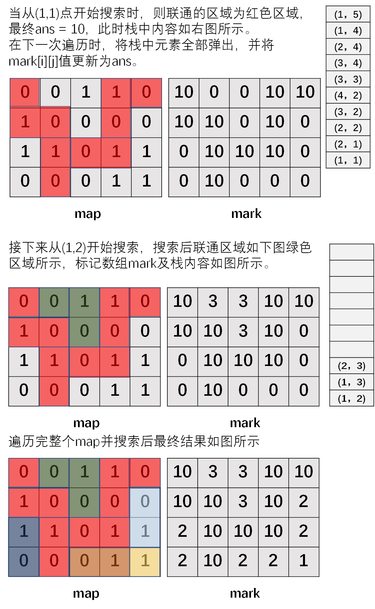

```cpp
#include<iostream>
#include<stack>
using namespace std;

int n,m,k,sx,sy,ans;
char map[3002][3002];
//标记数组
int mark[3002][3002] = {0};
//栈结点
struct node {
    int x,y;
};
stack<node> st;
//方向数组
int dirs[4][2] = {0,1,0,-1,1,0,-1,0};

void func(int x,int y){
    //将坐标压入栈中
    st.push((node){x,y});
    //搜索周围4个坐标
    for(int i = 0;i < 4;i++){
        int nx = x + dirs[i][0];
        int ny = y + dirs[i][1];
        //非0 代表标记过了 直接跳过
        if(mark[nx][ny] != 0) continue;
        //超出界限 直接跳过
        if(nx < 1 || nx > n || ny < 1 || ny > m) continue;
        //符合题目要求则进行递归搜索
        if((map[x][y] == '0' && map[nx][ny] == '1') || (map[x][y] == '1' && map[nx][ny] == '0')){
            mark[nx][ny] = 1;//标记
            ans++;//联通数 + 1
            func(nx,ny);//递归搜索
        }
    }
}

int main(){

    cin>>n>>m>>k;
    //初始化map
    for(int i = 1;i <= n;i++){
        for(int j = 1;j <= m;j++){
            cin>>map[i][j];
        }
    }
	//依次搜索整个map
    for(int i = 1;i <= n;i++){
        for(int j = 1;j <= m;j++){
            //如果没有标记过[0：没标记 非0: 标记过]
            if(mark[i][j] == 0){
                //初始化连通数
                ans = 1;
                mark[i][j] = 1;//标记
                func(i,j);//开始递归搜索
				//将栈中坐标依次弹出，更新mark
                while(!st.empty()){
                    node temp = st.top();
                    mark[temp.x][temp.y] = ans;
                    st.pop();
                }
            }
        }
    }
	//直接根据mark输出结果
    for(int i = 0;i < k;i++){
        cin>>sx>>sy;
        cout<<mark[sx][sy]<<endl;
    }
    return 0;
}
```


通过上面几个示例的学习，我们总结一下深度优先搜索的策略：

- 通常用于求解图、树中的连通性等问题
- 首先是要针对题目**创建对应的结构体 struct node{}**;来作为队列中的元素
- 根据题目 **创建/初始化 标记数组**
- **初始化队列**，加入初始元素
- 遍历初始情况，并均进行深度优先遍历
- 递归函数func
  - 以当前情况作为起始条件，继续判断其他可能发送情况，进行递归判断

### DFS在树的应用

> DFS通常会用于树这种数据结构的题型中。

#### 验证二叉搜索树

```
给定一个二叉树，判断其是否是一个有效的二叉搜索树。

假设一个二叉搜索树具有如下特征：
节点的左子树只包含小于当前节点的数。
节点的右子树只包含大于当前节点的数。
所有左子树和右子树自身必须也是二叉搜索树。
输入:
    2
   / \
  1   3
输出: true
```

```cpp
class Solution {
public:
/*
函数表示考虑以 root 为根的子树，判断子树中所有节点的值是否都在 (lower,bigger)的范围内（注意是开区间）。如果 root 节点的值 val 不在 (lower,bigger) 的范围内说明不满足条件直接返回。
根据二叉搜索树的性质，在递归调用左子树时，我们需要把上界 bigger 改为 root.val，即调用 helper(root.left, lower, root.val)，因为左子树里所有节点的值均小于它的根节点的值。同理递归调用右子树时，我们需要把下界 lower 改为 root.val，
*/
    bool func(TreeNode * root,long long int lower,long long int bigger){
        if(root == nullptr) return true;
        //如果当前结点不在上下界范围，说明不符合
        if(root->val <= lower || root->val >= bigger) return false;
        //依次判断左右子树
        return func(root->left,lower,root->val) && func(root->right,root->val,bigger);
    }

    bool isValidBST(TreeNode* root) {
        //如果树空，则返回1
        if(root == nullptr) return true;
        //进行递归判断
        return func(root,LONG_MIN,LONG_MAX);
    }
};
```

#### 路径总和II

```
给你二叉树的根节点 root 和一个整数目标和 targetSum ，找出所有 从根节点到叶子节点 路径总和等于给定目标和的路径。
叶子节点 是指没有子节点的节点。
```


>  分析：也就是DFS应用于树的指定路径求取

```cpp
class Solution {
public:
    //两个全局变量来存储结构
    vector<vector<int>> ans;//所有路径的结果集合
    vector<int> temp;//存储根节点至当前结点的路径
    void func(TreeNode * root,int targetSum,int nowgetSum){
        if(root == nullptr) return;
        //在当前路径中标记当前结点
        temp.push_back(root->val);
        //获得了符号题意的路径，存储
        if(root->val + nowgetSum == targetSum && (!root->left) && (!root->right)) ans.push_back(temp);
        //遍历左右子树
        func(root->left,targetSum,root->val+nowgetSum);
        func(root->right,targetSum,root->val+nowgetSum);
        //遍历完左右子树，要回退，因此也要把当前路径中的当前结点弹出
        temp.pop_back();
    }
    vector<vector<int>> pathSum(TreeNode* root, int targetSum) {
        if(root == nullptr) return ans;
        //从根节点开始遍历
        func(root,targetSum,0);
        return ans;
    }
};
```


#### 树的子结构

输入两棵二叉树A和B，判断B是不是A的子结构。(约定空树不是任意一个树的子结构)

B是A的子结构， 即 A中有出现和B相同的结构和节点值。

```
给定的树 A:
     3
    / \
   4   5
  / \
 1   2
给定的树 B：
   4 
  /
 1
返回 true，因为 B 与 A 的一个子树拥有相同的结构和节点值。
```

题目解析：

首先是找到A中有没有和B根节点值相同的结点，有的话就和B一起递归深度遍历树，判断两个树是否一样。

```java
/**
 * Definition for a binary tree node.
 * public class TreeNode {
 *     int val;
 *     TreeNode left;
 *     TreeNode right;
 *     TreeNode(int x) { val = x; }
 * }
 */
class Solution {
    //比较以A和B为根节点的树，B是否是A的子结构
    public boolean check(TreeNode A,TreeNode B){
        if(B == null) return true; //B是null true
        else if(A == null && B != null) return false;//A中结点null，B有值，则false
        else if(A.val != B.val) return false; //两个结点的值不等 false
        else return check(A.left,B.left) && check(A.right,B.right); //继续递归比较
    }
    //找A中与B根节点相同的子结点
    public boolean dfs(TreeNode A,TreeNode B){
        //如果A是空，说明找到了底层没找到，返回false
        if(A == null) return false;
       	//如果找到了，开始比较B是否是A中的一个子树，是的话返回错误，不是的话则继续在A中找与B根节点相同的结点
        if(A.val == B.val && check(A,B)) {
            return true;
        }//继续递归A的左右子节点寻找与B根节点相同的结点
        else return dfs(A.left,B) || dfs(A.right,B);
    }
    public boolean isSubStructure(TreeNode A, TreeNode B) {
        //根据题目要求，空树不是任意一个树的子结构，因此可以作为特殊情况直接判断
        if (A == null || B == null) return false;
        //深度优先搜索找A中与B根节点相同的子结点
        return dfs(A,B);
    }
}
```


#### 移除子树后的二叉树高度

给你一棵 二叉树 的根节点 root ，树中有 n 个节点。每个节点都可以被分配一个从 1 到 n 且互不相同的值。另给你一个长度为 m 的数组 queries 。

你必须在树上执行 m 个 独立 的查询，其中第 i 个查询你需要执行以下操作：

- 从树中 移除 以 queries[i] 的值作为根节点的子树。题目所用测试用例保证 queries[i] 不 等于根节点的值。
  返回一个长度为 m 的数组 answer ，其中 answer[i] 是执行第 i 个查询后树的高度。

注意：

- 查询之间是独立的，所以在每个查询执行后，树会回到其 初始 状态。
- 树的高度是从根到树中某个节点的 最长简单路径中的边数 。

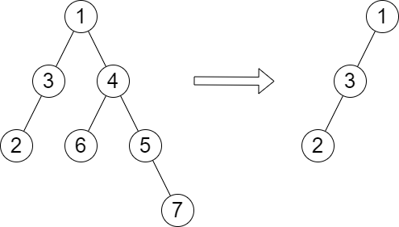

```
输入：root = [1,3,4,2,null,6,5,null,null,null,null,null,7], queries = [4]
输出：[2]
解释：上图展示了从树中移除以 4 为根节点的子树。
树的高度是 2（路径为 1 -> 3 -> 2）。
```

第一次DFS求取每个结点的高度。

然后再 DFS 一遍这棵树，同时维护当前节点深度  depth（从 0 开始），以及删除当前子树后剩余部分的树的高度  restH（这里定义成最长路径的边数）。

具体做法如下：

- 往左走，递归前算一下从根节点到当前节点右子树最深节点的长度，即 $\textit{depth} + \textit{height}[\textit{node}.\textit{right}]$，与 $\textit{restH}$ 取最大值，然后往下递归；
- 往右走，递归前算一下从根节点到当前节点左子树最深节点的长度，即 $\textit{depth} + \textit{height}[\textit{node}.\textit{left}]$，与 $\textit{restH}$ 取最大值，然后往下递归。

每个节点的答案即为递归到该节点时的 $\textit{restH}$值。

```java
/**
 * Definition for a binary tree node.
 * public class TreeNode {
 *     int val;
 *     TreeNode left;
 *     TreeNode right;
 *     TreeNode() {}
 *     TreeNode(int val) { this.val = val; }
 *     TreeNode(int val, TreeNode left, TreeNode right) {
 *         this.val = val;
 *         this.left = left;
 *         this.right = right;
 *     }
 * }
 */
class Solution {
    Map<TreeNode,Integer> height = new HashMap<>();
    int [] res;
    private int getHeight(TreeNode root){
        if(root == null) return 0;
        int h = 1 + Math.max(getHeight(root.left),getHeight(root.right));
        height.put(root,h);
        return h;
    }
    private void dfs(TreeNode root,int depth,int restH){
        if(root == null) return ;
        depth += 1;
        res[root.val] = restH;
        dfs(root.left,depth,Math.max(restH,depth + height.get(root.right)));
        dfs(root.right,depth,Math.max(restH,depth + height.get(root.left)));
    }
    public int[] treeQueries(TreeNode root, int[] queries) {
        height.put(null,0); // 这样就不用使用getOrDefault
        getHeight(root);

        int n = height.size();
        res = new int[n+1];
        dfs(root,-1,0);
        
        int m = queries.length;
        int [] ans = new int[m];
        for(int i = 0;i < m;i++){
            ans[i] = res[queries[i]];
        }
        return ans;
    }
}
```


### 常规应用

#### 可能的二分法

给定一组 n 人（编号为 1, 2, ..., n）， 我们想把每个人分进任意大小的两组。每个人都可能不喜欢其他人，那么他们不应该属于同一组。

给定整数 n 和数组 dislikes ，其中 dislikes[i] = [ai, bi] ，表示不允许将编号为 ai 和  bi的人归入同一组。当可以用这种方法将所有人分进两组时，返回 true；否则返回 false。

```
输入：n = 4, dislikes = [[1,2],[1,3],[2,4]]
输出：true
解释：group1 [1,4], group2 [2,3]
```

方法1:搜索 深度优先搜索/广度优先搜索

我们尝试将某个元素染色为1，然后将不能分为一组的其他元素染色为2，当搜索过程中遇到冲突即表示不能完成二分

```java
class Solution {
    int [] color;
    Map<Integer,Set<Integer>> map = new HashMap<>();
    private boolean dfs(int node,int c){
        color[node] = c; // 当前染色
        for(int next : map.getOrDefault(node,new HashSet<>())){
            if(color[next] == c){ // 颜色冲突
                return false;
            }else if(color[next] == 0 && !dfs(next,3 ^ c)){
                return false;
            }
        }
        return true;
    }
    
    public boolean possibleBipartition(int n, int[][] dislikes) {
        color = new int[n+1];
        for(int [] v : dislikes){
            Set<Integer> s = map.getOrDefault(v[0],new HashSet<>());
            s.add(v[1]);
            map.put(v[0],s);  
            s = map.getOrDefault(v[1],new HashSet<>());
            s.add(v[0]);
            map.put(v[1],s); 
        }
      // 为什么要每个元素都嗖一下呢？因为数据可能是分离的
        for(int i = 1;i <= n;i++){
            if(color[i] == 0 && !dfs(i,1)){
                return false;
            }
        }
        return true;
    }
}
```

> 同样，采用广度优先搜索也可以

方法2:并查集

```java
class unionfind{
    public int [] p;
    public unionfind(int n){
        p = new int[n+1];
        for(int i = 0;i <= n;i++){
            p[i] = i;
        }
    }
    public int find(int x){
        return p[x] == x ? x : (p[x] = find(p[x]));
    }
    public void union(int x,int y){
        int px = find(x);
        int py = find(y);
        if(px != py){
            p[px] = py;
        }
    }
}

class Solution {
    Map<Integer,List<Integer>> map = new HashMap<>();
    unionfind uf;
    public boolean possibleBipartition(int n, int[][] dislikes) {
        uf = new unionfind(n);
        for(int [] v : dislikes){
            List<Integer> s = map.getOrDefault(v[0],new ArrayList<>());
            s.add(v[1]);
            map.put(v[0],s);  
            s = map.getOrDefault(v[1],new ArrayList<>());
            s.add(v[0]);
            map.put(v[1],s); 
        }
        for(int i = 1;i <= n;i++){
            List<Integer> ne = map.getOrDefault(i,new ArrayList<>());
            for(int j = 0;j < ne.size();j++){
                uf.union(ne.get(0),ne.get(j));
                if(uf.find(i) == uf.find(ne.get(j))){
                    return false;
                }
            }
        }
        return true;
    }
}
```


#### 创建价值相同的连通块

有一棵 n 个节点的无向树，节点编号为 0 到 n - 1 。

给你一个长度为 n 下标从 0 开始的整数数组 nums ，其中 nums[i] 表示第 i 个节点的值。同时给你一个长度为 n - 1 的二维整数数组 edges ，其中 $edges[i] = [a_i, b_i]$ 表示节点 $a_i$ 与 $b_i$ 之间有一条边。

你可以 删除 一些边，将这棵树分成几个连通块。一个连通块的 价值 定义为这个连通块中 所有 节点 i 对应的 nums[i] 之和。

你需要删除一些边，删除后得到的各个连通块的价值都相等。请返回你可以删除的边数 最多 为多少。


```
输入：nums = [6,2,2,2,6], edges = [[0,1],[1,2],[1,3],[3,4]] 
输出：2 
解释：上图展示了我们可以删除边 [0,1] 和 [3,4] 。得到的连通块为 [0] ，[1,2,3] 和 [4] 。每个连通块的价值都为 6 。可以证明没有别的更好的删除方案存在了，所以答案为 2 
```


```java
class Solution {
    int [] nums;
    int target;
    List<Integer> [] g;

    private int dfs(int x,int p){
        int sum = nums[x];
        for (int y : g[x]){
            if (y != p){ // 当前结点不是父结点
                int res = dfs(y,x); // 统计子树的价值
                if (res < 0) return -1; // 删除当前边方案不合法
                sum += res;
            }
        }
        if (sum > target) return -1; // 当前子树的价值超过target 方案不可行
        // sum == target 表示找到了一个连通块，返回0
        // 否则表示还没找到连通块，返回价值
        return sum < target ? sum : 0;
    }

    public int componentValue(int[] nums, int[][] edges) {
        int n = nums.length;
        // 建图
        g = new ArrayList[n];
        Arrays.setAll(g,e -> new ArrayList<>());
        for (int [] edge : edges){
            int x = edge[0],y = edge[1];
            g[x].add(y);
            g[y].add(x);
        }
        this.nums = nums;
        int total = Arrays.stream(nums).sum();
        int max = Arrays.stream(nums).max().orElseThrow();
        // 枚举连通块个数
        for (int i = Math.min(n,total / max);;i--){
            if (total % i == 0){ // 如果能够被整除 则每个连通块的价值应该都为 total / i
                target = total / i;
                // 开始搜索
                if (dfs(0,-1) == 0) return i-1;
            }
        }
    }
}
```

#### 字母大小写全排列

给定一个字符串 `s` ，通过将字符串 `s` 中的每个字母转变大小写，我们可以获得一个新的字符串。

返回 *所有可能得到的字符串集合* 。以 **任意顺序** 返回输出。

```
输入：s = "a1b2"
输出：["a1b2", "a1B2", "A1b2", "A1B2"]
```

比较简单的搜索题目,常规搜索就行。

```java
class Solution {
    char [] cs;
    int n;
    List<String> ans = new ArrayList<>();
    StringBuilder sb = new StringBuilder();
    private void dfs(int idx){
        if(idx == n){
            ans.add(sb.toString());
            return ;
        }
        sb.append(cs[idx]);
        dfs(idx+1);
        sb.deleteCharAt(sb.length() - 1);
        
        if(cs[idx] >= 'a' && cs[idx] <= 'z'){
            sb.append((char)(cs[idx] - 32));
            dfs(idx+1);
            sb.deleteCharAt(sb.length() - 1);
        }else if(cs[idx] >= 'A'  && cs[idx] <= 'Z'){
            sb.append((char)(cs[idx] + 32));
            dfs(idx+1);
            sb.deleteCharAt(sb.length() - 1);
        }
    }
    public List<String> letterCasePermutation(String s) {
        cs = s.toCharArray();
        n = cs.length;
        dfs(0);
        return ans;
    }
}
```


### 剪枝优化

#### 根据模式串构造最小数字

给你下标从 **0** 开始、长度为 `n` 的字符串 `pattern` ，它包含两种字符，`'I'` 表示 **上升** ，`'D'` 表示 **下降** 。

你需要构造一个下标从 **0** 开始长度为 `n + 1` 的字符串，且它要满足以下条件：

- `num` 包含数字 `'1'` 到 `'9'` ，其中每个数字 **至多** 使用一次。
- 如果 `pattern[i] == 'I'` ，那么 `num[i] < num[i + 1]` 。
- 如果 `pattern[i] == 'D'` ，那么 `num[i] > num[i + 1]` 。

请你返回满足上述条件字典序 **最小** 的字符串 `num`。

```
输入：pattern = "IIIDIDDD"
输出："123549876"
解释：
下标 0 ，1 ，2 和 4 处，我们需要使 num[i] < num[i+1] 。
下标 3 ，5 ，6 和 7 处，我们需要使 num[i] > num[i+1] 。
一些可能的 num 的值为 "245639871" ，"135749862" 和 "123849765" 。
"123549876" 是满足条件最小的数字。
注意，"123414321" 不是可行解因为数字 '1' 使用次数超过 1 次。
```

**提示：**

- `1 <= pattern.length <= 8`
- `pattern` 只包含字符 `'I'` 和 `'D'` 。

根据数据量，可以想到搜索，由于要求的是字典序最小的字符串，我们想到优先从1开始搜索。

```java
    char [] cs;
    int n;
    List<Integer> ans = new ArrayList<>();
    boolean [] st = new boolean[10];

    /**
     * idx表示当前是 pattern 串的第i位，last指的是上一位数字是多少
     * @param idx
     * @param last
     * @return
     */
    private boolean dfs(int idx,int last){
        // 搜索翻车 返回 true
        if (idx == n) return true;
        // 当前位尝试从1开始搜索
        for (int i = 1;i <= 9;i++){
            if (st[i]) continue; // 如果已经用过直接跳过
            // 根据题意的剪枝操作
            if ((cs[idx] == 'I' && i < last) || (cs[idx] == 'D' && i > last)) continue;
            // 标记现场
            st[i] = true;
            ans.add(i);
            // 继续搜索下一位
            if (dfs(idx+1,i)) return true;
            // 恢复现场
            ans.remove(ans.size()-1);
            st[i] = false;
        }
        return false;
    }
    public String smallestNumber(String pattern) {
        n = pattern.length();
        cs = pattern.toCharArray();
        // 枚举第0位
        for (int i = 1;i <= 9;i++){
            st[i] = true;
            ans.add(i);
            if (dfs(0,i)) break;
            // 恢复现场
            ans.remove(ans.size()-1);
            st[i] = false;
        }
        // List => String
        StringBuilder sb = new StringBuilder();
        for (Integer c : ans){
            sb.append(c);
        }
        return sb.toString();
    }
```

#### 小猫爬山

翰翰和达达饲养了 N 只小猫，这天，小猫们要去爬山。

经历了千辛万苦，小猫们终于爬上了山顶，但是疲倦的它们再也不想徒步走下山了（呜咕>_<）。

翰翰和达达只好花钱让它们坐索道下山。

索道上的缆车最大承重量为 W ，而 N 只小猫的重量分别是 C1、C2……CN。

当然，每辆缆车上的小猫的重量之和不能超过 W 。

每租用一辆缆车，翰翰和达达就要付 1 美元，所以他们想知道，最少需要付多少美元才能把这 N 只小猫都运送下山？

**输入格式**：

第 1 行：包含两个用空格隔开的整数，N 和 W。

第 2..N+1 行：每行一个整数，其中第 i+1 行的整数表示第 i 只小猫的重量 Ci。

**输出格式**：

输出一个整数，表示最少需要多少美元，也就是最少需要多少辆缆车。

**题目解析**：

我们依次将小猫尝试放入已经开启的缆车，如果能放下，则去尝试放下一只，也可以新开辟一辆缆车给当前小猫。

剪枝优化：

- 优先放比较重的小猫
- 如果放置当前小猫后的重量直接超重w，直接剪枝
- 如果当前开启的缆车树已经大于了搜索过程的最优质ans，剪枝

```java
import java.io.BufferedReader;
import java.io.IOException;
import java.io.InputStreamReader;
import java.util.Arrays;

public class Main {
    static int N,W;
    static int [] weights,sum;
    static int ans = Integer.MAX_VALUE;
    public static void dfs(int t,int idx){
        // 如果当前已经不是最优解，直接返回
        if(t + 1 > ans) return;
        if(idx < 0){
            ans = Math.min(ans,t + 1);
            return ;
        }
        // 把小猫尝试放置在已经租用的缆车上
        for (int i = 0;i <= t;i++){
            if(sum[i] + weights[idx] <= W){
                sum[i] += weights[idx];
                dfs(t,idx-1);
                sum[i] -= weights[idx];
            }
        }
        // 新开一辆车放小猫
        if(idx != N-1){
            sum[t+1] += weights[idx];
            dfs(t+1,idx-1);
            sum[t+1] = 0;
        }

    }
    public static void main(String[] args) throws IOException {
        BufferedReader br = new BufferedReader(new InputStreamReader(System.in));
        String [] ins = br.readLine().split(" ");
        N = Integer.parseInt(ins[0]);
        W = Integer.parseInt(ins[1]);
        weights = new int[N];
        for (int i = 0;i < N;i++){
            weights[i] = Integer.parseInt(br.readLine());
        }
        Arrays.sort(weights);
        sum = new int[N];
        dfs(0,N-1);
        System.out.println(ans);
    }
}
```


#### 数独

[数独](https://baike.baidu.com/item/数独/74847?fr=aladdin) 是一种传统益智游戏，你需要把一个 9×9 的数独补充完整，使得数独中每行、每列、每个 3×3 的九宫格内数字 1∼9 均恰好出现一次。

请编写一个程序填写数独。

**输入格式**：

输入包含多组测试用例。

每个测试用例占一行，包含 81 个字符，代表数独的 81 个格内数据（顺序总体由上到下，同行由左到右）。

每个字符都是一个数字（1−9）或一个 `.`（表示尚未填充）。

您可以假设输入中的每个谜题都只有一个解决方案。

文件结尾处为包含单词 `end` 的单行，表示输入结束。

**输出格式**：

每个测试用例，输出一行数据，代表填充完全后的数独。

**题目解析**：

我们依次遍历所有还没有填的格子，尝试将1-9中的某些数字填上，问题是如何判断当前点可以填哪些数字，暴力的方法是依次遍历当前点的行、列以及所在九宫格判断当前元素是否出现，但是这样比较耗时。我们利用状态压缩优化。

状态压缩：我们可以用 9 位数字表示某一行或者某一列或者某一个九宫格的状态，用0表示已经填上了，1表示没有填上。以110010101为例子：表示3、4、6、8已经填上了。通过状态压缩，我们只要对当前位置的三个状态进行&运算即可知道可以填哪些数字。比如：

- 行：	   110100100
- 列：       010010100
- 九宫格：111010110
- &运算： 010000100， 因此就知道了当前位置可以填2和7

优化搜索顺序：优先搜索哪些可填数字比较少的格子

```java

import java.io.BufferedReader;
import java.io.IOException;
import java.io.InputStreamReader;
import java.util.Arrays;
import java.util.HashMap;
import java.util.Map;

public class Main {
    static int N = 9,M = 1 << N;
    static int [] ones = new int[M]; // 记录有多少个1
    // 记录key最低位的位置
    static Map<Integer,Integer> map = new HashMap<>();
    static int [] row = new int[N];
    static int [] col = new int[N];
    static int [][] cell = new int[3][3];
    static char [] str;

    /**
     * 初始化
     */
    public static void init(){
        for (int i = 0;i < N;i++)
            row[i] = col[i] = (1 << N) - 1;
        for (int i = 0;i < 3;i++)
            for (int j = 0;j < 3;j++)
                cell[i][j] = (1 << N) - 1;
    }

    /**
     * 修改 str[i * N + j] 的值及状态
     * @param i
     * @param j
     * @param t
     * @param is_set
     */
    public static void draw(int i,int j,int t,boolean is_set){
        if (is_set) str[i * N + j] = (char)(t + '1');
        else str[i * N + j] = '.';
        // 修改状态
        int v = 1 << t;
        if (!is_set) v = -v;
        row[i] -= v;
        col[j] -= v;
        cell[i / 3][j / 3] -= v;
    }

    /**
     * 返回最低位1的值
     * @param x
     * @return
     */
    public static int lowbit(int x){
        return x & (-x);
    }

    public static int get(int x,int y){
        return row[x] & col[y] & cell[x / 3][y / 3];
    }

    public static boolean dfs(int cnt){
        if (cnt == 0) return true; // 全部填完
        // 优先搜索能填的最少可能的格子
        int minv = 10;
        int x = - 1,y = -1;
        for (int i = 0;i < N;i++){
            for (int j = 0;j < N;j++){
                if (str[i * N + j] == '.'){
                    int state = get(i,j);
                    if (ones[state] < minv){
                        minv = ones[state];
                        x = i;
                        y = j;
                    }
                }
            }
        }

        int state = get(x,y); // 得到状态值
        for (int i = state;i != 0; i -= lowbit(i)){
            int t = map.get(lowbit(i));
            draw(x,y,t,true);
            if (dfs(cnt-1)) return  true;
            draw(x,y,t,false);
        }
        return false;
    }

    public static void main(String[] args) throws IOException {
        // 初始化ones 和 map
        for (int i = 0;i < N;i++)
            map.put(1 << i,i);
        for (int i = 0;i < 1 << N;i++){
            for (int j = 0;j < N;j++){
                ones[i] += (i >> j) & 1;
            }
        }
        BufferedReader br = new BufferedReader(new InputStreamReader(System.in));
        while (true){
            String s = br.readLine();
            if ("end".equals(s)) break;
            str = s.toCharArray();
            init(); // 初始化
            int cnt = 0;
            for (int i = 0,k = 0;i < N;i++){
                for (int j = 0;j < N;j++,k++) {
                    if(str[k] != '.'){
                        int t = str[k] - '1';
                        draw(i,j,t,true);
                    }else cnt += 1;
                }
            }

            dfs(cnt);
            for (int i = 0;i < str.length;i++){
                System.out.print(str[i]);
            }
            System.out.printf("\n");
        }
    }
}
```

#### 靶形数独

小城和小华都是热爱数学的好学生，最近，他们不约而同地迷上了数独游戏，好胜的他们想用数独来一比高低。

但普通的数独对他们来说都过于简单了，于是他们向 ZZ 博士请教，ZZ 博士拿出了他最近发明的“靶形数独”，作为这两个孩子比试的题目。

靶形数独的方格同普通数独一样，在 9×9 的大九宫格中有 9 个 3×3 的小九宫格（用粗黑色线隔开的）。

在这个大九宫格中，有一些数字是已知的，根据这些数字，利用逻辑推理，在其他的空格上填入 11到 9 的数字。

每个数字在每个小九宫格内不能重复出现，每个数字在每行、每列也不能重复出现。

但靶形数独有一点和普通数独不同，即每一个方格都有一个分值，而且如同一个靶子一样，离中心越近则分值越高（如下图所示）。


上图具体的分值分布是：最里面一格（黄色区域）为 10 分，黄色区域外面的一圈（红色区域）每个格子为 9 分，再外面一圈（蓝色区域）每个格子为 8 分，蓝色区域外面一圈（棕色区域）每个格子为 7 分，最外面一圈（白色区域）每个格子为 6 分，如上图所示。

比赛的要求是：每个人必须完成一个给定的数独（每个给定数独可能有不同的填法），而且要争取更高的总分数。

而这个总分数即每个方格上的分值和完成这个数独时填在相应格上的数字的乘积的总和。

如图，在以下的这个已经填完数字的靶形数独游戏中，总分数为 2829。

游戏规定，将以总分数的高低决出胜负。


由于求胜心切，小城找到了善于编程的你，让你帮他求出，对于给定的靶形数独，能够得到的最高分数。

**输入格式**：

输入一共包含 9 行。

每行 9个整数（每个数都在 0—9 的范围内），表示一个尚未填满的数独方格，未填的空格用 0 表示。

每两个数字之间用一个空格隔开。

**输出格式**：

输出可以得到的靶形数独的最高分数。

如果这个数独无解，则输出整数 −1。

```java
import java.io.BufferedReader;
import java.io.IOException;
import java.io.InputStreamReader;
import java.util.Arrays;
import java.util.HashMap;
import java.util.Map;

public class Main {
    static int N = 9,M = 1 << N;
    static int [] ones = new int[M];
    static Map<Integer,Integer> map = new HashMap<>();
    static int [][] board = new int[N][N];
    static int [] row = new int[N];
    static int [] col = new int[N];
    static int [][] cell =new int[3][3];
    static int ans = -1;
    public static int getVal(int x,int y,int v){
        return (Math.min(Math.min(x,8-x),Math.min(y,8-y)) + 6)  * v;
    }
    public static int lowbit(int x){
        return x & (-x);
    }
    public static int getState(int x,int y){
        return row[x] & col[y] & cell[x/3][y/3];
    }
    public static void draw(int x,int y,int t){
        int s = 1;
        if (t > 0) board[x][y] = t;
        else{
            s = -1;
            t = -t;
            board[x][y] = 0;
        }
        t --;
        row[x] -= (1 << t) * s;
        col[y] -= (1 << t) * s;
        cell[x / 3][y / 3] -= (1 << t) * s;
    }
    public static void dfs(int nowVal,int cnt){
        if (cnt == 0){
            ans = Math.max(ans,nowVal);
            return ;
        }
        int minv = 10;
        int x = - 1,y = -1;
        for (int i = 0;i < N;i++){
            for (int j = 0;j < N;j++){
                if (board[i][j] == 0){
                    int state = getState(i,j);
                    if (ones[state] < minv){
                        minv = ones[state];
                        x = i;
                        y = j;
                    }
                }
            }
        }
        // 获取要填格子的状态
        int state = getState(x,y);
        for (int i = state;i != 0;i -= lowbit(i)){
            int t = map.get(lowbit(i)) + 1;
            draw(x,y,t);
            int add = getVal(x,y,t);
            dfs(nowVal + add,cnt-1);
            draw(x,y,-t);
        }
    }

    public static void main(String[] args) throws IOException {
        BufferedReader br = new BufferedReader(new InputStreamReader(System.in));
        // 初始化ones 和 map
        for (int i = 0;i < N;i++)
            map.put(1 << i,i);
        for (int i = 0;i < M;i++){
            for (int j = i;j != 0;j -=lowbit(j)){
                ones[i] += 1;
            }
        }
        // 初始化row col cell
        for (int i = 0;i < N;i++)
            row[i] = col[i] = (1 << N) - 1;
        for (int i = 0;i < 3;i++)
            for (int j = 0;j < 3;j++)
                cell[i][j] = (1 << N) - 1;
        // 读入数据记录有多少个空要填
        int cnt = 0,score = 0;
        for (int i = 0;i < N;i++){
            String [] ins = br.readLine().split(" ");
            for (int j = 0;j < N;j++){
                int v = Integer.parseInt(ins[j]);
                if (v == 0){
                    cnt += 1;
                }else{
                    draw(i,j,v);
                    score += getVal(i,j,v);
                }
            }
        }
        dfs(score,cnt);
        System.out.println(ans);
    }
}
```


#### 木棒

乔治拿来一组等长的木棒，将它们随机地砍断，使得每一节木棍的长度都不超过 50 个长度单位。

然后他又想把这些木棍恢复到为裁截前的状态，但忘记了初始时有多少木棒以及木棒的初始长度。

请你设计一个程序，帮助乔治计算木棒的可能最小长度。

每一节木棍的长度都用大于零的整数表示。

**输入格式**：

输入包含多组数据，每组数据包括两行。

第一行是一个不超过 64 的整数，表示砍断之后共有多少节木棍。

第二行是截断以后，所得到的各节木棍的长度。

在最后一组数据之后，是一个零。

**输出格式**：

为每组数据，分别输出原始木棒的可能最小长度，每组数据占一行。

**题目解析**：

从小到达枚举所有可能的长度，最小可能值，木棍中最大值；最大可能值，木棍长度之和

剪枝优化：

- 优化搜索顺序：优先搜索长的木棍，以增大回溯概率
- 排除等效冗余：
  - 按照组合数方式枚举，比如 1 2 3 组成长度为 6 的木棍 和 2 1 3组合是一样的，因此在搜索的过程中传入一个枚举起始下标，以保证搜索过程中每根木棍的下标是递增的。
  - 还有种是比如当前枚举到4 3，即枚举3时失败了，枚举下一个如果还是3 一定也会失败，直接跳过。即，如果当前木棍加到当前棒中组合失败，则直接略过后面所有长度相等的木棍。
- 可行性剪枝：
  - 如果是木棒的第一根木棍失败，则一定失败
  - 如果是木棒的最后一根木棍失败，则一定失败

站在木棒的角度去将其分配给不同的木棒，超时了... 个人感觉是因为这里没有考虑到排除等效冗余的组合剪枝

```java
import java.io.BufferedReader;
import java.io.IOException;
import java.io.InputStreamReader;
import java.util.Arrays;
import java.util.HashMap;
import java.util.Map;

public class Main {
    static int n;
    static int [] nums;
    public static boolean dfs(int [] perlen,int idx,int limit){
        if (idx < 0) return true;
        for (int i = 0;i < perlen.length;i++){
            if (idx == n - 1 && i > 0) return false;
            if (i > 0 && perlen[i] == perlen[i-1]) continue;  // 剪枝：排除等效冗余
            if (perlen[i] + nums[idx] <= limit){ // 直接超出了，剪枝
                perlen[i] += nums[idx];
                if (dfs(perlen,idx-1,limit)) return true;
                perlen[i] -= nums[idx];
            }
        }
        return false;
    }
    public static void main(String[] args) throws IOException {
        BufferedReader br = new BufferedReader(new InputStreamReader(System.in));
        while (true){
            n = Integer.parseInt(br.readLine());
            if (n == 0) break;
            nums = new int[n];
            String [] ins = br.readLine().split(" ");
            for (int i = 0;i < n;i++){
                nums[i] = Integer.parseInt(ins[i]);
            }
            Arrays.sort(nums);
            int l = nums[n-1], sum = Arrays.stream(nums).sum();
            for (int i = l;i <= sum;i++){
                if (sum % i != 0) continue; // 剪枝：如果本身就不能被整除，则剪枝
                int m = sum / i; // 假设有m根木棒
                int [] perlen = new int[m];
                if (dfs(perlen,n-1,i)){
                    System.out.println(i);
                    break;
                }
            }
        }
    }
}
```

继续增加剪枝优化：

以木棒为视角，考虑依次将木棍组合成当前木棒，这时能够用上了剩下的剪枝方法。

```java

import java.io.BufferedReader;
import java.io.IOException;
import java.io.InputStreamReader;
import java.util.Arrays;
import java.util.HashMap;
import java.util.Map;

public class Main {
    static int n,sum,len;
    static int [] nums;
    static boolean [] st;
    public static boolean dfs(int stickId,int nowstickLen,int start){
        if (stickId * len == sum) return true; // 已经拼完所有木棒 stickId * limit <= sum,因此当等于时表示拼凑完毕
        if (nowstickLen == len) { // 当前木棍拼凑完成
            return dfs(stickId + 1,0,n-1);
        }
      // 从start开始，排除等效冗余2
        for (int i = start;i >= 0;i--){
            if (st[i]) continue;
            if (nowstickLen + nums[i] > len) continue; // 剪枝：本身就超了
            st[i] = true;
            if (dfs(stickId,nowstickLen+nums[i],i-1)) return true; 
            st[i] = false;

            if (nowstickLen == 0) return false; // 可行性剪枝1
            if (nowstickLen + nums[i] == len) return false; //可行性剪枝2

          	// 排除等效冗余1
            int j = i;
            while (j >=0  && nums[i] == nums[j]) j--;
            i = j+1;
        }
        return false;
    }
    public static void main(String[] args) throws IOException {
        BufferedReader br = new BufferedReader(new InputStreamReader(System.in));
        while (true){
            n = Integer.parseInt(br.readLine());
            if (n == 0) break;
            nums = new int[n];
            String [] ins = br.readLine().split(" ");
            for (int i = 0;i < n;i++){
                nums[i] = Integer.parseInt(ins[i]);
            }
            Arrays.sort(nums);
            st = new boolean[n];
            sum = Arrays.stream(nums).sum();
            len = nums[n-1];
            while (len <= sum) {
                if (sum % len == 0 && dfs(0, 0, n - 1)) {
                    System.out.println(len);
                    break;
                }
                len += 1;
            }
        }
    }
}
```

#### 数的划分

将整数 n 分成 k 份，且每份不能为空，问有多少种不同的分法。

当 n=7,k=3时，下面三种分法被认为是相同的：(1,1,5),(1,5,1),(5,1,1)。

**输入格式**：

一行两个整数 n,k。

**输出格式**：

一行一个整数，即不同的分法数。

题目解析：

由于是求组合，因此我们规定当前数必须大于等于前一个数，从而完成去重。

```java
import java.io.BufferedReader;
import java.io.IOException;
import java.io.InputStreamReader;
import java.util.Arrays;
import java.util.HashMap;
import java.util.Map;

public class Main {
    static int n,k,ans = 0;
    public static void dfs(int idx,int pre,int m){
        if (idx == k){
            if(m >= pre)ans += 1;
            return ;
        }
      // 优化2:上限 小于等于剩余数的平均值
        for (int i = pre;i <= m / (k - idx + 1);i++){
            dfs(idx+1,i,m-i);
        }
    }
    public static void main(String[] args) throws IOException {
        BufferedReader br = new BufferedReader(new InputStreamReader(System.in));
        String [] ins = br.readLine().split(" ");
        n = Integer.parseInt(ins[0]);
        k = Integer.parseInt(ins[1]);
        dfs(1,1,n);
        System.out.println(ans);
    }
}
```


## BFS

> 广搜是对某种数据结构进行层次遍历，基于迭代的搜索，不会爆栈。

**应用场景**：

- **最少**步数/**最短**路径 等问题


> 一般最短，用到广度优先搜索

- 连通性问题
- 树的层次遍历

要点：

- 需要一个数组mark[]来标记结点是否被遍历过，防止重复遍历
- 利用 队列FIFO
- 一般要抽象成树、图等模型

**BFS如何记录路径Path? 比如最短路径？**

> 可以记录每个点是由哪个点转移的，这样就可以从终点沿着找到起点

### BFS在图的应用

>  假设已经有邻接矩阵matrix [N+1] [N+1]，标记数组mark[N+1]

```cpp
struct node{//根据不同题意可以设置相应结构体
	int id; //编号
	int floor; //第几层
};
//start 为出发搜索的点，dst 为目标点
queue<int> que;
que.push((node){strat,0});
mark[start] = 1;//进行标记
while(!que.empty()){
	node temp = que.front();
	que.pop();
    if(temp.id == dst){
       //找到了目标结点，并进行某种操作，此处打印其层数
       cout<<temp.id + 1<<endl;
        return 0;
    }
	for(int i = 1;i <= n;i++){//广度遍历改点的邻接点
		if(matrix[temp.id][i] == 1 && mark[i] == 0){
			mark[i] = 1;
			que.push((node){i,temp.floor + 1});
		}
	}
}
```

#### 示例--警察找车

```
题目描述
​ 年轻的拉尔夫开玩笑地从一个小镇上偷走一辆车，但他没想到的是那车属于警察局。并且车上装有用于发射车子移动路线的装置。那个装置太旧了，以至于只能发射关于那辆车的移动路线的方向信息。
​ 通过使用一张小镇的地图，帮助警察局找到那车。表示出该车最终所有可能的位置。
​ 小镇的地图是矩形的，上面的符号用来标明那儿可以行车和那儿不行。“.” 表示小镇上那块地方是可以行车的，符号 “X” 表示此处不能行车。拉尔夫所开小车的初始位置，用字符的 “∗”，表示，且汽车能从初始位置通过。汽车能向四个方向移动：向北（上），南（下），西（左），东（右）；拉尔夫所开小车的行动路线是通过一组给定的方向来描述的，在每个给定的方向，拉尔夫驾驶小车通过小镇上的一个或更多的可行车地点。

输入
​ 第一行两个整数 n,m，表示小镇地图大小。（1≤n,m≤50）
​ 接下来是一个 n∗m 的矩阵，由 .∗X 组成，表示小镇的地图。
​ 再接下来一行一个整数 N(1≤N≤1000)，表示接下来有 N 个方向。
​ 接下来 N 行，每行一个方向单词，NORTH,SOUTH,WEST,EAST 分别表示上下左右，代表汽车的移动方向，任何两个连续的方向都不相同。
输出
​ 输出小镇的地图，在地图上，汽车最终可能出现的点用 ∗ 来表示。

​ 样例输入
4  5
.....
.X...
...*X
X.X..
3
NORTH
WEST
SOUTH
​ 样例输出
.....
*X*..
*.*.X
X.X..
```

题目分析：

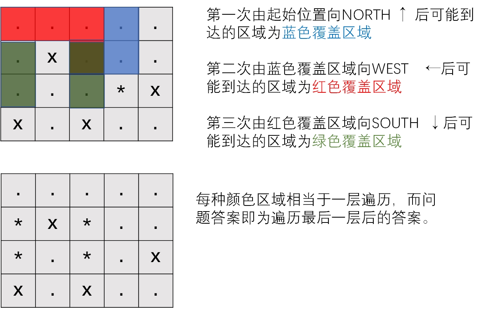

```cpp
#include<iostream>
#include<vector>
#include<queue>
#include<string>
using namespace std;
//记录矩阵大小及起始点坐标
int n,m,sx,sy;
//自定义结构体 存储结点的坐标
struct node{
    int x,y;
};
//方向数组：表示搜索的方向
vector<vector<int>> dirs{{-1,0},{1,0},{0,-1},{0,1}};
//判断是否在矩阵有效范围内
bool inMatrix(int i,int j){
    return i >= 1 && i <= n && j >= 1 && j <= m;
}

int main(){
    cin>>n>>m;
    vector<vector<char>> matrix(n+2,vector<char> (m+2,'X'));
    for(int i = 1;i <= n;i++){
        for(int j = 1;j <= m;j++){
            cin>>matrix[i][j];
            if(matrix[i][j] == '*'){
                matrix[i][j] = '.';
                sx = i;
                sy = j;
            }
        }
    }
    //结点队列
    queue<node> q;
    q.push((node){sx,sy});
    int k;
    cin>>k;
    //遍历每次获得的方向信息
    for(int i = 0;i < k;i++){
        //标记数组，标记结点是否被访问过
        vector<vector<bool>> mark(n+2,vector<bool>(m+2,false));
        string com;
        int dir;
        cin>>com;
        if(com[0] == 'N') dir = 0;
        else if(com[0] == 'S') dir = 1;
        else if(com[0] == 'W') dir = 2;
        else dir = 3;
        //因为是按 层 遍历，并且每层结点都存在一个队列中，需要知道每层有多少个结点
        int nodes_cnt = q.size();
        for(int j = 1;j <= nodes_cnt;j++){
            //获取本层的一个结点
            node tmp = q.front();
            q.pop();
            int t = 1;
            //从该结点开始朝着指定方向遍历，知道走不了或超出范围
            while(t){
                int nx = tmp.x + t * dirs[dir][0];
                int ny = tmp.y + t * dirs[dir][1];
                if(!inMatrix(nx,ny) ||  matrix[nx][ny] == 'X') break;
                if(mark[nx][ny] == 0){
                    mark[nx][ny] = 1;
                    q.push((node){nx,ny});//将能够走到的地点坐标加入到下一层
                }
                t++;
            }
        }
    }
    //队列中剩下的结点坐标值及为最后可能出现的地点坐标
    while(!q.empty()){
        matrix[q.front().x][q.front().y] = '*';
        q.pop();
    }
    for(int i = 1; i <= n;i++){
        for(int j = 1;j <= m;j++){
            cout<<matrix[i][j];
        }
        cout<<endl;
    }
    return 0;
}
```

#### 示例-奇怪的电视

```
题目描述
​ 小明过年的时侯去如姥姥家，除夕之夜，大家都想看春节联欢晚会，而可以依赖的就是一台旧电视。
​ 那一台旧电视不是遥控器控制的，上面有许多按钮，按下某一按钮，其他按钮都将被释放，只有被按的按钮工作（如果其他按钮本来就是释放的状态，那么它们保持不变，处于按下状态的按钮不能重复按下，这对下文依旧适用）。当小明到来的那一天，上面的许多按钮突然无法正常工作。现在按下某个按钮后，有一些按钮将被释放，而另外的一些按钮将不改变原状态。经过一番惨无人道的折腾，小明知道按下每一个按钮会产生什么样的效果。现在他只需要第3个按钮正常工作。
​ 现在帮助小明计算，从给定的状态到只有按钮3工作，而其他按钮都被释放这个最终状态所需按下的按钮序列的最短长度。

输入
​ 第一行一个整数 N，表示按钮数。（3≤N≤20）
​ 第二行包含 N 个数，表示各按钮的初始状态。0 表示相应的按钮是释放的，1 表示相应的按钮是按下的。

​ 接下来的 N 行，表示按下某个按钮时将有那些按钮被释放。第 M+2 行由数字 K 开头，紧跟着 K 个数字（按升序排列），表示当按下按钮 M 时被释放的按钮数及按钮号码（按钮号码用数字 1∼M 表示）。每个按钮不能释放其本身，也可能不释放任何按钮。

输出
​ 输出一个数，表示从给定的状态到只有按钮3工作而其他按钮都被释放这个最终状态所需按下的按钮序列的最短长度。

样例输入
5
1 1 0 0 1
4 2 3 4 5
4 1 3 4 5
2 2 4
0
4 1 2 3 4
样例输出
3
```

```cpp
#include<iostream>
#include<queue>
using namespace std;

struct node{
    int status;//当前组按钮的状态[每一位代表一个小按钮 1：被按下0：弹起]
    int step;//到达该状态的最小步数
};

int n,start,b2[25],num[25],mark[40000005];
int main(){
    b2[0] = 1;
    //初始化二进制每一位代表的权值
    for(int i = 1;i <= 20;i++){
        b2[i] = b2[i-1] * 2;
    }
    cin>>n;
    for(int i = 1; i <=n ;i++){//获取起始状态
        int t;
        cin>>t;
        if(t == 1){
            start += b2[i];
        }
    }
    //记录每个按钮被按下 其他按钮的状态变化
    for(int i = 1;i <= n;i++){
        int cnt,t;
        cin>>cnt;
        for(int j = 0;j < cnt;j++){
            cin>>t;
            num[i] += b2[t];
        }
    }
    //准备搜索
    queue<node> que;
    que.push((node){start,0});
    mark[start] = 1;//标记初始状态
    while(!que.empty()){
        node temp = que.front();
        que.pop();
        if( temp.status == 8 ){//如果当前状态即目标状态，输出步数
            cout<<temp.step<<endl;
            return 0;
        }
        //对当前按钮组中没有按下去的按钮依次进行按下【即广度遍历后续状态】
        for(int i = 1;i <= n;i++){
            //判断当前按钮是否被按下
            if((temp.status & b2[i]) == 0){
                //求按下之后的状态
                int t = temp.status + b2[i];
                //其他按钮弹起
                t &= ~num[i];
                if(mark[t] == 0){
                    mark[t] = 1;//标记
                    que.push((node){t,temp.step + 1});//将当前状态加入队列，等待遍历
                }
            }
        }
    }
    cout<<-1<<endl;
    return 0;
}
```

#### 示例-获取所有钥匙的最短路径

 给定一个二维网格 grid。 

"." 代表一个空房间， "#" 代表一堵墙， "@" 是起点，（"a", "b", ...）代表钥匙，（"A", "B", ...）代表锁。

我们从起点开始出发，一次移动是指向四个基本方向之一行走一个单位空间。我们不能在网格外面行走，也无法穿过一堵墙。如果途经一个钥匙，我们就把它捡起来。除非我们手里有对应的钥匙，否则无法通过锁。
 假设 K 为钥匙/锁的个数，且满足 1 <= K <= 6，字母表中的前 K 个字母在网格中都有自己对应的一个小写和一个大写字母。换言之，每个锁有唯一对应的钥匙，每个钥匙也有唯一对应的锁。另外，代表钥匙和锁的字母互为大小写并按字母顺序排列。
 返回获取所有钥匙所需要的移动的最少次数。如果无法获取所有钥匙，返回 -1 。

```
示例 1：
输入：["@.a.#","###.#","b.A.B"]
输出：8

示例 2：
输入：["@..aA","..B#.","....b"]
输出：6
```

题目解析：

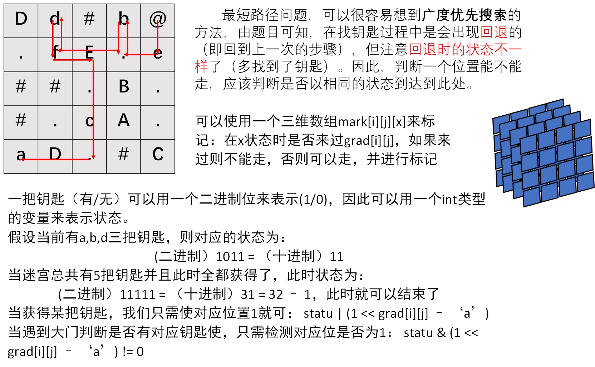

```cpp
class Solution {
public:
    int sx,sy,cnt = 0;
    struct node{
        int x,y;
        int statu;
        int step;
    };
    //方向数组
    vector<vector<int>> dirs{{-1,0},{1,0},{0,-1},{0,1}};
    //每一把药匙对于的权重 a:0 b:1 c:2 ...
    vector<int> b2{1,2,4,8,16,32,64,128};
    //标记数组 mark[i][j][x] : 状态为x时是否走过grid[i][j]
    int mark[35][35][130] = {0};
    int shortestPathAllKeys(vector<string>& grid) {
        int n = grid.size(),m = grid[0].length();
        for(int i = 0;i < n;i++){
            for(int j = 0;j < m;j++){
                if(grid[i][j] == '@') {
                    sx = i;
                    sy = j;
                    grid[i][j] = '.';//修改为'.' 简化后续操作
                }else if(grid[i][j] >= 'a' && grid[i][j] <= 'z'){
                    cnt++;//总共钥匙个数
                }
            }
        }
        queue<node> q;
        q.push((node){sx,sy,0,0});
        while(!q.empty()){
            node temp = q.front();
            q.pop();
            //如果 当前药匙总 数等于 钥匙总数
            if(temp.statu == b2[cnt]-1){
                return temp.step;
            }
            //向四个方向遍历
            for(int i = 0; i < 4;i++){
                int nx = temp.x + dirs[i][0];
                int ny = temp.y + dirs[i][1];
                //如果越界 或者 遇到枪， 直接继续
                if(nx < 0 || nx >= n || ny < 0 || ny >= m || grid[nx][ny] == '#') continue;
                //如果可以走，并且此时状态没有走过，则走并入队
                if(grid[nx][ny] == '.' && mark[nx][ny][temp.statu] == 0){
                    mark[nx][ny][temp.statu] = 1;
                    q.push((node){nx,ny,temp.statu,temp.step+1});
                //如果遇到药匙，则且之前此状态没走过，则获取药匙并更新状态，入队
                }else if(grid[nx][ny] >= 'a' && grid[nx][ny] <= 'z' && mark[nx][ny][temp.statu] == 0){
                    //此时因为获得了药匙，需要设置两个标记
                    mark[nx][ny][temp.statu] = 1;
                    mark[nx][ny][temp.statu | b2[grid[nx][ny]-'a']] = 1;
                    q.push((node){nx,ny,temp.statu | b2[grid[nx][ny]-'a'],temp.step+1});
                //如果遇到门，有对应的药匙并且此状态之前未到达过，则走并入队
                }else if(grid[nx][ny] >= 'A' && grid[nx][ny] <= 'Z' && mark[nx][ny][temp.statu] == 0 && (temp.statu & b2[grid[nx][ny]-'A']) != 0){
                    mark[nx][ny][temp.statu] = 1;
                    q.push((node){nx,ny,temp.statu,temp.step+1});
                }
            }
        }
        return -1;
    }
};
```

```java
// java版本
class Solution {
    int [] dx = new int[]{0,1,0,-1};
    int [] dy = new int[]{-1,0,1,0};
    public int shortestPathAllKeys(String[] grid) {
        int n = grid.length, m = grid[0].length();
        Queue<int []> q = new ArrayDeque<>();
        int sx = -1,sy = -1;
        Map<Character,Integer> keyToIndex = new HashMap<>();
        for(int i = 0;i < n;i++){
            for(int j = 0;j < m;j++){
                char ch = grid[i].charAt(j);
                if(ch == '@'){
                    sx = i;
                    sy = j;
                }else if(Character.isLowerCase(ch)){
                    int size = keyToIndex.size();
                    keyToIndex.put(ch,size);
                }
            }
        }
        int k = keyToIndex.size();
        int [][][] dist = new int[n][m][1 << k];
        for(int i = 0;i < n;i++)
            for(int j = 0;j < m;j++)
                Arrays.fill(dist[i][j],-1);
        // 开始搜索
        q.offer(new int[]{sx,sy,0});
        dist[sx][sy][0] = 0; // 更新初始状态
        while(!q.isEmpty()){
            int [] now = q.poll();
            int x = now[0];
            int y = now[1];
            int state = now[2];
            // 向四周去找
            for(int i = 0;i < 4;i++){
                // 新的目标位置
                int nx = x + dx[i];
                int ny = y + dy[i];
                // 如果越界或者是墙直接跳过
                if(nx < 0 || nx >= n || ny < 0 || ny >= m || grid[nx].charAt(ny) == '#') continue;
                char ch = grid[nx].charAt(ny);
                // 如果是普通的可走点
                if(ch == '.' || ch == '@'){
                    if(dist[nx][ny][state] == -1){
                        dist[nx][ny][state] = dist[x][y][state] + 1;
                        q.offer(new int[]{nx,ny,state});
                    }
                }else if(Character.isLowerCase(ch)){ // 如果是钥匙
                    int keyId = keyToIndex.get(ch); // 获得钥匙的编号
                    int newstate = state | (1 << keyId); // 新的状态
                    if(newstate == ((1 << k) - 1)){
                        return dist[x][y][state] + 1;
                    }
                    if(dist[nx][ny][newstate] == -1){
                        dist[nx][ny][newstate] = dist[x][y][state] + 1;
                        q.offer(new int[]{nx,ny,newstate});
                    }
                }else{ // 遇到锁
                    int keyId = keyToIndex.get((char)(ch+32));
                    if((state & (1 << keyId)) != 0){
                        if(dist[nx][ny][state] == - 1){
                            dist[nx][ny][state] = dist[x][y][state] + 1;
                            q.offer(new int[]{nx,ny,state});
                        }
                    } 
                }
            }
        }
        return -1;
    }
}
```

```go
// go版本
var dx = []int{0,-1,0,1}
var dy = []int{-1,0,1,0}

func shortestPathAllKeys(grid []string) int {
    n, m := len(grid),len(grid[0])
    sx, sy := 0,0
    keyToIndex := map[rune]int{} // 哈希表
    
    for i, line := range grid{
        for j,c := range line{
            if c == '@'{
                sx,sy = i,j
            }else if c >= 'a' && c <= 'z'{
                if _,ok := keyToIndex[c]; !ok{
                    keyToIndex[c] = len(keyToIndex)
                }
            }
        }
    }
    target := (1 << len(keyToIndex)) - 1
    dist := make([][][] int,n)
    for i := range dist{
        dist[i] = make([][] int,m)
        for j := range dist[i]{
            dist[i][j] = make([]int,target + 1)
            for k := range dist[i][j]{
                dist[i][j][k] = -1
            }
        }
    }

    dist[sx][sy][0] = 0
    q := [][3]int {{sx,sy,0}}
    for len(q) > 0{
        now := q[0]
        q = q[1:]  // 相当于pop
        x,y,state := now[0],now[1],now[2]
        for i := 0;i < 4;i++{
            nx,ny := x+dx[i],y+dy[i]
            if nx >= 0 && nx < n && ny >= 0 && ny < m && grid[nx][ny] != '#'{
                c := rune(grid[nx][ny])
                if c == '.' || c == '@'{
                    if(dist[nx][ny][state] == -1){
                        dist[nx][ny][state] = dist[x][y][state] + 1
                        q = append(q,[3]int{nx,ny,state})
                    }
                }else if(unicode.IsLower(c)){
                    newstate := state | (1 << keyToIndex[c])
                    if newstate == target{
                        return dist[x][y][state] + 1
                    }
                    if(dist[nx][ny][newstate] == -1){
                        dist[nx][ny][newstate] = dist[x][y][state] + 1
                        q = append(q,[3]int{nx,ny,newstate})
                    }
                }else{
                    if (state & (1 << keyToIndex[unicode.ToLower(c)]) != 0) && dist[nx][ny][state] == -1{
                        dist[nx][ny][state] = dist[x][y][state] + 1
                        q = append(q,[3]int{nx,ny,state})
                    }
                }
            }
        }
        
    }
    
    return -1
}
```


#### 示例-小明买手机回家

```
题目描述
​ 小明看完了电影，是时候回家了，可是这时他突然得知小米之家的小米9现货开卖了，这款手机小明已经想了一个多月，知道这个消息后的他十分兴奋，一定要在回家之前先去小米之家买手机（城市中有一个或多个小米之家），请计算小明从电影院到任意一个小米之家买手机后回家的最短距离（只能朝上下左右四个方向行走，除了障碍物外，其他地方都可以通过），数据保证可以买完手机后回家。

输入
​ 第 1 行两个数 n 和 m 表示地图有 n 行 m 列 2≤n,m≤2000​ 第 2 行至第 n+1 行为地图 其中 S 表示电影院 T 表示家 P 表示小米之家​ . 为可以通过的点 # 为障碍物
输出
​ 一个整数 表示小明从电影院去小米之家再回家的总距离

样例输入
5 5
.S...
###..
....T
.P##.
P....
样例输出
11
```

```cpp
#include<iostream>
#include<queue>
using namespace std;
int n,m,sx,sy;
struct node{
    int x,y,step,statu;//0 没手机 1 有手机
};
char map[2005][2005] = {0}; // 不用判断边界
int mark[2005][2005] = {0}; // 0什么状态都没走过  1无手机状态走过 2有手机状态走过 3都走过
int dirs[4][2] = {0,1,0,-1,1,0,-1,0};//方向数组
int main(){
    cin>>n>>m;
    for(int i = 1;i <= n;i++){
        for(int j = 1;j <= m;j++){
            cin>>map[i][j];
            if(map[i][j] == 'S'){
                sx = i;
                sy = j;
                mark[i][j] = 1;
                map[i][j] = '.';
            }
        }
    }
    queue<node> q;
    q.push((node){sx,sy,0,0});
    while(!q.empty()){
        node temp = q.front();
        q.pop();
        for(int i = 0;i < 4;i++){
            int nx = temp.x + dirs[i][0];
            int ny = temp.y + dirs[i][1];
            //如果当前状态已经走过 直接跳过
            if(temp.statu == 0 && (mark[nx][ny] & 1) != 0 || temp.statu == 1 && (mark[nx][ny] & 2) != 0) continue;
            //如果买到手机并且到家，直接返回结果
            if(temp.statu == 1 && map[nx][ny] == 'T'){
                cout<<temp.step + 1<<endl;
                return 0;
            }
            //当前状态[没手机没走过]/[有手机没走过]
            if(map[nx][ny] == '.' || map[nx][ny] == 'T'){
                mark[nx][ny] = mark[nx][ny] | (1 << temp.statu);
                q.push((node){nx,ny,temp.step + 1,temp.statu});
            }
            //遇到手机店，不管当前什么状态，到手机店后状态一定是1，并且标记mark为3
            if(map[nx][ny] == 'P'){
                mark[nx][ny] = 3;
                q.push((node){nx,ny,temp.step + 1,1});
            }
        }
    }
    cout<<-1<<endl;
    return 0;
}
```

#### 示例-01矩阵

```
给定一个由 0 和 1 组成的矩阵 mat ，请输出一个大小相同的矩阵，其中每一个格子是 mat 中对应位置元素到最近的 0 的距离。

两个相邻元素间的距离为 1 。
```


```
输入：mat = [[0,0,0],[0,1,0],[1,1,1]]
输出：[[0,0,0],[0,1,0],[1,2,1]]
```

解题思路：

假设这个矩阵中恰好只有一个0时，可以从 00 的位置开始进行 广度优先搜索。广度优先搜索可以找到从起点到其余所有点的 最短距离，因此如果我们从 0 开始搜索，每次搜索到一个 1，就可以得到 0 到这个 1 的最短距离，也就离这个 1 最近的 0 的距离了（因为矩阵中只有一个 0）。

题目中可能有许多个0，我们可以将连通的0看成一个整体，通过将求解`每个1到最近0的距离`转化为`求解这个连通的0整体距离周围每个1的距离`

```cpp
class Solution {
public:
    struct node{
        int x,y;
        int step;
    };
    int dirs[4][2] = {-1,0,1,0,0,-1,0,1};

    vector<vector<int>> updateMatrix(vector<vector<int>>& mat) {
        int n = mat.size();
        int m = mat[0].size();
        //存放结果的矩阵
        vector<vector<int>> ans(n,vector<int> (m,0));
        //标记矩阵
        vector<vector<bool>> mark(n,vector<bool> (m,false));
        //队列
        queue<node> q;
        //先将所有0压入队列，并标记。那么剩下的都是1了
        for(int i = 0;i < n;i++){
            for(int j = 0 ;j < m;j++){
                if(mat[i][j] == 0){
                    q.push((node){i,j,0});
                    mark[i][j] = true;
                }
            }
        }
        //BFS
        while(!q.empty()){
            node tmp = q.front();
            q.pop();
            //遍历周围4个方向
            for(int i = 0;i < 4;i++){
                int nx = tmp.x + dirs[i][0];
                int ny = tmp.y + dirs[i][1];
                if(nx < 0 || nx >= n || ny < 0 || ny >= m) continue;
                //如果没有被标记，那么入队标记，并更新结果
                if(mark[nx][ny] == false){
                    mark[nx][ny] = true;
                    ans[nx][ny] = tmp.step + 1;
                    q.push((node){nx,ny,tmp.step + 1});
                }
            }
        }
        return ans;
    }
};
```

通过上面几个示例的学习，我们总结一下广度优先搜索的策略：

- 通常用于求解图、树中的最短路径/最短步数，连通性等问题
- 首先是要针对题目**创建对应的结构体 struct node{}**;来作为队列中的元素
- 根据题目 **创建/初始化 标记数组**，有时可能是个集合，将其从集合中删去代表标记
- **初始化队列**，加入初始元素
- `while(!q.empty()) `当队列不空一直循环操作
  - 弹出队头元素
  - 判断是否符合结果，`符合则进行相应操作并return`
  - 对该元素下一步可以遍历的元素进行遍历[**入队**]，并标记
- 队空则没有找到，进行相应操作

#### 砍树

你被请来给一个要举办高尔夫比赛的树林砍树。树林由一个 m x n 的矩阵表示， 在这个矩阵中：

- 0 表示障碍，无法触碰
- 1 表示地面，可以行走
- 比 1 大的数 表示有树的单元格，可以行走，数值表示树的高度

每一步，你都可以向上、下、左、右四个方向之一移动一个单位，如果你站的地方有一棵树，那么你可以决定是否要砍倒它。

你需要按照树的高度从低向高砍掉所有的树，每砍过一颗树，该单元格的值变为 1（即变为地面）。

你将从 (0, 0) 点开始工作，返回你砍完所有树需要走的最小步数。 如果你无法砍完所有的树，返回 -1 。

可以保证的是，没有两棵树的高度是相同的，并且你至少需要砍倒一棵树。


```
输入：forest = [[1,2,3],[0,0,4],[7,6,5]]
输出：6
解释：沿着上面的路径，你可以用 6 步，按从最矮到最高的顺序砍掉这些树。
```

**题解**：

由于题目限定了我们只能按照 从低到高 的顺序去砍树，并且图中不存在高度相等的两棵树，那么说明：**如果能够将所有树全部砍完，则砍树的顺序是一定的**。

> 那么我们对整张图进行一次遍历，预处理出所有的树点（以三元组 (height, x, y)(height,x,y) 的形式进行存储），并对其进行排序，得到唯一确定的砍树路径
>

同时，我们也要注意到：**点与点之间的最短路径，不会随着砍树过程的进行而发生变化（某个树点被砍掉，只会变为平地，不会变为阻碍点，仍可通过）。**

那么由于砍树得路线唯一确定，当我们按照升序顺序依次求出每个相邻得树的最短距离，将距离累加就是答案。

```java
class Solution {
    int N = 50;
    int [][] grid = new int[N][N];
    int n,m;
    List<int []> list = new ArrayList<>();
    int [][] dirs = new int[][]{{0,1},{0,-1},{1,0},{-1,0}};
    private int bfs(int sx,int sy,int tx,int ty){
        // 如果以及在目标点
        if (sx == tx && sy == ty){
            return 0;
        }
        boolean [][] vis = new boolean[n][m];
        Deque<int[]> d = new ArrayDeque<>();
        d.addLast(new int[]{sx,sy});
        int ans = 0;
        while (!d.isEmpty()){
            int size = d.size();  // 暂存当前队列中的点的个数
            while (size-- > 0){
                int [] info = d.pollFirst();
                int nowx = info[0],nowy = info[1];
                for (int i = 0;i < 4;i++){
                    int nx = nowx + dirs[i][0];
                    int ny = nowy + dirs[i][1];
                    if (nx < 0 || nx >= n || ny < 0 || ny >= m) continue;
                    if (grid[nx][ny] == 0 || vis[nx][ny]) continue;
                    if (nx == tx && ny == ty){
                        return ans + 1;
                    }
                    d.addLast(new int[]{nx,ny});
                    vis[nx][ny] = true;
                }
            }
            ans += 1;
        }
        return -1;
    }
    public int cutOffTree(List<List<Integer>> forest) {
        n = forest.size();
        m = forest.get(0).size();
        for (int i = 0;i < n;i++){
            for (int j = 0;j < m;j++){
                grid[i][j] = forest.get(i).get(j);
                // 存储所有的树
                 if (grid[i][j] > 1) list.add(new int []{grid[i][j],i,j});
            }
        }
        // 按照树的高度升序排序
        Collections.sort(list,(a,b)->a[0]-b[0]);
        if (grid[0][0] == 0) return -1; // 如果起始点就不能走，直接返回False
        int x = 0,y = 0,ans = 0;
        for (int [] ne : list){
            int nx = ne[1],ny = ne[2]; // 目标点
            int d = bfs(x,y,nx,ny); // 求(x,y) -> (nx,ny)的最短距离
            if (d == -1) return -1;
            ans += d;
            // 更新起始点
            x = nx;
            y = ny;
        }
        return ans;
    }
}
```


#### 逃离迷宫

给定一个 m×n (m 行, n 列)的迷宫，迷宫中有两个位置，gloria 想从迷宫的一个位置走到另外一个位置，当然迷宫中有些地方是空地，gloria 可以穿越，有些地方是障碍，她必须绕行，从迷宫的一个位置，只能走到与它相邻的 4个位置中，当然在行走过程中，gloria 不能走到迷宫外面去。

令人头痛的是，gloria 是个没什么方向感的人，因此，她在行走过程中，不能转太多弯了，否则她会晕倒的。

我们假定给定的两个位置都是空地，初始时，gloria 所面向的方向未定，她可以选择 4 个方向的任何一个出发，而不算成一次转弯。

gloria 能从一个位置走到另外一个位置吗？

**输入格式**

第 1 行为一个整数 T，表示测试数据的个数，接下来为 T 组测试数据，每组测试数据中，

第 1 行为两个整数 m,n，分别表示迷宫的行数和列数，接下来 m 行，每行包括 n 个字符，其中字符 `.` 表示该位置为空地，字符 `*` 表示该位置为障碍，输入数据中只有这两种字符，每组测试数据的最后一行为 5 个整数 k,x1,y1,x2,y2，其中 kk 表示 gloria 最多能转的弯数，(x1,y1),(x2,y2) 表示两个位置，其中 x1,x2 对应列，y1,y2 对应行。

**输出格式**

每组测试数据对应为一行，若 gloria 能从一个位置走到另外一个位置，输出 `yes`，否则输出 `no`。

**题目解析**：

bfs k 次，每次都尽可能地超一个方向延申至遇到墙或边界处

```java
import java.io.*;
import java.util.*;

class node {
    int x;
    int y;
    public node(int x,int y){
        this.x = x;
        this.y = y;
    }
}

public class Main{
    static int n,m,k;
    static int[] dx = new int[]{-1, 0, 1, 0};
    static int[] dy = new int[]{0, 1, 0, -1};

    static char [][] g;
    static boolean [][] used;
    public static boolean bfs(int sx,int sy,int tx,int ty){
        Queue<node> q = new ArrayDeque<>();
        // 初始位置标记
        used[sx][sy] = true;
        q.offer(new node(sx,sy));
        while (k -- >= 0){
            int size = q.size();
            // 进行一次bfs
            while (size -- > 0){
                node top = q.poll();
                // 当前点超四个方向延申
                for (int i = 0;i < 4;i++){
                    int nx = top.x + dx[i];
                    int ny = top.y + dy[i];
                    // 只要能延申,就尽可能延申
                    while (nx > 0 && nx <= n && ny > 0 && ny <= m && g[nx][ny] == '.'){
                        // 如果没被访问过,入队
                        if (!used[nx][ny]){
                            q.offer(new node(nx,ny));
                        }
                        used[nx][ny] = true;
                        if (nx == tx && ny == ty){
                            return true;
                        }
                        // 更新坐标
                        nx += dx[i];
                        ny += dy[i];
                    }
                }
            }
        }
        return false;
    }
    public static void main(String [] args) throws IOException{
        BufferedReader br = new BufferedReader(new InputStreamReader(System.in));
        int x = Integer.parseInt(br.readLine());
        while (x-- > 0){
            String [] ins = br.readLine().split(" ");
            n = Integer.parseInt(ins[0]);
            m = Integer.parseInt(ins[1]);
            used = new boolean[n+1][m+1];
            g = new char[n+1][m+1];
            for (int i = 1;i <= n;i++){
                String s = br.readLine();
                for (int j = 1;j <= m;j++){
                    g[i][j] = s.charAt(j-1);
                }
            }
            
            ins = br.readLine().split(" ");
            k = Integer.parseInt(ins[0]);
            int sx = Integer.parseInt(ins[2]);
            int sy = Integer.parseInt(ins[1]);
            int tx = Integer.parseInt(ins[4]);
            int ty = Integer.parseInt(ins[3]);

            if (bfs(sx,sy,tx,ty)){
                System.out.println("yes");
            }else{
                System.out.println("no");
            }
        }
    }
}
```


#### 岛屿消息传递

> 某公司笔试题目，只能记得题目大意

有 N 个岛屿，分别记为 1 - N，现在需要从某个岛屿开始传递消息，将岛屿A传递岛屿B需要花费t时间记为(a,b,t)。

然后问你最短需要多久能将消息传递至所有岛屿，其中每个岛屿可以同时派出多个快艇传递消息。

```java
class node{
    int id;
    int t;
    public node(int id,int t){
        this.id = id;
        this.t = t;
    }
}
```

```java
    public int minMessagePassingTime(int n,int [][] times,int start){
        // 建图
        Map<Integer,List<Integer>> map = new HashMap<>();
        Map<Integer,List<Integer>> weight = new HashMap<>();
        for (int [] time: times){
            List<Integer> next = map.getOrDefault(time[0],new ArrayList<>());
            next.add(time[1]);
            map.put(time[0],next);

            List<Integer> w = weight.getOrDefault(time[0],new ArrayList<>());
            w.add(time[2]);
            weight.put(time[0],w);
        }
        // BFS
        Queue<node> q = new ArrayDeque<>();
        Set<Integer> set = new HashSet<>(); // 已经访问过的结点
        q.offer(new node(start,0));
        set.add(start);
        int ans = Integer.MIN_VALUE;
        while (!q.isEmpty()){
            node now = q.poll();
            ans = Math.max(ans,now.t);
            List<Integer> next = map.get(now.id);
            if (next == null || next.size() == 0) continue;
            List<Integer> w = weight.get(now.id);
            for (int i = 0;i < next.size();i++){
                int nid = next.get(i);
                if (set.contains(nid)) continue;
                set.add(nid);
                int v = w.get(i);
                q.offer(new node(nid,now.t + v));
            }
        }
        return set.size() == n ? ans : - 1;
    }
```


### BFS在树的应用

```
给定一个 完美二叉树 ，其所有叶子节点都在同一层，每个父节点都有两个子节点。二叉树定义如下：

struct Node {
  int val;
  Node *left;
  Node *right;
  Node *next;
}
填充它的每个 next 指针，让这个指针指向其下一个右侧节点。如果找不到下一个右侧节点，则将 next 指针设置为 NULL。
初始状态下，所有 next 指针都被设置为 NULL。
```


```cpp
/*
// Definition for a Node.
class Node {
public:
    int val;
    Node* left;
    Node* right;
    Node* next;
    
    Node() : val(0), left(NULL), right(NULL), next(NULL) {}
    Node(int _val) : val(_val), left(NULL), right(NULL), next(NULL) {}
    Node(int _val, Node* _left, Node* _right, Node* _next)
        : val(_val), left(_left), right(_right), next(_next) {}
};
*/
class Solution {
public:
    struct node{
        Node * p;
        int step;//当前层数
    };
    queue<node> que;
    Node* connect(Node* root) {
        //如果是空树之间返回
        if(root == NULL) return root;
        //先将根节点入队
        que.push((node){root,0});
        while(!que.empty()){
            //得到当前需要遍历的层数
            int nowstep = que.front().step;
            //当队列不空并且队列内结点层数等于当前要遍历的层数使，一直出队
            while(!que.empty() && que.front().step == nowstep){
                //头节点出队
                node temp = que.front();
                que.pop();
                //如果当前结点和队头结点的层数一样，将next指针指向它
                if(que.front().step == temp.step){
                    temp.p->next = que.front().p;
                }
                //如果当前结点的左右孩子结点存在，则入队
                if(temp.p->left) que.push((node){temp.p->left,temp.step+1});
                if(temp.p->right) que.push((node){temp.p->right,temp.step+1});
            }
        }
        return root;
    }
};
```


### Flood Fill

> 可以在线性时间内找到某个点的所有联通块。

#### 池塘计数

农夫约翰有一片 N∗M 的矩形土地。

最近，由于降雨的原因，部分土地被水淹没了。

现在用一个字符矩阵来表示他的土地。

每个单元格内，如果包含雨水，则用”W”表示，如果不含雨水，则用”.”表示。

现在，约翰想知道他的土地中形成了多少片池塘。

每组相连的积水单元格集合可以看作是一片池塘。

每个单元格视为与其上、下、左、右、左上、右上、左下、右下八个邻近单元格相连。

请你输出共有多少片池塘，即矩阵中共有多少片相连的”W”块。

**输入格式**

第一行包含两个整数 N 和 M。

接下来 N 行，每行包含 M 个字符，字符为”W”或”.”，用以表示矩形土地的积水状况，字符之间没有空格。

**输出格式**

输出一个整数，表示池塘数目。

```
输入样例：
10 12
W........WW.
.WWW.....WWW
....WW...WW.
.........WW.
.........W..
..W......W..
.W.W.....WW.
W.W.W.....W.
.W.W......W.
..W.......W.
输出样例：
3
```

```java
// 好久没写cpp了，尝试用cpp写一下
#include<iostream>
#include<cstring>
#include<algorithm>

using namespace std;

#define x first
#define y second

typedef pair<int,int> PII;

const int N = 1010,M = N * N;

int n,m;
char g[N][N];
PII q[M];
bool st[N][N];


void bfs(int sx,int sy){
    int hh = 0,tt = 0;
    q[0] = {sx,sy};
    st[sx][sy] = true;
    while(hh <= tt){
        // 取出队头元素
        PII top = q[hh ++];
        // 8 个方向遍历
        for(int i = top.x-1;i <= top.x+1;i++)
            for(int j = top.y-1;j <= top.y+1;j++){
                if(i == top.x && j == top.y) continue;
                if(i < 0 || i >= n|| j < 0 || j >= m) continue;
                if(g[i][j] == '.' || st[i][j]) continue;
                st[i][j] = true;
                q[++tt] = {i,j};
            }
    }
    
}


int main(){
    scanf("%d %d",&n,&m);
    for(int i = 0;i < n;i++) scanf("%s",g[i]);
    int cnt = 0;
    for(int i = 0;i < n;i++){
        for(int j = 0;j < m;j++){
            if(g[i][j] == 'W' && !st[i][j]){
                bfs(i,j);
                cnt++;
            }
        }
    }
    printf("%d\n",cnt);
    return 0;
}
```

#### 山峰和山谷

FGD小朋友特别喜欢爬山，在爬山的时候他就在研究山峰和山谷。

为了能够对旅程有一个安排，他**想知道山峰和山谷的数量。**

给定一个地图，为FGD想要旅行的区域，地图被分为 n×n 的网格，**每个格子 (i,j) 的高度 w(i,j) 是给定的**。

若两个格子有公共顶点，那么它们就是相邻的格子，如与 (i,j) 相邻的格子有$(i−1,j−1),(i−1,j),(i−1,j+1),(i,j−1),(i,j+1),(i+1,j−1),(i+1,j),(i+1,j+1)$。

我们定义一个格子的集合 $S$ 为山峰（山谷）当且仅当：

1. $S$ 的所有格子都有相同的高度。
2. $S$ 的所有格子都连通。
3. 对于 $s$ 属于 $S$，与 $s$ 相邻的 $s′$ 不属于 $S$，都有 $ws>ws′$（山峰），或者 $ws<ws′$（山谷）。
4. 如果周围不存在相邻区域，则同时将其视为山峰和山谷。

你的任务是，对于给定的地图，求出山峰和山谷的数量，如果所有格子都有相同的高度，那么整个地图即是山峰，又是山谷。

**输入格式**

第一行包含一个正整数 n，表示地图的大小。

接下来一个 n×n 的矩阵，表示地图上每个格子的高度 w。

**输出格式**

共一行，包含两个整数，表示山峰和山谷的数量。

```
输入样例1：
5
8 8 8 7 7
7 7 8 8 7
7 7 7 7 7
7 8 8 7 8
7 8 8 8 8
输出样例1：
2 1

输入样例2：
5
5 7 8 3 1
5 5 7 6 6
6 6 6 2 8
5 7 2 5 8
7 1 0 1 7
输出样例2：
3 3
```

样例解释：

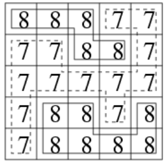

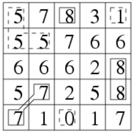

```java
import java.io.*;
import java.util.*;
class node {
    int x;
    int y;
    public node(int x,int y){
        this.x = x;
        this.y = y;
    }
}
public class Main{
    static int N = 1010;
    static int [][] g = new int[N][N];
    static boolean [][] st = new boolean[N][N];
    static int n;
    static int topCnt = 0,vallyCnt = 0;
    public static void bfs(int x,int y){
        int v = g[x][y];
        Queue<node> q = new ArrayDeque<>();
        q.offer(new node(x,y));
        st[x][y] = true;
        boolean hasHigher = false;
        boolean hasLower = false;
        while (!q.isEmpty()){
            node now = q.poll(); // 取出当前点
            // 遍历周围8个点
            for (int i = now.x-1;i <= now.x+1;i++){
                for (int j = now.y-1;j <= now.y+1;j++){
                    if (i < 0 || i >= n || j < 0 ||j >= n || (i == now.x && j == now.y)) continue;
                    if (g[i][j] > v) hasHigher = true;
                    else if (g[i][j] < v) hasLower = true;
                    else if (!st[i][j]){
                        st[i][j] = true;
                        q.offer(new node(i,j));
                    }
                }
            }
        }
        // 既是山谷也是山顶
        if (!hasHigher && !hasLower){
            vallyCnt += 1;
            topCnt += 1;
        }else if (!hasHigher && hasLower){
            topCnt += 1;
        }else if (hasHigher && !hasLower){
            vallyCnt += 1;
        }
    }

    public static void main(String [] args) throws IOException{
        BufferedReader br = new BufferedReader(new InputStreamReader(System.in));
        n = Integer.parseInt(br.readLine());
        for (int i = 0;i < n;i++){
            String [] ins = br.readLine().split(" ");
            for (int j = 0;j < n;j++){
                g[i][j] = Integer.parseInt(ins[j]);
            }
        }
        for (int i = 0;i < n;i++){
            for (int j = 0;j < n;j++){
                if (st[i][j]) continue;
                bfs(i,j);
            }
        }
        System.out.println(topCnt + " " + vallyCnt);
    }
}
```


### 最短路模型

> 地图中一个点到另外一个点的最小距离

#### 迷宫问题

给定一个 n×n 的二维数组，如下所示：

```
int maze[5][5] = {

0, 1, 0, 0, 0,

0, 1, 0, 1, 0,

0, 0, 0, 0, 0,

0, 1, 1, 1, 0,

0, 0, 0, 1, 0,

};
```

它表示一个迷宫，其中的1表示墙壁，0表示可以走的路，只能横着走或竖着走，不能斜着走，要求编程序找出从左上角到右下角的最短路线。

数据保证至少存在一条从左上角走到右下角的路径。

**输入格式**

第一行包含整数 n。

接下来 n 行，每行包含 n 个整数 0 或 1，表示迷宫。

**输出格式**

输出从左上角到右下角的最短路线的长度及具体路线，**如果答案不唯一，输出任意一条路径均可**。

按顺序，每行输出一个路径中经过的单元格的坐标，左上角坐标为 (0,0)，右下角坐标为 (n−1,n−1)。

```
输入样例：
5
0 1 0 0 0
0 1 0 1 0
0 0 0 0 0
0 1 1 1 0
0 0 0 1 0
输出样例：
9
0 0
1 0
2 0
2 1
2 2
2 3
2 4
3 4
4 4
```

数据范围

0≤n≤1000

```java
public class Main{
    static int N = 1010;
    static int [][] g = new int[N][N];
    static boolean [][] st = new boolean[N][N];
    static int n;
    static int [] dx = {0,1,0,-1};
    static int [] dy = {1,0,-1,0};
    static node [][] path = new node[N][N];
    public static int bfs(int x,int y){
        Queue<node> q = new ArrayDeque<>();
        q.offer(new node(x,y));
        st[x][y] = true;
        int len = 0;
        while (!q.isEmpty()){
            len += 1;
            for (int t = 0;t < q.size();t++){
                node top = q.poll();
                if (top.x == n-1 && top.y == n-1) break;
                for (int i = 0;i < 4;i++){
                    int nx = top.x + dx[i];
                    int ny = top.y + dy[i];
                    if (nx < 0 || nx >= n || ny < 0 || ny >= n) continue;
                    if (st[nx][ny] || g[nx][ny] == 1) continue;
                    st[nx][ny] = true;
                    q.offer(new node(nx,ny));
                    path[nx][ny] = top;
                }
            }
        }
        return len;
    }

    public static void main(String [] args) throws IOException{
        BufferedReader br = new BufferedReader(new InputStreamReader(System.in));
        n = Integer.parseInt(br.readLine());
        for (int i = 0;i < n;i++){
            String [] ins = br.readLine().split(" ");
            for (int j = 0;j < n;j++){
                g[i][j] = Integer.parseInt(ins[j]);
            }
        }
        System.out.println(bfs(0,0));
        int tx = n-1,ty = n-1;
        Deque<node> stack = new ArrayDeque<>();
        stack.offerLast(new node(tx,ty));
        while (tx != 0 || ty != 0){
            node t = path[tx][ty];
            stack.offerLast(t);
            tx = t.x;
            ty = t.y;
        }
        while (!stack.isEmpty()){
            node top = stack.pollLast();
            System.out.println(top.x + " " + top.y);
        }
    }
}
```


#### 武士风度的牛

农民 John 有很多牛，他想交易其中一头被 Don 称为 The Knight 的牛。

这头牛有一个独一无二的超能力，在农场里像 Knight 一样地跳（就是我们熟悉的**象棋中马的走法**）。

虽然这头神奇的牛不能跳到树上和石头上，但是它可以在牧场上随意跳，我们把牧场用一个 x，y 的坐标图来表示。

这头神奇的牛像其它牛一样喜欢吃草，给你一张地图，上面标注了 The Knight 的开始位置，树、灌木、石头以及其它障碍的位置，除此之外还有一捆草。

现在你的任务是，确定 The Knight 要想吃到草，至少需要跳多少次。

The Knight 的位置用 `K` 来标记，障碍的位置用 `*` 来标记，草的位置用 `H` 来标记。

这里有一个地图的例子：

```
             11 | . . . . . . . . . .
             10 | . . . . * . . . . . 
              9 | . . . . . . . . . . 
              8 | . . . * . * . . . . 
              7 | . . . . . . . * . . 
              6 | . . * . . * . . . H 
              5 | * . . . . . . . . . 
              4 | . . . * . . . * . . 
              3 | . K . . . . . . . . 
              2 | . . . * . . . . . * 
              1 | . . * . . . . * . . 
              0 ----------------------
                                    1 
                0 1 2 3 4 5 6 7 8 9 0 
```

The Knight 可以按照下图中的 A,B,C,D…A,B,C,D… 这条路径用 55 次跳到草的地方（有可能其它路线的长度也是 55）：

```
             11 | . . . . . . . . . .
             10 | . . . . * . . . . .
              9 | . . . . . . . . . .
              8 | . . . * . * . . . .
              7 | . . . . . . . * . .
              6 | . . * . . * . . . F<
              5 | * . B . . . . . . .
              4 | . . . * C . . * E .
              3 | .>A . . . . D . . .
              2 | . . . * . . . . . *
              1 | . . * . . . . * . .
              0 ----------------------
                                    1
                0 1 2 3 4 5 6 7 8 9 0
```

**注意：** 数据保证一定有解。

**输入格式**

第 1 行： 两个数，表示农场的列数 C 和行数 R。

第 2..R+1 行: 每行一个由 C 个字符组成的字符串，共同描绘出牧场地图。

**输出格式**

一个整数，表示跳跃的最小次数。

```cpp
#include<bits/stdc++.h>
#define N 155
using namespace std;
const int dir[8][2]={{2,1},{-2,1},{2,-1},{-2,-1},{-1,2},{1,2},{-1,-2},{1,-2}};//方向数组
struct node{
    int x,y;
};
int n,m,sx,sy,ex,ey;
char Map[N][N];
int dis[N][N];
inline bool check(int x,int y)//判断当前状态是否合法
{
    if(x<1||x>n||y<1||y>m||dis[x][y]||Map[x][y]=='*')
        return false;
    return true;
}
inline int BFS()
{
    queue<node> q;
    q.push(node{sx,sy});
    while(!q.empty()){
        node now=q.front();
        q.pop();
        for(int i=0;i<8;i++){
            int dx=now.x+dir[i][0],dy=now.y+dir[i][1];
            if(!check(dx,dy))
                continue;
            if(dx==ex&&dy==ey)//到达终点
                return dis[now.x][now.y]+1;
            q.push(node{dx,dy});
            dis[dx][dy]=dis[now.x][now.y]+1;//距离加一
        }
    }
}
int main()
{
    memset(dis,0,sizeof(dis));
    scanf("%d %d",&m,&n);
    for(int i=1;i<=n;i++)
        for(int j=1;j<=m;j++){
            cin>>Map[i][j];
            if(Map[i][j]=='K'){//记录起点
                sx=i,sy=j;
                dis[i][j]=0;
            }
            if(Map[i][j]=='H')//记录终点
                ex=i,ey=j;
        }
    printf("%d\n",BFS());
}
```


#### 抓住那头牛

农夫知道一头牛的位置，想要抓住它。

农夫和牛都位于数轴上，农夫起始位于点 N，牛位于点 K。

农夫有两种移动方式：

1. 从 X 移动到 X−1 或 X+1，每次移动花费一分钟
2. 从 X 移动到 2∗X，每次移动花费一分钟

假设牛没有意识到农夫的行动，站在原地不动。

农夫最少要花多少时间才能抓住牛？

**输入格式**

共一行，包含两个整数N和K。

**输出格式**

输出一个整数，表示抓到牛所花费的最少时间。

```
输入样例：
5 17
输出样例：
4
```

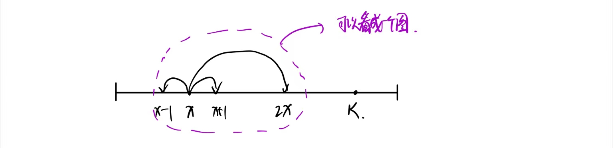

```java
import java.io.*;
import java.util.*;


class node {
    int x;
    int y;
    public node(int x,int y){
        this.x = x;
        this.y = y;
    }
}


public class Main{
    static int N = 200010;
    static boolean [] st = new boolean[N];
    static int x,K;
    public static int bfs(int x){
        // 初始化队列状态
        Queue<Integer> q = new ArrayDeque<>();
        q.offer(x);
        st[x]= true;

        int minStep = 0;
        while (!q.isEmpty()){
            int size = q.size();
            for (int t = 0;t < size;t++){
                int now = q.poll();
                if (now == K) return minStep;
                for (int i = -1;i <= 1;i++){
                    int nx;
                    if (i == 0){
                        nx = now * 2;
                    }else{
                        nx = now + i;
                    }
                    if (nx < 0 || nx >= 200000|| st[nx]) continue;
                    st[nx] = true;
                    q.offer(nx);
                }
            }
            minStep += 1;
        }
        return minStep;
    }

    public static void main(String [] args) throws IOException{
        BufferedReader br = new BufferedReader(new InputStreamReader(System.in));
        String [] ins = br.readLine().split(" ");
        x = Integer.parseInt(ins[0]);
        K = Integer.parseInt(ins[1]);
        if (x >= K) System.out.println(x - K);
        else System.out.println(bfs(x));
    }
}
```


#### 跳跃游戏

给你一个整数数组 arr ，你一开始在数组的第一个元素处（下标为 0）。

每一步，你可以从下标 i 跳到下标 i + 1 、i - 1 或者 j ：

- i + 1 需满足：i + 1 < arr.length
- i - 1 需满足：i - 1 >= 0
- j 需满足：arr[i] == arr[j] 且 i != j

请你返回到达数组最后一个元素的下标处所需的 最少操作次数 。

注意：任何时候你都不能跳到数组外面。

```
输入：arr = [100,-23,-23,404,100,23,23,23,3,404]
输出：3
解释：那你需要跳跃 3 次，下标依次为 0 --> 4 --> 3 --> 9 。下标 9 为数组的最后一个元素的下标。
```

**题目解析**：

可以将题目看成一个边权为1的图，然后求起始点和最终点的最短路径。

```java
    public int minJumps(int[] arr) {
        Map<Integer,List<Integer>> sameValue = new HashMap<>();
        int n = arr.length;
        for (int i = 0;i < n;i++){
            sameValue.putIfAbsent(arr[i],new ArrayList<>());
            sameValue.get(arr[i]).add(i);
        }
        Set<Integer> visited = new HashSet<>();
        Queue<int []> q = new ArrayDeque<>();
        q.offer(new int[]{0,0}); // idx,step
        visited.add(0);
        while (!q.isEmpty()){
            int [] now = q.poll();
            int idx = now[0];
            int step = now[1];
            if (idx == n-1){
                return step;
            }
            int v = arr[idx];
            if (sameValue.containsKey(v)){
                for (int sameIdx : sameValue.get(v)){
                    if (visited.contains(sameIdx)) continue;
                    visited.add(sameIdx);
                    q.offer(new int[]{sameIdx,step+1});
                }
                sameValue.remove(v); // 防止重复遍历
            }
            if (idx + 1 < n && !visited.contains(idx+1)){
                visited.add(idx+1);
                q.offer(new int[]{idx+1,step+1});
            }
            if (idx - 1 >= 0 && !visited.contains(idx-1)){
                visited.add(idx-1);
                q.offer(new int[]{idx-1,step+1});
            }
        }
        return -1;
    }
```

#### 访问所有结点的最短路径

存在一个由 `n` 个节点组成的无向连通图，图中的节点按从 `0` 到 `n - 1` 编号。

给你一个数组 `graph` 表示这个图。其中，`graph[i]` 是一个列表，由所有与节点 `i` 直接相连的节点组成。

返回能够访问所有节点的最短路径的长度。你可以在任一节点开始和停止，也可以多次重访节点，并且可以重用边。

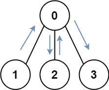

```
输入：graph = [[1,2,3],[0],[0],[0]]
输出：4
解释：一种可能的路径为 [1,0,2,0,3]
```

**题目解析：**

首先想到的就是BFS，我们需要知道下一步能往哪些点进行移动，因此除了记录当前的点访问状态 state 以外，还需要记录最后一步是在哪个点 u，因此我们需要使用二元组进行记录 (state,u)，同时使用 dist 来记录到达 (state,u)使用的步长是多少。

```cpp
class Solution {
public:
    const int inf = 0x3f3f3f3f;
    int shortestPathLength(vector<vector<int>>& graph) {
        int n = graph.size();
        int mask = 1 << n;
        // dist[i][j] 表示状态为i且最后一个访问的点是j的最短路径
        vector<vector<int>> dist(mask,vector<int>(n,inf));
        
        queue<vector<int>> q;
        for(int i = 0;i < n;i++){
            dist[1 << i][i] = 0;
            q.push(vector<int>{1 << i,i});
        }

        while(!q.empty()){
            vector<int> poll = q.front();
            q.pop();
            int st = poll[0],u = poll[1],step = dist[st][u];
            if(st == mask - 1) return step;
            for(int i = 0;i < graph[u].size();i++){
                int ne = graph[u][i];
                if(dist[st | (1 << ne)][ne] == inf){ // 此状态没走过
                    dist[st | (1 << ne)][ne] = step + 1;
                    q.push(vector<int>{st | (1 << ne), ne});
                }
            }
        }
        return -1;
    
    }
};
```


### 多源BFS

#### 矩阵距离

给定一个 N 行 M 列的 01 矩阵 A，$A[i][j]$ 与 $A[k][l]$ 之间的曼哈顿距离定义为：
$$
dist(A[i][j],A[k][l])=|i−k|+|j−l|
$$
输出一个 N 行 M 列的整数矩阵 BB，其中：
$$
B[i][j]=min1≤x≤N,1≤y≤M,A[x][y]=1 \{dist(A[i][j],A[x][y])\}
$$
**输入格式**

第一行两个整数 N,M。

接下来一个 N 行 M 列的 01 矩阵，数字之间没有空格。

**输出格式**

一个 N 行 M 列的矩阵 BB，相邻两个整数之间用一个空格隔开。

```
输入样例：
3 4
0001
0011
0110
输出样例：
3 2 1 0
2 1 0 0
1 0 0 1
```

```java

import java.io.*;
import java.util.*;


class node {
    int x;
    int y;
    public node(int x,int y){
        this.x = x;
        this.y = y;
    }
}

public class Main{
    static int N = 1010;
    static int [] dx = {1,0,-1,0},dy = {0,1,0,-1};
    static String [] g = new String[N];
    static int [][] ans = new int[N][N];
    static int n,m;
    public static void bfs(Queue<node> q){
        while (!q.isEmpty()){
            node top = q.poll();
            for (int i = 0;i < 4;i++){
                int nx = top.x + dx[i];
                int ny = top.y + dy[i];
                if (nx < 0 || nx >= n || ny < 0 || ny >= m || ans[nx][ny] != -1) continue;
                ans[nx][ny] = ans[top.x][top.y] + 1;
                q.offer(new node(nx,ny));
            }
        }
    }

    public static void main(String [] args) throws IOException{
        BufferedReader br = new BufferedReader(new InputStreamReader(System.in));
        String [] ins = br.readLine().split(" ");
        Queue<node> q = new ArrayDeque<>();
        n = Integer.parseInt(ins[0]);
        m = Integer.parseInt(ins[1]);
        for (int i = 0;i < n;i++){
            Arrays.fill(ans[i],-1);
            g[i] = br.readLine();
            for (int j = 0;j < m;j++){
                if (g[i].charAt(j) == '1'){
                    q.offer(new node(i,j));
                    ans[i][j] = 0;
                }
            }
        }
        bfs(q);
        for (int i = 0;i < n;i++){
            for (int j = 0;j < m;j++){
                System.out.print(ans[i][j] + " ");
            }
            System.out.println();
        }
    }
}
```


### 最小步数

> 整个地图看成一个状态 ===> 另外一种状态的 最小步数

#### 魔板

Rubik 先生在发明了风靡全球的魔方之后，又发明了它的二维版本——魔板。

这是一张有 8 个大小相同的格子的魔板：

```
1 2 3 4
8 7 6 5
```

我们知道魔板的每一个方格都有一种颜色。

这 8 种颜色用前 8 个正整数来表示。

可以用颜色的序列来表示一种魔板状态，规定**从魔板的左上角开始，沿顺时针方向依次取出整数**，构成一个颜色序列。

对于上图的魔板状态，我们用序列 (1,2,3,4,5,6,7,8) 来表示，这是基本状态。

这里提供三种基本操作，分别用大写字母 A，B，C 来表示（可以通过这些操作改变魔板的状态）：

A：交换上下两行；
B：将最右边的一列插入到最左边；
C：魔板中央对的4个数作顺时针旋转。

下面是对基本状态进行操作的示范：

> 12345678

A：

```
8 7 6 5
1 2 3 4
```

> 87654321

B：

```
4 1 2 3
5 8 7 6
```

> 41236785

C：

```
1 7 2 4
8 6 3 5
```

> 17245368

对于每种可能的状态，这三种基本操作都可以使用。

你要 编程计算**用最少的基本操作完成基本状态到特殊状态的转换，输出基本操作序列**。 

**注意**：数据保证一定有解。

**输入格式**

输入仅一行，包括 8 个整数，用空格分开，表示目标状态。

**输出格式**

输出文件的第一行包括一个整数，表示最短操作序列的长度。

如果操作序列的长度大于0，则在第二行输出字典序最小的操作序列。

```
输入样例：
2 6 8 4 5 7 3 1
输出样例：
7
BCABCCB
```

**解题思路**：

求最短操作序列的长度：BFS

求操作序列：用一个Map<String(s),pair<char(ops),String(x)>> 来记录 当前状态s 是由状态x 通过操作 ops 转移来的

字典序最小：在BFS通过操作搜索时，按照ABC的顺序搜索，第一次找到的方法就是字典序最小的。


#### 相似度为k的字符串

对于某些非负整数 k ，如果交换 s1 中两个字母的位置恰好 k 次，能够使结果字符串等于 s2 ，则认为字符串 s1 和 s2 的 相似度为 k 。

给你两个字母异位词 s1 和 s2 ，返回 s1 和 s2 的相似度 k 的最小值。

```
输入：s1 = "abc", s2 = "bca"
输出：2
```

设字符串的长度为 n，如果当前第 i 个字符满足 $ s_1[i] \neq s_2[i] $，则从 $s_1[i+1, \cdots]$ 选择一个合适的字符 $s_1[j]$进行交换，其中满足$ s_1[j] = s_2[i],j \in [i+1,n-1]$。每次我们进行交换时，可将字符串 $s_1$的前 x 个字符通过交换使得 $s_1[0,\cdots,x - 1] = s_2[0,\cdots,x - 1]$，最终使得 $s_1$的所有字符与 $s_2$相等即可。我们通过以上变换，找到最小的交换次数使得 $s_1$与 $s_2$相等。

```java
class Pair{
    String str;
    Integer pos;

    public Pair(String str, Integer pos) {
        this.str = str;
        this.pos = pos;
    }

    public String getStr() {
        return str;
    }

    public void setStr(String str) {
        this.str = str;
    }

    public Integer getPos() {
        return pos;
    }

    public void setPos(Integer pos) {
        this.pos = pos;
    }
}

class Solution {
    private String swap(String cur,int i,int j){
        char [] s = cur.toCharArray();
        char t = s[i];
        s[i] = s[j];
        s[j] = t;
        return String.valueOf(s);
    }
    public int kSimilarity(String s1, String s2) {
        int n = s2.length();
        Queue<Pair> q = new ArrayDeque<>();
        HashSet<String> set = new HashSet<>();
        q.offer(new Pair(s1,0));
        set.add(s1);
        int step = 0;
        while (!q.isEmpty()){
            int now_size = q.size();
            for(int i = 0;i < now_size;i++){
                Pair top = q.poll();
                String cur = top.getStr();
                int pos = top.getPos();
                if (cur.equals(s2)){ // 已经到达目标状态
                    return step;
                }
                while (pos < n && cur.charAt(pos) == s2.charAt(pos)){
                    pos += 1;
                }
                for (int j = pos + 1;j < n;j++){
                    if (cur.charAt(j) == s2.charAt(j)) continue; // 如果原本已经匹配的，则即使和 s2[pos]相等也不交换
                    if (cur.charAt(j) == s2.charAt(pos)){
                        String next = swap(cur,pos,j);
                        if (!set.contains(next)){
                            set.add(next);
                            q.offer(new Pair(next,pos+1));
                        }
                    }
                }
            }
            step += 1;
        }
        return step;
    }
}
```


## 双向搜索

双向同时搜索的基本思路是从状态图上的起点和终点同时开始进行 [广搜] ( 一般用的比较多！因为比较好写 )或 [深搜]。如果发现搜索的两端相遇了，那么可以认为是获得了可行解。

双向广搜的步骤：

```
将开始结点和目标结点加入队列 q
标记开始结点为 1
标记目标结点为 2
while (队列 q 不为空)
{
  从 q.front() 扩展出新的 s 个结点

  如果 新扩展出的结点已经被其他数字标记过
    那么 表示搜索的两端碰撞
    那么 循环结束

  如果 新的 s 个结点是从开始结点扩展来的
    那么 将这个 s 个结点标记为 1 并且入队 q 

  如果 新的 s 个结点是从目标结点扩展来的
    那么 将这个 s 个结点标记为 2 并且入队 q
}
```

> 双向广搜的应用场合是**知道起点和终点，并且正向和逆向都能进行搜索**。


#### 示例-走棋盘问题

```
有一个8x8的棋盘，上面有4颗棋子，棋子可以上下左右移动，给定一个初始状态和目标状态，请问能否在8步之内到达？
```

思路：从起点和终点开始，分别走4步，看有没有交点。

### 双端队列广搜

双端队列主要解决图中边的权值只有0或者1的最短路问题。

**操作**：每次从队头取出元素，并进行拓展其他元素时

1、若拓展某一元素的边权是0，则将该元素插入到队头
2、若拓展某一元素的边权是1，则将该元素插入到队尾

与堆优化Dijkstra 一样，必须在出队时才知道每个点最终的最小值，而和一般的bfs不一样，原因是如下图所示。

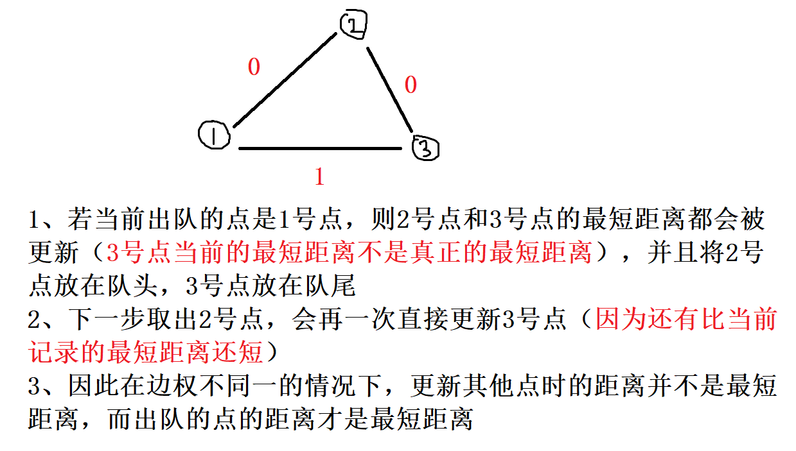


#### 电路维修

达达是来自异世界的魔女，她在漫无目的地四处漂流的时候，遇到了善良的少女翰翰，从而被收留在地球上。

翰翰的家里有一辆飞行车。

有一天飞行车的电路板突然出现了故障，导致无法启动。

电路板的整体结构是一个 R 行 C 列的网格（R,C≤500），如下图所示。


每个格点都是电线的接点，每个格子都包含一个电子元件。

电子元件的主要部分是一个可旋转的、连接一条对角线上的两个接点的短电缆。

在旋转之后，它就可以连接另一条对角线的两个接点。

电路板左上角的接点接入直流电源，右下角的接点接入飞行车的发动装置。

达达 发现因为某些元件的方向不小心发生了改变，电路板可能处于断路的状态。

她准备通过计算，**旋转最少数量的元件，使电源与发动装置通过若干条短缆相连**。

不过，电路的规模实在是太大了，达达并不擅长编程，希望你能够帮她解决这个问题。

**注意**：只能走斜向的线段，水平和竖直线段不能走。

**输入格式**

输入文件包含多组测试数据。

第一行包含一个整数 T，表示测试数据的数目。

对于每组测试数据，第一行包含正整数 R 和 C，表示电路板的行数和列数。

之后 R 行，每行 C 个字符，字符是`"/"`和`"\"`中的一个，表示标准件的方向。

**输出格式**

对于每组测试数据，在单独的一行输出一个正整数，表示所需的最小旋转次数。

如果无论怎样都不能使得电源和发动机之间连通，输出 `NO SOLUTION`。

**题目解析**：

图中的格子和点是不一样的，点是格子上的角角上的点，每个点都有4个方向可以走，分别对应的是左上角，右上角，右下角，左下角

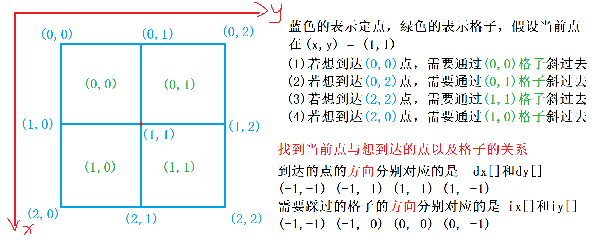

**踩过格子到达想去的点时，需要判断是否需要旋转电线，若旋转电线表示从 当前点 到 想去的点 的边权是1，若不旋转电线则边权是0**

按左上角，右上角，右下角，左下角遍历的顺序

1、$dx[]$ 和 $dy[]$ 表示可以去其他点的方向
2、$id[]$ 和 $iy[]$ 表示需要踩某个方向的各种才能去到相应的点
3、$cs[]$ 表示当前s点走到 4 个方向的点理想状态下格子形状( **边权是0的状态** )

```java
import java.util.*;
import java.io.*;
class Pair{
    int x,y;
    Pair(int x,int y){
        this.x = x;
        this.y = y;
    }
}
public class Main{
    static char [] cs = new char[]{'\\','/','\\','/'};
    static int[] dx = new int[]{-1, -1, 1, 1};
    static int[] dy = new int[]{-1, 1, 1, -1};
    static int[] ix = new int[]{-1, -1, 0, 0};
    static int[] iy = new int[]{-1, 0, 0, -1};

    static int N = 501, Inf = 0x3f3f3f3f;
    static int n,m;
    static char [][] g = new char[N][N];
    static boolean [][] st = new boolean[N][N];
    static int [][] dist = new int[N][N];
    public static int bfs(){
        // 初始化 --- 因为有多组数据
        for (int i = 0;i <= n;i++) Arrays.fill(st[i],false);
        for (int i = 0;i <= n;i++) Arrays.fill(dist[i],Inf);
        // 加入初始点
        dist[0][0] = 0;
        Deque<Pair> q = new ArrayDeque<>();
        q.offerLast(new Pair(0,0));
        while (!q.isEmpty()){
            Pair t = q.pollFirst();
            int x = t.x,y = t.y;
            if (x == n && y == m) return dist[x][y]; // 如果到达最终点，直接返回
            if (st[x][y]) continue; // 如果已经访问过跳过
            st[x][y] = true; // 标记访问过

            for (int i = 0;i < 4;i++){
                // 尝试移动到周围四个对角点
                int nx = x + dx[i],ny = y + dy[i];
                if (nx < 0 || nx > n || ny < 0 || ny > m) continue;
                int ga = x + ix[i],gb = y + iy[i];
                int w = g[ga][gb] == cs[i] ? 0 : 1; // 观察是否需要转动，转动则设置边权为1
                int d = dist[x][y] + w;
                if (d < dist[nx][ny]){
                    dist[nx][ny] = d;
                    if (w == 1) q.offerLast(new Pair(nx,ny));
                    else q.offerFirst(new Pair(nx,ny));
                }
            }
        }
        return -1;
    }

    public static void main(String [] args) throws IOException{
        BufferedReader br = new BufferedReader(new InputStreamReader(System.in));
        int t = Integer.parseInt(br.readLine());
        while (t-- > 0){
            String [] ins = br.readLine().split(" ");
            n = Integer.parseInt(ins[0]);
            m = Integer.parseInt(ins[1]);
            for (int i = 0;i < n;i++){
                String in = br.readLine();
                for (int j = 0;j < m;j++){
                    g[i][j] = in.charAt(j);
                }
            }
            // 如果 n + m 是 奇数，那么不可能到达
            if (((n+m) & 1) != 0) System.out.println("NO SOLUTION");
            else System.out.println(bfs());
        }
    }
}
```


## A*算法

A* 搜索算法（英文：A* search algorithm，A* 读作 A-star），简称 A*算法，是一种在图形平面上，对于有多个节点的路径求出最低通过成本的算法。它属于图遍历（英文：Graph traversal）和最佳优先搜索算法（英文：Best-first search），亦是 [BFS] 的改进。

定义起点$s$ ，终点 $t$，从起点（初始状态）开始的距离函数 $g(x)$，到终点（最终状态）的距离函数$h(x)$ ，以及每个点的估价函数 $f(x) = g(x) + h(x)$。

- A*算法每次从优先队列中取出一个$f(x)$最小的元素，然后更新相邻的状态。
- 如果$h \le h*$，则 A*算法能找到最优解。
- 上述条件下，如果$h$满足三角形不等式，则 A*算法不会将重复结点加入队列。

> 当$h = 0$时，A*算法变为 DFS；当 $h = 0$并且边权为1时变为 BFS。


`A*`算法常常可以和BFS、DFS结合来进一步优化算法的性能。如果你能够掌握其算法原理的话在面试的时候也可以提一嘴`"可以结合A*算法来优化"`，面试官必定对你夸赞叫好!


#### 示例-8数码问题

> 题目取自 oi-wiki

在$3\times 3$的棋盘上，摆有八个棋子，每个棋子上标有 1 至 8 的某一数字。棋盘中留有一个空格，空格用0来表示。空格周围的棋子可以移到空格中，这样原来的位置就会变成空格。给出一种初始布局和目标布局（为了使题目简单，设目标状态如下），找到一种从初始布局到目标布局最少步骤的移动方法。

```
    123
    804
    765
```

这道题其实用BFS就可以轻松解决，但是也可以在BFS基础上结合A* 算法来优化

本题可以设计估价函数为：

- 不在目标位置的数码的个数
- 不在目标位置的数码与目标位置的曼哈顿距离
- 逆序数作为股价函数

```java
//java - A* 解答
class Eight_Digit{
    // 目标状态
    int [][] target = new int[][]{{1,2,3},
                                  {8,0,4},
                                  {7,6,5}};
    long targetId;
    int [][] dirctions = new int[][]{{-1,0},{1,0},{0,-1},{0,1}};  // 可行走的方向
    int [][] matrix; // 输入的初始状态
    Set<Long> used; //记录状态是否访问过
    Queue<Mat_node> pq; // 优先级队列，优先执行股价函数小的状态
	
    // 队列中的元素类
    class Mat_node{
        int [][] mat;
        int step;
        Mat_node(int [][] mat,int step){
            this.mat = new int [mat.length][mat[0].length];
            for (int i = 0;i < mat.length;i++){
                for (int j = 0;j < mat[0].length;j++){
                    this.mat[i][j] = mat[i][j];
                }
            }
            this.step = step;
        }
        // 相当于获得估价函数
        public int getDiff(){
            int ret = 0;
            for (int i = 0;i < this.mat.length;i++){
                for (int j = 0;j < this.mat[0].length;j++){
                    if (target[i][j] != this.mat[i][j]){
                        ret += 1;
                    }
                }
            }
            return ret;
        }
    }

    Eight_Digit(int [][] m){
        this.targetId = 0;
        this.matrix = new int[m.length][m[0].length];
        for (int i = 0;i < m.length;i++){
            for (int j = 0;j < m[0].length;j++){
                this.matrix[i][j] = m[i][j];
                this.targetId = this.targetId * 10 + this.target[i][j];
            }
        }

    }

    public boolean check(int [][] mat){
        return getId(mat) == targetId;
    }

    public long getId(int[][] mat){
        long id = 0;
        for (int i = 0;i < mat.length;i++){
            for (int j = 0;j < mat[0].length;j++){
                id = id * 10 + mat[i][j];
            }
        }
        return id;
    }

    public void swap(int x,int y,int nx,int ny,int [][] mat){
        int tmp = mat[x][y];
        mat[x][y] = mat[nx][ny];
        mat[nx][ny] = tmp;
    }

    public int getMinStep(){
        this.pq = new PriorityQueue<>(new Comparator<Mat_node>() {
            @Override
            public int compare(Mat_node o1, Mat_node o2) {
                return (o1.getDiff() + o1.step) -  (o2.getDiff() + o2.step);
            }
        });
        pq.offer(new Mat_node(this.matrix,0));
        this.used = new HashSet<>();
        used.add(getId(this.matrix));
        while (!pq.isEmpty()){
            Mat_node node = pq.poll();
            if (check(node.mat)){
                return node.step;
            }
            for (int i = 0;i < target.length;i++){
                for (int j = 0;j < target[0].length;j++){
                    if (node.mat[i][j] == 0){
                        for (int k = 0;k < 4;k++){
                            int nx = i + dirctions[k][0];
                            int ny = j + dirctions[k][1];
                            if (nx < 0 || nx >= target.length || ny < 0 || ny >= target[0].length) continue;
                            swap(i,j,nx,ny, node.mat);
                            long id = getId(node.mat);
                            if (this.used.contains(id)) {
                                swap(i,j,nx,ny, node.mat);
                                continue;
                            }
                            this.used.add(id);
                            pq.offer(new Mat_node(node.mat,node.step+1));
                            swap(i,j,nx,ny, node.mat);
                        }
                    }
                }
            }
        }
        return -1;
    }
}
```

