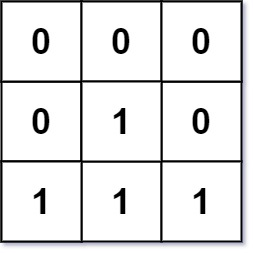

# 搜索

## 深度优先遍历/搜索  DFS

> 能走就一直走，走不了就“退”回    不撞南墙不回头

> 深度优先搜索特别适用于那些探索所有的可能性的这些问题，问题解决的可能性是非常多的，所以需要去探索所有的可能性

> 假设已经有邻接矩阵matrix [N+1] [N+1]，标记数组mark[N+1]

**解决相关问题**：

连通性问题[走地图]、有关 树 的遍历，路径等问题

### DFS在图的应用

**要点**：

- 需要一个数组mark[]来标记结点是否被遍历过，防止重复遍历
- 利用 递归/栈FILO
- 要结合回溯来进行使用

```cpp
//递归的方法
void func(int x){
	cout<<x<<" ";//进行相关操作，这里进行输出
	for(int i = 1;i <= N;i++){//对结点x的邻接结点进行遍历
		if(matrix[x][i] == 1 && mark[i] == 0){
			mark[i] = 1;//标记
			func(i);
		}
	}
}

for(int i = 1;i <= N;i++){
	if(mark[i] == 0){
		mark[i] = 1;//标记
		func(i); //递归函数
	}
}
```

#### 示例-连续相同的数字

```
题目描述
返回所有长度为 n 且满足其每两个连续位上的数字之间的差的绝对值为 k 的 非负整数 。
请注意，除了 数字 0 本身之外，答案中的每个数字都 不能 有前导零。例如，01 有一个前导零，所以是无效的；但 0 是有效的。
你可以按 任何顺序 返回答案。
示例 1：
输入：n = 3, k = 7
输出：[181,292,707,818,929]
解释：注意，070 不是一个有效的数字，因为它有前导零。

示例 2：
输入：n = 2, k = 1
输出：[10,12,21,23,32,34,43,45,54,56,65,67,76,78,87,89,98]

示例 3：
输入：n = 2, k = 0
输出：[11,22,33,44,55,66,77,88,99]
```

这道题目通过分析就是从以1~9开头的数字开始搜索，搜索长度为n


```cpp
class Solution {
public:
    vector<int> ans;
    void func(int x,int n,int k){
        //剩余位数为0，则压入结果容器中
        if(n == 0){
            ans.push_back(x);
            return ;
        }
        //左判断
        int t1 = x % 10 - k;
        int t2 = x % 10 + k;
        //右判断
        if(t1 >= 0)
            //递归判断下一位
            func(x*10+t1,n-1,k);
        //需要特殊判断下k=0时的情况，不然会出现重复元素
        if(k != 0 && t2 <= 9)
            func(x*10+t2,n-1,k);
    }
    vector<int> numsSameConsecDiff(int n, int k) {
        for(int i = 1;i < 10;i++){
            func(i,n-1,k);
        }
        return ans;
    }
};
```

#### 示例-最大黑色区域

````
题目描述
​ 现在给出一个 n∗m 的二维矩阵，矩阵上的每个点只可能是 0 （代表白色）或 1 （代表黑色）。现规定某一点的颜色与它的上下左右某点的颜色相同，则它们为同一区域，现求最大黑色区域的大小。
输入
​ 第一行两个正整数 n,m。（1≤n,m≤100）
​ 接下来输入一个二维字符矩阵，每个字符为 0 或 1。
输出
​ 输出一个整数，表示可以最大黑色区域面积。

样例输入
5 6
011001
110101
010010
000111
101110
样例输出
7
````

根据题目描述：明显是一个连通性问题，即求`最大连通区域的面积`

```cpp
#include<iostream>
#include<vector>
using namespace std;

int n,m,cnt,ans = 0;
//方向数组
int dirs[4][2] = {-1,0,1,0,0,1,0,-1};

void func(vector<vector<char>> &map,int x,int y){
    //对四个方向进行遍历
    for(int i = 0;i < 4;i++){
        int nx = x + dirs[i][0];
        int ny = y + dirs[i][1];
        //是否是黑色区域
        if(map[nx][ny] == '1'){
            //是黑色则增加连通域面积
            cnt++;
            //标记该点
            map[nx][ny] = '0';
            //递归遍历
            func(map,nx,ny);
        }
    }
}

int main(){
    cin>>n>>m;
    vector<vector<char>> map(n+2,vector<char> (m+2,'0'));
    //初始化地图
    for(int i = 1;i <= n;i++){
        //从map[i][1]开始输入一行，遇到回车结束
        cin>>&map[i][1];
    }
    //遍历每个结点，求其连通域面积
    for(int i = 1;i <= n;i++){
        for(int j = 1;j <= m;j++){
            //如果是黑色区域，则开始求取面积
            if(map[i][j] == '1'){
                cnt = 1;
                //标记已经走过
                map[i][j] = '0';
                //递归搜索
                func(map,i,j);
                //更新最大面积
                ans = ans > cnt ? ans : cnt;
            }
        }
    }
    cout<<ans<<endl;
    return 0;
}
```

#### 示例-01迷宫

```
题目描述
​ 有一个仅由数字 0 与 1 组成的 n×m 格迷宫。若你位于一格 0 上，那么你可以移动到相邻 4 格中的某一格 1 上，同样若你位于一格 1 上，那么你可以移动到相邻 4 格中的某一格 0 上。
​ 你的任务是：对于给定的迷宫，询问 k 次从某一格开始能移动到多少个格子（包含自身）。

输入
​ 第 1 行为两个正整数 n,m,k。
​ 下面 n 行，每行 m 个字符，字符只可能是 0 或者 1，字符之间没有空格。
​ 接下来 k 行每行给出一个点的在坐标。
输出
​ 对于每个坐标输出一行一个整数表示该点能移动到的格子数（包括自身）。

样例输入
2 3 4
011
100
1 1
2 2
1 3
2 3
样例输出
4
4
2
2
数据保证 1≤n,m≤3000，1≤k≤30000
```

因为本题的数据量k太大，如果一个一个求，则会超时。我们可以提前将整个图的每个点的结果求出，然后当获得坐标后直接输出。


```cpp
#include<iostream>
#include<stack>
using namespace std;

int n,m,k,sx,sy,ans;
char map[3002][3002];
//标记数组
int mark[3002][3002] = {0};
//栈结点
struct node {
    int x,y;
};
stack<node> st;
//方向数组
int dirs[4][2] = {0,1,0,-1,1,0,-1,0};

void func(int x,int y){
    //将坐标压入栈中
    st.push((node){x,y});
    //搜索周围4个坐标
    for(int i = 0;i < 4;i++){
        int nx = x + dirs[i][0];
        int ny = y + dirs[i][1];
        //非0 代表标记过了 直接跳过
        if(mark[nx][ny] != 0) continue;
        //超出界限 直接跳过
        if(nx < 1 || nx > n || ny < 1 || ny > m) continue;
        //符合题目要求则进行递归搜索
        if((map[x][y] == '0' && map[nx][ny] == '1') || (map[x][y] == '1' && map[nx][ny] == '0')){
            mark[nx][ny] = 1;//标记
            ans++;//联通数 + 1
            func(nx,ny);//递归搜索
        }
    }
}

int main(){

    cin>>n>>m>>k;
    //初始化map
    for(int i = 1;i <= n;i++){
        for(int j = 1;j <= m;j++){
            cin>>map[i][j];
        }
    }
	//依次搜索整个map
    for(int i = 1;i <= n;i++){
        for(int j = 1;j <= m;j++){
            //如果没有标记过[0：没标记 非0: 标记过]
            if(mark[i][j] == 0){
                //初始化连通数
                ans = 1;
                mark[i][j] = 1;//标记
                func(i,j);//开始递归搜索
				//将栈中坐标依次弹出，更新mark
                while(!st.empty()){
                    node temp = st.top();
                    mark[temp.x][temp.y] = ans;
                    st.pop();
                }
            }
        }
    }
	//直接根据mark输出结果
    for(int i = 0;i < k;i++){
        cin>>sx>>sy;
        cout<<mark[sx][sy]<<endl;
    }
    return 0;
}
```


通过上面几个示例的学习，我们总结一下深度优先搜索的策略：

- 通常用于求解图、树中的连通性等问题
- 首先是要针对题目**创建对应的结构体 struct node{}**;来作为队列中的元素
- 根据题目 **创建/初始化 标记数组**
- **初始化队列**，加入初始元素
- 遍历初始情况，并均进行深度优先遍历
- 递归函数func
  - 以当前情况作为起始条件，继续判断其他可能发送情况，进行递归判断

### DFS在树的应用

> DFS通常会用于树这种数据结构的题型中。

#### 验证二叉搜索树

```
给定一个二叉树，判断其是否是一个有效的二叉搜索树。

假设一个二叉搜索树具有如下特征：
节点的左子树只包含小于当前节点的数。
节点的右子树只包含大于当前节点的数。
所有左子树和右子树自身必须也是二叉搜索树。
输入:
    2
   / \
  1   3
输出: true
```

```cpp
class Solution {
public:
/*
函数表示考虑以 root 为根的子树，判断子树中所有节点的值是否都在 (lower,bigger)的范围内（注意是开区间）。如果 root 节点的值 val 不在 (lower,bigger) 的范围内说明不满足条件直接返回。
根据二叉搜索树的性质，在递归调用左子树时，我们需要把上界 bigger 改为 root.val，即调用 helper(root.left, lower, root.val)，因为左子树里所有节点的值均小于它的根节点的值。同理递归调用右子树时，我们需要把下界 lower 改为 root.val，
*/
    bool func(TreeNode * root,long long int lower,long long int bigger){
        if(root == nullptr) return true;
        //如果当前结点不在上下界范围，说明不符合
        if(root->val <= lower || root->val >= bigger) return false;
        //依次判断左右子树
        return func(root->left,lower,root->val) && func(root->right,root->val,bigger);
    }

    bool isValidBST(TreeNode* root) {
        //如果树空，则返回1
        if(root == nullptr) return true;
        //进行递归判断
        return func(root,LONG_MIN,LONG_MAX);
    }
};
```

#### 路径总和II

```
给你二叉树的根节点 root 和一个整数目标和 targetSum ，找出所有 从根节点到叶子节点 路径总和等于给定目标和的路径。
叶子节点 是指没有子节点的节点。
```


>  分析：也就是DFS应用于树的指定路径求取

```cpp
class Solution {
public:
    //两个全局变量来存储结构
    vector<vector<int>> ans;//所有路径的结果集合
    vector<int> temp;//存储根节点至当前结点的路径
    void func(TreeNode * root,int targetSum,int nowgetSum){
        if(root == nullptr) return;
        //在当前路径中标记当前结点
        temp.push_back(root->val);
        //获得了符号题意的路径，存储
        if(root->val + nowgetSum == targetSum && (!root->left) && (!root->right)) ans.push_back(temp);
        //遍历左右子树
        func(root->left,targetSum,root->val+nowgetSum);
        func(root->right,targetSum,root->val+nowgetSum);
        //遍历完左右子树，要回退，因此也要把当前路径中的当前结点弹出
        temp.pop_back();
    }
    vector<vector<int>> pathSum(TreeNode* root, int targetSum) {
        if(root == nullptr) return ans;
        //从根节点开始遍历
        func(root,targetSum,0);
        return ans;
    }
};
```


#### 树的子结构

输入两棵二叉树A和B，判断B是不是A的子结构。(约定空树不是任意一个树的子结构)

B是A的子结构， 即 A中有出现和B相同的结构和节点值。

```
给定的树 A:
     3
    / \
   4   5
  / \
 1   2
给定的树 B：
   4 
  /
 1
返回 true，因为 B 与 A 的一个子树拥有相同的结构和节点值。
```

题目解析：

首先是找到A中有没有和B根节点值相同的结点，有的话就和B一起递归深度遍历树，判断两个树是否一样。

```java
/**
 * Definition for a binary tree node.
 * public class TreeNode {
 *     int val;
 *     TreeNode left;
 *     TreeNode right;
 *     TreeNode(int x) { val = x; }
 * }
 */
class Solution {
    //比较以A和B为根节点的树，B是否是A的子结构
    public boolean check(TreeNode A,TreeNode B){
        if(B == null) return true; //B是null true
        else if(A == null && B != null) return false;//A中结点null，B有值，则false
        else if(A.val != B.val) return false; //两个结点的值不等 false
        else return check(A.left,B.left) && check(A.right,B.right); //继续递归比较
    }
    //找A中与B根节点相同的子结点
    public boolean dfs(TreeNode A,TreeNode B){
        //如果A是空，说明找到了底层没找到，返回false
        if(A == null) return false;
       	//如果找到了，开始比较B是否是A中的一个子树，是的话返回错误，不是的话则继续在A中找与B根节点相同的结点
        if(A.val == B.val && check(A,B)) {
            return true;
        }//继续递归A的左右子节点寻找与B根节点相同的结点
        else return dfs(A.left,B) || dfs(A.right,B);
    }
    public boolean isSubStructure(TreeNode A, TreeNode B) {
        //根据题目要求，空树不是任意一个树的子结构，因此可以作为特殊情况直接判断
        if (A == null || B == null) return false;
        //深度优先搜索找A中与B根节点相同的子结点
        return dfs(A,B);
    }
}
```


## 广度优先遍历/搜索  BFS

> 广搜是对某种数据结构进行层次遍历

**应用场景**：

- 最少步数/最短路径 等问题


> 一般最短，用到广度优先搜索

- 连通性问题
- 树的层次遍历

要点：

- 需要一个数组mark[]来标记结点是否被遍历过，防止重复遍历
- 利用 队列FIFO
- 一般要抽象成树、图等模型

### BFS在图的应用

>  假设已经有邻接矩阵matrix [N+1] [N+1]，标记数组mark[N+1]

```cpp
struct node{//根据不同题意可以设置相应结构体
	int id; //编号
	int floor; //第几层
};
//start 为出发搜索的点，dst 为目标点
queue<int> que;
que.push((node){strat,0});
mark[start] = 1;//进行标记
while(!que.empty()){
	node temp = que.front();
	que.pop();
    if(temp.id == dst){
       //找到了目标结点，并进行某种操作，此处打印其层数
       cout<<temp.id + 1<<endl;
        return 0;
    }
	for(int i = 1;i <= n;i++){//广度遍历改点的邻接点
		if(matrix[temp.id][i] == 1 && mark[i] == 0){
			mark[i] = 1;
			que.push((node){i,temp.floor + 1});
		}
	}
}
```

#### 示例--警察找车

```
题目描述
​ 年轻的拉尔夫开玩笑地从一个小镇上偷走一辆车，但他没想到的是那车属于警察局。并且车上装有用于发射车子移动路线的装置。那个装置太旧了，以至于只能发射关于那辆车的移动路线的方向信息。
​ 通过使用一张小镇的地图，帮助警察局找到那车。表示出该车最终所有可能的位置。
​ 小镇的地图是矩形的，上面的符号用来标明那儿可以行车和那儿不行。“.” 表示小镇上那块地方是可以行车的，符号 “X” 表示此处不能行车。拉尔夫所开小车的初始位置，用字符的 “∗”，表示，且汽车能从初始位置通过。汽车能向四个方向移动：向北（上），南（下），西（左），东（右）；拉尔夫所开小车的行动路线是通过一组给定的方向来描述的，在每个给定的方向，拉尔夫驾驶小车通过小镇上的一个或更多的可行车地点。

输入
​ 第一行两个整数 n,m，表示小镇地图大小。（1≤n,m≤50）
​ 接下来是一个 n∗m 的矩阵，由 .∗X 组成，表示小镇的地图。
​ 再接下来一行一个整数 N(1≤N≤1000)，表示接下来有 N 个方向。
​ 接下来 N 行，每行一个方向单词，NORTH,SOUTH,WEST,EAST 分别表示上下左右，代表汽车的移动方向，任何两个连续的方向都不相同。
输出
​ 输出小镇的地图，在地图上，汽车最终可能出现的点用 ∗ 来表示。

​ 样例输入
4  5
.....
.X...
...*X
X.X..
3
NORTH
WEST
SOUTH
​ 样例输出
.....
*X*..
*.*.X
X.X..
```

题目分析：


```cpp
#include<iostream>
#include<vector>
#include<queue>
#include<string>
using namespace std;
//记录矩阵大小及起始点坐标
int n,m,sx,sy;
//自定义结构体 存储结点的坐标
struct node{
    int x,y;
};
//方向数组：表示搜索的方向
vector<vector<int>> dirs{{-1,0},{1,0},{0,-1},{0,1}};
//判断是否在矩阵有效范围内
bool inMatrix(int i,int j){
    return i >= 1 && i <= n && j >= 1 && j <= m;
}

int main(){
    cin>>n>>m;
    vector<vector<char>> matrix(n+2,vector<char> (m+2,'X'));
    for(int i = 1;i <= n;i++){
        for(int j = 1;j <= m;j++){
            cin>>matrix[i][j];
            if(matrix[i][j] == '*'){
                matrix[i][j] = '.';
                sx = i;
                sy = j;
            }
        }
    }
    //结点队列
    queue<node> q;
    q.push((node){sx,sy});
    int k;
    cin>>k;
    //遍历每次获得的方向信息
    for(int i = 0;i < k;i++){
        //标记数组，标记结点是否被访问过
        vector<vector<bool>> mark(n+2,vector<bool>(m+2,false));
        string com;
        int dir;
        cin>>com;
        if(com[0] == 'N') dir = 0;
        else if(com[0] == 'S') dir = 1;
        else if(com[0] == 'W') dir = 2;
        else dir = 3;
        //因为是按 层 遍历，并且每层结点都存在一个队列中，需要知道每层有多少个结点
        int nodes_cnt = q.size();
        for(int j = 1;j <= nodes_cnt;j++){
            //获取本层的一个结点
            node tmp = q.front();
            q.pop();
            int t = 1;
            //从该结点开始朝着指定方向遍历，知道走不了或超出范围
            while(t){
                int nx = tmp.x + t * dirs[dir][0];
                int ny = tmp.y + t * dirs[dir][1];
                if(!inMatrix(nx,ny) ||  matrix[nx][ny] == 'X') break;
                if(mark[nx][ny] == 0){
                    mark[nx][ny] = 1;
                    q.push((node){nx,ny});//将能够走到的地点坐标加入到下一层
                }
                t++;
            }
        }
    }
    //队列中剩下的结点坐标值及为最后可能出现的地点坐标
    while(!q.empty()){
        matrix[q.front().x][q.front().y] = '*';
        q.pop();
    }
    for(int i = 1; i <= n;i++){
        for(int j = 1;j <= m;j++){
            cout<<matrix[i][j];
        }
        cout<<endl;
    }
    return 0;
}
```

#### 示例-奇怪的电视

```
题目描述
​ 小明过年的时侯去如姥姥家，除夕之夜，大家都想看春节联欢晚会，而可以依赖的就是一台旧电视。
​ 那一台旧电视不是遥控器控制的，上面有许多按钮，按下某一按钮，其他按钮都将被释放，只有被按的按钮工作（如果其他按钮本来就是释放的状态，那么它们保持不变，处于按下状态的按钮不能重复按下，这对下文依旧适用）。当小明到来的那一天，上面的许多按钮突然无法正常工作。现在按下某个按钮后，有一些按钮将被释放，而另外的一些按钮将不改变原状态。经过一番惨无人道的折腾，小明知道按下每一个按钮会产生什么样的效果。现在他只需要第3个按钮正常工作。
​ 现在帮助小明计算，从给定的状态到只有按钮3工作，而其他按钮都被释放这个最终状态所需按下的按钮序列的最短长度。

输入
​ 第一行一个整数 N，表示按钮数。（3≤N≤20）
​ 第二行包含 N 个数，表示各按钮的初始状态。0 表示相应的按钮是释放的，1 表示相应的按钮是按下的。

​ 接下来的 N 行，表示按下某个按钮时将有那些按钮被释放。第 M+2 行由数字 K 开头，紧跟着 K 个数字（按升序排列），表示当按下按钮 M 时被释放的按钮数及按钮号码（按钮号码用数字 1∼M 表示）。每个按钮不能释放其本身，也可能不释放任何按钮。

输出
​ 输出一个数，表示从给定的状态到只有按钮3工作而其他按钮都被释放这个最终状态所需按下的按钮序列的最短长度。

样例输入
5
1 1 0 0 1
4 2 3 4 5
4 1 3 4 5
2 2 4
0
4 1 2 3 4
样例输出
3
```

```cpp
#include<iostream>
#include<queue>
using namespace std;

struct node{
    int status;//当前组按钮的状态[每一位代表一个小按钮 1：被按下0：弹起]
    int step;//到达该状态的最小步数
};

int n,start,b2[25],num[25],mark[40000005];
int main(){
    b2[0] = 1;
    //初始化二进制每一位代表的权值
    for(int i = 1;i <= 20;i++){
        b2[i] = b2[i-1] * 2;
    }
    cin>>n;
    for(int i = 1; i <=n ;i++){//获取起始状态
        int t;
        cin>>t;
        if(t == 1){
            start += b2[i];
        }
    }
    //记录每个按钮被按下 其他按钮的状态变化
    for(int i = 1;i <= n;i++){
        int cnt,t;
        cin>>cnt;
        for(int j = 0;j < cnt;j++){
            cin>>t;
            num[i] += b2[t];
        }
    }
    //准备搜索
    queue<node> que;
    que.push((node){start,0});
    mark[start] = 1;//标记初始状态
    while(!que.empty()){
        node temp = que.front();
        que.pop();
        if( temp.status == 8 ){//如果当前状态即目标状态，输出步数
            cout<<temp.step<<endl;
            return 0;
        }
        //对当前按钮组中没有按下去的按钮依次进行按下【即广度遍历后续状态】
        for(int i = 1;i <= n;i++){
            //判断当前按钮是否被按下
            if((temp.status & b2[i]) == 0){
                //求按下之后的状态
                int t = temp.status + b2[i];
                //其他按钮弹起
                t &= ~num[i];
                if(mark[t] == 0){
                    mark[t] = 1;//标记
                    que.push((node){t,temp.step + 1});//将当前状态加入队列，等待遍历
                }
            }
        }
    }
    cout<<-1<<endl;
    return 0;
}
```

#### 示例-获取所有钥匙的最短路径

```
题目描述：
​ 给定一个二维网格 grid。 "." 代表一个空房间， "#" 代表一堵墙， "@" 是起点，（"a", "b", ...）代表钥匙，（"A", "B", ...）代表锁。
​ 我们从起点开始出发，一次移动是指向四个基本方向之一行走一个单位空间。我们不能在网格外面行走，也无法穿过一堵墙。如果途经一个钥匙，我们就把它捡起来。除非我们手里有对应的钥匙，否则无法通过锁。
​ 假设 K 为钥匙/锁的个数，且满足 1 <= K <= 6，字母表中的前 K 个字母在网格中都有自己对应的一个小写和一个大写字母。换言之，每个锁有唯一对应的钥匙，每个钥匙也有唯一对应的锁。另外，代表钥匙和锁的字母互为大小写并按字母顺序排列。
​ 返回获取所有钥匙所需要的移动的最少次数。如果无法获取所有钥匙，返回 -1 。


示例 1：
输入：["@.a.#","###.#","b.A.B"]
输出：8

示例 2：
输入：["@..aA","..B#.","....b"]
输出：6
```

题目解析：


```cpp
class Solution {
public:
    int sx,sy,cnt = 0;
    struct node{
        int x,y;
        int statu;
        int step;
    };
    //方向数组
    vector<vector<int>> dirs{{-1,0},{1,0},{0,-1},{0,1}};
    //每一把药匙对于的权重 a:0 b:1 c:2 ...
    vector<int> b2{1,2,4,8,16,32,64,128};
    //标记数组 mark[i][j][x] : 状态为x时是否走过grid[i][j]
    int mark[35][35][130] = {0};
    int shortestPathAllKeys(vector<string>& grid) {
        int n = grid.size(),m = grid[0].length();
        for(int i = 0;i < n;i++){
            for(int j = 0;j < m;j++){
                if(grid[i][j] == '@') {
                    sx = i;
                    sy = j;
                    grid[i][j] = '.';//修改为'.' 简化后续操作
                }else if(grid[i][j] >= 'a' && grid[i][j] <= 'z'){
                    cnt++;//总共钥匙个数
                }
            }
        }
        queue<node> q;
        q.push((node){sx,sy,0,0});
        while(!q.empty()){
            node temp = q.front();
            q.pop();
            //如果 当前药匙总 数等于 钥匙总数
            if(temp.statu == b2[cnt]-1){
                return temp.step;
            }
            //向四个方向遍历
            for(int i = 0; i < 4;i++){
                int nx = temp.x + dirs[i][0];
                int ny = temp.y + dirs[i][1];
                //如果越界 或者 遇到枪， 直接继续
                if(nx < 0 || nx >= n || ny < 0 || ny >= m || grid[nx][ny] == '#') continue;
                //如果可以走，并且此时状态没有走过，则走并入队
                if(grid[nx][ny] == '.' && mark[nx][ny][temp.statu] == 0){
                    mark[nx][ny][temp.statu] = 1;
                    q.push((node){nx,ny,temp.statu,temp.step+1});
                //如果遇到药匙，则且之前此状态没走过，则获取药匙并更新状态，入队
                }else if(grid[nx][ny] >= 'a' && grid[nx][ny] <= 'z' && mark[nx][ny][temp.statu] == 0){
                    //此时因为获得了药匙，需要设置两个标记
                    mark[nx][ny][temp.statu] = 1;
                    mark[nx][ny][temp.statu | b2[grid[nx][ny]-'a']] = 1;
                    q.push((node){nx,ny,temp.statu | b2[grid[nx][ny]-'a'],temp.step+1});
                //如果遇到门，有对应的药匙并且此状态之前未到达过，则走并入队
                }else if(grid[nx][ny] >= 'A' && grid[nx][ny] <= 'Z' && mark[nx][ny][temp.statu] == 0 && (temp.statu & b2[grid[nx][ny]-'A']) != 0){
                    mark[nx][ny][temp.statu] = 1;
                    q.push((node){nx,ny,temp.statu,temp.step+1});
                }
            }
        }
        return -1;
    }
};
```

#### 示例-小明买手机回家

```
题目描述
​ 小明看完了电影，是时候回家了，可是这时他突然得知小米之家的小米9现货开卖了，这款手机小明已经想了一个多月，知道这个消息后的他十分兴奋，一定要在回家之前先去小米之家买手机（城市中有一个或多个小米之家），请计算小明从电影院到任意一个小米之家买手机后回家的最短距离（只能朝上下左右四个方向行走，除了障碍物外，其他地方都可以通过），数据保证可以买完手机后回家。

输入
​ 第 1 行两个数 n 和 m 表示地图有 n 行 m 列 2≤n,m≤2000​ 第 2 行至第 n+1 行为地图 其中 S 表示电影院 T 表示家 P 表示小米之家​ . 为可以通过的点 # 为障碍物
输出
​ 一个整数 表示小明从电影院去小米之家再回家的总距离

样例输入
5 5
.S...
###..
....T
.P##.
P....
样例输出
11
```

```cpp
#include<iostream>
#include<queue>
using namespace std;
int n,m,sx,sy;
struct node{
    int x,y,step,statu;//0 没手机 1 有手机
};
char map[2005][2005] = {0}; // 不用判断边界
int mark[2005][2005] = {0}; // 0什么状态都没走过  1无手机状态走过 2有手机状态走过 3都走过
int dirs[4][2] = {0,1,0,-1,1,0,-1,0};//方向数组
int main(){
    cin>>n>>m;
    for(int i = 1;i <= n;i++){
        for(int j = 1;j <= m;j++){
            cin>>map[i][j];
            if(map[i][j] == 'S'){
                sx = i;
                sy = j;
                mark[i][j] = 1;
                map[i][j] = '.';
            }
        }
    }
    queue<node> q;
    q.push((node){sx,sy,0,0});
    while(!q.empty()){
        node temp = q.front();
        q.pop();
        for(int i = 0;i < 4;i++){
            int nx = temp.x + dirs[i][0];
            int ny = temp.y + dirs[i][1];
            //如果当前状态已经走过 直接跳过
            if(temp.statu == 0 && (mark[nx][ny] & 1) != 0 || temp.statu == 1 && (mark[nx][ny] & 2) != 0) continue;
            //如果买到手机并且到家，直接返回结果
            if(temp.statu == 1 && map[nx][ny] == 'T'){
                cout<<temp.step + 1<<endl;
                return 0;
            }
            //当前状态[没手机没走过]/[有手机没走过]
            if(map[nx][ny] == '.' || map[nx][ny] == 'T'){
                mark[nx][ny] = mark[nx][ny] | (1 << temp.statu);
                q.push((node){nx,ny,temp.step + 1,temp.statu});
            }
            //遇到手机店，不管当前什么状态，到手机店后状态一定是1，并且标记mark为3
            if(map[nx][ny] == 'P'){
                mark[nx][ny] = 3;
                q.push((node){nx,ny,temp.step + 1,1});
            }
        }
    }
    cout<<-1<<endl;
    return 0;
}
```

#### 示例-01矩阵

```
给定一个由 0 和 1 组成的矩阵 mat ，请输出一个大小相同的矩阵，其中每一个格子是 mat 中对应位置元素到最近的 0 的距离。

两个相邻元素间的距离为 1 。
```



```
输入：mat = [[0,0,0],[0,1,0],[1,1,1]]
输出：[[0,0,0],[0,1,0],[1,2,1]]
```

解题思路：

假设这个矩阵中恰好只有一个0时，可以从 00 的位置开始进行 广度优先搜索。广度优先搜索可以找到从起点到其余所有点的 最短距离，因此如果我们从 0 开始搜索，每次搜索到一个 1，就可以得到 0 到这个 1 的最短距离，也就离这个 1 最近的 0 的距离了（因为矩阵中只有一个 0）。

题目中可能有许多个0，我们可以将连通的0看成一个整体，通过将求解`每个1到最近0的距离`转化为`求解这个连通的0整体距离周围每个1的距离`

```cpp
class Solution {
public:
    struct node{
        int x,y;
        int step;
    };
    int dirs[4][2] = {-1,0,1,0,0,-1,0,1};

    vector<vector<int>> updateMatrix(vector<vector<int>>& mat) {
        int n = mat.size();
        int m = mat[0].size();
        //存放结果的矩阵
        vector<vector<int>> ans(n,vector<int> (m,0));
        //标记矩阵
        vector<vector<bool>> mark(n,vector<bool> (m,false));
        //队列
        queue<node> q;
        //先将所有0压入队列，并标记。那么剩下的都是1了
        for(int i = 0;i < n;i++){
            for(int j = 0 ;j < m;j++){
                if(mat[i][j] == 0){
                    q.push((node){i,j,0});
                    mark[i][j] = true;
                }
            }
        }
        //BFS
        while(!q.empty()){
            node tmp = q.front();
            q.pop();
            //遍历周围4个方向
            for(int i = 0;i < 4;i++){
                int nx = tmp.x + dirs[i][0];
                int ny = tmp.y + dirs[i][1];
                if(nx < 0 || nx >= n || ny < 0 || ny >= m) continue;
                //如果没有被标记，那么入队标记，并更新结果
                if(mark[nx][ny] == false){
                    mark[nx][ny] = true;
                    ans[nx][ny] = tmp.step + 1;
                    q.push((node){nx,ny,tmp.step + 1});
                }
            }
        }
        return ans;
    }
};
```

通过上面几个示例的学习，我们总结一下广度优先搜索的策略：

- 通常用于求解图、树中的最短路径/最短步数，连通性等问题
- 首先是要针对题目**创建对应的结构体 struct node{}**;来作为队列中的元素
- 根据题目 **创建/初始化 标记数组**，有时可能是个集合，将其从集合中删去代表标记
- **初始化队列**，加入初始元素
- `while(!q.empty()) `当队列不空一直循环操作
  - 弹出队头元素
  - 判断是否符合结果，`符合则进行相应操作并return`
  - 对该元素下一步可以遍历的元素进行遍历[**入队**]，并标记
- 队空则没有找到，进行相应操作

### BFS在树的应用

```
给定一个 完美二叉树 ，其所有叶子节点都在同一层，每个父节点都有两个子节点。二叉树定义如下：

struct Node {
  int val;
  Node *left;
  Node *right;
  Node *next;
}
填充它的每个 next 指针，让这个指针指向其下一个右侧节点。如果找不到下一个右侧节点，则将 next 指针设置为 NULL。
初始状态下，所有 next 指针都被设置为 NULL。
```


```cpp
/*
// Definition for a Node.
class Node {
public:
    int val;
    Node* left;
    Node* right;
    Node* next;
    
    Node() : val(0), left(NULL), right(NULL), next(NULL) {}
    Node(int _val) : val(_val), left(NULL), right(NULL), next(NULL) {}
    Node(int _val, Node* _left, Node* _right, Node* _next)
        : val(_val), left(_left), right(_right), next(_next) {}
};
*/
class Solution {
public:
    struct node{
        Node * p;
        int step;//当前层数
    };
    queue<node> que;
    Node* connect(Node* root) {
        //如果是空树之间返回
        if(root == NULL) return root;
        //先将根节点入队
        que.push((node){root,0});
        while(!que.empty()){
            //得到当前需要遍历的层数
            int nowstep = que.front().step;
            //当队列不空并且队列内结点层数等于当前要遍历的层数使，一直出队
            while(!que.empty() && que.front().step == nowstep){
                //头节点出队
                node temp = que.front();
                que.pop();
                //如果当前结点和队头结点的层数一样，将next指针指向它
                if(que.front().step == temp.step){
                    temp.p->next = que.front().p;
                }
                //如果当前结点的左右孩子结点存在，则入队
                if(temp.p->left) que.push((node){temp.p->left,temp.step+1});
                if(temp.p->right) que.push((node){temp.p->right,temp.step+1});
            }
        }
        return root;
    }
};
```

## A*算法

`A*`算法常常可以和BFS、DFS结合来进一步优化算法的性能。如果你能够掌握其算法原理的话在面试的时候也可以提一嘴`"可以结合A*算法来优化"`，面试官必定对你夸赞叫好!

