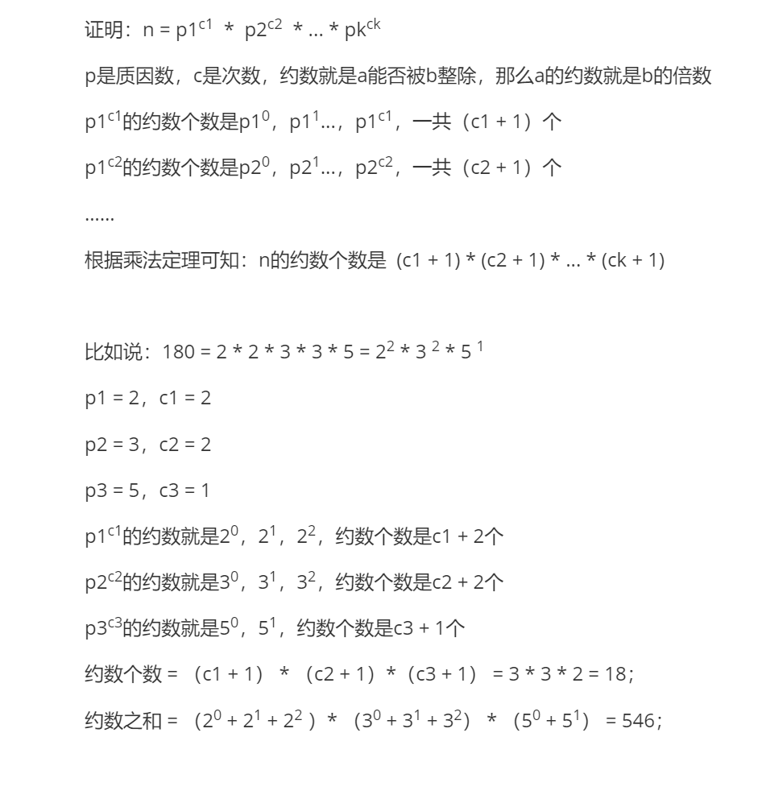
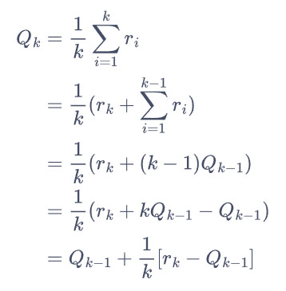
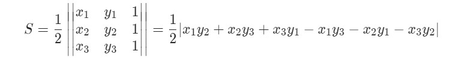
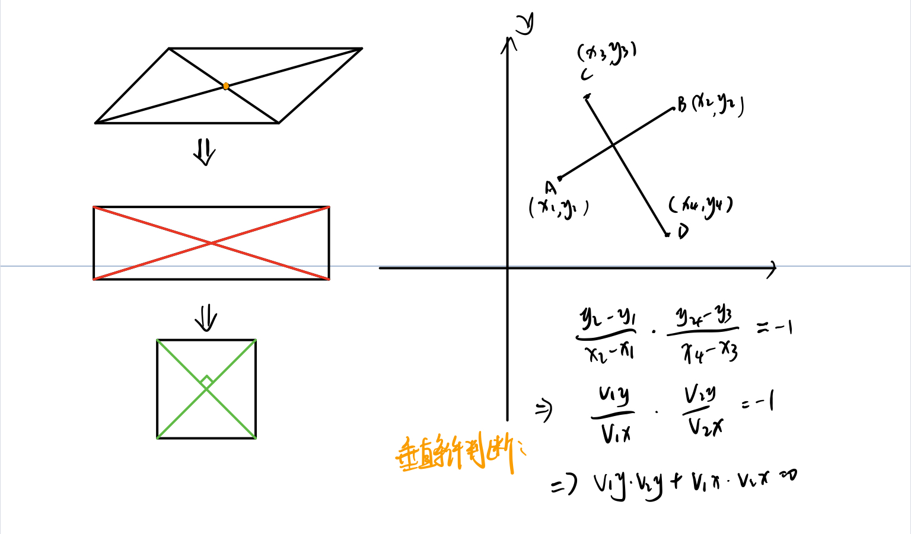
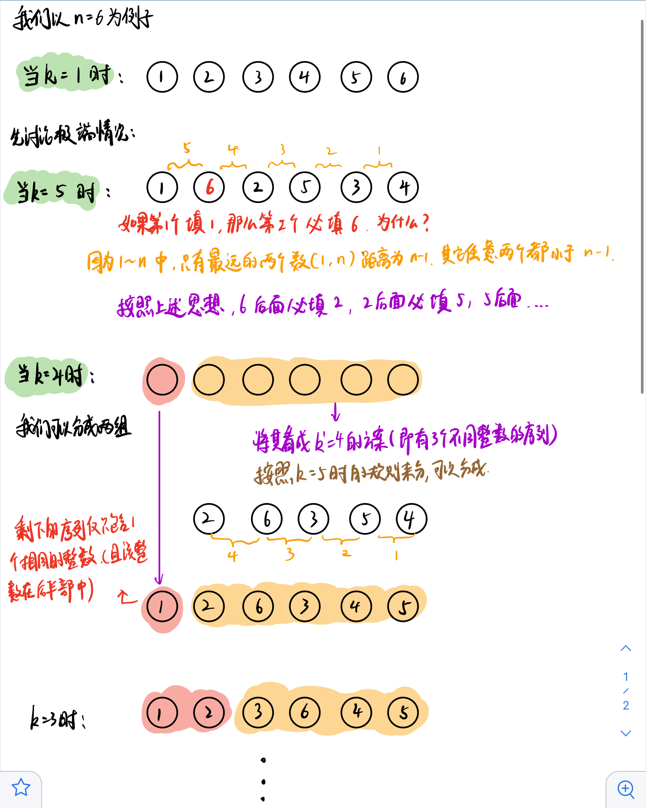

## 数论

#### 质数（素数）

针对大于1的自然数定义的：如果其约数只有1和其本身，就是质数/素数。

试除法**判定质数**：

```java
    /**
     * 判断x是否是质数
     * @param x
     * @return
     */
    public boolean isPrime(int x){
        if (x < 2) return true;
        for (int i = 2;i <= x / i;i++){
            if (x % i == 0){
                return false;
            }
        }
        return true;
    }
```

试除法**分解质因数**：

```java
/**
     * 对x分解质因数
     * @param x (x >= 2)
     * @return map 质因数:对应个数
*/
public static Map<Integer,Integer> divide(int x){
    Map<Integer,Integer> ans = new HashMap<>();
    for (int i = 2;i <= x / i;i++){
        // 如果因数有当前质数
        if (x % i == 0){
            int s = 0;
            // 不断整除
            while (x % i == 0){
                x /= i;
                s += 1;
            }
            ans.put(i,s);
        }
    }
    if (x > 1){
        ans.put(x,1);
    }
    return ans;
}


Map<Integer,Integer> m = divide(1);
Iterator<Map.Entry<Integer,Integer>> entryIterator = m.entrySet().iterator();
while (entryIterator.hasNext()){
    Map.Entry<Integer,Integer> entry = entryIterator.next();
    System.out.println(entry.getKey() +" "+entry.getValue());
}
```

朴素筛法**求素数**：

```java
/**
     * 埃式筛求小于等于n范围内的所有质数
     * @param n
     * @return List
*/
public static List<Integer> getPrimes(int n){
    List<Integer> primes = new ArrayList<>();
    boolean [] st = new boolean[n+1];
    for (int i = 2;i <= n;i++){
        if (st[i]) continue;
        primes.add(i);
        for (int j = i*2;j <= n;j+=i){
            st[j] = true;
        }
    }
    return primes;
}
```

线性筛**求素数**：

```java
/**
     * 线性筛求小于等于n范围内的所有质数
     * @param n
     * @return List
     */
public static List<Integer> getPrimes(int n){
    List<Integer> primes = new ArrayList<>();
    boolean [] st = new boolean[n+1];
    for (int i = 2;i <= n;i++){
        if (!st[i]) primes.add(i);
        for (int j = 0;primes.get(j) * i <= n;j++){
            st[primes.get(j) * i] = true;
            if (i % primes.get(j) == 0) break;
        }
    }
    return primes;
}
```


#### 约数

试除法求**所有约数**:

```java
    /**
     * 求x的所有约数
     * @param x
     * @return
     */
    public static List<Integer> getDivisors(int x){
        List<Integer> ans = new ArrayList<>();
        for (int i = 1;i <= x / i;i++){
            if (x % i == 0){
                ans.add(i);
                if (i != x/i) {
                    ans.add(x / i);
                }
            }
        }
        Collections.sort(ans);
        return ans;
    }
```

**约数个数**：

如果$ N = p_1^{c_1} * p_2^{c_2} * ... *p_k^{c_k}$

> $p_k$是质因数

约数个数： $(c_1 + 1) * (c_2 + 1) * ... * (c_k + 1)$



```java
/**
     * 计算x的约数的个数
     * @param x
     * @return
*/
public static long  getDivisorsNum(int x){
    // 先求x的所有质因数的个数
    Map<Integer,Integer> ans = new HashMap<>();
    for (int i = 2;i <= x / i;i++){
        if (x % i == 0){
            int s = 0;
            while (x % i == 0){
                x /= i;
                s += 1;
            }
            ans.put(i,s);
        }
    }
    if (x > 1){
        ans.put(x,1);
    }
    long ret = 1l;
    for (Integer cnt : ans.values()){
        ret = ret *  (cnt + 1);
    }
    return ret;
}
```

**约数之和**：

如果 $N = p_1^{c_1} * p_2^{c_2}* ... *p_k^{c_k}$
约数之和：$ (p_1^0 + p_1^1 + ... + p_1^{c_1}) * ... * (p_k^0 + p_k^1 + ... + p_k^{c_k})$


#### 最大公约数

欧几里得算法：

```java
    /**
     * 求 a 和 b 的最大公约数
     * @param a
     * @param b
     * @return
     */
    public static int gcd(int a,int b){
        return b != 0 ? gcd(b,a % b) : a;
    }
```


#### 欧拉函数

互质：最大公约数只有1


#### 二进制求和

给你两个二进制字符串，返回它们的和（用二进制表示）。

输入为 **非空** 字符串且只包含数字 `1` 和 `0`。

```java
class Solution {
    public String addBinary(String a, String b) {
        int lena = a.length(),lenb = b.length();
        int [] cha = new int[lena];
        int [] chb = new int[lenb];
        for (int i = lena-1,idx = 0;i >= 0;i--){
            cha[idx++] = a.charAt(i) - '0';
        }
        for (int i = lenb-1,idx = 0;i >= 0;i--){
            chb[idx++] = b.charAt(i) - '0';
        }
        StringBuilder sb = new StringBuilder();
        int idx = 0;
        int add = 0;
        while (idx < lena && idx < lenb){
            int v = add + cha[idx] + chb[idx];
            sb.append(v % 2);
            add = v / 2;
            idx++;
        }
        while (idx < lena){
            int v = add + cha[idx];
            sb.append(v % 2);
            add = v / 2;
            idx++;
        }
        while (idx < lenb){
            int v = add + chb[idx];
            sb.append(v % 2);
            add = v / 2;
            idx++;
        }
        if (add > 0){
            sb.append(1);
        }
        return sb.reverse().toString();
    }
}
```


## 乘法原理

#### 统计子串的唯一字符

我们定义了一个函数 countUniqueChars(s) 来统计字符串 s 中的唯一字符，并返回唯一字符的个数。

例如：s = "LEETCODE" ，则其中 "L", "T","C","O","D" 都是唯一字符，因为它们只出现一次，所以 countUniqueChars(s) = 5 。

本题将会给你一个字符串 s ，我们需要返回 countUniqueChars(t) 的总和，其中 t 是 s 的子字符串。输入用例保证返回值为 32 位整数。

注意，某些子字符串可能是重复的，但你统计时也必须算上这些重复的子字符串（也就是说，你必须统计 s 的所有子字符串中的唯一字符）。

```
输入: s = "ABC"
输出: 10
解释: 所有可能的子串为："A","B","C","AB","BC" 和 "ABC"。
     其中，每一个子串都由独特字符构成。
     所以其长度总和为：1 + 1 + 1 + 2 + 2 + 3 = 10
```

**题目解析**：

原问题为求所有子数组的唯一字符数量和，其可等价为求每个 s[i] 对答案的贡献，即每个 s[i] 可作为多少个子数组的唯一元素。

假定我们能预处理出两数组 l 和 r 分别代表 s[i] 作为子数组唯一字符时，其所能到达的最远两端：

- l[i] = a 代表下标 a 为 s[i]s[i] 能够作为子数组唯一字符时的最远左边界，即为 s[i] 左边第一个与 s[i] 值相同的位置（若不存在，则为 a = -1）
- r[i] = b 代表跳表 b 为 s[i]s[i] 能够作为子数组唯一字符时的最远右边界，即为 s[i] 右边第一个与 s[i] 值相同的位置（若不存在，则为 b = n）

子数组左端点个数为 (i - a) 个，右端点个数为 (b - i) 个，根据乘法原理可知，子数组个数为两者乘积。

预处理 l 和 r 只需要使用遍历计数即可。

```java
class Solution {
    public int uniqueLetterString(String s) {
        int n = s.length();
        int [] l = new int[n]; // l[i]表示左边第一个和s[i]相同的下标，没有为 -1
        int [] r = new int[n]; // r[i]表示右边第一个和s[i]相同的下标，没有为 n
        int [] preIdx = new int[26]; // 记录每个字符上一次出现的位置
        Arrays.fill(preIdx,-1);
        for (int i = 0;i < n;i++){
            char ch = s.charAt(i);
            l[i] = preIdx[ch - 'A'];
            preIdx[ch - 'A'] = i;
        }
        Arrays.fill(preIdx,n);
        for (int i = n-1;i >= 0;i--){
            char ch = s.charAt(i);
            r[i] = preIdx[ch - 'A'];
            preIdx[ch - 'A'] = i;
        }
        int ans = 0;
        for (int i = 0;i < n;i++){
            ans += (i - l[i]) * (r[i] - i);
        }
        return ans;
    }
}
```


## 容斥原理


#### 奇数值单元格的数目

给你一个 m x n 的矩阵，最开始的时候，每个单元格中的值都是 0。

另有一个二维索引数组 indices，$indices[i] = [r_i, c_i]$ 指向矩阵中的某个位置，其中 $r_i $和 $c_i$ 分别表示指定的行和列（从 0 开始编号）。

对 indices[i] 所指向的每个位置，应同时执行下述增量操作：

- $r_i$ 行上的所有单元格，加 1 。
- $c_i$ 列上的所有单元格，加 1 。

给你 m、n 和 indices 。请你在执行完所有 indices 指定的增量操作后，返回矩阵中 奇数值单元格 的数目。


```
输入：m = 2, n = 3, indices = [[0,1],[1,1]]
输出：6
解释：最开始的矩阵是 [[0,0,0],[0,0,0]]。
第一次增量操作后得到 [[1,2,1],[0,1,0]]。
最后的矩阵是 [[1,3,1],[1,3,1]]，里面有 6 个奇数。
```

题目解析：

方法一：暴力模拟

```java
    public int oddCells(int n, int m, int[][] indices) {
        int [][] mat = new int[n][m];
        for (int [] pos : indices){
            int x = pos[0]; // 第 x 行
            int y = pos[1]; // 第 y 列
            for (int i = 0;i < m;i++){
                mat[x][i] += 1;
            }
            for (int i = 0;i < n;i++){
                mat[i][y] += 1;
            }
        }
        int ans = 0;
        for (int i = 0;i < n;i++){
            for (int j = 0;j < m;j++){
                ans += mat[i][j] % 2 == 1 ? 1 : 0;
            }
        }
        return ans;
    }
```

方法二：模拟+空间优化

用rows[i] 和 cols[i] 分别记录第 i  行和第 j 列被增加了几次，对于位置(x,y)，当 rows[x] + cols[y] 为奇数时，最后结果 + 1.

```java
    public int oddCells(int n, int m, int[][] indices) {
        int [] rows = new int[n];
        int [] cols = new int[m];
        for (int [] pos : indices){
            rows[pos[0]] += 1;
            cols[pos[1]] += 1;
        }
        int ans = 0;
        for (int i = 0;i < n;i++){
            for (int j = 0;j < m;j++){
                ans += ((rows[i] + cols[j]) % 2) == 1 ? 1 : 0;
            }
        }
        return ans;
    }
```

方法三：容斥原理

如果 rows[i] 为奇数，则必须跟 cols[] 为偶数的结合才能组成奇数， 同理如果 rows[i] 为偶数，则必须跟 cols[] 奇数的结合才能组成奇数。因此，设 rows 中奇数个数为 p，cols中奇数个数为 q，则最终结果为：
$$
 p * (m - q) + (n - p) * q
$$

```java
class Solution {
    public int oddCells(int n, int m, int[][] indices) {
        int [] rows = new int[n];
        int [] cols = new int[m];
        for (int [] pos : indices){
            rows[pos[0]] += 1;
            cols[pos[1]] += 1;
        }
        int p = 0,q = 0;
        for (int i = 0;i < n;i++){
            p += rows[i] % 2 == 1 ? 1 : 0;
        }
        for (int i = 0;i < m;i++){
            q += cols[i] % 2 == 1 ? 1 : 0;
        }
        return p * (m - q) + (n - p) * q;
    }
}
```


## 逻辑推理（博弈论）


#### Nim 游戏

你和你的朋友，两个人一起玩 Nim 游戏：

桌子上有一堆石头。你们轮流进行自己的回合， **你作为先手** 。

- 每一回合，轮到的人拿掉 1 - 3 块石头。
- 拿掉最后一块石头的人就是获胜者。

假设你们每一步都是最优解。请编写一个函数，来判断你是否可以在给定石头数量为 n 的情况下赢得游戏。如果可以赢，返回 true；否则，返回 false 。

**题目解析**：

当 目前石子数量少于 4 时，你可以直接拿走所有 赢得胜利。当石子数量为4时，你怎么拿，剩下的石子数量必定少于等于3，对方可以直接拿走，获得胜利。因此当轮到谁的回合时，剩下石子数量为4的时候，其必输。

同理，我们继续推，当石子数量为 5-7 个时，你可以只拿 1-3 块使得对方在其回合面临石子剩余数量为4的情况，此时对方必败。

> 其实这里5块就对可以对应为只有1块石头，因为这个时候只要我们拿到使得只剩4块就赢了（等价于拿了最后的一块，即没有石块了）

因此，就可以推断如果总的石头数目为 4 的倍数时，因为无论你取多少石头，对方总有对应的取法，让剩余的石头的数目继续为 4 的倍数。最后，其实就变成了从4个石头里面拿石头。

因此，当石头数量为4的倍数时，我作为先手，必败

```java
class Solution {
    public boolean canWinNim(int n) {
        return n % 4 == 0 ? false : true;
    }
}
```


## 其他常见

#### **增量式求平均值**




#### **计算三角形面积**

设三角形三个顶点的坐标为 $(x_1, y_1)、(x_2, y_2)$和 $(x_3, y_3)$，则三角形面积 S 可以用行列式的绝对值表示：




#### 判断三个点是否在一条直线上

给定一个数组 points ，其中 $points[i] = [x_i, y_i]$ 表示 X-Y 平面上的一个点，如果这些点构成一个 回旋镖 则返回 true 。

回旋镖 定义为一组三个点，这些点 各不相同 且 不在一条直线上 。

计算从 $\textit{points}[0]$ 开始，分别指向 $\textit{points}[1]$ 和 $\textit{points}[2]$ 的向量 $\vec{v}_1 $ 和 $\vec{v}_2$。「三点各不相同且不在一条直线上」等价于「这两个向量的叉乘结果不为零」：$\vec{v}_1 \times \vec{v}_2 \ne \vec{0}$

```java
class Solution {
    public boolean isBoomerang(int[][] points) {
        int[] v1 = {points[1][0] - points[0][0], points[1][1] - points[0][1]};
        int[] v2 = {points[2][0] - points[0][0], points[2][1] - points[0][1]};
        return v1[0] * v2[1] - v1[1] * v2[0] != 0;
    }
}
```

> 二维向量叉乘公式：设$a(x_1,y_1),b(x_2,y_2)$，则$a \times b=(x_1y_2-x_2y_1)$
>
> 几何意义：叉乘结果是向量，方向垂直于原来两个向量，大小是两个向量所确定的平行四边形面积

#### 判断四个点是否构成正方形

给定2D空间中四个点的坐标 $p_1, p_2, p_3$ 和 $p_4$，如果这四个点构成一个正方形，则返回 true 。

点的坐标 pi 表示为 $[x_i, y_i]$ 。输入 不是 按任何顺序给出的。

一个 有效的正方形 有四条等边和四个等角(90度角)。

判断思路：

- 如果有重合点：直接不可能组成正方形
- 否则：
  1. 如果两条斜边的中点相同：则说明以该两条斜边组成的四边形为「平行四边形」。
  2. 在满足「条件一」的基础上，如果两条斜边的长度相同：则说明以该两条斜边组成的四边形为「矩形」。
  3. 在满足「条件二」的基础上，如果两条斜边的相互垂直：则说明以该两条斜边组成的四边形为「正方形」。



```java
class Solution {
    public boolean validSquare(int[] p1, int[] p2, int[] p3, int[] p4) {
        // 如果有点重合 直接返回false
        if (Arrays.equals(p1, p2) || Arrays.equals(p1, p3) || Arrays.equals(p1, p4)) {
            return false;
        }
        return help(p1, p2, p3, p4) || help(p1, p3, p2, p4) || help(p1, p4, p2, p3);
    }

    public boolean help(int[] p1, int[] p2, int[] p3, int[] p4) {
        // 求两点之间的 x y 方向上的距离
        int[] v1 = {p1[0] - p2[0], p1[1] - p2[1]};
        int[] v2 = {p3[0] - p4[0], p3[1] - p4[1]};
        if (checkMidPoint(p1, p2, p3, p4) && checkLength(v1, v2) && calCos(v1, v2)) {
            return true;
        }
        return false;
    }
    // 判断斜边中点是否相同 中点= (a+b) / 2
    private boolean checkMidPoint(int[] p1,int[] p2,int[] p3,int[] p4){
        return p1[0] + p2[0] == p3[0] + p4[0] && p1[1] + p2[1] == p3[1] + p4[1];
    }
    // 判断 斜边长度是否相等
    private boolean checkLength(int[] l1,int[] l2){
        return l1[0] * l1[0] + l1[1] * l1[1] == l2[0] * l2[0] + l2[1] * l2[1];
    }
    // 判断 两条斜别是否垂直
    private boolean calCos(int [] v1,int [] v2){
        return v1[0] * v2[0] + v1[1] * v2[1] == 0;
    }
}

```


#### 进制转换

n 进制 转 m 进制

```java
    /**
     * n 进制 val 转换为 m 进制
     * @param n
     * @param val
     * @param m
     * @return
     */
    public static String trans(int n,String val,int m){
        int l = val.length();
        int t = 0;
        for (int i = 0;i < l;i++){
            int v;
            if (Character.isDigit(val.charAt(i))){
                v = val.charAt(i) - '0';
            }else{
                v = val.charAt(i) - 'A' + 10;
            }
            t = t * n + v;
        }
        StringBuilder sb = new StringBuilder();
        while (t != 0){
            int p = t % m;
            if (p >= 10){
                char c = (char) (p - 10 + 'A');
                sb.append(c);
            }else{
                sb.append(p);
            }
            t /= m;
        }
        return sb.reverse().toString();
    }
```


#### 快速幂

以$x^{77}$作为例子：$x \to x^2 \to x^4 \to^+ x^9 \to^+ x^{19} \to x^{38} \to^+ x^{77}$

并且把需要额外乘 x 的步骤打上了 ++ 标记。

可以发现：

$x^{38} \to^+ x^{77}$ 中额外乘的 x 在 $x^{77}中$贡献了 x；

$x^9 \to^+ x^{19}$中额外乘的 x 在之后被平方了 2 次，因此在 $x^{77}$中贡献了 $x^{2^2} = x^4$ ；

$x^4 \to^+ x^9$中额外乘的 x 在之后被平方了 3 次，因此在 $x^{77}$中贡献了 $x^{2^3} = x^8$；

最初的 x 在之后被平方了 6 次，因此在 $x^{77}$中贡献了$x^{2^6} = x^{64}$。

我们把这些贡献相乘，$x \times x^4 \times x^8 \times x^{64}$恰好等于$ x^{77}$ 。而这些贡献的指数部分又是什么呢？它们都是 2 的幂次，这是因为每个额外乘的 x 在之后都会被平方若干次。而这些指数 1，4，8 和 64，恰好就对应了 77 的二进制表示 $(1001101)_2$ 中的每个 1！

因此我们借助整数的二进制拆分，就可以得到迭代计算的方法，一般地，如果整数 n 的二进制拆分为$n = 2^{i_0} + 2^{i_1} + \cdots + 2^{i_k}$ 

那么$x^n = x^{2^{i_0}} \times x^{2^{i_1}} \times \cdots \times x^{2^{i_k}}$这样以来，我们从 x 开始不断地进行平方，得到 $x^2, x^4, x^8, x^{16}$,⋯，如果 n 的第 k 个（从右往左，从 0 开始计数）二进制位为 1，那么我们就将对应的贡献 $x^{2^k}$计入答案。

```java
class Solution {
    public double myPow(double x, int n) {
        long N = n;
        return N >= 0 ? quickMul(x, N) : 1.0 / quickMul(x, -N);
    }

    public double quickMul(double x, long N) {
        double ans = 1.0;
        // 贡献的初始值为 x
        double x_contribute = x;
        // 在对 N 进行二进制拆分的同时计算答案
        while (N > 0) {
            if (N % 2 == 1) {
                // 如果 N 二进制表示的最低位为 1，那么需要计入贡献
                ans *= x_contribute;
            }
            // 将贡献不断地平方
            x_contribute *= x_contribute;
            // 舍弃 N 二进制表示的最低位，这样我们每次只要判断最低位即可
            N /= 2;
        }
        return ans;
    }
}
```

快速幂经常要结合取余运算。

取余运算有一些好用的性质，包括：

$(A+B) \mod b = (A \mod b + B \mod b) \mod b$

$(A×B) \mod b = ((A \mod b) × (B \mod b)) \mod b$


## 杂题记录

#### 回文数

给你一个整数 x ，如果 x 是一个回文整数，返回 true ；否则，返回 false 。

回文数是指正序（从左向右）和倒序（从右向左）读都是一样的整数。

例如，121 是回文，而 123 不是。

```
输入：x = 121
输出：true
```

**题目解析**：

- 如果x是负数或者 结尾为0但是x不是0的话，直接返回false

- 可以判断x的后一半的逆序是否和前一半相等。

  > 可以通过一个循环求后一半，终止条件是 x <= reverse_x

  - 位数为奇数：比如 12321，判单时需要将后一段的 123 除以10 去掉 3
  - 位数为偶数：直接判断

```java
class Solution {
    public boolean isPalindrome(int x) {
        // 特殊情况 特判
        if (x < 0 || (x % 10 == 0 && x != 0)) {
            return false;
        }
        int reverse_x = 0;
        while (x > reverse_x){
            int t = x % 10;
            x /= 10;
            reverse_x = reverse_x * 10 + t;
        }
        return x == reverse_x || x == (reverse_x / 10);
    }
}
```

#### 阶乘后的零

给定一个整数 `n` ，返回 `n!` 结果中尾随零的数量。

提示 `n! = n * (n - 1) * (n - 2) * ... * 3 * 2 * 1`

**题目解析**：

n! 尾零的数量即为 n! 中因子 10 的个数，而 $10=2\times 5$，因此转换成求 n! 中质因子 2 的个数和质因子 5 的个数的较小值。

> 由于质因子 5 的个数不会大于质因子 2 的个数，我们可以仅考虑质因子 5 的个数。

```java
class Solution {
    public int trailingZeroes(int n) {
        int ans = 0;
        for (int i = 5; i <= n; i += 5) {
            for (int x = i; x % 5 == 0; x /= 5) {
                ++ans;
            }
        }
        return ans;
    }
}
```

优化：

那么，质因子5的出现规律是怎么样的呢？

首先，每5个数会出现一次质因子5。我们还注意到25 = 5 * 5，每25个数会额外再出现一次质因子5。同理，每$5^3
  = 125$个数又会额外再出现一次质因子5。所以，质因子5出现的次数为n / 5 + n / 25 + n / 125 + ...，可以通过不断将x除以5，并累加来得到质因子5出现的次数。

```java
class Solution {
    public int trailingZeroes(int n) {
        int ans = 0;
        while (n != 0) {
            n /= 5;
            ans += n;
        }
        return ans;
    }
}
```

#### 阶乘函数后K个零

 f(x) 是 x! 末尾是 0 的数量。回想一下 x! = 1 * 2 * 3 * ... * x，且 0! = 1 。

例如， f(3) = 0 ，因为 3! = 6 的末尾没有 0 ；而 f(11) = 2 ，因为 11!= 39916800 末端有 2 个 0 。
给定 k，找出返回能满足 f(x) = k 的非负整数 x 的数量。

**题目解析**：

记 $n_{x}$表示 x! 末尾零的个数不小于 x 的最小数，那么题目等价于求解 $n_{k + 1} - n_k$。

由于一个x!中末尾零的个数随着 x 的增大而增大，因此可以使用二分查找来求取 $n_k$

二分边界设置：l = 0, r = 5x。

这是因为：$zeta(x)=\sum^{\infty}_{k=1}\lfloor x / 5^k  \rfloor \ge \lfloor x / 5  \rfloor $

得到：$zeta(5x) \ge  x  $

```java
class Solution {
    private long func(int x){
        long l = 0, r = 5L * x;
        while (l < r){
            long mid = l + ((r - l) >> 1);
            if(check(mid) >= x) r = mid;
            else l = mid + 1;
        }
        return l;
    }
    // mid!有多少个0
    private long check(long mid) {
        long ans = 0;
        while (mid != 0){
            mid /= 5;
            ans += mid;
        }
        return ans;
    }
    public int preimageSizeFZF(int k) {
        return (int)(func(k+1) - func(k));
    }
}
```

#### 优美的排列II

给你两个整数 n 和 k ，请你构造一个答案列表 answer ，该列表应当包含从 1 到 n 的 n 个不同正整数，并同时满足下述条件：

假设该列表是 answer = [a1, a2, a3, ... , an] ，那么列表 [|a1 - a2|, |a2 - a3|, |a3 - a4|, ... , |an-1 - an|] 中应该有且仅有 k 个不同整数。
返回列表 answer 。如果存在多种答案，只需返回其中 任意一种 。

```
输入：n = 3, k = 2
输出：[1, 3, 2]
解释：[1, 3, 2] 包含 3 个范围在 1-3 的不同整数，并且 [2, 1] 中有且仅有 2 个不同整数：1 和 2

```



**注**：可以看到后半部分是间隔的递增 或 递减

```java
class Solution {
    public int[] constructArray(int n, int k) {
        int [] ans = new int[n];
        int idx = 1;
    	// 先排前面部分
        for (int i = 0;i < n-k - 1;i++){
            ans[i] = idx ++;
        }
        int tail = n;
        boolean t = true; // 控制交替排序的变量
        // 再排后面部分
        for (int i = n-k - 1;i < n;i++){
            if (t){
                ans[i] = idx ++;
                t = false;
            }else{
                ans[i] = tail --;
                t = true;
            }
        }
        return ans;
    }
}
```


## 一些定理

- 两个数a,b相减结$c \bmod d =0$ ，那么这两个数 $ \bmod d$ 的余数一定相同
- k 个 相同的数的异或和，当 k  为奇数时，结果为 k 否则为 0 
- 任何与 0 异或的数是其本身
- $a \text{^} \  b \le a + b$，任意两个数的异或结果小于等于两者的和
