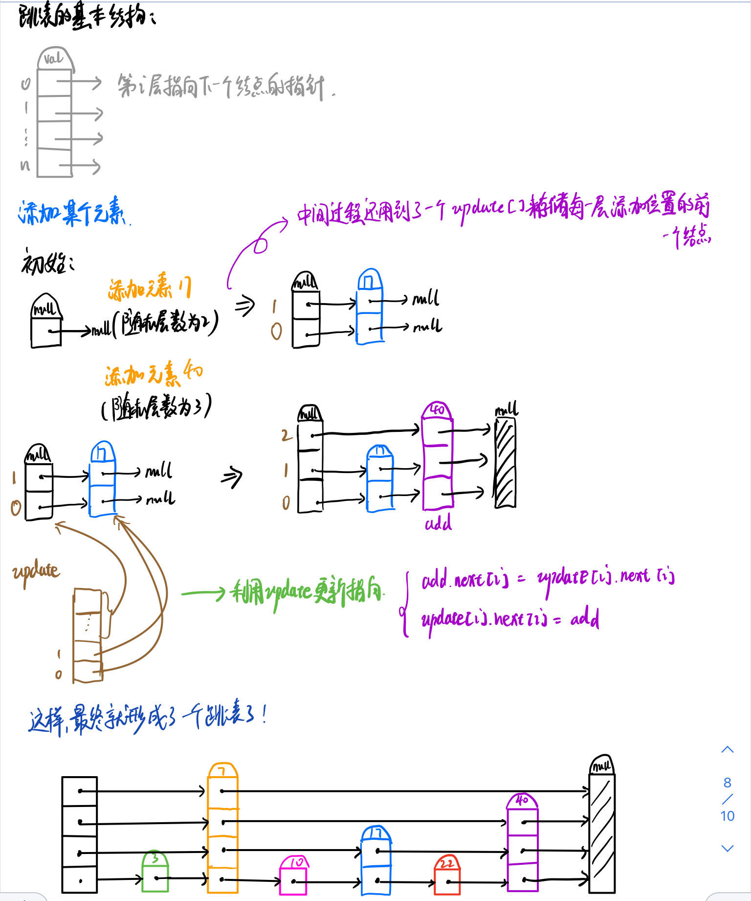
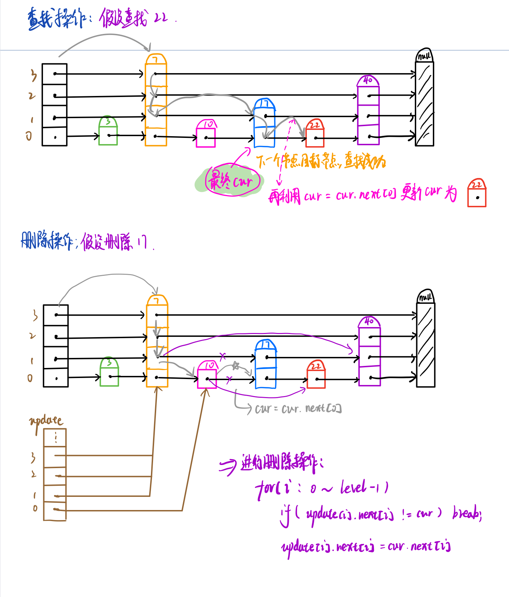

## 数据结构应用题

#### 设计推特

> 题目来源：Leetcode 355
>
> 标签：哈希表

设计一个简化版的推特(Twitter)，可以让用户实现发送推文，关注/取消关注其他用户，能够看见关注人（包括自己）的最近 10 条推文。

实现 Twitter 类：

- Twitter() 初始化简易版推特对象
- void postTweet(int userId, int tweetId) 根据给定的 tweetId 和 userId 创建一条新推文。每次调用此函数都会使用一个不同的 tweetId 。
- `List<Integer>` getNewsFeed(int userId) 检索当前用户新闻推送中最近  10 条推文的 ID 。新闻推送中的每一项都必须是由用户关注的人或者是用户自己发布的推文。推文必须 按照时间顺序由最近到最远排序 。
- void follow(int followerId, int followeeId) ID 为 followerId 的用户开始关注 ID 为 followeeId 的用户。
- void unfollow(int followerId, int followeeId) ID 为 followerId 的用户不再关注 ID 为 followeeId 的用户。


```java
class twitNode{
    int id;
    int time;
    twitNode(int id,int time){
        this.id = id;
        this.time = time;
    }
}

class Twitter {
    int time = 0;
    Map<Integer,Set<Integer>> relationalGraph ;
    Map<Integer,List<twitNode>> news ;
    public Twitter() {
        this.relationalGraph = new HashMap<>();
        this.news = new HashMap<>();
    }

    public void postTweet(int userId, int tweetId) {
        if (news.get(userId) == null){
            List<twitNode> tmp = new ArrayList<>();
            tmp.add(new twitNode(tweetId,time++));
            news.put(userId,tmp);
            return;
        }
        news.get(userId).add(new twitNode(tweetId,time++));
    }

    public List<Integer> getNewsFeed(int userId) {
        List<twitNode> News = new ArrayList<>();
        List<Integer> ans = new ArrayList<>();
        List<twitNode> t = news.get(userId);
        if(t != null){
            for (int i = 0;i < t.size();i++){
                News.add(t.get(i));
            }
        }
        Set<Integer> followed = relationalGraph.get(userId);
        if(followed != null){
            Iterator<Integer> iter = followed.iterator();
            while (iter.hasNext()){
                List<twitNode> tweets = news.get(iter.next());
                if(tweets == null) continue;
                for (int i = 0;i < tweets.size() ;i++){
                    News.add(tweets.get(i));
                }
            }
        }
        if(News.size() == 0) return ans;
        News.sort(new Comparator<twitNode>() {
            @Override
            public int compare(twitNode o1, twitNode o2) {
                return o2.time - o1.time;
            }
        });
        for (int i = 0;i < News.size();i++){
            if(i == 10){
                break;
            }
            ans.add(News.get(i).id);
            
        }
        return ans;
    }

    public void follow(int followerId, int followeeId) {
        if (relationalGraph.get(followerId) == null){
            Set<Integer> s = new HashSet<>();
            s.add(followeeId);
            relationalGraph.put(followerId,s);
            return ;
        }
        relationalGraph.get(followerId).add(followeeId);
    }

    public void unfollow(int followerId, int followeeId) {
        if (relationalGraph.get(followerId) != null){
            relationalGraph.get(followerId).remove(followeeId);
        }
    }
}
```


#### 设计循环双端队列

> 题目来源：Leetcode 641
>
> 标签：数组、链表

设计实现双端队列。

实现 `MyCircularDeque` 类:

- `MyCircularDeque(int k)` ：构造函数,双端队列最大为 `k` 。
- `boolean insertFront()`：将一个元素添加到双端队列头部。 如果操作成功返回 `true` ，否则返回 `false` 。
- `boolean insertLast()` ：将一个元素添加到双端队列尾部。如果操作成功返回 `true` ，否则返回 `false` 。
- `boolean deleteFront()` ：从双端队列头部删除一个元素。 如果操作成功返回 `true` ，否则返回 `false` 。
- `boolean deleteLast()` ：从双端队列尾部删除一个元素。如果操作成功返回 `true` ，否则返回 `false` 。
- `int getFront()` )：从双端队列头部获得一个元素。如果双端队列为空，返回 `-1` 。
- `int getRear()` ：获得双端队列的最后一个元素。 如果双端队列为空，返回 `-1` 。
- `boolean isEmpty()` ：若双端队列为空，则返回 `true` ，否则返回 `false` 。
- `boolean isFull()` ：若双端队列满了，则返回 `true` ，否则返回 `false` 。

可以用数组或链表实现，这里就先只用数组实现

```java
class MyCircularDeque {
    int [] queue;
    int head;
    int tail;
    int size;
    public MyCircularDeque(int k) {
        this.queue = new int[k+1];
        this.head = 0;
        this.tail = 0;
        this.size = k+1;
    }

    public boolean insertFront(int value) {
        if (isFull()){
            return false;
        }
        // 先修改索引 再更新值
        this.head = (this.head - 1 + this.size) % this.size;//注意要 多加个this.size
        this.queue[this.head] = value;
        return true;
    }

    public boolean insertLast(int value) {
        if (isFull()){
            return false;
        }
        // 先添加value 再修改索引
        this.queue[this.tail] = value;
        this.tail = (this.tail + 1) % this.size;
        return true;
    }

    public boolean deleteFront() {
        if (isEmpty()){
            return false;
        }
        this.head = (this.head + 1) %  this.size;
        return true;
    }

    public boolean deleteLast() {
        if (isEmpty()){
            return false;
        }
        this.tail = (this.tail - 1 + this.size) % this.size;
        return true;
    }

    public int getFront() {
        if (isEmpty()) return -1;
        return this.queue[head];
    }

    public int getRear() {
        if (isEmpty()) return -1;
        return this.queue[(tail - 1 + this.size) % this.size];
    }

    public boolean isEmpty() {
        return this.head == this.tail;
    }

    public boolean isFull() {
        return (this.tail + 1) % this.size == this.head;
    }
}
```


#### 设计数字容器系统

设计一个数字容器系统，可以实现以下功能：

- 在系统中给定下标处 插入 或者 替换 一个数字。

- 返回 系统中给定数字的最小下标。

请你实现一个 NumberContainers 类：

- NumberContainers() 初始化数字容器系统。

- void change(int index, int number) 在下标 index 处填入 number 。如果该下标 index 处已经有数字了，那么用 number 替换该数字。

- int find(int number) 返回给定数字 number 在系统中的最小下标。如果系统中没有 number ，那么返回 -1 。

```
输入：
["NumberContainers", "find", "change", "change", "change", "change", "find", "change", "find"]
[[], [10], [2, 10], [1, 10], [3, 10], [5, 10], [10], [1, 20], [10]]
输出：
[null, -1, null, null, null, null, 1, null, 2]

解释：
NumberContainers nc = new NumberContainers();
nc.find(10); // 没有数字 10 ，所以返回 -1 。
nc.change(2, 10); // 容器中下标为 2 处填入数字 10 。
nc.change(1, 10); // 容器中下标为 1 处填入数字 10 。
nc.change(3, 10); // 容器中下标为 3 处填入数字 10 。
nc.change(5, 10); // 容器中下标为 5 处填入数字 10 。
nc.find(10); // 数字 10 所在的下标为 1 ，2 ，3 和 5 。因为最小下标为 1 ，所以返回 1 。
nc.change(1, 20); // 容器中下标为 1 处填入数字 20 。注意，下标 1 处之前为 10 ，现在被替换为 20 。
nc.find(10); // 数字 10 所在下标为 2 ，3 和 5 。最小下标为 2 ，所以返回 2 。
```


```java
class NumberContainers {
    Map<Integer,TreeSet<Integer>> map; // key: number  val : 值为number的下标集合
    Map<Integer,Integer> arr; // key: index , val : number
    public NumberContainers() {
        arr = new HashMap<>();
        map = new HashMap<>();
    }

    public void change(int index, int number) {
        if (arr.get(index) == null){ // 如果index没有数字
            arr.put(index,number);  // 直接插入
            TreeSet<Integer> s = map.getOrDefault(number,new TreeSet<>()); // 将坐标插入其数字的集合中
            s.add(index);
            map.put(number,s);
        }else{ // index有数字
            int val = arr.get(index);
            if(val == number) return ;
            arr.put(index,number);
            
            TreeSet<Integer> t = map.getOrDefault(number,new TreeSet<>()); // 将坐标插入其数字的集合中
            t.add(index);
            map.put(number,t);

            TreeSet<Integer> s = map.getOrDefault(val,new TreeSet<>());
            s.remove(index);
            map.put(val,s);
        }
    }

    public int find(int number) {
        TreeSet<Integer> s = map.get(number);
        if (s == null || s.size() < 1) return -1;
        return s.first();
    }
}

```


#### 设计食物评分系统

设计一个支持下述操作的食物评分系统：

- 修改 系统中列出的某种食物的评分。

- 返回系统中某一类烹饪方式下评分最高的食物。

实现 FoodRatings 类：

- FoodRatings(String[] foods, String[] cuisines, int[] ratings) 初始化系统。食物由 foods、cuisines 和 ratings 描述，长度均为 n 。
  - foods[i] 是第 i 种食物的名字。
  - cuisines[i] 是第 i 种食物的烹饪方式。
  - ratings[i] 是第 i 种食物的最初评分。

- void changeRating(String food, int newRating) 修改名字为 food 的食物的评分。

- String highestRated(String cuisine) 返回指定烹饪方式 cuisine 下评分最高的食物的名字。如果存在并列，返回 字典序较小 的名字。

> 注意，字符串 x 的字典序比字符串 y 更小的前提是：x 在字典中出现的位置在 y 之前，也就是说，要么 x 是 y 的前缀，或者在满足 x[i] != y[i] 的第一个位置 i 处，x[i] 在字母表中出现的位置在 y[i] 之前。

```java
class node{
    String name;
    int val;

    public node(String name, int val) {
        this.name = name;
        this.val = val;
    }
}

class FoodRatings {
    Map<String,Integer> food_vals;
    Map<String,String> food_cui;
    Map<String,TreeSet<node>> food_ops;
    public FoodRatings(String[] foods, String[] cuisines, int[] ratings) {
        food_vals = new HashMap<>();
        food_ops = new HashMap<>();
        food_cui = new HashMap<>();
        int n = foods.length;
        for (int i = 0;i < n;i++){
            String food = foods[i];
            String cuisine = cuisines[i];
            int rating = ratings[i];
            food_vals.put(food,rating);
            node info = new node(food,rating);
            TreeSet<node> set = food_ops.getOrDefault(cuisine,new TreeSet<>(new Comparator<node>() {
                @Override
                public int compare(node o1, node o2) {
                    if (o1.val != o2.val)
                        return o2.val - o1.val;
                    return o1.name.compareTo(o2.name);
                }
            }));
            set.add(info);
            food_ops.put(cuisine,set);
            
            food_cui.put(food,cuisine);
        }
    }

    public void changeRating(String food, int newRating) {
        if (food_vals.get(food) != null){
            int val = food_vals.get(food);
            food_vals.put(food,newRating);
            
            String cuisine = food_cui.get(food);
            TreeSet<node> set = food_ops.get(cuisine);
            node info = new node(food,val);
            set.remove(info);
            node add = new node(food,newRating);
            set.add(add);
            
            food_ops.put(cuisine,set);
        }
    }

    public String highestRated(String cuisine) {
        TreeSet<node> set = food_ops.get(cuisine);
        if (set != null && set.size() > 0){
            return set.first().name;
        }
        return null;
    }
}

/**
 * Your FoodRatings object will be instantiated and called as such:
 * FoodRatings obj = new FoodRatings(foods, cuisines, ratings);
 * obj.changeRating(food,newRating);
 * String param_2 = obj.highestRated(cuisine);
 */
```


#### 完全二叉树插入器

完全二叉树 是每一层（除最后一层外）都是完全填充（即，节点数达到最大）的，并且所有的节点都尽可能地集中在左侧。

设计一种算法，将一个新节点插入到一个完整的二叉树中，并在插入后保持其完整。

实现 CBTInserter 类:

- CBTInserter(TreeNode root) 使用头节点为 root 的给定树初始化该数据结构；

- CBTInserter.insert(int v)  向树中插入一个值为 Node.val == val的新节点 TreeNode。使树保持完全二叉树的状态，并返回插入节点 TreeNode 的父节点的值；

- CBTInserter.get_root() 将返回树的头节点。


```java
class CBTInserter {
    TreeNode root;
    Queue<TreeNode> candidate;
    public CBTInserter(TreeNode root) {
        this.root = root;
        candidate = new ArrayDeque<>();

        Queue<TreeNode> q =  new ArrayDeque<>();
        q.offer(root);
        while (!q.isEmpty()){
            TreeNode now = q.poll();
            if (now.left != null){
                q.offer(now.left);
            }
            if (now.right != null){
                q.offer(now.right);
            }

            if (now.left == null || now.right == null){
                candidate.offer(now);
            }
        }
    }

    public int insert(int val) {
        TreeNode add = new TreeNode(val);
        TreeNode top = candidate.peek();
        if (top.left == null){
            top.left = add;
        }else if (top.right == null){
            top.right = add;
            candidate.poll();
        }
        candidate.offer(add);
        return top.val;
    }

    public TreeNode get_root() {
        return this.root;
    }
}
```

#### 设计跳表

不使用任何库函数，设计一个 跳表 。

跳表 是在 O(log(n)) 时间内完成增加、删除、搜索操作的数据结构。跳表相比于树堆与红黑树，其功能与性能相当，并且跳表的代码长度相较下更短，其设计思想与链表相似。

例如，一个跳表包含 [30, 40, 50, 60, 70, 90] ，然后增加 80、45 到跳表中，以下图的方式操作：


> 跳表中有很多层，每一层是一个短的链表。在第一层的作用下，增加、删除和搜索操作的时间复杂度不超过 O(n)。跳表的每一个操作的平均时间复杂度是 O(log(n))，空间复杂度是 O(n)。

了解更多 : https://en.wikipedia.org/wiki/Skip_list

在本题中，你的设计应该要包含这些函数：

- bool search(int target) : 返回target是否存在于跳表中。
- void add(int num): 插入一个元素到跳表。
- bool erase(int num): 在跳表中删除一个值，如果 num 不存在，直接返回false. 如果存在多个 num ，删除其中任意一个即可。

> 注意：跳表中可能存在多个相同的值，你的代码需要处理这种情况。

```
输入
["Skiplist", "add", "add", "add", "search", "add", "search", "erase", "erase", "search"]
[[], [1], [2], [3], [0], [4], [1], [0], [1], [1]]
输出
[null, null, null, null, false, null, true, false, true, false]

解释
Skiplist skiplist = new Skiplist();
skiplist.add(1);
skiplist.add(2);
skiplist.add(3);
skiplist.search(0);   // 返回 false
skiplist.add(4);
skiplist.search(1);   // 返回 true
skiplist.erase(0);    // 返回 false，0 不在跳表中
skiplist.erase(1);    // 返回 true
skiplist.search(1);   // 返回 false，1 已被擦除
```

题目解析：





```java
class SkiplistNode{
    Integer val;
    SkiplistNode [] next;

    public SkiplistNode(Integer val, int size) {
        this.val = val;
        this.next = new SkiplistNode[size];
    }
}

class Skiplist {
    // 类成员
    private static int MAX_LEVEL = 32;  // 最大层数
    private static double P_FACTOR = 0.25;  // 随机层数概率
    // 对象成员
    private SkiplistNode head;
    private int level;
    private Random random;
    // 构造函数初始化
    public Skiplist() {
        this.head  = new SkiplistNode(null,MAX_LEVEL);
        this.level = 0;
        this.random = new Random();
    }

    private int randomLevel(){
        int lv = 1;
        while (random.nextDouble() < P_FACTOR && lv < MAX_LEVEL){
            lv ++;
        }
        return lv;
    }

    public boolean search(int target) {
        SkiplistNode cur = this.head;
        for (int i = level - 1;i >= 0;i--){
            // 找到第 i 层小于且最接近 target 的结点
            while (cur.next[i] != null && cur.next[i].val < target){
                cur = cur.next[i];
            }
        }
        cur = cur.next[0];  // 这里不太懂 TODO
        if (cur != null && cur.val == target) return true;
        return false;
    }

    public void add(int num) {
        SkiplistNode [] update = new SkiplistNode[MAX_LEVEL];
        Arrays.fill(update,head); // 初始每个都指向头节点
        SkiplistNode cur = this.head;
        for (int i = level - 1;i >= 0;i--){
            // 找到第 i 层小于且最接近 num 的元素
            while (cur.next[i] != null && cur.next[i].val < num){
                cur = cur.next[i]; // 在第 i 层向后遍历
            }
            update[i] = cur; // 更新 update
        }
        // 这里有点不是很懂了 TODO
        int lv = randomLevel();
        level = Math.max(lv,level);
        SkiplistNode addNode = new SkiplistNode(num,lv);
        for (int i = 0;i < lv;i++){
            // 对第 i 层的状态进行更细，将当前元素的 next 指向新的结点
            addNode.next[i] = update[i].next[i];
            update[i].next[i] = addNode;
        }
    }

    public boolean erase(int num) {
        SkiplistNode [] update = new SkiplistNode[MAX_LEVEL];
        SkiplistNode cur = this.head;
        for (int i = level - 1;i >= 0;i--){
            // 找到第 i 层小于且最接近 num 的结点
            while (cur.next[i] != null && cur.next[i].val < num){
                cur = cur.next[i];
            }
            update[i] = cur;
        }
        cur = cur.next[0];
        // 如果值不存在
        if (cur == null || cur.val != num) return false;
        // 删除结点
        for (int i = 0;i < level;i++){
            if (update[i].next[i] != cur){
                break;
            }
            update[i].next[i] = cur.next[i];
        }

        while (level > 1 && head.next[level - 1] == null){
            level -- ;
        }
        return true;
    }
}


public class Solution {
    public int findDuplicate(int[] nums) {
        int n = nums.length;
        int slow = nums[0], fast = nums[nums[0]];
        while (slow != fast){
            slow = nums[slow];
            fast = nums[nums[fast]];
        }
        slow = 0;
        while (slow != fast){
            slow = nums[slow];
            fast = nums[fast];
        }
        return slow;
    }
    public static void main(String [] args){
        int a = 1000000000;
        while (a != 0){
            System.out.print(a % 2);
            a /= 2;
        }

    }
}
```

