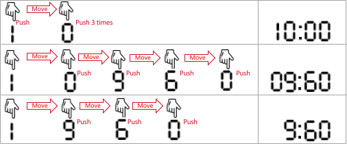

#### Round 1：将标题首字母大写

> 题目来源：LeetCode 5960

给你一个字符串 `title` ，它由单个空格连接一个或多个单词组成，每个单词都只包含英文字母。请你按以下规则将每个单词的首字母 **大写** ：

- 如果单词的长度为 `1` 或者 `2` ，所有字母变成小写。
- 否则，将单词首字母大写，剩余字母变成小写。

请你返回 **大写后** 的 `title` 。

题目解析：

比较简单..直接撸了

```java
class Solution {
    public String capitalizeTitle(String title) {
        String lowtitle = title.toLowerCase();
        String [] words = lowtitle.split(" ");
        StringBuilder ans = new StringBuilder(lowtitle.length());
        for (int i = 0;i < words.length;i++){
            if (words[i].length() < 3){
                ans.append(words[i]);
             if (i != words.length-1)
                    ans.append(" ");
                continue;
            }
            char head = words[i].charAt(0);
            if (head >= 'a' && head <= 'z'){
                head = (char)(head - 32);
            }
            ans.append(head);
            ans.append(words[i].substring(1));
            if (i != words.length-1){
                ans.append(" ");
            }
        }
        return ans.toString();
    }
}
```


#### Round 2：链表最大孪生和

> 题目来源：LeetCode 5961

在一个大小为 `n` 且 `n` 为 **偶数** 的链表中，对于 `0 <= i <= (n / 2) - 1` 的 `i` ，第 `i` 个节点（下标从 **0** 开始）的孪生节点为第 `(n-1-i)` 个节点 。

- 比方说，`n = 4` 那么节点 `0` 是节点 `3` 的孪生节点，节点 `1` 是节点 `2` 的孪生节点。这是长度为 `n = 4` 的链表中所有的孪生节点。

**孪生和** 定义为一个节点和它孪生节点两者值之和。

给你一个长度为偶数的链表的头节点 `head` ，请你返回链表的 **最大孪生和** 

题目解析：

比较简单,直接撸...

```java
/**
 * Definition for singly-linked list.
 * public class ListNode {
 *     int val;
 *     ListNode next;
 *     ListNode() {}
 *     ListNode(int val) { this.val = val; }
 *     ListNode(int val, ListNode next) { this.val = val; this.next = next; }
 * }
 */
class Solution {
    public int pairSum(ListNode head) {
        int[] arr = new int[100000];
        ListNode now = head;
        int idx = 0;
        while (now != null){
            arr[idx++] = now.val;
            now = now.next;
        }
        int len = idx;
        int maxval = Integer.MIN_VALUE;
        for (int i = 0;i <= len / 2 -1;i++){
            if (arr[i] + arr[len-1-i] > maxval){
                maxval = arr[i] + arr[len-1-i];
            }
        }
        return maxval;
    }
}
```

#### Round 3：连接两字母单词得到的最长回文串

> 题目来源：LeetCode 5962

给你一个字符串数组 `words` 。`words` 中每个元素都是一个包含 **两个** 小写英文字母的单词。

请你从 `words` 中选择一些元素并按 **任意顺序** 连接它们，并得到一个 **尽可能长的回文串** 。每个元素 **至多** 只能使用一次。

请你返回你能得到的最长回文串的 **长度** 。如果没办法得到任何一个回文串，请你返回 `0` 。

**回文串** 指的是从前往后和从后往前读一样的字符串。

题目解析：


```java
class Solution {
    public int longestPalindrome(String[] words) {
        Map<String,Integer> m = new HashMap<>();
        for (int i = 0;i < words.length;i++){
            if (m.get(words[i]) == null){
                m.put(words[i],1);
            }else{
                m.put(words[i],m.get(words[i]) + 1);
            }
        }
        int maxlen = Integer.MIN_VALUE;
        int nowlen = 0;
        boolean centerok = false;
        for (int i = 0;i < words.length;i++){
            //如果本身就是回文串
            if (words[i].charAt(0) == words[i].charAt(1)){
                int cnt = m.get(words[i]);
                if (cnt % 2 == 1){
                    if (centerok == false){
                        nowlen += cnt * 2;
                        centerok = true;
                    }else{
                        nowlen += (cnt-1) * 2;
                    }
                }else{
                    nowlen += cnt * 2;
                }
                m.put(words[i],0);
            }else{//本身不是回文串
                StringBuilder sb = new StringBuilder(2);
                sb.append(words[i].charAt(1));
                sb.append(words[i].charAt(0));
                if (m.get(sb.toString()) == null) continue;
                int precnt = m.get(words[i]);
                int anocnt = m.get(sb.toString());
                int mincnt = Math.min(precnt,anocnt);
                m.put(words[i],precnt-mincnt);
                m.put(sb.toString(),anocnt-mincnt);
                nowlen += mincnt * 4;
            }
        }
        return nowlen;
    }
}
```


#### Round 4：用邮票贴满网格

> 题目来源：LeetCode 5931

给你一个 `m x n` 的二进制矩阵 `grid` ，每个格子要么为 `0` （空）要么为 `1` （被占据）。

给你邮票的尺寸为 `stampHeight x stampWidth` 。我们想将邮票贴进二进制矩阵中，且满足以下 **限制** 和 **要求** ：

1. 覆盖所有 **空** 格子。
2. 不覆盖任何 **被占据** 的格子。
3. 我们可以放入任意数目的邮票。
4. 邮票可以相互有 **重叠** 部分。
5. 邮票不允许 **旋转** 。
6. 邮票必须完全在矩阵 **内** 。

如果在满足上述要求的前提下，可以放入邮票，请返回 `true` ，否则返回 `false` 。


```java
//此答案只通过了 65/66 最后一个死也不知道怎么回事
class Solution {
  public int getHcango(int[][] grid,int x,int y){
        //向上下拓展
        int lines = 0;
        for (int i = x;i < grid.length;i++){
            if (grid[i][y] == 0) lines += 1;
            else break;
        }
        for (int i = x-1;i >=0;i--){
            if (grid[i][y] == 0) lines += 1;
            else break;
        }
        return lines;
    }
    public int getWcango(int[][] grid,int x,int y){
        //向左右拓展
        int colums = 0;
        for (int j = y;j < grid[0].length;j++){
            if (grid[x][j] == 0) colums += 1;
            else break;
        }
        for (int j = y-1;j >= 0;j--){
            if (grid[x][j] == 0) colums += 1;
            else break;
        }
        return colums;
    }
    public boolean possibleToStamp(int[][] grid, int stampHeight, int stampWidth) {
        int minH = Integer.MAX_VALUE;
        int minW = Integer.MAX_VALUE;
        if (grid == null) return true;
        if (stampHeight == 1 && stampWidth == 1) return true;
        int[][][] dp = new int[grid.length][grid[0].length][2];
        for (int i = 0;i < grid.length;i++){
            for (int j = 0;j < grid[0].length;j++){
                //如果是1直接跳过
                if (grid[i][j] == 1) continue;
                //判断当前点的上一个点是否测试过
                if (i-1 >= 0 && grid[i-1][j] == 0){
                    dp[i][j][0] = dp[i-1][j][0];
                }else{
                    dp[i][j][0] = getHcango(grid,i,j);
                }
                minH = Math.min(minH,dp[i][j][0]);
                //如果能够放的高度小于邮票高度，则返回False
                if (minH < stampHeight) return false;
                if (j-1 >= 0 && grid[i][j-1] == 0){
                    dp[i][j][1] = dp[i][j-1][1];
                }else{
                    dp[i][j][1] = getWcango(grid,i,j);
                }
                minW = Math.min(minW,dp[i][j][1]);
                //如果能够放的宽度小于邮票宽度，则返回False
                if (minW < stampWidth) return false;
            }
        }
        return true;
    }
}
```


> 总结：此次排名800多...最后一题亏啊...就差一个例子了，然后前面第一道题傻逼了开始，然后耽误了时间....


#### Round 5：检查是否每一行每一列都包含全部整数

> 题目来源：LeetCode 5976

对一个大小为 `n x n` 的矩阵而言，如果其每一行和每一列都包含从 `1` 到 `n` 的 **全部** 整数（含 `1` 和 `n`），则认为该矩阵是一个 **有效** 矩阵。

给你一个大小为 `n x n` 的整数矩阵 `matrix` ，请你判断矩阵是否为一个有效矩阵：如果是，返回 `true` ；否则，返回 `false` 。


```
输入：matrix = [[1,2,3],[3,1,2],[2,3,1]]
输出：true
解释：在此例中，n = 3 ，每一行和每一列都包含数字 1、2、3 。
因此，返回 true 。
```

简单题目，直接撸

```java
class Solution {
   public boolean check(int[][] matrix,int x){
        boolean [] used = new boolean[matrix.length + 1];
        for (int i = 0; i < matrix.length;i++){
            if (used[matrix[x][i]]) return false;
            used[matrix[x][i]] = true;
        }
        used = new boolean[matrix.length + 1];
        for (int i = 0; i < matrix.length;i++){
            if (used[matrix[i][x]]) return false;
            used[matrix[i][x]] = true;
        }
        return true;
    }
    public boolean checkValid(int[][] matrix) {
        int n = matrix.length;
        for (int i =0;i < n;i++){
            if (check(matrix,i) == false) return false;
        }
        return true;
    }
}
```


#### Round 6：最少交换次数来组合所有的 1 II

> 题目来源：LeetCode 5977

**交换** 定义为选中一个数组中的两个 **互不相同** 的位置并交换二者的值。

**环形** 数组是一个数组，可以认为 **第一个** 元素和 **最后一个** 元素 **相邻** 。

给你一个 **二进制环形** 数组 `nums` ，返回在 **任意位置** 将数组中的所有 `1` 聚集在一起需要的最少交换次数。

```
输入：nums = [1,1,0,0,1]
输出：0
解释：得益于数组的环形特性，所有的 1 已经聚集在一起。
因此，需要的最少交换次数为 0 。
```

题目解析：

这道题浪费了点时间...有一说一这个中等题开始真不好想。

说说自己的想法吧，利用到了**滑动窗口**的思想。


```java
class Solution {
    public int getMinChange(int[] nums,int cnt){
        int minChange = Integer.MAX_VALUE;
        int left = 0;
        int nowWindow_1 = 0;
        for (int i = 0;i < cnt-1;i++){
            if (nums[i] == 1) nowWindow_1 += 1;
        }
        int right = cnt-2;
        while (right < nums.length-1){
            right += 1;
            if (nums[right] == 1) nowWindow_1 += 1;
            minChange = Math.min(minChange,cnt-nowWindow_1);
            if (nums[left] == 1) nowWindow_1 -= 1;
            left += 1;
        }
        return minChange;
    }
    public int minSwaps(int[] nums) {
        int n = nums.length;
        int cnt = 0;
        for (int num:nums){
            if (num == 1) cnt += 1;
        }
        if (cnt == 0) return 0;
        int[] arr = new int[n+cnt-1];
        for (int i = 0;i < n;i++){
            arr[i] = nums[i];
        }
        for (int i = 0;i < cnt-1;i++){
            arr[i+n] = nums[i];
        }
        return getMinChange(arr,cnt);
    }
}
```


#### Round 7：统计追加字母可以获得的单词数

> 题目来源：LeetCode 5978

给你两个下标从 **0** 开始的字符串数组 `startWords` 和 `targetWords` 。每个字符串都仅由 **小写英文字母** 组成。

对于 `targetWords` 中的每个字符串，检查是否能够从 `startWords` 中选出一个字符串，执行一次 **转换操作** ，得到的结果与当前 `targetWords` 字符串相等。

**转换操作** 如下面两步所述：

1. **追加** 任何**不存在**于当前字符串的任一小写字母到当前字符串的末尾。
   - 例如，如果字符串为 `"abc"` ，那么字母 `'d'`、`'e'` 或 `'y'` 都可以加到该字符串末尾，但 `'a'` 就不行。如果追加的是 `'d'` ，那么结果字符串为 `"abcd"` 。
2. **重排** 新字符串中的字母，可以按**任意**顺序重新排布字母。
   - 例如，`"abcd"` 可以重排为 `"acbd"`、`"bacd"`、`"cbda"`，以此类推。注意，它也可以重排为 `"abcd"` 自身。

找出 `targetWords` 中有多少字符串能够由 `startWords` 中的 **任一** 字符串执行上述转换操作获得。返回 `targetWords` 中这类 **字符串的数目** 。

**注意：**你仅能验证 `targetWords` 中的字符串是否可以由 `startWords` 中的某个字符串经执行操作获得。`startWords` 中的字符串在这一过程中 **不** 发生实际变更。

**题目解析**：


```java
class Solution {
    public int wordCount(String[] startWords, String[] targetWords) {

        Set<Integer> set_start = new HashSet<>();
        for (String startword : startWords){
            int val = 0;
            for (int i = 0;i < startword.length();i++){
                val |= (1 <<(startword.charAt(i) - 'a'));
            }
            set_start.add(val);
        }
        int ans = 0;
        Map<String,Integer> m_target = new HashMap<>();
        for (String targetword : targetWords){
            int val = 0;
            for (int i = 0;i < targetword.length();i++){
                val |= (1 <<(targetword.charAt(i) - 'a'));
            }
            for (int i = 0;i < 26;i++){
                if (((1 << (i)) & val) == 0) continue;
                int targetval = val^(1 << (i));
                if (set_start.contains(targetval)){
                    ans += 1;
                    break;
                }
            }
        }
        return ans;
    }
    
}
```

#### Round 8：全部开花的最早一天

> 题目来源：LeetCode 5979

你有 `n` 枚花的种子。每枚种子必须先种下，才能开始生长、开花。播种需要时间，种子的生长也是如此。给你两个下标从 **0** 开始的整数数组 `plantTime` 和 `growTime` ，每个数组的长度都是 `n` ：

- `plantTime[i]` 是 **播种** 第 `i` 枚种子所需的 **完整天数** 。每天，你只能为播种某一枚种子而劳作。**无须** 连续几天都在种同一枚种子，但是种子播种必须在你工作的天数达到 `plantTime[i]` 之后才算完成。
- `growTime[i]` 是第 `i` 枚种子完全种下后生长所需的 **完整天数** 。在它生长的最后一天 **之后** ，将会开花并且永远 **绽放** 。

从第 `0` 开始，你可以按 **任意** 顺序播种种子。

返回所有种子都开花的 **最早** 一天是第几天。



```
输入：plantTime = [1,4,3], growTime = [2,3,1]
输出：9
解释：灰色的花盆表示播种的日子，彩色的花盆表示生长的日子，花朵表示开花的日子。
一种最优方案是：
第 0 天，播种第 0 枚种子，种子生长 2 整天。并在第 3 天开花。
第 1、2、3、4 天，播种第 1 枚种子。种子生长 3 整天，并在第 8 天开花。
第 5、6、7 天，播种第 2 枚种子。种子生长 1 整天，并在第 9 天开花。
因此，在第 9 天，所有种子都开花。 
```

题目解析：

做到这道题就剩20分钟了...感觉哪些大佬是怎么在30分钟就做完所有题目的？

其实解这道题目就是**贪心**！

对于两枚种子，设其播种所需天数为$p_1$和 $p_2$，生长所需天数为 $g_1$ 和 $g_2$。

不妨设 $g_1\ge g_2$我们来比较哪种播种顺序更优：

- 先 1 后 2 时的最晚开花时间：$\max(p_1+g_1,p_1+p_2+g_2)$

- 先 2 后 1 时的最晚开花时间：$\max(p_1+p_2+g_1,p_2+g_2)$

  > 由于 $g_1\ge g_2$ 且 $p_1>0$ 所以 $p_1+p_2+g_1>p_2+g_2$ ，因此上式即为 $p_1+p_2+g_1$

由于 $p_1+g_1 < p_1+p_2+g_1$ 且 $p_1+p_2+g_2 \le p_1+p_2+g_1$，因此我们有$max(p_1+g_1,p_1+p_2+g_2) \le p_1+p_2+g_1=max(p_1+p_2+g_1,p_2+g_2)$

上式表明，按照先 1 后 2 的顺序播种，最晚开花时间不会晚于按照先 2 后 1 播种时的最晚开花时间。

这意味着按照生长天数从大到小排序后，交换任意两枚种子的播种顺序，不会让最晚开花时间提前。

因此，我们可以按照生长天数从大到小的顺序播种。对于两枚生长天数相同的种子，由于无论按照何种顺序播种，这两枚种子的最晚开花时间都是相同的，因此无需考虑生长天数相同的种子的播种顺序，所以在排序时，仅需对生长天数从大到小排序。

```java
class node{
    int plantval;
    int growval;

    public node(int plantval, int growval) {
        this.plantval = plantval;
        this.growval = growval;
    }
}
class Solution {
    public int earliestFullBloom(int[] plantTime, int[] growTime) {
        List<node> arr = new ArrayList<>();
        for (int i = 0;i < plantTime.length;i++){
            arr.add(new node(plantTime[i],growTime[i]));
        }
        arr.sort(new Comparator<node>() {
            @Override
            public int compare(node o1, node o2) {
                return o2.growval - o1.growval;
            }
        });
        int ans = 0,day = 0;
        for (int i = 0;i < arr.size();i++){
            day += arr.get(i).plantval;  //先加上要种植的天数
            ans = Math.max(ans,day + arr.get(i).growval);  //开花天数 + 当前天数 > 最长天数 ==> 更新
        }
        return ans;
    }
}
```

#### Round 9：解决智力问题

> 题目来源：LeetCode 5982 
>
> 标签：动态规划

给你一个下标从 0 开始的二维整数数组 questions ，其中 questions[i] = [pointsi, brainpoweri] 。

这个数组表示一场考试里的一系列题目，你需要 按顺序 （也就是从问题 0 开始依次解决），针对每个问题选择 解决 或者 跳过 操作。解决问题 i 将让你 获得  pointsi 的分数，但是你将 无法 解决接下来的 brainpoweri 个问题（即只能跳过接下来的 brainpoweri 个问题）。如果你跳过问题 i ，你可以对下一个问题决定使用哪种操作。

比方说，给你 questions = [[3, 2], [4, 3], [4, 4], [2, 5]] ：

- 如果问题 0 被解决了， 那么你可以获得 3 分，但你不能解决问题 1 和 2 。
- 如果你跳过问题 0 ，且解决问题 1 ，你将获得 4 分但是不能解决问题 2 和 3 。

请你返回这场考试里你能获得的 最高 分数。

```
输入：questions = [[3,2],[4,3],[4,4],[2,5]]
输出：5
解释：解决问题 0 和 3 得到最高分。
- 解决问题 0 ：获得 3 分，但接下来 2 个问题都不能解决。
- 不能解决问题 1 和 2
- 解决问题 3 ：获得 2 分
总得分为：3 + 2 = 5 。没有别的办法获得 5 分或者多于 5 分。
```

**题目解析**：

开始就想到了采样动态规划的方法，想了半天突然`意识到倒序DP`，思路就涌泉而来。

设有 n个问题，定义 `f[i]` 表示解决区间$ [i,n−1] $内的问题可以获得的最高分数。

倒序遍历问题列表，对于第 i 个问题，我们有两种决策：**跳过**或**解决**。

- 若跳过，则有$ f(i)=f(i+1)$。

- 若解决，则需要跳过后续$ \textit{brainpower}[i]$个问题。记$ j=i+\textit{brainpower}[i]+1$，则有
  $$
  f(i) =
  \begin{cases} 
  points(i),  & \text{if } j \ge n \\
   points(i) + f(j), & \text{if } j  \lt n
  \end{cases}
  $$

- 每次取两者较大的一个作为$f(i)$

最终结果即为$f(0)$:表示解决区间$ [0,n−1] $内的问题可以获得的最高分数。

```java
class Solution {
    public long mostPoints(int[][] questions) {
        int n = questions.length;
        long[] dp = new long[n];
        dp[n-1] = questions[n-1][0];
        for (int i = n - 2;i >= 0;i--){
            int j = i + questions[i][1] + 1;
            dp[i] = Math.max(dp[i+1],questions[i][0] + (j < n ? dp[j] : 0));
        }
        return dp[0];
    }
}
```


#### Round 10：同时运行 N 台电脑的最长时间

> 题目来源：LeetCode 5983
>
> 标签：二分答案

你有 n 台电脑。给你整数 n 和一个下标从 0 开始的整数数组 batteries ，其中第 i 个电池可以让一台电脑 运行 batteries[i] 分钟。你想使用这些电池让 全部 n 台电脑 同时 运行。

一开始，你可以给每台电脑连接 至多一个电池 。然后在任意整数时刻，你都可以将一台电脑与它的电池断开连接，并连接另一个电池，你可以进行这个操作 任意次 。新连接的电池可以是一个全新的电池，也可以是别的电脑用过的电池。断开连接和连接新的电池不会花费任何时间。

注意，你不能给电池充电。

请你返回你可以让 n 台电脑同时运行的 最长 分钟数。


```
输入：n = 2, batteries = [3,3,3]
输出：4
```

题目解析：

太菜了，没想到用二分答案...

以下题解参考`https://leetcode-cn.com/problems/maximum-running-time-of-n-computers/solution/er-fen-da-an-de-checkhan-shu-de-si-kao-f-g8no/`

设本题电脑同时运行时间为P，这也是我们不断二分得到的结果。
设一共有K台电脑，我们的目的是在P的时间内不断运转他们。
因此，我们的目的其实是看电池的状态能不能填满P*K的矩形。


上部分代表了一种电池的合法分布情况。
很明显，当Batteries0(黄色)的数量超过了P，我们其实只需要P即可，剩下的都只能抛弃。
当Batteries1(橘色)的数量小于P，我们需要把当前电池全部用完。同时提前借用别的电池来填充该列。

然而，下面也有NG的情况。我们把橘色电池容量-1，红色的+1，再来看看我们构造的矩形。因为一行不能存在2个同样的颜色（即不能存在一个电池给2个电脑续航的情况)，所以红色的电池会浪费掉一个(对应了代码里的min(p, 红色电池容量))，最终导致矩形的构造失败。
**总结**：一下可以用这个心态来构造矩形：小于P的时候，贪心地利用多个电池，但是同时不能在一行里有相同的颜色。

> 起始难点是想怎么实现 check函数，即检验函数，唉 太菜了 继续学习

```java
class Solution {
    public boolean check(long mid,int n,int [] batteries){
        long sum = 0;
        for (int num : batteries){
            sum += Math.min(num,mid);
        }
        return sum >= n * mid;
    }
    public long maxRunTime(int n, int[] batteries) {
        long left = 0,right = Long.MAX_VALUE / n;
        while (left < right){
            long mid = left + ((right - left) >> 1);
            if (check(mid,n,batteries)){
                left = mid + 1;
            }else {
                right = mid;
            }
        }
        return left-1;
    }
}
```


#### Round 11：将找到的值乘以 2

> 题目来源：LeetCode 5993
>
> 标签：哈希表

给你一个整数数组 nums ，另给你一个整数 original ，这是需要在 nums 中搜索的第一个数字。

接下来，你需要按下述步骤操作：

如果在 nums 中找到 original ，将 original 乘以 2 ，得到新 original（即，令 original = 2 * original）。
否则，停止这一过程。
只要能在数组中找到新 original ，就对新 original 继续 重复 这一过程。
返回 original 的 最终 值。

```java
class Solution {
    public int findFinalValue(int[] nums, int original) {
        Map<Integer,Integer> m = new HashMap<>();
        for (int i = 0;i < nums.length;i++){
            m.put(nums[i],i);
        }
        while (true){
            int idx = m.getOrDefault(original,-1);
            if (idx == -1) break;
            original *= 2;
        }
        return original;
    }
}
```


#### Round 12：分组得分最高的所有下标

> 题目来源：LeetCode 5981
>
> 标签：数组

给你一个下标从 **0** 开始的二进制数组 `nums` ，数组长度为 `n` 。`nums` 可以按下标 `i`（ `0 <= i <= n` ）拆分成两个数组（可能为空）：`numsleft` 和 `numsright` 。

- `numsleft` 包含 `nums` 中从下标 `0` 到 `i - 1` 的所有元素**（包括** `0` **和** `i - 1` **）**，而 `numsright` 包含 `nums` 中从下标 `i` 到 `n - 1` 的所有元素**（包括** `i` **和** `n - 1` **）。**
- 如果 `i == 0` ，`numsleft` 为 **空** ，而 `numsright` 将包含 `nums` 中的所有元素。
- 如果 `i == n` ，`numsleft` 将包含 `nums` 中的所有元素，而 `numsright` 为 **空** 。

下标 `i` 的 **分组得分** 为 `numsleft` 中 `0` 的个数和 `numsright` 中 `1` 的个数之 **和** 。

返回 **分组得分 最高** 的 **所有不同下标** 。你可以按 **任意顺序** 返回答案。

```java
class Solution {
    public List<Integer> maxScoreIndices(int[] nums) {
        int total_zero = 0,total_one = 0;
        for (int i = 0;i < nums.length;i++){
            if (nums[i] == 0)
                total_zero += 0;
            else
                total_one += 1;
        }
        int maxScore = Integer.MIN_VALUE;
        List<Integer> ans = new ArrayList<>();
        // scores[i][0] 左边0的个数，右边1的个数
        int [][] scores = new int[nums.length+1][2];
        scores[0][0] = 0;
        scores[0][1] = total_one;
        maxScore = Math.max(maxScore,scores[0][0] + scores[0][1]);
        ans.add(0);
        for (int i = 0;i < nums.length;i++){
            if (nums[i] == 0){
                scores[i+1][0] = scores[i][0] + 1;
                scores[i+1][1] = scores[i][1];
            }else{
                scores[i+1][0] = scores[i][0];
                scores[i+1][1] = scores[i][1] - 1;
            }
            int nowScore = scores[i+1][0] + scores[i+1][1];
            if (nowScore == maxScore){
                ans.add(i+1);
            }else if (nowScore > maxScore){
                ans = new ArrayList<>();
                ans.add(i+1);
                maxScore = nowScore;
            }
        }
        return ans;
    }
}
```


#### Round 13：查找给定哈希值的子串

> 题目来源：LeetCode 5994
>
> 标签：数组、预处理

给定整数 p 和 m ，一个长度为 k 且下标从 0 开始的字符串 s 的哈希值按照如下函数计算：

- $hash(s, p, m) = (val(s[0]) * p^0 + val(s[1]) * p^1 + ... + val(s[k-1]) * p^{k-1}) \mod m$

> 其中 val(s[i]) 表示 s[i] 在字母表中的下标，从 val('a') = 1 到 val('z') = 26 。

给你一个字符串 s 和整数 power，modulo，k 和 hashValue 。请你返回 s 中 第一个 长度为 k 的 子串 sub ，满足 hash(sub, power, modulo) == hashValue 。

测试数据保证一定 存在 至少一个这样的子串。

子串 定义为一个字符串中连续非空字符组成的序列。

```java
class Solution {
    public String subStrHash(String s, int power, int modulo, int k, int hashValue) {
        int n = s.length();
        long [] mulvals = new long [k];
        long val = 1;
        mulvals[0] = val;
        for (int i = 1;i < mulvals.length;i++){
            mulvals[i] = (mulvals[i-1] * power) % modulo;
        }
        for (int i = 0;i <= n - k;i++){
            long sum = 0;
            for (int j = i;j < i + k;j++){
                sum = (sum + (s.charAt(j) - 'a' + 1) * mulvals[j-i]) % modulo;
            }
            if (sum % modulo == hashValue){
                return s.substring(i,i+k);
            }
        }
        return null;
    }
}
```


#### Round 14：字符串分组

> 题目来源：LeetCode 5995
>
> 标签：并查集、字符串、状态压缩

给你一个下标从 **0** 开始的字符串数组 `words` 。每个字符串都只包含 **小写英文字母** 。`words` 中任意一个子串中，每个字母都至多只出现一次。

如果通过以下操作之一，我们可以从 `s1` 的字母集合得到 `s2` 的字母集合，那么我们称这两个字符串为 **关联的** ：

- 往 `s1` 的字母集合中添加一个字母。
- 从 `s1` 的字母集合中删去一个字母。
- 将 `s1` 中的一个字母替换成另外任意一个字母（也可以替换为这个字母本身）。

数组 `words` 可以分为一个或者多个无交集的 **组** 。一个字符串与一个组如果满足以下 **任一** 条件，它就属于这个组：

- 它与组内 **至少** 一个其他字符串关联。
- 它是这个组中 **唯一** 的字符串。

注意，你需要确保分好组后，一个组内的任一字符串与其他组的字符串都不关联。可以证明在这个条件下，分组方案是唯一的。

请你返回一个长度为 `2` 的数组 `ans` ：

- `ans[0]` 是 `words` 分组后的 **总组数** 。
- `ans[1]` 是字符串数目最多的组所包含的字符串数目。

```java
//并查集 类
class UnionFind{
    public int[] parent ;  //集合的根节点（头领）
    public int[] rank ; // 集合的层数
    public int[] cnt;  //每个集合中的元素数量
    public int count; // 集合的数量 ---组数
    public int max_count; //元素数量最多的集合的元素数
    //初始化
    UnionFind(int n){
        parent = new int[n];
        rank = new int[n];
        cnt = new int[n];
        for (int i = 0;i < n;i++){
            parent[i] = i;
            rank[i] = 1;
            cnt[i] = 1;
        }
        count = n;
        max_count = 1;
    }
	//合并操作
    public boolean union(int x,int y){
        int px = find(x);
        int py = find(y);
        if (px == py) return false;
        if (rank[px] == rank[py]){
            parent[px] = py;
            rank[py] += 1;
            cnt[py] += cnt[px];
            max_count = Math.max(max_count,cnt[py]);
        }else if(rank[px] < rank[py]){
            parent[px] = py;
            cnt[py] += cnt[px];
            max_count = Math.max(max_count,cnt[py]);
        }else{
            parent[py] = px;
            cnt[px] += cnt[py];
            max_count = Math.max(max_count,cnt[px]);
        }
        count -= 1;
        return true;
    }
    //寻找祖结点
    public int find(int x){
        return parent[x] == x ? x : (parent[x] = find(parent[x]));
    }
}
//方法一：时间复杂度0(n^2)
public class Solution {
    public int getStrVal(String str){
        int val = 0;
        //将字符串中的每个字符转换为整数的二进制表示中的一位
        for (int i = 0;i < str.length();i++){
            val |= (1 << (str.charAt(i) - 'a'));
        }
        return val;
    }
    public int getCnt(int a){
        int cnt = 0;
        while (a != 0){
            a = a & (a - 1);
            cnt += 1;
        }
        return cnt;
    }
    public  boolean check(String a,String b,int cnt){
        if (cnt > 1) return false;
        int lena = a.length();
        int lenb = b.length();
        if (Math.abs(lena-lenb) >= 2) return false;
        int idxa = 0,idxb = 0;
        while (idxa < lena && idxb < lenb){
            if (a.charAt(idxa) == b.charAt(idxb)){
                idxa += 1;
                idxb += 1;
            }else{
                return check(a.substring(idxa+1),b.substring(idxb),cnt+1) || check(a.substring(idxa),b.substring(idxb+1),cnt+1);
            }
        }
        return true;
    }
    public int[] groupStrings(String[] words) {
        int n = words.length;
        Map<Integer,Integer> m = new HashMap<>();
        UnionFind uf = new UnionFind(n);
        for (int i = 0;i < n;i++){  //O(n)
            int val = getStrVal(words[i]);
            if (m.get(val) == null){
                m.put(val,i);
            }else{
                uf.union(m.get(val),i);
            }
        } 
        for(int i = 0;i < words.length;i++){ //O(C*n)
            int val = getStrVal(words[i]);
            //尝试删除第i个1
            for(int j = 0;j < 26;j++){ //O(26)
                if ((val & (1<<j)) > 0 && m.containsKey(val - (1 << j))){
                    uf.union(i,m.get(val - (1 << j)));
                }
            }
            //尝试添加第i个1
            for(int j = 0;j < 26;j++){  //O(26)
                if ((val & (1<<j)) == 0 && m.containsKey(val + (1 << j))){
                    uf.union(i,m.get(val + (1 << j)));
                }
            }
            //尝试将第i个元素替换为a~z
            for (int j = 0;j < 26;j++){  //O(26 ^ 2)
                for (int k = 0;k < 26;k++){
                    int key = val - (1 << j) + (1 << k);
                    if ((val & (1 << j)) > 0 && ((val & (1 << k)) == 0) && m.containsKey(key)){
                        uf.union(i,m.get(key));
                    }
                }
            }
        }
        int [] ans = new int[2];
        ans[0] = uf.count;
        ans[1] =uf.max_count;
        return ans;
    }
}
```

> 这道题想到用并查集，但是超时了，原因是最初写的代码时间复杂度太高了

最初的代码如下：

```java
class UnionFind{
    public int[] parent ;  //集合的根节点（头领）
    public int[] rank ; // 集合的层数
    public int[] cnt;  //每个集合中的元素数量
    public int count; // 集合的数量 ---组数
    public int max_count; //元素数量最多的集合的元素数
    UnionFind(int n){
        parent = new int[n];
        rank = new int[n];
        cnt = new int[n];
        for (int i = 0;i < n;i++){
            parent[i] = i;
            rank[i] = 1;
            cnt[i] = 1;
        }
        count = n;
        max_count = 1;
    }

    public boolean union(int x,int y){
        int px = find(x);
        int py = find(y);
        if (px == py) return false;
        if (rank[px] == rank[py]){
            parent[px] = py;
            rank[py] += 1;
            cnt[py] += cnt[px];
            max_count = Math.max(max_count,cnt[py]);
        }else if(rank[px] < rank[py]){
            parent[px] = py;
            cnt[py] += cnt[px];
            max_count = Math.max(max_count,cnt[py]);
        }else{
            parent[py] = px;
            cnt[px] += cnt[py];
            max_count = Math.max(max_count,cnt[px]);
        }
        count -= 1;
        return true;
    }
    public int find(int x){
        return parent[x] == x ? x : (parent[x] = find(parent[x]));
    }
}

public class Solution {
    public int getStrVal(String str){
        int val = 0;
        for (int i = 0;i < str.length();i++){
            val |= (1 << (str.charAt(i) - 'a'));
        }
        return val;
    }
    public int getCnt(int a){
        int cnt = 0;
        while (a != 0){
            a = a & (a - 1);
            cnt += 1;
        }
        return cnt;
    }
    // O(n^2)
    public int[] groupStrings(String[] words) {
        int n = words.length;
        int [] vals = new int[n];
        for (int i = 0;i < n;i++){
            vals[i] = getStrVal(words[i]);
        }
        UnionFind uf = new UnionFind(n);
        for (int i = 0;i < n;i++){
            for (int j = i + 1; j < n;j++){
                if (Math.abs(words[i].length() - words[j].length()) == 1 && getCnt(vals[i] ^ vals[j]) == 1){
                    uf.union(i,j);
                    // System.out.println(words[i] + " and " + words[j] +" union by del or add");
                }else if ((getCnt(vals[i] ^ vals[j]) == 2 || getCnt(vals[i] ^ vals[j]) == 0) && words[i].length() == words[j].length()){
                    uf.union(i,j);
                    // System.out.println(words[i] + " and " + words[j] +" union by change");
                }
            }
        }
        int [] ans = new int[2];
        ans[0] = uf.count;
        ans[1] =uf.max_count;
        return ans;
    }
}
```

```java
//开始写的一个函数，后来没用到
/*
检测两个字符串能否通过一次添加、删除元素操作使得两个字符串相等
*/
public  boolean check(String a,String b,int cnt){
    if (cnt > 1) return false;
    int lena = a.length();
    int lenb = b.length();
    if (Math.abs(lena-lenb) >= 2) return false;
    int idxa = 0,idxb = 0;
    while (idxa < lena && idxb < lenb){
        if (a.charAt(idxa) == b.charAt(idxb)){
            idxa += 1;
            idxb += 1;
        }else{
            return check(a.substring(idxa+1),b.substring(idxb),cnt+1) || check(a.substring(idxa),b.substring(idxb+1),cnt+1);
        }
    }
    return true;
}
```

> 本次竞赛最后一道题超时，排名400多，继续努力八！


#### Round 15：拆分数位后四位数字的最小和

> 题目来源：LeetCode 5984
>
> 标签：深度优先搜索、DFS

给你一个四位 **正** 整数 `num` 。请你使用 `num` 中的 **数位** ，将 `num` 拆成两个新的整数 `new1` 和 `new2` 。`new1` 和 `new2` 中可以有 **前导 0** ，且 `num` 中 **所有** 数位都必须使用。

- 比方说，给你 `num = 2932` ，你拥有的数位包括：两个 `2` ，一个 `9` 和一个 `3` 。一些可能的 `[new1, new2]` 数对为 `[22, 93]`，`[23, 92]`，`[223, 9]` 和 `[2, 329]` 。

请你返回可以得到的 `new1` 和 `new2` 的 **最小** 和。

```
输入：num = 2932
输出：52
解释：可行的 [new1, new2] 数对为 [29, 23] ，[223, 9] 等等。
最小和为数对 [29, 23] 的和：29 + 23 = 52 。
```

```java
class Solution {
    int ans = Integer.MAX_VALUE;
    int [] nums = new int[4];
    boolean [] used = new boolean[4];
    public  void  dfs(int a,int b,int floor){
        if (floor == 4){
            if (a != -1 && b != -1){
                ans = Math.min(ans,a + b);
            }
            return;
        }
        for (int i = 0;i < 4;i++){
            if (used[i] == true) continue;
            used[i] = true;
            if (a == -1)
                dfs(nums[i],b,floor+1);
            else
                dfs(a * 10 + nums[i],b,floor+1);
            if (b == -1)
                dfs(a,nums[i],floor+1);
            else
                dfs(a,b * 10 + nums[i],floor+1);
            used[i] = false;
        }
    }
    public int minimumSum(int num) {
        int tmp = num;
        int idx = 0;
        while (tmp != 0){
            nums[idx++] = tmp % 10;
            tmp /= 10;
        }
        dfs(-1,-1,0);
        return ans;
    }
}
```


#### Round 16：根据给定数字划分数组

> 题目来源：LeetCode 5985
>
> 标签：深度优先搜索、DFS

给你一个下标从 **0** 开始的整数数组 `nums` 和一个整数 `pivot` 。请你将 `nums` 重新排列，使得以下条件均成立：

- 所有小于 `pivot` 的元素都出现在所有大于 `pivot` 的元素 **之前** 。

- 所有等于 `pivot` 的元素都出现在小于和大于 `pivot` 的元素 **中间** 。

- 小于`pivot` 的元素之间和大于`pivot` 的元素之间的相对顺序 不发生改变。

  - 更正式的，考虑每一对 `pi`，`pj` ，`pi` 是初始时位置 `i` 元素的新位置，`pj` 是初始时位置 `j` 元素的新位置。对于小于 `pivot` 的元素，如果 `i < j` 且 `nums[i] < pivot` 和 `nums[j] < pivot` 都成立，那么 `pi < pj` 也成立。类似的，对于大于 `pivot` 的元素，如果 `i < j` 且 `nums[i] > pivot` 和 `nums[j] > pivot` 都成立，那么 `pi < pj` 。

请你返回重新排列 `nums` 数组后的结果数组。

```
输入：nums = [9,12,5,10,14,3,10], pivot = 10
输出：[9,5,3,10,10,12,14]
```

这道题算是比较简单的。直接撸

```java
class Solution {
   public int[] pivotArray(int[] nums, int pivot) {
        int [] ans = new int[nums.length];
        int idx = 0;
        for (int i = 0;i < nums.length;i++){
            if (nums[i] < pivot){
                ans[idx++] = nums[i];
            }
        }
        for (int i = 0;i < nums.length;i++){
            if (nums[i] == pivot){
                ans[idx++] = nums[i];
            }
        }
        for (int i = 0;i < nums.length;i++){
            if (nums[i] > pivot){
                ans[idx++] = nums[i];
            }
        }
        return ans;
    }
}
```


#### Round 17：设置时间的最小代价

> 题目来源：LeetCode 2162
>
> 标签：模拟

常见的微波炉可以设置加热时间，且加热时间满足以下条件：

1. 至少为 1 秒钟。
2. 至多为 99 分 99 秒。

你可以 最多 输入 4 个数字 来设置加热时间。如果你输入的位数不足 4 位，微波炉会自动加 前缀 0 来补足 4 位。微波炉会将设置好的四位数中，前 两位当作分钟数，后 两位当作秒数。它们所表示的总时间就是加热时间。比方说：

- 你输入 9 5 4 （三个数字），被自动补足为 0954 ，并表示 9 分 54 秒。
- 你输入 0 0 0 8 （四个数字），表示 0 分 8 秒。
- 你输入 8 0 9 0 ，表示 80 分 90 秒。
- 你输入 8 1 3 0 ，表示 81 分 30 秒。

给你整数 startAt ，moveCost ，pushCost 和 targetSeconds 。一开始，你的手指在数字 startAt 处。将手指移到 任何其他数字 ，需要花费 moveCost 的单位代价。每 输入你手指所在位置的数字一次，需要花费 pushCost 的单位代价。

要设置 targetSeconds 秒的加热时间，可能会有多种设置方法。你想要知道这些方法中，总代价最小为多少。

请你能返回设置 targetSeconds 秒钟加热时间需要花费的最少代价。

请记住，虽然微波炉的秒数最多可以设置到 99 秒，但一分钟等于 60 秒。


```
输入：startAt = 1, moveCost = 2, pushCost = 1, targetSeconds = 600
输出：6
```

```java
class Solution {
    int ans = Integer.MAX_VALUE;
    public int cost(Deque<Integer> dq,int startAt, int moveCost, int pushCost){
        while (!dq.isEmpty() && dq.peekFirst() == 0){
            dq.pollFirst();
        }
        int cost = 0;
        int pre = startAt;
        while (!dq.isEmpty()){
            int now = dq.pollFirst();
            if (now != pre){
                pre = now;
                cost += moveCost;
                cost += pushCost;
            }else{
                cost += pushCost;
            }
        }
        return cost;
    }

    public Deque<Integer> getTime(int minute,int seconde){
        Deque<Integer> q = new ArrayDeque<>();
        int tmp = seconde;
        while (tmp != 0){
            q.offerFirst(tmp % 10);
            tmp /= 10;
        }
        while (q.size() < 2){
            q.offerFirst(0);
        }
        tmp = minute;
        while (tmp != 0){
            q.offerFirst(tmp % 10);
            tmp /= 10;
        }
        while (q.size() < 4){
            q.offerFirst(0);
        }
        return q;
    }
    public int minCostSetTime(int startAt, int moveCost, int pushCost, int targetSeconds) {
        int minute = targetSeconds / 60;
        int seconde = targetSeconds % 60;

        if (minute >= 0 && minute <= 99 && seconde >= 0 && seconde <= 99){
            Deque<Integer> q = getTime(minute,seconde);
            ans = Math.min(ans,cost(q,startAt,moveCost,pushCost));
        }
        if (seconde < 40 && minute > 0){
            minute -= 1;
            seconde += 60;
            if (minute >= 0 && minute <= 99 && seconde >= 0 && seconde <= 99){
                Deque<Integer> q = getTime(minute,seconde);
                ans = Math.min(ans,cost(q,startAt,moveCost,pushCost));
            }
        }
        return ans;
    }
}
```


#### Round 18：删除元素后和的最小差值

> 题目来源：LeetCode 2163
>
> 标签：前缀最小和、后缀最大和、堆

给你一个下标从 **0** 开始的整数数组 `nums` ，它包含 `3 * n` 个元素。

你可以从 `nums` 中删除 **恰好** `n` 个元素，剩下的 `2 * n` 个元素将会被分成两个 **相同大小** 的部分。

- 前面 `n` 个元素属于第一部分，它们的和记为 `sumfirst` 。
- 后面 `n` 个元素属于第二部分，它们的和记为 `sumsecond` 。

两部分和的 **差值** 记为 `sumfirst - sumsecond` 。

- 比方说，`sumfirst = 3` 且 `sumsecond = 2` ，它们的差值为 `1` 。
- 再比方，`sumfirst = 2` 且 `sumsecond = 3` ，它们的差值为 `-1` 。

请你返回删除 `n` 个元素之后，剩下两部分和的 **差值的最小值** 是多少。

```java
class Solution {
    public long minimumDifference(int[] nums) {
        int n3 = nums.length;
        int n = n3 / 3;
        long [] part1 = new long[n + 1];
        long sum = 0;
        Queue<Integer> lowerQ = new PriorityQueue<>(new Comparator<Integer>() {
            @Override
            public int compare(Integer o1, Integer o2) {
                return (o2 - o1);
            }
        });
        for (int i = 0;i < n;i++){
            sum += nums[i];
            lowerQ.offer(nums[i]);
        }
        part1[0] = sum;
        for (int i = n;i < 2 * n;i++){
            sum += nums[i];
            lowerQ.offer(nums[i]);
            sum -= lowerQ.poll();
            part1[i - (n-1)] = sum;
        }
        
        long part2 = 0;
        Queue<Integer> higherQ = new PriorityQueue<>(new Comparator<Integer>() {
            @Override
            public int compare(Integer o1, Integer o2) {
                return o1 - o2;
            }
        });
        for (int i = n * 3 - 1;i >= 2 * n;i--){
            part2 += nums[i];
            higherQ.offer(nums[i]);
        }
        long ans = part1[n] -part2;
        for (int i  = 2 * n - 1;i >= n;i--){
            part2 += nums[i];
            higherQ.offer(nums[i]);
            part2 -= higherQ.poll();
            ans = Math.min(ans,part1[i - n] - part2);
        }
        return ans;
    }
}
```


> 注：前两道一般都很简单，因此就不写了我们直接从第三道开始

#### Round 19：删除元素后和的最小差值

> 题目来源：LeetCode 5998
>
> 标签：回溯

给你一个整数 `finalSum` 。请你将它拆分成若干个 **互不相同** 的偶整数之和，且拆分出来的偶整数数目 **最多** 。

- 比方说，给你 `finalSum = 12` ，那么这些拆分是 **符合要求** 的（互不相同的偶整数且和为 `finalSum`）：`(2 + 10)` ，`(2 + 4 + 6)` 和 `(4 + 8)` 。它们中，`(2 + 4 + 6)` 包含最多数目的整数。注意 `finalSum` 不能拆分成 `(2 + 2 + 4 + 4)` ，因为拆分出来的整数必须互不相同。

请你返回一个整数数组，表示将整数拆分成 **最多** 数目的偶整数数组。如果没有办法将 `finalSum` 进行拆分，请你返回一个 **空** 数组。你可以按 **任意** 顺序返回这些整数。

```java
class Solution {
    Set<Long> used = new HashSet<>();
    List<Long> ans = new ArrayList<>();
    List<Long> nowSeq = new ArrayList<>();
    public boolean dfs(long now,long last){
        if (now < last || now == 0){
            if (now == 0){
                if (nowSeq.size() > ans.size()){
                    ans = new ArrayList<>(nowSeq);
                    return true;
                }

            }
            return false;
        }
        for (long i = last + 2; i <= now;i += 2){
            if(used.contains(i)) continue;
            used.add(i);
            nowSeq.add(i);
            if(dfs(now-i,i)){
                return true;
            }
            nowSeq.remove(nowSeq.size()-1);
            used.remove(i);
        }
        return false;
    }
    public List<Long> maximumEvenSplit(long finalSum) {
        if (finalSum % 2 != 0) return ans;
        dfs(finalSum,0);
        return ans;
    }
}
```


#### Round 20：统计数组中好三元组数目

> 题目来源：LeetCode 5999
>
> 标签：回溯

给你两个下标从 **0** 开始且长度为 `n` 的整数数组 `nums1` 和 `nums2` ，两者都是 `[0, 1, ..., n - 1]` 的 **排列** 。

**好三元组** 指的是 `3` 个 **互不相同** 的值，且它们在数组 `nums1` 和 `nums2` 中出现顺序保持一致。换句话说，如果我们将 `pos1v` 记为值 `v` 在 `nums1` 中出现的位置，`pos2v` 为值 `v` 在 `nums2` 中的位置，那么一个好三元组定义为 `0 <= x, y, z <= n - 1` ，且 `pos1x < pos1y < pos1z` 和 `pos2x < pos2y < pos2z` 都成立的 `(x, y, z)` 

请你返回好三元组的 **总数目** 。

题目解析：

开始是写了个回溯，猜到会超时了，在第**102 / 148** 个例子超出时间限制。所以就在想会不会是DP，好像也不符合啊...最后还是没想出来一个很好的解法...T T 

```java
   Map<Integer,Integer> m = new HashMap<>();
    int ans = 0;
    public void dfs(int []nums,int lastidx,int lastnum,int cnt){
        if (cnt == 3){
            ans += 1;
            return ;
        }
        for (int i = lastidx+1;i < nums.length;i++){
            if (lastnum >= 0 && m.get(nums[i]) < m.get(lastnum)) continue;
            dfs(nums,i,nums[i],cnt+1);
        }
    }
    public long goodTriplets(int[] nums1, int[] nums2) {
        for (int i = 0;i < nums1.length;i++){
            m.put(nums1[i],i);
        }
        dfs(nums2,-1,-1,0);
        return ans;
    }
```


金牌解答：

一个大佬的题解...如下，tql只能说，后续要补一下`线段树`和`树状数组`的知识了。

```python
class Solution:
    def goodTriplets(self, nums1: List[int], nums2: List[int]) -> int:
        n = len(nums1)
        pos = [0] * n
        for i, num in enumerate(nums2):
            pos[num] = i

        ans = 0
        tree = [0] * (n + 1)

        lowbit = lambda x: (x & (-x))

        def update(x: int) -> None:
            while x < len(tree):
                tree[x] += 1
                x += lowbit(x)

        def query(x: int) -> int:
            ans = 0
            while x:
                ans += tree[x]
                x -= lowbit(x)
            return ans
        
        # 只需要在 [1, n-1) 范围内枚举 pos1_y 即可
        for i in range(1, n - 1):
            update(pos[nums1[i - 1]] + 1)
            p = pos[nums1[i]]
            t = query(p)
            ans += t * (n - i - p + t - 1)

        return ans
```


#### Round 21：根据描述创建二叉树

> 题目来源：LeetCode 6018
>
> 标签：哈希表、集合

给你一个二维整数数组 `descriptions` ，其中 `descriptions[i] = [parenti, childi, isLefti]` 表示 `parenti` 是 `childi` 在 **二叉树** 中的 **父节点**，二叉树中各节点的值 **互不相同** 。此外：

- 如果 `isLefti == 1` ，那么 `childi` 就是 `parenti` 的左子节点。
- 如果 `isLefti == 0` ，那么 `childi` 就是 `parenti` 的右子节点。

请你根据 `descriptions` 的描述来构造二叉树并返回其 **根节点** 。

测试用例会保证可以构造出 **有效** 的二叉树。

```java
class Solution {
    public TreeNode createBinaryTree(int[][] descriptions) {
        Set<Integer> s = new HashSet<>();
        Map<Integer,TreeNode> m = new HashMap<>();
        for (int i = 0;i < descriptions.length;i++){
            int val_p = descriptions[i][0];
            int val_c = descriptions[i][1];
            TreeNode p,c;
            if (m.get(val_p) == null){
                p = new TreeNode(val_p);
                m.put(val_p,p);
            }else{
                p = m.get(val_p);
            }

            if (m.get(val_c) == null){
                c= new TreeNode(val_c);
                m.put(val_c,c);
            }else{
                c = m.get(val_c);
            }
            s.add(val_c);
            if (descriptions[i][2] == 1){
                p.left = c;
            }else{
                p.right = c;
            }
        }
        for (int i = 0; i < descriptions.length;i++){
            if (!s.contains(descriptions[i][0])){
                return m.get(descriptions[i][0]);
            }
            if (!s.contains(descriptions[i][1])){
                return m.get(descriptions[i][1]);
            }
        }
        return null;
    }
}
```


#### Round 22：向数组中追加 K 个整数

> 题目来源：LeetCode 6017
>
> 标签：哈希表、集合

给你一个整数数组 `nums` 和一个整数 `k` 。请你向 `nums` 中追加 `k` 个 **未** 出现在 `nums` 中的、**互不相同** 的 **正** 整数，并使结果数组的元素和 **最小** 。

返回追加到 `nums` 中的 `k` 个整数之和。

```
输入：nums = [1,4,25,10,25], k = 2
输出：5
解释：在该解法中，向数组中追加的两个互不相同且未出现的正整数是 2 和 3 。
nums 最终元素和为 1 + 4 + 25 + 10 + 25 + 2 + 3 = 70 ，这是所有情况中的最小值。
所以追加到数组中的两个整数之和是 2 + 3 = 5 ，所以返回 5 。
```

最开始的想法：

> 结果总是最后几个示例跑步过去...

```java
    public long minimalKSum(int[] nums, int k) {
        Arrays.sort(nums);
        int idx = 0;
        long sum = 0;
        int cnt = k;
        int last = 0;
        // 还有剩余需要添加的元素 或者 已经超出原数组索引范围
        while (cnt > 0 && idx < nums.length){
            if (nums[idx] <= last + cnt){
                sum += ((long)(nums[idx]-1) * (long)(nums[idx])) / 2 - ((long)last * (long) (last+1)) / 2;
                cnt -= nums[idx] - last - 1;
                last = nums[idx];
                idx += 1;
            }else{
                int val = last + cnt;
                sum += ((long)(val) * (long)(val+1)) / 2 - ((long)last * (long) (last+1)) / 2;
                cnt -= (val - last);
                last = val;
                idx += 1;
            }
        }
        if (cnt > 0){
            int val = last + cnt;
            sum += ((long)(val) * (long)(val+1)) / 2 - ((long)last * (long) (last+1)) / 2;
        }
        return sum;
    }
```

看了下别人的代码，发现就是自己最开始的思路，但是当时很紧张就是写不出来，哎

```python
class Solution:
    def minimalKSum(self, nums: List[int], k: int) -> int:
        
        nums.sort()         # 排序 【方便后续判断和去重】
        
        # 贪心地认为追加的K个整数为[1, k]，先直接求和
        ans = k*(k+1)//2
        
        # 判断[1, k]与nums中的元素存在重复的情况，并对追加元素的最后一位（即追加的最大元素）做调整
        last = k            # last记录追加的最后一个元素，暂时为k
        pre = -1            # 上一个nums中的元素 【去重】
        for num in nums:            # nums已有序，每次遍历得到当前最小值

            if num == pre:          # 遇到多个重复的num，只调整一次last即可
                continue

            if num <= last:         # 当前num必与追加的元素存在重复
                ans += last+1-num   # 考虑将（追加的）重复元素调整为last+1，避免重复
                last += 1           # last调整+1
                pre = num           # 记录上一个num，方便去重

            else:                   # 若当前num>last（num为遍历到的最小值）
                return ans          # 则nums的后续元素均大于追加元素，无需再调整
        
        return ans
```


#### Round 23：将杂乱无章的数字排序

> 题目来源：LeetCode 5217
>
> 标签：排序、哈希

给你一个下标从 **0** 开始的整数数组 `mapping` ，它表示一个十进制数的映射规则，`mapping[i] = j` 表示这个规则下将数位 `i` 映射为数位 `j` 。

一个整数 **映射后的值** 为将原数字每一个数位 `i` （`0 <= i <= 9`）映射为 `mapping[i]` 。

另外给你一个整数数组 `nums` ，请你将数组 `nums` 中每个数按照它们映射后对应数字非递减顺序排序后返回。

**注意：**

- 如果两个数字映射后对应的数字大小相同，则将它们按照输入中的 **相对顺序** 排序。
- `nums` 中的元素只有在排序的时候需要按照映射后的值进行比较，返回的值应该是输入的元素本身。

```
输入：mapping = [8,9,4,0,2,1,3,5,7,6], nums = [991,338,38]
输出：[338,38,991]
解释：
将数字 991 按照如下规则映射：
1. mapping[9] = 6 ，所有数位 9 都会变成 6 。
2. mapping[1] = 9 ，所有数位 1 都会变成 8 。
所以，991 映射的值为 669 。
338 映射为 007 ，去掉前导 0 后得到 7 。
38 映射为 07 ，去掉前导 0 后得到 7 。
由于 338 和 38 映射后的值相同，所以它们的前后顺序保留原数组中的相对位置关系，338 在 38 的前面。
所以，排序后的数组为 [338,38,991] 
```

差点超时！哈哈哈

```java
class Solution {
    Map<Integer,Integer> m = new HashMap<>();
    public  int getAns(Integer o1){
        char [] num = String.valueOf(o1).toCharArray();
        for (int i = 0;i < num.length;i++){
            int t = num[i] - '0';
            num[i] = (char)('0' + m.get(t));
        }
        return Integer.valueOf(String.valueOf(num));
    }
    class MyComparator implements Comparator<Integer>{
        @Override
        public int compare(Integer o1, Integer o2) {
            return getAns(o1)-getAns(o2);
        }
    }
    public int[] sortJumbled(int[] mapping, int[] nums) {
        for (int i = 0;i < mapping.length;i++){
            m.put(i,mapping[i]);
        }
        Integer [] Innums = new Integer[nums.length];
        for (int i = 0;i < nums.length;i++){
            Innums[i] = nums[i];
        }
        Comparator mycp = new MyComparator();
        Arrays.sort(Innums,mycp);
        for (int i = 0;i < nums.length;i++){
            nums[i] = Innums[i];
        }
        return nums;
    }
}
```

