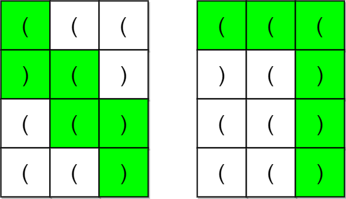

#### Round 1：将标题首字母大写

> 题目来源：LeetCode 5960

给你一个字符串 `title` ，它由单个空格连接一个或多个单词组成，每个单词都只包含英文字母。请你按以下规则将每个单词的首字母 **大写** ：

- 如果单词的长度为 `1` 或者 `2` ，所有字母变成小写。
- 否则，将单词首字母大写，剩余字母变成小写。

请你返回 **大写后** 的 `title` 。

题目解析：

比较简单..直接撸了

```java
class Solution {
    public String capitalizeTitle(String title) {
        String lowtitle = title.toLowerCase();
        String [] words = lowtitle.split(" ");
        StringBuilder ans = new StringBuilder(lowtitle.length());
        for (int i = 0;i < words.length;i++){
            if (words[i].length() < 3){
                ans.append(words[i]);
             if (i != words.length-1)
                    ans.append(" ");
                continue;
            }
            char head = words[i].charAt(0);
            if (head >= 'a' && head <= 'z'){
                head = (char)(head - 32);
            }
            ans.append(head);
            ans.append(words[i].substring(1));
            if (i != words.length-1){
                ans.append(" ");
            }
        }
        return ans.toString();
    }
}
```


#### Round 2：链表最大孪生和

> 题目来源：LeetCode 5961

在一个大小为 `n` 且 `n` 为 **偶数** 的链表中，对于 `0 <= i <= (n / 2) - 1` 的 `i` ，第 `i` 个节点（下标从 **0** 开始）的孪生节点为第 `(n-1-i)` 个节点 。

- 比方说，`n = 4` 那么节点 `0` 是节点 `3` 的孪生节点，节点 `1` 是节点 `2` 的孪生节点。这是长度为 `n = 4` 的链表中所有的孪生节点。

**孪生和** 定义为一个节点和它孪生节点两者值之和。

给你一个长度为偶数的链表的头节点 `head` ，请你返回链表的 **最大孪生和** 

题目解析：

比较简单,直接撸...

```java
/**
 * Definition for singly-linked list.
 * public class ListNode {
 *     int val;
 *     ListNode next;
 *     ListNode() {}
 *     ListNode(int val) { this.val = val; }
 *     ListNode(int val, ListNode next) { this.val = val; this.next = next; }
 * }
 */
class Solution {
    public int pairSum(ListNode head) {
        int[] arr = new int[100000];
        ListNode now = head;
        int idx = 0;
        while (now != null){
            arr[idx++] = now.val;
            now = now.next;
        }
        int len = idx;
        int maxval = Integer.MIN_VALUE;
        for (int i = 0;i <= len / 2 -1;i++){
            if (arr[i] + arr[len-1-i] > maxval){
                maxval = arr[i] + arr[len-1-i];
            }
        }
        return maxval;
    }
}
```

#### Round 3：连接两字母单词得到的最长回文串

> 题目来源：LeetCode 5962

给你一个字符串数组 `words` 。`words` 中每个元素都是一个包含 **两个** 小写英文字母的单词。

请你从 `words` 中选择一些元素并按 **任意顺序** 连接它们，并得到一个 **尽可能长的回文串** 。每个元素 **至多** 只能使用一次。

请你返回你能得到的最长回文串的 **长度** 。如果没办法得到任何一个回文串，请你返回 `0` 。

**回文串** 指的是从前往后和从后往前读一样的字符串。

题目解析：


```java
class Solution {
    public int longestPalindrome(String[] words) {
        Map<String,Integer> m = new HashMap<>();
        for (int i = 0;i < words.length;i++){
            if (m.get(words[i]) == null){
                m.put(words[i],1);
            }else{
                m.put(words[i],m.get(words[i]) + 1);
            }
        }
        int maxlen = Integer.MIN_VALUE;
        int nowlen = 0;
        boolean centerok = false;
        for (int i = 0;i < words.length;i++){
            //如果本身就是回文串
            if (words[i].charAt(0) == words[i].charAt(1)){
                int cnt = m.get(words[i]);
                if (cnt % 2 == 1){
                    if (centerok == false){
                        nowlen += cnt * 2;
                        centerok = true;
                    }else{
                        nowlen += (cnt-1) * 2;
                    }
                }else{
                    nowlen += cnt * 2;
                }
                m.put(words[i],0);
            }else{//本身不是回文串
                StringBuilder sb = new StringBuilder(2);
                sb.append(words[i].charAt(1));
                sb.append(words[i].charAt(0));
                if (m.get(sb.toString()) == null) continue;
                int precnt = m.get(words[i]);
                int anocnt = m.get(sb.toString());
                int mincnt = Math.min(precnt,anocnt);
                m.put(words[i],precnt-mincnt);
                m.put(sb.toString(),anocnt-mincnt);
                nowlen += mincnt * 4;
            }
        }
        return nowlen;
    }
}
```


#### Round 4：用邮票贴满网格

> 题目来源：LeetCode 5931

给你一个 `m x n` 的二进制矩阵 `grid` ，每个格子要么为 `0` （空）要么为 `1` （被占据）。

给你邮票的尺寸为 `stampHeight x stampWidth` 。我们想将邮票贴进二进制矩阵中，且满足以下 **限制** 和 **要求** ：

1. 覆盖所有 **空** 格子。
2. 不覆盖任何 **被占据** 的格子。
3. 我们可以放入任意数目的邮票。
4. 邮票可以相互有 **重叠** 部分。
5. 邮票不允许 **旋转** 。
6. 邮票必须完全在矩阵 **内** 。

如果在满足上述要求的前提下，可以放入邮票，请返回 `true` ，否则返回 `false` 。


```java
//此答案只通过了 65/66 最后一个死也不知道怎么回事
class Solution {
  public int getHcango(int[][] grid,int x,int y){
        //向上下拓展
        int lines = 0;
        for (int i = x;i < grid.length;i++){
            if (grid[i][y] == 0) lines += 1;
            else break;
        }
        for (int i = x-1;i >=0;i--){
            if (grid[i][y] == 0) lines += 1;
            else break;
        }
        return lines;
    }
    public int getWcango(int[][] grid,int x,int y){
        //向左右拓展
        int colums = 0;
        for (int j = y;j < grid[0].length;j++){
            if (grid[x][j] == 0) colums += 1;
            else break;
        }
        for (int j = y-1;j >= 0;j--){
            if (grid[x][j] == 0) colums += 1;
            else break;
        }
        return colums;
    }
    public boolean possibleToStamp(int[][] grid, int stampHeight, int stampWidth) {
        int minH = Integer.MAX_VALUE;
        int minW = Integer.MAX_VALUE;
        if (grid == null) return true;
        if (stampHeight == 1 && stampWidth == 1) return true;
        int[][][] dp = new int[grid.length][grid[0].length][2];
        for (int i = 0;i < grid.length;i++){
            for (int j = 0;j < grid[0].length;j++){
                //如果是1直接跳过
                if (grid[i][j] == 1) continue;
                //判断当前点的上一个点是否测试过
                if (i-1 >= 0 && grid[i-1][j] == 0){
                    dp[i][j][0] = dp[i-1][j][0];
                }else{
                    dp[i][j][0] = getHcango(grid,i,j);
                }
                minH = Math.min(minH,dp[i][j][0]);
                //如果能够放的高度小于邮票高度，则返回False
                if (minH < stampHeight) return false;
                if (j-1 >= 0 && grid[i][j-1] == 0){
                    dp[i][j][1] = dp[i][j-1][1];
                }else{
                    dp[i][j][1] = getWcango(grid,i,j);
                }
                minW = Math.min(minW,dp[i][j][1]);
                //如果能够放的宽度小于邮票宽度，则返回False
                if (minW < stampWidth) return false;
            }
        }
        return true;
    }
}
```


> 总结：此次排名800多...最后一题亏啊...就差一个例子了，然后前面第一道题傻逼了开始，然后耽误了时间....


#### Round 5：检查是否每一行每一列都包含全部整数

> 题目来源：LeetCode 5976

对一个大小为 `n x n` 的矩阵而言，如果其每一行和每一列都包含从 `1` 到 `n` 的 **全部** 整数（含 `1` 和 `n`），则认为该矩阵是一个 **有效** 矩阵。

给你一个大小为 `n x n` 的整数矩阵 `matrix` ，请你判断矩阵是否为一个有效矩阵：如果是，返回 `true` ；否则，返回 `false` 。



```
输入：matrix = [[1,2,3],[3,1,2],[2,3,1]]
输出：true
解释：在此例中，n = 3 ，每一行和每一列都包含数字 1、2、3 。
因此，返回 true 。
```

简单题目，直接撸

```java
class Solution {
   public boolean check(int[][] matrix,int x){
        boolean [] used = new boolean[matrix.length + 1];
        for (int i = 0; i < matrix.length;i++){
            if (used[matrix[x][i]]) return false;
            used[matrix[x][i]] = true;
        }
        used = new boolean[matrix.length + 1];
        for (int i = 0; i < matrix.length;i++){
            if (used[matrix[i][x]]) return false;
            used[matrix[i][x]] = true;
        }
        return true;
    }
    public boolean checkValid(int[][] matrix) {
        int n = matrix.length;
        for (int i =0;i < n;i++){
            if (check(matrix,i) == false) return false;
        }
        return true;
    }
}
```


#### Round 6：最少交换次数来组合所有的 1 II

> 题目来源：LeetCode 5977

**交换** 定义为选中一个数组中的两个 **互不相同** 的位置并交换二者的值。

**环形** 数组是一个数组，可以认为 **第一个** 元素和 **最后一个** 元素 **相邻** 。

给你一个 **二进制环形** 数组 `nums` ，返回在 **任意位置** 将数组中的所有 `1` 聚集在一起需要的最少交换次数。

```
输入：nums = [1,1,0,0,1]
输出：0
解释：得益于数组的环形特性，所有的 1 已经聚集在一起。
因此，需要的最少交换次数为 0 。
```

题目解析：

这道题浪费了点时间...有一说一这个中等题开始真不好想。

说说自己的想法吧，利用到了**滑动窗口**的思想。


```java
class Solution {
    public int getMinChange(int[] nums,int cnt){
        int minChange = Integer.MAX_VALUE;
        int left = 0;
        int nowWindow_1 = 0;
        for (int i = 0;i < cnt-1;i++){
            if (nums[i] == 1) nowWindow_1 += 1;
        }
        int right = cnt-2;
        while (right < nums.length-1){
            right += 1;
            if (nums[right] == 1) nowWindow_1 += 1;
            minChange = Math.min(minChange,cnt-nowWindow_1);
            if (nums[left] == 1) nowWindow_1 -= 1;
            left += 1;
        }
        return minChange;
    }
    public int minSwaps(int[] nums) {
        int n = nums.length;
        int cnt = 0;
        for (int num:nums){
            if (num == 1) cnt += 1;
        }
        if (cnt == 0) return 0;
        int[] arr = new int[n+cnt-1];
        for (int i = 0;i < n;i++){
            arr[i] = nums[i];
        }
        for (int i = 0;i < cnt-1;i++){
            arr[i+n] = nums[i];
        }
        return getMinChange(arr,cnt);
    }
}
```


#### Round 7：统计追加字母可以获得的单词数

> 题目来源：LeetCode 5978

给你两个下标从 **0** 开始的字符串数组 `startWords` 和 `targetWords` 。每个字符串都仅由 **小写英文字母** 组成。

对于 `targetWords` 中的每个字符串，检查是否能够从 `startWords` 中选出一个字符串，执行一次 **转换操作** ，得到的结果与当前 `targetWords` 字符串相等。

**转换操作** 如下面两步所述：

1. **追加** 任何**不存在**于当前字符串的任一小写字母到当前字符串的末尾。
   - 例如，如果字符串为 `"abc"` ，那么字母 `'d'`、`'e'` 或 `'y'` 都可以加到该字符串末尾，但 `'a'` 就不行。如果追加的是 `'d'` ，那么结果字符串为 `"abcd"` 。
2. **重排** 新字符串中的字母，可以按**任意**顺序重新排布字母。
   - 例如，`"abcd"` 可以重排为 `"acbd"`、`"bacd"`、`"cbda"`，以此类推。注意，它也可以重排为 `"abcd"` 自身。

找出 `targetWords` 中有多少字符串能够由 `startWords` 中的 **任一** 字符串执行上述转换操作获得。返回 `targetWords` 中这类 **字符串的数目** 。

**注意：**你仅能验证 `targetWords` 中的字符串是否可以由 `startWords` 中的某个字符串经执行操作获得。`startWords` 中的字符串在这一过程中 **不** 发生实际变更。

**题目解析**：


```java
class Solution {
    public int wordCount(String[] startWords, String[] targetWords) {

        Set<Integer> set_start = new HashSet<>();
        for (String startword : startWords){
            int val = 0;
            for (int i = 0;i < startword.length();i++){
                val |= (1 <<(startword.charAt(i) - 'a'));
            }
            set_start.add(val);
        }
        int ans = 0;
        Map<String,Integer> m_target = new HashMap<>();
        for (String targetword : targetWords){
            int val = 0;
            for (int i = 0;i < targetword.length();i++){
                val |= (1 <<(targetword.charAt(i) - 'a'));
            }
            for (int i = 0;i < 26;i++){
                if (((1 << (i)) & val) == 0) continue;
                int targetval = val^(1 << (i));
                if (set_start.contains(targetval)){
                    ans += 1;
                    break;
                }
            }
        }
        return ans;
    }
    
}
```

#### Round 8：全部开花的最早一天

> 题目来源：LeetCode 5979

你有 `n` 枚花的种子。每枚种子必须先种下，才能开始生长、开花。播种需要时间，种子的生长也是如此。给你两个下标从 **0** 开始的整数数组 `plantTime` 和 `growTime` ，每个数组的长度都是 `n` ：

- `plantTime[i]` 是 **播种** 第 `i` 枚种子所需的 **完整天数** 。每天，你只能为播种某一枚种子而劳作。**无须** 连续几天都在种同一枚种子，但是种子播种必须在你工作的天数达到 `plantTime[i]` 之后才算完成。
- `growTime[i]` 是第 `i` 枚种子完全种下后生长所需的 **完整天数** 。在它生长的最后一天 **之后** ，将会开花并且永远 **绽放** 。

从第 `0` 开始，你可以按 **任意** 顺序播种种子。

返回所有种子都开花的 **最早** 一天是第几天。


```
输入：plantTime = [1,4,3], growTime = [2,3,1]
输出：9
解释：灰色的花盆表示播种的日子，彩色的花盆表示生长的日子，花朵表示开花的日子。
一种最优方案是：
第 0 天，播种第 0 枚种子，种子生长 2 整天。并在第 3 天开花。
第 1、2、3、4 天，播种第 1 枚种子。种子生长 3 整天，并在第 8 天开花。
第 5、6、7 天，播种第 2 枚种子。种子生长 1 整天，并在第 9 天开花。
因此，在第 9 天，所有种子都开花。 
```

题目解析：

做到这道题就剩20分钟了...感觉哪些大佬是怎么在30分钟就做完所有题目的？

其实解这道题目就是**贪心**！

对于两枚种子，设其播种所需天数为$p_1$和 $p_2$，生长所需天数为 $g_1$ 和 $g_2$。

不妨设 $g_1\ge g_2$我们来比较哪种播种顺序更优：

- 先 1 后 2 时的最晚开花时间：$\max(p_1+g_1,p_1+p_2+g_2)$

- 先 2 后 1 时的最晚开花时间：$\max(p_1+p_2+g_1,p_2+g_2)$

  > 由于 $g_1\ge g_2$ 且 $p_1>0$ 所以 $p_1+p_2+g_1>p_2+g_2$ ，因此上式即为 $p_1+p_2+g_1$

由于 $p_1+g_1 < p_1+p_2+g_1$ 且 $p_1+p_2+g_2 \le p_1+p_2+g_1$，因此我们有$max(p_1+g_1,p_1+p_2+g_2) \le p_1+p_2+g_1=max(p_1+p_2+g_1,p_2+g_2)$

上式表明，按照先 11 后 22 的顺序播种，最晚开花时间不会晚于按照先 22 后 11 播种时的最晚开花时间。

这意味着按照生长天数从大到小排序后，交换任意两枚种子的播种顺序，不会让最晚开花时间提前。

因此，我们可以按照生长天数从大到小的顺序播种。对于两枚生长天数相同的种子，由于无论按照何种顺序播种，这两枚种子的最晚开花时间都是相同的，因此无需考虑生长天数相同的种子的播种顺序，所以在排序时，仅需对生长天数从大到小排序。

```java
class node{
    int plantval;
    int growval;

    public node(int plantval, int growval) {
        this.plantval = plantval;
        this.growval = growval;
    }
}
class Solution {
    public int earliestFullBloom(int[] plantTime, int[] growTime) {
        List<node> arr = new ArrayList<>();
        for (int i = 0;i < plantTime.length;i++){
            arr.add(new node(plantTime[i],growTime[i]));
        }
        arr.sort(new Comparator<node>() {
            @Override
            public int compare(node o1, node o2) {
                return o2.growval - o1.growval;
            }
        });
        int ans = 0,day = 0;
        for (int i = 0;i < arr.size();i++){
            day += arr.get(i).plantval;  //先加上要种植的天数
            ans = Math.max(ans,day + arr.get(i).growval);  //开花天数 + 当前天数 > 最长天数 ==> 更新
        }
        return ans;
    }
}
```


