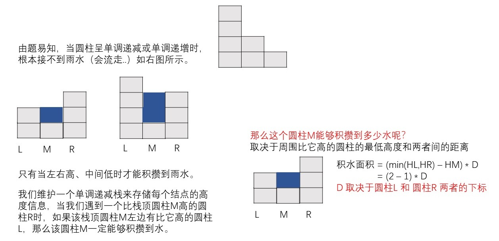
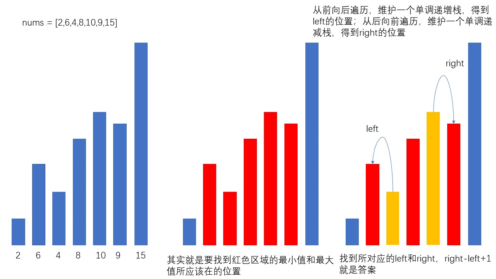
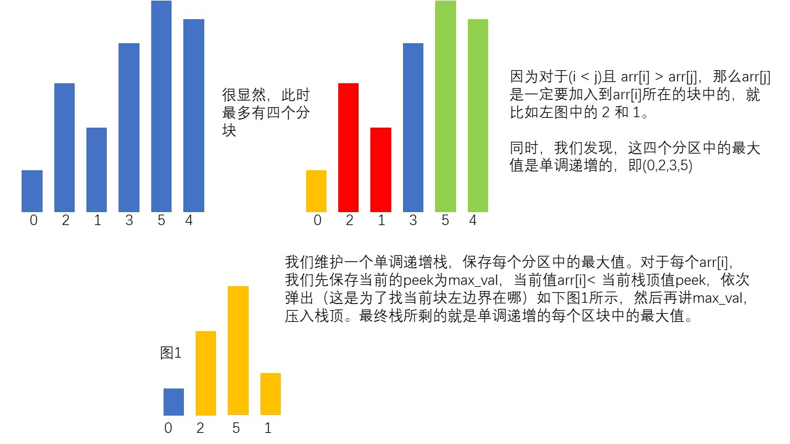

# 栈

栈的简单了解：栈是一种线性结构，服从`先进后出`的原则。可以由数组、链表来进行设计。

## 单调栈

> 单调栈分为 单调递减栈 和 单调递增栈。单调栈这种数据结构，通常应用在一维数组上。
>
> 通过单调栈可以访问到==下一个==比它==大/小==的元素，当==需要通过比较前后元素的大小关系==来解决问题时我们通常使用单调栈

常见模型：给定一个序列，找到某个数左边/右边距离他最近的且比它小/大的数

单调栈常见解题思路：原问题是否能用队列暴力模拟，将队列中没有用的元素删除，看剩下的元素是否有单调性。

#### 例：接雨水

```
给定 n 个非负整数表示每个宽度为 1 的柱子的高度图，计算按此排列的柱子，下雨之后能接多少雨水。
```


```
输入：height = [0,1,0,2,1,0,1,3,2,1,2,1]
输出：6
```

为什么会想到单调栈呢？因为如果能接到水，一定是两边高，中间低。



```cpp
class Solution {
public:
    int trap(vector<int>& height) {
        int sum = 0;
        stack<int> st;//定义单调递减栈
        int i = 0,len = height.size();
        while (i < len)
        {
            /*当栈不空 并且 当前元素大于栈顶元素时[如果加入该元素会打破单调递减栈的结构]
            开始依次弹出栈中元素来维护栈结构，并进行相应操作*/
            while (!st.empty() && height[st.top()] < height[i])//i:遇到的哪个比前面高的
            {
                /*获取待处理元素*/
                int top = st.top();
                st.pop();
                /*如果栈空了，左边没有圆柱，积攒不了水，直接退出*/
                if(st.empty())
                {
                    break;
                }
                /*积攒到了雨水*/
                sum += ((height[i] > height[st.top()] ? height[st.top()] : height[i]) - height[top]) * (i-st.top()-1) ;
            }
            /*当栈空或者当前元素小于栈顶元素[即：不打破单调递减栈的结构时，直接入栈]*/
            st.push(i++);
        }
        return sum;
    }
};
```

#### 例：下一个更大元素

```
给你两个 没有重复元素 的数组 nums1 和 nums2 ，其中nums1 是 nums2 的子集。

请你找出 nums1 中每个元素在 nums2 中的下一个比其大的值。
nums1 中数字 x 的下一个更大元素是指 x 在 nums2 中对应位置的右边的第一个比 x 大的元素。如果不存在，对应位置输出 -1 。
```

```
输入: nums1 = [4,1,2], nums2 = [1,3,4,2].
输出: [-1,3,-1]
```

> 由题目，要求`nums1`中每个元素在`nums2`中的==下一个比其大的值==。因为单调栈维护的就是单调递增或单调递减的栈，因此可以知道第一个大于或小于其值的元素。

```cpp
class Solution {
public:
    vector<int> nextGreaterElement(vector<int>& nums1, vector<int>& nums2) {
        //哈希表m，用来存储num1中每个元素的下标，方便获得答案后直接存储
        map<int,int> m;
        int n1 = nums1.size(),n2 = nums2.size();
        //结果数组
        vector<int> ans(n1,-1);
        //更新哈希表
        for(int i = 0;i < n1;i++){
            m.insert(make_pair(nums1[i],i));
        }
        //单调递减栈
        stack<int> less_st;
        for(int i = 0;i < n2;i++){
            //如果栈空或者当前元素符合单调递减栈的结构，则压入；否则弹出栈顶元素，并对其处理
            while(!less_st.empty() && nums2[i] > less_st.top()){
                int tmp = less_st.top();
                less_st.pop();
                //如果栈顶元素在哈希表中，则说明其是nums1和nums2中共有的元素。
                if(m.find(tmp) !=  m.end()){
                    //当前元素就是栈顶元素遇到的第一个大于其的值
                    ans[m[tmp]] = nums2[i];
                }
            }
            less_st.push(nums2[i]);
        }
        return ans;
    }
};
```


### 例：商品折扣后的最终价格

> 题目来源：Leetcode：1475

给你一个数组 prices ，其中 prices[i] 是商店里第 i 件商品的价格。

商店里正在进行促销活动，如果你要买第 i 件商品，那么你可以得到与 prices[j] 相等的折扣，其中 j 是满足 j > i 且 prices[j] <= prices[i] 的 最小下标 ，如果没有满足条件的 j ，你将没有任何折扣。

请你返回一个数组，数组中第 i 个元素是折扣后你购买商品 i 最终需要支付的价格。

```
输入：prices = [8,4,6,2,3]
输出：[4,2,4,2,3]
解释：
商品 0 的价格为 price[0]=8 ，你将得到 prices[1]=4 的折扣，所以最终价格为 8 - 4 = 4 。
商品 1 的价格为 price[1]=4 ，你将得到 prices[3]=2 的折扣，所以最终价格为 4 - 2 = 2 。
商品 2 的价格为 price[2]=6 ，你将得到 prices[3]=2 的折扣，所以最终价格为 6 - 2 = 4 。
商品 3 和 4 都没有折扣。
```

**题目意思**就是对于数组中的每一个元素，找出它**之后**第一个**小于等于**它的元素，并求出它俩**之差**。

很明显可以使用**单调栈**

```java
class Solution {
    public int[] finalPrices(int[] prices) {
        int n = prices.length;
        int [] ans = new int[n];
        //初始化
        for(int i = 0; i < n;i++){
            ans[i] = prices[i];
        }
        //从头开始遍历
        for(int i = 0;i < n;i++){
            //记录当前元素
            int tmp = prices[i];
            //初始化上一个元素索引下标
            int idx = i - 1;
            //索引没有越界且 当前元素 <= 前面的元素
            while(idx >= 0 && prices[idx] >= tmp){
                ans[idx] = Math.min(prices[idx]-tmp,ans[idx]); //更新前面元素所能得到的最低折扣
                idx -= 1;
            }
        }
        return ans;
    }
}
```


### 例：最短无序连续子数组

> 题目来源：Leetcode：581

给你一个整数数组 nums ，你需要找出一个 连续子数组 ，如果对这个子数组进行升序排序，那么整个数组都会变为升序排序。

请你找出符合题意的 最短 子数组，并输出它的长度。

```
输入：nums = [2,6,4,8,10,9,15]
输出：5
解释：你只需要对 [6, 4, 8, 10, 9] 进行升序排序，那么整个表都会变为升序排序。
```



```java
class Solution {
    public int findUnsortedSubarray(int[] nums) {
        Deque<Integer> dq = new ArrayDeque<>();
        int left = Integer.MAX_VALUE;
        int right = Integer.MIN_VALUE;
        for (int i = 0;i < nums.length;i++){
            while (!dq.isEmpty() && nums[i] < nums[dq.peekLast()]){
                left = Math.min(dq.pollLast(),left);
            }
            dq.offerLast(i);
        }
        dq = new ArrayDeque<>();
        for(int i = nums.length - 1;i >= 0 ;i--){
            while (!dq.isEmpty() && nums[i] > nums[dq.peekLast()]){
                right = Math.max(right,dq.pollLast());
            }
            dq.offerLast(i);
        }
        if(left == Integer.MAX_VALUE && right == Integer.MIN_VALUE) return 0;
        return right - left + 1;
    }
}
```

### 例：最多能完成排序的块

> 题目来源：Leetcode：769

数组arr是[0, 1, ..., arr.length - 1]的一种排列，我们将这个数组分割成几个“块”，并将这些块分别进行排序。之后再连接起来，使得连接的结果和按升序排序后的原数组相同。

我们**最多**能将数组分成多少块？

```
输入: arr = [1,0,2,3,4]
输出: 4
解释:
我们可以把它分成两块，例如 [1, 0], [2, 3, 4]。
然而，分成 [1, 0], [2], [3], [4] 可以得到最多的块数。
```



```JAVA
class Solution {
    public int maxChunksToSorted(int[] arr) {
        ArrayList<Integer> st = new ArrayList<>();
        for(int i = 0;i < arr.length;i++){
            int peek = st.size() > 0 ? st.get(st.size() - 1) : Integer.MIN_VALUE;
            while(st.size() > 0 && st.get(st.size() - 1) > arr[i]){
                st.remove(st.size() - 1);
            }
            st.add(Math.max(peek,arr[i]));
        }
        return st.size();
    }
}
```

