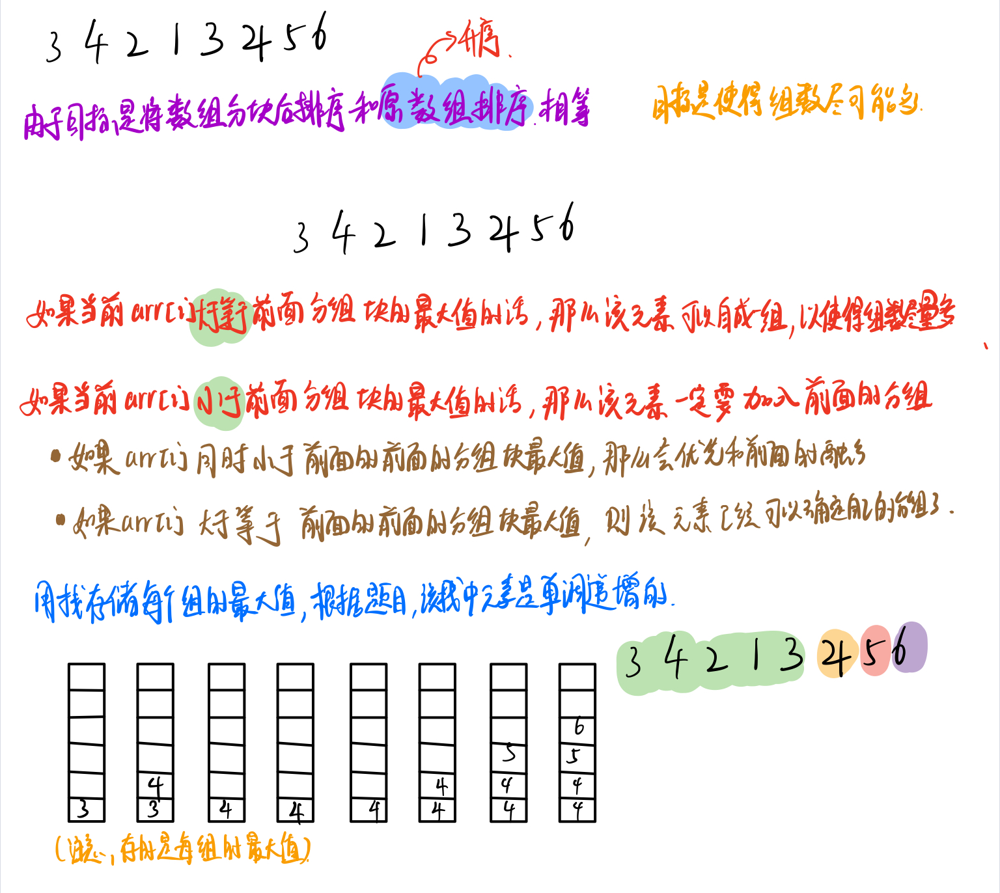

## 栈

栈的简单了解：栈是一种线性结构，服从`先进后出`的原则。可以由数组、链表来进行设计。


#### 最长有效括号

> 题目来源：Leetcode

给你一个只包含 `'('` 和 `')'` 的字符串，找出最长有效（格式正确且连续）括号子串的长度。

```
示例 1：
输入：s = "(()"
输出：2
解释：最长有效括号子串是 "()"

示例 2：
输入：s = ")()())"
输出：4
解释：最长有效括号子串是 "()()"

示例 3
输入：s = ""
输出：0
```

具体做法是我们始终保持栈底元素为当前已经遍历过的元素中「最后一个没有被匹配的右括号的下标」，这样的做法主要是考虑了边界条件的处理，栈里其他元素维护左括号的下标：

- 对于遇到的每个 $\text{‘(’}$ ，我们将它的下标放入栈中

- 对于遇到的每个 $\text{‘)’}$ ，我们先弹出栈顶元素表示匹配了当前右括号：
  - 如果栈为空，说明当前的右括号为没有被匹配的右括号，我们将其下标放入栈中来更新我们之前提到的「最后一个没有被匹配的右括号的下标」
  - 如果栈不为空，当前右括号的下标减去栈顶元素即为「以该右括号为结尾的最长有效括号的长度」

```java
class Solution {
    public int longestValidParentheses(String s) {
        char[] chs = s.toCharArray();
        int n = chs.length;
        int ans = 0;
        Deque<Integer> st = new ArrayDeque<>();
        for (int i = 0; i < n; i++) {
            char ch = chs[i];
            if (ch == ')') {
                if (st.isEmpty()){
                    st.offerLast(i);
                }else if (chs[st.peekLast()] == '(') {
                    st.pollLast();
                    int top_idx = st.isEmpty() ? -1 : st.peekLast();
                    ans = Math.max(ans, i - top_idx);
                }else {
                    st.offerLast(i);
                }
            }else{
                st.offerLast(i);
            }
        }
        return ans;
    }
    
}
```


#### 行星碰撞

> 题目来源：Leetcode 735

给定一个整数数组 `asteroids`，表示在同一行的行星。

对于数组中的每一个元素，其绝对值表示行星的大小，正负表示行星的移动方向（正表示向右移动，负表示向左移动）。每一颗行星以相同的速度移动。

找出碰撞后剩下的所有行星。碰撞规则：两个行星相互碰撞，较小的行星会爆炸。如果两颗行星大小相同，则两颗行星都会爆炸。两颗移动方向相同的行星，永远不会发生碰撞。

```
输入：asteroids = [5,10,-5]
输出：[5,10]
解释：10 和 -5 碰撞后只剩下 10 。 5 和 10 永远不会发生碰撞。
```

```java
class Solution {
    public int[] asteroidCollision(int[] asteroids) {
        int n = asteroids.length;
        Deque<Integer> st = new ArrayDeque<>();
        for (int i = 0;i < n;i++){
            if (asteroids[i] > 0) { // 向右飞的陨石
                //直接入栈
                st.offerLast(asteroids[i]);
            }else{ // 向左飞的陨石
                // 如果栈不空，并且上一个是向右飞的并且当前陨石大于其大下
                while (!st.isEmpty() && st.peekLast() > 0 && Math.abs(asteroids[i]) > st.peekLast()){
                    st.pollLast();
                }
                // 栈顶陨石向右飞，且当前向左飞的质量和其相等
                if (!st.isEmpty() && st.peekLast() > 0 && (int)Math.abs(asteroids[i]) == st.peekLast()){
                    st.pollLast();
                }else if (st.isEmpty() || st.peekLast() < 0){//如果栈顶空了 或者 栈顶陨石向左飞 则不会碰撞，当前入栈
                    st.offerLast(asteroids[i]);
                }
            }
        }
        int [] ans = new int[st.size()];
        int idx = 0;
        while (!st.isEmpty()){
            ans[idx++] = st.pollFirst();
        }
        return ans;
    }
}
```

#### 验证栈序列

给定 pushed 和 popped 两个序列，每个序列中的 值都不重复，只有当它们可能是在最初空栈上进行的推入 push 和弹出 pop 操作序列的结果时，返回 true；否则，返回 false 。

```
输入：pushed = [1,2,3,4,5], popped = [4,5,3,2,1]
输出：true
解释：我们可以按以下顺序执行：
push(1), push(2), push(3), push(4), pop() -> 4,
push(5), pop() -> 5, pop() -> 3, pop() -> 2, pop() -> 1
```

栈模拟：

```java
class Solution {
    public boolean validateStackSequences(int[] pushed, int[] popped) {
        int n = pushed.length;
        int idx = 0;
        Stack<Integer> stack = new Stack<>();
        for (int i = 0;i < n;i++){
            stack.push(pushed[i]);
            while (!stack.isEmpty() && popped[idx] == stack.peek()){
                stack.pop();
                idx += 1;
            }
        }
        while (!stack.isEmpty() && popped[idx] == stack.peek()){
            idx += 1;
            stack.pop();
        }
        return stack.isEmpty();
    }
}
```

O(1) 空间优化：

```java
class Solution {
    private void swap(int []nums,int i,int j){
        int t = nums[i];
        nums[i] = nums[j];
        nums[j] = t;
    }
    public boolean validateStackSequences(int[] pushed, int[] popped) {
        int n = pushed.length;
        int k = n;
        for (int top = 0,i = 0,j = 0;k > 0 && i < n;i++){
            swap(pushed,top,i);
            top ++;
            while (top > 0 && pushed[top-1] == popped[j]){
                top --;
                j ++;
                k --;
            }
        }
        return k == 0;
    }
}
```

#### 括号的分数

给定一个平衡括号字符串 S，按下述规则计算该字符串的分数：

- () 得 1 分。
- AB 得 A + B 分，其中 A 和 B 是平衡括号字符串。
- (A) 得 2 * A 分，其中 A 是平衡括号字符串。

```
输入： "(()())"
输出： 4
```

方法：栈

把平衡字符串 s 看作是一个空字符串加上 s 本身，并且定义空字符串的分数为 0。使用栈 $\textit{st}$ 记录平衡字符串的分数，在开始之前要压入分数 0，表示空字符串的分数。

在遍历字符串 s 的过程中：

- 遇到左括号，那么我们需要计算该左括号内部的子平衡括号字符串 A 的分数，我们也要先压入分数 0，表示 AA 前面的空字符串的分数。
- 遇到右括号，说明该右括号内部的子平衡括号字符串 A 的分数已经计算出来了，我们将它弹出栈，并保存到变量 v 中。如果 v = 0，那么说明子平衡括号字符串 A 是空串，(A) 的分数为 1，否则 (A) 的分数为 2v，然后将 (A) 的分数加到栈顶元素上。

遍历结束后，栈顶元素保存的就是 s 的分数。

> 栈顶存的是当前计算的平衡括号字符串的分数

```java
class Solution {
    public int scoreOfParentheses(String s) {
        char [] cs = s.toCharArray();
        int n = cs.length;
        Deque<Integer> st = new ArrayDeque<>();
        st.offerLast(0);
        for(int i = 0;i < n;i++){
            if(cs[i] == '('){ // 遇到左括号
                st.push(0);
            }else{
                int v = st.pop();
                int top = st.pop() + Math.max(2 * v, 1);
                st.push(top);
            }
        }
        return  st.pop();
    }
}
```

#### 使用机器人打印字典序最小的字符串

给你一个字符串 s 和一个机器人，机器人当前有一个空字符串 t 。执行以下操作之一，直到 s 和 t 都变成空字符串：

- 删除字符串 s 的 第一个 字符，并将该字符给机器人。机器人把这个字符添加到 t 的尾部。
- 删除字符串 t 的 最后一个 字符，并将该字符给机器人。机器人将该字符写到纸上。

请你返回纸上能写出的字典序最小的字符串。

 ```
输入：s = "bac"
输出："abc"
解释：用 p 表示写出来的字符串。
执行第一个操作两次，得到 p="" ，s="c" ，t="ba" 。
执行第二个操作两次，得到 p="ab" ，s="c" ，t="" 。
执行第一个操作，得到 p="ab" ，s="" ，t="c" 。
执行第二个操作，得到 p="abc" ，s="" ，t="" 。
 ```

题目等价于：有一个初始为空的栈，给定字符的入栈顺序，求字典序最小的出栈序列。

当一个字符入栈后，我们持续检查栈顶元素 c。设还未入栈的字符中，字典序最小的字符是 m，有以下两种情况。

- $c \le m$：此时弹出 c 最优。如果此时按兵不动，下一个出栈的将会是大等于 c 的字符，答案不会变优。
- $c > m$：此时不弹出 c，等待后续更小的字符入栈。

所有字符都入栈后，栈内的剩余字符按顺序弹出即可。复杂度 $\mathcal{O}(n)$。

> 为了快速判断剩余字符的最小值，我们可以先统计 s 每个字符的出现次数 $\textit{cnt}$，然后在遍历 s 的过程中更新 $\textit{cnt}$，这样 $\textit{cnt}$ 中第一个正数对应的字符就是剩余字符中最小的。
>

```java
class Solution {
    public String robotWithString(String s) {
        char [] cs = s.toCharArray();
        int n = cs.length;
        Deque<Integer> st = new ArrayDeque<>();
        int [] cnt = new int[26]; // 记录每个字符剩余元素数量
        for(char c : cs) cnt[c - 'a'] ++;
        int min = 0;
        StringBuilder sb = new StringBuilder();
        for(char c : cs){
            cnt[c - 'a']--; 
            while(min < 25 && cnt[min] == 0) min++; // 找到当前最小字符 因为最大是 26，到最大已经没必要往后了
            st.push(c - 'a');
            while(!st.isEmpty() && st.peek() <= min){
                sb.append((char)(st.pop() + 'a'));
            }
        }
        return sb.toString();
    }
}
```


## 单调栈

> 单调栈分为 单调递减栈 和 单调递增栈。单调栈这种数据结构，通常应用在一维数组上。
>
> 通过单调栈可以访问到==下一个==比它==大/小==的元素，当==需要通过比较前后元素的大小关系==来解决问题时我们通常使用单调栈

常见模型：给定一个序列，找到某个数左边/右边距离他最近的且比它小/大的数

单调栈常见解题思路：原问题是否能用队列暴力模拟，将队列中没有用的元素删除，看剩下的元素是否有单调性。

#### 接雨水

```
给定 n 个非负整数表示每个宽度为 1 的柱子的高度图，计算按此排列的柱子，下雨之后能接多少雨水。
```


```
输入：height = [0,1,0,2,1,0,1,3,2,1,2,1]
输出：6
```

为什么会想到单调栈呢？因为如果能接到水，一定是两边高，中间低。


```cpp
class Solution {
public:
    int trap(vector<int>& height) {
        int sum = 0;
        stack<int> st;//定义单调递减栈
        int i = 0,len = height.size();
        while (i < len)
        {
            /*当栈不空 并且 当前元素大于栈顶元素时[如果加入该元素会打破单调递减栈的结构]
            开始依次弹出栈中元素来维护栈结构，并进行相应操作*/
            while (!st.empty() && height[st.top()] < height[i])//i:遇到的哪个比前面高的
            {
                /*获取待处理元素*/
                int top = st.top();
                st.pop();
                /*如果栈空了，左边没有圆柱，积攒不了水，直接退出*/
                if(st.empty())
                {
                    break;
                }
                /*积攒到了雨水*/
                sum += ((height[i] > height[st.top()] ? height[st.top()] : height[i]) - height[top]) * (i-st.top()-1) ;
            }
            /*当栈空或者当前元素小于栈顶元素[即：不打破单调递减栈的结构时，直接入栈]*/
            st.push(i++);
        }
        return sum;
    }
};
```

#### 下一个更大元素

```
给你两个 没有重复元素 的数组 nums1 和 nums2 ，其中nums1 是 nums2 的子集。

请你找出 nums1 中每个元素在 nums2 中的下一个比其大的值。
nums1 中数字 x 的下一个更大元素是指 x 在 nums2 中对应位置的右边的第一个比 x 大的元素。如果不存在，对应位置输出 -1 。
```

```
输入: nums1 = [4,1,2], nums2 = [1,3,4,2].
输出: [-1,3,-1]
```

> 由题目，要求`nums1`中每个元素在`nums2`中的==下一个比其大的值==。因为单调栈维护的就是单调递增或单调递减的栈，因此可以知道第一个大于或小于其值的元素。

```cpp
class Solution {
public:
    vector<int> nextGreaterElement(vector<int>& nums1, vector<int>& nums2) {
        //哈希表m，用来存储num1中每个元素的下标，方便获得答案后直接存储
        map<int,int> m;
        int n1 = nums1.size(),n2 = nums2.size();
        //结果数组
        vector<int> ans(n1,-1);
        //更新哈希表
        for(int i = 0;i < n1;i++){
            m.insert(make_pair(nums1[i],i));
        }
        //单调递减栈
        stack<int> less_st;
        for(int i = 0;i < n2;i++){
            //如果栈空或者当前元素符合单调递减栈的结构，则压入；否则弹出栈顶元素，并对其处理
            while(!less_st.empty() && nums2[i] > less_st.top()){
                int tmp = less_st.top();
                less_st.pop();
                //如果栈顶元素在哈希表中，则说明其是nums1和nums2中共有的元素。
                if(m.find(tmp) !=  m.end()){
                    //当前元素就是栈顶元素遇到的第一个大于其的值
                    ans[m[tmp]] = nums2[i];
                }
            }
            less_st.push(nums2[i]);
        }
        return ans;
    }
};
```


#### 商品折扣后的最终价格

> 题目来源：Leetcode：1475

给你一个数组 prices ，其中 prices[i] 是商店里第 i 件商品的价格。

商店里正在进行促销活动，如果你要买第 i 件商品，那么你可以得到与 prices[j] 相等的折扣，其中 j 是满足 j > i 且 prices[j] <= prices[i] 的 最小下标 ，如果没有满足条件的 j ，你将没有任何折扣。

请你返回一个数组，数组中第 i 个元素是折扣后你购买商品 i 最终需要支付的价格。

```
输入：prices = [8,4,6,2,3]
输出：[4,2,4,2,3]
解释：
商品 0 的价格为 price[0]=8 ，你将得到 prices[1]=4 的折扣，所以最终价格为 8 - 4 = 4 。
商品 1 的价格为 price[1]=4 ，你将得到 prices[3]=2 的折扣，所以最终价格为 4 - 2 = 2 。
商品 2 的价格为 price[2]=6 ，你将得到 prices[3]=2 的折扣，所以最终价格为 6 - 2 = 4 。
商品 3 和 4 都没有折扣。
```

**题目意思**就是对于数组中的每一个元素，找出它**之后**第一个**小于等于**它的元素，并求出它俩**之差**。

很明显可以使用**单调栈**

```java
class Solution {
    public int[] finalPrices(int[] prices) {
        int n = prices.length;
        int [] ans = new int[n];
        //初始化
        for(int i = 0; i < n;i++){
            ans[i] = prices[i];
        }
        //从头开始遍历
        for(int i = 0;i < n;i++){
            //记录当前元素
            int tmp = prices[i];
            //初始化上一个元素索引下标
            int idx = i - 1;
            //索引没有越界且 当前元素 <= 前面的元素
            while(idx >= 0 && prices[idx] >= tmp){
                ans[idx] = Math.min(prices[idx]-tmp,ans[idx]); //更新前面元素所能得到的最低折扣
                idx -= 1;
            }
        }
        return ans;
    }
}
```


#### 最短无序连续子数组

> 题目来源：Leetcode：581

给你一个整数数组 nums ，你需要找出一个 连续子数组 ，如果对这个子数组进行升序排序，那么整个数组都会变为升序排序。

请你找出符合题意的 最短 子数组，并输出它的长度。

```
输入：nums = [2,6,4,8,10,9,15]
输出：5
解释：你只需要对 [6, 4, 8, 10, 9] 进行升序排序，那么整个表都会变为升序排序。
```


```java
class Solution {
    public int findUnsortedSubarray(int[] nums) {
        Deque<Integer> dq = new ArrayDeque<>();
        int left = Integer.MAX_VALUE;
        int right = Integer.MIN_VALUE;
        for (int i = 0;i < nums.length;i++){
            while (!dq.isEmpty() && nums[i] < nums[dq.peekLast()]){
                left = Math.min(dq.pollLast(),left);
            }
            dq.offerLast(i);
        }
        dq = new ArrayDeque<>();
        for(int i = nums.length - 1;i >= 0 ;i--){
            while (!dq.isEmpty() && nums[i] > nums[dq.peekLast()]){
                right = Math.max(right,dq.pollLast());
            }
            dq.offerLast(i);
        }
        if(left == Integer.MAX_VALUE && right == Integer.MIN_VALUE) return 0;
        return right - left + 1;
    }
}
```

#### 最多能完成排序的块

> 题目来源：Leetcode：769

数组arr是[0, 1, ..., arr.length - 1]的一种排列，我们将这个数组分割成几个“块”，并将这些块分别进行排序。之后再连接起来，使得连接的结果和按升序排序后的原数组相同。

我们**最多**能将数组分成多少块？

```
输入: arr = [1,0,2,3,4]
输出: 4
解释:
我们可以把它分成两块，例如 [1, 0], [2, 3, 4]。
然而，分成 [1, 0], [2], [3], [4] 可以得到最多的块数。
```


```JAVA
class Solution {
    public int maxChunksToSorted(int[] arr) {
        ArrayList<Integer> st = new ArrayList<>();
        for(int i = 0;i < arr.length;i++){
            int peek = st.size() > 0 ? st.get(st.size() - 1) : Integer.MIN_VALUE;
            while(st.size() > 0 && st.get(st.size() - 1) > arr[i]){
                st.remove(st.size() - 1);
            }
            st.add(Math.max(peek,arr[i]));
        }
        return st.size();
    }
}
```


#### 递增的三元子序列

> 目来源：Leetcode：334

给你一个整数数组 nums ，判断这个数组中是否存在长度为 3 的递增子序列。

如果存在这样的三元组下标 $(i, j, k) $且满足$ i < j < k$ ，使得 $nums[i] < nums[j] < nums[k]$ ，返回 true ；否则，返回 false 。

```
输入：nums = [2,1,5,0,4,6]
输出：true
解释：三元组 (3, 4, 5) 满足题意，因为 nums[3] == 0 < nums[4] == 4 < nums[5] == 6
```

题目解析：

我们维护一个单调递增的栈，当栈中的大小为3时，直接返回True，同时我们还有维护第二小的数pre，比如2,3,1,4。当遇到1时（栈的size为2）会将3,2依次弹出栈，我们需要记录第一个被弹出的3，当后面遇到4时候，4 > pre，构成三元子序列，直接返回True。

```java
class Solution {
    public boolean increasingTriplet(int[] nums) {
        int n = nums.length;
        int pre = Integer.MAX_VALUE;
        Stack<Integer> st = new Stack<>();
        for (int i = 0;i < n;i++){
            if (nums[i] > pre){
                return true;
            }
            while (!st.isEmpty() && nums[i] <= st.peek()){
                if (st.size() == 2){
                    pre = st.peek();
                }
                st.pop();
            }
            st.push(nums[i]);
            if (st.size() == 3){
                return true;
            }
        }
        return false;
    }
}
```


#### 最多能完成排序的块II

这个问题和“最多能完成排序的块”相似，但给定数组中的元素可以重复，输入数组最大长度为2000，其中的元素最大为$10^8$。

arr是一个可能包含重复元素的整数数组，我们将这个数组分割成几个“块”，并将这些块分别进行排序。之后再连接起来，使得连接的结果和按升序排序后的原数组相同。

我们最多能将数组分成多少块？

```
输入: arr = [2,1,3,4,4]
输出: 4
解释:
我们可以把它分成两块，例如 [2, 1], [3, 4, 4]。
然而，分成 [2, 1], [3], [4], [4] 可以得到最多的块数。 
```



```java
// java 栈存值
class Solution {
    public int maxChunksToSorted(int[] arr) {
        int n = arr.length;
        Deque<Integer> st = new ArrayDeque<>();
        for(int v : arr){
            if(st.isEmpty() || v >= st.peekLast()){
                st.offerLast(v);
            }else{
                int groupMax = st.peekLast();
                while(!st.isEmpty() && v < st.peekLast()){
                    st.pollLast();
                }
                st.offerLast(groupMax);
            }
        }
        return st.size();
    }
}
```

```cpp
// cpp 栈存索引 方法
class Solution {
public:
    int maxChunksToSorted(vector<int>& arr) {
        int n = arr.size();
        stack<int> st;
        int ans = 0;
        for(int i = 0;i < n;i++){
            if(st.empty() || arr[i] >= arr[st.top()]){
                st.push(i);
            }else{
                int groupMaxIdx = st.top();
                while(!st.empty() && arr[i] < arr[st.top()]){
                    st.pop();
                }
                st.push(groupMaxIdx);
            }
        }
        return st.size();
    }
};
```


#### 商品折扣后的最终价格

给你一个数组 prices ，其中 prices[i] 是商店里第 i 件商品的价格。

商店里正在进行促销活动，如果你要买第 i 件商品，那么你可以得到与 prices[j] 相等的折扣，其中 j 是满足 j > i 且 prices[j] <= prices[i] 的 最小下标 ，如果没有满足条件的 j ，你将没有任何折扣。

请你返回一个数组，数组中第 i 个元素是折扣后你购买商品 i 最终需要支付的价格。

```
输入：prices = [8,4,6,2,3]
输出：[4,2,4,2,3]
解释：
商品 0 的价格为 price[0]=8 ，你将得到 prices[1]=4 的折扣，所以最终价格为 8 - 4 = 4 。
商品 1 的价格为 price[1]=4 ，你将得到 prices[3]=2 的折扣，所以最终价格为 4 - 2 = 2 。
商品 2 的价格为 price[2]=6 ，你将得到 prices[3]=2 的折扣，所以最终价格为 6 - 2 = 4 。
商品 3 和 4 都没有折扣。
```

题目解析：

回家等通知做法：两层循环，时间复杂度 $O(n^2)$

时间复杂度 $O(n)$：单调栈

为什么能想到单调栈呢？因为题意就是**找 prices[i] 右边小于等于其最近的元素**，因此联想到采用单调栈

```java
// java
class Solution {
    public int[] finalPrices(int[] prices) {
        int n = prices.length;
        int [] ans = new int[n];
        Deque<Integer> st = new ArrayDeque<>();
        for(int i = 0;i < n;i++){
            while(!st.isEmpty() && prices[i] <= prices[st.peekLast()]){
                int idx = st.pollLast();
                ans[idx] = prices[idx] - prices[i];
            }
            st.offerLast(i);
        }
        while(!st.isEmpty()){
            int idx = st.pollLast();
            ans[idx] = prices[idx];
        }
        return ans;
    }
}
```

```cpp
// cpp
class Solution {
public:
    vector<int> finalPrices(vector<int>& prices) {
        deque<int> st;
        int n = prices.size();
        vector<int> ans(n);
        for(int i = 0;i < n;i++){
            while(!st.empty() && prices[i] <= prices[st.back()]){
                int idx = st.back();
                st.pop_back();
                ans[idx] = prices[idx] - prices[i];
            }
            st.emplace_back(i);
        }
        while(!st.empty()){
            int idx = st.back();
            st.pop_back();
            ans[idx] = prices[idx];
        }
        return ans;
    }
};
```

#### 最大交换

给定一个非负整数，你**至多**可以交换一次数字中的任意两位。返回你能得到的最大值。

```
输入: 2736
输出: 7236
解释: 交换数字2和数字7。
```

题目解析：

借鉴交换排序，为了使得交换后的值更大，我们希望最高位的值最大，那么可以变量所有位，找出最大值：

- 如果最大值已经在最高位，那么我们希望使得次高位尽可能大...=> 循环第次高位找最大值
- 如果最大值不是在最高位，那么和最高位交换值

> 注: 如果最大值不在最高位，并且有多个最大值，例如: 78281，我们要交换最高位 7 和 靠后的最大值 8，使
>
> 得交换后的结果最大，得到88271，因此在求最大值时，判断条件改为>=即可。

时间复杂度：$O(n ^ 2)$

```java
class Solution {
    int [] nums = new int[10];
    int len = 0;
    private void IntToArray(int num){
        int i = 0;
        while (num != 0){
            nums[i++] = num % 10;
            num /= 10;
        }
        len = i;
        int l = 0,r = len - 1;
        while (l < r){
            int t = nums[l];
            nums[l] = nums[r];
            nums[r] = t;
            l ++;
            r --;
        }
    }
    private  int ArrayToInt(){
        int v = 0;
        for (int i = 0;i < len;i++){
            v = v * 10 + nums[i];
        }
        return v;
    }
    public int maximumSwap(int num) {
        IntToArray(num);
        for (int i = 0;i < len;i++){
            int max = Integer.MIN_VALUE;
            int idx = -1;
            for (int j = i;j < len;j++){
                if (nums[j] >= max){
                    max = nums[j];
                    idx = j;
                }
            }
            if (idx != i && nums[idx] != nums[i]){
                int t = nums[idx];
                nums[idx] = nums[i];
                nums[i] = t;
                break;
            }
        }
        return ArrayToInt();
    }
}
```

**单调栈**：

可以观察到，如果一个数从高位到低位是降序排列的（可以不严格单调），如9876654，像这样的数字不用交换就可以直接返回结果。需要交换数字，这意味着在这个数字序列中产生了逆序对。只需要找到这个逆序对的两个下标l 和 r 后进行交换就可以得到结果。

以`9876457`为例子：

- 维护一个单调递减栈
  - 如果当前元素小于等于栈顶元素，则直接入栈。
  - 否则，从当前位置开始向后找 r ，即大于等于当前值的最大值下标
  - 然后将nums[r] 和栈顶元素比较，寻找 l 
    - 如果 nums[r] > nums[top]，则更新 l，同时弹出栈顶元素
  - 交换 nums[l]  和 nums[r]

```java

```
