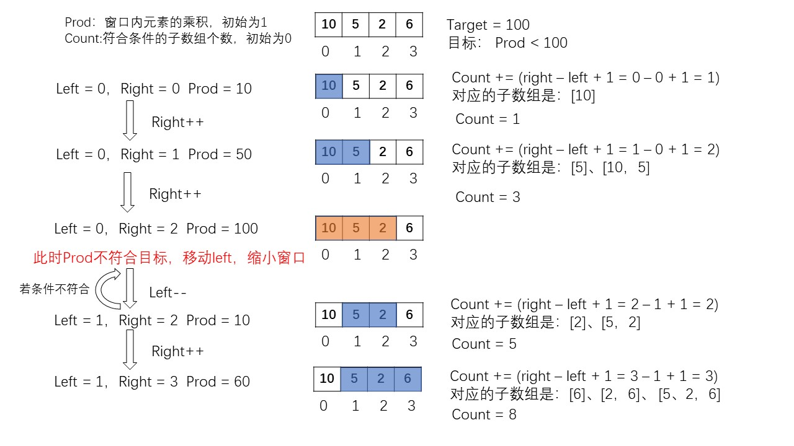

### 滑动窗口

> 一般都是基于字符串和数组的,需要控制前后指针的移动来控制窗口，这样的移动是有条件的，也就是要想清楚在什么情况下移动，在什么情况下保持不变。
>
> - 通常是移动了右指针后，窗口内的条件被打破，不符合目标条件，此时需要移动左指针使窗口内的条件依旧成立。

> 以下是之前看到别人的一个模板，感觉不错，贴出来。

```cpp
int slidingWindowTemplate(string a, ...) {
    // 输入参数有效性判断
    if (...) {
        ...
    }
 
    // 申请一个散列，用于记录窗口中具体元素的个数情况
    // 这里用数组的形式呈现，也可以考虑其他数据结构
    int[] hash = new int[...];
 
    // 预处理(可省), 一般情况是改变 hash
    ...
 
    // l 表示左指针
    // count 记录当前的条件，具体根据题目要求来定义
    // result 用来存放结果
    int l = 0, count = ..., result = ...;
    for (int r = 0; r < A.length; ++r) {
        // 更新新元素在散列中的数量
        hash[A[r]]--;
 
        // 根据窗口的变更结果来改变条件值
        if (hash[A[r]] == ...) {
            count++;
        }
 
        // 如果当前条件不满足，移动左指针直至条件满足为止
        while (count > K || ...) {
            ...
            if (...) {
                count--;
            }
            hash[A[l]]++;
            l++;
        }
 
        // 更新结果
        results = ...
    }
 
    return results;
}
```

#### 长度最小的子数组

```
给定一个含有 n 个正整数的数组和一个正整数 target 。

找出该数组中满足其和 ≥ target 的长度最小的 连续子数组 [numsl, numsl+1, ..., numsr-1, numsr] ，并返回其长度。如果不存在符合条件的子数组，返回 0 。
```

```
输入：target = 7, nums = [2,3,1,2,4,3]
输出：2
```

> 题解：我们维护一个可变长的滑动窗口，并且`要求`窗口内元素和sum小于`target`，当将窗口向右移动至不符合`要求`[即窗口内元素和sum≥target]，此时开始将窗口缩小[即左边界向有边界],直到符合`要求`，此时计算窗口长度并更新结果ans。

```cpp
class Solution {
public:
    int minSubArrayLen(int target, vector<int>& nums) {
        int n = nums.size();
        int left = 0,right = 0;
        int winSum = 0,ans = INT_MAX;
        while(right < n){
            winSum += nums[right];
            while(winSum >= target){
                ans = min(right - left + 1,ans);
                winSum -= nums[left++];
            }
            right++;
        }
        return ans == INT_MAX ? 0 : ans;
    }
};
```

#### 找到字符串中所有字母异位词

```
给定两个字符串 s 和 p，找到 s 中所有 p 的 异位词 的子串，返回这些子串的起始索引。不考虑答案输出的顺序。
异位词 指字母相同，但排列不同的字符串。
```

```
输入: s = "cbaebabacd", p = "abc"
输出: [0,6]
```

> 我们维护一个大小等于p串长度的窗口，并将其从左向右滑动，依次匹配窗口中元素的信息和p串信息是否相同。
>
> - 滑动即：右指针和左指针均右移一个单位，并更新窗口内元素信息

```cpp
class Solution {
public:
    int p_cnt[26] = {0};
    int s_cnt[26] = {0};

    bool compare(void){
        for(int i = 0;i < 26;i++){
            if(p_cnt[i] != s_cnt[i]) return false;
        }
        return true;
    }

    vector<int> findAnagrams(string s, string p) {
        int np = p.length();
        int ns = s.length();
        //p串长度大于s串，直接返回{}
        if(np > ns) return vector<int> {};
        //初始化字符串p内字母的个数
        for(int i = 0;i < np;i++){
            p_cnt[p[i] - 'a']++;
        }
        vector<int> ans;
        //初始化左、右指针
        int left = 0,right = 0;
        while(right <= ns){
            //如果当前串口小于指定值，右移右指针，并更新窗口内元素信息
            if(right - left <= np-1){
                s_cnt[s[right++] - 'a']++;
                continue;
            }
            //如果匹配到，加入答案
            if(compare()){
                ans.push_back(left);
            }
            if(right == ns) break;
            //右吞左吐
            s_cnt[s[right++] - 'a']++;
            s_cnt[s[left++] - 'a']--;
        }
        return ans;
    }
};
```

#### 乘积小于K的子数组

```
给定一个正整数数组 nums和整数 k 。

请找出该数组内乘积小于 k 的连续的子数组的个数。
```

```
输入: nums = [10,5,2,6], k = 100
输出: 8
解释: 8个乘积小于100的子数组分别为: [10], [5], [2], [6], [10,5], [5,2], [2,6], [5,2,6]。
```




```cpp
class Solution {
public:
    int numSubarrayProductLessThanK(vector<int>& nums, int k) {
        if(k <= 1) return 0;
        int n = nums.size();
        int left = 0,right = 0,count = 0;
        unsigned long long mul = 1;
        while(right < n){
            mul = mul * nums[right];
            while(mul >= k){
                mul /= nums[left++];
            }
            count += right - left + 1;//本题的精髓
            right++;
        }
        return count;
    }
};
```


#### 大小为 K 且平均值大于等于阈值的子数组数目

给你一个整数数组 `arr` 和两个整数 `k` 和 `threshold` 。

请你返回长度为 `k` 且平均值大于等于 `threshold` 的子数组数目。

```
输入：arr = [2,2,2,2,5,5,5,8], k = 3, threshold = 4
输出：3
解释：子数组 [2,5,5],[5,5,5] 和 [5,5,8] 的平均值分别为 4，5 和 6 。其他长度为 3 的子数组的平均值都小于 4 （threshold 的值)。
```

**题目解析**：

**长度为k**，**子数组**，经典滑动窗口关键词。

```java
class Solution {
    public int numOfSubarrays(int[] arr, int k, int threshold) {
        int n = arr.length;
        int l = 0,r;
        int sum = 0;
        for (int i = 0;i < k-1;i++){
            sum += arr[i];
        }
        r = k-1;
        int ans = 0;
        while (r < n){
            sum += arr[r];
            if (sum / k >= threshold){
                ans += 1;
            }
            sum -= arr[l];
            l += 1;
            r += 1; 
        }
        return ans;
    }
}
```


#### 存在重复元素II

给你一个整数数组 nums 和一个整数 k ，判断数组中是否存在两个 不同的索引 i 和 j ，满足 nums[i] == nums[j] 且 abs(i - j) <= k 。如果存在，返回 true ；否则，返回 false 。

```
输入：nums = [1,2,3,1], k = 3
输出：true
```

题目解析：滑动窗口

```java
class Solution {
    // 滑动窗口
    public boolean containsNearbyDuplicate(int[] nums, int k) {
        int n = nums.length;
        Set<Integer> set = new HashSet<>();
        int t = Math.min(k,n);
        for(int i = 0;i < t;i++){
            if(set.contains(nums[i])) return true;
            set.add(nums[i]);
        }
        int l = 0,r = k;
        while(r < n){
            if(set.contains(nums[r])) return true;
            set.add(nums[r++]);
            set.remove(nums[l++]);
        }
        return false;
    }
}
```

