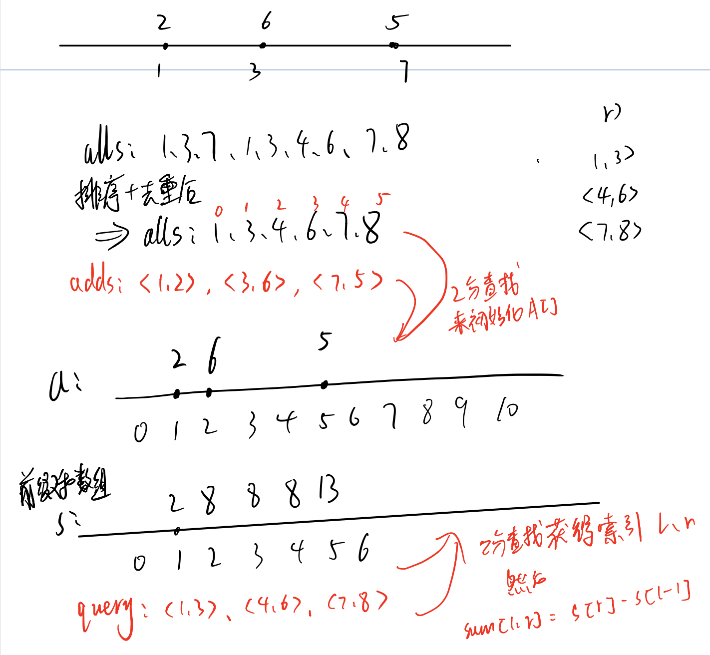

## 离散化

在很多情况下，问题的范围虽然定义在整数集合Z，但是只涉及其中m个有限数值，并且与数值的绝对大小无关（只把这些数值作为代表，或只与它们的相对顺序有关）。此时，我们就可以把整数集合Z中的这m个整数与1～m建立映射关系。

也就是说：有一个数组A，值域很大：$0-10^9$，个数很少：$0-10^4$

通俗来讲，离散化就是把无限空间中有限的个体映射到有限的空间中去，以此提高算法的时空效率。

**算法流程**：

- 排序
- A[]种可能由重复元素  **去重**
- 如何算出x离散化后的值(即在A中的下标是多少)  **二分**

> 如果不要求必须有序，则可以采用 Map 来进行离散化，key是原值， value是映射后的值。
>
> ```java
> static Map<Integer,Integer> map = new HashMap<>();
> static int cnt = 0;
> public static int get(int x){
>     Integer y = map.get(x);
>     if (y == null){
>         map.put(x,cnt++);
>         return cnt - 1;
>     }
>     return y;
> }
> ```

模板：

cpp版本

```java
vector<int> alls; // 存储所有待离散化的值
sort(alls.begin(), alls.end());//将所有值排序
alls.erase(unique(alls.begin(), alls.end()),alls.end());// 去掉重复元素
//unique:c++的库函数

// 二分求出x对应的离散化的值
int find(int x)//找到大于等于x的位置
{
    int l = 0, r = alls.size() - 1;
    while (l < r)
    {
        int mid = l + r >> 1;
        if (alls[mid] >= x) r = mid;
        else l = mid + 1;
    }
    return r + 1;//映射到1……n
}
```

java版本

```java
// 排序
alls.sort(new Comparator<Integer>() {
    @Override
    public int compare(Integer o1, Integer o2) {
        return o1-o2;
    }
});
// java 没有unique函数，需要自己实现一下
public static List<Integer> unique(List<Integer> A){
    List<Integer> res = new ArrayList<>();
    res.add(A.get(0));
    for (int i = 1;i < A.size();i++){
        if (A.get(i) == A.get(i-1)) continue;
        res.add(A.get(i));
    }
    return res;
}
```


**例题**：区间和

假定有一个无限长的数轴，数轴上每个坐标上的数都是 0。

现在，我们首先进行 n 次操作，每次操作将某一位置 x 上的数加 c。

接下来，进行 m 次询问，每个询问包含两个整数 l 和 r，你需要求出在区间 $[l,r]$ 之间的所有数的和。

```java
import java.io.*;
import java.util.*;

public class Main {
    public static List<Integer> unique(List<Integer> A){
        List<Integer> res = new ArrayList<>();
        res.add(A.get(0));
        for (int i = 1;i < A.size();i++){
            if (A.get(i) == A.get(i-1)) continue;
            res.add(A.get(i));
        }
        return res;
    }

    public static int find(int x,List<Integer> uniqueAlls ){
        int l = 0,r = uniqueAlls.size()-1;
        while (l < r){
            int mid = (l + r) >> 1;
            if (uniqueAlls.get(mid) >= x) r = mid;
            else l = mid + 1;
        }
        return r+1;
    }

    public static void main(String[] args) throws IOException {
        int [] a = new int[300005];
        int [] s = new int[300005];
        List<Integer> alls = new ArrayList<>();
        List<int []> query = new ArrayList<>();
        List<int []> adds =new ArrayList<>();

        InputStreamReader in = new InputStreamReader(System.in);
        BufferedReader bf = new BufferedReader(in);
        String [] ins = bf.readLine().split(" ");
        int n = Integer.parseInt(ins[0]);
        int m = Integer.parseInt(ins[1]);
        for (int i = 0;i < n;i++){
            ins = bf.readLine().split(" ");
            int x = Integer.parseInt(ins[0]);
            int c = Integer.parseInt(ins[1]);
            adds.add(new int[]{x,c});
            alls.add(x);
        }
        for (int i = 0;i < m;i++){
            ins = bf.readLine().split(" ");
            int l = Integer.parseInt(ins[0]);
            int r = Integer.parseInt(ins[1]);
            query.add(new int[]{l,r});
            // 查询的下标也要加入！！
            alls.add(l);
            alls.add(r);
        }
        // 排序
        alls.sort(new Comparator<Integer>() {
            @Override
            public int compare(Integer o1, Integer o2) {
                return o1-o2;
            }
        });
        // 去重
        List<Integer> uniqueAlls = unique(alls);
        // 处理插入
        for (int i = 0;i < adds.size();i++){
            int x = find(adds.get(i)[0],uniqueAlls);
            a[x] += adds.get(i)[1];
        }
        // 预处理前缀和
        for (int i = 1; i <= uniqueAlls.size();i++){
            s[i] = s[i-1] + a[i];
        }
        // 处理查询
        for (int i = 0;i < query.size();i++){
            int l = find(query.get(i)[0],uniqueAlls),r = find(query.get(i)[1],uniqueAlls);
            System.out.println(s[r] - s[l-1]);
        }
    }
}
```




