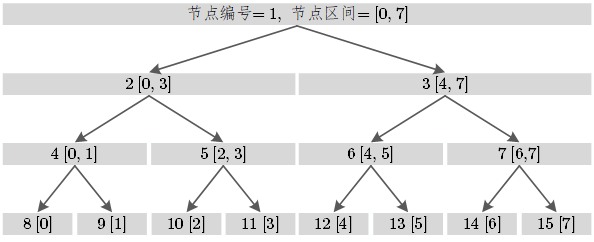
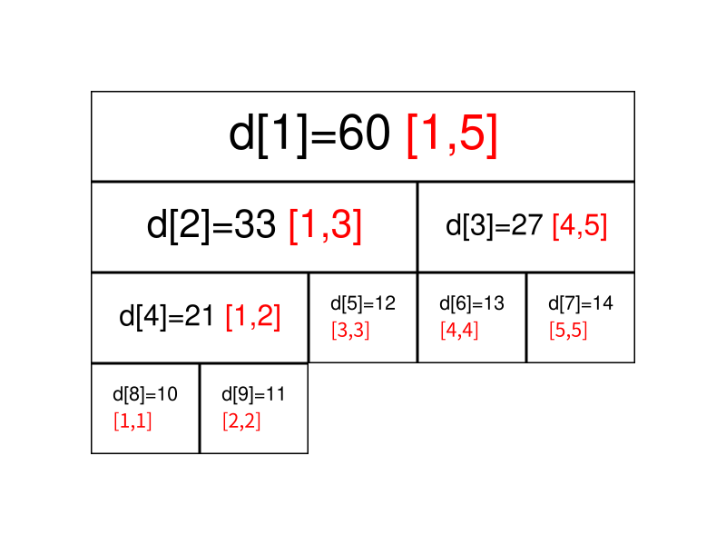

## 线段树

线段树将每个长度不为 1 的区间划分成左右两个区间递归求解，把整个线段划分为一个树形结构，通过合并左右两区间信息来求得该区间的信息。这种数据结构可以方便的解决多种范围查询问题，比如在对数时间内**从数组中找到最小值、最大值、总和、最大公约数、最小公倍数**等。

类似如下图所示：



同时，每个结点可以携带一些信息，比如下图所示：

设线段树的根节点编号为 1，用数组 d 来保存我们的线段树， $d_i$用来保存线段树上编号为 i 的节点的值（这里每个节点所维护的值就是这个节点所表示的区间总和）



图中每个节点中用红色字体标明的区间，表示该节点管辖的 a 数组上的位置区间。如 $d_1$所管辖的区间就是 $[1,5],\text{即}(a_1,a_2,...,a_5)$，即 $d_1$所保存的值是$a_1+a_2+...+a_5$ ， 即$d_1 = 60$ 。

>  $d_i$的左儿子节点表示的是区间$[s,(s+t)/2]$ ， $d_i$的右儿子表示的是区间$[(s+t)/2+1,t]$ 。
>
> 如果索引 i 处的元素不是一个叶节点，那么其左子节点和右子节点分别存储在索引为 2i 和 2i+1的元素处。

实现时，我们考虑**递归建树**。设当前的根节点为 p ，如果根节点管辖的区间长度已经是 1 ，则可以直接根据 a 数组上相应位置的值初始化该节点。否则我们将该区间从中点处分割为两个子区间，分别进入左右子节点递归建树，最后合并两个子节点的信息。

> 推荐黄浩杰老师讲的很不错 [YouTube地址](https://www.youtube.com/watch?v=e_bK-dgPvfM)


### 示例-区域和检索 - 数组可修改 (区间和问题)

> 题目来源：Leetcode 307
>
> 标签：线段树

给你一个数组 nums ，请你完成两类查询。

其中一类查询要求 更新 数组 nums 下标对应的值
另一类查询要求返回数组 nums 中索引 left 和索引 right 之间（ 包含 ）的nums元素的 和 ，其中 left <= right
实现 NumArray 类：

- NumArray(int[] nums) 用整数数组 nums 初始化对象
- void update(int index, int val) 将 nums[index] 的值 更新 为 val
- int sumRange(int left, int right) 返回数组 nums 中索引 left 和索引 right 之间（ 包含 ）的nums元素的 和 （即，nums[left] + nums[left + 1], ..., nums[right]）

线段树可以分为以下三个步骤：

1. 从给定数组构建线段树的预处理步骤。
2. 修改元素时更新线段树。
3. 使用线段树进行区域和检索

**构建线段树**：

从上面我们已经知道，如果某个节点 p 包含范围 $[i\ldots j]$的和，那么其左、右子节点分别包含范围 $[i \ldots \frac{i + j}{2}]$ 和$[\frac{i + j}{2} + 1, j]$上的和。

```java
class NumArray {
    int [] tree; // 线段树
    int n;
    public NumArray(int[] nums) {
        if (nums.length > 0){
            n = nums.length;
            tree = new int[n * 2];
            buildTree(nums); // 建树
        }
    }
    // 创建树的过程可以参考本文第一张图片
    private void buildTree(int [] nums){
        for (int i = n,j = 0;i < 2 *n;i++,j++){ // (n个元素)
            tree[i] = nums[j];
        }
        for (int i = n-1;i > 0;i--){ // i : n-1 ~ 1(n-1个元素)
            tree[i] = tree[i*2] + tree[i*2+1];
        }
    }
    // 将下标为index的元素更新为val 
    public void update(int index, int val) {
        index += n; // 找到对应到线段树数组tree中的下标
        tree[index] = val; // 修改元素值
        while (index > 0){
            int left = index;
            int right = index;
            // left的下标一定是偶数，right的下标一定是奇数，并且 left < right
            if (index % 2 == 0){
                right = index + 1;
            }else{
                left = index - 1;
            }
            // 修改父节点对应的元素和
            tree[index / 2] = tree[left] + tree[right];
            index /= 2; // 自下而上递归（循环代替递归）
        }
    }

    public int sumRange(int left, int right) {
        // 起始位置是单个位置
        left += n;
        right += n;
        int sum = 0;
        while (left <= right){
            // 如果 left 对应的是奇数，那么说明不是完整的，即只包含了区间的一部分
            if ((left % 2) == 1){
                sum += tree[left];
                left += 1;
            }
            // 如果 right 对应的是偶数，和上述原理一样
            if ((right % 2) == 0){
                sum += tree[right];
                right -= 1;
            }
            // 向上移动一层
            left /= 2; 
            right /= 2;
        }
        return sum;
    }
}
```


### 示例-由单个字符重复的最长子字符串

> 题目来源：LeetCode 6030
>
> 标签：线段树

给你一个下标从 **0** 开始的字符串 `s` 。另给你一个下标从 **0** 开始、长度为 `k` 的字符串 `queryCharacters` ，一个下标从 `0` 开始、长度也是 `k` 的整数 **下标** 数组 `queryIndices` ，这两个都用来描述 `k` 个查询。

第 `i` 个查询会将 `s` 中位于下标 `queryIndices[i]` 的字符更新为 `queryCharacters[i]` 。

返回一个长度为 `k` 的数组 `lengths` ，其中 `lengths[i]` 是在执行第 `i` 个查询 **之后** `s` 中仅由 **单个字符重复** 组成的 **最长子字符串** 的 **长度** *。*

```
输入：s = "babacc", queryCharacters = "bcb", queryIndices = [1,3,3]
输出：[3,3,4]
解释：
- 第 1 次查询更新后 s = "bbbacc" 。由单个字符重复组成的最长子字符串是 "bbb" ，长度为 3 。
- 第 2 次查询更新后 s = "bbbccc" 。由单个字符重复组成的最长子字符串是 "bbb" 或 "ccc"，长度为 3 。
- 第 3 次查询更新后 s = "bbbbcc" 。由单个字符重复组成的最长子字符串是 "bbbb" ，长度为 4 。
因此，返回 [3,3,4] 。
```

**题目解析**：

线段树的每个节点维护对应区间的：

1. 前缀最长连续字符个数 $\textit{pre}$；
2. 后缀最长连续字符个数 $\textit{suf}$；
3. 该区间最长连续字符个数 $\textit{max}$。

合并两个子区间时，如果前一个区间（记作 a）的末尾字符等于后一个区间（记作 b）的第一个字符，则可以合并这两个区间：

- 如果 a 的 $\textit{suf}$suf 等于 a 的长度，那么就可以更新合并后的区间的 $\textit{pre}$  值；
- 如果 b 的 $\textit{pre}$pre 等于 b 的长度，那么就可以更新合并后的区间的 $\textit{suf}$ 值；
- 如果上面两个不成立，那么$ \textit{a.suf} + \textit{b.pre}$ 可以考虑成为合并后的区间的 $\textit{max}$

```java
class Node{
    int pre; // 前缀最长连续字符个数
    int suf; // 后缀最长连续字符个数
    int max; // 区间最长连续字符个数
    Node(){
        this.pre = 0;  
        this.suf = 0; 
        this.max = 0;
    }
}

class Solution {
    Node [] tree;  // 线段树
    int n;
    char [] s;
    public int[] longestRepeating(String s, String queryCharacters, int[] queryIndices) {
        n = s.length();
        this.s = s.toCharArray();
        buildTree(s);
        int [] ans = new int[queryIndices.length];
        for (int i = 0;i < ans.length;i++){
            query(1,0,n-1,queryIndices[i],queryCharacters.charAt(i));
            ans[i] = tree[1].max;
        }
        return ans;
    }
    private void buildTree(String s){
        // 初始化
        tree = new Node[400005];
        for (int i = 1;i < 400005;i++){
            tree[i] = new Node();
        }
        build(1,0,n-1); // 递归建树
    }
    private void build(int node,int l,int r){
        // 如果是叶子结点
        if (l == r){
            tree[node].pre = tree[node].suf = tree[node].max = 1;
        }else{// 非叶子结点，继续递归建树
            int m = l + ((r - l) >> 1);
            build(node << 1,l,m);
            build((node << 1) | 1,m+1,r);
            // 合并node的左右子树
            merge(node,l,r);
        }
    }
    // 合并两个结点的信息
    private void merge(int node,int l,int r){
        int nl = node << 1;  // 左孩子结点编号
        int nr = nl | 1;  // 右孩子结点编号
        int m = l + ((r - l) >> 1); // 区间的中间位置
        // 合并 初始化 max、pre、suf
        tree[node].max = Math.max(tree[nl].max,tree[nr].max);
        tree[node].pre = tree[nl].pre;
        tree[node].suf = tree[nr].suf;
        if (s[m] == s[m+1]){// 前一个区间的最后一个字符和后一个区间的第一个字符相等
            tree[node].max = Math.max(tree[node].max,tree[nl].suf + tree[nr].pre); // 更新 max
            if (tree[nl].max == m-l+1){ // 如果前面区间全是相同字符
                tree[node].pre += tree[nr].pre; // 更新 node 的 pre
            }
            if (tree[nr].max == r - m){ // 如果后面区间全是相同字符
                tree[node].suf += tree[nl].suf; // 更新 node 的 suf
            }
        }
    }

    private void query(int node,int l,int r,int idx,char ch){
        if (l == r){ //如果是叶子结点，修改对应的字符
            s[l] = ch; 
        }else{// 递归寻找
            int m = l +((r - l) >> 1);
            if (idx <= m) query(node << 1,l,m,idx,ch);
            else query((node << 1) | 1,m+1,r,idx,ch);
            // 合并
            merge(node,l,r);
        }
    }
}
```

### 示例-区间内查询数字的频率

请你设计一个数据结构，它能求出给定子数组内一个给定值的 频率 。

子数组中一个值的 频率 指的是这个子数组中这个值的出现次数。

请你实现 RangeFreqQuery 类：

- RangeFreqQuery(int[] arr) 用下标从 0 开始的整数数组 arr 构造一个类的实例。
- int query(int left, int right, int value) 返回子数组 arr[left...right] 中 value 的 频率 。

一个 子数组 指的是数组中一段连续的元素。arr[left...right] 指的是 nums 中包含下标 left 和 right 在内 的中间一段连续元素。

```
输入：
["RangeFreqQuery", "query", "query"]
[[[12, 33, 4, 56, 22, 2, 34, 33, 22, 12, 34, 56]], [1, 2, 4], [0, 11, 33]]
输出：
[null, 1, 2]

解释：
RangeFreqQuery rangeFreqQuery = new RangeFreqQuery([12, 33, 4, 56, 22, 2, 34, 33, 22, 12, 34, 56]);
rangeFreqQuery.query(1, 2, 4); // 返回 1 。4 在子数组 [33, 4] 中出现 1 次。
rangeFreqQuery.query(0, 11, 33); // 返回 2 。33 在整个子数组中出现 2 次。
```

```java
class Node{
    Map<Integer,Integer> cnt ; // 记录区间每个元素个个数
    int size;
    Node(){
        this.cnt  = new HashMap<>();
        this.size = 0;
    }
    Node(int val){
        this.cnt  = new HashMap<>();
        this.cnt.put(val,1);
        this.size = 0;
    }
    // 合并两个区间的 哈希表
    public void Union(Map<Integer,Integer> m){
        Iterator<Map.Entry<Integer,Integer>> entries = m.entrySet().iterator();
        while (entries.hasNext()){
            Map.Entry<Integer,Integer> entry = entries.next();
            int key = entry.getKey();
            int val = entry.getValue();
            this.cnt.put(key,this.cnt.getOrDefault(key,0)+val);
        }
    }
}

class RangeFreqQuery {
    Node [] tree;
    int n;
    int [] arr;
    public RangeFreqQuery(int[] arr) {
		// 初始化
        n = arr.length;
        this.tree =  new Node[2 * n];
        this.arr = new int[n];
        // 创建叶子结点
        for (int i = n,j = 0;i < n * 2;i++,j++){
            tree[i] = new Node(arr[j]);
        }
        // 自下而上创建树
        for (int i = n-1;i > 0;i--){
            tree[i] = new Node();
            tree[i].Union(tree[i*2].cnt);
            tree[i].Union(tree[i*2+1].cnt);
        }
    }
	// 查询
    public int query(int left, int right, int value) {
        left += n;
        right += n;
        int ans = 0;
        while (left <= right){
            if ((left % 2) == 1){
                ans += tree[left].cnt.getOrDefault(value,0);
                left += 1;
            }
            if ((right % 2) == 0){
                ans += tree[right].cnt.getOrDefault(value,0);
                right -= 1;
            }
            left /= 2;
            right /= 2;
        }
        return ans;
    }
}
```

