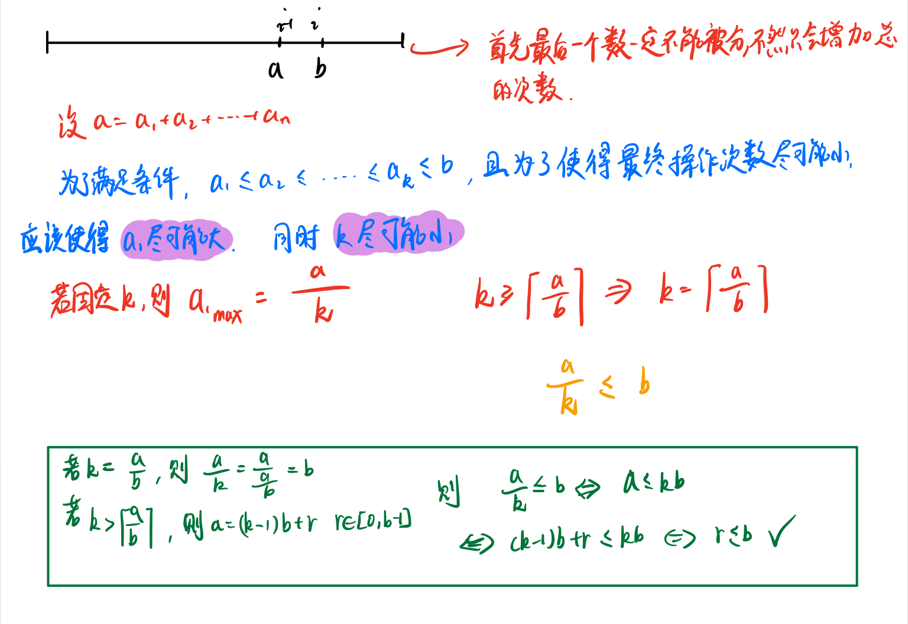

希望我练完`贪心算法`，不会变成一个`贪心的人`，而变成一个`能每次做出当前最优(局部最优)决定的人，从而达到我人生的最优态`，但是呢，并不是每个人的人生都是这样的，`即使你做出了当前最优的决策，也可能会走上人生的另一个岔路口`。 哦 好像后几句就挺像贪心思想的：**每一步都做出一个局部最优的选择，最终的结果就是全局最优。·但是只有一部分问题拥有这个性质。**

> 比如你面前放着 100 张人民币，你只能拿十张，怎么才能拿最多的面额？显然每次选择剩下钞票中面值最大的一张，最后你的选择一定是最优的。

最常见的贪心有两种。

> 摘取自 oi-wiki

- 「我们将 XXX 按照某某顺序排序，然后按某种顺序（例如从小到大）选择」
- 「我们每次都取 XXX 中最大/小的东西，并更新 XXX。」（有时「XXX 中最大/小的东西」可以优化，比如用优先队列维护）

> 二者的区别在于一种是离线的，先处理后选择；一种是在线的，边处理边选择。

> 个人经验：感觉好多贪心问题都需要先排序~，算不算是一个小规律呢？


#### 玩筹码

有 n 个筹码。第 i 个筹码的位置是 position[i] 。

我们需要把所有筹码移到同一个位置。在一步中，我们可以将第 i 个筹码的位置从 position[i] 改变为:

- position[i] + 2 或 position[i] - 2 ，此时 cost = 0
- position[i] + 1 或 position[i] - 1 ，此时 cost = 1

返回将所有筹码移动到同一位置上所需要的 最小代价 。


```
输入：position = [1,2,3]
输出：1
解释：第一步:将位置3的筹码移动到位置1，成本为0。
第二步:将位置2的筹码移动到位置1，成本= 1。
总成本是1。
```

可以把初始每一个偶数位置的「筹码」看作一个整体，每一个奇数位置的「筹码」看作一个整体。因为我们的目标是最后将全部的「筹码」移动到同一个位置，那么最后的位置只有两种情况：

- 移动到某一个偶数位置，此时的开销最小值就是初始奇数位置「筹码」的数量。

- 移动到某一个奇数位置，此时的开销最小值就是初始偶数位置「筹码」的数量。

那么这两种情况中的最小值就是最后将所有筹码移动到同一位置上所需要的最小代价。

```java
class Solution {
    public int minCostToMoveChips(int[] position) {
        int odd = 0,even = 0;
        int n = position.length;
        for(int i = 0;i < n;i++){
            if(position[i] % 2 == 0){
                even += 1;
            }else{
                odd += 1;
            }
        }
        return Math.min(odd,even);
    }
}
```


#### 设置交集大小至少为2

一个整数区间 [a, b]  ( a < b ) 代表着从 a 到 b 的所有连续整数，包括 a 和 b。

给你一组整数区间intervals，请找到一个最小的集合 S，使得 S 里的元素与区间intervals中的每一个整数区间都至少有2个元素相交。

输出这个最小集合S的大小。

```
示例 1:

输入: intervals = [[1, 3], [1, 4], [2, 5], [3, 5]]
输出: 3
解释:
考虑集合 S = {2, 3, 4}. S与intervals中的四个区间都有至少2个相交的元素。
且这是S最小的情况，故我们输出3。
```

对`intervals`进行排序，`intervals[0]`升序，`inervals[1]`降序，然后从后向前进行遍历.

首先初始化集合中包含两个元素`cur = intervals[n-1][0], next = intervals[n-1][0] + 1`，在我们向前遍历到第 i 个的区间$[x_i,y_i]$时候。

- 如果$y_i \ge next$，则 cur 和 next 也能够包含当前区间 $[x_i,y_i]$
- 如果$y_i \lt cur$，则 cur 和 next 和$[x_i,y_i]$没有任何交集，因此需要向集合中添加两个元素并更新 $cur = x_i , next = x_i + 1$
- 如果$y_i \ge cur \text{  &&  } y_i < next$，则只有一个交集，因此更新 $next = cur,cur = x_i$

```java
    public int intersectionSizeTwo(int[][] intervals) {
        Arrays.sort(intervals, new Comparator<int[]>() {
            @Override
            public int compare(int[] o1, int[] o2) {
                if (o1[0] != o2[0]) return o1[0] - o2[0];
                return o2[1] - o1[1];
            }
        }); // 左区间升序排序，右区间降序排序
        int n = intervals.length;
        int cur = intervals[n-1][0], next = intervals[n-1][0] + 1;
        int ans = 2;
        for (int i = n-2;i >= 0;i++){
            int xi = intervals[i][0],yi = intervals[i][1];
            if (yi >= next) continue;
            else if (yi < cur){
                cur = xi;
                next = cur + 1;
                ans += 2;
            }else if ( yi >= cur && yi < next){
                next = cur;
                cur = xi;
                ans += 1;
            }
        }
        return ans;
    }
```

#### 不可能得到的最短骰子序列

给你一个长度为 `n` 的整数数组 `rolls` 和一个整数 `k` 。你扔一个 `k` 面的骰子 `n` 次，骰子的每个面分别是 `1` 到 `k` ，其中第 `i` 次扔得到的数字是 `rolls[i]` 。

请你返回 **无法** 从 `rolls` 中得到的 **最短** 骰子子序列的长度。

扔一个 `k` 面的骰子 `len` 次得到的是一个长度为 `len` 的 **骰子子序列** 。

**注意** ，子序列只需要保持在原数组中的顺序，不需要连续。

```
输入：rolls = [4,2,1,2,3,3,2,4,1], k = 4
输出：3
解释：所有长度为 1 的骰子子序列 [1] ，[2] ，[3] ，[4] 都可以从原数组中得到。
所有长度为 2 的骰子子序列 [1, 1] ，[1, 2] ，... ，[4, 4] 都可以从原数组中得到。
子序列 [1, 4, 2] 无法从原数组中得到，所以我们返回 3 。
还有别的子序列也无法从原数组中得到。
```


```java
class Solution {
    public int shortestSequence(int[] rolls, int k) {
        int n = rolls.length;
        Set<Integer> set = new HashSet<>();
        int cnt = 0;
        for(int i = 0;i < n;i++){
            int j = i;
            while(j < n && set.size() < k){
                set.add(rolls[j++]);
            }
            if(set.size() == k){
                cnt++;
            }
            set.clear();
            i = j - 1;
        }
        return cnt + 1;
    }
}
```

#### 将数组排序的最少替换次数

给你一个下表从 0 开始的整数数组 nums 。每次操作中，你可以将数组中任何一个元素替换为 任意两个 和为该元素的数字。

比方说，nums = [5,6,7] 。一次操作中，我们可以将 nums[1] 替换成 2 和 4 ，将 nums 转变成 [5,2,4,7] 。

请你执行上述操作，将数组变成元素按 非递减 顺序排列的数组，并返回所需的最少操作次数。

```
输入：nums = [3,9,3]
输出：2
解释：以下是将数组变成非递减顺序的步骤：
- [3,9,3] ，将9 变成 3 和 6 ，得到数组 [3,3,6,3] 
- [3,3,6,3] ，将 6 变成 3 和 3 ，得到数组 [3,3,3,3,3] 
总共需要 2 步将数组变成非递减有序，所以我们返回 2。
```



```java
class Solution {
    public long minimumReplacement(int[] nums) {
        int n = nums.length;
        long ans = 0;
        for (int i = n - 2,last = nums[n-1];i >= 0;i--){
            if (nums[i] <= last) last = nums[i];
            else {
                int k = (nums[i] + last - 1) / last; // 最多分成 k 段，上取整
                ans += k - 1; // 需要拆分 k - 1 次
                last = nums[i] / k; // last 更新为拆分后的最小值
            }
        }
        return ans;
    }
}
```


#### 最长有效括号

给你一个只包含 '(' 和 ')' 的字符串，找出最长有效（格式正确且连续）括号子串的长度。

```
示例 1：
输入：s = "(()"
输出：2
解释：最长有效括号子串是 "()"

示例 2：
输入：s = ")()())"
输出：4
解释：最长有效括号子串是 "()()"

示例 3：
输入：s = ""
输出：0
```

我们利用两个计数器 $\textit{left}$和 $\textit{right}$。首先，我们从左到右遍历字符串，对于遇到的每个 $\text{‘(’}$，我们增加 $\textit{left}$计数器，对于遇到的每个 $\text{‘)’}$ ，我们增加 $\textit{right}$计数器。每当 $\textit{left}$计数器与 $\textit{right}$计数器相等时，我们计算当前有效字符串的长度，并且记录目前为止找到的最长子字符串。当 $\textit{right}$计数器比 $\textit{left}$计数器大时，我们将 $\textit{left}$和 $\textit{right}$计数器同时变回 0。

这样的做法贪心地考虑了以当前字符下标结尾的有效括号长度，每次当右括号数量多于左括号数量的时候之前的字符我们都扔掉不再考虑，重新从下一个字符开始计算，但这样会漏掉一种情况，就是遍历的时候左括号的数量始终大于右括号的数量，即 $(() $，这种时候最长有效括号是求不出来的。

解决的方法也很简单，我们只需要从右往左遍历用类似的方法计算即可，只是这个时候判断条件反了过来：

- 当 $\textit{left}$计数器比 $\textit{right}$计数器大时，我们将 $\textit{left}$和 $\textit{right}$计数器同时变回 0
- 当 $\textit{left}$计数器与 $\textit{right}$计数器相等时，我们计算当前有效字符串的长度，并且记录目前为止找到的最长子字符串

这样我们就能涵盖所有情况从而求解出答案。

```java
class Solution {
    public int longestValidParentheses(String s) {
        char[] chs = s.toCharArray();
        int n = chs.length;
        int left = 0,right = 0;
        int ans = 0;
        for (char ch : chs){
            if (ch == '(') left += 1;
            else right += 1;
            if (left == right){
                ans = Math.max(ans,right * 2);
            }else if (left < right){
                left = 0;
                right = 0;
            }
        }
        left = 0;
        right = 0;
        for (int i = n-1;i >= 0;i--){
            char ch = chs[i];
            if (ch == '(') left += 1;
            else right += 1;
            if (left == right){
                ans = Math.max(ans,right * 2);
            }else if (left > right){
                left = 0;
                right = 0;
            }
        }
        return ans;
    }
}
```


### 区间问题

区间问题感觉总是需要先排序...

#### 例题-区间选点

给定 N 个闭区间 $[a_i,b_i]$，请你在数轴上选择**尽量少**的点，使得每个区间内至少包含一个选出的点。

输出选择的点的**最小**数量。

位于区间端点上的点也算作区间内。

**输入格式**

第一行包含整数 N，表示区间数。

接下来 N 行，每行包含两个整数 $a_i,b_i$，表示一个区间的两个端点。

**输出格式**

输出一个整数，表示所需的点的最小数量。


#### 例题-区间合并


#### 例题-区间分组

给定 N 个闭区间 $[a_i,b_i]$，请你将这些区间分成若干组，使得每组内部的区间两两之间（包括端点）没有交集，并使得组数尽可能小。

输出最小组数。

**输入格式**

第一行包含整数 N，表示区间数。

接下来 N 行，每行包含两个整数 $a_i,b_i$，表示一个区间的两个端点。

**输出格式**

输出一个整数，表示最小组数。


#### 例题-区间覆盖

给定 N 个闭区间 $[a_i,b_i]$以及一个线段区间 $[s,t]$，请你选择尽量少的区间，将指定线段区间完全覆盖。

输出最少区间数，如果无法完全覆盖则输出 −1。

**输入格式**

第一行包含两个整数 s 和 t，表示给定线段区间的两个端点。

第二行包含整数 N，表示给定区间数。

接下来 N 行，每行包含两个整数 $a_i,b_i$，表示一个区间的两个端点。

**输出格式**

输出一个整数，表示所需最少区间数。

如果无解，则输出 −1。


### Huffman树

#### 例题-合并果子

在一个果园里，达达已经将所有的果子打了下来，而且按果子的不同种类分成了不同的堆。

达达决定把所有的果子合成一堆。

每一次合并，达达可以把两堆果子合并到一起，消耗的体力等于两堆果子的重量之和。

可以看出，所有的果子经过 n−1次合并之后，就只剩下一堆了。

达达在合并果子时总共消耗的体力等于每次合并所耗体力之和。

因为还要花大力气把这些果子搬回家，所以达达在合并果子时要尽可能地节省体力。

假定每个果子重量都为 1，并且已知果子的种类数和每种果子的数目，你的任务是设计出合并的次序方案，使达达耗费的体力最少，并输出这个最小的体力耗费值。

例如有 3 种果子，数目依次为 1，2，9。

可以先将 1、2堆合并，新堆数目为 3，耗费体力为 3。

接着，将新堆与原先的第三堆合并，又得到新的堆，数目为 12，耗费体力为 12。

所以达达总共耗费体力=3+12=15。

可以证明 15为最小的体力耗费值。

**输入格式**

输入包括两行，第一行是一个整数 n，表示果子的种类数。

第二行包含 n 个整数，用空格分隔，第 i 个整数 $a_i$ 是第 i 种果子的数目。

**输出格式**

输出包括一行，这一行只包含一个整数，也就是最小的体力耗费值。

输入数据保证这个值小于 $2^31$。


### 排序不等式

#### 例题-排队打水

有 n 个人排队到 1 个水龙头处打水，第 i 个人装满水桶所需的时间是 $t_i$，请问如何安排他们的打水顺序才能使所有人的**等待时间之和**最小？

**输入格式**

第一行包含整数 n。

第二行包含 n 个整数，其中第 i 个整数表示第 i 个人装满水桶所花费的时间 $t_i$。

**输出格式**

输出一个整数，表示最小的等待时间之和。


#### 雇佣K名工人的最低成本

有 n 名工人。 给定两个数组 quality 和 wage ，其中，quality[i] 表示第 i 名工人的工作质量，其最低期望工资为 wage[i] 。

现在我们想雇佣 k 名工人组成一个工资组。在雇佣 一组 k 名工人时，我们必须按照下述规则向他们支付工资：

- **对工资组中的每名工人，应当按其工作质量与同组其他工人的工作质量的比例来支付工资。**
- **工资组中的每名工人至少应当得到他们的最低期望工资。**

给定整数 k ，返回 组成满足上述条件的付费群体所需的最小金额 。在实际答案的 $10^{-5}$ 以内的答案将被接受。

```
输入： quality = [10,20,5], wage = [70,50,30], k = 2
输出： 105.00000
解释： 我们向 0 号工人支付 70，向 2 号工人支付 35。
```

**贪心**：


```java
class Solution {
    public double mincostToHireWorkers(int[] quality, int[] wage, int k) {
        int n = quality.length, sumQ = 0;
        var id = IntStream.range(0, n).boxed().toArray(Integer[]::new);
        Arrays.sort(id, (i, j) -> wage[i] * quality[j] - wage[j] * quality[i]); // 按照 r 值排序
        var pq = new PriorityQueue<Integer>((a, b) -> b - a); // 最大堆
        for (var i = 0; i < k; ++i) {
            pq.offer(quality[id[i]]);
            sumQ += quality[id[i]];
        }
        var ans = sumQ * ((double) wage[id[k - 1]] / quality[id[k - 1]]); // 选 r 值最小的 k 名工人组成当前的最优解
        for (var i = k; i < n; ++i) {
            var q = quality[id[i]];
            if (q < pq.peek()) { // sumQ 可以变小，从而可能得到更优的答案
                sumQ -= pq.poll() - q;
                pq.offer(q);
                ans = Math.min(ans, sumQ * ((double) wage[id[i]] / q));
            }
        }
        return ans;
    }
}
```


### 绝对值不等式

#### 例题-货仓选址

在一条数轴上有 N 家商店，它们的坐标分别为 $A_1∼A_N$。

现在需要在数轴上建立一家货仓，每天清晨，从货仓到每家商店都要运送一车商品。

为了提高效率，求把货仓建在何处，可以使得货仓到每家商店的距离之和最小。

**输入格式**

第一行输入整数 N。

第二行 N 个整数 $A_1∼A_N$。

**输出格式**

输出一个整数，表示距离之和的最小值。


### 推公式

#### 例题-耍杂技的牛

农民约翰的 N 头奶牛（编号为 1..N）计划逃跑并加入马戏团，为此它们决定练习表演杂技。

奶牛们不是非常有创意，只提出了一个杂技表演：

叠罗汉，表演时，奶牛们站在彼此的身上，形成一个高高的垂直堆叠。

奶牛们正在试图找到自己在这个堆叠中应该所处的位置顺序。

这 N 头奶牛中的每一头都有着自己的重量 $W_i$ 以及自己的强壮程度 $S_i$。

一头牛支撑不住的可能性取决于它头上所有牛的总重量（不包括它自己）减去它的身体强壮程度的值，现在称该数值为风险值，风险值越大，这只牛撑不住的可能性越高。

您的任务是确定奶牛的排序，使得所有奶牛的风险值中的最大值尽可能的小。

**输入格式**

第一行输入整数 N，表示奶牛数量。

接下来 N 行，每行输入两个整数，表示牛的重量和强壮程度，第 i 行表示第 i 头牛的重量 $W_i$ 以及它的强壮程度 $S_i$。

**输出格式**

输出一个整数，表示最大风险值的最小可能值。

**题解**：

