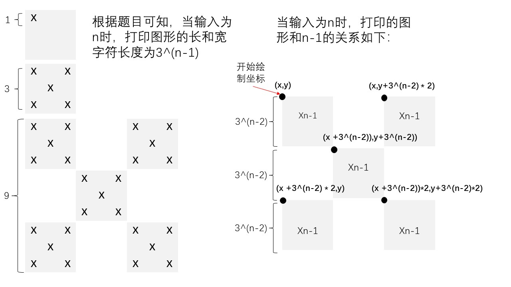

# 递归

### 图形打印

```
题目描述
​ 当 n 为 1 时，图形如下图：
X
​ 当 n 为 2 时，图形如下图：
X X
 X 
X X
​ 当 n≥2 时，图形规律如下：
图形n-1    图形n-1
    图形n-1
图形n-1    图形n-1
​ 给定 n 组数据，输出每组数据对应的图形。

输入
​ 输入共 n+1 行，前 n行每行一个数，表示要输出的图形的大小，最后一行输入 −1 代表程序结束。（1≤n≤7）
输出
​ 每输入一个数输出一组图形，并在图形后的下一行输出一个 −。
​ 注意，图形后应补齐空格。
```

当遇到这种有规律，大图形可以由小图形组成的图形打印题目，往往可以采用递归解决：



```cpp
#include<iostream>
using namespace std;

int n;
int num[10] = {0,1,3,9,27,81,243,729};
char map[2000][2000];
void func(int x,int y,int n){
    //如果是最小图形，直接在(x,y)打印
    if(n == 1){
        map[x][y] = 'X';
        return ;
    }
    //左上角打印
    func(x,y,n-1);
    //右上角打印
    func(x,y+num[n]/3 * 2,n-1);
    //左下角打印
    func(x+num[n]/3 * 2,y,n-1);
    //中心打印
    func(x+num[n]/3,y+num[n]/3,n-1);
    //右下角打印
    func(x+num[n]/3*2,y+num[n]/3*2,n-1);
}

int main(){
    func(1,1,7);
    while(cin >> n){
        if(n == -1) break;
        for(int i = 1;i <= num[n];i++){
            for(int j = 1;j <= num[n];j++){
                if(map[i][j] == 'X'){
                    cout<<'X';
                }else{
                    cout<<' ';
                }
            }
            cout<<endl;
        }
        cout<<"-"<<endl;
    }
    return 0;
}

```


### 递归实现指数型枚举

```
题目描述
​ 从 1−n 这 n 个整数中随机选取任意多个，每种方案里的数从小到大排列，按字典序输出所有可能的选择方案。

输入
​ 输入一个整数 n。（1≤n≤10）
输出
​ 每行一组方案，每组方案中两个数之间用空格分隔。
​ 注意每行最后一个数后没有空格。

样例输入
3
样例输出
1
1 2
1 2 3
1 3
2
2 3
3
```

```cpp
#include<iostream>
using namespace std;
int num[15];
int n;
//打印
void print(int ind){
    for(int j = 0;j <= ind;j++){
        if(j != 0) cout<<" ";
        cout<<num[j];
    }
    cout<<endl;
}
//递归函数
void func(int s,int ind){
    for(int i = s;i <= n;i++){
        num[ind] = i;
        //从起始打印至下标ind
 	  print(ind);
        func(i+1,ind + 1);
    }
}
int main(){
    cin>>n;
    func(1,0);
    return 0;
}
```


### 递归实现组合型枚举

```
题目描述
​ 从 1−n 这 n 个整数中随机选取 m 个，每种方案里的数从小到大排列，按字典序输出所有可能的选择方案。
输入
​ 输入两个整数 n,m。（1≤m≤n≤10）
输出
​ 每行一组方案，每组方案中两个数之间用空格分隔。
​ 注意每行最后一个数后没有空格。

样例输入2
5 3
样例输出2
1 2 3
1 2 4
1 2 5
1 3 4
1 3 5
1 4 5
2 3 4
2 3 5
2 4 5
3 4 5
```

```cpp
#include<iostream>
using namespace std;
int n,m;
int num[15];
void func(int start,int left){
    //递归结束
    if(left == 0){
        for(int i = 0;i < m;i++){
            if(i != 0){
                cout<<" ";
            }
            cout<<num[i];
        }
        cout<<endl;
        return ;
    }
    // i 最多到达 n - left + 1
    for(int i = start;i <= n-left+1;i++){
        num[m - left] = i;
        //进行下一层递归
        func(i + 1,left - 1);
    }
}

int main(){
    cin>>n>>m;
    func(1,m);
    return 0;
}
```


### 递归实现排列型枚举

```
题目描述
​ 从 1−n 这 n 个整数排成一排并打乱次序，按字典序输出所有可能的选择方案。
输入
​ 输入一个整数 n。（1≤n≤8）
输出
​ 每行一组方案，每组方案中两个数之间用空格分隔。
​ 注意每行最后一个数后没有空格。

样例输入
3
样例输出
1 2 3
1 3 2
2 1 3
2 3 1
3 1 2
3 2 1
```

```cpp
#include<iostream>
using namespace std;
int n;
int num[10],mark[10] = {0};

void func(int ind){
    //遍历的层数到达第n层了，结束递归
    if(ind == n){
        for(int i = 0;i < n;i++){
            if(i != 0) cout<<" ";
            cout<<num[i];
        }
        cout<<endl;
        return ;
    }
    //遍历1~n，判断有没有被使用，没有被使用的话使用并标记
    for(int i = 1;i <= n;i++){
        //如果 i 没有被使用
        if(mark[i] == 0){
            //先标记
            mark[i] = 1;
            //存储值
            num[ind] = i;
            //进行下一层递归
            func(ind + 1);
            //解除标记
            mark[i] = 0;
        }
    }
}

int main(){
    cin>>n;
    func(0);
    return 0;
}
```

> 排列组合应用：
>
> - 上述的排序组合均是 数字 => 数组下标，可以转化为
>   - 在5名同学中选出2名同学，递归得到的是数组下标，但是可以映射至其他数组[比如：存储同学名字的数组]
> - 排列组合问题 相当于 深度优先搜索问题 的一种

# 记忆化数组优化递归

记忆化数组用来存储中间结果   递归+记忆化≈递推