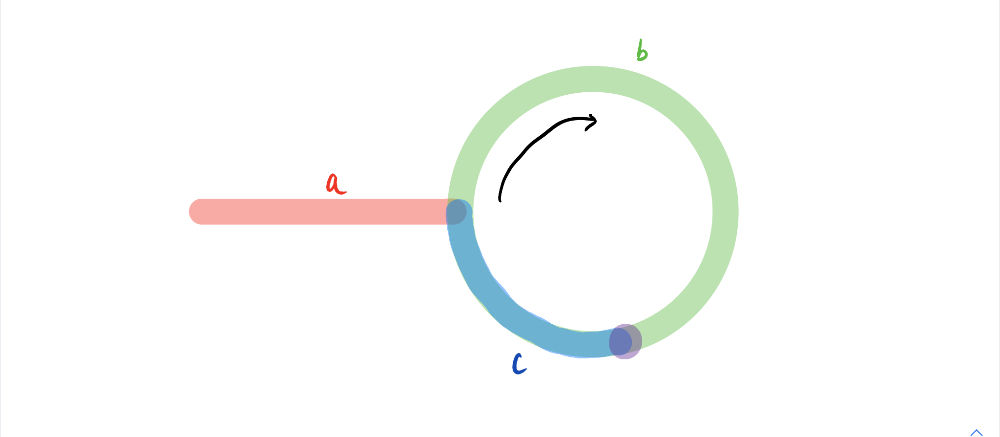

# 链表

> 注：**由于链表类型题解题方法比较单一，因此只给出解题大致思路，部分给出代码。**

#### 翻转链表

```java
/**
 * Definition for singly-linked list.
 * public class ListNode {
 *     int val;
 *     ListNode next;
 *     ListNode() {}
 *     ListNode(int val) { this.val = val; }
 *     ListNode(int val, ListNode next) { this.val = val; this.next = next; }
 * }
 */
class Solution {
    public ListNode reverseList(ListNode head) {
        ListNode pre = null;
        ListNode cur = head;
        while(cur != null){
            ListNode next = cur.next;
            cur.next = pre;
            pre = cur;
            cur = next;
        }
        return pre;
    }
}
```

#### 寻找链表中点

要点： 两个快慢指针，初始都指向头结点，然后慢指针每次走一步，快指针每次走两步。快指针不能走时即慢指针已经到了中点。

```java
public ListNode findMidNode(ListNode head){
    ListNode slow = head;
    ListNode fast = head;
    while (fast.next != null && fast.next.next != null){
        slow = slow.next;
        fast = fast.next.next;
    }
    return slow;
}
```


#### 重排链表

给定一个单链表 L 的头节点 head ，单链表 L 表示为：

L0 → L1 → … → Ln - 1 → Ln
请将其重新排列后变为：

L0 → Ln → L1 → Ln - 1 → L2 → Ln - 2 → …

> 寻找链表中点 + 链表翻转 + 合并链表

```java
/**
 * Definition for singly-linked list.
 * public class ListNode {
 *     int val;
 *     ListNode next;
 *     ListNode() {}
 *     ListNode(int val) { this.val = val; }
 *     ListNode(int val, ListNode next) { this.val = val; this.next = next; }
 * }
 */
class Solution {
    public ListNode findMidNode(ListNode head){
        ListNode slow = head;
        ListNode fast = head;
        while (fast.next != null && fast.next.next != null){
            slow = slow.next;
            fast = fast.next.next;
        }
        return slow;
    }
    public ListNode reverse(ListNode head){
        ListNode pre = null;
        ListNode cur = head;
        while (cur != null){
            ListNode next = cur.next;
            cur.next = pre;
            pre = cur;
            cur = next;
        }
        return pre;
    }
    public void reorderList(ListNode head) {
        if (head == null) return ;
        ListNode mid = findMidNode(head);
        ListNode head2 = reverse(mid.next);
        mid.next = null;
        ListNode cur1 = head;
        ListNode cur2 = head2;
        while (cur1 != null && cur2 != null){
            ListNode next1 = cur1.next;
            ListNode next2 = cur2.next;
            cur2.next = cur1.next;
            cur1.next = cur2;
            cur1 = next1;
            cur2 = next2;
        }
    }
}
```


#### 单链表中倒数第K个结点

采用倒退的想法，开始时一个标记指向尾结点的下一个null，另外一个指向倒数第k个结点，然后让这两个结点一次向前遍历，当原本指向倒数第k个结点的标记指向了头节点（此时可以理解为一个初始状态），而另外一个指向的正数的第k个结点，那么我们再正向来想，开始的状态就是上述的初始状态，那么逐个向后遍历，就可以**在初始状态指向正数第k个结点的指针指向尾部null时，原本指向头结点的指针就指向了倒数第k个结点。**

> 总结：两个指针，一个A指向 head，一个B指向第 K 个结点，然后一起向后遍历，当B指向尾结点时，A指向了倒数第 K 个结点。


#### 判断链表是否有环

使用两个指针，$\textit{fast}$与 $\textit{slow}$。它们起始都位于链表的头部。随后，$\textit{slow}$指针每次向后移动一个位置，而 $\textit{fast}$指针向后移动两个位置。如果链表中存在环，则 $\textit{fast}$指针最终将再次与 $\textit{slow}$指针在环中相遇。


#### 判断两个链表是否有交点

```
给你两个单链表的头节点 headA 和 headB ，请你找出并返回两个单链表相交的起始节点。如果两个链表没有交点，返回 null 。
```


> 方法1：**哈希**
>
> 哈希表内存储链表A的每个结点的地址，然后遍历链表B，当在哈希表中存在与链表B中结点地址相同的结点，那么这个就是公共结点[交点]
>
> 方法2：**双指针**
>
> - 只有当链表 `headA` 和 `headB` 都不为空时，两个链表才可能相交。因此首先判断链表 `headA `和 `headB` 是否为空，如果其中至少有一个链表为空，则两个链表一定不相交，返回 null。
>
>
> - 当链表  `headA`  和  `headB` 都不为空时，创建两个指针 `pA ` 和 `pB`，初始时分别指向两个链表的头节点 `headA` 和  `headB` ，然后将两个指针依次遍历两个链表的每个节点。具体做法如下：
>   - 每步操作需要同时更新指针 `pA ` 和 `pB`。
>   - 如果指针 `pA ` 不为空，则将指针 `pA ` 移到下一个节点；如果指针 `pB` 不为空，则将指针 `pB` 移到下一个节点。
>   - 如果指针 `pA ` 为空，则将指针 `pA ` 移到链表 `headB` 的头节点；如果指针 `pB` 为空，则将指针`pB` 移到链表  `headA` 的头节点。
>   - 当指针 `pA ` 和 `pB` 指向同一个节点或者都为空时，返回它们指向的节点或者 `null`。


#### 环形链表 II

给定一个链表的头节点  `head` ，返回链表开始入环的第一个节点。 如果链表无环，则返回 `null`。

**首先**：判断链表是否有环（见上述题解）。如果没有环直接返回null，否则继续寻找 **环的入口**

设链表中环外部分的长度为 a。$\textit{slow}$指针进入环后，又走了 b 的距离与 $\textit{fast}$相遇。此时，$\textit{fast}$指针已经走完了环的 n 圈，因此它走过的总距离为 $a+n(b+c)+b=a+(n+1)b+nc$。



根据题意，任意时刻，$\textit{fast}$指针走过的距离都为 $\textit{slow}$指针的 2 倍。因此，我们有

$a+(n+1)b+nc=2(a+b) \implies a=c+(n-1)(b+c)$

有了 $a=c+(n-1)(b+c)$的等量关系，我们会发现：从相遇点到入环点的距离加上 n−1 圈的环长，恰好等于从链表头部到入环点的距离。

因此，当发现 $\textit{slow}$与 $\textit{fast}$相遇时，我们再额外使用一个指针 $\textit{ptr}$。起始，它指向链表头部；随后，它和 $\textit{slow}$每次向后移动一个位置。最终，它们会在入环点相遇。

```java
public class Solution {
    public ListNode detectCycle(ListNode head) {
        if (head == null) {
            return null;
        }
        ListNode slow = head, fast = head;
        while (fast != null) {
            slow = slow.next;
            if (fast.next != null) {
                fast = fast.next.next;
            } else {
                return null;
            }
            if (fast == slow) {
                ListNode ptr = head;
                while (ptr != slow) {
                    ptr = ptr.next;
                    slow = slow.next;
                }
                return ptr;
            }
        }
        return null;
    }
}
```

#### 合并有序链表组

给定一个链表数组，每个链表都已经按升序排列。请将所有链表合并到一个升序链表中，返回合并后的链表。

```
输入：lists = [[1,4,5],[1,3,4],[2,6]]
输出：[1,1,2,3,4,4,5,6]
解释：链表数组如下：
[
  1->4->5,
  1->3->4,
  2->6
]
将它们合并到一个有序链表中得到。
1->1->2->3->4->4->5->6
```

**分治合并**：

```java
public class Solution {
    private ListNode mergeTwoList(ListNode A,ListNode B){
        if (A == null || B == null){
            return A != null ? A : B;
        }
        ListNode ans = new ListNode(-1);
        ListNode t = ans;
        ListNode ha = A, hb = B;
        while (ha != null && hb != null){
            if (ha.val <= hb.val){
                t.next = ha;
                ha = ha.next;
            }else{
                t.next = hb;
                hb = hb.next;
            }
            t = t.next;
        }
        t.next = ha != null ? ha.next : hb.next;
        return ans.next;
    }
    private ListNode merge(ListNode [] lists,int l, int r){
        if (l == r){
            return lists[l];
        }else if (l > r) return null;
        int mid = l + ((l + r) >> 1);
        return mergeTwoList(merge(lists,l,mid),merge(lists,mid+1,r));
    }
    public ListNode mergeKLists(ListNode[] lists) {
        return merge(lists,0,lists.length-1);
    }
}
```

时间复杂度：考虑递归「向上回升」的过程——第一轮合并 $\frac{k}{2}$组链表，每一组的时间代价是 O(2n)；第二轮合并 $\frac{k}{4}$组链表，每一组的时间代价是 O(4n)......所以总的时间代价是 $O(\sum_{i = 1}^{\infty} \frac{k}{2^i} \times 2^i n) = O(kn \times \log k)$，故渐进时间复杂度为 $O(kn \times \log k)$。

**优先级队列**：

```java
class node{
    int val;
    ListNode Node;
    public node(int val,ListNode Node){
        this.val = val;
        this.Node = Node;
    }
}
class Solution {
    public ListNode mergeKLists(ListNode[] lists) {
        Queue<node> pq = new PriorityQueue<>(new Comparator<node>() {
            @Override
            public int compare(node o1, node o2) {
                return o1.val - o2.val;
            }
        });
        for (ListNode list : lists){
            if(list != null)
                pq.offer(new node(list.val,list));
        }
        ListNode head = new ListNode(-1);
        ListNode tail = head;
        while (!pq.isEmpty()){
            node first = pq.poll();
            tail.next = first.Node;
            tail = tail.next;
            if (first.Node.next != null){
                pq.offer(new node(first.Node.next.val,first.Node.next));
            }
        }
        return head.next;
    }
}
```


#### K个一组翻转链表

给你链表的头节点 head ，每 k 个节点一组进行翻转，请你返回修改后的链表。

k 是一个正整数，它的值小于或等于链表的长度。如果节点总数不是 k 的整数倍，那么请将最后剩余的节点保持原有顺序。

你不能只是单纯的改变节点内部的值，而是需要实际进行节点交换

> 要求，空间复杂度 O(1)


```
输入：head = [1,2,3,4,5], k = 2
输出：[2,1,4,3,5]
```

```java
class Solution {
    // 翻转 s~e 的链表
    private ListNode[] reverse(ListNode s,ListNode e){
        ListNode pre = null; // 辅助指针，指向前面的结点
        ListNode cur = s;
        ListNode end = e.next;
        while (cur != end){
            ListNode next = cur.next;
            cur.next = pre;
            pre = cur;
            cur = next;
        }
        // 返回翻转后的新的组链表的head 和 tail
        return new ListNode[]{e,s};
    }
    public ListNode reverseKGroup(ListNode head, int k) {
        // 特例特判
        if (k == 1 || head == null || head.next == null) return head;
        ListNode ans = new ListNode(-1); // 创建一个辅助结点。
        ans.next = head;
        // 初始化结点信息
        ListNode pre = ans;
        ListNode r_head = head;
        ListNode r_tail = head;
        int cnt = 1;
        while (r_tail != null){
            // 如果把k个结点成功打包
            if (cnt == k){
                // 记录下一个结点
                ListNode next = r_tail.next;
                // 翻转区间链表
                ListNode [] ht = reverse(r_head,r_tail);
                // 更新指针指向
                pre.next = ht[0]; // 前一组的最后一个结点指向当前组的第一个结点
                r_head.next = next; // 当前组的最后一个结点指向下一个结点
                pre = ht[1]; // 更新当前组最后一个结点为上一组最后一个结点
                // 重新开始尝试打包 k 个结点
                r_head = next; 
                r_tail = next;
                cnt = 1;
                continue;
            }
            // 更新翻转链表的尾部结点
            r_tail = r_tail.next;
            cnt += 1;
        }
        return ans.next;
    }
}
```

