总结一下你可能需要掌握的知识点：

- 数据结构：链表（单向、双向、循环）、队列（双端队列、优先级队列）、栈（单调栈）、堆（大顶堆、小顶堆）、二叉树（二叉搜索树）、图（最小生成树）
- 算法：排序（自定义排序、快排、桶排序）、二分法（二分搜索、二分答案）、分治、递归、搜索（A*、BFS、DFS)、KMP、滑动窗口、双指针、位运算（快速幂）、贪心（证明）、动态规划（状态压缩）、前缀树
- 数学：约瑟夫环问题、剪绳子问题

自己认为的一些难点：

- 二分法：二分函数的细节、二分方法中check函数
- 图：如何将问题转化为一个可以用图结构解决、搜索过程
- 排序：自定义排序方法、

> 讲一些自己感悟吧...感觉坚持刷题真的有效果，刷offer的时候感觉许多题之前都刷到过类似的，然后很快就有思路。
>
> 所谓真正扎实的武功ጿ ኈ ቼ ዽ ጿ ኈ ቼ ዽ ጿ ኈ ቼ ዽ ጿ ኈ ቼ ዽ ጿ ኈ ቼ ዽ ጿ，都是在不断地训练中出来地！天才也需要99的汗水才能成功呢！


> 今天是10月31日，10月的最后一天，准备开始再将所有题用c++刷一遍，巩固
>
> 为什么用c++刷，因为纠结找c++还是java岗位，只能先准备一下了。


#### 第一剑式：用两个栈实现队列

> 题目来源：LeetCode 剑指 Offer 09
>
> 标签：栈

用两个栈实现一个队列。队列的声明如下，请实现它的两个函数 appendTail 和 deleteHead ，分别完成在队列尾部插入整数和在队列头部删除整数的功能。(若队列中没有元素，deleteHead 操作返回 -1 )

```java
输入：
["CQueue","appendTail","deleteHead","deleteHead"]
[[],[3],[],[]]
输出：[null,null,3,-1]
```

**解题思路**：

因为栈是要符合 先进后出 ，而队列要符合 先进先出 。利用两个栈实现队列功能。假设第一个栈中内容[2,4,1) `[表示栈底 )表示栈顶`，如果要实现队列功能，那么拿出一个元素必须是 2，我们首先依次将栈中内容拿出再压入第二个栈，得到第二个栈[1,4,2)，那么每次需要或许元素时直接将第二个栈的元素弹出即可。

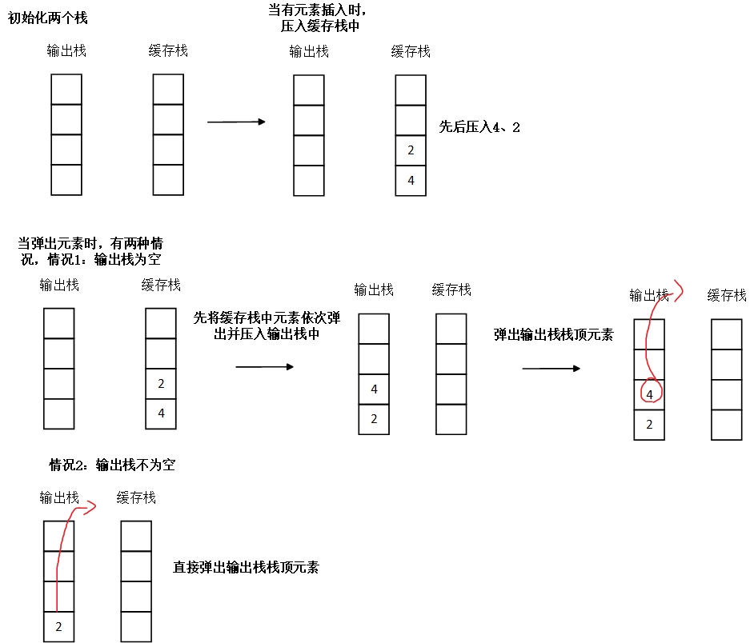

```java
class CQueue {
    //定义两个栈
    private Deque<Integer>  stack1;
    private Deque<Integer>  stack2;
    public CQueue() {
        stack1 = new ArrayDeque<>();
        stack2 = new ArrayDeque<>();
    }
	
    public void appendTail(int value) {
        stack1.offerLast(value);
    }
	
    public int deleteHead() {
        // 
        if(stack1.isEmpty() && stack2.isEmpty()) return -1;
        if(!stack2.isEmpty()) return stack2.pollLast();
        while(!stack1.isEmpty()){
            stack2.offerLast(stack1.pollLast());
        }
        return stack2.pollLast();
    }
}
```


#### 第二剑式：包含min函数的栈

> 题目来源：LeetCode 剑指 Offer 30
>
> 标签：栈

定义栈的数据结构，请在该类型中实现一个能够得到栈的最小元素的 min 函数在该栈中，调用 min、push 及 pop 的时间复杂度都是 O(1)。

**题目解析**：

定义两个栈，一个栈1用来进行存储元素，另一个栈2存储插入当前元素之前的最小值，即栈顶始终是最小值。比如分别插入2,4,1,5，则栈1内容为：[2,4,1,5)`[表示栈底 )表示栈顶`，栈2中的内容为：[2,2,1,1)`[表示栈底 )表示栈顶`。每次插入新元素时，栈1直接压入，栈2需要比较栈顶元素和插入元素，将两者小的元素压入栈。

```java
class MinStack {
    private Deque<Integer> stack;
    private Deque<Integer> min;
    public MinStack() {
        stack = new ArrayDeque<>();
        min = new ArrayDeque<>();
    }
    public void push(int x) {
        stack.offerLast(x);
        if(min.isEmpty()) min.offerLast(x);
        else min.offerLast(Math.min(min.getLast(),x));
    }

    public void pop() {
        stack.pollLast();
        min.pollLast();
    }

    public int top() {
        return stack.getLast();
    }

    public int min() {
        return min.getLast();
    }
}
```


#### 第三剑式：从尾到头打印链表

> 题目来源：LeetCode 剑指 Offer 06

输入一个链表的头节点，从尾到头反过来返回每个节点的值（用数组返回）。

解题思路：

先将链表反转，然后再遍历一次反转后的链表，保存结点的值。==> 顺便练一下反转链表 。

还有种方法是直接用栈，遍历一次链表，然后再将栈中的元素一一弹出，保存在数组中。

> 时间复杂度都是O(n)

```java
//方法1：先反转再遍历
class Solution {
    public int[] reversePrint(ListNode head) {
        ListNode tailList = new ListNode();
        ListNode tmp = head;
        int cnt = 0;
        while(tmp != null){
            tmp = head.next;
            head.next = tailList.next;
            tailList.next = head;
            head = tmp;
            cnt++;
        }
        tmp = tailList.next;
        int[] ans = new int[cnt];
        cnt = 0;
        while(tmp != null){
            ans[cnt] = tmp.val;
            cnt += 1;
            tmp = tmp.next;
        }
        return ans;
    }
}
```


#### 第四剑式：反转链表

> 题目来源：LeetCode 剑指 Offer 24

定义一个函数，输入一个链表的头节点，反转该链表并输出反转后链表的头节点。

题目解析：

会了第三剑式，那第四剑式肯定手到擒来呀。直接一波反转链表提交答案，双100！

```java
/**
 * Definition for singly-linked list.
 * public class ListNode {
 *     int val;
 *     ListNode next;
 *     ListNode(int x) { val = x; }
 * }
 */
class Solution {
    public ListNode reverseList(ListNode head) {
        ListNode ans = new ListNode();
        ListNode tmp = head;
        while(tmp != null){
            tmp = head.next;
            head.next = ans.next;
            ans.next = head;
            head = tmp;
        }
        return ans.next;
    }
}
```


#### 第五剑式：复杂链表的复制

> 题目来源：LeetCode 剑指 Offer 35

请实现 copyRandomList 函数，复制一个复杂链表。在复杂链表中，每个节点除了有一个 next 指针指向下一个节点，还有一个 random 指针指向链表中的任意节点或者 null。


**题目解析**：

因为是深拷贝，我们需要直到原来的链表中的每个结点对应着拷贝后的链表中的哪个结点。因此需要采用哈希表来进行映射。第一次遍历进行哈希表的初始化映射，第二次遍历来更新拷贝后的链表的指针指向。

```java
/*
class Node {
    int val;
    Node next;
    Node random;

    public Node(int val) {
        this.val = val;
        this.next = null;
        this.random = null;
    }
}
*/
class Solution {
    Map<Node,Node> map = new HashMap<Node,Node>();
    public Node copyRandomList(Node head) {
        Node ans = new Node(-1);
        Node ans_tail = ans;
        Node now = head;
        while(now != null){
            Node add = new Node(now.val);
            ans_tail.next = add;
            ans_tail = ans_tail.next;
            map.put(now,add);
            now = now.next;
        }
        Node tmp_now = ans.next;
        now = head;
        while(tmp_now != null){
            tmp_now.random = map.get(now.random);
            tmp_now = tmp_now.next;
            now = now.next;
        }
        return ans.next;
    }
}
```


#### 第六剑式：替换空格

> 题目来源：LeetCode 剑指 Offer 05

请实现一个函数，把字符串 `s` 中的每个空格替换成"%20"。

```
输入：s = "We are happy."
输出："We%20are%20happy."
```

方法一：正序遍历  时间O(n) 空间O(n)

```java
class Solution {
    public String replaceSpace(String s) {
        StringBuilder ans = new StringBuilder(s.length());
        for(int i = 0;i < s.length();i++){
            if(s.charAt(i) != ' '){
                ans.append(s.charAt(i));
            }else{
                ans.append("%20");
            }
        }
        return ans.toString();
    }
}
```

方法二：两次遍历

先正序遍历一遍计算有多少个需要被替换的字符 x ，然后在后面添加 2x 个空格。再来一遍逆序遍历进行填补。

> 此方法适合c++，不适合java

```cpp
class Solution {
public:
    string replaceSpace(string s) {
        int n = s.size();
        int cnt = 0;
        for(char c : s){
            if(c == ' ') cnt ++;
        }
        s.resize(n + 2 * cnt);
        for(int i = n-1,j = s.size() - 1;i >= 0 && j >= 0;i--){
            if(s[i] != ' '){
                s[j] = s[i];
                j --;
            }else{
                s[j] = '0';
                s[j-1] = '2';
                s[j-2] = '%';
                j -= 3;
            }
        }
        return s;
    }
};
```


#### 第七剑式：左旋转字符串

> 题目来源：LeetCode 剑指 Offer 58

字符串的左旋转操作是把字符串前面的若干个字符转移到字符串的尾部。请定义一个函数实现字符串左旋转操作的功能。比如，输入字符串"abcdefg"和数字2，该函数将返回左旋转两位得到的结果"cdefgab"。

```
输入: s = "abcdefg", k = 2
输出: "cdefgab"
```

方法一：采用`StringBuilder + substring()`直接解决。

```java
class Solution {
    public String reverseLeftWords(String s, int n) {
        StringBuilder ans = new StringBuilder();
        ans.append(s.substring(n));
        ans.append(s.substring(0,n));
        return ans.toString();
    }
}
```


#### 第八剑式：在排序数组中查找数字

> 题目来源：LeetCode 剑指 Offer 53-I
>
> 标签：二分查找

统计一个数字在排序数组中出现的次数。

```
输入: nums = [5,7,7,8,8,10], target = 8
输出: 2
```

**题目解析**：

采用看到有序+查找，就想到二分法。采用基本二分法套路找到目标值，然后再向两边扩散查找。

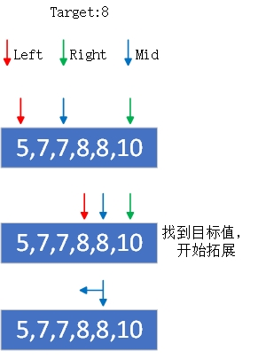

```java
class Solution {
    public int search(int[] nums, int target) {
        int left  = 0,right = nums.length-1;
        int cnt = 0;
        while(left <= right){
            int mid = left + ((right - left) >> 1);
            if(nums[mid] == target){
                cnt += 1;
                int tmp = mid-1;
                while(tmp >= 0 && nums[tmp] == target){
                    cnt += 1;
                    tmp -= 1;
                }
                tmp = mid + 1;
                while(tmp < nums.length && nums[tmp] == target){
                    cnt += 1;
                    tmp += 1;
                }
                return cnt;
            }else if(nums[mid] < target){
                left = mid + 1;
            }else{
                right = mid - 1;
            }
        }
        return 0;
    }
}
```


#### 第九剑式：0～n-1中缺失的数字

> 题目来源：LeetCode 剑指 Offer 53-II
>
> 标签：二分查找

一个长度为n-1的递增排序数组中的所有数字都是唯一的，并且每个数字都在范围0～n-1之内。在范围0～n-1内的n个数字中有且只有一个数字不在该数组中，请找出这个数字。

```
输入: [0,1,2,3,4,5,6,7,9]
输出: 8
```

**题目解析：**

看到`有序+查找`先想下能不能 二分查找 的思路，由题知，在缺失数字之前的所有数字与自己对应的索引相等，即`nums[i] == i`，在缺失数字之后的所有数字与自己对应的索引下标不相等，即`nums[i] != i`。

因此我们可以用二分查找算法找到第一个数字与下标对应不等的位置。以示例为例子：

```
索引:  0 1 2 3 4 5 6 7 8 9
元素: [0,1,2,3,4,5,6,7,9,10]
===> 第一个元素与下标不对应的下标即为答案，即 8
```

**二分查找方法**：

将数组划分为两个区域，左区域的数组与下标相等，右区域的数字与下标不等

当`left <= right`时继续查找`计算mid = (left + right)/2`，如果`nums[mid] == mid`，说明在左区域，使得`left = mid + 1`，如果`nums[mid ] != mid `，说明在右区域，使得`right = mid - 1`。

最终不符合`left <= right`时，left 的值就是结果。

```java
    public int missingNumber(int[] nums) {
        int left = 0,right = nums.length-1;
        while(left <= right){
            int mid = left + ((right - left) >> 1);
            if(nums[mid] == mid){
                left = mid + 1;
            }else{
                right = mid - 1;
            }
        }
        return left;
    }
```


#### 第十剑式：二维数组中的查找

> 题目来源：LeetCode 剑指 Offer 04
>
> 标签：二分查找

在一个 n * m 的二维数组中，每一**行**都按照**从左到右递增**的顺序排序，每一**列**都按照从**上到下递增**的顺序排序。请完成一个高效的函数，输入这样的一个二维数组和一个整数，判断数组中是否含有该整数。

```
示例:
现有矩阵 matrix 如下：
[
  [1,   4,  7, 11, 15],
  [2,   5,  8, 12, 19],
  [3,   6,  9, 16, 22],
  [10, 13, 14, 17, 24],
  [18, 21, 23, 26, 30]
]
```

**题目解析**：

从二维数组的右上角开始查找（因为这样的话就是**向左递减、向下递增**的状态）。

> 为什么要从一边递减、一边递增的点找呢？这样可以把矩阵看成一颗二叉搜索树，一边小于、一边大于，类似二叉搜索树的查找

如果当前元素等于目标值，则返回 `true`。如果当前元素大于目标值，则移到左边一列。如果当前元素小于目标值，则移到下边一行。

```java
class Solution {
    public boolean findNumberIn2DArray(int[][] matrix, int target) {
        if(matrix == null || matrix.length == 0) return false;
        int row = 0,col = matrix[0].length-1; // 起始点左下角
        while(row < matrix.length && col >= 0){
            if(matrix[row][col] == target) return true;
            else if(matrix[row][col] > target) col -= 1;
            else row += 1;
        }
        return  false;
    }
}
```


#### 第十一剑式：旋转数组的最小数字

> 题目来源：LeetCode 剑指 Offer 11

把一个数组最开始的若干个元素搬到数组的末尾，我们称之为数组的旋转。

给你一个**可能存在 重复 元素**值的数组 numbers ，它原来是一个**升序排列**的数组，并按上述情形进行了一次旋转。请返回旋转数组的最小元素。例如，数组 [3,4,5,1,2] 为 [1,2,3,4,5] 的一次旋转，该数组的最小值为 1 

```
输入：numbers = [3,4,5,1,2]
输出：1
```

**题目解析**：

二分 最重要的是找到一个条件能将当前区间划分为两部分，其中一部分全部对于的条件，另外一部分不满足。本题可以看到一个可以划分的点是 最小值左边的元素一定是大于等于它的，如果右边的元素小于最小值，那么当前元素一定在最小值左边，否则当前值可能是最小值或者是最小值右边的点。

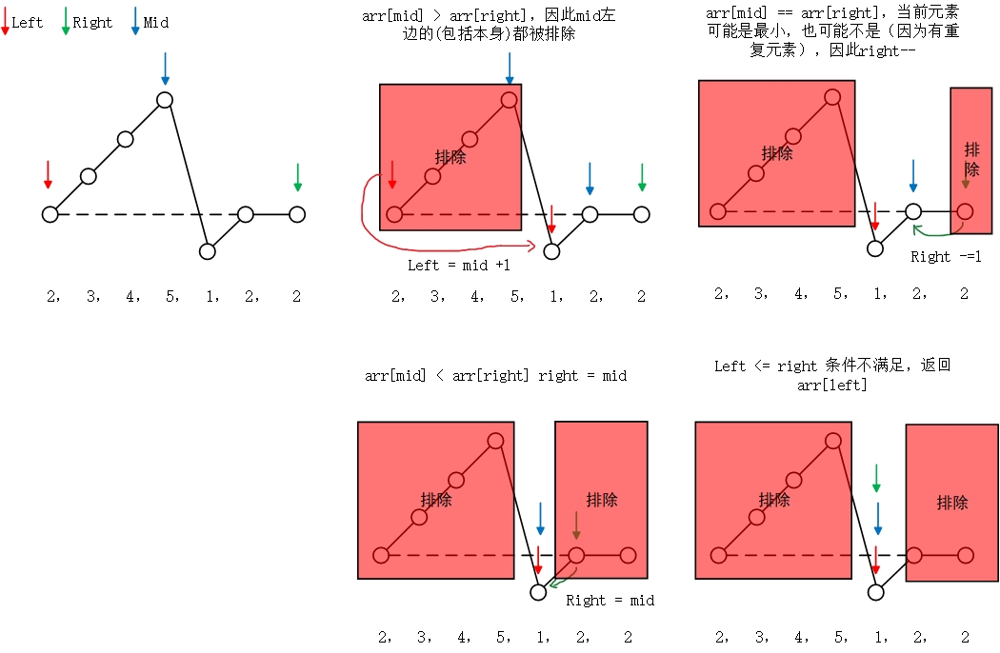

```java
class Solution {
    public int minArray(int[] numbers) {
        int left = 0, right = numbers.length - 1;
        while (left < right){
            int mid = left + ((right - left) >> 1);
            if(numbers[mid] < numbers[right]){
                right = mid;
            }else if(numbers[mid] > numbers[right]){
                left = mid + 1;
            }else{  //应对重复元素
                right -= 1;
            }
        }
        return numbers[left];
    }
}
```

方法二：二段性分析

> **「二分」的本质是二段性，并非单调性。只要一段满足某个性质，另外一段不满足某个性质，就可以用「二分」。**

```java
class Solution {
    public int minArray(int[] nums) {
        int n = nums.length;
        int l = 0, r = n-1;
        while(l < r && nums[0] == nums[r]) r--; // 恢复二段性
        while(l < r){
            int mid = l + ((r - l + 1) >> 1);
            if(nums[mid] >= nums[0]){
                l = mid;
            }else{
                r = mid - 1;
            }
        }
        return r + 1 < n ? nums[r+1] : nums[0];
    }
}
```

**相关题：搜索旋转数组**

搜索旋转数组。给定一个排序后的数组，包含n个整数，但这个数组已被旋转过很多次了，次数不详。请编写代码找出数组中的某个元素，假设数组元素原先是按升序排列的。若有多个相同元素，返回索引值最小的一个。

```
 输入: arr = [15, 16, 19, 20, 25, 1, 3, 4, 5, 7, 10, 14], target = 5
 输出: 8（元素5在该数组中的索引）
```

依然采用二段性分析，我们先找到最低点，然后判断目标点在左边还是右边，再进行一次二分搜索。

```java
class Solution {
    public int search(int[] nums, int target) {
        int n = nums.length;
        int l = 0, r = n-1;
        while(l < r && nums[r] == nums[0]) r--;
        while(l < r){
            int mid = l + ((r - l + 1)>>1);
            if(nums[mid] >= nums[0]){
                l = mid;
            }else{
                r = mid - 1;
            }
        }
        if(r + 1 == n) { // 特判  本身就是升序 比如【1，3】 找 0
            if(target >= nums[0]){
                l = 0;
            }else{
                return -1;
            }
        }else{
          // 最低点是 r + 1
          if(target >= nums[0]){ // 下一步的搜索区间为 [0,r]
              l = 0;
          }else{ // 下一步搜索区间为 [r+1.n-1]
              l = r + 1;
              r = n-1;
          }
        }
        while(l < r){
            int mid = l + ((r - l) >> 1);
            if(nums[mid] >= target){
                r = mid;
            }else{
                l = mid + 1;
            }
        }
        return nums[l] == target ? l : -1;
    }
}
```

相关题目：搜索旋转排序数组II

已知存在一个按非降序排列的整数数组 nums ，数组中的值不必互不相同。

在传递给函数之前，nums 在预先未知的某个下标 k（0 <= k < nums.length）上进行了 旋转 ，使数组变为 [nums[k], nums[k+1], ..., nums[n-1], nums[0], nums[1], ..., nums[k-1]]（下标 从 0 开始 计数）。例如， [0,1,2,4,4,4,5,6,6,7] 在下标 5 处经旋转后可能变为 [4,5,6,6,7,0,1,2,4,4] 。

给你 旋转后 的数组 nums 和一个整数 target ，请你编写一个函数来判断给定的目标值是否存在于数组中。如果 nums 中存在这个目标值 target ，则返回 true ，否则返回 false 。

你必须尽可能减少整个操作步骤。

```
输入：nums = [2,5,6,0,0,1,2], target = 0
输出：true
```

```java
class Solution {
    public boolean search(int[] nums, int target) {
        int n = nums.length;
        if(n == 1) return target == nums[0];
        int l = 0,r = n-1;
        while(l < r && nums[r] == nums[0]) r--; // 如果题目没有说有重复元素，则去掉这一步即可
        while(l < r){
            int mid = l + ((r - l + 1)>>1);
            if(nums[mid] >= nums[0]){
                l = mid;
            }else{
                r = mid - 1;
            }
        }
        if(r + 1 == n) { // 特判  本身就是升序 比如【1，3】 找 0
            if(target >= nums[0]){
                l = 0;
            }else{
                return false;
            }
        }else{
            if(target >= nums[0]){
                l = 0;
            }else{
                l = r + 1;
                r = n - 1;
            }
        }

        while(l < r){
            int mid = l + ((r-l)>>1);
            if(nums[mid] >= target){
                r = mid;
            }else{
                l = mid + 1;
            }
        }
        return nums[l] == target;
    }
}
```


#### 第十二剑式：第一个只出现一次的字符

> 题目来源：LeetCode 剑指 Offer 50

在字符串 s 中找出第一个只出现一次的字符。如果没有，返回一个单空格。 s 只包含小写字母。

```
输入：s = "abaccdeff"
输出：'b'
```

方法一：有序哈希表 + 遍历

```java
class Solution {
    public char firstUniqChar(String s) {
        Map<Character,Integer> map = new LinkedHashMap<>();
        char [] sc = s.toCharArray();
        for(char c : sc){
            map.put(c,map.getOrDefault(c,0) + 1);
        }
     		// 由于哈希表中元素数一定小于等于 s.length() 因此采用有序哈希表
        for(Character c : map.keySet()){
            if(map.get(c) == 1) return c;
        }
        return ' ';
    }
}
```


#### 第十三剑式： 从上到下打印二叉树

> 题目来源：LeetCode 剑指 Offer 32
>
> 标签：层次遍历、队列

从上到下打印出二叉树的每个节点，同一层的节点按照从左到右的顺序打印。

例如:

    给定二叉树: [3,9,20,null,null,15,7],
    	3
       / \
      9  20
        /  \
       15   7
    返回：
    [3,9,20,15,7]
就是一个简单的层次遍历，采用BFS解决！

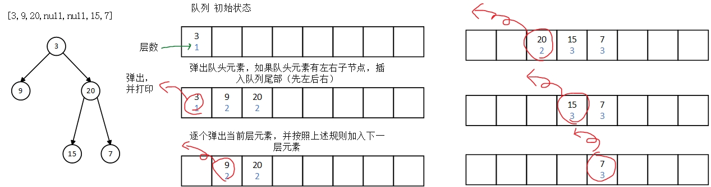

```java
/**
 * Definition for a binary tree node.
 * public class TreeNode {
 *     int val;
 *     TreeNode left;
 *     TreeNode right;
 *     TreeNode(int x) { val = x; }
 * }
 */
class node{
    public int floor;
    public TreeNode treenode;
    public node(){
        this.floor = 0;
        this.treenode = null;
    }
    public node(int floor,TreeNode treenode){
        this.floor = floor;
        this.treenode = treenode;
    }
}
class Solution {
    public int[] levelOrder(TreeNode root) {
        ArrayList<Integer> ans = new ArrayList<>();
        if(root == null) return new int[0];
        int cnt = 0;
        Deque<node> dq = new ArrayDeque<>();
        //初始化队列
        dq.offerLast(new node(0,root));
        while(!dq.isEmpty()){
            int nowfloor = dq.peekFirst().floor;
            while (!dq.isEmpty() && dq.peekFirst().floor == nowfloor){
                node now = dq.pollFirst();
                ans.add(now.treenode.val);
                if(now.treenode.left != null){
                    dq.offerLast(new node(nowfloor+1,now.treenode.left));
                }
                if(now.treenode.right != null){
                    dq.offerLast(new node(nowfloor+1,now.treenode.right));
                }
            }
        }
        return ans.stream().mapToInt(Integer::valueOf).toArray();
    }
}
```

#### 第十四剑式： 从上到下打印二叉树 II

> 题目来源：LeetCode 剑指 Offer 32.II

例如:
给定二叉树: `[3,9,20,null,null,15,7]`,

```
    3
   / \
  9  20
    /  \
   15   7
```

返回其层次遍历结果：

```
[
  [3],
  [9,20],
  [15,7]
]
```

 换汤不换药，只是改变了返回结果的形式，直接上一个代码一改 起飞！

比较懒，方法还是上述方法，不画题解了。。。

```java
class node{
    public int floor;
    public TreeNode treenode;
    public node(){
        this.floor = 0;
        this.treenode = null;
    }
    public node(int floor,TreeNode treenode){
        this.floor = floor;
        this.treenode = treenode;
    }
}
class Solution {
    public List<List<Integer>> levelOrder(TreeNode root) {
        List<List<Integer>> ans = new ArrayList<List<Integer>>();
        if(root == null) return ans;
        Deque<node> dq = new ArrayDeque<>();
        //初始化队列
        dq.offerLast(new node(0,root));
        while(!dq.isEmpty()){
            int nowfloor = dq.peekFirst().floor;
            List<Integer> vals = new ArrayList<>();
            while (!dq.isEmpty() && dq.peekFirst().floor == nowfloor){
                node now = dq.pollFirst();
                vals.add(now.treenode.val);
                if(now.treenode.left != null){
                    dq.offerLast(new node(nowfloor+1,now.treenode.left));
                }
                if(now.treenode.right != null){
                    dq.offerLast(new node(nowfloor+1,now.treenode.right));
                }
            }
            ans.add(vals);
        }
        return ans;
    }
}
```


#### 第十五剑式： 从上到下打印二叉树 III

> 题目来源：LeetCode 剑指 Offer 32.III

请实现一个函数按照之字形顺序打印二叉树，即第一行按照从左到右的顺序打印，第二层按照从右到左的顺序打印，第三行再按照从左到右的顺序打印，其他行以此类推。

例如:
给定二叉树: `[3,9,20,null,null,15,7]`,

```
    3
   / \
  9  20
    /  \
   15   7
```

返回其层次遍历结果：

```
[
  [3],
  [20,9],
  [15,7]
]
```

```java
class node{
    public int floor;
    public TreeNode treenode;
    public node(){
        this.floor = 0;
        this.treenode = null;
    }
    public node(int floor,TreeNode treenode){
        this.floor = floor;
        this.treenode = treenode;
    }
}
class Solution {
    public List<List<Integer>> levelOrder(TreeNode root) {
        List<List<Integer>> ans = new ArrayList<List<Integer>>();
        if(root == null) return ans;
        Deque<node> dq = new ArrayDeque<>();
        //初始化队列
        dq.offerLast(new node(0,root));
        while(!dq.isEmpty()){
            int nowfloor = dq.peekFirst().floor;
            LinkedList<Integer> vals = new LinkedList<>();
            while (!dq.isEmpty() && dq.peekFirst().floor == nowfloor){
                node now = dq.pollFirst();
                //这点不一样咯！~~ 根据奇偶层来判断是从前插入结果还是从后插入结果
                if(nowfloor % 2 == 0){
                    vals.offerLast(now.treenode.val);
                }else{
                    vals.offerFirst(now.treenode.val);
                }
                if(now.treenode.left != null){
                    dq.offerLast(new node(nowfloor+1,now.treenode.left));
                }
                if(now.treenode.right != null){
                    dq.offerLast(new node(nowfloor+1,now.treenode.right));
                }
            }
            ans.add(vals);
        }
        return ans;
    }
}
```


#### 第十六剑式： 树的子结构

> 题目来源：LeetCode 剑指 Offer 26

输入两棵二叉树 A 和 B ，判断 B 是不是 A 的子结构。(约定 空树 不是任意一个树的 子结构 ) B是 A 的子结构， 即 A 中有出现和B相同的结构和节点值。

```
给定的树 A:
     3
    / \
   4   5
  / \
 1   2
给定的树 B：
   4 
  /
 1
返回 true，因为 B 与 A 的一个子树拥有相同的结构和节点值。
```

题目解析：

首先是找到A中有没有和B根节点值相同的结点，有的话就和B一起递归深度遍历树，判断两个树是否一样。

```java
/**
 * Definition for a binary tree node.
 * public class TreeNode {
 *     int val;
 *     TreeNode left;
 *     TreeNode right;
 *     TreeNode(int x) { val = x; }
 * }
 */
class Solution {
    //比较以A和B为根节点的树，B是否是A的子结构
    public boolean check(TreeNode A,TreeNode B){
        if(B == null) return true; //B是null true
        else if(A == null && B != null) return false;//A中结点null，B有值，则false
        else if(A.val != B.val) return false; //两个结点的值不等 false
        else return check(A.left,B.left) && check(A.right,B.right); //继续递归比较
    }
    //找A中与B根节点相同的子结点
    public boolean dfs(TreeNode A,TreeNode B){
        //如果A是空，说明找到了底层没找到，返回false
        if(A == null) return false;
       	//如果找到了，开始比较B是否是A中的一个子树，是的话返回错误，不是的话则继续在A中找与B根节点相同的结点
        if(A.val == B.val && check(A,B)) {
            return true;
        }//继续递归A的左右子节点寻找与B根节点相同的结点
        else return dfs(A.left,B) || dfs(A.right,B);
    }
    public boolean isSubStructure(TreeNode A, TreeNode B) {
        //根据题目要求，空树不是任意一个树的子结构，因此可以作为特殊情况直接判断
        if (A == null || B == null) return false;
        //深度优先搜索找A中与B根节点相同的子结点
        return dfs(A,B);
    }
}
```

简化版：

```java
class Solution {
    private boolean recurv(TreeNode A, TreeNode B){
        if(B == null) return true;
        if(A == null) return false;
        return A.val == B.val && recurv(A.left,B.left) && recurv(A.right,B.right);
    }
    public boolean isSubStructure(TreeNode A, TreeNode B) {
        return (A != null && B != null && (recurv(A,B) || isSubStructure(A.left,B) || isSubStructure(A.right,B)));
    }
}
```


#### 第十七剑式： 二叉树的镜像

> 题目来源：LeetCode 剑指 Offer 27

请完成一个函数，输入一个二叉树，该函数输出它的镜像。

```
例如输入：
     4
   /   \
  2     7
 / \   / \
1   3 6   9
镜像输出：
     4
   /   \
  7     2
 / \   / \
9   6 3   1
输入：root = [4,2,7,1,3,6,9]
输出：[4,7,2,9,6,3,1]
```

```java
/**
 * Definition for a binary tree node.
 * public class TreeNode {
 *     int val;
 *     TreeNode left;
 *     TreeNode right;
 *     TreeNode(int x) { val = x; }
 * }
 */
class Solution {
    public TreeNode mirrorTree(TreeNode root) {
        if(root == null) return null;
        TreeNode t = root.left;
        root.left = root.right;
        root.right = t;
        mirrorTree(root.left);
        mirrorTree(root.right);
        return root;
    }
}

// 另外一种写法
/**
 * Definition for a binary tree node.
 * public class TreeNode {
 *     int val;
 *     TreeNode left;
 *     TreeNode right;
 *     TreeNode(int x) { val = x; }
 * }
 */
class Solution {
    public TreeNode mirrorTree(TreeNode root) {
        if(root == null) return null;
        TreeNode leftnode = mirrorTree(root.left);
        TreeNode rightnode = mirrorTree(root.right);
        root.left = rightnode;
        root.right = leftnode;
        return root;
    }
}
```

#### 第十八剑式：对称的二叉树

> 题目来源：LeetCode 剑指 Offer 28
>
> 标签：深度优先搜索、树的遍历

请实现一个函数，用来判断一棵二叉树是不是对称的。如果一棵二叉树和它的镜像一样，那么它是对称的。

```
例如，二叉树 [1,2,2,3,4,4,3] 是对称的。
    1
   / \
  2   2
 / \ / \
3  4 4  3
但是下面这个 [1,2,2,null,3,null,3] 则不是镜像对称的:
    1
   / \
  2   2
   \   \
   3    3
```

**题目解析**：

其实就是对照着示例给的这个就可以理解：比如当前是结点1，将左子结点2和右子结点对比，然后递归将(1)的左子结点(2)的左子结点(3)和(1)的右子结点(2)的右子节点(3)对比，将(1)的左子结点(2)的右子结点(4)和(1)的右子结点(2)的左子节点(4)对比

```java
/**
 * Definition for a binary tree node.
 * public class TreeNode {
 *     int val;
 *     TreeNode left;
 *     TreeNode right;
 *     TreeNode(int x) { val = x; }
 * }
 */
class Solution {
    public boolean dfs(TreeNode A,TreeNode B){
        if(A == null && B == null) return true; //两个都是空结点，返回true
        else if ((A == null && B != null) || (A != null && B == null)) return false; //一个空，另外一个不空，返回false
        return (A.val == B.val)  && dfs(A.left,B.right) && dfs(A.right,B.left); // 如果A，B两个结点值相同，比较A的左和B的右，A的右和B的左 同时满足的话返回true
    }
    public boolean isSymmetric(TreeNode root) {
        if(root == null) return true;
        return dfs(root.left,root.right);  //递归比较
    }
}
```


#### 第十九剑式：连续子数组的最大和

> 题目来源：LeetCode 剑指 Offer 42
>
> 标签：动态规划

输入一个整型数组，数组中的一个或连续多个整数组成一个子数组。求所有子数组的和的最大值。

要求**时间复杂度为O(n)**。

```
输入: nums = [-2,1,-3,4,-1,2,1,-5,4]
输出: 6
解释: 连续子数组 [4,-1,2,1] 的和最大，为 6。
```

**题目解析**：

定义一个dp[]，并规定dp[i]表示以 nums[i]结尾的子数组的最大和是多少。

因此，对于dp[i]，其值取决于dp[i-1]，如果`dp[i-1] + nums[i]`(即，以nums[i-1]结尾的最大和再加上当前值) 小于 `nums[i]`，那么肯定就舍去前面的`dp[i-1]`(以nums[i-1]结尾的那串连续子数组)，将`nums[i]`作为新的连续子数组的头。因此就可以推导出状态转移方程：`dp[i] = Math.max(dp[i-1]+nums[i],nums[i])`

```java
class Solution {
    public int maxSubArray(int[] nums) {
        int n = nums.length;
        int[] dp = new int[n];
        dp[0] = nums[0];
        int ans = nums[0];
        for(int i = 1;i < n;i++){
            dp[i] = Math.max(dp[i-1] + nums[i],nums[i]);
            ans = Math.max(ans,dp[i]);
        }
        return ans;
    }
}
```

#### 第二十剑式：礼物的最大价值

> 题目来源：LeetCode 剑指 Offer 47
>
> 标签：动态规划

在一个 m*n 的棋盘的每一格都放有一个礼物，每个礼物都有一定的价值（价值大于 0）。你可以从棋盘的左上角开始拿格子里的礼物，并每次向右或者向下移动一格、直到到达棋盘的右下角。给定一个棋盘及其上面的礼物的价值，请计算你最多能拿到多少价值的礼物？

```
输入: 
[
  [1,3,1],
  [1,5,1],
  [4,2,1]
]
输出: 12
解释: 路径 1→3→5→2→1 可以拿到最多价值的礼物
```

**题目解析**：

就是一个简单的动态规划问题，对于除了第一行和第一列，每个点的状态都可以由左边的点和上边的点转移过来，为了拿到最大价值的礼物，当然是选择上一个状态价值高的点来状态转移。

```java
class Solution {
    public int maxValue(int[][] grid) {
        if(grid == null) return 0;
        int m = grid.length;
        int n = grid[0].length;
        int[][] dp = new int[m][n];
        dp[0][0] = grid[0][0];
        for(int i = 1;i < m;i++){
            dp[i][0] = dp[i-1][0] + grid[i][0];
        }
        for(int i = 1;i < n;i++){
            dp[0][i] = dp[0][i-1] + grid[0][i];
        }
        for(int i = 1;i < m;i++){
            for (int j = 1; j < n;j++){
                dp[i][j] = Math.max(dp[i-1][j],dp[i][j-1]) + grid[i][j];
            }
        }
        return dp[m-1][n-1];
    }
}
```


#### 第二十一剑式：把数字翻译成字符串

> 题目来源：LeetCode 剑指 Offer 46
>
> 标签：动态规划

给定一个数字，我们按照如下规则把它翻译为字符串：0 翻译成 “a” ，1 翻译成 “b”，……，11 翻译成 “l”，……，25 翻译成 “z”。一个数字可能有多个翻译。请编程实现一个函数，用来计算一个数字有多少种不同的翻译方法。

```
输入: 12258
输出: 5
解释: 12258有5种不同的翻译，分别是"bccfi", "bwfi", "bczi", "mcfi"和"mzi"
```

**题目解析**：

我们定义`dp[i]`表示以下标`i`结束的字符串其最多有多少种不同的方案，对于以下标为`i`的字符，其可以单独作为一个字符和前面的字符串连接，获得`dp[i-1]`种方案，同样，它还能和前面一个字符结合称为一个值在`[10,25]`的字符，获得`dp[i-2]`种方案。因此对于`dp[i]`的状态，可以由`dp[i-1]和dp[i-2]`来转移。

```java
class Solution {
    public int translateNum(int num) {
        String str = Integer.toString(num);
        int n = str.length();
        int [] dp = new int[n+1];
        dp[0] = 1;
        dp[1] = 1;
        for(int i = 2;i <= n;i++){
            dp[i] = dp[i-1];
            int pre = str.charAt(i-2) - '0';
            int now = str.charAt(i-1) - '0';
            if(pre != 0 && pre * 10 + now <= 25){
                dp[i] += dp[i-2];
            }
        }
        return dp[n];
    }
}
```

空间优化：

```java
class Solution {
    public int translateNum(int num) {
        String str = Integer.toString(num);
        int n = str.length();
        int [] dp = new int[n+1];
        int dp0 = 1;
        int dp1 = 1;
        for(int i = 2;i <= n;i++){
            int t = dp1;
            int pre = str.charAt(i-2) - '0';
            int now = str.charAt(i-1) - '0';
            if(pre != 0 && pre * 10 + now <= 25){
                t += dp0;
            }
            dp0 = dp1;
            dp1 = t;
        }
        return dp1;
    }
}
```


#### 第二十二剑式：最长不含重复字符的子字符串

> 题目来源：LeetCode 剑指 Offer 48
>
> 标签：动态规划

请从字符串中找出一个最长的不包含重复字符的 子字符串 ，计算该最长子字符串的长度。

```
输入: "pwwkew"
输出: 3
解释: 因为无重复字符的最长子串是 "wke"，所以其长度为 3
```

**题目解析**：

方法1:动态规划。时间复杂度O(n) 空间复杂度O(k)

状态定义： 设动态规划列表 dp[j] 代表以字符 s[j] 为结尾的 “最长不重复子字符串” 的长度。

转移方程： 固定右边界 j，设字符 s[j] 左边距离最近的相同字符为 s[i]。

1. 当 `i < 0 `，即 s[j] 左边无相同字符，则` dp[j] = dp[j-1] + 1`
2. 当 `dp[j - 1] < j - i`，说明字符 s[i] 在子字符串` dp[j−1] `区间之外 ，则 `dp[j]=dp[j−1]+1` 
3. 当 `dp[j−1]≥j−i` ，说明字符 s[i] 在子字符串 `dp[j−1] `区间之中 ，则` dp[j] `的左边界由` s[i] `决定，即` dp[j]=j−i`

> 当` i<0 `时，由于 `dp[j−1]≤j `恒成立，因而 `dp[j−1]<j−i `恒成立，因此分支 1. 和 2. 可被合并。

- **哈希表统计：** 遍历字符串 s 时，使用哈希表统计 **各字符最后一次出现的索引位置** 。

```java
class Solution {
    //动态规划
    public int lengthOfLongestSubstring(String s) {
        int n = s.length();
        if(n == 0) return 0;
        Map<Character,Integer> m = new HashMap<>();
        int [] dp = new int[n];
        dp[0] = 1;
        m.put(s.charAt(0),0);
        int maxLen = 1;
        for(int i = 1;i < n;i++) {
            int lastIndex = m.get(s.charAt(i)) == null ? -1 : m.get(s.charAt(i));
            if(dp[i-1] >= i - lastIndex){ //上一个当前元素在dp[i-1]范围内
                dp[i] = i - lastIndex;
            }else{ //上一个当前元素不在dp[i-1]范围内 包含 lastIndex == -1
                dp[i] = dp[i-1] + 1;
            }
            maxLen = Math.max(maxLen,dp[i]);
            m.put(s.charAt(i),i);
        }
        return maxLen;
    }
}
```

**双指针**：时间复杂度O(n) 空间复杂度O(1)

哈希表 dic 统计： 指针 j 遍历字符 s ，哈希表统计字符 s[j] 最后一次出现的索引 。

更新左指针 i ： 根据上轮左指针 i 和 dic[s[j]] ，每轮更新左边界 i ，保证区间`[i+1,j] `内无重复字符且最大。
`i=max(dic[s[j]],i)`

更新结果 res ： 取上轮 res 和本轮双指针区间 `[i+1,j]` 的宽度（即 j−i ）中的最大值。`res=max(res,j−i)`

```java
class Solution {
    public int lengthOfLongestSubstring(String s) {
        int n = s.length();
        if (n == 0) return 0;
        Map<Character,Integer> m = new HashMap<>();
        int maxLen = 1;
        int left = -1,right = 0;
        while(right < n){
            if(m.get(s.charAt(right)) != null){
                left = Math.max(left,m.get(s.charAt(right)));//注意是 取两者较大值
            }
            m.put(s.charAt(right),right);
            maxLen = Math.max(maxLen,right-left);
            
            right += 1;
        }
        return maxLen;
    }
}
```


#### 第二十三剑式：删除链表的结点

> 题目来源：LeetCode 剑指 Offer 18
>
> 标签：链表

给定单向链表的头指针和一个要删除的节点的值，定义一个函数删除该节点。

返回删除后的链表的头节点。

```
输入: head = [4,5,1,9], val = 5
输出: [4,1,9]
解释: 给定你链表中值为 5 的第二个节点，那么在调用了你的函数之后，该链表应变为 4 -> 1 -> 9.
```

题目解析：

很容易的一道链表题，直接ko

```java
class Solution {
    public ListNode deleteNode(ListNode head, int val) {
        if(head == null) return null;
        ListNode pre = null;
        ListNode now = head;
        if(head.val == val) return head.next;
        while(now != null){
            if(now.val == val){
                pre.next = now.next;
            }
            pre = now;
            now = now.next;
        }
        return head;
    }
}
```


#### 第二十四剑式：链表中倒数第K个结点

> 题目来源：LeetCode 剑指 Offer 22
>
> 标签：链表、前后指针

输入一个链表，输出该链表中倒数第k个节点。

**题目解析**：

也是比较容易的链表题，采用倒退的想法，开始时一个标记指向尾结点的下一个null，另外一个指向倒数第k个结点，然后让这两个结点一次向前遍历，当原本指向倒数第k个结点的标记指向了头节点（此时可以理解为一个初始状态），而另外一个指向的正数的第k个结点，那么我们再正向来想，开始的状态就是上述的初始状态，那么逐个向后遍历，就可以在初始状态指向正数第k个结点的指针指向尾部null时，原本指向头结点的指针就指向了倒数第k个结点。

```java
class Solution {
    public ListNode getKthFromEnd(ListNode head, int k) {
        int cnt = 1;
        ListNode now = head;
        ListNode ans = head;
        while(cnt <= k){
            ans = ans.next;
            cnt += 1;
        }
        while(ans != null){
            ans = ans.next;
            now = now.next;
        }
        return now;
    }
}
```


#### 第二十五剑式：合并链表

> 题目来源：LeetCode 剑指 Offer 25
>
> 标签：链表

输入两个递增排序的链表，合并这两个链表并使新链表中的节点仍然是递增排序的。

```java
/**
 * Definition for singly-linked list.
 * public class ListNode {
 *     int val;
 *     ListNode next;
 *     ListNode(int x) { val = x; }
 * }
 */
class Solution {
    public ListNode mergeTwoLists(ListNode l1, ListNode l2) {
        //把 second 加 first 上面
        if(l1 == null && l2 == null) return null;
        else if(l1 == null && l2 != null) return l2;
        else if(l1 != null && l2 == null) return l1;
        ListNode first = l1;
        ListNode second = l2;
        //第一个值小的作为first
        if(l1.val > l2.val ){
            first = l2;
            second = l1;
        }
        ListNode root = first;
        ListNode t1 = null,t2 = null;
        while(first.next != null && second != null){
            t2 = second.next;
            if(first.next.val < second.val){
                first = first.next;
                continue;
            }else{
                second.next = first.next;
                first.next = second;
            }
            second = t2;
            first = first.next;
        }
        if(second != null){
            first.next = second;
        }
        return root;
    }
}
```

#### 第二十六剑式：两个链表的第一个公共结点

> 题目来源：LeetCode 剑指 Offer 52
>
> 标签：链表、集合

输入两个链表，找出它们的第一个公共节点。

哈希表：

```java
public class Solution {
    public ListNode getIntersectionNode(ListNode headA, ListNode headB) {
        Set<ListNode> s = new HashSet<>();
        while(headA != null){
            s.add(headA);
            headA = headA.next;
        }
        while(headB != null){
            if(s.contains(headB)) return headB;
            headB = headB.next;
        }
        return null;
    }
}
```

**双指针**：

只有当链表 headA 和 headB 都不为空时，两个链表才可能相交。因此首先判断链表 headA 和 headB 是否为空，如果其中至少有一个链表为空，则两个链表一定不相交，返回 null。

当链表 headA 和 headB 都不为空时，创建两个指针 pA 和 pB，初始时分别指向两个链表的头节点 headA 和 headB，然后将两个指针依次遍历两个链表的每个节点。具体做法如下：

每步操作需要同时更新指针 pA 和 pB。

- 如果指针 pA 不为空，则将指针 pA 移到下一个节点；如果指针 pB 不为空，则将指针 pB 移到下一个节点
- 如果指针 pA 为空，则将指针 pA 移到链表 headB 的头节点；如果指针 pB 为空，则将指针  pB 移到链表 headA 的头节点。
- 当指针 pA 和  pB 指向同一个节点或者都为空时，返回它们指向的节点或者  null。

```java
public class Solution {
    public ListNode getIntersectionNode(ListNode headA, ListNode headB) {
        if (headA == null || headB == null) {
            return null;
        }
        ListNode pA = headA, pB = headB;
        while (pA != pB) {
            pA = pA == null ? headB : pA.next;
            pB = pB == null ? headA : pB.next;
        }
        return pA;
    }
}
```


#### 第二十七剑式：调整数组顺序使奇数位于偶数前面

> 题目来源：LeetCode 剑指 Offer 21
>
> 标签：双指针

输入一个整数数组，实现一个函数来调整该数组中数字的顺序，使得所有奇数在数组的前半部分，所有偶数在数组的后半部分。

**题目解析**：

维护两个奇、偶指针，分别从前和从后开始，然后寻找对于不符合条件的数，然后交换位置。

> 像极了 快排中的一部分

```java
class Solution {
    public int[] exchange(int[] nums) {
        int left = 0,right = nums.length - 1;
        while(left < right){
          	// 遇到偶数停止
            while(left < right && nums[left] % 2 == 1){
                left += 1;
            }
          // 遇到奇数停止
            while(left < right && nums[right] % 2 == 0){
                right -= 1;
            }
          // 交换
          	if(left < right){
              int tmp = nums[left];
              nums[left] = nums[right];
              nums[right] =tmp;
              left ++;
              right --;
            }
        }
        return nums;
    }
}
```


#### 第二十八剑式：和为s的两个数字

> 题目来源：LeetCode 剑指 Offer 

输入一个递增排序的数组和一个数字s，在数组中查找两个数，使得它们的和正好是s。如果有多对数字的和等于s，则输出任意一对即可

```java
class Solution {
    public int[] twoSum(int[] nums, int target) {
        int left = 0,right = nums.length-1;
        while(left < right){
            if(nums[left] + nums[right] == target){
                return new int[]{nums[left],nums[right]};
            }else if(nums[left] + nums[right] < target){
                left += 1;
            }else{
                right -= 1;
            }
        }
        return null;
    }
}
```


#### 第二十九剑式：翻转单词顺序

> 题目来源：LeetCode 剑指 Offer 58

输入一个英文句子，翻转句子中单词的顺序，但单词内字符的顺序不变。为简单起见，标点符号和普通字母一样处理。例如输入字符串"I am a student. "，则输出"student. a am I"

```
输入: "the sky is blue"
输出: "blue is sky the"
```

题目解析：

先翻转每个单词，再将整个句子翻转  - -时间复杂度有点高呀~

```java
class Solution {
    public String reverse(String word){
        StringBuilder sb = new StringBuilder(word.length());
        for (int i = word.length()-1;i >= 0;i--){
            sb.append(word.charAt(i));
        }
        return sb.toString();
    }
    public String reverseWords(String s) {
        String[] words = s.split(" ");
        String tmp = "";
        int cnt = 0;
        for(int i = 0;i < words.length;i++){
            if(words[i].equals("")) continue;
            if (cnt == 0){
                tmp += reverse(words[i]);
            }else{
                tmp += " " + reverse(words[i]);
            }
            cnt += 1;
        }
        return reverse(tmp);
    }
}
```

直接到序输出呀，人傻了

```java
class Solution {
    public String reverseWords(String s) {
        String[] strs = s.trim().split(" "); // 删除首尾空格，分割字符串
        StringBuilder res = new StringBuilder();
        for(int i = strs.length - 1; i >= 0; i--) { // 倒序遍历单词列表
            if(strs[i].equals("")) continue; // 遇到空单词则跳过
            res.append(strs[i] + " "); // 将单词拼接至 StringBuilder
        }
        return res.toString().trim(); // 转化为字符串，删除尾部空格，并返回
    }
}
```


#### 第三十剑式：矩阵中的路径

> 题目来源：LeetCode 剑指 Offer  12

给定一个 m x n 二维字符网格 board 和一个字符串单词 word 。如果 word 存在于网格中，返回 true ；否则，返回 false 。

单词必须按照字母顺序，通过相邻的单元格内的字母构成，其中“相邻”单元格是那些水平相邻或垂直相邻的单元格。同一个单元格内的字母不允许被重复使用。


```
输入：board = [["A","B","C","E"],["S","F","C","S"],["A","D","E","E"]], word = "ABCCED"
输出：true
```

题目解析：

比较简单的深搜问题

```java
class Solution {
    boolean [][] used;
    int [][] dirs = new int[][]{{-1,0},{1,0},{0,1},{0,-1}};
    int m,n;
    public boolean dfs(char [][] board,String word,int idx,int x,int y){
        if(idx == word.length()){
            return true;
        }
        used[x][y] = true;
        for(int i = 0;i < 4;i++){
            int nx = x + dirs[i][0];
            int ny = y + dirs[i][1];
            if(nx >= m || nx < 0 || ny >= n || ny < 0 || used[nx][ny] == true) continue;
            if(board[nx][ny] != word.charAt(idx)) continue;
            if (dfs(board,word,idx+1,nx,ny)) return true;
        }
        used[x][y] = false;
        return false;
    }
    public boolean exist(char[][] board, String word) {
        if(board == null) return false;
        m = board.length;
        n = board[0].length;
        used = new boolean[m][n];
        for(int i = 0; i < m;i++){
            for(int j = 0;j < n;j++){
                if(board[i][j] == word.charAt(0)){
                    used[i][j] = true;
                    if(dfs(board,word,1,i,j)) return true;
                    used[i][j] = false;
                }
            }
        }
        return false;
    }
}
```


#### 第三十一剑式：机器人的运动范围

> 题目来源：LeetCode 剑指 Offer  13

地上有一个m行n列的方格，从坐标 [0,0] 到坐标 [m-1,n-1] 。一个机器人从坐标 [0, 0] 的格子开始移动，它每次可以向左、右、上、下移动一格（不能移动到方格外），也不能进入行坐标和列坐标的数位之和大于k的格子。例如，当k为18时，机器人能够进入方格 [35, 37] ，因为3+5+3+7=18。但它不能进入方格 [35, 38]，因为3+5+3+8=19。请问该机器人能够到达多少个格子？

```
输入：m = 2, n = 3, k = 1
输出：3
```

题目解析：

比较简单的搜索遍历问题，小优化：只需要从[0,0]开始向下和向右搜索。

```java
class node{
    public int x;
    public int y;
    node(int x,int y){
        this.x = x;
        this.y = y;
    }
}
class Solution {
    
    int[][] dirs = new int[][]{{0,1},{1,0}};

    public int getSum(int x,int y){
        int sum = 0;
        while (x != 0){
            sum += (x % 10);
            x /= 10;
        }
        while (y != 0){
            sum += (y % 10);
            y /= 10;
        }
        return sum;
    }

    public int movingCount(int m, int n, int k) {
        boolean[][] used = new boolean[m][n];
        Deque<node> dq = new ArrayDeque<>();
        dq.offerLast(new node(0,0));
        used[0][0] = true;
        int cnt = 1;
        while (!dq.isEmpty()){
            node nowNode = dq.pollFirst();
            for(int i = 0; i < 2;i++){
                int nx = nowNode.x + dirs[i][0];
                int ny = nowNode.y + dirs[i][1];
                if(nx >= m || ny >= n || used[nx][ny] == true) continue;
                if(getSum(nx,ny) <= k){
                    used[nx][ny] = true;
                    dq.offerLast(new node(nx,ny));
                    cnt += 1;
                }
            }
        }
        return cnt;

    }
}
```


#### 第三十二剑式：二叉树中和为某一值的路径

> 题目来源：LeetCode 剑指 Offer  34

给你二叉树的根节点 root 和一个整数目标和 targetSum ，找出所有 从根节点到叶子节点 路径总和等于给定目标和的路径。

叶子节点 是指没有子节点的节点。


```
输入：root = [5,4,8,11,null,13,4,7,2,null,null,5,1], targetSum = 22
输出：[[5,4,11,2],[5,8,4,5]]
```

**题目解析**：

一个简单的树的深度优先搜索问题

```java
/**
 * Definition for a binary tree node.
 * public class TreeNode {
 *     int val;
 *     TreeNode left;
 *     TreeNode right;
 *     TreeNode() {}
 *     TreeNode(int val) { this.val = val; }
 *     TreeNode(int val, TreeNode left, TreeNode right) {
 *         this.val = val;
 *         this.left = left;
 *         this.right = right;
 *     }
 * }
 */
class Solution {
    List<List<Integer>> ans = new ArrayList<List<Integer>>();
    List<Integer> path = new ArrayList<>();
  
    public void dfs(TreeNode node,int val,int target){
        if(node == null){
            return ;
        }
        if(node.left == null && node.right == null && val + node.val == target){
            path.add(node.val);
            ans.add(new LinkedList<>(path));
            path.remove(path.size() - 1);
            return ;
        }
        path.add(node.val);
        dfs(node.left,val+ node.val,target);
        dfs(node.right,val+ node.val,target);
        path.remove(path.size()-1);
    }
  
    public List<List<Integer>> pathSum(TreeNode root, int target) {
        if (root == null) return ans;
        dfs(root,0,target);
        return ans;
    }
}
```

相关题目：求和路径

给定一棵二叉树，其中每个节点都含有一个整数数值(该值或正或负)。设计一个算法，打印节点数值总和等于某个给定值的所有路径的数量。注意，路径不一定非得从二叉树的根节点或叶节点开始或结束，但是其方向必须向下(只能从父节点指向子节点方向)。

示例:
给定如下二叉树，以及目标和 sum = 22

              5
             / \
            4   8
           /   / \
          11  13  4
         /  \    / \
        7    2  5   1
返回:   3
解释：和为 22 的路径有：[5,4,11,2], [5,8,4,5], [4,11,7]


#### 第三十三剑式：二叉搜索树的第k大结点

> 题目来源：LeetCode 剑指 Offer  54

给定一棵 二叉搜索树 BST，请找出其中第 `k` 大的节点的值。

**题目解析**：

一个中序遍历搞定！

```java
class Solution {
    List<Integer> ans = new ArrayList<>();
    public void dfs(TreeNode root){
        if(root == null) return;
        dfs(root.left);
        ans.add(root.val);
        dfs(root.right);
    }
    public int kthLargest(TreeNode root, int k) {
        dfs(root);
        return ans.get(ans.size() - k);
    }
}
```


#### 第三十四剑式：二叉搜索树与双向链表

> 题目来源：LeetCode 剑指 Offer  36

输入一棵二叉搜索树，将该二叉搜索树转换成一个排序的循环双向链表。要求不能创建任何新的节点，只能调整树中节点指针的指向。

为了更好地理解问题，以下面的二叉搜索树为例:


将这个二叉搜索树转化为双向循环链表。链表中的每个节点都有一个前驱和后继指针。对于双向循环链表，第一个节点的前驱是最后一个节点，最后一个节点的后继是第一个节点。

下图展示了上面的二叉搜索树转化成的链表。“head” 表示指向链表中有最小元素的节点。


题目解析：

这题还是需要一点技巧的，我们想要修改一个结点的后继指针(即right)，我们可以标记一个pre指针指向前一个结点，利用`pre.right = now`来修改结点的后继指针，通过`now.left = pre`来修改当前结点的前驱指针。对于二叉搜索树，如果需要结果是递增有序，则就联系到了`中序遍历`。

因此，本题目采用中序遍历来遍历树，然后在操作区间修改结点的前驱指针和后继指针。

注意：

- 在修改前驱指针和后继指针时，如果当`pre == null`时，说明当前结点是第一个结点（即树的最左端的结点，双向循环链表的第一个结点）此时修改`head = now`；如果当`pre != null`，修改`pre.right = now`。同时注意修改当前结点的前驱指针`node.left = pre`，更新pre指针为`pre = now`。

```java
class Solution {
    Node head = null;
    Node pre = null;
    public void dfs(Node node){
        if(node == null) return;
        dfs(node.left); //递归左子树
        /*前驱指针、后继指针处理部分*/
        if(pre == null){
            head = node; //说明当前结点是头节点
        }else{
            pre.right = node; //修改前驱结点的后继指针
        }
        node.left = pre; //修改当前结点的前驱指针
        pre = node; //更新pre为当前结点
        dfs(node.right); //递归处理右子树
    }
    public Node treeToDoublyList(Node root) {
        if(root == null) return null; //特殊情况，特殊处理
        dfs(root); //遍历 此时pre指向的是尾部结点
        /*修改头节点和尾结点的指针*/
        head.left = pre; 
        pre.right = head;
        return head;
    }
}
```

```go
// nc go版本
package main
import . "nc_tools"
/*
 * type TreeNode struct {
 *   Val int
 *   Left *TreeNode
 *   Right *TreeNode
 * }
 */

/**
 * 
 * @param pRootOfTree TreeNode类 
 * @return TreeNode类
*/

var preRoot * TreeNode

func Convert( root *TreeNode ) *TreeNode {
    if root == nil{
        return nil
    }
    p := root
    for p.Left != nil{
        p = p.Left
    }
    dfs(root)
    return p
}

func dfs(root * TreeNode){
    if root == nil{
        return 
    }
    dfs(root.Left)
    root.Left = preRoot
    if preRoot != nil{
        preRoot.Right = root
    }
    preRoot = root
    dfs(root.Right)
}
```


#### 第三十五剑式：把数组排成最小的数

> 题目来源：LeetCode 剑指 Offer  45

输入一个非负整数数组，把数组里所有数字拼接起来排成一个数，打印能拼接出的所有数字中最小的一个。

```
输入: [3,30,34,5,9]
输出: "3033459"
```

**题目解析**：

此题求拼接起来的最小数字，本质上是一个排序问题。设数组nums 中任意两数字的字符串为 x 和 y ，则规定 排序判断规则 为：

- 若拼接字符串 `x + y > y + x `，则 x “大于” y ；
- 反之，若` x + y < y + x `，则 x “小于” y ；

> x “小于” y 代表：排序完成后，数组中 x 应在 y 左边；“大于” 则反之。

```java
class Solution {
    public String minNumber(int[] nums) {
        String [] strs = new String[nums.length];
        for(int i = 0; i < strs.length;i++){
            strs[i] = String.valueOf(nums[i]);
        }
        //自定义排序
        Arrays.sort(strs,(x,y)->((x+y).compareTo(y+x)));
        StringBuilder sb = new StringBuilder(strs.length);
        for (int i = 0;i < strs.length;i++){
            sb.append(strs[i]);
        }
        return sb.toString();
    }
}
```


#### 第三十六剑式：扑克牌中的顺子

> 题目来源：LeetCode 剑指 Offer  61

从若干副扑克牌中随机抽 5 张牌，判断是不是一个顺子，即这5张牌是不是连续的。2～10为数字本身，A为1，J为11，Q为12，K为13，而大、小王为 0 ，可以看成任意数字。A 不能视为 14。

```
输入: [0,0,1,2,5]
输出: True
```

**题目解析**：

先排序，然后遍历，遇到大小王更新一下大小王个数`bigCnt`，遇到非大小王时，判断当前值和前一个值`last`的关系：

- 如果前一个值是大小王，则更新`last`并`continue`
- 如果前一个值不是大小王
  - 如果当前值等于 last + 1，更新`last`并`continue`
  - 如果当前值等于 last，直接返回`false`
  - 如果当前值 - last - 1 > bigCnt，说明缺省的数字个数大于当前的大小王数，返回`false`
  - 否则就是当前值和last中间的值用大小王来弥补，即更新`bigCnt -=nums[i] - last - 1;`

```java
class Solution {
    public boolean isStraight(int[] nums) {
        Arrays.sort(nums);
        int bigCnt = 0;
        int last = 0;
        for(int i = 0; i < 5;i++){
            if(nums[i] == 0){
                bigCnt += 1;
            }
            if (last == 0 || nums[i] - last == 1){
                last = nums[i];
                continue;
            }
            if(nums[i] == last || nums[i] - last - 1 > bigCnt){
                return false;
            }
            bigCnt -= nums[i] - last - 1;
            last = nums[i];
        }
        return true;
    }
}
```


#### 第三十七剑式：数据流中的中位数

> 题目来源：LeetCode 剑指 Offer  41

如何得到一个数据流中的中位数？如果从数据流中读出奇数个数值，那么中位数就是所有数值排序之后位于中间的数值。如果从数据流中读出偶数个数值，那么中位数就是所有数值排序之后中间两个数的平均值。

例如：

[2,3,4] 的中位数是 3

[2,3] 的中位数是 (2 + 3) / 2 = 2.5

设计一个支持以下两种操作的数据结构：

- void addNum(int num) - 从数据流中添加一个整数到数据结构中。
- double findMedian() - 返回目前所有元素的中位数。

**题目解析**：

定义两个优先级队列，分别是 高优先级队列low 和 低优先级队列high 。

高优先级队列low 存储的都是 前半部分数字——比中位数小的数（包括中位数）

低优先级队列high 存储的都是 后半部分数字——比中位数大的数字

然后每当插入一个数字时：

- 如果`low空`则插入low中
- 如果`low不空`
  - 如果当前值小于low的队头(即前半部分最大的数字)，那么说明当前元素应该在前半部分，插入 low 中。
  - 如果当前值大于等于low的队头(即前半部分最大的数字)，那么说明当前元素应该在后半部分，插入 high 中。
- 插入完成后我们要维护一下两个队列的长度平衡（即两者的长度差 <= 1），这样在返回MediaNum时可以直接返回
  - 如果`low.size() - high.size() > 1`，将 low 的队头元素(前半部分最大的元素）弹出并插入high中
  - 如果`high.size() - low.size() > 1`，将 high的队头元素（后半部分最小的元素）弹出并插入low中

```java
class MedianFinder {
    private Queue<Integer> low ;  //高优先级队列
    private Queue<Integer> high;  //低优先级队列
    /** initialize your data structure here. */
    public MedianFinder() {
        this.low = new PriorityQueue<>(new Comparator<Integer>() {
            @Override
            public int compare(Integer o1, Integer o2) {
                return o2  - o1;
            }
        });
        this.high = new PriorityQueue<>(new Comparator<Integer>() {
            @Override
            public int compare(Integer o1, Integer o2) {
                return o1 - o2;
            }
        });
    }

    public void addNum(int num) {
        if(low.isEmpty()){
            low.offer(num);
            return ;
        } 
        if(num < low.peek()){
            low.offer(num);
            if(low.size() - high.size() > 1){
                high.offer(low.poll());
            }
        }else{
            high.offer(num);
            if(high.size() - low.size() > 1){
                low.offer(high.poll());
            }
        }
    }

    public double findMedian() {
        if(low.size() == high.size()){
            return  ((double)low.peek() + (double)high.peek()) / 2.0;
        }else if(low.size() > high.size()){
            return (double) low.peek();
        }else{
            return (double) high.peek();
        }
    }
}
```

#### 第三十八剑式：二叉树的深度

> 题目来源：LeetCode 剑指 Offer  55-I

输入一棵二叉树的根节点，求该树的深度。从根节点到叶节点依次经过的节点（含根、叶节点）形成树的一条路径，最长路径的长度为树的深度。

```
例如：
给定二叉树 [3,9,20,null,null,15,7]，

    3
   / \
  9  20
    /  \
   15   7
返回它的最大深度 3 。
```

题目解析：

就是简单的深度优先搜索

```java
class Solution {
    int maxDepth = Integer.MIN_VALUE;
    public void dfs(TreeNode root,int depth){
        if(root == null) return;
        maxDepth = Math.max(maxDepth,depth);
        dfs(root.left,depth+1);
        dfs(root.right,depth+1);
    }
    public int maxDepth(TreeNode root) {
        if(root == null) return 0;
        dfs(root,1);
        return maxDepth;
    }
}
```


#### 第三十九剑式：平衡二叉树 ALV 树

> 题目来源：LeetCode 剑指 Offer  55-II

方法1:自顶向下 时间复杂度O(n^2) 空间复杂度O(n)

定义函数 height，用于计算二叉树中的任意一个节点 p 的高度：

$$
height(n) =
\begin{cases} 
0,  & \text{if }n\text{ is null} \\
Math.max(height(n.left),height(n.right)) & \text{if }n\text{ is not null}
\end{cases}
$$


有了计算节点高度的函数，即可判断二叉树是否平衡。**自顶向下类似于二叉树的前序遍历**，即对于当前遍历到的节点，首先计算左右子树的高度，如果左右子树的高度差是否不超过 1，再分别递归地遍历左右子节点，并判断左子树和右子树是否平衡。这是一个自顶向下的递归的过程。

```java
//自顶向下遍历
public int height(TreeNode node){
    if(node == null) return 0;
    return Math.max(height(node.left),height(node.right))+1;
}

public boolean isBalanced(TreeNode root) {
    if (root == null) return true;
    return Math.abs(height(root.left) - height(root.right)) <= 1 && isBalanced(root.left) && isBalanced(root.right);
}
```

方法2：由于是自顶向下递归，因此对于同一个节点，函数height 会被重复调用，导致时间复杂度较高。如果使用自底向上的做法，则对于每个节点，函数 height 只会被调用一次。 

**自底向上递归的做法类似于后序遍历**，对于当前遍历到的节点，先递归地判断其左右子树是否平衡，再判断以当前节点为根的子树是否平衡。如果一棵子树是平衡的，则返回其高度（高度一定是非负整数），否则返回 −1。如果存在一棵子树不平衡，则整个二叉树一定不平衡。

自底向下 时间复杂度O(n) 空间复杂度O(n)

```java
//自底向上遍历
/**
 * Definition for a binary tree node.
 * public class TreeNode {
 *     int val;
 *     TreeNode left;
 *     TreeNode right;
 *     TreeNode(int x) { val = x; }
 * }
 */
class Solution {
    private int height(TreeNode root){
        if(root == null) return 0;
        int leftheight = height(root.left);
        if(leftheight == -1) return -1;
        int rightheight = height(root.right);
        if(rightheight == -1 || Math.abs(leftheight - rightheight) > 1) return -1;
        return Math.max(leftheight,rightheight) + 1;
    }
    public boolean isBalanced(TreeNode root) {
        return height(root) >= 0;
    }
}
```


#### 第四十剑式：求1+2+…+n

> 题目来源：LeetCode 剑指 Offer  64

求 `1+2+...+n` ，要求不能使用乘除法、for、while、if、else、switch、case等关键字及条件判断语句（A?B:C）。

题目解析：

递归方法解决

```java
class Solution {
    public int sumNums(int n) {
        return n == 0 ? 0 : sumNums(n-1) + n;
    }
}
```


#### 第四十一剑式：二叉搜索树的最近公共祖先

> 题目来源：LeetCode 剑指 Offer  68-I

给定一个二叉搜索树, 找到该树中两个指定节点的最近公共祖先。

- 所有节点的值都是唯一的。
- p、q 为不同节点且均存在于给定的二叉搜索树中。

题目解析：

利用二叉搜索树的性质，如果两个目标结点分别在当前结点的左右子树中，则当前结点是最近公共祖先，如果都在右子树或左子树，则更新当前结点为左孩子或右孩子。

```java
class Solution {
    public TreeNode lowestCommonAncestor(TreeNode root, TreeNode p, TreeNode q) {
        if(root == null) return null;
        while(root.val != p.val && root.val != q.val){
            if(root.val > p.val && root.val > q.val){
                root = root.left;
            }else if(root.val < p.val && root.val < q.val){
                root = root.right;
            }else{
                return root;
            }
        }
        return root;
    }
}
```

#### 第四十二剑式：二叉树的最近公共祖先

> 题目来源：LeetCode 剑指 Offer  68-II

给定一个二叉树, 找到该树中两个指定节点的最近公共祖先。

题目解析：

方法一：递归 

如果两个目标结点分别在当前结点的左右子树中，则当前结点是最近公共祖先。

```java
/**
 * Definition for a binary tree node.
 * public class TreeNode {
 *     int val;
 *     TreeNode left;
 *     TreeNode right;
 *     TreeNode(int x) { val = x; }
 * }
 */
class Solution {
  // 返回的就是lca
    public TreeNode lowestCommonAncestor(TreeNode root, TreeNode p, TreeNode q) {
        if(root == null) return null;
        // 如果当前结点是p 或 q 直接返回root
        if(root == p || root == q) return root;
        TreeNode left = lowestCommonAncestor(root.left,p,q);
        TreeNode right = lowestCommonAncestor(root.right,p,q);
        // 如果p 和 q 分别在左右两个子树中，则当前结点为lca
        if(left != null && right != null) return root;
        return left != null ? left : right;
    }
}
```

方法二：哈希表

可以用哈希表存储所有节点的父节点，然后我们就可以利用节点的父节点信息从 p 结点开始不断往上跳，并记录已经访问过的节点，再从 q 节点开始不断往上跳，如果碰到已经访问过的节点，那么这个节点就是我们要找的最近公共祖先。

1. 从根节点开始遍历整棵二叉树，用哈希表记录每个节点的父节点指针
2. 从 p 节点开始不断往它的祖先移动，并用数据结构记录已经访问过的祖先节点。
3. 同样，我们再从 q 节点开始不断往它的祖先移动，如果有祖先已经被访问过，即意味着这是 p 和 q 的深度最深的公共祖先，即 LCA 节点。

```java
class Solution {
    Map<TreeNode,TreeNode> map = new HashMap<>();
    private void dfs(TreeNode node,TreeNode p){
        if(node == null) return ;
        map.put(node,p);
        dfs(node.left,node);
        dfs(node.right,node);
    }
    public TreeNode lowestCommonAncestor(TreeNode root, TreeNode p, TreeNode q) {
        dfs(root,null);
        TreeNode pp = p;
        Set<TreeNode> set = new HashSet<>();
        while(pp != null){
            set.add(pp);
            pp = map.get(pp);
        }
        TreeNode qp = q;
        while(qp != null){
            if(set.contains(qp)){
                break;
            }
            qp = map.get(qp);
        }
        return qp;
    }
}
```


#### 第四十三剑式：重建二叉树

> 题目来源：LeetCode 剑指 Offer  07

输入某二叉树的前序遍历和中序遍历的结果，请构建该二叉树并返回其根节点。

假设输入的前序遍历和中序遍历的结果中都不含重复的数字。

**题目解析**：

采用递归 + 分治的解题思路。

对于任意一颗树而言，前序遍历的形式总是

`[ 根节点, [左子树的前序遍历结果], [右子树的前序遍历结果] ]`

即根节点总是前序遍历中的第一个节点。而中序遍历的形式总是

`[ [左子树的中序遍历结果], 根节点, [右子树的中序遍历结果] ]`

因此，现在中序遍历定位根节点，由此得到左右子树的结点个数，从而在前序遍历中划分左右子树，然后继续分治、递归

```java
class Solution {
    Map<Integer,Integer> m = new HashMap<>();
  	// 根据前序和中序遍历建树
    public TreeNode preInBuildTree(int[] preorder,int preleft,int preright,int[] inorder,int inleft,int inright){
        if(preleft > preright) return null;
        TreeNode node = new TreeNode(preorder[preleft]);
        int inNodeIndex = m.get(node.val); // 获得中序遍历中的下标
        int leftNum = inNodeIndex - inleft; // 通过中序遍历划分左右子树，求取左子树结点个数
      	// 递归建树
        node.left = preInBuildTree(preorder,preleft+1,preleft+leftNum,inorder,inleft,inNodeIndex - 1);
        node.right = preInBuildTree(preorder,preleft+ leftNum + 1,preright,inorder,inNodeIndex + 1,inright);
        return node;
    }
    public TreeNode buildTree(int[] preorder, int[] inorder) {
        int n = preorder.length;
        if (n == 0) return null;
      	// 记录中序遍历中每个值的下标
        for(int i = 0;i < inorder.length;i++){
            m.put(inorder[i],i);
        }
        return preInBuildTree(preorder,0,n-1,inorder,0,n-1);
    }
}
```

#### 第四十四剑式：数值的整数次方

> 题目来源：LeetCode 剑指 Offer  16

实现` pow(x, n)`，即计算 x 的 n 次幂函数（即，xn）。不得使用库函数，同时不需要考虑大数问题。

**题目解析**：

采用快速幂解决。

```java
class Solution {
    public double myPow(double x, int n) {
        if(x == 0) return 0;
        long t = n;
        if(t < 0){
            x = 1 / x;
            t = -t;
        }
        double res = 1.0;
        while(t > 0){
            if((t & 1) == 1) res = res * x;
            x *= x;
            t >>= 1; 
        }
        return res;
    }
}
```


#### 第四十五剑式：二叉搜索树的后序遍历序列

> 题目来源：LeetCode 剑指 Offer  33

输入一个整数数组，判断该数组是不是某二叉搜索树的后序遍历结果。如果是则返回 `true`，否则返回 `false`。假设输入的数组的任意两个数字都互不相同。

**题目解析**：

方法1:递归 时间复杂度O(n ^ 2) 空间复杂度O(n)

根据二叉搜索树的定义，可以通过递归，判断所有子树的 **正确性** （即其后序遍历是否满足二叉搜索树的定义） ，若所有子树都正确，则此序列为二叉搜索树的后序遍历。

终止条件： 

	当  i≥j ，说明此子树节点数量 ≤1 ，无需判别正确性，因此直接返回 true 
递推工作：

1. 	划分左右子树： 遍历后序遍历的` [i,j] `区间元素，寻找 第一个大于根节点 的节点，索引记为 m 。此时，可划分出左子树区间` [i,m−1] `、右子树区间` [m,j−1] `、根节点索引 j 。
2. 判断是否为二叉搜索树：
   - 左子树区间` [i,m−1] `内的所有节点都应 < postorder[j] 。而第 1.划分左右子树 步骤已经保证左子树区间的正确性，因此只需要判断右子树区间即可。
   - 右子树区间` [m,j−1] `内的所有节点都应 > postorder[j] 。实现方式为遍历，当遇到 ≤postorder[j] 的节点则跳出；则可通过 p=j 判断是否为二叉搜索树。

返回值： 所有子树都需正确才可判定正确，因此使用 与逻辑符 && 连接。

1. `p=j `： 判断 此树 是否正确。
2. `recur(i,m−1) `： 判断 此树的左子树 是否正确。
3. `recur(m,j−1)`： 判断 此树的右子树 是否正确。

```java
class Solution {
    public boolean func(int[] postorder,int left,int right){
        if(left >= right) return true;
        int p = left;
        while(postorder[p] < postorder[right]) p++;
        int m = p; // 右子树的第一个节点
        while(postorder[p] > postorder[right]) p++;
      	// 当前区间可以划分为左右两个子树，且左右子树也是二叉搜索树
        return p == right && func(postorder,left,m-1) && func(postorder,m,right-1);
    }

    public boolean verifyPostorder(int[] postorder) {
        return func(postorder,0,postorder.length-1);
    }
}
```

方法：单调栈

将后序遍历逆序得到 s[n] s[n-1] ... s[k] ... s[1] s[0]，我们可以看到如下性质：

- 对于索引 i ，如果 s[i+1] < s[i]，i+1 一定是 i 的右子节点
- 如果 s[i + 1] > s[i]，则从i+1开始向左最接近 s[i]并且大于 s[i] 的结点是当前结点 i 的父结点，同时 i 右边的所有结点值一定都小于根结点


> 因此，比如按照上图所示，如果此时结点是2，然后通过不断弹出栈中元素确定2的父结点为5 那么，2后面的所有元素都应该小于5，如果大于5说明不是二叉搜索树

```java
class Solution {
    public boolean verifyPostorder(int[] postorder) {
        int n = postorder.length;
        Stack<Integer> st = new Stack<>();
        int root = Integer.MAX_VALUE;
        for(int i = n-1;i >=0;i--){
            if(postorder[i] > root) return false;  // 如果此时有元素大于当前子树的根结点，那么不是二叉搜索树
            while(!st.isEmpty() && postorder[i] < st.peek()){
                root = st.pop(); // 寻找当前结点的父结点
            }
            st.push(postorder[i]);
        }
        return true;
    }
}
```


#### 第四十六剑式：二进制中1的个数

> 题目来源：LeetCode 剑指 Offer  15

编写一个函数，输入是一个无符号整数（以二进制串的形式），返回其二进制表达式中数字位数为 '1' 的个数

```java
public class Solution {
    // you need to treat n as an unsigned value
    public int hammingWeight(int n) {
        int cnt = 0;
        while( n != 0){
            n = n & (n-1);
            cnt += 1;
        }
        return cnt;
    }
}
```

#### 第四十七剑式：不用加减乘除做加法

> 题目来源：LeetCode 剑指 Offer  65

写一个函数，求两个整数之和，要求在函数体内不得使用 “+”、“-”、“*”、“/” 四则运算符号。

```java
class Solution {
    public int add(int a, int b) {
        int c = 0;
        while(b != 0){
            c = (a & b) << 1;
            a = a ^ b;
            b = c;
        }
        return a;
    }
}
```

#### 第四十八剑式：数组中数字出现的次数

> 题目来源：LeetCode 剑指 Offer  56-I

一个整型数组 `nums` 里除两个数字之外，其他数字都出现了两次。请写程序找出这两个只出现一次的数字。要求时间复杂度是O(n)，空间复杂度是O(1)。

**解题思路**：

方法1：

排序+遍历

```java
class Solution {
    public int[] singleNumbers(int[] nums) {
        int [] ans = new int[2];
        Arrays.sort(nums);
        int cnt = 0;
        for(int i = 0;i < nums.length;i++){
            if(i == 0 || i == nums.length-1){
                if(i == 0 && nums[i] != nums[i+1]){
                    ans[cnt++] = nums[i];
                }else if (i == nums.length-1 && nums[i] != nums[i-1]){
                    ans[cnt++] = nums[i];
                }
                
            }else{
                if(nums[i] != nums[i-1] && nums[i] != nums[i+1]){
                    ans[cnt++] = nums[i];
                }
            }
            if (cnt == 2) break;
        }
        return  ans;
    }
}
```

方法2：

分组异或  比较巧，没想出来，看了Leetcode题解后，表示真是巧妙！

考虑一个比较简单的问题：

> 如果除了**一个**数字以外，其他数字都出现了两次，那么如何找到出现一次的数字？

虑异或操作的性质：对于两个操作数的每一位，相同结果为 0，不同结果为 1。那么在计算过程中，成对出现的数字的所有位会两两抵消为 0，最终得到的结果就是那个出现了一次的数字。

那么这一方法如何扩展到找出两个出现一次的数字呢？

如果我们可以把所有数字分成两组，使得：

1. 两个只出现一次的数字在不同的组中；
2. 相同的数字会被分到相同的组中。

> 那么对两个组分别进行异或操作，即可得到答案的两个数字。

记这两个只出现了一次的数字为 a 和 b，那么所有数字异或的结果就等于 a 和 b 异或的结果，我们记为 x。如果我们把 x 写成二进制的形式 $ x_{k}x_{k-1}...x_{2}x_{1}x_{0}，其中x_i\in\{0,1\}$.我们考虑一下 $x_{i} = 0和x_{i} = 1$的含义是什么？它意味着如果我们把 a 和 b 写成二进制的形式，$x_{i} = 1
表示a_{i}和b{i}$不相等的关系，$x_{i} = 0
表示a_{i}和b{i}$相等的关系。我们任选一个不为 0 的$x_{i}$ ，按照第 i 位给原来的序列分组，如果该位为 0 就分到第一组，否则就分到第二组，这样就能满足以上两个条件，为什么呢？

- 首先，两个相同的数字的对应位都是相同的，所以一个被分到了某一组，另一个必然被分到这一组，所以满足了条件 2。
- 这个方法在$x_{i} = 1$的时候 a 和 b 不被分在同一组，因为 $x_{i} = 1
  表示a_{i}和b{i}$不相等，根据这个方法的定义「如果该位为 0 就分到第一组，否则就分到第二组」可以知道它们被分进了两组，所以满足了条件 1。

在实际操作的过程中，我们拿到序列的异或和 x 之后，对于这个「位」是可以任取的，只要它满足$x_{i} = 1$ 。但是为了方便，这里的代码选取的是「不为 0 的最低位」

```java
class Solution {
    public int[] singleNumbers(int[] nums) {
        int ret = 0;
        for(int n:nums){
            ret ^= n;
        }
        int div = 1;
        while((div & ret) == 0){
            div <<= 1;
        }
        int a = 0,b = 0;
        for(int n:nums){
            if((n & div) == 0){
                a ^= n;
            }else{
                b ^= n;
            }
        }
        return new int[]{a,b};
    }
}
```


#### 第四十九剑式：构建乘积数组

> 题目来源：LeetCode 剑指 Offer  66

给定一个数组 A[0,1,…,n-1]，请构建一个数组 B[0,1,…,n-1]，其中 B[i] 的值是数组 A 中除了下标 i 以外的元素的积, 即 $B[i]=A[0]×A[1]×…×A[i-1]×A[i+1]×…×A[n-1]$。不能使用除法。

题目解析：

前后遍历两次~

```java
class Solution {
    public int[] constructArr(int[] a) {
        int n = a.length;
        if(n == 0) return new int[0];
        int[] B = new int[n];
        B[0] = 1;
        for(int i = 1;i < n;i++){
            B[i] = a[i-1] * B[i-1];
        }
        int tmp = 1;
        for(int i = n-2;i>=0;i--){
            tmp *= a[i+1];
            B[i] *= tmp;
        }
        return B;
    }
}
```

#### 第五十剑式：剪绳子

> 题目来源：LeetCode 剑指 Offer  14-I

给你一根长度为 n 的绳子，请把绳子剪成整数长度的 m 段（m、n都是整数，n>1并且m>1），每段绳子的长度记为 k[0],k[1]...k[m-1] 。请问 k[0]k[1]...k[m-1] 可能的最大乘积是多少？例如，当绳子的长度是8时，我们把它剪成长度分别为2、3、3的三段，此时得到的最大乘积是18。

**题目解析**：

方法1:数学 时间复杂度O(1)

1. **尽可能的将绳子等长切分**
2. **并且使得每段绳子长度尽量为3**

 由“算术几何均值不等式” ，等号当且仅当$ n_1 = n_2 = ... = n_a$ 时成立，==> 尽可能的将绳子等长切分
$$
(n_1 + n_2 + ... + n_a) / a >= \sqrt[n]{n_1  n_2 ...n_a}
$$
设绳子长度为$n$,等分为$a$段，每段长为$x$则可知$n = ax$，则乘积为$x^a = x^{\frac{n}{x}} = (x^{\frac{1}{x}})^n $，由于n为常熟，因此当$x^{\frac{1}{x}}$取最大值时，乘积达到最大值。

令 $y = x^{\frac{1}{x}}$ ，对其求导，最终可以得到当$x = 3$时有最大值。

因此可以得到如下切分规则：

- 最优： 3 。把绳子尽可能切为多个长度为 3 的片段，留下的最后一段绳子的长度可能为 0,1,2 三种情况。
- 次优： 2 。若最后一段绳子长度为 2 ；则保留，不再拆为 1+1 。
- 最差： 1 。若最后一段绳子长度为 1 ；则应把一份 3 + 1 替换为 2 + 2，因为 2×2>3×1。

```java
class Solution {
    public int cuttingRope(int n) {
        if(n <= 3) return n - 1; 
        int b = n / 3;
        n = n % 3;
        int a = 1;
        if(n == 2){
            a = 2;
        }else if(n == 1){
            a = 4;
            b -= 1;
        }
        return (int)Math.pow(3,b) * a;
    }
}
```

方法2:动态规划. 时间复杂度O(n^2)

定义dp[i] 表示： 将长度为i 的绳子进行剪切可以得到的乘积最大值，对于一段长度为 i 的绳子，假设拆分为长度 j 和 i - j，那么 i -j 可以单独作为一段，也可以继续拆分dp[i-j]。因此得到状态转移方程：dp[i] = max(i * (i-j), i * dp[i- j])，其中j的范围[1,i-1]

```java
class Solution {
    public int cuttingRope(int n) {
        int [] dp = new int[n+1];
        dp[0] = dp[1] = 0;
        for(int i = 2;i <= n;i++){
            int max = 0;
            for(int j = 1;j < i;j++){
                max = Math.max(max,Math.max(j * (i-j),j * dp[i-j]));
            }
            dp[i] = max;
        }
        return dp[n];
    }
}
```


相关题目：剪绳子II


#### 第五十一剑式：和为s的连续正数序列

> 题目来源：LeetCode 剑指 Offer  57-II

输入一个正整数 target ，输出所有和为 target 的连续正整数序列（至少含有两个数）。

序列内的数字由小到大排列，不同序列按照首个数字从小到大排列。

**暴力枚举**

```java
class Solution {
    public int[][] findContinuousSequence(int target) {
        List<int[]> ans = new ArrayList<>();
        for(int i = 1; i <= target/2;i++){
            int sum = 0;
            int j;
            for(j = i; sum < target;j++){
                sum += j;
            }
            if (sum == target) {
                int[] tmp = new int[j-i];
                for(int k = i;k <j;k++){
                    tmp[k-i] = k;
                }
                ans.add(tmp);
            }

        }
        return ans.toArray(new int[ans.size()][]);
    }
}
```

#### 第五十二剑式：顺时针打印矩阵

> 题目来源：LeetCode 剑指 Offer  29

输入一个矩阵，按照从外向里以顺时针的顺序依次打印出每一个数字。

```
输入：matrix = [[1,2,3],[4,5,6],[7,8,9]]
输出：[1,2,3,6,9,8,7,4,5]
```

**题目解析**：

方法1:模拟 时间复杂度O(nm)  空间复杂度O(1) 如果不能修改矩阵的值的话，则空间复杂度为O(mn)

```java
class Solution {
    private int[][] dirs = new int[][] {{0,1},{1,0},{0,-1},{-1,0}};
    public int[] spiralOrder(int[][] matrix) {
        if (matrix.length == 0) return new int[0];
        int m = matrix.length;
        int n = matrix[0].length;
        int cnt = 0;
        int [] ans = new int[m * n];
        int x = 0,y = 0;
        int Didx = 0;
        for (;cnt < m * n;){
          	// 如果不能修改矩阵的值的话，则空间复杂度为O(mn)
            if (x >= 0 && x < m && y >= 0 && y < n && matrix[x][y] != Integer.MIN_VALUE){
                ans[cnt++] = matrix[x][y];
                matrix[x][y] = Integer.MIN_VALUE;
            }else{
              // 先回退一步 再改变方向
                x = x - dirs[Didx][0];
                y = y - dirs[Didx][1];
                Didx = (Didx + 1) % 4;
            }
						// 朝着指定方向步进一步
            x = x + dirs[Didx][0];
            y = y + dirs[Didx][1];
        }
        return ans;
    }
}
```

方法2:按层模拟 时间复杂度O(nm)  空间复杂度O(1)


```java
class Solution {
    public int[] spiralOrder(int[][] matrix) {
        if(matrix == null || matrix.length == 0 || matrix[0].length == 0) return new int[0];
        int n = matrix.length, m = matrix[0].length;
        int top = 0, left = 0,right =  m - 1,bottom = n-1;
        int [] ans = new int[n * m];
        int idx = 0;
        while(left <= right && top <= bottom){
            for(int i = left;i <= right;i++){
                ans[idx++] = matrix[top][i];
            }
            for(int i = top + 1;i <= bottom;i++){
                ans[idx++] = matrix[i][right];
            }
            if(left < right && top < bottom){
                for(int i = right - 1;i >= left;i--){
                    ans[idx++] = matrix[bottom][i];
                }
                for(int i = bottom - 1;i > top;i--){
                    ans[idx++] = matrix[i][left];
                }
            }
            left++;
            top++;
            right--;
            bottom--;
        }
        return ans;
    }
}
```


#### 第五十三剑式：栈的压入、弹出序列

> 题目来源：LeetCode 剑指 Offer  31

输入两个整数序列，第一个序列表示栈的压入顺序，请判断第二个序列是否为该栈的弹出顺序。假设压入栈的所有数字均不相等。

**题目解析**：

模拟栈的压入、弹出序列即可

```java
class Solution {
    public boolean validateStackSequences(int[] pushed, int[] popped) {
        int n = pushed.length;
        Stack<Integer> st = new Stack<>();
        int idx = 0;
        for(int i = 0;i < n;i++){
            st.push(pushed[i]);
            while(!st.isEmpty() && st.peek() == popped[idx]){
                st.pop();
                idx++;
            }
        }
        while(!st.isEmpty() && st.peek() == popped[idx]){
            st.pop();
            idx++;
        }
        return st.isEmpty();
    }
}
```

#### 第五十四剑式：把字符串转化为整数

> 题目来源：LeetCode 剑指 Offer 67

写一个函数 StrToInt，实现把字符串转换成整数这个功能。不能使用 atoi 或者其他类似的库函数。

首先，该函数会根据需要丢弃无用的开头空格字符，直到寻找到第一个非空格的字符为止。` "   -42" ==> -42`

当我们寻找到的第一个非空字符为正或者负号时，则将该符号与之后面尽可能多的连续数字组合起来，作为该整数的正负号；假如第一个非空字符是数字，则直接将其与之后连续的数字字符组合起来，形成整数。

该字符串除了有效的整数部分之后也可能会存在多余的字符，这些字符可以被忽略，它们对于函数不应该造成影响。`"4193 with words" ==> 4193`

注意：假如该字符串中的第一个非空格字符不是一个有效整数字符、字符串为空或字符串仅包含空白字符时，则你的函数不需要进行转换。`"words and 987" ==> 0`

在任何情况下，若函数不能进行有效的转换时，请返回 0。

说明：

假设我们的环境只能存储 32 位大小的有符号整数，那么其数值范围为 [−231,  231 − 1]。如果数值超过这个范围，请返回  INT_MAX (231 − 1) 或 INT_MIN (−231) 。`"-91283472332" ==> -2147483648`

```java
class Solution {
    public int strToInt(String str) {
        //去除前后空格
        str = str.strip();
        if (str.length() == 0) return 0;//如果去除后是空串，直接返回0
        char first = str.charAt(0);
        //如果第一个字符不是+-或者数字，直接返回0
        if (first != '+' && first != '-' && !(first >= '0' && first <='9')){
            return 0;
        }
        int val = 0; //当前字符串解析的值
        int sign = 1; //正负号
        for (int i = 0;i < str.length();i++){
            char c = str.charAt(i);
            if (i == 0 && (c == '-' || c == '+')){ //如果第一个字符是+、-，修改符号值
                if(c == '-' ) sign = -1;
                else sign = 1;
                continue;//注意要continue
            }
            if (c == '.'){ //如果遇到了'.'说明要截断，直接返回当前解析的值
                return val * sign;
            }
            if (c >= '0' && c <= '9'){ //是数字，更新当前的解析值
                //如果溢出更新后有溢出风险，直接返回 最大值 或 最小值
                if (val > Integer.MAX_VALUE / 10 || (val == Integer.MAX_VALUE / 10 && c > '7')){ //很巧哦！
                    if (sign == 1)return Integer.MAX_VALUE;
                    else return Integer.MIN_VALUE;
                }
                val = val * 10 + (int)(c - '0');//更新解析的值
            }else{ //如果不是数字，比如字母什么的，说明字符解析完毕了
                return val * sign; 
            }
        }
        return val * sign; 
    }
}
```


#### 第五十五剑式：把字符串转化为整数

> 题目来源：LeetCode 剑指 Offer 59-I

给定一个数组 `nums` 和滑动窗口的大小 `k`，请找出所有滑动窗口里的最大值。

```
输入: nums = [1,3,-1,-3,5,3,6,7], 和 k = 3
输出: [3,3,5,5,6,7] 
解释: 

  滑动窗口的位置                最大值
---------------               -----
[1  3  -1] -3  5  3  6  7       3
 1 [3  -1  -3] 5  3  6  7       3
 1  3 [-1  -3  5] 3  6  7       5
 1  3  -1 [-3  5  3] 6  7       5
 1  3  -1  -3 [5  3  6] 7       6
 1  3  -1  -3  5 [3  6  7]      7
```

**题目解析**：

优先级队列解决

```java
class node{
    private int val;
    private int idx;
    public node(int val, int idx) {
        this.val = val;
        this.idx = idx;
    }
    public int getVal() {
        return val;
    }
    public void setVal(int val) {
        this.val = val;
    }
    public int getIdx() {
        return idx;
    }
    public void setIdx(int idx) {
        this.idx = idx;
    }
}
class Solution {
    public int[] maxSlidingWindow(int[] nums, int k) {
        if(nums == null || nums.length == 0 || k == 0){
            return new int[0];
        }
        //定义一个优先级队列并且定义排序规则为：值大的靠前，值相等索引小的靠前
        Queue<node> pq = new PriorityQueue<>(new Comparator<node>() {
            @Override
            public int compare(node o1, node o2) {
                    if (o1.getVal()== o2.getVal()){
                        return ( o1.getIdx() -  o2.getIdx());
                    }
                    return o2.getVal() - o1.getVal();
            }
        });
        //初始化 结果数组
        int [] ans = new int[nums.length - k + 1];
        //先塞进去 k - 1个
        for (int i = 0;i < k-1;i++){
            pq.offer(new node(nums[i],i));
        }
        //开始每次塞一个并检查是否队头元素需要出队
        for (int i = k-1;i < nums.length;i++){
            pq.offer(new node(nums[i],i));
            //如果对头元素索引已经在窗口左边界外部-->弹出
            while (!pq.isEmpty() && pq.peek().getIdx() <= i-k){
                pq.poll();
            }
            //加入当前窗体中值最大元素
            ans[i-k+1] = pq.peek().getVal();
        }
        return ans;
    }
}
```


#### 第五十六剑式：队列的最大值

> 题目来源：LeetCode 剑指 Offer 59-II

请定义一个队列并实现函数 max_value 得到队列里的最大值，要求函数`max_value、push_back` 和 `pop_front` 的均摊时间复杂度都是O(1)。

若队列为空，`pop_front `和 `max_value` 需要返回 -1

题目解析：

维护两个队列，一个双端队列（维护为单调递减队列），一个普通队列（作为辅助队列）

```java
class MaxQueue {
    private Queue<Integer> q;
    private Deque<Integer> dq;
    public MaxQueue() {
        q = new ArrayDeque<>();
        dq = new ArrayDeque<>();
    }

    public int max_value() {
        if (!dq.isEmpty()) return dq.peekFirst();
        return -1;
    }

    public void push_back(int value) {
        while(!dq.isEmpty() && dq.peekLast() < value){
            dq.pollLast();
        }
        dq.offerLast(value);
        q.offer(value);
    }

    public int pop_front() {
        if (q.isEmpty()) return -1;
        int val = q.peek();
        if (val == dq.peekFirst()){
            dq.pollFirst();
        }
        return q.poll();
    }
}
```


#### 第五十七剑式：序列化二叉树

> 题目来源：LeetCode 剑指 Offer 37

请实现两个函数，分别用来序列化和反序列化二叉树。

你需要设计一个算法来实现二叉树的序列化与反序列化。这里不限定你的序列 / 反序列化算法执行逻辑，你只需要保证一个二叉树可以被序列化为一个字符串并且将这个字符串反序列化为原始的树结构。

**题目解析**：

序列化: DFS深度优先搜索  ---> 字符串: node,node,null的格式

反序列化：将字符串用","分割开，然后DFS创建树

```java
class Codec {
    String serializeStr = "";
    public void dfs_serialize(TreeNode root) {
        if (root == null) {
            serializeStr += "null,";
            return ;
        }
        serializeStr += root.val + ",";
        dfs_serialize(root.left);
        dfs_serialize(root.right);
    }

    // Encodes a tree to a single string.
    public String serialize(TreeNode root) {
        dfs_serialize(root);
        return serializeStr;
    }

    // Decodes your encoded data to tree.
    public TreeNode deserialize(String data) {
        String [] nodes = data.split(",");
        List<String > arrayNodes = new LinkedList<>(Arrays.asList(nodes));
        return buildTree(arrayNodes);
    }
    public TreeNode buildTree(List<String> nodes){
        if (nodes.get(0).equals("null")){
            nodes.remove(0);
            return null;
        }
        TreeNode node = new TreeNode(Integer.parseInt(nodes.get(0)));
        nodes.remove(0);
        node.left = buildTree(nodes);
        node.right = buildTree(nodes);
        return node;
    }
}
```

#### 第五十八剑式：字符串的排列

> 题目来源：LeetCode 剑指 Offer 38

输入一个字符串，打印出该字符串中字符的所有排列。

你可以以任意顺序返回这个字符串数组，但里面不能有重复元素。

题目解析：

对于全排列的不重复问题，可以尝试排序+前后是否相等判断

```java
class Solution {
   boolean [] used;
    StringBuilder sb;
    List<String> ans = new ArrayList<>();
    public void dfs(char[] characters,int idx){
        if (idx == characters.length){
            ans.add(sb.toString());
            return ;
        }
        for (int i = 0; i < characters.length;i++){
            if (used[i]) continue;  
            if (i > 0 && !used[i-1] && characters[i] == characters[i-1]) continue; // 剪枝优化
            used[i] = true;
            sb.append(characters[i]);
            dfs(characters,idx+1);
          	// 恢复现场
            sb.deleteCharAt(sb.length()-1);
            used[i] = false;
        }
    }
    public String[] permutation(String s) {
        used = new boolean[s.length()];
        sb = new StringBuilder(s.length());
        char[] characters =  s.toCharArray();
        Arrays.sort(characters); // 现排序，这样相同的字符会排在一起
        dfs(characters,0);
        String [] res = new String[ans.size()];
        for (int i = 0; i < ans.size();i++){
            res[i] = ans.get(i);
        }
        return res;
    }
}
```


#### 第五十九剑式：丑数

> 题目来源：LeetCode 剑指 Offer 49

我们把只包含质因子 2、3 和 5 的数称作丑数（Ugly Number）。求按从小到大的顺序的第 n 个丑数。

```
输入: n = 10
输出: 12
解释: 1, 2, 3, 4, 5, 6, 8, 9, 10, 12 是前 10 个丑数。
```

**题目解析**：

小顶堆：

初始时堆为空。首先将最小的丑数 1 加入堆。

每次取出堆顶元素 $x$，则 $x$ 是堆中最小的丑数，由于 $2x, 3x, 5x$  也是丑数，因此将 $2x, 3x, 5x$  加入堆。

> 可能导致堆中出现重复元素的情况，使用哈希集合去重，避免相同元素多次加入堆。

在排除重复元素的情况下，第 n 次从最小堆中取出的元素即为第 n 个丑数。

```java
class Solution {
    public int nthUglyNumber(int n) {
        Set<Long> set = new HashSet<>();
        PriorityQueue<Long> pq = new PriorityQueue<>();
        pq.offer(1l);
        set.add(1l);
        for (int i = 1;i < n;i++){
            long x = pq.poll();
            if (!set.contains(x * 2)) 
            {
                set.add(x * 2);
                pq.offer(x * 2);
            }
            if (!set.contains(x * 3)) {
                set.add(x * 3);
                pq.offer(x * 3);
            }
            if (!set.contains(x * 5)) {
                set.add(x * 5);
                pq.offer(x * 5);
            }
        }
        return (int)((long)pq.peek());
    }
}
```

动态规划：


#### 第六十剑式：n个骰子的点数

> 题目来源：LeetCode 剑指 Offer 60

把n个骰子扔在地上，所有骰子朝上一面的点数之和为s。输入n，打印出s的所有可能的值出现的概率。

你需要用一个浮点数数组返回答案，其中第 i 个元素代表这 n 个骰子所能掷出的点数集合中第 i 小的那个的概率。

**题目解析**：

动态规划...没想到怎么解决 看了题解。动态规划还是难顶啊

```java
class Solution {
    public double[] dicesProbability(int n) {
        double[] dp = new double[6];
        Arrays.fill(dp,1.0/6.0);
        for (int i = 2;i <= n;i++){
            double[] tmp = new double[i*5+1];
            for (int j = 0;j < dp.length;j++){
                for (int k = 0;k < 6;k++){
                    tmp[j+k] += dp[j] / 6.0;
                }
            }
            dp = tmp;
        }
        return dp;
    }
}
```


#### 第六十一剑式：数组中的逆序对

> 题目来源：LeetCode 剑指 Offer 51

在数组中的两个数字，如果前面一个数字大于后面的数字，则这两个数字组成一个逆序对。输入一个数组，求出这个数组中的逆序对的总数。

```
输入: [7,5,6,4]
输出: 5
```

题目解析：

归并排序：时间复杂度o(n log n) 空间复杂度O(n)

L = [8, 12, 16, 22, 100]   R = [9, 26, 55, 64, 91]  M = [8, 9]
        |                          |
       lPtr                       rPtr

归并排序的合并过程就可以计算 逆序对贡献值

```java
class Solution {
    public int reversePairs(int[] nums) {
        int len = nums.length;
        if(len < 2) return 0; //如果元素个数小于2，不可能有逆序对
        int []copy = new int[len]; //申请一块新内存存储元素值
        for(int i = 0;i < len;i++){
            copy[i] = nums[i];
        }
        int [] temp = new int[len];
        return reverse(copy,0,len-1,temp); //分治——排序
    }

    private int reverse(int[] nums,int left,int right,int[]temp){
        if(left == right){ //如果仅剩一个元素，不需要进一步操作
            return 0;
        }
        int mid = left + ((right - left) >> 1);
        //分治
        int leftPairs = reverse(nums,left,mid,temp);   //左边有多少个逆序对
        int rightPairs = reverse(nums,mid+1,right,temp);  //右边有多少逆序对
        if(nums[mid] <= nums[mid+1] ){//说明当前部分此时已经升序有序
            return leftPairs + rightPairs;
        }
        int crossPairs = mergeAndCount(nums,left,mid,right,temp);//中间部分有多少逆序对
        return leftPairs + crossPairs + rightPairs;
    }

    private int mergeAndCount(int[] nums,int left,int mid,int right,int []temp){
        for(int i = left;i <= right;i++){
            temp[i] = nums[i];
        }
        int i = left;
        int j = mid + 1;
        int cnt = 0;
        for(int k = left;k <= right;k++){
            if(i == mid + 1){ //左半边已经处理完毕
                nums[k] = temp[j];
                j++;
            }else if(j == right + 1){ //右半边已经处理完毕
                nums[k] = temp[i];
                i++;
            }else if(temp[i] <= temp[j]){
                nums[k] = temp[i];
                i++;
            }else{
                nums[k] = temp[j];
                j++;
                cnt += (mid - i + 1); //增加逆序对
            }
        }
        return cnt;
    }
}
```

```go
// go 实现
package main

/**
 * 代码中的类名、方法名、参数名已经指定，请勿修改，直接返回方法规定的值即可
 * 
 * @param data int整型一维数组 
 * @return int整型
*/
var cnt int = 0
const mod int = 1e9+7
func mergeSort(nums []int,l,r int ) {
    if l >= r{
        return 
    }
    mid := l + ((r - l) >> 1)
    mergeSort(nums,l,mid)
    mergeSort(nums,mid+1,r)
    
    tmp := make([]int,r-l+1)
    idx := 0
    pl,pr := l,mid+1
    for ;pl <= mid && pr <= r;{
        if nums[pl] < nums[pr]{
            tmp[idx] = nums[pl]
            idx++
            pl++
        }else{
            cnt =  (mid - pl + 1 + cnt) % mod
            tmp[idx] = nums[pr]
            idx++
            pr++
        }
    }
    for pl <= mid {
		tmp[idx] = nums[pl]
		idx++
		pl++
	}
	for pr <= r {
		tmp[idx] = nums[pr]
		idx++
		pr++
	}
    for i := l;i <= r;i++{
        nums[i] = tmp[i-l]
    }
}

func InversePairs( data []int ) int {
    n := len(data)
    mergeSort(data,0,n-1)
    return cnt
}
```

附一张归并排序的图：

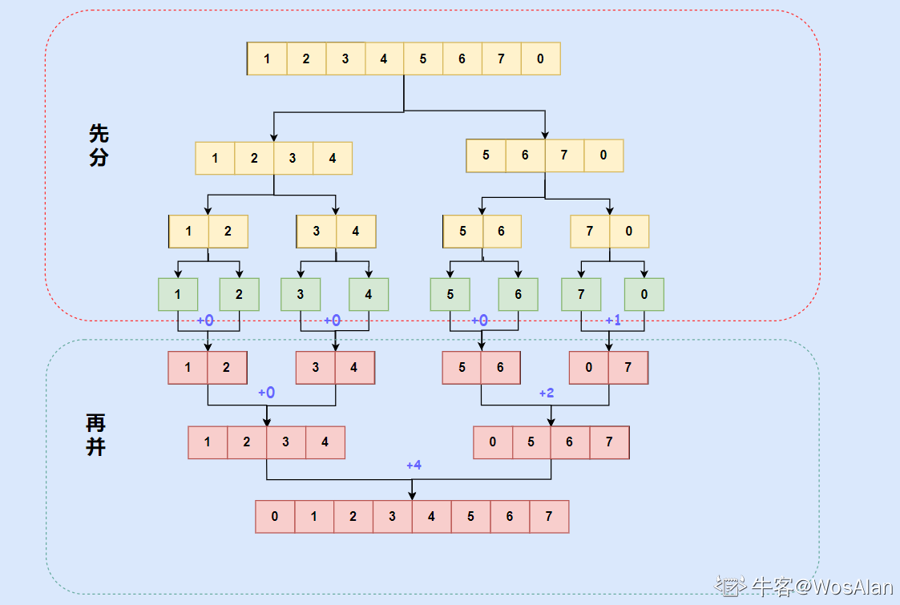

> **延申拓展**：计算右侧小于当前元素的个数
>
> 给你一个整数数组 nums ，按要求返回一个新数组 counts 。数组 counts 有该性质： counts[i] 的值是  nums[i] 右侧小于 nums[i] 的元素的数量。
>
> ```
> 输入：nums = [5,2,6,1]
> 输出：[2,1,1,0] 
> 解释：
> 5 的右侧有 2 个更小的元素 (2 和 1)
> 2 的右侧仅有 1 个更小的元素 (1)
> 6 的右侧有 1 个更小的元素 (1)
> 1 的右侧有 0 个更小的元素
> ```
>
> 题目解析：
>
> 在本题中，我们要求解的是 nums[i] 右侧小于 nums[i] 的元素的数量，即以 nums[i] 为左端点的「逆序对」的数目。
>
> 注意到，在常规的归并排序过程中，数组中的元素其位置会发生变化，而在本题中我们则需要记录下每个元素的**初始位置**，以便将每个元素贡献的逆序对数目归功到对应的位置上。
>
> 当数组中的元素均不重复时，简单的哈希表记录即可达到元素到下标的唯一映射，但当数组中的元素存在重复时，不再满足「单射」的条件，哈希映射也就失去了效果。
>
> 针对上述情况，我们单独开辟一个「索引数组」index 来定位数组中的元素。在排序过程中，原始数组 nums 并不发生变化，而是根据 nums[index[i]] 之间的大小来对其对应的索引数组 index[i] 进行排序。也就是说，实际上原始数组并未发生任何变化，真正发生变化的是索引数组。
>
> ```java
> class Solution {
>  int [] indexs;
>  int [] ans;
>  private void mergeSort(int [] nums,int l,int r){
>      if(l >= r) return;
>      int mid = l + ((r - l) >> 1);
>      mergeSort(nums,l,mid);
>      mergeSort(nums,mid+1,r);
> 
>      List<Integer> tmp = new ArrayList<>();
>      int left = l, right = mid + 1;
>      while(left <= mid && right <= r){
>          if(nums[indexs[left]] <= nums[indexs[right]]){
>              tmp.add(indexs[left]);
>              ans[indexs[left]] += right - (mid + 1);
>              left ++;
>          }else{
>              tmp.add(indexs[right]);
>              right ++;
>          }
>      }
>      while(left <= mid){
>          tmp.add(indexs[left]);
>          ans[indexs[left]] += right - (mid + 1);
>          left ++;
>      }
>      while(right <= r){
>          tmp.add(indexs[right]);
>          right ++;
>      }
>      for(int i = l;i <= r;i++){
>          indexs[i] = tmp.get(i - l);
>      }
>  }
>  public List<Integer> countSmaller(int[] nums) {
>      int n = nums.length;
>      indexs = new int[n];
>      ans = new int[n];
>      for(int i = 0;i < n;i++) indexs[i] = i;
>      mergeSort(nums,0,n-1);
>      List<Integer> res = new ArrayList<>();
>      for(int v : ans){
>          res.add(v);
>      }
>      return res;
>  }
> }
> ```

#### 第六十二剑式：1～n 整数中 1 出现的次数

> 题目来源：LeetCode 剑指 Offer 43

输入一个整数 n ，求1～n这n个整数的十进制表示中1出现的次数。

例如，输入12，1～12这些整数中包含1 的数字有1、10、11和12，1一共出现了5次。

**题目解析**：

逐个求每一位出现的1的个数，然后累加。

如果该数位可以表示为 $10^k$（例如 k=0, 1, 2分别表示「个位」「十位」「百位」），那么数字 1 出现的次数为：

$\lfloor n /(10^{k+1}) \rfloor *10^{k} + min(max(0,n \mod 10^{k+1} - 10^{k} + 1 ),10^{k})$

```java
class Solution {
    public int countDigitOne(int n) {
        int ans = 0;
        long mulk = 1;
        for (int i = 0;n >= mulk;i++){
            ans += (n / (mulk * 10))* mulk + Math.min(Math.max(0,(n%(mulk * 10) - mulk + 1)),mulk);
            mulk *= 10;
        }
        return ans;
    }
}
```


#### 第六十三剑式：数字序列中某一位的数字

> 题目来源：LeetCode 剑指 Offer 44

数字以0123456789101112131415…的格式序列化到一个字符序列中。在这个序列中，第5位（从下标0开始计数）是5，第13位是1，第19位是4，等等。

请写一个函数，求任意第n位对应的数字。

```
输入：n = 3
输出：3
```

时间复杂度 O(log n) 空间复杂度O(1)

```java
class Solution {
    public int findNthDigit(int n) {
        int digit= 1; // 位数
        long start= 1;// 位数为digit的第一个数
        long cnt = 9; // 位数为digit的总共位数
        //确定位数digit
        while (n > cnt){
            n -= cnt;
            digit += 1;
            start *= 10; 
            cnt = digit * start * 9;
        }
        long num = start + (n - 1) / digit;//确定所在的数字
        return Long.toString(num).charAt((n-1) % digit) - '0'; //确定在该数字的第几个数上
    }
}
```


#### 第六十四剑式：整数除法

> 题目来源：LeetCode 剑指 Offer II 001

给定两个整数 `a` 和 `b` ，求它们的除法的商 `a/b` ，要求不得使用乘号 `'*'`、除号 `'/'` 以及求余符号 `'%'` 。

- 整数除法的结果应当截去（truncate）其小数部分，例如：truncate(8.345) = 8 以及 truncate(-2.7335) = -2
- 假设我们的环境只能存储 32 位有符号整数，其数值范围是 $[−2^{31}, 2^{31}−1]$。本题中，如果除法结果溢出，则返回 $2^{31} − 1$

```
输入：a = 7, b = -3
输出：-2
解释：7/-3 = truncate(-2.33333..) = -2
```

题目解析：

用加减代替乘除运算，用二分法进行优化（二分过程中肯定也有乘除，可以用位移运算符代替）

```java
class Solution {
    public int divide(int a, int b) {
        int ans = 0;
        int flag = 0;
        //正数更容易溢出，转换为负数
        if (a > 0) {
            a = -a;
            flag += 1;
        }
        if (b > 0) {
            b = -b;
            flag += 1;
        }
        //当 a-b还能够减许多次时
        while(a <= b){
            int tmp_cnt = 1;
            int tmp_b = b;
            //如果还能减的话，就乘2倍，但是如果有溢出风险就结束
            while( tmp_b >= (Integer.MIN_VALUE >> 1) && a  <= (tmp_b<<1)){
                tmp_b += tmp_b;
                tmp_cnt += tmp_cnt;
            }
            a -= tmp_b;
            ans -= tmp_cnt;  //为什么要 - 呢？？ 因为正数2^32-1 + 1会溢出
        }
        if (flag != 1 && ans == Integer.MIN_VALUE) {
            ans++;
        }
        return flag == 1 ? ans : -ans;
    }
}
```


#### 第六十五剑式：二进制加法

> 题目来源：LeetCode 剑指 Offer II 002

给定两个 01 字符串 `a` 和 `b` ，请计算它们的和，并以二进制字符串的形式输出。

输入为 **非空** 字符串且只包含数字 `1` 和 `0`。

```
输入: a = "1010", b = "1011"
输出: "10101"
```

方法一：逐位相加+进位标志

```java
class Solution {
    public String addBinary(String a, String b) {
        int len_diff = a.length() - b.length();
        if (len_diff != 0){
            StringBuilder sb = new StringBuilder(Math.abs(len_diff));
            for (int i = 0;i < Math.abs(len_diff);i++){
                sb.append("0");
            }
            if (len_diff < 0){
                a = sb.toString() + a;
            }else{
                b = sb.toString() + b;
            }
        }
        char[] chars_a = a.toCharArray();
        char[] chars_b = b.toCharArray();
        int add = 0;
        for (int i = chars_a.length-1;i >=0;i --){
            chars_a[i] += (chars_b[i]-'0') + add;
            if (chars_a[i] > '1'){
                chars_a[i] -= 2;
                add = 1;
            }else{
                add = 0;
            }
        }
        String ans = new String(chars_a);
        if (add == 1){
            return "1" + ans;
        }
        return ans;
    }
}
```

方法二：

取巧法，仅仅适用于二进制字符串转整数不会溢出的情况

```java
class Solution {
     public String addBinary(String a, String b) {
        int sum = Integer.valueOf(a,2) + Integer.valueOf(b,2);
        return Integer.toBinaryString(sum);
    }
}
```


#### 第六十六剑式：前n个数字二进制中1的个数

> 题目来源：LeetCode 剑指 Offer II 003

给定一个非负整数 `n` ，请计算 `0` 到 `n` 之间的每个数字的二进制表示中 1 的个数，并输出一个数组。

```
输入: n = 5
输出: [0,1,1,2,1,2]
解释:
0 --> 0
1 --> 1
2 --> 10
3 --> 11
4 --> 100
5 --> 101
```

**题目解析**：

动态规划、最低有效位

```java
class Solution {
    public int[] countBits(int n) {
        int[] dp = new int[n+1];
        dp[0] = 0;
        for (int i = 1;i <= n;i++){
            dp[i] = dp[i & (i-1)] + 1;
        }
        return dp;
    }
}
```


#### 第六十七剑式：只出现一次的数字

> 题目来源：LeetCode 剑指 Offer II 004

给你一个整数数组 `nums` ，除某个元素仅出现 **一次** 外，其余每个元素都恰出现 **三次 。**请你找出并返回那个只出现了一次的元素。

```
输入：nums = [2,2,3,2]
输出：3
```

**题目解析**：

考虑答案的第 i 个二进制位（i从 0开始编号），它可能为 0 或 1。对于数组中非答案的元素，每一个元素都出现了 3 次，对应着第 i 个二进制位的 3 个 0 或 3 个 1，无论是哪一种情况，它们的和都是 3 的倍数（即和为 0 或 3）。因此：

> 答案的第 i 个二进制位就是数组中所有元素的第 i 个二进制位之和除以 3 的余数。

这样一来，对于数组中的每一个元素 x，我们使用位运算(x >> i) & 1 得到 x 的第 i 个二进制位，并将它们相加再对 3 取余，得到的结果一定为 0 或 1，即为答案的第 i 个二进制位。

```java
class Solution {
    public int singleNumber(int[] nums) {
        int ans = 0;
        for (int i = 0;i < 32;i++){
            int cnt = 0;
            for (int num:nums){
                cnt += ((num>>i) & 1);
            }
            ans |= ((cnt % 3) << i);
        }
        return ans;
    }
}
```


#### 第六十八剑式：单词长度的最大乘积

> 题目来源：LeetCode 剑指 Offer II 005

给定一个字符串数组 words，请计算当两个字符串 words[i] 和 words[j] 不包含相同字符时，它们长度的乘积的最大值。假设字符串中只包含英语的小写字母。如果没有不包含相同字符的一对字符串，返回 0。

```
输入: words = ["abcw","baz","foo","bar","fxyz","abcdef"]
输出: 16 
解释: 这两个单词为 "abcw", "fxyz"。它们不包含相同字符，且长度的乘积最大。
```

题目解析：

二进制编码 + 位运算

因为每个字符串只由小写字母(26个)构成，因此可以用一个整数代表一个字符串，整数的第`i`位为代表该字符串是否有字母`i + 'a'`。

想要判断两个字符串是否有公共字符只需要判断两个数字的`&`操作是否为`0`

```java
class Solution {
    public int maxProduct(String[] words) {
        Map<String,Integer> m = new HashMap<>();
        for (String word : words){
            int val = 0;
            for (int i = 0;i < word.length();i++){
                val |= (1 << (word.charAt(i) - 'a'));
            }
            m.put(word,val);
        }
        int ans = 0;
        for (int i = 0;i < words.length;i++){
            for (int j = i+1;j < words.length;j++){
                if ((m.get(words[i]) & m.get(words[j])) == 0){
                    ans = Math.max(ans,words[i].length() * words[j].length());
                }
            }
        }
        return ans;
    }
}
```


#### 第六十九剑式：排序数组中两个数字之和

> 题目来源：LeetCode 剑指 Offer II 006

给定一个已按照 升序排列  的整数数组 numbers ，请你从数组中找出两个数满足相加之和等于目标数 target 。

函数应该以长度为 2 的整数数组的形式返回这两个数的下标值。numbers 的下标 从 0 开始计数 ，所以答案数组应当满足 0 <= answer[0] < answer[1] < numbers.length 。

假设数组中存在且只存在一对符合条件的数字，同时一个数字不能使用两次。

```
输入：numbers = [1,2,4,6,10], target = 8
输出：[1,3]
解释：2 与 6 之和等于目标数 8 。因此 index1 = 1, index2 = 3 。
```

**题目解析**：

很简单的一道题，直接撸

```java
    public int[] twoSum(int[] numbers, int target) {
        int left = 0,right = numbers.length-1;
        while (numbers[left] + numbers[right] != target){
            if (numbers[left] + numbers[right] < target){
                left += 1;
            }else {
                right -= 1;
            }
        }
        return new int[]{left,right};
    }
```


#### 第七十剑式：数组中和为0的三个数

> 题目来源：LeetCode 剑指 Offer II 007

给定一个包含 n 个整数的数组 nums，判断 nums 中是否存在三个元素 a ，b ，c ，使得 a + b + c = 0 ？请找出所有和为 0 且 不重复 的三元组。

题目解析：

这题是上一题的升级版，有以下几个要点：

- 三个数的和`a+b+c=0` ==> `a+b = -c` 是不是就和上一道一样了
- 数组没说是有序的  ==> 排序
- 不重复 ==> 集合 或 按序查找

首先对数组进行排序，从0~n-1遍历元素nums[i],在`i+1 ~ n-1`内找 `nums[i] + nums[left] + nums[right] == 0`的三元组

> 优化：当nums[i] > 0，就没必要继续找了，直接break。因为都大于0了

```java
class Solution {
    public List<List<Integer>> threeSum(int[] nums) {
        List<List<Integer>> ans = new ArrayList<List<Integer>>();
        int n = nums.length;
        Arrays.sort(nums);
        for (int i = 0;i < n;i++){
            if (nums[i] > 0) break; //后面的查找无意义
            if (i > 0 && nums[i] == nums[i-1]) continue; //防止重复
            int left = i+1;
            int right = n-1;
            while (left < right){
                int total = nums[i] + nums[left] + nums[right];
                if (total == 0){ //如果找到了
                    ans.add(Arrays.asList(nums[i],nums[left],nums[right]));//加入该三元组
                    while (left < right && nums[left] == nums[left+1]){ //排除重复元素，继续找
                        left += 1;
                    }
                    left += 1; //一定不要忘记！
                }else if (total > 0){
                    right -= 1;
                }else{
                    left += 1;
                }
            }
        }
        return ans;
    }
}
```

#### 第七十一剑式：和大于等于target的最短子数组

> 题目来源：LeetCode 剑指 Offer II 008

给定一个含有 n 个正整数的数组和一个正整数 target 。

找出该数组中满足其和 ≥ target 的长度最小的 连续子数组 [numsl, numsl+1, ..., numsr-1, numsr] ，并返回其长度。如果不存在符合条件的子数组，返回 0 。

```
输入：target = 7, nums = [2,3,1,2,4,3]
输出：2
解释：子数组 [4,3] 是该条件下的长度最小的子数组。
```

题目解析：

一看到题目就想到了双指针。那就直接用双指针维护当前窗口内元素的值！

```java
class Solution {
    public int minSubArrayLen(int target, int[] nums) {
        int left = 0, right = 0; //初始窗口
        int sum = 0;  //存储窗口元素值
        int minWindow = Integer.MAX_VALUE;
        while(right < nums.length){ //结束条件，窗口有边界越界
            sum += nums[right]; //将当前元素加入窗口
            while (sum >= target){  //如果当前窗口元素和大于目标值
                minWindow = Math.min(minWindow,right-left+1); //更新以下最短长度
                sum -= nums[left]; //将左边界元素弹出
                left += 1;
            }
            right += 1;
        }
        return minWindow == Integer.MAX_VALUE ? 0 :minWindow;
    }
}
```

#### 第七十二剑式：乘积小于K的子数组

> 题目来源：LeetCode 剑指 Offer II 009

给定一个正整数数组 `nums`和整数 `k` ，请找出该数组内乘积小于 `k` 的连续的子数组的个数。

```
输入: nums = [10,5,2,6], k = 100
输出: 8
解释: 8 个乘积小于 100 的子数组分别为: [10], [5], [2], [6], [10,5], [5,2], [2,6], [5,2,6]。
需要注意的是 [10,5,2] 并不是乘积小于100的子数组。
```

题目解析：

还是滑动窗口。

```java
class Solution {
    public int numSubarrayProductLessThanK(int[] nums, int k) {
        int left = 0;
        if (k == 0) return 0;
        int mul = 1;
        int ans = 0;
        int right = 0;
        while(right < nums.length){
            mul = mul * nums[right];
            while (left <= right && mul >= k){
                mul /= nums[left];
                left += 1;
            }
            if (left <= right){
                ans += right - left + 1;
            }
            right += 1;
        }
        return ans;
    }
}
```


#### 第七十三剑式：和为K的子数组

> 题目来源：LeetCode 剑指 Offer II 010
>
> 标签：前缀和、哈希表

给定一个整数数组和一个整数 `k` **，**请找到该数组中和为 `k` 的连续子数组的个数。

题目解析:

本题需要求出子数组之和为k的数组个数，如果限定了只有正数那么可以直接使用滑动窗口来解决，但这里可能存在负数，因此每次加入值不一定会增大和值，减去值不一定会减小和值.

> 窗口滑动的条件是什么，while窗口内元素超过或者不满足条件时移动，但如果数组存在负数，遇到不满足题意的时候，我们应该移动窗口左边界，还是扩大窗口右边界从而寻找到符合条件的情况呢？
>

**前缀和的解题思想**：

前缀和的题目解题思维比较固定，即当我们循环数组到下标N时，需要用到数组前N-1项的计算的结果（这里不一定非要是和，也可能是积等），此时我们就该考虑是否应该通过计算数组循环过程中的累计值的方式简化解题，如此便有了前缀和的解题思想。

了解了思想，下来就该考虑，这个累计的结果我们该通过什么方式保存起来呢？

- 题目明确要求不允许使用额外空间的，直接原地修改数组
- 不限制空间复杂度时，最好额外开辟空间计算，避免数据污染
- 计算时如果每次**只需要获取前一次的累计结果**，可以通过数组的方式存储每次获取数组末尾元素的值
- 如果每次计算**需要获取前几次或更多次的结果**进行对比时，推荐哈希表的方式，这样可以压缩时间复杂度

具体思路：

具体思路如下：

1. 初始化：初始化一个空的哈希表`存储前缀和为key的个数(val)`和persum=0的前缀和变量，以及记录结果个数的变量ret
2. 循环遍历数组
   - 通过累加presum来计算数组的累加和
   - 将当前累加和减去整数K的结果，在哈希表中查找是否存在
     - 如果存在该key值，证明以数组某一点为起点到当前位置满足题意，ret加等于将该key值对应的val
   - 将当前presum累加和加入哈希表。判断当前的累加和是否在哈希表中，若存在value+1，若不存在value=1
3. 最终返回ret即可

```java
class Solution {
    public int subarraySum(int[] nums, int k) {
        int ans = 0;
        Map<Integer,Integer> m = new HashMap<>();
        m.put(0,1); //首先要添加一个前缀为0的键值对
        int presum = 0;
        for (int num:nums){
            presum += num;
            if (m.get(presum-k) != null){
                ans += m.get(presum-k);
            }
            m.put(presum,m.getOrDefault(presum,0) + 1);
        }
        return ans;
    }
}
```


#### 第七十四剑式：0 和 1 个数相同的子数组

> 题目来源：LeetCode 剑指 Offer II 011
>
> 标签：前缀和、哈希表

给定一个二进制数组 `nums` , 找到含有相同数量的 `0` 和 `1` 的最长连续子数组，并返回该子数组的长度。

```
输入: nums = [0,1]
输出: 2
说明: [0, 1] 是具有相同数量 0 和 1 的最长连续子数组。
```

**题目解析**：

由于「0 和 1 的数量相同」等价于「1 的数量减去 0 的数量等于 0」，我们可以将数组中的 0 视作 -1，则原问题转换成「求最长的连续子数组，其元素和为 0」。

```java
class Solution {
    public int findMaxLength(int[] nums) {
        int maxlen = Integer.MIN_VALUE;
        int presum = 0;
        Map<Integer,Integer> m = new HashMap<>();
        m.put(0,-1);
        for (int i = 0;i < nums.length;i++){
            presum += nums[i] == 1 ? 1 : -1;
            if (m.get(presum) == null){
                m.put(presum,i);
            }else{
                maxlen = Math.max(maxlen,i-m.get(presum));
            }
        }
        return maxlen == Integer.MIN_VALUE ? 0 : maxlen;
    }
}
```


#### 第七十五剑式：左右两边子数组的和相等

> 题目来源：LeetCode 剑指 Offer II 012
>
> 标签：前缀和

给你一个整数数组 nums ，请计算数组的 中心下标 。

数组 **中心下标** 是数组的一个下标，其左侧所有元素相加的和等于右侧所有元素相加的和。

如果中心下标位于数组最左端，那么左侧数之和视为 0 ，因为在下标的左侧不存在元素。这一点对于中心下标位于数组最右端同样适用。

如果数组有多个中心下标，应该返回 **最靠近左边** 的那一个。如果数组不存在中心下标，返回 -1 。

解题思路：

**前缀和**:

记数组的全部元素之和为 $\textit{total}$，当遍历到第 i 个元素时，设其左侧元素之和为 $\textit{sum}$，则其右侧元素之和为$ \textit{total}-\textit{nums}_i-\textit{sum}total−nums 
i −sum$。左右侧元素相等即为$ \textit{sum}=\textit{total}-\textit{nums}_i-\textit{sum}sum=total−nums 
i−sum$，即$2\times\textit{sum}+\textit{nums}_i=\textit{total}2×sum+nums_i=total$。

题解1：

```java
public int pivotIndex(int[] nums) {
    int total = Arrays.stream(nums).sum(); //求和
    int sum = 0;
    for (int i = 0;i < nums.length;i++){
        if (2 * sum + nums[i] == total){
            return i;
        }
        sum += nums[i];
    }
    return -1;
}
```

题解2：

```JAVA
class Solution {
    public int pivotIndex(int[] nums) {
        int [] presum = new int[nums.length];
        int [] possum = new int[nums.length];
        presum[0] = nums[0];
        possum[nums.length-1] = nums[nums.length-1];
        for (int i = 1;i < nums.length;i++){
            presum[i] = nums[i] + presum[i-1];
        }
        for (int i = nums.length-2;i >=0;i--){
            possum[i] = nums[i] + possum[i+1];
        }
        int mindix = Integer.MAX_VALUE;
        for (int i = nums.length-1;i >= 0;i--){
            if (presum[i] == possum[i]){
                mindix = Math.min(mindix,i);
            }
        }
        return mindix == Integer.MAX_VALUE ? -1 : mindix;
    }
}
```


#### 第七十六剑式：二维子矩阵的和

> 题目来源：LeetCode 剑指 Offer II 013
>
> 标签：前缀和

给定一个二维矩阵 matrix，以下类型的多个请求：

- 计算其子矩形范围内元素的总和，该子矩阵的左上角为 `(row1, col1) `，右下角为 `(row2, col2) `。

实现 NumMatrix 类：

- `NumMatrix(int[][] matrix) `给定整数矩阵 matrix 进行初始化
- `int sumRegion(int row1, int col1, int row2, int col2) `返回左上角` (row1, col1) `、右下角` (row2, col2) `的子矩阵的元素总和。


```
输入: 
["NumMatrix","sumRegion","sumRegion","sumRegion"]
[[[[3,0,1,4,2],[5,6,3,2,1],[1,2,0,1,5],[4,1,0,1,7],[1,0,3,0,5]]],[2,1,4,3],[1,1,2,2],[1,2,2,4]]
输出: 
[null, 8, 11, 12]
```

题目解析：


```java
class NumMatrix {
    private  int[][] presum;
    public NumMatrix(int[][] matrix) {
        presum = new int[matrix.length][matrix[0].length];
        presum[0][0] = matrix[0][0];
        for (int i = 1;i < matrix.length;i++){
            presum[i][0] = presum[i-1][0] + matrix[i][0];
        }
        for (int i = 1;i <matrix[0].length;i++){
            presum[0][i] = presum[0][i-1] + matrix[0][i];
        }
        for (int i = 1;i < matrix.length;i++){
            for (int j = 1;j < matrix[0].length;j++){
                presum[i][j] = presum[i-1][j] + presum[i][j-1] - presum[i-1][j-1] + matrix[i][j];
            }
        }
    }

    public int sumRegion(int row1, int col1, int row2, int col2) {
        int left,up,leftup =0;
        if (row1 == 0 && col1 == 0){
            return presum[row2][col2];
        }else if (row1 == 0 && col1 != 0){
            up = 0;
            left = presum[row2][col1-1];
            leftup = 0;
        }else if (row1 != 0 && col1 == 0){
            up = presum[row1-1][col2];
            left = 0;
            leftup = 0;
        }else{
            up = presum[row1-1][col2];
            left = presum[row2][col1-1];
            leftup = presum[row1-1][col1-1];
        }
        return presum[row2][col2] - left - up + leftup;
    }
}
```


#### 第七十七剑式：字符串中的变位词

> 题目来源：LeetCode 剑指 Offer II 014
>
> 标签：滑动窗口

给定两个字符串 `s1` 和 `s2`，写一个函数来判断 `s2` 是否包含 `s1` 的某个变位词。

换句话说，第一个字符串的排列之一是第二个字符串的 **子串** 。

```
输入: s1 = "ab" s2 = "eidbaooo"
输出: True
解释: s2 包含 s1 的排列之一 ("ba").
```

比较简单，就直接撸了

```java
class Solution {
    public boolean checkInclusion(String s1, String s2) {
        int lens1 = s1.length(),lens2 = s2.length();
        if (lens1 > lens2) return false; //如果len(s1) > len(s) 直接返回false
        int[] cnt1 = new int[26]; //记录s1中有哪些字符，每个字符的个数
        int[] cnt2 = new int[26]; //记录s2中和s1相同长度的窗口中有哪些字符以及其个数
        for (int i = 0;i < lens1;i++){
            cnt1[s1.charAt(i) - 'a'] += 1;
            cnt2[s2.charAt(i) - 'a'] += 1;
        }
        if (Arrays.equals(cnt1,cnt2)) return true;
        for (int i = lens1;i < lens2;i++){
            cnt2[s2.charAt(i) - 'a'] += 1;
            cnt2[s2.charAt(i-lens1) - 'a'] -= 1;
            if (Arrays.equals(cnt1,cnt2)) return true; //如果两个窗口中字符及个数相等，则返回true
        }
        return false;
    }
}
```

#### 第七十八剑式：字符串中的所有变位词

> 题目来源：LeetCode 剑指 Offer II 015
>
> 标签：滑动窗口

给定两个字符串 `s` 和 `p`，找到 `s` 中所有 `p` 的 **变位词** 的子串，返回这些子串的起始索引。不考虑答案输出的顺序。**变位词** 指字母相同，但排列不同的字符串。

```
输入: s = "cbaebabacd", p = "abc"
输出: [0,6]
解释:
起始索引等于 0 的子串是 "cba", 它是 "abc" 的变位词。
起始索引等于 6 的子串是 "bac", 它是 "abc" 的变位词。
```

```java
class Solution {
    public List<Integer> findAnagrams(String s, String p) {
        List<Integer> ans = new ArrayList<>();
        int lens1 = s.length(),lens2 = p.length();
        if (lens2 > lens1) return ans;
        int[] cnt1 = new int[26];
        int[] cnt2 = new int[26];
        for (int i = 0;i < lens2;i++){
            cnt1[s.charAt(i) - 'a'] += 1;
            cnt2[p.charAt(i) - 'a'] += 1;
        }
        if (Arrays.equals(cnt1,cnt2)) ans.add(0);
        for (int i = lens2;i < lens1;i++){
            cnt1[s.charAt(i) - 'a'] += 1;
            cnt1[s.charAt(i-lens2) - 'a'] -= 1;
            if (Arrays.equals(cnt1,cnt2)) ans.add(i-lens2 + 1);
        }
        return ans;
    }
}
```

#### 第七十九剑式：不含重复字符的最长子字符串

> 题目来源：LeetCode 剑指 Offer II 016
>
> 标签：双指针

给定一个字符串 `s` ，请你找出其中不含有重复字符的 **最长连续子字符串** 的长度。

```
输入: s = "abcabcbb"
输出: 3 
解释: 因为无重复字符的最长子字符串是 "abc"，所以其长度为 3。
```


```java
class Solution {
    public int lengthOfLongestSubstring(String s) {
        if (s.length() < 2) return s.length(); //如果s的长度小于2，则肯定没有重复的，直接返回对于长度
        int maxlen = 0;
        int left = 0,right = 0; //双指针初始化
        Map<Character,Integer> m = new HashMap<>();  //hashtable初始化 key:字符 val:上一次出现的位置
        while (right < s.length()){
            if (m.get(s.charAt(right)) == null) {//之前没有出现过
                m.put(s.charAt(right),right); //直接加入哈希表
            }else{//之前出现过
                int lastidx = m.get(s.charAt(right)); //获取上传出现的位置
                if (lastidx >= left){ //如果上次出现的位置再窗口范围内，则更新一次maxlen
                    maxlen = Math.max(maxlen,right-left);
                    left = lastidx + 1; //并直接将窗口左边界更新为重复元素的位置的右边
                }
                m.put(s.charAt(right),right); //更新上一次出现的位置
            }
            right += 1; //有边界扩增1
        }
        return Math.max(maxlen,right-left); //滑动完了还要再更新一次最大值
    }
}
```

#### 第八十剑式：有效的回文

> 题目来源：LeetCode 剑指 Offer II 018
>
> 标签：双指针

给定一个字符串 `s` ，验证 `s` 是否是 **回文串** ，只考虑字母和数字字符，可以忽略字母的大小写。

本题中，将空字符串定义为有效的 **回文串** 。

**题目解析**：

我直接调用了反转函数来处理比较方便但是耗时，其实这道题用双指针做会快很多。

方法1：字符串反转 + String.equals()

```java
class Solution {
    public boolean isPalindrome(String s) {
        StringBuilder sb = new StringBuilder();
        s = s.toLowerCase();
        for (int i = 0;i < s.length();i++){
            if ((s.charAt(i) >= 'a' && s.charAt(i) <= 'z') || (s.charAt(i) >= '0' && s.charAt(i) <= '9')){
                sb.append(s.charAt(i));
            }
        }
        System.out.println(sb.toString());
        System.out.println(sb.reverse().toString());
        return sb.toString().equals(sb.reverse().toString());
    }
}
```

方法2：双指针

```java
class Solution {
    public boolean isPalindrome(String s) {
        int n = s.length();
        s = s.toLowerCase();
        int left = 0,right = n-1;
        while (left < right){
            while (left < right && !((s.charAt(left) >= 'a' && s.charAt(left) <= 'z') || (s.charAt(left) >= '0' && s.charAt(left) <= '9'))){
                left += 1;
            }
            while (left < right && !((s.charAt(right) >= 'a' && s.charAt(right) <= 'z') || (s.charAt(right) >= '0' && s.charAt(right) <= '9'))){
                right -= 1;
            }
            if (left < right && s.charAt(left) != s.charAt(right)) return false;
            left += 1;
            right -= 1;
        }
        return true;
    }
}
```


#### 第八十一剑式：最多删除一个字符得到回文

> 题目来源：LeetCode 剑指 Offer II 019
>
> 标签：双指针

给定一个非空字符串 `s`，请判断如果 **最多** 从字符串中删除一个字符能否得到一个回文字符串。

题目解析：

当遇到不相等的字符==> 跳过左字符比较剩余字符 或者 跳过右字符比较剩余字符

```java
class Solution {
    public boolean validPalindrome(String s) {
        for(int left = 0, right = s.length() - 1; left < right; left++, right--){
            // 如果不相等，则分两种情况：删除左边的元素，或者右边的元素，再判断各自是否回文，满足一种即可。
            if(s.charAt(left) != s.charAt(right)) 
                return isPalindrome(s, left+1, right) || isPalindrome(s, left, right - 1);
        }
        return true;
    }

    // 判断字符串 s 的 [left, right] 的区间是否是回文串
    private boolean isPalindrome(String s, int left , int right){
        while (left < right){
            if (s.charAt(left) != s.charAt(right))
                return false;
            left += 1;
            right -= 1;
        }
        return true;
    }
}
```


#### 第八十二剑式：回文子字符串的个数

> 题目来源：LeetCode 剑指 Offer II 020
>
> 标签：双指针、中心扩张

给定一个字符串 `s` ，请计算这个字符串中有多少个回文子字符串。

具有不同开始位置或结束位置的子串，即使是由相同的字符组成，也会被视作不同的子串。

```
输入：s = "abc"
输出：3
解释：三个回文子串: "a", "b", "c"
```

题目解析：

枚举每一个可能的回文中心，然后用两个指针分别向左右两边拓展，当两个指针指向的元素相同的时候就拓展，否则停止拓展。

回文长度是奇数和是偶数是两种情况：

1. 如果回文长度是奇数，那么回文中心是一个字符；
2. 如果回文长度是偶数，那么中心是两个字符。

当然你可以做两次循环来分别枚举奇数长度和偶数长度的回文，但是我们也可以用一个循环搞定。我们不妨写一组出来观察观察，假设 n = 3，我们可以把可能的回文中心列出来：

| 编号 | 回文中心左边起始位置$l_i$ | 回文中心右边起始位置$r_i$ | 回文串长度奇/偶 |
| :--: | :-----------------------: | :-----------------------: | :-------------: |
|  0   |             0             |             0             |       奇        |
|  1   |             0             |             1             |       偶        |
|  2   |             1             |             1             |       奇        |
|  3   |             1             |             2             |       偶        |
|  4   |             2             |             2             |       奇        |

因此我们可以得出结论，在长度为n的字符串s中可以生成$2n-1$个回文中心$(l_i,r_i)$。其中$l_i = \lfloor l_i / 2\rfloor,r _ i = l_i + i \% 2$，然后对每个回文中心进行中心拓展。

```java
class Solution {
    public int countSubstrings(String s) {
        int n = s.length();
        int ans = 0;
        for (int i = 0; i < 2 * n - 1;i++){
            int left = i / 2,right = i / 2 + i % 2;
            while (left >= 0 && right < n && s.charAt(left) == s.charAt(right)){
                left -= 1;
                right += 1;
                ans += 1;
            }
        }
        return ans;
    }
}
```


#### 第八十三剑式：删除链表的倒数第n个结点

> 题目来源：LeetCode 剑指 Offer II 021
>
> 标签：链表、快慢指针

给定一个链表，删除链表的倒数第 `n` 个结点，并且返回链表的头结点。


```
输入：head = [1,2,3,4,5], n = 2
输出：[1,2,3,5]
```

```java
class Solution {
    public ListNode removeNthFromEnd(ListNode head, int n) {
        ListNode now = head; //快指针
        ListNode del = head; //标记待删除的结点
        ListNode pre = null; //删除结点的前驱结点
        //快慢指针，先移动快指针
        for(int i = 0;i < n;i++){
            now = now.next;
        }
        //快慢指针同时移动
        while(now != null){
            now = now.next;
            pre = del;
            del = del.next;
        }
        //如果删除的是头结点 直接 return head.next
        if(del == head){
            head = head.next;
        }else{
            pre.next = del.next;
        }
        return head;
    }
}
```


#### 第八十四剑式：链表中环的入口结点

> 题目来源：LeetCode 剑指 Offer II 022
>
> 标签：链表、快慢指针

给定一个链表，返回链表开始入环的第一个节点。 从链表的头节点开始沿着 next 指针进入环的第一个节点为环的入口节点。如果链表无环，则返回 null。

为了表示给定链表中的环，我们使用整数 pos 来表示链表尾连接到链表中的位置（索引从 0 开始）。 如果 pos 是 -1，则在该链表中没有环。注意，pos 仅仅是用于标识环的情况，并不会作为参数传递到函数中。

说明：不允许修改给定的链表。


```
输入：head = [3,2,0,-4], pos = 1
输出：返回索引为 1 的链表节点
解释：链表中有一个环，其尾部连接到第二个节点。
```

**题目解析**：

可能看到这一题第一想法就是用hashtable存储每个结点，如果下一次遍历到hashtable中的结点的话那么就说明该节点是`环的入口结点`

但是还有种方法是利用`快慢指针`的方法求解。

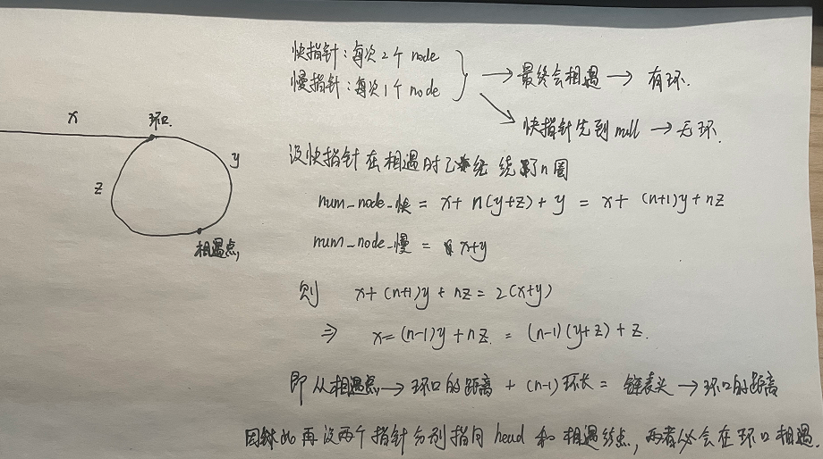

```java
public class Solution {
    public ListNode detectCycle(ListNode head) {
        ListNode slow = head;
        ListNode quick = head;
        while(quick != null && quick.next != null){
            slow = slow.next;
            quick = quick.next.next;
            if (slow == quick){
                ListNode tmp = head;
                while (tmp != slow){
                    tmp = tmp.next;
                    slow = slow.next;
                }
                return slow;
            }
        }
        return null;
    }
}
```

#### 第八十五剑式：两个链表的第一个重合结点

> 题目来源：LeetCode 剑指 Offer II 023
>
> 标签：链表、双指针

给定两个单链表的头节点 headA 和 headB ，请找出并返回两个单链表相交的起始节点。如果两个链表没有交点，返回 null 。

图示两个链表在节点 c1 开始相交：


题目数据 保证 整个链式结构中不存在环。

注意，函数返回结果后，链表必须 保持其原始结构 。

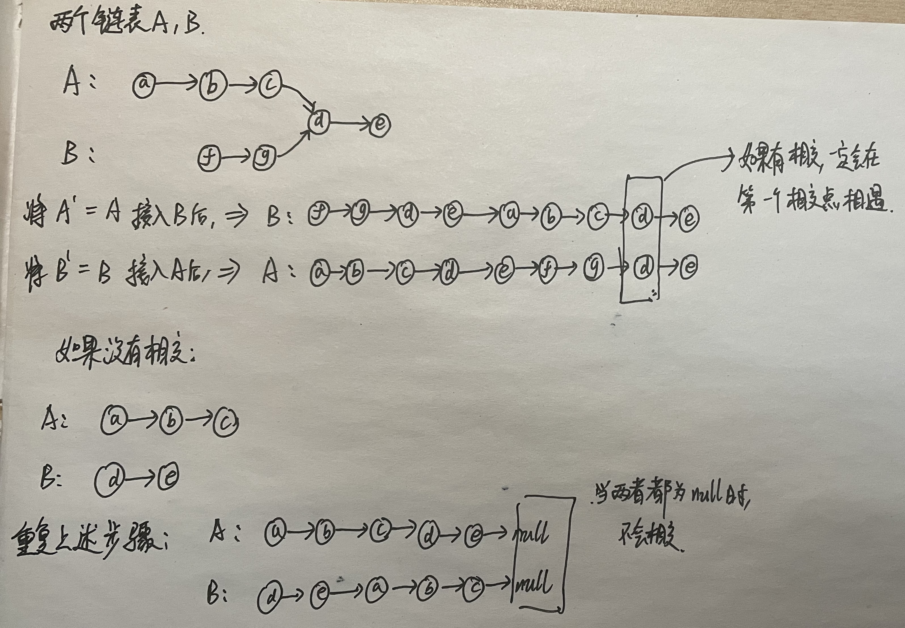

```java
public class Solution {
    public ListNode getIntersectionNode(ListNode headA, ListNode headB) {
        if(headA == null || headB == null) return null;
        ListNode nowA = headA;
        ListNode nowB = headB;
        while (nowA != nowB){
            nowA = nowA == null ? headB : nowA.next;
            nowB = nowB == null ? headA : nowB.next;
        }
        return nowA;
    }
}
```


#### 第八十六剑式：反转链表

> 题目来源：LeetCode 剑指 Offer II 024
>
> 标签：链表、头插法

给定单链表的头节点 `head` ，请反转链表，并返回反转后的链表的头节点。

题目解析：

就是一个头插法创建链表的过程

```java
class Solution {
    public ListNode reverseList(ListNode head) {
        ListNode new_head_pre = new ListNode();
        ListNode now = head;
        ListNode now_next = null;
        while (now != null){
            now_next = now.next;
            now.next = new_head_pre.next;
            new_head_pre.next = now;
            now = now_next;
        }
        return new_head_pre.next;
    }
}
```


#### 第八十七剑式： 链表中的两数相加

> 题目来源：LeetCode 剑指 Offer II 025
>
> 标签：链表、链表反转

给定两个 **非空链表** `l1`和 `l2` 来代表两个非负整数。数字最高位位于链表开始位置。它们的每个节点只存储一位数字。将这两数相加会返回一个新的链表。

可以假设除了数字 0 之外，这两个数字都不会以零开头。

解题思路：

先反转两个链表 ==> 逐个结点相加 ==> 反转最终链表

```java
class Solution {
    //上一题的头插法反转链表函数
    public ListNode reverseList(ListNode head) {
        ListNode new_head_pre = new ListNode();
        ListNode now = head;
        ListNode now_next = null;
        while (now != null){
            now_next = now.next;
            now.next = new_head_pre.next;
            new_head_pre.next = now;
            now = now_next;
        }
        return new_head_pre.next;
    }
    public ListNode addTwoNumbers(ListNode l1, ListNode l2) {
        //反转两个链表
        ListNode L1_head = reverseList(l1);
        ListNode L2_head = reverseList(l2);
        ListNode node_l1 = L1_head;
        ListNode node_l2 = L2_head;
        ListNode pre1 = null;
        ListNode pre2 = null;
        int add = 0;
        //当两个都没有遍历完
        while (node_l1 != null && node_l2 != null){
            pre1 = node_l1;
            pre2 = node_l2;
            //计算当前结点以及进位的和
            int val = (node_l1.val + node_l2.val + add) % 10;
            //更新进位
            add = (node_l1.val + node_l2.val + add) / 10;
            //更新结果
            node_l1.val = val;
            node_l1 = node_l1.next;
            node_l2 = node_l2.next;
        }
        //因为我们是把结果l1上的结点作为 结点和的值，如果l2比l1长，那么l2后面的结点直接接在l1后即可
        if (node_l1 == null && node_l2 != null){
            pre1.next = node_l2;
        }
        //l1的当前结点回退一个
        node_l1 = pre1.next;
        //继续遍历剩下没有遍历的结点，此时只剩l1中的结点了
        while (node_l1 != null){
            pre1 = node_l1;
            int val = (node_l1.val + add) % 10;
            add = (node_l1.val + add) / 10;
            node_l1.val = val;
            node_l1 = node_l1.next;
        }
        //如果有进位，新创建一个结点
        if(add == 1){
            pre1.next = new ListNode(1);
        }
        return reverseList(L1_head);
    }
}
```


#### 第八十八剑式： 重排链表

> 题目来源：LeetCode 剑指 Offer II 026
>
> 标签：链表、哈希表

给定一个单链表 L 的头节点 head ，单链表 L 表示为：

 L0 → L1 → … → Ln-1 → Ln 
请将其重新排列后变为：

L0 → Ln → L1 → Ln-1 → L2 → Ln-2 → …

不能只是单纯的改变节点内部的值，而是需要实际的进行节点交换

```java
class Solution {
    public void reorderList(ListNode head) {
        ArrayList<ListNode> arr = new ArrayList<>();
        ListNode node = head;
        while (node != null){
            arr.add(node);
            node = node.next;
        }
        ListNode ans_pre = new ListNode();
        ListNode tail = ans_pre;
        int left = 0,right = arr.size() - 1;
        while (left < right){
            tail.next = arr.get(left);
            left += 1;
            tail = tail.next;
            tail.next = arr.get(right);
            right -= 1;
            tail = tail.next;
        }
        if(left == right){
            tail.next = arr.get(left);
            tail = tail.next;
        }
        tail.next = null;
        head = ans_pre.next;
    }
}
```


#### 第八十九剑式： 回文链表

> 题目来源：LeetCode 剑指 Offer II 027
>
> 标签：链表、反转链表

给定一个链表的 **头节点** `head` **，**请判断其是否为回文链表。

如果一个链表是回文，那么链表节点序列从前往后看和从后往前看是相同的。

```java
class Solution {
    public boolean isPalindrome(ListNode head) {
        ListNode new_head = new ListNode();
        ListNode node = head;
        //创建一个新的逆序链表
        while (node != null){
            ListNode tmp = new ListNode(node.val);
            tmp.next = new_head.next;
            new_head.next = tmp;
            node = node.next;
        }
        node = head;
        ListNode new_node = new_head.next;
        while (node != null && new_node != null){
            if (node.val != new_node.val) return false;
            node = node.next;
            new_node = new_node.next;
        }
        return true;
    }
}
```


#### 第九十剑式： 展平多级双向链表

> 题目来源：LeetCode 剑指 Offer II 028
>
> 标签：双向链表、栈

多级双向链表中，除了指向下一个节点和前一个节点指针之外，它还有一个子链表指针，可能指向单独的双向链表。这些子列表也可能会有一个或多个自己的子项，依此类推，生成多级数据结构，如下面的示例所示。

给定位于列表第一级的头节点，请扁平化列表，即将这样的多级双向链表展平成普通的双向链表，使所有结点出现在单级双链表中。

```
输入：head = [1,2,3,4,5,6,null,null,null,7,8,9,10,null,null,11,12]
输出：[1,2,3,7,8,11,12,9,10,4,5,6]
```

解释：输入的多级列表如下图所示：


扁平化后的链表如下图：


```java
class Solution {
    public Node flatten(Node head) {
        if (head == null) return null;
        //创建双端队列 模拟 栈
        Deque<Node> st = new ArrayDeque<>();
        // now 标记当前遍历到哪个结点了
        Node now = head;
        // now 的前驱结点
        Node pre = null;
        while (now != null){
            //首先更新前驱结点
            pre = now;
            //如果当前结点有孩子结点
            if (now.child != null){
                //如果now.next != null 将now的后继结点加入栈中，先遍历子链表
                if(now.next != null)
                    st.offerLast(now.next);
                //now.child.prev -> now
                now.child.prev = now;
                //now.next -> now.child
                now.next = now.child;;
                //now.childe -> null
                now.child = null;
            }
            now = now.next;
        }
        //依次将栈中的剩下链表的头结点插入当前的尾结点后面
        while (!st.isEmpty()){
            Node tmp = st.pollLast();
            pre.next = tmp;
            tmp.prev = pre;
            while (tmp != null){
                pre = tmp;
                tmp = tmp.next;
            }
        }
        return head;
    }
}
```


#### 第九十一剑式： 展平多级双向链表

> 题目来源：LeetCode 剑指 Offer II 029
>
> 标签：循环链表

给定循环单调非递减列表中的一个点，写一个函数向这个列表中插入一个新元素 insertVal ，使这个列表仍然是循环升序的。

给定的可以是这个列表中任意一个顶点的指针，并不一定是这个列表中最小元素的指针。

如果有多个满足条件的插入位置，可以选择任意一个位置插入新的值，插入后整个列表仍然保持有序。

如果列表为空（给定的节点是 null），需要创建一个循环有序列表并返回这个节点。否则。请返回原先给定的节点。


```
输入：head = [3,4,1], insertVal = 2
输出：[3,4,1,2]
```


题目解析：

根据题目，进行了3、4的提交错误后，发现起始能够插入的情况无非如下三种，以及一些特殊情况（空链表、只有一个结点）

> 注：图片借鉴自`https://leetcode-cn.com/problems/4ueAj6/solution/cai-keng-liu-lei-leng-jing-fen-xi-by-che-n8u9/`

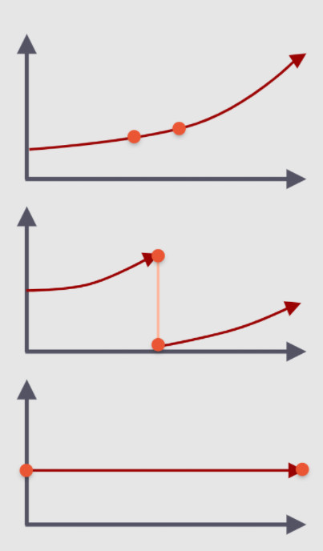

```java
class Solution {
    public Node insert(Node head, int insertVal) {
        //创建插入的结点
        Node add = new Node(insertVal);
        //如果是空链表，直接构造成循环链表并返回
        if (head == null){
            add.next = add;
            return add;
        }else if (head.next == head){//如果是只有一个结点的链表，直接插入
            add.next = head;
            head.next = add;
            return head;
        }
        Node now = head;
        boolean flag = false;
        Node start = head;
        Node pre = null;
        while (true){
            pre = now;//记录前驱结点
            if ((now.val <= insertVal && now.next.val > insertVal)){ //情况1
                break;
            }
            if (now.val > now.next.val){
                if (insertVal >= now.val || insertVal <= now.next.val){ //情况2
                    break;
                }
            }
            now = now.next; //移动至下一个结点
            if(now == start){ //情况3，全部相同
                flag = true;
                break;
            }
        }
        if (flag){ //情况3的插入
            add.next = now;
            pre.next = add;
            return head;
        }
        //情况1，2的插入
        add.next = now.next;
        now.next = add;
        return head;
    }
}
```


#### 第九十二剑式： 有效的变位词

> 题目来源：LeetCode 剑指 Offer II 032
>
> 标签：数组、哈希表

给定两个字符串 `s` 和 `t` ，编写一个函数来判断它们是不是一组变位词（字母异位词）。

**注意：**若 `s` 和 `t` 中每个字符出现的次数都相同且**字符顺序不完全相同**，则称 `s` 和 `t` 互为变位词（字母异位词）。

```java
public boolean isAnagram(String s, String t) {
    if (s.equals(t) == true) return false;
    int [] cnt_s = new int[26];
    int [] cnt_t = new int[26];
    for (int i = 0;i < s.length();i++){
        cnt_s[s.charAt(i) - 'a'] += 1;
    }
    for (int i = 0;i < t.length();i++){
        cnt_t[t.charAt(i) - 'a'] += 1;
    }
    return Arrays.equals(cnt_s,cnt_t);
}
```

#### 第九十三剑式： 变位词组

> 题目来源：LeetCode 剑指 Offer II 033
>
> 标签：排序、哈希表

给定一个字符串数组 `strs` ，将 **变位词** 组合在一起。 可以按任意顺序返回结果列表。

**注意：**若两个字符串中每个字符出现的次数都相同，则称它们互为变位词。

```
输入: strs = ["eat", "tea", "tan", "ate", "nat", "bat"]
输出: [["bat"],["nat","tan"],["ate","eat","tea"]]
```

**解题思路**：

如果两个单词是变位词，则对这两个单词排序后结果一样。

```java
class Solution {
    public List<List<String>> groupAnagrams(String[] strs) {
        Map<String,List<String>> m = new HashMap<>();
        for (int i = 0;i < strs.length;i++){
            char [] str_arr = strs[i].toCharArray();
            Arrays.sort(str_arr);
            String tmp = new String(str_arr);
            List<String> list = m.getOrDefault(tmp,new ArrayList<>());
            list.add(strs[i]);
            m.put(tmp,list);
        }
        // map -> List
        return new ArrayList<List<String>> (m.values());
    }
}
```

#### 第九十四剑式：外星语言是否排序 

> 题目来源：LeetCode 剑指 Offer II 034
>
> 标签：字符串、哈希表

某种外星语也使用英文小写字母，但可能顺序 order 不同。字母表的顺序（order）是一些小写字母的排列。

给定一组用外星语书写的单词 words，以及其字母表的顺序 order，只有当给定的单词在这种外星语中按字典序排列时，返回 true；否则，返回 false。

题目解析：

比较简单，先获得每个字符的优先级存储在HashMap中，然后遍历words判断是否是按照字典序排序。

```java
class Solution {
    public boolean isAlienSorted(String[] words, String order) {
        Map<Character,Integer> m = new HashMap<>();
        for (int i = 0;i < order.length();i++){
            m.put(order.charAt(i),i);
        }
        for (int i = 0;i < words.length - 1;i++){
            int idx = 0;
            boolean flag = false;
            while (idx < words[i].length() && idx < words[i+1].length()){
                if (words[i].charAt(idx) == words[i+1].charAt(idx)){
                    idx += 1;
                    continue;
                }
                if (m.get(words[i].charAt(idx)) < m.get(words[i+1].charAt(idx))){
                    flag = true;
                    break;
                }else{
                    return false;
                }
            }
            if(!flag){
                if(words[i].length() > words[i+1].length()) return false;
            }
        }
        return true;
    }
}
```

#### 第九十五剑式：最小时间差

> 题目来源：LeetCode 剑指 Offer II 035
>
> 标签：字符串、排序

给定一个 24 小时制（小时:分钟 **"HH:MM"**）的时间列表，找出列表中任意两个时间的最小时间差并以分钟数表示。

题目解析：

将 "HH:MM"转换为一天中的第几分钟，然后排序，再比较相邻的两个时间差

> 注：首尾两个也是相连的哦，时间差 = 一个的总时间 - （两者时间差的绝对值）

```java
class Solution {
    public int findMinDifference(List<String> timePoints) {
        int n = timePoints.size();
        List<Integer> arr = new ArrayList<>();
        for (String time : timePoints){
            int val = 0;
            String [] ts = time.split(":");
            val = Integer.parseInt(ts[0]);
            val = val * 60 + Integer.parseInt(ts[1]);
            arr.add(val);
        }
        arr.sort(new Comparator<Integer>() {
            @Override
            public int compare(Integer o1, Integer o2) {
                return o1 - o2;
            }
        });
        int mindiff = Integer.MAX_VALUE;
        for (int i = 1;i < n;i++){
            mindiff = Math.min(mindiff,Math.abs(arr.get(i)-arr.get(i-1)));
        }
        //最后记得比较一下首尾两个元素的时间差
        return Math.min(mindiff,1440-Math.abs(arr.get(0)-arr.get(n-1)));
    }
}
```


#### 第九十六剑式：后缀表达式

> 题目来源：LeetCode 剑指 Offer II 036
>
> 标签：栈

根据 逆波兰表示法，求该后缀表达式的计算结果。

有效的算符包括 `+`、`-`、`*`、`/` 。每个运算对象可以是整数，也可以是另一个逆波兰表达式。

**说明：**

- 整数除法只保留整数部分。
- 给定逆波兰表达式总是有效的。换句话说，表达式总会得出有效数值且不存在除数为 0 的情况。

```
输入：tokens = ["2","1","+","3","*"]
输出：9
解释：该算式转化为常见的中缀算术表达式为：((2 + 1) * 3) = 9
```

题目解析：

题目比较简单，一个栈就可以解决

```java
class Solution {
    public int evalRPN(String[] tokens) {
        int n = tokens.length;
        Deque<Integer> st = new ArrayDeque<>();
        for (int i = 0;i < n;i++){
            if (tokens[i].charAt(0) >= '0' && tokens[i].charAt(0) <= '9'){
                st.offerLast(Integer.parseInt(tokens[i]));
            }else if (tokens[i].length() > 1){
                st.offerLast(Integer.parseInt(tokens[i]));
            }else{
                int a = st.pollLast();
                int b = st.pollLast();
                switch (tokens[i].charAt(0)){
                    case '+' :
                    {
                        st.offerLast(a + b);
                        break;
                    }
                    case '-' :
                    {
                        st.offerLast(b - a);
                        break;
                    }
                    case '*' :
                    {
                        st.offerLast(b * a);
                        break;
                    }
                    case '/' :
                    {
                        st.offerLast(b / a);
                        break;
                    }
                }
            }
        }
        return  st.peekLast();
    }
}
```


#### 第九十七剑式：小行星碰撞

> 题目来源：LeetCode 剑指 Offer II 037
>
> 标签：栈

给定一个整数数组 asteroids，表示在同一行的小行星。

对于数组中的每一个元素，其绝对值表示小行星的大小，正负表示小行星的移动方向（**正表示向右移动，负表示向左移动**）。每一颗小行星以相同的速度移动。

找出碰撞后剩下的所有小行星。碰撞规则：两个行星相互碰撞，较小的行星会爆炸。如果两颗行星大小相同，则两颗行星都会爆炸。两颗移动方向相同的行星，永远不会发生碰撞。

题目解析：

就是用栈来模拟小行星的碰撞：

我们用一个`boolean变量 destory `来表示当前陨石状态

- 如果栈空- => 直接入栈

- 如果栈不空

  - 如果当前陨石方向和栈顶方向不同(`st.peekLast() * val < 0`) 并且 当前陨石没有粉碎`!destory`

    - 如果栈顶向左(``st.peekLast() < 0`)，则不会碰撞，将当前陨石入栈

    - 如果栈顶向右(``st.peekLast() > 0`)，就要判断两个陨石的大小了

      - 如果当前陨石大于栈顶陨石，则粉碎栈顶陨石，并继续比较

        ```java
        if (Math.abs(val) > Math.abs(st.peekLast())){
            st.pollLast();
            continue;
        }
        ```

      - 如果两个陨石大小相等，则两个都粉碎；如果当前陨石小于栈顶，则粉碎当前陨石

        ```java
        if (Math.abs(val) == Math.abs(st.peekLast())){
            st.pollLast();
        }
        destory = true;
        ```

  - 如果当前陨石没有粉碎，就将当前陨石入栈

    ```java
    if (!destory)
        st.offerLast(val);
    ```

```java
class Solution {
    public int[] asteroidCollision(int[] asteroids) {
        Deque<Integer> st = new ArrayDeque<>();
        for (int i = 0;i < asteroids.length;i++){
            int val = asteroids[i];
            boolean destory = false;
            while (!st.isEmpty() && st.peekLast() * val < 0 && !destory){
                if (st.peekLast() < 0){
                    break;
                }
                if (Math.abs(val) > Math.abs(st.peekLast())){
                    st.pollLast();
                    continue;
                }
                if (Math.abs(val) == Math.abs(st.peekLast())){
                    st.pollLast();
                }
                destory = true;
            }
            if (!destory)
                st.offerLast(val);
        }
        int [] ans = new int[st.size()];
        int idx = 0;
        while (!st.isEmpty()){
            ans[idx++] = st.pollFirst();
        }
        return ans;
    }
}
```

#### 第九十八剑式：每日稳定

> 题目来源：LeetCode 剑指 Offer II 038
>
> 标签：栈、单调递减栈

请根据每日 气温 列表 temperatures ，重新生成一个列表，要求其对应位置的输出为：要想观测到更高的气温，至少需要等待的天数。如果气温在这之后都不会升高，请在该位置用 0 来代替。

```
输入: temperatures = [73,74,75,71,69,72,76,73]
输出: [1,1,4,2,1,1,0,0]
```

题目解析：

一看就是个单调栈的问题，直接撸

```java
class Solution {
    public int[] dailyTemperatures(int[] temperatures) {
        Deque<Integer> lower_st = new ArrayDeque<>();
        int [] ans = new int[temperatures.length];
        for (int i = 0;i < temperatures.length;i++){
            int now_temp = temperatures[i]; //当前温度
            //如果栈不空 并且 栈顶天气温度 < 当前问题，将栈顶天数移除
            while (!lower_st.isEmpty() && temperatures[lower_st.peekLast()] < now_temp){
                int peekidx = lower_st.pollLast();
                ans[peekidx] = (i - peekidx); //计算两天的间隔
            }
            lower_st.offerLast(i);
        }
        while (!lower_st.isEmpty()){ //剩余栈中的天数都是不会再有更高的温度了
            ans[lower_st.pollLast()] = 0;
        }
        return ans;
    }
}
```

#### 第九十九剑式：直方图最大矩形面积

> 题目来源：LeetCode 剑指 Offer II 039
>
> 标签：栈、单调递减栈

给定非负整数数组 `heights` ，数组中的数字用来表示柱状图中各个柱子的高度。每个柱子彼此相邻，且宽度为 `1` 。

求在该柱状图中，能够勾勒出来的矩形的最大面积。


```
输入：heights = [2,1,5,6,2,3]
输出：10
解释：最大的矩形为图中红色区域，面积为 10
```

题目解析：

就是利用单调栈确定柱子可以向左右扩展的最远距离。

```java
class Solution {
    public int largestRectangleArea(int[] heights) {
        Deque<Integer> st = new ArrayDeque<>();
        int n =  heights.length;
        int maxArea = Integer.MIN_VALUE;
        for (int i = 0;i < heights.length;i++){
            // 如果当前柱子高度小于 栈顶的圆柱，说明栈顶圆柱的右边界不能继续扩展了。
            while (!st.isEmpty() && heights[i] <= heights[st.peekLast()]){
                int idx = st.pollLast();
                //弹出栈顶元素，此时栈顶元素的下边即左边界
                int left = st.isEmpty() ? -1 : st.peekLast();
                //通过左右边界计算以 栈顶元素柱子高度向左右拓展的矩形面积
                int nowArea = heights[idx] * (i - left - 1);
                maxArea = Math.max(maxArea,nowArea);
            }
            st.offerLast(i);
        }
        //此时栈中剩余的柱子有边界即 n-1，继续按照上述规则计算面积
        while (!st.isEmpty()){
            int idx = st.pollLast();
            int left = st.isEmpty() ? -1 : st.peekLast();
            int nowArea = heights[idx] * (n - left - 1);
            maxArea = Math.max(maxArea,nowArea);
        }
        return maxArea;
    }
}
```


#### 第一百剑式：矩形中最大的矩形

> 题目来源：LeetCode 剑指 Offer II 040
>
> 标签：栈、单调递减栈

给定一个由 `0` 和 `1` 组成的矩阵 `matrix` ，找出只包含 `1` 的最大矩形，并返回其面积。

**注意：**此题 `matrix` 输入格式为一维 `01` 字符串数组。


```
输入：matrix = ["10100","10111","11111","10010"]
输出：6
解释：最大矩形如上图所示。
```

题目解析：

上一题会了这一题不就会了嘛？我们可以将本题转为上一题。

```java
class Solution {
    public int largestRectangleArea(int[] heights) {
        Deque<Integer> st = new ArrayDeque<>();
        int n =  heights.length;
        int maxArea = Integer.MIN_VALUE;
        for (int i = 0;i < heights.length;i++){
            while (!st.isEmpty() && heights[i] <= heights[st.peekLast()]){
                int idx = st.pollLast();
                int left = st.isEmpty() ? -1 : st.peekLast();
                int nowArea = heights[idx] * (i - left - 1);
                maxArea = Math.max(maxArea,nowArea);
            }
            st.offerLast(i);
        }
        while (!st.isEmpty()){
            int idx = st.pollLast();
            int left = st.isEmpty() ? -1 : st.peekLast();
            int nowArea = heights[idx] * (n - left - 1);
            maxArea = Math.max(maxArea,nowArea);
        }
        return maxArea;
    }
    public int maximalRectangle(String[] matrix) {
        if(matrix.length == 0) return 0;
        int n = matrix[0].length();
        int [] heights = new int[n];
        int maxArea = Integer.MIN_VALUE;
        for (int i = 0;i < matrix.length;i++){
            for (int j = 0;j < matrix[i].length();j++){
                heights[j] = matrix[i].charAt(j) == '1' ? heights[j] + 1 : 0;
            }
            maxArea = Math.max(maxArea,largestRectangleArea(heights));
        }
        return maxArea;
    }
}
```


#### 第一百零一剑式：滑动窗口的平均值

> 题目来源：LeetCode 剑指 Offer II 041
>
> 标签：队列、模拟

给定一个整数数据流和一个窗口大小，根据该滑动窗口的大小，计算滑动窗口里所有数字的平均值。

实现 `MovingAverage` 类：

- `MovingAverage(int size)` 用窗口大小 `size` 初始化对象。
- `double next(int val)` 成员函数 `next` 每次调用的时候都会往滑动窗口增加一个整数，请计算并返回数据流中最后 `size` 个值的移动平均值，即滑动窗口里所有数字的平均值。

```
输入：
inputs = ["MovingAverage", "next", "next", "next", "next"]
inputs = [[3], [1], [10], [3], [5]]
输出：
[null, 1.0, 5.5, 4.66667, 6.0]
```

题目解析：

起始就是考验对队列数据结构的应用。

```java
class MovingAverage {
    Deque<Double> q = new ArrayDeque<>();
    double sum ;
    int limit;
    /** Initialize your data structure here. */
    public MovingAverage(int size) {
        limit = size;
        sum = 0;
    }

    public double next(int val) {
        q.offerLast((double)val);
        sum += val;
        if (q.size() > limit){
            sum -= q.pollFirst();
        }
        return sum / q.size();
    }
}
```

#### 第一百零二剑式：最近的请求次数

> 题目来源：LeetCode 剑指 Offer II 042
>
> 标签：队列、模拟

写一个 `RecentCounter` 类来计算特定时间范围内最近的请求。

请实现 `RecentCounter` 类：

- `RecentCounter()` 初始化计数器，请求数为 0 。
- `int ping(int t)` 在时间 `t` 添加一个新请求，其中 `t` 表示以毫秒为单位的某个时间，并返回过去 `3000` 毫秒内发生的所有请求数（包括新请求）。确切地说，返回在 `[t-3000, t]` 内发生的请求数。

**保证** 每次对 `ping` 的调用都使用比之前更大的 `t` 值。

```java
class RecentCounter {
    int requestCnt;
    Deque<Integer> q;
    public RecentCounter() {
        requestCnt = 0;
        q = new ArrayDeque<>();
    }

    public int ping(int t) {
        q.offerLast(t);
        requestCnt += 1;
        while (!q.isEmpty() && q.peekFirst() < t - 3000){
            q.pollFirst();
            requestCnt -= 1;
        }
        return requestCnt;
    }
}

```


#### 第一百零三剑式：向完全二叉树添加结点

> 题目来源：LeetCode 剑指 Offer II 043
>
> 标签：队列、二叉树

完全二叉树是每一层（除最后一层外）都是完全填充（即，节点数达到最大，第 `n` 层有 `2n-1` 个节点）的，并且所有的节点都尽可能地集中在左侧。

设计一个用完全二叉树初始化的数据结构 `CBTInserter`，它支持以下几种操作：

- `CBTInserter(TreeNode root)` 使用根节点为 `root` 的给定树初始化该数据结构；
- `CBTInserter.insert(int v)` 向树中插入一个新节点，节点类型为 `TreeNode`，值为 `v` 。使树保持完全二叉树的状态，**并返回插入的新节点的父节点的值**；
- `CBTInserter.get_root()` 将返回树的根节点。

题目解析：


```java
/**
 * Definition for a binary tree node.
 * public class TreeNode {
 *     int val;
 *     TreeNode left;
 *     TreeNode right;
 *     TreeNode() {}
 *     TreeNode(int val) { this.val = val; }
 *     TreeNode(int val, TreeNode left, TreeNode right) {
 *         this.val = val;
 *         this.left = left;
 *         this.right = right;
 *     }
 * }
 */
class Node {
    public TreeNode node;
    public int floor;
    public Node(TreeNode node, int floor) {
        this.node = node;
        this.floor = floor;
    }
}
class CBTInserter {
    List<TreeNode> arr;
    public void dfs(TreeNode root){
        if (root == null) return;
        Deque<Node> q = new ArrayDeque<>();
        q.offerLast(new Node(root,1));
        while (!q.isEmpty()){
            int nowfloor = q.peekFirst().floor;
            while (!q.isEmpty() && q.peekFirst().floor == nowfloor){
                Node tmp = q.pollFirst();
                arr.add(tmp.node);
                if (tmp.node.left != null)
                    q.offerLast(new Node(tmp.node.left,nowfloor + 1));
                if (tmp.node.right != null)
                    q.offerLast(new Node(tmp.node.right,nowfloor + 1));
            }
        }
    }
    public CBTInserter(TreeNode root) {
        arr = new ArrayList<>();
        dfs(root);
    }

    public TreeNode get_father_node(int v){
        int n = arr.size();
        return arr.get((n-1) / 2);
    }
    public int insert(int v) {
        TreeNode father = get_father_node(v);
        TreeNode node = new TreeNode(v);
        if (father.left == null){
            father.left = node;
        }else{
            father.right = node;
        }
        arr.add(node);
        return father.val;
    }

    public TreeNode get_root() {
        return arr.get(0);
    }
}
```

#### 第一百零四剑式：二叉树每层的最大值

> 题目来源：LeetCode 剑指 Offer II 044
>
> 标签：队列、二叉树

给定一棵二叉树的根节点 `root` ，请找出该二叉树中每一层的最大值。

```
输入: root = [1,3,2,5,3,null,9]
输出: [1,3,9]
解释:
          1
         / \
        3   2
       / \   \  
      5   3   9 
```

题目解析：


```java
 class Node {
    public TreeNode node;
    public int floor;
    public Node(TreeNode node, int floor) {
        this.node = node;
        this.floor = floor;
    }
}
class Solution {
    public List<Integer> largestValues(TreeNode root) {
        List<Integer> ans = new ArrayList<>();
        if(root == null) return ans;
        Deque<Node> q = new ArrayDeque<>();
        q.offerLast(new Node(root,1));
        while (!q.isEmpty()){
            int nowfloor = q.peekFirst().floor;
            int maxval = Integer.MIN_VALUE;
            while (!q.isEmpty() && q.peekFirst().floor == nowfloor){
                Node tmp = q.pollFirst();
                maxval = Math.max(maxval,tmp.node.val);
                if (tmp.node.left != null){
                    q.offerLast(new Node(tmp.node.left,nowfloor+1));
                }
                if (tmp.node.right != null){
                    q.offerLast(new Node(tmp.node.right,nowfloor+1));
                }
            }
            ans.add(maxval);
        }
        return ans;
    }
}
```


#### 第一百零五剑式：二叉树最底层最左边的值

> 题目来源：LeetCode 剑指 Offer II 045
>
> 标签：队列、二叉树

给定一个二叉树的 **根节点** `root`，请找出该二叉树的 **最底层 最左边** 节点的值。

假设二叉树中至少有一个节点。


```
输入: [1,2,3,4,null,5,6,null,null,7]
输出: 7
```


```java
class Node {
    public TreeNode node;
    public int floor;
    public Node(TreeNode node, int floor) {
        this.node = node;
        this.floor = floor;
    }
}

class Solution {
    public int findBottomLeftValue(TreeNode root) {
        Deque<Node> q = new ArrayDeque<>();
        q.offerLast(new Node(root,1));
        int ans = 0;
        while (!q.isEmpty()){
            int nowfloor = q.peekFirst().floor;
            ans = q.peekFirst().node.val;
            while (!q.isEmpty() && q.peekFirst().floor == nowfloor){
                Node tmp = q.pollFirst();

                if (tmp.node.left != null){
                    q.offerLast(new Node(tmp.node.left,nowfloor+1));
                }
                if (tmp.node.right != null){
                    q.offerLast(new Node(tmp.node.right,nowfloor+1));
                }
            }
        }
        return ans;
    }
}
```


#### 第一百零六剑式：二叉树的右侧视图

> 题目来源：LeetCode 剑指 Offer II 046
>
> 标签：队列、二叉树

给定一个二叉树的 **根节点** `root`，想象自己站在它的右侧，按照从顶部到底部的顺序，返回从右侧所能看到的节点值。


```
输入: [1,2,3,null,5,null,4]
输出: [1,3,4]
```

```java
class Node {
    public TreeNode node;
    public int floor;
    public Node(TreeNode node, int floor) {
        this.node = node;
        this.floor = floor;
    }
}
class Solution {
    public List<Integer> rightSideView(TreeNode root) {
        List<Integer> ans = new ArrayList<>();
        if(root == null) return ans;
        Deque<Node> q = new ArrayDeque<>();
        q.offerLast(new Node(root,1));
        Node last = null;
        while (!q.isEmpty()){
            int nowfloor = q.peekFirst().floor;
            while (!q.isEmpty() && q.peekFirst().floor == nowfloor){
                Node tmp = q.pollFirst();
                last = tmp;
                if (tmp.node.left != null){
                    q.offerLast(new Node(tmp.node.left,nowfloor+1));
                }
                if (tmp.node.right != null){
                    q.offerLast(new Node(tmp.node.right,nowfloor+1));
                }
            }
            ans.add(last.node.val);
        }
        return ans;
    }
}
```


#### 第一百零七剑式：二叉树剪枝

> 题目来源：LeetCode 剑指 Offer II 047
>
> 标签：深度优先搜索DFS、递归

给定一个二叉树 **根节点** `root` ，树的每个节点的值要么是 `0`，要么是 `1`。请剪除该二叉树中所有节点的值为 `0` 的子树。

节点 `node` 的子树为 `node` 本身，以及所有 `node` 的后代。


```
输入: [1,0,1,0,0,0,1]
输出: [1,null,1,null,1]
```

```java
class Solution {
    public TreeNode dfs(TreeNode root){
        if (root == null) return null;
        TreeNode left = dfs(root.left);
        TreeNode right = dfs(root.right);
        if (root.val == 0 && left == null && right == null) return null;
        root.left = left;
        root.right = right;
        return root;
    }

    public TreeNode pruneTree(TreeNode root) {
        return dfs(root);
    }
}
```

#### 第一百零八剑式：序列化与反序列化二叉树

> 题目来源：LeetCode 剑指 Offer II 048
>
> 标签：深度优先搜索DFS、递归

序列化是将一个数据结构或者对象转换为连续的比特位的操作，进而可以将转换后的数据存储在一个文件或者内存中，同时也可以通过网络传输到另一个计算机环境，采取相反方式重构得到原数据。

请设计一个算法来实现二叉树的序列化与反序列化。这里不限定你的序列 / 反序列化算法执行逻辑，只需要保证一个二叉树可以被序列化为一个字符串并且将这个字符串反序列化为原始的树结构。


```
输入：root = [1,2,3,null,null,4,5]
输出：[1,2,3,null,null,4,5]
```

```java
public class Codec {
    String serializeStr = "";
    String [] nodes;
    int idx = 0;
    public void serializedfs(TreeNode root){
        if (root == null){
            serializeStr += "#,";
            return ;
        }
        serializeStr += String.valueOf(root.val);
        serializeStr +=",";
        serializedfs(root.left);
        serializedfs(root.right);
    }
    // Encodes a tree to a single string.
    public String serialize(TreeNode root) {
        serializedfs(root);
        return serializeStr;
    }
    public TreeNode deserializedfs(){
        if (idx == nodes.length || nodes[idx].equals("#") == true){
            return null;
        }
        TreeNode node = new TreeNode(Integer.valueOf(nodes[idx]));
        idx += 1;
        node.left = deserializedfs();
        idx += 1;
        node.right = deserializedfs();
        return node;
    }
    // Decodes your encoded data to tree.
    public TreeNode deserialize(String data) {
        nodes = data.split(",");
        TreeNode root = null;
        idx = 0;
        return deserializedfs();
    }
}
```

#### 第一百零九剑式：从根节点到叶节点的路径数字之和

> 题目来源：LeetCode 剑指 Offer II 049
>
> 标签：深度优先搜索DFS、递归

给定一个二叉树的根节点 `root` ，树中每个节点都存放有一个 `0` 到 `9` 之间的数字。

每条从根节点到叶节点的路径都代表一个数字：

- 例如，从根节点到叶节点的路径 `1 -> 2 -> 3` 表示数字 `123` 。

计算从根节点到叶节点生成的 **所有数字之和** 。

**叶节点** 是指没有子节点的节点。

```java
class Solution {
    int ans = 0;
    int path_val = 0;
    public void dfs(TreeNode root){
        path_val = path_val * 10 + root.val;
        if (root.left == null && root.right == null){
            ans += path_val;
            return;
        }
        if(root.left != null){
            dfs(root.left);
            path_val /= 10;
        }
        if (root.right != null){
            dfs(root.right);
            path_val /= 10;
        }
    }
    public int sumNumbers(TreeNode root) {
        dfs(root);
        return ans;
    }
}
```


#### 第一百一十剑式：向下的路径节点之和

> 题目来源：LeetCode 剑指 Offer II 050
>
> 标签：深度优先搜索DFS、递归

给定一个二叉树的根节点 `root` ，和一个整数 `targetSum` ，求该二叉树里节点值之和等于 `targetSum` 的 **路径** 的数目。

**路径** 不需要从根节点开始，也不需要在叶子节点结束，但是路径方向必须是向下的（只能从父节点到子节点）。


```
输入：root = [10,5,-3,3,2,null,11,3,-2,null,1], targetSum = 8
输出：3
```

```java
class Solution {
    int ans = 0;
    public  void Search(TreeNode node,int now,int target){
        if (node == null){
            return ;
        }
        if (now + node.val == target){
            ans += 1;
        }
        Search(node.left,now + node.val,target);
        Search(node.right,now + node.val,target);
    }
    public  void dfs(TreeNode root,int targetSum){
        if (root == null) return;
        Search(root,0,targetSum);
        dfs(root.left,targetSum);
        dfs(root.right,targetSum);
    }
    public int pathSum(TreeNode root, int targetSum) {
        dfs(root,targetSum);
        return ans;
    }
}
```

#### 第一百一十一剑式：向下的路径节点之和

> 题目来源：LeetCode 剑指 Offer II 051
>
> 标签：深度优先搜索DFS、后序遍历

路径 被定义为一条从树中任意节点出发，沿父节点-子节点连接，达到任意节点的序列。同一个节点在一条路径序列中 至多出现一次 。该路径 至少包含一个 节点，且不一定经过根节点。

**路径和** 是路径中各节点值的总和。

给定一个二叉树的根节点 root ，返回其 最大路径和，即所有路径上节点值之和的最大值。


```
输入：root = [-10,9,20,null,null,15,7]
输出：42
解释：最优路径是 15 -> 20 -> 7 ，路径和为 15 + 20 + 7 = 42
```

题目解析：

```java
class Solution {
    //maxPath ：路径和最大值
    int maxPath = Integer.MIN_VALUE;
    public int dfs(TreeNode node){
        //如果是空结点，其值为0
        if (node == null) return 0;
        //递归，获得左子树的最长路径和，如果小于0直接舍弃
        int leftval = Math.max(0,dfs(node.left));
        //递归，获得右子树的最长路径和，如果小于0直接舍弃
        int rightval = Math.max(0,dfs(node.right));
        //判断 以当前结点node为根的二叉树的最长路径，如果大于 maxPath 则更新结果
        maxPath = Math.max(maxPath,node.val + leftval + rightval);
        //向上一层返回以 当前结点为分叉点的最长路径
        return node.val + Math.max(rightval,leftval);
    }
    public int maxPathSum(TreeNode root) {
        dfs(root);
        return maxPath;
    }
}
```


#### 第一百一十二剑式：展平二叉搜索树

> 题目来源：LeetCode 剑指 Offer II 052
>
> 标签：深度优先搜索DFS、后序遍历

给你一棵二叉搜索树，请 **按中序遍历** 将其重新排列为一棵递增顺序搜索树，使树中最左边的节点成为树的根节点，并且每个节点没有左子节点，只有一个右子节点。


```
输入：root = [5,3,6,2,4,null,8,1,null,null,null,7,9]
输出：[1,null,2,null,3,null,4,null,5,null,6,null,7,null,8,null,9]
```

题目解析：

可以先中序遍历，将每个结点的值用数组保存，然后再遍历数组创建树。但是这样的空间复杂度为O(n)，如果要求空间复杂度为O(1)`虽然此题没有...`，那我们就只能在遍历的同时修改结点的指针来展平二叉树

```java
class Solution {
    TreeNode pre ; //指向前一个结点
    public void dfs(TreeNode node){
        if (node == null){
            return ;
        }
        //中序遍历：左节点、处理根、右节点
        dfs(node.left);
        pre.right = node; //将前一个结点的右指针指向当前结点
        node.left = null; 
        pre = node; //更新前一个结点的指向
        dfs(node.right);
    }
    public TreeNode increasingBST(TreeNode root) {
        TreeNode node = new TreeNode(-1);
        pre = node;
        dfs(root);
        return node.right;
    }
}
```


#### 第一百一十三剑式：二叉搜索树中的中序后继

> 题目来源：LeetCode 剑指 Offer II 053
>
> 标签：深度优先搜索DFS、中序遍历

给定一棵二叉搜索树和其中的一个节点 `p` ，找到该节点在树中的中序后继。如果节点没有中序后继，请返回 `null` 。

节点 `p` 的后继是值比 `p.val` 大的节点中键值最小的节点，即按中序遍历的顺序节点 `p` 的下一个节点。

题目解析：

中序遍历的时候用`pre`指针保存上一次访问的结点，当`pre==p`的时候，那么现在访问的`node`就是我们要找的后继

```java
class Solution {
    TreeNode pre = null;
    TreeNode ans = null;
    public void dfs(TreeNode node,TreeNode p){
        if (node == null){
            return;
        }
        if (ans == null){
            dfs(node.left,p);
        }
        if (pre == p){
            ans = node;
        }
        pre = node;
        if (ans == null){
            dfs(node.right,p);
        }          
    }
    public TreeNode inorderSuccessor(TreeNode root, TreeNode p) {
        dfs(root,p);
        return ans;
    }
}
```

#### 第一百一十四剑式：所有大于等于节点的值之和

> 题目来源：LeetCode 剑指 Offer II 054
>
> 标签：深度优先搜索DFS、中序遍历

给定一个二叉搜索树，请将它的每个节点的值替换成树中大于或者等于该节点值的所有节点值之和。

```java
    int sum = 0;
    int preval = 0;
    public void getSum(TreeNode node){
        if (node == null) return;
        sum += node.val;
        getSum(node.left);
        getSum(node.right);
    }
    public void dfs(TreeNode node){
        if (node == null) return;
        dfs(node.left);
        int tmp = node.val;
        node.val = sum - preval;
        preval = tmp;
        dfs(node.right);
    }
    public TreeNode convertBST(TreeNode root) {
        getSum(root);
        dfs(root);
        return root;
    }
```


#### 第一百一十五剑式： 二叉搜索树迭代器

> 题目来源：LeetCode 剑指 Offer II 055
>
> 标签：深度优先搜索DFS、中序遍历

实现一个二叉搜索树迭代器类`BSTIterator` ，表示一个按中序遍历二叉搜索树（BST）的迭代器：

- `BSTIterator(TreeNode root)` 初始化 `BSTIterator` 类的一个对象。BST 的根节点 `root` 会作为构造函数的一部分给出。指针应初始化为一个不存在于 BST 中的数字，且该数字小于 BST 中的任何元素。
- `boolean hasNext()` 如果向指针右侧遍历存在数字，则返回 `true` ；否则返回 `false` 。
- `int next()`将指针向右移动，然后返回指针处的数字。

注意，指针初始化为一个不存在于 BST 中的数字，所以对 `next()` 的首次调用将返回 BST 中的最小元素。

可以假设 `next()` 调用总是有效的，也就是说，当调用 `next()` 时，BST 的中序遍历中至少存在一个下一个数字。

```java
class BSTIterator {
    List<Integer> arr = new ArrayList<>();
    int idx;
    public void dfs(TreeNode root){
        if (root == null) return;
        dfs(root.left);
        arr.add(root.val);
        dfs(root.right);
    }
    public BSTIterator(TreeNode root) {
        dfs(root);
        idx = 0;
    }

    public int next() {
        return arr.get(idx++);
    }

    public boolean hasNext() {
        return idx < arr.size();
    }
}
```


#### 第一百一十六剑式： 二叉搜索树中两个节点之和

> 题目来源：LeetCode 剑指 Offer II 056
>
> 标签：深度优先搜索DFS、中序遍历

给定一个二叉搜索树的 **根节点** `root` 和一个整数 `k` , 请判断该二叉搜索树中是否存在两个节点它们的值之和等于 `k` 。假设二叉搜索树中节点的值均唯一。

```java
class Solution {
    List<Integer> nums = new ArrayList<>();
    public void dfs(TreeNode node){
        if(node == null) return;
        dfs(node.left);
        nums.add(node.val);
        dfs(node.right);
    }
    public boolean findTarget(TreeNode root, int k) {
        dfs(root);
        int left = 0,right = nums.size()-1;
        while (left < right){
            int val = nums.get(left) + nums.get(right);
            if (val == k) return true;
            else if (val > k){
                right -= 1;
            }else{
                left += 1;
            }
        }
        return false;
    }
}
```


#### 第一百一十七剑式： 值和下标都在给定的范围内

> 题目来源：LeetCode 剑指 Offer II 057
>
> 标签：有序集合、滑动窗口

给你一个整数数组 `nums` 和两个整数 `k` 和 `t` 。请你判断是否存在 **两个不同下标** `i` 和 `j`，使得 `abs(nums[i] - nums[j]) <= t` ，同时又满足 `abs(i - j) <= k` 。

如果存在则返回 `true`，不存在返回 `false`。

题目解析：

根据题目，由于第i个元素和第i+1个元素的考虑范围有`k-1`个重复的元 ==> 滑动窗口

对于第i个元素`nums[i-1]`我们通过维护一个滑动窗口表示符合 `j <= i && abs(i-j) <= k`，因为`j > i && abs(i-j) <= k`会在后续弥补上，即重复考虑，因此此时不需要考虑

对于窗口中的元素，我们需要找到一个元素`enum`使得 $enum \in [nums[i] - t,nums[i]+t]$，为了方便查找，我们可以使用有序集合。

```java
class Solution {
    public boolean containsNearbyAlmostDuplicate(int[] nums, int k, int t) {
        TreeSet<Long> sortedset = new TreeSet<>();
        for (int i = 0;i < nums.length;i++){
            Long num = sortedset.ceiling((long)nums[i] - t);
            if (num != null && num <= (long)nums[i] + t){
                return true;
            }
            sortedset.add((long)nums[i]);
            if (i >= k){
                sortedset.remove((long)nums[i-k]);
            }
        }
        return false;
    }
}
```


#### 第一百一十八剑式： 日程表

> 题目来源：LeetCode 剑指 Offer II 058
>
> 标签：有序集合、红黑树

请实现一个 MyCalendar 类来存放你的日程安排。如果要添加的时间内没有其他安排，则可以存储这个新的日程安排。

MyCalendar 有一个 book(int start, int end)方法。它意味着在 start 到 end 时间内增加一个日程安排，注意，这里的时间是半开区间，即 [start, end), 实数 x 的范围为，  start <= x < end。

当两个日程安排有一些时间上的交叉时（例如两个日程安排都在同一时间内），就会产生重复预订。

每次调用 MyCalendar.book方法时，如果可以将日程安排成功添加到日历中而不会导致重复预订，返回 true。否则，返回 false 并且不要将该日程安排添加到日历中。

请按照以下步骤调用 MyCalendar 类: MyCalendar cal = new MyCalendar(); MyCalendar.book(start, end)

```java
class MyCalendar {
    // 用红黑树存储时间段<start,end>，根据时间 start 进行排序
    private TreeMap<Integer,Integer> timeMap;
    // 初始化
    public MyCalendar() {
        timeMap = new TreeMap<>();
    }
    
    public boolean book(int start, int end) {
        // 获取比当前时间段前的最接近的时间
        Map.Entry<Integer, Integer> floorPeriod = timeMap.floorEntry(start);
        // 获取比当前时间段后的最接近的时间
        Map.Entry<Integer, Integer> ceilPeriod = timeMap.ceilingEntry(start);
        // 记录 "比当前时间段前的最近时间" 的 "结束时间"
        int lastEnd = Integer.MIN_VALUE;
        // 记录 "比当前时间段后的最近时间" 的 "开始时间"
        int nextStart = Integer.MAX_VALUE;
        if(floorPeriod != null){
            lastEnd = floorPeriod.getValue();
        }
        if(ceilPeriod != null){
            nextStart = ceilPeriod.getKey();
        }
        // 如果当前开始时间比 最近上一段时间的结束时间 晚，又比 最近下一段时间的开始时间 早，则可以预定
        if(lastEnd <= start && end <= nextStart){
            timeMap.put(start,end);
            return true;
        }
        return false;
    }
}
```

#### 第一百一十九剑式： 数据流的第K大的数值

> 题目来源：LeetCode 剑指 Offer II 059
>
> 标签：优先级队列、堆

设计一个找到数据流中第 `k` 大元素的类（class）。注意是排序后的第 `k` 大元素，不是第 `k` 个不同的元素。

请实现 `KthLargest` 类：

- `KthLargest(int k, int[] nums)` 使用整数 `k` 和整数流 `nums` 初始化对象。
- `int add(int val)` 将 `val` 插入数据流 `nums` 后，返回当前数据流中第 `k` 大的元素。

 题目解析：

看下图你就应该明白了...

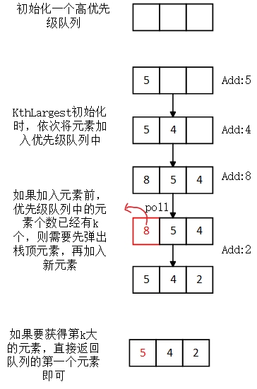

```java
class KthLargest {
    Queue<Integer> high_q;
    int limit;
    public KthLargest(int k, int[] nums) {
        limit = k;
        high_q = new PriorityQueue<>();
        for (int i = 0;i < nums.length;i++){
            add(nums[i]);
        }
    }

    public int add(int val) {
        high_q.offer(val);
        if (high_q.size() > limit){
            high_q.poll();
        }
        return high_q.peek();
    }
}
```


#### 第一百二十剑式： 出现频率最高的 k 个数字

> 题目来源：LeetCode 剑指 Offer II 060
>
> 标签：优先级队列、堆

给定一个整数数组 `nums` 和一个整数 `k` ，请返回其中出现频率前 `k` 高的元素。可以按 **任意顺序** 返回答案。

```java
class node{
    int val;
    int cnt;
    node(){}
    node(int v,int c){
        val = v;
        cnt = c;
    }
}

class Solution {
    Map<Integer,Integer> m = new HashMap<>();
    Queue<node> pq = new PriorityQueue<>(new Comparator<node>() {
        @Override
        public int compare(node o1, node o2) {
            return o2.cnt - o1.cnt;
        }
    });
    public int[] topKFrequent(int[] nums, int k) {
        for (int i = 0;i < nums.length;i++){
            m.put(nums[i],m.getOrDefault(nums[i],-1) + 1);
        }
        for (Map.Entry<Integer,Integer> entry: m.entrySet()){
            pq.offer(new node(entry.getKey(),entry.getValue()));
        }
        int [] ans = new int[k];
        for (int i = 0;i < k;i++){
            ans[i] = pq.poll().val;
        }
        return ans;
    }
}
```


#### 第一百二十一剑式： 和最小的k个数对

> 题目来源：LeetCode 剑指 Offer II 061
>
> 标签：优先级队列、堆

给定两个以升序排列的整数数组 nums1 和 nums2 , 以及一个整数 k 。

定义一对值 (u,v)，其中第一个元素来自 nums1，第二个元素来自 nums2 。

请找到和最小的 k 个数对 (u1,v1),  (u2,v2)  ...  (uk,vk) 

```java
class node{
    int val1;
    int val2;
    node(){}
    node(int v1,int v2){
        val1 = v1;
        val2 = v2;
    }
}

class Solution {
    public List<List<Integer>> kSmallestPairs(int[] nums1, int[] nums2, int k) {
        Queue<node> pq = new PriorityQueue<>(new Comparator<node>() {
            @Override
            public int compare(node o1, node o2) {
                return (o1.val1 + o1.val2) - (o2.val1 + o2.val2);
            }
        });
        for (int i = 0;i < nums1.length;i++){
            for (int j = 0;j < nums2.length;j++){
                pq.add(new node(nums1[i],nums2[j]));
            }
        }
        List<List<Integer>> ans = new ArrayList<List<Integer>>();
        for (int i = 0;i < k;i++){
            node t = pq.poll();
            if (t == null) break;
            ans.add(new ArrayList<>(Arrays.asList(t.val1,t.val2)));
        }
        return ans;
    }
}
```


#### 第一百二十二剑式： 实现前缀树

> 题目来源：LeetCode 剑指 Offer II 062
>
> 标签：集合、前缀树

Trie（发音类似 "try"）或者说 前缀树 是一种树形数据结构，用于高效地存储和检索字符串数据集中的键。这一数据结构有相当多的应用情景，例如自动补完和拼写检查。

请你实现 Trie 类：

- Trie() 初始化前缀树对象。
- void insert(String word) 向前缀树中插入字符串 word 。
- boolean search(String word) 如果字符串 word 在前缀树中，返回 true（即，在检索之前已经插入）；否则，返回 false 。
- boolean startsWith(String prefix) 如果之前已经插入的字符串 word 的前缀之一为 prefix ，返回 true ；否则，返回 false 。

```java
//笨方法，时间复杂度较高，不过还是AC了
class Trie {
    Set<String> set;
    /** Initialize your data structure here. */
    public Trie() {
        set = new HashSet<String>();
    }

    /** Inserts a word into the trie. */
    public void insert(String word) {
        if (set.contains(word)){
            return ;
        }
        set.add(word);
    }

    /** Returns if the word is in the trie. */
    public boolean search(String word) {
        if (set.contains(word)){
            return true;
        }
        return false;
    }

    /** Returns if there is any word in the trie that starts with the given prefix. */
    public boolean startsWith(String prefix) {
        Iterator<String> iter = set.iterator();
        while (iter.hasNext()){
            String str = iter.next();
            if (str.length() < prefix.length()) continue;
            if (prefix.equals(str.substring(0,prefix.length()))){
                return true;
            }
        }
        return false;
    }
}
```

方法二：采用字典树的真实实现

Trie，又称前缀树或字典树，是一棵有根树，其每个节点包含以下字段：

- 指向子节点的指针数组$\textit{children}$。对于本题而言，数组长度为 26，即小写英文字母的数量。此时 $\textit{children}[0]$ 对应小写字母 a，$\textit{children}[1]$ 对应小写字母 b，…，$\textit{children}[25]$ 对应小写字母 z。
- 布尔字段 $\textit{isEnd}$，表示该节点是否为字符串的结尾。

```java
class Trie {
    private Trie [] children;
    private boolean end;
    /** Initialize your data structure here. */
    public Trie() {
        children = new Trie[26];
        end = false;
    }

    /** Inserts a word into the trie. */
    public void insert(String word) {
        Trie node = this;
        for (int i = 0;i < word.length();i++){
            char ch = word.charAt(i);
            int idx = ch - 'a';
            if (node.children[idx] == null){
                node.children[idx] = new Trie();
            }
            node = node.children[idx];
        }
        node.end = true;
    }

    /** Returns if the word is in the trie. */
    public boolean search(String word) {
        Trie node = searchPrefix(word);
        return node != null && node.end;
    }

    /** Returns if there is any word in the trie that starts with the given prefix. */
    public boolean startsWith(String prefix) {
        return searchPrefix(prefix) != null;
    }
    
    private Trie searchPrefix(String prefix){
        Trie node = this;
        for (int i = 0;i < prefix.length();i++){
            char ch = prefix.charAt(i);
            int idx = ch - 'a';
            if (node.children[idx] == null){
                return null;
            }
            node = node.children[idx];
        }
        return node;
    }
}
```


#### 第一百二十三剑式： 替换单词

> 题目来源：LeetCode 剑指 Offer II 063
>
> 标签：前缀树

在英语中，有一个叫做 词根(root) 的概念，它可以跟着其他一些词组成另一个较长的单词——我们称这个词为 继承词(successor)。例如，词根an，跟随着单词 other(其他)，可以形成新的单词 another(另一个)。

现在，给定一个由许多词根组成的词典和一个句子，需要将句子中的所有继承词用词根替换掉。如果继承词有许多可以形成它的词根，则用最短的词根替换它。

需要输出替换之后的句子。

 ```
输入：dictionary = ["cat","bat","rat"], sentence = "the cattle was rattled by the battery"
输出："the cat was rat by the bat"
 ```

```java
//前缀树实现-->通过上一题稍作修改即可
class Trie {
    private Trie [] children;
    private boolean end;
    /** Initialize your data structure here. */
    public Trie() {
        children = new Trie[26];
        end = false;
    }
    /** Inserts a word into the trie. */
    public void insert(String word) {
        Trie node = this;
        for (int i = 0;i < word.length();i++){
            char ch = word.charAt(i);
            int idx = ch - 'a';
            if (node.children[idx] == null){
                node.children[idx] = new Trie();
            }else if (node.end){
            	break;
            }
            node = node.children[idx];
        }
        node.end = true;
    }
    public String getMinPrefix(String word){
        StringBuilder sb = new StringBuilder();
        Trie node = this;
        for (int i = 0;i < word.length();i++){
            char ch = word.charAt(i);
            int idx = ch - 'a';
            if (node.children[idx] == null || node.end == true) break;
            sb.append(ch);
            node = node.children[idx];
        }
        if (node.end){
            return sb.toString();
        }
        return null;
    }
}
class Solution {
    public String replaceWords(List<String> dictionary, String sentence) {
        StringBuilder sb = new StringBuilder();
        Trie tree = new Trie();
        for (int i = 0;i < dictionary.size();i++){
            tree.insert(dictionary.get(i));
        }
        String []words = sentence.split(" ");
        for (String word:words){
            String newword = tree.getMinPrefix(word);
            if (newword != null){
                sb.append(newword);
            }else{
                sb.append(word);
            }
            sb.append(" ");
        }
        return sb.toString().strip();
    }
}
```

#### 第一百二十四剑式： 神奇的字典

> 题目来源：LeetCode 剑指 Offer II 064
>
> 标签：前缀树、深度优先搜索

设计一个使用单词列表进行初始化的数据结构，单词列表中的单词 **互不相同** 。 如果给出一个单词，请判定能否只将这个单词中**一个**字母换成另一个字母，使得所形成的新单词存在于已构建的神奇字典中。

实现 `MagicDictionary` 类：

- `MagicDictionary()` 初始化对象
- `void buildDict(String[] dictionary)` 使用字符串数组 `dictionary` 设定该数据结构，`dictionary` 中的字符串互不相同
- `bool search(String searchWord)` 给定一个字符串 `searchWord` ，判定能否只将字符串中 **一个** 字母换成另一个字母，使得所形成的新字符串能够与字典中的任一字符串匹配。如果可以，返回 `true` ；否则，返回 `false` 。


```java
//字典树
class Trie{
    public Trie [] children;
    public boolean isend;
    Trie(){
        children = new Trie[26];
        isend = false;
    }
    public void insert(String str){
        Trie node = this;
        for (int i = 0;i < str.length();i++){
            char ch = str.charAt(i);
            int idx = ch - 'a';
            if (node.children[idx] == null){
                node.children[idx] = new Trie();
            }
            node = node.children[idx];
        }
        node.isend = true;
    }
}

class MagicDictionary {
    private Trie tree;
    /** Initialize your data structure here. */
    public MagicDictionary() {
        tree = new Trie();
    }

    public void buildDict(String[] dictionary) {
        for (String word : dictionary){
            tree.insert(word);
        }
    }
    private boolean dfs(Trie node,String word,int idx,int edit){
        if (node == null){
            return false;
        }
        //如果进行了一次修改并且成功匹配了前缀树
        if (node.isend == true && idx == word.length() && edit == 1){
            return true;
        }
        //匹配当前第idx个字符
        if (idx < word.length() && edit <= 1){
            boolean found = false;
            for (int j = 0;j < 26 && !found;j++){
                //如果当前第idx个字符 和 其中一个成功匹配，不会增加edit次数，否则进行一次修改
                int next = (j == (word.charAt(idx) - 'a') ? edit : edit + 1);
                found = dfs(node.children[j],word,idx+1,next);
            }
            return found;
        }
        //修改次数过多，直接返回false
        return false;
    }
    public boolean search(String searchWord) {
        return dfs(tree,searchWord,0,0);
    }
}
```


#### 第一百二十五剑式：最短的单词编码

> 题目来源：LeetCode 剑指 Offer II 065
>
> 标签：前缀树、深度优先搜索DFS

单词数组 `words` 的 **有效编码** 由任意助记字符串 `s` 和下标数组 `indices` 组成，且满足：

- `words.length == indices.length`
- 助记字符串 `s` 以 `'#'` 字符结尾
- 对于每个下标 `indices[i]` ，`s` 的一个从 `indices[i]` 开始、到下一个 `'#'` 字符结束（但不包括 `'#'`）的 **子字符串** 恰好与 `words[i]` 相等

给定一个单词数组 `words` ，返回成功对 `words` 进行编码的最小助记字符串 `s` 的长度 。


```java
class Trie{
    public Trie [] children;
    public boolean isend;
    public int cnt; //当前结点有几个子节点
    Trie(){
        children = new Trie[26];
        isend = false;
        cnt = 0;
    }
    public void reverseinsert(String str){
        Trie node = this;
        for (int i = str.length()-1;i >= 0;i--){
            char ch = str.charAt(i);
            int idx = ch - 'a';
            if (node.children[idx] == null){
                node.children[idx] = new Trie();
                node.cnt += 1;
            }
            node = node.children[idx];
        }
        node.isend = true;
    }
}

class Solution {
    int ans = 0;
    public void dfs(Trie tree,int floor){
        if (tree.isend && tree.cnt == 0){
            ans += floor;
            return ;
        }
        for (int i = 0;i < 26;i++){
            if (tree.children[i] != null){
                dfs(tree.children[i],floor+1);
            }
        }
    }
    public int minimumLengthEncoding(String[] words) {
        Trie tree = new Trie();
        for (String word: words){
            tree.reverseinsert(word);
        }
        dfs(tree,1);
        return ans;
    }
}
```


#### 第一百二十六剑式：单词之和

> 题目来源：LeetCode 剑指 Offer II 066
>
> 标签：前缀树、深度优先搜索DFS

实现一个 `MapSum` 类，支持两个方法，`insert` 和 `sum`：

- `MapSum()` 初始化 `MapSum` 对象
- `void insert(String key, int val)` 插入 `key-val` 键值对，字符串表示键 `key` ，整数表示值 `val` 。如果键 `key` 已经存在，那么原来的键值对将被替代成新的键值对。
- `int sum(string prefix)` 返回所有以该前缀 `prefix` 开头的键 `key` 的值的总和。


```java
class Trie{
    public Trie [] children;
    public boolean isend;
    public int cnt;
    Trie(){
        children = new Trie[26];
        isend = false;
        cnt = 0;
    }
    public void insert(String str){
        Trie node = this;
        for (int i = 0;i < str.length();i++){
            char ch = str.charAt(i);
            int idx = ch - 'a';
            if (node.children[idx] == null){
                node.children[idx] = new Trie();
                node.cnt += 1;
            }
            node = node.children[idx];
        }
        node.isend = true;
    }

}
class MapSum {
    Trie tree;
    Map<String ,Integer> m;
    int ans = 0;
    StringBuilder sb;
    
    public MapSum() {
        tree = new Trie();
        m = new HashMap<>();
    }

    public void insert(String key, int val) {
        tree.insert(key);
        m.put(key,val);
    }
    public void dfs(Trie node){
        if (node == null) return;
        if (node.isend){
            ans += m.getOrDefault(sb.toString(),0);
        }
        if (node.cnt == 0) return;
        for (int i  = 0; i < 26;i++){
            if (node.children[i] == null) continue;
            sb.append((char)('a' + i));
            dfs(node.children[i]);
            sb.deleteCharAt(sb.length()-1);
        }
    }
    public int sum(String prefix) {
        Trie node = tree;
        for (int i = 0;i < prefix.length();i++){
            char ch = prefix.charAt(i);
            int idx = ch - 'a';
            if ((node.children[idx] == null) || (node.isend && node.cnt == 0)){
                return 0;
            }
            node = node.children[idx];
        }
        ans = 0;
        sb = new StringBuilder(prefix);
        dfs(node);
        return ans;
    }
}
```


#### 第一百二十七剑式：数组中两个数的最大异或值

> 题目来源：LeetCode 剑指 Offer II 067
>
> 标签：前缀树、位运算

给你一个整数数组 `nums` ，返回 `nums[i] XOR nums[j]` 的最大运算结果，其中 `0 ≤ i ≤ j < n` 。

**进阶：**你可以在 `O(n)` 的时间解决这个问题吗？

```java
class Trie{
    public Trie [] children;
    Trie(){
        children = new Trie[2];
    }
    public void insert(int num){
        Trie node = this;
        for (int i = 30;i >= 0;i--){
            int bit = (num >> i) & 1;
            if (node.children[bit] == null){
                node.children[bit] = new Trie();
            }
            node = node.children[bit];
        }
    }
    public int check(int num){
        Trie node = this;
        int val = 0;
        for (int i = 30;i >= 0;i--){
            int bit = (num >> i) & 1;
            if (bit == 1){
                if (node.children[0] != null){
                    val |= (1 << i);
                    node = node.children[0];
                }else{
                    node = node.children[1];
                }
            }else{
                if (node.children[1] != null){
                    val |= (1 << i);
                    node = node.children[1];
                }else{
                    node = node.children[0];
                }
            }
        }
        return val;
    }
}

public class Solution {
    public int findMaximumXOR(int[] nums) {
        int ans = 0;
        Trie tree = new Trie();
        for (int num:nums){
            tree.insert(num);
        }
        for (int num:nums){
            ans = Math.max(ans,tree.check(num));
        }
        return ans;
    }
}
```


#### 第一百二十八剑式：查找插入位置

> 题目来源：LeetCode 剑指 Offer II 068
>
> 标签：二分查找

给定一个排序的整数数组 `nums` 和一个整数目标值` target` ，请在数组中找到 `target `，并返回其下标。如果目标值不存在于数组中，返回它将会被按顺序插入的位置。

请必须使用时间复杂度为 `O(log n)` 的算法。

```java
public class Solution {
   public int searchInsert(int[] nums, int target) {
        int left = 0,right = nums.length;
        while (left < right){
            int mid = left + ((right - left) >> 1);
            if (target == nums[mid]) return mid;
            else if (target < nums[mid]){
                right = mid;
            }else{
                left = mid + 1;
            }
        }
        return left;
    }
}
```


#### 第一百二十九剑式：山峰数组的顶部

> 题目来源：LeetCode 剑指 Offer II 069
>
> 标签：二分查找

符合下列属性的数组 arr 称为 山峰数组（山脉数组） ：

- arr.length >= 3
- 存在 i（0 < i < arr.length - 1）使得：
  - $arr[0] < arr[1] < ... arr[i-1] < arr[i]$
  - $arr[i] > arr[i+1] > ... > arr[arr.length - 1]$

给定由整数组成的山峰数组 arr ，返回任何满足 $arr[0] < arr[1] < ... arr[i - 1] < arr[i] > arr[i + 1] > ... > arr[arr.length - 1] $的下标 i ，即山峰顶部。


```java
class Solution {
    public int peakIndexInMountainArray(int[] arr) {
        int n = arr.length;
        int left = 0,right = n-1;
        while (left < right){
            int mid = left + ((right - left) >> 1);
            if (arr[mid-1] < arr[mid] && arr[mid] > arr[mid+1]){
                return mid;
            }else if(arr[mid-1] < arr[mid]){
                left = mid + 1;
            }else{
                right = mid;
            }
        }
        return left;
    }
}
```


#### 第一百三十剑式：排序数组中只出现一次的数字

> 题目来源：LeetCode 剑指 Offer II 070
>
> 标签：二分查找、哈希表、异或

给定一个只包含整数的有序数组 nums ，每个元素都会出现两次，唯有一个数只会出现一次，请找出这个唯一的数字。

题目解析：

哈希表、异或、二分查找均能解决

```java
//二分查找 O(log n)
class Solution {
    public int singleNonDuplicate(int[] nums) {
        int n = nums.length;
        int left = 0,right = n-1;
        while (left < right){
            int mid = left + ((right - left) >> 1);
            if (mid == 0 || mid == n-1) return nums[mid];
            if (nums[mid] != nums[mid-1] && nums[mid] != nums[mid+1]) return nums[mid];
            if (nums[mid] == nums[mid-1] && mid % 2 == 1) left = mid + 1;
            else if (nums[mid] == nums[mid-1] && mid % 2 == 0) right = mid - 2;
            else if (nums[mid] == nums[mid+1] && mid % 2 == 1)  right = mid - 1;
            else if (nums[mid] == nums[mid+1] && mid % 2 == 0) left = mid + 2;
        }
        return nums[left];
    }
}
```


#### 第一百三十一剑式：按权重生成随机数

> 题目来源：LeetCode 剑指 Offer II 071
>
> 标签：二分查找、前缀和

给定一个正整数数组 `w` ，其中 `w[i]` 代表下标 `i` 的权重（下标从 `0` 开始），请写一个函数 `pickIndex` ，它可以随机地获取下标 `i`，选取下标 `i` 的概率与 `w[i]` 成正比。

例如，对于 `w = [1, 3]`，挑选下标 `0` 的概率为 `1 / (1 + 3) = 0.25` （即，25%），而选取下标 `1` 的概率为 `3 / (1 + 3) = 0.75`（即，75%）。

也就是说，选取下标 `i` 的概率为 `w[i] / sum(w)` 。

```java
class Solution {
    int [] pre;
    int total;
    public Solution(int[] w) {
        pre = new int [w.length];
        pre[0] = w[0];
        for (int i = 1;i < w.length;i++){
            pre[i] = pre[i-1] + w[i];
        }
        total = Arrays.stream(w).sum();
    }

    public int pickIndex() {
        int x = (int)(Math.random() * total) + 1;
        return binarySearch(x);
    }

    public int binarySearch(int x){
        int left = 0,right = pre.length - 1;
        while (left < right){
            int mid = left + ((right - left) >> 1);
            if (pre[mid] > x){
                right = mid;
            }else{
                left = mid + 1;
            }
        }
        return left;
    }
}
```


#### 第一百三十二剑式：求平方根

> 题目来源：LeetCode 剑指 Offer II 072
>
> 标签：二分查找

给定一个非负整数 `x` ，计算并返回 `x` 的平方根，即实现 `int sqrt(int x)` 函数。

正数的平方根有两个，只输出其中的正数平方根。

如果平方根不是整数，输出只保留整数的部分，小数部分将被舍去。

```java
//通过判别精度
class Solution {
    public int mySqrt(int x) {
        int tmp = (int)Math.sqrt(x);
        if ((int)Math.pow(tmp,2) == x){
            return tmp;
        }
        double left = 0,right = x;
        while (right - left > 0.001){
            double mid = (left + right) / 2;
            if (Math.pow(mid,2) > x){
                right = mid;
            }else{
                left = mid;
            }
        }
        return (int)(left);
    }
}
```

```java
//通过判别 大小
class Solution {
	public int mySqrt(int x) {
        int left = 1, right = x;    
        while (left <= right)
        {
            int mid = left + ((right - left) >> 1);
            if (mid <= x /mid){
                if ((mid + 1) > x / (mid + 1)) return mid;
                left = mid + 1;
            }else{
                right = mid - 1;
            }
        }
        return 0;                  
    }
};
```

#### 第一百三十三剑式：狒狒吃香蕉

> 题目来源：LeetCode 剑指 Offer II 073
>
> 标签：二分查找

狒狒喜欢吃香蕉。这里有 `N` 堆香蕉，第 `i` 堆中有 `piles[i]` 根香蕉。警卫已经离开了，将在 `H` 小时后回来。

狒狒可以决定她吃香蕉的速度 `K` （单位：根/小时）。每个小时，她将会选择一堆香蕉，从中吃掉 `K` 根。如果这堆香蕉少于 `K` 根，她将吃掉这堆的所有香蕉，然后这一小时内不会再吃更多的香蕉，下一个小时才会开始吃另一堆的香蕉。 

狒狒喜欢慢慢吃，但仍然想在警卫回来前吃掉所有的香蕉。

返回她可以在 `H` 小时内吃掉所有香蕉的最小速度 `K`（`K` 为整数）。

题目解析：

经典二分答案解决

```java
    public boolean check(int[] piles,int mid,int h){
        //定义吃完所有香蕉的时间 need_h
        int need_h = 0;
        //遍历每一堆香蕉
        for (int i = 0;i < piles.length;i++){
            if (piles[i] % mid == 0){ //如果当前堆香蕉恰好能吃完，直接进行除法获取吃完第i堆香蕉的时间并累加
                need_h += (piles[i] / mid);
            }else{  //如果不能恰好吃完，就多吃一次
                need_h += (piles[i] / mid) + 1;
            }
        }
        return need_h <= h; //判断花费时间是否小于等于要求时间
    }
    public int minEatingSpeed(int[] piles, int h) {
        int left = 1,right = Integer.MAX_VALUE;
        while (left < right){
            int mid = left + ((right - left) >> 1);
            if (check(piles,mid,h)){
                right = mid;
            }else{
                left = mid + 1;
            }
        }
        return left;
    }
```


#### 第一百三十四剑式：合并区间

> 题目来源：LeetCode 剑指 Offer II 074
>
> 标签：排序

以数组 intervals 表示若干个区间的集合，其中单个区间为 intervals[i] = [starti, endi] 。请你合并所有重叠的区间，并返回一个不重叠的区间数组，该数组需恰好覆盖输入中的所有区间。

```java
class Solution {
    public int[][] merge(int[][] intervals) {
        if(intervals.length == 0){
            return intervals;
        }
        Arrays.sort(intervals, new Comparator<int[]>() {
            @Override
            public int compare(int[] o1, int[] o2) {
                return o1[0] - o2[0];
            }
        });
        List<int[]> ans = new ArrayList<int[]>();
        ans.add(new int[]{intervals[0][0],intervals[0][1]});
        for (int i = 1;i < intervals.length;i++){
            int first = ans.get(ans.size() - 1)[0];
            int second = ans.get(ans.size() - 1)[1];
            if (intervals[i][0] >= first && intervals[i][0] <= second){
                if (intervals[i][1] > second){
                    ans.set(ans.size()-1,new int[]{first,intervals[i][1]});
                }
            }else{
                ans.add(new int[]{intervals[i][0],intervals[i][1]});
            }
            
        }
        return ans.toArray(new int[ans.size()][]);
    }
}
```


#### 第一百三十五剑式：数组的相对排序

> 题目来源：LeetCode 剑指 Offer II 075
>
> 标签：排序

给定两个数组，`arr1` 和 `arr2`，

- `arr2` 中的元素各不相同
- `arr2` 中的每个元素都出现在 `arr1` 中

对 `arr1` 中的元素进行排序，使 `arr1` 中项的相对顺序和 `arr2` 中的相对顺序相同。未在 `arr2` 中出现过的元素需要按照升序放在 `arr1` 的末尾。

```java
class Mynode{
    int val;
    int level;
    Mynode(){}
    Mynode(int v,int l){
        val = v;
        level = l;
    }
}
class Solution {
    public int[] relativeSortArray(int[] arr1, int[] arr2) {
        Map<Integer,Integer> m = new HashMap<>();
        for (int i = 0;i < arr2.length;i++){
            m.put(arr2[i],i);
        }
        List<Mynode> ans = new ArrayList<>();
        for (int i = 0;i < arr1.length;i++){
            ans.add(new Mynode(arr1[i],m.getOrDefault(arr1[i],Integer.MAX_VALUE)));
        }
        ans.sort(new Comparator<Mynode>() {
            @Override
            public int compare(Mynode o1, Mynode o2) {
                if (o1.level == o2.level){
                    return o1.val - o2.val;
                }
                return o1.level - o2.level;
            }
        });
        int [] arr_ans = new int[ans.size()];
        for (int i = 0;i <arr_ans.length;i++){
            arr_ans[i] = ans.get(i).val;
        }
        return arr_ans;
    }
}
```

#### 第一百三十六剑式：数组中第K大的数字

> 题目来源：LeetCode 剑指 Offer II 076
>
> 标签：排序

给定整数数组 `nums` 和整数 `k`，请返回数组中第 `**k**` 个最大的元素。

请注意，你需要找的是数组排序后的第 `k` 个最大的元素，而不是第 `k` 个不同的元素。

```java
class Solution {
    public int findKthLargest(int[] nums, int k) {
        Arrays.sort(nums);
        return nums[nums.length-k];
    }
}
```

#### 第一百三十七剑式：链表排序

> 题目来源：LeetCode 剑指 Offer II 077
>
> 标签：排序、链表

给定链表的头结点 `head` ，请将其按 **升序** 排列并返回 **排序后的链表** 。

```java
//链表->数组->排序->数组
class Solution {
    public ListNode sortList(ListNode head) {
        List<Integer> arr = new ArrayList<>();
        ListNode node = head;
        while (node != null){
            arr.add(node.val);
            node = node.next;
        }
        arr.sort(new Comparator<Integer>() {
            @Override
            public int compare(Integer o1, Integer o2) {
                return o1 - o2;
            }
        });
        node = head;
        int idx = 0;
        while (node != null){
            node.val = arr.get(idx++);
            node = node.next;
        }
        return head;
    }
}
```

#### 第一百三十八剑式：合并排序链表

> 题目来源：LeetCode 剑指 Offer II 078
>
> 标签：排序、链表

给定一个链表数组，每个链表都已经按升序排列。请将所有链表合并到一个升序链表中，返回合并后的链表。

```java

class Solution {
    public ListNode merge(ListNode a,ListNode b){
        //设置链表 a 的 头节点是小于 b 的
        if (a.val > b.val){
            return merge(b,a);
        }
        ListNode node_a = a;
        ListNode node_b = b;
        ListNode pre_a = null;
        while (node_a != null && node_b != null){
            ListNode next_b = node_b.next;
            while (node_a != null && node_a.val <= node_b.val){
                pre_a = node_a;
                node_a = node_a.next;
            }
            if (node_a != null){
                node_b.next = pre_a.next;
                pre_a.next = node_b;
                node_b = next_b;
                pre_a = pre_a.next;
            }
        }
        if (node_a == null){
            pre_a.next = node_b;
        }
        return a;
    }
    public ListNode mergeKLists(ListNode[] lists) {
        if (lists.length == 0) return null;
        ListNode head = null;
        for (int i = 0;i < lists.length;i++){
            if (lists[i] != null){
                head = lists[i];
                break;
            }
        }
        if (head == null) return head;
        for (int i = 0;i <  lists.length;i++){
            if (lists[i] == null || lists[i] == head) continue;
            head = merge(head,lists[i]);
        }
        return head;
    }
}
```

#### 第一百三十九剑式：允许重复选择元素的组合

> 题目来源：LeetCode 剑指 Offer II 079
>
> 标签：回溯（递归）

给定一个整数数组 `nums` ，数组中的元素 **互不相同** 。返回该数组所有可能的子集（幂集）。

解集 **不能** 包含重复的子集。你可以按 **任意顺序** 返回解集。

```java
class Solution {
    List<List<Integer>> ans = new ArrayList<List<Integer>>();
    List<Integer> path = new ArrayList<>();
    public void dfs(int [] nums,int idx){
        if (idx == nums.length){
            ans.add(new ArrayList<>(path));
            return ;
        }
        //不选择当前元素
        dfs(nums,idx+1);
        //选择当前元素
        path.add(nums[idx]);
        dfs(nums,idx+1);
        path.remove(path.size()- 1);
        
    }
    public List<List<Integer>> subsets(int[] nums) {
        dfs(nums,0);
        return ans;
    }
}
```

#### 第一百四十剑式：含有K个元素的组合

> 题目来源：LeetCode 剑指 Offer II 080
>
> 标签：回溯（递归）

给定两个整数 `n` 和 `k`，返回 `1 ... n` 中所有可能的 `k` 个数的组合。

```java
class Solution {
    List<List<Integer>> ans = new ArrayList<List<Integer>>();
    List<Integer> path = new ArrayList<>();
    boolean [] used ;
    public void dfs(int n,int k,int num){
        if (path.size() == k){
            ans.add(new ArrayList<>(path));
            return ;
        }
        for (int i = num;i <= n;i++){
            path.add(i);
            dfs(n,k,i+1);
            path.remove(path.size()-1);
        }
    }
    public List<List<Integer>> combine(int n, int k) {
        used = new boolean [n+1];
        dfs(n,k,1);
        return ans;
    }
}
```

#### 第一百四十一剑式：允许重复选择元素的组合

> 题目来源：LeetCode 剑指 Offer II 081
>
> 标签：排序、回溯（递归）

给定一个**无重复元素**的正整数数组 `candidates` 和一个正整数 `target` ，找出 `candidates` 中所有可以使数字和为目标数 `target` 的唯一组合。

`candidates` 中的数字可以无限制重复被选取。如果至少一个所选数字数量不同，则两种组合是唯一的。 

对于给定的输入，保证和为 `target` 的唯一组合数少于 `150` 个。

```java
class Solution {
    List<List<Integer>> ans = new ArrayList<List<Integer>>();
    List<Integer> path = new ArrayList<>();
    public void dfs(int[] candidates,int target,int value){
        if (value == target){
            ans.add(new ArrayList<>(path));
            return ;
        }
        for (int i = 0;i < candidates.length;i++){
            //防止出现[2,2,3] [2,3,2] [3,2,2]
            if (path.size() > 0 && candidates[i] < path.get(path.size()-1)) continue; //如果没有此行，会出现元素集合相同的列表
            if (value + candidates[i] > target) break;
            path.add(candidates[i]);
            dfs(candidates,target,value+candidates[i]);
            path.remove(path.size()-1);
        }
    }
    public List<List<Integer>> combinationSum(int[] candidates, int target) {
        Arrays.sort(candidates);
        dfs(candidates,target,0);
        return ans;
    }
}
```

#### 第一百四十二剑式：含有重复元素集合的组合

> 题目来源：LeetCode 剑指 Offer II 082
>
> 标签：排序、回溯（递归）

给定一个可能有重复数字的整数数组 `candidates` 和一个目标数 `target` ，找出 `candidates` 中所有可以使数字和为 `target` 的组合。

`candidates` 中的每个数字在每个组合中只能使用一次，解集不能包含重复的组合。 

```java
class Solution {
    List<List<Integer>> ans = new ArrayList<List<Integer>>();
    List<Integer> path = new ArrayList<>();
    boolean [] used ;
    public void dfs(int [] candidates,int target,int val,int idx){
        if (idx == candidates.length || val == target){
            if (val == target){
                ans.add(new ArrayList<>(path));
            }
            return ;
        }
        for (int i = idx;i < candidates.length;i++){
            //这行代码很重要哦
            if (i > 0 && candidates[i] == candidates[i-1] && !used[i-1]) continue;
            if (val + candidates[i] > target) break;
            path.add(candidates[i]);
            used[i] = true;
            dfs(candidates,target,val+candidates[i],i+1);
            used[i] = false;
            path.remove(path.size()-1);
        }
    }
    public List<List<Integer>> combinationSum2(int[] candidates, int target) {
        used = new boolean[candidates.length];
        Arrays.sort(candidates);
        dfs(candidates,target,0,0);
        return ans;
    }
}
```

#### 第一百四十三剑式：没有重复元素集合的全排列

> 题目来源：LeetCode 剑指 Offer II 083
>
> 标签：排序、回溯（递归）

给定一个不含重复数字的整数数组 `nums` ，返回其 **所有可能的全排列** 。可以 **按任意顺序** 返回答案。

 ```java
class Solution {
    List<List<Integer>> ans = new ArrayList<List<Integer>>();
    List<Integer> path = new ArrayList<>();
    boolean [] used ;
    public void dfs(int [] nums){
        if (path.size() == nums.length){
            ans.add(new ArrayList<>(path));
            return ;
        }
        for (int i = 0;i < nums.length;i++){
            if (used[i]) continue;
            used[i] = true;
            path.add(nums[i]);
            dfs(nums);
            used[i] = false;
            path.remove(path.size()-1);
        }
    }
    public List<List<Integer>> permute(int[] nums) {
        used = new boolean[nums.length];
        dfs(nums);
        return ans;
    }
}
 ```

#### 第一百四十四剑式：含有重复元素集合的全排列

> 题目来源：LeetCode 剑指 Offer II 084
>
> 标签：排序、回溯（递归）

给定一个可包含重复数字的整数集合 `nums` ，**按任意顺序** 返回它所有不重复的全排列。

```java
class Solution {
    List<List<Integer>> ans = new ArrayList<List<Integer>>();
    List<Integer> path = new ArrayList<>();
    boolean [] used ;
    public void dfs(int [] nums,int idx){
        if (path.size() == nums.length){
            ans.add(new ArrayList<>(path));
            return ;
        }
        for (int i = 0;i < nums.length;i++){
            if (i > 0 && nums[i] == nums[i-1] && !used[i-1]) continue;
            if (used[i]) continue;
            used[i] = true;
            path.add(nums[i]);
            dfs(nums,i+1);
            used[i] = false;
            path.remove(path.size()-1);
        }
    }
    public List<List<Integer>> permuteUnique(int[] nums) {
        used = new boolean[nums.length];
        Arrays.sort(nums);
        dfs(nums,0);
        return ans;
    }
}
```


#### 第一百四十五剑式：生成匹配的括号

> 题目来源：LeetCode 剑指 Offer II 085
>
> 标签：回溯（递归）

正整数 `n` 代表生成括号的对数，请设计一个函数，用于能够生成所有可能的并且 **有效的** 括号组合。

```
输入：n = 3
输出：["((()))","(()())","(())()","()(())","()()()"]
```

```java
class Solution {
    List<String> ans = new ArrayList<>();
    StringBuilder sb ;
    public void dfs(int n,int lcnt,int rcnt){
        if (lcnt == rcnt && n == lcnt){//如果左右括号个数都等于n，则存储当前结果
            ans.add(new String(sb.toString()));
            return ;
        }
        //只有左括号个数大于右括号个数时才可以添加右括号
        if (lcnt > rcnt){
            sb.append(')');
            dfs(n,lcnt,rcnt+1);
            sb.deleteCharAt(sb.length()-1);
        }
        //如果左括号个数小于要求的个数，可以添加左括号
        if (lcnt < n){
            sb.append('(');
            dfs(n,lcnt+1,rcnt);
            sb.deleteCharAt(sb.length()-1);
        }
    }
    public List<String> generateParenthesis(int n) {
        sb = new StringBuilder(n * 2);
        dfs(n,0,0);
        return ans;
    }
}
```


#### 第一百四十六剑式：分割回文子字符串

> 题目来源：LeetCode 剑指 Offer II 086
>
> 标签：回溯（递归）

给定一个字符串 `s` ，请将 `s` 分割成一些子串，使每个子串都是 **回文串** ，返回 s 所有可能的分割方案。**回文串** 是正着读和反着读都一样的字符串。

```java
class Solution {
    boolean[][] dp;
    List<List<String>> ans = new ArrayList<List<String>>();
    List<String> path = new ArrayList<>();

    public String[][] partition(String s) {
        int n = s.length();
        char [] arr = s.toCharArray();
        dp = new boolean[n][n];//初始化dp[][]
        for (int i = 0;i < n;i++){
            for (int j = 0;j < n;j++){
                dp[i][j] = true;
            }
        }
        //动态规划方法存储字符串的[i,j]子串是否时回文串
        for (int i = n-1;i >= 0;i--){
            for (int j = i + 1;j < n;j++){
                dp[i][j] = (arr[i] == arr[j] && dp[i+1][j-1]);
            }
        }
        //递归
        dfs(s,0);
        String [][] finalAns = new String[ans.size()][];
        for (int i = 0;i < ans.size();i++){
            finalAns[i] = new String[ans.get(i).size()];
            for (int j = 0;j < finalAns[i].length;j++){
                finalAns[i][j] = ans.get(i).get(j);
            }
        }
        return finalAns;
    }
    public void dfs(String s,int idx){
        if (idx == s.length()){
            ans.add(new ArrayList<>(path));
            return ;
        }
        for (int i = idx;i < s.length();i++){
            //如果
            if (dp[idx][i] == true){
                path.add(s.substring(idx,i+1));
                dfs(s,i+1);
                path.remove(path.size()-1);
            }
        }
    }
}
```


#### 第一百四十七剑式：复原IP

> 题目来源：LeetCode 剑指 Offer II 087
>
> 标签：回溯（递归）

给定一个只包含数字的字符串 `s` ，用以表示一个 IP 地址，返回所有可能从 `s` 获得的 **有效 IP 地址** 。你可以按任何顺序返回答案。

**有效 IP 地址** 正好由四个整数（每个整数位于 0 到 255 之间组成，且不能含有前导 `0`），整数之间用 `'.'` 分隔。

例如："0.1.2.201" 和 "192.168.1.1" 是 **有效** IP 地址，但是 "0.011.255.245"、"192.168.1.312" 和 "192.168@1.1" 是 **无效** IP 地址。

 ```java
class Solution {
    List<String> ans = new ArrayList<>();
    StringBuilder sb ;
    public void dfs(String s,int idx,int seg){
        if(seg == 4){
            if (idx == s.length())
                ans.add(new String(sb.toString()));
            return ;
        }
        for (int i = idx;i < idx+3 && i < s.length();i++){
            String tmp = s.substring(idx,i+1);
            if (tmp.length() > 1 && tmp.charAt(0) == '0') continue;
            if (Integer.parseInt(tmp) > 255) continue;
            if (seg < 3){
                tmp = tmp + ".";
            }
            sb.append(tmp);
            dfs(s,i+1,seg+1);
            sb.delete(sb.length()-tmp.length(),sb.length());
        }
    }
    public List<String> restoreIpAddresses(String s) {
        sb = new StringBuilder(s.length()+3);
        dfs(s,0,0);
        return ans;
    }
}
 ```


#### 第一百四十八剑式：爬楼梯的最少成本

> 题目来源：LeetCode 剑指 Offer II 088
>
> 标签：动态规划

数组的每个下标作为一个阶梯，第 `i` 个阶梯对应着一个非负数的体力花费值 `cost[i]`（下标从 `0` 开始）。

每当爬上一个阶梯都要花费对应的体力值，一旦支付了相应的体力值，就可以选择向上爬一个阶梯或者爬两个阶梯。

请找出达到楼层顶部的最低花费。在开始时，你可以选择从下标为 0 或 1 的元素作为初始阶梯。

```java
class Solution {
    public int minCostClimbingStairs(int[] cost) {
        int n = cost.length;
        int [] dp = new int[n+1];
        for (int i = 2;i <= n;i++){
            dp[i] = Math.min(dp[i-1]+cost[i-1],dp[i-2]+cost[i-2]);
        }
        return dp[n];
    }
}
```


#### 第一百四十九剑式：房屋偷盗

> 题目来源：LeetCode 剑指 Offer II 089
>
> 标签：动态规划

一个专业的小偷，计划偷窃沿街的房屋。每间房内都藏有一定的现金，影响小偷偷窃的唯一制约因素就是相邻的房屋装有相互连通的防盗系统，如果两间相邻的房屋在同一晚上被小偷闯入，系统会自动报警。

给定一个代表每个房屋存放金额的非负整数数组 nums ，请计算 不触动警报装置的情况下 ，一夜之内能够偷窃到的最高金额。

```java
class Solution {
    public int rob(int[] nums) {
        int n = nums.length;
        /*
           dp[i][0]: 当前不偷获得的最大利润
           dp[i][1]: 当前偷获得的最大利润
         */
        int [][]dp = new int[n][2];
        dp[0][1] = nums[0];
        for (int i = 1;i < n;i++){
            dp[i][0] = Math.max(dp[i-1][0],dp[i-1][1]);
            dp[i][1] = Math.max(dp[i-1][0]+nums[i],dp[i-1][1]);
        }
        return Math.max(dp[n-1][0],dp[n-1][1]);
    }
}
```


#### 第一百五十剑式：环形房屋偷盗

> 题目来源：LeetCode 剑指 Offer II 090
>
> 标签：动态规划

一个专业的小偷，计划偷窃一个环形街道上沿街的房屋，每间房内都藏有一定的现金。这个地方所有的房屋都 围成一圈 ，这意味着第一个房屋和最后一个房屋是紧挨着的。同时，相邻的房屋装有相互连通的防盗系统，如果两间相邻的房屋在同一晚上被小偷闯入，系统会自动报警 。

给定一个代表每个房屋存放金额的非负整数数组 nums ，请计算 在不触动警报装置的情况下 ，今晚能够偷窃到的最高金额。

```java
class Solution {
    public int rob_home(int [] nums,int l,int r){
        int [] dp = new int[r-l+1];
        dp[0] = nums[l];
        dp[1] = Math.max(nums[l],nums[l+1]);
        for (int i = l + 2;i <= r;i++){
            dp[i-l] = Math.max(dp[i-l-1],dp[i-l-2] + nums[i]);
        }
        return dp[r-l];
    }
    public int rob(int[] nums) {
        int n = nums.length;
        if (n == 1) return nums[0];
        else if (n == 2) return Math.max(nums[0],nums[1]);
        return Math.max(rob_home(nums,0,n-2),rob_home(nums,1,n-1));
    }
}
```


#### 第一百五十一剑式：粉刷房子

> 题目来源：LeetCode 剑指 Offer II 091
>
> 标签：动态规划

假如有一排房子，共 n 个，每个房子可以被粉刷成红色、蓝色或者绿色这三种颜色中的一种，你需要粉刷所有的房子并且使其相邻的两个房子颜色不能相同。

当然，因为市场上不同颜色油漆的价格不同，所以房子粉刷成不同颜色的花费成本也是不同的。每个房子粉刷成不同颜色的花费是以一个 n x 3 的正整数矩阵 costs 来表示的。

例如，costs[0][0] 表示第 0 号房子粉刷成红色的成本花费；costs[1][2] 表示第 1 号房子粉刷成绿色的花费，以此类推。

请计算出粉刷完所有房子最少的花费成本。

```java
class Solution {
    public int minCost(int[][] costs) {
        int n = costs.length;
        int [][] dp = new int[n][3];
        dp[0][0] = costs[0][0];
        dp[0][1] = costs[0][1];
        dp[0][2] = costs[0][2];
        for (int i = 1;i < n;i++){
            dp[i][0] = Math.min(dp[i-1][1],dp[i-1][2]) + costs[i][0];
            dp[i][1] = Math.min(dp[i-1][0],dp[i-1][2]) + costs[i][1];
            dp[i][2] = Math.min(dp[i-1][1],dp[i-1][0]) + costs[i][2];
        }
        return Math.min(dp[n-1][0],Math.min(dp[n-1][1],dp[n-1][2]));
    }
}
```


####  第一百五十二剑式：翻转字符

> 题目来源：LeetCode 剑指 Offer II 092

> 标签：动态规划

如果一个由 `'0'` 和 `'1'` 组成的字符串，是以一些 `'0'`（可能没有 `'0'`）后面跟着一些 `'1'`（也可能没有 `'1'`）的形式组成的，那么该字符串是 **单调递增** 的。

我们给出一个由字符 `'0'` 和 `'1'` 组成的字符串 s，我们可以将任何 `'0'` 翻转为 `'1'` 或者将 `'1'` 翻转为 `'0'`。

返回使 s **单调递增** 的最小翻转次数。


```java
class Solution {
    public int minFlipsMonoIncr(String s) {
        int n = s.length();
        int [][] dp = new int[n][2];
        if (s.charAt(0) == '0'){
            dp[0][1] = 1;
        }else{
            dp[0][0] = 1;
        }
        for (int i = 1;i < n;i++){
            dp[i][0] = dp[i-1][0] + (s.charAt(i) == '0' ? 0 : 1);
            dp[i][1] = Math.min(dp[i-1][0],dp[i-1][1]) + (s.charAt(i) == '1' ? 0 : 1);
        }
        return Math.min(dp[n-1][0],dp[n-1][1]);
    }
}
```

####  第一百五十三剑式：最长斐波那契数列

> 题目来源：LeetCode 剑指 Offer II 093

> 标签：动态规划

如果序列 X_1, X_2, ..., X_n 满足下列条件，就说它是 斐波那契式 的：

- n >= 3
- 对于所有 i + 2 <= n，都有 X_i + X_{i+1} = X_{i+2}
  给定一个严格递增的正整数数组形成序列 arr ，找到 arr 中最长的斐波那契式的子序列的长度。如果一个不存在，返回  0 。

（子序列是从原序列 arr 中派生出来的，它从 arr 中删掉任意数量的元素（也可以不删），而不改变其余元素的顺序。例如， [3, 5, 8] 是 [3, 4, 5, 6, 7, 8] 的一个子序列）

题目解析：

**状态定义**：

$dp[i][j]$：表示以$A[i],A[j]$结尾的斐波那契数列的最大长度:$dp[i][j] = Len(......, A[i],A[j])$

**状态转移方程**：
$$
dp[i][j] = Max(dp[i][j],dp[k][i]) + 1,\text{if A[k] + A[i] = A[j] && k is exit}
$$

```java
class Solution {
    public int lenLongestFibSubseq(int[] arr) {
        int n = arr.length;
        Map<Integer,Integer> m = new HashMap<>();
        for(int i = 0;i < n;i++){
            m.put(arr[i],i);
        }
        int [][] dp = new int[n][n];
        for (int i = 0;i < n;i++){
            for (int j = i + 1;j < n;j++){
                dp[i][j] = 2;
            }
        }
        int ans = 0;
        for (int i = 0;i < n;i++){
            for (int j = i + 1; j < n;j++){
                int diff = arr[j] - arr[i];
                int idx = m.getOrDefault(diff,-1);
                if (idx >= 0 && idx < i){
                    dp[i][j] = Math.max(dp[i][j],dp[idx][i]) + 1;
                }
                ans = Math.max(dp[i][j],ans);
            }
        }
        return ans >= 3 ? ans : 0;
    }
}
```

####  第一百五十四剑式：最少回文分割

> 题目来源：LeetCode 剑指 Offer II 094

> 标签：动态规划

给定一个字符串 `s`，请将 `s` 分割成一些子串，使每个子串都是回文串。

返回符合要求的 **最少分割次数** 。

```java
   public int minCut(String s) {
        // 预处理，g[i][j] 快速判断s[i~j]是否是回文串 也是动态规划的方法
        int n = s.length();
        boolean [][] g = new boolean[n][n];
        for (int i = 0;i < n;i++){
            Arrays.fill(g[i],true);
        }
        for (int i = n-1;i >= 0;i--){
            for (int j = i + 1;j < n;j++){
                g[i][j] = g[i+1][j-1] && s.charAt(i) == s.charAt(j);
            }
        }
        // 动态规划 判断dp[i]即s[0 ~ i]的最少剪切次数使得所有字符串都为回文串
        int [] dp = new int[n];
        Arrays.fill(dp,Integer.MAX_VALUE);
        for (int i = 0;i < n;i++){
            if (g[0][i] == true){ //如果s[0~i]本身就是回文串
                dp[i] = 0;
            }else{ //遍历所有分割结点，判断最少分割次数可以使得所有子串都是回文串
                for (int j = 0;j < i;j++){
                    if (g[j+1][i]){ //如果s[j+1 ~ i]是回文串，则分割s[0,j]的最少次数dp[j]+1就是dp[i]的最少分割次数
                        dp[i] = Math.min(dp[i],dp[j]+1);
                    }
                }
            }
        }
        return dp[n-1];
    }
```

####  第一百五十五剑式：最长公共子序列

> 题目来源：LeetCode 剑指 Offer II 095

> 标签：动态规划

给定两个字符串 `text1` 和 `text2`，返回这两个字符串的最长 **公共子序列** 的长度。如果不存在 **公共子序列** ，返回 `0` 。

一个字符串的 **子序列** 是指这样一个新的字符串：它是由原字符串在不改变字符的相对顺序的情况下删除某些字符（也可以不删除任何字符）后组成的新字符串。

- 例如，`"ace"` 是 `"abcde"` 的子序列，但 `"aec"` 不是 `"abcde"` 的子序列。

两个字符串的 **公共子序列** 是这两个字符串所共同拥有的子序列。

```java
class Solution {
    public int longestCommonSubsequence(String text1, String text2) {
        int m = text1.length(),n = text2.length();
        int [][] dp = new int[m+1][n+1];
        //dp[i][j] 表示 text1[0~i]和text2[0~j]的最长公共子序列是多少
        for (int i = 0;i <= m;i++){
            for (int j = 0;j <= n;j++){
                if (i == 0 || j == 0){ //空串和任何字符串的公共子序列长度都为0
                     dp[i][j] = 0;
                     continue;
                }
                if (text1.charAt(i-1) == text2.charAt(j-1)){ //如果当前两个字符相等，则根据前面的状态+1即可得到当前状态
                    dp[i][j] = dp[i-1][j-1] + 1;
                }else{
                    dp[i][j] = Math.max(dp[i-1][j],dp[i][j-1]); 
                }
            }
        }
        return dp[m][n];
    }
}
```


####  第一百五十六剑式：字符串交织

> 题目来源：LeetCode 剑指 Offer II 096

> 标签：动态规划

给定三个字符串 s1、s2、s3，请判断 s3 能不能由 s1 和 s2 交织（交错） 组成。

两个字符串 s 和 t 交织 的定义与过程如下，其中每个字符串都会被分割成若干 非空 子字符串：

-  $ s = s_1 + s_2 + ... + s_n$
- $ t = t_1 + t_2 + ... + t_m $
- |n - m| <= 1
- **交织** 是$ s_1 + t_1 + s_2 + t_2 + s_3 + t_3 + ... $或者$ t_1 + s_1 + t_2 + s_2 + t_3 + s_3 + ...$

提示：a + b 意味着字符串 a 和 b 连接。

```java
class Solution {
    public boolean isInterleave(String s1, String s2, String s3) {
        int m = s1.length(),n = s2.length(), p = s3.length();
        if (m + n != p) return false;
        boolean [][] dp = new boolean[m+1][n+1];
        // dp[i][j] 表示s1前i个字符和s2前j个字符能否 交织 成s3
        dp[0][0] = true;
        for (int i = 0;i <= m;i++){
            for (int j = 0;j <= n;j++){
                int t = i + j - 1;
                if (i > 0){
                    dp[i][j] |= (s1.charAt(i-1) == s3.charAt(t) && dp[i-1][j]);  //注意是 |= 而不是 = 是为了防止在当前条件语句中dp[i][j] = true;后，在下一个 j > 0的条件语句中被赋值为false
                }
                if (j > 0){
                    dp[i][j] |= (s2.charAt(j-1) == s3.charAt(t) && dp[i][j-1]);
                }
            }
        }
        return dp[m][n];
    }
}
```


####  第一百五十七剑式：不同的子序列

> 题目来源：LeetCode 剑指 Offer II 097

> 标签：动态规划

给定一个字符串 `s` 和一个字符串 `t` ，计算在 `s` 的子序列中 `t` 出现的个数。

字符串的一个 **子序列** 是指，通过删除一些（也可以不删除）字符且不干扰剩余字符相对位置所组成的新字符串。（例如，`"ACE"` 是 `"ABCDE"` 的一个子序列，而 `"AEC"` 不是）

题目数据保证答案符合 32 位带符号整数范围。

```java
class Solution {
    public int numDistinct(String s, String t) {
        int m = s.length(),n = t.length();
        if (m < n) return 0;
        int [][] dp = new int[m+1][n+1];
        for(int i = 0;i <= m;i++){
            dp[i][n] = 1;
        }
        for (int i = m-1;i >= 0;i--){
            char chs = s.charAt(i);
            for (int j = n-1;j >= 0;j--){
                char cht = t.charAt(j);
                if (cht == chs){
                    dp[i][j] = dp[i+1][j+1] + dp[i+1][j];
                }else {
                    dp[i][j] = dp[i+1][j];
                }
            }
        }
        return dp[0][0];
    }
}
```


####  第一百五十八剑式：路径的数目

> 题目来源：LeetCode 剑指 Offer II 098

> 标签：动态规划

一个机器人位于一个 `m x n` 网格的左上角 （起始点在下图中标记为 “Start” ）。

机器人每次只能向下或者向右移动一步。机器人试图达到网格的右下角（在下图中标记为 “Finish” ）。

问总共有多少条不同的路径？

```java
class Solution {
    public int uniquePaths(int m, int n) {
        int [][] dp = new int[m][n];
        for(int i = 0;i < m;i++){
            dp[i][0] = 1;
        }
        for(int i = 0;i < n;i++){
            dp[0][i] = 1;
        }
        for(int i = 1;i < m;i++){
            for(int j = 1; j < n;j++){
                dp[i][j] = dp[i-1][j] + dp[i][j-1];
            }
        }
        return dp[m-1][n-1];
    }
}
```

####  第一百五十九剑式：最小路径之和

> 题目来源：LeetCode 剑指 Offer II 099

> 标签：动态规划

给定一个包含非负整数的 `*m* x *n*` 网格 `grid` ，请找出一条从左上角到右下角的路径，使得路径上的数字总和为最小。

**说明：**一个机器人每次只能向下或者向右移动一步。

```java
class Solution {
    public int minPathSum(int[][] grid) {
        int m = grid.length,n = grid[0].length;
        int [][] dp = new int[m][n];
        dp[0][0] = grid[0][0];
        for(int i = 1;i < m;i++){
            dp[i][0] = dp[i-1][0] + grid[i][0];
        }
        for(int i = 1;i < n;i++){
            dp[0][i] = dp[0][i-1] + grid[0][i];
        }
        for(int i = 1;i < m;i++){
            for(int j = 1;j < n;j++){
                dp[i][j] = Math.min(dp[i-1][j],dp[i][j-1]) + grid[i][j];
            }
        }
        return dp[m-1][n-1];
    }
}
```

####  第一百六十剑式：三角形中最小路径之和

> 题目来源：LeetCode 剑指 Offer II 100

> 标签：动态规划

给定一个三角形 `triangle` ，找出自顶向下的最小路径和。

每一步只能移动到下一行中相邻的结点上。**相邻的结点** 在这里指的是 **下标** 与 **上一层结点下标** 相同或者等于 **上一层结点下标 + 1** 的两个结点。也就是说，如果正位于当前行的下标 `i` ，那么下一步可以移动到下一行的下标 `i` 或 `i + 1` 。

```java
class Solution {
    public int minimumTotal(List<List<Integer>> triangle) {
        int n = triangle.size();
        int [][] dp = new int[n][n];
        dp[0][0] = triangle.get(0).get(0);
        for (int i = 1;i < n;i++){
            for (int j = 0;j <= i;j++){
                if (j == 0){
                    dp[i][j] = dp[i-1][j] + triangle.get(i).get(j);
                }else if (j == i){
                    dp[i][j] = dp[i-1][j-1] + triangle.get(i).get(j);
                }else{
                    dp[i][j] = Math.min(dp[i-1][j-1],dp[i-1][j]) + triangle.get(i).get(j);
                }
            }
        }
        int ans = Integer.MAX_VALUE;
        for (int i = 0;i < n;i++){
            ans = Math.min(ans,dp[n-1][i]);
        }
        return ans;
    }
}
```

####  第一百六十一剑式：分割等和子集

> 题目来源：LeetCode 剑指 Offer II 101

> 标签：动态规划

给定一个非空的正整数数组 `nums` ，请判断能否将这些数字分成元素和相等的两部分。

题目解析：


```java
public class Solution {
    public boolean canPartition(int[] nums) {
        int n = nums.length;
        int sum = 0;
        int max_num = Integer.MIN_VALUE;
        for (int num : nums){
            sum += num;
            max_num = Math.max(max_num,num);
        }
        if (sum % 2 == 1) return false;
        int target = sum / 2;
        if (max_num > target) return false;
        boolean [][] dp = new boolean[n][target+1];
        dp[0][nums[0]] = true;
        for (int i = 0;i < n;i++){
            dp[i][0] = true;
        }
        for (int i = 1;i < n;i++){
            int num = nums[i];
            for (int j = 1; j <= target;j++){
                if (j >= num){
                    dp[i][j] = dp[i-1][j] || dp[i-1][j-num];
                }else{
                    dp[i][j] = dp[i-1][j];
                }
            }
        }
        return dp[n-1][target];
    }
}
```


####  第一百六十二剑式：加减的目标值

> 题目来源：LeetCode 剑指 Offer II 102

> 标签：动态规划

给定一个正整数数组 nums 和一个整数 target 。

向数组中的每个整数前添加 '+' 或 '-' ，然后串联起所有整数，可以构造一个 表达式 ：

例如，nums = [2, 1] ，可以在 2 之前添加 '+' ，在 1 之前添加 '-' ，然后串联起来得到表达式 "+2-1" 。
返回可以通过上述方法构造的、运算结果等于 target 的不同 表达式 的数目。

```java
class Solution {
   public int findTargetSumWays(int[] nums, int target) {
        int n = nums.length;
        int sum = 0;
        for (int num : nums){
            sum += num;
        }
        int neg = (sum - target) ;
        if (neg < 0 || neg % 2 != 0) return 0;
        neg = neg / 2;
        int [][] dp = new int[n+1][neg+1];
        dp[0][0] = 1;
        for (int i = 1;i < dp.length;i++){
            int num = nums[i-1];
            for (int j = 0;j <= neg;j++){
                dp[i][j] = dp[i-1][j];
                if (j >= num){
                    dp[i][j] += dp[i-1][j-num];
                }
            }
        }
        return dp[n][neg];
    }
}
```

####  第一百六十三剑式：最少的硬币数目

> 题目来源：LeetCode 剑指 Offer II 103

> 标签：动态规划

给定不同面额的硬币 `coins` 和一个总金额 `amount`。编写一个函数来计算可以凑成总金额所需的最少的硬币个数。如果没有任何一种硬币组合能组成总金额，返回 `-1`。

你可以认为每种硬币的数量是无限的。

```java
class Solution {
    public int coinChange(int[] coins, int amount) {
        int n = coins.length;
        int [] dp = new int[amount+1];
        dp[0] = 0;
        for (int i = 1;i <= amount;i++){
            dp[i] = -1;
        }
        for (int i = 1;i <= amount;i++){
            for (int j = 0;j < coins.length;j++){
                if (coins[j] > i) continue;
                if (dp[i-coins[j]] == -1) continue;
                if (dp[i] == -1){
                    dp[i] = dp[i-coins[j]] + 1;
                }else{
                    dp[i] = Math.min(dp[i - coins[j]] + 1,dp[i]);
                }
            }
        }
        return dp[amount];
    }
}
```

####  第一百六十四剑式：排列的数目

> 题目来源：LeetCode 剑指 Offer II 104

> 标签：动态规划

给定一个由 **不同** 正整数组成的数组 `nums` ，和一个目标整数 `target` 。请从 `nums` 中找出并返回总和为 `target` 的元素组合的个数。数组中的数字可以在一次排列中出现任意次，但是顺序不同的序列被视作不同的组合。

题目数据保证答案符合 32 位整数范围。

```java
class Solution {
    public int combinationSum4(int[] nums, int target) {
        int n = nums.length;
        int [] dp = new int[target+1];
        dp[0] = 1;
        for (int val = 1;val <= target;val++){
            int tmp = 0;
            for (int i = 0;i < nums.length;i++){
                if (nums[i] > val) continue;
                int diff = val - nums[i];
                if (dp[diff] == 0) continue;
                tmp += dp[diff];
            }
            dp[val] = tmp;
        }
        return dp[target];
    }
}
```


####  第一百六十五剑式：岛屿的最大面积

> 题目来源：LeetCode 剑指 Offer II 105

> 标签：搜索

给定一个由 `0` 和 `1` 组成的非空二维数组 `grid` ，用来表示海洋岛屿地图。

一个 **岛屿** 是由一些相邻的 `1` (代表土地) 构成的组合，这里的「相邻」要求两个 `1` 必须在水平或者竖直方向上相邻。你可以假设 `grid` 的四个边缘都被 `0`（代表水）包围着。

找到给定的二维数组中最大的岛屿面积。如果没有岛屿，则返回面积为 `0` 。


```
输入: grid = [[0,0,1,0,0,0,0,1,0,0,0,0,0],[0,0,0,0,0,0,0,1,1,1,0,0,0],[0,1,1,0,1,0,0,0,0,0,0,0,0],[0,1,0,0,1,1,0,0,1,0,1,0,0],[0,1,0,0,1,1,0,0,1,1,1,0,0],[0,0,0,0,0,0,0,0,0,0,1,0,0],[0,0,0,0,0,0,0,1,1,1,0,0,0],[0,0,0,0,0,0,0,1,1,0,0,0,0]]
输出: 6
```

```java
class mapNode{
    int x,y;
    public mapNode(int x, int y) {
        this.x = x;
        this.y = y;
    }
}

class Solution {
    int [][] dirs = new int[][] {{-1,0},{1,0},{0,1},{0,-1}};
    public int maxAreaOfIsland(int[][] grid) {
        int m = grid.length,n = grid[0].length;
        int ans = 0;
        for (int i = 0;i < m;i++){
            for (int j = 0;j < n;j++){
                if (grid[i][j] == 1){
                    Queue<mapNode> q = new ArrayDeque<>();
                    q.offer(new mapNode(i,j));
                    grid[i][j] = -1; //标记遍历过
                    int area = 1;
                    while (!q.isEmpty()){
                        mapNode node = q.poll();
                        for (int k = 0;k < 4;k++){
                            int nx = node.x + dirs[k][0];
                            int ny = node.y + dirs[k][1];
                            if (nx < 0 || nx >= m || ny < 0 || ny >= n) continue;
                            if (grid[nx][ny] == 1){
                                grid[nx][ny] = -1;//标记
                                q.offer(new mapNode(nx,ny));
                                area += 1;
                            }
                        }
                    }
                    ans = Math.max(area,ans);
                }
            }
        }
        return ans;
    }
}
```


####  第一百六十五剑式：二分图

> 题目来源：LeetCode 剑指 Offer II 105

> 标签：搜索

存在一个 无向图 ，图中有 n 个节点。其中每个节点都有一个介于 0 到 n - 1 之间的唯一编号。

给定一个二维数组 graph ，表示图，其中 graph[u] 是一个节点数组，由节点 u 的邻接节点组成。形式上，对于 graph[u] 中的每个 v ，都存在一条位于节点 u 和节点 v 之间的无向边。该无向图同时具有以下属性：

- 不存在自环（graph[u] 不包含 u）。
- 不存在平行边（graph[u] 不包含重复值）。
- 如果 v 在 graph[u] 内，那么 u 也应该在 graph[v] 内（该图是无向图）
- 这个图可能不是连通图，也就是说两个节点 u 和 v 之间可能不存在一条连通彼此的路径。

二分图 定义：如果能将一个图的节点集合分割成两个独立的子集 A 和 B ，并使图中的每一条边的两个节点一个来自 A 集合，一个来自 B 集合，就将这个图称为 二分图 。

如果图是二分图，返回 true ；否则，返回 false 。


```
输入：graph = [[1,2,3],[0,2],[0,1,3],[0,2]]
输出：false
解释：不能将节点分割成两个独立的子集，以使每条边都连通一个子集中的一个节点与另一个子集中的一个节点。
```


```java
class Solution {
    int [] colors ;
    public boolean isBipartite(int[][] graph) {
        int n = graph.length;
        colors = new int[n];
        Queue<Integer> q = new ArrayDeque<>();
        for (int i = 0;i < n;i++){
            if (colors[i] != 0) continue;
            colors[i] = 1;
            q.offer(i);
            while (!q.isEmpty()){
                int now = q.poll();
                for (int j = 0;j < graph[now].length;j++){
                    int another = graph[now][j];
                    if (colors[another] == 0){
                        q.offer(another);
                        if (colors[now] == 1){
                            colors[another] = -1;
                        }else{
                            colors[another] = 1;
                        }
                    }else{
                        if (colors[another] == colors[now]){
                            return false;
                        }
                    }
                }
            }
        }
        return true;
    }
}
```


####  第一百六十七剑式：矩阵中的距离

> 题目来源：LeetCode 剑指 Offer II 107

> 标签：BFS广度优先搜索

给定一个由 `0` 和 `1` 组成的矩阵 `mat` ，请输出一个大小相同的矩阵，其中每一个格子是 `mat` 中对应位置元素到最近的 `0` 的距离。

两个相邻元素间的距离为 `1` 。


```
输入：mat = [[0,0,0],[0,1,0],[1,1,1]]
输出：[[0,0,0],[0,1,0],[1,2,1]]
```


```java
class mapNode{
    int x,y;
    int dist;
    public mapNode(int x, int y,int d) {
        this.x = x;
        this.y = y;
        this.dist = d;
    }
}
class Solution {
    int [][] dirs = new int[][] {{-1,0},{1,0},{0,1},{0,-1}};
    public int[][] updateMatrix(int[][] mat) {
        Queue<mapNode> q = new ArrayDeque<>();
        int m = mat.length,n = mat[0].length;
        boolean [][] used = new boolean[m][n];
        int [][] ans = new int[m][n];
        for (int i = 0;i < m;i++){
            for (int j = 0;j < n;j++){
                if (mat[i][j] == 0){
                    used[i][j] = true;
                    q.offer(new mapNode(i,j,0));
                }
            }
        }
        while (!q.isEmpty()){
            mapNode tmp = q.poll();
            ans[tmp.x][tmp.y] = tmp.dist;
            for (int i = 0;i < 4;i++){
                int nx = tmp.x + dirs[i][0];
                int ny = tmp.y + dirs[i][1];
                if (nx < 0 || nx >= m || ny < 0 || ny >= n || used[nx][ny]) continue;
                used[nx][ny] = true;
                q.offer(new mapNode(nx,ny,tmp.dist+1));
            }
        }
        return ans;
    }
}
```

####  第一百六十八剑式：单词演变

> 题目来源：LeetCode 剑指 Offer II 108

> 标签：图、搜索

字典 wordList 中从单词 beginWord 和 endWord 的 转换序列 是一个按下述规格形成的序列：

- 序列中第一个单词是 beginWord 。
- 序列中最后一个单词是 endWord 。
- 每次转换只能改变一个字母。
- 转换过程中的中间单词必须是字典 wordList 中的单词。

给你两个单词 beginWord 和 endWord 和一个字典 wordList ，找到从 beginWord 到 endWord 的 最短转换序列 中的 单词数目 。如果不存在这样的转换序列，返回 0。

```java
class mapNode{
    String str;
    int floor;
    public mapNode(String str, int floor) {
        this.str = str;
        this.floor = floor;
    }
}
class Solution {
    public int ladderLength(String beginWord, String endWord, List<String> wordList) {
        Set<String > wordset = new HashSet<>(wordList);
        //判断结束字符是否在单词集合中
        if (!wordset.contains(endWord) || wordset.size() <= 0){
            return 0;
        }
        wordset.remove(beginWord);  //移除beginword,wordList中的beginWord存在没必要
        Set<String> used = new HashSet<>();
        Queue<mapNode> q = new ArrayDeque<>();
        q.offer(new mapNode(beginWord,1));
        while (!q.isEmpty()){
            mapNode node = q.poll();
            if (node.str.equals(endWord)){
                return node.floor;
            }
            Iterator<String> iter = wordset.iterator();
            while (iter.hasNext()){
                String word = iter.next();
                if (compare(word,node.str)){
                    q.offer(new mapNode(word,node.floor+1));
                    iter.remove();
                }
            }
        }
        return 0;
    }
    public boolean compare(String a,String b){
        int cnt = 0;
        for (int i = 0;i < a.length();i++){
            if (a.charAt(i) != b.charAt(i)){
                cnt += 1;
            }
            if (cnt > 1) break;
        }
        return cnt == 1;
    }
}
```

####  第一百六十九剑式：开密码锁

> 题目来源：LeetCode 剑指 Offer II 109

> 标签：图、搜索BFS

一个密码锁由 4 个环形拨轮组成，每个拨轮都有 10 个数字： '0', '1', '2', '3', '4', '5', '6', '7', '8', '9' 。每个拨轮可以自由旋转：例如把 '9' 变为 '0'，'0' 变为 '9' 。每次旋转都只能旋转一个拨轮的一位数字。

锁的初始数字为 '0000' ，一个代表四个拨轮的数字的字符串。

列表 deadends 包含了一组死亡数字，一旦拨轮的数字和列表里的任何一个元素相同，这个锁将会被永久锁定，无法再被旋转。

字符串 target 代表可以解锁的数字，请给出解锁需要的最小旋转次数，如果无论如何不能解锁，返回 -1 。

```java
class mapNode{
    String str;
    int floor;
    public mapNode(String str, int floor) {
        this.str = str;
        this.floor = floor;
    }
}
class Solution {
    public int openLock(String[] deadends, String target) {
        Queue<mapNode> q = new ArrayDeque<>();
        q.offer(new mapNode("0000",0));
        Set<String> deadsets = new HashSet<>();
        for (String str : deadends){
            deadsets.add(str);
        }
        if (deadsets.contains("0000") == true) return -1;
        Set<String> used = new HashSet<>();
        used.add("0000");
        while (!q.isEmpty()){
            mapNode node = q.poll();
//            System.out.println(node.str);
            if(node.str.equals(target)){
                return node.floor;
            }
            for (int i = 0;i < 4;i++){
                //add
                int val = node.str.charAt(i) - '0';
                val = (val + 1) % 10;
                String nval = node.str.substring(0,i) + Integer.toString(val) + node.str.substring(i+1,4);
                if (!deadsets.contains(nval) && !used.contains(nval)){
                    used.add(nval);
                    q.offer(new mapNode(nval,node.floor+1));
                }
                //sub
                val = node.str.charAt(i) - '0';
                if (val == 0){
                    val = 9;
                }else{
                    val = val - 1;
                }
                nval = node.str.substring(0,i) + Integer.toString(val) + node.str.substring(i+1,4);
                if (!deadsets.contains(nval) && !used.contains(nval)){
                    used.add(nval);
                    q.offer(new mapNode(nval,node.floor+1));
                }
            }
        }
        return -1;
    }
}
```

####  第一百七十剑式：所有路径

> 题目来源：LeetCode 剑指 Offer II 110

> 标签：图、深度优先搜索

给定一个有 n 个节点的有向无环图，用二维数组 graph 表示，请找到所有从 0 到 n-1 的路径并输出（不要求按顺序）。

graph 的第 i 个数组中的单元都表示有向图中 i 号节点所能到达的下一些结点（译者注：有向图是有方向的，即规定了 a→b 你就不能从 b→a ），若为空，就是没有下一个节点了。

```java
class Solution {
    List<List<Integer>> ans = new ArrayList<List<Integer>>();
    List<Integer> path = new ArrayList<>();
    boolean [] used;
    public void dfs(int node,int n,int [][] graph){
        if (node == n-1){
            ans.add(new ArrayList<>(path));
            return ;
        }
        for (int i = 0;i < graph[node].length;i++){
            int next = graph[node][i];
            if (!used[next]){
                used[next] = true;
                path.add(next);
                dfs(next,n,graph);
                path.remove(path.size()-1);
                used[next] = false;
            }
        }
    }
    public List<List<Integer>> allPathsSourceTarget(int[][] graph) {
        int n = graph.length;
        if (n == 0) return null;
        used = new boolean[n];
        used[0] = true;
        path.add(0);
        dfs(0,n,graph);
        return ans;
    }
}
```


####  第一百七十一剑式：计算除法

> 题目来源：LeetCode 剑指 Offer II 111

> 标签：图、BFS广度优先搜索

给定一个变量对数组 `equations` 和一个实数值数组 `values` 作为已知条件，其中 `equations[i] = [Ai, Bi]` 和 `values[i]` 共同表示等式 `Ai / Bi = values[i]` 。每个 `Ai` 或 `Bi` 是一个表示单个变量的字符串。

另有一些以数组 `queries` 表示的问题，其中 `queries[j] = [Cj, Dj]` 表示第 `j` 个问题，请你根据已知条件找出 `Cj / Dj = ?` 的结果作为答案。

返回 **所有问题的答案** 。如果存在某个无法确定的答案，则用 `-1.0` 替代这个答案。如果问题中出现了给定的已知条件中没有出现的字符串，也需要用 `-1.0` 替代这个答案。

**注意：**输入总是有效的。可以假设除法运算中不会出现除数为 0 的情况，且不存在任何矛盾的结果。

```java
class mapNode{
    int id;
    double val;
    public mapNode(int id, double val) {
        this.id = id;
        this.val = val;
    }
}
class Solution {
     public double[] calcEquation(List<List<String>> equations, double[] values, List<List<String>> queries) {
        Map<String,Integer> m = new HashMap<>();
        int idx = 0;
        // 统计有多少个有效的 node
        for (int i = 0;i < equations.size();i++){
            if (m.get(equations.get(i).get(0)) == null){
                m.put(equations.get(i).get(0),idx++);
            }
            if (m.get(equations.get(i).get(1)) == null){
                m.put(equations.get(i).get(1),idx++);
            }
        }
        // 创建一个图
        double [][] graph = new double[idx][idx];
        boolean [][] connect = new boolean[idx][idx];
        // 建图
        for (int i = 0;i < equations.size();i++){
            int start = m.get(equations.get(i).get(0));
            int end = m.get(equations.get(i).get(1));
            graph[start][end] = values[i];
            graph[end][start] = 1.0 / values[i];
            graph[start][start] = 1.0;
            graph[end][end] = 1.0;
            connect[start][end] = connect[end][start] = true;
            connect[start][start] = connect[end][end] = true;
        }
        double [] ans = new double[queries.size()]; //存放结果的数组
        for (int i = 0;i < queries.size();i++){  //遍历
            //获取起始点的 id
            int start = m.getOrDefault(queries.get(i).get(0),-1);
            int end   = m.getOrDefault(queries.get(i).get(1),-1);
            //如果结点不在图中，直接返回false
            if (start == -1 || end == -1){
                ans[i] = -1.0;
            }else{
                //如果在图中，开始准备BFS
                Queue<mapNode> q = new ArrayDeque<>();
                q.offer(new mapNode(start,1.0));
                boolean [] used = new boolean[idx];  //标记列表
                used[start] = true;
                boolean find = false;  //标记是否找到了 end
                while (!q.isEmpty()){
                    mapNode node = q.poll();
                    //如果到达了目标点，直接得到答案
                    if (node.id == end){
                        ans[i] = node.val;
                        find = true;
                        break;
                    }
                    //遍历所有可能与 node 相连的结点
                    for (int j = 0;j < idx;j++){
                        //如果 j是node本身 或者 node和j不相连 或者 j已经被使用了
                        if (node.id == j || connect[node.id][j] == false || used[j]) continue;
                        used[j] = true;
                        q.offer(new mapNode(j,node.val * graph[node.id][j]));
                    }
                }
                if (!find){
                    ans[i] = -1.0;
                }
            }
        }
        return ans;
    }
}
```

####  第一百七十二剑式：最长递增路径

> 题目来源：LeetCode 剑指 Offer II 112

> 标签：图、搜索

给定一个 `m x n` 整数矩阵 `matrix` ，找出其中 **最长递增路径** 的长度。

对于每个单元格，你可以往上，下，左，右四个方向移动。 **不能** 在 **对角线** 方向上移动或移动到 **边界外**（即不允许环绕）。

```java
//内存超了 ...
class mapNode{
    int id;
    int floor;

    public mapNode(int id, int val) {
        this.id = id;
        this.floor = val;
    }
}
class Solution {
    int [][] dirs = new int[][] {{-1,0},{1,0},{0,1},{0,-1}};
    int m,n;
   public int getId(int x,int j){
        return x * n + j;
    }
    public int longestIncreasingPath(int[][] matrix) {
        m = matrix.length;  //行数
        n = matrix[0].length;   //列数
        Map<Integer, ArrayList<Integer>> map = new HashMap<>(); //哈希表建图
       for (int i = 0; i < m; i++) {
            for (int j = 0; j < n; j++) {
                int id = i * n + j;
                ArrayList<Integer> tmp = new ArrayList<>();
                for (int k = 0; k < 4; k++) {
                    int nx = i + dirs[k][0];
                    int ny = j + dirs[k][1];
                    if (nx < 0 || ny < 0 || nx >= m || ny >= n) continue;
                    if (matrix[nx][ny] > matrix[i][j]){ //只有可以走才加入
                        tmp.add(getId(nx,ny));
                    }
                }
                map.put(id,tmp);
            }
        }
        int maxLen = 0;  //整个图的最长路径
        Map<Integer,Integer> entry = new HashMap<>();  //记录每个从每个点走的最长路径
        for (int i = 0;i < m * n;i++){ //遍历每个点 0 ~ m*n-1
            Queue<mapNode> q = new ArrayDeque<>();
            q.offer(new mapNode(i,1)); //队列加入起始点
            int curMax = 0;  //当前点的最长路径
            while (!q.isEmpty()){
                mapNode node = q.poll(); //弹出队头元素
                maxLen = Math.max(maxLen,node.floor); //更新两个最长路径
                curMax = Math.max(curMax,node.floor);
                List<Integer> select = map.get(node.id);  //获取当前点可选择的 下一个点的列表
                for (int j = 0;j < select.size();j++){
                    int next =select.get(j);
                    if (entry.get(next) != null){  //如果该点的最长路径已经求过，直接更新答案并跳过
                        maxLen = Math.max(maxLen,node.floor + entry.get(next));
                        curMax = Math.max(curMax,node.floor + entry.get(next));
                        continue;
                    }
                    q.offer(new mapNode(next,node.floor+1));
                }
            }
            entry.put(i,curMax);
        }

        return maxLen;
    }
}
```


####  第一百七十三剑式：课程顺序

> 题目来源：LeetCode 剑指 Offer II 113

> 标签：图、拓扑排序、广度优先搜索

现在总共有 `numCourses` 门课需要选，记为 `0` 到 `numCourses-1`。

给定一个数组 `prerequisites` ，它的每一个元素 `prerequisites[i]` 表示两门课程之间的先修顺序。 例如 `prerequisites[i] = [ai, bi]` 表示想要学习课程 `ai` ，需要先完成课程 `bi` 。

请根据给出的总课程数  `numCourses` 和表示先修顺序的 `prerequisites` 得出一个可行的修课序列。

可能会有多个正确的顺序，只要任意返回一种就可以了。如果不可能完成所有课程，返回一个空数组。

 ```java
class Solution {
    public int[] findOrder(int numCourses, int[][] prerequisites) {
        List<Integer> ans = new ArrayList<>();
        Map<Integer,List<Integer>> m = new HashMap<>();
        int [] in_degree = new int[numCourses];
        for (int i = 0;i < prerequisites.length;i++){
            int preClass = prerequisites[i][1];
            int afterClass = prerequisites[i][0];
            in_degree[afterClass] += 1;
            List<Integer> t = m.getOrDefault(preClass,new ArrayList<>());
            t.add(afterClass);
            m.put(preClass,t);
        }
        Queue<Integer> q = new ArrayDeque<>();
        boolean [] used = new boolean[numCourses];
        for (int i = 0;i < numCourses;i++){
            if (in_degree[i] == 0){
                q.add(i);
            }
        }
        while (!q.isEmpty()){
            int now = q.poll();
            ans.add(now);
            List<Integer> edgeNodes = m.get(now);
            if (edgeNodes == null) continue;
            for (int i = 0;i < edgeNodes.size();i++){
                int next = edgeNodes.get(i);
                in_degree[next] -= 1;
                if (used[next] || in_degree[next] > 0) continue;
                used[next] = true;
                q.offer(next);
            }
        }
        if (ans.size() == numCourses)
            return ans.stream().mapToInt(Integer::valueOf).toArray();
        else
            return new int[0];
    }
}
 ```

####  第一百六十四剑式：外星文字典

> 题目来源：LeetCode 剑指 Offer II 114

> 标签：图、

现有一种使用英语字母的外星文语言，这门语言的字母顺序与英语顺序不同。

给定一个字符串列表 `words` ，作为这门语言的词典，`words` 中的字符串已经 **按这门新语言的字母顺序进行了排序** 。

请你根据该词典还原出此语言中已知的字母顺序，并 **按字母递增顺序** 排列。若不存在合法字母顺序，返回 `""` 。若存在多种可能的合法字母顺序，返回其中 **任意一种** 顺序即可。

字符串 `s` **字典顺序小于** 字符串 `t` 有两种情况：

- 在第一个不同字母处，如果 `s` 中的字母在这门外星语言的字母顺序中位于 `t` 中字母之前，那么 `s` 的字典顺序小于 `t` 。
- 如果前面 `min(s.length, t.length)` 字母都相同，那么 `s.length < t.length` 时，`s` 的字典顺序也小于 `t` 。

```java
class Solution {
    public boolean check(String a,String b){
        int m = a.length(),n = b.length();
        if (m < n) return false;
        int i = 0,j = 0;
        while (i < m && j < n){
            if (a.charAt(i++) != b.charAt(j++)) return false;
        }
        return true;
    }
    public String alienOrder(String[] words) {
        Map<Character,Set<Character>> graph = new HashMap<>();
        int [] indegree = new int[26];
        Queue<Character> q = new ArrayDeque<>();
        StringBuilder sb = new StringBuilder();
        // 将出现的字符保存在HashMap中，key:ch val:可到达的另一个字符
        for (String word : words){
            for (char ch : word.toCharArray()){
                graph.putIfAbsent(ch,new HashSet<>());
            }
        }
        // 逐个比较相邻字符串的关系,如果出现不合法输入直接返回false
        for (int i = 1;i < words.length;i++){
            String a = words[i-1];
            String b = words[i];
            if (check(a,b) && !a.equals(b)) return "";
            int limit = Math.min(a.length(),b.length());
            for (int j = 0;j < limit;j++){
                char cha = a.charAt(j);
                char chb = b.charAt(j);
                if (cha != chb){
                    if (!graph.get(cha).contains(chb)){
                        graph.get(cha).add(chb);
                        indegree[chb-'a'] += 1;
                    }
                    break;
                }
            }
        }
        // 入度为0的字符先加入队列，准备拓扑排序
        for (char ch: graph.keySet()){
            if (indegree[ch-'a'] == 0){
                q.offer(ch);
            }
        }
        while (!q.isEmpty()){
            char node = q.poll();
            sb.append(node);
            for (char next : graph.get(node)){
                indegree[next-'a'] -= 1;
                if (indegree[next-'a'] == 0){
                    q.offer(next);
                }
            }
        }
        return sb.length() == graph.size() ? sb.toString() : "";
    }
}
```


####  第一百六十五剑式：重建序列

> 题目来源：LeetCode 剑指 Offer II 115

> 标签：图、

请判断原始的序列 org 是否可以从序列集 seqs 中唯一地 重建 。

序列 org 是 1 到 n 整数的排列，其中 1 ≤ n ≤ 104。重建 是指在序列集 seqs 中构建最短的公共超序列，即  seqs 中的任意序列都是该最短序列的子序列。

```java
class Solution {
    public boolean sequenceReconstruction(int[] org, List<List<Integer>> seqs) {
        // 查看序列集合中的元素是否完整
        Set<Integer> set = new HashSet<>();
        Map<Integer,Integer> indegree = new HashMap<>();
        int n = org.length;
        for (List<Integer> seq : seqs){
            for (int num : seq){
                set.add(num);
                indegree.put(num,0);
            }
        }
        if (n == 1 && !set.contains(n)) return false; // ?
        if (set.size() != n) return false; // 序列集合不完整
        Map<Integer,Set<Integer>> graph = new HashMap<>();
        for (int i = 1;i <= n;i++){
            graph.put(i,new HashSet<>());
        }
        for (int i = 0;i < seqs.size();i++){
            for (int j = 0;j < seqs.get(i).size()-1;j++){
                int first = seqs.get(i).get(j);
                int seconde = seqs.get(i).get(j+1);
                if (!graph.get(first).contains(seconde)){
                    graph.get(first).add(seconde);
                    indegree.put(seconde,indegree.getOrDefault(seconde,0) + 1);
                }
            }
        }
        //准备拓扑排序，入度为0的元素入队
        Queue<Integer> q = new ArrayDeque<>();
        Iterator<Map.Entry<Integer,Integer>> iter = indegree.entrySet().iterator();
        while (iter.hasNext()){
            Map.Entry<Integer,Integer> entry = iter.next();
            if (entry.getValue() == 0){
                q.offer(entry.getKey());
            }
        }
        List<Integer> ans = new ArrayList<>();
        while (!q.isEmpty()){
            if (q.size() != 1) return false;
            int now = q.poll();
            ans.add(now);
            if (graph.get(now) == null) continue;
            for (int next : graph.get(now)){
                int in = indegree.get(next);
                indegree.put(next,in-1);
                if (in == 1){
                    q.offer(next);
                }
            }
        }
        if (ans.size() != n) return false;
        for (int i = 0;i < ans.size();i++){
            if (ans.get(i) != org[i]) return false;
        }
        return true;
    }
}
```


####  第一百七十六剑式：省份数量

> 题目来源：LeetCode 剑指 Offer II 116

> 标签：并查集

有 `n` 个城市，其中一些彼此相连，另一些没有相连。如果城市 `a` 与城市 `b` 直接相连，且城市 `b` 与城市 `c` 直接相连，那么城市 `a` 与城市 `c` 间接相连。

**省份** 是一组直接或间接相连的城市，组内不含其他没有相连的城市。

给你一个 `n x n` 的矩阵 `isConnected` ，其中 `isConnected[i][j] = 1` 表示第 `i` 个城市和第 `j` 个城市直接相连，而 `isConnected[i][j] = 0` 表示二者不直接相连。

返回矩阵中 **省份** 的数量。

```java
class Solution {
    public int findCircleNum(int[][] isConnected) {
        int n = isConnected.length;
        boolean [] used = new boolean[n];
        int ans = 0;
        for (int i = 0;i < n;i++){
            Queue<Integer> q = new ArrayDeque<>();
            if (used[i]) continue;
            q.offer(i);
            used[i] = true;
            ans += 1;
            while (!q.isEmpty()){
                int now = q.poll();
                for (int j = 0;j < n;j++){
                    if (now == j) continue;
                    if(isConnected[now][j] == 1 && !used[j]){
                        used[j] = true;
                        q.offer(j);
                    }
                }
            }
        } 
        return ans;
    }
}
```


####  第一百六十七剑式：相似的字符串

> 题目来源：LeetCode 剑指 Offer II 117

> 标签：并查集

如果交换字符串 X 中的两个不同位置的字母，使得它和字符串 Y 相等，那么称 X 和 Y 两个字符串相似。如果这两个字符串本身是相等的，那它们也是相似的。

例如，"tars" 和 "rats" 是相似的 (交换 0 与 2 的位置)； "rats" 和 "arts" 也是相似的，但是 "star" 不与 "tars"，"rats"，或 "arts" 相似。

总之，它们通过相似性形成了两个关联组：{"tars", "rats", "arts"} 和 {"star"}。注意，"tars" 和 "arts" 是在同一组中，即使它们并不相似。形式上，对每个组而言，要确定一个单词在组中，只需要这个词和该组中至少一个单词相似。

给定一个字符串列表 strs。列表中的每个字符串都是 strs 中其它所有字符串的一个 字母异位词 。请问 strs 中有多少个相似字符串组？

字母异位词（anagram），一种把某个字符串的字母的位置（顺序）加以改换所形成的新词。

```java
class UnionFind{
    public int[] parent ;
    public int[] rank ; //集合中元素的个数
    int count; // 集合的数量
    UnionFind(int n){
        parent = new int[n];
        rank = new int[n];
        for (int i = 0;i < n;i++){
            parent[i] = i;
            rank[i] = 1;
        }
        count = n;
    }

    public boolean union(int x,int y){
        int px = find(x);
        int py = find(y);
        if (px == py) return false;
        if (rank[px] == rank[py]){
            parent[px] = py;
            rank[py] += 1;
        }else if(rank[px] < rank[py]){
            parent[px] = py;
        }else{
            parent[py] = px;
        }
        count -= 1;
        return true;
    }
    public int find(int x){
        return parent[x] == x ? x : (parent[x] = find(parent[x]));
    }
}

public class Solution {
    public boolean compare(String s1,String s2){
        int cnt = 0;
        int id1 = -1,id2 = -1;
        for (int i = 0;i < s1.length();i++){
            if (s1.charAt(i) != s2.charAt(i)){
                cnt += 1;
                if (cnt == 1){
                    id1 = i;
                }else if (cnt == 2){
                    id2 = i;
                }
            }
            if (cnt > 2) return false;
        }
        if(cnt == 0) return true;
        if(cnt != 2) return false;
        return s1.charAt(id1) == s2.charAt(id2) && s1.charAt(id2) == s2.charAt(id1);
    }
    public int numSimilarGroups(String[] strs) {
        int n = strs.length;
        UnionFind uf = new UnionFind(n);

        for (int i = 0;i < strs.length;i++){
            for (int j = 0;j < strs.length;j++){
                if (i == j) continue;
                if (compare(strs[i],strs[j])){
                    uf.union(i,j);
                }
            }
        }
        return uf.count;
    }
}
```


####  第一百六十八剑式：多余的边

> 题目来源：LeetCode 剑指 Offer II 118

> 标签：并查集

树可以看成是一个连通且 **无环** 的 **无向** 图。

给定往一棵 `n` 个节点 (节点值 `1～n`) 的树中添加一条边后的图。添加的边的两个顶点包含在 `1` 到 `n` 中间，且这条附加的边不属于树中已存在的边。图的信息记录于长度为 `n` 的二维数组 `edges` ，`edges[i] = [ai, bi]` 表示图中在 `ai` 和 `bi` 之间存在一条边。

请找出一条可以删去的边，删除后可使得剩余部分是一个有着 `n` 个节点的树。如果有多个答案，则返回数组 `edges` 中最后出现的边。

**题目解析**：

逐个合并两个结点，如果两个结点是同一个集合中，则说明当前边是多余的边

```java
class UnionFind{
    public int [] parent;
    public int [] rank;
    UnionFind(int n){
        parent = new int[n+1];
        rank = new int[n+1];
        for (int i = 0;i <= n;i++){
            parent[i] = i;
            rank[i] = 1;
        }
    }
    public boolean union(int x,int y){
        int px = find(x);
        int py = find(y);
        if (px == py) return false;
        if (rank[px] == rank[py]){
            parent[px] = py;
            rank[py] += 1;
        }else if (rank[px] < rank[py]){
            parent[px] = py;
        }else{
            parent[py] = px;
        }
        return true;
    }
    public int find(int x){
        return parent[x] == x ? x : (parent[x] = find(parent[x]));
    }
}

class Solution {
    public int[] findRedundantConnection(int[][] edges) {
        int n = edges.length;
        UnionFind uf = new UnionFind(n);
        for (int i = 0;i < edges.length;i++){
            int x = edges[i][0];
            int y = edges[i][1];
            if (uf.union(x,y) == false){
                return new int[]{x,y};
            }
        }
        return null;
    }
}
```


####  第一百六十九剑式：最长的连续序列

> 题目来源：LeetCode 剑指 Offer II 119

> 标签：并查集

给定一个未排序的整数数组 `nums` ，找出数字连续的最长序列（不要求序列元素在原数组中连续）的长度。

```
输入：nums = [100,4,200,1,3,2]
输出：4
解释：最长数字连续序列是 [1, 2, 3, 4]。它的长度为 4。
```

```java
class UnionFind{
    public Map<Integer,Integer> parent ;
    public Map<Integer,Integer> rank ; //集合中元素的个数
    UnionFind(int n){
        parent = new HashMap<>();
        rank = new HashMap<>();
    }
    public void add(int x){
        if (parent.get(x) != null) return ;
        parent.put(x,x);
        rank.put(x,1);
    }
    public boolean union(int x,int y){
        int px = find(x);
        int py = find(y);
        if (px == py) return false;
        if (rank.get(px) <= rank.get(py)){
            parent.put(px,py);
            rank.put(py,rank.get(px) + rank.get(py));
        }else{
            parent.put(py,px);
            rank.put(px,rank.get(px) + rank.get(py));
        }
        return true;
    }
    public int find(int x){
        int val = 0;
        if (parent.get(x) == x){
            val = x;
        }else{
            val = find(parent.get(x));
        }
        return val;
    }
}

public class Solution {
    public int longestConsecutive(int[] nums) {
        if (nums.length == 0) return 0;
        UnionFind uf = new UnionFind(100005);
        for (int num:nums){
            uf.add(num);
        }
        int ans = Integer.MIN_VALUE;
        for (int i = 0;i < nums.length;i++){
            if (uf.parent.get(nums[i]-1) != null){
                uf.union(nums[i]-1,nums[i]);
            }
            if (uf.parent.get(nums[i]+1) != null){
                uf.union(nums[i]+1,nums[i]);
            }
            ans = Math.max(ans,uf.rank.get(uf.find(nums[i])));
        }
        return ans;
    }
}
```

完结撒花，后续开始写一些关于刷这些题的解析! 


####  第一百七十剑式：消失的两个数字

> 题目来源：LeetCode 面试题17.19

> 标签：位运算、等差数列求和

给定一个数组，包含从 1 到 N 所有的整数，但其中缺了两个数字。你能在 O(N) 时间内只用 O(1) 的空间找到它们吗？

以任意顺序返回这两个数字均可。

```
输入: [2,3]
输出: [1,4]
```

**题目解析**：

方法一：位运算（异或）

由题可知，原本数组长度为 N = n + 2，现在缺失了两个数字，通过异或的性质，如果我们将这N个数字都异或两次，最后的结果是0，现在缺少两个，那么我们异或后的结果就是缺失的两个数字$x_1$和$x_2$的异或结果。

> 因此第一步就是先分别对[1,N]内的数字进行异或运算，然后再对 nums 中的元素进行异或运算，最终结果就是两个缺失数字的异或和运算。

那么如何将这两个数字分离出来，即确定两个数字是分别是哪个呢？

我们找到异或结果最低位为1的位lowbit，该位为1说明两个缺失的数字分别在这一位上一个是0 一个是1，因此可以用此性质将[1,N]内的数字分成两类，即在lowbit位为1的分为一类，在lowbit位为2的分为一类。然后对这两类的异或结果分别在 nums 中划分两类进行一次异或运算就可以分离出来两位缺失的数字了。

> 有没有可能两个缺失的数字异或和为0呢？（即每一位都是0）不可能，因为如果异或结果为0，说明两个数字相等，不符合题目要求。

```java
class Solution {
    public int[] missingTwo(int[] nums) {
        int n = nums.length + 2; // 补上两个缺失数字后的长度
        int xorsum = 0;
        for(int i = 1;i <= n;i++){
            xorsum ^= i;
        }
        // 再对nums进行一个异或和，结果就是缺失的两个数字的异或和
        for(int v : nums){
            xorsum ^= v;
        }
        // 求取为1的最低位 (注意防止溢出)
        int lowbit = xorsum == Integer.MIN_VALUE ? xorsum : xorsum & (-xorsum);
        // 将两个数分隔出来
        int c1 = 0,c2 = 0;
        for(int i = 1;i <= n;i++){
            if((i & lowbit) != 0){
                c1 ^= i;
            }else{
                c2 ^= i;
            }
        }
        for(int num : nums){
            if((num & lowbit) != 0){
                c1 ^= num;
            }else{
                c2 ^= num;
            }
        }
        return new int[]{c1,c2};
    }
}
```

方法2：求和

```java
class Solution {
    public int[] missingTwo(int[] nums) {
        int n = nums.length + 2; // 补上两个缺失数字后的长度
        int sum = 0;
        for(int v : nums){
            sum += v;
        }
        int diff = n * (n+1) / 2 - sum;
        int m = diff / 2; // 相当于一个分界线，因为两个数一定不等，因此一个小于等于该数，一个大于该数
        sum = 0;
        for(int v : nums){
            if(v <= m) sum += v;
        }
        int a1 = (m + 1) * m / 2 - sum;
        int a2 = diff - a1;
        return new int[]{a1,a2};
    }
}
```

方法3：原地hash

```cpp
class Solution {
public:
    vector<int> missingTwo(vector<int>& nums) {
        for(int i = 0;i < 3;i++){
            nums.push_back(-1);
        }
        for(int i = 0;i < nums.size();i++){
            while(i != nums[i] && nums[i] != -1){
                swap(nums[i],nums[nums[i]]);
            }
        }
        vector<int> ans;
        for(int i = 1;i < nums.size();i++){
            if(nums[i] == -1){
                ans.push_back(i);
            }
        }
        return ans;
    }
};
```

相关题目：消失的数字

数组`nums`包含从`0`到`n`的所有整数，但其中缺了一个。请编写代码找出那个缺失的整数。你有办法在O(n)时间内完成吗？

方法1：哈希表

遍历数组，然后将元素存入哈希表。然后判断0～n是否在哈希表中，不存在则即为消失的数字

方法2：位运算

```java
class Solution {
    public int missingNumber(int[] nums) {
        int n = nums.length;
        int xorsum = 0;
        for(int i = 0;i <= n;i++){
            xorsum = xorsum ^ i;
        }
        for(int v : nums){
            xorsum = xorsum ^ v;
        }
        return xorsum;
    }
}
```

方法3：数学

```java
class Solution {
    public int missingNumber(int[] nums) {
        int n = nums.length;
        int sum = n * (n + 1) / 2;
        int sum2 = Arrays.stream(nums).sum();
        return sum - sum2;
    }
}
```


####  第一百七十一剑式：数组中重复的数字

> 题目来源：剑指offer 03

> 标签：哈希、原地交换

在一个长度为 n 的数组 nums 里的所有数字都在 0～n-1 的范围内。数组中某些数字是重复的，但不知道有几个数字重复了，也不知道每个数字重复了几次。请找出数组中任意一个重复的数字。

方法1:原地交换 时间复杂度 O(n) 空间复杂度O(1)

```java
class Solution {
    public int findRepeatNumber(int[] nums) {
        int n = nums.length;
        for(int i = 0;i < n;i++){
            while(nums[i] != i){
                if(nums[i] == nums[nums[i]]) return nums[i]; // 发现了重复元素
                int t = nums[i];
                nums[i] = nums[t];
                nums[t] = t;
            }
        }
        return -1;
    }
}
```

####  第一百七十二剑式：从尾到头打印链表

> 标签：链表

输入一个链表的头节点，从尾到头反过来返回每个节点的值（用数组返回）。

方法1:递归 或者 栈存储

```java
/**
 * Definition for singly-linked list.
 * public class ListNode {
 *     int val;
 *     ListNode next;
 *     ListNode(int x) { val = x; }
 * }
 */
class Solution {
    List<Integer> list = new LinkedList<>();
    public void f(ListNode node){
        if(node == null) return ;
        f(node.next);
        list.add(node.val);
    }
    public int[] reversePrint(ListNode head) {
        f(head);
        int n = list.size();
        int [] ans = new int [n];
        for(int i = 0;i < n;i++){
            ans[i] = list.get(i);
        }
        return ans;
    }
}
```

####  第一百七十三剑式：第K个数

> 标签：动态规划

有些数的素因子只有 3，5，7，请设计一个算法找出第 k 个数。注意，不是必须有这些素因子，而是必须不包含其他的素因子。例如，前几个数按顺序应该是 1，3，5，7，9，15，21。

```
示例 1:
输入: k = 5
输出: 9
```

**题目解析**：

我们把具有如上性质的数字称为丑数，可以发现一个丑数通过乘以3、5、7可以变为更大的丑数。

如果把丑数数列叫做 ugly[i]，那么考虑一下三个数列：
1. `ugly[0]*3,ugly[1]*3,ugly[2]*3,ugly[3]*3,ugly[4]*3,ugly[5]*3……`
2. `ugly[0]*5,ugly[1]*5,ugly[2]*5,ugly[3]*5,ugly[4]*5,ugly[5]*5……`
3. `ugly[0]*7,ugly[1]*7,ugly[2]*7,ugly[3]*7,ugly[4]*7,ugly[5]*7……`

上面这个三个数列合在一起就形成了新的、更长的丑数数列。如果将其合在一起，则就形成所需的答案。

定义三个index 分别指向上面三个数列，下一个丑数一定是三个 index 代表的值中最小的那个。然后相应 index++ 即可。

```java
class Solution {
    public int getKthMagicNumber(int k) {
        int [] dp = new int[k];
        dp[0] = 1;
        int p3 = 0,p5 = 0,p7 = 0;
        for(int i = 1;i < k;i++){
            dp[i] = Math.min(dp[p3] * 3,Math.min(dp[p5] * 5,dp[p7] * 7));
            if(dp[i] == dp[p3] * 3){
                p3 ++;
            }
            if(dp[i] == dp[p5] * 5){
                p5 ++;
            }
            if(dp[i] == dp[p7] * 7){
                p7 ++;
            }
        }
        return dp[k-1];
    }
}
```


####  第一百七十四剑式：数组中出现次数超过一半的数字

> 标签：排序

数组中有一个数字出现的次数超过数组长度的一半，请找出这个数字。

你可以假设数组是非空的，并且给定的数组总是存在多数元素。

方法1:排序

如果将数组 nums 中的所有元素按照单调递增或单调递减的顺序排序，那么下标为 $\lfloor \dfrac{n}{2} \rfloor$ 元素（下标从 0 开始）一定是众数

```java
class Solution {
    public int majorityElement(int[] nums) {
        Arrays.sort(nums);
        return nums[nums.length / 2];
    }
}
```

方法2:Boyer-Moore 投票算法

Boyer-Moore 算法的本质和方法四中的分治十分类似。我们首先给出 Boyer-Moore 算法的详细步骤：

我们维护一个候选众数 candidate 和它出现的次数 count。初始时 candidate 可以为任意值，count 为 0；

我们遍历数组 nums 中的所有元素，对于每个元素 x，在判断 x 之前，如果 count 的值为 0，我们先将 x 的值赋予 candidate，随后我们判断 x：

- 如果 x 与 candidate 相等，那么计数器 count 的值增加 1；

- 如果 x 与 candidate 不等，那么计数器 count 的值减少 1。

在遍历完成后，candidate 即为整个数组的众数。

例子：

```
nums:      [7, 7, 5, 7, 5, 1 | 5, 7 | 5, 5, 7, 7 | 7, 7, 7, 7]
candidate:  7  7  7  7  7  7   5  5   5  5  5  5   7  7  7  7
count:      1  2  1  2  1  0   1  0   1  2  1  0   1  2  3  4
```

```java
class Solution {
    public int majorityElement(int[] nums) {
        int n = nums.length;
        Integer candidate = null;
        int count = 0;
        for(int i = 0;i < n;i++){
            if(count == 0){
                candidate = nums[i];
            }
            count += candidate == nums[i] ? 1 : -1;
        }
        return candidate;
    }
}
```

#### 第一百七十五剑式：零矩阵

编写一种算法，若M × N矩阵中某个元素为0，则将其所在的行与列清零。

```
输入：
[
  [1,1,1],
  [1,0,1],
  [1,1,1]
]
输出：
[
  [1,0,1],
  [0,0,0],
  [1,0,1]
]
```

我们可以用矩阵的第一行和第一列代替方法一中的两个标记数组，以达到 O(1) 的额外空间。但这样会导致原数组的第一行和第一列被修改，无法记录它们是否原本包含 0。因此我们需要额外使用两个标记变量分别记录第一行和第一列是否原本包含 0。

在实际代码中，我们首先预处理出两个标记变量，接着使用其他行与列去处理第一行与第一列，然后反过来使用第一行与第一列去更新其他行与列，最后使用两个标记变量更新第一行与第一列即可。

```java
class Solution {
    public void setZeroes(int[][] matrix) {
        if(matrix == null || matrix.length == 0 || matrix[0].length == 0) return ;
        int n = matrix.length, m = matrix[0].length;
        boolean row0_flag = false, col0_flag = false;
        for(int i = 0;i < n;i++){
            if(matrix[i][0] == 0) {
                col0_flag = true;
                break;
            }
        }
        for(int i = 0;i < m;i++){
            if(matrix[0][i] == 0){
                row0_flag = true;
                break;
            }
        }
        // 遍历非第一行和第一列，如果是0，则分别在第一行和第一列标记
        for(int i = 1;i < n;i++){
            for(int j = 1;j < m;j++){
                if(matrix[i][j] == 0){
                    matrix[i][0] = 0;
                    matrix[0][j] = 0;
                }
            }
        }
        // 再遍历一遍，如果对应的行列为0，则修改为0
        for(int i = 1;i < n;i++){
            for(int j = 1;j < m;j++){
                if(matrix[i][0] == 0 || matrix[0][j] == 0){
                    matrix[i][j] = 0;
                }
            }
        }
        // 判断第一行和第一列是否要修改为0
        if(row0_flag){
            for(int i = 0;i < m;i++){
                matrix[0][i] = 0;
            }
        }
        if(col0_flag){
            for(int i = 0;i < n;i++){
                matrix[i][0] = 0;
            }
        }
    }
}
```

#### 第一百七十六剑式：旋转矩阵

给你一幅由 `N × N` 矩阵表示的图像，其中每个像素的大小为 4 字节。请你设计一种算法，将图像旋转 90 度。

不占用额外内存空间能否做到？

```
给定 matrix = 
[
  [1,2,3],
  [4,5,6],
  [7,8,9]
],

原地旋转输入矩阵，使其变为:
[
  [7,4,1],
  [8,5,2],
  [9,6,3]
]
```


当 n为奇数时，由于中心的位置经过旋转后位置不变，换一种划分的方式，以 5×5 的矩阵为例：


```java
class Solution {
    public void rotate(int[][] matrix) {
        if(matrix == null || matrix.length == 0) return ;
        int n = matrix.length;
        for(int i = 0;i < n / 2;i++){
            for(int j = 0;j < (n + 1) / 2;j++){
                int tmp = matrix[n-j-1][i];
                matrix[n-j-1][i] = matrix[n-i-1][n-j-1];
                matrix[n-i-1][n-j-1] =matrix[j][n-i-1];
                matrix[j][n-i-1] = matrix[i][j];
                matrix[i][j] = tmp;
            }
        }
    }
}
```

#### 第一百七十七剑式：移除重复结点

编写代码，移除未排序链表中的重复节点。保留最开始出现的节点。

```
 输入：[1, 2, 3, 3, 2, 1]
 输出：[1, 2, 3]
```

```java
/**
 * Definition for singly-linked list.
 * public class ListNode {
 *     int val;
 *     ListNode next;
 *     ListNode(int x) { val = x; }
 * }
 */
class Solution {
    public ListNode removeDuplicateNodes(ListNode head) {
        if(head == null || head.next == null) return head;
        Set<Integer> set = new HashSet<>();
        ListNode pre = null;
        ListNode now = head;
        while(now != null){
            ListNode next = now.next;
            if(pre != null && set.contains(now.val)){
                pre.next = now.next;
            }else{
                pre = now;
            }
            set.add(now.val);
            now = next;
        }
        return head;
    }
}
```


#### 第一百七十八剑式：分割链表

给你一个链表的头节点 head 和一个特定值 x ，请你对链表进行分隔，使得所有 小于 x 的节点都出现在 大于或等于 x 的节点之前。

你不需要 保留 每个分区中各节点的初始相对位置。

```
输入：head = [1,4,3,2,5,2], x = 3
输出：[1,2,2,4,3,5]
```

```java
/**
 * Definition for singly-linked list.
 * public class ListNode {
 *     int val;
 *     ListNode next;
 *     ListNode(int x) { val = x; }
 * }
 */
class Solution {
    public ListNode partition(ListNode head, int x) {
        ListNode small = new ListNode(-1);
        ListNode big = new ListNode(-1);
        ListNode now = head;
        ListNode sh = small;
        ListNode bh = big;
        while(now != null){
            ListNode next = now.next;
            if(now.val < x){
                sh.next = now;
                sh = sh.next;
            }else{
                bh.next = now;
                bh = bh.next;
            }
            now = next;
        }
        sh.next = big.next;
        bh.next = null;
        return small.next;
    }
}
```

#### 第一百七十九剑式：链表求和

给定两个用链表表示的整数，每个节点包含一个数位。

这些数位是反向存放的，也就是个位排在链表首部。

编写函数对这两个整数求和，并用链表形式返回结果。

```
输入：(7 -> 1 -> 6) + (5 -> 9 -> 2)，即617 + 295
输出：2 -> 1 -> 9，即912
```

```java
/**
 * Definition for singly-linked list.
 * public class ListNode {
 *     int val;
 *     ListNode next;
 *     ListNode(int x) { val = x; }
 * }
 */
class Solution {
    public ListNode addTwoNumbers(ListNode l1, ListNode l2) {
        ListNode head = new ListNode(-1);
        ListNode now = head;
        int carry = 0;
        while(l1 != null || l2 != null){
            int a = l1 == null ? 0 : l1.val;
            int b = l2 == null ? 0 : l2.val;
            int sum = (a + b) + carry;
            carry = sum / 10;
            ListNode add = new ListNode(sum % 10);
            now.next = add;
            now = now.next;
            if(l1 != null) l1 = l1.next;
            if(l2 != null) l2 = l2.next;
        }
        if(carry != 0){
            now.next = new ListNode(carry);
        }
        return head.next;
    }
}
```

假设这些数位是正向存放的，又该如何解决呢?

- 反转链表后再进行上述操作（如果可以修改原链表）
- 将两个数字的链表分别压入栈中，然后依次进行添加操作

```java
class Solution {
    public ListNode addTwoNumbers(ListNode l1, ListNode l2) {
        Deque<Integer> stack1 = new ArrayDeque<Integer>();
        Deque<Integer> stack2 = new ArrayDeque<Integer>();
        while (l1 != null) {
            stack1.push(l1.val);
            l1 = l1.next;
        }
        while (l2 != null) {
            stack2.push(l2.val);
            l2 = l2.next;
        }
        int carry = 0;
        ListNode ans = null;
        while (!stack1.isEmpty() || !stack2.isEmpty() || carry != 0) {
            int a = stack1.isEmpty() ? 0 : stack1.pop();
            int b = stack2.isEmpty() ? 0 : stack2.pop();
            int cur = a + b + carry;
            carry = cur / 10;
            cur %= 10;
            ListNode curnode = new ListNode(cur);
            curnode.next = ans;
            ans = curnode;
        }
        return ans;
    }
}
```


#### 第一百八十剑式：回文链表

编写一个函数，检查输入的链表是否是回文的。

时间复杂度O(n)  空间复杂度O(n)

- 用一个数组寸所有的结点值，然后用双指针判断

- 递归

  ```java
  class Solution {
      private ListNode frontPointer;
  
      private boolean recursivelyCheck(ListNode currentNode) {
          if (currentNode != null) {
              if (!recursivelyCheck(currentNode.next)) { // 如果在深层递归中 c.val != f.val, 说明不是会问链表
                  return false;
              }
              if (currentNode.val != frontPointer.val) {
                  return false;
              }
              frontPointer = frontPointer.next; // 头指针后移一个
          }
          return true;
      }
  
      public boolean isPalindrome(ListNode head) {
          frontPointer = head;
          return recursivelyCheck(head);
      }
  }
  ```

时间复杂度O(n) 空间复杂度O(1)

- 快慢指针

  将链表的后半部分反转（修改链表结构），然后将前半部分和后半部分进行比较。比较完成后我们应该将链表恢复原样。虽然不需要恢复也能通过测试用例，但是使用该函数的人通常不希望链表结构被更改。

  1. 找到前半部分链表的尾节点。(快慢指针)
  2. 反转后半部分链表。（链表反转）
  3. 判断是否回文。
  4. 恢复链表。
  5. 返回结果。

  ```java
  /**
   * Definition for singly-linked list.
   * public class ListNode {
   *     int val;
   *     ListNode next;
   *     ListNode(int x) { val = x; }
   * }
   */
  class Solution {
      private ListNode findMidNode(ListNode head){
          ListNode fast = head.next;
          ListNode slow = head;
          while(fast != null && fast.next != null){
              fast = fast.next.next;
              slow = slow.next;
          }
          return slow;
      }
      private ListNode reverse(ListNode head){
          ListNode pre = null;
          ListNode now = head;
          while(now != null){
              ListNode next = now.next;
              now.next = pre;
              pre = now;
              now = next;
          }
          return pre;
      }
      public boolean isPalindrome(ListNode head) {
          if(head == null || head.next == null) return true;
          ListNode mid = findMidNode(head);
          ListNode head2 = reverse(mid.next);
          ListNode h1 = head;
          ListNode h2 = head2;
          while(h2 != null){
              if(h1.val != h2.val) return false;
              h1 = h1.next;
              h2 = h2.next;
          }
          ListNode t =  reverse(h2);
          mid.next = t;
          return true;
      }
  }
  ```


#### 第一百八十一剑式：栈排序

栈排序。 编写程序，对栈进行排序使最小元素位于栈顶。最多只能使用一个其他的临时栈存放数据，但不得将元素复制到别的数据结构（如数组）中。该栈支持如下操作：push、pop、peek 和 isEmpty。当栈为空时，peek 返回 -1。

```java
class SortedStack {
    Stack<Integer> st1,st2;

    public SortedStack() {
        st1 = new Stack<>();
        st2 = new Stack<>();
    }
    
    public void push(int val) {
        while(!st1.isEmpty() && val > st1.peek()){
            st2.push(st1.pop());
        }
        while(!st2.isEmpty() && val <= st2.peek()){
            st1.push(st2.pop());
        }
        st1.push(val);
    }
    
    public void pop() {
        while(!st2.isEmpty()){
            st1.push(st2.pop());
        }
        if(!st1.isEmpty())
            st1.pop();
    }
    
    public int peek() {
        while(!st2.isEmpty()){
            st1.push(st2.pop());
        }
        if(!st1.isEmpty())
            return st1.peek();
        else
            return -1;
    }
    
    public boolean isEmpty() {
        return st1.isEmpty() && st2.isEmpty();
    }
}

/**
 * Your SortedStack object will be instantiated and called as such:
 * SortedStack obj = new SortedStack();
 * obj.push(val);
 * obj.pop();
 * int param_3 = obj.peek();
 * boolean param_4 = obj.isEmpty();
 */
```


#### 第一百八十二剑式：二叉搜索树序列

从左向右遍历一个数组，通过不断将其中的元素插入树中可以逐步地生成一棵二叉搜索树。

给定一个由**不同节点**组成的二叉搜索树 `root`，输出所有可能生成此树的数组。

```java
/**
 * Definition for a binary tree node.
 * public class TreeNode {
 *     int val;
 *     TreeNode left;
 *     TreeNode right;
 *     TreeNode(int x) { val = x; }
 * }
 */
class Solution {
    List<Integer> path = new ArrayList<>();
    List<List<Integer>> ans = new ArrayList<>();
    private void dfs(Deque<TreeNode> dq){
        if(dq.isEmpty()){
            ans.add(new ArrayList<>(path));
            return ;
        }
        int size = dq.size();
        while(size -- > 0){
            TreeNode top = dq.pollFirst();
            int children = 0;
            if(top.left != null){
                children += 1;
                dq.offerLast(top.left);
            }
            if(top.right != null){
                children += 1;
                dq.offerLast(top.right);
            }
            path.add(top.val);
            dfs(dq);
            // 还原现场
            path.remove(path.size() - 1);
            while(children > 0){
                children --;
                dq.pollLast();
            }
            dq.offerLast(top);
        }
    }
    public List<List<Integer>> BSTSequences(TreeNode root) {
        if(root == null){
            ans.add(new ArrayList<>());
            return ans;
        }
        Deque<TreeNode> dq = new ArrayDeque<>();
        dq.offerLast(root);
        // path.add(root.val);
        dfs(dq);
        return ans;
    }
}
```


#### 第一百八十三剑式：检查子树

检查子树。你有两棵非常大的二叉树：T1，有几万个节点；T2，有几万个节点。设计一个算法，判断 T2 是否为 T1 的子树。

如果 T1 有这么一个节点 n，其子树与 T2 一模一样，则 T2 为 T1 的子树，也就是说，从节点 n 处把树砍断，得到的树与 T2 完全相同。

注意：此题相对书上原题略有改动。

```java
/**
 * Definition for a binary tree node.
 * public class TreeNode {
 *     int val;
 *     TreeNode left;
 *     TreeNode right;
 *     TreeNode(int x) { val = x; }
 * }
 */
class Solution {
    private boolean check(TreeNode t1,TreeNode t2){
        if(t1 == null && t2 == null) return true;
        if(t1 == null && t2 != null || t1 != null && t2 == null) return false;
        return t1.val == t2.val && check(t1.left,t2.left) && check(t1.right,t2.right); 
    }
    public boolean checkSubTree(TreeNode t1, TreeNode t2) {
        if(t2 == null) return true;
        if(t1 == null) return false;
        return check(t1,t2) || checkSubTree(t1.left,t2) || checkSubTree(t1.right,t2);
    }
}
```


#### 第一百八十四剑式：插入

给定两个整型数字 N 与 M，以及表示比特位置的 i 与 j（i <= j，且从 0 位开始计算）。

编写一种方法，使 M 对应的二进制数字插入 N 对应的二进制数字的第 i ~ j 位区域，不足之处用 0 补齐。具体插入过程如图所示。


题目保证从 `i` 位到 `j` 位足以容纳 `M`， 例如： `M = 10011`，则 `i～j` 区域至少可容纳 5 位。

题目解析：xq

```
例 N = 1011 1111, M = 101, i = 2, j = 4
     (1<<(j-i+1))-1)<<i = 0001 1100 
取反后
     1110 0011
对N于运算
     1011 1111 & 1110 0011 = 1010 0011
M左移动i位
    101 << i = 0001 0100
最后M|N
    0001 0100 | 1010 0011 = 1011 0111 = 183
```

```java
class Solution {
    public int insertBits(int N, int M, int i, int j) {
        int mask = (((1 << (j - i + 1))- 1) << i);
        mask = ~mask;
        N = N & mask;
        return (M << i) | N;
    }
}
```


#### 第一百八十五剑式：魔术索引

魔术索引。 在数组A[0...n-1]中，有所谓的魔术索引，满足条件A[i] = i。给定一个有序整数数组，编写一种方法找出魔术索引，若有的话，在数组A中找出一个魔术索引，如果没有，则返回-1。若有多个魔术索引，返回索引值最小的一个。

```
示例1:
 输入：nums = [0, 2, 3, 4, 5]
 输出：0
 说明: 0下标的元素为0
```

方法：分治

左边能找到就优先左边，然后就检查当前mid是否满足，不满足再检查右半边是否存在。

```java
class Solution {
    private int check(int [] nums,int l,int r){
        if(l > r) return -1;
        int left = l, right = r;
        int mid = left + ((right - left) >> 1);
        int leftAnswer = check(nums,left,mid-1);
        if(leftAnswer != -1){
            return leftAnswer;
        }else if(nums[mid] == mid){
            return mid;
        }
        return check(nums,mid+1,right);
    }
    public int findMagicIndex(int[] nums) {
        return check(nums,0,nums.length-1);
    }
}
```


#### 第一百八十六剑式：递归乘法

递归乘法。 写一个递归函数，不使用 * 运算符， 实现两个正整数的相乘。可以使用加号、减号、位移，但要吝啬一些。

```java
// 位运算
class Solution {
    public int multiply(int A, int B) {
        int ans = 0;
        while(A != 0){
            if((A & 1) != 0) ans += B;
            A >>= 1;
            B <<= 1;
        }
        return ans;
    }
}
```


#### 第一百八十七剑式：有重复字符串的组合排列

有重复字符串的排列组合。编写一种方法，计算某字符串的所有排列组合。

**示例1:**

```
 输入：S = "qqe"
 输出：["eqq","qeq","qqe"]
```

```java
class Solution {
    int n;
    List<String> ans = new ArrayList<>();
    StringBuilder sb = new StringBuilder();
    boolean [] used;
    private void dfs(char [] s,int idx){
        if(idx == n){
            ans.add(sb.toString());
            return ;
        }
        for(int i = 0;i < n;i++){
            if(used[i]) continue;
            if(i > 0 && !used[i-1] && s[i] == s[i-1]) continue;
            sb.append(s[i]);
            used[i] = true;
            dfs(s,idx + 1);
            used[i] = false;
            sb.deleteCharAt(sb.length() - 1);
        }
    }
    public String[] permutation(String s) {
        char [] str = s.toCharArray();
        Arrays.sort(str);
        n = str.length;
        used = new boolean[n];
        dfs(str,0);
        
        int size = ans.size();
        String [] res = new String[size];
        for(int i = 0;i < size;i++){
            res[i] = ans.get(i);
        }
        return res;
    }
}
```

#### 第一百八十八剑式：变位词组

编写一种方法，对字符串数组进行排序，将所有变位词组合在一起。变位词是指字母相同，但排列不同的字符串。

**注意：**本题相对原题稍作修改

```
输入: ["eat", "tea", "tan", "ate", "nat", "bat"],
输出:
[
  ["ate","eat","tea"],
  ["nat","tan"],
  ["bat"]
]
```

将每个出现次数大于 0 的字母和出现次数按顺序拼接成字符串，作为哈希表的键 

```java
class Solution {
    public List<List<String>> groupAnagrams(String[] strs) {
        Map<String, List<String>> map = new HashMap<String, List<String>>();
        for (String str : strs) {
            int[] counts = new int[26];
            int length = str.length();
            for (int i = 0; i < length; i++) {
                counts[str.charAt(i) - 'a']++;
            }
            // 将每个出现次数大于 0 的字母和出现次数按顺序拼接成字符串，作为哈希表的键
            StringBuffer sb = new StringBuffer();
            for (int i = 0; i < 26; i++) {
                if (counts[i] != 0) {
                    sb.append((char) ('a' + i));
                    sb.append(counts[i]);
                }
            }
            String key = sb.toString();
            List<String> list = map.getOrDefault(key, new ArrayList<String>());
            list.add(str);
            map.put(key, list);
        }
        return new ArrayList<List<String>>(map.values());
    }
}
```

方法2:质数分解唯一性

使用 static 代码块（确保只会发生一次）打表最小的 26 个质数（任意 26 个都可以，使用小的，乘积溢出风险低一点），这 26 个质数分别对应了 26 个字母。

对于一个「变位词」而言，其对应的质数乘积必然相同。

```java
class Solution {
    static int[] nums = new int[26]; 
    static {
        for (int i = 2, idx = 0; idx != 26; i++) {
            boolean ok = true;
            for (int j = 2; j <= i / j; j++) {
                if (i % j == 0) {
                    ok = false;
                    break;
                } 
            }
            if (ok) nums[idx++] = i;
        }
    }
    public List<List<String>> groupAnagrams(String[] ss) {
        List<List<String>> ans = new ArrayList<>();
        Map<Long, List<String>> map = new HashMap<>();
        for (String s : ss) {
            long cur = 1;
            for (char c : s.toCharArray()) {
                cur *= nums[c - 'a'];
            }
            List<String> list = map.getOrDefault(cur, new ArrayList<>());
            list.add(s);
            map.put(cur, list);
        }
        for (long key : map.keySet()) ans.add(map.get(key));
        return ans;
    }
}
```

#### 第一百八十九剑式：峰和谷

在一个整数数组中，“峰”是大于或等于相邻整数的元素，相应地，“谷”是小于或等于相邻整数的元素。例如，在数组{5, 8, 4, 2, 3, 4, 6}中，{8, 6}是峰， {5, 2}是谷。现在给定一个整数数组，将该数组按峰与谷的交替顺序排序。

```
示例:
输入: [5, 3, 1, 2, 3]
输出: [5, 1, 3, 2, 3]
```

贪心：通过比较当前元素和前一个元素

- 如果当前位置应该是山峰，并且当前元素小于前面的元素，则和前面的元素交换。交换后不影响前面的是山谷，因为交换前当前位置更小。
- 如果当前位置应该是山谷，并且当前元素大于前面的元素，则和前面的元素交换。

```java
class Solution {
    private void swap(int [] nums,int i,int j){
        int t = nums[i];
        nums[i] = nums[j];
        nums[j] = t;
    }
    public void wiggleSort(int[] nums) {
        // 贪心
        int n = nums.length;
        for(int i = 1;i < n;i++){
            if(i % 2 == 0){
                // 当前应该是峰，如果前面比自己大，交换，由于nums[i] < nums[i-1]，交换后不会影响前面的谷
                if(nums[i] > nums[i-1]) swap(nums,i,i-1);
            }else{
                if(nums[i] < nums[i-1]) swap(nums,i,i-1);
            }
        }
    }
}
```


#### 第一百九十剑式：最小差

给定两个整数数组`a`和`b`，计算具有最小差绝对值的一对数值（每个数组中取一个值），并返回该对数值的差

```
示例：
输入：{1, 3, 15, 11, 2}, {23, 127, 235, 19, 8}
输出：3，即数值对(11, 8)
```

现排序，然后初始化两个指针分别指向数组起始位置，依次比较两个元素差的绝对值和当前的最优值（初始化为inf），然后比较两个数组的元素值，将较小值的指针后移一位（因为如果后移较大的只会拉开两者之间的差距）

```java
class Solution {
    public int smallestDifference(int[] a, int[] b) {
        int n = a.length;
        int m = b.length;
        int p1 = 0,p2 = 0;
        long ans = Long.MAX_VALUE;
        Arrays.sort(a);
        Arrays.sort(b);
        
        while(p1 < n && p2 < m){
            ans = Math.min(ans,Math.abs((long)a[p1] - (long)b[p2]));
            if(a[p1] == b[p2]){ // 最小值为 0 直接返回
                break;
            }else if(a[p1] < b[p2]){
                    p1++;
            }else{
                    p2++;
            }
        }
        return (int)ans;
    }
}
```

> 给你 k 个有序的非空数组，让你从每个数组中分别挑一个，使得二者差的绝对值最小。
>
> 用 k 个堆来进行上述类似操作


#### 第一百九十一剑式：部分排序

给定一个整数数组，编写一个函数，找出索引m和n，只要将索引区间[m,n]的元素排好序，整个数组就是有序的。注意：n-m尽量最小，也就是说，找出符合条件的最短序列。函数返回值为[m,n]，若不存在这样的m和n（例如整个数组是有序的），请返回[-1,-1]。

```
示例：
输入： [1,2,4,7,10,11,7,12,6,7,16,18,19]
输出： [3,9]
```


```java
class Solution {
    public int[] subSort(int[] array) {
        int n = array.length;
        int l = -1,r = -1;
        int max = Integer.MIN_VALUE, min = Integer.MAX_VALUE;
        // 寻找右边界，如果当前值小于中间区域的最大值，那么该元素也属于中间区域
        for(int i = 0;i < n;i++){
            if(array[i] < max) r = i;
            else max = array[i];
        }
        // 寻找左边界，如果当前元素大于中间区域的最小值，那么该元素也属于中间区域
        for(int i = n-1;i >= 0;i--){
            if(array[i] > min) l = i;
            else min = array[i];
        }
        return new int[] {l,r};
    }
}
```


#### 第一百九十二剑式：交换和

给定两个整数数组，请交换一对数值（每个数组中取一个数值），使得两个数组所有元素的和相等。

返回一个数组，第一个元素是第一个数组中要交换的元素，第二个元素是第二个数组中要交换的元素。若有多个答案，返回任意一个均可。若无满足条件的数值，返回空数组。

```
示例:
输入: array1 = [4, 1, 2, 1, 1, 2], array2 = [3, 6, 3, 3]
输出: [1, 3]
```


```java
class Solution {
    public int[] findSwapValues(int[] array1, int[] array2) {
        int SA = Arrays.stream(array1).sum();
        Set<Integer> set = new HashSet<>();
        int SB = 0;
        for(int i = 0;i < array2.length;i++){
            SB += array2[i];
            set.add(array2[i]);
        }
        int diff = SA - SB;
        if(diff % 2 != 0) return new int[0];
        diff /= 2;
        int n = array1.length;
        for(int i = 0;i < n;i++){
            if(set.contains(array1[i] - diff)) return new int[]{array1[i],array1[i] - diff};
        }
        return new int[0];
    }
}
```


#### 第一百九十三剑式：字母与数字

给定一个放有字母和数字的数组，找到最长的子数组，且包含的字母和数字的个数相同。

返回该子数组，若存在多个最长子数组，返回左端点下标值最小的子数组。若不存在这样的数组，返回一个空数组。

```
输入: ["A","1","B","C","D","2","3","4","E","5","F","G","6","7","H","I","J","K","L","M"]

输出: ["A","1","B","C","D","2","3","4","E","5","F","G","6","7"]
```

方法1:前缀和

遇到字母+1，遇到数字-1，然后记录前缀和，针对当前的前缀和，如果之前出现过相同的前缀和，则更新答案。


```java
class Solution {
    public String[] findLongestSubarray(String[] array) {
        int n = array.length;
        int preSum = 0;
        Map<Integer,Integer> map = new HashMap<>();
        map.put(0,-1); // 初始化
        int l = -1,r = -1;
        int maxlen = 0;
        for(int i = 0;i < n;i++){
            if(array[i].charAt(0) >= '0' && array[i].charAt(0) <= '9'){
                preSum -= 1;
            }else{
                preSum += 1;
            }
            Integer firstIdx = map.get(preSum);
            if(firstIdx == null) map.put(preSum,i);
            else if(i - firstIdx > maxlen){
                maxlen = i - firstIdx;
                l = firstIdx;
                r = i;
            }
        }
        if(r - l == n){
            return array;
        }
        String [] ans = new String[r - l];
        for(int i = l + 1;i <= r;i++){
            ans[i-l - 1] = array[i];
        }
        return ans;
    }
}
```


#### 第一百九十四剑式：马戏团人塔

有个马戏团正在设计叠罗汉的表演节目，一个人要站在另一人的肩膀上。出于实际和美观的考虑，在上面的人要比下面的人矮一点且轻一点。已知马戏团每个人的身高和体重，请编写代码计算叠罗汉最多能叠几个人。

```
示例：
输入：height = [65,70,56,75,60,68] weight = [100,150,90,190,95,110]
输出：6
解释：从上往下数，叠罗汉最多能叠 6 层：(56,90), (60,95), (65,100), (68,110), (70,150), (75,190)
```

方法：最长上升子序列优化（贪心） + 二分

先按照 height 升序排序，同时 height 相同的人按照 weight 降序排序。

一个升序，一个降序的是与我们的解决方法相关（我们在排序之后，直接查找体重的最长递增子序列就能得到答案），如： height = [3, 2, 2, 3, 1, 6]，weight = [7,3,5,6,2,10]。两个都升序的排序结果是 height = [1, 2, 2, 3, 3, 6]，weight = [2,3,5,6,7,10]，直接查找体重的最长递增子序列结果是 66，可以看到，同一身高内部可能存在体重的递增。因此，会被加入结果。而使用身高升序，体重降序，排序结果为height = [1, 2, 2, 3, 3, 6]，weight = [2,5,3,7,6,10]，可以看到体重的最长递增子序列结果是 4。

```java
class person{
    int height,weight;
    public person(int height,int weight){
        this.height = height;
        this.weight = weight;
    }
}
class Solution {
    private int binsearch(int [] nums,int r,int target){
        int l = 0;
        while(l < r){
            int mid = l + ((r - l) >> 1);
            if(nums[mid] >= target){
                r = mid;
            }else{
                l = mid + 1;
            }
        }
        return l;
    }
    public int bestSeqAtIndex(int[] height, int[] weight) {
        int n = height.length;
        person [] persons = new person[n];
        for(int i = 0;i < n;i++){
            persons[i] = new person(height[i],weight[i]);
        }
        Arrays.sort(persons,(person a,person b)->{
            if(a.height == b.height) return b.weight - a.weight;
            return a.height - b.height;
        });
        int [] dp = new int[n+1];
        dp[0] = Integer.MIN_VALUE;
        int idx = 0;
        for(person p : persons){
            if(p.weight > dp[idx]){
                dp[++idx] = p.weight;
            }else{
                int t = binsearch(dp,idx,p.weight);
                dp[t] = p.weight;
            }
        }
        return idx;
    }
}
```


#### 第一百九十五剑式：恢复空格

哦，不！你不小心把一个长篇文章中的空格、标点都删掉了，并且大写也弄成了小写。像句子"I reset the computer. It still didn’t boot!"已经变成了"iresetthecomputeritstilldidntboot"。在处理标点符号和大小写之前，你得先把它断成词语。当然了，你有一本厚厚的词典dictionary，不过，有些词没在词典里。假设文章用sentence表示，设计一个算法，把文章断开，要求未识别的字符最少，返回未识别的字符数。

注意：本题相对原题稍作改动，只需返回未识别的字符数

```
输入：
dictionary = ["looked","just","like","her","brother"]
sentence = "jesslookedjustliketimherbrother"
输出： 7
解释： 断句后为"jess looked just like tim her brother"，共7个未识别字符。
```

题目解析：动态规划 + 前缀树

定义 dp[i] 表示 前i个字符中未被识别的数量。如果sentence字串[j-1,..,i-1]在dictionary中，则可以进行状态转移dp[i] = dp[j-1]，如果不存在任何一个，则 dp[i] = d[i-1] + 1，对上述所有可能取 min 即为 dp[i]的结果。

这里判断sentence的子串[j-1,...,i-1]是否在dictionary中则可以利用前缀树来判断。

```java
class trie{
    trie [] children;
    boolean isEnd;
    
    public trie(){
        this.children = new trie[26];
        isEnd = false;
    }

    public void insert(String word){
        trie node = this;
        int n = word.length();
        for(int i = n-1;i >= 0;i--){
            int index = word.charAt(i) - 'a';
            if(node.children[index] == null){
                node.children[index] = new trie();
            }
            node = node.children[index];
        }
        node.isEnd = true;
    }
}

class Solution {
    public int respace(String[] dictionary, String sentence) {
        int n = dictionary.length;
        trie tree = new trie();
        for(int i = 0;i < n;i++){
            tree.insert(dictionary[i]);
        }
        // dp[i] 表示 前i个字符中未被识别的字符数
        int m = sentence.length();
        int [] dp = new int[m+1];
        Arrays.fill(dp,Integer.MAX_VALUE);
        dp[0] = 0;
        for(int i = 1;i <= m;i++){ // 分别对应第 i-1 个字符
            dp[i] = dp[i-1] + 1; // 默认初始状态不能被识别
            trie t = tree;
            for(int j = i-1;j >= 0;j--){
                if(t.children[sentence.charAt(j) - 'a'] == null){
                    break;
                }else if(t.children[sentence.charAt(j) - 'a'].isEnd){
                    dp[i] = Math.min(dp[i],dp[j]);
                }
                if(dp[i] == 0) break;
                t = t.children[sentence.charAt(j) - 'a'];
            }
        }
        return dp[m];
    }
}
```

#### 第一百九十六剑式：最小k个数

设计一个算法，找出数组中最小的k个数。以任意顺序返回这k个数均可。

```
示例：
输入： arr = [1,3,5,7,2,4,6,8], k = 4
输出： [1,2,3,4]
```

方法1：大顶堆

```java
class Solution {
    public int[] smallestK(int[] arr, int k) {
        if(k == 0) return new int[0];
        PriorityQueue<Integer> pq = new PriorityQueue<>((a,b)->b-a);
        for(int i = 0;i < k;i++){
            pq.offer(arr[i]);
        }
        int n = arr.length;
        for(int i = k;i < n;i++){
            if(arr[i] < pq.peek()){
                pq.poll();
                pq.offer(arr[i]);
            }
        }
        int [] ans = new int[k];
        for(int i = k-1;i >= 0;i--){
            ans[i] = pq.poll();
        }
        return ans;
    }
}
```

方法2：基于快排思想

我们知道快排每次都会将小于等于基准值的值放到左边，将大于基准值的值放到右边。

因此我们可以通过判断基准点的下标 idx 与 k 的关系来确定过程是否结束：

- idx < k：基准点左侧不足 k 个，递归处理右边，让基准点下标右移；
- idx > k：基准点左侧超过 k 个，递归处理左边，让基准点下标左移；
- idx = k：基准点左侧恰好 k 个，输出基准点左侧元素。

```java
class Solution {
    int k;
    public int[] smallestK(int[] arr, int _k) {
        k = _k;
        int n = arr.length;
        int[] ans = new int[k];
        if (k == 0) return ans;
        qsort(arr, 0, n - 1);
        for (int i = 0; i < k; i++) ans[i] = arr[i];
        return ans;
    }
    void qsort(int[] arr, int l, int r) {
        if (l >= r) return ;
        int i = l, j = r;
        int ridx = new Random().nextInt(r - l + 1) + l;
        swap(arr, ridx, l);
        int x = arr[l];
        while (i < j) {
            while (i < j && arr[j] >= x) j--;
            while (i < j && arr[i] <= x) i++;
            swap(arr, i, j);
        }
        swap(arr, i, l);
        // 集中答疑：因为题解是使用「基准点左侧」来进行描述（不包含基准点的意思），所以这里用的 k（写成 k - 1 也可以滴
        if (i > k) qsort(arr, l, i - 1);
        if (i < k) qsort(arr, i + 1, r);
    }
    void swap(int[] arr, int l, int r) {
        int tmp = arr[l];
        arr[l] = arr[r];
        arr[r] = tmp;
    }
}
```


#### 第一百九十七剑式：多次搜索

给定一个较长字符串big和一个包含较短字符串的数组smalls，设计一个方法，根据smalls中的每一个较短字符串，对big进行搜索。输出smalls中的字符串在big里出现的所有位置positions，其中positions[i]为smalls[i]出现的所有位置。

```
输入：
big = "mississippi"
smalls = ["is","ppi","hi","sis","i","ssippi"]
输出： [[1,4],[8],[],[3],[1,4,7,10],[5]]
```

```java
class trie{
    trie [] children;
    boolean isEnd; // 标记是否是单词结尾
    int iD; // 如果是单词结尾，则标记在smalls中的索引下标
    public trie(){
        children = new trie[26];
        isEnd = false;
        iD = -1;
    }
    // 向前缀树插入一个单词
    public void insert(String word,int id){
        int n = word.length();
        trie node = this;
        for(int i = 0;i < n;i++){
            int idx = word.charAt(i) - 'a';
            if(node.children[idx] == null){
                node.children[idx] = new trie();
            }
            node = node.children[idx];
        }
        // 标记结束以及索引
        node.isEnd = true;
        node.iD = id;
    }
}

class Solution {
    trie tree = new trie();
    public int[][] multiSearch(String big, String[] smalls) {
        List<List<Integer>> ans = new ArrayList<>();
        int n = smalls.length;
        int m = big.length(); // 长串的长度
        // 初始化 ans
        for(int i = 0;i < n;i++){
            ans.add(new ArrayList<>());
        }
        // 初始化前缀树
        for(int i = 0;i < n;i++){
            tree.insert(smalls[i],i);
        }
        // 从start开始找单词
        for(int start = 0;start < m;start++){
            trie node = tree;
            for(int i = start;i < m;i++){
                int idx = big.charAt(i) - 'a';
                if(node.children[idx] == null) break; // 如果当前前缀不在字典树中，则可以结束（因为不可能存在一个匹配的了）
                if(node.children[idx].isEnd){ // 如果匹配到smalls中的一个单词
                    int id = node.children[idx].iD; // 获得当前字符串的id
                    ans.get(id).add(start); // 加入答案
                }
                node = node.children[idx];
            }
        }
        // 构造答案
        int [][] res = new int [n][];
        for(int i = 0;i < n;i++){
            int size = ans.get(i).size();
            if(size == 0){
                res[i] = new int[0];
                continue;
            }
            res[i] = new int [size];
            for(int j = 0;j < size;j++){
                res[i][j] = ans.get(i).get(j);
            }
        }  
        return res;
    }
}
```


#### 第一百九十八剑式：最短超串

假设你有两个数组，一个长一个短，短的元素均不相同。找到长数组中包含短数组所有的元素的最短子数组，其出现顺序无关紧要。

返回最短子数组的左端点和右端点，如有多个满足条件的子数组，返回左端点最小的一个。若不存在，返回空数组。

```
输入:
big = [7,5,9,0,2,1,3,5,7,9,1,1,5,8,8,9,7]
small = [1,5,9]
输出: [7,10]
```

方法：滑动窗口

```java
class Solution {
    Map<Integer,Integer> now = new HashMap<>();

    public int[] shortestSeq(int[] big, int[] small) {
        int n = big.length;
        int m = small.length;
        if(n < m) return new int [0];
        // 加入所有small 元素
        int diff = m;
        for(int v : small){
            now.put(v,now.getOrDefault(v,0) + 1);
        }
        for(int i = 0;i < m-1;i++){
            if(now.get(big[i]) != null){
                int cnt = now.get(big[i]);
                now.put(big[i],cnt - 1);
                if(cnt > 0)
                    diff -= 1;
            }
        }
        int l = 0,r = m-1;
        int minlen = Integer.MAX_VALUE;
        int ans_l = -1, ans_r = -1;
        while(r < n){
            if(now.get(big[r]) != null){
                int cnt = now.get(big[r]);
                now.put(big[r],cnt - 1);
                if(cnt > 0)
                    diff -= 1;
            }
            if(diff == 0){
                while(diff == 0){
                    if(now.get(big[l]) != null){
                        int cnt = now.get(big[l]);
                        now.put(big[l],cnt + 1);
                        if(cnt >= 0)
                            diff += 1;
                    }
                    l++;
                }
                if(r - l + 2 < minlen){
                    minlen = r - l + 2;
                    ans_l = l - 1;
                    ans_r = r;
                }
            }
            r++;
        }
        return ans_l == -1 ? new int[0] : new int []{ans_l,ans_r};
    }
}
```

#### 第一百九十九剑式：最大子矩阵

给定一个正整数、负整数和 0 组成的 N × M 矩阵，编写代码找出元素总和最大的子矩阵。

返回一个数组 [r1, c1, r2, c2]，其中 r1, c1 分别代表子矩阵左上角的行号和列号，r2, c2 分别代表右下角的行号和列号。若有多个满足条件的子矩阵，返回任意一个均可。

注意：本题相对书上原题稍作改动

```
输入：
[
   [-1,0],
   [0,-1]
]
输出：[0,1,0,1]
解释：输入中标粗的元素即为输出所表示的矩阵
```

方法：动态规划 + 最大子数组和

```java
class Solution {
    public int[] getMaxMatrix(int[][] matrix) {
        int n = matrix.length;
        int m = matrix[0].length;
        int [] ans = new int[4];
        int [] rowsum = new int[m];
        int sx = -1,sy = -1; // 起始点坐标
        int sum = 0; // 相当于dp 状态压缩后
        int max_sum = Integer.MIN_VALUE;
        // 从第几行开始
        for(int start = 0;start < n;start++){
            Arrays.fill(rowsum,0); // rowsum清零
            for(int i = start;i < n;i++){
                sum = 0;
                for(int j = 0;j < m;j++){
                    rowsum[j] += matrix[i][j];
                    if(sum > 0){
                        sum += rowsum[j];
                    }else{
                        sum = rowsum[j];
                        sx = start;
                        sy = j;
                    }
                    if(sum > max_sum){
                        max_sum = sum;
                        ans[0] = sx;
                        ans[1] = sy;
                        ans[2] = i;
                        ans[3] = j;
                    }
                }
            }
        } 
        return ans;
    }
}
```

#### 第二百剑式：四数之和

给你一个由 n 个整数组成的数组 nums ，和一个目标值 target 。请你找出并返回满足下述全部条件且不重复的四元组 [nums[a], nums[b], nums[c], nums[d]] （若两个四元组元素一一对应，则认为两个四元组重复）：

- 0 <= a, b, c, d < n
- a、b、c 和 d 互不相同
- nums[a] + nums[b] + nums[c] + nums[d] == target

你可以按 任意顺序 返回答案 。

```
输入：nums = [1,0,-1,0,-2,2], target = 0
输出：[[-2,-1,1,2],[-2,0,0,2],[-1,0,0,1]]
```

两层循环枚举前两个数，然后双指针找后两个数。

可以增加一些剪枝策略：

- 在确定第一个数之后，如果 $\textit{nums}[i]+\textit{nums}[i+1]+\textit{nums}[i+2]+\textit{nums}[i+3]>\textit{target}$，说明此时剩下的三个数无论取什么值，四数之和一定大于 $\textit{target}$，因此退出第一重循环；
- 在确定第一个数之后，如果 $\textit{nums}[i]+\textit{nums}[n-3]+\textit{nums}[n-2]+\textit{nums}[n-1]<\textit{target}$，说明此时剩下的三个数无论取什么值，四数之和一定小于 $\textit{target}$，因此第一重循环直接进入下一轮，枚举 $\textit{nums}[i+1]$；
- 在确定前两个数之后，如果 $\textit{nums}[i]+\textit{nums}[j]+\textit{nums}[j+1]+\textit{nums}[j+2]>\textit{target}$，说明此时剩下的两个数无论取什么值，四数之和一定大于 $\textit{target}$，因此退出第二重循环；
- 在确定前两个数之后，如果 $\textit{nums}[i]+\textit{nums}[j]+\textit{nums}[n-2]+\textit{nums}[n-1]<\textit{target}$，说明此时剩下的两个数无论取什么值，四数之和一定小于 $\textit{target}$，因此第二重循环直接进入下一轮，枚举 $\textit{nums}[j+1]$。

```java
class Solution {
    public List<List<Integer>> fourSum(int[] nums, int target) {
        List<List<Integer>> ans = new ArrayList<>();
        int n = nums.length;
        if(n < 4) return ans;
        Arrays.sort(nums);
        for(int i = 0;i < n - 3;i++){
            if(i > 0 && nums[i] == nums[i-1]) continue;
            if((long)nums[i] + nums[i+1] + nums[i+2] + nums[i+3] > target) break;
            if((long)nums[i] + nums[n-1] + nums[n-2] + nums[n-3] < target) continue;
            for(int j = i + 1;j < n-2;j++){
                if(j > i + 1 && nums[j] == nums[j-1]) continue;
                if((long)nums[i] + nums[j] + nums[j+1] + nums[j+2] > target) break;
                if((long)nums[i] + nums[j] + nums[n-1] + nums[n-2] < target) continue;
                int l = j + 1, r = n - 1;
                int v = target - nums[i] - nums[j];
                while(l < r){
                    if(nums[l] + nums[r] == v){
                        ans.add(Arrays.asList(nums[i],nums[j],nums[l],nums[r]));
                        while (l < r && nums[l] == nums[l + 1]) {
                            l++;
                        }
                        l++;
                        while (l < r && nums[r] == nums[r - 1]) {
                            r--;
                        }
                        r--;
                    }else if(nums[l] + nums[r] > v){
                        r --;
                    }else{
                        l ++ ;
                    }
                }
            }
        }
        return ans;   
    }
}
```


#### 第二百零一剑式：最小操作次数使元素相等II

给你一个长度为 `n` 的整数数组 `nums` ，返回使所有数组元素相等需要的最小操作数。

在一次操作中，你可以使数组中的一个元素加 `1` 或者减 `1` 。

```
输入：nums = [1,2,3]
输出：2
解释：
只需要两次操作（每次操作指南使一个元素加 1 或减 1）：
[1,2,3]  =>  [2,2,3]  =>  [2,2,2]

输入：nums = [1,10,2,9]
输出：16
```

**题目解析**：

方法一：中位数贪心+排序

先假定数组长度 n 是偶数。我们将数组 nums 从小到大进行排序，然后将数组进行首尾配对，从而划分为多个数对，并将这些数对组成区间：
$$
[nums_{0},nums_{n-1}],[nums_{1},nums_{n-2}],...,[nums_{n/2 -1},nums_{n/2}]
$$
当 xx 同时位于以上区间内时，所需的移动数最少，总移动数为:
$$
\sum_{i=0}^{\frac{n}{2} - 1} (\textit{nums}_{n-1-i} - \textit{nums}_i)
$$

> 证明：对于一个区间，只有当某个x是在该区间内的，才会使得区间边界值都操作位x的次数最少

在上述区间中，后一个区间是前一个区间的子集，因此只要
$$
x \in [\textit{nums}_{\frac{n}{2} - 1}, \textit{nums}_{\frac{n}{2}}]
$$
就满足要求。当 n 为奇数时，我们将排序后的数组中间的元素
$$
\textit{nums}_{\lfloor \frac{n}{2} \rfloor}
$$
当成区间 
$$
[\textit{nums}_{\lfloor \frac{n}{2} \rfloor}, \textit{nums}_{\lfloor \frac{n}{2} \rfloor}]
$$
看待，则
$$
x \in [\textit{nums}_{\lfloor \frac{n}{2} \rfloor}, \textit{nums}_{\lfloor \frac{n}{2} \rfloor}]
$$
即 
$$
x = \textit{nums}_{\lfloor \frac{n}{2} \rfloor}
$$
时，所需的移动数最少。

综上所述，所有元素都变成 $\textit{nums}_{\lfloor \frac{n}{2} \rfloor}$时，所需的移动数最少。

```java
class Solution {
    public int minMoves2(int[] nums) {
        Arrays.sort(nums);
        int n = nums.length, ret = 0, x = nums[n / 2];
        for (int i = 0; i < n; i++) {
            ret += Math.abs(nums[i] - x);
        }
        return ret;
    }
}
```

方法二：快速选择

时间复杂度O(n)


```java
class Solution {
    Random random = new Random();
    public void swap(int [] nums,int i,int j){
        int t = nums[i];
        nums[i] = nums[j];
        nums[j] = t;
    }
    // 基于快速排序 快速查找nums中第n/2大的元素
    public int quickSelect(int left,int right,int [] nums,int index){
        if(left >= right) return nums[left];
        int randidx = random.nextInt(right - left + 1) + left;
        int x = nums[randidx], i = left - 1,j = right;
        swap(nums,randidx,right);
        while(i < j){
            do i++;while(i <= right && nums[i] < x);
            do j--;while(j >= left &&  nums[j] > x);
            if(i < j){
                swap(nums,i,j);
            }
        }
        swap(nums,i,right);
        if(i == index) return nums[i];
        else if(i < index){
            return quickSelect(i+1,right,nums,index);
        }else{
            return quickSelect(left,i-1,nums,index);
        }
    }
    public int minMoves2(int[] nums) {
        int n = nums.length;
        int x = quickSelect(0,n-1,nums,n/2);
        int ans = 0;
        for (int i = 0; i < n; ++i) {
            ans += Math.abs(nums[i] - x);
        }
        return ans;
    }
}
```

> 相关延伸：
>
> 给你两个下标从 0 开始的数组 nums 和 cost ，分别包含 n 个 正 整数。
>
> 你可以执行下面操作 任意 次：
>
> 将 nums 中 任意 元素增加或者减小 1 。
> 对第 i 个元素执行一次操作的开销是 cost[i] 。
>
> 请你返回使 nums 中所有元素 相等 的 最少 总开销。
>
> 输入：nums = [1,3,5,2], cost = [2,3,1,14]
> 输出：8
> 解释：我们可以执行以下操作使所有元素变为 2 ：
> - 增加第 0 个元素 1 次，开销为 2 。
> - 减小第 1 个元素 1 次，开销为 3 。
> - 减小第 2 个元素 3 次，开销为 1 + 1 + 1 = 3 。
> 总开销为 2 + 3 + 3 = 8 。
> 这是最小开销。
>
> **题目解析**：
>
> 把 cost[i]理解成 nums[i] 的出现次数。
>
> 代码实现时，将nums 和 cost 打包排序，然后不断累加 cost[i]，首次累加到 
> $$
> \ge\dfrac{\textit{sumCost}}{2}
> $$
> 时就找到了中位数。
>
> 由于 sumCost 可能是奇数，所以要上取整。
>
> ```python
> class Solution {
>     public long minCost(int[] nums, int[] cost) {
>         int n = nums.length;
>         int [][] pkgs = new int[n][2];
>         long sum = 0;
>         for(int i = 0;i < n;i++){
>             pkgs[i][0] = nums[i];
>             pkgs[i][1] = cost[i];
>             sum += cost[i];
>         }
>         long mid = (sum + 1) / 2;  // 向上取整
>         Arrays.sort(pkgs,new Comparator<int []>(){
>             @Override
>             public int compare(int []a,int [] b){
>                 return a[0] - b[0];
>             }
>         });
>         int x = -1;
>         long now = 0;
>         for(int i = 0;i < n;i++){
>             now += pkgs[i][1];
>             if(now >= mid){
>                 x = pkgs[i][0];
>                 break;
>             }
>         }
>         long ans = 0;
>         for(int i = 0;i < n;i++){
>             ans += (Math.abs(nums[i] - x) * (long)cost[i]);
>         }
>         return ans;
>     }
> }
> ```

#### 第二百零二剑式：分割数组

给定一个数组 nums ，将其划分为两个连续子数组 left 和 right， 使得：

- left 中的每个元素都小于或等于 right 中的每个元素。
- left 和 right 都是非空的。
- left 的长度要尽可能小。

在完成这样的分组后返回 left 的 长度 。

用例可以保证存在这样的划分方法。

```
输入：nums = [5,0,3,8,6]
输出：3
解释：left = [5,0,3]，right = [8,6]
```

**题目解析**：

题目意思就是找一个划分点，使得划分点左边的元素最大值 小于等于 划分点右边元素的最小值。

可以先利用一个辅助数组`mins[i]`表示`nums[i:n-1]`的最小值。逆序遍历一遍nums即可获得mins

然后正序遍历nums，并记录当前的最大值，遇到第一个nums[i]符合当前max <= mins[i+1] 则表明找到了该划分点。

时间复杂度O(n) 空间复杂度O(n)

```java
class Solution {
    // 题目等价于找一个切分点，使得左半区间的最大值 <= 右半区间的最小值
    public int partitionDisjoint(int[] nums) {
        int n = nums.length;
        int [] mins = new int[n]; // mins[i] 表示 nums[i:n-1]的最小值 （相当于求右半区间的最小值）
        mins[n-1] = nums[n-1];
        for(int i = n-2;i >= 0;i--){
            mins[i] = Math.min(nums[i],mins[i+1]);
        }
        int leftmax = nums[0];
        for(int i = 0;i < n-1;i++){
            leftmax = Math.max(leftmax,nums[i]);
            if(leftmax <= mins[i+1]){
                return i+1;
            }
        }  
        return -1;
    }
}
```

**优化**：

预先规定了一个 left 的划分，其最大值为 maxLeft，划分位置为 leftPos，表示 nums[0,leftPos] 都属于 \textit{left}left。如果 leftPos 右侧所有元素都大于等于它，那么该划分方案是合法的。

但如果我们找到 nums[i]，其中 i >leftPos，并且 nums[i]<maxLeft，那么意味着 leftPos 作为划分位置是非法的，需要更新 leftPos=i，以及 maxLeft。

因此，我们首先初始化 maxLeft=nums[0]，leftPos=0，然后在 `[1,n-2]` 范围内从小到大遍历 i，过程中维护一个变量 curMax，它的值是 
$$
\max\limits_{0}^{i}\textit{nums}[i] 
$$

此时如果有 nums[i]<maxLeft，就按照上述方法更新。最终遍历结束时，答案就是 leftPos+1。

```java
class Solution {
    public int partitionDisjoint(int[] nums) {
        int n = nums.length;
        int curmax = nums[0];
        int leftmax = nums[0],leftpos = 0;
        for(int i = 1;i < n-1;i++){
            curmax = Math.max(curmax,nums[i]);
            if(nums[i] < leftmax){ // 当前位置划分不正确，应该划分为左半边
                leftmax = curmax;
                leftpos = i;
            }
        }
        return leftpos + 1;
    }
}
```


#### 第二百零三剑式：合并二叉树

已知两颗二叉树，将它们合并成一颗二叉树。合并规则是：都存在的结点，就将结点值加起来，否则空的位置就由另一个树的结点来代替。

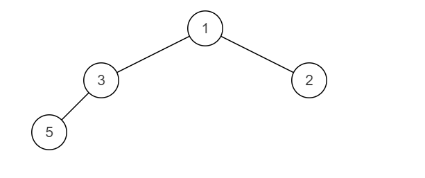

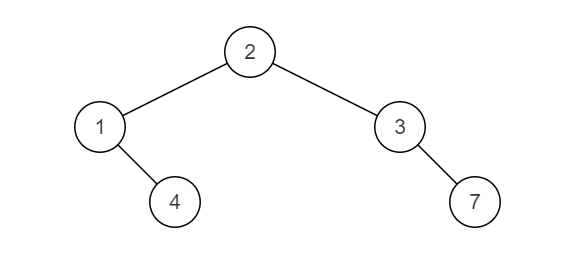

合并后：

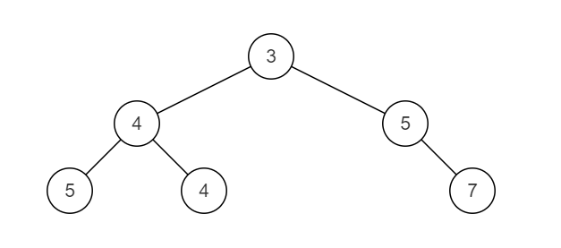

```go
// go 版本
func mergeTrees(t1,t2 * TreeNode) * TreeNode {
    if t1 == nil {
        return t2
    }else if t2 == nil{
        return t1
    }
  	// 先合并左右子树
    t1.Left = mergeTrees(t1.Left,t2.Left)
    t1.Right = mergeTrees(t1.Right,t2.Right)
    t1.Val += t2.Val
    return t1
}
```

